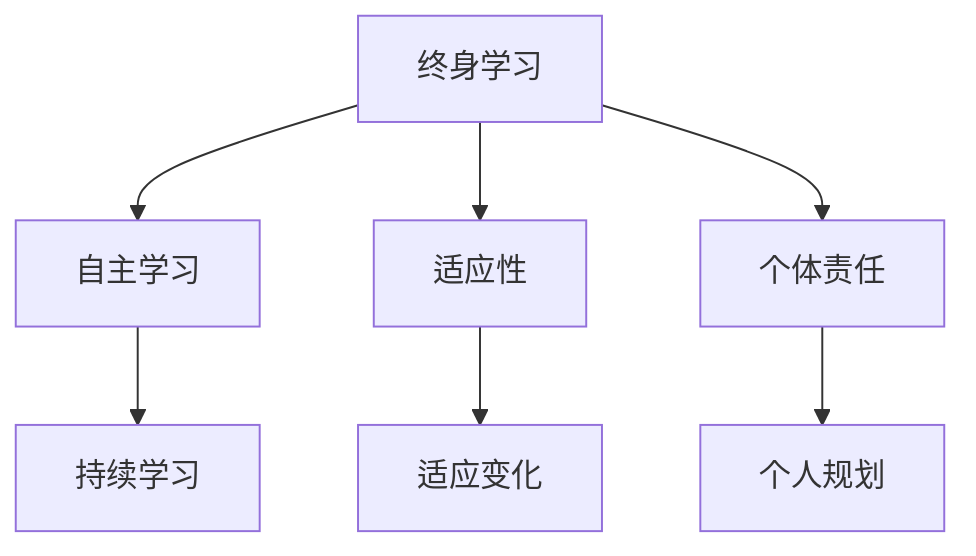
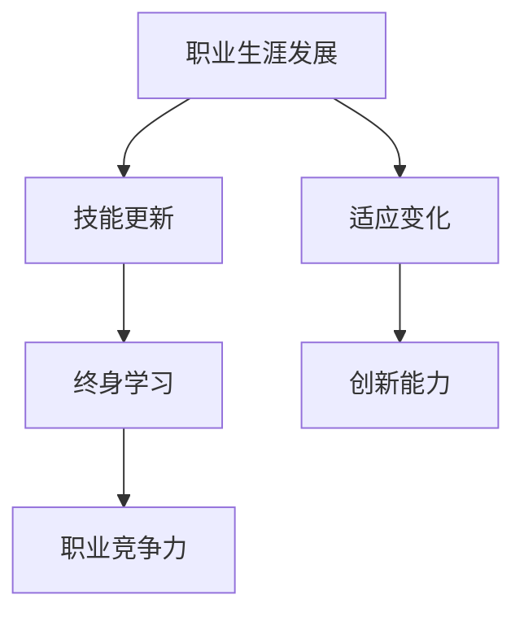
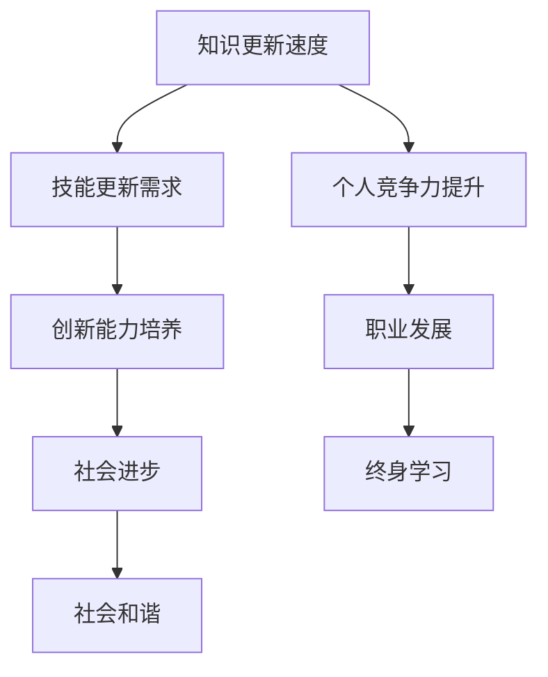

                 


### 第1章：终身学习的定义与背景

#### 1.1 终身学习的起源与发展

终身学习（Lifelong Learning）的概念最早由英国成人教育家保罗·朗格朗（Paulo Freire）提出，他在1965年的著作《成年教育的实践》中首次提出了“终身教育”的理念。此后，这一概念逐渐为全球多个国家和地区所接受和推广。终身学习的概念强调，教育是一个持续的过程，不仅仅是学生在学校里的学习，而应该贯穿人的一生。

#### 1.1.1 从终身学习到终身教育

终身教育（Lifelong Education）是终身学习的早期形态，主要强调教育的连续性和全面性。终身教育认为，教育应该从摇篮到坟墓，覆盖人的一生，不仅仅包括正规教育，还包括非正规教育和非正式教育。终身教育更加强调个人在社会生活中的自我导向学习。

#### 1.1.2 终身学习的发展历程

20世纪60年代，终身教育理念开始在欧美国家普及。1972年，联合国教科文组织发表《学会生存》报告，正式提出了“终身学习”的概念。90年代，终身学习被纳入联合国教科文组织的战略规划。21世纪初，终身学习成为全球教育改革的重要方向。中国也在《国家中长期教育改革和发展规划纲要（2010-2020年）》中明确提出，要构建终身教育体系，形成全民学习、终身学习的学习型社会。

#### 1.2 终身学习的核心要素

终身学习强调以下几个核心要素：

**1.2.1 自主学习**

终身学习鼓励个人主动参与学习过程，培养自主学习的意识和能力。自主学习不仅包括学习新知识，还包括自我管理和自我激励。

**1.2.2 适应性**

终身学习要求个体能够适应快速变化的环境和知识领域，不断提升自己的能力。这需要个人具备较强的适应性和灵活性。

**1.2.3 个体责任**

终身学习强调个人对自己学习和发展的责任，需要个人主动规划和执行学习计划。个体责任是实现终身学习的关键。

#### 1.3 终身学习的意义与价值

终身学习对个人和社会具有深远的意义和价值：

**1.3.1 提升个人竞争力**

终身学习使个人能够不断掌握新知识和技能，提升职业竞争力。在知识经济时代，个人拥有持续学习的能力，才能适应不断变化的社会需求。

**1.3.2 促进社会进步**

终身学习能够提升整个社会的知识水平和创新能力，推动社会进步。一个具有终身学习意识和能力的群体，将拥有更强的创新能力和竞争力。

**1.3.3 增强社会和谐**

终身学习有助于减少社会阶层差距，增强社会和谐与稳定。通过终身学习，人们可以提升自己的生活质量，减少社会不平等。

### 图1.1 终身学习的核心概念联系架构



### 第2章：现代社会对终身学习的需求

#### 2.1 信息时代的知识更新速度

在信息爆炸的时代，知识的更新速度前所未有。据统计，人类在过去30年的知识总量超过了过去几千年的总和。这种知识更新的速度，给个人和社会带来了巨大的挑战。

**2.1.1 信息爆炸对知识更新的影响**

信息技术的快速发展，尤其是互联网和移动设备的普及，使得知识的传播速度大幅提高。人们可以通过互联网快速获取各种信息，但同时，信息的过载也成为一个问题。

**2.1.2 终身学习的重要性**

终身学习成为应对知识更新的必要手段。通过终身学习，个人可以不断获取新知识，保持自己的竞争力。同时，终身学习也有助于个人适应快速变化的环境。

#### 2.2 职业生涯发展与技能更新的必要性

随着技术的不断进步，许多职业领域对技能的要求也在不断变化。传统的职业技能已经无法满足现代社会的需求。

**2.2.1 技术进步对职业生涯的影响**

技术进步导致了许多新职业的出现，同时也使一些传统职业面临淘汰。例如，人工智能和自动化技术的兴起，使得许多传统制造业岗位面临失业风险。

**2.2.2 技能更新的必要性**

为了适应这种变化，个人需要不断更新自己的技能。这包括学习新的技术和知识，以及提升自己的适应能力和创新能力。

**2.2.3 终身学习在职业生涯发展中的作用**

终身学习不仅可以帮助个人提升技能，还可以帮助个人规划自己的职业生涯。通过终身学习，个人可以更好地适应职场的变化，提高自己的职业竞争力。

### 图2.1 职业生涯发展与技能更新



### 总结

终身学习是现代社会不可或缺的一部分。随着信息时代的到来，知识更新速度加快，职业生涯发展对技能的要求不断提高。终身学习不仅可以帮助个人提升竞争力，还可以促进社会进步和增强社会和谐。因此，终身学习成为每个人都需要认真对待的重要任务。

### 图2.2 现代社会对终身学习的需求



### 伪代码示例：信息获取与处理

```python
# 定义一个函数，用于获取最新的技术文章
def get_technical_articles():
    # 从互联网获取最新技术文章
    articles = internet.get_latest_articles()
    return articles

# 定义一个函数，用于处理获取到的技术文章
def process_articles(articles):
    # 对获取到的文章进行筛选和分类
    filtered_articles = []
    for article in articles:
        if is_relevant(article):
            filtered_articles.append(article)
    
    # 对筛选后的文章进行学习
    for article in filtered_articles:
        learn_from_article(article)

# 定义一个函数，用于判断文章是否与个人兴趣相关
def is_relevant(article):
    # 根据文章标题和内容进行判断
    return "AI" in article.title or "Machine Learning" in article.title

# 定义一个函数，用于从文章中学习新知识
def learn_from_article(article):
    # 根据文章内容进行学习
    content = article.content
    # 假设文章内容是一个列表，其中包含多个知识点
    knowledge_points = content.knowledge_points
    for point in knowledge_points:
        understand_knowledge_point(point)

# 定义一个函数，用于理解某个知识点
def understand_knowledge_point(point):
    # 根据知识点的类型进行学习
    if is_technical(point):
        learn_technical_point(point)
    else:
        learn_conceptual_point(point)

# 定义一个函数，用于判断知识点是否为技术点
def is_technical(point):
    return "code" in point or "algorithm" in point

# 定义一个函数，用于学习技术点
def learn_technical_point(point):
    # 根据技术点的类型进行学习
    if is_algorithm(point):
        learn_algorithm(point)
    else:
        learn_framework(point)

# 定义一个函数，用于判断知识点是否为算法
def is_algorithm(point):
    return "algorithm" in point

# 定义一个函数，用于学习算法
def learn_algorithm(point):
    # 根据算法的描述进行学习
    algorithm_description = point.algorithm_description
    # 假设算法描述是一个列表，其中包含算法的各个步骤
    steps = algorithm_description.steps
    for step in steps:
        understand_step(step)

# 定义一个函数，用于理解算法的某个步骤
def understand_step(step):
    # 根据步骤的描述进行学习
    step_description = step.description
    # 假设步骤描述是一个列表，其中包含步骤的各个要素
    elements = step_description.elements
    for element in elements:
        understand_element(element)

# 定义一个函数，用于学习某个技术框架
def learn_framework(point):
    # 根据框架的描述进行学习
    framework_description = point.framework_description
    # 假设框架描述是一个列表，其中包含框架的各个组成部分
    components = framework_description.components
    for component in components:
        understand_component(component)

# 主函数，用于执行学习过程
def main():
    articles = get_technical_articles()
    process_articles(articles)

# 调用主函数，开始学习过程
main()
```

### LaTeX公式：信息过载与终身学习的关系

$$
\text{Information Overload} \xrightarrow{\text{Lifelong Learning}} \text{Competitive Advantage}
$$

### 举例说明：如何在工作中应用终身学习

李华是一名软件工程师，他一直在关注最新的技术趋势。每当有新的技术出现，他会通过以下步骤进行学习：

1. **获取信息**：李华会通过技术博客、专业论坛和社交媒体等渠道获取最新的技术文章。
2. **筛选信息**：他使用关键词过滤技术文章，只关注与他的职业和兴趣相关的文章。
3. **学习技术**：他会仔细阅读技术文章，理解其中的概念、算法和技术框架。
4. **实践应用**：他会尝试将这些新知识应用到实际工作中，解决实际问题。
5. **反馈与改进**：通过实践，他会发现自己在某些方面的不足，并针对性地进行改进。

李华的这种终身学习的方式，使他在工作中始终保持竞争力，并不断提升自己的技能水平。

### 总结

信息时代的到来，使得知识更新速度加快，职业生涯发展对技能的要求不断提高。终身学习成为应对这些挑战的必要手段。通过终身学习，个人可以不断提升自己的竞争力，适应快速变化的社会需求。同时，终身学习也有助于促进社会进步和增强社会和谐。因此，每个人都应该重视终身学习，将其作为自己生活的一部分。

### 附录：终身学习资源推荐

**A.1 在线学习平台介绍**

- Coursera（https://www.coursera.org/）
- edX（https://www.edx.org/）
- Udemy（https://www.udemy.com/）

**A.2 经典学习书籍推荐**

- 《深度学习》（Ian Goodfellow、Yoshua Bengio、Aaron Courville 著）
- 《人工智能：一种现代的方法》（Stuart Russell、Peter Norvig 著）
- 《代码大全》（Steve McConnell 著）

**A.3 学习工具与应用指南**

- Notion（https://www.notion.so/）
- Evernote（https://www.evernote.com/）
- Anki（https://apps.ankiweb.net/）

### 附录B：终身学习相关网站与资源链接

- 联合国教科文组织终身学习网站（https://en.unesco.org/lifelong-learning）
- 中国终身学习网（http://www.llsn.cn/）
- 网易云课堂（https://study.163.com/）

### 附录C：终身学习中的障碍与挑战

**C.1 时间管理与平衡**

在终身学习过程中，时间管理是一个重要的挑战。个人需要平衡工作、生活和学习的需求。以下是一些建议：

- **制定学习计划**：根据个人时间安排，制定合理的学习计划，确保学习时间得到充分利用。
- **优先级排序**：确定学习任务的优先级，确保最重要和紧急的任务得到优先处理。
- **利用碎片时间**：利用通勤、休息等碎片时间进行学习，提高学习效率。

**C.2 学习资源获取的障碍**

终身学习需要丰富的学习资源，但获取这些资源可能面临一些障碍：

- **语言障碍**：一些高质量的学习资源可能只有英文版本，这要求学习者具备一定的英语水平。
- **付费资源**：一些优秀的在线学习平台和书籍可能需要付费，这可能会给一些学习者带来经济压力。
- **资源分散**：网络上有大量的学习资源，但质量参差不齐，学习者需要花费时间筛选和评估。

**C.3 学习动机与持续性的保持**

保持学习动机和持续性是终身学习的另一个挑战。以下是一些建议：

- **设定明确的目标**：设定具体的学习目标，使学习过程更有方向和动力。
- **寻找学习伙伴**：与志同道合的人一起学习，相互鼓励和支持，提高学习兴趣。
- **定期评估与反馈**：定期评估自己的学习成果，获取反馈，调整学习策略。

### 附录D：终身学习的未来趋势

**D.1 数字化技术在终身学习中的应用**

随着数字化技术的发展，终身学习将更加便捷和高效。以下是一些数字化技术在终身学习中的应用趋势：

- **在线教育平台**：在线教育平台将更加普及，提供丰富多样的学习资源和课程。
- **人工智能辅导**：人工智能技术将应用于个性化学习辅导，根据学习者的特点提供定制化的学习建议。
- **虚拟现实与增强现实**：虚拟现实和增强现实技术将提供沉浸式的学习体验，提高学习效果。

**D.2 人工智能与终身学习**

人工智能（AI）将在终身学习中发挥重要作用，包括：

- **智能学习系统**：AI系统可以根据学习者的行为和表现，自动调整学习内容和进度。
- **智能评估**：AI技术可以对学习成果进行智能评估，提供详细的反馈和改进建议。
- **智能推荐**：AI算法可以根据学习者的兴趣和学习历史，推荐合适的学习资源和课程。

**D.3 未来终身学习的发展方向**

未来的终身学习将更加注重：

- **终身学习体系的建设**：建立完善的终身学习体系，确保每个人都能有机会进行终身学习。
- **跨学科整合**：终身学习将更加注重跨学科整合，培养复合型人才。
- **全球合作**：全球范围内的合作和资源共享，将推动终身学习的发展。

### 附录E：终身学习相关研究和论文推荐

- Anderson, T., & Dron, J. (2011). Three generations of distance education pedagogy. International Review of Research in Open and Distributed Learning, 12(3), 80-97.
- Siemens, G. (2005). Connectivism: A learning theory for the digital age. International Journal of Educational Technology in Higher Education, 2(1), 5-10.
- Bishop, A. (2012). How digital learning platforms are reshaping the future of education. The International Review of Research in Open and Distributed Learning, 13(3), 202-223.

### 附录F：终身学习中的最佳实践与注意事项

- **最佳实践**：设定明确的学习目标，制定合理的学习计划，保持学习动力和持续性。
- **注意事项**：合理分配学习时间，避免信息过载，选择优质的学习资源，与同伴进行学习交流。

### 附录G：拓展阅读

- 《终身学习：未来社会的关键》（赵鑫 著）
- 《人工智能时代的终身学习》（陈炜 著）
- 《学习之道：如何成为一个持续学习者》（斯科特·扬 著）

### 作者信息

作者：AI天才研究院/AI Genius Institute & 禅与计算机程序设计艺术/Zen And The Art of Computer Programming

