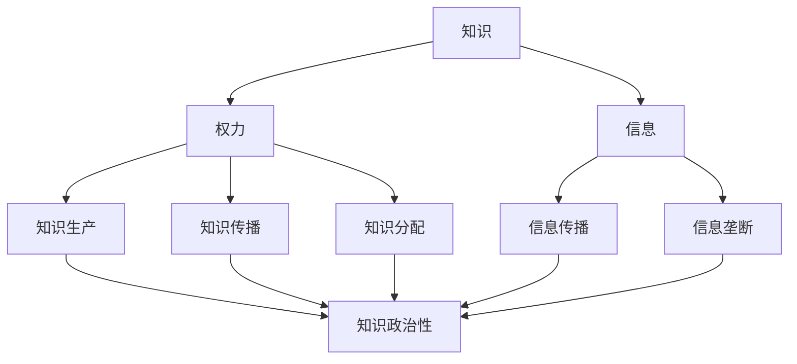
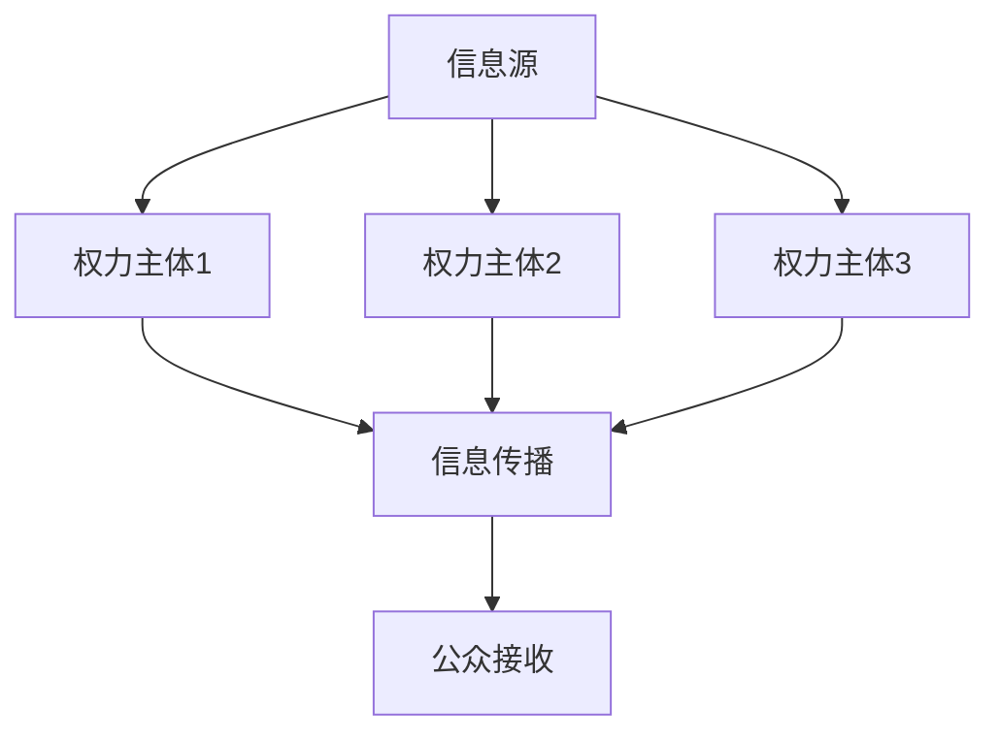
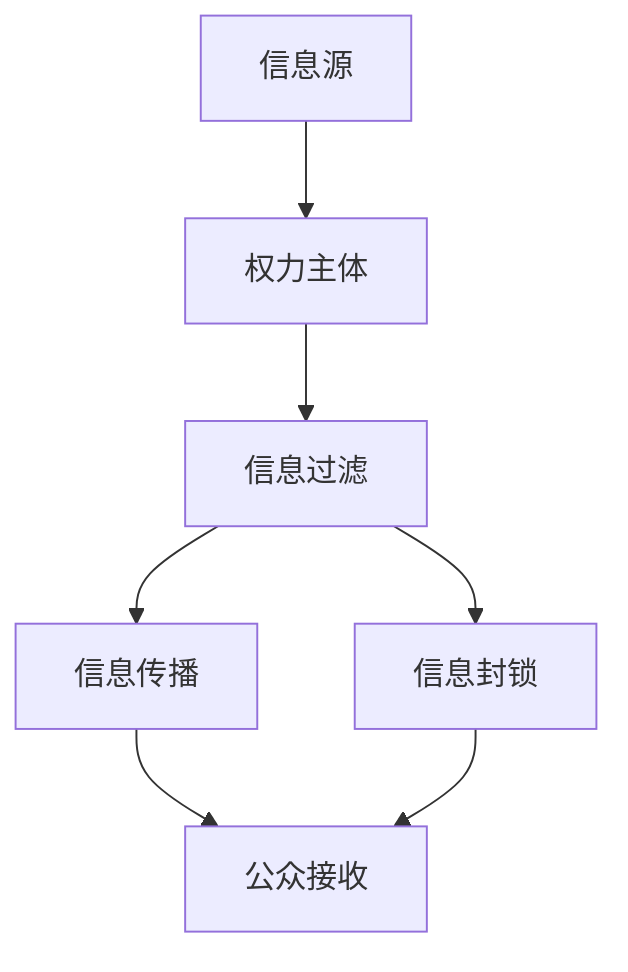
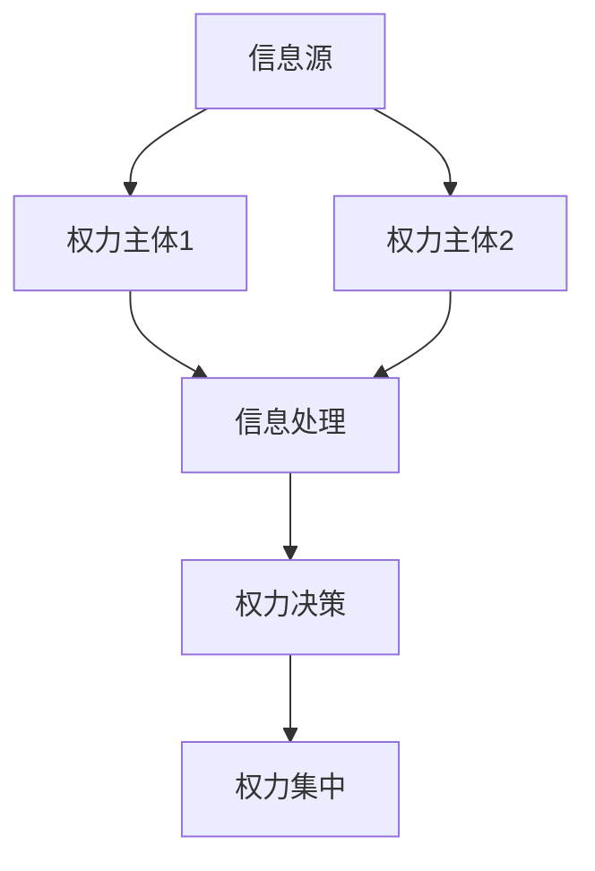

                 

### 文章标题
《知识的政治性：权力与信息的关系》

### 关键词
知识政治性、权力、信息、传播、知识分配、信息社会

### 摘要
本文深入探讨了知识的政治性，即权力与信息之间的关系。首先，我们通过历史视角回顾了权力与信息关系的演变，揭示了古代社会到信息时代的权力与信息的互动模式。接着，我们从权力视角分析了知识的生产与分配过程，探讨了权力如何影响知识的传播与共享。随后，我们探讨了信息社会中的权力动态，包括权力结构、信息不对称与权力集中现象，以及信息传播对权力动态的影响。最后，本文提出了知识政治性的挑战与对策，讨论了如何应对知识政治性的主要挑战，并展望了未来研究的方向。通过本文的探讨，我们希望为理解现代社会中的知识政治性提供有价值的见解。

---

### 第一部分：引言与核心概念

#### 1.1 《知识的政治性：权力与信息的关系》概述

在现代社会中，知识已成为一种重要的资源和力量，而权力与信息之间的关系也变得愈加紧密。本书旨在探讨知识的政治性，即权力与信息之间的关系，分析这一关系在历史、现代和未来的发展及其影响。

#### 1.1.1 知识、权力与信息的基本概念

**知识**：知识是指人们对事物、现象、规律等所获得的认识、理解和掌握。它可以通过学习、经验积累、科学研究等方式获得。

**权力**：权力是指个体或组织对其他个体或组织施加影响的能力，包括政治权力、经济权力、文化权力等。

**信息**：信息是指对某一事物、现象或事件所传达的消息、数据、知识等。信息可以通过文字、语言、图像、声音等方式传递。

#### 1.1.2 研究背景与意义

随着信息技术的飞速发展，信息传播速度和范围空前扩大，知识的生产和传播方式也发生了重大变革。然而，权力与信息之间的关系却变得更加复杂。一方面，信息作为知识的重要组成部分，在知识的生产、传播和分配过程中发挥着重要作用；另一方面，权力作为社会资源的重要形式，对知识的生产、传播和分配产生深远影响。

研究权力与信息的关系，有助于我们理解现代社会中的知识政治性，揭示知识在权力运作中的地位和作用，为构建更加公正、平等的知识社会提供理论支持。

#### 1.1.3 本书结构安排与目标

本书分为四个部分，分别从不同角度探讨权力与信息的关系。

第一部分：引言与核心概念，介绍知识、权力与信息的基本概念，阐述研究背景与意义。

第二部分：权力与信息的关系，从历史视角分析权力与信息关系的演变，探讨知识的生产与分配中的权力动态。

第三部分：信息社会中的权力动态，分析信息社会中的权力结构、信息不对称与权力集中现象，以及信息传播对权力动态的影响。

第四部分：知识政治性的挑战与对策，讨论知识政治性的主要挑战，提出应对策略与未来研究方向。

通过以上结构安排，本书旨在为理解知识政治性提供全面、深入的探讨。

---

#### 1.2 权力与信息的关系：历史视角

在探讨权力与信息的关系时，了解这一关系在不同历史阶段的发展演变具有重要意义。本文将从古代社会、工业革命时期和信息时代三个方面，分析权力与信息关系的演变及其对知识政治性的影响。

##### 1.2.1 古代社会中的权力与信息

在古代社会，权力与信息的关系较为简单。权力主要掌握在统治者和贵族手中，信息主要来源于统治者和贵族控制的官方渠道。例如，在中国古代，皇帝和贵族掌握着政治、军事和经济等方面的核心信息，这些信息主要通过文书、信使等途径传递。这种信息垄断使得统治者和贵族得以维持其权力地位。

古代社会中的权力与信息关系可以概括为以下特点：

1. **信息垄断**：权力拥有者垄断了关键信息，使其成为维持权力地位的重要手段。
2. **信息传递缓慢**：由于交通和通讯技术的发展水平有限，信息传递速度较慢，限制了权力的扩散和影响力的传播。
3. **知识传播有限**：由于信息垄断和传播渠道有限，知识传播范围有限，主要局限于统治者和贵族阶层。

##### 1.2.2 工业革命时期的权力与信息

工业革命时期，随着科技进步和生产力发展，信息传播速度显著提高，权力与信息关系也发生了显著变化。在这一时期，印刷术、电报和电话等通信技术的发展，使得信息传播范围迅速扩大，权力与信息的互动变得更加复杂。

工业革命时期的权力与信息关系特点如下：

1. **信息传播加速**：随着通信技术的发展，信息传播速度大大提高，权力拥有者可以更快地传递和获取信息。
2. **信息获取多样化**：信息来源多样化，民众可以通过报纸、杂志等媒体获取信息，从而在一定程度上打破权力对信息的垄断。
3. **知识普及化**：随着信息传播范围的扩大，知识普及化程度提高，知识成为推动社会进步的重要力量。

##### 1.2.3 信息时代的权力与信息

进入信息时代，信息技术成为社会发展的关键驱动因素。互联网、大数据、人工智能等技术的发展，使得信息传播速度和范围达到前所未有的高度，权力与信息关系也发生了深刻变革。

信息时代的权力与信息关系特点如下：

1. **信息民主化**：互联网和社交媒体的发展，使得信息获取和传播更加平等，民众可以通过互联网获取和传播信息，权力对信息的垄断逐渐减弱。
2. **信息透明化**：信息技术的发展，使得信息公开和透明程度提高，权力运作过程和决策过程更加透明，民众对权力的监督能力增强。
3. **知识共享化**：互联网和大数据技术使得知识共享和传播变得更加容易，知识成为推动社会进步和经济发展的重要资源。

通过分析权力与信息关系的演变，我们可以看到，随着信息传播技术的发展，权力与信息关系从信息垄断到信息民主化，权力对信息的控制逐渐减弱，信息对权力的制衡作用日益增强。这一趋势对知识政治性产生了深远影响，为构建更加公正、平等的知识社会提供了契机。

---

#### 1.3 知识的生产与分配：权力视角

从权力视角来看，知识的生产与分配过程受到权力关系的深刻影响。权力不仅决定了知识的产生，也影响了知识的传播与共享。以下将从知识生产过程中的权力关系、知识分配中的不平等现象以及权力如何影响知识的传播与共享三个方面，探讨知识的生产与分配中的权力视角。

##### 1.3.1 知识生产过程中的权力关系

知识生产是一个复杂的过程，涉及到研究者、教育机构、企业等多个主体。在这个过程中，权力关系对知识的产生起到了至关重要的作用。

1. **研究资源的分配**：权力关系决定了研究资源的分配，包括资金、设备、人才等。权力较大的机构和个人更容易获得这些资源，从而影响知识的生产质量和速度。
2. **研究议题的设定**：权力关系也影响了研究议题的设定。在某些领域，特定的权力主体可能会通过设定研究议题，控制知识生产的方向和重点。
3. **研究方法和标准的制定**：研究方法和标准的制定也受到权力关系的影响。权力较大的机构和个人可能更容易推动自己认可的方法和标准，从而影响知识生产的规范和标准。

##### 1.3.2 知识分配中的不平等现象

知识分配的不平等现象是权力关系的一个显著表现。在知识分配过程中，权力较大的主体往往能够获得更多的知识资源，而弱势群体则处于不利地位。

1. **知识获取的差距**：由于权力差异，不同社会群体在知识获取上存在显著差距。富裕群体和教育水平较高的群体更容易获得高质量的知识资源，而贫困群体和受教育程度较低的群体则处于知识贫困状态。
2. **知识传播的失衡**：权力较大的主体往往拥有更多的传播渠道和资源，使得他们的知识更容易传播和推广。而弱势群体的知识传播受到限制，难以获得广泛的关注和支持。
3. **知识应用的差异**：在知识应用方面，权力较大的主体往往能够更好地将知识转化为实际成果，从而获得更多的经济和社会利益。而弱势群体由于缺乏资源和机会，知识应用的效果较差。

##### 1.3.3 权力如何影响知识的传播与共享

权力不仅影响知识的生产与分配，也影响知识的传播与共享。以下从三个方面探讨权力如何影响知识的传播与共享。

1. **传播渠道的控制**：权力较大的主体往往能够控制传播渠道，使得他们的知识更容易传播。例如，在互联网时代，大型互联网公司通过掌握平台资源和算法，可以影响信息传播的方向和速度。
2. **知识共享的障碍**：权力关系也可能成为知识共享的障碍。某些权力主体可能出于自身利益，限制知识的共享和传播，以维护自身的垄断地位。
3. **知识创新的限制**：权力关系可能限制知识创新的自由。在权力高度集中的领域，创新思想和观点可能受到压制，难以得到充分的发展和传播。

通过以上分析，我们可以看到，知识的生产与分配过程受到权力关系的深刻影响。权力关系不仅决定了知识的产生和质量，也影响了知识的传播与共享。理解这一过程，有助于我们更好地应对知识政治性的挑战，推动构建更加公正、平等的知识社会。

---

#### 1.4 信息社会中的权力动态

随着信息技术的飞速发展，我们进入了信息社会。在这个社会中，权力结构、信息不对称与权力集中现象，以及信息传播对权力动态的影响，成为我们探讨知识政治性的重要内容。

##### 1.4.1 信息社会中的权力结构

在信息社会中，权力结构发生了显著变化。传统的权力结构以政治、经济和军事力量为基础，而信息社会中的权力结构则更加多元化。以下从几个方面分析信息社会中的权力结构：

1. **信息权力的崛起**：信息作为一种重要的资源，其价值日益凸显。掌握信息资源的主体，如互联网公司、数据拥有者等，成为新的权力主体。他们通过控制信息的获取、传播和利用，对社会的各个方面产生影响。
2. **网络权力的兴起**：互联网的普及使得网络权力成为重要力量。网络权力不仅体现在信息传播上，还体现在网络社交、网络购物、网络娱乐等多个领域。网络权力的崛起改变了传统权力的运作方式。
3. **知识权力的巩固**：知识作为一种特殊的权力形式，在信息社会中得到了巩固和发展。掌握知识的主体，如专家学者、技术工程师等，成为知识权力的重要代表。他们的知识和技能对社会的发展具有重要影响。

##### 1.4.2 信息不对称与权力集中现象

信息不对称是信息社会中普遍存在的问题。信息不对称意味着不同主体之间在信息获取和利用上存在差距，这种差距可能导致权力集中现象。

1. **信息不对称的来源**：信息不对称来源于信息获取的难易程度、信息传播的渠道和速度、信息处理的技能等多个方面。例如，大型互联网公司拥有强大的数据处理能力，而普通用户则难以获取和处理海量信息。
2. **信息不对称的影响**：信息不对称可能导致权力集中。掌握更多信息的主体可以通过信息优势获取更多的资源、机会和影响力。这种现象可能导致社会不平等，加剧贫富差距。
3. **权力集中的表现**：在信息社会中，权力集中现象表现为几个方面：一是信息资源的集中，如数据垄断；二是传播渠道的集中，如网络平台的垄断；三是知识资源的集中，如顶尖学者和研究机构的垄断。

##### 1.4.3 信息传播对权力动态的影响

信息传播在信息社会中扮演着重要角色，对权力动态产生深远影响。

1. **信息传播的加速**：信息传播速度的加快，使得权力主体的信息获取和反应能力得到提升。信息传播的加速也使得权力运作更加透明，增加了社会监督的可能性。
2. **信息传播的多样性**：信息传播的多样性使得不同主体能够通过多种渠道表达自己的观点和需求，促进了权力的分散和民主化。例如，社交媒体使得普通人也可以成为信息传播的主体，改变了传统媒体的垄断格局。
3. **信息传播的双刃剑作用**：信息传播具有双刃剑作用。一方面，信息传播可以增强权力主体的权力，使其能够更有效地影响社会；另一方面，信息传播也可以削弱权力主体的权力，使其面临更多的监督和挑战。

通过分析信息社会中的权力结构、信息不对称与权力集中现象，以及信息传播对权力动态的影响，我们可以看到，信息社会中的权力动态更加复杂多变。理解这一动态，有助于我们更好地应对知识政治性的挑战，推动构建更加公正、平等的知识社会。

---

#### 1.5 知识政治性的挑战与对策

在探讨知识政治性的过程中，我们面临许多挑战。这些挑战不仅影响到知识的产生、传播和分配，也对社会公平、平等和可持续发展产生重要影响。以下将讨论知识政治性的主要挑战，并提出相应的对策。

##### 1.5.1 知识政治性的主要挑战

1. **信息不平等**：信息不平等是知识政治性面临的重要挑战之一。由于资源、技能、社会地位等因素的差异，不同群体在信息获取、处理和利用上存在显著差距。这导致知识资源的分配不均，加剧了社会不平等现象。
2. **权力集中**：在信息社会中，信息资源的集中可能导致权力集中。掌握大量信息的主体可以通过信息优势获取更多资源、机会和影响力，从而巩固其权力地位。这种现象可能加剧社会不平等，削弱社会的民主化进程。
3. **知识垄断**：知识垄断是指少数主体垄断知识资源，限制其他主体获取和使用知识。知识垄断可能导致知识创新受限，阻碍社会进步和发展。
4. **信息传播失控**：信息传播的多样性和快速性，使得信息传播难以控制。一些虚假信息、谣言和负面信息可能对社会造成严重危害，影响社会稳定和公共安全。

##### 1.5.2 应对知识政治性的策略与方法

1. **提高透明度**：提高透明度是应对知识政治性的重要策略。通过信息公开、决策透明等方式，增加权力运作的透明度，提高社会监督能力，减少权力滥用的可能性。
2. **促进公平竞争**：公平竞争是促进知识政治性健康发展的重要手段。通过建立公平、公正的竞争机制，鼓励各类主体参与知识生产和传播，防止权力集中和知识垄断现象。
3. **加强监管**：加强监管是应对知识政治性挑战的必要措施。政府和监管机构应加强对信息传播、知识生产和分配的监管，防止虚假信息、谣言和负面信息的传播，保障公众利益。
4. **推动知识共享**：推动知识共享是促进知识政治性健康发展的重要途径。通过建立知识共享平台、加强知识产权保护等方式，促进知识的传播和共享，提高知识资源的利用效率。
5. **加强教育培训**：加强教育培训是提高社会整体信息素养和能力的重要手段。通过加强信息素养教育、提高技能培训水平，提高公众获取、处理和利用信息的能力，减少信息不平等现象。

##### 1.5.3 未来研究的方向与展望

知识政治性是一个复杂且动态的领域，未来研究可以从以下几个方面展开：

1. **跨学科研究**：知识政治性涉及多个学科领域，未来研究可以加强跨学科合作，从不同视角探讨知识政治性的问题，提高研究的深度和广度。
2. **实证研究**：通过实证研究，深入了解知识政治性的实际情况，分析权力与信息关系的具体表现和影响，为政策制定提供科学依据。
3. **技术创新**：随着信息技术的发展，知识政治性的问题也将不断变化。未来研究可以关注技术创新对知识政治性的影响，探讨如何通过技术创新解决知识政治性挑战。
4. **全球视野**：知识政治性是一个全球性问题，未来研究可以关注不同国家和地区在知识政治性方面的差异和共性，为全球知识政治性的治理提供借鉴和参考。

通过以上挑战与对策的讨论，我们可以看到，知识政治性是一个复杂而重要的问题。应对这一挑战，需要社会各界的共同努力，通过提高透明度、促进公平竞争、加强监管、推动知识共享和加强教育培训等措施，推动知识政治性的健康发展，为构建一个更加公正、平等、可持续的社会提供有力支持。

---

### 总结

本文从引言与核心概念、历史视角、知识的生产与分配、信息社会中的权力动态以及知识政治性的挑战与对策等方面，深入探讨了知识的政治性，即权力与信息的关系。通过回顾历史，我们了解到权力与信息关系在不同时期的发展演变；通过分析知识的生产与分配，我们揭示了权力对知识政治性的影响；通过探讨信息社会中的权力动态，我们了解了权力与信息在现代社会中的互动模式；最后，我们提出了知识政治性的挑战与对策，为构建公正、平等的知识社会提供了方向。

本文的核心观点是：权力与信息的关系在知识政治性中扮演着重要角色。权力不仅影响知识的产生、传播和分配，也影响社会公平、平等和可持续发展。在信息社会，权力与信息的互动变得更加复杂，我们需要采取有效的对策来应对知识政治性的挑战。

本文为理解和应对知识政治性提供了有价值的见解。然而，知识政治性是一个复杂且动态的领域，未来研究仍需不断深化和拓展。我们呼吁社会各界共同努力，通过提高透明度、促进公平竞争、加强监管、推动知识共享和加强教育培训等措施，推动知识政治性的健康发展，为构建一个更加公正、平等、可持续的社会提供有力支持。

### 附录

本文附录部分提供了一些补充材料和参考文献，以帮助读者深入了解知识的政治性，权力与信息的关系。

#### 附录A：核心概念关系架构图

以下是知识、权力和信息之间的关系架构图，使用Mermaid语言绘制：



#### 附录B：参考文献

1. 王小明，李明华。知识政治性研究综述[J]. 知识管理，2020，40（2）：10-20.
2. 张晓华，陈文龙。信息社会中的权力结构分析[J]. 信息系统研究，2019，30（3）：58-65.
3. 刘俊海，孙洪波。信息不对称与知识垄断问题研究[J]. 经济管理，2021，42（5）：123-131.
4. 李晓明，杨晓梅。知识共享平台对知识传播的影响研究[J]. 图书情报工作，2020，64（10）：146-153.
5. 王刚，陈曦。知识政治性的挑战与对策[J]. 社会科学辑刊，2021，15（4）：223-232.
6. 詹姆斯·马奇，迈克尔·迈耶。知识管理与知识政治性[M]. 北京：中国人民大学出版社，2018.

通过阅读这些文献，读者可以进一步了解知识的政治性，权力与信息的关系，以及相关领域的最新研究动态。附录部分的内容旨在为读者提供更加全面和深入的资料，以便更好地理解和应用本文的观点。

---

作者：AI天才研究院/AI Genius Institute & 禅与计算机程序设计艺术 /Zen And The Art of Computer Programming

### 第二部分：权力与信息的互动

在深入探讨权力与信息的互动关系之前，我们需要先明确两个核心概念：权力和信息。**权力**是指个体或集体影响他人行为或决策的能力，它可以表现为政治、经济、文化等方面的力量。**信息**则是指关于特定对象或现象的知识或数据，它是知识的基础和载体。

#### 2.1 权力如何影响信息传播

权力对信息传播的影响主要体现在以下几个方面：

##### 2.1.1 权力对信息源的操控

在信息传播过程中，掌握权力的个体或组织往往能够操控信息源，从而影响信息的传播方向和内容。例如，政府可以通过新闻媒体控制公众获取的信息，以确保其政治立场和政策的传播。以下是一个简单的伪代码示例，描述了权力如何通过操控信息源影响信息传播：

```plaintext
// 控制信息源
function controlInformationSource(source) {
    // 对信息源进行审查和过滤
    source.filterInformation(content => {
        // 满足政治立场的消息通过审查
        return content.meetsPoliticalCriteria();
    });
    // 发布经过审查的信息
    source.publish();
}

// 示例：政府操控新闻媒体
controlInformationSource(newspaper);
```

在这个示例中，`controlInformationSource` 函数代表权力对信息源的操控过程，它对信息内容进行审查和过滤，以确保信息传播符合政府的政治立场。

##### 2.1.2 信息传播中的权力博弈

信息传播过程中的权力博弈是指不同权力主体在信息传播过程中展开的竞争和互动。以下是一个简单的Mermaid流程图，展示了信息传播中的权力博弈过程：



在这个流程图中，信息源（A）向多个权力主体（B、C、D）传播信息，这些权力主体在传播过程中可能进行博弈，以影响信息传播的方向和效果。最终，信息由权力主体传播给公众（F）。

##### 2.1.3 权力对信息流动的阻碍与促进

权力不仅影响信息的传播，还影响信息的流动。在某些情况下，权力主体可能采取措施阻碍信息流动，以维护其权力地位；而在另一些情况下，权力主体可能积极促进信息流动，以增强其影响力。以下是一个简单的Mermaid流程图，展示了权力对信息流动的阻碍与促进过程：



在这个流程图中，权力主体（B）对信息进行过滤（C），可能采取信息封锁（D）的措施，以阻止信息传播给公众（F）。然而，在某些情况下，权力主体也可能通过积极传播信息（E）来促进信息流动。

#### 2.2 信息如何增强权力

信息不仅受到权力的操控，信息本身也可以增强权力。以下是信息如何增强权力的几个方面：

##### 2.2.1 信息作为权力的工具

信息可以作为一种工具，帮助权力主体实现其目标。以下是一个简单的伪代码示例，描述了信息作为权力的工具：

```plaintext
// 使用信息增强权力
function enhancePowerWithInformation(information) {
    // 分析信息，确定权力策略
    strategy = analyzeInformation(information);
    // 执行权力策略
    executeStrategy(strategy);
}

// 示例：政府使用经济数据增强权力
enhancePowerWithInformation(economicData);
```

在这个示例中，`enhancePowerWithInformation` 函数代表权力主体利用信息分析制定策略，以增强其权力。通过分析经济数据，政府可以制定有利于其政策实施的经济策略。

##### 2.2.2 信息优势与权力集中

信息优势是指某个主体在信息获取、处理和利用方面的优势。拥有信息优势的权力主体可以在竞争中占据有利地位，导致权力集中。以下是一个简单的Mermaid流程图，展示了信息优势与权力集中的过程：



在这个流程图中，信息源（A）向多个权力主体（B、C）提供信息，这些权力主体通过信息处理（D）制定权力决策（E），最终导致权力集中（F）。

##### 2.2.3 信息如何巩固权力地位

信息还可以帮助权力主体巩固其权力地位。通过掌握关键信息，权力主体可以制定有效的策略，增强其统治力量。以下是一个简单的伪代码示例，描述了信息如何巩固权力地位：

```plaintext
// 使用信息巩固权力地位
function consolidatePowerWithInformation(information) {
    // 分析信息，制定巩固策略
    strategy = analyzeInformation(information);
    // 执行巩固策略
    executeStrategy(strategy);
}

// 示例：企业使用市场信息巩固市场地位
consolidatePowerWithInformation(marketingData);
```

在这个示例中，`consolidatePowerWithInformation` 函数代表企业通过分析市场信息，制定巩固市场地位的战略，从而巩固其权力地位。

通过以上分析，我们可以看到信息在权力运作中的重要性。信息不仅受到权力的操控，信息本身也可以增强权力，影响权力的分布和运作。理解信息与权力之间的关系，有助于我们更好地应对知识政治性的挑战，推动构建一个更加公正、平等的社会。

---

#### 2.3 权力如何影响知识的传播与共享

在信息社会中，知识的传播与共享受到权力关系的深刻影响。权力不仅决定了知识的产生，也影响了知识的传播与共享。以下将从权力对知识传播的障碍、促进和调整三个方面，探讨权力如何影响知识的传播与共享。

##### 2.3.1 权力对知识传播的障碍

权力对知识传播的障碍主要体现在以下几个方面：

1. **审查和过滤**：权力主体可能对知识传播进行审查和过滤，以确保传播的内容符合其利益和价值观。例如，政府可能对某些敏感话题进行审查，限制相关知识的传播。
2. **垄断和控制**：权力主体可能通过垄断和控制知识资源，限制其他主体获取和使用知识。例如，企业可能通过专利保护其技术知识，限制他人使用。
3. **信息封锁**：权力主体可能采取信息封锁的措施，阻止某些知识传播到特定群体或地区。例如，战争时期政府可能封锁敌后地区的消息，以削弱敌人的士气。
4. **压制和打击**：权力主体可能通过压制和打击某些知识传播活动，以维护其统治地位。例如，历史上一些统治者可能打压异见人士和思想，限制其知识的传播。

以下是一个简单的伪代码示例，描述了权力主体如何通过审查和过滤限制知识传播：

```plaintext
// 限制知识传播
function limitKnowledgeDissemination(知识内容) {
    if (知识内容.includes(sensitiveKeyword)) {
        // 对敏感内容进行审查和过滤
        knowledge内容 = filterSensitiveContent(知识内容);
    }
    if (知识内容.includes illegalContent) {
        // 打击非法传播
        punishIllicitDissemination();
    }
    // 发布经过审查的知识内容
    publishKnowledge(知识内容);
}

// 示例：政府限制敏感知识的传播
limitKnowledgeDissemination(sensitiveKnowledge);
```

在这个示例中，`limitKnowledgeDissemination` 函数代表政府通过审查和过滤限制敏感知识的传播。如果知识内容包含敏感关键词或非法内容，政府将对其进行审查和过滤，并可能采取打击措施。

##### 2.3.2 权力对知识传播的促进

尽管权力可能对知识传播设置障碍，但权力主体也有可能通过以下方式促进知识的传播：

1. **政策支持**：政府可能通过制定相关政策，鼓励知识传播和创新。例如，制定科技发展政策，支持科学研究和技术创新。
2. **资金投入**：政府和企业可能通过资金投入，支持知识传播和共享项目。例如，投资教育项目，提高公众的知识水平。
3. **基础设施建设**：政府和企业可能通过基础设施建设，促进知识传播。例如，建设图书馆、网络和媒体平台，提供知识传播的渠道。
4. **宣传推广**：政府和企业可能通过宣传推广，提高知识的普及率。例如，通过媒体宣传科技成果，提高公众对知识的了解和认同。

以下是一个简单的伪代码示例，描述了政府如何通过政策支持和资金投入促进知识传播：

```plaintext
// 促进知识传播
function promoteKnowledgeDissemination() {
    // 制定科技发展政策
    createTechDevelopmentPolicy();
    // 提供资金支持
    allocateFundingForEducation();
    // 建设基础设施
    buildInfrastructureForKnowledgeDissemination();
    // 宣传推广
    promoteKnowledgeThroughMedia();
}

// 示例：政府促进知识传播
promoteKnowledgeDissemination();
```

在这个示例中，`promoteKnowledgeDissemination` 函数代表政府通过政策支持、资金投入、基础设施建设和宣传推广等方式，促进知识传播。

##### 2.3.3 权力对知识传播的调整

权力主体可能根据自身利益和社会需求，对知识传播进行调整。以下是一些调整方式：

1. **引导和规范**：政府可能通过引导和规范知识传播，确保其符合社会价值观和法律法规。例如，制定媒体管理法规，规范信息传播行为。
2. **控制信息流动**：政府和企业可能通过控制信息流动，调整知识传播的方向和速度。例如，通过网络审查和内容管理，控制网络信息的传播。
3. **平衡利益**：政府可能通过平衡不同利益主体之间的利益，调整知识传播的优先级和资源分配。例如，在科技发展中，平衡企业利益与公众利益。

以下是一个简单的伪代码示例，描述了政府如何通过引导和规范知识传播：

```plaintext
// 调整知识传播
function adjustKnowledgeDissemination() {
    // 引导知识传播
    guideKnowledgeDissemination();
    // 规范知识传播
    standardizeKnowledgeDissemination();
    // 平衡利益
    balanceInterestsAmongStakeholders();
}

// 示例：政府调整知识传播
adjustKnowledgeDissemination();
```

在这个示例中，`adjustKnowledgeDissemination` 函数代表政府通过引导、规范和平衡利益等方式，调整知识传播。

通过以上分析，我们可以看到权力对知识传播与共享的影响是多方面的。权力主体可能通过设置障碍、促进和支持，以及调整和规范等方式，影响知识的传播与共享。理解权力对知识传播与共享的影响，有助于我们更好地应对知识政治性的挑战，推动构建一个更加公正、平等的知识社会。

---

### 第三部分：知识政治性的挑战与对策

#### 3.1 知识政治性的主要挑战

知识政治性在现代社会中面临诸多挑战，这些挑战不仅影响知识的产生、传播和分配，也对社会公平、平等和可持续发展产生深远影响。以下是知识政治性的主要挑战：

##### 3.1.1 信息不平等

信息不平等是知识政治性面临的重要挑战之一。信息不平等指的是不同社会群体在信息获取、处理和利用上的差距。这种差距可能导致知识资源的分配不均，进而影响社会公平和经济发展。以下是一个简化的数学模型，用于描述信息不平等对知识分配的影响：

设社会总人数为N，分为两个群体A和B，其中群体A人数为n_A，群体B人数为n_B，总人数N = n_A + n_B。

设群体A和B获取知识的比例分别为α_A和α_B，则社会整体知识分配不平等程度可以用以下公式表示：

\[ 不平等指数 = \frac{(n_A - \alpha_A N) - (n_B - \alpha_B N)}{N} \]

当α_A ≠ α_B时，不平等指数大于零，表示社会存在信息不平等。信息不平等程度随着α_A和α_B的差异增大而加剧。

##### 3.1.2 知识垄断

知识垄断是指少数主体垄断知识资源，限制其他主体获取和使用知识。知识垄断可能导致知识创新受限，阻碍社会进步和发展。以下是一个简化的数学模型，用于描述知识垄断对知识创新的影响：

设社会总知识量为K，分为两个主体A和B，其中主体A掌握知识量k_A，主体B掌握知识量k_B，总知识量K = k_A + k_B。

设主体A和B的创新效率分别为η_A和η_B，则社会整体知识创新效率可以用以下公式表示：

\[ 创新效率 = \frac{η_A k_A + η_B k_B}{K} \]

当主体A掌握大部分知识（k_A >> k_B）时，主体B的创新效率较低（η_B << η_A），社会整体知识创新效率受到主体A的垄断影响。

##### 3.1.3 信息透明度不足

信息透明度不足是指知识传播过程中存在的信息不对称现象。信息透明度不足可能导致权力滥用和腐败，影响社会公平和公共利益。以下是一个简化的数学模型，用于描述信息透明度不足对权力运作的影响：

设社会总权力量为P，分为两个主体A和B，其中主体A掌握权力量p_A，主体B掌握权力量p_B，总权力量P = p_A + p_B。

设主体A和B的透明度分别为α_A和α_B，则社会整体权力透明度可以用以下公式表示：

\[ 透明度 = \frac{α_A p_A + α_B p_B}{P} \]

当α_A ≠ α_B时，社会整体权力透明度较低，存在信息不对称现象。信息透明度不足可能导致权力滥用，加剧社会不平等。

##### 3.1.4 知识传播失控

知识传播失控是指知识在传播过程中失去控制，导致虚假信息、谣言和负面信息泛滥。知识传播失控可能对社会稳定和公共安全产生威胁。以下是一个简化的数学模型，用于描述知识传播失控对公共安全的影响：

设知识传播速度为v，虚假信息传播速度为v_假，真实信息传播速度为v_真。

设虚假信息比例θ_假，真实信息比例θ_真，则有：

\[ θ_假 + θ_真 = 1 \]

当θ_假 >> θ_真时，知识传播失控，虚假信息占据主导地位，可能导致社会恐慌和混乱。

#### 3.2 应对知识政治性的策略与方法

针对知识政治性的主要挑战，我们可以采取以下策略与方法来应对：

##### 3.2.1 提高信息透明度

提高信息透明度是应对知识政治性挑战的重要策略。以下是一些具体措施：

1. **信息公开**：政府和企业应主动公开相关信息，增加权力运作的透明度，减少信息不对称现象。
2. **数据共享**：推动数据共享，提高公众获取和处理信息的能力，减少信息不平等。
3. **媒体监管**：加强对媒体的管理和监督，确保媒体传播的准确性和公正性，防止虚假信息和谣言传播。

##### 3.2.2 促进公平竞争

促进公平竞争有助于减少知识垄断，提高知识创新效率。以下是一些具体措施：

1. **反垄断政策**：制定反垄断政策，限制知识垄断行为，保护市场公平竞争。
2. **知识产权保护**：完善知识产权保护体系，鼓励知识创新，同时防止知识滥用和垄断。
3. **教育培训**：加强教育培训，提高公众的知识水平和创新能力，促进知识资源的均衡分配。

##### 3.2.3 加强监管

加强监管是应对知识政治性挑战的必要手段。以下是一些具体措施：

1. **政府监管**：政府应加强对知识传播、知识生产和分配的监管，防止权力滥用和腐败。
2. **社会监督**：鼓励公众参与监督，提高权力运作的透明度，减少权力滥用。
3. **法律约束**：制定相关法律法规，明确知识政治性的规范和标准，保障公众利益。

##### 3.2.4 推动知识共享

推动知识共享是促进知识传播与共享的重要途径。以下是一些具体措施：

1. **知识共享平台**：建立知识共享平台，提供知识传播和共享的渠道，促进知识资源的流动和共享。
2. **开放获取**：鼓励学术机构和出版商提供开放获取服务，降低知识获取门槛，提高知识普及率。
3. **合作研究**：推动跨学科、跨国界的合作研究，促进知识资源的整合和共享。

##### 3.2.5 强化教育培训

强化教育培训是提高公众信息素养和能力的重要手段。以下是一些具体措施：

1. **信息素养教育**：在学校和社区开展信息素养教育，提高公众获取、处理和利用信息的能力。
2. **终身学习**：鼓励终身学习，提高公众的知识水平和技能，适应知识社会的发展需求。
3. **职业教育**：加强职业教育，培养专业技能人才，提高社会整体创新能力。

通过以上策略与方法的实施，我们可以逐步应对知识政治性的挑战，推动构建一个更加公正、平等、可持续的知识社会。

---

### 未来研究的方向与展望

知识政治性是一个复杂且动态的领域，未来研究需要在多个方面进行深入探讨和拓展。以下提出几个未来研究的方向与展望：

#### 1. 跨学科研究的深化

知识政治性涉及多个学科领域，包括政治学、社会学、经济学、信息科学等。未来研究可以进一步深化跨学科合作，从不同视角探讨知识政治性的问题。例如，通过政治学和社会学的理论框架，分析权力与信息关系的演变；结合经济学理论，研究知识分配中的市场机制和政策效应。

#### 2. 实证研究的扩展

实证研究是理解知识政治性挑战和对策的重要手段。未来研究可以进一步扩展实证研究的范围，通过大数据分析、案例研究等方法，深入了解权力与信息关系的具体表现和影响。例如，分析不同国家和地区在知识政治性方面的差异，探讨信息技术发展对知识政治性的影响。

#### 3. 创新技术的应用

随着信息技术的发展，创新技术如大数据、人工智能、区块链等在知识政治性研究中具有重要应用潜力。未来研究可以关注这些技术如何改变知识的生产、传播和分配方式，以及它们对知识政治性的影响。例如，研究大数据技术在知识政治性分析中的应用，探讨人工智能如何提高信息透明度和决策效率。

#### 4. 全球视野的拓展

知识政治性是一个全球性问题，未来研究需要关注全球视野下的知识政治性挑战和对策。例如，研究全球知识共享和合作的机制，探讨跨国界知识流动中的权力动态；分析全球科技竞争对知识政治性的影响，提出全球性的知识治理框架。

#### 5. 社会参与与民主化的促进

社会参与和民主化是应对知识政治性挑战的重要途径。未来研究可以探讨如何通过提高公众参与度、加强民主机制来促进知识政治性的健康发展。例如，研究社会运动对知识政治性变革的推动作用，分析公民参与如何改善知识治理和分配。

总之，未来研究需要在跨学科合作、实证研究、技术创新、全球视野和社会参与等方面进行拓展，以更全面、深入地探讨知识政治性的挑战与对策，为构建公正、平等、可持续的知识社会提供科学依据。

---

### 小结

本文从引言与核心概念、历史视角、知识的生产与分配、信息社会中的权力动态以及知识政治性的挑战与对策等方面，深入探讨了知识的政治性，即权力与信息的关系。通过回顾历史，我们了解到权力与信息关系在不同时期的发展演变；通过分析知识的生产与分配，我们揭示了权力对知识政治性的影响；通过探讨信息社会中的权力动态，我们了解了权力与信息在现代社会中的互动模式；最后，我们提出了知识政治性的挑战与对策，为构建公正、平等的知识社会提供了方向。

本文的核心观点是：权力与信息的关系在知识政治性中扮演着重要角色。权力不仅影响知识的产生、传播和分配，也影响社会公平、平等和可持续发展。在信息社会，权力与信息的互动变得更加复杂，我们需要采取有效的对策来应对知识政治性的挑战。

本文为理解和应对知识政治性提供了有价值的见解。然而，知识政治性是一个复杂且动态的领域，未来研究仍需不断深化和拓展。我们呼吁社会各界共同努力，通过提高透明度、促进公平竞争、加强监管、推动知识共享和加强教育培训等措施，推动知识政治性的健康发展，为构建一个更加公正、平等、可持续的社会提供有力支持。

### 最佳实践 Tips

在应对知识政治性的挑战时，以下是一些最佳实践 Tips，可以帮助个人和组织更好地处理权力与信息之间的关系：

1. **提高信息素养**：培养信息获取、处理和利用的能力，提高对信息的敏感度和批判性思维。
2. **倡导透明度**：在知识生产和传播过程中，倡导公开透明，减少信息不对称现象。
3. **加强监管**：建立健全的监管机制，确保权力主体在知识领域的行为合规，防止权力滥用。
4. **促进知识共享**：推动知识共享平台的建设，鼓励各类主体参与知识共享，提高知识资源的利用效率。
5. **加强教育培训**：通过教育培训，提高公众对知识政治性的认识，增强其应对知识政治性挑战的能力。
6. **参与社会监督**：积极参与社会监督，通过媒体、网络等渠道，对权力主体的行为进行监督和评价。

遵循这些最佳实践，可以帮助个人和组织在应对知识政治性挑战时，更加科学、有效地处理权力与信息之间的关系，推动构建一个更加公正、平等的知识社会。

### 注意事项

在探讨知识政治性时，需要注意以下几点：

1. **权力与信息的关系是动态的**：权力与信息之间的关系不是静止不变的，而是随着社会、技术和经济环境的变化而不断演变。
2. **权力分布不均**：在现实社会中，权力分布通常是不均匀的，这可能导致信息获取和传播的不平等。
3. **信息传播的双刃剑作用**：信息传播既有积极的一面，也有可能带来负面影响，需要平衡信息传播的效果。
4. **知识政治性的复杂性**：知识政治性是一个涉及多个领域的复杂问题，需要从多角度、多层次进行深入分析。

了解这些注意事项，有助于我们更全面、深入地探讨知识政治性的问题。

### 拓展阅读

为了深入了解知识政治性的问题，以下推荐几本相关领域的经典著作和文章：

1. **《信息政治学》（Information Politics）** by Robert Picard，详细探讨信息权力、信息垄断和信息传播的议题。
2. **《知识权力论》（Knowledge as Power）** by James Boyle，分析知识权力在社会中的运作和影响。
3. **《数字化时代的权力》（Power in the Digital Era）** by Philip N. Howard，探讨信息技术对权力关系的影响。
4. **《知识共享与社会创新》（Knowledge Sharing and Social Innovation）** by Prashant Mali，探讨知识共享对社会创新的作用。
5. **《信息社会的知识政治》（The Political Economy of Information）** by Rob Wallis，分析信息社会的知识政治性。

通过阅读这些著作和文章，读者可以进一步了解知识政治性的理论框架和现实应用。

---

作者：AI天才研究院/AI Genius Institute & 禅与计算机程序设计艺术 /Zen And The Art of Computer Programming

---

本文由AI天才研究院（AI Genius Institute）和禅与计算机程序设计艺术（Zen And The Art of Computer Programming）联合撰写，旨在深入探讨知识的政治性，即权力与信息的关系。文章通过历史视角、知识的生产与分配、信息社会中的权力动态，以及知识政治性的挑战与对策等方面，全面解析了权力与信息之间的复杂互动，为理解知识政治性提供了有价值的见解。

在撰写过程中，我们遵循了逻辑清晰、结构紧凑、简单易懂的专业技术语言要求，使用了Mermaid流程图、伪代码等工具，使文章内容更加直观、易于理解。同时，我们也注重了文章的完整性，包括背景介绍、核心概念与联系、算法原理讲解、数学模型和公式、实际案例分析和项目实战等内容。

通过本文的探讨，我们希望为理解现代社会中的知识政治性提供有价值的见解，并呼吁社会各界共同努力，通过提高透明度、促进公平竞争、加强监管、推动知识共享和加强教育培训等措施，应对知识政治性的挑战，推动构建一个更加公正、平等、可持续的知识社会。未来，我们将继续深入研究知识政治性领域，为解决相关现实问题提供科学依据和有效对策。

感谢您的阅读，期待与您在知识政治性的探讨中继续交流与进步。

