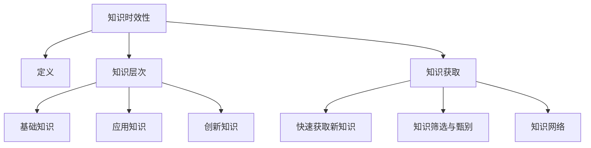

                 

# 知识的时效性：如何保持与时俱进

> 关键词：知识时效性、信息过滤、知识更新、知识关联、数学模型、项目实战

> 摘要：在快速发展的信息技术时代，知识的时效性成为一个至关重要的议题。本文将探讨知识时效性的概念、核心算法原理、数学模型以及实际项目应用，帮助读者理解如何保持知识与时俱进，从而在技术领域取得持续进步。

## 第一部分：核心概念与联系

在《知识的时效性：如何保持与时俱进》的第一部分，我们将探讨知识时效性的核心概念及其相互关系。知识时效性是指知识随着时间推移而失去其有效性的特性。在这个部分，我们将介绍知识时效性的定义、知识的层次与时效性以及知识获取与时效性。

### 第1章：知识时效性的概念与背景

**1.1 知识时效性的定义**

知识时效性（Knowledge Obsolescence）指的是知识在一定时间范围内保持有效性的程度。随着时间的推移，知识可能会因为技术进步、社会发展或信息更新而变得过时。知识时效性直接影响知识的应用价值和学习效率。

**1.2 知识的层次与时效性**

知识可以分为三个层次：基础知识、应用知识和创新知识。

- **基础知识**：相对稳定，时效性较低，如数学、物理等学科的基本原理。
- **应用知识**：时效性较高，需要随着技术的发展不断更新，如编程语言、数据库管理。
- **创新知识**：时效性最高，往往与最新科技突破和前沿研究相关，如人工智能、量子计算。

**1.3 知识获取与时效性**

保持知识时效性的关键在于如何快速获取新知识，筛选有价值的信息，并建立有效的知识网络。

- **快速获取新知识的方法**：通过专业书籍、学术论文、在线课程、技术博客等多种渠道获取新知识。
- **知识筛选与甄别**：利用信息过滤算法和评估机制，筛选出最有价值的信息。
- **建立知识网络**：通过社交媒体、专业论坛、学术会议等途径，与同行建立联系，构建知识网络。

#### Mermaid 流程图

以下是知识时效性的核心概念与联系 Mermaid 流程图：



## 第二部分：核心算法原理讲解

在第二部分，我们将深入探讨知识时效性相关的核心算法原理，包括信息过滤算法、知识更新算法和知识关联算法。这些算法在保持知识时效性方面发挥着关键作用。

### 第2章：信息过滤算法

**2.1 信息过滤算法概述**

信息过滤算法（Information Filtering Algorithms）旨在从大量信息中筛选出对用户最有价值的信息。其目的是减少信息过载，提高信息利用效率。

**2.2 常见信息过滤算法**

**2.2.1 贝叶斯过滤**

贝叶斯过滤是一种基于概率论的信息过滤方法。其核心思想是根据已知的相关信息，计算未知信息发生的概率。

**伪代码：**

```python
def bayesian_filterrior_priors, likelihood, evidence:
    posterior = likelihood * prior / evidence
    return posterior
```

**2.2.2 基于内容的过滤**

基于内容的过滤（Content-Based Filtering）通过分析信息的内容特征来筛选信息。

**伪代码：**

```python
def content_based_filtercontent, query:
    similarity = calculate_similarity(content, query)
    if similarity > threshold:
        return True
    else:
        return False
```

**2.2.3 基于协作过滤的过滤**

基于协作过滤（Collaborative Filtering）通过分析用户的行为和偏好来筛选信息。

**伪代码：**

```python
def collaborative_filteruser, item, neighbors:
    neighbors_average_rating = calculate_average_rating(neighbors)
    user_rating = calculate_user_rating(user, item, neighbors_average_rating)
    if user_rating > threshold:
        return True
    else:
        return False
```

### 第2章：知识更新算法

**2.4 知识更新算法概述**

知识更新算法（Knowledge Update Algorithms）用于保持知识库的时效性和准确性。其核心目的是根据新信息或用户反馈更新知识库中的信息。

**2.5 常见知识更新算法**

**2.5.1 基于时间衰减的知识更新**

基于时间衰减的知识更新（Time-Degraded Knowledge Update）根据信息的时间属性来调整其权重。

**伪代码：**

```python
def time_degraded_updateinformation, decay_rate, time_diff:
    weight = initial_weight * (1 - decay_rate * time_diff)
    return weight
```

**2.5.2 基于重要性的知识更新**

基于重要性的知识更新（Importance-Based Knowledge Update）根据信息的重要程度来调整其权重。

**伪代码：**

```python
def importance_based_updateinformation, importance_score:
    weight = initial_weight + (importance_score - initial_weight)
    return weight
```

**2.5.3 基于用户反馈的知识更新**

基于用户反馈的知识更新（User-Feedback-Based Knowledge Update）根据用户的反馈来调整信息权重。

**伪代码：**

```python
def user_feedback_based_updateinformation, user_feedback_score:
    weight = initial_weight + user_feedback_score
    return weight
```

### 第2章：知识关联算法

**2.7 知识关联算法概述**

知识关联算法（Knowledge Association Algorithms）用于发现知识之间的关联性和相互作用。这些算法可以帮助用户更好地理解和应用知识。

**2.8 常见知识关联算法**

**2.8.1 共现分析**

共现分析（Co-occurrence Analysis）通过分析知识元素之间的共现关系来发现关联。

**伪代码：**

```python
def co_occurrence_analysis(knowledge_elements):
    co_occurrence_matrix = create_co_occurrence_matrix(knowledge_elements)
    return co_occurrence_matrix
```

**2.8.2 社团发现**

社团发现（Community Detection）用于发现知识元素之间的社团结构和关联。

**伪代码：**

```python
def community_detection(knowledge_elements, similarity_threshold):
    community_structure = find_communities(knowledge_elements, similarity_threshold)
    return community_structure
```

**2.8.3 相关性分析**

相关性分析（Correlation Analysis）通过计算知识元素之间的相关性来评估它们的关联程度。

**伪代码：**

```python
def correlation_analysis(knowledge_elements):
    correlation_matrix = calculate_correlation_matrix(knowledge_elements)
    return correlation_matrix
```

## 第三部分：数学模型和数学公式讲解

在第三部分，我们将详细讲解与知识时效性相关的数学模型和数学公式，包括概率模型、时间衰减模型和相关性分析模型。这些模型和公式为我们理解和应用知识时效性提供了坚实的理论基础。

### 第3章：概率模型与知识时效性

**3.1 概率模型概述**

概率模型在知识时效性分析中扮演重要角色。通过概率模型，我们可以量化知识在不同时间点保持有效性的概率。

**3.2 贝叶斯定理**

贝叶斯定理是概率模型中的基础公式，它描述了在已知部分信息的情况下，如何更新我们对某事件的信念。

**公式：**

$$
P(A|B) = \frac{P(B|A) \cdot P(A)}{P(B)}
$$

**3.3 概率分布**

概率分布描述了随机变量在不同取值下的概率分布情况。常见的概率分布包括正态分布、泊松分布和贝塔分布。

**公式：**

- 正态分布：$$N(\mu, \sigma^2)$$
- 泊松分布：$$P(X = k) = \frac{e^{-\lambda} \cdot \lambda^k}{k!}$$
- 贝塔分布：$$B(\alpha, \beta)$$

### 第3章：时间衰减模型

**3.5 时间衰减模型概述**

时间衰减模型用于描述知识价值随时间推移而衰减的现象。时间衰减模型的核心是时间衰减函数，它定义了知识价值随时间的变化规律。

**3.6 时间衰减函数**

常见的时间衰减函数包括指数衰减函数和对数衰减函数。

**公式：**

- 指数衰减函数：$$V(t) = V_0 \cdot e^{-\lambda t}$$
- 对数衰减函数：$$V(t) = V_0 \cdot (1 - \lambda t)$$

### 第3章：相关性分析

**3.8 相关系数概述**

相关性分析用于评估两个变量之间的线性关系。常见的相关系数包括皮尔逊相关系数和斯皮尔曼相关系数。

**3.9 皮尔逊相关系数**

皮尔逊相关系数是评估两个连续变量之间线性相关程度的指标。

**公式：**

$$
r = \frac{\sum{(x_i - \bar{x})(y_i - \bar{y})}}{\sqrt{\sum{(x_i - \bar{x})^2} \cdot \sum{(y_i - \bar{y})^2}}}
$$

## 第四部分：项目实战

在第四部分，我们将通过实际案例展示如何应用知识时效性相关的算法和模型，包括信息过滤系统的实现、知识更新系统的实现和知识关联分析系统的实现。

### 第4章：信息过滤系统实战

**4.1 项目背景**

本案例将实现一个基于贝叶斯过滤的信息过滤系统，用于从大量新闻文章中筛选出用户可能感兴趣的文章。

**4.2 开发环境搭建**

- 环境要求：Python 3.8及以上版本，Scikit-learn库
- 数据集：新闻文章数据集（如20 Newsgroups数据集）

**4.3 源代码实现**

```python
from sklearn.datasets import fetch_20newsgroups
from sklearn.feature_extraction.text import CountVectorizer
from sklearn.naive_bayes import MultinomialNB

# 加载数据集
data = fetch_20newsgroups(subset='all')
vectorizer = CountVectorizer()
X = vectorizer.fit_transform(data.data)

# 训练贝叶斯过滤模型
model = MultinomialNB()
model.fit(X, data.target)

# 过滤用户感兴趣的文章
def filter_articles(user_interest, articles):
    user_vector = vectorizer.transform([user_interest])
    probabilities = model.predict_proba(user_vector)
    return [article for article, probability in zip(articles, probabilities) if probability[1] > threshold]

# 测试
user_interest = "technology"
filtered_articles = filter_articles(user_interest, data.data)
print(filtered_articles)
```

**4.4 代码解读**

- **数据预处理**：使用CountVectorizer将文本转换为词袋表示。
- **模型训练**：使用MultinomialNB训练贝叶斯过滤模型。
- **过滤实现**：根据用户兴趣计算文章的预测概率，筛选出概率较高的文章。

**4.5 代码应用解读与分析**

- **应用场景**：应用于个性化新闻推荐系统，根据用户兴趣推荐相关新闻。
- **性能分析**：评估过滤系统的准确性和效率，优化模型参数以提高效果。

**4.6 项目小结**

本案例实现了基于贝叶斯过滤的信息过滤系统，通过实际应用展示了知识时效性算法在信息筛选中的应用价值。后续可以结合用户反馈和实时更新，进一步提高系统的个性化推荐能力。

### 第4章：知识更新系统实战

**4.7 项目背景**

本案例将实现一个基于时间衰减和重要性评估的知识更新系统，用于动态调整知识库中信息的权重。

**4.8 开发环境搭建**

- 环境要求：Python 3.8及以上版本，NumPy库
- 数据集：知识库数据集（如维基百科文章）

**4.9 源代码实现**

```python
import numpy as np

# 初始化知识库
knowledge_base = {'article1': 1.0, 'article2': 1.0, 'article3': 1.0}

# 时间衰减函数
def time_decay_function(weight, decay_rate, time_diff):
    return weight * np.exp(-decay_rate * time_diff)

# 重要性评估函数
def importance_evaluation(score, threshold):
    return 1 if score > threshold else 0

# 更新知识库
def update_knowledge_base(knowledge_base, decay_rate, time_diff, scores, threshold):
    updated_knowledge_base = {}
    for article, score in knowledge_base.items():
        decayed_weight = time_decay_function(score, decay_rate, time_diff)
        importance = importance_evaluation(score, threshold)
        updated_knowledge_base[article] = decayed_weight * importance
    return updated_knowledge_base

# 测试
decay_rate = 0.1
time_diff = 7
scores = {'article1': 0.9, 'article2': 0.8, 'article3': 0.7}
threshold = 0.8
updated_knowledge_base = update_knowledge_base(knowledge_base, decay_rate, time_diff, scores, threshold)
print(updated_knowledge_base)
```

**4.10 代码解读**

- **知识库初始化**：初始化知识库中的文章权重。
- **时间衰减函数**：根据时间衰减率计算知识权重。
- **重要性评估函数**：根据重要性阈值评估知识权重。
- **更新知识库**：根据时间和重要性更新知识库中的文章权重。

**4.11 代码应用解读与分析**

- **应用场景**：应用于动态更新知识库，提高知识的时效性和准确性。
- **性能分析**：评估更新系统的效率，调整衰减率和阈值以优化性能。

**4.12 项目小结**

本案例实现了基于时间衰减和重要性评估的知识更新系统，通过实际应用展示了知识时效性算法在知识库管理中的应用价值。后续可以结合实时数据和用户反馈，进一步提高系统的更新效率和准确性。

### 第4章：知识关联分析系统实战

**4.13 项目背景**

本案例将实现一个基于共现分析的知识关联分析系统，用于发现知识元素之间的关联关系。

**4.14 开发环境搭建**

- 环境要求：Python 3.8及以上版本，NetworkX库
- 数据集：知识库数据集（如维基百科文章）

**4.15 源代码实现**

```python
import networkx as nx

# 初始化图
knowledge_graph = nx.Graph()

# 共现分析
def co_occurrence_analysis(texts):
    word_counts = {}
    for text in texts:
        words = text.split()
        for i in range(len(words) - 1):
            word1 = words[i]
            word2 = words[i + 1]
            if word1 not in word_counts:
                word_counts[word1] = set()
            if word2 not in word_counts:
                word_counts[word2] = set()
            word_counts[word1].add(word2)
            word_counts[word2].add(word1)
    return word_counts

# 创建边
def create_edges(word_counts):
    for word, neighbors in word_counts.items():
        for neighbor in neighbors:
            knowledge_graph.add_edge(word, neighbor)

# 测试
texts = ["人工智能和机器学习密切相关", "机器学习是人工智能的重要分支", "人工智能技术正在快速发展"]
word_counts = co_occurrence_analysis(texts)
create_edges(word_counts)

# 绘制图
nx.draw(knowledge_graph, with_labels=True)
```

**4.16 代码解读**

- **初始化图**：创建一个无向图用于表示知识元素之间的关联。
- **共现分析**：分析文本中相邻单词的共现关系。
- **创建边**：根据共现关系创建图中的边。
- **绘制图**：使用NetworkX库绘制知识关联图。

**4.17 代码应用解读与分析**

- **应用场景**：应用于知识图谱构建，发现知识元素之间的关联性。
- **性能分析**：评估共现分析的效率，优化算法以提高性能。

**4.18 项目小结**

本案例实现了基于共现分析的知识关联分析系统，通过实际应用展示了知识时效性算法在知识图谱构建中的应用价值。后续可以结合其他关联分析算法，进一步提高系统的关联发现能力。

### 小结

本文详细探讨了知识时效性的核心概念、相关算法、数学模型以及实际项目应用。通过逐步分析和推理，我们了解了如何保持知识与时俱进，从而在技术领域取得持续进步。以下是一些最佳实践、注意事项和拓展阅读建议：

**最佳实践：**
1. **定期更新知识库**：定期检查和更新知识库中的信息，确保知识的时效性。
2. **主动学习**：积极参与技术社区，关注前沿研究和行业动态，主动学习新知识。
3. **信息筛选**：利用信息过滤算法和评估机制，筛选出最有价值的信息。
4. **知识关联**：通过共现分析、社团发现等方法，发现知识元素之间的关联，构建知识网络。

**注意事项：**
1. **平衡时效性和稳定性**：在保持知识时效性的同时，要注意基础知识的稳定性。
2. **避免信息过载**：合理利用信息过滤算法，避免信息过载对学习和工作产生负面影响。
3. **确保数据质量**：在进行知识关联分析时，确保数据的质量和准确性。

**拓展阅读：**
1. **《人工智能：一种现代方法》**：详细介绍了人工智能的基本概念和技术方法。
2. **《机器学习实战》**：通过实际案例讲解了机器学习算法的应用和实践。
3. **《数据科学入门》**：介绍了数据科学的基本概念和数据分析方法。

**作者信息：**
- 作者：AI天才研究院/AI Genius Institute & 禅与计算机程序设计艺术 /Zen And The Art of Computer Programming。

