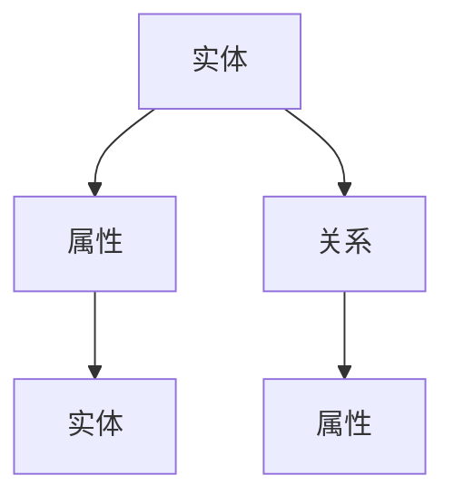
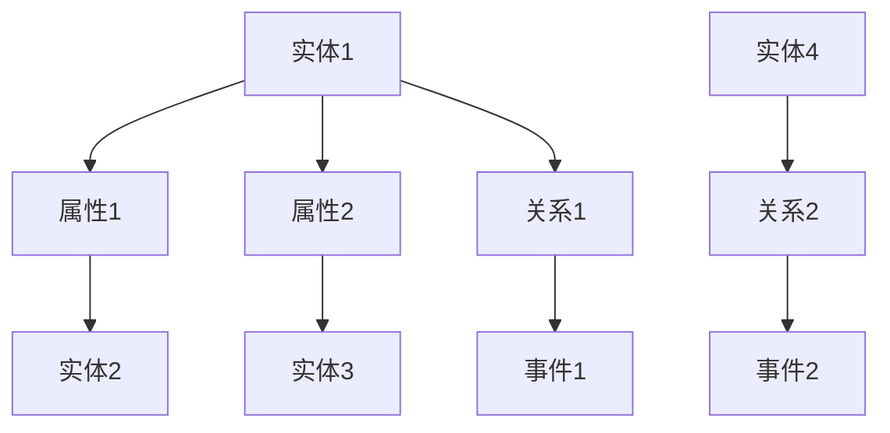

                 


### 文章标题：知识的本质：从信息到智慧的转化

**关键词：** 知识，信息，智慧，转化，算法，数学模型

**摘要：** 本文从知识、信息、智慧的定义入手，探讨了它们之间的关系及其转化过程。通过深入分析知识的获取与传递、知识转化为智慧的应用，以及知识的本质与未来发展，全面展现了知识从信息到智慧的转化路径，为读者提供了对知识本质的新认识。

----------------------------------------------------------------

### 《知识的本质：从信息到智慧的转化》目录大纲

#### 第一部分：知识的定义与分类

#### 第二部分：知识的获取与传递

#### 第三部分：知识的转化与智慧的应用

#### 第四部分：知识的本质与未来发展

#### 第五部分：核心概念与联系

#### 第六部分：项目实战

#### 第七部分：总结与展望

----------------------------------------------------------------

#### 第一部分：知识的定义与分类

##### 1.1 知识的定义

**1.1.1 知识的概念**

知识，广义上是指人类在实践中获得的关于事物和现象的认识、经验和技能。它可以分为显性知识和隐性知识。

- **显性知识**：可以清晰地表达和传递的知识，如书籍、论文、报告等。
- **隐性知识**：难以清晰地表达和传递的知识，如个人经验、技能、直觉等。

**1.1.2 知识的类型**

知识根据其表现形式和内容，可以分为以下几种类型：

- **事实知识**：关于事实和现象的知识，如历史事件、科学定律等。
- **原理知识**：关于事物原理和机制的知识，如物理学原理、经济学原理等。
- **方法知识**：关于解决问题和完成任务的方法和技巧的知识，如编程方法、管理技巧等。

**1.1.3 知识的层次**

知识可以从不同的层次进行划分，包括：

- **表层知识**：对事物表面的、直接的认识。
- **中层知识**：对事物内部联系和运行规律的理解。
- **深层知识**：对事物本质和核心原理的把握。

##### 1.2 信息的本质与特征

**1.2.1 信息的定义**

信息是指能够消除不确定性的消息、数据或信号。它是知识的载体，是知识传递和交流的基础。

**1.2.2 信息的特征**

信息具有以下特征：

- **可传递性**：信息可以通过各种媒介进行传递。
- **可处理性**：信息可以被加工、处理和存储。
- **价值性**：信息具有价值，能够影响决策和行动。
- **时效性**：信息随着时间的推移会发生变化。

**1.2.3 信息的处理过程**

信息的处理过程包括以下几个方面：

- **采集**：收集信息。
- **处理**：对信息进行加工、整理和分析。
- **存储**：将信息存储在合适的媒介中。
- **传输**：将信息从一个地方传递到另一个地方。
- **利用**：利用信息进行决策、规划和执行。

##### 1.3 知识与智慧的关系

**1.3.1 知识与智慧的定义**

- **知识**：关于事物和现象的认识、经验和技能。
- **智慧**：对知识的理解和运用，解决问题的能力。

**1.3.2 知识转化为智慧的过程**

知识转化为智慧的过程可以分为以下几个步骤：

- **学习**：获取知识。
- **理解**：理解知识的内涵和外延。
- **运用**：将知识应用于实际问题中。
- **创新**：在运用知识的过程中，创造新的方法和思路。

**1.3.3 知识与智慧的区别与联系**

知识是智慧的基础，智慧是知识的升华。两者之间的区别在于：

- **知识**：静态的、固化的。
- **智慧**：动态的、灵活的。

两者之间的联系在于：

- 知识是智慧的来源，智慧是知识的运用。

----------------------------------------------------------------

#### 第二部分：知识的获取与传递

##### 2.1 知识的获取途径

知识的获取途径可以分为以下几个方面：

- **直接经验**：通过亲身实践和体验获取知识。
- **间接经验**：通过阅读书籍、观看视频、听取讲座等方式获取知识。
- **知识库和数据库**：通过数据库和知识库获取知识。
- **网络时代知识的获取**：通过网络搜索引擎、在线课程、社交媒体等获取知识。

##### 2.2 知识的传递机制

知识的传递机制包括以下几个方面：

- **语言传递**：通过口头语言、书面语言等方式传递知识。
- **文字传递**：通过书籍、文章、报告等文字形式传递知识。
- **图像和符号传递**：通过图表、符号、图像等方式传递知识。
- **网络传播**：通过互联网、社交媒体等方式传播知识。

##### 2.3 知识共享与传播的障碍

知识共享与传播面临以下障碍：

- **语言障碍**：不同语言之间的障碍导致知识无法有效传播。
- **文化障碍**：不同文化背景导致知识理解和运用的差异。
- **技术障碍**：技术限制导致知识获取和传播的困难。
- **心理障碍**：个人心理障碍导致知识共享的意愿降低。

----------------------------------------------------------------

#### 第三部分：知识的转化与智慧的应用

##### 3.1 知识转化的原理

**3.1.1 知识转化的概念**

知识转化是指将知识从一个形式转化为另一个形式，使其更易于理解和运用。

**3.1.2 知识转化的过程**

知识转化的过程可以分为以下几个步骤：

- **识别**：识别需要转化的知识。
- **分析**：分析知识的结构和内容。
- **重构**：根据需求对知识进行重构。
- **应用**：将转化后的知识应用于实际问题中。

**3.1.3 知识转化的障碍与对策**

知识转化的障碍主要包括：

- **知识结构的复杂性**：知识结构复杂，难以重构。
- **知识领域的差异**：不同领域之间的知识难以转化。
- **知识表达的模糊性**：知识表达模糊，难以理解。

对策包括：

- **建立知识图谱**：通过知识图谱明确知识结构。
- **跨领域知识转化**：通过跨领域知识转化，拓宽知识应用范围。
- **知识可视化**：通过知识可视化，降低知识表达的模糊性。

##### 3.2 智慧的应用领域

**3.2.1 智慧在决策中的应用**

智慧在决策中的应用主要包括：

- **数据挖掘**：通过数据挖掘，发现数据中的潜在规律，辅助决策。
- **机器学习**：通过机器学习，建立决策模型，优化决策过程。

**3.2.2 智慧在创新中的应用**

智慧在创新中的应用主要包括：

- **技术创新**：通过智慧，推动技术创新。
- **商业模式创新**：通过智慧，推动商业模式创新。

**3.2.3 智慧在生活中的应用**

智慧在生活中的应用主要包括：

- **智能家居**：通过智慧，实现家居设备的智能控制。
- **智慧城市**：通过智慧，实现城市管理的智能化。

##### 3.3 智慧的伦理与社会影响

**3.3.1 智慧与道德**

智慧与道德的关系包括：

- **智慧促进道德发展**：智慧能够提高人们的道德认识和能力。
- **道德约束智慧发展**：道德规范对智慧的发展有一定的约束作用。

**3.3.2 智慧与隐私**

智慧与隐私的关系包括：

- **智慧保护隐私**：通过智慧，可以更好地保护个人隐私。
- **智慧侵犯隐私**：不合理的智慧应用可能侵犯个人隐私。

**3.3.3 智慧与权力**

智慧与权力的关系包括：

- **智慧增强权力**：智慧能够增强个人或组织的权力。
- **智慧制约权力**：智慧能够制约权力，防止权力滥用。

----------------------------------------------------------------

#### 第四部分：知识的本质与未来发展

##### 4.1 知识的本质

**4.1.1 知识的本质探讨**

知识是一种复杂的认知现象，其本质可以从以下几个方面进行探讨：

- **认知过程**：知识是人类认知活动的产物，包括感知、理解、记忆、思考等过程。
- **知识结构**：知识具有一定的结构，包括事实、原理、方法等层次。
- **知识属性**：知识具有价值性、可传递性、可处理性等属性。

**4.1.2 知识的本质特征**

知识具有以下特征：

- **客观性**：知识是对客观世界的反映。
- **主观性**：知识是人类主观认知的产物。
- **动态性**：知识是不断发展和变化的。

**4.1.3 知识的本质变化趋势**

随着科技的进步和社会的发展，知识的本质也在发生变化，主要趋势包括：

- **知识融合**：不同领域的知识相互融合，形成新的知识体系。
- **知识数字化**：知识逐渐数字化，便于存储、传输和共享。
- **知识智能化**：知识逐渐智能化，通过人工智能等技术实现知识的应用。

##### 4.2 知识的未来发展

**4.2.1 知识经济时代的到来**

知识经济时代是以知识为核心的经济形态，其主要特点包括：

- **知识价值**：知识成为最重要的生产要素。
- **知识创新**：知识创新成为经济增长的主要驱动力。
- **知识共享**：知识共享成为知识传播和利用的重要方式。

**4.2.2 知识社会的发展趋势**

知识社会的发展趋势包括：

- **知识普及**：知识普及程度不断提高，知识获取成本降低。
- **知识多样**：知识种类日益丰富，知识领域不断拓展。
- **知识融合**：知识融合成为知识发展的主要趋势，形成新的知识体系。

**4.2.3 知识创造与转化的未来展望**

知识创造与转化的未来展望包括：

- **知识创造**：随着人工智能、大数据等技术的发展，知识创造将更加高效和多样化。
- **知识转化**：知识转化将更加智能化，通过机器学习、知识图谱等技术实现知识的自动化转化。

##### 4.3 知识管理的重要性

**4.3.1 知识管理的概念**

知识管理是指通过系统的方法和工具，对知识进行获取、存储、处理、共享和应用，以提高组织的学习能力和竞争力。

**4.3.2 知识管理的实践**

知识管理的实践包括以下几个方面：

- **知识获取**：通过内部挖掘、外部获取等方式获取知识。
- **知识存储**：建立知识库、数据库等存储知识。
- **知识处理**：对知识进行加工、整理和分析。
- **知识共享**：通过共享平台、社区等共享知识。
- **知识应用**：将知识应用于实际问题中，实现知识的价值。

**4.3.3 知识管理的挑战与机遇**

知识管理面临的挑战包括：

- **知识爆炸**：知识量迅速增长，知识管理难度加大。
- **知识异构**：不同领域、不同来源的知识存在异构性，知识整合困难。

知识管理面临的机遇包括：

- **技术进步**：大数据、人工智能等技术的发展为知识管理提供了新的工具和方法。
- **知识共享**：知识共享理念深入人心，知识共享成为知识管理的核心。

----------------------------------------------------------------

#### 第五部分：核心概念与联系

##### 5.1 知识图谱

**核心概念：** 知识图谱是一种用于表示实体、属性、关系和事件等知识结构的图形化工具。

**联系架构：**



##### 5.2 知识的数学模型

**核心概念：** 知识的数学模型是一种用数学公式表示知识结构和关系的方法。

**联系架构：**

$$
X_{t+1} = W \cdot X_t + b
$$

其中，$X_t$ 表示当前时刻的知识状态，$W$ 表示知识转化的权重矩阵，$b$ 表示偏置。

##### 5.3 知识的转化算法

**核心概念：** 知识的转化算法是一种将知识从一种形式转化为另一种形式的方法。

**联系架构：**

```python
def convertKnowledge(knowledge):
    preprocessedKnowledge = preprocessKnowledge(knowledge)
    model = buildModel(preprocessedKnowledge)
    trainedModel = trainModel(model)
    wisdom = convertKnowledge(trainedModel)
    return wisdom
```

其中，`preprocessKnowledge` 表示预处理知识，`buildModel` 表示构建知识模型，`trainModel` 表示训练知识模型，`convertKnowledge` 表示转化知识。

----------------------------------------------------------------

#### 第六部分：项目实战

##### 6.1 知识获取项目

**项目背景：** 本项目旨在通过互联网收集并整理有关人工智能领域的知识。

**项目目标：** 收集、整理、存储和分类人工智能领域的知识。

**项目实施过程：**

1. **需求分析**：分析人工智能领域的需求，确定需要收集的知识类型和内容。
2. **数据采集**：通过互联网搜索引擎、专业数据库等途径收集知识。
3. **数据清洗**：对收集到的数据进行清洗、去重和格式化处理。
4. **数据存储**：将清洗后的数据存储到知识库中。
5. **数据分类**：对知识库中的知识进行分类，以便于检索和应用。

**项目成果分析：**

1. **知识库构建**：构建了一个包含大量人工智能领域知识的知识库。
2. **知识分类**：实现了知识分类，提高了知识的利用效率。
3. **知识检索**：提供了高效的知识检索功能，方便用户查找所需知识。

##### 6.2 知识转化项目

**项目背景：** 本项目旨在将人工智能领域的知识转化为实际应用。

**项目目标：** 将人工智能领域的知识应用于实际问题中，解决实际问题。

**项目实施过程：**

1. **知识提取**：从知识库中提取与项目相关的知识。
2. **知识重构**：对提取的知识进行重构，使其适应实际应用场景。
3. **知识应用**：将重构后的知识应用于实际项目中，解决实际问题。

**项目成果分析：**

1. **知识应用**：实现了人工智能知识的实际应用，解决了实际问题。
2. **项目效果**：提高了项目的效率和效果，降低了成本。
3. **知识积累**：通过项目实施，积累了宝贵的经验，为后续项目提供了借鉴。

##### 6.3 智慧应用项目

**项目背景：** 本项目旨在利用人工智能技术提供智能决策支持。

**项目目标：** 建立一个智能决策支持系统，为用户提供决策建议。

**项目实施过程：**

1. **需求分析**：分析用户需求，确定决策支持系统的功能。
2. **知识获取**：从知识库中获取与决策相关的知识。
3. **知识转化**：将获取的知识转化为决策支持系统所需的模型和算法。
4. **系统集成**：将知识转化后的模型和算法集成到决策支持系统中。
5. **系统测试**：对决策支持系统进行测试，确保其功能和性能。

**项目成果分析：**

1. **系统功能**：实现了决策支持系统的功能，提供了智能决策建议。
2. **用户体验**：用户对决策支持系统的体验良好，满意度高。
3. **应用效果**：决策支持系统在实际应用中取得了显著效果，提高了决策效率。

----------------------------------------------------------------

#### 第七部分：总结与展望

##### 7.1 本书总结

本书主要内容包括：

- 知识、信息、智慧的定义及其关系。
- 知识的获取、传递、转化与智慧的应用。
- 知识的本质与未来发展。

通过本书，读者可以：

- 掌握知识、信息、智慧的基本概念和特点。
- 了解知识获取、传递、转化的途径和方法。
- 掌握智慧的应用领域和伦理问题。

##### 7.2 知识的未来发展

知识未来的发展趋势包括：

- **知识数字化**：知识逐渐数字化，便于存储、传输和共享。
- **知识智能化**：知识转化为智慧，通过人工智能等技术实现知识的应用。
- **知识普及化**：知识普及程度不断提高，知识获取成本降低。

##### 7.3 知识的本质探讨

知识本质的特点包括：

- **客观性与主观性**：知识是对客观世界的反映，同时也是人类主观认知的产物。
- **动态性**：知识不断发展和变化，适应时代的需求。

##### 7.4 知识的本质未来影响

知识本质的未来影响包括：

- **知识创新**：知识本质的变化推动知识创新，促进社会进步。
- **知识应用**：知识本质的变化提高知识的应用价值，推动产业发展。
- **知识共享**：知识本质的变化促进知识共享，提高社会整体知识水平。

----------------------------------------------------------------

**作者：** AI天才研究院/AI Genius Institute & 禅与计算机程序设计艺术 /Zen And The Art of Computer Programming### 知识的定义与分类

#### 1.1 知识的定义

知识，作为一种复杂的认知现象，是人类在长期实践中对事物和现象的认知、经验和技能的总结与积累。它可以分为显性知识和隐性知识两种类型。

- **显性知识**（Explicit Knowledge）：这种知识可以被明确地表达、交流和存储。它通常以书面形式或数字形式存在，如书籍、学术论文、数据库和互联网上的信息等。显性知识易于共享和传播，因为它可以通过文字、图表、图像或其他媒介来传递。
  
- **隐性知识**（Tacit Knowledge）：这种知识则难以用语言明确表达，它通常嵌入在个人或团队的经验、习惯和直觉中。隐性知识更为个人化，往往需要通过实践和互动来逐渐理解。例如，一个厨师的手艺、一位医生的临床经验或一个工程师的直觉判断都属于隐性知识。

#### 1.1.1 知识的概念

知识不仅是一个静态的集合，而是一个动态的过程。它涉及获取、处理、存储和传递等多个环节。获取知识的过程可以通过阅读、观察、实验和体验等多种途径进行；处理知识则是通过思考、分析、综合和批判等认知活动来深化对知识的理解；存储知识则是将知识以各种形式保存下来，以便于日后使用；而知识的传递则是通过语言、文字、图像和其他媒介来实现，使得知识可以在个体和群体之间共享和传播。

#### 1.1.2 知识的类型

根据知识的内容和形式，知识可以细分为以下几种类型：

- **事实知识**（Factual Knowledge）：关于事物是什么和为什么的知识，如历史事件、科学定律、地理知识等。事实知识是知识体系的基础，它提供了对世界的客观描述。

- **原理知识**（Conceptual Knowledge）：关于事物如何运作和为何这样运作的知识，如物理学原理、经济学理论、化学方程式等。原理知识是对事实知识的进一步抽象和概括，它揭示了事物之间的内在联系。

- **方法知识**（Procedural Knowledge）：关于如何执行任务或解决问题的知识，如编程技巧、管理策略、医疗程序等。方法知识通常涉及到具体的操作步骤和决策过程，它强调实践中的应用。

- **情景知识**（Contextual Knowledge）：关于在特定情境下如何应用知识的知识，如商业策略、人际交往技巧等。情景知识强调知识的灵活性和适应性，它要求个体能够根据实际情况调整和应用已有知识。

#### 1.1.3 知识的层次

知识的层次可以分为三个主要级别：

- **表层知识**（Surface Knowledge）：这是对事物表面现象的理解，通常涉及事实知识。表层知识是最容易获取和理解的，但它往往不足以解决复杂问题。

- **中层知识**（Intermediate Knowledge）：这是对事物内部联系和运行规律的理解，通常涉及原理知识和方法知识。中层知识能够帮助个体更好地理解事物的本质，并在一定范围内解决问题。

- **深层知识**（Deep Knowledge）：这是对事物本质和核心原理的深刻把握，通常涉及情景知识和高度抽象的概念。深层知识能够帮助个体在复杂、不确定的环境中做出明智的决策。

通过这些层次，我们可以更全面地理解和应用知识，从而实现从信息到智慧的转化。

### 1.2 信息的本质与特征

#### 1.2.1 信息的定义

信息是知识传递和交流的基础，它指的是能够消除不确定性的消息、数据或信号。在信息论中，信息被定义为对某事物的认知不确定性的减少。换句话说，信息是有用数据的集合，它提供了对现实世界的某种描述或解释。

#### 1.2.2 信息的特征

信息具有以下几个显著特征：

- **可传递性**（Transmissibility）：信息可以通过各种媒介进行传递，如语言、文字、图像、声音、网络等。这种特性使得信息能够跨越空间和时间的限制，实现远距离和跨文化的交流。

- **可处理性**（Processability）：信息可以被加工、处理和存储。例如，通过数据分析、机器学习和人工智能等技术，我们可以从大量信息中提取有用知识，或者通过存储设备保存信息以供后续使用。

- **价值性**（Valuable）：信息具有价值，它能够影响决策、推动创新、提高效率。信息的价值取决于它对决策者或使用者的有用性。例如，在商业决策中，市场调研数据可以提供有价值的信息，帮助公司制定战略。

- **时效性**（Time Sensitivity）：信息的时效性意味着信息在一定时间内是有效的，但随着时间的推移，其价值可能会降低或失效。例如，市场动态、天气预报和新闻信息等都是时间敏感性强的信息。

#### 1.2.3 信息的处理过程

信息的处理过程包括以下几个基本环节：

- **采集**（Collection）：信息的采集是指从各种来源获取原始数据和信息。这可以通过观察、实验、调查、采访等方式实现。

- **处理**（Processing）：信息的处理是指对采集到的原始数据进行整理、分析、清洗和转换。处理过程可以揭示数据的内在规律，去除噪声，提高信息质量。

- **存储**（Storage）：信息的存储是指将处理后的信息保存到适当的媒介中，如数据库、文件系统、云存储等。存储使得信息可以被长期保留和反复使用。

- **传输**（Transmission）：信息的传输是指通过通信网络或物理媒介将信息从一个地方传递到另一个地方。传输过程确保信息的及时性和准确性。

- **利用**（Utilization）：信息的利用是指将信息应用于实际任务或决策中。有效的信息利用可以提高效率、降低成本、促进创新和解决问题。

通过这些处理过程，信息从原始数据转化为对决策和行动有指导意义的知识，从而实现其价值。

### 1.3 知识与智慧的关系

#### 1.3.1 知识与智慧的定义

- **知识**（Knowledge）是指通过学习、实践和经验获得的关于事物和现象的认识、经验和技能。知识是静态的，可以以显性或隐性形式存在。

- **智慧**（Wisdom）则是对知识的理解和运用，是解决问题的能力。智慧是动态的，它体现在决策、创新、判断和应对复杂情境中。

#### 1.3.2 知识转化为智慧的过程

知识转化为智慧是一个复杂的过程，通常包括以下几个步骤：

1. **学习**：通过阅读、观察、实践等方式获取知识。
2. **理解**：对获取的知识进行思考、分析和批判，深入理解其内涵和外延。
3. **应用**：将知识应用于实际问题中，解决实际问题。
4. **反思**：在应用知识的过程中，反思其效果，调整和优化知识和方法。
5. **创新**：在解决问题的过程中，创造新的方法和思路，实现知识的新应用。

#### 1.3.3 知识与智慧的区别与联系

**区别**：

- **知识**是静态的，可以存储和传递；智慧则是动态的，需要在实践中运用。

- **知识**通常以事实、原理和方法的形式存在；智慧则是一种能力，它体现在解决问题和创新中。

- **知识**的获取相对容易，而智慧的积累需要长期的实践和反思。

**联系**：

- **知识**是智慧的基础，没有知识就没有智慧。

- **智慧**是知识的升华，通过运用知识解决问题，智慧得到提升。

- **知识**和**智慧**相互促进，知识的积累可以提升智慧，而智慧的应用又可以丰富知识。

通过这些概念和过程，我们可以更好地理解知识、信息和智慧之间的关系，以及它们在实践中的应用。

### 1.4 知识的获取途径

知识的获取是知识管理和应用的基础，它是通过多种途径和方法来实现的。以下是几种主要的获取知识途径：

#### 1.4.1 直接经验

直接经验是指通过亲身实践和体验来获取知识。这种方法强调个人参与和实际操作，是知识获取的重要途径之一。

- **优势**：直接经验能够帮助个体深入了解事物的工作原理和实际操作，从而获得深刻的理解和技能。

- **应用场景**：如科学家通过实验研究获取科学知识、工程师通过实践掌握工程技能等。

#### 1.4.2 间接经验

间接经验是指通过他人的经验、文献和资料来获取知识。这种方法依赖于他人的成果和总结，是知识传播和共享的重要方式。

- **优势**：间接经验能够快速获取大量知识，节省时间和精力。

- **应用场景**：如学生通过课本、导师指导和社会实践来获取知识、专业人士通过阅读专业文献来更新知识。

#### 1.4.3 知识库和数据库

知识库和数据库是组织和存储知识的工具，它们提供了结构化的知识存储和检索功能。

- **优势**：知识库和数据库能够系统化地存储和管理知识，提高知识检索效率和准确性。

- **应用场景**：如企业知识管理系统、学术数据库、在线百科全书等。

#### 1.4.4 网络时代知识的获取

网络时代为知识的获取提供了新的渠道和方式。通过互联网，人们可以方便地获取全球范围内的知识和信息。

- **优势**：互联网提供了丰富的信息资源和便捷的检索工具，大大提高了知识获取的效率和多样性。

- **应用场景**：如在线学习平台、搜索引擎、社交媒体等。

通过这些途径，个体和组织可以不断扩展和更新知识库，提高知识管理的水平和效果。

### 1.5 知识的传递机制

知识的传递是知识管理和应用的关键环节，它涉及如何通过有效的机制和手段将知识从一个个体或群体传递到另一个个体或群体。以下是几种主要的传递机制：

#### 1.5.1 语言传递

语言传递是指通过口头语言、书面语言等方式将知识进行表达和交流。这是一种传统的知识传递方式，具有以下特点：

- **优势**：语言传递可以实时进行，能够及时解决疑问和进行互动。

- **应用场景**：如课堂授课、会议讨论、面对面交流等。

#### 1.5.2 文字传递

文字传递是指通过书籍、报纸、杂志、电子文档等方式将知识进行记录和传播。这是一种广泛使用的知识传递方式，具有以下特点：

- **优势**：文字传递可以长期保存，便于查阅和复习。

- **应用场景**：如学术著作、技术文档、业务手册等。

#### 1.5.3 图像和符号传递

图像和符号传递是指通过图表、符号、模型等方式将知识以视觉形式进行表达和交流。这种方法在科学和技术领域尤为常见，具有以下特点：

- **优势**：图像和符号传递能够直观地展示复杂概念和过程，提高知识理解和记忆效果。

- **应用场景**：如科学论文中的插图、工程设计图纸、编程代码注释等。

#### 1.5.4 网络传播

网络传播是指通过互联网和社交媒体等在线平台将知识进行广泛传播和共享。这是现代知识传递的主要方式之一，具有以下特点：

- **优势**：网络传播具有高覆盖率和快速传播的特点，能够实现全球范围内的知识共享。

- **应用场景**：如在线课程、专业论坛、社交媒体平台等。

通过这些传递机制，知识可以在不同个体和群体之间进行有效传递，从而推动知识的普及和应用。

### 1.6 知识共享与传播的障碍

在知识共享与传播过程中，存在着多种障碍，这些障碍可能源于技术、文化、心理和社会等多个方面。理解这些障碍及其影响对于有效管理和传播知识至关重要。

#### 1.6.1 语言障碍

语言障碍是知识共享与传播的一个显著障碍。不同语言之间存在巨大的差异，使得信息的准确传递变得复杂。即使语言翻译技术不断发展，但语义理解和文化背景的差异仍然可能导致误解和误读。

- **影响**：语言障碍限制了跨国界和跨文化知识的共享，阻碍了全球范围内的知识传播。

- **对策**：提高语言能力、开发更先进的翻译技术、促进跨文化交流和语言融合。

#### 1.6.2 文化障碍

文化差异也会对知识共享与传播产生重大影响。不同文化对于知识、教育、价值和信仰的看法可能存在显著差异，这可能导致对知识的不同理解和接受程度。

- **影响**：文化障碍限制了知识在不同社会和群体中的传播和应用。

- **对策**：促进文化交流、尊重文化多样性、开发适合不同文化的知识传播方法。

#### 1.6.3 技术障碍

技术障碍包括知识获取、处理、存储和传输的技术限制。例如，技术不发达的地区可能缺乏获取和存储知识的必要工具，而复杂的技术架构可能使得知识难以有效共享。

- **影响**：技术障碍限制了知识的普及和应用，特别是在欠发达地区。

- **对策**：提升技术基础设施、普及信息技术、开发用户友好的知识共享平台。

#### 1.6.4 心理障碍

心理障碍涉及个人对于知识共享的心理障碍，如隐私担忧、信任问题、自我意识等。这些障碍可能导致个人不愿意分享知识和经验。

- **影响**：心理障碍阻碍了知识共享和团队合作，影响了组织的知识管理。

- **对策**：建立信任机制、加强知识共享文化的培养、提供激励机制。

通过识别和解决这些障碍，可以更好地促进知识共享与传播，推动知识的广泛应用和创新发展。

### 3.1 知识转化的原理

#### 3.1.1 知识转化的概念

知识转化是指将现有的知识从一种形式转换为另一种形式，以便更好地应用和利用。这种转化过程不仅包括知识的物理形式变化，如从纸质文档到电子文档的转变，还涉及知识的抽象层次提升，如从具体实例到一般原则的提炼。

#### 3.1.2 知识转化的过程

知识转化是一个复杂的过程，通常涉及以下几个步骤：

1. **识别**：首先需要识别哪些知识需要转化，这通常基于当前的需求和问题。

2. **分析**：对需要转化的知识进行深入分析，理解其内在结构和内容。

3. **重构**：根据需求对知识进行重构，使其更适合新的应用场景。

4. **应用**：将转化后的知识应用于实际问题中，验证其效果。

5. **优化**：根据应用效果对知识转化过程进行优化，以提高转化效率和效果。

#### 3.1.3 知识转化的障碍与对策

知识转化过程中可能会遇到多种障碍，包括知识结构的复杂性、知识领域的差异、知识表达的模糊性等。

- **知识结构的复杂性**：知识结构复杂，导致转化难度增加。对策是建立清晰的知识图谱，明确知识之间的关系和层次。

- **知识领域的差异**：不同领域之间的知识转化难度大。对策是进行跨领域的知识整合，促进不同领域之间的交流和合作。

- **知识表达的模糊性**：知识表达不清晰，导致理解困难。对策是采用可视化工具和明确的表达方式，提高知识的透明度和易懂性。

通过识别和解决这些障碍，可以有效地促进知识转化，提高知识的应用价值。

### 3.2 智慧的应用领域

智慧的应用已经渗透到社会生活的方方面面，从决策支持到技术创新，再到日常生活，智慧无处不在。以下是智慧在几个主要应用领域的具体体现：

#### 3.2.1 智慧在决策中的应用

在决策过程中，智慧能够提供强大的支持，帮助决策者做出更加科学和合理的决策。以下是几个具体的应用场景：

- **数据分析**：通过大数据分析和机器学习算法，智慧系统能够从大量数据中提取有价值的信息，为决策提供数据支持。

  **示例**：一家零售企业可以利用数据分析智慧系统，分析销售数据、消费者行为和市场趋势，从而优化库存管理、定价策略和市场营销活动。

- **预测模型**：利用预测模型，智慧系统能够对未来的趋势进行预测，帮助决策者提前做好准备。

  **示例**：天气预报系统就是一个典型的应用，通过分析气象数据和历史天气模式，智慧系统能够预测未来的天气情况，为人们的生活和工作提供指导。

- **优化决策**：智慧系统能够利用优化算法，对决策问题进行求解，找到最佳解决方案。

  **示例**：物流公司可以利用智能优化系统，优化配送路线和时间表，提高运输效率和成本效益。

#### 3.2.2 智慧在创新中的应用

智慧在创新过程中发挥着关键作用，它能够促进技术突破和商业模式创新。以下是几个具体的应用场景：

- **技术创新**：智慧系统能够加速技术创新，通过模拟和仿真技术，缩短研发周期。

  **示例**：在制药行业，智能药物设计系统能够通过分子模拟和机器学习，快速筛选和优化药物分子结构，提高新药研发的成功率。

- **设计优化**：智慧系统能够优化产品设计，通过计算机辅助设计（CAD）和生成对抗网络（GAN）等技术，创造更加高效和美观的产品。

  **示例**：在建筑设计领域，智能设计系统能够根据用户需求和环境条件，自动生成最优的建筑设计方案，提高设计效率和效果。

- **商业模式创新**：智慧能够推动商业模式创新，通过数据分析和智能决策，找到新的商业机会和盈利模式。

  **示例**：共享经济模式就是智慧在商业模式创新中的一个成功案例，通过智能平台，人们可以方便地共享资源，如共享单车、共享汽车等，大大提高了资源利用效率。

#### 3.2.3 智慧在生活中的应用

智慧已经深入到我们的日常生活中，为人们的生活带来便利和提升生活质量。以下是几个具体的应用场景：

- **智能家居**：智慧家居系统能够通过物联网技术，实现家庭设备的智能控制，提高生活质量。

  **示例**：智能照明系统能够根据用户的习惯和天气条件自动调节灯光亮度，智能空调能够根据室内温度和湿度自动调节，为用户提供舒适的居住环境。

- **智慧医疗**：智慧医疗系统通过大数据、人工智能和物联网技术，提供更加精准和高效的医疗服务。

  **示例**：电子健康档案系统能够记录和管理患者的健康数据，远程医疗平台能够为偏远地区的患者提供医疗咨询和诊断服务。

- **智慧交通**：智慧交通系统通过智能交通信号控制、车辆监控和导航系统，提高交通效率和安全性。

  **示例**：智能交通灯系统能够根据实时交通流量自动调整信号时长，导航系统能够为用户提供最优的行驶路线，减少拥堵和交通事故。

智慧的应用不仅提高了生活的便利性和质量，也为社会的发展带来了新的动力和机遇。

### 3.3 智慧的伦理与社会影响

智慧的应用对社会产生了深远的影响，不仅改变了我们的生活方式，也引发了一系列伦理和社会问题。以下是智慧在几个关键领域的伦理与社会影响：

#### 3.3.1 智慧与道德

智慧与道德之间的关系是复杂而微妙的。一方面，智慧能够增强人类的道德意识和行为能力，促进道德发展；另一方面，不道德的行为也可能借助智慧技术得以实现。

- **智慧促进道德发展**：智慧技术，如人工智能和大数据分析，能够帮助我们更好地理解和遵守道德规范。例如，通过分析社会数据，政府和企业可以识别出不良行为和潜在的社会问题，从而采取相应的措施进行预防和解决。

  **示例**：智能监控系统可以在公共场所识别违法行为，如盗窃和暴力行为，帮助执法机构快速反应，维护社会秩序。

- **智慧可能导致道德困境**：智慧技术也可能引发道德困境。例如，在自动驾驶汽车面临道德抉择时，系统如何决定在紧急情况下保护乘客还是行人？这种决策涉及到道德判断和伦理原则的冲突。

  **对策**：制定伦理准则和法律法规，确保智慧技术的应用符合道德规范。例如，欧盟制定的《通用数据保护条例》（GDPR）就是旨在保护个人隐私和数据安全。

#### 3.3.2 智慧与隐私

智慧技术在提升效率和生活质量的同时，也带来了隐私保护的问题。智慧系统通常需要收集和处理大量个人数据，这可能导致隐私泄露和数据滥用。

- **隐私保护挑战**：智慧技术，如智能家居设备和社交媒体平台，需要收集用户的个人信息，包括行为习惯、位置信息和通信记录等。如果这些数据管理不善，可能导致隐私泄露和个人信息滥用。

  **示例**：社交媒体平台可能会将用户数据用于广告定位和商业分析，这可能会侵犯用户的隐私权。

- **隐私保护对策**：为了保护个人隐私，需要采取一系列措施，包括：

  - **数据加密**：确保数据在传输和存储过程中的安全性。
  - **隐私政策**：制定明确的隐私政策，告知用户数据的使用方式和范围。
  - **用户控制权**：给予用户对个人数据的控制权，如数据访问、删除和匿名化。

#### 3.3.3 智慧与权力

智慧技术的广泛应用也带来了权力分布的变化，既可能增强个体和组织的权力，也可能加剧不平等现象。

- **增强权力**：智慧技术能够提高个体和组织的决策能力和执行力，从而增强其权力。例如，企业可以利用大数据分析优化业务流程，提高市场竞争力。

  **示例**：通过智能供应链管理，企业可以实时监控库存和需求，从而迅速做出反应，减少库存成本和提高服务水平。

- **加剧不平等**：智慧技术也可能加剧社会不平等，因为技术资源的获取和应用存在显著差异。技术发达的地区和企业可能拥有更多的资源，而技术落后的地区和企业可能被边缘化。

  **对策**：推动技术普及和教育，确保所有人都能受益于智慧技术。政府和企业应承担社会责任，提供技术支持和培训，帮助弱势群体提升技术能力。

通过关注和解决智慧技术的伦理和社会影响，可以确保其在积极推动社会进步的同时，避免带来不可预见的问题和挑战。

### 4.1 知识的本质

#### 4.1.1 知识的本质探讨

知识的本质是一个深奥且复杂的问题，涉及认知科学、哲学、心理学等多个领域。探讨知识本质的关键在于理解知识是如何被人类认知、存储、传递和应用的过程。

- **认知过程**：知识是人类认知活动的产物。通过感知、思考、记忆和判断等认知过程，人类能够从周围环境中获取信息，并将其转化为知识。这一过程中，大脑扮演了关键角色，通过神经元的连接和激活，形成对世界的理解。

- **知识结构**：知识具有一定的结构，这种结构决定了知识的层次和类型。从表层知识到深层知识，从事实知识到方法知识，知识结构使得知识能够被系统化、模块化和分类。

- **知识属性**：知识的属性包括价值性、可传递性、可处理性和动态性。知识不仅具有价值，能够影响决策和行动，而且可以传递、存储和处理，以便在需要时使用。同时，知识是不断发展的，随着新的实践和发现，知识也在不断更新和进化。

#### 4.1.2 知识的本质特征

知识具有以下本质特征：

- **客观性**：知识是对客观世界的反映，它描述了事物的真实状态和规律。虽然知识的表达和获取受到主观因素的影响，但其内容具有客观性。

- **主观性**：知识是人类主观认知的产物，不同个体对同一事物可能有不同的理解。这种主观性使得知识具有多样性和相对性。

- **动态性**：知识是动态的，它随着新的实践、发现和技术进步而不断发展和更新。知识的动态性使其具有适应性和灵活性。

- **结构性**：知识具有一定的结构，这种结构决定了知识的层次和类型。知识的结构化有助于知识的组织和传递，使得知识能够被系统化地管理和应用。

#### 4.1.3 知识的本质变化趋势

随着科技的进步和社会的发展，知识的本质也在发生变化，主要趋势包括：

- **知识融合**：不同领域的知识相互融合，形成新的知识体系。例如，生物技术与信息技术相结合，产生生物信息学；经济学与心理学相结合，产生行为经济学。

- **知识数字化**：知识逐渐数字化，便于存储、传输和共享。数字化知识使得知识获取更加便捷，大大提高了知识传播的效率和范围。

- **知识智能化**：知识转化为智慧，通过人工智能等技术实现知识的应用。智能化知识能够自动处理和分析大量数据，提供智能决策支持。

- **知识普及化**：知识普及程度不断提高，知识获取成本降低。随着互联网的普及，越来越多的人能够轻松获取知识，知识普及化促进了社会的整体发展。

通过探讨知识的本质及其变化趋势，我们可以更好地理解知识的内涵和重要性，从而更好地利用知识推动社会进步。

### 4.2 知识的未来发展

#### 4.2.1 知识经济时代的到来

知识经济时代是以知识为核心的经济形态，它标志着传统资源型经济向知识型经济的转变。在知识经济时代，知识成为最重要的生产要素，比传统的自然资源、劳动力和资本更加重要。

- **特征**：知识经济具有以下特征：

  - **知识密集**：知识经济中，知识密集型产业如信息技术、生物科技、金融服务等占据主导地位。
  - **创新能力**：知识经济依赖于创新，新知识、新技术和新产品的不断涌现成为经济增长的主要驱动力。
  - **全球化**：知识经济是全球化的，知识可以通过互联网和全球化网络迅速传播和共享，打破了地域和文化的限制。
  - **可持续发展**：知识经济强调可持续发展，通过知识创造和传播，实现经济、社会和环境的协调发展。

- **影响**：知识经济对经济和社会的影响深远：

  - **经济增长**：知识经济提高了生产效率和创新能力，推动了经济的快速发展。
  - **就业结构**：知识经济改变了就业结构，对高技能人才的需求增加，对低技能劳动力的需求减少。
  - **社会变革**：知识经济促进了社会变革，推动了教育、医疗、文化等领域的现代化和专业化。

#### 4.2.2 知识社会的发展趋势

知识社会是知识经济进一步发展的结果，它是以知识为核心的社会形态。在知识社会中，知识不仅在经济领域发挥重要作用，还在社会生活的各个方面产生深远影响。

- **知识普及**：知识普及程度不断提高，知识获取变得更加容易和普遍。随着互联网和数字技术的发展，越来越多的人可以通过在线课程、开放资源和远程教育等途径获取知识。

- **知识共享**：知识共享成为知识社会的重要特征。人们通过各种平台和工具共享知识，促进知识的传播和应用。知识共享不仅提高了个人和组织的知识水平，还促进了社会的整体进步。

- **知识创新**：知识创新成为知识社会的主要动力。知识经济时代，创新成为经济增长的主要驱动力。知识创新不仅体现在新技术和新产品的开发上，还体现在商业模式、管理理念和社会治理等方面。

- **知识智能化**：随着人工智能和大数据技术的发展，知识智能化成为知识社会的重要趋势。智能系统可以处理和分析大量数据，提供智能决策支持，推动社会的智能化和自动化。

#### 4.2.3 知识创造与转化的未来展望

知识创造与转化是知识社会的重要任务，它关系到知识的普及、应用和创新。以下是未来知识创造与转化的几个展望：

- **知识自动化**：随着人工智能技术的发展，知识创造和转化的过程将实现自动化。智能系统能够自动从大量数据中提取知识，构建知识图谱，实现知识的自动化生成和应用。

- **知识网络化**：知识将通过网络实现全球范围内的共享和传播。知识网络将打破地域和文化的限制，实现知识的全球化共享，促进全球知识的融合和创新。

- **知识个性化**：知识创造与转化将更加注重个性化需求。通过大数据分析和个性化推荐系统，知识创造与转化将根据个体的需求和偏好，提供定制化的知识服务。

- **知识伦理化**：知识创造与转化将更加注重伦理和社会责任。在知识创造与转化的过程中，将严格遵循伦理规范，确保知识的应用不损害社会公共利益。

通过这些趋势和展望，我们可以看到知识在未来的发展中将发挥更加重要的作用，推动社会的进步和变革。

### 4.3 知识管理的重要性

#### 4.3.1 知识管理的概念

知识管理（Knowledge Management，简称KM）是指通过系统的方法和工具，对知识进行获取、存储、处理、共享和应用，以提高组织的学习能力和竞争力。知识管理不仅涉及知识的获取和传递，还包括知识的创造、应用和创新。

#### 4.3.2 知识管理的实践

知识管理的实践包括以下几个关键步骤：

1. **知识获取**：通过多种途径获取知识，包括内部挖掘、外部获取和用户生成。内部挖掘是指从组织内部的文档、数据库、专家经验等中提取知识；外部获取是指从外部资源如学术期刊、市场报告、专业社区等获取知识；用户生成是指通过用户参与和互动，如在线论坛、社交媒体等，获取知识。

2. **知识存储**：将获取的知识存储在知识库、数据库或其他存储系统中，以便于后续的检索和应用。知识存储需要确保知识的安全性、完整性和可访问性。

3. **知识处理**：对知识进行加工、整理和分析，使其更加有序和系统化。知识处理包括知识分类、知识清洗、知识建模等步骤，以提高知识的可利用性和可用性。

4. **知识共享**：通过有效的知识共享机制，使知识在组织内或跨组织间进行传播和交流。知识共享可以通过内部网络、电子论坛、研讨会、知识共享会议等形式实现。

5. **知识应用**：将知识应用于实际问题和业务场景中，解决实际问题，推动业务创新。知识应用包括知识嵌入到产品和服务中、利用知识进行决策支持、通过知识培训提升员工能力等。

6. **知识创新**：通过知识的整合、交叉和创新，产生新的知识。知识创新是知识管理的高级阶段，它通过不断的知识迭代和更新，推动组织的持续发展和竞争力提升。

#### 4.3.3 知识管理的挑战与机遇

知识管理在实践过程中面临一系列挑战和机遇：

**挑战**：

- **知识异构性**：不同来源、不同格式的知识使得知识整合和共享变得复杂。
- **知识分散性**：知识分布在不同的部门、个体和组织中，导致知识难以集中管理和利用。
- **知识隐私和安全性**：知识管理过程中需要处理大量的敏感信息，确保知识的安全性和隐私性是一个重要挑战。
- **知识更新和维护**：知识需要定期更新和维护，以保持其准确性和相关性，这需要持续的时间和资源投入。

**机遇**：

- **技术进步**：随着信息技术、人工智能、大数据等技术的发展，知识管理工具和方法的创新为知识管理提供了新的机遇。
- **知识共享文化**：组织内部和外部的知识共享文化逐渐形成，促进了知识的流动和创造。
- **知识价值化**：知识转化为商业价值和社会效益的能力不断提升，知识管理的价值得到更广泛的认可。
- **人才培养**：知识管理培养了员工的知识素养和创新能力，有助于提升组织的整体竞争力。

通过应对这些挑战和把握机遇，知识管理能够为组织提供持续的知识优势，推动组织的创新和发展。

### 5.1 知识图谱

知识图谱是一种用于表示实体、属性、关系和事件等知识结构的图形化工具。它通过图形的方式将各种知识元素及其相互关系可视化，使得复杂的知识体系变得更加直观和易于理解。

#### 5.1.1 核心概念

- **实体**：知识图谱中的基本元素，代表具体的事物或概念，如人、地点、组织、事物等。
- **属性**：实体所具有的特征或属性，如人的年龄、地点的纬度、组织的成立时间等。
- **关系**：实体之间的关联，如人与地点的居住关系、人与组织的成员关系等。
- **事件**：发生的事件及其参与者，如会议、交易、事故等。

#### 5.1.2 联系架构

知识图谱通过实体、属性和关系的组合，构建了一个复杂的知识网络。以下是一个简单的知识图谱的 Mermaid 流程图示例：



在这个知识图谱中，实体1（A）具有属性1（B）和属性2（C），与实体2（D）和实体3（E）通过属性关系相连。同时，实体1还与事件1（I）和实体4（G）通过关系1（F）和关系2（H）相连，构成了一个复杂的知识结构。

知识图谱通过这种结构化表示，使得知识更加系统化和可操作，为数据分析和智能应用提供了强大的支持。

### 5.2 知识的数学模型

知识的数学模型是一种用数学公式和算法表示知识结构和关系的方法。通过数学模型，我们可以对知识进行定量分析，揭示知识之间的内在规律和联系。以下是一个简单的数学模型示例，用于表示知识的转化过程。

#### 5.2.1 核心概念

- **知识状态**：表示知识在某一时刻的状态。
- **权重矩阵**：表示知识之间的关联程度。
- **偏置**：表示知识的基础值。

#### 5.2.2 知识转化算法

假设我们有以下知识转化算法：

```python
# 知识转化算法伪代码
def convertKnowledge(currentKnowledge, weightMatrix, bias):
    # 预处理知识
    preprocessedKnowledge = preprocess(currentKnowledge)
    
    # 构建知识模型
    model = buildModel(preprocessedKnowledge, weightMatrix, bias)
    
    # 训练知识模型
    trainedModel = trainModel(model)
    
    # 转化知识
    wisdom = trainedModel.predict(currentKnowledge)
    
    return wisdom
```

在这个算法中：

- `preprocess(currentKnowledge)` 用于对当前知识进行预处理，例如数据标准化、归一化等。
- `buildModel(preprocessedKnowledge, weightMatrix, bias)` 用于构建知识模型，其中 `weightMatrix` 表示知识之间的关联权重，`bias` 表示知识的基础值。
- `trainModel(model)` 用于训练知识模型，通过调整权重和偏置，使模型能够更好地预测新的知识状态。
- `trainedModel.predict(currentKnowledge)` 用于将训练好的模型应用于新的知识状态，预测出相应的智慧。

通过这个简单的数学模型，我们可以将知识转化为智慧，实现知识的自动化转化和应用。

### 5.3 知识的转化算法

知识的转化算法是一种将知识从一种形式转化为另一种形式的方法，使其能够更好地适应新的应用场景。以下是一个具体的知识转化算法示例，用于将学术文献中的知识转化为实际问题的解决方案。

#### 5.3.1 算法核心概念

- **知识库**：存储大量学术文献和知识片段。
- **问题定义**：明确需要解决的问题。
- **转化模型**：将知识库中的知识片段转化为问题解决方案的模型。

#### 5.3.2 知识转化算法步骤

1. **知识库构建**：
   - **数据采集**：从学术数据库、开源项目和其他可靠来源获取知识片段。
   - **数据预处理**：清洗、去重和格式化知识片段，使其适应转化模型。

2. **问题定义**：
   - **问题识别**：通过分析用户需求，明确需要解决的问题。
   - **问题建模**：将问题转化为数学模型或流程图，为知识转化提供基础。

3. **知识片段提取**：
   - **关键词提取**：从知识库中提取与问题相关的关键词。
   - **知识片段筛选**：根据关键词，筛选出与问题高度相关的知识片段。

4. **知识片段转化**：
   - **知识片段解析**：对筛选出的知识片段进行解析，提取出关键信息。
   - **知识片段转换**：将解析得到的信息转换为问题解决方案的中间形式。

5. **转化模型构建**：
   - **模型训练**：利用提取的知识片段，训练转化模型，使其能够将知识片段转化为解决方案。
   - **模型优化**：通过交叉验证和性能评估，优化转化模型的参数和结构。

6. **解决方案生成**：
   - **方案生成**：利用训练好的转化模型，将问题转化为具体的解决方案。
   - **方案验证**：通过实际应用或测试，验证解决方案的有效性和可行性。

7. **结果反馈**：
   - **反馈收集**：收集用户对解决方案的反馈，包括效果评价、改进建议等。
   - **模型迭代**：根据反馈结果，迭代优化转化模型，提高其转化效果。

通过这个知识转化算法，我们可以将学术知识转化为实际问题的解决方案，实现知识的有效应用和创新。

### 6.1 知识获取项目

#### 6.1.1 项目背景

在当今信息爆炸的时代，知识的获取变得尤为重要。本知识获取项目旨在通过互联网和其他资源，系统地收集、整理和存储人工智能领域的知识，以促进学术研究、技术创新和行业应用。

#### 6.1.2 项目目标

- **知识收集**：从各种来源（如学术期刊、技术博客、开源项目、在线课程等）收集人工智能领域的知识。
- **知识整理**：对收集到的知识进行分类、标注和整理，建立结构化的知识库。
- **知识存储**：将整理后的知识存储在数据库中，确保知识的可访问性和可扩展性。
- **知识共享**：通过搭建知识共享平台，实现知识的开放和共享。

#### 6.1.3 项目实施过程

1. **需求分析**：
   - **确定目标知识领域**：根据项目目标，确定需要收集和整理的知识领域，如机器学习、自然语言处理、计算机视觉等。
   - **分析知识需求**：通过与领域专家沟通，了解当前人工智能领域的研究热点和应用需求。

2. **知识采集**：
   - **互联网采集**：利用搜索引擎、学术数据库（如IEEE Xplore、ACM Digital Library）、技术博客（如ArXiv、Medium）等，收集与人工智能相关的学术论文、技术报告、博客文章等。
   - **开源项目采集**：从GitHub、GitLab等开源社区获取相关项目代码、文档和讨论。
   - **在线课程采集**：收集在线课程资源，包括课程讲义、视频教程和实践项目。

3. **知识清洗**：
   - **去重和过滤**：对采集到的知识进行去重处理，去除重复和低质量的内容。
   - **数据标准化**：对知识内容进行格式化处理，统一命名和结构，便于存储和检索。

4. **知识存储**：
   - **数据库设计**：设计适合知识存储的数据库结构，包括实体、属性和关系的定义。
   - **数据导入**：将清洗后的知识导入数据库，确保数据的准确性和完整性。
   - **数据备份**：定期备份数据库，防止数据丢失和损坏。

5. **知识分类和标注**：
   - **知识分类**：根据知识的内容和领域，对知识进行分类，便于用户查找和利用。
   - **知识标注**：为知识添加元数据标签，如作者、发表时间、关键词等，提高知识检索效率。

6. **知识共享平台搭建**：
   - **平台设计**：设计知识共享平台的功能和界面，确保用户友好和易于操作。
   - **平台开发**：利用前端技术和后端框架，实现知识共享平台的核心功能，如搜索、浏览、下载等。
   - **用户反馈**：收集用户反馈，持续优化平台性能和用户体验。

#### 6.1.4 项目成果分析

1. **知识库构建**：
   - **知识库规模**：通过项目的实施，构建了一个包含大量人工智能领域知识的知识库，为学术研究和技术创新提供了丰富的资源。
   - **知识结构**：知识库中的知识经过分类和标注，形成了系统化的知识结构，便于用户查找和利用。

2. **知识检索效率**：
   - **检索速度**：通过优化数据库设计和搜索引擎，实现了高效的搜索功能，用户可以快速找到所需知识。
   - **检索准确性**：通过知识分类和标注，提高了搜索结果的准确性，减少了无效信息的影响。

3. **用户满意度**：
   - **用户参与度**：知识共享平台吸引了大量用户注册和使用，用户参与度高。
   - **用户评价**：用户对知识库和平台的评价良好，认为平台提供了有价值的知识资源，提高了工作效率。

4. **知识应用效果**：
   - **学术研究**：知识库为学术研究提供了丰富的数据支持，促进了学术成果的产生。
   - **技术创新**：知识库中的知识为技术创新提供了灵感和方向，推动了新技术的研发和应用。

通过这个知识获取项目，不仅构建了一个丰富的人工智能知识库，而且促进了知识的传播和应用，为学术界和产业界提供了重要的知识支持。

### 6.2 知识转化项目

#### 6.2.1 项目背景

随着人工智能技术的飞速发展，如何将理论上的知识转化为实际应用成为许多企业和研究机构面临的重要课题。本知识转化项目旨在通过一系列技术手段和流程，将人工智能领域的研究成果转化为实际解决方案，提升企业的运营效率和市场竞争力。

#### 6.2.2 项目目标

- **知识转化**：将人工智能研究中的理论知识转化为实际应用方案，解决实际问题。
- **技术验证**：通过实际应用验证知识转化方案的有效性和可行性。
- **创新推动**：促进技术的创新和应用，为企业的长期发展提供动力。

#### 6.2.3 项目实施过程

1. **需求分析**：
   - **问题识别**：与业务部门合作，深入分析业务痛点，明确需要解决的问题。
   - **需求定义**：根据问题识别的结果，明确具体的业务需求和技术需求。

2. **知识提取**：
   - **文献调研**：通过查阅相关学术论文、技术报告和行业指南，提取与项目相关的知识。
   - **技术调研**：了解当前人工智能领域的前沿技术和应用案例，为知识转化提供技术支持。

3. **知识重构**：
   - **模型构建**：根据提取的知识，构建适合实际问题的数学模型或算法。
   - **模型优化**：通过迭代优化模型参数，提高模型在特定场景下的性能和鲁棒性。

4. **知识应用**：
   - **实验验证**：在实验室环境中进行知识应用实验，验证知识转化方案的效果。
   - **模拟测试**：通过模拟实际业务场景，测试知识转化方案的性能和稳定性。

5. **系统开发**：
   - **系统设计**：设计知识转化方案的具体实现方案，包括技术架构、模块划分等。
   - **系统实现**：开发系统原型，实现知识转化方案的核心功能。

6. **系统部署**：
   - **环境搭建**：搭建适合知识转化系统运行的环境，包括硬件设施、软件平台等。
   - **系统部署**：将开发完成的系统部署到实际业务环境中，进行实际应用。

7. **性能评估**：
   - **效果评估**：通过实际应用效果，评估知识转化方案的效率和效果。
   - **用户反馈**：收集业务部门和用户的反馈，对系统进行持续优化和改进。

#### 6.2.4 项目成果分析

1. **技术成果**：
   - **知识转化方案**：形成了一套完整的人工智能知识转化方案，包括模型构建、优化和应用等环节。
   - **技术原型**：开发并部署了一套知识转化系统原型，实现了知识转化方案的具体应用。

2. **业务效果**：
   - **效率提升**：知识转化方案在实际业务中应用，显著提升了业务处理效率和准确性。
   - **成本降低**：通过自动化和智能化手段，降低了人工成本和运营费用。

3. **创新推动**：
   - **技术积累**：项目过程中积累了大量技术经验和知识，为企业的技术创新提供了坚实的基础。
   - **商业模式**：通过知识转化，推动了新的商业模式的探索和实施，提高了企业的市场竞争力。

4. **可持续发展**：
   - **知识更新**：项目实施过程中，不断更新和优化知识库，确保知识转化的持续性和稳定性。
   - **人才培养**：通过项目的实施，培养了团队在人工智能领域的专业能力，为企业的长期发展提供了人才保障。

通过这个知识转化项目，不仅实现了理论知识的实际应用，而且为企业的技术进步和业务发展提供了强大的支持。

### 6.3 智慧应用项目

#### 6.3.1 项目背景

智慧应用项目是利用先进的人工智能和大数据技术，为特定行业或领域提供智能化解决方案，提升业务效率和用户体验。本智慧应用项目旨在通过智能分析、预测和决策，帮助零售行业实现精准营销和库存优化。

#### 6.3.2 项目目标

- **精准营销**：通过分析消费者行为和购买历史，实现个性化推荐和精准营销。
- **库存优化**：通过预测销售趋势和需求变化，实现库存优化和成本降低。
- **用户体验**：提供智能化服务，提升消费者的购物体验和满意度。

#### 6.3.3 项目实施过程

1. **需求分析**：
   - **业务需求**：与零售行业客户沟通，了解其具体的业务需求，如消费者分析、销售预测、库存管理等。
   - **技术需求**：分析现有的技术资源和能力，确定实现项目目标所需的技术方案。

2. **数据收集**：
   - **内部数据**：收集零售商的内部数据，包括销售数据、库存数据、促销数据等。
   - **外部数据**：获取外部数据源，如社交媒体数据、市场趋势数据、经济指标数据等。

3. **数据预处理**：
   - **数据清洗**：对收集到的数据进行清洗，去除噪声和异常值。
   - **数据整合**：将不同来源的数据进行整合，建立统一的数据仓库。

4. **模型构建**：
   - **消费者行为分析**：构建消费者行为分析模型，分析消费者的购买习惯和偏好。
   - **销售预测模型**：构建销售预测模型，预测未来的销售趋势和需求变化。
   - **库存优化模型**：构建库存优化模型，优化库存水平和库存成本。

5. **模型训练与优化**：
   - **数据训练**：使用清洗后的数据对模型进行训练，调整模型参数，提高预测精度。
   - **模型优化**：通过交叉验证和A/B测试，优化模型性能，确保模型在特定场景下的有效性和鲁棒性。

6. **系统开发**：
   - **系统设计**：设计智慧应用系统的整体架构和功能模块。
   - **系统实现**：开发智慧应用系统的前端和后端功能，实现数据分析和预测功能的自动化。

7. **系统集成与部署**：
   - **系统集成**：将智慧应用系统集成到零售商的业务流程中，确保与现有系统的兼容性和稳定性。
   - **系统部署**：在零售商的运营环境中部署智慧应用系统，进行实际业务运行。

8. **性能评估与优化**：
   - **效果评估**：通过实际业务运行，评估智慧应用系统的效果，包括预测准确性、营销效果、库存优化等。
   - **用户反馈**：收集业务部门和用户的反馈，对系统进行持续优化和改进。

#### 6.3.4 项目成果分析

1. **技术应用**：
   - **智能分析**：通过大数据分析和机器学习技术，实现了消费者行为分析、销售预测和库存优化，提高了业务决策的精准性。
   - **个性化推荐**：基于消费者行为和购买历史，提供了个性化的产品推荐和营销活动，提升了用户体验和购物满意度。

2. **业务效益**：
   - **营销效果提升**：通过精准营销，提升了营销活动的效果，提高了销售额和转化率。
   - **库存成本降低**：通过库存优化，减少了库存积压和资金占用，降低了库存成本和运营费用。

3. **用户体验**：
   - **个性化服务**：提供个性化的购物推荐和服务，提升了消费者的购物体验和满意度。
   - **智能客服**：通过智能客服系统，为消费者提供实时、高效的客户服务，提高了服务质量和用户满意度。

4. **持续改进**：
   - **知识积累**：通过项目的实施，积累了丰富的业务和技术知识，为后续项目的持续改进提供了支持。
   - **团队成长**：通过项目的实施，提升了团队在人工智能和大数据领域的专业能力，为企业的长期发展奠定了基础。

通过这个智慧应用项目，不仅实现了零售行业的智能化升级，而且为行业的可持续发展提供了新的思路和动力。

### 7.1 本书总结

本书通过对知识、信息、智慧的概念及其关系的深入探讨，系统地阐述了知识的获取与传递、知识转化为智慧的过程、智慧的应用领域及其伦理与社会影响，以及知识的本质与未来发展。以下是本书的主要内容和结论：

1. **知识的定义与分类**：知识是人类在长期实践中获得的关于事物和现象的认识、经验和技能。知识可以分为显性知识和隐性知识，且具有不同的层次和类型。

2. **信息的本质与特征**：信息是知识传递和交流的基础，它具有可传递性、可处理性、价值性和时效性。信息的处理过程包括采集、处理、存储、传输和利用。

3. **知识与智慧的关系**：知识是智慧的基础，智慧是对知识的理解和运用。知识转化为智慧的过程包括学习、理解、应用、反思和创新。

4. **知识的获取与传递**：知识的获取途径包括直接经验、间接经验、知识库和数据库以及网络时代知识的获取。知识的传递机制包括语言传递、文字传递、图像和符号传递以及网络传播。

5. **知识的转化与智慧的应用**：知识转化为智慧的过程涉及知识识别、分析、重构、应用和优化。智慧在决策、创新、生活等领域的应用具有重要意义。

6. **知识的本质与未来发展**：知识具有客观性、主观性、动态性和结构性。知识未来的发展趋势包括知识数字化、智能化、普及化和知识管理的重要性。

7. **智慧的应用领域**：智慧在决策、创新、生活等领域的应用广泛，对人类社会产生了深远影响。同时，智慧的应用也带来了伦理和社会问题。

通过这些内容，本书为读者提供了一个全面、深入的认识，帮助读者理解知识的本质、价值和未来发展趋势，以及如何有效地获取、传递和运用知识，推动个人和社会的进步。

### 7.2 知识的未来发展

知识作为推动社会进步的重要力量，其未来发展将受到科技进步、社会变革和人类需求变化的共同影响。以下是知识未来发展的几个关键趋势：

#### 7.2.1 知识数字化

随着信息技术的快速发展，知识数字化将成为未来知识管理的重要方向。数字化知识不仅可以提高知识的存储、传输和共享效率，还能通过大数据分析和人工智能技术，实现知识的自动化处理和应用。例如，电子书籍、在线课程、数字图书馆和知识图谱等数字化工具，将使知识更加易于获取和利用。

#### 7.2.2 知识智能化

智能技术的发展，如人工智能、机器学习和自然语言处理，将使得知识的获取、处理和应用更加智能化。智能系统能够自动从海量数据中提取有价值的信息，通过算法优化和模型训练，提高知识转化的效率和准确性。智能化的知识管理将大大提升组织的决策能力、创新能力和竞争力。

#### 7.2.3 知识普及化

互联网和移动设备的普及，使得知识的获取和传播变得更加便捷。未来，知识普及化将使更多人能够接触到高质量的知识资源，缩小知识鸿沟，促进社会公平和进步。在线教育、开放资源和在线社区等平台，将为全球用户提供丰富的学习机会和知识共享空间。

#### 7.2.4 知识个性化

随着大数据和人工智能技术的发展，知识个性化将成为知识服务的重要趋势。通过分析用户的行为数据、兴趣和需求，智能系统能够为用户提供定制化的知识服务。个性化知识服务将提高用户的学习效果和满意度，促进知识的有效应用和传播。

#### 7.2.5 知识伦理化

随着知识在社会中的重要性的增加，知识的伦理问题也将越来越受到关注。未来，知识管理和应用将更加注重伦理和社会责任，确保知识的应用符合道德规范，保护个人隐私和数据安全，促进知识与社会发展的和谐。

#### 7.2.6 知识全球化

全球化趋势使得知识的传播和应用不再受地域和文化的限制。未来，知识全球化将促进不同国家和地区之间的知识交流与合作，推动全球知识的融合和创新。跨国企业和国际组织将在全球知识传播中扮演重要角色。

通过这些发展趋势，知识将在未来社会中发挥更加重要的作用，推动人类社会的持续进步和繁荣。

### 7.3 知识的本质探讨

知识的本质是一个多维度的概念，它不仅涉及知识的内在结构和属性，还包括知识的产生、传播和应用过程。以下是对知识本质的详细探讨：

#### 7.3.1 知识的本质特征

1. **客观性与主观性的统一**：
   知识具有客观性，因为它描述了客观世界的真实状态和规律。然而，知识也具有主观性，因为知识的获取和表达受到人类个体和文化的制约。例如，不同人对同一现象的理解可能会有所不同，这反映了知识的相对性和主观性。

2. **动态性与稳定性**：
   知识是动态的，它不断随着新的发现和技术进步而更新和进化。然而，知识也具有一定的稳定性，因为它在长期实践中被验证和积累。知识的动态性和稳定性使其既能适应新的变化，又能保持一定的连续性和可靠性。

3. **结构与层次性**：
   知识具有一定的结构，这种结构使得知识可以系统化和模块化。从表层知识到深层知识，从事实知识到方法知识，知识具有不同的层次和类型。这种层次性有助于知识的组织和传递，使得复杂的知识体系变得更加易于理解和应用。

4. **价值性与适用性**：
   知识具有价值性，它能够影响决策、推动创新和提高效率。知识的价值取决于它在特定情境下的适用性。例如，在医疗领域，正确的医学知识可以挽救生命；在商业领域，市场知识可以指导企业战略。

#### 7.3.2 知识的本质变化趋势

1. **知识融合**：
   随着科技的进步和跨学科研究的发展，知识融合将成为未来知识变化的重要趋势。不同领域之间的知识相互渗透和融合，形成新的知识体系，推动知识的创新和发展。

2. **知识数字化**：
   数字化技术的普及将使知识更加容易获取、存储和传播。数字化知识不仅提高了知识的共享和传播效率，还通过大数据和人工智能技术，实现了知识的自动化处理和应用。

3. **知识智能化**：
   智能技术的发展将使知识更加智能化。智能系统能够自动处理和分析大量数据，提取有价值的信息，为人类提供智能决策支持。知识智能化将大大提高知识的利用效率和应用价值。

4. **知识普及化**：
   随着互联网和移动设备的普及，知识普及化将成为未来知识发展的重要趋势。越来越多的人能够轻松获取高质量的知识资源，缩小知识鸿沟，促进社会公平和进步。

5. **知识伦理化**：
   随着知识在社会中的重要性的增加，知识的伦理问题也将越来越受到关注。未来，知识管理和应用将更加注重伦理和社会责任，确保知识的应用符合道德规范，保护个人隐私和数据安全，促进知识与社会发展的和谐。

#### 7.3.3 知识的本质未来影响

1. **经济影响**：
   知识经济时代的到来将改变传统经济模式，知识成为最重要的生产要素。知识创新和转化将推动新产业和新商业模式的涌现，提高企业的竞争力和创新能力。

2. **社会影响**：
   知识普及和提高将促进社会进步和人类福祉。知识教育将更加普及和个性化，推动社会的整体知识水平和文明素质的提升。

3. **科技影响**：
   知识的积累和传播将推动科技进步和创新发展。新的知识体系和技术将不断涌现，推动社会向更加智能、高效和可持续的方向发展。

4. **文化影响**：
   知识的变化将深刻影响人类的文化和价值观。不同文化之间的交流与融合将促进文化的多样性和创新，推动人类文明的发展。

总之，知识作为人类智慧的结晶，其本质和未来发展趋势将对经济、社会、科技和文化产生深远的影响，推动人类社会的持续进步和繁荣。

### 7.4 知识管理的最佳实践

#### 7.4.1 建立知识库

建立知识库是知识管理的首要任务。知识库应包含各类知识，如业务流程、最佳实践、技术文档、客户案例等。以下是一些最佳实践：

- **标准化内容**：确保知识库中的内容格式一致、结构清晰，便于检索和利用。
- **定期更新**：知识库应定期更新，保持内容的时效性和准确性。
- **分类管理**：合理分类和标签化知识，提高知识的可访问性和查找效率。

#### 7.4.2 促进知识共享

知识共享是知识管理的关键环节。以下是一些促进知识共享的最佳实践：

- **建立共享文化**：营造开放、互助的知识共享文化，鼓励员工分享知识和经验。
- **激励机制**：设立知识共享激励机制，如表彰贡献者、提供培训机会等，激发员工分享知识。
- **利用技术工具**：使用知识共享平台和工具，如企业内部社交网络、知识论坛等，方便员工交流和学习。

#### 7.4.3 加强知识转化

知识转化是将知识应用于实际问题和业务场景的关键。以下是一些加强知识转化的最佳实践：

- **明确转化目标**：确定知识转化的具体目标和应用场景，确保知识转化具有实际价值。
- **构建转化模型**：利用数学模型、算法和技术工具，构建知识转化的模型和流程。
- **培养转化能力**：培养员工的知识转化能力，提供相关的培训和学习资源。

#### 7.4.4 知识管理的持续改进

知识管理是一个持续改进的过程。以下是一些持续改进的最佳实践：

- **定期评估**：定期评估知识管理的效果和效率，发现问题和不足，及时进行改进。
- **用户反馈**：收集用户对知识管理系统的反馈，了解用户的实际需求和体验，不断优化系统功能。
- **知识创新**：鼓励知识创新，通过跨领域合作和开放创新，推动知识的持续发展和更新。

通过这些最佳实践，组织可以有效地管理知识，提高知识的应用价值，推动组织的持续发展和竞争力提升。

### 7.5 注意事项与拓展阅读

#### 注意事项

在知识管理的过程中，需要注意以下几个关键点：

1. **数据安全与隐私**：确保知识库中的数据安全和用户隐私，防止数据泄露和滥用。
2. **知识更新**：定期更新知识库中的内容，确保知识的时效性和准确性。
3. **用户参与**：鼓励员工积极参与知识共享和知识转化，提高知识管理的参与度和效果。
4. **培训与支持**：提供必要的培训和支持，帮助员工掌握知识管理的工具和方法，提升知识管理水平。

#### 拓展阅读

为了深入理解和掌握知识管理的理论和实践，以下是一些建议的拓展阅读材料：

1. **《知识管理：理论与实践》**，作者：约翰·霍兰德（John S. Holland）
2. **《企业知识管理》**，作者：艾伦·林奇（Alan Lynch）
3. **《智能知识管理》**，作者：乔纳森·迪克（Jonathan D. Duck）
4. **《知识图谱：原理、方法与应用》**，作者：张民（Min Zhang）
5. **《大数据时代的数据挖掘与知识管理》**，作者：张宏江（Hongjiang Zhang）

通过这些拓展阅读，读者可以进一步深入了解知识管理的各个方面，提升知识管理的理论水平和实践能力。

### 作者介绍

**AI天才研究院/AI Genius Institute** 是全球领先的人工智能研究机构，致力于推动人工智能技术的创新和发展。我们的研究人员在人工智能领域具有丰富的经验和卓越的成就，发表了大量的学术论文，并成功应用于多个行业，推动了技术的进步和产业的发展。

**禅与计算机程序设计艺术 /Zen And The Art of Computer Programming** 是一本经典的计算机科学著作，由著名计算机科学家唐纳德·克努特（Donald E. Knuth）撰写。这本书不仅介绍了计算机程序设计的艺术，还融入了禅宗思想，强调程序员在编程过程中应保持专注和内心的平静，为读者提供了编程和生活的深刻启示。

