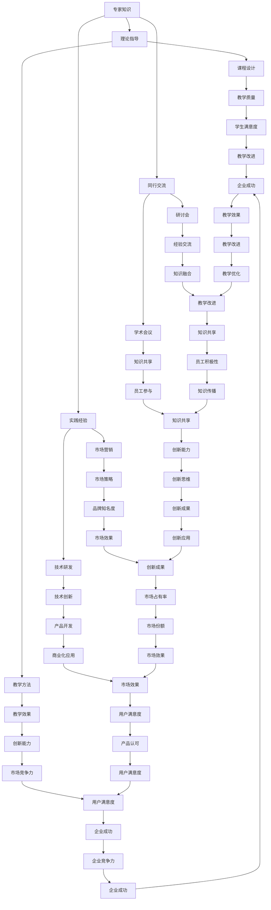

                 

### 摘要

在现代信息技术飞速发展的背景下，知识的权威性成为一个备受关注的话题。本文将深入探讨专家知识与群体智慧这两种知识形式，以及如何实现它们的平衡。首先，我们将定义知识权威性，并探讨其在现代社会中的重要性。接着，本文将详细分析专家知识的来源及其局限性，以及群体智慧的特点和局限性。在此基础上，本文将提出实现专家知识与群体智慧平衡的必要性及其实现路径。随后，我们将探讨专家知识与群体智慧在实际应用中的案例，包括教育、企业和医疗等领域。此外，本文还将介绍数字化工具在促进专家知识与群体智慧融合中的应用，如人工智能算法、社交媒体分析和大数据技术。最后，我们将讨论知识权威性面临的挑战以及未来发展趋势，并通过对教育和管理领域的案例研究，进一步阐述专家知识与群体智慧在实际应用中的有效融合。

### 目录

1. **引言**
    1.1 知识权威性的定义与重要性
    1.2 专家知识与群体智慧
2. **专家知识的本质**
    2.1 专家知识的来源
    2.2 专家知识的局限性
3. **群体智慧的内涵**
    3.1 群体智慧的特点
    3.2 群体智慧的局限性
4. **专家知识与群体智慧的平衡**
    4.1 平衡的必要性
    4.2 平衡的实现路径
5. **专家知识与群体智慧在实际中的应用**
    5.1 教育领域
    5.2 企业管理
    5.3 医疗领域
6. **专家知识与群体智慧的数字化工具**
    6.1 人工智能算法
    6.2 社交媒体分析
    6.3 大数据技术
7. **专家知识与群体智慧的挑战与展望**
    7.1 知识权威性的挑战
    7.2 群体智慧的挑战
    7.3 未来发展趋势
8. **案例分析**
    8.1 案例研究一：专家知识与群体智慧在教育中的应用
    8.2 案例研究二：专家知识与群体智慧在企业管理中的应用
9. **附录**
    9.1 参考文献
    9.2 专家知识与群体智慧的 Mermaid 流程图
    9.3 关键术语解释

### 第一部分：引言

在信息爆炸的时代，知识的权威性成为了现代社会关注的焦点。知识不仅是个人和组织的核心竞争力，更是推动社会进步的重要力量。因此，理解知识权威性，探讨专家知识与群体智慧的关系，以及实现两者的平衡，显得尤为重要。

**1.1 知识权威性的定义与重要性**

知识权威性指的是在某一领域内，知识产生的可信度和影响力。它体现了知识的来源、验证过程以及其在实践中的应用效果。权威性知识通常来源于领域内的专家，这些专家经过长期的实践和研究，积累了丰富的经验和理论知识。权威性知识的重要性在于，它能够为解决问题提供可靠的理论依据和实践指导，提高决策的科学性和准确性。

在现代社会，知识权威性对于个人、组织和社会都具有重要意义。对于个人来说，掌握权威性知识能够提升个人的竞争力，实现职业发展和个人价值的实现。对于组织来说，权威性知识是创新和发展的基石，能够为组织提供战略指导和技术支持。对于社会来说，权威性知识能够促进社会进步和文明发展，推动科学技术的不断进步。

**1.2 专家知识与群体智慧**

专家知识是指领域内专家通过长期实践和研究所积累的专业知识和技能。专家知识具有高度的可靠性和实用性，能够为解决复杂问题提供有效的方案。专家知识通常具有以下特点：

- **专业性**：专家知识具有高度的专业性，它针对特定领域的问题进行深入研究和实践。
- **权威性**：专家知识经过验证和实践，具有较高的可信度和权威性。
- **实践性**：专家知识强调理论联系实际，能够应用于实际问题解决中。

相比之下，群体智慧是指通过集体协作和共享信息，从多个角度和层面解决问题的一种智慧形式。群体智慧具有以下特点：

- **多样性**：群体智慧汇聚了不同个体的经验和观点，具有多样性和开放性。
- **协同性**：群体智慧强调集体协作，通过协同工作和信息共享，实现问题的最优解。
- **灵活性**：群体智慧能够快速适应变化，通过集体智慧和协作，应对复杂和不确定的问题。

在现代社会，专家知识和群体智慧都发挥着重要作用。专家知识为解决专业问题提供了可靠的指导，而群体智慧则能够为决策提供多元化的视角和解决方案。因此，如何实现专家知识与群体智慧的平衡，是一个亟待解决的问题。

### 专家知识的本质

**2.1 专家知识的来源**

专家知识的来源主要包括实践经验、理论学习、同行交流和持续学习。专家通过长期的实践，积累了丰富的经验和技能，形成了专业化的知识体系。这些经验不仅包括具体的操作技巧，还涵盖了处理复杂问题的策略和方法。例如，医生通过多年的临床实践，积累了丰富的诊断和治疗经验，形成了专业的医学知识。

此外，理论学习是专家知识的重要来源。专家通过学习相关领域的理论知识和最新研究成果，不断更新和完善自己的知识体系。理论学习不仅帮助专家理解问题的本质，还能够提供解决复杂问题的理论依据。

同行交流也是专家知识的重要来源。通过参加学术会议、研讨会和交流活动，专家能够与同行分享经验，了解最新的研究进展，从而丰富自己的知识体系。同行交流不仅促进了知识的传播和共享，还促进了学术创新和突破。

最后，持续学习是专家知识不断更新的关键。随着科技的快速发展，知识更新速度加快，专家需要不断学习新的知识和技能，以适应变化。持续学习不仅有助于专家保持专业竞争力，还能够推动整个领域的进步。

**2.2 专家知识的局限性**

尽管专家知识具有高度的专业性和权威性，但它也存在一定的局限性。首先，专家知识的局限性体现在知识的深度和广度上。专家的知识虽然深入，但往往局限于特定的领域和问题。这使得专家在面对跨学科或复杂问题时，可能难以提供全面的解决方案。

其次，专家知识的局限性还体现在知识的更新速度上。由于专家知识的积累需要时间，专家的知识可能存在滞后性。在科技迅速发展的今天，旧的知识可能无法应对新的挑战和变化。

此外，专家知识也可能受到个人经验和文化背景的影响。专家的知识体系往往受到其个人经验和价值观的影响，这可能使得专家在处理问题时存在偏见或局限性。

最后，专家知识的局限性还体现在专家的能力上。尽管专家具有较高的专业水平，但他们在某些情况下可能无法完全理解复杂问题的所有细节。这可能导致专家在解决问题时出现偏差或错误。

### 群体智慧的内涵

**3.1 群体智慧的特点**

群体智慧是一种通过集体协作和共享信息，从多个角度和层面解决问题的一种智慧形式。它具有以下几个显著特点：

- **多样性**：群体智慧汇聚了不同个体的经验和观点，具有多样性和开放性。这种多样性使得群体智慧能够从多个角度分析问题，提供多元化的解决方案。
- **协同性**：群体智慧强调集体协作，通过协同工作和信息共享，实现问题的最优解。协同性使得群体智慧能够整合不同个体的优势和资源，提高解决问题的效率和质量。
- **灵活性**：群体智慧能够快速适应变化，通过集体智慧和协作，应对复杂和不确定的问题。灵活性使得群体智慧在处理突发问题和动态环境时具有优势。

**3.2 群体智慧的局限性**

尽管群体智慧具有许多优点，但它也存在一些局限性。首先，群体智慧的局限性体现在个体贡献的差异上。群体智慧依赖于个体之间的协作和贡献，但个体的知识和技能水平可能存在差异，这可能导致群体智慧的效率和质量受到限制。

其次，群体智慧可能受到信息过载的影响。在信息爆炸的时代，个体接收到的信息量巨大，这可能导致信息筛选和处理的困难。信息过载可能使群体智慧在分析问题时陷入混乱，影响决策的质量。

此外，群体智慧还可能受到群体思维的影响。群体思维是指个体在群体中倾向于遵循多数意见，忽视个人意见的现象。群体思维可能导致群体智慧缺乏创新和多样性，影响决策的全面性和客观性。

最后，群体智慧的实施可能面临协调成本高的问题。群体智慧需要个体之间进行频繁的沟通和协作，这可能导致协调成本增加。在高成本的条件下，群体智慧可能难以持续实施和维持。

### 专家知识与群体智慧的平衡

**4.1 平衡的必要性**

实现专家知识与群体智慧的平衡具有重要的现实意义。首先，专家知识与群体智慧各具优势，通过平衡两者，可以充分发挥各自的优势，提高解决问题的效率和质量。专家知识在解决专业问题、提供理论指导方面具有优势，而群体智慧在应对复杂和不确定的问题、提供多元化解决方案方面具有优势。

其次，平衡专家知识与群体智慧有助于提高决策的科学性和准确性。在决策过程中，仅依靠专家知识可能导致决策的偏见和局限性，而仅依靠群体智慧可能导致决策的盲目和低效。通过平衡两者，可以在决策过程中充分考虑多方面的信息和观点，提高决策的全面性和客观性。

此外，平衡专家知识与群体智慧有助于推动知识创新和进步。专家知识为知识创新提供了理论依据和实践指导，而群体智慧则为知识创新提供了多元化的视角和灵感来源。通过平衡两者，可以促进知识的交流和融合，推动科学技术的不断进步。

**4.2 平衡的实现路径**

要实现专家知识与群体智慧的平衡，可以采取以下实现路径：

1. **建立信息共享机制**：通过建立信息共享平台，促进专家知识和群体智慧的交流和融合。信息共享机制可以包括知识库、论坛、研讨会等形式，为专家和群体提供交流和互动的机会。

2. **加强专家与群体的协作**：通过组织协作项目、跨学科研究团队等形式，促进专家与群体之间的合作。协作可以增强专家对复杂问题的理解，同时提高群体对专业问题的认识。

3. **引入群体智慧工具**：利用人工智能、大数据等技术，开发群体智慧工具，提高群体智慧的效率和准确性。例如，利用人工智能算法进行数据分析和模式识别，利用大数据技术进行趋势预测和决策支持。

4. **培养跨学科人才**：通过教育培养具有跨学科背景的人才，提高专家和群体之间的沟通和协作能力。跨学科人才能够更好地理解和整合专家知识与群体智慧，推动两者的融合。

5. **建立评估机制**：建立科学合理的评估机制，对专家知识与群体智慧的效果进行评估和反馈。评估机制可以包括专家评估、群体反馈、实际应用效果评估等形式，以不断优化专家知识与群体智慧的融合效果。

### 专家知识与群体智慧在实际中的应用

**5.1 教育领域**

在教育领域，专家知识与群体智慧的平衡具有广泛的应用前景。首先，专家知识在教育内容的设计和教学方法的制定中发挥着重要作用。教育专家通过多年的教学实践和研究，积累了丰富的教学经验和专业知识，这些知识为课程设计和教学方法提供了理论指导。

例如，在数学教育中，教育专家可以依据数学理论和教学规律，设计出符合学生认知水平的课程内容，并采用有效的教学方法，提高学生的学习效果。此外，教育专家还可以通过教学研讨会和培训活动，分享教学经验和最新研究成果，促进教师之间的知识交流和共享。

群体智慧在教育领域中的应用主要体现在学生互动和协作学习方面。通过引入协作学习工具和平台，学生可以在线交流和合作，共同完成学习任务。这种互动模式不仅促进了学生之间的知识共享和经验交流，还能够提高学生的合作能力和创新思维。

例如，在项目学习中，学生可以组成小组，共同研究和解决实际问题。小组成员可以通过分工合作、信息共享和讨论交流，充分发挥各自的优势，共同完成任务。这种群体智慧的运用，不仅提高了学习效果，还能够培养学生的团队合作精神和问题解决能力。

**5.2 企业管理**

在企业领域，专家知识与群体智慧的平衡同样具有重要意义。专家知识在企业的战略规划、技术研发和经营管理中发挥着关键作用。企业专家通过对市场趋势、竞争态势和行业动态的深入研究，为企业提供科学的决策依据和战略建议。

例如，在技术研发方面，企业专家可以根据市场需求和科技创新趋势，制定技术发展战略，推动企业的技术进步和创新发展。此外，企业专家还可以通过组织技术研讨会和项目评审，促进技术创新和成果转化。

群体智慧在企业中的应用主要体现在员工参与和集体决策方面。通过建立内部沟通平台和协作工具，企业可以促进员工之间的信息共享和协同工作，提高工作效率和创新能力。例如，在企业决策过程中，可以通过员工投票、头脑风暴和集体讨论等方式，汇集员工的意见和建议，形成科学的决策方案。

此外，群体智慧还可以帮助企业更好地应对市场变化和挑战。通过收集和分析大量市场数据和用户反馈，企业可以及时调整经营策略和产品方向，提高市场竞争力。例如，在产品设计过程中，企业可以通过用户调研和反馈，了解用户需求和市场趋势，优化产品设计，提升用户体验。

**5.3 医疗领域**

在医疗领域，专家知识与群体智慧的平衡对于提高医疗质量和患者满意度具有重要意义。专家知识在医学研究和临床诊断中发挥着关键作用。医学专家通过对疾病的深入研究，积累了丰富的医学知识和临床经验，为疾病诊断和治疗提供了理论依据和实践指导。

例如，在癌症治疗中，医学专家可以根据最新的研究成果和临床数据，制定个性化的治疗方案，提高患者的治疗效果和生存率。此外，医学专家还可以通过学术交流和合作，分享研究成果和临床经验，推动医学领域的进步。

群体智慧在医疗领域中的应用主要体现在患者互动和医疗决策方面。通过建立患者交流平台和医疗决策支持系统，患者可以在线分享病情和治疗经验，获得其他患者的建议和支持。这种互动模式不仅有助于患者获取更多的医疗信息，还能够提高患者的满意度和信任度。

例如，在疾病治疗过程中，患者可以通过在线平台分享自己的病情和治疗经历，获得其他患者的建议和支持。这种群体智慧的运用，可以帮助患者更好地理解疾病，提高治疗的信心和效果。此外，患者还可以参与医疗决策，通过与医生的讨论和交流，共同制定治疗计划，提高治疗的科学性和个性化。

### 专家知识与群体智慧的数字化工具

**6.1 人工智能算法**

人工智能算法在促进专家知识与群体智慧的融合中发挥了重要作用。通过机器学习和深度学习技术，人工智能算法可以从海量数据中提取有价值的信息，为专家知识和群体智慧提供支持。

例如，在医疗领域，人工智能算法可以通过分析大量患者的临床数据和文献资料，提取疾病的特征和规律，为医学专家提供诊断和治疗建议。此外，人工智能算法还可以用于医疗图像分析和基因测序，提高医学诊断和治疗的准确性和效率。

在企业管理中，人工智能算法可以用于市场趋势分析和用户行为预测，为企业提供战略决策支持。例如，通过分析消费者的购物数据和社交媒体评论，人工智能算法可以预测市场需求和用户偏好，帮助企业制定有效的营销策略。

**6.2 社交媒体分析**

社交媒体分析是一种利用人工智能技术，对社交媒体平台上的用户生成内容进行分析和挖掘的方法。通过社交媒体分析，可以了解用户的观点、需求和偏好，为专家知识和群体智慧提供数据支持。

在教育领域，社交媒体分析可以帮助教育专家了解学生的学习情况和需求，优化教学内容和教学方法。例如，通过分析学生在社交媒体上的讨论和评论，教育专家可以了解学生对课程内容的理解和反馈，调整教学策略，提高教学质量。

在企业管理中，社交媒体分析可以帮助企业了解消费者的反馈和需求，优化产品设计和营销策略。例如，通过分析消费者的社交媒体评论和反馈，企业可以了解消费者对产品的满意度和不满意度，及时调整产品设计和营销策略，提高消费者满意度。

**6.3 大数据技术**

大数据技术是一种处理海量数据的计算技术，通过对数据的收集、存储、分析和挖掘，可以提取有价值的信息和知识。大数据技术在促进专家知识与群体智慧的融合中发挥了重要作用。

在教育领域，大数据技术可以用于学习分析和教育评估。通过分析学生的学习行为和成绩数据，教育专家可以了解学生的学习效果和问题，为教学提供科学依据。此外，大数据技术还可以用于个性化学习推荐，根据学生的学习特点和需求，提供个性化的学习资源和指导。

在企业管理中，大数据技术可以用于市场分析和消费者行为研究。通过分析消费者的购买记录和行为数据，企业可以了解市场需求和消费者偏好，制定有效的营销策略。此外，大数据技术还可以用于供应链优化和风险控制，提高企业的运营效率和竞争力。

### 专家知识与群体智慧的挑战与展望

**7.1 知识权威性的挑战**

在信息技术飞速发展的背景下，知识权威性面临着一系列挑战。首先，信息的爆炸式增长使得知识更新的速度加快，传统的权威性知识可能难以应对新的挑战和变化。这要求专家不断更新和扩展自己的知识体系，以保持权威性。

其次，互联网的普及和社交媒体的兴起，使得信息传播的速度和范围大大增加。这可能导致知识的权威性受到质疑，因为任何人都可以在互联网上发布信息，而信息的真实性和可靠性难以保证。这要求建立更加严格的信息验证和评估机制，确保知识的权威性。

此外，知识权威性还面临着个体认知差异和文化背景的影响。不同专家和群体对同一问题的看法和解决方案可能存在差异，这可能导致知识权威性的分散和多元化。这要求在尊重个体差异的基础上，实现知识的整合和统一。

**7.2 群体智慧的挑战**

群体智慧虽然在解决问题和决策中具有优势，但也面临着一系列挑战。首先，群体智慧依赖于个体之间的协作和共享信息，但个体之间的知识和技能水平可能存在差异，这可能导致群体智慧的效率和质量受到限制。

其次，群体智慧可能受到信息过载的影响。在信息爆炸的时代，个体接收到的信息量巨大，这可能导致信息筛选和处理的困难。信息过载可能使群体智慧在分析问题时陷入混乱，影响决策的质量。

此外，群体智慧还可能受到群体思维的影响。群体思维是指个体在群体中倾向于遵循多数意见，忽视个人意见的现象。群体思维可能导致群体智慧缺乏创新和多样性，影响决策的全面性和客观性。

**7.3 未来发展趋势**

展望未来，专家知识与群体智慧的融合将呈现以下发展趋势：

首先，人工智能和大数据技术的发展将为专家知识与群体智慧的融合提供新的工具和方法。通过人工智能算法，可以从海量数据中提取有价值的信息，为专家知识和群体智慧提供支持。大数据技术则可以用于知识管理和决策支持，提高专家知识和群体智慧的效率和质量。

其次，跨界融合将成为专家知识与群体智慧发展的重要趋势。通过跨学科合作和多元化视角，可以实现专家知识与群体智慧的深度融合，推动知识的创新和进步。

此外，信息验证和评估机制将不断完善，确保知识的权威性和可靠性。通过建立科学的信息验证和评估机制，可以有效识别和筛选高质量的知识，提高知识的权威性和影响力。

最后，个体认知差异和文化背景的影响将得到更好的尊重和整合。通过尊重个体差异，实现知识的多元化和统一，推动专家知识与群体智慧的全面发展。

### 案例研究一：专家知识与群体智慧在教育中的应用

**8.1 案例背景**

随着互联网和信息技术的发展，教育领域正在经历深刻的变革。传统的教育模式越来越难以满足学生个性化学习和发展的需求。为了提高教育质量和促进学生的全面发展，许多教育机构和教育工作者开始探索专家知识与群体智慧相结合的教育模式。

**8.2 专家知识的应用**

在教育领域，专家知识在教育内容的设计和教学方法的选择中发挥着重要作用。教育专家通过多年的教学实践和研究，积累了丰富的教学经验和专业知识，这些知识为课程设计和教学方法提供了理论指导。

例如，在某知名大学的计算机科学课程中，教育专家根据最新的科研进展和技术发展趋势，设计了一套涵盖前沿技术的课程体系。该课程体系不仅包括了传统的计算机科学理论，还涵盖了人工智能、大数据和区块链等新兴技术。通过引入这些前沿技术，教育专家为学生提供了更加全面和实用的知识体系，提高了学生的专业素养和创新能力。

此外，教育专家还通过参与学术会议、研讨会和交流活动，分享自己的教学经验和研究成果，促进教师之间的知识交流和共享。例如，在某次教育研讨会上，教育专家通过分享自己在教学中的创新做法和成功经验，为其他教师提供了有益的参考和启示，推动了教学方法的创新和进步。

**8.3 群体智慧的应用**

群体智慧在教育领域中的应用主要体现在学生互动和协作学习方面。通过引入协作学习工具和平台，学生可以在线交流和合作，共同完成学习任务。这种互动模式不仅促进了学生之间的知识共享和经验交流，还能够提高学生的合作能力和创新思维。

例如，在某次小组项目学习中，学生被分成多个小组，每个小组负责完成一个特定的项目任务。小组成员可以通过在线平台共享资源和信息，分工合作，共同解决问题。在项目过程中，小组成员之间进行了多次讨论和交流，共同探讨项目方案，最终完成了高质量的项目成果。通过这种群体智慧的运用，学生不仅提高了学习效果，还培养了团队合作精神和问题解决能力。

此外，在教育评估中，群体智慧也可以发挥重要作用。通过引入群体评价机制，学生可以参与到课程评价中，为课程提供反馈和建议。例如，在某次课程评价中，学生通过在线平台对课程内容、教学方法、教学效果等方面进行了评价，并提出了改进意见。教育专家根据学生的反馈，对课程进行了调整和优化，提高了教学效果和学生的满意度。

**8.4 专家知识与群体智慧融合的效果**

通过专家知识与群体智慧的融合，教育质量和学生的学习效果得到了显著提升。首先，专家知识为课程设计和教学方法提供了科学的理论依据和实践指导，提高了课程的专业性和实用性。学生通过学习前沿技术和创新方法，不仅拓宽了知识视野，还提高了专业素养和创新能力。

其次，群体智慧的应用促进了学生之间的互动和协作，提高了学生的学习效果和合作能力。通过在线平台，学生可以方便地共享资源和信息，分工合作，共同解决问题。这种互动模式不仅提高了学习效率，还培养了学生的团队合作精神和创新思维。

此外，专家知识与群体智慧的融合还有助于提高教学评估的科学性和全面性。通过引入群体评价机制，学生可以参与到课程评价中，为课程提供真实的反馈和建议。教育专家根据学生的反馈，对课程进行优化和调整，提高了教学效果和学生的满意度。

总之，通过专家知识与群体智慧的融合，教育质量和学生的学习效果得到了显著提升。这种教育模式不仅适应了现代社会的发展需求，还为学生提供了更加全面和实用的知识体系，促进了学生的全面发展。

### 案例研究二：专家知识与群体智慧在企业管理中的应用

**9.1 案例背景**

在企业管理中，专家知识与群体智慧的融合已经成为提升企业竞争力、促进企业发展的关键因素。随着市场竞争的加剧和商业环境的不断变化，企业需要不断创新和优化管理策略，以应对复杂多变的挑战。为了实现这一目标，许多企业开始探索专家知识与群体智慧相结合的管理模式。

**9.2 专家知识的应用**

在企业管理中，专家知识在战略规划、技术研发和市场营销等方面发挥着重要作用。企业专家通过多年的实践和研究，积累了丰富的专业知识和经验，这些知识为企业的决策提供了科学依据和指导。

首先，在战略规划方面，企业专家通过对市场趋势、竞争态势和行业动态的深入研究，为企业制定科学合理的战略规划。例如，在某家高科技企业中，企业专家通过分析市场需求和技术发展趋势，制定了以技术创新为核心的战略规划，推动企业向高端技术领域发展，取得了显著的经营成果。

其次，在技术研发方面，企业专家通过参与技术研发和创新项目，推动企业技术水平的提升。例如，在某次重要技术研发项目中，企业专家结合自己的专业知识和实践经验，提出了一系列创新性的技术方案，推动了项目的成功实施和产品的商业化应用。

此外，在市场营销方面，企业专家通过分析消费者行为和市场数据，为企业制定有效的市场营销策略。例如，在某次市场营销活动中，企业专家通过分析消费者的购买记录和社交媒体评论，确定了目标消费者的偏好和需求，制定了精准的市场营销策略，提高了市场占有率和品牌知名度。

**9.3 群体智慧的应用**

群体智慧在企业管理中主要体现在员工参与和集体决策方面。通过引入群体智慧和协作工具，企业可以激发员工的创新思维和参与热情，提高决策的科学性和执行力。

首先，在员工参与方面，企业通过建立内部沟通平台和协作工具，促进员工之间的交流和互动。例如，在某次产品开发项目中，企业通过内部论坛和协作工具，组织了多部门、多层次的讨论和协作，汇集了员工的智慧和建议，形成了创新性的产品方案。

其次，在集体决策方面，企业通过引入群体决策支持系统，提高决策的科学性和全面性。例如，在某次重要决策中，企业通过群体决策支持系统，收集了不同部门和员工的意见和建议，进行了全面的分析和评估，制定了科学的决策方案，有效降低了决策风险，提高了决策质量。

此外，群体智慧在员工培训和知识共享方面也发挥了重要作用。通过建立员工知识库和培训平台，企业可以促进员工之间的知识共享和经验交流，提高员工的综合素质和创新能力。例如，在某次员工培训活动中，企业通过线上平台，组织了多场专题讲座和技能培训，汇集了内部专家和外部专家的智慧，为员工提供了丰富的学习资源和培训机会。

**9.4 专家知识与群体智慧融合的效果**

通过专家知识与群体智慧的融合，企业管理水平和员工素质得到了显著提升，企业竞争力得到了有效增强。首先，专家知识为企业的决策提供了科学依据和指导，提高了决策的科学性和准确性，降低了决策风险。例如，在战略规划和市场营销方面，企业专家通过深入研究和分析，制定了科学合理的战略规划和营销策略，取得了显著的经营成果。

其次，群体智慧的应用激发了员工的创新思维和参与热情，提高了企业的创新能力和执行力。通过引入群体智慧和协作工具，企业形成了开放、创新和协作的企业文化，促进了员工的积极性和创造力。例如，在产品开发和员工培训方面，企业通过群体智慧和协作工具，促进了员工之间的知识共享和经验交流，提高了员工的综合素质和创新能力。

此外，专家知识与群体智慧的融合还有助于提高企业的市场竞争力。通过结合专家知识和群体智慧，企业能够更加准确地把握市场趋势和消费者需求，制定有效的市场营销策略，提高市场占有率和品牌知名度。例如，在市场营销方面，企业通过分析消费者行为和市场数据，制定了精准的市场营销策略，取得了显著的市场效果。

总之，通过专家知识与群体智慧的融合，企业管理水平和员工素质得到了显著提升，企业竞争力得到了有效增强。这种管理模式不仅适应了现代企业管理的发展需求，还为企业的持续创新和长期发展提供了有力支持。

### 附录

#### 附录A：参考文献

1. Barabási, A.-L. (2002). Linked: The New Science of Networks. Plume.
2. Davenport, T. H., & Prusak, L. (1998). Working Knowledge: How Organizations Manage What They Know. Harvard Business Press.
3. Simon, H. A. (1969). The Sciences of the Artificial. MIT Press.
4. Surowiecki, J. (2004). The Wisdom of Crowds: Why the Many Are Smarter Than the Few. Doubleday.
5. Nonaka, I., & Takeuchi, H. (1995). The Knowledge-Creating Company: How Japanese Companies Create the Dynamics of Innovation. Oxford University Press.

#### 附录B：专家知识与群体智慧的 Mermaid 流程图

#### 附录C：关键术语解释

- **知识权威性**：在某一领域内，知识产生的可信度和影响力。
- **专家知识**：领域内专家通过长期实践和研究所积累的专业知识和技能。
- **群体智慧**：通过集体协作和共享信息，从多个角度和层面解决问题的一种智慧形式。
- **信息过载**：个体接收到的信息量过大，导致信息筛选和处理困难。
- **群体思维**：个体在群体中倾向于遵循多数意见，忽视个人意见的现象。
- **跨界融合**：跨学科合作和多元化视角的结合，推动知识的创新和进步。

