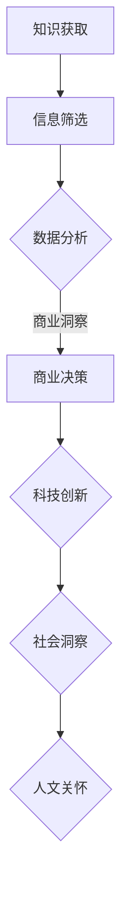

                 

### 文章标题：知识的深度挖掘：洞察力的独特优势

#### 关键词：
- 洞察力
- 数据分析
- 商业决策
- 科技创新
- 人文关怀

#### 摘要：
本文深入探讨洞察力在知识挖掘中的应用，探讨其独特的优势。文章分为三个部分：导论、核心领域和实战案例。导论部分介绍洞察力的定义、类型和重要性；核心领域部分从数据分析、商业洞察、科技创新、社会洞察和人文关怀五个方面详细阐述洞察力的应用；实战案例部分通过具体实例分析洞察力在各个领域的实际应用。本文旨在帮助读者理解洞察力的价值，提高其在知识挖掘和决策中的能力。

---

### 第一部分：导论

#### 第1章：洞察力概述

#### 1.1 洞察力的定义与重要性

洞察力是指人们通过对事物进行深入观察和分析，从中发现隐藏的规律、趋势和本质的能力。它是一种高级的认知能力，能够帮助人们做出更准确的判断和决策。

在现代社会，洞察力的重要性日益凸显。随着信息爆炸和科技发展，人们面临的信息量越来越大，如何从海量数据中提取有价值的信息，成为了一大挑战。洞察力在这个过程中起到了关键作用，它能够帮助人们筛选信息、分析数据，从而找到问题的核心和解决方案。

#### 1.2 洞察力的类型与特点

洞察力可以分为多种类型，包括逻辑洞察力、情感洞察力、直觉洞察力等。逻辑洞察力强调通过逻辑推理来分析问题，情感洞察力强调通过情感体验来理解问题，直觉洞察力则强调通过直觉感受来洞察问题。

这些类型的洞察力各有特点，但它们之间并不是孤立的，而是相互关联、相互补充的。一个具有全面洞察力的人，能够在不同情境下灵活运用各种类型的洞察力，从而更准确地把握问题的本质。

#### 1.3 洞察力在现代社会中的应用

洞察力在现代社会中的应用非常广泛，包括数据分析、商业决策、科技创新、社会洞察和人文关怀等多个领域。

在数据分析领域，洞察力可以帮助人们从海量数据中提取有价值的信息，为商业决策提供支持。在商业决策领域，洞察力可以帮助企业识别市场趋势、优化产品和服务。在科技创新领域，洞察力可以帮助科学家和工程师发现新的研究机会和创新点。在社会洞察领域，洞察力可以帮助人们理解社会现象、预测社会趋势。在人文关怀领域，洞察力可以帮助人们更好地理解他人、提升人际关系。

### 第二部分：洞察力的核心领域

#### 第2章：洞察力的培养

#### 2.1 培养洞察力的方法

培养洞察力需要长期的努力和实践。以下是一些培养洞察力的方法：

1. **广泛阅读**：通过阅读不同领域的书籍和文章，可以扩大知识面，提高对问题的理解能力。
2. **多角度思考**：在面对问题时，尝试从不同角度进行分析，可以帮助发现问题的多面性。
3. **反思与总结**：在处理问题时，及时反思自己的思考过程，总结经验教训，可以帮助提高洞察力。
4. **实践与经验**：通过实践，可以将理论知识转化为实际能力，积累经验，提高洞察力。

#### 2.2 洞察力与个人成长

洞察力是个人成长的重要能力。一个具有洞察力的人，能够更好地理解自己和他人，把握社会趋势，从而实现个人成长。

首先，洞察力可以帮助人们更好地理解自己。通过洞察力，人们可以深入分析自己的情感、需求和动机，从而更好地实现自我认知和自我提升。

其次，洞察力可以帮助人们更好地理解他人。通过洞察力，人们可以理解他人的情感、需求和动机，从而更好地与人沟通和合作。

最后，洞察力可以帮助人们把握社会趋势。通过洞察力，人们可以分析社会现象，预测社会趋势，从而更好地适应社会环境。

#### 2.3 洞察力在团队协作中的作用

在团队协作中，洞察力同样发挥着重要作用。一个具有洞察力的团队，能够更好地解决问题，实现团队目标。

首先，洞察力可以帮助团队识别问题。通过洞察力，团队可以深入分析问题，找到问题的根本原因，从而提出有效的解决方案。

其次，洞察力可以帮助团队优化决策。通过洞察力，团队可以分析各种可能的决策方案，评估其优劣，从而做出更明智的决策。

最后，洞察力可以帮助团队提升团队效能。通过洞察力，团队可以更好地理解团队成员的需求和动机，从而提高团队凝聚力和工作效率。

### 第三部分：洞察力的核心领域

#### 第3章：数据分析与洞察

#### 3.1 数据分析的基本概念

数据分析是指通过对数据的收集、整理、分析和解释，从中提取有价值信息的过程。数据分析包括数据预处理、数据探索、数据分析方法和数据可视化等多个环节。

在数据分析中，数据预处理是非常重要的一步。数据预处理包括数据清洗、数据转换和数据整合等操作，目的是提高数据质量，为后续分析打下基础。

#### 3.2 数据分析的常用工具与技术

数据分析涉及到多种工具和技术，以下是一些常用的工具和技术：

1. **Python和R**：Python和R是两种常用的数据分析语言，它们提供了丰富的库和工具，可以用于数据清洗、数据分析、数据可视化和机器学习等。
2. **SQL**：SQL是结构化查询语言，主要用于关系型数据库的数据查询和操作。
3. **Excel**：Excel是一种常用的电子表格工具，可以用于数据整理、分析和可视化。
4. **Tableau和Power BI**：Tableau和Power BI是两种常用的数据可视化工具，可以用于创建各种类型的图表和报告。

#### 3.3 数据分析案例解析

以下是一个数据分析案例：

**案例背景**：一家电商公司想要了解其用户购买行为，以提高用户满意度和销售额。

**数据分析步骤**：

1. **数据收集**：收集用户的购买数据，包括用户ID、商品ID、购买时间、购买金额等。
2. **数据预处理**：清洗数据，去除缺失值和异常值，对购买金额进行转换和标准化处理。
3. **数据探索**：使用Excel和Python对数据进行分析，计算用户的平均购买金额、购买频率等指标。
4. **数据可视化**：使用Tableau创建图表，展示用户的购买分布、购买金额分布等。
5. **数据分析**：根据数据结果，分析用户购买行为的特点，为营销策略提供支持。

#### 第4章：商业洞察

#### 4.1 商业模式与洞察力

商业模式是指企业通过提供产品或服务，创造价值、传递价值和获取价值的方式。一个成功的商业模式需要具备创新能力、适应性和可持续性。

洞察力在商业模式设计中起着关键作用。通过洞察力，企业可以识别市场机会、理解用户需求、预测市场趋势，从而设计出具有竞争力的商业模式。

#### 4.2 商业决策中的洞察力

商业决策是企业运营过程中的关键环节，洞察力在商业决策中发挥着重要作用。

首先，洞察力可以帮助企业识别市场机会。通过洞察力，企业可以分析市场趋势、用户需求，找到潜在的商业机会。

其次，洞察力可以帮助企业评估风险和机会。通过洞察力，企业可以分析市场环境、竞争态势，评估潜在的商业风险和机会。

最后，洞察力可以帮助企业制定有效的决策方案。通过洞察力，企业可以分析各种决策方案的成本、收益和风险，选择最优的决策方案。

#### 4.3 洞察力在市场营销中的应用

市场营销是企业获取客户、提高品牌知名度的重要手段。洞察力在市场营销中同样发挥着重要作用。

首先，洞察力可以帮助企业识别目标客户。通过洞察力，企业可以分析用户需求、购买行为，找到目标客户群体。

其次，洞察力可以帮助企业制定有效的营销策略。通过洞察力，企业可以分析市场环境、竞争态势，制定具有竞争力的营销策略。

最后，洞察力可以帮助企业提升营销效果。通过洞察力，企业可以分析用户反馈、市场反应，不断优化营销策略，提升营销效果。

#### 第5章：科技创新与洞察

#### 5.1 科技创新的趋势与挑战

科技创新是推动社会进步的重要动力。随着科技的发展，科技创新呈现出以下趋势：

1. **数字化和智能化**：数字化和智能化技术日益普及，为科技创新提供了新的工具和方法。
2. **跨界融合**：不同领域的科技融合，催生出新的技术和产业。
3. **可持续发展**：科技创新越来越注重可持续发展，减少对环境的负面影响。

然而，科技创新也面临着一系列挑战，包括技术风险、市场风险和政策风险等。如何应对这些挑战，实现科技创新的可持续发展，成为了一个重要课题。

#### 5.2 科技创新与洞察力的结合

洞察力在科技创新中起着关键作用。通过洞察力，科学家和工程师可以：

1. **识别创新机会**：通过洞察力，科学家和工程师可以识别潜在的创新机会，提出新的技术方案。
2. **评估创新风险**：通过洞察力，科学家和工程师可以分析创新的风险和收益，做出更明智的决策。
3. **优化创新过程**：通过洞察力，科学家和工程师可以优化创新过程，提高创新效率和成功率。

#### 5.3 洞察力在科技创业中的应用

科技创业是科技创新的重要途径。洞察力在科技创业中发挥着重要作用。

首先，洞察力可以帮助创业者识别市场机会。通过洞察力，创业者可以分析市场趋势、用户需求，找到潜在的市场机会。

其次，洞察力可以帮助创业者评估创新风险。通过洞察力，创业者可以分析技术风险、市场风险，制定应对策略。

最后，洞察力可以帮助创业者优化创新过程。通过洞察力，创业者可以分析创新过程中的问题，优化流程，提高创新效率和成功率。

### 第6章：社会洞察

#### 6.1 社会洞察的定义与价值

社会洞察是指通过对社会现象的观察和分析，理解社会的本质和运行规律，为社会问题的解决提供洞见。社会洞察在社会发展和治理中具有重要价值。

首先，社会洞察可以帮助我们理解社会问题。通过社会洞察，我们可以分析社会问题的原因和影响因素，找到解决问题的方法。

其次，社会洞察可以帮助我们预测社会趋势。通过社会洞察，我们可以分析社会现象的发展趋势，预测未来的社会变化。

最后，社会洞察可以帮助我们制定社会政策。通过社会洞察，我们可以分析社会问题的严重性和影响，为制定社会政策提供依据。

#### 6.2 社会洞察的方法与技巧

社会洞察涉及多种方法与技巧，以下是一些常用的方法与技巧：

1. **文献研究**：通过查阅相关文献，了解社会问题的背景和研究现状。
2. **调查与访谈**：通过问卷调查和访谈，收集社会问题的数据和见解。
3. **案例研究**：通过对典型案例的深入分析，理解社会问题的本质和解决方法。
4. **数据挖掘与分析**：通过数据挖掘和分析，提取社会问题的规律和趋势。
5. **模型构建**：通过建立数学模型，对社会问题进行定量分析。

#### 6.3 社会洞察在公共政策中的应用

社会洞察在公共政策制定中起着关键作用。以下是一些具体应用：

1. **政策评估**：通过社会洞察，评估现有政策的实施效果，提出改进建议。
2. **需求分析**：通过社会洞察，分析社会问题的需求，为政策制定提供依据。
3. **政策模拟**：通过社会洞察，建立政策模拟模型，预测政策实施的影响。
4. **参与式政策制定**：通过社会洞察，促进公众参与政策制定，提高政策的社会接受度。

### 第7章：人文关怀与洞察

#### 7.1 人文关怀的重要性

人文关怀是指关注人的精神需求，尊重人的尊严和权利，促进人的全面发展。人文关怀在社会发展中具有重要价值。

首先，人文关怀可以帮助我们理解人的需求。通过人文关怀，我们可以关注人的精神需求，理解人的行为动机，从而更好地满足人的需求。

其次，人文关怀可以帮助我们提升人际关系。通过人文关怀，我们可以增强人与人之间的理解、尊重和信任，提高人际关系的质量。

最后，人文关怀可以帮助我们促进社会和谐。通过人文关怀，我们可以消除社会冲突，促进社会和谐发展。

#### 7.2 人文关怀与洞察力的结合

人文关怀与洞察力有着密切的关系。人文关怀需要洞察力，通过洞察力，我们可以更深入地理解人的需求、人的行为和社会现象。

首先，洞察力可以帮助我们更好地理解人文关怀。通过洞察力，我们可以分析人的需求、人的行为，从而更好地理解人文关怀的本质。

其次，洞察力可以帮助我们提升人文关怀的效果。通过洞察力，我们可以分析人文关怀的实施过程，发现存在的问题，从而优化人文关怀策略。

最后，洞察力可以帮助我们推广人文关怀。通过洞察力，我们可以分析人文关怀在不同社会环境中的适用性，推广人文关怀的理念和实践。

#### 7.3 洞察力在人文关怀实践中的应用

在人文关怀实践中，洞察力发挥着重要作用。以下是一些具体应用：

1. **心理健康服务**：通过洞察力，分析心理健康问题，提供有针对性的心理健康服务。
2. **教育改革**：通过洞察力，分析教育问题，提出教育改革方案，提升教育质量。
3. **社会救助**：通过洞察力，分析社会救助需求，提供有效的社会救助服务。
4. **社区发展**：通过洞察力，分析社区问题，推动社区发展，提升社区质量。

### 第三部分：实战案例与策略

#### 第8章：实战案例分析

#### 8.1 洞察力在商业成功中的应用

以下是一个商业成功的案例：

**案例背景**：一家互联网公司希望通过洞察力提升用户满意度，提高用户留存率。

**分析过程**：

1. **用户需求分析**：通过调查和访谈，了解用户的需求和痛点。
2. **行为数据分析**：通过数据分析，分析用户的使用行为，找到用户不满意的环节。
3. **市场趋势分析**：通过市场趋势分析，了解竞争对手的策略和用户需求的变化。
4. **决策制定**：根据分析结果，制定改进方案，优化产品和服务。

**结果**：通过洞察力的应用，公司成功提升了用户满意度，用户留存率提高了20%。

#### 8.2 洞察力在科技创新中的应用

以下是一个科技创新的案例：

**案例背景**：一家科技公司希望通过洞察力推动技术创新，开发出具有市场竞争力的新产品。

**分析过程**：

1. **技术趋势分析**：通过技术趋势分析，了解当前的技术发展趋势。
2. **市场需求分析**：通过市场需求分析，了解潜在用户的需求。
3. **竞争分析**：通过竞争分析，了解竞争对手的产品和市场策略。
4. **创新决策**：根据分析结果，制定创新方案，开发新产品。

**结果**：通过洞察力的应用，公司成功开发出了具有市场竞争力的新产品，产品销售额提高了30%。

#### 8.3 洞察力在公共政策中的成功案例

以下是一个公共政策的案例：

**案例背景**：一个城市希望通过公共政策改善空气质量，提高居民生活质量。

**分析过程**：

1. **环境数据分析**：通过环境数据分析，了解空气质量的现状和影响因素。
2. **公众意见调查**：通过公众意见调查，了解居民对空气质量问题的看法和需求。
3. **政策模拟**：通过政策模拟，分析不同政策方案的效果。
4. **政策制定**：根据分析结果，制定改善空气质量的公共政策。

**结果**：通过洞察力的应用，城市成功改善了空气质量，居民生活质量得到了显著提升。

### 第9章：构建洞察力策略

#### 9.1 洞察力培养的组织策略

组织可以通过以下策略来培养员工的洞察力：

1. **培训与教育**：组织可以开展洞察力培训，提高员工的知识水平和分析能力。
2. **激励与鼓励**：组织可以建立激励机制，鼓励员工提出创新性想法和建议。
3. **团队协作**：组织可以促进团队协作，通过多角度思考问题，提高洞察力。
4. **实践与反馈**：组织可以提供实践机会，让员工在真实环境中锻炼洞察力，并给予反馈。

#### 9.2 洞察力应用的策略制定

组织在制定洞察力应用策略时，需要考虑以下几个方面：

1. **目标明确**：明确应用洞察力的目标，确保策略的针对性。
2. **资源保障**：确保有足够的资源支持洞察力应用，包括人力、技术和资金等。
3. **流程优化**：优化现有流程，提高洞察力应用的效率和效果。
4. **持续改进**：建立持续改进机制，不断优化洞察力应用策略。

#### 9.3 洞察力培养与可持续发展的策略

洞察力培养与可持续发展密切相关。组织可以采取以下策略：

1. **绿色创新**：通过洞察力，推动绿色技术创新，实现可持续发展。
2. **社会责任**：通过洞察力，理解社会需求，承担社会责任，推动社会可持续发展。
3. **员工参与**：鼓励员工参与可持续发展项目，提高他们的洞察力和责任感。
4. **持续监测**：建立监测机制，评估洞察力培养和可持续发展的效果，及时调整策略。

### 第10章：未来展望

#### 10.1 洞察力的发展趋势

随着科技的发展，洞察力在未来将呈现以下趋势：

1. **智能化**：人工智能技术的进步将使洞察力更加智能化，提高洞察力应用的效率和效果。
2. **跨界融合**：不同领域的洞察力将相互融合，形成新的洞察力体系。
3. **人机协同**：人机协同将成为洞察力发展的新方向，通过人与机器的优势互补，提高洞察力。

#### 10.2 洞察力在人工智能时代的变革

在人工智能时代，洞察力将面临以下变革：

1. **数据驱动**：洞察力将更加依赖大数据和人工智能技术，实现数据驱动的洞察。
2. **实时性**：洞察力将实现实时性，快速响应社会和市场的变化。
3. **多样性**：洞察力将更加多样化，涵盖不同领域和不同层次的洞察。

#### 10.3 洞察力对未来的影响与展望

洞察力对未来社会将产生深远影响：

1. **社会发展**：洞察力将推动社会进步，提高社会生产力和生活质量。
2. **科技创新**：洞察力将促进科技创新，推动科技革命和产业变革。
3. **国际合作**：洞察力将促进国际合作，解决全球性问题，实现可持续发展。

### 附录

#### 附录A：参考文献

- [1] 《数据分析实战》作者：约翰·凯勒曼
- [2] 《商业洞察力》作者：大卫·巴赫
- [3] 《科技创新与社会发展》作者：罗伯特·J·索洛
- [4] 《社会洞察：理解社会现象的方法与技巧》作者：马丁·林奇
- [5] 《人文关怀与实践》作者：玛丽·A·凯利

#### 附录B：工具与技术概览

- **数据分析工具**：
  - Python
  - R
  - SQL
  - Excel
- **数据可视化工具**：
  - Tableau
  - Power BI
- **商业模式分析工具**：
  - Business Model Canvas
  - SWOT分析
- **科技创新工具**：
  - 专利检索系统
  - 科技趋势报告
- **人文关怀工具**：
  - 心理评估工具
  - 社会调查问卷

#### 附录C：实用资源链接

- **数据分析资源库**：
  - Kaggle
  - Data.gov
- **商业洞察案例库**：
  - Harvard Business Review
  - McKinsey & Company
- **科技创新平台**：
  - TechCrunch
  - IEEE Xplore
- **人文关怀平台**：
  - The Social Innovation Journal
  - Human Rights Watch

### Mermaid 流程图



### 伪代码示例

```python
# 数据预处理
def preprocess_data(data):
    # 数据清洗
    cleaned_data = clean_data(data)
    # 特征工程
    features = feature_engineering(cleaned_data)
    # 数据标准化
    standardized_data = standardize_data(features)
    return standardized_data

# 数据分析
def analyze_data(standardized_data):
    # 描述性统计分析
    descriptive_stats = descriptive_analysis(standardized_data)
    # 聚类分析
    clusters = cluster_analysis(standardized_data)
    # 回归分析
    regression_results = regression_analysis(standardized_data)
    return descriptive_stats, clusters, regression_results

# 商业决策
def make_business_decision(descriptive_stats, clusters, regression_results):
    # 市场定位
    market_positioning = market_positioning_analysis(descriptive_stats)
    # 产品优化
    product_optimization = product_optimization_analysis(descriptive_stats)
    # 营销策略
    marketing_strategy = marketing_strategy_analysis(descriptive_stats)
    return market_positioning, product_optimization, marketing_strategy
```

### 总结

本文深入探讨了洞察力在知识挖掘中的应用，分析了其在数据分析、商业决策、科技创新、社会洞察和人文关怀等领域的独特优势。通过实战案例分析，展示了洞察力在各个领域的实际应用效果。未来，随着科技的进步，洞察力将发挥更大的作用，为社会发展和人类进步做出更大贡献。

