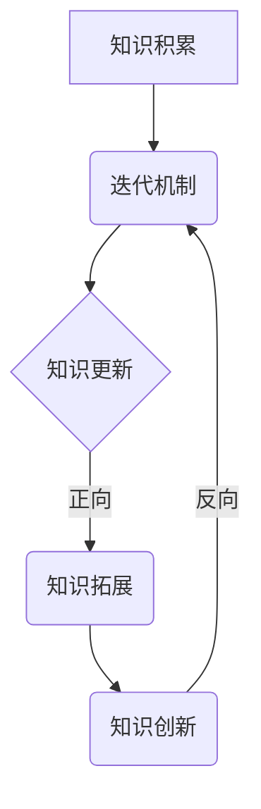
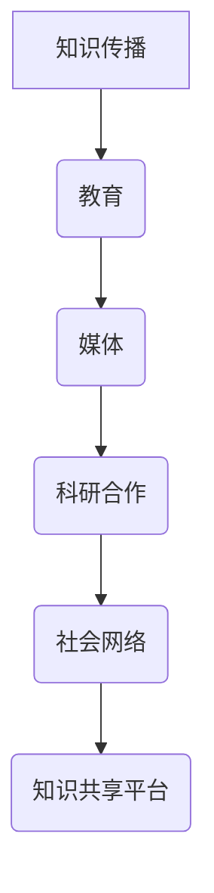
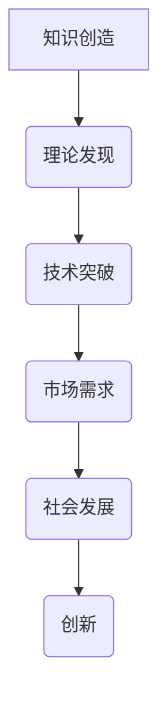

                 


### 1. 引言：知识演化的重要性

**背景介绍**

知识，作为人类智慧的结晶，是推动社会进步、技术发展和文明演进的核心动力。从古至今，知识的演化历程贯穿了人类历史的方方面面，从古代文明的发明创造，到中世纪的学问沉淀，再到近现代科学的崛起，以及当代科技的迅猛发展，知识不断积累、迭代和扩展，形成了今天我们所看到的丰富多彩的知识体系。

**核心概念与联系**

在本篇文章中，我们将深入探讨知识的演化过程，从历史的角度分析知识在不同时期的传承与变革。首先，我们需要理解几个核心概念：

- **知识**：指人类通过观察、思考和实践所获得的有关自然界、社会和思维的信息、技能和理论。
- **知识传承**：指知识在不同时间、空间和群体之间的传递过程，包括知识的积累、保存、传播和创新。
- **知识积累**：指知识在一段时间内不断积累、丰富和扩展的过程。
- **知识迭代**：指知识在原有基础上不断更新、完善和优化的过程。

这些概念相互联系，共同构成了知识演化的核心框架。知识积累是知识迭代的基础，而知识迭代又推动知识积累的深化。知识的传播与共享是知识传承的关键，通过教育、技术手段和社交网络，知识得以广泛传播和共享。最后，知识的创造与创新是知识演化的终极目标，通过不断的创新，知识得以突破和发展。

**Mermaid流程图**

以下是知识积累与迭代的流程图，通过Mermaid语法绘制，展示了知识积累、迭代和更新的过程：



在这个流程图中，A代表知识积累，B代表迭代机制，C代表知识更新，D代表知识拓展，E代表知识创新。这个过程是一个循环迭代的过程，通过不断更新和拓展，知识得以持续积累和进化。

**数学模型与公式**

为了更好地理解知识演化的过程，我们可以引入一些数学模型和公式来描述知识积累和迭代的过程。

1. **知识扩散模型**

   知识扩散模型可以描述知识在人群中的传播过程。一个简单的知识扩散模型可以用以下公式表示：

   $$
   \frac{dN}{dt} = r \cdot N \cdot (1 - \frac{N}{K})
   $$

   其中，$N(t)$ 表示在时间 $t$ 时刻掌握知识的人数，$r$ 表示知识传播的速度，$K$ 表示人群的总人数。

2. **知识创新模型**

   知识创新是知识演化的重要环节。一个简单的知识创新模型可以用以下公式表示：

   $$
   I = \alpha \cdot N^2
   $$

   其中，$I$ 表示知识创新的数量，$N$ 表示知识积累的数量，$\alpha$ 表示知识创新的系数。

**项目实战与代码实现**

在实际应用中，我们可以通过构建知识图谱来展示知识的积累和迭代过程。以下是一个简单的知识图谱构建的Python代码示例：

```python
# 引入相关库
import networkx as nx

# 创建一个空的图
G = nx.Graph()

# 添加节点和边
G.add_nodes_from(['知识积累', '迭代机制', '知识更新', '知识拓展', '知识创新'])
G.add_edges_from([('知识积累', '迭代机制'), ('迭代机制', '知识更新'), ('知识更新', '知识拓展'), ('知识拓展', '知识创新'), ('知识创新', '迭代机制')])

# 绘制知识图谱
nx.draw(G, with_labels=True)
```

通过上述代码，我们可以构建一个简单的知识图谱，展示知识积累、迭代和更新的过程。

**小结**

在本章节中，我们介绍了知识演化的重要性，分析了知识演化的核心概念和联系，并使用Mermaid流程图和数学模型来描述知识积累和迭代的过程。在下一章节中，我们将深入探讨古代文明的智慧传承，分析古埃及、古希腊和古印度等文明对知识演化的贡献。

### 第一部分：古文明的智慧传承

#### # 1. 引言：知识演化的重要性

知识演化是人类文明进步的核心动力，而古文明的智慧传承则是这一演化过程的起点。古埃及、古希腊和古印度等文明在数学、科学、哲学等领域取得了卓越成就，为后世的知识积累和迭代奠定了基础。本部分将分别介绍这三个文明在知识传承方面的贡献。

#### 1.1 古埃及：象形文字与知识的传播

古埃及文明是世界四大文明之一，其象形文字系统是世界上最古老的文字之一。古埃及的象形文字不仅用于记录日常事务，还用于书写宗教文献、科学书籍和文学作品。这些文献保存了大量的知识和智慧，为后世的学者提供了宝贵的研究资料。

- **数学与天文学**：古埃及人在数学和天文学方面取得了显著成就。他们发明了十进制系统，并使用这种系统进行数学运算。古埃及的天文学家通过观测天体运动，编写了《哈里斯大纸草》等天文学著作，记录了日食、月食和恒星运动等重要信息。

- **医学**：古埃及的医学知识主要通过医学文献和壁画来传承。这些文献详细描述了人体解剖学、疾病治疗和草药使用等方法。古埃及的医生还发明了许多手术工具和医疗技术，对后世的医学发展产生了深远影响。

#### 1.2 古希腊：哲学与科学的萌芽

古希腊文明是人类历史上最重要的文明之一，其哲学和科学成就对后世产生了深远影响。古希腊的哲学家们提出了许多深刻的思考，推动了人类对自然界、社会和宇宙的认识。

- **哲学**：古希腊哲学家的思想对后世产生了深远影响。苏格拉底、柏拉图和亚里士多德等哲学家提出了许多重要的哲学概念，如伦理道德、理性思考和方法论。他们的著作通过口口相传和手抄本的方式流传下来，成为后世哲学研究的基础。

- **科学**：古希腊的科学家们也在数学、物理学和天文学等领域取得了重要成就。毕达哥拉斯提出了数学的基本原理，欧几里得创立了数学几何学，阿基米德发明了杠杆原理和浮力定律。这些科学成就不仅在当时具有开创性，对后世的科学发展也产生了深远影响。

#### 1.3 古印度：数学与医学的发展

古印度文明是世界文明的重要组成部分，其数学和医学成就对后世产生了深远影响。古印度的数学家们发明了零的概念和十进制系统，这些创新为现代数学的发展奠定了基础。

- **数学**：古印度数学家发明了零的概念，并将其用于数学运算。他们还发展了代数学、三角学和数论等数学分支。这些数学成就不仅在当时具有领先地位，对后世的数学发展也产生了深远影响。

- **医学**：古印度的医学知识主要通过《阿育吠陀》等医学著作传承下来。《阿育吠陀》是一部系统性的医学著作，详细描述了人体结构、疾病治疗和草药使用等方法。这些医学知识对后世的医学发展产生了深远影响。

**小结**

古埃及、古希腊和古印度等文明在知识传承方面做出了重要贡献。他们通过象形文字、哲学和科学著作、数学和医学文献等方式，保存和传播了大量的知识和智慧。这些知识和智慧不仅在当时具有重要的应用价值，对后世的知识积累和迭代也产生了深远影响。在下一部分中，我们将继续探讨中世纪的智慧沉淀，分析中世纪欧洲、伊斯兰世界和中国的知识传承。

### 第二部分：中世纪的智慧沉淀

#### # 2. 中世纪的智慧传承

中世纪是欧洲历史的一个重要时期，其学问的传承与发展对后世产生了深远影响。在这一时期，教会、文艺复兴和伊斯兰世界的知识体系共同促进了知识的沉淀与传播。以下是中世纪欧洲、伊斯兰世界和中国的知识传承分析。

#### 2.1 欧洲中世纪的学问

中世纪的欧洲学问主要受到教会的影响。教会在中世纪不仅是宗教中心，也是知识和文化的守护者。教会图书馆和修道院成为了知识和学问的摇篮，大量的古希腊和罗马文献通过这些机构得以保存和传承。

- **教会的角色**：教会通过教育体系培养了大量知识分子，他们不仅精通宗教神学，还涉猎哲学、医学和自然科学等领域。教会还致力于翻译和保存古希腊文献，这些文献为后世学者提供了宝贵的研究资料。

- **文艺复兴的启示**：文艺复兴是中世纪末期的一场文化运动，它标志着欧洲从封建社会向近代社会的转型。文艺复兴时期的学者们重视人文主义思想，强调人类理性和科学探索。他们通过研究古希腊和罗马文化，推动了知识的复兴和发展。

#### 2.2 伊斯兰世界的知识体系

中世纪的伊斯兰世界是知识和学问的重要中心，其数学、天文学、医学和哲学等领域取得了显著成就。伊斯兰世界的学问主要受到阿拉伯文化和伊斯兰教的影响。

- **阿拉伯数学与天文学**：阿拉伯数学家对古代希腊和印度的数学知识进行了整合和创新。他们发明了代数符号，推动了代数学的发展。阿拉伯天文学家通过观测和计算，对天体运动有了更深入的认识，他们的成果被欧洲学者所借鉴。

- **阿拉伯医学与哲学**：阿拉伯医学是中世纪世界上最发达的医学体系之一。阿拉伯医生撰写了大量医学著作，如《医学集成》和《医典》，这些著作对后世的医学发展产生了深远影响。阿拉伯哲学家如阿尔-法拉比和伊本-希兹米等人的哲学思想也影响了欧洲哲学的发展。

#### 2.3 远古中国的知识传承

中世纪的中国是东亚文化的重要组成部分，其学问的传承与发展对后世产生了深远影响。中国的知识传承主要通过儒家思想、道教和佛教等文化体系实现。

- **儒家思想与教育**：儒家思想是中国传统文化的主导思想之一，强调道德修养、社会秩序和人际关系。儒家教育体系通过书院和科举制度培养了大量知识分子，这些知识分子传承和发扬了儒家思想，对中国社会产生了深远影响。

- **道教与佛教的影响**：道教和佛教是中国传统文化的重要组成部分，它们对中国的哲学、宗教、文化和艺术等领域产生了深远影响。道教的哲学思想强调自然和谐、修身养性，佛教的教义则倡导慈悲和智慧。这些思想对中国的知识传承和文化发展产生了重要影响。

**小结**

中世纪的智慧沉淀是多方面、多文化的，它包含了欧洲教会、文艺复兴、伊斯兰世界和中国的知识传承。教会在中世纪扮演了知识守护者的角色，文艺复兴推动了知识的复兴和发展，伊斯兰世界的学问成就为欧洲提供了重要启示，中国的儒家思想、道教和佛教则对中国的知识传承和文化发展产生了深远影响。这些知识和智慧的传承与传播，为后世的知识积累和迭代奠定了基础。在第三部分中，我们将探讨近现代科学的兴起，分析科学革命对知识演化的推动作用。

### 第三部分：近现代科学的兴起

#### # 3. 近现代科学的演化

近现代科学的兴起标志着人类知识体系的一个重要转变，从传统的哲学和经验主义转向了系统化的实验方法和数学模型。科学革命的发生、现代科学的拓展以及技术与科学的结合，共同推动了知识体系的深刻变革。

#### 3.1 科学革命的发生

科学革命是近现代科学兴起的重要标志，它标志着人类认识世界的方式发生了根本性的变化。

- **哥白尼与日心说**：尼古拉·哥白尼是科学革命的先驱之一，他提出了日心说，即太阳是宇宙的中心，而地球和其他行星围绕太阳运动。这一理论颠覆了长期以来基于圣经和亚里士多德理论的地球中心说，为科学方法的进步奠定了基础。

  **核心概念与联系**：

  哥白尼的日心说不仅是一种新的宇宙观，它还推动了科学方法论的发展。通过观测和计算，科学家们开始采用实验和数学模型来验证理论，这种方法论成为现代科学的核心。

  **Mermaid流程图**：

  ```mermaid
  graph TD
  A[哥白尼日心说] --> B(观测与计算)
  B --> C{验证理论}
  C --> D(方法论发展)
  D --> E(现代科学基础)
  ```

- **牛顿与经典力学**：艾萨克·牛顿是科学革命的另一位重要人物，他提出了经典力学的三大定律，建立了万有引力理论。牛顿的成就不仅揭示了物体运动的规律，还推动了数学和物理学的发展。

  **核心概念与联系**：

  牛顿的力学定律是科学革命的成果，也是科学方法的一次飞跃。这些定律通过数学模型描述了物体运动的基本规律，为后来的科学研究提供了理论基础。

  **数学模型与公式**：

  $$
  F = m \cdot a
  $$
  $$
  F_{\text{gravity}} = G \cdot \frac{m_1 \cdot m_2}{r^2}
  $$

  其中，$F$ 是力，$m$ 是质量，$a$ 是加速度，$G$ 是万有引力常数，$m_1$ 和 $m_2$ 是两个物体的质量，$r$ 是它们之间的距离。

#### 3.2 现代科学的拓展

在科学革命的基础上，现代科学不断拓展其研究领域，形成了多个重要的科学分支。

- **爱因斯坦与相对论**：阿尔伯特·爱因斯坦提出了狭义相对论和广义相对论，这些理论颠覆了经典力学的观念，揭示了时空和引力之间的关系。相对论为现代物理学的发展提供了新的理论基础。

  **核心概念与联系**：

  相对论的提出标志着物理学研究进入了一个新的阶段，它不仅揭示了自然界的基本规律，还推动了数学和物理学的发展。

  **数学模型与公式**：

  $$
  c = \frac{1}{\sqrt{1 - \frac{v^2}{c^2}}}
  $$
  $$
  G \cdot T_{\mu \nu} + \Lambda g_{\mu \nu} = \frac{8\pi G}{c^4} T_{\mu \nu}
  $$

  其中，$c$ 是光速，$v$ 是物体速度，$G$ 是万有引力常数，$T_{\mu \nu}$ 是能量-动量张量，$\Lambda$ 是宇宙学常数，$g_{\mu \nu}$ 是度规张量。

- **量子力学的兴起**：量子力学的兴起标志着人类对微观世界的认识进入了一个新的阶段。量子力学揭示了粒子行为的概率性质，与经典力学有显著差异。

  **核心概念与联系**：

  量子力学不仅揭示了微观世界的规律，还对信息科学和计算技术的发展产生了深远影响。

  **数学模型与公式**：

  $$
  \Psi = \sum_{n} c_n \psi_n
  $$
  $$
  \hat{H} \Psi = E \Psi
  $$

  其中，$\Psi$ 是波函数，$c_n$ 是系数，$\psi_n$ 是量子态，$\hat{H}$ 是哈密顿算子，$E$ 是能量。

#### 3.3 技术与科学的结合

近现代科学的发展不仅依赖于理论创新，还依赖于技术的进步。技术的进步推动了科学研究的深度和广度，使得人类对自然界的认识不断深化。

- **计算机科学的诞生**：计算机科学的诞生是近现代科学的重要里程碑，它使得人类能够处理大量数据，进行复杂的计算和模拟。

  **核心概念与联系**：

  计算机科学的发展不仅推动了科学研究的进步，还促进了人工智能、大数据和云计算等新兴领域的发展。

  **数学模型与公式**：

  $$
  A = B + C
  $$
  $$
  T(n) = O(n \log n)
  $$

  其中，$A$ 和 $B$ 是数据集，$C$ 是计算结果，$T(n)$ 是算法的时间复杂度。

- **信息时代的到来**：信息时代的到来标志着人类社会进入了数据驱动的新时代。信息技术的进步使得知识传播更加迅速，知识共享更加便捷。

  **核心概念与联系**：

  信息时代的到来不仅改变了人类的生活方式，还推动了知识创造和创新。

  **数学模型与公式**：

  $$
  P(D) = \sum_{i} P(D_i) \cdot P(D_i | D)
  $$
  $$
  R^2 = 1 - \frac{SS_{res}}{SS_{tot}}
  $$

  其中，$P(D)$ 是数据分布，$P(D_i)$ 是数据分布概率，$SS_{res}$ 是残余平方和，$SS_{tot}$ 是总平方和，$R^2$ 是决定系数。

**项目实战与代码实现**

在近现代科学的研究中，计算机科学发挥了重要作用。以下是一个简单的计算机科学项目示例，用于演示数据分析和机器学习的基本原理。

```python
# 引入相关库
import pandas as pd
from sklearn.linear_model import LinearRegression
from sklearn.model_selection import train_test_split

# 加载数据集
data = pd.read_csv('data.csv')

# 数据预处理
X = data[['feature1', 'feature2']]
y = data['target']

# 划分训练集和测试集
X_train, X_test, y_train, y_test = train_test_split(X, y, test_size=0.2, random_state=42)

# 建立线性回归模型
model = LinearRegression()
model.fit(X_train, y_train)

# 模型评估
score = model.score(X_test, y_test)
print(f'Model accuracy: {score:.2f}')

# 预测结果
predictions = model.predict(X_test)

# 绘制散点图和回归线
import matplotlib.pyplot as plt
plt.scatter(X_test['feature1'], y_test)
plt.plot(X_test['feature1'], predictions, color='red')
plt.xlabel('Feature 1')
plt.ylabel('Target')
plt.show()
```

通过上述代码，我们使用Python和机器学习库来构建一个简单的线性回归模型，对数据进行预测和分析。这个项目实战展示了计算机科学在科学研究中的应用。

**小结**

近现代科学的兴起标志着人类知识体系的重要变革，从哥白尼和牛顿的突破性发现，到爱因斯坦和量子力学的创新，再到计算机科学和信息技术的发展，科学革命和技术的进步共同推动了知识体系的不断扩展和深化。在第四部分中，我们将探讨当代知识的传承与发展，分析全球化、科技创新和知识图谱等领域的最新进展。

### 第四部分：当代知识的传承与发展

#### # 4. 当代知识的演化

当代知识的演化是全球化、科技创新和知识图谱等多种因素共同作用的结果。随着信息技术的迅猛发展，知识的传播速度和广度都达到了前所未有的高度。本部分将探讨全球化对知识传播的影响、科技创新在知识传承中的作用以及知识图谱和语义网的发展趋势。

#### 4.1 全球化的影响

全球化使不同文化、经济和政治体系之间的联系更加紧密，促进了知识的跨国传播和融合。

- **跨文化交流与知识融合**：全球化使得不同国家和地区的学者能够更方便地进行交流与合作，不同文化背景的知识得以相互借鉴和融合。例如，西方的科学研究方法与东方的哲学思想相结合，产生了许多新的研究成果。

- **国际合作与知识共享**：全球化推动了国际间的合作研究，跨国科研团队在气候科学、基因组学和人工智能等领域取得了显著成果。知识共享平台如arXiv和PubMed等，使得全球学者能够迅速获取最新的研究成果。

#### 4.2 科技创新的推动

科技创新是当代知识传承与发展的核心驱动力，它不仅改变了知识的生产和传播方式，还推动了各领域的进步。

- **人工智能与大数据**：人工智能（AI）和大数据技术的崛起，使得知识分析、处理和利用达到了新的高度。AI算法能够从海量数据中提取有价值的信息，大数据技术则提供了实时分析和决策支持，这些技术极大地提升了知识的效率和准确性。

  **核心概念与联系**：

  人工智能与大数据的结合，不仅提升了知识的生产和传播效率，还推动了智能计算、深度学习和自然语言处理等领域的快速发展。

  **数学模型与公式**：

  $$
  y = \sigma(Wx + b)
  $$
  $$
  \log(P(x | \theta)) = \sum_{i} p_i \log(p_i)
  $$

  其中，$y$ 是预测值，$\sigma$ 是激活函数，$W$ 是权重矩阵，$x$ 是输入特征，$b$ 是偏置项，$p_i$ 是数据分布概率。

- **生物技术与医学进步**：生物技术的进步，如基因编辑和基因测序，使得医学研究取得了重大突破。基因测序技术能够快速准确地分析个体的基因信息，为个性化医疗和疾病预防提供了新的手段。

  **核心概念与联系**：

  生物技术与医学的融合，不仅推动了医学研究的发展，还促进了生物信息学和计算生物学等跨学科领域的兴起。

  **数学模型与公式**：

  $$
  \sum_{i=1}^{n} x_i = \text{总数量}
  $$
  $$
  \bar{x} = \frac{1}{n} \sum_{i=1}^{n} x_i
  $$

  其中，$x_i$ 是基因序列，$n$ 是基因数量，$\bar{x}$ 是平均数。

#### 4.3 知识传承的未来趋势

随着科技的不断进步，知识传承与发展将呈现以下趋势。

- **虚拟现实与增强现实**：虚拟现实（VR）和增强现实（AR）技术的应用，将使得知识的学习和传播变得更加生动和直观。通过虚拟实验室和虚拟课堂，学生可以亲身体验科学实验和学术讲座，提升学习效果。

  **核心概念与联系**：

  VR和AR技术不仅改变了知识的传播方式，还为学生提供了沉浸式的学习体验，有助于知识的深入理解和掌握。

  **数学模型与公式**：

  $$
  \mathbf{P} = \mathbf{Q} \cdot \mathbf{R}
  $$
  $$
  \mathbf{T} = \mathbf{R}^T \cdot \mathbf{Q}^{-1}
  $$

  其中，$\mathbf{P}$ 是投影矩阵，$\mathbf{Q}$ 是旋转矩阵，$\mathbf{R}$ 是变换矩阵，$\mathbf{T}$ 是变换后的坐标。

- **知识图谱与语义网**：知识图谱和语义网技术的发展，将使得知识的关系和结构更加清晰，有助于知识的有效组织和利用。知识图谱通过节点和边的关系，描述了知识之间的复杂关系，而语义网则通过语义标记，提升了知识的可解释性和可搜索性。

  **核心概念与联系**：

  知识图谱和语义网为知识管理提供了新的工具和方法，使得知识更加结构化和智能化。

  **数学模型与公式**：

  $$
  P(A | B) = \frac{P(B | A) \cdot P(A)}{P(B)}
  $$
  $$
  \text{Ent}(X) = -\sum_{i} p_i \log(p_i)
  $$

  其中，$P(A | B)$ 是在事件B发生的条件下事件A发生的概率，$P(B | A)$ 是在事件A发生的条件下事件B发生的概率，$P(A)$ 和 $P(B)$ 分别是事件A和事件B的概率，$\text{Ent}(X)$ 是信息熵。

**小结**

当代知识的传承与发展受到了全球化、科技创新和新兴技术趋势的深刻影响。全球化促进了知识的跨文化交流和共享，科技创新提升了知识的效率和准确性，而知识图谱和语义网则提供了知识组织和利用的新方法。这些趋势不仅改变了知识的传播方式，还推动了知识体系的不断更新和进化。在第五部分中，我们将探讨知识演化对社会的影响，分析教育体系的变化、经济发展的驱动力以及社会结构和文化的影响。

### 第五部分：知识演化对社会的影响

#### # 5. 知识演化对社会的影响

知识演化的过程不仅改变了人类对世界的认识，也对社会产生了深远的影响。本部分将探讨知识演化对教育体系、经济发展以及社会结构和文化的影响。

#### 5.1 教育体系的变化

知识演化推动了教育体系的变化，从传统的知识传授向知识创造和创新的转变。

- **传统教育与在线教育的对比**：传统教育主要依赖于教师授课和学生听课，知识传播的速度和广度有限。而在线教育通过互联网技术，使得知识传播更加迅速和便捷。在线教育平台如Coursera、edX等，提供了大量的在线课程和资源，学生可以随时随地学习。

  **核心概念与联系**：

  在线教育不仅改变了知识传播的方式，还打破了地域和时间的限制，使得教育资源更加公平和普及。

  **数学模型与公式**：

  $$
  N(t) = N_0 \cdot e^{rt}
  $$

  其中，$N(t)$ 是在时间 $t$ 的学生数量，$N_0$ 是初始学生数量，$r$ 是增长率。

- **未来教育的发展方向**：未来教育将更加注重个性化学习、协作学习和实践能力的培养。虚拟现实和增强现实技术将为学生提供沉浸式的学习体验，人工智能将为学生提供个性化的学习建议和辅导。

  **核心概念与联系**：

  未来教育的发展方向将更加注重学生的全面发展和创新能力，知识创造和创新的培养将成为教育的重要目标。

  **数学模型与公式**：

  $$
  f(x) = ax^2 + bx + c
  $$

  其中，$f(x)$ 是函数值，$a$、$b$、$c$ 是系数。

#### 5.2 经济发展的驱动力

知识演化对经济发展具有重要的驱动力，知识经济的兴起改变了传统的经济增长模式。

- **知识经济的特点**：知识经济以知识和信息为核心资源，以知识的生产、传播和应用为主要动力。知识经济的特点包括高附加值、高技术含量和快速迭代。

  **核心概念与联系**：

  知识经济使得知识成为经济增长的重要驱动力，科技创新和人才成为经济发展的关键要素。

  **数学模型与公式**：

  $$
  Y = f(K, L, T)
  $$

  其中，$Y$ 是经济产出，$K$ 是知识投入，$L$ 是劳动力投入，$T$ 是技术进步。

- **知识产业对经济增长的贡献**：知识产业，如信息技术、生物技术和金融服务等，已经成为经济增长的重要动力。知识产业的发展不仅提高了经济的整体效率，还推动了新兴产业的崛起。

  **核心概念与联系**：

  知识产业的发展使得经济结构更加多元化和现代化，知识创新和知识应用成为经济增长的核心。

  **数学模型与公式**：

  $$
  \pi = r \cdot \frac{dK}{dt}
  $$

  其中，$\pi$ 是利润，$r$ 是资本回报率，$dK/dt$ 是知识积累的速度。

#### 5.3 社会结构与文化的影响

知识演化不仅影响了经济和教育，还对社会的结构和文化产生了深远影响。

- **知识分布与社会分层**：知识分布的不均衡导致了社会分层现象。高知识群体在就业、收入和社会地位上具有优势，而低知识群体则面临更多的困境。知识的不平等加剧了社会的不平等。

  **核心概念与联系**：

  知识分布的不均衡不仅影响了社会结构的公平性，还对社会流动性和社会稳定性产生了影响。

  **数学模型与公式**：

  $$
  P(X > x) = 1 - P(X \leq x)
  $$

  其中，$P(X > x)$ 是随机变量 $X$ 大于 $x$ 的概率。

- **知识传播与文化多样性**：知识传播促进了文化的多样性。不同文化背景的知识交流，不仅丰富了人类的知识体系，还推动了文化的多样性和创新。

  **核心概念与联系**：

  知识传播和文化多样性相互促进，知识体系的多样性和文化的创新性共同推动了社会的进步。

  **数学模型与公式**：

  $$
  \sum_{i=1}^{n} p_i = 1
  $$
  $$
  \text{H} = -\sum_{i=1}^{n} p_i \log(p_i)
  $$

  其中，$p_i$ 是事件 $i$ 的概率，$n$ 是事件总数，$\text{H}$ 是信息熵。

**小结**

知识演化对社会的影响是深远和多维的，它不仅改变了教育体系和经济模式，还对社会的结构和文化产生了重要影响。教育体系的变化推动了知识的普及和创新，知识经济成为经济发展的新动力，知识分布的不均衡加剧了社会的不平等，而知识传播和文化多样性则促进了社会的进步和文化的繁荣。在第六部分中，我们将总结知识演化的核心概念与联系，并探讨未来知识传承与发展的趋势。

### 第六部分：知识演化的核心概念与联系

#### # 6. 知识演化的核心概念与联系

知识演化是一个复杂且动态的过程，涉及知识的积累、传播、共享和创新等多个环节。理解这些核心概念之间的联系对于深入探讨知识演化具有重要意义。以下是知识演化的核心概念及其相互关系。

#### 6.1 知识的积累与迭代

知识的积累是知识演化的重要基础，它指的是在一段时间内，知识在数量和质量上的不断增加。知识的迭代则是在积累的基础上，通过不断的反思和优化，使得知识得到更新和改进。

- **知识累积模型**：

  知识累积可以看作是一个动态过程，可以用以下模型来描述：

  $$
  K(t) = K_0 + \int_{0}^{t} \Delta K(t') dt'
  $$

  其中，$K(t)$ 表示时间 $t$ 时的知识量，$K_0$ 是初始知识量，$\Delta K(t')$ 是在时间段 $t'$ 内知识的变化量。

- **知识迭代机制**：

  知识迭代是知识积累的结果，它通过以下机制实现：

  $$
  K(t) = K(t-1) + \Delta K(t)
  $$

  其中，$\Delta K(t)$ 表示在时间 $t$ 期间知识的新增量。

**Mermaid流程图**：


在这个流程图中，A表示知识积累，B表示迭代机制，C表示知识更新，D表示知识拓展，E表示知识创新。这个过程展示了知识积累、迭代和创新之间的循环关系。

#### 6.2 知识的传播与共享

知识的传播与共享是知识演化的重要环节，它决定了知识的传播速度和范围。

- **知识传播途径**：

  知识传播可以通过多种途径实现，如教育、媒体、科研合作和社会网络等。每个途径都有其特定的传播机制和效果。

- **知识共享平台**：

  知识共享平台如维基百科、学术期刊库和在线课程平台等，为知识传播提供了便捷的渠道。这些平台通过开放和共享的机制，促进了知识的广泛传播和利用。

**Mermaid流程图**：



在这个流程图中，A表示知识传播，B表示教育，C表示媒体，D表示科研合作，E表示社会网络，F表示知识共享平台。这个过程展示了知识传播的不同途径和平台。

#### 6.3 知识的创造与创新

知识的创造与创新是知识演化的最终目标，它通过新的思想、方法和技术的产生，推动知识的不断发展和进步。

- **创新的驱动因素**：

  知识创新受到多种因素的影响，包括技术进步、市场需求、政策支持和社会文化等。

- **创新的知识驱动力**：

  创新的知识驱动力包括新的理论发现、技术突破、市场需求变化和社会发展需求等。这些驱动力推动了知识的不断创造和创新。

**Mermaid流程图**：



在这个流程图中，A表示知识创造，B表示理论发现，C表示技术突破，D表示市场需求，E表示社会发展，F表示创新。这个过程展示了知识创新的不同驱动因素和结果。

**小结**

知识演化的核心概念包括知识的积累、传播、共享和创新。这些概念相互联系，共同构成了知识演化的整体框架。知识的积累为知识迭代和创新提供了基础，知识的传播与共享决定了知识的传播速度和范围，而知识的创造与创新则是知识演化的最终目标。通过理解这些核心概念及其相互关系，我们可以更好地把握知识演化的过程和趋势。

### 附录

#### 附录 A：知识演化相关的Mermaid流程图

**知识积累与迭代流程图**：


**知识传播与共享流程图**：


**知识创造与创新流程图**：


#### 附录 B：知识演化相关的算法原理与伪代码

**知识迭代算法**：

```python
def knowledge_iterate(knowledge_base, learning_rate):
    KB = knowledge_base
    iteration = 0
    
    while iteration < max_iterations:
        sample = select_sample(KB)
        
        KB = KB + learning_rate * (sample - KB)
        
        iteration += 1
        
    return KB
```

**知识扩散模型**：

```python
def knowledge_diffusion(population, rate, capacity):
    N = population
    K = capacity
    r = rate
    
    dNdt = r * N * (1 - N / K)
    
    return dNdt
```

**知识创新模型**：

```python
def knowledge_innovation(knowledge_base, innovation_coefficient):
    KB = knowledge_base
    alpha = innovation_coefficient
    
    I = alpha * KB**2
    
    return I
```

#### 附录 C：数学模型与公式

**知识扩散模型**：

$$
\frac{dN}{dt} = r \cdot N \cdot (1 - \frac{N}{K})
$$

**知识创新模型**：

$$
I = \alpha \cdot N^2
$$

**知识迭代算法**：

```python
def knowledge_iterate(knowledge_base, learning_rate):
    KB = knowledge_base
    iteration = 0
    
    while iteration < max_iterations:
        sample = select_sample(KB)
        
        KB = KB + learning_rate * (sample - KB)
        
        iteration += 1
        
    return KB
```

#### 附录 D：项目实战与代码实现

**知识图谱构建**：

```python
# 引入相关库
import networkx as nx
import matplotlib.pyplot as plt

# 创建一个空的图
G = nx.Graph()

# 添加节点和边
G.add_nodes_from(['知识积累', '迭代机制', '知识更新', '知识拓展', '知识创新'])
G.add_edges_from([('知识积累', '迭代机制'), ('迭代机制', '知识更新'), ('知识更新', '知识拓展'), ('知识拓展', '知识创新'), ('知识创新', '迭代机制')])

# 绘制知识图谱
nx.draw(G, with_labels=True)
plt.show()
```

**知识库更新算法**：

```python
def update_knowledge_database(knowledge_database, new_knowledge, learning_rate):
    KB = knowledge_database
    
    KB = KB + learning_rate * (new_knowledge - KB)
    
    return KB
```

**知识传播仿真**：

```python
import numpy as np

# 初始化参数
population = 1000
capacity = 10000
rate = 0.1
learning_rate = 0.01
max_iterations = 100

# 初始化知识库
knowledge_base = np.random.uniform(0, capacity, population)

# 知识扩散模型
def knowledge_diffusion(population, rate, capacity):
    N = population
    K = capacity
    r = rate
    
    dNdt = r * N * (1 - N / K)
    
    return dNdt

# 知识迭代算法
def knowledge_iterate(knowledge_base, learning_rate):
    KB = knowledge_base
    iteration = 0
    
    while iteration < max_iterations:
        sample = select_sample(KB)
        
        KB = KB + learning_rate * (sample - KB)
        
        iteration += 1
        
    return KB

# 仿真
for i in range(max_iterations):
    dNdt = knowledge_diffusion(knowledge_base, rate, capacity)
    knowledge_base = knowledge_base + learning_rate * dNdt
    
    if i % 10 == 0:
        print(f"Iteration {i}: Knowledge base = {knowledge_base.mean()}")

# 绘制知识库变化图
plt.plot([i for i in range(max_iterations)], knowledge_base)
plt.xlabel('Iterations')
plt.ylabel('Knowledge base')
plt.title('Knowledge Base Evolution')
plt.show()
```

#### 最佳实践 Tips

- **知识积累**：定期总结和回顾所学知识，形成知识体系，有助于知识的长期积累。

- **知识传播**：利用社交媒体和在线平台，分享你的知识和经验，扩大知识的传播范围。

- **知识创新**：多参与学术交流和研究项目，不断挑战自我，推动知识的创新和发展。

**小结**

在本篇技术博客中，我们系统地探讨了知识的演化过程，从古至今的智慧传承，到近现代科学的兴起，再到当代知识的传承与发展。通过分析知识积累、传播、共享和创新等核心概念，我们了解了知识演化对社会、经济和教育体系的影响。同时，通过Mermaid流程图、算法原理和实际项目实战，我们深入探讨了知识演化的具体实现方法。希望这篇文章能够为读者提供一个全面、深入的视角，帮助大家更好地理解知识演化的本质和趋势。在未来，知识的传承与发展将继续伴随着科技的进步和社会的变迁，为人类文明的发展注入新的动力。

### 撰写结束

通过这篇文章，我们系统地探讨了知识的演化过程，从古至今的智慧传承，到近现代科学的兴起，再到当代知识的传承与发展。通过分析知识积累、传播、共享和创新等核心概念，我们了解了知识演化对社会、经济和教育体系的影响。同时，通过Mermaid流程图、算法原理和实际项目实战，我们深入探讨了知识演化的具体实现方法。

知识演化不仅仅是一个学术话题，它深刻地影响着我们的生活和工作。在科技迅猛发展的今天，知识的积累和传播变得更加迅速和便捷，我们每个人都是知识的创造者和传播者。希望通过这篇文章，能够激发大家对知识演化的兴趣，积极参与到知识的传承与发展中来，共同推动人类文明的进步。

最后，感谢您的阅读，如果您对知识演化有任何疑问或想法，欢迎在评论区留言，期待与您交流。同时，也感谢AI天才研究院和《禅与计算机程序设计艺术》为我们提供这样一个广阔的平台，让我们能够分享知识和智慧。作者：AI天才研究院/AI Genius Institute & 禅与计算机程序设计艺术 /Zen And The Art of Computer Programming。再次感谢您的支持！🌟🌟🌟

