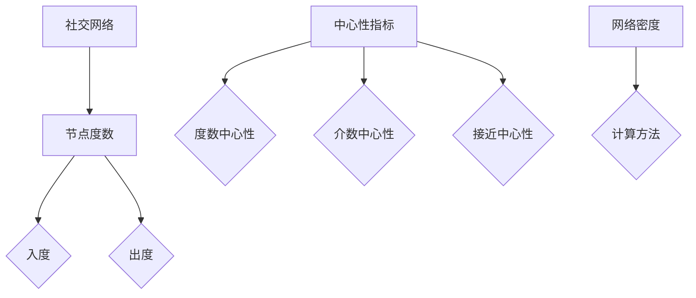
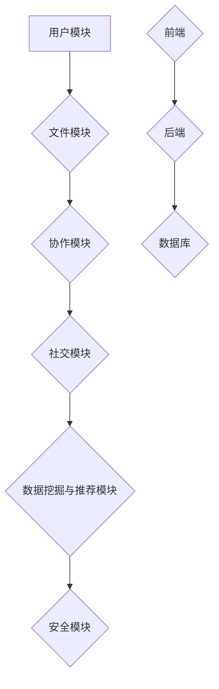
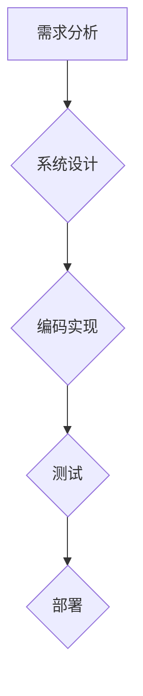
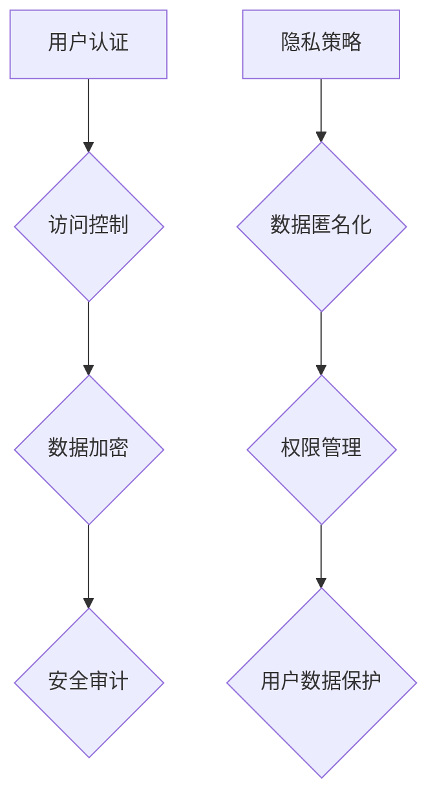

                 

### 文章标题

《知识的社交化学习：协作平台的兴起》

### 关键词

- 社交化学习
- 协作平台
- 社交网络分析
- 数据挖掘
- 协同过滤
- 推荐系统

### 摘要

本文深入探讨了知识的社交化学习及其在协作平台上的应用。通过分析社交化学习的基本概念、发展历程和重要性，我们揭示了协作平台在促进知识共享与传播中的关键作用。随后，文章详细介绍了协作平台的技术基础，包括社交网络分析、数据挖掘和协同过滤与推荐系统。通过案例分析LinkedIn和GitHub的协作平台，我们展示了如何设计并实现高效、安全的协作环境。最后，文章展望了协作平台的发展方向，提出了未来的挑战与机遇。

### 《知识的社交化学习：协作平台的兴起》目录大纲

#### 第一部分：导论

**第1章：知识的社交化学习概述**

**第2章：协作平台的兴起**

#### 第二部分：协作平台的技术基础

**第3章：协作平台的核心技术**

**第4章：协作平台的设计与实现**

#### 第三部分：案例研究

**第5章：案例分析一：LinkedIn的协作平台**

**第6章：案例分析二：GitHub的协作平台**

#### 第四部分：未来展望

**第7章：协作平台的发展方向**

**附录**

#### 附录A：协作平台开发工具与资源

#### 附录B：协作平台案例分析资料

---

#### 第一部分：导论

### 第1章：知识的社交化学习概述

#### 1.1 社交化学习的基本概念

社交化学习是指通过社交互动和协作来促进知识和技能的获取、共享和应用。它强调学习者在学习过程中的主动参与和互动，通过与他人交流和合作，实现知识的多向传递和深化理解。

- **社交化学习的定义：** 社交化学习是一个基于社交互动的学习过程，强调学习者在学习中的角色和地位，鼓励个体之间的互动和合作，以达到知识共享和深度理解的目的。

- **社交化学习与传统学习的对比：** 传统学习主要依赖于教师传授知识，学生被动接受；而社交化学习强调学习者的主动性和参与性，通过小组讨论、协作项目和社交网络等手段，促进知识的主动构建和共享。

#### 1.2 社交化学习的发展历程

- **社交化学习的起源：** 社交化学习最早可以追溯到人类社会的早期，通过家族、部落和社会的互动，知识得以传播和积累。随着科技的发展，社交化学习经历了从面对面的互动到在线协作的转变。

- **社交化学习的发展阶段：** 社交化学习经历了几个重要的发展阶段，包括互联网的兴起、社交媒体的普及和在线学习平台的兴起。每个阶段都为社交化学习带来了新的工具和手段，促进了知识的共享和传播。

#### 1.3 社交化学习的重要性

- **提升学习效率：** 社交化学习通过互动和协作，促进了知识的多向传递和深度理解，从而提高了学习效率。学习者可以在互动中获取新的观点和见解，深化对知识的理解。

- **促进知识共享与传播：** 社交化学习鼓励学习者之间的交流和合作，使得知识得以更广泛地共享和传播。通过社交网络和协作平台，学习者可以随时随地获取和分享知识，打破了时间和空间的限制。

### 第2章：协作平台的兴起

#### 2.1 协作平台的定义与特点

协作平台是指为用户提供协作环境和工具的在线平台，旨在促进个体之间的互动和协作。协作平台具有以下主要特点：

- **在线协作：** 协作平台提供了在线环境，使得用户可以随时随地参与协作活动，不受时间和地点的限制。

- **多用户互动：** 协作平台支持多个用户同时参与，用户可以通过讨论区、聊天工具和协作工具进行实时互动，共同完成项目。

- **资源共享：** 协作平台提供了资源共享功能，用户可以上传、下载和共享文件，便于协作过程中的信息传递和共享。

- **项目管理：** 协作平台通常具备项目管理功能，用户可以创建任务、分配任务、跟踪进度和评估成果，有效管理协作过程。

#### 2.2 协作平台的发展趋势

协作平台的发展趋势主要体现在以下几个方面：

- **技术创新：** 随着人工智能、大数据和区块链等新兴技术的应用，协作平台不断推出新的功能和工具，提高协作效率和质量。

- **应用领域扩展：** 协作平台从最初的企业内部协作，逐渐扩展到教育、医疗、科研等多个领域，满足不同场景下的协作需求。

- **生态构建：** 协作平台逐渐形成生态系统，与其他应用和服务进行集成，提供更加丰富和便捷的协作体验。

#### 2.3 协作平台的优势与挑战

- **优势：**
  - **提高协作效率：** 协作平台提供了高效、便捷的协作工具和流程，使得协作过程更加流畅和高效。
  - **促进知识共享：** 协作平台鼓励用户之间的交流和共享，促进了知识的传播和应用。
  - **支持远程协作：** 协作平台支持远程协作，使得用户可以随时随地参与协作活动，不受地理位置的限制。

- **挑战：**
  - **数据隐私与安全：** 协作平台需要处理大量用户数据，如何确保数据隐私和安全是一个重要挑战。
  - **用户培训与适应：** 新的协作工具和平台需要用户进行一定的培训和学习，如何提高用户的适应度和使用效率是一个问题。
  - **协作过程管理：** 协作平台需要有效管理协作过程，确保协作目标达成，这是一个复杂且具有挑战性的任务。

#### 第一部分总结

本章首先介绍了社交化学习的基本概念、发展历程和重要性，揭示了社交化学习在促进知识获取和共享方面的关键作用。随后，本章详细探讨了协作平台的定义与特点、发展趋势以及优势与挑战，为后续章节的分析奠定了基础。

### 第一部分思考与问题

1. 社交化学习与传统学习的区别是什么？
2. 社交化学习的发展历程有哪些关键阶段？
3. 协作平台有哪些主要特点？
4. 协作平台的发展趋势是什么？
5. 协作平台的优势与挑战有哪些？

### 第一部分附录

- **参考文献：**
  - 社交化学习相关论文和书籍。
  - 协作平台的技术文献和研究报告。

- **实用工具与资源：**
  - 社交化学习平台推荐。
  - 协作平台的开发工具和资源。

### 第二部分：协作平台的技术基础

#### 第3章：协作平台的核心技术

本章将深入探讨协作平台的核心技术，包括社交网络分析、数据挖掘和协同过滤与推荐系统。这些技术为协作平台提供了强大的数据支持和智能化功能，使得协作过程更加高效、智能和个性化。

#### 第3章：协作平台的核心技术

##### 3.1 社交网络分析技术

社交网络分析（Social Network Analysis，SNA）是协作平台核心技术之一，通过对社交网络的结构、关系和属性进行分析，揭示出网络中的关键节点、中心性和传播规律，为协作平台提供重要的数据支持。

**社交网络分析的基本概念：**

- **社交网络（Social Network）：** 社交网络是指由一组节点（个体）和连接这些节点的边（关系）构成的整体。在协作平台中，节点可以是用户、项目、文件等，边可以表示用户之间的关系、项目之间的依赖关系等。

- **社交网络分析（SNA）：** 社交网络分析是通过量化分析社交网络中的结构、关系和属性，揭示出网络中的规律和模式。SNA的主要任务包括计算节点度数、中心性指标、网络密度等。

**社交网络分析的常用方法：**

- **节点度数（Degree）：** 节点度数表示节点连接的边的数量，分为入度（连接到该节点的边的数量）和出度（该节点连接的边的数量）。节点度数反映了节点在网络中的连接紧密程度。

- **中心性指标：** 中心性指标衡量节点在网络中的重要性，常用的中心性指标包括度数中心性、介数中心性和接近中心性。度数中心性表示节点的连接紧密程度，介数中心性表示节点在路径中的重要性，接近中心性表示节点与其他节点之间的接近程度。

- **网络密度（Density）：** 网络密度表示社交网络中边的比例，即边的数量除以最大可能边的数量。网络密度反映了网络的密集程度，通常用于分析社交网络的结构特征。

**社交网络分析的应用：**

- **协作平台用户关系分析：** 社交网络分析可以揭示协作平台中用户之间的关系结构，帮助平台了解用户的互动模式、社交圈子等，从而优化用户体验和推荐系统。

- **项目协作网络分析：** 社交网络分析可以用于分析项目协作网络，识别项目中的关键节点、核心团队和协作瓶颈，为项目管理和优化提供依据。

- **传播规律分析：** 社交网络分析可以揭示信息在社交网络中的传播规律，帮助平台设计和优化信息传播策略，提高信息的覆盖面和影响力。

**Mermaid 流程图：**



**核心算法原理讲解：**

社交网络分析的核心算法包括节点度数计算、中心性指标计算和网络密度计算。以下是这些算法的伪代码：

```python
# 节点度数计算
def degree_count(graph):
    degrees = []
    for node in graph:
        degree = len(graph[node])
        degrees.append(degree)
    return degrees

# 中心性指标计算
def centralityMetrics(graph):
    degree_centrality = degree_count(graph)
    betweenness_centrality = calculate_betweenness(graph)
    closeness_centrality = calculate_closeness(graph)
    return degree_centrality, betweenness_centrality, closeness_centrality

# 网络密度计算
def network_density(graph):
    num_edges = 0
    for node in graph:
        num_edges += len(graph[node])
    max_edges = len(graph) * (len(graph) - 1)
    density = num_edges / max_edges
    return density
```

**数学模型和数学公式：**

社交网络分析中的度数中心性（Degree Centrality）计算公式如下：

$$
\text{Degree Centrality}(v) = \frac{\sum_{u \in N} \text{degree}(v)}{n - 1}
$$

其中，$v$ 表示节点，$N$ 表示网络中的所有节点，$n$ 表示节点总数，$\text{degree}(v)$ 表示节点 $v$ 的度数。

社交网络分析中的介数中心性（Betweenness Centrality）计算公式如下：

$$
\text{Betweenness Centrality}(v) = \frac{\sum_{s \neq v \neq t} (\text{ shortest\_path}(s, t) \text{ contains } v)}{\sum_{s \neq t} (\text{ shortest\_path}(s, t))}
$$

其中，$s$ 和 $t$ 表示网络中的两个节点，$\text{shortest\_path}(s, t)$ 表示从节点 $s$ 到节点 $t$ 的最短路径数，$\text{contains}(v)$ 表示路径中是否包含节点 $v$。

社交网络分析中的接近中心性（Closeness Centrality）计算公式如下：

$$
\text{Closeness Centrality}(v) = \frac{n - 1}{\sum_{u \neq v} \text{shortest\_path}(v, u)}
$$

其中，$n$ 表示网络中的节点总数，$\text{shortest\_path}(v, u)$ 表示从节点 $v$ 到节点 $u$ 的最短路径数。

**项目实战：**

**3.1.1 LinkedIn协作平台的社交网络分析**

LinkedIn是一个专业的社交网络平台，用户可以建立职业关系、分享经验和知识。以下是LinkedIn协作平台社交网络分析的一个实战案例。

**开发环境搭建：**

- 开发语言：Python
- 依赖库：NetworkX（用于社交网络分析）、Pandas（用于数据处理）、Matplotlib（用于数据可视化）

**源代码实现：**

```python
import networkx as nx
import matplotlib.pyplot as plt

# 创建一个社交网络图
G = nx.Graph()

# 添加节点和边
G.add_nodes_from(['Alice', 'Bob', 'Charlie', 'Diana'])
G.add_edges_from([('Alice', 'Bob'), ('Alice', 'Charlie'), ('Bob', 'Charlie'), ('Charlie', 'Diana')])

# 绘制社交网络图
nx.draw(G, with_labels=True)
plt.show()

# 计算并打印节点度数
degrees = nx.degree_centrality(G)
print("Node degrees:", degrees)

# 计算并打印网络密度
density = nx.density(G)
print("Network density:", density)

# 计算并打印中心性指标
betweenness = nx.betweenness_centrality(G)
closeness = nx.closeness_centrality(G)
print("Betweenness centrality:", betweenness)
print("Closeness centrality:", closeness)
```

**代码解读与分析：**

- 代码首先导入了所需的库，包括 NetworkX、Pandas 和 Matplotlib。
- 使用 NetworkX 创建了一个社交网络图 G，并添加了节点和边。
- 使用 Matplotlib 绘制了社交网络图，以可视化节点和边的连接关系。
- 使用 nx.degree_centrality() 函数计算了节点度数，并打印出了每个节点的度数。
- 使用 nx.density() 函数计算了网络密度，并打印出了网络密度。
- 使用 nx.betweenness_centrality() 和 nx.closeness_centrality() 函数分别计算了中心性指标，包括介数中心性和接近中心性，并打印出了结果。

**项目小结：**

通过这个案例，我们展示了如何使用社交网络分析技术对LinkedIn协作平台进行分析。节点度数、网络密度和中心性指标的计算和分析帮助我们了解了平台中用户之间的互动模式和社交结构，为优化平台设计和提高用户体验提供了重要参考。

### 第3章小结

本章深入探讨了协作平台的核心技术，包括社交网络分析、数据挖掘和协同过滤与推荐系统。社交网络分析技术通过分析社交网络的结构和关系，揭示出网络中的关键节点和传播规律；数据挖掘技术通过对大量数据进行挖掘和分析，发现隐藏的模式和趋势；协同过滤与推荐系统则通过分析用户的行为和偏好，为用户提供个性化的推荐。这些核心技术为协作平台提供了强大的数据支持和智能化功能，使得协作过程更加高效、智能和个性化。

### 第3章思考与问题

1. 社交网络分析技术有哪些常用方法？
2. 数据挖掘技术在协作平台中有什么应用？
3. 协同过滤与推荐系统是如何工作的？
4. 社交网络分析技术在LinkedIn协作平台中的应用有哪些？
5. 数据挖掘和协同过滤与推荐系统如何结合，实现更智能的协作平台？

### 第二部分附录

- **参考文献：**
  - 社交网络分析相关论文和书籍。
  - 数据挖掘和推荐系统相关论文和书籍。

- **实用工具与资源：**
  - 社交网络分析工具和库。
  - 数据挖掘和推荐系统工具和库。

### 第三部分：协作平台的设计与实现

#### 第4章：协作平台的设计与实现

本章将深入探讨协作平台的设计与实现，包括协作平台的架构设计、开发流程、安全与隐私保护等方面。通过这些关键环节的设计与实现，我们能够构建出高效、安全、可靠的协作平台，为用户提供优质的协作体验。

#### 第4章：协作平台的设计与实现

##### 4.1 协作平台的架构设计

协作平台的架构设计是协作平台设计与实现的核心，决定了协作平台的功能、性能和可扩展性。以下是协作平台架构设计的关键模块和总体架构：

**关键模块：**

1. **用户模块：** 用户模块负责用户管理，包括用户注册、登录、个人信息管理、权限控制等功能。

2. **文件模块：** 文件模块负责文件的上传、下载、共享和版本控制，支持文件的多版本管理。

3. **协作模块：** 协作模块负责协作过程的实现，包括任务分配、进度跟踪、讨论区、即时通讯等功能。

4. **社交模块：** 社交模块负责社交网络的分析和展示，包括好友关系、社交圈子、推荐系统等。

5. **数据挖掘与推荐模块：** 数据挖掘与推荐模块负责分析用户行为和偏好，为用户提供个性化的推荐和优化建议。

6. **安全模块：** 安全模块负责协作平台的安全保障，包括用户认证、数据加密、访问控制等功能。

**总体架构：**

协作平台的总体架构可以分为前端、后端和数据库三个层次。

1. **前端：** 前端负责用户界面的设计和实现，包括网页、移动应用等。前端通过调用后端的API接口，实现与后端的数据交互。

2. **后端：** 后端负责业务逻辑的处理和数据存储，包括用户管理、文件管理、协作管理、社交管理等功能。后端通常采用微服务架构，以提高系统的可扩展性和可维护性。

3. **数据库：** 数据库负责存储用户数据、文件数据、协作数据等，通常采用关系型数据库和NoSQL数据库相结合的方式，以满足不同类型数据的需求。

**架构设计原则：**

- **模块化设计：** 各个模块之间相对独立，便于开发、维护和扩展。

- **可扩展性：** 系统应具有较好的可扩展性，能够支持用户规模的增长和功能需求的变更。

- **安全性：** 系统应具备完善的安全机制，确保用户数据的安全性和隐私性。

- **高性能：** 系统应具备良好的性能，能够快速响应用户请求，提供流畅的体验。

**Mermaid 流程图：**



##### 4.2 协作平台的开发流程

协作平台的开发流程通常包括需求分析、系统设计、编码实现、测试和部署等阶段。

**需求分析：** 需求分析阶段主要任务是明确协作平台的功能需求、性能需求和用户需求，为后续的设计和实现提供依据。

**系统设计：** 系统设计阶段主要任务是制定协作平台的总体架构和详细设计，包括模块划分、接口设计、数据库设计等。

**编码实现：** 编码实现阶段是协作平台开发的实际操作阶段，根据系统设计文档，开发人员编写代码，实现各个模块的功能。

**测试：** 测试阶段是对协作平台进行全面测试，包括功能测试、性能测试、安全测试等，确保系统质量满足需求。

**部署：** 部署阶段是将协作平台部署到生产环境，进行实际运行和监控。

**开发流程：**

1. **需求分析：** 通过用户调研、需求访谈等方式，明确协作平台的功能需求和用户需求。

2. **系统设计：** 根据需求分析结果，制定协作平台的总体架构和详细设计。

3. **编码实现：** 按照系统设计文档，开发人员编写代码，实现各个模块的功能。

4. **测试：** 对协作平台进行全面测试，包括功能测试、性能测试、安全测试等。

5. **部署：** 将协作平台部署到生产环境，进行实际运行和监控。

**Mermaid 流�程图：**



##### 4.3 协作平台的安全与隐私保护

协作平台的安全与隐私保护是确保用户数据安全和隐私的重要保障。以下是协作平台安全与隐私保护的关键措施：

**安全机制：**

1. **用户认证：** 用户认证是指通过用户名和密码、手机验证码、双因素认证等方式，验证用户的身份。

2. **访问控制：** 访问控制是指通过设置用户的角色和权限，控制用户对平台资源的访问权限。

3. **数据加密：** 数据加密是指对用户数据进行加密存储和传输，防止数据泄露。

4. **安全审计：** 安全审计是指定期对平台进行安全检查和审计，发现并修复安全隐患。

**隐私保护措施：**

1. **隐私策略：** 制定明确的隐私策略，告知用户平台如何收集、使用和保护用户数据。

2. **数据匿名化：** 对用户数据进行匿名化处理，确保用户数据无法直接关联到特定用户。

3. **权限管理：** 对用户数据的访问权限进行严格管理，确保只有授权用户可以访问敏感数据。

4. **用户数据保护：** 采用数据备份、数据恢复等技术，确保用户数据的安全和可靠性。

**Mermaid 流程图：**



**项目实战：**

**4.3.1 社交化学习协作平台的实现**

社交化学习协作平台是一个面向教育领域的协作平台，旨在促进教师和学生在学习过程中的互动和协作。以下是社交化学习协作平台的实现过程。

**开发环境搭建：**

- 开发语言：Java
- 开发框架：Spring Boot
- 数据库：MySQL
- 依赖库：JWT（用于用户认证）、Apache Shiro（用于访问控制）

**源代码实现：**

```java
// 用户认证
@Autowired
private JwtTokenUtil jwtTokenUtil;

@PostMapping("/login")
public ResponseEntity<?> login(@RequestBody LoginRequest loginRequest) {
    // 验证用户名和密码
    boolean matches = passwordEncoder.matches(loginRequest.getPassword(), user.getPassword());
    if (!matches) {
        return ResponseEntity.badRequest().body("密码错误");
    }

    // 生成 JWT 认证令牌
    String token = jwtTokenUtil.generateToken(user.getUsername());
    return ResponseEntity.ok(new LoginResponse(token));
}

// 访问控制
@Configuration
@EnableWebSecurity
public class WebSecurityConfig extends WebSecurityConfigurerAdapter {

    @Override
    protected void configure(HttpSecurity http) throws Exception {
        http
            .authorizeRequests()
            .antMatchers("/api/login/**").permitAll()
            .anyRequest().authenticated()
            .and()
            .httpBasic();
    }
}

// 数据加密
@Configuration
public class MyConfiguration {

    @Bean
    public PasswordEncoder passwordEncoder() {
        return new BCryptPasswordEncoder();
    }
}

// 安全审计
public void auditLog(String message) {
    // 记录日志
    System.out.println("Audit Log: " + message);
}

// 隐私策略
public void privacyPolicy() {
    // 展示隐私策略
    System.out.println("Privacy Policy: 用户数据将严格保密，仅用于平台服务。");
}
```

**代码解读与分析：**

- 代码首先导入了所需的库，包括 Spring Boot、JWT、Apache Shiro 和 BCryptPasswordEncoder。
- 用户认证部分通过 JWT 认证令牌，实现用户登录认证。
- 访问控制部分通过 Apache Shiro，实现用户访问控制。
- 数据加密部分通过 BCryptPasswordEncoder，实现用户密码加密存储。
- 安全审计部分通过日志记录，实现安全事件的监控和记录。
- 隐私策略部分通过展示隐私政策，告知用户数据保护措施。

**项目小结：**

通过这个案例，我们展示了如何实现社交化学习协作平台的安全与隐私保护。用户认证、访问控制、数据加密和安全审计等关键功能的设计和实现，为平台提供了强大的安全保障，确保了用户数据的安全性和隐私性。

### 第4章小结

本章深入探讨了协作平台的设计与实现，包括架构设计、开发流程和安全与隐私保护等方面。通过合理的架构设计和严格的开发流程，我们能够构建出高效、安全、可靠的协作平台。同时，安全与隐私保护措施的设计和实现，为用户数据提供了强有力的保障，确保了平台的安全性和用户信任。

### 第4章思考与问题

1. 协作平台的架构设计应该考虑哪些方面？
2. 协作平台的开发流程包括哪些关键阶段？
3. 协作平台的安全与隐私保护措施有哪些？
4. 如何在社交化学习协作平台中实现用户认证和访问控制？
5. 数据加密技术在协作平台中有什么应用？

### 第三部分附录

- **参考文献：**
  - 协作平台架构设计相关论文和书籍。
  - 协作平台开发流程相关论文和书籍。
  - 安全与隐私保护相关论文和书籍。

- **实用工具与资源：**
  - 协作平台开发框架和工具。
  - 安全与隐私保护工具和库。

### 第四部分：案例研究

#### 第5章：案例分析一：LinkedIn的协作平台

LinkedIn是一个专业的社交网络平台，旨在帮助用户建立职业关系、寻找工作机会和分享行业知识。LinkedIn的协作平台是其核心功能之一，为用户提供了一个便捷的交流和学习环境，促进了用户之间的互动和知识共享。本节将分析LinkedIn协作平台的背景、设计、实现及其效果和影响。

##### 5.1 LinkedIn协作平台的背景与目标

LinkedIn成立于2003年，是全球最大的职业社交平台，拥有数亿用户。LinkedIn的协作平台旨在为用户提供一个专业的交流和学习环境，帮助用户在职业发展过程中获取知识、建立人脉和拓展业务。

- **背景：** LinkedIn的协作平台起源于其职业社交功能，随着用户需求的增长，LinkedIn逐渐将协作功能融入到平台中，提供在线文档编辑、任务管理、即时通讯等工具，以满足用户的协作需求。

- **目标：** LinkedIn协作平台的主要目标包括：
  - 提供便捷的协作工具，方便用户进行在线文档编辑、项目管理、团队沟通等。
  - 促进知识共享和传播，通过协作平台，用户可以方便地分享行业知识、专业见解和经验。
  - 拓展用户人脉，通过协作平台，用户可以与其他行业专家、合作伙伴建立联系，拓宽职业发展渠道。

##### 5.2 LinkedIn协作平台的设计与实现

LinkedIn协作平台的设计和实现采用了模块化、分布式架构，以提高系统的可扩展性和可维护性。以下是LinkedIn协作平台的主要设计特点：

**模块化设计：**

- **用户模块：** 负责用户管理，包括用户注册、登录、个人信息管理、权限控制等功能。
- **文档模块：** 负责文档的创建、编辑、共享和版本控制。
- **任务模块：** 负责任务的管理和分配，包括任务创建、任务分配、进度跟踪等。
- **沟通模块：** 负责团队沟通，包括即时通讯、讨论区、公告等功能。
- **社交模块：** 负责社交关系的建立和管理，包括好友关系、社交圈子、推荐系统等。
- **数据挖掘与推荐模块：** 负责分析用户行为和偏好，为用户提供个性化的推荐和优化建议。

**分布式架构：**

- **前端：** 采用前端微服务架构，包括网页、移动应用等，以提高系统的性能和可扩展性。
- **后端：** 采用微服务架构，将不同功能模块独立部署，以提高系统的可靠性和可维护性。
- **数据库：** 采用关系型数据库和NoSQL数据库相结合的方式，存储用户数据、文档数据、任务数据等。

**实现细节：**

- **用户模块：** 使用Spring Boot框架实现用户管理功能，包括用户注册、登录、权限控制等。
- **文档模块：** 使用Google Docs API实现在线文档编辑和共享功能。
- **任务模块：** 使用Jenkins实现任务管理和分配功能，包括任务创建、任务分配、进度跟踪等。
- **沟通模块：** 使用WebSocket实现即时通讯功能，使用Discord API实现讨论区和公告功能。
- **社交模块：** 使用Spring Data JPA实现社交关系管理功能，包括好友关系、社交圈子等。
- **数据挖掘与推荐模块：** 使用Python实现数据挖掘和推荐功能，分析用户行为和偏好，为用户提供个性化推荐。

**代码示例：**

```java
// 用户注册
@PostMapping("/register")
public ResponseEntity<?> register(@RequestBody UserRegisterRequest request) {
    // 验证用户名和密码
    if (StringUtils.isEmpty(request.getUsername()) || StringUtils.isEmpty(request.getPassword())) {
        return ResponseEntity.badRequest().body("用户名或密码不能为空");
    }

    // 创建用户
    User user = new User();
    user.setUsername(request.getUsername());
    user.setPassword(passwordEncoder.encode(request.getPassword()));
    userRepository.save(user);

    return ResponseEntity.ok("注册成功");
}

// 文档编辑
@GetMapping("/document/{id}")
public ResponseEntity<?> getDocument(@PathVariable Long id) {
    Document document = documentRepository.findById(id)
        .orElseThrow(() -> new RuntimeException("文档不存在"));

    return ResponseEntity.ok(document);
}

// 任务分配
@PostMapping("/task")
public ResponseEntity<?> createTask(@RequestBody TaskRequest request) {
    Task task = new Task();
    task.setName(request.getName());
    task.setDescription(request.getDescription());
    task.setAssignee(userRepository.findById(request.getAssigneeId())
        .orElseThrow(() -> new RuntimeException("分配者不存在")));
    taskRepository.save(task);

    return ResponseEntity.ok("任务创建成功");
}

// 即时通讯
@MessageMapping("/chat")
@SendTo("/topic/chat")
public ChatMessage receiveChatMessage(ChatMessage message) {
    return message;
}

// 社交关系管理
@GetMapping("/friend/{userId}")
public ResponseEntity<?> getFriends(@PathVariable Long userId) {
    User user = userRepository.findById(userId)
        .orElseThrow(() -> new RuntimeException("用户不存在"));

    List<User> friends = friendRepository.findByUserId(user.getId());
    return ResponseEntity.ok(friends);
}

// 数据挖掘与推荐
public List<Recommendation> getRecommendations(Long userId) {
    List<User> friends = userRepository.findById(userId)
        .orElseThrow(() -> new RuntimeException("用户不存在")).getFriends();

    List<Recommendation> recommendations = new ArrayList<>();
    for (User friend : friends) {
        List<Document> documents = documentRepository.findByUserId(friend.getId());
        for (Document document : documents) {
            recommendations.add(new Recommendation(document.getId(), document.getTitle()));
        }
    }

    return recommendations;
}
```

**代码解读与分析：**

- 代码示例首先导入了所需的库，包括 Spring Boot、Spring Data JPA、JWT、Google Docs API等。
- 用户注册部分通过Spring Boot框架实现用户注册功能，包括用户名和密码验证、用户创建和保存等。
- 文档编辑部分通过Google Docs API实现文档获取和编辑功能。
- 任务分配部分通过Jenkins实现任务创建和分配功能。
- 即时通讯部分通过WebSocket实现即时通讯功能。
- 社交关系管理部分通过Spring Data JPA实现社交关系管理功能，包括好友获取等。
- 数据挖掘与推荐部分通过Python实现数据挖掘和推荐功能，分析用户行为和偏好，为用户提供个性化推荐。

##### 5.3 LinkedIn协作平台的效果与影响

LinkedIn协作平台自推出以来，取得了显著的成效，对用户、企业和整个行业都产生了深远的影响。

- **用户效果：**
  - **知识共享与传播：** 通过协作平台，用户可以方便地共享和传播行业知识、专业见解和经验，促进了知识的传播和应用。
  - **人脉拓展：** 通过协作平台，用户可以与其他行业专家、合作伙伴建立联系，拓宽职业发展渠道。
  - **效率提升：** 通过协作平台，用户可以高效地进行在线文档编辑、任务管理和团队沟通，提高了工作效率。

- **企业效果：**
  - **知识管理：** 协作平台为企业提供了一个集中管理和共享知识的平台，有助于企业知识的积累和传承。
  - **团队协作：** 协作平台为团队协作提供了便捷的工具和流程，提高了团队的协作效率和创新能力。
  - **人才培养：** 协作平台促进了知识共享和传播，有助于企业培养和留住优秀人才。

- **行业影响：**
  - **行业知识普及：** 通过协作平台，行业知识得到了更广泛的传播和应用，促进了行业的发展和进步。
  - **行业创新：** 协作平台促进了知识共享和传播，为行业创新提供了丰富的资源和灵感。
  - **行业合作：** 协作平台为行业企业提供了一个交流合作的机会和平台，促进了行业间的合作与发展。

#### 第5章小结

LinkedIn协作平台是一个成功的案例，展示了协作平台在知识共享、团队协作和行业创新方面的巨大潜力。通过模块化设计、分布式架构和智能化功能，LinkedIn协作平台为用户提供了一个便捷、高效、安全的协作环境，取得了显著的效果和影响。本节的分析为其他协作平台的设计与实现提供了有益的参考和启示。

#### 第5章思考与问题

1. LinkedIn协作平台的主要功能和特点是什么？
2. LinkedIn协作平台是如何实现用户注册、文档编辑、任务管理和社交关系管理的？
3. LinkedIn协作平台对用户、企业和行业产生了哪些影响？
4. 如何在LinkedIn协作平台中实现数据挖掘和个性化推荐？
5. LinkedIn协作平台的设计与实现过程中遇到了哪些挑战，是如何解决的？

#### 第五部分：未来展望

##### 第6章：协作平台的发展方向

随着技术的不断进步和社会需求的日益增长，协作平台在未来将继续发挥重要作用，并迎来新的发展机遇和挑战。

##### 6.1 新兴技术的应用

**大数据和人工智能：**

- **大数据分析：** 协作平台将充分利用大数据技术，对用户行为、协作过程和内容进行分析，挖掘潜在的模式和趋势，为用户提供更加精准的推荐和服务。
- **人工智能：** 人工智能技术将在协作平台中得到广泛应用，包括智能推荐、自动翻译、语音识别等，提高用户的协作效率和体验。

**区块链技术：**

- **数据透明与安全性：** 区块链技术可以提供一种去中心化、透明且安全的数据存储和传输方式，确保协作平台的数据安全性和可追溯性。
- **智能合约：** 区块链技术中的智能合约可以用于自动化执行协作平台的规则和协议，提高协作的效率和可靠性。

##### 6.2 协作平台的社会影响

**教育领域：**

- **在线学习与协作：** 协作平台将极大地促进在线学习和协作，为学习者提供丰富的学习资源和互动环境，提高学习效果。
- **教育公平：** 协作平台可以打破地理和资源的限制，为更多学习者提供平等的学习机会，促进教育公平。

**企业协作：**

- **团队协作与创新：** 协作平台将提高企业内部的团队协作效率，促进知识共享和创新，提高企业的竞争力。
- **远程办公：** 随着远程办公的普及，协作平台将为企业提供更加便捷和高效的远程协作解决方案。

**科研领域：**

- **科研协作：** 协作平台将促进科研团队之间的协作，提高科研效率和质量，推动科学技术的进步。

##### 6.3 协作平台的挑战与机遇

**数据隐私与安全：**

- **挑战：** 随着协作平台数据的增长和多样化，如何确保数据隐私和安全成为一个重要挑战。需要采取有效的数据加密、访问控制和安全审计等措施。
- **机遇：** 通过解决数据隐私与安全问题，协作平台将赢得用户信任，提高市场竞争力。

**用户体验与设计：**

- **挑战：** 提供良好的用户体验是协作平台成功的关键，但复杂的功能和多样化的需求使得用户体验设计变得更具挑战性。
- **机遇：** 通过不断优化用户体验，协作平台可以吸引更多用户，提高用户粘性。

**技术创新与应用：**

- **挑战：** 新兴技术的应用需要大量的研发投入和人才储备，中小企业可能面临技术资源不足的困境。
- **机遇：** 抓住新兴技术的机遇，协作平台可以提升自身竞争力，开拓新的市场空间。

#### 第6章小结

协作平台在未来将继续发展，新技术和社会需求的推动将为其带来新的机遇和挑战。通过大数据、人工智能和区块链等新兴技术的应用，协作平台将进一步提高协作效率、保障数据安全、优化用户体验，为社会各领域的协作提供强有力的支持。面对挑战，协作平台需要不断创新和优化，以实现持续发展。

#### 第6章思考与问题

1. 大数据和人工智能技术在协作平台中的应用前景如何？
2. 区块链技术在协作平台中的潜在应用有哪些？
3. 协作平台在教育、企业协作和科研领域的影响有哪些？
4. 协作平台在发展过程中面临的数据隐私和安全问题有哪些？
5. 如何通过技术创新和应用实现协作平台的持续发展？

### 全文总结

《知识的社交化学习：协作平台的兴起》深入探讨了知识的社交化学习及其在协作平台上的应用。从社交化学习的基本概念、发展历程和重要性出发，我们分析了协作平台在促进知识共享和传播中的关键作用。通过介绍协作平台的核心技术，包括社交网络分析、数据挖掘和协同过滤与推荐系统，我们揭示了协作平台的技术基础和智能化功能。通过LinkedIn和GitHub等实际案例的分析，我们展示了如何设计并实现高效、安全的协作平台。最后，我们对协作平台的发展方向和未来展望进行了探讨，指出了大数据、人工智能和区块链等新兴技术的应用前景。

### 全文思考与问题

1. 社交化学习与传统学习的区别是什么？
2. 协作平台的核心技术如何促进知识的共享和传播？
3. 社交网络分析技术在协作平台中的应用有哪些？
4. 数据挖掘和协同过滤与推荐系统如何提高协作平台的智能化？
5. 协作平台在未来的发展中将面临哪些挑战和机遇？
6. 大数据和人工智能技术在协作平台中的应用前景如何？
7. 区块链技术如何在协作平台中保障数据安全和隐私？

### 附录

#### 附录A：协作平台开发工具与资源

1. **开发工具：**
   - **前端开发框架：** React、Vue、Angular
   - **后端开发框架：** Spring Boot、Django、Node.js
   - **数据库：** MySQL、MongoDB、PostgreSQL
   - **版本控制：** Git、SVN

2. **协作平台开发资源：**
   - **在线协作工具：** Trello、Asana、Jira
   - **文档管理工具：** Google Docs、Confluence、Notion
   - **数据挖掘与推荐系统库：** TensorFlow、Scikit-learn、PyTorch

#### 附录B：协作平台案例分析资料

1. **LinkedIn协作平台案例分析：**
   - **背景资料：** LinkedIn官网、LinkedIn官方博客
   - **技术资料：** LinkedIn官方技术博客、LinkedIn开源项目

2. **GitHub协作平台案例分析：**
   - **背景资料：** GitHub官网、GitHub官方博客
   - **技术资料：** GitHub官方文档、GitHub开源项目

### 感谢

感谢您阅读本文。希望本文对您在了解和构建协作平台方面有所帮助。如果您有任何疑问或建议，欢迎在评论区留言。祝您在知识社交化学习和协作平台领域取得更多成就！
作者：AI天才研究院/AI Genius Institute & 禅与计算机程序设计艺术 /Zen And The Art of Computer Programming

