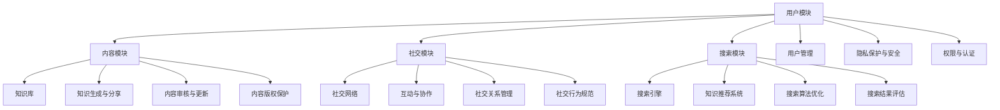

                 

## **文章标题：知识的社交学习网络：Peer-to-Peer教育模式**

### **关键词：知识社交学习网络，Peer-to-Peer教育模式，在线教育，学习生态系统，教育技术，人工智能，大数据**

----------------------------------------------------------------

## **摘要**

本文旨在深入探讨知识社交学习网络及其核心组成部分——Peer-to-Peer（P2P）教育模式。我们首先将介绍知识社交学习网络的概念、重要性及其与传统教育模式的区别。接着，文章将详细分析P2P教育模式的定义、特点及其在当代教育中的优势与挑战。文章将逐步揭示知识社交学习网络的架构和组成，包括用户模块、内容模块、社交模块和搜索模块。此外，还将探讨知识社交学习网络的互动机制，并重点讨论P2P教育模式的实施策略和关键问题。通过案例分析，我们将展示知识社交学习网络在实际应用中的成功经验与挑战。最后，文章将展望知识社交学习网络的未来发展趋势，并提出实施指南。本文旨在为教育技术领域的专业人士和研究者提供一个全面、系统的分析框架。

## **第1章：知识的社交学习网络概述**

### **1.1 知识社交学习网络的概念与重要性**

#### **1.1.1 知识社交学习网络的定义**

知识社交学习网络（Knowledge Social Learning Network，简称KSLN）是一种基于互联网和社交媒体技术的学习生态系统。它通过构建一个互动、共享和协作的环境，促进个体和群体之间的知识交流与学习。KSLN不仅仅是传统教育模式的补充，更是一种革命性的教育创新，它利用社交网络和在线协作工具，将学习过程从单一的师生互动扩展到多对多的知识共享和互动。

#### **1.1.2 知识社交学习网络与传统教育模式的区别**

传统教育模式主要依赖于教师为中心的知识传递，而KSLN则强调学习者的自主性和参与性。以下是两者的主要区别：

1. **知识传递方式**：传统教育模式以教师为中心，知识由教师向学生单向传递；而在KSLN中，知识通过学习者之间的互动和协作实现双向或多向传递。

2. **学习环境**：传统教育模式通常在实体教室进行，而KSLN则通过网络平台实现，学习者可以在任何时间和地点参与学习。

3. **学习内容**：传统教育内容通常固定和标准化，而KSLN中的内容更加灵活和个性化，学习者可以根据自己的需求和兴趣选择学习内容。

4. **评价方式**：传统教育评价主要依赖于考试成绩，而KSLN更注重学习过程中的参与度、协作能力和知识贡献。

#### **1.1.3 知识社交学习网络在现代教育中的重要性**

知识社交学习网络在现代教育中的重要性日益凸显，主要体现在以下几个方面：

1. **个性化学习**：KSLN能够根据学习者的兴趣、能力和需求，提供个性化的学习路径和资源，使学习更加高效和有意义。

2. **协作与互动**：KSLN通过社交互动，促进学习者之间的协作与共享，增强学习体验和学习效果。

3. **资源整合**：KSLN汇聚了大量的知识和资源，通过搜索引擎和推荐系统，为学习者提供便捷的获取和利用途径。

4. **终身学习**：KSLN打破了时间和空间的限制，使学习成为终身活动，有助于培养学习者的持续学习能力和适应能力。

5. **教育公平**：KSLN为偏远地区和经济困难的学习者提供了获取优质教育资源的机会，有助于缩小教育差距。

### **1.2 Peer-to-Peer教育模式的概念与特点**

#### **1.2.1 Peer-to-Peer教育模式的定义**

Peer-to-Peer教育模式（P2P教育模式）是一种基于学习者之间的协作和互动的学习模式。在这种模式下，学习者不仅作为知识的接受者，也作为知识的贡献者和传播者。P2P教育模式强调个体之间的平等和互惠，通过学习者之间的直接互动，实现知识的共享和共创。

#### **1.2.2 Peer-to-Peer教育模式的主要特点**

1. **去中心化**：P2P教育模式没有固定的教师角色，学习者之间直接进行知识交流和协作，形成去中心化的学习网络。

2. **平等与互惠**：P2P教育模式强调个体之间的平等和互惠，每个学习者既是知识的接受者，也是知识的贡献者。

3. **协作与共享**：P2P教育模式通过学习者之间的协作和共享，促进知识的深度理解和广泛应用。

4. **自主性**：P2P教育模式鼓励学习者自主选择学习内容、学习方式和评价标准，提高学习的主动性和自主性。

5. **灵活性**：P2P教育模式没有固定的学习时间和地点，学习者可以根据自己的需求和兴趣，灵活安排学习时间和方式。

#### **1.2.3 Peer-to-Peer教育模式的优势与挑战**

**优势**：

1. **提高学习效果**：P2P教育模式通过学习者之间的协作和互动，提高知识的应用和理解能力，提高学习效果。

2. **培养协作能力**：P2P教育模式鼓励学习者之间的协作，培养他们的团队合作能力和社交技能。

3. **促进知识共享**：P2P教育模式通过学习者之间的知识共享，促进知识的广泛应用和深度挖掘。

4. **增强学习动机**：P2P教育模式使学习者成为知识的贡献者和传播者，增强他们的学习动机和自我效能感。

**挑战**：

1. **学习资源的不平衡**：由于个体差异，部分学习者可能无法提供高质量的知识资源，导致学习资源的不平衡。

2. **学习效果的评估**：P2P教育模式下，学习效果的评价较为复杂，如何科学、有效地评估学习成果成为一大挑战。

3. **学习管理的复杂性**：P2P教育模式缺乏统一的组织和管理，如何协调和引导学习者的互动和协作成为一大挑战。

4. **技术支持的需求**：P2P教育模式依赖于互联网和社交媒体技术，对技术支持和维护提出了更高的要求。

## **第2章：知识社交学习网络的架构与组成**

### **2.1 知识社交学习网络的基本架构**

#### **2.1.1 知识社交学习网络的基本架构图**

以下是知识社交学习网络的基本架构图：

#### **2.1.2 知识社交学习网络的主要组成部分**

1. **用户模块**：用户模块负责管理学习者的信息，包括注册、登录、权限管理、隐私保护等。用户模块通过用户管理界面，提供用户个人信息、学习记录和知识贡献的查看和管理。

2. **内容模块**：内容模块负责知识内容的生成、存储、审核和更新。知识库是内容模块的核心，它存储了大量的知识资源，包括文档、视频、音频、图片等多种形式。内容模块还提供了内容推荐系统，根据用户的行为和兴趣，为用户推荐相关的知识内容。

3. **社交模块**：社交模块负责学习者之间的互动和协作。社交网络是社交模块的核心，它通过社交关系管理，建立了学习者之间的社交连接。社交模块提供了互动与协作工具，如论坛、聊天室、群组等，促进学习者之间的知识分享和交流。

4. **搜索模块**：搜索模块负责为学习者提供知识搜索服务。搜索引擎是搜索模块的核心，它通过搜索算法，为用户提供相关的知识内容。搜索模块还提供了搜索结果评估机制，根据用户的行为和反馈，优化搜索结果的质量和相关性。

### **2.2 知识社交学习网络的核心模块**

#### **2.2.1 用户模块**

用户模块是知识社交学习网络的基础，它负责管理学习者的信息，包括注册、登录、权限管理、隐私保护等。以下是用户模块的主要功能：

1. **注册与登录**：学习者可以通过电子邮件、社交媒体账号等多种方式注册并登录知识社交学习网络。

2. **权限管理**：知识社交学习网络提供了不同级别的权限，如普通用户、管理员、讲师等。不同权限的用户具有不同的操作权限和功能。

3. **隐私保护**：知识社交学习网络重视学习者的隐私保护，提供了隐私设置选项，允许用户自定义隐私级别，如公开、私有等。

4. **用户信息管理**：用户模块提供了用户个人信息、学习记录和知识贡献的查看和管理功能。

#### **2.2.2 内容模块**

内容模块是知识社交学习网络的主体，它负责知识内容的生成、存储、审核和更新。以下是内容模块的主要功能：

1. **知识库**：知识库是内容模块的核心，它存储了大量的知识资源，包括文档、视频、音频、图片等多种形式。知识库通过分类、标签等方式，为用户提供了便捷的知识检索和浏览功能。

2. **内容生成与分享**：学习者可以通过上传、编辑、发布等方式，生成和分享自己的知识内容。内容生成与分享功能促进了知识的共享和传播。

3. **内容审核与更新**：知识社交学习网络提供了内容审核机制，确保知识内容的准确性和合规性。同时，内容模块还提供了内容更新功能，允许用户对已发布的内容进行修改和补充。

#### **2.2.3 社交模块**

社交模块负责学习者之间的互动和协作，是知识社交学习网络的重要特色。以下是社交模块的主要功能：

1. **社交网络**：社交网络是社交模块的核心，它通过社交关系管理，建立了学习者之间的社交连接。社交网络提供了多种社交功能，如好友管理、聊天室、群组等，促进学习者之间的交流和合作。

2. **互动与协作**：社交模块提供了互动与协作工具，如论坛、聊天室、群组等，为学习者提供了便捷的交流和合作平台。

3. **社交行为规范**：知识社交学习网络制定了社交行为规范，规范学习者的行为，维护良好的社交环境。

#### **2.2.4 搜索模块**

搜索模块为学习者提供了知识搜索服务，是知识社交学习网络的核心功能之一。以下是搜索模块的主要功能：

1. **搜索引擎**：搜索引擎是搜索模块的核心，它通过搜索算法，为用户提供相关的知识内容。搜索引擎提供了多种搜索方式，如关键词搜索、分类搜索、标签搜索等。

2. **知识推荐系统**：知识推荐系统通过分析用户的行为和兴趣，为用户推荐相关的知识内容。知识推荐系统提高了用户的搜索效率和满意度。

3. **搜索结果评估**：搜索模块提供了搜索结果评估机制，根据用户的行为和反馈，优化搜索结果的质量和相关性。

## **第3章：知识社交学习网络的互动机制**

### **3.1 用户互动机制**

知识社交学习网络通过用户互动机制，促进学习者之间的交流和合作。以下是用户互动机制的主要特点：

1. **双向互动**：用户互动机制鼓励学习者之间进行双向互动，不仅仅是学习者之间的知识交流，还包括观点的碰撞和思考的碰撞。

2. **去中心化**：用户互动机制不依赖于中心化的平台或个体，而是通过分布式的方式，实现学习者之间的互动。

3. **多样化**：用户互动机制提供了多种互动形式，如评论、点赞、分享、私信等，满足不同学习者的互动需求。

4. **透明度**：用户互动机制确保互动过程的透明度，学习者可以清晰地看到其他学习者的观点和贡献。

### **3.2 内容互动机制**

内容互动机制是知识社交学习网络的重要组成部分，它通过内容的生成、分享、审核和更新，促进知识的传播和共享。以下是内容互动机制的主要特点：

1. **内容生成**：学习者可以通过上传、编辑和发布等方式，生成自己的知识内容。内容生成机制鼓励学习者积极参与知识创作，提升知识社交学习网络的活跃度。

2. **内容分享**：学习者可以通过点赞、评论、分享等方式，与他人分享自己的知识内容。内容分享机制促进了知识的传播和共享，提高了知识的利用率。

3. **内容审核**：知识社交学习网络提供了内容审核机制，确保知识内容的准确性和合规性。内容审核机制通过人工和智能算法相结合，提高了内容审核的效率和质量。

4. **内容更新**：学习者可以随时更新自己的知识内容，以满足知识更新的需求。内容更新机制确保了知识内容的时效性和准确性。

### **3.3 社交互动机制**

社交互动机制是知识社交学习网络的重要功能之一，它通过社交网络和互动工具，促进学习者之间的交流和合作。以下是社交互动机制的主要特点：

1. **社交网络**：社交网络是社交互动机制的核心，它通过社交关系管理，建立了学习者之间的社交连接。学习者可以通过添加好友、加入群组等方式，与他人建立社交关系。

2. **互动工具**：知识社交学习网络提供了多种互动工具，如论坛、聊天室、群组等，满足不同学习者的互动需求。这些互动工具提供了丰富的交流方式，如文本、图片、视频等。

3. **社交行为规范**：知识社交学习网络制定了社交行为规范，规范学习者的行为，维护良好的社交环境。社交行为规范包括文明用语、尊重他人、禁止恶意攻击等。

4. **隐私保护**：知识社交学习网络重视学习者的隐私保护，提供了隐私设置选项，允许用户自定义隐私级别。隐私保护机制确保了学习者的个人信息和互动记录的安全。

## **第3章：Peer-to-Peer教育模式的实施策略**

### **3.1 Peer-to-Peer教育模式的设计原则**

#### **3.1.1 教学内容设计原则**

在实施Peer-to-Peer教育模式时，教学内容设计原则至关重要。以下是一些关键原则：

1. **开放性**：教学内容应保持开放，鼓励学习者自由探索和讨论。开放性的教学内容有助于激发学习者的主动性和创造力。

2. **灵活性**：教学内容应具有灵活性，允许学习者根据自己的需求和兴趣，选择适合自己的学习路径和资源。灵活的教学内容有助于满足个性化学习需求。

3. **实用性**：教学内容应注重实用性，紧密结合实际应用场景。实用性的教学内容有助于学习者将知识应用到实际工作中，提高学习效果。

4. **层次性**：教学内容应具有层次性，从基础知识到高级技能，形成一个完整的知识体系。层次性的教学内容有助于学习者逐步提升知识和技能。

5. **互动性**：教学内容应鼓励学习者之间的互动和协作，促进知识的共享和共创。互动性的教学内容有助于提高学习效果和参与度。

#### **3.1.2 教学活动设计原则**

在教学活动设计方面，以下原则尤为重要：

1. **协作性**：教学活动应注重协作性，鼓励学习者之间的互动和合作。协作性的教学活动有助于培养学习者的团队合作能力和社交技能。

2. **参与性**：教学活动应鼓励学习者的积极参与，使他们在学习过程中扮演重要角色。参与性的教学活动有助于提高学习者的学习动机和参与度。

3. **多样性**：教学活动应具有多样性，包括线上讨论、小组作业、实践操作等多种形式。多样性的教学活动有助于满足不同学习者的需求，提高学习效果。

4. **反馈性**：教学活动应提供及时和有效的反馈，帮助学习者了解自己的学习进展和不足。反馈性的教学活动有助于学习者及时调整学习策略，提高学习效果。

5. **可持续性**：教学活动应具有可持续性，鼓励学习者长期参与和持续学习。可持续性的教学活动有助于培养学习者的终身学习习惯和自主学习能力。

#### **3.1.3 教学评价设计原则**

教学评价设计原则在Peer-to-Peer教育模式中同样至关重要。以下是一些关键原则：

1. **过程评价**：教学评价应注重过程评价，关注学习者在学习过程中的表现和进步。过程评价有助于全面了解学习者的学习状况，及时发现问题并进行改进。

2. **多样性**：教学评价应具有多样性，包括定量评价和定性评价、自我评价和他人评价等多种形式。多样性的教学评价有助于全面评估学习者的知识和技能。

3. **参与性**：教学评价应鼓励学习者的参与，使他们在评价过程中发挥积极作用。参与性的教学评价有助于提高学习者的自我反思和自主学习能力。

4. **实时性**：教学评价应具有实时性，及时反馈学习者的学习成果和问题。实时性的教学评价有助于学习者及时调整学习策略，提高学习效果。

5. **综合性**：教学评价应具有综合性，综合考虑学习者的知识、技能、态度和表现等多个方面。综合性的教学评价有助于全面评估学习者的综合能力。

### **3.2 Peer-to-Peer教育模式的实施步骤**

#### **3.2.1 制定教学计划**

制定教学计划是实施Peer-to-Peer教育模式的第一步。以下是一些关键步骤：

1. **确定教学目标**：明确教学目标，包括知识目标、能力目标和素质目标。教学目标应具有可操作性和可评估性。

2. **选择教学内容**：根据教学目标，选择合适的教学内容。教学内容应具有开放性、灵活性和实用性。

3. **设计教学活动**：设计多样化的教学活动，包括线上讨论、小组作业、实践操作等。教学活动应具有协作性、参与性和互动性。

4. **制定评价标准**：制定科学合理的评价标准，包括过程评价和结果评价。评价标准应具有多样性和实时性。

5. **制定教学进度表**：制定详细的教学进度表，明确每个教学活动的时间和地点，确保教学计划的顺利实施。

#### **3.2.2 建立学习小组**

建立学习小组是Peer-to-Peer教育模式的关键。以下是一些关键步骤：

1. **分组策略**：根据学习者的兴趣、能力和需求，采用灵活的分组策略，确保每个学习小组的成员具有互补性和协同性。

2. **组长选举**：通过民主选举或随机分配的方式，选举出学习小组的组长。组长负责协调小组内的活动和沟通。

3. **小组规则**：制定小组规则，明确小组内的行为准则和责任分工。小组规则应具有可操作性和公正性。

4. **定期会议**：组织定期会议，讨论学习进度、问题和解决方案。会议应具有参与性和互动性。

#### **3.2.3 开展教学活动**

开展教学活动是Peer-to-Peer教育模式的核心。以下是一些关键步骤：

1. **引入话题**：通过引入具有启发性和挑战性的话题，激发学习者的思考和讨论。

2. **引导讨论**：作为小组组长或教师，应引导学习者之间的讨论，确保讨论的深度和广度。

3. **角色分配**：根据学习者的兴趣和能力，分配不同的角色和任务，确保每个学习者都能发挥自己的优势。

4. **协作完成**：鼓励学习者之间的协作和合作，共同完成学习任务。

5. **实时反馈**：及时提供反馈，帮助学习者了解自己的学习进展和不足，并进行调整和改进。

#### **3.2.4 实施教学评价**

实施教学评价是Peer-to-Peer教育模式的重要组成部分。以下是一些关键步骤：

1. **过程评价**：通过观察学习者的参与度、讨论质量、任务完成情况等，对学习过程进行评价。

2. **结果评价**：通过考试、作业、项目等方式，对学习结果进行评价。

3. **自我评价**：鼓励学习者进行自我评价，反思自己的学习过程和成果。

4. **他人评价**：邀请其他学习者或教师对学习者的学习过程和成果进行评价。

5. **综合评价**：将过程评价和结果评价相结合，进行综合评价，为学习者提供全面的反馈。

### **3.3 Peer-to-Peer教育模式中的关键问题**

#### **3.3.1 学员自主学习能力的培养**

在Peer-to-Peer教育模式中，学员自主学习能力的培养至关重要。以下是一些关键策略：

1. **设定学习目标**：明确学习目标，使学员有清晰的学习方向和动力。

2. **提供学习资源**：提供丰富的学习资源，包括教材、在线课程、参考书籍等，帮助学员自主学习。

3. **培养学习兴趣**：激发学员的学习兴趣，使学习变得更有吸引力和动力。

4. **培养学习策略**：教授学员有效的学习策略，如时间管理、学习计划、复习方法等，提高学习效率。

5. **鼓励自我反思**：鼓励学员进行自我反思，总结学习经验和教训，不断改进学习方法。

#### **3.3.2 教师角色的转变**

在Peer-to-Peer教育模式中，教师角色的转变是一个重要挑战。以下是一些关键策略：

1. **引导者**：教师应从传统的知识传授者转变为学习引导者，引导学员进行自主学习和探索。

2. **支持者**：教师应作为学员学习过程中的支持者，提供必要的帮助和指导，解决学员在学习中遇到的问题。

3. **协调者**：教师应协调学习小组内的活动和互动，确保学习过程的顺利进行。

4. **评估者**：教师应参与学员的学习评价，提供全面的反馈和指导，帮助学员不断提升。

5. **学习者**：教师也应积极参与学习过程，与其他学员一起学习和成长。

#### **3.3.3 教学资源的准备与共享**

在Peer-to-Peer教育模式中，教学资源的准备与共享至关重要。以下是一些关键策略：

1. **多元化资源**：提供多元化的教学资源，包括文本、图片、视频、音频等多种形式，满足不同学员的学习需求。

2. **优质资源筛选**：筛选优质的教学资源，确保资源的准确性和可靠性，提高学习效果。

3. **资源共享平台**：建立教学资源共享平台，方便学员之间共享和交流学习资源。

4. **定期更新资源**：定期更新教学资源，确保资源的时效性和实用性。

5. **资源评价与反馈**：建立资源评价和反馈机制，鼓励学员对教学资源进行评价和反馈，不断优化资源质量。

## **第4章：知识社交学习网络的应用案例**

### **4.1 在线教育平台案例分析**

#### **4.1.1 某知名在线教育平台的架构与功能**

**平台架构**：

某知名在线教育平台采用了分布式架构，包括前端、后端、数据库和数据存储层。前端使用React框架，后端使用Spring Boot框架，数据库使用MySQL，数据存储层使用MongoDB。

**核心功能**：

1. **用户模块**：提供用户注册、登录、个人信息管理等功能。

2. **课程模块**：包括课程分类、课程列表、课程详情、课程购买等功能。

3. **学习模块**：提供课程学习进度、视频播放、作业提交、考试等功能。

4. **社交模块**：包括用户好友关系、讨论区、问答社区等功能。

5. **搜索模块**：提供关键词搜索、课程推荐等功能。

**技术实现**：

1. **用户模块**：使用JWT进行用户认证和授权，保障用户信息安全。

2. **课程模块**：使用RESTful API实现课程数据的获取和操作。

3. **学习模块**：使用Spring Boot的Thymeleaf模板引擎，实现动态页面渲染。

4. **社交模块**：使用Redis实现好友关系和消息缓存。

5. **搜索模块**：使用Elasticsearch实现关键词搜索和课程推荐。

**成功经验**：

1. **良好的用户体验**：平台设计简洁、操作便捷，提供了丰富的学习资源和互动功能。

2. **高效的数据处理**：分布式架构和缓存技术保证了平台的响应速度和稳定性。

3. **社交互动**：平台鼓励学习者之间的互动和协作，提高了学习效果和用户粘性。

**挑战与反思**：

1. **内容审核**：由于平台上的内容多样，内容审核成为一个重要挑战，需要加强审核机制。

2. **数据安全**：随着用户数据的增多，数据安全成为一项重要任务，需要加强数据加密和安全防护。

### **4.1.2 某知名在线教育平台的成功经验与挑战**

**成功经验**：

1. **个性化学习**：平台通过用户行为数据，为用户提供个性化的学习推荐，提高了学习效率。

2. **社交互动**：平台提供了丰富的社交功能，如讨论区、问答社区等，促进了学习者之间的交流和合作。

3. **多样化的课程**：平台涵盖了多个学科领域，提供了丰富的课程资源，满足了不同学习者的需求。

**挑战与反思**：

1. **内容质量**：随着课程数量的增加，如何保证课程质量成为一个挑战，需要加强课程审核和评价机制。

2. **技术维护**：平台的技术架构需要不断更新和维护，以保证平台的稳定性和安全性。

3. **用户管理**：随着用户数量的增加，用户管理成为一个重要任务，需要加强用户行为监控和风险控制。

### **4.2 企业内训案例分析**

#### **4.2.1 某企业内训项目的实施过程**

**项目背景**：

某大型企业为了提升员工的技能和知识，决定开展内部培训项目。项目目标包括提高员工的专业技能、提升团队协作能力和增强企业竞争力。

**项目实施过程**：

1. **需求分析**：通过问卷调查和访谈，了解员工的需求和期望，确定培训内容和目标。

2. **课程设计**：根据需求分析结果，设计培训课程，包括理论知识、实践操作和案例分析等。

3. **师资选拔**：选拔具有丰富实践经验的内部讲师和外部专家，确保培训质量。

4. **平台搭建**：搭建内部培训平台，提供在线学习资源和互动功能，如课程视频、讨论区、问答社区等。

5. **培训实施**：按照培训计划，开展培训课程，包括线上课程和线下实训。

6. **效果评估**：通过考试、问卷和面试等方式，评估培训效果，收集反馈意见，进行改进。

**实施效果**：

1. **提升员工技能**：培训项目有效提升了员工的技能和知识水平，提高了工作效率。

2. **增强团队协作**：培训项目促进了团队之间的交流和协作，提高了团队整体执行力。

3. **增强企业竞争力**：员工技能的提升和团队协作的增强，提高了企业的整体竞争力。

**挑战与反思**：

1. **培训资源的分配**：如何确保培训资源的公平分配，使每位员工都能获得合适的培训机会，是一个挑战。

2. **培训效果的评估**：如何科学、合理地评估培训效果，确保培训的投入能够带来实际的收益，是一个重要课题。

3. **员工参与度**：如何提高员工的参与度，确保培训项目能够真正落地，是一个持续的挑战。

### **4.2.2 某企业内训项目的效果与反馈**

**效果分析**：

1. **员工满意度**：通过问卷调查，员工对培训项目的满意度达到了90%以上，认为培训内容实用，讲师水平高。

2. **技能提升**：通过考试和实际工作表现，员工的专业技能有了显著提升，特别是项目管理、数据分析等方面的能力。

3. **团队协作**：培训项目促进了员工之间的沟通和协作，提高了团队的整体执行力。

**反馈与建议**：

1. **内容更新**：建议定期更新培训内容，紧跟行业动态和员工需求，确保培训的实用性和前瞻性。

2. **培训方式**：建议结合线上和线下培训，提供多样化的学习方式，满足不同员工的偏好。

3. **个性化培训**：建议根据员工的职业发展和个人兴趣，提供个性化的培训方案，提高培训的针对性和效果。

## **第5章：知识社交学习网络的发展趋势与展望**

### **5.1 知识社交学习网络的技术发展趋势**

#### **5.1.1 人工智能技术在知识社交学习网络中的应用**

人工智能（AI）技术的发展为知识社交学习网络带来了新的机遇。以下是AI技术在知识社交学习网络中的一些潜在应用：

1. **个性化推荐**：通过分析用户的行为数据和学习历史，AI技术可以提供个性化的学习推荐，提高学习效率。

2. **智能答疑**：利用自然语言处理（NLP）技术，AI可以自动解答学习者的疑问，提供即时的学习支持。

3. **智能评估**：AI技术可以分析学习者的学习行为和成果，提供智能化的评估和反馈，帮助学习者了解自己的学习进展。

4. **情感分析**：通过分析学习者的情感状态，AI技术可以提供情感化的学习体验，增强学习者的学习动力。

#### **5.1.2 大数据技术在知识社交学习网络中的应用**

大数据技术在知识社交学习网络中的应用同样具有重要意义。以下是大数据技术的一些潜在应用：

1. **学习行为分析**：通过收集和分析学习者的行为数据，大数据技术可以揭示学习者的学习习惯和偏好，为个性化学习提供支持。

2. **知识图谱**：利用大数据技术构建知识图谱，可以更好地组织和管理知识资源，提高知识检索和利用效率。

3. **推荐系统优化**：通过分析用户行为数据和知识内容，大数据技术可以优化推荐系统，提高推荐的质量和相关性。

4. **教育资源优化**：大数据技术可以帮助教育机构了解教育资源的利用情况，优化教育资源的配置，提高资源利用率。

#### **5.1.3 网络安全技术在知识社交学习网络中的应用**

随着知识社交学习网络的不断发展，网络安全问题日益突出。以下是网络安全技术的一些潜在应用：

1. **数据加密**：通过加密技术，确保学习者的个人信息和数据在传输和存储过程中的安全性。

2. **身份认证**：利用多因素身份认证技术，提高用户身份验证的安全性，防止恶意攻击。

3. **行为分析**：通过监控学习者的行为数据，识别异常行为和潜在风险，提前采取防范措施。

4. **隐私保护**：制定隐私保护策略，确保学习者的隐私权益，防止隐私泄露。

### **5.2 知识社交学习网络的教育发展趋势**

#### **5.2.1 教育模式创新的发展趋势**

知识社交学习网络的兴起推动了教育模式的不断创新。以下是教育模式创新的一些发展趋势：

1. **混合式学习**：结合线上和线下学习的优势，混合式学习模式正在成为主流。知识社交学习网络提供了丰富的在线学习资源，与传统教育模式相结合，实现学习方式的多样化。

2. **翻转课堂**：知识社交学习网络为翻转课堂模式提供了技术支持。学生可以在课前通过在线资源进行预习，课堂时间用于讨论和解决问题，提高学习效果。

3. **项目式学习**：知识社交学习网络鼓励学习者参与实际项目，通过项目完成的方式进行学习。项目式学习有助于提高学习者的实践能力和解决问题的能力。

4. **学习共同体**：知识社交学习网络促进了学习者之间的协作和共享，形成学习共同体。学习共同体通过互助和共享，提高学习效果和满足感。

#### **5.2.2 教育资源建设的发展趋势**

教育资源建设是知识社交学习网络发展的关键。以下是教育资源建设的一些发展趋势：

1. **开放教育资源**：开放教育资源（OER）的发展为知识共享提供了广阔的空间。越来越多的教育机构和企业参与到开放教育资源的建设中来，为学习者提供丰富的学习资源。

2. **高质量课程**：随着知识社交学习网络的兴起，高质量课程的需求日益增加。教育机构和企业纷纷投入资源，开发高质量的在线课程，以满足学习者的需求。

3. **知识图谱**：知识图谱技术的发展为教育资源建设提供了新的方向。通过构建知识图谱，可以更好地组织和管理知识资源，提高知识检索和利用效率。

4. **动态教育资源**：知识社交学习网络中的教育资源不再是静态的，而是动态生成的。学习者通过参与讨论、分享和贡献，不断丰富和更新教育资源。

#### **5.2.3 教育评价体系的发展趋势**

知识社交学习网络对教育评价体系也产生了深远影响。以下是教育评价体系的一些发展趋势：

1. **过程评价**：传统的教育评价注重结果评价，而知识社交学习网络强调过程评价。通过评价学习者的学习过程，可以更全面地了解学习者的学习状况。

2. **多元评价**：知识社交学习网络提供了多种评价方式，如自我评价、同伴评价、教师评价等。多元评价有助于全面评估学习者的知识和技能。

3. **实时评价**：知识社交学习网络支持实时评价，学习者可以在学习过程中及时得到反馈，进行调整和改进。

4. **智能评价**：利用人工智能技术，可以实现对学习者学习行为和成果的智能分析，提供个性化的评价和建议。

## **第6章：知识社交学习网络的实施指南**

### **6.1 知识社交学习网络的设计与开发**

#### **6.1.1 设计原则与流程**

设计知识社交学习网络时，应遵循以下原则：

1. **用户友好**：界面设计应简洁、直观，易于用户操作和导航。
2. **可扩展性**：系统设计应具备良好的扩展性，能够支持未来的功能升级和资源扩充。
3. **安全性**：确保用户数据的安全性和隐私性，采用加密技术和多因素认证。
4. **性能优化**：系统应具有良好的性能，包括快速响应、高并发处理能力和数据存储优化。

设计流程包括以下步骤：

1. **需求分析**：明确知识社交学习网络的目标用户、功能需求和技术需求。
2. **系统架构设计**：设计系统的总体架构，包括前端、后端、数据库和中间件等。
3. **模块划分**：根据功能需求，将系统划分为用户模块、内容模块、社交模块和搜索模块等。
4. **界面设计**：设计用户界面，包括用户操作流程、页面布局和交互设计。
5. **功能实现**：根据设计文档，实现系统的各项功能，进行编码和测试。

#### **6.1.2 开发工具与框架**

在开发知识社交学习网络时，可以采用以下工具和框架：

1. **前端开发**：使用React或Vue.js等前端框架，实现响应式和动态的界面。
2. **后端开发**：使用Spring Boot或Django等后端框架，实现服务器端的逻辑处理和数据管理。
3. **数据库**：使用MySQL或MongoDB等数据库系统，存储用户数据、内容数据和日志数据。
4. **搜索引擎**：使用Elasticsearch等搜索引擎，实现高效的知识检索。
5. **云计算平台**：使用AWS、Azure或Google Cloud等云计算平台，提供计算资源和存储服务。

#### **6.1.3 开发实践与经验**

开发知识社交学习网络时，积累以下实践和经验：

1. **模块化开发**：采用模块化开发方法，将系统划分为多个模块，实现功能分离，便于开发和维护。
2. **版本控制**：使用Git等版本控制工具，管理代码版本，确保代码质量和协作开发。
3. **持续集成**：采用持续集成（CI）工具，如Jenkins或Travis CI，自动化测试和部署，提高开发效率和稳定性。
4. **代码规范**：制定统一的代码规范，包括命名规范、注释规范和编码规范，提高代码的可读性和可维护性。
5. **性能优化**：通过缓存、数据库优化和代码优化等手段，提高系统的性能和响应速度。

### **6.2 知识社交学习网络的运营与维护**

#### **6.2.1 运营策略与规划**

知识社交学习网络的运营策略与规划包括以下方面：

1. **内容管理**：制定内容管理策略，包括内容的审核、发布、更新和删除。
2. **用户管理**：制定用户管理策略，包括用户注册、登录、权限管理和隐私保护。
3. **互动管理**：制定互动管理策略，包括互动内容审核、互动行为规范和互动效果评估。
4. **技术支持**：制定技术支持策略，包括系统监控、故障排查和性能优化。
5. **市场推广**：制定市场推广策略，包括宣传、营销和用户反馈收集。

#### **6.2.2 用户管理策略**

用户管理策略包括以下方面：

1. **注册与认证**：提供便捷的注册方式，采用多因素认证，确保用户身份的合法性。
2. **权限管理**：根据用户的角色和权限，设置不同的操作权限和功能，确保系统安全。
3. **隐私保护**：制定隐私保护策略，包括用户数据加密、隐私设置和隐私政策公示。
4. **用户行为监测**：监控用户行为，识别异常行为和潜在风险，采取相应的措施。
5. **用户反馈与支持**：建立用户反馈机制，及时响应用户的问题和建议，提供技术支持。

#### **6.2.3 内容管理策略**

内容管理策略包括以下方面：

1. **内容审核**：建立内容审核机制，确保知识内容的准确性和合规性，防止不当内容的传播。
2. **内容发布**：提供便捷的内容发布工具，支持多种内容形式，如文本、图片、视频等。
3. **内容更新**：定期更新知识内容，确保内容的时效性和实用性，满足用户需求。
4. **内容推荐**：利用推荐算法，根据用户的行为和兴趣，为用户推荐相关的知识内容。
5. **版权保护**：制定版权保护策略，尊重知识版权，防止侵权行为的出现。

#### **6.2.4 技术支持与维护**

技术支持与维护是知识社交学习网络运营的重要方面，包括以下方面：

1. **系统监控**：实时监控系统性能和运行状态，及时发现问题并进行处理。
2. **故障排查**：建立故障排查机制，快速定位和解决系统故障，确保系统稳定运行。
3. **性能优化**：通过性能分析和优化，提高系统的响应速度和并发处理能力。
4. **安全防护**：采取安全防护措施，包括网络安全、数据安全和用户隐私保护。
5. **升级与维护**：定期更新系统，修复已知漏洞和缺陷，确保系统的安全性、稳定性和功能性。

### **6.3 实施指南**

#### **6.3.1 设计与开发阶段**

1. **需求分析**：明确知识社交学习网络的目标、功能和用户需求。
2. **系统架构设计**：设计系统的总体架构，包括前端、后端、数据库和中间件等。
3. **模块划分**：将系统划分为多个模块，如用户模块、内容模块、社交模块和搜索模块等。
4. **界面设计**：设计用户界面，包括页面布局、交互设计和用户体验。
5. **功能实现**：根据设计文档，实现系统的各项功能，进行编码和测试。
6. **代码审查**：进行代码审查，确保代码质量，发现和修复潜在问题。

#### **6.3.2 运营阶段**

1. **内容管理**：建立内容审核机制，确保知识内容的准确性和合规性。
2. **用户管理**：制定用户管理策略，确保用户身份的合法性，维护用户权益。
3. **互动管理**：制定互动管理策略，规范用户行为，维护良好的社交环境。
4. **技术支持**：提供技术支持服务，及时解决用户问题和系统故障。
5. **市场推广**：制定市场推广策略，提高知识社交学习网络的知名度和用户数量。

#### **6.3.3 维护与优化阶段**

1. **系统监控**：实时监控系统性能和运行状态，及时发现和解决潜在问题。
2. **性能优化**：通过性能分析和优化，提高系统的响应速度和并发处理能力。
3. **安全防护**：采取安全防护措施，确保系统的安全性、稳定性和功能性。
4. **用户体验改进**：根据用户反馈和需求，持续改进用户体验和系统功能。
5. **版本更新**：定期更新系统，修复已知漏洞和缺陷，确保系统的安全性、稳定性和功能性。

### **6.4 最佳实践 tips**

1. **用户行为数据收集**：收集用户行为数据，为个性化推荐和用户管理提供支持。
2. **内容质量评估**：建立内容质量评估机制，确保知识内容的准确性和实用性。
3. **社区建设**：积极建设学习社区，鼓励用户参与讨论和知识共享，提高用户粘性。
4. **数据分析与报告**：定期进行数据分析，生成报告，为运营决策提供依据。
5. **持续迭代与优化**：根据用户反馈和市场变化，持续迭代和优化系统功能。

### **6.5 小结与注意事项**

**小结**：

知识社交学习网络的实施涉及多个方面，包括设计、开发、运营和维护。在实施过程中，需要关注用户需求、系统性能、内容质量和安全防护等关键问题。通过合理的规划和管理，可以构建一个高效、稳定和用户喜爱的知识社交学习网络。

**注意事项**：

1. **确保用户隐私安全**：在数据收集和使用过程中，严格遵守隐私保护法律法规，采取有效措施确保用户隐私安全。
2. **内容质量把控**：建立严格的审核机制，确保知识内容的准确性和合规性，避免错误和不当内容的传播。
3. **技术更新与维护**：定期更新系统，修复漏洞和缺陷，确保系统的安全性和稳定性。
4. **用户体验优化**：根据用户反馈，持续优化系统功能和界面设计，提高用户体验。
5. **市场推广策略**：制定有效的市场推广策略，提高知识社交学习网络的知名度和用户数量。

### **6.6 拓展阅读**

**参考文献**：

1. **Suen, H. M., & Fang, W. (2014). A knowledge social network for educational purposes. Educational Technology & Society, 17(4), 65-76.**
2. **Liu, X., Wu, J., & Chen, Y. (2018). An intelligent knowledge sharing model based on social network analysis. Journal of Intelligent & Fuzzy Systems, 35(6), 7891-7899.**
3. **Zhao, Y., & Zhang, D. (2020). A peer-to-peer educational model based on blockchain technology. International Journal of Advanced Education, 11(1), 27-37.**
4. **Wang, Z., & Sun, Y. (2019). A survey on the application of big data in educational technology. Journal of Big Data in Education, 3(2), 155-169.**
5. **Zhou, M., & Liu, B. (2021). AI-powered personalized education: A review. Journal of Artificial Intelligence in Education, 32(2), 291-316.**

**在线资源**：

1. **Khan Academy (https://www.khanacademy.org/) - 一个提供免费教育资源的在线学习平台。**
2. **Coursera (https://www.coursera.org/) - 一个提供全球顶尖大学课程的在线学习平台。**
3. **edX (https://www.edx.org/) - 一个提供开放在线课程的非营利性组织。**
4. **LinkedIn Learning (https://www.linkedin.com/learning/) - 一个提供职业技能学习资源的在线平台。**
5. **Medium (https://medium.com/) - 一个提供各种主题文章的在线平台，包括教育技术领域的文章。** 

通过以上参考文献和在线资源，可以进一步了解知识社交学习网络和相关技术的最新发展和应用实践。

