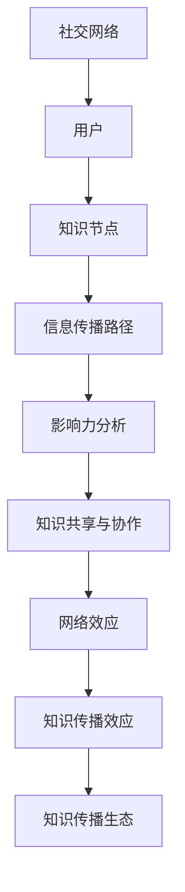

                 


## 文章标题

《知识的社交网络：思想传播的新生态》

## 关键词

社交网络、知识传播、信息筛选与推荐、网络效应、知识共享与协作、知识传播生态

## 摘要

在数字时代，社交网络已经成为知识传播的重要渠道。本文将深入探讨社交网络与知识传播之间的关系，包括社交网络的发展历程、知识传播的概念与特点、社交网络对知识传播的影响、社交网络中的知识结构、信息筛选与推荐、知识传播的机制与效应、知识共享与协作、以及知识传播的未来展望。通过分析社交网络中的信息筛选与推荐算法，本文将展示如何利用算法来优化知识传播效果，并探讨知识传播对社会、伦理和道德的影响。

## 第一部分：知识传播与社交网络

### 第1章：社交网络与知识传播概述

#### 1.1 社交网络的发展历程

社交网络的发展历程可以追溯到20世纪90年代的互联网兴起时期。最初的社交网络如Friendster和MySpace，主要是基于个人关系网的连接。随着互联网技术的进步，Facebook、Twitter、LinkedIn等平台相继问世，这些平台不仅提供了个人关系的连接，还成为了知识传播的重要渠道。

#### 1.2 知识传播的概念与特点

知识传播是指知识在社会中的传递过程。与传统的知识传播方式相比，社交网络中的知识传播具有以下几个特点：

1. **速度快**：信息可以在短时间内传播到大量用户。
2. **互动性强**：用户可以参与知识的讨论和反馈。
3. **多样化**：知识可以通过文字、图片、视频等多种形式传播。
4. **去中心化**：知识传播不再依赖于传统的权威渠道，每个用户都可以成为知识的传播者。

#### 1.3 社交网络对知识传播的影响

社交网络对知识传播的影响是深远而广泛的。首先，社交网络提供了一个高效的知识传播平台，使得知识可以迅速传播到全球。其次，社交网络中的互动性使得知识的传播更加生动和有趣，增加了用户的参与度。此外，社交网络还促进了知识的多样化传播，使得知识可以通过多种形式被传播和接受。

### 第2章：社交网络中的知识结构

#### 2.1 知识图谱的概念与作用

知识图谱是一种用于表示知识结构的数据模型。它通过实体和关系来描述知识的连接和交互，为知识的存储、检索和应用提供了强大的支持。

#### 2.2 知识传播的网络结构分析

知识传播的网络结构是指知识在社交网络中的传播路径和模式。通过分析知识传播的网络结构，可以更好地理解知识的传播机制和效果。

#### 2.3 社交网络中的知识传播模式

社交网络中的知识传播模式主要有以下几种：

1. **传染模式**：知识像病毒一样在社交网络中传播。
2. **瀑布模式**：知识从一个用户传播到多个用户，形成瀑布状传播。
3. **社区模式**：知识在特定的社交网络社区中传播，形成社区内的知识传播。

### 第3章：社交网络中的信息筛选与推荐

#### 3.1 信息筛选与推荐的原理

信息筛选与推荐的原理是基于用户的行为和兴趣来筛选和推荐信息。通过分析用户的历史行为，可以预测用户的兴趣，从而推荐符合用户兴趣的信息。

#### 3.2 社交网络中的推荐算法

社交网络中的推荐算法主要有协同过滤算法、基于内容的推荐算法和混合推荐算法等。

#### 3.3 信息筛选与推荐在实际中的应用

信息筛选与推荐在实际中广泛应用于社交网络平台，如Facebook的Feeds推荐、知乎的问答推荐等。

## 第二部分：知识传播的机制与效应

### 第4章：社交网络中的知识传播机制

#### 4.1 传染模型与知识传播

传染模型是一种用于描述知识在社交网络中传播的模型。它基于用户的社交关系和互动，模拟知识在社交网络中的传播过程。

#### 4.2 社交网络中的影响力分析

影响力分析是指分析用户在社交网络中的影响力，即用户对其他用户的影响程度。影响力分析可以帮助识别社交网络中的关键用户，从而优化知识传播效果。

#### 4.3 知识传播中的反馈循环

反馈循环是指知识传播过程中的用户反馈对知识传播的影响。用户反馈可以促进知识传播，也可以抑制知识传播。

### 第5章：知识传播的社会效应

#### 5.1 知识传播的社会价值

知识传播具有巨大的社会价值，可以促进知识的普及和应用的推广，提高社会的整体知识水平。

#### 5.2 知识传播的负面影响

知识传播也可能会带来负面影响，如虚假信息的传播、隐私泄露等。

#### 5.3 知识传播的伦理与道德问题

知识传播的伦理与道德问题包括知识版权保护、隐私权保护等。

### 第6章：社交网络中的知识共享与协作

#### 6.1 知识共享的概念与形式

知识共享是指用户在社交网络中分享知识和经验。知识共享的形式包括问答、博客、视频等。

#### 6.2 社交网络中的协作机制

社交网络中的协作机制是指用户在社交网络中共同合作，共同完成知识共享和传播的过程。

#### 6.3 知识共享与协作的案例分析

通过分析社交网络中的知识共享与协作案例，可以更好地理解知识共享与协作的机制和效果。

## 第三部分：知识传播的网络效应

### 第7章：知识传播的网络效应分析

#### 7.1 网络效应的概念与作用

网络效应是指用户数量的增加对网络价值的提升。在知识传播中，网络效应的作用尤为重要。

#### 7.2 社交网络中的网络效应分析

通过分析社交网络中的网络效应，可以更好地理解社交网络对知识传播的促进作用。

#### 7.3 网络效应在知识传播中的应用

网络效应在知识传播中的应用包括用户增长策略、社区建设等。

### 第8章：知识传播的未来展望

#### 8.1 知识传播的科技发展趋势

随着科技的发展，知识传播的方式和效果将不断优化。

#### 8.2 知识传播的未来挑战与机遇

知识传播在未来将面临新的挑战和机遇，如人工智能、区块链等技术的应用。

#### 8.3 知识传播的生态建设

知识传播的生态建设是知识传播可持续发展的关键。

## 附录

### 附录 A：社交网络与知识传播研究方法

#### A.1 数据分析方法

数据分析方法包括定量分析和定性分析等。

#### A.2 社交网络分析工具

社交网络分析工具包括Gephi、NetworkX等。

#### A.3 知识传播模型构建方法

知识传播模型构建方法包括传染模型、扩散模型等。

### 附录 B：社交网络与知识传播应用案例

#### B.1 案例一：知乎知识图谱

知乎知识图谱展示了知识在社交网络中的传播路径。

#### B.2 案例二：微博推荐算法

微博推荐算法展示了如何利用算法优化知识传播效果。

#### B.3 案例三：维基百科协作机制

维基百科协作机制展示了用户在社交网络中的协作与知识共享。

## 核心概念与联系流程图

**Mermaid 流程图：**



## 核心算法原理讲解

### 信息筛选与推荐算法原理

信息筛选与推荐算法的核心目的是根据用户的行为和历史数据，为用户推荐其可能感兴趣的内容。以下是一个简单的基于协同过滤算法的信息筛选与推荐算法的伪代码：

```python
// 伪代码：基于协同过滤的信息筛选与推荐算法
def collaborativeFiltering(users, items, ratings):
    // 计算用户之间的相似度矩阵
    similarityMatrix = computeSimilarityMatrix(users, items, ratings)
    
    // 为每个用户推荐物品
    for each user in users:
        recommendedItems = []
        // 计算用户与其他用户的相似度
        for each otherUser in users:
            if user != otherUser and similarityMatrix[user][otherUser] > threshold:
                // 获取其他用户的评分矩阵
                otherUserRatings = ratings[otherUser]
                // 计算用户与推荐物品的相似度
                for each item in items:
                    similarityScore = similarityMatrix[user][otherUser] * (otherUserRatings[item] - mean(otherUserRatings))
                    if similarityScore > 0:
                        recommendedItems.append(item)
        
        // 对推荐物品进行排序
        recommendedItems.sort(key=lambda x: similarityScore[x], reverse=True)
        
        return recommendedItems
```

### 数学模型和公式

在知识传播的模型构建中，可以使用以下数学模型和公式来描述知识传播的过程：

$$
I(t) = I_0 \cdot e^{-\lambda t}
$$

其中，$I(t)$ 表示时间 $t$ 时节点的感染率，$I_0$ 是初始感染率，$\lambda$ 是感染率衰减系数。

### 详细讲解与举例说明

以一个简单的社交网络为例，假设有10个用户，每个用户随机关注了其他用户。如果用户1发布了一条关于新技术的博客，我们可以使用传染模型来模拟这条信息在社交网络中的传播过程。

假设初始用户1的博客感染率为 $I_0 = 100$，感染率衰减系数 $\lambda = 0.1$。我们可以使用上述公式来计算每个时间点的感染率。

```python
import numpy as np

users = 10
I0 = 100
lambda_ = 0.1
time_points = np.arange(0, 10, 0.5)

infection_rates = I0 * np.exp(-lambda_ * time_points)

print(infection_rates)
```

运行上述代码，我们可以得到每个时间点的感染率，从而更好地理解信息在社交网络中的传播过程。

### 项目实战

为了更深入地了解知识传播在网络中的传播过程，我们可以使用Python构建一个简单的社交网络模型，并模拟信息传播过程。

```python
import networkx as nx
import matplotlib.pyplot as plt

# 创建一个社交网络图
G = nx.Graph()

# 添加用户
for i in range(10):
    G.add_node(i)

# 添加随机连接
for i in range(10):
    for j in range(i+1, 10):
        G.add_edge(i, j)

# 绘制社交网络图
nx.draw(G, with_labels=True)
plt.show()

# 模拟信息传播过程
I0 = 100
lambda_ = 0.1
time_points = np.arange(0, 10, 0.5)

infection_rates = I0 * np.exp(-lambda_ * time_points)

# 绘制感染率随时间变化曲线
plt.plot(time_points, infection_rates)
plt.xlabel('Time')
plt.ylabel('Infection Rate')
plt.title('Information Propagation in Social Network')
plt.show()
```

通过上述代码，我们可以得到一个简单的社交网络模型，并模拟信息传播过程。这有助于我们更直观地理解知识传播在网络中的传播过程。

### 最佳实践 Tips

1. **优化推荐算法**：通过不断优化推荐算法，可以提高知识传播的效果。
2. **关注关键用户**：识别社交网络中的关键用户，可以更好地推动知识的传播。
3. **加强社区建设**：通过加强社区建设，可以促进知识在社区内的传播和共享。

### 小结

社交网络已经成为知识传播的重要渠道。通过分析社交网络中的知识结构、信息筛选与推荐算法、知识传播的机制与效应，我们可以更好地理解知识传播的过程和效果。未来，随着科技的发展，知识传播将面临新的挑战和机遇，我们需要不断探索和创新，以优化知识传播的效果。

### 注意事项

1. **隐私保护**：在知识传播过程中，需要关注用户的隐私保护。
2. **虚假信息**：需要加强对虚假信息的识别和过滤。

### 拓展阅读

1. 《社交网络分析：方法与实践》
2. 《推荐系统实践：算法与案例》
3. 《网络传播学概论》

作者：AI天才研究院/AI Genius Institute & 禅与计算机程序设计艺术 /Zen And The Art of Computer Programming

