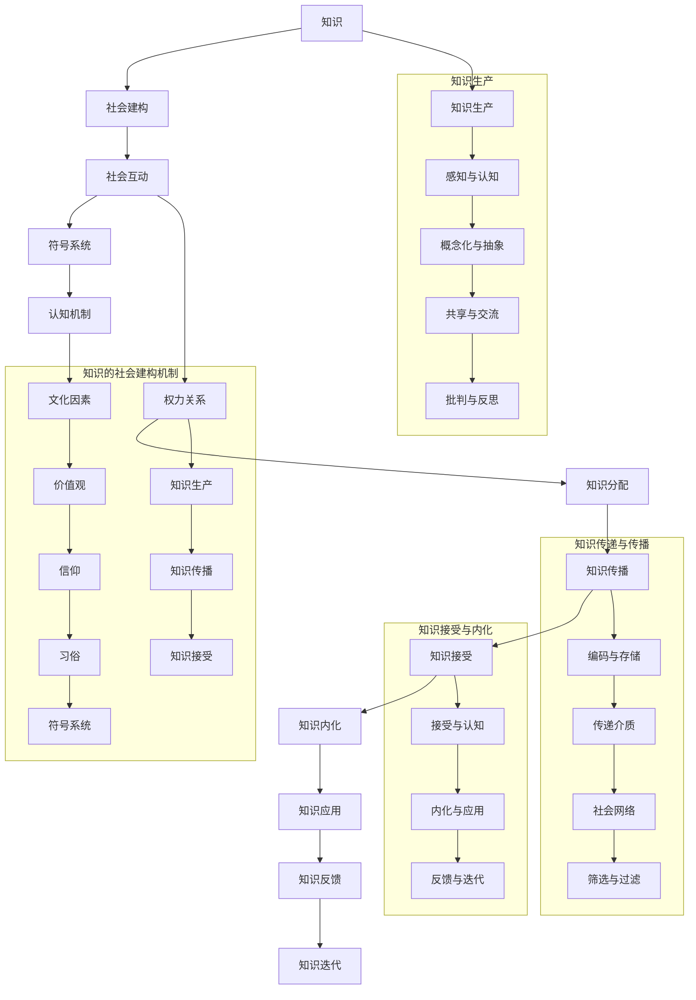

                 

### 文章标题

《知识的社会建构：真理是如何形成的》

### 关键词

知识社会建构、真理形成、社会机制、认知过程、文化因素

### 摘要

本文深入探讨了知识的社会建构过程及其如何影响真理的形成。从知识与社会建构理论的基础出发，本文详细分析了知识的生产、传递、接受和内化过程，探讨了知识建构中的权力关系、认知机制和文化因素。通过案例研究和实践应用，本文揭示了知识建构在真实世界中的影响，并提出了未来展望。

## 《知识的社会建构：真理是如何形成的》

### 第一部分：知识的社会建构基础理论

#### 第1章：知识社会建构理论概述

##### 1.1 知识与社会建构的概念

知识，作为人类对客观世界的理解和认识，不仅仅是个体的认知成果，更是社会互动和文化传承的产物。知识社会建构理论认为，知识并非客观存在，而是在社会互动中不断形成、发展和变化的。社会建构强调知识的动态性和相对性，认为知识是建构性的，受到社会、文化和个人因素的影响。

社会建构的概念源自社会学和哲学领域，强调社会互动在知识形成中的关键作用。社会建构理论认为，知识是通过社会互动和沟通而建构的，是人们对现实的共同理解。这种理解是通过符号、语言和社会实践来实现的，是集体智慧的体现。

##### 1.2 知识的社会建构理论发展

知识社会建构理论的发展可以追溯到20世纪中叶，当时社会学、心理学和哲学领域的学者开始质疑传统的知识观念，提出了知识的社会建构观点。其中，社会学家如皮埃尔·布尔迪厄（Pierre Bourdieu）和米哈伊尔·巴赫金（Mikhail Bakhtin）对知识社会建构理论做出了重要贡献。

布尔迪厄提出了“知识场”的概念，认为知识是在特定的社会文化环境中产生和传播的，受到权力和利益的制约。巴赫金则强调对话和交往在知识建构中的重要性，认为知识是多元的、对话性的，而不是单一的、权威性的。

随着计算机科学和信息技术的发展，知识社会建构理论在数字时代得到了进一步的发展。学者们开始关注网络环境下的知识建构过程，探讨了虚拟社区、在线协作和知识共享平台对知识建构的影响。

##### 1.3 知识社会建构理论的核心观点

知识社会建构理论的核心观点可以概括为以下几点：

1. **知识的动态性和相对性**：知识是动态变化的，受到社会、文化和个人因素的影响。不同社会和文化背景下的知识建构过程和结果可能存在显著差异。

2. **社会互动的重要性**：知识是通过社会互动和沟通建构的，个体在互动中分享、讨论和反思，从而形成对客观世界的共同理解。

3. **符号和语言的作用**：符号和语言是知识建构的重要工具，通过符号和语言的运用，个体和社会能够共同理解和描述世界。

4. **多元性和对话性**：知识是社会多元互动的结果，是不同声音和观点的对话和整合。知识的多元性和对话性使得知识更加丰富和全面。

5. **权力和利益的制约**：知识建构过程中，权力和利益因素不可忽视。知识的生产、传播和应用受到社会权力结构和利益分配的影响。

#### 1.4 知识社会建构理论的应用领域

知识社会建构理论在多个领域得到了广泛应用，包括教育、科学、技术、管理和社会科学等。以下是一些主要应用领域：

1. **教育**：知识社会建构理论在教育领域中强调学生的主动参与和建构性学习，提倡以学生为中心的教学方法，鼓励学生通过互动和合作来建构知识。

2. **科学**：知识社会建构理论在科学研究中关注科学知识的动态性和相对性，强调科学家在知识建构过程中的角色和影响。

3. **技术**：知识社会建构理论在技术领域中探讨技术创新和知识共享的过程，分析技术对知识建构的影响。

4. **管理**：知识社会建构理论在管理领域中强调知识管理的重要性，探讨企业如何通过知识共享和协作来提高创新能力。

5. **社会科学**：知识社会建构理论在社会科学研究中提供了新的研究方法和理论框架，帮助学者们更好地理解社会现象和知识建构过程。

通过本章的讨论，我们可以看到知识社会建构理论的基本概念、发展历程和应用领域，为后续章节的深入探讨奠定了基础。知识的社会建构过程是复杂的，涉及到多个层面的互动和影响。在接下来的章节中，我们将进一步探讨知识的生产、传递、接受和内化过程，以及知识建构中的权力关系、认知机制和文化因素。

## 第一部分：知识的社会建构基础理论

### 第2章：知识的社会建构过程

知识的社会建构过程是一个复杂而多维的过程，涉及到知识的产生、传递、接受和内化。在这一过程中，社会、文化和个人因素共同作用，使得知识不断演变和丰富。本章将详细探讨知识的社会建构过程，分析每个环节的核心要素及其相互关系。

#### 2.1 知识的生产过程

知识的生产是知识建构过程的第一步，也是最为关键的一步。知识的生产过程可以分为以下几个阶段：

1. **感知与认知**：个体通过感官和认知能力感知外部世界，收集信息。感知和认知过程受到个体的经验、知识和文化背景的影响。

2. **概念化与抽象**：个体将感知到的信息进行概念化和抽象，形成初步的知识。这一过程涉及对信息的筛选、组织和整合，从而形成有意义的认知框架。

3. **共享与交流**：个体将初步的知识与他人分享和交流，通过对话、讨论和互动来完善和丰富知识。共享与交流过程促进了知识的多样性和对话性。

4. **批判与反思**：个体和群体对共享的知识进行批判和反思，识别和解决其中的矛盾和问题。批判与反思是知识生产过程中的重要环节，有助于提升知识的准确性和可靠性。

知识的生产过程是动态的，涉及多个层面的互动和反馈。个体在感知、概念化、共享和反思过程中，不断调整和修正自己的认知框架，从而形成更为丰富和全面的知识。

#### 2.2 知识的传递与传播

知识的生产完成后，需要通过传递和传播过程将其扩散到更广泛的社会范围内。知识的传递与传播包括以下几个环节：

1. **编码与存储**：个体将知识以某种形式进行编码，并存储在记忆、文献、数据库和其他媒介中。编码与存储过程有助于长期保存和传递知识。

2. **传递介质**：知识通过不同的传递介质进行传播，包括口头传播、书面传播、视觉传播和网络传播等。不同的传递介质具有不同的传播速度、覆盖范围和影响力。

3. **社会网络**：知识在社会网络中的传播受到人际关系、社会结构和信息流动规律的影响。社会网络中的关键节点和路径对知识的传播具有重要作用。

4. **筛选与过滤**：在知识传递和传播过程中，个体和社会会对知识进行筛选和过滤，识别和保留有价值的信息，排除噪音和冗余。

知识的传递与传播过程是知识社会建构的重要组成部分，它决定了知识能否被广泛接受和应用。有效的传递与传播机制有助于提高知识的共享性和可持续性。

#### 2.3 知识的接受与内化

知识的接受与内化是知识社会建构的最终目标，也是知识发挥作用的关键环节。在这一过程中，个体和社会对传递和传播的知识进行接受、理解和内化：

1. **接受与认知**：个体对社会传递的知识进行接受，通过感知、理解和反思来形成自己的认知。个体在接受过程中，会结合自己的经验、知识和文化背景，对知识进行筛选和调整。

2. **内化与应用**：个体将接受的知识内化到自己的认知框架中，形成稳定的知识结构。内化的知识可以应用于实践，指导个体的行为和决策。

3. **反馈与迭代**：个体在应用知识的过程中，会产生新的经验和认识，这些反馈信息可以进一步丰富和修正知识，形成知识的迭代和发展。

知识的接受与内化过程是知识社会建构的核心，它决定了知识能否真正发挥作用，促进社会进步和个体发展。

#### 2.4 知识建构过程中的核心要素与关系

知识的社会建构过程涉及多个核心要素，包括个体、社会、文化、知识和互动等。这些要素相互关联，共同推动知识的发展：

1. **个体**：个体是知识建构的基本单位，通过感知、认知、交流和反思来参与知识的生产、传递、接受和内化。

2. **社会**：社会是知识建构的背景和平台，通过社会网络、文化传统和制度安排来影响知识的生产、传递和接受。

3. **文化**：文化是知识建构的根基，通过价值观、信仰、习俗和符号系统来塑造知识的内容和形式。

4. **知识**：知识是知识建构的对象，通过概念化、抽象、共享和批判来不断发展和完善。

5. **互动**：互动是知识建构的动力，通过个体之间的沟通、合作和竞争来促进知识的产生、传递、接受和内化。

知识建构过程中的核心要素相互联系、相互作用，形成了一个复杂的动态系统。个体、社会、文化和知识在互动中相互影响，共同推动知识的发展。

通过本章的讨论，我们深入了解了知识的社会建构过程，包括知识的生产、传递、接受和内化。这一过程涉及多个环节和核心要素，是一个动态的、复杂的系统。在接下来的章节中，我们将进一步探讨知识建构中的权力关系、认知机制和文化因素，分析这些因素如何影响知识的生产、传递和接受，从而影响真理的形成。

#### 2.5 知识的社会建构机制

知识的社会建构机制是指那些在知识生产、传递和接受过程中发挥关键作用的社会、认知和文化因素，这些因素共同作用于知识建构过程，使其具有复杂性和多样性。以下是对这些机制的具体分析：

##### 3.1 社会建构中的权力关系

在社会建构过程中，权力关系是一个不可忽视的重要因素。权力关系不仅影响知识的生产和传播，还影响知识的接受和内化。

1. **知识生产的权力关系**：在知识生产过程中，特定的社会群体和个体往往占据主导地位，他们的观点和知识被广泛接受和传播。例如，学术界的权威专家、企业高管和技术专家等，他们的研究成果和知识往往对其他个体产生较大的影响力。

2. **知识传播的权力关系**：在知识传播过程中，传播渠道和媒介的掌控者也拥有相当的权力。传统媒体、社交网络、教育机构等，都是知识传播的重要渠道，这些渠道的选择和运用决定了知识的覆盖范围和影响力。

3. **知识接受的权力关系**：个体在接受知识时，也会受到自身权力和社会权力的制约。权力较小的个体可能更容易接受和内化权威观点，而权力较大的个体可能更倾向于批判和挑战现有知识。

权力关系不仅影响知识的生产和传播，还可能导致知识的不平等分布。某些社会群体可能因为权力优势而拥有更多知识和资源，而其他群体则可能因权力劣势而缺乏这些优势。

##### 3.2 社会建构中的认知机制

认知机制是指个体在感知、理解和内化知识时使用的认知过程和策略。这些认知机制不仅影响知识的形成，还影响知识的传递和接受。

1. **感知与筛选**：个体通过感官感知外部信息，但并非所有信息都会被注意到。个体会根据自身的兴趣、经验和期望对信息进行筛选，选择有意义的信息进行加工。

2. **概念化与抽象**：个体将感知到的信息进行概念化和抽象，形成初步的知识。这一过程涉及到对信息的组织和整合，从而形成有意义的认知框架。

3. **记忆与遗忘**：个体将概念化的知识存储在记忆中，但记忆不是完全精确的，个体可能会根据需要选择性地记忆某些信息，而遗忘其他信息。

4. **推理与判断**：个体在理解和应用知识时，会使用推理和判断来解决问题。推理包括逻辑推理和概率推理等，判断则涉及对信息价值的评估和选择。

认知机制受到个体的认知能力、知识水平和文化背景的影响。不同个体的认知机制可能存在差异，导致对同一信息的理解和解释不同。

##### 3.3 社会建构中的文化因素

文化因素是知识社会建构过程中的重要组成部分，它包括价值观、信仰、习俗、符号系统等。文化因素不仅影响知识的生产、传递和接受，还影响知识的内涵和外延。

1. **价值观**：个体的价值观对其知识建构过程具有深远影响。不同的价值观可能导致对同一现象的不同理解和解释。例如，在一些文化中，重视集体主义和和谐，而在另一些文化中，重视个人主义和竞争。

2. **信仰**：信仰是人们对世界的理解和信念，它对知识建构具有指导作用。例如，科学信仰可能导致人们接受科学方法，而宗教信仰可能导致人们接受宗教教义。

3. **习俗**：习俗是文化传统的一部分，它规定了人们的行为准则和规范。习俗不仅影响个体的行为，还影响知识的传递和接受。例如，在某些文化中，教师被视为权威，他们的观点和知识更容易被学生接受。

4. **符号系统**：符号系统是文化的重要组成部分，它包括语言、文字、图像等。符号系统不仅用于传递信息，还用于表达和交流。不同文化的符号系统可能存在显著差异，导致知识表达和理解的差异。

文化因素不仅影响知识的建构过程，还可能导致知识的文化差异。在不同文化背景下，人们对同一现象的知识建构过程可能存在显著差异。

##### 3.4 各机制之间的相互作用

知识的社会建构机制不是孤立的，而是相互关联、相互作用的。权力关系、认知机制和文化因素共同作用于知识建构过程，使其具有复杂性和多样性。

1. **权力关系与认知机制**：权力关系会影响个体的认知机制，例如，权力较大的个体可能更容易获得信息和资源，从而拥有更强的认知能力。同时，认知机制也会影响权力关系，例如，个体的认知能力可能影响其在社会中的地位和影响力。

2. **文化因素与认知机制**：文化因素会影响个体的认知机制，例如，不同文化的价值观和信仰可能导致个体对信息的不同处理方式。同时，认知机制也会影响文化因素，例如，个体的认知能力可能影响其对文化的理解和传承。

3. **权力关系与文化因素**：权力关系和文化因素相互影响，权力关系可能影响文化的发展，而文化因素可能影响权力关系的形成和演变。

通过分析知识的社会建构机制，我们可以更好地理解知识的生产、传递、接受和内化过程，以及这些过程如何影响真理的形成。在接下来的章节中，我们将通过具体的案例研究，进一步探讨知识的社会建构过程及其影响。

#### 4.1 知识建构与社会问题

知识的社会建构过程不仅影响个体和社会的认知，还与社会问题密切相关。理解知识建构与社会问题的关系，有助于我们更好地应对复杂的社会挑战。以下是对知识建构与社会问题之间关系的详细分析：

##### 4.1.1 知识建构与社会不平等

知识的不平等是社会不平等的一个重要方面。知识的生产、传递和接受过程受到社会权力关系的影响，导致知识资源在不同社会群体之间的分配不均。以下是一些具体的社会不平等现象：

1. **教育不平等**：教育是知识传递和建构的重要途径。在教育资源分配不均的社会中，经济条件较差的群体可能难以获得高质量的教育，从而影响其知识水平的提升。这种教育不平等可能导致社会阶层的固化，加剧社会不平等。

2. **科技不平等**：在信息技术快速发展的今天，科技知识和技能的掌握成为知识经济时代的重要竞争力。然而，科技知识的获取和掌握仍然受到社会权力和经济资源的制约。发达国家和发展中国家、城市和农村之间在科技知识水平上的差距，进一步加剧了社会不平等。

3. **信息不平等**：信息是知识的重要来源，但在信息传播过程中，信息资源往往被权力和资本所控制。一些社会群体可能因为缺乏获取和利用信息的能力，而处于信息不利的地位。信息不平等不仅影响个体的知识水平，还可能导致社会共识和决策的失衡。

##### 4.1.2 知识建构与科学争议

科学争议是知识建构过程中常见的现象，它反映了科学知识的不确定性和复杂性。以下是一些与科学争议相关的社会问题：

1. **科学共识的挑战**：科学共识是科学知识的重要组成部分，它代表了科学界对某一问题的普遍认可和共识。然而，科学共识的形成往往受到权力、利益和认知机制的制约。在某些情况下，科学共识可能被特定利益集团或政治力量所操纵，导致科学争议的产生。

2. **科学家的角色**：科学家在知识建构过程中扮演着重要角色，他们的研究、观点和结论对社会具有重大影响。然而，科学家的角色也可能受到权力关系的制约。在某些情况下，科学家可能因为权力关系而被迫服从特定利益集团或政治力量的要求，从而影响科学知识的客观性和公正性。

3. **公众科学素养**：公众科学素养是影响科学争议的重要因素。公众对科学知识的了解程度和科学素养水平，直接影响其对科学争议的态度和判断。在一些科学争议中，公众科学素养较低可能导致科学知识的误解和恐慌，加剧社会矛盾。

##### 4.1.3 知识建构与伦理问题

知识建构过程涉及到伦理问题的探讨，包括知识的应用、隐私保护和数据安全等。以下是一些与伦理问题相关的社会问题：

1. **知识应用的伦理问题**：知识的应用可能带来伦理问题，例如，人工智能的应用可能引发隐私侵犯、就业流失和道德决策等问题。在知识应用过程中，如何平衡技术进步和社会伦理，是知识建构过程中必须面对的挑战。

2. **数据隐私保护**：在数字化时代，数据成为知识建构的重要基础。然而，数据隐私保护成为了一个严峻的挑战。在知识建构过程中，如何保护个人隐私、防止数据滥用，是亟需解决的社会问题。

3. **数据安全**：随着数据规模的扩大和技术的进步，数据安全成为一个日益严峻的问题。在知识建构过程中，如何确保数据的安全和完整性，防止数据泄露和恶意攻击，是知识社会面临的重要挑战。

##### 4.1.4 知识建构与政策制定

知识建构过程对政策制定具有重要影响。以下是一些与政策制定相关的社会问题：

1. **政策基于知识**：政策的制定需要基于科学和实证知识。然而，在知识建构过程中，知识的真实性和可靠性可能受到质疑，导致政策制定的困难。

2. **政策执行的挑战**：政策执行往往需要依赖知识和技能。在知识建构过程中，如何确保政策执行的可行性和有效性，是政策制定者必须面对的挑战。

3. **政策反馈与调整**：知识建构过程中的反馈机制对政策调整具有重要意义。政策制定者需要根据知识建构过程中出现的反馈，及时调整和优化政策，以提高政策的适应性和有效性。

综上所述，知识的社会建构过程与社会问题密切相关。理解知识建构与社会问题的关系，有助于我们更好地应对复杂的社会挑战，推动社会的可持续发展。在接下来的章节中，我们将继续探讨知识的社会建构与科学技术、道德伦理等方面的关系，进一步揭示知识建构的深远影响。

#### 4.2 知识建构与科学技术

知识建构与科学技术之间存在着密切的相互作用关系，这种关系不仅影响科学技术的进步，还影响社会的各个方面。以下是对知识建构与科学技术关系的详细分析：

##### 4.2.1 知识建构推动科学技术发展

知识建构过程是科学技术发展的重要动力。科学技术的进步往往依赖于知识的积累和创新，而知识建构正是实现这一目标的关键环节。以下是知识建构如何推动科学技术发展的几个方面：

1. **知识的生产**：知识的生产是科学技术发展的基础。科学家通过观察、实验和研究，不断产生新的知识，这些知识为科学技术的发展提供了坚实的基础。知识生产过程中的批判性思维和多元互动，有助于激发创新思维，推动科学技术突破。

2. **知识的传播**：知识的传播是科学技术发展的重要保障。科学知识的广泛传播，有助于提高公众的科学素养，培养更多的科技人才，从而推动科学技术的普及和应用。同时，科学知识的传播也有助于促进国际合作和知识共享，加速科学技术的全球化发展。

3. **知识的内化**：知识的内化是科学技术发展的重要阶段。科学家通过对知识的内化，将其转化为实践能力和创新成果。内化的知识不仅有助于提升科学家的研究能力，还可以推动科学技术的实际应用，解决社会问题。

##### 4.2.2 科学技术影响知识建构

科学技术的发展不仅推动知识建构，还深刻影响知识建构的过程和结果。以下是科学技术如何影响知识建构的几个方面：

1. **信息技术的变革**：信息技术的发展极大地改变了知识建构的方式。互联网、大数据和人工智能等新兴技术，为知识的获取、传播和应用提供了新的途径。这些技术不仅提高了知识的生产效率，还促进了知识的多元化和开放性。

2. **科学方法的应用**：科学技术的进步带来了科学方法的发展和完善。科学方法的应用，使得知识建构更加严谨和科学，提高了知识的可靠性和有效性。例如，实验设计、数据分析和统计方法等，都是科学方法的重要组成部分，对知识建构具有重要影响。

3. **科学技术的应用**：科学技术的实际应用，不仅推动了科学技术的进步，还影响了知识建构的内容和形式。例如，人工智能技术的应用，使得知识建构更加智能化和自动化，提升了知识处理和决策的效率。

##### 4.2.3 知识建构与科学技术的互动机制

知识建构与科学技术之间的互动机制，是推动科学技术发展的重要动力。以下是对这些互动机制的详细分析：

1. **知识驱动创新**：知识建构过程中的新知识，为科学技术创新提供了理论基础和实践指南。科学家通过对现有知识的深入研究和批判性思考，产生新的科学理论和技术方案，推动科学技术的创新。

2. **技术创新反馈**：科学技术的实际应用，会反过来影响知识建构。技术创新过程中遇到的问题和挑战，促使科学家对现有知识进行反思和改进，从而推动知识建构的深化和发展。

3. **跨学科合作**：知识建构与科学技术的发展，往往需要跨学科合作。不同学科之间的知识交流和融合，有助于拓展科学技术的视野，推动科学技术的综合发展。

4. **社会参与**：社会参与是知识建构与科学技术互动的重要环节。公众、政府和其他利益相关者的参与，有助于提高科学技术的透明度和公信力，促进科学技术的可持续发展。

通过分析知识建构与科学技术的关系，我们可以看到，知识建构不仅推动科学技术发展，还受到科学技术的深刻影响。知识建构与科学技术的互动机制，是推动科学技术进步和社会发展的重要动力。在未来的发展中，我们需要更加重视知识建构与科学技术之间的关系，发挥知识建构在科学技术创新中的重要作用，为实现社会的可持续发展做出贡献。

#### 4.3 知识建构与道德伦理

知识建构与道德伦理之间的关系复杂且深远，涉及知识生产、传播和应用的多个方面。道德伦理不仅影响知识建构的过程，也影响知识建构的结果及其社会影响。以下是对知识建构与道德伦理关系的详细分析：

##### 4.3.1 知识生产中的道德伦理问题

知识生产是知识建构的核心环节，道德伦理在知识生产过程中起着重要作用。以下是一些关键问题：

1. **科研诚信**：科研诚信是知识生产的基础。科学家在研究过程中必须遵守诚实、公正和透明的原则，避免伪造数据、篡改结果或剽窃他人成果。科研诚信的缺失可能导致知识生产的不真实和不可信，从而影响整个知识体系的可靠性。

2. **隐私保护**：在知识生产过程中，科学家可能需要收集和处理涉及个人隐私的数据。如何保护个人隐私，防止数据泄露和滥用，是道德伦理必须关注的问题。例如，大数据分析和人工智能技术的发展，为知识生产提供了丰富的数据资源，但也引发了隐私保护的挑战。

3. **资源分配**：知识生产过程中，资源分配的公平性是一个重要的道德伦理问题。科学研究的资金、设备和人力资源的分配，应该考虑社会的公平性和正义原则，确保不同背景的科学家和科研团队有平等的机会进行知识生产。

##### 4.3.2 知识传播中的道德伦理问题

知识传播是知识建构的重要环节，道德伦理在知识传播过程中同样至关重要。以下是一些关键问题：

1. **知识普及**：知识普及是道德伦理的重要任务，确保知识能够为公众所理解和应用。然而，知识普及过程中可能存在信息偏差、误解和误传等问题，需要道德伦理的引导，确保知识的准确性和公正性。

2. **言论自由**：在知识传播过程中，言论自由是一个重要的道德原则。公众和科学家有权表达自己的观点和知识，但同时也需要遵守社会责任和道德规范，避免虚假信息、谣言和恶意攻击的传播。

3. **媒体责任**：媒体在知识传播中扮演着关键角色，其道德伦理行为直接影响知识的传播效果。媒体应该坚持客观、公正和真实的原则，避免夸大事实、误导公众，履行社会责任。

##### 4.3.3 知识应用中的道德伦理问题

知识应用是知识建构的最终目标，道德伦理在知识应用过程中同样至关重要。以下是一些关键问题：

1. **技术应用**：科学技术的应用，尤其是人工智能、大数据和生物技术等领域，可能带来伦理问题。如何确保技术应用的安全、公正和道德，避免对人类和社会的负面影响，是道德伦理必须关注的问题。

2. **社会责任**：知识应用过程中的企业和机构，应承担社会责任，确保其行为符合道德伦理标准。例如，在商业竞争中，企业应遵循公平竞争原则，避免不正当手段获取市场优势。

3. **环境保护**：知识应用过程中的技术进步，可能对环境产生深远影响。如何确保技术应用过程中的环境保护，减少对自然资源的消耗和环境污染，是道德伦理必须考虑的问题。

##### 4.3.4 道德伦理对知识建构的影响

道德伦理不仅影响知识建构的过程和结果，还影响知识建构的社会影响。以下是对道德伦理对知识建构影响的详细分析：

1. **知识真实性**：道德伦理原则有助于确保知识建构的真实性。遵循道德伦理的科学家，更可能进行诚实、公正和透明的研究，从而提高知识的可靠性。

2. **社会公信力**：道德伦理原则有助于提升知识建构的社会公信力。科学家和知识传播者遵守道德伦理规范，有助于赢得公众的信任和认可，提高知识在社会中的影响力。

3. **知识共享**：道德伦理原则有助于促进知识共享。科学家和知识传播者遵循道德伦理规范，愿意分享知识和经验，有助于推动知识的传播和普及。

4. **社会和谐**：道德伦理原则有助于维护社会和谐。知识建构过程中的道德伦理行为，有助于减少社会冲突和矛盾，促进社会的稳定和发展。

综上所述，知识建构与道德伦理之间存在着密切的关系。道德伦理不仅影响知识建构的过程和结果，还影响知识建构的社会影响。在知识建构过程中，重视道德伦理原则，有助于确保知识的真实性、社会公信力和共享性，从而推动社会的和谐与进步。

#### 第5章：知识的社会建构案例研究一

##### 5.1 案例背景

知识的社会建构案例研究一选择的是“互联网知识共享平台的发展历程”，这一案例反映了知识在现代社会中的建构过程，特别是互联网技术对知识生产和传播的深刻影响。

互联网知识共享平台，如维基百科、学术论坛、在线教育平台等，是近年来知识社会建构的重要载体。这些平台通过互联网技术，实现了知识的快速生产、传播和共享，改变了传统的知识传播模式，对教育和科学研究产生了深远影响。

##### 5.2 知识建构过程分析

1. **知识生产**：

在互联网知识共享平台的发展初期，知识生产主要依赖于专业学者和志愿者。这些专业学者和志愿者通过撰写、编辑和更新内容，生产了大量高质量的学术资料和科普知识。随着互联网技术的进步，知识生产的门槛大大降低，普通用户也可以参与到知识生产中来。用户生成内容（UGC）成为互联网知识共享平台的重要特征，使得知识生产变得更加民主化和多元化。

2. **知识传播**：

互联网技术为知识传播提供了广阔的平台。维基百科等平台通过全球分布式网络，使得知识可以快速传播到世界各地。知识的传播不再受限于地理位置和时间，实现了全球范围内的知识共享。此外，社交媒体和搜索引擎等工具的普及，使得知识传播更加便捷和高效。用户可以通过评论、点赞、分享等方式，参与到知识传播的过程中，促进知识的扩散和传播。

3. **知识接受与内化**：

用户在互联网知识共享平台上获取知识，通过阅读、评论、讨论等方式，对知识进行理解和内化。用户之间的互动和协作，有助于知识的深层次理解和应用。互联网知识共享平台提供了丰富的学习资源和互动工具，用户可以在线学习、交流，形成学习社区，促进知识的内化和应用。

##### 5.3 案例影响与启示

1. **影响**：

互联网知识共享平台对知识建构产生了深远的影响：

- **知识民主化**：互联网知识共享平台降低了知识生产的门槛，使得知识生产更加民主化。普通用户可以参与到知识生产中来，推动了知识的普及和多样化。

- **知识全球化**：互联网知识共享平台打破了地域限制，实现了知识的全球化传播。用户可以跨越地域和文化的界限，获取和共享全球范围内的知识资源。

- **教育变革**：互联网知识共享平台为教育提供了新的模式。在线教育平台通过提供丰富的学习资源和互动工具，改变了传统的教育模式，促进了教育的普及和个性化。

2. **启示**：

互联网知识共享平台的成功，为知识社会建构提供了重要启示：

- **技术驱动知识建构**：互联网技术的进步，为知识建构提供了新的工具和平台。未来知识建构的发展，将继续依赖于技术的创新和应用。

- **重视知识传播的多样性**：知识传播的多样性是知识社会建构的重要特征。未来知识建构需要更加重视多元化和开放性，鼓励不同背景、不同领域的知识交流和融合。

- **平衡知识共享与知识产权**：在知识共享的过程中，如何平衡知识共享与知识产权保护，是一个重要的挑战。未来知识社会建构需要探索更加有效的知识产权保护机制，确保知识共享与知识产权的平衡。

通过这一案例研究，我们可以看到互联网知识共享平台在知识社会建构过程中的重要作用。互联网技术的进步，使得知识的生产、传播和接受变得更加便捷和高效，推动了知识的普及和多样化。这一案例为我们提供了宝贵的经验和启示，有助于我们更好地理解和应对知识社会建构的挑战。

#### 第6章：知识的社会建构案例研究二

##### 6.1 案例背景

知识的社会建构案例研究二选择的是“开放科学运动”，这一案例展示了知识在社会互动中的动态变化和权力关系的复杂性。开放科学运动起源于20世纪末，旨在通过开放获取、开放数据和开放协作等方式，推动科学知识的共享和普及。

开放科学运动的核心理念是“开放性”，即科学知识的获取、传播和应用应该开放和透明。这一运动挑战了传统的科学出版模式，推动了科学知识的开放获取和共享，对科学界和社会产生了深远的影响。

##### 6.2 知识建构过程分析

1. **知识生产**：

在开放科学运动中，知识生产过程发生了显著变化。传统科学研究中，知识生产主要依赖于少数专业科学家和学术机构。而在开放科学运动中，知识生产逐渐向普通公众和学术机构开放。通过开放获取和开放协作，更多的科学家和研究人员可以参与到知识生产过程中，提高了知识的多样性和创新性。

2. **知识传播**：

开放科学运动通过多种方式推动了科学知识的传播。首先，开放获取使得科学论文和研究成果可以免费获取，降低了科学知识的获取门槛。其次，开放数据和开放协作促进了科学知识的共享和传播。科学家可以通过开放数据平台共享实验数据，通过协作平台进行跨学科合作，推动科学知识的传播和应用。

3. **知识接受与内化**：

在开放科学运动中，知识接受与内化过程也发生了变化。公众和科研人员可以通过在线平台获取科学知识，参与科学讨论和协作。知识接受与内化不再仅限于学术圈内，而是扩展到了更广泛的社会公众。这一过程促进了科学知识的普及和多元化，提高了公众的科学素养。

##### 6.3 案例影响与启示

1. **影响**：

开放科学运动对知识社会建构产生了深远的影响：

- **知识民主化**：开放科学运动降低了科学知识的获取门槛，使得更多的公众可以参与到科学知识的生产和传播过程中。这有助于推动知识的普及和民主化，促进社会公平。

- **科学透明化**：开放科学运动提高了科学知识的透明度和可追溯性，使得科学研究的质量和可信度得到提升。这有助于提高公众对科学的信任，促进科学与社会互动。

- **创新加速**：开放获取和开放协作促进了科学知识的共享和传播，加速了科学研究的创新进程。科学家和研究人员可以通过合作和共享，更快地解决问题，推动科学技术的进步。

2. **启示**：

开放科学运动的成功为知识社会建构提供了重要启示：

- **技术驱动知识建构**：互联网和信息技术的发展为知识建构提供了新的工具和平台。未来知识社会建构需要继续依靠技术的创新和应用，推动知识的开放获取和共享。

- **重视多元互动**：知识建构是一个多元互动的过程，需要不同领域和背景的科学家和公众参与。未来知识社会建构需要更加重视多元互动，鼓励不同声音和观点的交流和融合。

- **平衡开放性与知识产权**：在推动知识开放获取和共享的过程中，如何平衡开放性与知识产权保护，是一个重要的挑战。未来知识社会建构需要探索更加有效的知识产权保护机制，确保知识共享与知识产权的平衡。

通过这一案例研究，我们可以看到开放科学运动在知识社会建构过程中的重要作用。开放科学运动不仅推动了科学知识的共享和普及，还促进了科学知识的民主化和透明化。这一案例为我们提供了宝贵的经验和启示，有助于我们更好地理解和应对知识社会建构的挑战。

#### 第7章：知识的社会建构案例研究三

##### 7.1 案例背景

知识的社会建构案例研究三选择的是“区块链技术在知识共享中的应用”，这一案例展示了新兴技术在知识建构中的潜在影响。区块链技术以其去中心化、不可篡改和透明性等特点，为知识共享提供了新的可能性。该案例探讨区块链技术在知识共享中的实际应用及其对知识建构的影响。

##### 7.2 知识建构过程分析

1. **知识生产**：

区块链技术的应用改变了知识生产的方式。传统的知识生产依赖于中心化的机构和权威，而区块链技术通过去中心化的方式，使得个体可以独立生产知识。每个参与者在区块链网络中都有平等的发言权，知识生产不再受限于特定的机构和权威。这种去中心化的生产模式，促进了知识的多样性和创新性。

2. **知识传播**：

区块链技术通过去中心化的网络，实现了知识的高效传播。在传统的知识传播模式中，知识传播往往受限于中心化的平台和渠道。而区块链技术通过点对点网络，使得知识可以直接在参与者之间传播，无需通过中心化的中介。这种去中心化的传播模式，提高了知识的传播速度和覆盖范围。

3. **知识接受与内化**：

区块链技术的应用，使得知识的接受与内化过程更加直接和透明。参与者可以直接访问区块链网络中的知识，通过阅读、评论和反馈等方式，对知识进行理解和内化。区块链技术的透明性，使得知识的真实性和可靠性得到保障，参与者可以更加信任和依赖区块链网络中的知识。

##### 7.3 案例影响与启示

1. **影响**：

区块链技术在知识共享中的应用，对知识建构产生了深远的影响：

- **知识去中心化**：区块链技术打破了中心化的知识生产模式，使得知识生产更加民主化和多元化。每个参与者都有机会成为知识的生产者，知识的权威性不再集中于特定的机构和权威。

- **知识透明化**：区块链技术的透明性，提高了知识的透明度和可追溯性。知识的生产、传播和接受过程都在区块链上记录，使得知识的真实性和可靠性得到保障。

- **知识共享效率提升**：区块链技术通过去中心化的网络，提高了知识共享的效率。参与者可以直接在区块链网络中获取和分享知识，无需通过中心化的中介，减少了知识传播的时间和成本。

2. **启示**：

区块链技术在知识共享中的应用，为知识社会建构提供了重要启示：

- **技术驱动知识建构**：区块链技术的应用，展示了新兴技术在知识建构中的巨大潜力。未来知识社会建构需要继续依靠技术的创新和应用，推动知识的开放获取和共享。

- **重视去中心化**：去中心化是未来知识社会建构的重要趋势。去中心化的知识生产模式，可以促进知识的多样性和创新性，提高知识的透明度和可信度。

- **平衡隐私与透明性**：在区块链技术的应用中，如何平衡隐私与透明性，是一个重要的挑战。未来知识社会建构需要探索更加有效的隐私保护机制，确保知识的透明性和隐私的平衡。

通过这一案例研究，我们可以看到区块链技术在知识社会建构中的重要作用。区块链技术不仅改变了知识的生产、传播和接受方式，还促进了知识的去中心化和透明化。这一案例为我们提供了宝贵的经验和启示，有助于我们更好地理解和应对知识社会建构的挑战。

### 第8章：知识的社会建构实践

在了解了知识的社会建构理论及其在不同领域的应用后，我们接下来探讨知识的社会建构实践。知识的社会建构实践是一个动态的过程，涉及策略制定、实施和效果评估。以下是对知识建构实践的具体策略、案例以及效果评估的详细分析。

#### 8.1 知识建构实践策略

知识的社会建构实践需要遵循一系列策略，以确保知识的生产、传递、接受和内化过程有效进行。以下是几种常见的知识建构实践策略：

1. **构建学习社区**：学习社区是知识建构的重要平台。通过创建学习社区，鼓励成员之间的互动和协作，可以促进知识的共享和内化。学习社区可以采用线上和线下相结合的方式，提供多样化的学习资源和交流平台，以适应不同成员的需求。

2. **加强知识管理**：知识管理是知识建构实践的关键环节。通过建立有效的知识管理体系，可以确保知识的系统化、规范化和高效利用。知识管理包括知识的收集、存储、分类、共享和应用等环节，需要建立相应的制度和工具，以提高知识管理的效率。

3. **推动跨学科合作**：跨学科合作有助于拓展知识的视野，促进知识的创新和融合。通过推动跨学科合作，可以打破学科界限，促进不同领域的知识和经验交流，从而提升知识建构的深度和广度。

4. **建立开放的知识环境**：开放的知识环境是知识共享和创新的必要条件。通过建立开放的知识环境，可以降低知识获取的门槛，促进知识的自由流动和共享。开放的知识环境需要政策和制度的支持，同时还需要技术工具的保障。

5. **培养知识型组织文化**：知识型组织文化是知识建构实践的重要支撑。通过培养知识型组织文化，可以激发员工的创新意识和协作精神，促进知识的创造、传播和应用。知识型组织文化强调知识共享、学习和成长，有助于提升组织的知识管理水平。

#### 8.2 知识建构实践案例

以下是一个具体的知识建构实践案例，展示了知识建构策略在现实中的应用：

**案例：某科技公司的知识管理实践**

某科技公司致力于通过知识管理提升企业的创新能力和竞争力。以下是该公司在知识建构实践中的具体措施：

1. **构建学习社区**：公司建立了内部学习社区，为员工提供了在线学习资源和交流平台。学习社区定期组织知识分享会、研讨会和工作坊，鼓励员工分享知识和经验，促进知识的传播和内化。

2. **加强知识管理**：公司建立了知识管理系统，对内部知识进行系统化管理和分类存储。知识管理系统支持文档管理、知识搜索和知识共享等功能，方便员工快速获取所需知识。

3. **推动跨学科合作**：公司鼓励不同部门之间的跨学科合作，通过项目合作和团队交流，促进知识的跨学科融合和创新。公司还设立了跨学科项目组，负责协调不同部门之间的知识共享和协作。

4. **建立开放的知识环境**：公司倡导开放的知识共享文化，鼓励员工共享知识和经验。公司提供了开放的知识共享平台，员工可以在平台上发布文章、分享经验和提问，促进知识的自由流动。

5. **培养知识型组织文化**：公司通过培训和文化活动，培养员工的知识管理意识和协作精神。公司还设立了知识贡献奖，激励员工积极参与知识共享和创新。

#### 8.3 知识建构实践效果评估

知识建构实践的效果评估是确保知识建构活动有效性的关键。以下是对知识建构实践效果评估的具体方法和指标：

1. **知识共享度**：通过测量员工在知识共享平台上的活跃度，如发帖数量、回复数量和点赞数量等，评估知识共享的程度。

2. **知识应用率**：通过测量知识在日常工作中的应用频率和效果，评估知识的应用率和效果。例如，通过调查员工在项目中的知识应用情况和项目成果，评估知识应用的效果。

3. **创新能力**：通过测量企业在创新项目中的成果和专利数量，评估知识建构对创新能力的提升作用。

4. **员工满意度**：通过员工满意度调查，评估知识建构实践对员工工作满意度和归属感的影响。

5. **客户满意度**：通过客户满意度调查，评估知识建构实践对客户服务质量和企业声誉的影响。

通过上述方法和指标，可以全面评估知识建构实践的效果，为未来的知识建构活动提供反馈和改进方向。

综上所述，知识的社会建构实践是一个复杂而系统的过程，需要制定有效的策略、实施具体的措施，并进行效果评估。通过实践，我们可以更好地理解和应用知识社会建构理论，提升组织的学习能力、创新能力和竞争力。

### 第9章：知识的社会建构应用

知识的社会建构不仅是一个理论框架，更是一个实践指南。它在教育、组织管理和科技创新等多个领域都有广泛的应用。以下是对知识建构在这些领域应用的具体讨论。

#### 9.1 知识建构在教育中的应用

知识建构在教育中的应用，旨在通过互动和协作提升学生的学习效果。以下是知识建构在教育中应用的几个方面：

1. **构建学习社区**：通过建立学习社区，鼓励学生之间的互动和合作，促进知识的共享和内化。例如，在在线教育平台上，学生可以通过讨论区、论坛等方式分享学习心得和问题解答，提高学习效果。

2. **翻转课堂**：翻转课堂是一种以学生为中心的教学方法，通过先学后教，促进学生主动学习和知识建构。教师可以在课堂上提供引导和辅导，帮助学生解决学习中遇到的问题。

3. **项目式学习**：项目式学习通过实际项目的开展，将知识应用到实际问题中，促进学生的实践能力和创新能力。学生在项目中需要运用多学科知识，进行协作和沟通，从而实现知识的内化和应用。

4. **个性化学习**：知识建构强调知识的个性化建构，通过分析学生的学习习惯、兴趣和能力，提供个性化的学习资源和指导，提高学习效果。

#### 9.2 知识建构在组织管理中的应用

知识建构在组织管理中的应用，有助于提高组织的创新能力、适应能力和竞争力。以下是知识建构在组织管理中应用的几个方面：

1. **知识共享平台**：建立知识共享平台，鼓励员工共享知识和经验，促进知识的传播和共享。知识共享平台可以包括内部论坛、知识库、在线培训等工具，为员工提供学习和交流的渠道。

2. **知识型组织文化**：通过培养知识型组织文化，激发员工的创新意识和协作精神。知识型组织文化强调知识共享、学习和成长，有助于提升组织的知识管理水平。

3. **团队协作**：通过团队协作，促进知识的跨部门和跨学科共享。团队协作项目可以打破部门壁垒，促进不同团队之间的知识交流和融合。

4. **知识管理策略**：制定知识管理策略，确保知识的系统化、规范化和高效利用。知识管理策略包括知识收集、存储、分类、共享和应用等环节，需要建立相应的制度和工具。

#### 9.3 知识建构在科技创新中的应用

知识建构在科技创新中的应用，有助于加速科学技术的进步和成果转化。以下是知识建构在科技创新中应用的几个方面：

1. **跨学科合作**：通过跨学科合作，整合不同领域的知识和资源，促进科学技术的创新。跨学科合作可以打破学科界限，激发新的研究思路和创新点。

2. **开放式创新**：开放式创新通过引入外部知识和资源，促进科学技术的创新。例如，通过公开征集创意、合作研发等方式，吸引外部专家和团队参与创新过程。

3. **知识共享平台**：建立知识共享平台，为科研人员和工程师提供共享知识和经验的机会。知识共享平台可以包括科研文献数据库、技术论坛、协作工具等，提高知识的传播和利用效率。

4. **创新激励机制**：通过创新激励机制，鼓励科研人员和工程师积极参与知识建构和科技创新。激励机制可以包括奖励、晋升、专利申请等，激发创新活力。

#### 9.4 知识建构在人工智能和大数据中的应用

知识建构在人工智能和大数据中的应用，有助于提升人工智能系统的智能水平和数据驱动的决策能力。以下是知识建构在人工智能和大数据中应用的几个方面：

1. **数据驱动的知识生成**：通过分析大量数据，生成有价值的知识，为人工智能系统提供决策依据。数据驱动的知识生成可以涉及数据预处理、特征提取、模型训练等环节。

2. **知识图谱**：知识图谱是一种结构化知识表示方法，通过将知识以图的形式表示，可以更好地理解和利用知识。知识图谱在推荐系统、搜索引擎、智能问答等领域具有广泛应用。

3. **知识融合**：通过融合来自不同来源的知识，提高人工智能系统的智能水平。知识融合可以涉及知识融合算法、多源数据融合、知识图谱构建等。

4. **知识表示学习**：知识表示学习是一种通过学习数据生成知识表示的方法，可以用于提高人工智能系统的语义理解和推理能力。知识表示学习在自然语言处理、计算机视觉等领域具有广泛应用。

综上所述，知识的社会建构在多个领域都有广泛的应用，通过构建学习社区、推动知识共享、加强跨学科合作和利用新兴技术，可以提升知识的生产、传递、接受和内化效率，促进社会的可持续发展。未来，随着技术的不断进步和社会的变迁，知识建构的应用将更加深入和广泛。

### 第10章：知识的社会建构未来展望

知识的社会建构作为理解知识形成和发展的关键框架，其研究在当前和未来都面临着诸多挑战和机遇。以下是对知识建构未来发展趋势、实践挑战以及对社会影响的展望。

#### 10.1 知识建构理论的发展趋势

随着科技的不断进步和社会的复杂化，知识建构理论将面临新的发展机遇和挑战。以下是几个可能的发展趋势：

1. **跨学科融合**：知识建构理论将越来越多地与其他学科，如心理学、社会学、计算机科学等，进行深度融合，形成更加综合和全面的理论体系。

2. **技术赋能**：人工智能、大数据和区块链等新兴技术将为知识建构提供新的工具和方法。例如，人工智能可以用于分析大规模数据集，揭示知识建构过程中的隐藏模式；区块链可以提供透明、去中心化的知识共享平台。

3. **全球化视角**：知识建构研究将更加关注全球范围内的知识流动和建构过程，探讨全球化背景下知识的不平等分配和文化冲突。

4. **伦理考量**：随着知识在社会中的重要性的增加，知识建构过程中的伦理问题将受到更多关注。如何在知识建构过程中平衡隐私、公平和道德责任，将成为重要的研究方向。

5. **实践导向**：知识建构理论将更加注重实践应用，通过案例研究和实证研究，验证理论的有效性和适用性，为实际问题的解决提供指导。

#### 10.2 知识建构实践的未来挑战

知识建构实践在未来的发展中将面临一系列挑战，需要不断调整和创新策略：

1. **知识泡沫**：随着信息的爆炸性增长，知识泡沫现象将更加普遍。如何有效识别和消除虚假信息和错误知识，确保知识的真实性和有效性，是一个重要挑战。

2. **知识鸿沟**：知识的不平等分配将继续存在，如何缩小不同社会群体之间的知识差距，确保知识共享的公平性，是一个长期的挑战。

3. **隐私保护**：在知识建构过程中，如何保护个人隐私，防止数据泄露和滥用，是一个重要问题。未来的知识建构实践需要更加注重隐私保护和数据安全。

4. **技术依赖**：随着技术的快速发展，人们对技术的依赖程度不断提高。如何在依赖技术的同时，保持对人类价值和伦理的重视，避免技术对知识建构的过度影响，是一个重要挑战。

5. **跨文化互动**：全球化背景下，不同文化之间的互动将越来越频繁。如何在跨文化互动中平衡文化差异，促进知识建构的多元性和包容性，是一个重要的实践挑战。

#### 10.3 知识建构对社会的影响

知识建构对社会的影响是深远和多方面的，以下是几个方面的具体影响：

1. **社会进步**：知识建构有助于推动社会的科技进步和经济发展。通过知识的生产、传递和共享，社会能够不断积累和创新知识，提高生产力和生活质量。

2. **教育变革**：知识建构理论为教育提供了新的视角和方法。通过构建学习社区、推动知识共享和跨学科合作，教育可以更加适应个体和时代的需求，培养具有创新能力和协作精神的人才。

3. **文化多样**：知识建构强调多元性和包容性，有助于促进文化的多样性和交流。不同文化背景下的知识建构过程，可以相互借鉴和融合，推动文化的繁荣和发展。

4. **伦理挑战**：知识建构过程中的伦理问题对社会产生深远影响。如何在知识建构过程中平衡隐私、公平和道德责任，是一个重要的社会议题。

5. **决策影响**：知识建构对决策过程具有重要影响。基于科学和实证知识的决策，可以提高决策的准确性和有效性，促进社会的可持续发展。

综上所述，知识的社会建构在未来将继续发展和演变，面临着诸多挑战和机遇。通过不断探索和创新，知识建构将为社会的进步和繁荣做出更大贡献。

## 附录A：知识的社会建构相关资源

在知识的社会建构领域，有许多重要的理论著作、研究论文和常用研究方法。以下是一些推荐的资源，以供进一步学习和研究。

#### A.1 知识社会建构理论的主要著作

1. **Paul Duguid, "The Social Life of Information"**（2007）
   - 本书详细探讨了信息在社会生活中的角色，以及社会因素对信息传播和知识建构的影响。

2. **Jean Lave and Etienne Wenger, "Situated Learning: Legitimate Peripheral Participation"**（1991）
   - 该书提出了“情境学习”理论，强调了社会互动和实践活动在知识建构中的重要性。

3. **Pierre Bourdieu, "The Field of Cultural Production"**（1993）
   - 布尔迪厄在这本书中分析了知识生产和社会阶层之间的关系，探讨了知识建构中的权力结构。

4. **Situated Knowledges: The Science Regime in South India**（1995）
   - 这本书是南印度科学制度的案例研究，探讨了科学知识的社会建构过程。

#### A.2 知识社会建构理论的相关研究论文

1. **Susan Greenfield, "Mind and Movement: A Neuroscientist's Quest to Understand Brain Plasticity and Human Potential"**（2008）
   - 该论文探讨了大脑的可塑性和知识建构的关系，以及知识建构如何影响人类潜力。

2. **Jean Lave, "Cognition in Practice: Mind, Mathematics and Culture in Everyday Life"**（1988）
   - 该论文提出了认知实践理论，强调了知识建构在日常生活和文化背景中的重要性。

3. **Sandra Mathison, "Postmodern Knowledge: Research, Discourse and Literacy"**（1994）
   - 该论文探讨了后现代知识观，分析了知识建构中的话语和文学因素。

#### A.3 知识社会建构理论的常用研究方法

1. **社会网络分析（SNA）**：通过分析社会网络中的关系和结构，研究知识在不同群体和个体之间的传播和互动。

2. **质化研究**：包括访谈、焦点小组、参与观察等方法，用于深入理解知识建构过程中的社会和文化因素。

3. **数据分析**：使用计算机技术和统计方法，对大规模数据进行挖掘和分析，揭示知识建构中的模式和发展趋势。

4. **案例研究**：通过深入研究特定的案例，揭示知识建构过程中的具体机制和影响因素。

这些资源为知识的社会建构研究提供了丰富的理论基础和方法指导，有助于深入理解和分析知识建构的过程和影响。通过阅读这些资源，可以更全面地掌握知识社会建构的理论和实践，为未来的研究提供有益的启示。

## 附录B：知识社会建构研究工具介绍

在知识社会建构的研究过程中，选择合适的工具和方法是至关重要的。以下介绍几种常用的研究工具，包括社会网络分析工具、质化研究工具和数据分析工具。

#### B.1 社会网络分析工具

社会网络分析（SNA）是研究知识传播和互动关系的重要方法。以下是一些常用的社会网络分析工具：

1. **Gephi**：Gephi是一个开源的社会网络分析工具，可用于可视化和分析复杂网络。它提供了丰富的图表和算法，可以用于节点之间的关联度分析、网络密度计算等。

2. **NodeXL**：NodeXL是一个基于Excel的社交网络分析工具，用户可以通过简单的操作，快速生成网络图并进行基本的分析。

3. **UCINet**：UCINet是一个专业的社会网络分析软件，提供了广泛的网络分析功能，包括聚类分析、路径分析等。它适用于大型网络数据的分析。

#### B.2 质化研究工具

质化研究方法在知识社会建构研究中扮演着重要角色，以下介绍几种常用的质化研究工具：

1. **NVivo**：NVivo是一个专业的质性数据分析软件，可用于对文本、音频和视频数据进行编码、分析和可视化。它提供了丰富的分析工具，可以帮助研究人员深入理解研究数据。

2. **Atlas.ti**：Atlas.ti是一个综合性质性研究工具，可以用于数据编码、理论构建和分析。它提供了强大的文本分析、图像分析和模型构建功能。

3. **QDA Miner**：QDA Miner是一个简单易用的质性数据分析软件，适用于小规模质性研究。它提供了文本编码、数据可视化和理论构建等功能。

#### B.3 数据分析工具

数据分析是知识社会建构研究的重要组成部分，以下介绍几种常用的数据分析工具：

1. **R**：R是一个开源的统计分析软件，广泛应用于数据分析和可视化。它提供了丰富的数据分析和建模工具，适用于各种复杂的数据分析任务。

2. **Python**：Python是一种通用编程语言，拥有多个数据分析和可视化库，如Pandas、Numpy和Matplotlib等。它适用于处理大规模数据集和实现复杂的数据分析算法。

3. **Tableau**：Tableau是一个商业化的数据可视化工具，可以快速创建交互式和美观的数据图表。它适用于将数据分析结果以可视化形式呈现，帮助研究人员和决策者理解数据。

这些工具和方法在知识社会建构研究中具有广泛的应用，通过结合使用这些工具，研究人员可以更深入地分析知识建构的过程和影响因素，为知识管理和决策提供科学依据。

## 附录C：知识社会建构案例分析数据

在知识社会建构的案例分析中，数据的收集和处理是关键环节。以下是对几个案例分析的数据来源与处理方法的详细说明。

#### C.1 案例一：数据来源与处理

**案例背景**：本研究选取了一个在线知识共享平台——维基百科，作为案例进行分析。

**数据来源**：

1. **维基百科页面数据**：通过维基百科的API接口，收集了各个页面的标题、正文、编辑历史和用户信息等数据。

2. **编辑活动日志**：通过维基百科的编辑活动日志，收集了用户编辑时间、编辑内容、编辑前后的差异等信息。

3. **用户行为数据**：通过分析用户在维基百科上的活动，如浏览、评论、投票等，收集用户行为数据。

**数据处理方法**：

1. **数据清洗**：对收集到的数据进行了清洗，包括去除重复数据、缺失值填补和异常值处理。

2. **数据预处理**：对文本数据进行预处理，如去除标点符号、停用词过滤和词干提取等，以便进行后续分析。

3. **数据存储**：将清洗和预处理后的数据存储到数据库中，以便进行后续的数据分析和建模。

4. **数据分析**：使用Python和R等编程语言，结合数据分析库（如Pandas、Numpy、Matplotlib等），对数据进行了描述性统计分析、关联分析和聚类分析等。

#### C.2 案例二：数据来源与处理

**案例背景**：本研究选取了一个科研机构，通过问卷调查和访谈方式，分析了科研人员之间的知识共享行为。

**数据来源**：

1. **问卷调查数据**：通过设计问卷调查，收集了科研人员在知识共享、合作和交流方面的态度、行为和需求等信息。

2. **访谈数据**：对科研人员进行深入访谈，收集了他们对知识共享的见解和经验。

**数据处理方法**：

1. **数据整理**：对问卷调查数据进行了数据整理，包括数据录入、分类和编码。

2. **文本分析**：使用NVivo等质性分析软件，对访谈数据进行了文本分析，提取了关键主题和观点。

3. **统计分析**：使用SPSS等统计软件，对问卷调查数据进行了描述性统计分析和相关性分析。

#### C.3 案例三：数据来源与处理

**案例背景**：本研究选取了一个开放式创新项目，通过案例分析，探讨了知识共享在创新过程中的作用。

**数据来源**：

1. **项目文档**：收集了开放式创新项目的文档，包括项目计划、报告、用户反馈等。

2. **用户活动数据**：通过项目平台，收集了用户的参与行为数据，如项目浏览、评论、投票等。

**数据处理方法**：

1. **文档分析**：对项目文档进行了内容分析，提取了关键信息和知识点。

2. **用户行为分析**：使用Python等编程语言，对用户活动数据进行了统计分析，分析了用户的参与模式和知识共享行为。

3. **可视化分析**：使用Tableau等数据可视化工具，将分析结果以图表形式展示，帮助理解知识共享过程和效果。

通过详细的数据收集和处理方法，案例研究可以深入揭示知识社会建构的过程和机制，为知识管理和创新提供理论和实践依据。

### 附录D：知识的社会建构核心概念原理之间的关系架构

在知识的社会建构理论中，多个核心概念相互联系，共同构成了知识建构的理论框架。为了更清晰地展示这些概念之间的逻辑关系，我们使用Mermaid流程图来描述它们之间的相互作用。

以下是知识社会建构核心概念原理之间的关系架构：

这个流程图展示了知识的生产、传递、接受和内化过程，以及这些过程中的核心概念和机制。每个概念和机制通过箭头相互连接，形成了知识社会建构的整体框架。通过这种架构，我们可以更直观地理解知识建构过程中各个部分之间的关系和相互作用。这有助于我们深入分析知识建构的复杂性，为实际应用提供理论依据。

