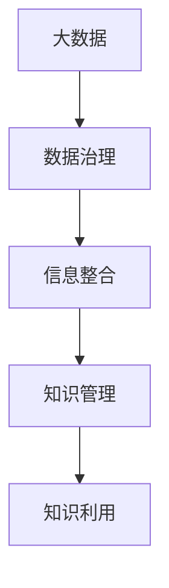

                 

## 文章标题

### 《知识的重构：大数据时代的信息整合策略》

关键词：大数据，信息整合，数据治理，知识管理

摘要：本文将深入探讨大数据时代的信息整合策略，从背景、技术、应用和未来展望等多个角度，详细阐述如何在大数据环境下进行有效的信息整合，实现知识的高效利用和管理。本文旨在为从事信息处理和数据分析的从业者提供理论指导和实践参考。

---

### 目录大纲

## 第一部分：大数据时代背景

### 第1章：大数据时代来临

#### 1.1 大数据的定义与特征

#### 1.2 大数据时代的影响

#### 1.3 大数据时代面临的挑战

### 第2章：大数据技术的发展与应用

#### 2.1 大数据技术的构成

#### 2.2 大数据采集与存储

#### 2.3 大数据处理与分析

### 第3章：大数据在各行业的应用

#### 3.1 金融行业

#### 3.2 零售行业

#### 3.3 健康医疗

#### 3.4 交通物流

## 第二部分：信息整合策略

### 第4章：数据治理与质量管理

#### 4.1 数据治理的概念与重要性

#### 4.2 数据质量管理的方法与工具

#### 4.3 数据隐私保护

### 第5章：信息整合框架构建

#### 5.1 信息整合的目标与原则

#### 5.2 信息整合的方法与流程

#### 5.3 信息整合的技术架构

### 第6章：信息整合与业务融合

#### 6.1 信息整合对企业运营的影响

#### 6.2 信息整合与供应链管理

#### 6.3 信息整合与客户关系管理

### 第7章：知识管理与利用

#### 7.1 知识管理的定义与作用

#### 7.2 知识的创建与分享

#### 7.3 知识的存储与检索

### 第8章：大数据时代的信息整合策略案例研究

#### 8.1 案例一：某零售企业的信息整合策略

#### 8.2 案例二：某金融机构的数据治理实践

#### 8.3 案例三：某医疗机构的健康数据整合

## 第三部分：信息整合的未来

### 第9章：大数据与人工智能的结合

#### 9.1 人工智能的定义与发展

#### 9.2 人工智能在大数据时代的应用

#### 9.3 大数据与人工智能的结合趋势

### 第10章：信息整合的未来展望

#### 10.1 信息整合的新模式

#### 10.2 信息整合的挑战与机遇

#### 10.3 未来信息整合的发展方向

## 附录

### 附录A：大数据技术选型与工具

#### A.1 大数据技术选型策略

#### A.2 常用大数据处理工具

#### A.3 大数据开发环境搭建指南

### 附录B：参考资料与推荐阅读

#### B.1 大数据经典书籍推荐

#### B.2 大数据领域最新研究成果

#### B.3 大数据领域优秀网站与博客推荐

---

### 核心概念与联系

#### 大数据、数据治理、信息整合

Mermaid



### 核心算法原理讲解

#### 数据质量管理算法：数据清洗与去重

Python

```python
# 数据清洗伪代码
def data_cleaning(data_set):
    cleaned_data = []
    for data in data_set:
        # 去除空值
        if data is not None:
            # 去重
            if data not in cleaned_data:
                cleaned_data.append(data)
    return cleaned_data
```

#### 数据分析中的线性回归模型

LaTeX

$$
y = \beta_0 + \beta_1x + \epsilon
$$

### 一、大数据时代来临

#### 1.1 大数据的定义与特征

大数据（Big Data）指的是无法使用常规软件工具在合理时间内捕捉、管理和处理的大量数据集。根据Gartner的定义，大数据具有4V特征，即Volume（大量）、Velocity（高速）、Variety（多样性）和Veracity（真实性）。

- **Volume（大量）**：数据量极其庞大，超出了传统数据库系统的处理能力。
- **Velocity（高速）**：数据生成和流动的速度非常快，要求实时处理和分析。
- **Variety（多样性）**：数据类型繁多，包括结构化数据、半结构化数据和非结构化数据。
- **Veracity（真实性）**：数据的真实性和可信度问题，需要确保数据质量和可靠性。

#### 1.2 大数据时代的影响

大数据时代的到来对各行各业产生了深远的影响：

- **商业模式变革**：大数据使得企业能够更精确地了解市场和客户需求，从而调整产品和服务，优化商业模式。
- **决策支持**：大数据分析能够提供强有力的决策支持，帮助企业降低风险，提高竞争力。
- **生产力提升**：大数据技术能够提高数据处理效率，减少人力和时间成本。
- **公共管理**：大数据在公共管理中发挥重要作用，如智慧城市、公共安全、环境保护等领域。

#### 1.3 大数据时代面临的挑战

大数据时代的挑战主要包括：

- **数据存储与处理**：随着数据量的激增，如何高效存储和处理大数据成为一个重要问题。
- **数据隐私与安全**：大数据涉及大量的敏感信息，如何保障数据隐私和安全是亟需解决的问题。
- **数据质量**：确保数据的准确性和一致性，是有效利用大数据的基础。
- **数据人才缺乏**：大数据技术的发展需要大量具备专业技能的人才，但目前人才供不应求。

### 二、大数据技术的发展与应用

#### 2.1 大数据技术的构成

大数据技术体系主要包括以下几个关键组件：

- **数据采集**：包括传感器、Web爬虫、日志文件等，用于获取各种类型的数据。
- **数据存储**：大数据存储技术如Hadoop、NoSQL数据库等，用于存储海量数据。
- **数据处理**：大数据处理技术如MapReduce、Spark等，用于高效处理和分析数据。
- **数据挖掘**：数据挖掘技术用于从大量数据中提取有价值的信息和知识。
- **数据可视化**：数据可视化技术用于将复杂的数据分析结果以图表、图像等形式直观展示。

#### 2.2 大数据采集与存储

- **大数据采集**：大数据采集技术主要涉及如何高效地从各种数据源（如Web、数据库、传感器等）收集数据。常用的工具和技术包括Flume、Kafka、Storm等。
- **大数据存储**：大数据存储技术需要解决海量数据的存储和管理问题。常用的存储技术包括HDFS（Hadoop分布式文件系统）、HBase、MongoDB等。

#### 2.3 大数据处理与分析

- **大数据处理**：大数据处理技术主要关注如何高效地对海量数据进行计算和处理。MapReduce和Spark是两个主要的分布式数据处理框架。
  - **MapReduce**：MapReduce是一种编程模型，用于大规模数据集（大规模数据集）的并行运算。
  - **Spark**：Spark是基于内存计算的分布式数据处理框架，提供了比MapReduce更高效的计算能力。
- **大数据分析**：大数据分析技术用于从海量数据中提取有价值的信息和知识。常用的分析方法包括机器学习、数据挖掘、统计分析等。

### 三、大数据在各行业的应用

#### 3.1 金融行业

- **风险管理**：金融行业通过大数据分析能够更准确地评估风险，降低贷款违约率，优化投资策略。
- **客户服务**：金融机构利用大数据分析客户行为和需求，提供个性化的金融服务和产品，提升客户满意度。
- **欺诈检测**：大数据技术能够实时监控交易行为，识别和防范金融欺诈活动。

#### 3.2 零售行业

- **需求预测**：零售企业通过大数据分析消费者行为，预测市场需求，优化库存管理。
- **个性化推荐**：基于大数据分析，零售企业能够为顾客提供个性化的商品推荐，提升销售额。
- **供应链管理**：大数据技术优化供应链管理，提高物流效率，降低运营成本。

#### 3.3 健康医疗

- **疾病预测与预防**：大数据分析可以帮助医疗机构预测疾病趋势，提前采取预防措施。
- **精准医疗**：基于大数据分析，为患者提供个性化的治疗方案，提高治疗效果。
- **医疗资源管理**：大数据优化医疗资源分配，提高医疗服务的质量和效率。

#### 3.4 交通物流

- **交通流量分析**：通过大数据分析，交通管理部门能够实时监控交通状况，优化交通流量。
- **物流优化**：大数据分析帮助物流企业优化配送路线，降低运输成本，提高配送效率。
- **车辆监控**：通过大数据技术，对车辆运行状态进行实时监控，提高车辆运行安全。

## 第二部分：信息整合策略

### 第4章：数据治理与质量管理

#### 4.1 数据治理的概念与重要性

数据治理（Data Governance）指的是一套政策和过程，用于确保数据的一致性、完整性和质量。数据治理的目的是通过制定明确的数据政策和流程，规范数据的管理和使用，从而提高数据价值。

- **数据治理的定义**：数据治理是一个组织内部确保数据质量和合规性的过程，包括制定数据策略、数据标准、数据安全和数据架构等。
- **数据治理的重要性**：
  - 提高数据质量：通过数据治理，可以确保数据的准确性和一致性，减少数据错误和冗余。
  - 支持合规性：数据治理有助于组织遵守数据隐私法规和行业标准，降低合规风险。
  - 提升数据价值：有效的数据治理可以挖掘数据中的价值，为决策提供支持。
  - 简化数据管理：数据治理通过规范化的流程和工具，简化数据管理，提高效率。

#### 4.2 数据质量管理的方法与工具

数据质量管理（Data Quality Management，DQM）是数据治理的关键环节，其目的是确保数据满足业务需求和预期。以下是一些常用的数据质量管理方法和工具：

- **数据清洗**：数据清洗是指识别和纠正（或删除）数据集中的错误或不一致数据。常用的方法包括数据去重、数据标准化、数据转换等。
- **数据质量监控**：数据质量监控是持续跟踪数据质量的过程，通过定期检查和报告，确保数据质量不会退化。常用的工具包括数据质量监控平台、数据质量报告等。
- **数据质量标准**：数据质量标准是一套规范，用于评估和保证数据质量。标准通常包括数据完整性、准确性、一致性、及时性和安全性等方面。
- **数据质量工具**：数据质量工具是用于评估、改进和监控数据质量的软件。常用的工具包括ETL（提取、转换、加载）工具、数据质量平台、数据清洗工具等。

#### 4.3 数据隐私保护

在大数据时代，数据隐私保护成为一个重要议题。以下是一些数据隐私保护的方法和策略：

- **数据匿名化**：数据匿名化是一种将个人身份信息从数据中移除或替换的方法，从而保护个人隐私。常用的方法包括数据脱敏、数据加密等。
- **数据加密**：数据加密是将数据转换为密文的过程，只有拥有密钥的人才能解密和阅读数据。数据加密可以有效保护数据在传输和存储过程中的安全。
- **隐私计算**：隐私计算是指在数据处理过程中，不泄露原始数据隐私的算法和工具。隐私计算技术包括同态加密、安全多方计算等。
- **隐私政策与合规**：组织应制定明确的隐私政策，遵守相关法律法规，确保数据隐私保护措施得到有效执行。

### 第5章：信息整合框架构建

#### 5.1 信息整合的目标与原则

信息整合的目标是通过对各种数据源的数据进行整合和处理，实现数据的统一管理和有效利用，为业务决策提供支持。信息整合应遵循以下原则：

- **一致性**：确保数据在整合过程中保持一致性，避免数据冗余和冲突。
- **完整性**：确保数据的完整性和准确性，避免数据丢失或错误。
- **灵活性**：信息整合框架应具备灵活性，能够适应数据源和数据结构的变化。
- **可扩展性**：信息整合框架应具备可扩展性，能够支持不断增长的数据量。

#### 5.2 信息整合的方法与流程

信息整合的方法和流程可以分为以下几个步骤：

- **需求分析**：明确信息整合的目标和需求，识别数据源和整合需求。
- **数据采集**：从各种数据源采集数据，包括内部数据和外部数据。
- **数据预处理**：对采集到的数据进行清洗、转换和整合，确保数据质量。
- **数据存储**：将预处理后的数据存储到合适的数据仓库或数据库中。
- **数据建模**：构建数据模型，定义数据之间的关系和业务规则。
- **数据分析**：利用数据分析工具和技术对整合后的数据进行挖掘和分析，提取有价值的信息。
- **数据可视化**：将分析结果通过图表、报表等形式直观展示，为决策提供支持。

#### 5.3 信息整合的技术架构

信息整合的技术架构主要包括以下几个组件：

- **数据源**：数据源是信息整合的基础，包括内部数据源（如企业内部数据库、日志文件等）和外部数据源（如第三方数据提供商、社交媒体等）。
- **数据采集与传输**：数据采集与传输组件负责从各种数据源采集数据，并将其传输到数据仓库或数据库中。常用的技术包括ETL（提取、转换、加载）工具、消息队列等。
- **数据存储与管理**：数据存储与管理组件负责存储和管理整合后的数据，包括关系型数据库、NoSQL数据库、数据仓库等。
- **数据处理与分析**：数据处理与分析组件负责对整合后的数据进行处理和分析，包括数据清洗、数据挖掘、机器学习等。
- **数据可视化与展示**：数据可视化与展示组件负责将分析结果以图表、报表等形式展示，为决策提供支持。

### 第6章：信息整合与业务融合

#### 6.1 信息整合对企业运营的影响

信息整合对企业运营具有深远的影响：

- **提高决策效率**：通过信息整合，企业能够快速获取全面和准确的数据，为决策提供有力支持，提高决策效率。
- **优化业务流程**：信息整合有助于优化业务流程，消除信息孤岛，实现业务流程的自动化和智能化。
- **降低运营成本**：信息整合可以减少数据冗余，提高数据利用率，降低运营成本。
- **提升客户满意度**：通过信息整合，企业能够更好地了解客户需求，提供个性化的产品和服务，提升客户满意度。

#### 6.2 信息整合与供应链管理

信息整合在供应链管理中发挥重要作用：

- **需求预测**：通过信息整合，企业可以获取供应链上下游的实时数据，准确预测市场需求，优化库存管理。
- **物流优化**：信息整合有助于实时监控物流状态，优化配送路线，提高物流效率。
- **供应链协同**：通过信息整合，供应链各环节企业可以实现数据共享，协同作业，提高供应链整体运作效率。

#### 6.3 信息整合与客户关系管理

信息整合在客户关系管理中具有以下作用：

- **个性化营销**：通过信息整合，企业可以全面了解客户需求和行为，实现个性化营销，提高客户转化率。
- **客户服务优化**：信息整合有助于提高客户服务质量，快速响应客户需求，提升客户满意度。
- **客户忠诚度提升**：通过信息整合，企业可以制定个性化的客户关怀策略，提高客户忠诚度，增加客户粘性。

### 第7章：知识管理与利用

#### 7.1 知识管理的定义与作用

知识管理（Knowledge Management，KM）是一种通过系统化方法和工具，将知识从个体转移到组织，以提升组织整体知识水平和创新能力的过程。知识管理的作用包括：

- **提高创新能力**：知识管理有助于组织积累和共享知识，促进创新思想的交流和融合，提高创新能力。
- **提升决策质量**：通过知识管理，组织可以快速获取和利用内部和外部的知识资源，为决策提供有力支持，提高决策质量。
- **增强竞争力**：知识管理有助于组织构建核心竞争力，提高市场竞争力。
- **提升员工能力**：知识管理通过培训、学习和经验分享，提高员工的知识水平和专业技能。

#### 7.2 知识的创建与分享

知识的创建与分享是知识管理的重要环节，以下是一些关键步骤：

- **知识创造**：知识创造包括经验积累、创新思维、知识创新等，通过个人和团队的合作，不断产生新的知识和思想。
- **知识编码**：知识编码是将隐性知识（如经验、技巧等）转化为显性知识（如文档、报告等）的过程，以便于传播和共享。
- **知识分享**：知识分享是通过各种渠道和方式，将知识在组织内部和外部传播，促进知识的共享和交流。
- **知识传播**：知识传播是确保知识在不同部门和层级之间有效传递和利用的过程，包括内部培训、研讨会、知识库等。

#### 7.3 知识的存储与检索

知识的存储与检索是知识管理的重要保障，以下是一些关键措施：

- **知识存储**：知识存储是指将知识以数字化形式存储在知识库、文档管理系统等工具中，确保知识的长期保存和易于访问。
- **知识检索**：知识检索是帮助用户快速找到所需知识的过程，包括关键词搜索、分类浏览、智能推荐等。
- **知识更新**：知识更新是确保知识库中的知识保持最新和准确的过程，通过定期审查和更新，提高知识库的质量。
- **知识利用**：知识利用是知识管理的最终目标，通过知识共享、知识应用，将知识转化为实际价值，为组织发展提供支持。

### 第8章：大数据时代的信息整合策略案例研究

#### 8.1 案例一：某零售企业的信息整合策略

某零售企业通过大数据技术，实现了供应链、销售和客户数据的信息整合，取得了显著成效。

- **需求分析**：企业分析了供应链、销售和客户数据的需求，确定了信息整合的目标。
- **数据采集**：企业利用物联网技术，采集了供应链各个环节的实时数据，如库存、订单、物流等。
- **数据预处理**：企业通过ETL工具，对采集到的数据进行了清洗、转换和整合，确保数据质量。
- **数据存储**：企业将整合后的数据存储在分布式数据库和数据仓库中，确保数据的可靠性和扩展性。
- **数据分析**：企业利用数据挖掘和机器学习技术，对整合后的数据进行了深度分析，如需求预测、客户行为分析等。
- **数据可视化**：企业通过数据可视化工具，将分析结果以图表、报表等形式展示，为管理层提供决策支持。
- **业务融合**：企业将信息整合结果应用于供应链管理、销售策略和客户关系管理，实现了业务流程的优化和效率提升。

#### 8.2 案例二：某金融机构的数据治理实践

某金融机构通过数据治理实践，提升了数据质量和合规性，为业务发展提供了有力支持。

- **数据治理框架**：金融机构建立了数据治理框架，明确了数据治理的组织架构、政策和流程。
- **数据质量管理**：金融机构通过数据质量管理工具，对数据进行清洗、去重、标准化等处理，确保数据质量。
- **数据安全与隐私保护**：金融机构采用了数据加密、访问控制等技术，确保数据安全和合规性。
- **数据合规性检查**：金融机构定期进行数据合规性检查，确保数据遵守相关法律法规和行业标准。
- **数据监控与报告**：金融机构建立了数据监控与报告机制，实时监控数据质量，定期向管理层报告数据治理情况。

#### 8.3 案例三：某医疗机构的健康数据整合

某医疗机构通过健康数据整合，提升了医疗服务质量和患者满意度。

- **数据采集**：医疗机构利用传感器和健康设备，采集了患者的基本信息、健康检查数据和实时监测数据。
- **数据存储**：医疗机构将采集到的数据存储在分布式数据库和数据仓库中，确保数据的可靠性和扩展性。
- **数据整合**：医疗机构通过ETL工具，对来自不同数据源的数据进行了清洗、转换和整合，实现了数据的统一管理。
- **数据分析**：医疗机构利用数据挖掘和机器学习技术，对整合后的数据进行了分析，如疾病预测、健康风险评估等。
- **数据应用**：医疗机构将分析结果应用于疾病预防、个性化医疗和健康指导，提升了医疗服务质量和患者满意度。
- **数据共享**：医疗机构与第三方健康数据提供商合作，实现了健康数据的共享和交换，为患者提供了更全面的健康管理服务。

### 第9章：大数据与人工智能的结合

#### 9.1 人工智能的定义与发展

人工智能（Artificial Intelligence，AI）是指模拟、延伸和扩展人类智能的理论、方法、技术及应用。人工智能的发展经历了以下几个阶段：

- **早期探索**（1950s-1960s）：人工智能概念的提出和研究。
- **繁荣与衰退**（1970s-1980s）：早期的人工智能应用，如专家系统和机器视觉等。
- **复兴与成长**（1990s-2000s）：数据挖掘、机器学习和深度学习的兴起。
- **实际应用与普及**（2010s-至今）：人工智能在自然语言处理、计算机视觉、机器人技术等领域的广泛应用。

#### 9.2 人工智能在大数据时代的应用

大数据时代为人工智能的发展提供了丰富的数据资源和强大的计算能力，人工智能在大数据时代的主要应用包括：

- **数据预处理**：人工智能技术可以帮助自动处理大量数据，进行数据清洗、转换和预处理，为后续分析提供高质量的数据。
- **数据挖掘**：人工智能技术，如机器学习和深度学习，可以自动从大量数据中发现隐藏的模式和规律，为决策提供支持。
- **预测分析**：人工智能技术可以基于历史数据，建立预测模型，预测未来的趋势和变化，为企业和个人提供预警和指导。
- **智能决策**：人工智能技术可以帮助企业快速分析复杂问题，生成智能决策建议，提高决策效率和准确性。
- **智能服务**：人工智能技术可以应用于智能客服、智能语音识别、智能图像识别等领域，提供个性化、智能化的服务。

#### 9.3 大数据与人工智能的结合趋势

大数据与人工智能的结合将推动以下趋势：

- **智能化**：人工智能技术将更加智能化，能够自动学习和适应，为用户提供更好的体验和服务。
- **泛在化**：人工智能技术将广泛应用于各个领域，如智能家居、智能交通、智能医疗等，实现智能化管理和优化。
- **协作化**：人工智能与人类专家的协作将更加紧密，通过人机交互，实现更高水平的智能决策和问题解决。
- **个性化**：人工智能技术将更加注重个性化，根据用户需求和偏好，提供定制化的产品和服务。
- **智能化治理**：大数据与人工智能的结合将推动智能化治理，提高公共管理、社会治理的效率和水平。

### 第10章：信息整合的未来展望

#### 10.1 信息整合的新模式

随着大数据、云计算、物联网等技术的发展，信息整合的模式也在不断创新：

- **云原生整合**：利用云计算技术，实现数据的分布式存储和处理，提高信息整合的效率和管理灵活性。
- **智能整合**：结合人工智能技术，实现自动化、智能化的信息整合，提高数据分析和决策支持能力。
- **边缘计算整合**：利用边缘计算技术，在数据产生的地方进行实时处理和分析，降低数据传输延迟和带宽需求。
- **区块链整合**：利用区块链技术，实现数据的透明、可信和不可篡改，提高信息整合的安全性和可信度。

#### 10.2 信息整合的挑战与机遇

信息整合面临着诸多挑战和机遇：

- **挑战**：
  - **数据隐私与安全**：如何在信息整合过程中保护数据隐私和安全，是亟待解决的问题。
  - **数据质量**：如何确保数据的一致性、准确性和完整性，是信息整合的关键。
  - **数据治理**：如何建立有效的数据治理体系，确保信息整合的合规性和可持续性。
  - **技术人才**：如何培养和引进高素质的技术人才，支持信息整合的持续发展。

- **机遇**：
  - **业务创新**：通过信息整合，企业可以挖掘新的业务机会，创新商业模式，提升竞争力。
  - **效率提升**：通过信息整合，可以提高业务流程的效率，降低运营成本。
  - **智能决策**：通过信息整合，可以支持智能决策，提高决策的准确性和效率。
  - **社会责任**：通过信息整合，可以更好地服务社会，推动社会进步和发展。

#### 10.3 未来信息整合的发展方向

未来信息整合的发展方向主要包括：

- **智能化**：随着人工智能技术的发展，信息整合将更加智能化，实现自动化、智能化的数据处理和分析。
- **个性化**：信息整合将更加注重个性化，根据用户需求和偏好，提供定制化的信息和服务。
- **多元化**：信息整合将涵盖更多类型的数据，包括结构化数据、半结构化数据和非结构化数据。
- **协同化**：信息整合将实现跨组织、跨领域的协同，提高信息共享和协作的效率。
- **安全化**：信息整合将更加重视数据安全和隐私保护，建立完善的安全体系和机制。

### 附录A：大数据技术选型与工具

#### A.1 大数据技术选型策略

在构建大数据解决方案时，技术选型是一个关键环节。以下是一些大数据技术选型的策略：

- **需求分析**：首先，明确大数据解决方案的需求，包括数据量、处理速度、数据类型等。
- **性能与扩展性**：选择具有高性能和良好扩展性的技术，以应对数据量的增长和业务需求的变更。
- **成本效益**：综合考虑技术成本和运营成本，选择性价比高的技术方案。
- **社区支持**：选择具有活跃社区和支持文档的技术，确保技术问题的快速解决。
- **兼容性**：选择与其他系统和技术兼容的技术，以实现无缝集成和互操作。

#### A.2 常用大数据处理工具

以下是一些常用的数据处理工具，包括数据采集、存储、处理和分析等：

- **数据采集**：
  - Flume：用于实时采集分布式系统中的数据。
  - Kafka：用于构建高吞吐量的分布式数据流处理平台。
  - Logstash：用于日志数据的收集、处理和传输。

- **数据存储**：
  - HDFS（Hadoop分布式文件系统）：用于大规模数据的分布式存储。
  - HBase：基于HDFS的分布式非关系型数据库。
  - Cassandra：用于大规模分布式数据的存储和管理。

- **数据处理**：
  - MapReduce：用于分布式数据处理。
  - Spark：基于内存计算的分布式数据处理框架。
  - Flink：实时流处理框架。

- **数据分析**：
  - Hive：用于数据仓库的分布式数据查询。
  - Pig：用于大规模数据分析的脚本语言。
  - Impala：用于实时查询的分布式数据库。

#### A.3 大数据开发环境搭建指南

搭建大数据开发环境需要以下步骤：

1. **安装Hadoop**：下载并安装Hadoop，配置HDFS、YARN和MapReduce等组件。
2. **配置SSH**：配置SSH，实现集群节点之间的无密码远程登录。
3. **安装其他工具**：根据需求，安装其他大数据处理工具，如Spark、HBase等。
4. **配置Zookeeper**：用于集群管理和分布式协调。
5. **配置Hadoop集群**：配置Hadoop集群，包括集群节点分配、资源管理等。
6. **测试环境**：进行环境测试，确保所有组件正常运行。

### 附录B：参考资料与推荐阅读

#### B.1 大数据经典书籍推荐

- **《大数据时代》**：作者：英国数据科学家戴维·斯托克曼
- **《大数据之路：阿里巴巴大数据实践》**：作者：阿里巴巴技术团队
- **《数据科学实战》**：作者：王卡、高斌
- **《机器学习实战》**：作者：彼得·哈林顿、马库斯·贝斯勒

#### B.2 大数据领域最新研究成果

- **《大数据分析：理论与实践》**：作者：黄宇
- **《深度学习：自适应学习系统》**：作者：伊恩·古德费洛、约书亚·本吉奥、亚伦·库维尔
- **《大数据智能应用》**：作者：王刚、李明杰

#### B.3 大数据领域优秀网站与博客推荐

- **大数据资讯网**：[www.bigdata.cn](http://www.bigdata.cn/)
- **数据科学博客**：[blog.datascience.com](https://blog.datascience.com/)
- **机器学习博客**：[machinelearningmastery.com](https://machinelearningmastery.com/)
- **大数据技术周报**：[bigdata weekly.com](https://bigdata weekly.com/)

