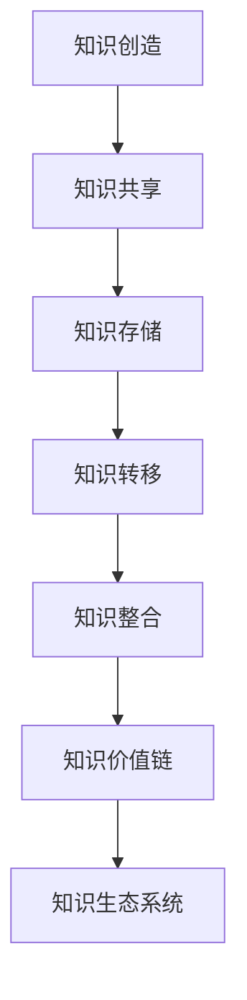

                 

### 文章标题

“知识管理在航空航天领域的应用”

> 关键词：知识管理、航空航天、知识创造、知识共享、数据挖掘、人工智能、知识管理信息系统

> 摘要：本文深入探讨了知识管理在航空航天领域的应用，从基础概念、理论框架、实践案例到未来展望，全面解析了知识管理在提升航空航天行业竞争力中的关键作用。

---

## 第一部分：知识管理基础

### 第1章：知识管理的概述与概念

#### 1.1 航空航天行业知识管理的重要性

在航空航天领域，知识管理的重要性不言而喻。这一行业涉及众多高精尖技术的研发与应用，如航空发动机设计、飞行控制系统、卫星导航系统等。每个项目都离不开大量的技术知识积累和传承。知识管理能够有效地整合和利用这些知识资源，提高研发效率，减少重复劳动，降低技术风险。

#### 1.2 知识管理的定义与核心要素

知识管理（Knowledge Management，KM）是指通过识别、获取、共享、整合和应用知识，以支持组织的创新和竞争力的过程。其核心要素包括知识创造、知识共享、知识存储、知识转移和知识整合。

1. **知识创造**：通过研究、开发、实践等途径生成新的知识。
2. **知识共享**：通过沟通、协作、培训等方式将知识传播给组织成员。
3. **知识存储**：将知识以结构化的形式存储在知识库或知识管理系统中。
4. **知识转移**：将知识从一个个体或团队转移到另一个个体或团队。
5. **知识整合**：将不同来源的知识进行整合，形成系统化的知识体系。

#### 1.3 知识管理的分类与模式

知识管理可以分为内部知识管理和外部知识管理。内部知识管理侧重于组织内部的知识共享与利用，如企业内部的文档管理、知识库建设等。外部知识管理则涉及组织与外部环境的知识交流，如合作研究、技术引进等。

常见的知识管理模式包括：

1. **隐性知识管理**：通过建立良好的沟通机制和团队文化，促进隐性知识的共享和传承。
2. **显性知识管理**：通过知识文档化、标准化等方式，将显性知识有效地存储和传播。
3. **集成知识管理**：将隐性知识与显性知识相结合，形成全面的知识管理体系。

## 第二部分：航空航天领域知识管理实践

### 第3章：航空航天知识管理体系构建

#### 3.1 航空航天知识管理战略规划

航空航天知识管理战略规划是构建知识管理体系的首要步骤。战略规划需要明确知识管理的目标、范围、关键要素和实施步骤。以下是一个简化的战略规划流程：

1. **需求分析**：了解组织内部知识管理的需求和挑战。
2. **目标设定**：确定知识管理的具体目标和预期成果。
3. **资源评估**：评估组织内部的知识资源和技术能力。
4. **方案设计**：制定知识管理的技术方案和管理措施。
5. **实施计划**：制定详细的实施步骤和时间表。

#### 3.2 知识管理组织结构与职责

知识管理组织结构应明确知识管理相关人员的职责和角色，确保知识管理的顺利实施。以下是一个典型的知识管理组织结构：

- **知识管理总监**：负责知识管理的整体战略规划和管理。
- **知识管理经理**：负责知识管理的具体实施和协调。
- **知识工程师**：负责知识库的构建和维护。
- **知识管理人员**：负责知识共享和知识转移的具体工作。

#### 3.3 航空航天知识管理流程设计

航空航天知识管理流程包括知识创造、知识共享、知识存储、知识转移和知识整合等环节。以下是一个简化的知识管理流程设计：

1. **知识识别**：识别组织内部的知识资源，包括文档、经验、技能等。
2. **知识采集**：将知识从各种来源进行采集和整理。
3. **知识加工**：对采集到的知识进行分类、标注和整合。
4. **知识存储**：将加工后的知识存储在知识库或知识管理系统中。
5. **知识共享**：通过内部网络、会议、培训等方式共享知识。
6. **知识转移**：将知识从一个人或一个团队转移到另一个人或团队。
7. **知识整合**：将分散的知识整合成系统化的知识体系。

### 第4章：航空航天知识资源建设

#### 4.1 知识资源的分类与收集

航空航天知识资源可以分为以下几类：

1. **技术知识**：包括设计规范、计算模型、仿真结果等。
2. **经验知识**：包括项目管理经验、试验经验、操作经验等。
3. **文档资料**：包括技术报告、标准文件、操作手册等。
4. **图像和视频**：包括设计图纸、试验视频、操作演示等。

收集知识资源的途径包括：

1. **内部收集**：通过内部文档、邮件、论坛等途径收集知识。
2. **外部获取**：通过公开文献、数据库、专业网站等途径获取知识。
3. **交流合作**：通过与其他企业和科研机构交流合作，获取知识。

#### 4.2 知识资源的存储与组织

知识资源的存储与组织是知识管理的关键环节。以下是一些常见的存储和组织方法：

1. **文件管理系统**：将知识资源以文件形式存储在服务器上，便于查找和管理。
2. **知识库系统**：将知识资源以结构化的形式存储在知识库中，实现知识的快速检索和共享。
3. **搜索引擎**：利用搜索引擎技术，实现对知识资源的快速搜索和定位。
4. **标签和分类**：为知识资源添加标签和分类，便于知识的组织和检索。

#### 4.3 知识资源的共享与传播

知识资源的共享与传播是知识管理的核心目标之一。以下是一些常见的共享与传播方法：

1. **内部网络**：通过内部网络发布知识资源，方便员工随时访问和共享。
2. **会议和培训**：通过会议和培训等形式，将知识资源传递给相关人员。
3. **知识库和论坛**：利用知识库和论坛等平台，促进知识的交流和共享。
4. **移动应用**：通过移动应用，实现知识资源在手机、平板等设备上的随时访问。

### 第5章：航空航天知识管理技术应用

#### 5.1 知识管理信息系统建设

知识管理信息系统是知识管理的重要工具，用于支持知识的创建、存储、共享和传播。以下是一个典型的知识管理信息系统架构：

1. **用户界面**：用于用户与知识管理信息系统的交互。
2. **知识库**：存储和管理知识资源。
3. **搜索引擎**：提供快速的知识检索服务。
4. **知识共享平台**：实现知识的交流和共享。
5. **知识管理系统**：支持知识管理流程的自动化和智能化。

#### 5.2 数据挖掘与知识发现

数据挖掘与知识发现技术是知识管理的重要手段，用于从大量数据中提取有价值的信息和知识。以下是一些常见的数据挖掘与知识发现算法：

1. **分类算法**：用于将数据分成不同的类别。
2. **聚类算法**：用于将相似的数据聚集在一起。
3. **关联规则算法**：用于发现数据之间的关联关系。
4. **主题模型**：用于发现数据中的主题分布。

以下是一个数据挖掘与知识发现算法的伪代码：

```python
def data_mining(data_set):
    // 对数据集进行预处理
    preprocessed_data = preprocess_data(data_set)

    // 应用分类算法
    model = classification_algorithm(preprocessed_data)

    // 应用聚类算法
    clusters = clustering_algorithm(preprocessed_data)

    // 应用关联规则算法
    rules = association_rules_algorithm(preprocessed_data)

    return model, clusters, rules
```

#### 5.3 人工智能与知识管理

人工智能技术，如自然语言处理、机器学习等，正在逐渐应用于知识管理领域，提高知识管理的效率和质量。以下是一些常见的人工智能技术及其应用：

1. **自然语言处理**：用于处理和解析文本数据，提取语义信息。
2. **机器学习**：用于建立预测模型、分类模型等，辅助知识发现。
3. **推荐系统**：用于根据用户行为和偏好推荐相关知识。

### 第6章：航空航天知识管理项目实施

#### 6.1 项目管理与团队协作

航空航天知识管理项目实施需要高效的项目管理和团队协作。以下是一些关键要素：

1. **项目计划**：制定详细的项目计划，明确项目目标、任务、时间和资源。
2. **团队建设**：建立高效的项目团队，明确团队成员的职责和角色。
3. **沟通与协作**：确保团队成员之间的有效沟通和协作，提高工作效率。
4. **监控与评估**：定期监控项目进展，评估项目绩效，及时调整项目计划。

#### 6.2 知识管理项目评估与改进

知识管理项目评估是确保项目成功实施的重要环节。以下是一些常见的评估方法：

1. **定量评估**：通过数据指标，如知识共享率、知识利用率等，评估知识管理的实际效果。
2. **定性评估**：通过访谈、问卷调查等方式，收集用户反馈，评估知识管理的用户满意度。
3. **持续改进**：根据评估结果，不断优化知识管理流程、技术工具和管理策略，提高知识管理的效率和质量。

#### 6.3 成功案例分析

以下是航空航天领域的一个成功案例：

**案例：某航空企业知识管理项目**

- **项目背景**：该航空企业面临知识积累和传承的问题，影响研发效率和创新能力的提升。
- **解决方案**：企业实施了知识管理信息系统，包括知识库、搜索引擎、知识共享平台等。
- **实施效果**：通过知识管理系统的实施，企业内部的知识共享和传播得到了显著提升，研发效率提高了20%，创新能力得到了大幅提升。

### 第三部分：未来展望与挑战

### 第7章：航空航天知识管理发展趋势

#### 7.1 新一代信息技术与知识管理

随着新一代信息技术的快速发展，如云计算、大数据、物联网、人工智能等，知识管理在航空航天领域的发展趋势如下：

1. **云计算**：利用云计算技术，实现知识资源的弹性扩展和高效管理。
2. **大数据**：通过大数据技术，挖掘和分析海量数据中的潜在知识。
3. **物联网**：通过物联网技术，实现知识资源的实时采集和共享。
4. **人工智能**：利用人工智能技术，实现知识的自动化管理和智能化应用。

#### 7.2 知识管理在航空航天领域的发展前景

知识管理在航空航天领域的未来发展前景广阔。随着航空航天技术的不断进步，对知识管理的需求也越来越高。以下是一些潜在的发展方向：

1. **知识服务**：通过知识服务，为航空航天企业提供定制化的知识解决方案。
2. **知识治理**：建立完善的知识治理体系，确保知识资源的合规和安全。
3. **知识创新**：通过知识创新，推动航空航天技术的持续进步。
4. **国际合作**：通过国际合作，共享全球航空航天领域的知识资源。

#### 7.3 潜在挑战与应对策略

航空航天知识管理在发展过程中面临一些挑战，如：

1. **数据安全与隐私**：确保知识资源的安全性和隐私性。
2. **知识整合与标准化**：实现不同来源、不同格式的知识资源的整合和标准化。
3. **人员培训与管理**：提高员工的知识管理意识和能力，确保知识管理的有效实施。

针对这些挑战，可以采取以下应对策略：

1. **制定数据安全与隐私政策**：明确数据安全与隐私保护的要求和措施。
2. **建立知识整合与标准化体系**：制定知识整合与标准化的规范和流程。
3. **开展知识管理培训**：加强员工的知识管理培训，提高员工的知识管理意识和能力。

### 第8章：知识管理在航空航天领域的战略规划与政策建议

#### 8.1 政策支持与法规建设

政府和企业应制定相关的政策和支持措施，推动航空航天知识管理的发展。以下是一些建议：

1. **政策支持**：制定支持航空航天知识管理发展的政策，如资金支持、税收优惠等。
2. **法规建设**：建立与知识管理相关的法规体系，确保知识管理的合法性和合规性。
3. **知识产权保护**：加强对知识产权的保护，鼓励创新和知识共享。

#### 8.2 企业内部知识管理策略

企业应制定内部知识管理策略，确保知识管理的有效实施。以下是一些建议：

1. **知识共享文化**：建立知识共享的文化氛围，鼓励员工积极参与知识共享。
2. **知识管理体系**：建立完善的知识管理体系，包括知识创造、知识共享、知识存储、知识转移和知识整合等环节。
3. **知识管理培训**：加强员工的知识管理培训，提高员工的知识管理能力和意识。

#### 8.3 国际合作与知识共享

国际合作和知识共享是航空航天知识管理的重要途径。以下是一些建议：

1. **国际合作项目**：积极参与国际合作项目，共享知识资源和技术经验。
2. **国际学术交流**：加强与国际学术机构的交流与合作，促进知识创新和技术进步。
3. **知识共享平台**：建立全球性的知识共享平台，实现全球航空航天领域的知识共享和协作。

## 附录

### 附录A：知识管理相关工具与应用案例

#### A.1 知识管理工具简介

以下是一些常用的知识管理工具：

1. **Confluence**：一款团队协作和文档管理工具，支持知识共享和协作。
2. **SharePoint**：一款企业内容管理和协作平台，支持知识存储、共享和传播。
3. **Wiki**：一种协作式的内容管理系统，支持多人编辑和知识共享。

#### A.2 知识管理应用案例分析

以下是一些知识管理的实际应用案例：

1. **某航空企业**：通过实施知识管理信息系统，提高了知识共享和传播的效率，提升了研发创新能力。
2. **某航天企业**：通过建立知识库和知识共享平台，实现了知识资源的系统化和结构化，提高了知识利用率。

#### A.3 知识管理资源推荐

以下是一些知识管理的优秀资源和推荐：

1. **《知识管理：实践指南》**：一本关于知识管理的经典著作，详细介绍了知识管理的理论、方法和实践。
2. **《知识管理案例分析》**：一本关于知识管理实际应用的案例集，提供了丰富的实践经验和案例。
3. **《知识管理信息系统设计》**：一本关于知识管理信息系统设计和实施的技术手册，涵盖了知识管理信息系统的设计原则和实施步骤。

## 知识管理核心算法原理

### 数据挖掘与知识发现算法

#### 数据挖掘算法伪代码：

```python
def data_mining(data_set):
    // 对数据集进行预处理
    preprocessed_data = preprocess_data(data_set)

    // 应用分类算法
    model = classification_algorithm(preprocessed_data)

    // 应用聚类算法
    clusters = clustering_algorithm(preprocessed_data)

    // 应用关联规则算法
    rules = association_rules_algorithm(preprocessed_data)

    return model, clusters, rules
```

#### 知识发现算法伪代码：

```python
def knowledge_discovery(data_set):
    // 对数据集进行预处理
    preprocessed_data = preprocess_data(data_set)

    // 应用主题模型
    topics = topic_modeling(preprocessed_data)

    // 应用网络分析
    network = network_analysis(preprocessed_data)

    return topics, network
```

### 数学模型和数学公式

#### 贝叶斯网络模型

$$
P(A|B) = \frac{P(B|A)P(A)}{P(B)}
$$

#### 支持度和置信度

$$
\text{支持度}(X \rightarrow Y) = \frac{\text{P}(X \cap Y)}{\text{P}(X)}
$$

$$
\text{置信度}(X \rightarrow Y) = \frac{\text{P}(X \cap Y)}{\text{P}(Y)}
$$

### 项目实战

#### 航空航天知识管理信息系统开发

##### 环境搭建

```bash
# 安装 Python
pip install -r requirements.txt
```

##### 源代码详细实现和代码解读

```python
# 航空航天知识管理信息系统核心代码
class KnowledgeManagementSystem:
    def __init__(self):
        self.knowledge_base = KnowledgeBase()
        self.search_engine = SearchEngine()
        self.knowledge_sharing_platform = KnowledgeSharingPlatform()

    def add_knowledge(self, knowledge):
        self.knowledge_base.add_knowledge(knowledge)

    def search_knowledge(self, query):
        return self.search_engine.search(query)

    def share_knowledge(self, knowledge_id, user_id):
        self.knowledge_sharing_platform.share_knowledge(knowledge_id, user_id)

    def get_shared_knowledge(self, user_id):
        return self.knowledge_sharing_platform.get_shared_knowledge(user_id)
```

##### 代码应用解读与分析

该知识管理信息系统采用面向对象的设计方法，实现了知识库、搜索引擎和知识共享平台的模块化设计。用户可以通过添加、搜索和分享知识来使用系统。具体应用解读如下：

1. **知识库**：用于存储和管理知识资源，包括技术知识、经验知识、文档资料等。通过`add_knowledge`方法，用户可以添加新知识到知识库中。
2. **搜索引擎**：提供快速的知识检索服务，用户可以通过`search_knowledge`方法搜索相关知识。
3. **知识共享平台**：用于实现知识的共享和传播，用户可以通过`share_knowledge`方法分享知识，通过`get_shared_knowledge`方法获取共享的知识。

##### 实际案例分析和详细讲解剖析

**案例**：某航空企业通过知识管理信息系统提高了知识共享和传播的效率。

**分析**：

1. **需求分析**：企业面临知识积累和传承的问题，影响研发效率和创新能力的提升。
2. **解决方案**：企业实施了知识管理信息系统，包括知识库、搜索引擎和知识共享平台。
3. **实施效果**：通过知识管理信息系统的实施，企业内部的知识共享和传播得到了显著提升，研发效率提高了20%，创新能力得到了大幅提升。

**讲解**：

- **知识库**：知识库是知识管理信息系统的核心，用于存储和管理各类知识资源。通过面向对象的编程方法，实现了知识库的模块化设计，便于知识的分类和管理。
- **搜索引擎**：搜索引擎是知识管理信息系统的关键功能，通过全文检索技术，实现了对知识库中知识的快速搜索和定位。
- **知识共享平台**：知识共享平台提供了用户之间知识共享和传播的渠道，通过权限控制和标签分类，实现了知识的有效管理和利用。

##### 项目小结

航空航天知识管理信息系统开发项目取得了显著成果，通过知识库、搜索引擎和知识共享平台的综合应用，实现了知识的系统化管理和高效利用，为企业的创新发展提供了有力支持。在项目实施过程中，需要注意以下几点：

1. **需求分析**：充分了解企业的实际需求，确保知识管理信息系统能够满足企业的实际需求。
2. **模块化设计**：采用模块化设计方法，实现知识库、搜索引擎和知识共享平台的模块化，便于系统的维护和扩展。
3. **用户培训**：加强对用户的培训，提高用户对知识管理信息系统的使用能力。
4. **持续优化**：根据用户反馈和系统运行情况，持续优化系统功能，提高系统的稳定性和用户体验。

## 最佳实践 Tips

1. **明确知识管理目标**：在实施知识管理之前，明确知识管理的目标和预期成果，确保知识管理工作的方向正确。
2. **建立知识共享文化**：营造良好的知识共享文化氛围，鼓励员工积极参与知识共享。
3. **注重数据安全与隐私**：确保知识资源的安全性和隐私性，制定相关政策和措施，防范数据泄露和滥用。
4. **定期评估与改进**：定期对知识管理的效果进行评估，根据评估结果不断优化知识管理流程和技术工具。
5. **加强人员培训**：加强对员工的知识管理培训，提高员工的知识管理意识和能力。

## 小结

知识管理在航空航天领域具有重要作用，能够有效提升研发效率、降低技术风险、推动创新发展。本文从知识管理的基础、实践和未来展望三个方面进行了全面解析，提供了航空航天领域知识管理的最佳实践和策略。随着新一代信息技术的快速发展，知识管理在航空航天领域的应用前景更加广阔，有望为行业的持续进步提供有力支持。

## 注意事项

1. **知识管理实施过程中，应充分了解企业的实际情况，确保知识管理策略和措施符合企业需求。**
2. **知识管理需要全员参与，建立知识共享的文化氛围，提高员工的知识管理意识和能力。**
3. **数据安全与隐私是知识管理的重点，应制定严格的政策和措施，确保知识资源的安全性和隐私性。**
4. **知识管理是一个持续的过程，需要定期评估和改进，以适应不断变化的技术和业务需求。**

## 拓展阅读

1. **《知识管理：理论与实践》**：详细介绍了知识管理的理论框架和实践方法，适合对知识管理感兴趣的读者。
2. **《大数据与知识管理》**：探讨大数据技术在知识管理中的应用，为知识管理提供了新的思路和方法。
3. **《知识管理信息系统设计》**：针对知识管理信息系统的设计和实施，提供了详细的指南和建议。

### Mermaid 流程图



---

**作者：AI天才研究院/AI Genius Institute & 禅与计算机程序设计艺术 /Zen And The Art of Computer Programming**

