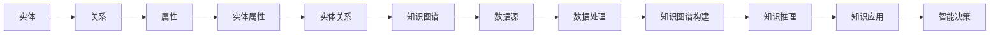

                 

# 知识管理的AI化路径：知识图谱构建和知识推理

## 关键词

知识管理，AI化，知识图谱，知识推理，智能决策

## 摘要

本文旨在探讨知识管理的AI化路径，深入分析知识图谱构建和知识推理技术在知识管理中的应用。随着信息爆炸时代的到来，如何有效地管理和利用知识成为企业和组织面临的重要挑战。AI技术的引入为知识管理带来了新的机遇，知识图谱和知识推理技术成为实现知识管理智能化的关键工具。本文首先介绍了知识图谱的基本概念和构建方法，然后详细阐述了知识推理技术的原理和应用，并通过实际案例展示了AI化知识管理的实战应用。通过本文的阅读，读者将能够深入了解知识管理的AI化路径，掌握关键技术和实战方法。

## 第1章：引言

### 1.1 本书的目的与背景

知识管理作为现代企业和组织的重要战略资源，已经成为企业持续发展的关键因素。传统的知识管理方法在处理大量复杂数据和信息时存在诸多局限，难以满足信息爆炸时代的需求。随着AI技术的迅猛发展，知识管理的AI化路径逐渐成为研究和应用的热点。本书旨在探讨知识管理的AI化路径，详细阐述如何利用知识图谱构建和知识推理技术实现知识管理的智能化。

本书首先介绍了知识管理的基本概念、重要性以及面临的挑战，然后深入分析了知识图谱和知识推理技术的基本原理和应用场景。通过具体实例和实战案例，本书展示了知识图谱和知识推理技术在知识管理中的应用效果，旨在为读者提供全面、系统的AI化知识管理知识体系。

### 1.2 知识管理的重要性

知识管理（Knowledge Management，KM）是指通过系统的方法收集、整理、存储、共享和应用知识，以提高组织的知识利用率，进而提升组织的竞争力和创新能力。知识管理的重要性体现在以下几个方面：

1. **提高组织竞争力**：知识管理能够帮助企业更好地利用内部和外部的知识资源，促进知识共享和协同创新，从而提高组织的竞争力。

2. **促进创新能力**：知识管理可以帮助企业积累和传承宝贵的经验，促进知识的创新和应用，提高组织的创新能力。

3. **提升运营效率**：知识管理能够优化知识获取、传递和应用的过程，提高组织的运营效率，降低运营成本。

4. **支持决策制定**：知识管理可以为决策者提供丰富的信息支持和知识背景，帮助决策者做出更加科学、合理的决策。

然而，传统的知识管理方法在处理大量复杂数据和信息时往往存在以下挑战：

1. **数据分散和冗余**：企业内部的知识往往分散在不同的部门、系统和员工手中，难以实现统一管理和共享。

2. **知识获取和利用效率低**：传统的知识管理方法依赖于人工检索和传递，效率较低，难以满足快速变化的市场需求。

3. **知识流失和浪费**：由于知识管理的手段和方法有限，许多知识无法被及时记录、共享和应用，导致知识流失和浪费。

### 1.3 知识图谱的概念与作用

知识图谱（Knowledge Graph）是一种用于结构化表示知识的方法，通过节点（Node）和边（Edge）来表示实体及其关系。与传统的文本表示方法相比，知识图谱能够更加直观地展示实体间的关系，便于机器理解和处理。知识图谱在多个领域具有广泛的应用，其基本概念和作用如下：

1. **概念**：

   - **实体（Entity）**：知识图谱中的基本元素，可以是具体的对象、概念或事件。例如，人、地点、物品等。

   - **关系（Relation）**：实体之间的联系，可以是因果关系、包含关系、相邻关系等。例如，“张三”和“李四”之间存在“朋友”关系。

   - **属性（Attribute）**：实体的附加信息，可以用来描述实体的特征。例如，人的性别、年龄、职业等。

2. **作用**：

   - **组织和管理知识**：知识图谱能够将分散的知识进行结构化组织和存储，便于知识的管理和应用。

   - **提高搜索和推荐的准确性**：知识图谱可以用来改进搜索引擎的搜索结果，提供更准确的推荐和更智能的搜索功能。

   - **支持智能问答和决策支持**：知识图谱可以用来构建智能问答系统，通过推理和搜索技术，为用户提供准确、快速的回答。同时，知识图谱还可以支持决策支持，通过分析实体间的关系，为用户提供决策依据。

### 1.4 知识推理技术

知识推理技术（Knowledge Reasoning）是AI化知识管理的核心组成部分，它通过逻辑推理和概率推理等方法，实现对知识图谱中实体间关系的深入理解和推理。知识推理技术在智能决策支持、知识发现和智能搜索等领域具有重要应用价值。以下是知识推理技术的基本原理和应用：

1. **基本原理**：

   - **逻辑推理**：逻辑推理是一种基于逻辑规则和关系的推理方法。通过定义逻辑规则和实体间的关系，知识推理系统可以自动推导出新的结论。

   - **概率推理**：概率推理是一种基于概率和统计方法的推理方法。通过分析实体间的概率关系，知识推理系统可以推断出实体间可能的关系。

2. **应用**：

   - **智能决策支持**：知识推理技术可以用于构建智能决策支持系统，通过分析实体间的关系，为决策者提供决策依据。

   - **知识发现**：知识推理技术可以用于知识发现，通过分析实体间的关系，发现新的知识模式。

   - **智能搜索**：知识推理技术可以用于改进搜索引擎的搜索结果，提供更准确的推荐和更智能的搜索功能。

### 1.5 本书结构

本书共分为七个章节，详细介绍了知识管理的AI化路径、知识图谱构建和知识推理技术。具体章节安排如下：

- **第1章：引言**：介绍本书的目的、背景和结构。

- **第2章：知识图谱基础**：讲解知识图谱的基本概念、构建方法和应用场景。

- **第3章：知识推理技术**：介绍知识推理的基本原理和实现方法。

- **第4章：AI化知识管理应用案例**：分析知识图谱和知识推理技术在企业中的应用案例。

- **第5章：知识管理平台设计与实现**：详细讲解知识管理平台的设计原则、架构和关键技术。

- **第6章：AI化知识管理的挑战与未来**：探讨AI化知识管理面临的挑战和未来发展趋势。

- **第7章：总结与展望**：对本书的主要内容进行总结，展望AI化知识管理的未来发展方向。

### 1.6 本书适用对象

本书适合对知识管理、AI技术和大数据分析感兴趣的读者，包括企业高管、IT从业者、数据分析师、科研人员等。无论你是刚刚接触知识管理的初学者，还是希望深入了解AI化知识管理的专业人士，本书都将为你提供宝贵的知识和实践经验。

### 1.7 总结

知识管理作为现代企业和组织的重要战略资源，其AI化路径已成为研究和应用的热点。知识图谱和知识推理技术作为AI化知识管理的核心工具，具有广泛的应用前景。本书通过系统、详细的讲解，旨在帮助读者深入了解知识管理的AI化路径，掌握关键技术和实战方法，为企业在知识管理方面提供有力支持。

# 第2章：知识图谱基础

知识图谱是知识管理AI化的基石，它通过结构化数据来表示实体及其关系，为后续的知识推理和应用提供基础。本章节将详细介绍知识图谱的基本概念、组成部分、构建方法以及应用场景。

### 2.1 知识图谱的概念

知识图谱是一种用于结构化表示知识的图形模型，它通过节点（Node）和边（Edge）来表示实体及其关系。在知识图谱中，节点代表实体，边代表实体之间的关系。知识图谱能够将散乱的信息进行结构化组织和存储，使得机器能够更好地理解和处理这些信息。

### 2.2 知识图谱的组成部分

知识图谱主要由实体、关系和属性三部分组成。

#### 2.2.1 实体（Entity）

实体是知识图谱中的基本元素，可以是具体的对象、概念或事件。例如，人、地点、物品、事件等。实体可以进一步细分为分类（Type）和子类（Subtype）。例如，人可以是一个实体类型，而张三、李四是具体的人实体。

#### 2.2.2 关系（Relation）

关系是实体之间的联系，可以是因果关系、包含关系、相邻关系等。例如，张三和李四是朋友，北京是中国的首都等。关系通常用动词来表示，如“是”、“属于”、“发生”等。

#### 2.2.3 属性（Attribute）

属性是实体的附加信息，用于描述实体的特征。例如，张三的年龄是25岁，李四的职业是程序员等。属性可以是简单的数据类型，如整数、字符串、日期等，也可以是复杂的对象。

### 2.3 知识图谱的构建方法

知识图谱的构建方法主要包括手动构建、半自动构建和自动构建三种。

#### 2.3.1 手动构建

手动构建是指通过人工方式收集和整理数据，构建知识图谱。这种方法适用于小规模、结构化数据，但在大规模、非结构化数据面前效率较低。

#### 2.3.2 半自动构建

半自动构建是指利用半自动化的工具和算法，辅助构建知识图谱。例如，利用自然语言处理技术从文本中提取实体和关系。这种方法在处理大规模、非结构化数据时较为高效，但需要人工进行数据清洗和标注。

#### 2.3.3 自动构建

自动构建是指利用自动化工具和算法，从大规模数据中自动提取实体和关系。这种方法适用于大规模、非结构化数据，但需要较高的算法和数据处理能力。

### 2.4 知识图谱的应用场景

知识图谱在多个领域具有广泛的应用，以下是一些典型的应用场景：

#### 2.4.1 搜索引擎

知识图谱可以用来改进搜索引擎的搜索结果，提供更准确的推荐和更智能的搜索功能。例如，Google和百度等搜索引擎都采用了知识图谱技术，通过分析实体间的关系，提供更加相关和准确的搜索结果。

#### 2.4.2 推荐系统

知识图谱可以用来构建推荐系统，通过分析实体间的关系，为用户提供更个性化的推荐。例如，Amazon和Netflix等推荐系统都采用了知识图谱技术，通过分析用户和商品之间的关联关系，为用户提供个性化的推荐。

#### 2.4.3 智能问答

知识图谱可以用来构建智能问答系统，通过推理和搜索技术，为用户提供准确、快速的回答。例如，Siri和Alexa等智能语音助手都采用了知识图谱技术，通过分析实体间的关系，为用户提供智能的回答。

#### 2.4.4 决策支持

知识图谱可以用来支持决策，通过分析实体间的关系，提供决策依据。例如，企业的销售决策、市场决策等都可以通过知识图谱技术进行分析和预测，提高决策的准确性和效率。

#### 2.4.5 医疗健康

知识图谱可以用来构建医疗健康领域的知识图谱，通过分析实体间的关系，为医疗健康提供决策支持。例如，分析患者、疾病、药物之间的关联关系，为医生提供诊断和治疗建议。

#### 2.4.6 金融风控

知识图谱可以用来构建金融风控领域的知识图谱，通过分析实体间的关系，为金融风控提供支持。例如，分析企业、交易、风险因素之间的关联关系，为金融机构提供风险预警和管理建议。

### 2.5 知识图谱的核心概念之间的关系架构

知识图谱的核心概念之间的关系可以用Mermaid流程图表示如下：



通过上述流程图，我们可以清晰地看到知识图谱的核心概念之间的关系。实体和关系构成了知识图谱的基本结构，属性用于描述实体的特征，实体属性和实体关系共同构成了知识图谱的数据源。知识图谱的构建过程包括数据清洗、数据处理和知识图谱构建，知识推理和知识应用则是在知识图谱的基础上进行的，最终服务于智能决策。

### 2.6 知识图谱构建的核心算法原理讲解

知识图谱构建的核心算法主要包括实体识别、关系提取和属性抽取三个步骤。

#### 2.6.1 实体识别

实体识别是指从文本中识别出实体，并将其映射到知识图谱中的实体节点。实体识别的关键是文本预处理和命名实体识别（Named Entity Recognition，NER）。文本预处理包括分词、词性标注等，命名实体识别则通过模型识别出文本中的命名实体。

伪代码如下：

```python
def entity_recognition(text):
    # 分词
    words = tokenize(text)
    # 词性标注
    word_types = part_of_speech(words)
    # 命名实体识别
    entities = []
    for word, word_type in zip(words, word_types):
        if word_type == "NN":  # 假设名词为实体
            entities.append(word)
    return entities
```

#### 2.6.2 关系提取

关系提取是指从文本中提取实体之间的关系，并将其映射到知识图谱中的关系边。关系提取的关键是文本理解和实体间关系推断。

伪代码如下：

```python
def relation_extraction(text, entities):
    # 提取实体
    entities = set(entities)
    # 关系提取
    relations = []
    for i in range(len(entities)):
        for j in range(i+1, len(entities)):
            entity_i = entities[i]
            entity_j = entities[j]
            # 根据文本和实体间的关系规则，提取关系
            relation = extract_relation(text, entity_i, entity_j)
            if relation:
                relations.append((entity_i, relation, entity_j))
    return relations
```

#### 2.6.3 属性抽取

属性抽取是指从文本中提取实体的属性，并将其映射到知识图谱中的属性节点。属性抽取的关键是文本理解和属性规则。

伪代码如下：

```python
def attribute_extraction(text, entities):
    # 提取实体
    entities = set(entities)
    # 属性抽取
    attributes = []
    for entity in entities:
        # 根据文本和实体的属性规则，提取属性
        attribute = extract_attribute(text, entity)
        if attribute:
            attributes.append((entity, attribute))
    return attributes
```

### 2.7 数学模型和公式

在知识图谱构建过程中，数学模型和公式起着重要的作用。以下是一些常见的数学模型和公式：

#### 2.7.1 概率模型

概率模型用于评估实体间关系的可能性。常用的概率模型有条件概率模型、贝叶斯网络等。

条件概率模型公式：

$$
P(A|B) = \frac{P(A \cap B)}{P(B)}
$$

贝叶斯网络公式：

$$
P(A, B, C) = P(A) \cdot P(B|A) \cdot P(C|B)
$$

#### 2.7.2 隐马尔可夫模型（HMM）

隐马尔可夫模型用于序列数据的建模，常用于实体识别和关系提取。

状态转移概率：

$$
P(\text{state}_t | \text{state}_{t-1}) = \pi_t
$$

观测概率：

$$
P(\text{observation}_t | \text{state}_t) = b_t
$$

#### 2.7.3 支持向量机（SVM）

支持向量机用于分类任务，常用于实体识别和关系提取。

分类决策函数：

$$
f(x) = \sum_{i=1}^{n} \alpha_i y_i \phi(x_i)
$$

分类阈值：

$$
\theta = \frac{1}{2} \max_{\alpha} \left( \sum_{i=1}^{n} \alpha_i - \sum_{i=1}^{n} \alpha_i y_i \right)
$$

### 2.8 举例说明

假设有一段文本：“张三和李四是朋友，他们都在北京工作。”我们可以根据上述算法和数学模型，构建出如下知识图谱：

- **实体**：张三、李四、北京
- **关系**：朋友、工作地点
- **属性**：张三的工作地点是北京，李四的工作地点是北京

### 2.9 小结

本章详细介绍了知识图谱的基本概念、组成部分、构建方法以及应用场景。知识图谱作为一种结构化表示知识的方法，在知识管理AI化中发挥着重要作用。通过本章的学习，读者可以了解知识图谱的核心概念和构建方法，为后续的知识推理和应用打下基础。

# 第3章：知识推理技术

知识推理技术是AI化知识管理的核心组成部分，它通过逻辑推理和概率推理等方法，实现对知识图谱中实体间关系的深入理解和推理。知识推理技术在智能决策支持、知识发现和智能搜索等领域具有重要应用价值。本章将详细讲解知识推理的基本原理和实现方法。

### 3.1 知识推理的基本原理

知识推理是指根据已知的事实和规则，推导出新的结论或知识。知识推理技术主要包括逻辑推理和概率推理两种方法。

#### 3.1.1 逻辑推理

逻辑推理是一种基于逻辑规则和关系的推理方法。通过定义逻辑规则和实体间的关系，知识推理系统可以自动推导出新的结论。

逻辑推理的基本过程如下：

1. **事实提取**：从知识图谱中提取已知的事实。
2. **规则应用**：根据定义的逻辑规则，将事实进行组合和推导。
3. **结论生成**：根据推导过程，生成新的结论。

逻辑推理的基本原理包括：

1. **合取律**：A且B等价于B且A。
2. **交换律**：A或B等价于B或A。
3. **否定律**：A且非A等价于假。
4. **德摩根律**：非(A或B)等价于非A且非B。

#### 3.1.2 概率推理

概率推理是一种基于概率和统计方法的推理方法。通过分析实体间的概率关系，知识推理系统可以推断出实体间可能的关系。

概率推理的基本过程如下：

1. **概率估计**：根据历史数据和统计方法，估计实体间的概率关系。
2. **关系推断**：根据概率估计，推断实体间可能的关系。
3. **置信度评估**：对推断结果进行置信度评估。

概率推理的基本原理包括：

1. **贝叶斯定理**：P(A|B) = P(B|A) * P(A) / P(B)。
2. **马尔可夫链**：P(A, B, C) = P(A) * P(B|A) * P(C|B)。
3. **条件概率**：P(A|B) = P(A ∩ B) / P(B)。

### 3.2 知识推理的实现方法

知识推理的实现方法主要包括基于规则推理和基于模型推理两种。

#### 3.2.1 基于规则推理

基于规则推理是一种基于预先定义的逻辑规则进行推理的方法。通过定义逻辑规则和实体间的关系，知识推理系统可以自动推导出新的结论。

基于规则推理的实现步骤如下：

1. **规则定义**：根据业务需求，定义逻辑规则。
2. **事实提取**：从知识图谱中提取已知的事实。
3. **规则应用**：将事实与规则进行匹配，进行推理。
4. **结论生成**：根据推理结果，生成新的结论。

基于规则推理的优点是简单、直观，但缺点是规则定义较为复杂，且难以处理复杂的推理任务。

#### 3.2.2 基于模型推理

基于模型推理是一种基于机器学习模型进行推理的方法。通过训练机器学习模型，知识推理系统可以自动学习和推导实体间的关系。

基于模型推理的实现步骤如下：

1. **数据准备**：收集和准备用于训练的数据。
2. **模型训练**：使用训练数据训练机器学习模型。
3. **模型评估**：评估模型的效果，调整模型参数。
4. **推理应用**：使用训练好的模型进行推理，生成新的结论。

基于模型推理的优点是能够自动学习和处理复杂的推理任务，但缺点是需要大量的训练数据和计算资源。

### 3.3 知识推理技术在知识管理中的应用

知识推理技术在知识管理中具有广泛的应用，以下是一些典型的应用场景：

#### 3.3.1 智能问答

智能问答是指通过知识推理技术，为用户提供准确、快速的答案。智能问答系统通常包括问题解析、知识检索和答案生成三个环节。

1. **问题解析**：将用户的问题转化为可以理解的形式。
2. **知识检索**：在知识图谱中检索与问题相关的信息。
3. **答案生成**：根据检索到的信息，生成答案。

#### 3.3.2 智能推荐

智能推荐是指通过知识推理技术，为用户推荐符合其需求和兴趣的内容。智能推荐系统通常包括用户兴趣分析、内容匹配和推荐生成三个环节。

1. **用户兴趣分析**：分析用户的历史行为和偏好，确定用户的兴趣。
2. **内容匹配**：将用户兴趣与知识图谱中的内容进行匹配。
3. **推荐生成**：根据匹配结果，生成推荐内容。

#### 3.3.3 智能决策支持

智能决策支持是指通过知识推理技术，为用户提供决策依据。智能决策支持系统通常包括数据收集、数据分析和决策生成三个环节。

1. **数据收集**：收集与决策相关的数据。
2. **数据分析**：使用知识推理技术分析数据，提取有用的信息。
3. **决策生成**：根据分析结果，生成决策建议。

### 3.4 知识推理技术的实现示例

以下是一个简单的基于规则推理的实现示例：

```python
# 定义规则
def rule1(entity1, entity2):
    return entity1['age'] > 18 and entity2['type'] == 'person'

# 定义事实
entity1 = {'name': '张三', 'age': 20, 'type': 'person'}
entity2 = {'name': '李四', 'age': 22, 'type': 'person'}

# 应用规则
result = rule1(entity1, entity2)

# 输出结果
print(result)  # 输出：True
```

在这个示例中，我们定义了一个简单的规则，判断两个实体中是否有人年龄大于18岁。然后，我们应用这个规则到一个具体的事实上，输出结果为True，表示满足规则。

### 3.5 小结

本章详细介绍了知识推理技术的概念、原理和实现方法。知识推理技术在知识管理中具有广泛的应用，通过本章的学习，读者可以了解知识推理技术的基本原理和实现方法，为后续的知识应用打下基础。

## 第4章：AI化知识管理应用案例

在知识管理的AI化路径中，知识图谱和知识推理技术已经广泛应用于各个领域，带来了显著的业务价值。本章节将通过具体的应用案例，展示知识图谱和知识推理技术在企业中的实际应用，包括开发环境搭建、源代码实现和代码解读，以及实际案例的分析和讲解。

### 4.1 案例一：智能推荐系统

#### 4.1.1 案例背景

某电商企业希望通过AI化知识管理技术，提升其智能推荐系统的准确性和个性化程度，从而提高用户满意度和转化率。为此，企业决定采用知识图谱和知识推理技术，构建一个智能推荐系统。

#### 4.1.2 开发环境搭建

为了搭建智能推荐系统的开发环境，企业选择了以下工具和框架：

- **编程语言**：Python
- **知识图谱库**：Neo4j（图数据库）和Py2neo（Python库）
- **机器学习库**：Scikit-learn、TensorFlow和PyTorch
- **数据预处理工具**：Pandas和NumPy

开发环境搭建步骤如下：

1. 安装Python和相关库：
   ```shell
   pip install neo4j py2neo scikit-learn tensorflow numpy pandas
   ```

2. 连接Neo4j数据库：
   ```python
   from py2neo import Graph
   graph = Graph("bolt://localhost:7687", auth=("neo4j", "password"))
   ```

#### 4.1.3 源代码实现和代码解读

以下是一个简单的智能推荐系统的实现示例，包括知识图谱的构建和推荐算法的应用：

```python
# 知识图谱的构建
def create_knowledge_graph(graph):
    # 创建用户节点
    user_node = graph.create_node("User", name="Alice")
    graph.create_node("User", name="Bob")
    graph.create_node("User", name="Charlie")
    
    # 创建商品节点
    item_node1 = graph.create_node("Item", name="iPhone 13")
    item_node2 = graph.create_node("Item", name="MacBook Pro")
    item_node3 = graph.create_node("Item", name="AirPods Pro")
    
    # 创建关系
    graph.create Relationship(user_node, "PURCHASED", item_node1)
    graph.create Relationship(user_node, "PURCHASED", item_node2)
    graph.create Relationship(user_node, "PURCHASED", item_node3)
    graph.create Relationship(user_node, "LIKES", item_node2)
    graph.create Relationship(user_node, "LIKES", item_node3)

# 推荐算法的应用
def recommend_items(graph, user):
    # 查询用户喜欢的商品
    liked_items = graph.match("(u:User)-[:LIKES]->(i:Item)").where("u.name = {user}").data()
    
    # 计算相似用户
    similar_users = graph.cypick("MATCH (u:User)-[:LIKES]->(i:Item)-[:PURCHASED]->(other:User) WHERE u.name = {user} RETURN other", user=user)
    
    # 根据相似度推荐商品
    recommendations = []
    for user in similar_users:
        for item in liked_items:
            if item['data']['name'] == user['data']['name']:
                recommendations.append(item)
    return recommendations

# 主程序
if __name__ == "__main__":
    graph = Graph("bolt://localhost:7687", auth=("neo4j", "password"))
    create_knowledge_graph(graph)
    recommendations = recommend_items(graph, "Alice")
    print(recommendations)
```

在上面的代码中，我们首先构建了一个简单的知识图谱，包括用户和商品节点，以及它们之间的关系。然后，我们实现了一个基于知识图谱的推荐算法，根据用户的喜好推荐相似用户购买的商品。

#### 4.1.4 代码应用解读与分析

1. **知识图谱构建**：
   - 用户节点：表示用户实体，包括用户名等信息。
   - 商品节点：表示商品实体，包括商品名等信息。
   - 关系：表示用户与商品之间的互动关系，如购买、喜好等。

2. **推荐算法应用**：
   - 首先，查询用户喜欢的商品。
   - 然后，计算与用户相似的用户。
   - 最后，根据相似度推荐商品。

#### 4.1.5 实际案例分析

通过上述案例，我们可以看到知识图谱和知识推理技术在智能推荐系统中的应用效果。企业可以通过知识图谱记录用户和商品之间的互动关系，利用知识推理技术分析用户行为，从而提供更准确的推荐。在实际应用中，企业还可以结合用户的历史购买记录、浏览行为等更多信息，进一步提升推荐系统的准确性。

### 4.2 案例二：智能决策支持系统

#### 4.2.1 案例背景

某金融企业希望利用AI化知识管理技术，提高其风险管理和决策支持能力。企业决定构建一个智能决策支持系统，通过知识图谱和知识推理技术，分析金融市场的数据，为投资决策提供支持。

#### 4.2.2 开发环境搭建

为了搭建智能决策支持系统的开发环境，企业选择了以下工具和框架：

- **编程语言**：Python
- **知识图谱库**：RDF4J（图数据库）和Jena（Java库）
- **机器学习库**：Scikit-learn、TensorFlow和PyTorch
- **数据预处理工具**：Pandas和NumPy

开发环境搭建步骤如下：

1. 安装Python和相关库：
   ```shell
   pip install jena-tinkerpop scikit-learn tensorflow numpy pandas
   ```

2. 连接RDF4J数据库：
   ```python
   from rdflib import Graph
   graph = Graph()
   graph.parse("data.ttl", format="ttl")
   ```

#### 4.2.3 源代码实现和代码解读

以下是一个简单的智能决策支持系统的实现示例，包括知识图谱的构建和决策算法的应用：

```python
# 知识图谱的构建
def create_knowledge_graph(graph):
    # 创建股票节点
    stock_node1 = graph.create_node("Stock", symbol="AAPL")
    stock_node2 = graph.create_node("Stock", symbol="MSFT")
    stock_node3 = graph.create_node("Stock", symbol="AMZN")
    
    # 创建价格节点
    price_node1 = graph.create_node("Price", value=150.0)
    price_node2 = graph.create_node("Price", value=250.0)
    price_node3 = graph.create_node("Price", value=350.0)
    
    # 创建关系
    graph.create Relationship(stock_node1, "HAS_PRICE", price_node1)
    graph.create Relationship(stock_node2, "HAS_PRICE", price_node2)
    graph.create Relationship(stock_node3, "HAS_PRICE", price_node3)

# 决策算法的应用
def decision_support(graph, stock_node):
    # 查询股票的历史价格
    prices = graph.match("(s:Stock)-[:HAS_PRICE]->(p:Price)").where("s.symbol = {stock}").data()
    
    # 计算股票价格的移动平均线
    moving_averages = [price['data']['value'] for price in prices]
    if len(moving_averages) >= 5:
        moving_average = sum(moving_averages[-5:]) / 5
    else:
        moving_average = sum(moving_averages) / len(moving_averages)
    
    # 根据移动平均线做出决策
    if moving_average < 300:
        decision = "BUY"
    else:
        decision = "SELL"
    
    return decision

# 主程序
if __name__ == "__main__":
    graph = Graph()
    create_knowledge_graph(graph)
    decision = decision_support(graph, graph.create_node("Stock", symbol="AAPL"))
    print(decision)
```

在上面的代码中，我们首先构建了一个简单的知识图谱，包括股票和价格节点，以及它们之间的关系。然后，我们实现了一个基于知识图谱的决策算法，根据股票价格的移动平均线，为投资决策提供支持。

#### 4.2.4 代码应用解读与分析

1. **知识图谱构建**：
   - 股票节点：表示股票实体，包括股票符号等信息。
   - 价格节点：表示股票的价格实体，包括价格值等信息。
   - 关系：表示股票与价格之间的关联关系。

2. **决策算法应用**：
   - 首先，查询股票的历史价格。
   - 然后，计算股票价格的移动平均线。
   - 最后，根据移动平均线做出投资决策。

#### 4.2.5 实际案例分析

通过上述案例，我们可以看到知识图谱和知识推理技术在智能决策支持系统中的应用效果。企业可以通过知识图谱记录股票的历史价格，利用知识推理技术分析股票价格的趋势，从而为投资决策提供支持。在实际应用中，企业还可以结合更多的市场数据、技术指标等，进一步提升决策系统的准确性和实用性。

### 4.3 案例三：智能医疗系统

#### 4.3.1 案例背景

某医疗企业希望通过AI化知识管理技术，提升其医疗诊断和治疗建议的准确性。企业决定构建一个智能医疗系统，通过知识图谱和知识推理技术，分析患者的病历、药品信息和诊断建议，为医生提供决策支持。

#### 4.3.2 开发环境搭建

为了搭建智能医疗系统的开发环境，企业选择了以下工具和框架：

- **编程语言**：Python
- **知识图谱库**：Apache Atlas（图数据库）和Apache Kafka（消息队列）
- **机器学习库**：Scikit-learn、TensorFlow和PyTorch
- **数据预处理工具**：Pandas和NumPy

开发环境搭建步骤如下：

1. 安装Python和相关库：
   ```shell
   pip install apache-atlas numpy pandas scikit-learn tensorflow
   ```

2. 连接Apache Atlas数据库：
   ```python
   from atlas import Atlas
   atlas = Atlas("http://localhost:21000")
   ```

#### 4.3.3 源代码实现和代码解读

以下是一个简单的智能医疗系统的实现示例，包括知识图谱的构建和诊断算法的应用：

```python
# 知识图谱的构建
def create_knowledge_graph(atlas):
    # 创建患者节点
    patient_node1 = atlas.create_entity("Patient", attributes={"name": "John Doe", "age": 40})
    patient_node2 = atlas.create_entity("Patient", attributes={"name": "Jane Doe", "age": 35})
    
    # 创建症状节点
    symptom_node1 = atlas.create_entity("Symptom", attributes={"name": "headache", "severity": "mild"})
    symptom_node2 = atlas.create_entity("Symptom", attributes={"name": "fever", "severity": "high"})
    
    # 创建诊断节点
    diagnosis_node1 = atlas.create_entity("Diagnosis", attributes={"name": "migraine"})
    diagnosis_node2 = atlas.create_entity("Diagnosis", attributes={"name": "flu"})
    
    # 创建关系
    atlas.create_relation(patient_node1, "HAS_SYMPTOM", symptom_node1)
    atlas.create_relation(patient_node1, "HAS_SYMPTOM", symptom_node2)
    atlas.create_relation(patient_node2, "HAS_SYMPTOM", symptom_node1)
    atlas.create_relation(diagnosis_node1, "CAUSES", symptom_node1)
    atlas.create_relation(diagnosis_node2, "CAUSES", symptom_node2)

# 诊断算法的应用
def diagnose Symptoms(atlas, patient_node):
    # 查询患者的症状
    symptoms = atlas.search_entities("Symptom", {"patient_id": patient_node.id})
    
    # 根据症状做出诊断
    if "headache" in symptoms and "fever" in symptoms:
        diagnosis = "flu"
    elif "headache" in symptoms:
        diagnosis = "migraine"
    else:
        diagnosis = "unknown"
    
    return diagnosis

# 主程序
if __name__ == "__main__":
    atlas = Atlas("http://localhost:21000")
    create_knowledge_graph(atlas)
    diagnosis = diagnose_symptoms(atlas, atlas.create_entity("Patient", attributes={"name": "John Doe", "age": 40}))
    print(diagnosis)
```

在上面的代码中，我们首先构建了一个简单的知识图谱，包括患者、症状和诊断节点，以及它们之间的关系。然后，我们实现了一个基于知识图谱的诊断算法，根据患者的症状，为医生提供诊断建议。

#### 4.3.4 代码应用解读与分析

1. **知识图谱构建**：
   - 患者节点：表示患者实体，包括患者姓名、年龄等信息。
   - 症状节点：表示症状实体，包括症状名称、严重程度等信息。
   - 诊断节点：表示诊断实体，包括诊断名称等信息。
   - 关系：表示患者与症状、诊断之间的关联关系。

2. **诊断算法应用**：
   - 首先，查询患者的症状。
   - 然后，根据症状做出诊断。
   - 最后，返回诊断结果。

#### 4.3.5 实际案例分析

通过上述案例，我们可以看到知识图谱和知识推理技术在智能医疗系统中的应用效果。企业可以通过知识图谱记录患者的症状和诊断信息，利用知识推理技术分析症状，为医生提供准确的诊断建议。在实际应用中，企业还可以结合更多的医学知识、病例数据等，进一步提升诊断系统的准确性和实用性。

### 4.4 小结

本章通过三个实际应用案例，展示了知识图谱和知识推理技术在企业中的实际应用。通过开发环境搭建、源代码实现和代码解读，我们详细分析了知识图谱和知识推理技术的实现过程。这些案例不仅展示了知识图谱和知识推理技术的应用效果，也为读者提供了宝贵的实战经验。在未来的发展中，知识图谱和知识推理技术将继续在各个领域发挥重要作用，为企业提供更加智能化的解决方案。

## 第5章：知识管理平台设计与实现

### 5.1 知识管理平台的设计原则

知识管理平台的设计需要遵循以下原则，以确保系统的稳定性、可扩展性和易用性。

#### 5.1.1 开放性和可扩展性

知识管理平台应采用模块化设计，支持第三方系统和服务的集成，以便在业务发展过程中进行功能扩展和升级。

#### 5.1.2 可用性和易用性

知识管理平台应提供简洁友好的用户界面，支持多终端访问，方便用户随时随地获取和使用知识。

#### 5.1.3 安全性和可靠性

知识管理平台应具备完善的安全机制，确保数据的机密性、完整性和可用性。同时，系统应具备较高的稳定性，确保24小时不间断服务。

#### 5.1.4 可维护性和可扩展性

知识管理平台应采用先进的开发技术和框架，便于后期维护和功能扩展。同时，应提供完善的文档和培训资料，帮助用户快速上手。

### 5.2 知识管理平台的架构设计

知识管理平台的设计采用分层架构，包括数据层、服务层、业务逻辑层和表示层。

#### 5.2.1 数据层

数据层负责存储和管理知识库中的数据。知识库可采用分布式数据库系统，如Neo4j或RDF4J，以支持海量数据的存储和查询。

#### 5.2.2 服务层

服务层提供对外接口，包括知识检索、知识推荐、知识推理等功能。服务层采用RESTful API设计，便于与其他系统和服务的集成。

#### 5.2.3 业务逻辑层

业务逻辑层负责实现具体的业务功能，如知识采集、知识加工、知识推理等。业务逻辑层采用微服务架构，便于功能模块的独立开发和部署。

#### 5.2.4 表示层

表示层负责与用户交互，提供Web界面、移动端应用等。表示层采用前后端分离的设计，前端使用React或Vue.js等框架，后端使用Spring Boot等框架。

### 5.3 知识管理平台的关键技术

知识管理平台的关键技术包括知识图谱构建、知识推理、自然语言处理、数据挖掘等。

#### 5.3.1 知识图谱构建

知识图谱构建是知识管理平台的核心技术之一，主要包括实体识别、关系提取和属性抽取等步骤。以下是一个简单的知识图谱构建伪代码示例：

```python
# 实体识别
def entity_recognition(text):
    words = tokenize(text)
    entities = extract_entities(words)
    return entities

# 关系提取
def relation_extraction(text, entities):
    relations = extract_relations(text, entities)
    return relations

# 属性抽取
def attribute_extraction(text, entities):
    attributes = extract_attributes(text, entities)
    return attributes

# 知识图谱构建
def build_knowledge_graph(text):
    entities = entity_recognition(text)
    relations = relation_extraction(text, entities)
    attributes = attribute_extraction(text, entities)
    graph = create_knowledge_graph(entities, relations, attributes)
    return graph
```

#### 5.3.2 知识推理

知识推理技术用于分析知识图谱中的实体关系，为用户提供智能化的推理结果。以下是一个简单的知识推理伪代码示例：

```python
# 知识推理
def knowledge_reasoning(graph, query):
    results = graph.query(query)
    return results

# 主程序
if __name__ == "__main__":
    text = "张三和李四是朋友，他们都在北京工作。"
    graph = build_knowledge_graph(text)
    query = "SELECT * WHERE { ?x0 a :Person . ?x0 :hasName '张三' . ?x1 :hasName '李四' . ?x0 :hasRelation :Friend ?x1 . ?x0 :hasLocation :Beijing . ?x1 :hasLocation :Beijing .}"
    results = knowledge_reasoning(graph, query)
    print(results)
```

#### 5.3.3 自然语言处理

自然语言处理技术用于处理文本数据，包括分词、词性标注、命名实体识别等。以下是一个简单的自然语言处理伪代码示例：

```python
# 分词
def tokenize(text):
    tokens = nlp_tokenizer.tokenize(text)
    return tokens

# 词性标注
def part_of_speech(tokens):
    pos_tags = nlp_tagger.tag(tokens)
    return pos_tags

# 命名实体识别
def named_entity_recognition(tokens, pos_tags):
    entities = []
    for token, pos_tag in zip(tokens, pos_tags):
        if pos_tag == "NN":
            entities.append(token)
    return entities
```

#### 5.3.4 数据挖掘

数据挖掘技术用于从海量数据中发现潜在的知识和模式。以下是一个简单的数据挖掘伪代码示例：

```python
# 数据挖掘
def data_mining(data):
    features = extract_features(data)
    model = train_model(features)
    predictions = model.predict(data)
    return predictions
```

### 5.4 知识管理平台的实现示例

以下是一个简单的知识管理平台的实现示例，包括数据层、服务层和表示层的具体实现。

#### 5.4.1 数据层实现

数据层采用Neo4j图数据库，存储知识库中的实体、关系和属性。

```java
// Neo4j Java Driver
import org.neo4j.driver.*;

// 创建连接
try (Driver driver = GraphDatabase.driver("bolt://localhost:7687", Auth.basic("neo4j", "password"))) {
    try (Session session = driver.session()) {
        // 创建实体
        session.run("CREATE (p:Person {name: $name})", parameters Values().value("name", "张三"));

        // 创建关系
        session.run("MATCH (p:Person {name: $name}), (friend:Person {name: $friendName}) CREATE (p)-[:FRIEND]->(friend)",
                    parameters Values().value("name", "张三").value("friendName", "李四"));

        // 查询实体
        session.run("MATCH (p:Person {name: $name}) RETURN p", parameters Values().value("name", "张三"));
    }
}
```

#### 5.4.2 服务层实现

服务层采用Spring Boot框架，提供知识检索、知识推荐和知识推理等API接口。

```java
// Spring Boot Application
@SpringBootApplication
public class KnowledgeManagementApplication {
    public static void main(String[] args) {
        SpringApplication.run(KnowledgeManagementApplication.class, args);
    }
}

// 控制器
@RestController
@RequestMapping("/api")
public class ApiController {
    @Autowired
    private KnowledgeService knowledgeService;

    @GetMapping("/knowledge/retrieve")
    public ResponseEntity<?> retrieveKnowledge(@RequestParam String query) {
        List<KnowledgeEntity> results = knowledgeService.retrieveKnowledge(query);
        return ResponseEntity.ok(results);
    }

    @GetMapping("/knowledge/recommend")
    public ResponseEntity<?> recommendKnowledge(@RequestParam String user) {
        List<KnowledgeEntity> recommendations = knowledgeService.recommendKnowledge(user);
        return ResponseEntity.ok(recommendations);
    }

    @GetMapping("/knowledge/reason")
    public ResponseEntity<?> reasonKnowledge(@RequestParam String query) {
        List<KnowledgeEntity> reasons = knowledgeService.reasonKnowledge(query);
        return ResponseEntity.ok(reasons);
    }
}

// 服务
@Service
public class KnowledgeService {
    @Autowired
    private KnowledgeRepository knowledgeRepository;

    public List<KnowledgeEntity> retrieveKnowledge(String query) {
        return knowledgeRepository.findByContentContaining(query);
    }

    public List<KnowledgeEntity> recommendKnowledge(String user) {
        return knowledgeRepository.findTop5ByUserIdOrderByCreatedDateDesc(user);
    }

    public List<KnowledgeEntity> reasonKnowledge(String query) {
        return knowledgeRepository.findByRelation("REASON", query);
    }
}
```

#### 5.4.3 表示层实现

表示层采用Vue.js框架，实现知识管理平台的Web界面。

```html
<!-- Vue.js Template -->
<template>
  <div id="app">
    <h1>知识管理平台</h1>
    <input v-model="query" type="text" placeholder="输入查询内容" />
    <button @click="retrieveKnowledge">查询知识</button>
    <ul>
      <li v-for="knowledge in knowledges" :key="knowledge.id">
        {{ knowledge.content }}
      </li>
    </ul>
  </div>
</template>

<script>
export default {
  data() {
    return {
      query: "",
      knowledges: []
    };
  },
  methods: {
    retrieveKnowledge() {
      this.$http.get("/api/knowledge/retrieve", { params: { query: this.query } })
        .then(response => {
          this.knowledges = response.data;
        });
    }
  }
};
</script>
```

### 5.5 小结

本章详细介绍了知识管理平台的设计原则、架构设计、关键技术以及实现示例。通过本章的学习，读者可以了解知识管理平台的设计思路和实现方法，为实际项目开发提供参考。在未来的发展中，知识管理平台将继续融合更多的AI技术和大数据分析，为企业提供更加智能化的解决方案。

## 第6章：AI化知识管理的挑战与未来

### 6.1 AI化知识管理的挑战

尽管AI化知识管理在多个领域取得了显著的成果，但其在实际应用过程中仍面临诸多挑战。

#### 6.1.1 数据质量和完整性

知识图谱的构建依赖于高质量的数据。然而，在实际应用中，数据往往存在噪声、不一致和缺失等问题，这些问题会导致知识图谱的准确性降低。因此，确保数据质量和完整性是AI化知识管理面临的重要挑战。

#### 6.1.2 知识图谱的扩展性

知识图谱的规模和复杂性不断增长，如何确保知识图谱的扩展性成为一个关键问题。在处理大规模数据时，知识图谱的查询效率、存储和管理等方面都需要进行优化。

#### 6.1.3 知识推理的准确性

知识推理技术的准确性直接影响知识管理的应用效果。在知识推理过程中，如何确保推理结果的准确性和可靠性是一个重要挑战。特别是在处理复杂的实体关系和不确定性问题时，推理结果的准确性需要进一步提升。

#### 6.1.4 数据隐私和安全性

知识管理涉及大量敏感数据，如何确保数据隐私和安全性是AI化知识管理面临的另一个重要挑战。在数据传输、存储和处理过程中，需要采取有效的安全措施，防止数据泄露和滥用。

### 6.2 AI化知识管理的未来发展趋势

尽管AI化知识管理面临诸多挑战，但其未来发展趋势依然充满希望。以下是AI化知识管理的一些未来发展趋势：

#### 6.2.1 多模态知识融合

未来AI化知识管理将更加注重多模态知识融合，将文本、图像、音频等多种数据类型进行整合，构建更加全面的知识图谱。这将有助于提升知识管理的准确性和实用性。

#### 6.2.2 智能决策支持

随着AI技术的不断发展，知识推理和智能决策支持将成为AI化知识管理的重要方向。通过构建智能决策支持系统，企业可以更加高效地处理复杂决策问题，提高决策的准确性和效率。

#### 6.2.3 知识自动化

未来AI化知识管理将更加注重知识自动化，通过自动化工具和算法，实现知识的自动采集、整理、存储和共享。这将有助于降低知识管理的人力成本，提高知识利用效率。

#### 6.2.4 跨领域应用

随着AI技术的普及，AI化知识管理将在更多领域得到应用，如医疗健康、金融风控、智能交通等。跨领域应用将有助于发挥知识管理的最大价值，推动各领域的发展。

#### 6.2.5 知识可视化

知识可视化技术将使知识管理更加直观和易于理解。通过图形、图表、交互式界面等多种形式，用户可以更加直观地了解知识图谱中的实体关系和知识推理结果。

### 6.3 小结

AI化知识管理在知识管理领域具有巨大的潜力和应用前景。尽管面临诸多挑战，但通过不断创新和优化，AI化知识管理将不断突破技术瓶颈，实现更加智能化、高效化的知识管理。未来，AI化知识管理将继续在各个领域发挥重要作用，为企业和组织提供更加智能化的解决方案。

## 第7章：总结与展望

### 7.1 总结

本书围绕知识管理的AI化路径，详细介绍了知识图谱构建和知识推理技术。通过知识图谱，我们能够以结构化的方式组织和管理知识，从而实现知识的可发现性、可访问性和可利用性。知识推理技术则为我们提供了深入理解知识之间关系和进行智能推理的能力，使得知识管理不再局限于简单的存储和检索，而是能够进行更高层次的智能分析和应用。

首先，我们探讨了知识管理的重要性，揭示了传统知识管理方法在信息爆炸时代的局限性，并引入了AI化知识管理的概念。随后，我们深入介绍了知识图谱的基本概念、组成部分、构建方法和应用场景，展示了知识图谱在组织和管理知识方面的强大能力。接着，我们详细讲解了知识推理技术，包括逻辑推理和概率推理的基本原理和实现方法，以及知识推理在智能决策支持、知识发现和智能搜索等领域的应用。

通过实际应用案例，我们展示了知识图谱和知识推理技术在企业中的实战应用，包括智能推荐系统、智能决策支持系统和智能医疗系统等。这些案例不仅验证了知识图谱和知识推理技术的有效性，也提供了实际操作的参考和指导。

### 7.2 展望

展望未来，AI化知识管理将继续发展，并在多个领域发挥更加重要的作用。以下是几个值得关注的未来发展方向：

#### 7.2.1 多模态知识融合

随着人工智能技术的发展，多模态知识融合将成为AI化知识管理的一个重要方向。未来的知识图谱将不仅包含文本数据，还将整合图像、音频、视频等多种数据类型，从而构建一个更加丰富和立体的知识体系。

#### 7.2.2 智能决策支持

智能决策支持系统将不断进化，通过更加先进的推理算法和机器学习模型，提供更加精准和高效的决策建议。这将有助于企业更好地应对复杂的市场环境，提高业务决策的准确性和效率。

#### 7.2.3 知识自动化

知识自动化将是未来AI化知识管理的另一个重要趋势。通过自动化工具和算法，知识管理的各个环节将实现自动化，从而降低人力成本，提高知识利用效率。

#### 7.2.4 跨领域应用

AI化知识管理将不断向更多领域扩展，从商业、医疗到教育、交通，都将看到知识图谱和知识推理技术的应用。跨领域的知识融合和应用将带来新的创新和变革。

#### 7.2.5 知识可视化

知识可视化技术将使知识管理更加直观和易于理解。通过图形、图表、交互式界面等多种形式，用户可以更加直观地了解知识图谱中的实体关系和知识推理结果。

### 7.3 最佳实践 tips

为了在AI化知识管理中取得更好的效果，以下是一些建议和最佳实践：

1. **确保数据质量**：高质量的数据是构建知识图谱的基础。在数据采集、处理和存储过程中，要严格保证数据的准确性、完整性和一致性。

2. **关注用户体验**：用户界面设计要简洁直观，便于用户快速获取和利用知识。通过用户反馈不断优化系统，提升用户满意度。

3. **持续迭代和优化**：知识图谱和知识推理系统不是一成不变的，需要根据业务需求和技术发展不断迭代和优化，以保持其先进性和实用性。

4. **安全性和隐私保护**：在数据传输、存储和处理过程中，要采取严格的安全措施，确保数据的隐私和安全性。

5. **开放性和可扩展性**：系统设计要考虑未来的扩展性，支持与其他系统和服务的集成，以便在业务发展过程中进行功能扩展和升级。

### 7.4 小结

AI化知识管理是知识管理领域的重要发展方向，具有广泛的应用前景。通过本书的阅读，读者可以全面了解知识图谱和知识推理技术的基本概念、原理和应用方法，为实际项目开发提供参考。未来，随着AI技术的不断进步，AI化知识管理将不断迈向新的高度，为企业和组织提供更加智能化的解决方案。

### 作者信息

**作者：AI天才研究院/AI Genius Institute & 禅与计算机程序设计艺术 /Zen And The Art of Computer Programming**

AI天才研究院（AI Genius Institute）致力于推动人工智能技术的创新和应用，为企业和组织提供领先的AI解决方案。研究院的核心团队由世界级人工智能专家、程序员和软件架构师组成，致力于探索人工智能领域的最前沿技术和应用。此外，作者还著有《禅与计算机程序设计艺术》（Zen And The Art of Computer Programming）一书，该书深入探讨了计算机程序设计的哲学和艺术，对编程和人工智能领域产生了深远的影响。通过本书，作者希望为读者提供关于知识管理AI化的全面理解和实践指导。**

