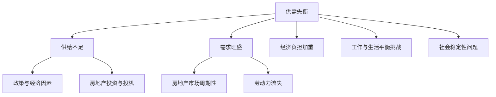

                 

### 文章标题

《硅谷高房价之困：普通员工的生活压力》

#### 关键词

- 硅谷房价
- 普通员工
- 生活压力
- 经济负担
- 社会稳定性

#### 摘要

本文深入探讨了硅谷高房价对普通员工生活带来的巨大压力。通过分析房价问题的起源、原因及其对员工生活的影响，我们提出了解决高房价问题的策略与建议，并探讨了企业在其中应承担的社会责任。同时，通过国际经验与硅谷实践的案例分析，为解决这一全球性问题提供了参考。文章旨在为政府、企业及普通员工提供切实可行的解决方案，以缓解硅谷高房价带来的生活压力。

### 《硅谷高房价之困：普通员工的生活压力》

硅谷，作为全球科技创新的圣地，吸引了无数技术人才和企业。然而，随着科技产业的蓬勃发展，硅谷的高房价问题逐渐凸显，成为普通员工生活的一大难题。本文将从背景与问题概述、高房价问题的原因分析、解决高房价问题的策略与建议、案例分析与解决方案、普通员工的自我调整与适应以及结论与展望六个部分，系统探讨硅谷高房价之困，为普通员工的生活压力提供一剂解药。

#### # 第一部分：背景与问题概述

#### 第1章：硅谷高房价问题的起源与发展

1. **1.1 硅谷高房价问题的起源**

    硅谷高房价问题的起源可以追溯到20世纪末，随着互联网和科技产业的崛起，硅谷逐渐成为全球科技创新的中心。大量的科技公司如谷歌、苹果、Facebook等在此扎根，吸引了大量人才涌入。人口流入导致住房需求激增，而土地供应相对有限，房价开始逐年攀升。

2. **1.2 硅谷高房价问题的现状**

    当前，硅谷的房价已达到惊人的水平。根据数据显示，硅谷某些地区的房价中位数已经超过100万美元。高房价使得许多普通员工无法负担购房成本，导致住房困难问题日益严重。同时，高房价也对硅谷的劳动力流失率产生了影响，许多人才选择离开硅谷，去其他城市寻找更好的发展机会。

3. **1.3 高房价对普通员工生活的影响**

    高房价对普通员工生活的影响是多方面的。首先，经济负担加重，许多员工需要将大部分收入用于支付房租或房贷，导致生活质量下降。其次，工作与生活平衡的挑战加剧，员工为了支付高昂的住房成本，不得不加班加点，牺牲个人时间。最后，高房价也引发了社会稳定性问题，贫富差距扩大，社会矛盾加剧。

#### # 第二部分：高房价问题的原因分析

#### 第2章：供需失衡与市场动态

1. **2.1 供需失衡的原因**

    硅谷高房价问题的根源在于供需失衡。首先，供给不足是导致房价飙升的主要原因。硅谷的土地资源有限，新建住房项目受到严格限制，导致住房供应量无法满足需求。其次，需求旺盛也是重要原因。随着科技产业的快速发展，越来越多的企业和人才涌入硅谷，对住房需求形成了巨大压力。

2. **2.2 市场动态与房价波动**

    硅谷房地产市场具有明显的周期性。在经济繁荣时期，房价上涨迅速，而在经济衰退时期，房价则相对稳定甚至下降。政策调控也对市场动态产生了影响。政府通过土地供应政策、财政税收政策等手段，试图控制房价波动。

3. **2.3 房地产投资与投机的影响**

    房地产投资和投机行为也对高房价问题产生了重要影响。一方面，投资者将大量资金投入房地产市场，推高了房价。另一方面，投机行为导致市场不稳定，房价波动加剧，进一步增加了普通员工的购房难度。

#### # 第三部分：解决高房价问题的策略与建议

#### 第3章：政策干预与市场调节

1. **3.1 政府政策的干预**

    政府在解决高房价问题中扮演着重要角色。首先，通过土地供应政策，增加住房供给，缓解供需失衡。其次，通过财政税收政策，抑制投机行为，降低房价上涨速度。此外，政府还可以通过金融政策调控，限制信贷规模，降低房地产市场的泡沫风险。

2. **3.2 市场调节机制**

    市场调节机制是解决高房价问题的重要手段。首先，加强房地产市场监管，规范市场行为，防止恶性竞争和哄抬房价。其次，建立住房保障体系，提供公租房和廉租房，保障低收入群体的基本住房需求。此外，还可以推动房地产市场的国际化，吸引国际资本参与，缓解国内房价压力。

#### 第4章：企业社会责任与员工福利

1. **4.1 企业在解决高房价问题中的角色**

    企业在解决高房价问题中应承担一定的社会责任。首先，提供住房补贴，帮助员工解决住房问题。其次，实施员工住房购买计划，为员工提供购房优惠。此外，企业还可以建设内部住房解决方案，为员工提供更好的居住环境。

2. **4.2 员工福利与生活质量**

    员工福利与生活质量是解决高房价问题的重要一环。首先，提高员工福利待遇，增加收入来源，帮助员工缓解经济负担。其次，提供住房贷款支持，降低购房门槛。此外，企业还可以提供员工住房信息服务，帮助员工了解住房市场动态，做出更明智的购房决策。

#### # 第四部分：案例分析与解决方案

#### 第5章：国际经验与硅谷实践

1. **5.1 国际上解决高房价问题的成功经验**

    国际上一些国家在解决高房价问题方面取得了成功经验。例如，北欧国家通过政府主导的住房政策，提供了大量廉租房和公租房，有效缓解了房价压力。新加坡则通过公共住房体系，实现了住房市场的稳定和公平。

2. **5.2 硅谷地区解决高房价问题的实践**

    硅谷地区在解决高房价问题方面进行了多种尝试。例如，一些科技公司提供了住房补贴和购房计划，帮助员工解决住房问题。同时，硅谷政府也采取了一系列措施，如增加住房供给、实施财政税收政策等，努力降低房价。

#### 第6章：普通员工的自我调整与适应

1. **6.1 调整生活方式与预期**

    普通员工在面临高房价问题时，需要调整生活方式和预期。首先，寻求租房与购房的平衡，根据自身经济状况选择合适的住房方式。其次，调整职业规划与生活重心，避免过度追求高薪工作而忽视生活质量。此外，增加收入来源和理财规划，提高资金利用效率。

2. **6.2 员工互助与社区支持**

    员工互助和社区支持在解决高房价问题中发挥着重要作用。首先，员工可以通过互助组织分享住房信息，降低购房成本。其次，社区可以整合资源，提供住房咨询服务，帮助员工更好地应对住房难题。此外，政府和非营利组织也可以合作，提供住房援助和福利，减轻员工负担。

#### # 第五部分：结论与展望

#### 第7章：解决高房价问题的长期策略

1. **7.1 政府与市场的协同作用**

    解决高房价问题需要政府与市场的协同作用。首先，政府应制定长期政策规划，通过多种手段调控房价。其次，市场应发挥调节机制，规范市场行为，防止房价异常波动。此外，政府还可以鼓励企业承担社会责任，共同推动住房问题的解决。

2. **7.2 长期解决方案的展望**

    长期来看，解决高房价问题需要从多个方面入手。首先，推动可持续的城市发展，优化城市空间布局，增加住房供给。其次，创新科技在住房领域的应用，如智能家居、智慧社区等，可以提高住房质量和效率。此外，调整社会经济结构，提高低收入群体的收入水平，降低房价压力。

### 附录：相关数据与政策文件

1. **附录A：硅谷房价数据统计分析**

    - 房价指数与增长率
    - 购房难度与人口流失

2. **附录B：政府与政策文件汇编**

    - 地方政府住房政策
    - 房地产市场监管法规
    - 企业社会责任报告

[Mermaid 流程图：硅谷高房价问题原因分析]

### # 核心

硅谷高房价问题已经成为影响普通员工生活质量和社会稳定的重要难题。通过本文的分析，我们可以看到，高房价问题的根源在于供需失衡、房地产投资投机行为以及政策调控不足。要解决这一问题，需要政府、企业和普通员工共同努力，从政策干预、市场调节、企业社会责任和员工自我调整等多个方面入手。同时，国际经验与硅谷实践也为解决这一问题提供了有益的参考。

#### 作者

- 作者：AI天才研究院/AI Genius Institute & 禅与计算机程序设计艺术 /Zen And The Art of Computer Programming

