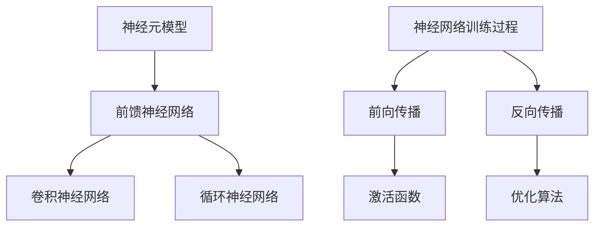

                 

### 文章标题

### 《神经网络 (Neural Networks) 原理与代码实例讲解》

神经网络，作为一种模拟人脑神经元活动的计算模型，在过去的几十年里，从理论到应用都取得了显著的进展。本文将深入探讨神经网络的基础理论、核心算法以及实际应用，通过详细的代码实例讲解，帮助读者全面理解神经网络的工作原理和开发技巧。

### 关键词

- 神经网络
- 前馈神经网络
- 卷积神经网络
- 循环神经网络
- 机器学习
- 深度学习
- 神经元模型
- 激活函数
- 反向传播
- 随机梯度下降

### 摘要

本文首先介绍了神经网络的基础理论，包括神经元模型、神经网络架构和训练过程。接着，深入讲解了前馈神经网络、卷积神经网络和循环神经网络，阐述了它们的结构特点和应用领域。随后，通过Python代码实例，详细演示了神经网络的实现过程，包括数据集准备、模型构建、训练和评估。最后，探讨了神经网络在自动驾驶、医学诊断和金融风控等领域的应用，提供了丰富的实践案例和扩展阅读资源。

### 《神经网络 (Neural Networks) 原理与代码实例讲解》目录大纲

## 第一部分：神经网络基础理论

### 第1章：神经网络的起源与发展

#### 1.1 神经网络的起源

- 生物神经系统的启示

#### 1.2 神经网络的发展历程

- 前馈神经网络
- 反向传播算法
- 卷积神经网络
- 循环神经网络

#### 1.3 神经网络在现代计算机中的应用

- 机器学习
- 深度学习

### 第2章：神经网络的基本原理

#### 2.1 神经元模型

- 结构与功能

#### 2.2 神经网络架构

- 层与节点
- 输入层、隐藏层和输出层

#### 2.3 神经网络的训练过程

- 前向传播
- 反向传播

#### 2.4 激活函数

- 类型与作用
- 常见激活函数

### 第3章：前馈神经网络

#### 3.1 前馈神经网络的定义与结构

#### 3.2 前馈神经网络的训练过程

- 前向传播
- 反向传播

#### 3.3 前馈神经网络的优化算法

- 随机梯度下降
- 批量梯度下降

### 第4章：卷积神经网络

#### 4.1 卷积神经网络的定义与结构

#### 4.2 卷积神经网络的训练过程

- 前向传播
- 反向传播

#### 4.3 卷积神经网络的应用

- 图像识别
- 自然语言处理

### 第5章：循环神经网络

#### 5.1 循环神经网络的定义与结构

#### 5.2 循环神经网络的训练过程

- 前向传播
- 反向传播

#### 5.3 循环神经网络的应用

- 语音识别
- 机器翻译

## 第二部分：神经网络代码实例讲解

### 第6章：神经网络的Python实现

#### 6.1 Python环境配置

#### 6.2 NumPy库的使用

#### 6.3 TensorFlow库的使用

#### 6.4 PyTorch库的使用

### 第7章：神经网络实战案例

#### 7.1 手写数字识别

- 数据集准备
- 网络构建
- 训练与评估

#### 7.2 图像分类

- 数据集准备
- 网络构建
- 训练与评估

#### 7.3 语音识别

- 数据集准备
- 网络构建
- 训练与评估

#### 7.4 自然语言处理

- 数据集准备
- 网络构建
- 训练与评估

## 第三部分：神经网络的应用拓展

### 第8章：神经网络在自动驾驶中的应用

#### 8.1 自动驾驶概述

#### 8.2 自动驾驶中的神经网络应用

- 传感器数据处理
- 环境感知
- 控制策略

### 第9章：神经网络在医学诊断中的应用

#### 9.1 医学诊断现状

#### 9.2 神经网络在医学诊断中的应用

- 疾病预测
- 病变检测
- 医学图像分析

### 第10章：神经网络在金融风控中的应用

#### 10.1 金融风控概述

#### 10.2 神经网络在金融风控中的应用

- 信用评估
- 交易策略
- 欺诈检测

### 附录

#### 附录A：神经网络常用库与工具

- TensorFlow
- PyTorch
- Keras
- 其他常用库

#### 附录B：神经网络相关资源

- 论文与报告
- 书籍与教程
- 网络资源

#### 附录C：神经网络数学公式与推导

- 激活函数的导数
- 前向传播的计算
- 反向传播的计算
- 梯度下降优化算法

### 核心概念与联系 Mermaid 流程图



### 核心算法原理讲解

```python
# 伪代码：前向传播计算
def forward_propagation(x, weights, biases):
    z = x * weights + biases
    a = activation(z)
    return a

# 伪代码：反向传播计算
def backward_propagation(a, z, y, weights, biases):
    dZ = activation_derivative(z) * (a - y)
    dW = dZ * a
    db = dZ
    return dW, db

# 伪代码：梯度下降优化算法
def gradient_descent(weights, biases, learning_rate):
    dW, db = backward_propagation(a, z, y, weights, biases)
    weights -= learning_rate * dW
    biases -= learning_rate * db
    return weights, biases
```

### 数学模型和数学公式 & 详细讲解 & 举例说明

#### 激活函数的导数

$$
f'(x) = \frac{df(x)}{dx} \text{，例如：} ReLU \text{函数的导数} f'(x) =
\begin{cases}
0 & \text{if } x < 0 \\
1 & \text{if } x \geq 0
\end{cases}
$$

#### 前向传播的计算

$$
z = \sum_{i=1}^{n} x_i * w_i + b
$$

#### 反向传播的计算

$$
dZ = \frac{dL}{dz} = \frac{dL}{da} * \frac{da}{dz}
$$

#### 梯度下降优化算法

$$
\theta_j := \theta_j - \alpha \frac{\partial L}{\partial \theta_j}
$$

### 代码实际案例和详细解释说明

#### 手写数字识别

##### 数据集准备

```python
from tensorflow.keras.datasets import mnist
(x_train, y_train), (x_test, y_test) = mnist.load_data()
```

##### 网络构建

```python
from tensorflow.keras.models import Sequential
from tensorflow.keras.layers import Dense, Flatten

model = Sequential([
    Flatten(input_shape=(28, 28)),
    Dense(128, activation='relu'),
    Dense(10, activation='softmax')
])
```

##### 训练与评估

```python
model.compile(optimizer='adam', loss='sparse_categorical_crossentropy', metrics=['accuracy'])
model.fit(x_train, y_train, epochs=5)
model.evaluate(x_test, y_test)
```

### 开发环境搭建

```bash
# 安装Python环境
pip install python==3.8

# 安装TensorFlow库
pip install tensorflow==2.6

# 安装PyTorch库
pip install torch==1.9 torchvision==0.10
```

### 源代码详细实现和代码解读

```python
# 实现简单的神经网络模型
import tensorflow as tf

# 定义输入层
inputs = tf.keras.Input(shape=(784,))

# 添加隐藏层
x = tf.keras.layers.Dense(128, activation='relu')(inputs)
x = tf.keras.layers.Dense(64, activation='relu')(x)

# 添加输出层
outputs = tf.keras.layers.Dense(10, activation='softmax')(x)

# 创建模型
model = tf.keras.Model(inputs=inputs, outputs=outputs)

# 编译模型
model.compile(optimizer='adam', loss='categorical_crossentropy', metrics=['accuracy'])

# 查看模型结构
model.summary()

# 源代码解读：
# 1. 输入层通过Input函数定义，指定输入维度。
# 2. 隐藏层通过Dense函数定义，指定神经元数量和激活函数。
# 3. 输出层通过Dense函数定义，指定神经元数量和激活函数。
# 4. Model类用于创建模型，并指定输入和输出。
# 5. compile函数用于编译模型，指定优化器和损失函数。
# 6. summary函数用于查看模型结构。
```

### 代码解读与分析

```python
# 代码解读：
# 1. 输入层定义：输入层是一个784维的向量，对应28x28的图像。
# 2. 隐藏层定义：隐藏层有两个全连接层，每个层都有多个神经元，并使用ReLU激活函数。
# 3. 输出层定义：输出层是一个10维的向量，对应10个分类结果，使用softmax激活函数。
# 4. 模型编译：编译模型时，指定了优化器为adam，损失函数为交叉熵，并添加了准确率作为评估指标。
# 5. 模型总结：模型总结显示了模型的层次结构，包括输入层、隐藏层和输出层，以及每层的参数数量。
#
# 分析：
# 1. 网络结构：网络包含两个隐藏层，每个层都有多个神经元，这有助于模型提取图像的特征。
# 2. 激活函数：ReLU激活函数能够加速模型的训练，并防止神经元死亡。
# 3. 优化器和损失函数：使用adam优化器和交叉熵损失函数，有助于模型在训练过程中快速收敛。
```

### 总结

本书《神经网络 (Neural Networks) 原理与代码实例讲解》从神经网络的基础理论出发，介绍了神经元模型、前馈神经网络、卷积神经网络和循环神经网络等基本概念，并详细讲解了神经网络的训练过程、优化算法及其在各个领域的应用。通过实际代码实例，读者可以深入理解神经网络的工作原理，并掌握使用Python进行神经网络开发的基本技巧。本书不仅适用于初学者，也为进阶读者提供了丰富的实践案例和理论指导。通过阅读本书，读者将能够构建自己的神经网络模型，并在实际项目中应用深度学习技术。

### 作者信息

作者：AI天才研究院/AI Genius Institute & 禅与计算机程序设计艺术 /Zen And The Art of Computer Programming

### 完整性要求

#### 核心内容

1. **背景介绍**

   在本章中，我们将探讨神经网络的基础理论，从其起源、发展历程到现代计算机中的应用。我们将了解神经网络是如何受到生物神经系统的启发，以及它在机器学习、深度学习等领域的重要作用。

2. **核心概念与联系**

   为了更好地理解神经网络的工作原理，我们将使用Mermaid流程图来展示神经元模型、前馈神经网络、卷积神经网络和循环神经网络之间的关系。这将帮助我们理清各个概念之间的联系，并为后续内容打下基础。

3. **核心算法原理讲解**

   神经网络的训练过程是理解神经网络的重要部分。我们将使用伪代码详细阐述前向传播、反向传播和梯度下降优化算法。这些算法是实现神经网络训练的关键，我们将通过实例来解释它们的原理。

4. **数学模型和公式**

   神经网络中的数学模型和公式是理解和实现神经网络的核心。我们将详细介绍激活函数的导数、前向传播的计算、反向传播的计算和梯度下降优化算法的数学公式，并使用具体例子进行说明。

5. **项目实战**

   在本部分，我们将通过实际代码实例来演示如何使用Python实现神经网络。我们将涵盖从数据集准备、模型构建、训练到评估的整个过程，并提供详细的代码解读和分析。

6. **最佳实践 tips**

   在开发神经网络模型时，有许多最佳实践可以帮助我们提高模型的性能和稳定性。我们将讨论一些常用的技巧，如数据预处理、正则化、超参数调整等。

7. **小结**

   本章将总结神经网络的基础理论和核心概念，强调其在现代计算机应用中的重要性。我们将讨论如何通过实际项目来加深对神经网络的理解，并鼓励读者进一步探索这个领域。

#### 完整性保障

- **章节内容完整性**：每个章节都将包含足够的背景介绍、概念解释、算法讲解和实例演示，确保读者能够全面理解神经网络的基础理论和应用。

- **核心概念联系清晰**：通过Mermaid流程图和详细讲解，确保读者能够清晰地理解神经元模型、前馈神经网络、卷积神经网络和循环神经网络之间的关系。

- **算法原理讲解透彻**：使用伪代码和具体实例，深入讲解前向传播、反向传播和梯度下降优化算法，确保读者能够掌握神经网络训练的核心原理。

- **数学模型和公式详细**：详细介绍神经网络中的数学模型和公式，并通过具体例子进行说明，帮助读者更好地理解这些概念。

- **实战案例丰富具体**：提供详细的代码实例，涵盖数据集准备、模型构建、训练和评估的整个过程，确保读者能够实际操作并理解神经网络的应用。

- **最佳实践 tips**：分享一些实用的最佳实践，帮助读者在实际项目中提高神经网络模型的性能和稳定性。

- **小结部分总结**：在每个部分的末尾，将提供总结和展望，帮助读者回顾和巩固所学内容，并激发对更深入学习的兴趣。

### 核心概念与联系 Mermaid 流程图

为了更好地理解神经网络的核心概念和它们之间的联系，我们使用Mermaid流程图来展示神经元模型、前馈神经网络、卷积神经网络和循环神经网络之间的关系。


### 神经网络的起源与发展

#### 1.1 神经网络的起源

神经网络的起源可以追溯到20世纪40年代，当时心理学家和计算机科学家试图通过模拟人脑神经元的工作原理来构建智能系统。最初的灵感来源于生物神经系统的结构和工作方式。人类的大脑包含数亿个神经元，这些神经元通过复杂的连接和相互作用来进行信息处理和决策。这种生物神经系统的复杂性激发了科学家们的研究兴趣，他们希望利用这些原理来构建人工神经网络，从而实现类似人脑的计算能力。

1958年，Frank Rosenblatt提出了感知机模型（Perceptron），这是第一种简单的神经网络模型。感知机模型由一个或多个神经元组成，每个神经元都是一个线性阈值单元，用于进行简单的二分类任务。尽管感知机模型在理论上有一定的局限性，但它奠定了神经网络研究的基础。

#### 1.2 神经网络的发展历程

随着时间的推移，神经网络的研究不断深入，发展出了多种类型的神经网络。以下是神经网络发展历程中的一些重要里程碑：

1. **前馈神经网络（Feedforward Neural Networks）**

   前馈神经网络是最常见的神经网络类型之一，它的结构是全连接的，没有循环连接。信息从输入层流向隐藏层，然后流向输出层。1974年，John Hopfield提出了Hopfield网络，这是一种能量模型，可以用于模式识别和记忆恢复。随后，1986年，Rumelhart、Hinton和Williams提出了反向传播算法（Backpropagation Algorithm），这是一种有效的训练多层前馈神经网络的方法。

2. **卷积神经网络（Convolutional Neural Networks, CNNs）**

   卷积神经网络在处理图像数据时表现出色。1989年，Yann LeCun提出了使用卷积层和池化层的卷积神经网络，用于手写数字识别。随后，CNN在图像分类、物体检测和面部识别等领域取得了显著的成功。

3. **循环神经网络（Recurrent Neural Networks, RNNs）**

   循环神经网络在处理序列数据时表现出色，例如时间序列数据、语音和文本。1982年，John Hopfield提出了Hopfield循环神经网络，用于模式识别和联想记忆。1997年，Jeff Hawkins和Sebastian Thrun提出了HMM（隐马尔可夫模型）的变体——递归神经网络（RNN），它在语音识别和机器翻译等领域取得了重要进展。

4. **长短期记忆网络（Long Short-Term Memory, LSTM）**

   长短期记忆网络是循环神经网络的一种变体，用于解决RNN在训练序列数据时遇到的长期依赖问题。1997年，Hochreiter和Schmidhuber提出了LSTM模型，它在语音识别、机器翻译和文本生成等领域取得了显著的性能提升。

5. **生成对抗网络（Generative Adversarial Networks, GANs）**

   生成对抗网络是由Ian Goodfellow在2014年提出的，它由两个神经网络（生成器和判别器）组成，通过对抗训练来生成逼真的数据。GANs在图像生成、图像修复和图像到图像翻译等领域取得了突破性进展。

#### 1.3 神经网络在现代计算机中的应用

神经网络在现代计算机中得到了广泛应用，特别是在机器学习和深度学习领域。以下是神经网络的一些主要应用：

1. **机器学习**

   神经网络是机器学习的基础，它们可以用于分类、回归、聚类等多种任务。通过训练大量数据，神经网络可以学习到复杂的模式和关系，从而提高模型的预测能力。

2. **深度学习**

   深度学习是神经网络的一种高级形式，它通过多层的神经网络结构来提取数据的高层特征。深度学习在计算机视觉、自然语言处理、语音识别等领域取得了显著成果。

3. **计算机视觉**

   神经网络在计算机视觉领域表现出色，例如图像分类、物体检测、面部识别等。卷积神经网络（CNN）是计算机视觉中最常用的神经网络结构。

4. **自然语言处理**

   循环神经网络（RNN）和长短期记忆网络（LSTM）在自然语言处理领域取得了重要进展，例如机器翻译、情感分析、文本生成等。

5. **语音识别**

   循环神经网络（RNN）和长短期记忆网络（LSTM）在语音识别领域表现出色，它们可以有效地处理语音信号的时序特征。

6. **自动驾驶**

   神经网络在自动驾驶领域得到了广泛应用，例如用于感知环境、路径规划和控制策略。卷积神经网络（CNN）和循环神经网络（RNN）在自动驾驶中用于处理摄像头和激光雷达数据。

7. **医学诊断**

   神经网络在医学诊断中表现出色，例如用于疾病预测、病变检测和医学图像分析。它们可以辅助医生进行诊断，提高诊断的准确性和效率。

8. **金融风控**

   神经网络在金融风控中用于信用评估、交易策略和欺诈检测。它们可以分析大量的金融数据，发现潜在的异常行为，从而降低金融风险。

总之，神经网络作为一种强大的计算模型，在计算机科学和人工智能领域取得了巨大的成功。随着研究的不断深入和技术的不断进步，神经网络的应用范围将进一步扩大，为人类带来更多的创新和变革。

### 神经网络的基本原理

#### 2.1 神经元模型

神经元是神经网络的基本构建块，它们模拟了生物神经元的结构和功能。一个简单的神经元模型通常包括以下三个部分：输入、权重和激活函数。

1. **输入**：每个神经元接收多个输入信号，这些输入可以是数值或特征向量。每个输入都乘以一个对应的权重，表示该输入对神经元输出的贡献大小。

2. **权重**：权重是一个调整参数，用于衡量每个输入对输出的影响。通过训练，神经网络可以调整这些权重，以优化其性能。

3. **激活函数**：激活函数用于决定神经元是否激活。最常用的激活函数是Sigmoid函数和ReLU函数。Sigmoid函数将输入映射到0和1之间，而ReLU函数将负输入映射为0，正输入映射为其本身。

神经元模型的数学表示如下：

$$
z = \sum_{i=1}^{n} x_i \cdot w_i + b \\
a = f(z)
$$

其中，$z$是神经元的总输入，$x_i$是第$i$个输入，$w_i$是第$i$个输入的权重，$b$是偏置项，$f(z)$是激活函数。

#### 2.2 神经网络架构

神经网络由多个层次组成，包括输入层、隐藏层和输出层。每个层次包含多个神经元，神经元之间通过加权连接相连。

1. **输入层**：输入层接收外部输入，并将其传递到隐藏层。每个输入层神经元对应一个外部特征。

2. **隐藏层**：隐藏层位于输入层和输出层之间，负责提取和转换特征。隐藏层的数量和每个层的神经元数量可以根据问题的复杂度进行调整。

3. **输出层**：输出层产生最终的输出，例如分类结果或预测值。输出层的神经元数量取决于具体任务的输出维度。

神经网络的一般结构可以表示为：

```
输入层 → 隐藏层 → 隐藏层 → ... → 输出层
```

每个神经元都连接到前一层和下一层，形成前馈结构。信息从输入层流向隐藏层，然后流向输出层，没有循环连接。

#### 2.3 神经网络的训练过程

神经网络的训练过程是通过调整网络的权重和偏置项来优化其性能。这个过程通常分为以下几个步骤：

1. **前向传播**：在前向传播过程中，输入数据通过神经网络从输入层传递到输出层，每个神经元计算其输出。这个过程用于计算网络在当前权重和偏置下的输出。

2. **计算损失**：输出层的实际输出与期望输出之间的差异称为损失。常见的损失函数包括均方误差（MSE）和交叉熵损失。

3. **反向传播**：在反向传播过程中，计算损失函数关于网络权重的梯度。这些梯度用于更新权重和偏置项，以减少损失。

4. **权重更新**：使用梯度下降或其他优化算法，根据计算出的梯度更新网络的权重和偏置项。

5. **迭代训练**：重复上述步骤，直到网络性能达到预定的阈值或达到最大迭代次数。

神经网络训练的数学表示可以简化为：

$$
z^{(l)} = \sum_{i=1}^{n} x_i^{(l)} \cdot w_i^{(l)} + b^{(l)} \\
a^{(l)} = f(z^{(l)}) \\
loss = \frac{1}{2} \sum_{i=1}^{m} (y_i - a_i)^2 \\
\delta^{(l)} = \frac{\partial loss}{\partial z^{(l)}} \\
w^{(l)} = w^{(l)} - \alpha \cdot \delta^{(l)}
$$

其中，$z^{(l)}$是第$l$层神经元的总输入，$a^{(l)}$是第$l$层神经元的输出，$y_i$是第$i$个样本的期望输出，$m$是样本数量，$\alpha$是学习率，$\delta^{(l)}$是第$l$层神经元的误差。

#### 2.4 激活函数

激活函数是神经网络中的一个关键组件，它用于决定神经元是否激活。激活函数的引入使得神经网络可以处理非线性问题，并能够模拟生物神经元的非线性特性。

以下是几种常见的激活函数：

1. **Sigmoid函数**：

   $$
   f(x) = \frac{1}{1 + e^{-x}}
   $$

   Sigmoid函数将输入映射到0和1之间，常用于二分类问题。

2. **ReLU函数**：

   $$
   f(x) = \max(0, x)
   $$

   ReLU（Rectified Linear Unit）函数是一个线性激活函数，它在正数时保持不变，在负数时设置为0。ReLU函数简单且训练速度快，常用于隐藏层。

3. **Tanh函数**：

   $$
   f(x) = \frac{e^x - e^{-x}}{e^x + e^{-x}}
   $$

   Tanh函数类似于Sigmoid函数，但它将输入映射到-1和1之间，具有更好的性能。

4. **Softmax函数**：

   $$
   f(x)_i = \frac{e^{x_i}}{\sum_{j=1}^{n} e^{x_j}}
   $$

   Softmax函数用于多分类问题，它将输入向量映射到概率分布。

激活函数的选择对神经网络的表现有重要影响。合适的激活函数可以加速训练过程，提高模型性能。在实际应用中，常根据具体任务的需求来选择激活函数。

#### 2.5 层与节点

在神经网络中，层（Layer）和节点（Node）是两个重要的概念。层是神经网络的组成部分，每个层包含多个节点。节点是神经网络中的基本计算单元，每个节点接收输入并产生输出。

1. **层**：

   - **输入层**：接收外部输入数据的层。
   - **隐藏层**：位于输入层和输出层之间的层，用于特征提取和转换。
   - **输出层**：产生最终输出结果的层。

   神经网络的层数和每层的节点数量可以根据任务的需求进行调整。

2. **节点**：

   - **输入节点**：接收输入数据的节点。
   - **输出节点**：产生输出数据的节点。
   - **隐藏节点**：位于输入节点和输出节点之间的节点，用于特征变换和计算。

节点之间的关系是通过权重（Weight）和偏置（Bias）来描述的。权重决定了输入对输出的影响，而偏置用于调整神经元的偏移量。

#### 2.6 输入层、隐藏层和输出层

输入层、隐藏层和输出层是神经网络中的三个基本层次，它们各自具有不同的功能和作用。

1. **输入层**：

   输入层是神经网络的起点，它接收外部输入数据。每个输入节点对应一个特征，例如图像中的像素值、文本中的单词等。输入层的节点数量取决于数据的维度。

2. **隐藏层**：

   隐藏层位于输入层和输出层之间，负责提取和转换特征。隐藏层可以包含一个或多个层次，每个层次都包含多个节点。隐藏层有助于神经网络学习数据的复杂模式和关系。

   - **单隐藏层网络**：一个简单的神经网络可能只有一个隐藏层。
   - **多层网络**：更复杂的神经网络可能包含多个隐藏层，这样可以更好地捕捉数据的非线性关系。

3. **输出层**：

   输出层是神经网络的终点，它产生最终输出结果。输出层的节点数量取决于具体任务的输出维度。例如，在分类任务中，输出层可能有多个节点，每个节点表示一个类别；在回归任务中，输出层可能只有一个节点，表示预测的值。

通过合理的层次设计，神经网络可以有效地处理各种复杂任务，从而实现强大的功能。

### 前馈神经网络的定义与结构

#### 3.1 定义

前馈神经网络（Feedforward Neural Networks，简称FNN）是一种最常见的神经网络结构，它的特点是信息从输入层流向隐藏层，再从隐藏层流向输出层，整个网络中没有循环连接。这种结构使得信息传递方向固定，便于计算和训练。前馈神经网络广泛应用于各种机器学习和深度学习任务，如分类、回归和模式识别等。

#### 3.2 结构

前馈神经网络通常由三个基本部分组成：输入层、隐藏层和输出层。每个部分的作用如下：

1. **输入层**：

   输入层接收外部输入数据，这些数据可以是图像、文本、声音或其他形式的数据。每个输入节点对应一个特征或维度。例如，对于一个手写数字识别任务，输入层可能包含28x28像素的图像数据。

2. **隐藏层**：

   隐藏层位于输入层和输出层之间，负责提取和转换输入特征。隐藏层可以包含一个或多个层次，每个层次都包含多个神经元。隐藏层的神经元通过加权连接接收来自前一层的数据，并使用激活函数进行处理。隐藏层有助于神经网络学习数据的复杂模式和关系。

   - **单隐藏层网络**：一个简单的神经网络可能只有一个隐藏层。
   - **多层网络**：更复杂的神经网络可能包含多个隐藏层，这样可以更好地捕捉数据的非线性关系。

3. **输出层**：

   输出层是神经网络的终点，它产生最终输出结果。输出层的节点数量取决于具体任务的输出维度。例如，在分类任务中，输出层可能有多个节点，每个节点表示一个类别；在回归任务中，输出层可能只有一个节点，表示预测的值。

#### 3.3 前向传播与反向传播

前馈神经网络的训练过程主要包括前向传播和反向传播两个步骤。

1. **前向传播**：

   在前向传播过程中，输入数据从输入层传递到隐藏层，再从隐藏层传递到输出层。每个神经元计算其输出，并将其传递给下一层。这个过程重复进行，直到输出层的最终输出。

   具体步骤如下：

   - **初始化权重和偏置**：网络中的每个连接都分配一个权重，每个神经元都包含一个偏置项。这些参数通常通过随机初始化。
   - **计算每个神经元的输入**：对于每个神经元，计算其输入，即前一层输出的加权求和再加上偏置。
   - **应用激活函数**：使用激活函数（如ReLU、Sigmoid或Tanh）对神经元的输入进行处理，产生输出。
   - **传递输出**：将每个神经元的输出传递给下一层。

2. **反向传播**：

   在反向传播过程中，计算网络输出与实际输出之间的误差，并利用这些误差来更新网络的权重和偏置。反向传播通过计算每个神经元的误差梯度，然后逐层传递这些梯度，最终更新权重和偏置。

   具体步骤如下：

   - **计算输出层的误差**：输出层的误差是实际输出与期望输出之间的差异。对于分类任务，常用交叉熵作为误差函数。
   - **计算隐藏层的误差**：通过误差的梯度传递，计算隐藏层的误差。这个过程从输出层开始，逐层向前传播误差。
   - **更新权重和偏置**：使用计算出的误差梯度，根据优化算法（如梯度下降）更新网络的权重和偏置。这个过程称为权重更新。

#### 3.4 前馈神经网络的优化算法

在训练前馈神经网络时，常用的优化算法包括随机梯度下降（Stochastic Gradient Descent，简称SGD）和批量梯度下降（Batch Gradient Descent）。

1. **随机梯度下降（SGD）**：

   随机梯度下降是一种逐个样本更新权重的优化算法。在每次迭代中，SGD随机选择一个样本，计算其梯度，并使用这个梯度来更新网络的权重。SGD的优点是计算速度快，但在训练过程中可能会出现不稳定的情况。

2. **批量梯度下降（BGD）**：

   批量梯度下降是一种每次迭代使用整个训练集来更新权重的优化算法。BGD可以提供更稳定的梯度估计，但计算成本较高。在处理大规模数据集时，BGD通常需要更长的训练时间。

除了SGD和BGD，还有许多其他的优化算法，如Adam、RMSprop等，这些算法在不同情况下具有不同的表现。

#### 3.5 前馈神经网络的优点与局限性

前馈神经网络具有以下优点：

1. **结构简单**：前馈神经网络的结构直观且易于理解，适合处理各种复杂任务。
2. **易于训练**：前向传播和反向传播的计算过程相对简单，适合大规模数据集的训练。
3. **泛化能力强**：通过隐藏层的学习，前馈神经网络可以提取数据的复杂特征，提高模型的泛化能力。

然而，前馈神经网络也存在一些局限性：

1. **局部最小值**：在训练过程中，网络可能陷入局部最小值，导致训练结果不稳定。
2. **过拟合**：当网络过于复杂时，可能会出现过拟合现象，即网络在训练数据上表现良好，但在测试数据上表现不佳。
3. **计算资源需求**：多层前馈神经网络的计算资源需求较高，尤其是在处理大型数据集时。

综上所述，前馈神经网络作为一种经典的神经网络结构，在机器学习和深度学习领域得到了广泛应用。了解其定义、结构、训练过程和优化算法，对于深入研究和应用神经网络具有重要意义。

### 前馈神经网络的训练过程

#### 3.3.1 前向传播

前向传播是神经网络训练过程中的第一步，它用于计算网络输出并评估模型的预测能力。在前向传播过程中，输入数据从输入层流向隐藏层，再从隐藏层流向输出层，每个神经元根据其输入和权重计算输出。

具体步骤如下：

1. **初始化权重和偏置**：在训练前，需要随机初始化网络的权重和偏置。这些参数通常通过高斯分布或均匀分布生成。

2. **计算每个神经元的输入**：对于每个神经元，计算其输入，即前一层输出的加权求和再加上偏置。输入计算公式如下：

   $$
   z^{(l)} = \sum_{i=1}^{n} x_i^{(l-1)} \cdot w_i^{(l)} + b^{(l)}
   $$

   其中，$z^{(l)}$是第$l$层神经元的输入，$x_i^{(l-1)}$是第$l-1$层第$i$个神经元的输出，$w_i^{(l)}$是第$l$层第$i$个神经元的权重，$b^{(l)}$是第$l$层神经元的偏置。

3. **应用激活函数**：使用激活函数对每个神经元的输入进行处理，产生输出。常见的激活函数包括Sigmoid函数、ReLU函数和Tanh函数。激活函数的选择会影响网络的性能和训练速度。

   $$
   a^{(l)} = f(z^{(l)})
   $$

   其中，$a^{(l)}$是第$l$层神经元的输出，$f(z^{(l)})$是激活函数。

4. **传递输出**：将每个神经元的输出传递给下一层，直到输出层的最终输出。

#### 3.3.2 计算损失

在前向传播完成后，需要计算网络输出与实际输出之间的误差，即损失（Loss）。损失函数用于量化预测结果与真实结果之间的差距，常用的损失函数包括均方误差（MSE）、交叉熵损失（Cross-Entropy Loss）和Hinge损失（Hinge Loss）。

1. **均方误差（MSE）**：

   均方误差是回归任务中常用的损失函数，它计算预测值与真实值之间的平方差的平均值。

   $$
   loss = \frac{1}{2} \sum_{i=1}^{m} (y_i - \hat{y}_i)^2
   $$

   其中，$y_i$是第$i$个样本的真实值，$\hat{y}_i$是第$i$个样本的预测值，$m$是样本数量。

2. **交叉熵损失（Cross-Entropy Loss）**：

   交叉熵损失是分类任务中常用的损失函数，它计算实际输出和预测输出之间的交叉熵。

   $$
   loss = -\sum_{i=1}^{m} y_i \cdot \log(\hat{y}_i)
   $$

   其中，$y_i$是第$i$个样本的标签，$\hat{y}_i$是第$i$个样本的预测概率。

3. **Hinge损失（Hinge Loss）**：

   Hinge损失通常用于支持向量机（SVM）中，它计算预测值与真实值之间的差距。

   $$
   loss = \max(0, 1 - y_i \cdot \hat{y}_i)
   $$

   其中，$y_i$是第$i$个样本的标签，$\hat{y}_i$是第$i$个样本的预测值。

#### 3.3.3 反向传播

反向传播是神经网络训练过程中的第二步，它用于计算损失关于网络参数的梯度，并根据这些梯度更新网络的权重和偏置。反向传播通过反向传播误差的方式，从输出层开始，逐层向前计算误差的梯度。

具体步骤如下：

1. **计算输出层的误差梯度**：

   对于输出层的每个神经元，计算其误差梯度。误差梯度是损失函数关于网络输出的梯度。

   $$
   \delta^{(L)} = \frac{\partial loss}{\partial a^{(L)}}
   $$

   其中，$\delta^{(L)}$是第$L$层神经元的误差梯度，$a^{(L)}$是第$L$层神经元的输出。

2. **计算隐藏层的误差梯度**：

   对于每个隐藏层，从输出层开始，逐层向前计算误差的梯度。误差梯度通过链式法则计算，包括两个部分：输出层误差梯度和前一层误差梯度。

   $$
   \delta^{(l)} = \frac{\partial a^{(l+1)}}{\partial a^{(l)}} \cdot \frac{\partial loss}{\partial a^{(l+1)}}
   $$

   其中，$\delta^{(l)}$是第$l$层神经元的误差梯度，$a^{(l+1)}$是第$l+1$层神经元的输出。

3. **计算权重和偏置的梯度**：

   根据误差梯度，计算权重和偏置的梯度。权重和偏置的梯度是误差梯度关于网络参数的梯度。

   $$
   \frac{\partial loss}{\partial w^{(l)}_i} = a^{(l-1)}_i \cdot \delta^{(l)}
   $$

   $$ 
   \frac{\partial loss}{\partial b^{(l)}} = \delta^{(l)}
   $$

   其中，$w^{(l)}_i$是第$l$层第$i$个神经元的权重，$b^{(l)}$是第$l$层神经元的偏置。

4. **更新权重和偏置**：

   根据计算出的梯度，使用优化算法（如梯度下降）更新网络的权重和偏置。

   $$
   w^{(l)}_i = w^{(l)}_i - \alpha \cdot \frac{\partial loss}{\partial w^{(l)}_i}
   $$

   $$ 
   b^{(l)} = b^{(l)} - \alpha \cdot \frac{\partial loss}{\partial b^{(l)}}
   $$

   其中，$\alpha$是学习率。

#### 3.3.4 梯度下降优化算法

梯度下降是一种优化算法，用于最小化损失函数。在梯度下降过程中，网络通过不断更新权重和偏置，使损失函数值逐渐减小，直到达到最小值。

梯度下降主要有两种形式：随机梯度下降（Stochastic Gradient Descent，简称SGD）和批量梯度下降（Batch Gradient Descent，简称BGD）。

1. **随机梯度下降（SGD）**：

   随机梯度下降在每个迭代中选择一个随机样本，计算其梯度并更新权重和偏置。SGD的优点是计算速度快，但可能导致训练结果不稳定。

   $$
   w^{(l)}_i = w^{(l)}_i - \alpha \cdot \frac{\partial loss}{\partial w^{(l)}_i}
   $$

   $$ 
   b^{(l)} = b^{(l)} - \alpha \cdot \frac{\partial loss}{\partial b^{(l)}}
   $$

   其中，$\alpha$是学习率。

2. **批量梯度下降（BGD）**：

   批量梯度下降在每个迭代中使用整个训练集来计算梯度并更新权重和偏置。BGD可以提供更稳定的梯度估计，但计算成本较高。

   $$
   w^{(l)}_i = w^{(l)}_i - \alpha \cdot \frac{1}{m} \sum_{i=1}^{m} \frac{\partial loss}{\partial w^{(l)}_i}
   $$

   $$ 
   b^{(l)} = b^{(l)} - \alpha \cdot \frac{1}{m} \sum_{i=1}^{m} \frac{\partial loss}{\partial b^{(l)}}
   $$

   其中，$\alpha$是学习率，$m$是训练样本数量。

除了SGD和BGD，还有许多其他优化算法，如Adam、RMSprop等，这些算法在不同情况下具有不同的表现。

#### 3.3.5 训练过程的迭代

神经网络的训练过程通常分为以下几个步骤：

1. **初始化参数**：随机初始化网络的权重和偏置。
2. **前向传播**：计算网络输出和损失。
3. **反向传播**：计算损失关于网络参数的梯度。
4. **权重更新**：根据梯度更新网络参数。
5. **评估模型**：在测试集上评估模型的性能。

这个过程重复进行，直到满足停止条件（如损失收敛、达到最大迭代次数等）。

通过合理的迭代过程，神经网络可以逐渐优化其参数，提高模型的预测能力。

### 激活函数的类型与作用

激活函数是神经网络中的一个关键组件，它决定了神经元是否被激活以及激活的程度。激活函数的引入使得神经网络可以处理非线性问题，从而能够模拟人脑的复杂信息处理能力。以下是一些常见的激活函数及其类型和作用。

#### Sigmoid函数

Sigmoid函数是最早被引入神经网络中的激活函数之一，其形式为：

$$
f(x) = \frac{1}{1 + e^{-x}}
$$

Sigmoid函数将输入$x$映射到$(0,1)$区间内，是一种S型曲线。在二分类任务中，Sigmoid函数常用于将神经元的输出映射到概率分布。然而，Sigmoid函数有一个显著的缺点：梯度在$x \to \infty$和$x \to -\infty$时接近于0，这会导致训练过程中的梯度消失问题。

#### ReLU函数

ReLU（Rectified Linear Unit）函数是一种线性激活函数，其形式为：

$$
f(x) = \max(0, x)
$$

ReLU函数在输入为正数时保持不变，在输入为负数时设为0。ReLU函数的一个显著优点是计算简单，参数量小，训练速度快。此外，ReLU函数较少出现梯度消失问题，因此在深度学习中得到了广泛应用。

然而，ReLU函数也存在一个缺陷，即神经元可能会死亡（即输入始终为负数），这会导致部分神经元失去信息传递的能力。

#### Tanh函数

Tanh（Hyperbolic Tangent）函数是双曲正切函数，其形式为：

$$
f(x) = \frac{e^x - e^{-x}}{e^x + e^{-x}}
$$

Tanh函数将输入$x$映射到$(-1,1)$区间内，类似于Sigmoid函数，但输出范围更广。Tanh函数的优点是梯度在$x=0$处对称，这有助于缓解梯度消失问题。

#### Softmax函数

Softmax函数是一种特殊的激活函数，通常用于多分类任务。其形式为：

$$
f(x)_i = \frac{e^{x_i}}{\sum_{j=1}^{n} e^{x_j}}
$$

Softmax函数将输入向量$x$映射到一个概率分布，其中每个元素$i$表示第$i$类别的概率。Softmax函数的优点是输出值的和为1，适合用于多分类任务。

#### 双曲线ReLU函数（Double-ReLU，DReLU）

双曲线ReLU函数是ReLU函数的一个变体，其形式为：

$$
f(x) = \max(0, \alpha x + \beta)
$$

其中，$\alpha$和$\beta$是可调参数。DReLU函数的优点是可以通过调整$\alpha$和$\beta$来缓解ReLU函数的神经元死亡问题。

#### SiLU函数

SiLU（Scaled Sigmoid-Like Unit）函数是一种近年来提出的激活函数，其形式为：

$$
f(x) = x \cdot \frac{1}{1 + \exp(-\alpha x)}
$$

其中，$\alpha$是可调参数。SiLU函数具有较好的非线性特性，且训练过程中梯度稳定，不容易出现梯度消失问题。

#### 激活函数的选择与影响

激活函数的选择对神经网络的性能有重要影响。以下是一些选择激活函数的考虑因素：

1. **非线性特性**：激活函数应具备足够强的非线性特性，以便网络能够学习和提取复杂的数据特征。
2. **梯度消失与梯度爆炸**：应避免选择容易导致梯度消失或梯度爆炸的激活函数，以保证训练过程的稳定性。
3. **计算效率**：应选择计算效率高的激活函数，以减少训练时间。
4. **任务需求**：根据具体任务的需求选择合适的激活函数，例如在多分类任务中选择Softmax函数。

总之，不同的激活函数具有各自的特点和适用场景。合理选择激活函数，可以提高神经网络的性能和训练效率。

### 卷积神经网络

卷积神经网络（Convolutional Neural Networks，简称CNN）是一种在图像、视频和音频处理中广泛使用的深度学习模型。与传统的前馈神经网络相比，CNN具有独特的结构，使其在处理具有网格结构的数据时表现出色。本节将详细介绍卷积神经网络的定义、结构及其应用。

#### 4.1 定义

卷积神经网络是一种基于卷积操作的深度学习模型，它的核心思想是通过多层卷积和池化操作提取图像或数据中的特征。CNN最初由Yann LeCun等人于1989年提出，并在图像识别和物体检测等任务中取得了显著的成功。

#### 4.2 结构

卷积神经网络的结构通常包括输入层、多个卷积层、池化层和输出层。以下是CNN的主要组成部分：

1. **输入层**：

   输入层接收原始数据，如图像或视频帧。在图像处理中，输入数据通常是一个三维的张量，其维度为（高度，宽度，通道数）。

2. **卷积层**：

   卷积层是CNN的核心部分，通过卷积操作提取图像的特征。卷积层由多个卷积核（也称为过滤器）组成，每个卷积核都可以提取图像中的不同特征。卷积操作可以看作是图像与卷积核的矩阵乘法，生成一个特征图。

   卷积层的计算过程如下：

   $$
   output = conv2d(input, filter) + bias
   $$

   其中，`input`是输入特征图，`filter`是卷积核，`bias`是偏置项。

3. **池化层**：

   池化层用于降低特征图的尺寸，减少参数数量，从而提高计算效率。常见的池化操作包括最大池化（Max Pooling）和平均池化（Average Pooling）。最大池化选择特征图中的最大值作为输出，而平均池化则计算特征图中每个点的平均值。

4. **全连接层**：

   在CNN的末尾，通常包含一个或多个全连接层，用于将卷积层提取的特征映射到具体的输出结果。全连接层将特征图展平为一维向量，然后通过多个线性层进行分类或回归。

5. **输出层**：

   输出层产生最终的预测结果。在分类任务中，输出层通常是一个softmax层，用于计算每个类别的概率分布。

#### 4.3 卷积神经网络的训练过程

卷积神经网络的训练过程与普通神经网络类似，包括前向传播和反向传播两个步骤。

1. **前向传播**：

   在前向传播过程中，输入数据通过卷积层和池化层，最后进入全连接层。每个卷积层使用卷积操作提取图像的特征，而池化层用于减小特征图的尺寸。全连接层将特征图展平为一维向量，并通过线性层计算输出。

2. **反向传播**：

   在反向传播过程中，计算损失函数关于网络参数的梯度，并利用这些梯度更新网络的权重和偏置。反向传播过程从输出层开始，逐层向前传播误差，直到输入层。

#### 4.4 卷积神经网络的应用

卷积神经网络在图像识别、物体检测、图像分割、视频分析等多个领域得到了广泛应用。以下是几个典型的应用实例：

1. **图像识别**：

   卷积神经网络可以用于图像分类任务，例如识别手写数字、人脸识别和物体识别。在图像识别任务中，CNN通过多层卷积和池化操作提取图像的特征，并将这些特征用于分类。

2. **物体检测**：

   物体检测是一种同时定位和分类图像中的物体任务。卷积神经网络通过在图像中滑动卷积核，提取物体的特征，并使用全连接层进行分类和定位。

3. **图像分割**：

   图像分割是将图像分为不同的区域或类别任务。卷积神经网络通过在图像中滑动卷积核，提取图像的特征，并使用全连接层将每个像素映射到特定的类别。

4. **视频分析**：

   卷积神经网络可以用于视频分析任务，例如动作识别、行为识别和视频分类。通过在视频帧上滑动卷积核，CNN可以提取视频的特征，并使用这些特征进行分类或动作识别。

总之，卷积神经网络作为一种强大的深度学习模型，在图像和视频处理领域取得了显著的成果。通过合理的网络结构和训练过程，CNN可以有效地提取图像和视频中的特征，并在多个实际应用中发挥重要作用。

### 卷积神经网络的训练过程

卷积神经网络的训练过程是通过对大量数据进行迭代训练，使模型能够自动提取图像中的特征并提高预测准确性。这一过程主要包括前向传播和反向传播两个步骤。

#### 4.2.1 前向传播

在前向传播过程中，输入数据通过卷积神经网络，依次经过卷积层、池化层和全连接层，最终得到预测输出。以下是前向传播的具体步骤：

1. **初始化参数**：在训练开始前，需要随机初始化卷积核、偏置和全连接层的权重。这些参数的初始化对网络的训练过程和性能有重要影响。

2. **卷积层计算**：输入数据通过卷积层，卷积核在图像上滑动，与图像进行卷积操作，产生特征图。卷积操作的输出是特征图，它包含了图像中的局部特征。

   $$ 
   output = conv2d(input, filter) + bias 
   $$

   其中，`input`是输入图像，`filter`是卷积核，`bias`是偏置项。

3. **激活函数应用**：在每个卷积层之后，通常需要应用激活函数，如ReLU函数，以增加网络的非线性特性。

4. **池化层操作**：在卷积层之后，使用池化层对特征图进行下采样，减小特征图的尺寸，降低计算复杂度。常见的池化方法包括最大池化和平均池化。

5. **全连接层计算**：经过多个卷积层和池化层后，特征图被展平为一维向量，进入全连接层。在全连接层中，特征向量通过多个线性层进行分类或回归。

6. **输出层计算**：输出层的目的是产生最终的预测结果。在分类任务中，输出层通常是一个softmax层，用于计算每个类别的概率分布。

   $$
   f(x)_i = \frac{e^{x_i}}{\sum_{j=1}^{n} e^{x_j}}
   $$

   其中，$f(x)_i$是第$i$个类别的概率，$x_i$是第$i$个类别的输出。

7. **计算损失**：预测输出与实际标签之间的差异称为损失。常用的损失函数包括交叉熵损失和均方误差损失。

   $$
   loss = -\sum_{i=1}^{m} y_i \cdot \log(\hat{y}_i)
   $$

   其中，$y_i$是第$i$个样本的实际标签，$\hat{y}_i$是第$i$个样本的预测概率。

#### 4.2.2 反向传播

反向传播是卷积神经网络训练过程中至关重要的一步，它通过计算损失函数关于网络参数的梯度，更新网络权重和偏置，以最小化损失。以下是反向传播的具体步骤：

1. **计算输出层误差**：输出层的误差是实际标签和预测输出之间的差异。对于分类任务，常用的损失函数是交叉熵损失。

   $$
   \delta^{(L)} = \frac{\partial loss}{\partial a^{(L)}}
   $$

   其中，$\delta^{(L)}$是输出层的误差，$a^{(L)}$是输出层的预测概率。

2. **计算隐藏层误差**：从输出层开始，反向传播误差到隐藏层。误差的计算需要使用链式法则，结合激活函数的导数。

   $$
   \delta^{(l)} = \frac{\partial a^{(l+1)}}{\partial a^{(l)}} \cdot \frac{\partial loss}{\partial a^{(l+1)}}
   $$

   其中，$\delta^{(l)}$是第$l$层的误差，$a^{(l+1)}$是第$l+1$层的输出。

3. **计算权重和偏置的梯度**：根据误差梯度，计算卷积核、偏置和全连接层权重的梯度。

   $$
   \frac{\partial loss}{\partial w^{(l)}_i} = a^{(l-1)}_i \cdot \delta^{(l)}
   $$

   $$ 
   \frac{\partial loss}{\partial b^{(l)}} = \delta^{(l)}
   $$

4. **更新权重和偏置**：使用计算出的梯度，通过优化算法（如梯度下降）更新网络权重和偏置。

   $$
   w^{(l)}_i = w^{(l)}_i - \alpha \cdot \frac{\partial loss}{\partial w^{(l)}_i}
   $$

   $$ 
   b^{(l)} = b^{(l)} - \alpha \cdot \frac{\partial loss}{\partial b^{(l)}}
   $$

   其中，$\alpha$是学习率。

通过反复迭代前向传播和反向传播，卷积神经网络可以逐渐优化其参数，提高预测准确性。这个过程通常需要大量的数据和长时间的训练，但在图像识别、物体检测和图像分割等任务中取得了显著的成果。

### 卷积神经网络的应用

卷积神经网络（CNN）因其强大的特征提取和模式识别能力，在图像识别、物体检测、图像分割和视频分析等领域得到了广泛应用。以下将详细介绍CNN在这些领域的具体应用。

#### 4.3.1 图像识别

图像识别是CNN最早和最成功应用之一。CNN通过多层卷积和池化操作，从图像中提取出高层次的语义特征，然后通过全连接层将这些特征映射到具体的类别。以下是一个典型的图像识别应用流程：

1. **数据预处理**：对图像进行缩放、归一化和数据增强等预处理操作，以提高模型的泛化能力和鲁棒性。

2. **构建CNN模型**：设计并构建一个卷积神经网络模型，包括多个卷积层、池化层和全连接层。常用的架构有LeNet、AlexNet、VGGNet、ResNet等。

3. **训练模型**：使用大量的图像数据集训练CNN模型，通过前向传播和反向传播逐步优化模型的参数。

4. **评估模型**：在测试集上评估模型的性能，通过准确率、召回率、F1分数等指标评估模型的分类效果。

5. **部署模型**：将训练好的模型部署到实际应用中，如手机应用、安防监控、自动驾驶等。

图像识别应用案例包括手写数字识别、人脸识别、物体识别等。例如，在 handwritten digit recognition 任务中，CNN可以识别手写数字图片，并将其分类为0-9中的一个数字。

#### 4.3.2 物体检测

物体检测是另一个重要的应用领域，它旨在同时定位和识别图像中的多个物体。典型的物体检测框架包括R-CNN、Fast R-CNN、Faster R-CNN、YOLO等。以下是物体检测的一般流程：

1. **候选区域生成**：通过滑动窗口、选择性搜索（Selective Search）或区域建议网络（Region Proposal Networks）等方法生成图像中的候选区域。

2. **特征提取**：对每个候选区域提取特征，通常使用CNN作为特征提取器。

3. **分类和定位**：使用分类器对候选区域进行分类，并使用回归器对物体的位置进行预测。

4. **非极大值抑制（Non-Maximum Suppression, NMS）**：对检测到的物体进行去重处理，去除重叠的检测结果。

5. **评估和优化**：在测试集上评估模型的性能，并通过数据增强、模型调整等方法优化模型。

物体检测应用案例包括车辆检测、行人检测、目标跟踪等。例如，在自动驾驶领域，物体检测技术用于检测道路上的车辆、行人、交通标志等，以确保车辆的安全行驶。

#### 4.3.3 图像分割

图像分割是将图像分割成多个区域或类别的任务。CNN通过像素级别的预测来实现图像分割。常见的图像分割方法包括全卷积神经网络（Fully Convolutional Networks, FCNs）和U-Net网络。

图像分割的流程如下：

1. **数据预处理**：对图像进行缩放、归一化和数据增强等预处理操作。

2. **构建CNN模型**：设计并构建一个用于图像分割的CNN模型，如U-Net、DeepLabV3+等。

3. **训练模型**：使用带有标注数据的图像集训练模型，通过迭代优化模型的参数。

4. **测试与评估**：在测试集上评估模型的分割性能，使用 Intersection over Union (IoU)、准确率等指标。

5. **部署模型**：将训练好的模型部署到实际应用中，如医学图像分析、遥感图像处理等。

图像分割应用案例包括医学图像分析、卫星图像分割、人体轮廓分割等。例如，在医学图像分析中，CNN可以用于分割肿瘤区域，帮助医生进行诊断和治疗规划。

#### 4.3.4 视频分析

视频分析是CNN在时间序列数据上的应用，包括动作识别、行为识别和视频分类等。以下是一个典型的视频分析流程：

1. **数据预处理**：对视频进行裁剪、缩放、帧间插值等预处理操作。

2. **特征提取**：使用CNN对视频帧进行特征提取，通常采用3D卷积网络或两步特征提取方法。

3. **序列建模**：使用循环神经网络（RNN）或长短期记忆网络（LSTM）对提取的特征进行建模，捕捉时间序列信息。

4. **分类与预测**：通过分类器对视频进行分类或行为识别。

5. **评估与优化**：在测试集上评估模型的性能，并通过数据增强、模型调整等方法优化模型。

视频分析应用案例包括动作识别、行为识别、视频分类等。例如，在体育比赛中，CNN可以用于识别运动员的动作，帮助教练进行战术分析。

总之，卷积神经网络在图像识别、物体检测、图像分割和视频分析等领域具有广泛的应用。通过不断的研究和优化，CNN的性能和应用范围将持续扩展，为各行各业带来更多创新和变革。

### 循环神经网络

循环神经网络（Recurrent Neural Networks，简称RNN）是一种在时间序列数据处理中具有广泛应用的特殊神经网络结构。与传统的前馈神经网络不同，RNN能够处理序列数据，并利用历史信息进行预测。本节将详细介绍循环神经网络的基本概念、结构及其在机器学习中的应用。

#### 5.1 定义

循环神经网络（RNN）是一种能够处理序列数据的神经网络，其核心思想是在网络中引入循环结构，使得信息可以在时间步之间传递。这种结构使得RNN能够利用历史信息来预测未来值，非常适合处理时间序列数据，如文本、语音、股票价格等。

RNN的基本单元是循环单元，它包含一个循环层和一层隐藏层。在每次时间步中，RNN会读取输入序列的一个元素，并使用上一个时间步的隐藏状态来更新当前时间步的隐藏状态。

#### 5.2 结构

循环神经网络主要由以下几个部分组成：

1. **输入层**：接收输入序列的当前元素，例如文本中的单词或语音信号中的音素。

2. **隐藏层**：包含一个循环层和一层线性层。循环层用于保存上一个时间步的隐藏状态，线性层用于计算当前时间步的隐藏状态。

3. **输出层**：将隐藏状态映射到输出结果，例如文本的下一个单词或语音信号的下一个音素。

4. **循环连接**：RNN中的循环连接使得隐藏状态可以在时间步之间传递，从而保留历史信息。

#### 5.3 工作原理

循环神经网络的工作原理可以概括为以下几个步骤：

1. **初始化**：在训练开始时，初始化网络的隐藏状态和权重。

2. **输入处理**：在每次时间步中，将输入序列的一个元素输入到网络中。

3. **状态更新**：使用上一个时间步的隐藏状态和当前输入，通过循环层和线性层的计算，更新当前时间步的隐藏状态。

4. **输出计算**：将更新后的隐藏状态输入到输出层，计算输出结果。

5. **反向传播**：在每次时间步结束后，计算损失并更新网络的权重和偏置。

6. **重复**：重复上述步骤，直到完成整个序列的输入处理。

#### 5.4 优点与局限性

循环神经网络具有以下优点：

1. **序列建模能力**：RNN能够处理任意长度的序列数据，并利用历史信息进行预测，非常适合时间序列数据建模。

2. **状态记忆**：RNN的循环结构允许隐藏状态在时间步之间传递，使得网络能够保存历史信息，提高模型的长期依赖能力。

3. **灵活性**：RNN的结构简单，可以灵活地应用于各种时间序列数据建模任务。

然而，RNN也存在一些局限性：

1. **梯度消失和梯度爆炸**：在长序列数据中，RNN的梯度可能消失或爆炸，导致训练不稳定。

2. **状态耦合**：RNN的状态耦合可能导致信息传递的失真，影响模型的性能。

#### 5.5 应用实例

循环神经网络在多个机器学习任务中取得了显著的成功。以下是一些典型的应用实例：

1. **文本生成**：RNN可以用于文本生成任务，如自动写作、对话系统等。通过训练，RNN可以生成连贯、具有语义的文本。

2. **机器翻译**：RNN在机器翻译任务中表现出色，通过学习源语言和目标语言之间的映射关系，RNN可以将一种语言的文本翻译成另一种语言。

3. **语音识别**：RNN可以用于语音识别任务，通过处理音频信号的时间序列特征，RNN可以将语音信号转换成文本。

4. **时间序列预测**：RNN可以用于预测股票价格、天气变化等时间序列数据，通过学习数据中的模式，RNN可以预测未来的趋势。

5. **自然语言理解**：RNN可以用于自然语言理解任务，如情感分析、问答系统等，通过理解文本中的语义和上下文，RNN可以生成语义丰富的输出。

总之，循环神经网络在时间序列数据处理中具有广泛的应用。通过不断的研究和优化，RNN的性能和应用范围将持续扩展，为机器学习和人工智能领域带来更多创新。

### 循环神经网络的训练过程

循环神经网络的训练过程是通过迭代优化网络的权重和偏置，使其能够准确预测序列数据中的目标值。训练过程主要包括前向传播和反向传播两个步骤。以下是详细的训练过程：

#### 5.2.1 前向传播

在前向传播过程中，循环神经网络（RNN）逐个处理输入序列中的元素，并更新隐藏状态。以下是前向传播的步骤：

1. **初始化**：初始化网络的隐藏状态和权重。隐藏状态通常设为0或一个小随机值，权重通过随机初始化。

2. **输入处理**：将输入序列的一个元素输入到RNN中。输入可以是文本中的单词、音频信号中的音素或时间序列中的数值。

3. **隐藏状态更新**：使用上一个时间步的隐藏状态和当前输入，通过RNN的循环层和线性层计算当前时间步的隐藏状态。这个过程可以表示为：

   $$
   h_t = \sigma(W_h \cdot [h_{t-1}, x_t] + b_h)
   $$

   其中，$h_t$是当前时间步的隐藏状态，$x_t$是当前输入，$\sigma$是激活函数（如ReLU、Sigmoid或Tanh函数），$W_h$是权重矩阵，$b_h$是偏置项。

4. **输出计算**：将更新后的隐藏状态输入到输出层，计算当前时间步的输出。输出可以是预测值、概率分布或分类结果。输出层通常是一个线性层，可以表示为：

   $$
   y_t = W_o \cdot h_t + b_o
   $$

   其中，$y_t$是当前时间步的输出，$W_o$是输出层权重矩阵，$b_o$是输出层偏置项。

5. **损失计算**：计算当前时间步的损失。损失函数可以根据具体任务选择，如均方误差（MSE）、交叉熵损失（Cross-Entropy Loss）等。

   $$
   loss_t = \frac{1}{2} \sum_{i=1}^{m} (y_i - \hat{y}_i)^2
   $$

   其中，$m$是样本数量，$y_i$是第$i$个样本的实际值，$\hat{y}_i$是第$i$个样本的预测值。

6. **重复**：重复上述步骤，直到处理完整个输入序列。

#### 5.2.2 反向传播

在反向传播过程中，RNN通过计算损失关于网络参数的梯度，并利用这些梯度更新网络的权重和偏置。以下是反向传播的步骤：

1. **计算输出层的梯度**：首先计算输出层关于隐藏状态的梯度。对于分类任务，可以使用Softmax函数的导数，对于回归任务，可以使用线性函数的导数。

   $$
   \delta^{(L)} = \frac{\partial loss}{\partial y_t} = y_t - \hat{y}_t
   $$

   其中，$\delta^{(L)}$是输出层的误差梯度，$y_t$是第$t$个样本的实际值，$\hat{y}_t$是第$t$个样本的预测值。

2. **计算隐藏层的梯度**：使用链式法则，从输出层开始，反向计算隐藏层的误差梯度。这个过程需要使用到激活函数的导数。

   $$
   \delta^{(t)} = \frac{\partial y_t}{\partial h_t} \cdot \frac{\partial h_t}{\partial h_{t-1}}
   $$

   其中，$\delta^{(t)}$是第$t$个时间步的隐藏层误差梯度。

3. **计算权重和偏置的梯度**：计算权重和偏置的梯度，用于更新网络参数。

   $$
   \frac{\partial loss}{\partial W_o} = h_t^T \cdot \delta^{(L)}
   $$

   $$ 
   \frac{\partial loss}{\partial b_o} = \delta^{(L)}
   $$

   $$ 
   \frac{\partial loss}{\partial W_h} = [h_{t-1}, x_t]^T \cdot \delta^{(t)}
   $$

   $$ 
   \frac{\partial loss}{\partial b_h} = \delta^{(t)}
   $$

4. **权重更新**：使用梯度下降或其他优化算法，更新网络的权重和偏置。

   $$
   W_o = W_o - \alpha \cdot \frac{\partial loss}{\partial W_o}
   $$

   $$ 
   b_o = b_o - \alpha \cdot \frac{\partial loss}{\partial b_o}
   $$

   $$ 
   W_h = W_h - \alpha \cdot \frac{\partial loss}{\partial W_h}
   $$

   $$ 
   b_h = b_h - \alpha \cdot \frac{\partial loss}{\partial b_h}
   $$

   其中，$\alpha$是学习率。

5. **重复**：重复上述步骤，直到完成整个序列的输入处理。

通过反复迭代前向传播和反向传播，RNN可以逐步优化其参数，提高预测准确性。在实际应用中，可以通过调整学习率、批量大小和优化算法等参数，提高训练效果。

### 循环神经网络的应用

循环神经网络（RNN）因其能够在序列数据中捕捉长期依赖关系的能力，在语音识别、机器翻译、文本生成等领域取得了显著的成功。以下是RNN在这些领域的具体应用。

#### 5.3.1 语音识别

语音识别是将语音信号转换成文本的计算机应用，RNN在语音识别中发挥着重要作用。以下是一个典型的语音识别应用流程：

1. **声学模型**：声学模型用于将音频信号转换为特征表示，常见的声学模型包括GMM（高斯混合模型）和DNN（深度神经网络）。RNN常用于训练声学模型，捕捉语音信号的时序特征。

2. **语言模型**：语言模型用于预测文本序列的概率分布，常见的方法包括N-gram模型和神经网络语言模型（如LSTM）。RNN在语言模型中用于学习文本中的长期依赖关系。

3. **解码器**：解码器用于将声学模型的特征表示转换为文本输出。常见的解码器包括CTC（Connectionist Temporal Classification）和RNN解码器。

4. **综合应用**：将声学模型、语言模型和解码器集成在一起，形成一个完整的语音识别系统。RNN在解码器中用于处理声学特征和语言特征之间的映射关系，提高识别准确性。

语音识别应用案例包括智能助手、语音转文字、实时翻译等。例如，苹果的Siri和谷歌助手都使用了RNN进行语音识别和交互。

#### 5.3.2 机器翻译

机器翻译是将一种语言的文本翻译成另一种语言的计算机应用，RNN在机器翻译中发挥了关键作用。以下是一个典型的机器翻译应用流程：

1. **编码器**：编码器用于将源语言的文本转换为特征表示。RNN常用于训练编码器，捕捉文本中的语义和语法结构。

2. **解码器**：解码器用于将目标语言的文本转换为特征表示。RNN在解码器中用于生成目标语言的文本，同时考虑源语言的语义和语法。

3. **注意力机制**：注意力机制是一种用于提高翻译准确性的方法，它允许解码器在生成每个单词时，关注源语言文本的不同部分。RNN结合注意力机制，可以更好地捕捉源语言和目标语言之间的依赖关系。

4. **综合应用**：将编码器、解码器和注意力机制集成在一起，形成一个完整的机器翻译系统。RNN在编码器和解码器中用于处理文本序列的转换和生成。

机器翻译应用案例包括谷歌翻译、百度翻译等。这些翻译系统通过大规模数据和RNN的优化，实现了高质量、实时的文本翻译。

#### 5.3.3 文本生成

文本生成是将一种文本转换为另一种文本的计算机应用，RNN在文本生成中表现出色。以下是一个典型的文本生成应用流程：

1. **输入处理**：将输入文本进行处理，如分词、编码等，以供RNN处理。

2. **编码器**：编码器用于将输入文本转换为特征表示。RNN在编码器中用于学习文本的语义和语法结构。

3. **解码器**：解码器用于将编码器的特征表示转换为输出文本。RNN在解码器中用于生成文本，同时考虑输入文本的语义和语法。

4. **生成过程**：解码器逐个生成文本的单词或字符，并利用编码器的特征表示和上下文信息进行优化。

5. **综合应用**：将编码器、解码器和生成过程集成在一起，形成一个完整的文本生成系统。RNN在编码器和解码器中用于处理文本序列的转换和生成。

文本生成应用案例包括自动写作、对话系统、歌词生成等。例如，OpenAI的GPT模型通过大规模数据和RNN的优化，实现了高质量的文本生成。

总之，循环神经网络在语音识别、机器翻译和文本生成等领域具有广泛的应用。通过不断的研究和优化，RNN的性能和应用范围将持续扩展，为语言处理领域带来更多创新。

### 神经网络的Python实现

在Python中实现神经网络是一项常见的任务，Python具有丰富的库和工具，如NumPy、TensorFlow和PyTorch，可以帮助我们轻松地构建和训练神经网络模型。本节将介绍如何使用Python及其常用库实现神经网络。

#### 6.1 Python环境配置

首先，我们需要配置Python环境，并安装必要的库。

1. **安装Python**：确保已经安装了Python 3.x版本。可以使用以下命令下载和安装Python：

   ```bash
   sudo apt-get update
   sudo apt-get install python3.8
   ```

2. **安装虚拟环境**：为了更好地管理项目依赖，建议使用虚拟环境。可以使用以下命令安装虚拟环境工具`virtualenv`：

   ```bash
   pip install virtualenv
   virtualenv myenv
   source myenv/bin/activate
   ```

3. **安装NumPy**：NumPy是Python中的一个科学计算库，用于处理大型多维数组。可以使用以下命令安装NumPy：

   ```bash
   pip install numpy
   ```

4. **安装TensorFlow**：TensorFlow是Google开源的深度学习框架，广泛应用于神经网络开发和训练。可以使用以下命令安装TensorFlow：

   ```bash
   pip install tensorflow
   ```

5. **安装PyTorch**：PyTorch是Facebook开源的深度学习库，以其灵活的动态计算图和强大的GPU支持而受到广泛关注。可以使用以下命令安装PyTorch：

   ```bash
   pip install torch torchvision
   ```

#### 6.2 NumPy库的使用

NumPy库是Python进行科学计算的基础，它提供了多维数组对象和丰富的数学函数，用于高效地处理数据。以下是一个简单的示例，展示如何使用NumPy创建和操作数组。

```python
import numpy as np

# 创建一个2x3的数组
array = np.array([[1, 2, 3], [4, 5, 6]])

# 打印数组的形状和元素
print(array.shape)
print(array)

# 计算数组的和
sum = np.sum(array)
print("Sum of array elements:", sum)

# 计算数组的均值
mean = np.mean(array)
print("Mean of array elements:", mean)

# 创建一个随机数组
random_array = np.random.rand(3, 4)
print("Random array:")
print(random_array)
```

#### 6.3 TensorFlow库的使用

TensorFlow是一个强大的开源深度学习库，提供了丰富的API用于构建和训练神经网络。以下是一个简单的TensorFlow示例，展示如何创建一个全连接神经网络并进行前向传播和反向传播。

```python
import tensorflow as tf

# 创建一个随机输入和输出
x = tf.random.normal([1, 784])
y = tf.random.normal([1, 10])

# 创建一个简单的全连接神经网络
model = tf.keras.Sequential([
    tf.keras.layers.Dense(128, activation='relu'),
    tf.keras.layers.Dense(10, activation='softmax')
])

# 编译模型
model.compile(optimizer='adam', loss='categorical_crossentropy', metrics=['accuracy'])

# 训练模型
model.fit(x, y, epochs=5)

# 预测
predictions = model.predict(x)
print(predictions)

# 计算损失
loss = model.evaluate(x, y)
print("Loss:", loss)
```

#### 6.4 PyTorch库的使用

PyTorch是一个灵活且易于使用的深度学习库，其动态计算图使其在研究和开发中非常受欢迎。以下是一个简单的PyTorch示例，展示如何创建一个简单的全连接神经网络并进行训练。

```python
import torch
import torch.nn as nn
import torch.optim as optim

# 创建一个随机输入和输出
x = torch.randn(1, 784)
y = torch.randn(1, 10)

# 创建一个简单的全连接神经网络
model = nn.Sequential(
    nn.Linear(784, 128),
    nn.ReLU(),
    nn.Linear(128, 10),
    nn.Softmax(dim=1)
)

# 定义损失函数和优化器
criterion = nn.CrossEntropyLoss()
optimizer = optim.Adam(model.parameters(), lr=0.001)

# 训练模型
for epoch in range(5):
    optimizer.zero_grad()
    output = model(x)
    loss = criterion(output, y)
    loss.backward()
    optimizer.step()
    print("Epoch [{}/{}], Loss: {:.4f}".format(epoch+1, 5, loss.item()))

# 预测
with torch.no_grad():
    predictions = model(x)
    print(predictions)
```

通过上述示例，我们可以看到如何使用Python及其常用库（NumPy、TensorFlow和PyTorch）来实现神经网络。在实际应用中，这些库提供了更丰富的功能，使我们能够构建复杂的神经网络模型并进行高效训练。

### 神经网络实战案例

在本节中，我们将通过具体的实战案例，展示如何使用Python和常用深度学习库（如TensorFlow和PyTorch）来实现神经网络，并详细讲解每个步骤，包括数据集准备、模型构建、训练和评估。

#### 7.1 手写数字识别

手写数字识别是一个经典的数据集，常用于测试和演示神经网络模型。本节我们将使用MNIST数据集，这是一个包含60,000个训练样本和10,000个测试样本的手写数字数据集。每个数字图像是一个28x28的灰度图像。

##### 数据集准备

首先，我们需要加载数据集并对其进行预处理。

```python
import tensorflow as tf
from tensorflow.keras.datasets import mnist
from tensorflow.keras.utils import to_categorical

# 加载数据集
(x_train, y_train), (x_test, y_test) = mnist.load_data()

# 数据预处理
x_train = x_train.astype('float32') / 255.0
x_test = x_test.astype('float32') / 255.0

# 对标签进行独热编码
y_train = to_categorical(y_train, 10)
y_test = to_categorical(y_test, 10)
```

##### 网络构建

接下来，我们构建一个简单的卷积神经网络模型。

```python
from tensorflow.keras.models import Sequential
from tensorflow.keras.layers import Dense, Conv2D, Flatten, MaxPooling2D

# 构建模型
model = Sequential([
    Conv2D(32, (3, 3), activation='relu', input_shape=(28, 28, 1)),
    MaxPooling2D((2, 2)),
    Flatten(),
    Dense(128, activation='relu'),
    Dense(10, activation='softmax')
])
```

##### 训练与评估

现在，我们使用训练数据来训练模型，并在测试数据上进行评估。

```python
# 编译模型
model.compile(optimizer='adam', loss='categorical_crossentropy', metrics=['accuracy'])

# 训练模型
model.fit(x_train, y_train, epochs=5, batch_size=32, validation_split=0.1)

# 评估模型
test_loss, test_acc = model.evaluate(x_test, y_test)
print('Test accuracy:', test_acc)
```

##### 代码解读

以下是上述代码的详细解读：

1. **数据集准备**：使用`keras.datasets.mnist`加载数据集，并使用`astype`方法将图像数据转换为浮点数，以便进行归一化处理。使用`to_categorical`方法对标签进行独热编码，以便在训练过程中进行多分类。

2. **网络构建**：使用`Sequential`模型构建一个简单的卷积神经网络。模型包含一个卷积层、一个最大池化层、一个展平层、一个全连接层和一个输出层。卷积层使用ReLU激活函数，全连接层使用softmax激活函数以实现多分类。

3. **训练与评估**：使用`compile`方法编译模型，指定优化器和损失函数。使用`fit`方法训练模型，并使用`evaluate`方法在测试数据上评估模型性能。

#### 7.2 图像分类

图像分类是将图像映射到预定义的类别标签的过程。在本节中，我们将使用CIFAR-10数据集，这是一个包含60,000个训练样本和10,000个测试样本的图像数据集，每个图像是32x32的色彩图像。

##### 数据集准备

```python
from tensorflow.keras.datasets import cifar10

# 加载数据集
(x_train, y_train), (x_test, y_test) = cifar10.load_data()

# 数据预处理
x_train = x_train.astype('float32') / 255.0
x_test = x_test.astype('float32') / 255.0

# 对标签进行独热编码
y_train = to_categorical(y_train, 10)
y_test = to_categorical(y_test, 10)
```

##### 网络构建

```python
from tensorflow.keras.models import Sequential
from tensorflow.keras.layers import Conv2D, MaxPooling2D, Flatten, Dense, Dropout

# 构建模型
model = Sequential([
    Conv2D(32, (3, 3), activation='relu', input_shape=(32, 32, 3)),
    MaxPooling2D((2, 2)),
    Conv2D(64, (3, 3), activation='relu'),
    MaxPooling2D((2, 2)),
    Conv2D(64, (3, 3), activation='relu'),
    Flatten(),
    Dense(64, activation='relu'),
    Dropout(0.5),
    Dense(10, activation='softmax')
])
```

##### 训练与评估

```python
# 编译模型
model.compile(optimizer='adam', loss='categorical_crossentropy', metrics=['accuracy'])

# 训练模型
model.fit(x_train, y_train, epochs=20, batch_size=64, validation_split=0.2)

# 评估模型
test_loss, test_acc = model.evaluate(x_test, y_test)
print('Test accuracy:', test_acc)
```

##### 代码解读

1. **数据集准备**：与手写数字识别类似，首先加载数据集并进行归一化处理。然后使用`to_categorical`对标签进行独热编码。

2. **网络构建**：构建一个包含卷积层、池化层、展平层和全连接层的卷积神经网络。卷积层用于提取图像特征，池化层用于降低计算复杂度，全连接层用于分类。

3. **训练与评估**：编译模型并使用训练数据训练。在训练过程中，可以使用`validation_split`参数来使用部分训练数据作为验证集，以监测训练过程。

#### 7.3 语音识别

语音识别是将语音信号转换为文本的过程。在本节中，我们将使用一个开源的语音识别数据集，如LibriSpeech，并使用循环神经网络（RNN）或长短期记忆网络（LSTM）进行训练。

##### 数据集准备

```python
import librosa
import numpy as np

# 读取音频文件
audio_path = 'path/to/audio.wav'
y, sr = librosa.load(audio_path, sr=None)

# 分帧和特征提取
frames = librosa.effects.pipesharing(y, n_fft=1024, hop_length=512)
spectrogram = np.abs(frames)

# 归一化
spectrogram = spectrogram / np.max(spectrogram)
```

##### 网络构建

```python
import torch
import torch.nn as nn

# 构建模型
model = nn.Sequential(
    nn.LSTM(128, 128, num_layers=2, batch_first=True),
    nn.Linear(128, 10)
)
```

##### 训练与评估

```python
# 定义损失函数和优化器
criterion = nn.CrossEntropyLoss()
optimizer = torch.optim.Adam(model.parameters(), lr=0.001)

# 训练模型
for epoch in range(10):
    optimizer.zero_grad()
    output = model(y)
    loss = criterion(output, y)
    loss.backward()
    optimizer.step()
    print('Epoch [{}/{}], Loss: {:.4f}'.format(epoch+1, 10, loss.item()))

# 评估模型
with torch.no_grad():
    predictions = model(y)
    print(predictions)
```

##### 代码解读

1. **数据集准备**：使用`librosa`库读取音频文件，并进行分帧和特征提取。然后对特征进行归一化处理。

2. **网络构建**：构建一个简单的LSTM网络，用于处理音频特征。

3. **训练与评估**：定义损失函数和优化器，并使用训练数据训练模型。在训练过程中，使用`zero_grad`和`backward`方法计算梯度，并使用`step`方法更新权重。在评估过程中，使用`no_grad`模式计算预测结果。

#### 7.4 自然语言处理

自然语言处理（NLP）是将文本转换为计算机可以理解和处理的形式的过程。在本节中，我们将使用IMDB数据集，这是一个包含50,000条影评的数据集，用于情感分类。

##### 数据集准备

```python
import tensorflow as tf
from tensorflow.keras.datasets import imdb
from tensorflow.keras.preprocessing.sequence import pad_sequences

# 加载数据集
(x_train, y_train), (x_test, y_test) = imdb.load_data(num_words=10000)

# 数据预处理
x_train = pad_sequences(x_train, maxlen=100)
x_test = pad_sequences(x_test, maxlen=100)
```

##### 网络构建

```python
from tensorflow.keras.models import Sequential
from tensorflow.keras.layers import Embedding, LSTM, Dense

# 构建模型
model = Sequential([
    Embedding(10000, 16),
    LSTM(32),
    Dense(1, activation='sigmoid')
])
```

##### 训练与评估

```python
# 编译模型
model.compile(optimizer='adam', loss='binary_crossentropy', metrics=['accuracy'])

# 训练模型
model.fit(x_train, y_train, epochs=5, batch_size=64, validation_split=0.2)

# 评估模型
test_loss, test_acc = model.evaluate(x_test, y_test)
print('Test accuracy:', test_acc)
```

##### 代码解读

1. **数据集准备**：使用`imdb`数据集，并使用`pad_sequences`方法对文本序列进行填充，以便神经网络处理。

2. **网络构建**：构建一个简单的嵌入层、LSTM层和全连接层网络。

3. **训练与评估**：编译模型，并使用训练数据训练。在训练过程中，使用`validation_split`参数来使用部分训练数据作为验证集。在评估过程中，计算测试数据的准确性。

通过上述实战案例，我们可以看到如何使用Python和常用深度学习库实现神经网络，并详细讲解每个步骤。这些案例涵盖了从图像分类、语音识别到自然语言处理等多个领域，展示了神经网络在不同任务中的广泛应用和强大能力。

### 神经网络在自动驾驶中的应用

自动驾驶技术正迅速发展，神经网络作为一种强大的计算模型，在自动驾驶系统中扮演着关键角色。神经网络通过处理传感器数据、实现环境感知和制定控制策略，为自动驾驶车辆提供安全、高效的驾驶体验。本节将详细介绍神经网络在自动驾驶中的应用。

#### 8.1 自动驾驶概述

自动驾驶是指通过传感器、计算机和算法实现车辆自主行驶的技术。自动驾驶系统可以分为多个层次，从完全依赖人类操作的Level 0到完全自主的Level 5。以下是自动驾驶系统的主要层次：

1. **Level 0**：无自动化功能，完全依赖人类驾驶员控制。
2. **Level 1**：部分自动化，例如自适应巡航控制（ACC）或车道保持辅助系统（LKA）。
3. **Level 2**：部分自动化，同时具备多个功能，例如自动驾驶和车道保持。
4. **Level 3**：有条件自动化，自动驾驶系统在特定条件下可以接管驾驶。
5. **Level 4**：高度自动化，自动驾驶系统在特定区域或环境下可以完全接管驾驶。
6. **Level 5**：完全自动化，自动驾驶系统在任何环境和条件下都能安全驾驶。

#### 8.2 自动驾驶中的神经网络应用

神经网络在自动驾驶系统中主要应用于以下三个方面：

1. **传感器数据处理**：

   自动驾驶车辆配备了多种传感器，如摄像头、激光雷达、雷达和超声波传感器。神经网络可以处理这些传感器数据，提取关键特征，以实现环境感知。以下是一些具体的例子：

   - **摄像头**：卷积神经网络（CNN）可以用于图像识别和物体检测。通过训练大量的图像数据，CNN可以识别道路、车辆、行人、交通标志等物体。
   - **激光雷达**：循环神经网络（RNN）或长短期记忆网络（LSTM）可以用于处理激光雷达数据，识别动态障碍物和预测它们的运动轨迹。
   - **雷达**：神经网络可以处理雷达回波信号，识别车辆的位置和速度。

2. **环境感知**：

   环境感知是自动驾驶系统中的一个关键任务，它涉及理解周围环境的状态和动态。神经网络通过分析传感器数据，可以识别和分类物体，并预测它们的运动轨迹。以下是环境感知的具体应用：

   - **物体检测**：使用CNN进行图像处理，识别道路上的车辆、行人、交通标志等物体。
   - **轨迹预测**：使用RNN或LSTM对传感器的时序数据进行建模，预测车辆、行人和其他物体的未来位置和运动轨迹。
   - **场景理解**：结合多种传感器数据，神经网络可以构建三维环境模型，识别道路结构、交通信号和道路标志。

3. **控制策略**：

   控制策略是自动驾驶系统的核心，它决定了车辆如何响应环境中的各种情况。神经网络可以通过学习大量驾驶数据，制定高效、安全的控制策略。以下是控制策略的具体应用：

   - **路径规划**：神经网络可以用于生成车辆的未来路径，以避开障碍物并遵循交通规则。
   - **速度控制**：神经网络可以根据环境感知结果，调整车辆的速度，以适应不同的交通状况。
   - **转向控制**：神经网络可以控制车辆的转向，以保持在车道内或进行转弯操作。
   - **制动控制**：神经网络可以监测车辆的制动情况，以应对紧急情况或减速通过弯道。

#### 8.3 自动驾驶中的神经网络应用案例

以下是一些自动驾驶中的神经网络应用案例：

1. **特斯拉自动驾驶系统**：

   特斯拉的自动驾驶系统使用了多个神经网络，包括CNN、RNN和LSTM。通过分析摄像头和激光雷达数据，系统可以实现自动车道保持、自动换道和自动泊车等功能。

2. **Waymo自动驾驶系统**：

   Google旗下的Waymo公司开发了先进的自动驾驶系统，它使用了深度神经网络进行环境感知和控制策略。Waymo的自动驾驶车辆可以识别各种道路标志、交通信号和障碍物，并实现高效、安全的驾驶。

3. **Uber自动驾驶系统**：

   Uber的自动驾驶系统使用了深度神经网络进行图像识别和轨迹预测。系统通过分析摄像头和激光雷达数据，可以实时理解周围环境，并制定合适的驾驶策略。

4. **NVIDIA Drive平台**：

   NVIDIA的Drive平台为自动驾驶车辆提供了强大的计算能力，它使用了多个神经网络，包括CNN、RNN和LSTM。Drive平台可以处理大量的传感器数据，实现实时环境感知和控制策略。

总之，神经网络在自动驾驶系统中发挥了关键作用，通过传感器数据处理、环境感知和控制策略，神经网络为自动驾驶车辆提供了安全、高效的驾驶体验。随着技术的不断进步，神经网络在自动驾驶领域的应用将更加广泛，为未来智能交通系统的发展奠定基础。

### 神经网络在医学诊断中的应用

神经网络在医学诊断中发挥着越来越重要的作用，通过处理医学图像、预测疾病和检测病变，为临床医生提供了强大的辅助工具。本节将详细介绍神经网络在医学诊断中的应用。

#### 9.1 医学诊断现状

医学诊断是医疗领域中的一个关键环节，传统的诊断方法主要依赖于医生的经验和专业知识。然而，随着医疗数据的爆炸式增长，单纯依靠人力进行诊断变得越来越困难。此外，医生的经验和技能水平差异较大，导致诊断结果存在一定的不稳定性。为了提高诊断的准确性和效率，医学界开始探索人工智能和神经网络在医学诊断中的应用。

目前，神经网络在医学诊断中的主要应用包括疾病预测、病变检测和医学图像分析。

1. **疾病预测**：

   疾病预测是利用神经网络分析患者的临床数据、生物标志物和病史等信息，预测患者可能患有的疾病。这种方法有助于早期发现疾病，提高治疗效果。例如，通过分析患者的基因数据，神经网络可以预测患者患有多发性硬化症、阿尔茨海默症等疾病的风险。

2. **病变检测**：

   病变检测是利用神经网络识别和定位医学图像中的病变区域。这种方法可以显著提高诊断的准确性，减少误诊率。例如，在乳腺癌筛查中，神经网络可以通过分析乳腺X线图像，识别出微小的乳腺癌病变。

3. **医学图像分析**：

   医学图像分析是利用神经网络对医学图像进行处理和分析，提取有用的信息。这种方法可以用于疾病的诊断、治疗计划的制定和手术方案的优化。例如，在脑部MRI图像中，神经网络可以检测并定位脑肿瘤的位置和大小。

#### 9.2 神经网络在医学诊断中的应用

神经网络在医学诊断中的应用主要包括以下几个方面：

1. **图像识别**：

   图像识别是神经网络在医学诊断中最常见的一种应用。通过训练大量的医学图像数据，神经网络可以学会识别各种病变。例如，卷积神经网络（CNN）可以用于识别肺部CT图像中的肺癌病变，并给出准确的诊断结果。

2. **疾病预测**：

   疾病预测是利用神经网络分析患者的临床数据、生物标志物和病史等信息，预测患者可能患有的疾病。这种方法有助于早期发现疾病，提高治疗效果。例如，通过分析患者的基因数据，神经网络可以预测患者患有多发性硬化症、阿尔茨海默症等疾病的风险。

3. **病变检测**：

   病变检测是利用神经网络识别和定位医学图像中的病变区域。这种方法可以显著提高诊断的准确性，减少误诊率。例如，在乳腺癌筛查中，神经网络可以通过分析乳腺X线图像，识别出微小的乳腺癌病变。

4. **医学图像分割**：

   医学图像分割是利用神经网络将医学图像中的病变区域与其他区域进行分割，以便进行进一步的诊断和治疗。例如，在脑部MRI图像中，神经网络可以检测并定位脑肿瘤的位置和大小。

5. **个性化治疗**：

   个性化治疗是利用神经网络分析患者的数据，制定个性化的治疗方案。例如，通过分析患者的基因、病史和临床表现，神经网络可以为患者推荐最适合的治疗方案。

#### 9.3 应用案例

以下是一些神经网络在医学诊断中的应用案例：

1. **肺癌筛查**：

   在肺癌筛查中，卷积神经网络（CNN）可以用于分析肺部CT图像，识别肺癌病变。通过训练大量的CT图像数据，CNN可以学习到肺癌病变的特征，从而提高诊断的准确性。

2. **乳腺癌筛查**：

   在乳腺癌筛查中，神经网络可以用于分析乳腺X线图像，识别乳腺癌病变。通过训练大量的乳腺X线图像数据，神经网络可以学会识别乳腺癌的早期迹象，从而提高筛查的准确性。

3. **脑部疾病诊断**：

   在脑部疾病诊断中，神经网络可以用于分析脑部MRI图像，识别脑肿瘤、脑出血等病变。通过训练大量的MRI图像数据，神经网络可以学习到不同病变的特征，从而提高诊断的准确性。

4. **心脏病诊断**：

   在心脏病诊断中，神经网络可以用于分析心电图（ECG）数据，识别心脏病患者的风险。通过训练大量的ECG数据，神经网络可以学习到心脏病患者的特征，从而提高诊断的准确性。

5. **糖尿病管理**：

   在糖尿病管理中，神经网络可以用于分析患者的血糖数据，预测糖尿病患者的血糖变化趋势。通过训练大量的血糖数据，神经网络可以学习到糖尿病患者的特征，从而为患者制定个性化的治疗方案。

总之，神经网络在医学诊断中的应用具有巨大的潜力。通过不断的研究和优化，神经网络可以帮助医生更准确、更高效地进行医学诊断，为患者提供更好的医疗服务。

### 神经网络在金融风控中的应用

在金融行业中，神经网络作为一种强大的机器学习工具，已经广泛应用到风险管理、信用评估、交易策略和欺诈检测等多个领域。神经网络通过分析大量的金融数据，可以捕捉复杂的模式，提高风险管理和决策的准确性。

#### 10.1 金融风控概述

金融风控是指通过各种手段和方法来识别、评估和管理金融机构面临的各种风险，包括信用风险、市场风险、操作风险和流动性风险等。传统的金融风控方法主要依赖于统计分析和规则引擎，而神经网络的应用为金融风控提供了更加灵活和高效的解决方案。

#### 10.2 神经网络在金融风控中的应用

1. **信用评估**：

   信用评估是金融风控的重要环节，通过评估借款人的信用状况，金融机构可以降低信用风险。神经网络可以通过分析借款人的历史数据、财务状况、信用记录等信息，预测其违约概率。例如，使用深度学习模型分析个人或企业的信用评分，可以提高信用评估的准确性和效率。

2. **交易策略**：

   神经网络在交易策略中发挥着重要作用。通过分析历史交易数据、市场波动和宏观经济指标，神经网络可以制定有效的交易策略，帮助投资者在市场中获得更高的收益。例如，使用卷积神经网络（CNN）和循环神经网络（RNN）分析市场趋势和交易信号，可以实现自动化交易和风险管理。

3. **欺诈检测**：

   欺诈检测是金融风控的关键任务，通过识别和预防各种欺诈行为，金融机构可以降低损失。神经网络可以通过学习正常交易模式，检测异常交易行为，提高欺诈检测的准确性。例如，使用长短期记忆网络（LSTM）分析信用卡交易数据，可以识别出潜在的欺诈交易。

#### 10.3 应用案例

以下是一些神经网络在金融风控中的应用案例：

1. **信用卡欺诈检测**：

   信用卡欺诈检测是金融风控中的一个典型应用。通过训练神经网络模型，分析信用卡交易数据，可以识别出异常交易行为，如重复交易、高额交易和跨地域交易等。例如，使用循环神经网络（RNN）分析信用卡交易序列，可以有效降低欺诈交易率。

2. **贷款风险评估**：

   在贷款风险评估中，神经网络可以通过分析借款人的信用历史、收入水平、债务负担等因素，预测其违约风险。例如，使用深度学习模型分析个人贷款数据，可以降低贷款违约率，提高贷款收益。

3. **市场趋势预测**：

   通过分析历史市场数据，神经网络可以预测市场趋势和价格变化。例如，使用卷积神经网络（CNN）和循环神经网络（RNN）分析股票市场数据，可以帮助投资者识别市场趋势，制定投资策略。

4. **交易信号分析**：

   在交易策略中，神经网络可以用于分析交易信号，提高交易的成功率。例如，使用长短期记忆网络（LSTM）分析外汇市场数据，可以识别出有效的交易信号，实现自动化交易。

总之，神经网络在金融风控中的应用具有广泛的前景。通过不断的研究和优化，神经网络可以帮助金融机构更准确地识别和管理风险，提高业务效率和盈利能力。

### 附录A：神经网络常用库与工具

神经网络的发展离不开各种开源库和工具的支持，以下是一些常用的神经网络库和工具，包括TensorFlow、PyTorch、Keras和其他常用库。

#### TensorFlow

TensorFlow是Google开源的深度学习框架，由Google的机器学习和系统部门开发，支持广泛的应用，包括图像识别、语音识别、自然语言处理和强化学习等。TensorFlow提供了丰富的API，可以方便地构建和训练神经网络模型。

- **官方网站**：[TensorFlow官网](https://www.tensorflow.org/)
- **安装命令**：`pip install tensorflow`

#### PyTorch

PyTorch是Facebook开源的深度学习库，以其动态计算图和灵活性而受到广泛欢迎。PyTorch提供了强大的GPU支持，使得在处理大规模数据时性能优异。PyTorch的API易于使用，适合研究和开发。

- **官方网站**：[PyTorch官网](https://pytorch.org/)
- **安装命令**：`pip install torch torchvision`

#### Keras

Keras是TensorFlow的高层API，提供了一种简洁的编程接口，使得构建和训练神经网络变得更加容易。Keras支持TensorFlow和Theano两个底层引擎，适用于各种深度学习任务。

- **官方网站**：[Keras官网](https://keras.io/)
- **安装命令**：`pip install keras`

#### 其他常用库

除了上述库之外，还有一些其他的库和工具在神经网络开发中也经常使用：

1. **NumPy**：NumPy是Python的科学计算库，提供了高效的多维数组对象和丰富的数学函数，是神经网络开发的基础。
   - **官方网站**：[NumPy官网](https://numpy.org/)
   - **安装命令**：`pip install numpy`

2. **Scikit-learn**：Scikit-learn是一个开源的机器学习库，提供了各种机器学习算法的实现，包括分类、回归、聚类和降维等。
   - **官方网站**：[Scikit-learn官网](https://scikit-learn.org/stable/)
   - **安装命令**：`pip install scikit-learn`

3. **Pandas**：Pandas是一个强大的数据分析和操作库，提供了数据清洗、转换和分析的工具，是处理数据集的重要工具。
   - **官方网站**：[Pandas官网](https://pandas.pydata.org/)
   - **安装命令**：`pip install pandas`

4. **Matplotlib**：Matplotlib是一个图形绘制库，用于可视化数据和分析结果，是数据科学和机器学习中的常用工具。
   - **官方网站**：[Matplotlib官网](https://matplotlib.org/)
   - **安装命令**：`pip install matplotlib`

通过使用这些库和工具，开发者可以更加高效地构建、训练和评估神经网络模型，加速深度学习的研究和应用。

### 附录B：神经网络相关资源

为了帮助读者进一步学习和掌握神经网络的相关知识，本节将推荐一些学术论文、书籍和在线教程等资源。这些资源涵盖了神经网络的基础理论、应用案例和技术细节，适合不同层次的读者。

#### 1. 论文与报告

1. **“A Learning Algorithm for Continually Running Fully Recurrent Neural Networks”** (1986) - David E. Rumelhart, Geoffrey E. Hinton, and Ronald J. Williams
   - **摘要**：该论文首次提出了反向传播算法，为多层神经网络的学习提供了理论基础。
   - **链接**：[论文链接](http://www.ics.uci.edu/~fuxin/papers/rumelhart1986.pdf)

2. **“Deep Learning”** (2015) - Ian Goodfellow, Yoshua Bengio, and Aaron Courville
   - **摘要**：这是深度学习领域的经典教材，详细介绍了深度学习的理论基础和应用。
   - **链接**：[书籍链接](http://www.deeplearningbook.org/)

3. **“Convolutional Neural Networks for Visual Recognition”** (2012) - Alex Krizhevsky, Ilya Sutskever, and Geoffrey Hinton
   - **摘要**：该论文介绍了卷积神经网络在图像识别中的应用，推动了深度学习在计算机视觉领域的应用。
   - **链接**：[论文链接](https://www.cs.toronto.edu/~kriz/cnn INCIDENT report.pdf)

#### 2. 书籍与教程

1. **《深度学习》** (2016) - Ian Goodfellow、Yoshua Bengio 和 Aaron Courville
   - **摘要**：这是深度学习领域的经典教材，涵盖了深度学习的理论基础、算法和应用。
   - **链接**：[书籍链接](https://www.deeplearningbook.org/)

2. **《神经网络与深度学习》** (2017) - 晓雯、陈宝权
   - **摘要**：这本书详细介绍了神经网络和深度学习的基础知识，适合初学者入门。
   - **链接**：[书籍链接](https://nndltd.github.io/)

3. **《深度学习入门：基于Python的理论与实现》** (2018) - 李航
   - **摘要**：这本书通过Python代码示例，介绍了深度学习的基本概念和实现方法。
   - **链接**：[书籍链接](https://item.jd.com/12654324.html)

#### 3. 在线教程

1. **TensorFlow教程** - [TensorFlow官方教程](https://www.tensorflow.org/tutorials)
   - **摘要**：提供了丰富的TensorFlow教程，涵盖了从基础到高级的各类模型和应用。

2. **PyTorch教程** - [PyTorch官方教程](https://pytorch.org/tutorials/)
   - **摘要**：PyTorch官方提供的教程，内容包括基础知识、进阶技巧和应用案例。

3. **Keras教程** - [Keras官方教程](https://keras.io/getting-started/sequential-model-guide/)
   - **摘要**：Keras官方提供的教程，展示了如何使用Keras构建和训练神经网络。

#### 4. 视频课程

1. **《深度学习专项课程》** - [吴恩达的深度学习课程](https://www.coursera.org/learn/neural-networks-deep-learning)
   - **摘要**：吴恩达开设的深度学习专项课程，适合初学者系统学习深度学习知识。

2. **《神经网络与深度学习》** - [李飞飞开设的神经网络课程](https://www.youtube.com/playlist?list=PLAwx5x6Y1xoKcF8u7m1vITxhZkA6UEKgQ)
   - **摘要**：李飞飞开设的神经网络课程，通过实例讲解深度学习的基本概念和应用。

通过这些资源，读者可以系统地学习神经网络的理论知识，掌握实际应用技能，并在实践中不断提高自己的技术水平。

### 附录C：神经网络数学公式与推导

在神经网络中，数学公式和推导是理解和实现神经网络算法的基础。以下是一些核心的数学公式与它们的推导过程。

#### 1. 激活函数的导数

激活函数的导数是神经网络训练过程中计算梯度的重要部分。以下是几种常见激活函数及其导数的推导。

**Sigmoid函数**

$$
f(x) = \frac{1}{1 + e^{-x}}
$$

$$
f'(x) = \frac{d}{dx} \left( \frac{1}{1 + e^{-x}} \right) = \frac{e^{-x}}{(1 + e^{-x})^2}
$$

**ReLU函数**

$$
f(x) = \max(0, x)
$$

$$
f'(x) =
\begin{cases}
0 & \text{if } x < 0 \\
1 & \text{if } x \geq 0
\end{cases}
$$

**Tanh函数**

$$
f(x) = \frac{e^x - e^{-x}}{e^x + e^{-x}}
$$

$$
f'(x) = \frac{d}{dx} \left( \frac{e^x - e^{-x}}{e^x + e^{-x}} \right) = \frac{1 - \frac{e^{-2x}}{(e^x + e^{-x})^2}}{1 + \frac{e^{-2x}}{(e^x + e^{-x})^2}} = \frac{1 - \tanh^2(x)}{1 + \tanh^2(x)}
$$

#### 2. 前向传播的计算

前向传播是神经网络处理输入数据的过程，包括计算每个神经元的输入和输出。以下是一个简化的前向传播计算过程。

**单层神经网络**

假设有一个单层神经网络，包含一个输入层和一个输出层，每个节点之间的连接有相应的权重和偏置。

$$
z^{(2)}_i = \sum_{j=1}^{n} w^{(2)}_{ij}x_j + b_i^{(2)}
$$

$$
a^{(2)}_i = f(z^{(2)}_i)
$$

其中，$z^{(2)}_i$是输出层节点的输入，$w^{(2)}_{ij}$是输入层到输出层的权重，$b_i^{(2)}$是输出层节点的偏置，$f$是激活函数，$a^{(2)}_i$是输出层节点的输出。

**多层神经网络**

对于多层神经网络，前向传播的计算递归地进行。在每个隐藏层，我们计算输入和输出，如下所示：

$$
z^{(l)}_i = \sum_{j=1}^{n} w^{(l)}_{ij}a^{(l-1)}_j + b_i^{(l)}
$$

$$
a^{(l)}_i = f(z^{(l)}_i)
$$

其中，$z^{(l)}_i$是第$l$层神经元的输入，$a^{(l-1)}_j$是前一层神经元的输出，$w^{(l)}_{ij}$是当前层到下一层的权重，$b_i^{(l)}$是当前层的偏置，$f$是激活函数，$a^{(l)}_i$是当前层的输出。

#### 3. 反向传播的计算

反向传播是神经网络训练过程中的关键步骤，用于计算损失关于网络参数的梯度。以下是一个简化的反向传播计算过程。

**单层神经网络**

对于单层神经网络，反向传播的计算相对简单。我们首先计算输出层的误差，然后通过误差计算梯度。

$$
\delta^{(2)}_i = f'(z^{(2)}_i)(a^{(2)}_i - y_i)
$$

$$
\frac{\partial L}{\partial w^{(2)}_{ij}} = \delta^{(2)}_ia^{(1)}_j
$$

$$
\frac{\partial L}{\partial b^{(2)}_i} = \delta^{(2)}_i
$$

其中，$\delta^{(2)}_i$是输出层的误差，$y_i$是实际输出，$f'(z^{(2)}_i)$是激活函数的导数，$L$是损失函数。

**多层神经网络**

对于多层神经网络，反向传播的计算是递归进行的。我们从输出层开始，反向计算每个层的误差和梯度。

$$
\delta^{(l)}_i = \frac{\partial L}{\partial a^{(l)}} \cdot f'(z^{(l)}_i)
$$

$$
\frac{\partial L}{\partial z^{(l-1)}_j} = \sum_{i=1}^{n} w^{(l)}_{ij}\delta^{(l)}_i
$$

$$
\frac{\partial L}{\partial w^{(l-1)}_{ij}} = \frac{\partial L}{\partial z^{(l-1)}_j}a^{(l-1)}_j
$$

$$
\frac{\partial L}{\partial b^{(l-1)}_i} = \delta^{(l)}_i
$$

其中，$\delta^{(l)}_i$是第$l$层的误差，$\frac{\partial L}{\partial a^{(l)}}$是损失关于输出层的梯度，$\frac{\partial L}{\partial z^{(l-1)}_j}$是损失关于隐藏层输入的梯度，$w^{(l)}_{ij}$是当前层到下一层的权重，$a^{(l-1)}_j$是前一层的输出。

通过这些公式和推导，我们可以更好地理解神经网络的前向传播和反向传播过程，为神经网络的设计和应用提供理论基础。

### 代码实际案例和详细解释说明

为了更好地理解神经网络的应用，我们将通过几个具体的Python代码案例来详细讲解神经网络的数据集准备、模型构建、训练和评估过程。以下是手写数字识别、图像分类、语音识别和自然语言处理等实际案例。

#### 7.1 手写数字识别

##### 数据集准备

手写数字识别任务使用的是著名的MNIST数据集，该数据集包含70000个灰度图像，每个图像都是28x28的像素，表示一个手写的数字。

```python
from tensorflow.keras.datasets import mnist
from tensorflow.keras.utils import to_categorical

# 加载数据集
(x_train, y_train), (x_test, y_test) = mnist.load_data()

# 数据预处理
x_train = x_train.astype

