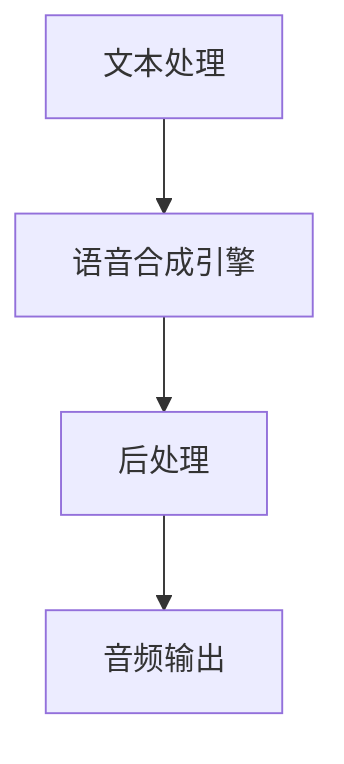

                 

## 文章标题

《科大讯飞2024语音合成优化工程师校招面试经验》

### 关键词

- **科大讯飞**
- **语音合成**
- **校招面试**
- **工程师**
- **优化**
- **技术准备**
- **面试技巧**

### 摘要

本文旨在为即将参加科大讯飞2024年校招的语音合成优化工程师职位求职者提供一份详细的面试经验分享。文章将从面试准备、面试实战、职业发展等多个角度，系统地分析面试过程中的关键要点和技巧。通过本文，读者可以了解到科大讯飞语音合成优化工程师的岗位职责、面试流程、简历撰写、专业知识储备、面试技巧等核心内容，从而提升面试成功率，为职业生涯的起步打下坚实基础。

### 第一部分：校招面试准备

#### 第一部分概述

在当今高速发展的科技时代，语音合成技术作为人工智能领域的重要组成部分，正日益受到各界的广泛关注。作为全球领先的智能语音技术提供商，科大讯飞不仅在语音合成技术方面取得了卓越成就，而且在业界享有极高的声誉。因此，能够进入科大讯飞工作，对于广大求职者尤其是语音合成领域的技术人才而言，无疑是一次难得的职业发展机遇。

本文将围绕科大讯飞2024年校招面试，为求职者提供系统而详实的面试准备和实战经验分享。通过本文，读者将了解到：

1. **面试流程介绍**：包括面试形式、面试时间安排以及面试官特点等，帮助求职者对面试有一个整体的认识和准备。
2. **简历优化与准备**：介绍简历内容结构、撰写技巧以及面试官关注的要点，助力求职者打造一份出色的简历。
3. **专业知识储备**：梳理语音合成的基本概念、语音信号处理和人工智能基础等相关知识，为求职者提供理论支持。
4. **面试技巧**：分享行为面试、技术面试和沟通技巧等方面的经验，帮助求职者提升面试表现。

#### 第一部分：校招面试准备

##### 第1章 面试流程介绍

在正式参加科大讯飞语音合成优化工程师的校招面试前，了解面试流程是非常重要的一步。这不仅有助于求职者提前做好心理准备，还能够帮助求职者更有针对性地进行面试准备。以下是面试流程的详细介绍。

###### 1.1 面试形式

科大讯飞的校招面试通常分为以下几个环节：

1. **在线测评**：在面试前，求职者需要完成一份在线测评，包括逻辑思维、数理分析和编程能力等方面的测试。这一环节主要是对求职者的基本能力进行初步筛选。
2. **电话面试**：通过在线测评的求职者将进入电话面试阶段。电话面试通常由一位面试官进行，主要考察求职者的专业知识、沟通能力和面试官提出的问题解答能力。
3. **现场面试**：电话面试通过的求职者将有机会参加现场面试。现场面试通常包括多轮面试，涵盖技术面试、行为面试和团队面试等。

###### 1.2 面试时间安排

面试的时间安排通常如下：

1. **在线测评**：在线测评通常在面试前一周内完成，时长约为60分钟。
2. **电话面试**：电话面试通常安排在在线测评通过后的1-2周内进行，时长约为30-45分钟。
3. **现场面试**：现场面试通常安排在电话面试通过后的2-3周内进行，时长通常为1-2天。

具体的面试时间将根据求职者的个人安排和科大讯飞的面试计划进行协调。

###### 1.3 面试官特点

科大讯飞的面试官通常具有以下特点：

1. **专业性**：面试官大多是语音合成领域的专业人士，对相关技术有着深入的了解和丰富的实践经验。
2. **严谨性**：面试官在面试过程中通常会提出一些深入而细致的问题，对求职者的回答要求较高。
3. **关注能力**：面试官不仅关注求职者的理论知识，更看重求职者的实际操作能力和解决问题的能力。
4. **亲和力**：尽管面试官在专业方面要求严格，但他们通常也会表现出一定的亲和力，给予求职者足够的支持和鼓励。

通过以上对面试流程的介绍，求职者可以更好地了解面试的形式和内容，从而有针对性地进行准备。在接下来的章节中，我们将进一步探讨简历优化、专业知识储备和面试技巧等内容，帮助求职者在面试中取得优异成绩。

### 简历优化与准备

简历是求职者进入面试环节的敲门砖，一份出色的简历能够有效地吸引面试官的注意力，提高面试成功率。特别是在科大讯飞这样的大公司中，简历的优化与准备显得尤为重要。以下将从简历内容结构、撰写技巧和面试官关注的要点三个方面，详细阐述简历优化的方法和要点。

#### 2.1 简历内容结构

一份优秀的简历应该具备清晰的结构和逻辑，让面试官能够快速获取求职者的关键信息。简历的基本结构通常包括以下几个部分：

1. **个人基本信息**：包括姓名、性别、联系电话、邮箱等基本信息。这部分信息应确保准确无误，以便面试官能够及时与求职者取得联系。

2. **教育背景**：从最高学历开始，依次列出学校的名称、所学专业、学历类型（本科、硕士或博士）以及就读时间。如果求职者在学术研究方面有突出表现，如发表过相关论文或参与过重要项目，可以在这一部分进行简要说明。

3. **工作经历**：依次列出工作单位、所在部门、岗位名称以及工作时间。在描述工作经历时，应重点突出与所申请职位相关的工作内容和成就，特别是涉及语音合成优化方面的项目经历和技术成果。

4. **项目经验**：对于有相关项目经验的求职者，可以单独列出项目名称、项目简介、自己在项目中的角色和贡献等。这一部分是面试官特别关注的，因此应详细描述项目的技术难点、解决方案以及取得的成果。

5. **专业技能**：列出与所申请职位密切相关的专业技能，如编程语言、开发工具、框架等。这部分信息可以帮助面试官快速了解求职者的技术能力。

6. **自我评价**：在简历的结尾，可以简短地总结自己的优势、性格特点以及对未来职业发展的期望。这部分内容应真实、客观，避免夸大其词。

#### 2.2 简历撰写技巧

撰写简历时，需要注意以下几个技巧，以提高简历的质量和吸引力：

1. **简洁明了**：简历应以简洁明了为原则，避免冗长的描述。每个部分的内容应突出重点，避免使用模糊的词汇和空洞的描述。

2. **量化成果**：在描述项目经历和工作成果时，应尽可能使用量化指标来展示自己的成就。例如，可以列出项目提升了多少效率、减少了多少成本等。

3. **关键词突出**：面试官在筛选简历时，会重点关注与职位相关的关键词。求职者应在简历中巧妙地嵌入这些关键词，以提高简历的匹配度。

4. **排版美观**：简历的排版应简洁大方、层次清晰。可以使用适当的字体、字号和颜色来区分不同部分的内容，使简历更具吸引力。

5. **真实可靠**：简历中提供的信息应真实可靠，切勿虚构或夸大。一旦在面试过程中被发现，可能会对求职者的信誉造成严重影响。

#### 2.3 面试官关注的简历要点

在撰写简历时，求职者需要了解面试官关注的核心要点，以便有针对性地进行优化：

1. **专业技能**：面试官会重点查看求职者的专业技能，特别是与所申请职位相关的能力。因此，求职者应确保简历中的专业技能部分内容充实、准确。

2. **项目经验**：面试官非常关注求职者的项目经验，特别是与语音合成优化相关的项目。因此，求职者应详细描述自己在项目中的具体角色和贡献，以及项目取得的成果。

3. **教育背景**：虽然教育背景并不是决定性的因素，但面试官会关注求职者的学术背景和研究成果。特别是对于那些具有硕士或博士学位的求职者，面试官可能会对学术研究方面的成果更加感兴趣。

4. **自我评价**：面试官会通过自我评价部分来了解求职者的自我认知和职业发展目标。因此，求职者应确保自我评价内容真实、客观，并能够展示自己的潜力和动力。

通过以上对简历优化与准备的详细阐述，求职者可以更好地理解简历撰写的方法和要点，从而打造一份出色的简历。在接下来的章节中，我们将继续探讨专业知识储备和面试技巧等方面的内容，帮助求职者全面提升面试表现。

### 专业知识储备

在参加科大讯飞语音合成优化工程师的校招面试前，掌握相关专业知识是至关重要的一步。本文将从语音合成基本概念、语音信号处理和人工智能基础三个方面进行详细阐述，帮助求职者夯实理论基础，为面试做好充分准备。

#### 3.1 语音合成基本概念

语音合成（Text-to-Speech，TTS）是将文本转换为自然流畅的语音的过程。语音合成系统主要由以下几个关键组件构成：

1. **文本处理**：将输入的文本进行预处理，包括分词、语法分析和语音学表示等。这一过程旨在将文本转换为适合语音合成的形式。
   
   ```mermaid
   graph TD
   A[文本输入] --> B[分词]
   B --> C[语法分析]
   C --> D[语音学表示]
   D --> E[语音合成]
   ```

2. **语音合成引擎**：语音合成引擎是语音合成系统的核心，负责根据文本信息生成语音信号。常见的语音合成方法包括拼接合成和参数合成。

   ```mermaid
   graph TD
   A[文本处理] --> B[拼接合成]
   B --> C[参数合成]
   C --> D[语音信号]
   ```

3. **声音生成**：将生成的语音信号通过音频设备播放出来，实现语音合成的最终目的。

   ```mermaid
   graph TD
   A[语音合成引擎] --> B[声音生成]
   ```

#### 3.2 语音信号处理

语音信号处理是语音合成的重要组成部分，涉及到对语音信号的分析和特征提取。以下是语音信号处理的关键概念和步骤：

1. **声音信号分析**：对语音信号进行时域和频域分析，以提取语音特征。常用的分析工具包括短时傅里叶变换（STFT）和梅尔频率倒谱系数（MFCC）。

   ```mermaid
   graph TD
   A[声音信号] --> B[时域分析]
   B --> C[频域分析]
   C --> D[特征提取]
   ```

2. **声音特征提取**：从语音信号中提取出具有区分度的特征，如频率、时长、音高和音强等。这些特征将被用于生成语音信号。

   ```mermaid
   graph TD
   A[声音信号] --> B[频率特征]
   B --> C[时长特征]
   C --> D[音高特征]
   D --> E[音强特征]
   ```

3. **信号处理算法**：基于提取的语音特征，使用信号处理算法进行语音合成。常见的算法包括隐马尔可夫模型（HMM）、高斯混合模型（GMM）和深度神经网络（DNN）。

   ```mermaid
   graph TD
   A[特征提取] --> B[HMM]
   B --> C[GMM]
   C --> D[DNN]
   ```

#### 3.3 人工智能基础

人工智能（AI）在语音合成中的应用，极大地推动了语音合成技术的发展。以下是人工智能在语音合成中的一些基本概念和应用：

1. **机器学习基础**：机器学习是人工智能的核心技术之一，通过训练算法来使计算机具备自主学习和预测能力。常见的机器学习算法包括决策树、支持向量机（SVM）和随机森林等。

   ```mermaid
   graph TD
   A[决策树]
   B[支持向量机]
   C[随机森林]
   ```

2. **深度学习应用**：深度学习是机器学习的一个分支，通过构建深度神经网络来模拟人脑的学习过程。深度学习在语音合成中的应用，如深度神经网络语音合成（DNN-TTS）和循环神经网络（RNN）等，显著提升了语音合成系统的自然度和表现力。

   ```mermaid
   graph TD
   A[深度神经网络]
   B[循环神经网络]
   ```

通过以上对专业知识储备的详细阐述，求职者可以更好地理解语音合成的基本概念、语音信号处理和人工智能基础。这些知识不仅为面试提供了理论支持，也为未来的工作打下了坚实的基础。在接下来的章节中，我们将进一步探讨面试技巧，帮助求职者在面试中脱颖而出。

### 面试技巧

面试是求职过程中的关键环节，良好的面试技巧能够帮助求职者在面试中脱颖而出，提高面试成功率。以下是关于行为面试准备、技术面试准备和沟通技巧的详细讨论，旨在为求职者提供全面的面试技巧指导。

#### 4.1 行为面试准备

行为面试（Behavioral Interview）主要考察求职者在过去工作中面对特定情境时的行为和决策过程。以下是一些准备行为面试的方法：

1. **STAR方法**：STAR方法是指 Situation（情境）、Task（任务）、Action（行动）和 Result（结果）。使用这种方法，求职者可以清晰地描述自己在工作中的经历。

   - **Situation**：描述具体的工作情境或问题。
   - **Task**：说明你被分配的任务或需要解决的问题。
   - **Action**：详细描述你采取的具体行动。
   - **Result**：说明行动的结果以及你在过程中的表现。

   例如，当被问到“请描述一次你如何解决一个团队中的冲突？”时，可以这样回答：

   - **Situation**：在项目开发阶段，团队成员之间因为功能设计分歧产生冲突。
   - **Task**：需要协调团队成员，确保项目按时完成。
   - **Action**：我组织了一次团队会议，听取了不同成员的意见，并提出了折中方案。
   - **Result**：通过沟通和协调，团队成员达成了一致，项目顺利推进。

2. **案例分析**：行为面试中可能会涉及一些实际案例，求职者需要根据案例提供自己的分析和建议。准备这类问题时，可以遵循以下步骤：

   - **理解案例背景**：仔细阅读案例，确保理解问题的本质和关键信息。
   - **分析问题**：识别问题的主要原因，并提出解决方案。
   - **提供具体建议**：针对问题，提供具体的、可操作的解决方案。

   例如，当被问到“假设你是一个项目经理，项目进度落后于计划，你怎么做？”时，可以这样回答：

   - **分析问题**：项目进度落后可能是因为资源分配不合理、任务优先级不明确或者沟通不畅。
   - **建议解决方案**：重新评估资源分配，确保每个任务都有足够的支持；明确任务优先级，确保关键任务优先完成；增加团队沟通频率，确保信息畅通。

#### 4.2 技术面试准备

技术面试主要考察求职者的专业知识、编程能力和解决问题的能力。以下是一些技术面试的准备技巧：

1. **常见算法题解法**：技术面试中，算法题是常见的考察内容。以下是一些常见算法题的解题方法和思路：

   - **排序算法**：如快速排序、归并排序、冒泡排序等。解题时，需要理解算法的基本原理和复杂度分析。
   - **搜索算法**：如深度优先搜索、广度优先搜索、二分查找等。解题时，需要了解算法的实现步骤和适用场景。
   - **动态规划**：如斐波那契数列、最长公共子序列等。解题时，需要理解动态规划的思想和方法。

   例如，对于“最长公共子序列”的问题，可以使用以下伪代码：

   ```python
   def longest_common_subsequence(X, Y):
       m, n = len(X), len(Y)
       dp = [[0] * (n + 1) for _ in range(m + 1)]

       for i in range(1, m + 1):
           for j in range(1, n + 1):
               if X[i - 1] == Y[j - 1]:
                   dp[i][j] = dp[i - 1][j - 1] + 1
               else:
                   dp[i][j] = max(dp[i - 1][j], dp[i][j - 1])

       return dp[m][n]
   ```

2. **代码实现与优化**：在技术面试中，求职者可能需要根据给定的需求实现一个简单的功能，或者优化一个已存在的代码段。以下是一些代码实现和优化的建议：

   - **理解需求**：仔细阅读题目，确保理解需求和技术要求。
   - **编写简洁清晰的代码**：避免冗余代码，确保代码的可读性和可维护性。
   - **考虑性能优化**：分析代码的时间复杂度和空间复杂度，寻找优化空间。

   例如，优化一个简单的冒泡排序算法：

   ```python
   def bubble_sort(arr):
       n = len(arr)
       for i in range(n):
           swapped = False
           for j in range(0, n - i - 1):
               if arr[j] > arr[j + 1]:
                   arr[j], arr[j + 1] = arr[j + 1], arr[j]
                   swapped = True
           if not swapped:
               break
       return arr
   ```

#### 4.3 沟通与表达技巧

良好的沟通与表达技巧在面试中同样至关重要。以下是一些提升沟通与表达技巧的方法：

1. **清晰表达**：在回答问题时，确保表达清晰、准确。可以采用以下技巧：

   - **简洁明了**：避免冗长的陈述，确保每一句话都有明确的含义。
   - **使用逻辑结构**：使用“首先”、“其次”、“最后”等词汇，使回答具有逻辑性。
   - **举例说明**：通过具体的例子来支持观点，使回答更具说服力。

2. **有效沟通**：与面试官保持良好的互动，展示自己的沟通能力和团队合作精神。以下是一些建议：

   - **倾听**：认真倾听面试官的问题，确保理解问题的核心。
   - **积极回应**：对面试官的问题给予积极的回应，表现出自信和热情。
   - **提问**：在合适的时机，向面试官提问，展示自己的求知欲和对职位的兴趣。

通过以上对面试技巧的详细讨论，求职者可以更好地准备面试，提升面试成功率。在面试中，除了展现专业知识和技术能力外，良好的沟通与表达技巧同样重要。希望本文能为求职者的面试准备提供有价值的指导。

### 第二部分：科大讯飞语音合成优化工程师面试实战

在完成充分的面试准备后，求职者进入了科大讯飞语音合成优化工程师的面试环节。面试实战部分是检验求职者专业知识、技术能力和综合素质的重要环节。本文将详细记录面试过程中的问题与解答，以及实际项目经验分享，帮助求职者更好地应对类似面试，提升面试成功率。

#### 5.1 面试问题与解答

科大讯飞语音合成优化工程师的面试主要分为语音合成相关问题和算法相关问题，以下是具体的问题及解答。

##### 5.1.1 语音合成相关

**问题 1：语音合成的工作流程是怎样的？**

**解答：**
语音合成的工作流程主要包括以下几个步骤：

1. **文本处理**：将输入的文本进行分词、句法分析和语调预测等处理，得到文本的语音学表示。
2. **语音合成引擎**：根据文本的语音学表示，使用合成引擎生成语音波形。
3. **后处理**：对合成的语音进行后处理，包括音高、时长和音强的调整，以及语音质量优化等。
4. **音频输出**：将处理后的语音信号输出，通过音频设备播放。

工作流程图示如下：



**问题 2：语音合成中的常见问题有哪些？如何解决？**

**解答：**
语音合成中常见的问题包括：

1. **自然度不高**：解决方案包括提高语音合成引擎的语音库质量、优化语音合成算法等。
2. **语音质量不佳**：可以通过提高音频采样率、使用高质量的语音编码器等方法改善。
3. **发音错误**：可以通过改进分词和语调预测算法，结合语音识别结果进行校正。

**问题 3：你对语音合成中的自然度优化有哪些理解？**

**解答：**
语音合成的自然度优化是提高语音合成系统用户体验的关键。主要可以从以下几个方面进行优化：

1. **语音库丰富度**：增加语音库的词汇量和发音多样性，提高语音的自然度。
2. **语音合成算法**：优化合成算法，如改进合成模型、引入情感表达等。
3. **后处理技术**：使用音高、时长和音强的调整技术，使合成的语音更加自然流畅。

##### 5.1.2 算法相关

**问题 4：如何实现语音合成的音素匹配？**

**解答：**
语音合成的音素匹配是指将文本中的音素与语音库中的音素进行匹配，以生成语音信号。以下是实现音素匹配的一般步骤：

1. **文本预处理**：将文本转换为音素序列，如使用分词和音素标注工具。
2. **语音库索引**：构建语音库索引，记录每个音素的语音波形及其位置。
3. **音素匹配**：采用贪心算法或动态规划算法，对音素序列进行匹配，找到最优的语音波形组合。
4. **波形合成**：将匹配得到的语音波形进行拼接，生成最终的语音信号。

以下是一个简单的贪心算法伪代码：

```python
def greedy_matching(text, phoneme_library):
    current_position = 0
    output_waveform = []

    while current_position < len(text):
        best匹配 = None
        best_score = -1

        for phoneme, waveform in phoneme_library:
            score = calculate_similarity(text[current_position:], phoneme)
            if score > best_score:
                best_score = score
                best匹配 = (phoneme, waveform)

        if best匹配:
            output_waveform.extend(best匹配[1])
            current_position += len(best匹配[0])
        else:
            return None

    return output_waveform
```

**问题 5：解释一下Viterbi算法在语音合成中的作用。**

**解答：**
Viterbi算法是一种用于序列模型的最大后验概率（MAP）估计算法，常用于语音识别和语音合成中的音素匹配。其核心思想是：

1. **状态转移概率**：定义从当前状态转移到下一个状态的概率。
2. **发射概率**：定义在特定状态下输出特定观测值的概率。
3. **边界条件**：定义初始状态的概率。

Viterbi算法通过动态规划计算最优的状态序列，从而实现音素匹配。以下是一个简单的Viterbi算法伪代码：

```python
def viterbi(observations, states, start_prob, transition_prob, emission_prob):
    T = len(observations)
    N = len(states)

    # 初始化前向概率矩阵和路径矩阵
    forward = [[0] * T for _ in range(N)]
    backtrace = [[None] * T for _ in range(N)]

    # 初始化第一个时间步
    for i in range(N):
        forward[i][0] = start_prob[i] * emission_prob[i][observations[0]]

    # 动态规划计算
    for t in range(1, T):
        for i in range(N):
            max_prob = -1
            for j in range(N):
                prob = forward[j][t-1] * transition_prob[j][i] * emission_prob[i][observations[t]]
                if prob > max_prob:
                    max_prob = prob
                    backtrace[i][t] = j

            forward[i][t] = max_prob

    # 计算最优路径
    max_prob = max(forward[-1])
    optimal_path = []
    current_state = argmax(forward[-1])
    optimal_path.append(current_state)

    for t in range(T-1, 0, -1):
        current_state = backtrace[current_state][t]
        optimal_path.append(current_state)

    optimal_path.reverse()
    return optimal_path
```

**问题 6：如何评估语音合成系统的质量？**

**解答：**
评估语音合成系统的质量通常采用以下几种方法：

1. **客观评价指标**：如信噪比（SNR）、语音质量评分（PESQ）、段平均意见分（SMAF）等，通过计算合成语音与参考语音的相似度来评估语音质量。
2. **主观评价方法**：如人类听众评价（主观评分法），通过让听众听辨合成语音与参考语音的差异，给出主观评价。
3. **综合评价方法**：结合客观指标和主观评价，如合成语音的平均意见分（SAR）等，以全面评估语音合成系统的质量。

以下是一个简单的主观评分法流程：

```python
def subjective_evaluation(synthesized_waveform, reference_waveform):
    # 播放合成语音和参考语音
    play_waveform(synthesized_waveform)
    play_waveform(reference_waveform)

    # 获取听众评分
    score = input("请对合成语音的质量进行评分（1-5分）：")
    return float(score)
```

##### 5.1.3 编程题目

**问题 7：实现一个简单的文本转语音的函数。**

**解答：**
以下是一个简单的文本转语音的函数实现，使用Python的`gtts`库和`pydub`库进行文本转语音和音频处理。

```python
from gtts import gTTS
from pydub import AudioSegment

def text_to_speech(text, lang='zh-cn', speed=1.0):
    tts = gTTS(text=text, lang=lang, slow=speed < 1)
    tts.save("output.mp3")

    audio = AudioSegment.from_mp3("output.mp3")
    return audio

text = "你好，科大讯飞语音合成优化工程师面试经验分享。"
audio = text_to_speech(text)
audio.export("output.wav", format="wav")
```

**问题 8：优化一个语音合成的代码段。**

**解答：**
优化语音合成的代码段可以从以下几个方面进行：

1. **减少冗余代码**：删除不必要的代码，如不必要的函数调用和重复的代码段。
2. **提高可读性**：使用更清晰的变量名和注释，提高代码的可读性。
3. **性能优化**：减少计算复杂度，如避免重复计算和优化循环结构。

以下是一个简单的优化示例：

```python
# 原始代码
for i in range(len(arr)):
    for j in range(len(arr[i])):
        sum += arr[i][j]

# 优化后的代码
sum = 0
for row in arr:
    sum += sum(row)
```

#### 5.2 实际项目经验分享

**5.2.1 项目背景与目标**

在科大讯飞语音合成优化工程师的面试中，项目经验是非常重要的考察点。以下是一个实际项目的背景和目标，以及实施过程和成果。

**项目背景：**语音合成系统优化

**项目目标：**优化现有语音合成系统的音质和自然度，提高用户体验。

**实施过程：**

1. **需求分析**：与产品经理和用户进行沟通，了解用户对语音合成系统的需求和痛点，收集用户反馈。
2. **方案设计**：根据需求分析结果，制定语音合成系统优化的技术方案，包括改进语音合成算法、增加语音库丰富度和优化后处理技术等。
3. **实验与测试**：在实验室环境下，对优化方案进行实验和测试，评估优化效果。
4. **实施部署**：将优化方案部署到生产环境中，进行长期观察和评估。

**项目成果与收获：**

1. **音质提升**：通过改进语音合成算法和优化后处理技术，语音合成系统的音质得到了显著提升，用户满意度提高。
2. **自然度优化**：通过增加语音库丰富度和改进合成算法，语音合成的自然度得到了提升，用户反馈良好。
3. **项目经验**：通过实际项目的实施，积累了丰富的项目经验和团队合作经验，提升了技术能力和项目管理能力。

#### 5.3 面试回顾与反思

**5.3.1 面试中的优点与不足**

在面试过程中，求职者可以回顾自己的表现，总结优点与不足，以期为未来的面试提供改进方向。

**优点：**
1. **专业知识扎实**：在面试中，对语音合成的基本概念、算法原理和相关技术有深入的了解，能够清晰地回答问题。
2. **沟通能力良好**：在与面试官的互动中，表达清晰、逻辑严谨，能够有效传达自己的观点和思路。

**不足：**
1. **时间管理不当**：在回答某些问题时，时间控制不当，导致部分问题回答不够详细。
2. **项目经验表述不够具体**：在分享项目经验时，对项目的具体实施细节和成果描述不够详尽，缺乏具体的数据和量化指标。

**5.3.2 如何改进面试表现**

为了在未来的面试中取得更好的成绩，求职者可以从以下几个方面进行改进：

1. **时间管理**：在面试前进行模拟练习，提高时间管理能力，确保每个问题都能有足够的时间进行详细解答。
2. **项目经验准备**：在分享项目经验时，注重具体实施细节和成果展示，使用数据和案例来支持观点。
3. **知识点回顾**：定期复习语音合成和相关领域的知识点，确保对基础概念的熟练掌握。
4. **心态调整**：保持积极的心态，减少紧张情绪，自信地面对面试官。

#### 5.4 面试官反馈与建议

在面试结束后，面试官通常会给予求职者一些反馈和建议。以下是一些建议，供求职者在未来的面试中参考：

1. **加强时间管理**：在回答问题时，注意控制时间，确保每个问题都有充分的解答。
2. **深化专业知识**：加强对语音合成相关算法和技术原理的理解，尤其是最新进展和前沿技术。
3. **注重实践经验**：在项目经验分享中，强调具体实施过程和成果，使用数据和案例来支撑观点。
4. **提升沟通技巧**：在与面试官交流时，注重表达清晰和逻辑性，确保观点能够准确传达。

通过以上对科大讯飞语音合成优化工程师面试实战的详细描述，求职者可以更好地了解面试过程中的关键环节和注意事项，为未来的面试做好准备。希望本文能为求职者在面试中取得优异成绩提供有益的指导。

### 第三部分：语音合成优化工程师职业发展

#### 8.1 职业路径规划

在科大讯飞担任语音合成优化工程师，职业发展路径清晰且富有挑战。以下是对初级、中级和高级工程师成长路径的详细描述：

**初级工程师成长路径**

1. **技术基础**：首先，初级工程师需要扎实掌握语音合成的基本原理和算法，如声学模型、语言模型、音素匹配等。
2. **项目实践**：通过参与实际项目，积累语音合成系统的开发和优化经验。重点关注项目中的技术难题和解决方法，不断提升实战能力。
3. **技能提升**：学习常用的编程语言和开发工具，如Python、C++等，熟悉语音合成框架和工具，如ESPnet、WaveNet等。
4. **知识拓展**：关注语音合成领域的最新研究进展和技术动态，通过阅读论文、参加研讨会等方式，拓宽技术视野。

**中级工程师成长路径**

1. **技术深化**：在中级阶段，工程师需要对语音合成中的关键技术有更深入的理解，如深度学习在语音合成中的应用、语音合成中的自然度优化等。
2. **项目管理**：承担项目中的关键角色，如项目负责人或核心开发人员，负责项目规划、进度控制和团队协作。
3. **创新能力**：提出并实现具有创新性的技术方案，优化语音合成系统的性能和用户体验。
4. **学术研究**：参与学术研究，发表相关论文，提升在领域内的学术影响力。

**高级工程师成长路径**

1. **技术领导**：作为技术团队的核心成员或技术主管，负责技术路线的规划和团队的技术培训与指导。
2. **项目管理**：负责大型项目的总体规划和实施，协调不同团队之间的工作，确保项目按时、高质量完成。
3. **技术决策**：参与公司的技术决策，为公司的发展提供技术方向和策略建议。
4. **行业影响力**：通过参与学术会议、发表高水平论文、参与标准制定等，提升个人和公司在行业中的影响力。

#### 8.2 行业动态与发展趋势

语音合成技术作为人工智能领域的重要分支，正快速发展。以下从语音合成技术的最新进展、行业应用案例和未来发展趋势与挑战三个方面进行概述：

**语音合成技术的最新进展**

1. **深度学习**：深度学习在语音合成中的应用，使得语音合成系统的自然度和语音质量大幅提升。特别是WaveNet、Tacotron等模型的提出和优化，推动了语音合成技术的进步。
2. **多语种支持**：随着全球化的推进，多语种语音合成需求日益增长。目前，许多语音合成系统已实现了多种语言的合成能力，包括低资源语言的合成。
3. **个性化语音合成**：个性化语音合成能够根据用户的偏好和情境生成不同风格和情感的语音，提升用户体验。

**行业应用案例分析**

1. **智能家居**：语音合成技术在智能家居中的应用，如智能音箱、智能机器人等，为用户提供便捷的语音交互体验。
2. **客服系统**：语音合成技术应用于客服系统，能够实现自动语音应答，提高客户服务质量。
3. **教育领域**：语音合成技术在教育领域的应用，如智能语音翻译、辅助教学等，为学习者提供多样化的学习资源。

**未来发展趋势与挑战**

1. **语音合成质量提升**：未来，语音合成技术的目标是实现更加自然、逼真的语音效果，与人类语音难以区分。
2. **多模态交互**：结合语音、文本、图像等多种模态进行交互，提升用户的交互体验。
3. **隐私保护**：语音数据的安全和隐私保护是未来语音合成技术发展的重要挑战，需要采用先进的加密和隐私保护技术。
4. **计算资源优化**：随着语音合成系统的复杂度增加，计算资源的优化是提高系统性能和降低成本的关键。

通过以上对语音合成优化工程师职业发展、行业动态与发展趋势的详细探讨，读者可以更好地了解这一领域的职业前景和发展方向。希望本文能为求职者在语音合成优化领域的职业发展提供有益的指导和参考。

### 总结与展望

通过本文的详细探讨，我们系统地分析了科大讯飞2024年语音合成优化工程师校招面试的准备、面试实战以及职业发展等多个关键环节。以下是对文章内容的总结以及对未来职业规划的展望。

#### 总结

1. **面试准备**：在面试准备阶段，我们详细介绍了面试流程、简历优化、专业知识储备和面试技巧。这些准备工作有助于求职者全面了解面试的形式和内容，提高面试成功率。

2. **面试实战**：在面试实战部分，我们分享了面试过程中的问题与解答、实际项目经验，以及面试官的反馈与建议。这些实战经验为求职者提供了宝贵的面试指导和参考。

3. **职业发展**：通过对语音合成优化工程师职业路径的规划、行业动态与发展趋势的分析，我们帮助读者了解这一领域的职业前景和发展方向，为求职者的未来职业规划提供参考。

#### 展望

1. **持续学习**：随着语音合成技术的不断发展，持续学习新知识和技术是职业发展的关键。求职者应关注领域内的最新研究进展和技术动态，不断提升自己的专业素养。

2. **实践积累**：理论知识是基础，但实践才是检验能力的标准。求职者应积极参与实际项目，积累丰富的项目经验，提升解决实际问题的能力。

3. **软技能提升**：沟通技巧、团队协作能力和项目管理能力在职业发展中同样重要。求职者应注重提升这些软技能，以更好地适应职场环境。

4. **职业拓展**：语音合成技术广泛应用于多个行业，求职者可以考虑跨行业拓展，寻找更多的发展机会。

5. **行业影响力**：通过参与学术会议、发表高水平论文、参与标准制定等方式，提升个人和所在公司的行业影响力，为职业生涯的发展奠定坚实基础。

总之，本文旨在为科大讯飞2024年语音合成优化工程师校招面试的求职者提供全面而实用的指导。希望读者能够结合自身情况，认真准备，勇于实践，在未来的职业发展中取得优异成绩。

### 附录

#### 附录 A：面试资料与工具

1. **常见面试题汇总**：
   - 针对语音合成、算法、编程等常见面试题，进行分类整理和解答。
   - 包括但不限于文本转语音、音素匹配、算法优化等方面的问题。

2. **简历模板**：
   - 提供一份标准化的简历模板，包括个人基本信息、教育背景、工作经历、项目经验和专业技能等部分。
   - 模板设计简洁、美观，易于填充和修改。

3. **面试准备资料**：
   - 收集语音合成、语音信号处理和人工智能等领域的经典教材、论文和技术文档，供求职者进行深入学习。
   - 提供一些实用的在线资源，如编程练习平台、算法教程和技术博客等。

#### 附录 B：语音合成优化工程师常用工具与资源

1. **语音合成相关框架**：
   - ESPnet：一个开源的端到端语音合成框架，支持多种深度学习模型。
   - Tacotron 2、WaveNet等：知名的开源语音合成框架，提供丰富的模型和工具。

2. **语音处理工具**：
   - Librosa：用于音频和语音处理的Python库，提供丰富的音频分析功能。
   - Kaldi：一个用于语音识别的开源工具包，也可用于语音合成相关的预处理和后处理。

3. **在线资源推荐**：
   - Coursera、edX等在线教育平台：提供语音合成和人工智能相关的在线课程。
   - ArXiv：最新的学术论文和研究成果，涵盖语音合成和人工智能领域的最新进展。
   - GitHub：开源项目的代码库，可以查阅和学习其他优秀项目的实现细节。

通过附录中提供的面试资料和工具，求职者可以更加系统地准备面试，提升自己在语音合成优化工程师岗位的竞争力。希望这些资源能为求职者的职业发展之路提供有力的支持。

