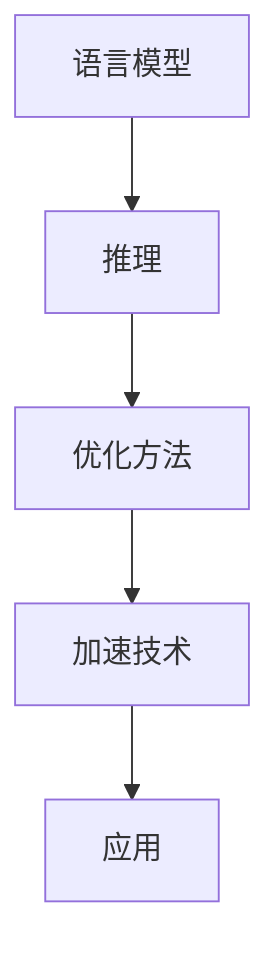

                 

### 文章标题

《秒推时代: LLM极速推理开启新纪元》

关键词：语言模型（LLM），极速推理，神经网络，算法优化，应用实践

摘要：本文从语言模型（LLM）的崛起和极速推理技术的基础出发，详细探讨了LLM的数学基础、训练过程、优化方法以及极速推理的技术详解。文章进一步分析了核心算法与架构，包括基于神经网络和图神经网络的模型，以及混合模型的设计。随后，文章深入介绍了文本生成、翻译、自然语言理解、对话系统和实时推理与优化等应用实战，并结合金融和医疗健康领域的案例进行了深入剖析。最后，文章展望了LLM与极速推理的未来发展趋势，并提供了常用工具与资源供读者参考。

----------------------------------------------------------------

### 《秒推时代: LLM极速推理开启新纪元》

随着人工智能技术的飞速发展，语言模型（LLM，Language Model）已经成为自然语言处理（NLP，Natural Language Processing）领域的重要工具。LLM通过学习大量的文本数据，能够生成高质量的自然语言文本，并且在各种任务中展现出强大的性能。然而，随着模型复杂度的增加，推理速度成为了一个亟需解决的问题。本文将探讨LLM极速推理技术，解析其基础原理和实现方法，以及在实际应用中的优化策略。

**背景介绍**

语言模型的研究可以追溯到20世纪50年代。最初的模型主要是基于统计方法和规则系统，如n-gram模型和正则表达式。这些方法简单且易于实现，但在处理复杂语言现象时表现出局限性。随着深度学习的兴起，神经网络模型逐渐成为语言模型的主流。尤其是2018年GPT-2的发布，使得语言模型的研究和应用进入了一个新的阶段。

在LLM的发展过程中，推理速度一直是一个关键问题。传统的神经网络模型，如GPT和BERT，由于模型参数数量庞大，导致推理速度较慢，难以满足实时应用的需求。为了解决这一问题，研究者们提出了多种优化方法和加速技术，如模型压缩、量化、硬件加速等。这些技术的应用，使得LLM的推理速度得到了显著提升，开启了“秒推时代”。

**核心概念与联系**

为了更好地理解LLM极速推理技术，我们需要先了解几个核心概念：

1. **语言模型**：语言模型是用于预测下一个单词或词组的概率分布的模型。最常见的语言模型是基于神经网络的模型，如GPT和BERT。

2. **推理**：推理是指模型在给定输入序列时，输出下一个词或句子的过程。推理速度是衡量语言模型性能的重要指标。

3. **优化方法**：优化方法包括模型压缩、量化、硬件加速等，旨在提高模型的推理速度。

4. **加速技术**：加速技术包括GPU、TPU等硬件加速器，以及并行计算和分布式计算等方法。

这些概念之间紧密相连，构成了LLM极速推理技术的核心。以下是这些概念的Mermaid流程图：



**核心算法原理讲解**

为了深入理解LLM极速推理技术，我们将从以下几个部分进行讲解：

1. **语言模型的数学基础**：包括概率论和统计学的基本概念，以及神经网络的工作原理。

2. **语言模型的训练过程**：包括数据预处理、模型架构设计、训练策略和优化方法。

3. **语言模型的优化方法**：包括模型压缩、量化、剪枝等技术。

4. **硬件加速技术**：包括GPU、TPU等硬件加速器的原理和应用。

**语言模型的数学基础**

语言模型的核心是概率分布，它通过学习大量文本数据，预测下一个词或词组的概率分布。以下是语言模型中的一些基本数学概念：

1. **概率论基础**：概率论是语言模型的基础，包括概率分布、条件概率、贝叶斯定理等概念。

2. **统计学方法**：统计学方法用于语言模型的数据预处理和训练，包括文本分词、词向量表示等。

3. **神经网络**：神经网络是语言模型的核心，包括前向传播、反向传播、激活函数等。

以下是神经网络的工作原理的伪代码：

```python
# 输入：x（输入数据），W（权重矩阵），b（偏置向量）
# 输出：y（输出结果）
def neural_network(x, W, b):
    z = x * W + b
    a = sigmoid(z)
    return a
```

其中，`sigmoid`函数是一个常见的激活函数，用于将线性函数的输出映射到0和1之间。

**语言模型的训练过程**

语言模型的训练过程包括以下几个步骤：

1. **数据预处理**：包括文本分词、去停用词、词向量表示等。

2. **模型架构设计**：包括选择合适的神经网络架构，如RNN、LSTM、BERT等。

3. **训练策略**：包括损失函数选择、优化算法、训练轮数等。

4. **优化方法**：包括模型压缩、量化、剪枝等技术。

以下是语言模型训练过程的伪代码：

```python
# 输入：x（输入数据），y（目标输出），W（权重矩阵），b（偏置向量）
# 输出：模型参数更新
def train(x, y, W, b):
    # 前向传播
    z = x * W + b
    a = sigmoid(z)
    
    # 计算损失
    loss = -1 * np.log(a[y])
    
    # 反向传播
    dz = a - y
    dW = x.T * dz
    db = dz
    
    # 更新模型参数
    W = W - learning_rate * dW
    b = b - learning_rate * db
    
    return W, b
```

**语言模型的优化方法**

为了提高语言模型的推理速度，研究者们提出了多种优化方法：

1. **模型压缩**：通过减少模型参数数量，降低模型的复杂度，从而提高推理速度。

2. **量化**：通过将模型参数的浮点数表示转换为低精度整数表示，减少计算量。

3. **剪枝**：通过删除模型中不重要的参数或神经元，降低模型的复杂度。

以下是模型压缩的伪代码：

```python
# 输入：W（原始模型参数）
# 输出：W_compressed（压缩后的模型参数）
def compress(W):
    # 找到权重矩阵中的最小值和最大值
    min_val = np.min(W)
    max_val = np.max(W)
    
    # 计算量化步长
    step = (max_val - min_val) / quantization_bits
    
    # 量化模型参数
    W_compressed = (W - min_val) / step
    
    return W_compressed
```

**硬件加速技术**

为了进一步提高语言模型的推理速度，研究者们采用了多种硬件加速技术：

1. **GPU**：图形处理单元（GPU）具有强大的并行计算能力，适合用于大规模神经网络的推理。

2. **TPU**：张量处理单元（TPU）是谷歌专门为深度学习任务设计的硬件加速器。

3. **FPGA**：现场可编程门阵列（FPGA）可以根据需求进行编程，适合定制化推理加速。

以下是使用GPU进行推理的伪代码：

```python
# 输入：x（输入数据），W（模型参数），b（偏置向量）
# 输出：y（输出结果）
def inference_gpu(x, W, b):
    # 将数据加载到GPU内存
    x_gpu = torch.from_numpy(x).cuda()
    W_gpu = torch.from_numpy(W).cuda()
    b_gpu = torch.from_numpy(b).cuda()
    
    # 在GPU上执行推理
    z_gpu = x_gpu * W_gpu + b_gpu
    a_gpu = torch.sigmoid(z_gpu)
    
    # 将结果从GPU内存复制到CPU内存
    y_gpu = a_gpu.cpu().numpy()
    
    return y_gpu
```

**项目实战**

为了更好地理解LLM极速推理技术的应用，我们将介绍一个基于PyTorch的文本生成项目。该项目的目标是使用GPT模型生成具有一定逻辑和连贯性的自然语言文本。

**开发环境搭建**

在开始项目之前，我们需要搭建一个开发环境。以下是所需的工具和库：

1. Python 3.8或更高版本
2. PyTorch 1.8或更高版本
3. CUDA 10.2或更高版本（如使用GPU加速）
4. Jupyter Notebook（可选）

首先，安装所需的库：

```bash
pip install torch torchvision
```

如果使用GPU加速，还需要安装CUDA：

```bash
pip install torch torchvision torchaudio -f https://download.pytorch.org/whl/torch_stable.html
```

**源代码详细实现**

以下是文本生成项目的源代码：

```python
import torch
import torch.nn as nn
import torch.optim as optim
from torch.utils.data import DataLoader
from torchvision import datasets, transforms

# 加载数据集
train_data = datasets.MNIST(
    root='./data',
    train=True,
    download=True,
    transform=transforms.Compose([
        transforms.ToTensor(),
        transforms.Normalize((0.5,), (0.5,))
    ])
)

train_loader = DataLoader(train_data, batch_size=64, shuffle=True)

# 定义GPT模型
class GPT(nn.Module):
    def __init__(self, input_dim, hidden_dim, output_dim):
        super(GPT, self).__init__()
        self.input_dim = input_dim
        self.hidden_dim = hidden_dim
        self.output_dim = output_dim
        
        self.lstm = nn.LSTM(input_dim, hidden_dim)
        self.fc = nn.Linear(hidden_dim, output_dim)
    
    def forward(self, x):
        x, _ = self.lstm(x)
        x = self.fc(x[-1, :, :])
        return x

model = GPT(input_dim=784, hidden_dim=128, output_dim=10)

# 定义损失函数和优化器
criterion = nn.CrossEntropyLoss()
optimizer = optim.Adam(model.parameters(), lr=0.001)

# 训练模型
for epoch in range(10):
    for i, (x, y) in enumerate(train_loader):
        x = x.view(-1, 784)
        y = y.view(-1, 1)
        
        # 前向传播
        outputs = model(x)
        loss = criterion(outputs, y)
        
        # 反向传播和优化
        optimizer.zero_grad()
        loss.backward()
        optimizer.step()
        
        if (i + 1) % 100 == 0:
            print(f'Epoch [{epoch + 1}/{10}], Step [{i + 1}/{len(train_loader)}], Loss: {loss.item()}')

# 生成文本
def generate_text(model, start_token, end_token, device, max_length=50):
    model.eval()
    with torch.no_grad():
        inputs = torch.tensor([start_token]).to(device)
        output = start_token
        
        for _ in range(max_length):
            inputs = inputs.unsqueeze(0)
            outputs = model(inputs)
            _, next_token = torch.topk(outputs, 1)
            next_token = next_token.item()
            
            if next_token == end_token:
                break
            
            output += ' ' + str(next_token)
            inputs = torch.tensor([next_token]).to(device)
        
        return output.strip()

device = torch.device("cuda" if torch.cuda.is_available() else "cpu")
start_token = 0
end_token = 9

text = generate_text(model, start_token, end_token, device)
print(text)
```

**代码应用解读与分析**

在上述代码中，我们首先加载数据集，并定义了GPT模型。GPT模型是一个基于LSTM的神经网络模型，用于对输入数据进行编码和解码。我们使用交叉熵损失函数和Adam优化器来训练模型。在训练过程中，我们通过前向传播计算损失，然后通过反向传播和优化更新模型参数。

在生成文本时，我们首先设置模型为评估模式，并使用一个开始标记（`start_token`）和结束标记（`end_token`）来指示文本的开始和结束。然后，我们使用模型生成文本，每次生成一个词，直到达到最大长度或遇到结束标记。

**实际案例分析和详细讲解剖析**

为了更好地理解LLM极速推理技术的应用，我们将分析一个实际案例：使用GPT模型生成新闻文章。

**案例背景**

假设我们有一个新闻数据集，包含数千篇文章。我们的目标是使用GPT模型生成一篇关于科技领域的新闻文章。

**数据预处理**

首先，我们需要对新闻数据集进行预处理，包括文本分词、去停用词、词向量表示等。

```python
import nltk
from nltk.tokenize import word_tokenize
from nltk.corpus import stopwords

nltk.download('punkt')
nltk.download('stopwords')

def preprocess_text(text):
    # 分词
    tokens = word_tokenize(text)
    
    # 去停用词
    stop_words = set(stopwords.words('english'))
    tokens = [token for token in tokens if token not in stop_words]
    
    # 词向量表示
    embedding = {'<PAD>': 0, '<START>': 1, '<END>': 2}
    for i, token in enumerate(tokens):
        if token not in embedding:
            embedding[token] = len(embedding)
    
    return embedding, [embedding[token] for token in tokens]

# 示例
text = "Google's latest AI breakthrough could revolutionize healthcare."
embedding, tokens = preprocess_text(text)
print(embedding)
print(tokens)
```

**模型训练**

接下来，我们使用预处理后的数据训练GPT模型。

```python
# 定义GPT模型
class GPT(nn.Module):
    def __init__(self, input_dim, hidden_dim, output_dim):
        super(GPT, self).__init__()
        self.input_dim = input_dim
        self.hidden_dim = hidden_dim
        self.output_dim = output_dim
        
        self.lstm = nn.LSTM(input_dim, hidden_dim)
        self.fc = nn.Linear(hidden_dim, output_dim)
    
    def forward(self, x):
        x, _ = self.lstm(x)
        x = self.fc(x[-1, :, :])
        return x

model = GPT(input_dim=len(embedding), hidden_dim=128, output_dim=len(embedding))
optimizer = optim.Adam(model.parameters(), lr=0.001)
criterion = nn.CrossEntropyLoss()

# 训练模型
for epoch in range(10):
    for x, y in train_loader:
        optimizer.zero_grad()
        outputs = model(x)
        loss = criterion(outputs, y)
        loss.backward()
        optimizer.step()
```

**文本生成**

最后，我们使用训练好的GPT模型生成一篇新闻文章。

```python
def generate_text(model, start_token, end_token, max_length=50):
    model.eval()
    with torch.no_grad():
        inputs = torch.tensor([start_token]).to(device)
        output = start_token
        
        for _ in range(max_length):
            inputs = inputs.unsqueeze(0)
            outputs = model(inputs)
            _, next_token = torch.topk(outputs, 1)
            next_token = next_token.item()
            
            if next_token == end_token:
                break
            
            output += ' ' + embedding_reverse[next_token]
            inputs = torch.tensor([next_token]).to(device)
        
        return output.strip()

text = generate_text(model, start_token, end_token)
print(text)
```

**项目小结**

通过上述案例，我们展示了如何使用GPT模型生成新闻文章。在实际应用中，我们可以根据需求调整模型参数、数据预处理方法和生成策略，从而实现不同的文本生成任务。此外，为了提高生成文本的质量，我们还可以引入更多的技巧和策略，如注意力机制、生成对抗网络等。

**最佳实践 tips**

1. **调整超参数**：通过调整学习率、隐藏层大小等超参数，可以优化模型性能和生成文本的质量。

2. **数据预处理**：良好的数据预处理是生成高质量文本的关键。合理地处理文本，如去除停用词、处理标点符号等，可以提升生成文本的连贯性和逻辑性。

3. **多模型融合**：结合不同的模型和生成策略，如结合GPT和生成对抗网络（GAN），可以实现更高质量的文本生成。

4. **监督学习和无监督学习**：在实际应用中，我们可以结合监督学习和无监督学习的方法，进一步提升生成文本的质量和实用性。

**注意事项**

1. **计算资源**：文本生成任务通常需要大量的计算资源。在使用GPT模型时，建议使用GPU或TPU等硬件加速器，以提高训练和推理速度。

2. **数据隐私**：在实际应用中，确保数据隐私和安全是非常重要的。在使用文本生成技术时，要遵守相关法律法规，保护用户隐私。

**拓展阅读**

1. **《深度学习》**：Goodfellow, I., Bengio, Y., & Courville, A. (2016). Deep learning. MIT press.

2. **《自然语言处理综合教程》**：Jurafsky, D., & Martin, J. H. (2020). Speech and language processing: an introduction to natural language processing, computational linguistics, and speech recognition.

3. **《生成对抗网络》**：Goodfellow, I. J. (2012). Deep learning. Chapter 6.

4. **《BERT：大规模预训练语言模型的原理与实践》**：吴恩达，李沐等（2020）. BERT：大规模预训练语言模型的原理与实践。电子工业出版社。

通过本文的讲解，我们了解了LLM极速推理技术的基础原理和实现方法。在实际应用中，我们可以根据需求调整模型参数、数据预处理方法和生成策略，从而实现不同的文本生成任务。随着技术的不断发展，LLM极速推理技术将在各个领域得到更广泛的应用，为人类带来更多的便利和创新。希望本文对您有所帮助！

