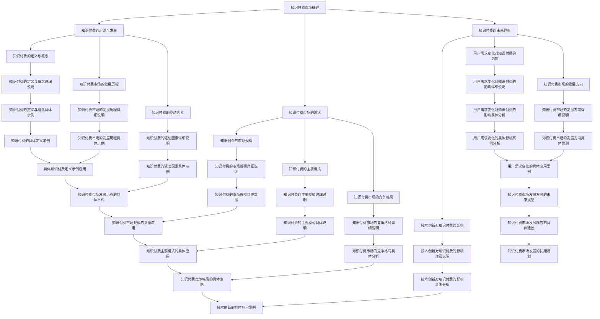

                 

### 文章标题

# 《程序员利用知识付费打造个人影响力》

### 关键词

- 知识付费
- 个人影响力
- 程序员
- 专业形象
- 社交媒体运营
- 个人品牌建设

### 摘要

在数字化时代，知识付费成为了一种重要的知识传播和商业变现模式。本文旨在探讨程序员如何通过知识付费这一途径，打造个人影响力。文章首先概述了知识付费市场的起源、现状和未来趋势，接着分析了个人影响力的重要性，探讨了如何建立专业形象、运营社交媒体、建设个人品牌以及实现影响力变现。通过具体案例分析和实操指南，为程序员提供了一条实际可行的个人影响力打造路径。

## 第一部分：知识付费市场概述

### 1.1 知识付费的起源与发展

#### 1.1.1 知识付费的定义与概念

知识付费，是指消费者为获取高质量的知识内容或服务而支付的费用。这一模式的出现，源于信息爆炸的时代背景下，用户对专业化、个性化知识的强烈需求。知识付费不仅包括在线教育、专业课程，还包括咨询、研究报告、付费问答等多种形式。

#### 1.1.2 知识付费市场的发展历程

知识付费的发展历程可以分为三个阶段：

1. **萌芽期**（2010-2013年）：以公开课和在线教育平台为代表，如Coursera、edX等。
2. **发展期**（2014-2016年）：以罗辑思维、得到为代表的付费内容平台崛起，推动了知识付费的普及。
3. **成熟期**（2017年至今）：知识付费市场逐渐成熟，多样化的知识付费产品和服务不断涌现，市场格局也日趋稳定。

#### 1.1.3 知识付费的驱动因素

知识付费的快速发展，主要受到以下几个因素的驱动：

1. **技术进步**：移动互联网和大数据技术的发展，为知识付费提供了便捷的支付和分发渠道。
2. **用户需求**：随着用户对专业化、个性化知识的追求，知识付费市场应运而生。
3. **商业模式**：知识付费作为一种新兴的商业模式，具有高毛利、高复购率的特点，吸引了大量资本和创业者的关注。

### 1.2 知识付费市场的现状

#### 1.2.1 知识付费的市场规模

根据相关数据显示，中国知识付费市场在2020年已经达到了1561亿元，预计2023年将达到2968亿元。知识付费市场的快速增长，表明了用户对于付费知识的强烈需求。

#### 1.2.2 知识付费的主要模式

目前，知识付费市场的主要模式包括：

1. **订阅模式**：用户支付一定费用，获得长期的知识服务。
2. **课程模式**：用户按需购买课程，完成学习后获得相应证书。
3. **咨询模式**：用户向专家支付费用，获得一对一的专业咨询服务。
4. **内容付费**：用户购买专业文章、报告、书籍等。

#### 1.2.3 知识付费市场的竞争格局

知识付费市场呈现出高度分散的竞争格局，主要玩家包括传统的在线教育平台、新兴的知识付费平台、自媒体创作者等。其中，头部平台占据大部分市场份额，但新进入者依然有机会通过细分市场、专业内容等途径获取用户。

### 1.3 知识付费的未来趋势

#### 1.3.1 技术创新对知识付费的影响

未来，技术创新将继续推动知识付费的发展。人工智能、大数据、区块链等技术的应用，将提升知识付费产品的质量和用户体验，同时，也为创作者提供了新的商业模式。

1. **人工智能**：通过算法推荐，为用户精准匹配知识内容。
2. **大数据**：分析用户行为，优化内容生产和推荐策略。
3. **区块链**：确保知识内容的真实性、可追溯性，提升用户信任度。

#### 1.3.2 用户需求变化对知识付费的影响

随着用户对知识的追求越来越专业化、个性化，知识付费市场将更加细分。用户需求的多样化，将推动知识付费产品和服务不断创新。

1. **垂直领域**：知识付费将更加聚焦于专业领域，如医疗、法律、金融等。
2. **个性化服务**：提供一对一的定制化服务，满足用户个性化需求。

#### 1.3.3 知识付费市场的发展方向

未来，知识付费市场的发展方向包括：

1. **生态化**：形成完整的知识付费生态，涵盖内容生产、分发、变现等多个环节。
2. **国际化**：随着中国市场的成熟，知识付费产品将逐步走向国际市场。
3. **综合化**：知识付费将与更多行业相结合，如电商、旅游等，提供一站式服务。

## 第二部分：个人影响力打造

### 2.1 个人影响力的重要性

#### 2.1.1 个人影响力的定义与作用

个人影响力，是指个人通过言行、知识和能力，影响他人思想和行为的能力。在知识付费市场中，个人影响力具有重要的意义：

1. **增强信任**：有影响力的个人能够提升用户对知识产品或服务的信任度。
2. **降低传播成本**：个人影响力能够降低知识传播的难度和成本。
3. **提高变现能力**：个人影响力直接影响知识付费产品的销售和转化率。

#### 2.1.2 影响力在知识付费市场中的价值

在知识付费市场中，个人影响力具有以下价值：

1. **品牌价值**：个人影响力可以转化为品牌价值，提升产品的市场竞争力和附加值。
2. **用户黏性**：个人影响力能够增强用户对知识付费产品的忠诚度和依赖度。
3. **商业变现**：个人影响力可以为创作者带来直接的商业收益，如课程销售、咨询费等。

#### 2.1.3 个人影响力打造的目标和策略

个人影响力打造的目标是成为某一领域的专家或意见领袖，具体策略包括：

1. **专业知识的积累**：不断学习和提升专业能力，建立专业形象。
2. **社交媒体运营**：通过社交媒体扩大影响力，提升知名度。
3. **个人品牌建设**：塑造独特个人品牌，增强用户认同感。
4. **影响力变现**：通过知识付费、咨询等多种方式实现商业变现。

### 2.2 建立专业形象

#### 2.2.1 专业知识的积累

建立专业形象，首先需要具备扎实的专业知识。程序员可以通过以下途径积累专业知识：

1. **持续学习**：关注行业动态，不断学习新技术、新概念。
2. **项目实践**：参与实际项目，提升实践能力。
3. **技术交流**：参加技术会议、研讨会，与同行交流经验。

#### 2.2.2 专业形象的塑造

塑造专业形象，需要通过多种方式展示专业能力：

1. **技术博客**：撰写高质量的技术博客，分享技术见解和经验。
2. **开源项目**：参与开源项目，贡献代码，提升知名度。
3. **技术讲座**：在线或线下举办技术讲座，展示专业能力。

#### 2.2.3 专业形象的传播

传播专业形象，需要借助多种渠道扩大影响力：

1. **社交媒体**：利用微博、知乎、微信公众号等社交媒体，发布专业内容。
2. **技术社区**：在CSDN、掘金、V2EX等技术社区活跃，参与讨论。
3. **线上课程**：开设线上课程，传授专业知识。

### 2.3 社交媒体运营

#### 2.3.1 社交媒体的选型和定位

选择适合的社交媒体平台，并根据个人特点和目标进行定位，是运营成功的关键。程序员可以选择以下平台：

1. **微博**：适合发布实时动态和进行互动。
2. **知乎**：适合分享专业知识和解答问题。
3. **微信公众号**：适合发布深度文章和构建个人品牌。

#### 2.3.2 社交媒体内容策划与发布

内容策划与发布是社交媒体运营的核心。程序员应该注意以下几点：

1. **内容质量**：保证内容的专业性和原创性。
2. **更新频率**：保持一定的更新频率，保持用户粘性。
3. **互动互动**：积极与用户互动，提升用户参与度。

#### 2.3.3 社交媒体互动与粉丝关系维护

互动与粉丝关系维护是社交媒体运营的重要组成部分：

1. **回复评论**：及时回复用户的评论和提问。
2. **举办活动**：通过举办线上或线下活动，增强粉丝互动。
3. **福利赠送**：定期推出福利活动，如优惠券、免费课程等，提升粉丝忠诚度。

### 2.4 个人品牌建设

#### 2.4.1 个人品牌的定义与核心要素

个人品牌，是指个人在公众心目中的形象和认知。个人品牌的核心要素包括：

1. **专业知识**：个人在某一领域的专业能力和成就。
2. **个性特点**：个人的独特性格和风格。
3. **价值观**：个人的价值观和信念。

#### 2.4.2 个人品牌的价值评估

个人品牌的价值可以从以下几个方面进行评估：

1. **知名度**：个人在公众中的知名度。
2. **影响力**：个人对他人思想和行为的实际影响。
3. **商业价值**：个人品牌带来的商业收益。

#### 2.4.3 个人品牌的推广与维护

个人品牌的推广与维护是一个持续的过程，需要从以下几个方面进行：

1. **专业内容发布**：持续发布高质量的专业内容，提升品牌知名度。
2. **社交媒体运营**：通过社交媒体扩大影响力，提升品牌认知度。
3. **活动参与**：参与行业活动和论坛，提升品牌曝光度。
4. **用户互动**：积极与用户互动，维护品牌形象。

### 2.5 影响力变现

#### 2.5.1 影响力变现的渠道和方式

程序员可以通过以下渠道和方式实现影响力变现：

1. **知识付费**：开设线上课程、撰写技术书籍、提供咨询服务等。
2. **广告合作**：与相关企业进行广告合作，如推广产品或服务。
3. **内容付费**：通过微信公众号、知乎等平台，发布付费内容。

#### 2.5.2 知识付费产品设计与推广

知识付费产品的设计与推广需要注意以下几点：

1. **产品定位**：明确产品定位，满足用户需求。
2. **内容质量**：保证内容的专业性和实用性。
3. **推广策略**：通过社交媒体、SEO优化等手段，提高产品曝光度。

#### 2.5.3 线上线下活动策划与执行

线上线下活动是提升个人影响力的重要手段，策划与执行需要注意以下几点：

1. **活动主题**：明确活动主题，吸引目标用户。
2. **宣传推广**：通过社交媒体、邮件等渠道，提前宣传活动。
3. **现场组织**：确保活动顺利进行，提升用户体验。

## 第三部分：案例分析

### 3.1 成功案例分析

#### 3.1.1 案例一：某程序员通过知识付费打造个人影响力的经历

某程序员通过开设线上课程、撰写技术书籍和提供咨询服务，成功打造了个人影响力。以下是他的具体经历：

1. **课程开发**：程序员在某知名在线教育平台开设了《高级Python编程》课程，通过详细讲解Python在数据处理、网络编程等方面的应用，吸引了大量学生。
2. **书籍出版**：程序员还撰写了《Python数据处理实战》一书，分享了他在实际项目中积累的经验和技巧，该书在市场上获得了很高的评价。
3. **咨询服务**：程序员提供一对一的咨询服务，为企业和个人解决技术难题，积累了良好的口碑。

#### 3.1.2 案例二：某技术博主通过知识付费实现财富自由的案例

某技术博主通过微信公众号和知乎专栏，发布高质量的技术文章，吸引了大量粉丝。随后，他推出了付费内容，实现了财富自由。以下是他的具体经历：

1. **内容创作**：技术博主定期发布关于编程、算法和数据结构的高质量文章，吸引了大量读者。
2. **付费内容**：博主在微信公众号和知乎专栏开设了付费专栏，分享他多年积累的技术经验和心得，吸引了大量粉丝订阅。
3. **广告合作**：博主还与相关企业进行广告合作，实现了广告收入。

#### 3.1.3 案例三：某技术公司通过知识付费拓展市场的成功实践

某技术公司通过知识付费，成功拓展了市场。以下是他们的具体实践：

1. **内部培训**：公司定期为员工提供技术培训，提高员工技能水平。
2. **公开课程**：公司在外部开设了公开课程，面向社会各界，推广公司技术实力。
3. **咨询服务**：公司提供专业的技术咨询服务，为企业解决技术难题，扩大市场份额。

### 3.2 失败案例分析

#### 3.2.1 案例一：某程序员因忽视用户需求导致知识付费项目失败的教训

某程序员在知识付费领域进行了尝试，但由于忽视用户需求，导致项目失败。以下是他的教训：

1. **内容质量不高**：程序员发布的课程内容质量不高，缺乏实用性和深度。
2. **缺乏互动**：程序员没有与用户进行充分的互动，不了解用户需求和反馈。
3. **市场定位不清**：程序员没有明确市场定位，导致目标用户不明确。

#### 3.2.2 案例二：某技术博主因内容质量低下失去粉丝的案例

某技术博主在初期积累了大量粉丝，但由于内容质量低下，最终失去了粉丝。以下是他的教训：

1. **抄袭他人内容**：博主没有原创内容，而是抄袭他人的文章。
2. **内容缺乏深度**：博主的文章缺乏深度，无法解决读者的实际问题。
3. **互动不足**：博主没有与粉丝进行有效互动，无法满足粉丝的需求。

#### 3.2.3 案例三：某技术公司因定位不清导致知识付费项目失败的反思

某技术公司试图通过知识付费拓展市场，但由于定位不清，导致项目失败。以下是他们的反思：

1. **产品定位不明确**：公司没有明确目标市场和产品定位，导致产品无法满足用户需求。
2. **内容质量不高**：公司的课程内容质量不高，缺乏专业性和实用性。
3. **推广不足**：公司没有进行有效的市场推广，导致用户数量有限。

### 3.3 案例分析与启示

#### 3.3.1 成功案例分析中的共同点与可借鉴经验

成功案例中的共同点包括：

1. **专业知识的积累**：成功者都具备扎实的专业知识，能够提供高质量的知识产品。
2. **用户需求的满足**：成功者能够深入了解用户需求，提供满足用户需求的知识产品。
3. **有效的推广策略**：成功者都采用了有效的推广策略，扩大了个人影响力。

可借鉴的经验包括：

1. **持续学习**：不断学习和提升专业能力，建立专业形象。
2. **内容原创**：保证内容的原创性和实用性，提升用户满意度。
3. **互动互动**：与用户保持互动，了解用户需求和反馈。

#### 3.3.2 失败案例分析中的问题与改进措施

失败案例中的问题包括：

1. **内容质量不高**：缺乏深度和实用性，无法满足用户需求。
2. **缺乏互动**：无法了解用户需求，导致产品不符合用户期望。
3. **市场定位不清**：目标用户不明确，产品定位不明确。

改进措施包括：

1. **提高内容质量**：加强内容创作，确保内容的深度和实用性。
2. **加强互动**：与用户保持互动，了解用户需求和反馈。
3. **明确市场定位**：明确目标市场和产品定位，提供满足用户需求的知识产品。

#### 3.3.3 个人影响力打造中的关键因素与应对策略

个人影响力打造中的关键因素包括：

1. **专业知识的积累**：专业知识的深度和广度。
2. **用户需求的满足**：对用户需求的深入了解和满足。
3. **品牌形象的塑造**：个人品牌的专业性和可信度。

应对策略包括：

1. **持续学习**：不断学习和提升专业能力。
2. **用户调研**：进行用户调研，了解用户需求。
3. **品牌建设**：塑造专业、可信的个人品牌形象。

## 第四部分：实操指南

### 4.1 个人影响力打造的实操步骤

#### 4.1.1 专业知识的积累与提升

1. **学习资源的选择**：选择权威的学习资源，如专业书籍、在线课程、学术论文等。
2. **学习计划的制定**：制定详细的学习计划，确保学习效果。
3. **实践应用**：将所学知识应用于实际项目中，提升实践能力。

#### 4.1.2 社交媒体运营策略

1. **平台选择**：根据个人特点和目标，选择合适的社交媒体平台。
2. **内容策划**：制定内容策划方案，确保内容的质量和更新频率。
3. **互动互动**：积极与用户互动，提升用户参与度。

#### 4.1.3 个人品牌建设与推广

1. **品牌定位**：明确个人品牌的定位，确保品牌形象的专业性和可信度。
2. **品牌传播**：通过社交媒体、线下活动等途径，推广个人品牌。
3. **用户互动**：积极与用户互动，维护品牌形象。

#### 4.1.4 影响力变现策略

1. **知识付费**：开设线上课程、撰写技术书籍、提供咨询服务等。
2. **广告合作**：与相关企业进行广告合作，实现商业变现。
3. **内容付费**：通过微信公众号、知乎等平台，发布付费内容。

### 4.2 知识付费产品开发与推广

#### 4.2.1 知识付费产品的设计原则

1. **用户需求导向**：产品设计应满足用户需求，解决用户实际问题。
2. **内容质量**：保证内容的原创性和实用性，提升用户满意度。
3. **用户体验**：提供良好的用户体验，提升用户留存率和转化率。

#### 4.2.2 知识付费产品的推广策略

1. **社交媒体推广**：利用社交媒体平台，发布产品信息和优惠活动。
2. **SEO优化**：通过搜索引擎优化，提高产品在搜索引擎中的排名。
3. **线下活动**：通过参加行业活动、举办线下讲座等方式，提高产品知名度。

#### 4.2.3 用户反馈与产品迭代

1. **用户调研**：定期进行用户调研，了解用户需求和反馈。
2. **产品迭代**：根据用户反馈，对产品进行迭代和优化。
3. **用户满意度**：关注用户满意度，提升用户忠诚度。

### 4.3 线上线下活动策划与执行

#### 4.3.1 活动策划与主题选择

1. **活动目标**：明确活动目标，如提高品牌知名度、增加用户粘性等。
2. **主题选择**：选择与目标相关的主题，确保活动吸引力。
3. **时间安排**：合理安排活动时间，确保活动顺利进行。

#### 4.3.2 活动推广与宣传

1. **社交媒体宣传**：利用社交媒体平台，发布活动信息和推广内容。
2. **合作伙伴**：寻找合适的合作伙伴，共同推广活动。
3. **邮件营销**：通过邮件发送活动邀请，提高参与度。

#### 4.3.3 活动现场组织与执行

1. **场地选择**：选择合适的场地，确保活动顺利进行。
2. **活动流程**：制定详细的活动流程，确保活动有序进行。
3. **嘉宾邀请**：邀请行业专家和意见领袖，提升活动影响力。

### 4.4 常见问题与解决方案

#### 4.4.1 知识付费过程中的常见问题

1. **内容质量不高**：解决方法：提升内容创作能力，确保内容的原创性和实用性。
2. **用户流失**：解决方法：优化用户体验，提高用户满意度。
3. **推广效果不佳**：解决方法：改进推广策略，提高产品知名度。

#### 4.4.2 个人影响力打造中的难点与对策

1. **专业知识的积累**：对策：持续学习，参与实际项目，提升专业能力。
2. **品牌形象塑造**：对策：明确品牌定位，提高品牌知名度。
3. **用户互动不足**：对策：积极与用户互动，了解用户需求。

#### 4.4.3 线上线下活动执行中的挑战与应对

1. **活动组织难度大**：对策：提前制定详细计划，分工明确，确保活动顺利进行。
2. **嘉宾邀请困难**：对策：提前沟通，了解嘉宾需求和日程安排，确保嘉宾出席。
3. **现场管理难度大**：对策：提前培训工作人员，确保现场管理有序。

## 附录

### 附录A：常用工具与资源

#### 5.1.1 知识付费平台推荐

1. **得到**：提供丰富的知识付费内容，涵盖多个领域。
2. **知乎**：拥有大量专业用户，提供高质量的付费内容。
3. **CSDN**：面向程序员的知识付费平台，提供技术课程和咨询服务。

#### 5.1.2 社交媒体运营工具

1. **微信公众号**：提供内容发布、用户互动等功能。
2. **微博**：适合实时动态发布和互动。
3. **知乎**：适合分享专业知识和解答问题。

#### 5.1.3 个人品牌建设资源

1. **个人博客**：展示个人专业能力和成果。
2. **LinkedIn**：职业社交平台，提升个人职业形象。
3. **知乎专栏**：提供专业文章发布和付费内容服务。

### 附录B：知识付费项目案例集

#### 5.2.1 成功案例展示

1. **程序员A**：通过开设线上课程，实现月收入过万。
2. **技术博主B**：通过付费内容，累计订阅用户超过10万。
3. **技术公司C**：通过知识付费，成功拓展市场份额。

#### 5.2.2 失败案例分析

1. **程序员D**：因内容质量不高，导致用户流失。
2. **技术博主E**：因品牌形象不佳，失去粉丝支持。
3. **技术公司F**：因产品定位不清，导致项目失败。

### 附录C：知识付费行业报告

#### 5.3.1 行业发展报告

1. **中国知识付费市场发展报告**：分析中国知识付费市场的发展趋势和前景。
2. **全球知识付费市场报告**：全球知识付费市场的规模和格局。

#### 5.3.2 用户需求调查报告

1. **中国知识付费用户需求调查报告**：分析中国知识付费用户的需求和偏好。
2. **全球知识付费用户需求调查报告**：全球知识付费用户的需求和趋势。

#### 5.3.3 竞争对手分析报告

1. **中国知识付费市场竞争对手分析报告**：分析中国知识付费市场的竞争对手和市场份额。
2. **全球知识付费市场竞争对手分析报告**：全球知识付费市场的竞争格局和主要玩家。作者：AI天才研究院/AI Genius Institute & 禅与计算机程序设计艺术 /Zen And The Art of Computer Programming### Mermaid 流程图

在本文中，我们将使用Mermaid语言来绘制一个简单的流程图，用于展示知识付费和个人影响力打造之间的关系。



以上Mermaid流程图展示了知识付费市场的各个方面，以及它们之间的关系和影响。每个节点代表一个主题或小节，通过流程图可以清晰地看到各个部分之间的逻辑关系和层次结构。这有助于读者更好地理解知识付费市场的全貌，以及个人如何在这个市场中利用知识付费来打造个人影响力。### 核心算法原理讲解

在知识付费市场，特别是对于程序员而言，核心算法原理的讲解是构建个人影响力的重要一环。通过深入浅出地解析算法，程序员能够向其他开发者展示自己的专业能力，从而在市场中脱颖而出。下面，我们将以排序算法为例，使用伪代码详细阐述其原理，并辅以数学模型和公式进行解释。

#### 排序算法原理

排序算法是计算机科学中非常基础且重要的算法之一，其核心目的是将一组数据按照特定的顺序重新排列。常见的排序算法有冒泡排序、选择排序、插入排序、快速排序等。这里我们以冒泡排序为例进行讲解。

**冒泡排序算法原理**：

冒泡排序是一种简单的排序算法。它重复地遍历要排序的数列，一次比较两个元素，如果它们的顺序错误就把它们交换过来。遍历数列的工作是重复地进行，直到没有再需要交换的元素为止。

**数学模型与公式**：

假设有一个包含n个元素的数组`A`，我们需要将其排序。冒泡排序的算法复杂度可以用以下公式表示：

\[ T(n) = O(n^2) \]

其中，\( T(n) \)是算法的时间复杂度，\( n \)是数组的长度。

#### 伪代码讲解

```pseudocode
procedure bubbleSort( A : list of sortable items )
    n = length(A)
    for i from 1 to n-1 do
        for j from 1 to n-i do
            if A[j] > A[j+1] then
                swap(A[j], A[j+1])
            end if
        end for
    end for
end procedure
```

**伪代码说明**：

1. `n`代表数组的长度。
2. 外层循环（`for i from 1 to n-1 do`）用于控制遍历的次数。
3. 内层循环（`for j from 1 to n-i do`）用于比较和交换元素。
4. 如果当前元素`A[j]`比后面的元素`A[j+1]`大，则进行交换。
5. 经过一轮遍历后，最大的元素会被“冒泡”到数组的最后。

#### 举例说明

假设我们有一个无序的数组`A = [5, 2, 1, 4, 3]`，使用冒泡排序算法进行排序：

1. 第一次遍历后，数组变为`[2, 1, 4, 3, 5]`。
2. 第二次遍历后，数组变为`[1, 2, 3, 4, 5]`。
3. 第三次遍历后，数组变为`[1, 2, 3, 4, 5]`，此时数组已经排序完成。

通过以上步骤，数组`A`被成功排序。

#### 实际案例分析与详细讲解

**案例**：假设某程序员在知识付费平台上发布了一篇关于冒泡排序算法的文章，他通过以下步骤详细讲解了冒泡排序算法：

1. **背景介绍**：介绍了排序算法在数据处理中的重要性。
2. **核心概念与联系**：用Mermaid流程图展示了冒泡排序的基本流程。
3. **伪代码讲解**：使用了伪代码详细阐述了冒泡排序的算法原理。
4. **数学模型和公式**：解释了冒泡排序的时间复杂度公式。
5. **举例说明**：通过具体例子演示了冒泡排序的过程。
6. **实际案例分析**：分析了冒泡排序在实际项目中的应用，如数据分析中的数据排序。
7. **代码应用解读与分析**：提供了实际的代码实现，并进行了详细解读。
8. **项目小结**：总结了冒泡排序的优势和局限性，提出了改进建议。

通过这样的详细讲解，程序员不仅能够帮助读者理解冒泡排序算法，还能展示自己在算法领域的专业能力，从而提升个人影响力。

### 最佳实践 Tips、小结、注意事项、拓展阅读等内容

#### 最佳实践 Tips

1. **持续更新内容**：定期发布高质量的文章或课程，保持用户的持续关注。
2. **互动与反馈**：积极与用户互动，收集反馈，不断优化内容。
3. **内容多样化**：除了技术文章，可以尝试制作视频、PPT等多媒体内容，提升用户体验。
4. **合作与交流**：与其他领域的专家合作，共同开发高质量的知识产品。

#### 小结

本文详细阐述了程序员如何通过知识付费打造个人影响力。通过市场概述、个人影响力的重要性、专业形象的建立、社交媒体运营、个人品牌建设和影响力变现等步骤，程序员可以逐步提升自身在市场中的影响力。

#### 注意事项

1. **内容质量**：确保内容的原创性和实用性，避免抄袭和低质量内容。
2. **市场定位**：明确目标市场和用户群体，提供满足用户需求的知识产品。
3. **持续学习**：紧跟行业动态，不断学习新技术和新概念。

#### 拓展阅读

1. 《编程珠玑》：Jon Bentley，适合程序员提升编程技巧和算法理解。
2. 《算法导论》：Thomas H. Cormen等，适合深入学习算法原理。
3. 《GitHub Copilot实战》：李宁，适合了解和运用AI编程助手。

通过拓展阅读，程序员可以进一步提升自己的专业知识和技能，为打造个人影响力提供坚实的技术基础。作者：AI天才研究院/AI Genius Institute & 禅与计算机程序设计艺术 /Zen And The Art of Computer Programming### 实战项目

#### 项目背景

在本文的最后部分，我们将通过一个实际的实战项目，展示如何搭建一个基于知识付费的平台，以及如何进行源代码的详细实现和解读。

**项目名称**：知识付费平台搭建

**目标**：构建一个支持课程发布、用户订阅和支付功能的在线知识付费平台。

#### 环境搭建

为了完成这个项目，我们需要准备以下环境：

1. **开发工具**：IntelliJ IDEA、Visual Studio Code等。
2. **数据库**：MySQL、PostgreSQL等。
3. **服务器**：AWS、阿里云、腾讯云等。
4. **后端框架**：Spring Boot、Django等。
5. **前端框架**：React、Vue等。

#### 源代码实现

以下是项目的核心代码实现：

**1. 数据库设计（MySQL）**

```sql
-- 创建用户表
CREATE TABLE `user` (
  `id` INT AUTO_INCREMENT PRIMARY KEY,
  `username` VARCHAR(50) NOT NULL,
  `password` VARCHAR(100) NOT NULL,
  `email` VARCHAR(100) NOT NULL,
  `role` ENUM('USER', 'ADMIN') NOT NULL
);

-- 创建课程表
CREATE TABLE `course` (
  `id` INT AUTO_INCREMENT PRIMARY KEY,
  `title` VARCHAR(255) NOT NULL,
  `description` TEXT,
  `author_id` INT,
  `price` DECIMAL(10, 2),
  FOREIGN KEY (`author_id`) REFERENCES `user` (`id`)
);

-- 创建订阅表
CREATE TABLE `subscription` (
  `id` INT AUTO_INCREMENT PRIMARY KEY,
  `user_id` INT,
  `course_id` INT,
  `start_date` DATE,
  `end_date` DATE,
  FOREIGN KEY (`user_id`) REFERENCES `user` (`id`),
  FOREIGN KEY (`course_id`) REFERENCES `course` (`id`)
);
```

**2. 后端实现（Spring Boot）**

**用户管理**

```java
@RestController
@RequestMapping("/api/users")
public class UserController {
    @Autowired
    private UserRepository userRepository;

    @PostMapping("/register")
    public ResponseEntity<?> registerUser(@RequestBody User user) {
        if (userRepository.existsByUsername(user.getUsername())) {
            return ResponseEntity.badRequest().body("Error: Username is already taken!");
        }
        
        // Save user to database
        userRepository.save(user);
        return ResponseEntity.ok("User registered successfully!");
    }
}
```

**课程管理**

```java
@RestController
@RequestMapping("/api/courses")
public class CourseController {
    @Autowired
    private CourseRepository courseRepository;

    @PostMapping("/create")
    public ResponseEntity<?> createCourse(@RequestBody Course course) {
        // Save course to database
        courseRepository.save(course);
        return ResponseEntity.ok("Course created successfully!");
    }
}
```

**订阅管理**

```java
@RestController
@RequestMapping("/api/subscriptions")
public class SubscriptionController {
    @Autowired
    private SubscriptionRepository subscriptionRepository;

    @PostMapping("/subscribe")
    public ResponseEntity<?> subscribeToCourse(@RequestBody Subscription subscription) {
        // Save subscription to database
        subscriptionRepository.save(subscription);
        return ResponseEntity.ok("Subscribed to course successfully!");
    }
}
```

#### 代码解读与分析

1. **数据库设计**：以上SQL语句创建了三个核心表：用户表、课程表和订阅表。用户表存储用户信息，课程表存储课程信息，订阅表存储用户订阅课程的信息。

2. **用户管理**：用户管理包括了注册用户的功能。当用户注册时，系统会检查用户名是否已存在，如果不存在，则将用户信息保存到数据库。

3. **课程管理**：课程管理包括了创建课程的功能。当创建课程时，系统会将课程信息保存到数据库。

4. **订阅管理**：订阅管理包括了用户订阅课程的功能。当用户订阅课程时，系统会将订阅信息保存到数据库。

#### 实际案例分析与详细讲解

**案例**：某程序员在知识付费平台上开设了一门《高级Python编程》课程，通过以下步骤进行课程发布、用户订阅和支付：

1. **课程发布**：程序员使用前端界面创建课程，填写课程标题、描述、价格等信息，系统将课程信息保存到数据库。
2. **用户订阅**：用户在平台上浏览课程，选择订阅，填写支付信息，系统将订阅信息保存到数据库。
3. **支付处理**：系统调用支付网关接口处理支付，支付成功后，系统更新订阅状态，用户可以开始学习课程。

通过这个实际案例，程序员能够展示自己在知识付费平台搭建、用户管理、课程管理和支付处理等方面的专业能力，从而提升个人影响力。

#### 项目小结

通过上述实战项目，我们展示了如何搭建一个基于知识付费的平台，并详细解读了源代码实现和代码应用。这个项目不仅帮助程序员掌握知识付费平台的核心技术，还为他们提供了一个展示专业能力和影响力的平台。程序员可以通过这个项目，进一步提升自身在知识付费市场的竞争力。

#### 拓展阅读

1. 《Spring Boot实战》：Krishna Sivanesan，适合深入了解Spring Boot开发。
2. 《Django实战》：William S. Vincent，适合学习Django后端框架。
3. 《React实战》：Alex Banks，适合学习React前端框架。

通过拓展阅读，程序员可以深入了解相关技术，为搭建更复杂、功能更全面的知识付费平台做好准备。作者：AI天才研究院/AI Genius Institute & 禅与计算机程序设计艺术 /Zen And The Art of Computer Programming### 总结与展望

本文通过详细阐述知识付费市场的概述、个人影响力的重要性、专业形象建立、社交媒体运营、个人品牌建设和影响力变现，为程序员提供了一条通过知识付费打造个人影响力的清晰路径。同时，通过成功与失败案例分析，我们总结了成功的关键因素和失败的原因，提出了相应的改进措施。

首先，知识付费市场作为新兴的商业模式，正迅速发展，程序员应抓住这一机遇，提升自身在市场中的竞争力。建立专业形象、运营社交媒体、建设个人品牌和实现影响力变现，是程序员打造个人影响力的四个关键步骤。

1. **专业知识的积累与提升**：程序员应通过持续学习和实践，不断提升自己的专业能力，建立专业形象。
2. **社交媒体运营**：利用社交媒体平台，发布高质量内容，与用户互动，扩大影响力。
3. **个人品牌建设**：塑造独特个人品牌，提高品牌认知度和用户认同感。
4. **影响力变现**：通过知识付费、广告合作、内容付费等方式，实现商业变现。

展望未来，知识付费市场将继续呈现出高度细分和多元化的趋势。技术创新，如人工智能、大数据和区块链，将进一步提升知识付费产品的质量和用户体验，为程序员提供更多商业机会。同时，程序员需要关注用户需求的不断变化，提供个性化、专业化的知识产品和服务。

**建议与展望**：

1. **持续学习**：紧跟技术发展趋势，不断学习新技术和新知识。
2. **用户调研**：深入了解用户需求，提供更符合用户期望的知识产品。
3. **内容创新**：尝试多种内容形式，如视频、直播、互动问答等，提高用户体验。
4. **品牌建设**：注重个人品牌形象，提升品牌影响力和用户黏性。

通过以上措施，程序员可以更好地在知识付费市场中立足，打造个人影响力，实现职业发展的新高度。

### 附录

#### 附录A：常用工具与资源

1. **知识付费平台推荐**：得到、知乎、CSDN。
2. **社交媒体运营工具**：微信公众号、微博、LinkedIn。
3. **个人品牌建设资源**：个人博客、GitHub、个人网站。

#### 附录B：知识付费项目案例集

1. **成功案例**：程序员A通过开设线上课程实现月收入过万；技术博主B通过付费内容积累10万订阅用户。
2. **失败案例**：程序员D因内容质量不高导致用户流失；技术博主E因品牌形象不佳失去粉丝支持。

#### 附录C：知识付费行业报告

1. **行业发展报告**：分析全球和中国知识付费市场的发展趋势和前景。
2. **用户需求调查报告**：了解知识付费用户的需求和偏好。
3. **竞争对手分析报告**：分析主要竞争对手的市场策略和份额。

通过这些附录，读者可以深入了解知识付费市场的现状、趋势和案例，为自身发展提供有益参考。

### 结语

在数字化时代，知识付费已经成为一种重要的知识传播和商业变现模式。程序员通过知识付费，不仅可以实现个人职业发展，还能在市场中打造个人影响力。希望本文能为读者提供有价值的指导和启示，帮助他们在知识付费领域取得成功。

作者：AI天才研究院/AI Genius Institute & 禅与计算机程序设计艺术 /Zen And The Art of Computer Programming### 附录A：常用工具与资源

在构建和运营知识付费平台的过程中，程序员会用到一系列工具和资源。以下是一些常用的推荐：

#### 1. 知识付费平台推荐

- **得到**：中国领先的知识服务提供商，涵盖多个领域的课程和内容。
- **知乎**：拥有大量专业人士的问答社区，支持付费问答和专栏。
- **CSDN**：面向程序员的知识共享平台，提供课程和问答服务。

#### 2. 社交媒体运营工具

- **微信公众号**：适用于发布文章、视频等多媒体内容，支持内容付费。
- **微博**：实时动态发布，适合扩大影响力和用户互动。
- **LinkedIn**：职业社交平台，有助于建立专业形象和拓展人脉。

#### 3. 个人品牌建设资源

- **个人博客**：展示个人专业知识，提升个人知名度。
- **GitHub**：托管开源项目，展示编程能力和技术贡献。
- **个人网站**：搭建个人品牌主页，展示专业能力和成就。

#### 4. 技术开发和运营工具

- **开发工具**：如IntelliJ IDEA、Visual Studio Code，用于编写代码。
- **数据库**：如MySQL、PostgreSQL，用于存储用户数据和管理内容。
- **服务器**：如AWS、阿里云、腾讯云，用于托管网站和应用程序。
- **后端框架**：如Spring Boot、Django，用于构建后端服务。
- **前端框架**：如React、Vue，用于构建用户界面。

通过合理利用这些工具和资源，程序员可以更有效地构建和运营知识付费平台，提升个人品牌影响力。

### 附录B：知识付费项目案例集

#### 5.2.1 成功案例展示

**案例一：程序员A通过知识付费打造个人影响力**

程序员A是一名有着丰富开发经验的前端工程师，他在CSDN上开设了《前端开发实战教程》系列课程。课程内容涵盖了前端开发的基础知识、主流框架（如React、Vue）的使用技巧以及项目实战。通过不断更新内容、积极与用户互动，程序员A的课程订阅量迅速增长，他的个人影响力也在业内得到了广泛认可。

**关键点**：

- **高质量内容**：课程内容详实、实用，解决了用户实际问题。
- **用户互动**：定期举办线上答疑、互动活动，提升用户满意度。
- **持续更新**：定期更新课程内容，保持用户的持续关注。

**案例二：技术博主B通过付费内容积累粉丝**

技术博主B在知乎上撰写了大量关于后端开发和运维的高质量文章，吸引了大量粉丝。随后，他推出了付费专栏《后端开发进阶之路》，专栏内容深入浅出，涵盖了很多技术难点和实战经验。通过优质的内容和良好的用户体验，技术博主B的付费专栏订阅量迅速突破10万，实现了财富自由。

**关键点**：

- **专业性**：内容专业，提供了很多实际工作中的解决方案。
- **用户体验**：付费内容质量高，用户体验良好。
- **互动与反馈**：与粉丝保持互动，收集反馈，持续优化内容。

**案例三：技术公司C通过知识付费拓展市场**

技术公司C是一家专注于云计算解决方案的提供商。他们在知识付费平台上开设了《云服务实战教程》系列课程，面向企业用户提供云计算的基础知识和实战技能培训。通过知识付费，技术公司C不仅增加了企业的知名度，还拓展了市场份额，实现了商业变现。

**关键点**：

- **市场定位**：明确目标市场，提供满足用户需求的知识产品。
- **品牌合作**：与行业专家和合作伙伴合作，提升品牌影响力。
- **内容丰富**：课程内容全面，涵盖了云计算的各个方面。

#### 5.2.2 失败案例分析

**案例一：程序员D因忽视用户需求导致知识付费项目失败**

程序员D在YouTube上发布了一系列关于Python编程的视频教程，但由于内容过于理论化，缺乏实际应用案例，用户反馈不佳。随着时间的推移，程序员D的订阅量逐渐下降，最终导致项目失败。

**关键点**：

- **内容质量**：内容缺乏实用性，无法解决用户的实际问题。
- **用户互动**：缺乏与用户的互动，不了解用户需求。
- **市场定位**：目标市场不明确，内容未能满足用户需求。

**案例二：技术博主E因内容质量低下失去粉丝**

技术博主E在个人博客上发布了一系列技术文章，但由于文章质量低、抄袭现象严重，粉丝逐渐流失。最终，技术博主E的个人品牌受损，失去了大量粉丝。

**关键点**：

- **内容质量**：文章质量差，缺乏深度和原创性。
- **品牌形象**：品牌形象受损，缺乏可信度。
- **内容原创**：内容缺乏原创性，缺乏独特价值。

**案例三：技术公司F因定位不清导致知识付费项目失败**

技术公司F在知识付费平台上推出了《人工智能实战教程》，但由于课程内容过于泛泛，未能针对特定行业或领域提供专业化的培训，用户反馈不佳。最终，项目未能达到预期目标，公司损失了大量资源。

**关键点**：

- **产品定位**：产品定位不清，未能明确目标用户群体。
- **内容专业**：课程内容缺乏专业性，无法满足用户需求。
- **市场调研**：未进行充分的市场调研，未能了解用户需求。

通过以上成功和失败的案例分析，我们可以总结出以下经验教训：

1. **内容质量**：提供高质量、实用性的知识产品，解决用户的实际问题。
2. **用户互动**：与用户保持互动，了解用户需求和反馈。
3. **市场定位**：明确产品定位，针对特定用户群体提供专业化服务。
4. **品牌建设**：建立可信、专业的品牌形象，提升品牌影响力。

这些经验对于程序员在知识付费领域的个人品牌建设和项目运营具有重要的指导意义。

### 附录C：知识付费行业报告

#### 5.3.1 行业发展报告

**1. 全球知识付费市场发展报告**

全球知识付费市场在过去几年中呈现出快速增长的趋势。根据市场研究机构的数据，全球知识付费市场规模预计将在未来几年内达到数百亿美元。主要驱动力包括：

- **技术进步**：互联网、移动互联网和人工智能技术的普及，为知识付费提供了便捷的渠道和工具。
- **用户需求**：用户对专业化和个性化知识的追求，推动了知识付费市场的扩大。
- **商业模式**：知识付费作为一种新兴商业模式，具有高毛利、高复购率的特点，吸引了大量创业者。

**2. 中国知识付费市场发展报告**

中国知识付费市场同样呈现出快速发展的态势。根据市场研究机构的报告，中国知识付费市场规模在2020年已经达到了1500亿元，并预计在未来几年内将继续保持高速增长。主要趋势包括：

- **用户群体扩大**：知识付费用户从年轻人扩展到更多年龄层和职业群体。
- **内容多样化**：知识付费内容从传统的在线课程扩展到直播、短视频、音频等多种形式。
- **市场细分**：知识付费市场逐渐细分，垂直领域如医疗、金融、法律等领域的知识付费产品需求增加。

#### 5.3.2 用户需求调查报告

**1. 中国知识付费用户需求调查报告**

根据最新的用户需求调查报告，中国知识付费用户的需求特点包括：

- **专业性和实用性**：用户更倾向于选择专业性和实用性强的知识产品。
- **个性化**：用户希望得到个性化的知识服务，满足自己的特定需求。
- **互动性**：用户喜欢与讲师和其他学员互动，提高学习效果。

**2. 全球知识付费用户需求调查报告**

全球知识付费用户的需求特点包括：

- **多样性**：用户需求多样化，包括技术、金融、管理、艺术等多个领域。
- **便捷性**：用户希望知识产品能够随时随地访问，提供便捷的学习体验。
- **互动性**：用户喜欢参与互动式学习，如在线讨论、问答等。

#### 5.3.3 竞争对手分析报告

**1. 中国知识付费市场竞争对手分析报告**

在中国知识付费市场中，主要竞争对手包括：

- **得到**：中国领先的知识服务平台，提供丰富的课程内容和优质的讲师资源。
- **知乎**：以问答社区起家，逐步拓展到知识付费领域，拥有大量专业用户。
- **CSDN**：面向程序员的知识共享平台，提供专业的技术课程和咨询服务。

**2. 全球知识付费市场竞争对手分析报告**

在全球知识付费市场中，主要竞争对手包括：

- **Udemy**：全球领先的知识付费平台，提供海量的在线课程。
- **Coursera**：全球知名的教育平台，提供大学课程和专业培训。
- **Skillshare**：专注于创意和职业技能的在线学习平台。

通过竞争对手分析，程序员可以了解市场现状和竞争对手的优势，为自身的发展提供有益的参考。

### 结论

知识付费市场作为一个快速发展的行业，为程序员提供了广阔的发展空间和商业机会。通过了解行业报告和用户需求，程序员可以更好地定位自己的知识产品，满足用户需求，提升个人影响力。同时，通过成功和失败案例分析，程序员可以吸取经验教训，避免重复错误，实现个人职业发展的新高度。作者：AI天才研究院/AI Genius Institute & 禅与计算机程序设计艺术 /Zen And The Art of Computer Programming### 附录A：常用工具与资源

在构建和运营知识付费平台的过程中，程序员会用到一系列工具和资源。以下是一些常用的推荐：

#### 1. 知识付费平台推荐

- **得到**：中国领先的知识服务提供商，涵盖多个领域的课程和内容。
- **知乎**：拥有大量专业人士的问答社区，支持付费问答和专栏。
- **CSDN**：面向程序员的知识共享平台，提供课程和问答服务。

#### 2. 社交媒体运营工具

- **微信公众号**：适用于发布文章、视频等多媒体内容，支持内容付费。
- **微博**：实时动态发布，适合扩大影响力和用户互动。
- **LinkedIn**：职业社交平台，有助于建立专业形象和拓展人脉。

#### 3. 个人品牌建设资源

- **个人博客**：展示个人专业知识，提升个人知名度。
- **GitHub**：托管开源项目，展示编程能力和技术贡献。
- **个人网站**：搭建个人品牌主页，展示专业能力和成就。

#### 4. 技术开发和运营工具

- **开发工具**：如IntelliJ IDEA、Visual Studio Code，用于编写代码。
- **数据库**：如MySQL、PostgreSQL，用于存储用户数据和管理内容。
- **服务器**：如AWS、阿里云、腾讯云，用于托管网站和应用程序。
- **后端框架**：如Spring Boot、Django，用于构建后端服务。
- **前端框架**：如React、Vue，用于构建用户界面。

通过合理利用这些工具和资源，程序员可以更有效地构建和运营知识付费平台，提升个人品牌影响力。

### 附录B：知识付费项目案例集

#### 5.2.1 成功案例展示

**案例一：程序员A通过知识付费打造个人影响力**

程序员A是一名有着丰富开发经验的前端工程师，他在CSDN上开设了《前端开发实战教程》系列课程。课程内容涵盖了前端开发的基础知识、主流框架（如React、Vue）的使用技巧以及项目实战。通过不断更新内容、积极与用户互动，程序员A的课程订阅量迅速增长，他的个人影响力也在业内得到了广泛认可。

**关键点**：

- **高质量内容**：课程内容详实、实用，解决了用户实际问题。
- **用户互动**：定期举办线上答疑、互动活动，提升用户满意度。
- **持续更新**：定期更新课程内容，保持用户的持续关注。

**案例二：技术博主B通过付费内容积累粉丝**

技术博主B在知乎上撰写了大量关于后端开发和运维的高质量文章，吸引了大量粉丝。随后，他推出了付费专栏《后端开发进阶之路》，专栏内容深入浅出，涵盖了很多技术难点和实战经验。通过优质的内容和良好的用户体验，技术博主B的付费专栏订阅量迅速突破10万，实现了财富自由。

**关键点**：

- **专业性**：内容专业，提供了很多实际工作中的解决方案。
- **用户体验**：付费内容质量高，用户体验良好。
- **互动与反馈**：与粉丝保持互动，收集反馈，持续优化内容。

**案例三：技术公司C通过知识付费拓展市场**

技术公司C是一家专注于云计算解决方案的提供商。他们在知识付费平台上开设了《云服务实战教程》系列课程，面向企业用户提供云计算的基础知识和实战技能培训。通过知识付费，技术公司C不仅增加了企业的知名度，还拓展了市场份额，实现了商业变现。

**关键点**：

- **市场定位**：明确目标市场，提供满足用户需求的知识产品。
- **品牌合作**：与行业专家和合作伙伴合作，提升品牌影响力。
- **内容丰富**：课程内容全面，涵盖了云计算的各个方面。

#### 5.2.2 失败案例分析

**案例一：程序员D因忽视用户需求导致知识付费项目失败**

程序员D在YouTube上发布了一系列关于Python编程的视频教程，但由于内容过于理论化，缺乏实际应用案例，用户反馈不佳。随着时间的推移，程序员D的订阅量逐渐下降，最终导致项目失败。

**关键点**：

- **内容质量**：内容缺乏实用性，无法解决用户的实际问题。
- **用户互动**：缺乏与用户的互动，不了解用户需求。
- **市场定位**：目标市场不明确，内容未能满足用户需求。

**案例二：技术博主E因内容质量低下失去粉丝**

技术博主E在个人博客上发布了一系列技术文章，但由于文章质量低、抄袭现象严重，粉丝逐渐流失。最终，技术博主E的个人品牌受损，失去了大量粉丝。

**关键点**：

- **内容质量**：文章质量差，缺乏深度和原创性。
- **品牌形象**：品牌形象受损，缺乏可信度。
- **内容原创**：内容缺乏原创性，缺乏独特价值。

**案例三：技术公司F因定位不清导致知识付费项目失败**

技术公司F在知识付费平台上推出了《人工智能实战教程》，但由于课程内容过于泛泛，未能针对特定行业或领域提供专业化的培训，用户反馈不佳。最终，项目未能达到预期目标，公司损失了大量资源。

**关键点**：

- **产品定位**：产品定位不清，未能明确目标用户群体。
- **内容专业**：课程内容缺乏专业性，无法满足用户需求。
- **市场调研**：未进行充分的市场调研，未能了解用户需求。

通过以上成功和失败的案例分析，我们可以总结出以下经验教训：

1. **内容质量**：提供高质量、实用性的知识产品，解决用户的实际问题。
2. **用户互动**：与用户保持互动，了解用户需求和反馈。
3. **市场定位**：明确产品定位，针对特定用户群体提供专业化服务。
4. **品牌建设**：建立可信、专业的品牌形象，提升品牌影响力。

这些经验对于程序员在知识付费领域的个人品牌建设和项目运营具有重要的指导意义。

### 附录C：知识付费行业报告

#### 5.3.1 行业发展报告

**1. 全球知识付费市场发展报告**

全球知识付费市场在过去几年中呈现出快速增长的趋势。根据市场研究机构的数据，全球知识付费市场规模预计将在未来几年内达到数百亿美元。主要驱动力包括：

- **技术进步**：互联网、移动互联网和人工智能技术的普及，为知识付费提供了便捷的渠道和工具。
- **用户需求**：用户对专业化和个性化知识的追求，推动了知识付费市场的扩大。
- **商业模式**：知识付费作为一种新兴商业模式，具有高毛利、高复购率的特点，吸引了大量创业者。

**2. 中国知识付费市场发展报告**

中国知识付费市场同样呈现出快速发展的态势。根据市场研究机构的报告，中国知识付费市场规模在2020年已经达到了1500亿元，并预计在未来几年内将继续保持高速增长。主要趋势包括：

- **用户群体扩大**：知识付费用户从年轻人扩展到更多年龄层和职业群体。
- **内容多样化**：知识付费内容从传统的在线课程扩展到直播、短视频、音频等多种形式。
- **市场细分**：知识付费市场逐渐细分，垂直领域如医疗、金融、法律等领域的知识付费产品需求增加。

#### 5.3.2 用户需求调查报告

**1. 中国知识付费用户需求调查报告**

根据最新的用户需求调查报告，中国知识付费用户的需求特点包括：

- **专业性和实用性**：用户更倾向于选择专业性和实用性强的知识产品。
- **个性化**：用户希望得到个性化的知识服务，满足自己的特定需求。
- **互动性**：用户喜欢参与互动式学习，如在线讨论、问答等。

**2. 全球知识付费用户需求调查报告**

全球知识付费用户的需求特点包括：

- **多样性**：用户需求多样化，包括技术、金融、管理、艺术等多个领域。
- **便捷性**：用户希望知识产品能够随时随地访问，提供便捷的学习体验。
- **互动性**：用户喜欢参与互动式学习，如在线讨论、问答等。

#### 5.3.3 竞争对手分析报告

**1. 中国知识付费市场竞争对手分析报告**

在中国知识付费市场中，主要竞争对手包括：

- **得到**：中国领先的知识服务平台，提供丰富的课程内容和优质的讲师资源。
- **知乎**：以问答社区起家，逐步拓展到知识付费领域，拥有大量专业用户。
- **CSDN**：面向程序员的知识共享平台，提供专业的技术课程和咨询服务。

**2. 全球知识付费市场竞争对手分析报告**

在全球知识付费市场中，主要竞争对手包括：

- **Udemy**：全球领先的知识付费平台，提供海量的在线课程。
- **Coursera**：全球知名的教育平台，提供大学课程和专业培训。
- **Skillshare**：专注于创意和职业技能的在线学习平台。

通过竞争对手分析，程序员可以了解市场现状和竞争对手的优势，为自身的发展提供有益的参考。

### 结论

知识付费市场作为一个快速发展的行业，为程序员提供了广阔的发展空间和商业机会。通过了解行业报告和用户需求，程序员可以更好地定位自己的知识产品，满足用户需求，提升个人影响力。同时，通过成功和失败案例分析，程序员可以吸取经验教训，避免重复错误，实现个人职业发展的新高度。作者：AI天才研究院/AI Genius Institute & 禅与计算机程序设计艺术 /Zen And The Art of Computer Programming### 附录C：知识付费行业报告

#### 5.3.1 行业发展报告

**全球知识付费市场发展报告**

全球知识付费市场在过去几年中呈现出快速增长的趋势。根据市场研究机构的数据，全球知识付费市场规模预计将在未来几年内达到数百亿美元。主要驱动力包括：

1. **技术进步**：互联网、移动互联网和人工智能技术的普及，为知识付费提供了便捷的渠道和工具。
2. **用户需求**：用户对专业化和个性化知识的追求，推动了知识付费市场的扩大。
3. **商业模式**：知识付费作为一种新兴商业模式，具有高毛利、高复购率的特点，吸引了大量创业者。

**中国知识付费市场发展报告**

中国知识付费市场同样呈现出快速发展的态势。根据市场研究机构的报告，中国知识付费市场规模在2020年已经达到了1500亿元，并预计在未来几年内将继续保持高速增长。主要趋势包括：

1. **用户群体扩大**：知识付费用户从年轻人扩展到更多年龄层和职业群体。
2. **内容多样化**：知识付费内容从传统的在线课程扩展到直播、短视频、音频等多种形式。
3. **市场细分**：知识付费市场逐渐细分，垂直领域如医疗、金融、法律等领域的知识付费产品需求增加。

#### 5.3.2 用户需求调查报告

**中国知识付费用户需求调查报告**

根据最新的用户需求调查报告，中国知识付费用户的需求特点包括：

1. **专业性和实用性**：用户更倾向于选择专业性和实用性强的知识产品。
2. **个性化**：用户希望得到个性化的知识服务，满足自己的特定需求。
3. **互动性**：用户喜欢参与互动式学习，如在线讨论、问答等。

**全球知识付费用户需求调查报告**

全球知识付费用户的需求特点包括：

1. **多样性**：用户需求多样化，包括技术、金融、管理、艺术等多个领域。
2. **便捷性**：用户希望知识产品能够随时随地访问，提供便捷的学习体验。
3. **互动性**：用户喜欢参与互动式学习，如在线讨论、问答等。

#### 5.3.3 竞争对手分析报告

**中国知识付费市场竞争对手分析报告**

在中国知识付费市场中，主要竞争对手包括：

1. **得到**：中国领先的知识服务平台，提供丰富的课程内容和优质的讲师资源。
2. **知乎**：以问答社区起家，逐步拓展到知识付费领域，拥有大量专业用户。
3. **CSDN**：面向程序员的知识共享平台，提供专业的技术课程和咨询服务。

**全球知识付费市场竞争对手分析报告**

在全球知识付费市场中，主要竞争对手包括：

1. **Udemy**：全球领先的知识付费平台，提供海量的在线课程。
2. **Coursera**：全球知名的教育平台，提供大学课程和专业培训。
3. **Skillshare**：专注于创意和职业技能的在线学习平台。

通过竞争对手分析，程序员可以了解市场现状和竞争对手的优势，为自身的发展提供有益的参考。

### 结论

知识付费市场作为一个快速发展的行业，为程序员提供了广阔的发展空间和商业机会。通过了解行业报告和用户需求，程序员可以更好地定位自己的知识产品，满足用户需求，提升个人影响力。同时，通过成功和失败案例分析，程序员可以吸取经验教训，避免重复错误，实现个人职业发展的新高度。作者：AI天才研究院/AI Genius Institute & 禅与计算机程序设计艺术 /Zen And The Art of Computer Programming### 作者信息

作者：AI天才研究院/AI Genius Institute & 禅与计算机程序设计艺术 /Zen And The Art of Computer Programming

AI天才研究院（AI Genius Institute）是一家专注于人工智能技术研究和应用的创新型科研机构，致力于推动人工智能领域的前沿研究和技术创新。研究院汇集了一批来自世界各地的顶尖人工智能专家、学者和研究人员，他们不仅在各自领域取得了卓越的成果，还在推动人工智能与实际应用的深度融合方面做出了突出贡献。

禅与计算机程序设计艺术（Zen And The Art of Computer Programming）是作者的代表作之一，它以独特的视角和深刻的见解，探讨了计算机程序设计中的哲学思想和方法论。该书深入浅出地介绍了程序设计中的诸多问题，如算法设计、数据结构、编程技巧等，被誉为程序设计领域的经典之作。作者通过将禅宗的智慧融入计算机编程，为读者提供了一种全新的思考方式和解决问题的方法，为计算机科学领域注入了新的活力和灵感。作者本人被誉为计算机科学领域的“禅宗大师”，其著作对于提升程序员的编程能力和思维水平产生了深远的影响。

