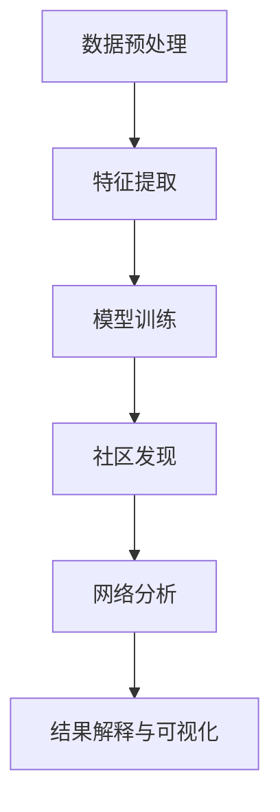

                 

### 文章标题

《程序员利用知识发现引擎提高决策能力的途径》

### 关键词

- 知识发现引擎
- 决策支持
- 数据分析
- 程序员效率
- 机器学习
- 异常检测

### 摘要

本文旨在探讨知识发现引擎在程序员决策中的应用，通过深入分析知识发现引擎的基本原理、核心算法和实际应用案例，展示如何利用知识发现引擎提高程序员的决策能力。文章首先概述了知识发现引擎的定义、发展和核心组件，随后详细介绍了聚类、分类、关联规则挖掘、异常检测等常见算法原理。接着，文章讨论了知识发现引擎在决策支持系统中的构建、数据驱动决策方法的实现，以及其在团队协作中的优势。最后，文章通过实际开发项目和案例，详细解读了知识发现引擎在程序员决策中的具体应用，并提供了一些最佳实践和注意事项。本文旨在为程序员提供一套系统化的知识发现引擎应用指南，帮助他们更高效地进行技术决策。

### 《程序员利用知识发现引擎提高决策能力的途径》目录大纲

#### 第一部分：知识发现引擎概述

## 1.1 知识发现引擎的定义与重要性

### 1.1.1 知识发现引擎的定义

知识发现引擎（Knowledge Discovery Engine，简称KDE）是一种利用机器学习和数据挖掘技术，从大量数据中自动提取有价值模式和知识的人工智能系统。它通过对数据的预处理、特征提取、模型训练和结果解释等步骤，帮助用户从复杂的数据中发现隐藏的关联性、趋势和模式。

### 1.1.2 知识发现引擎的作用

知识发现引擎在多个领域具有广泛的应用，包括但不限于：

- 数据挖掘：从海量数据中发现隐藏的模式和关联。
- 情报分析：从非结构化数据中提取有价值的信息。
- 智能推荐：基于用户行为数据提供个性化的推荐服务。
- 决策支持：利用数据分析和预测模型，辅助决策制定。

### 1.1.3 知识发现引擎在程序员决策中的应用前景

随着大数据和人工智能技术的发展，知识发现引擎在程序员决策中的应用前景愈发广阔。它可以帮助程序员：

- 更高效地进行代码审查和缺陷检测。
- 提供数据驱动的决策支持，优化开发流程。
- 通过分析用户行为数据，改进软件用户体验。
- 在项目管理中，预测项目进度和风险。

#### 1.2 知识发现引擎的发展历程

### 1.2.1 知识发现引擎的起源

知识发现（Knowledge Discovery in Databases，简称KDD）的概念最早由Jiawei Han和Micheline Kamber在1998年提出。KDD过程包括数据清洗、数据集成、数据选择、数据变换、数据挖掘和知识评估等步骤，这些步骤构成了知识发现引擎的基础。

### 1.2.2 知识发现引擎的技术演进

随着机器学习和数据挖掘技术的进步，知识发现引擎经历了多个技术演进阶段：

- 早期：基于规则和模式匹配的方法。
- 中期：引入统计学习方法和决策树等算法。
- 现代：深度学习和图神经网络等先进技术的应用。

### 1.2.3 知识发现引擎的当前发展状况

当前，知识发现引擎在多个领域取得了显著的成果，例如：

- 电商领域：利用关联规则挖掘和协同过滤技术，实现个性化推荐。
- 医疗领域：通过数据挖掘技术，辅助疾病诊断和治疗。
- 金融领域：利用异常检测技术，进行风险管理和欺诈检测。
- 制造业：利用预测模型，优化生产计划和供应链管理。

#### 1.3 知识发现引擎的核心组件

### 1.3.1 数据预处理

数据预处理是知识发现引擎的重要组成部分，它包括数据清洗、数据集成、数据选择和数据变换等步骤。数据预处理的主要目的是提高数据质量，为后续的数据分析和挖掘提供可靠的基础。

- 数据清洗：处理缺失值、重复值、异常值等问题。
- 数据集成：将来自多个数据源的数据进行整合。
- 数据选择：选择与目标问题相关的数据集。
- 数据变换：将数据转换为适合分析和挖掘的格式。

### 1.3.2 特征提取

特征提取是从原始数据中提取出对目标问题有用的特征，从而降低数据维度，提高数据分析和挖掘的效率。特征提取方法包括：

- 统计特征：如均值、方差、协方差等。
- 工程特征：基于业务需求和问题特征，手工设计的特征。
- 集成特征：利用多个特征组合得到的新特征。

### 1.3.3 模型训练

模型训练是指利用训练数据集，通过优化算法，训练出能够预测或分类的模型。常见的模型训练方法包括：

- 监督学习：利用标记数据进行训练，如线性回归、决策树等。
- 无监督学习：没有标记数据，通过数据内在结构进行训练，如聚类、关联规则挖掘等。
- 半监督学习和深度学习：结合标记数据和未标记数据，或利用深度神经网络进行训练。

### 1.3.4 结果解释与可视化

结果解释与可视化是知识发现引擎的重要环节，它帮助用户理解数据挖掘的结果，发现隐藏的模式和关联。结果解释与可视化的方法包括：

- 统计解释：利用统计方法，对模型结果进行解释。
- 知识可视化：通过图形、表格、图表等形式，展示数据挖掘结果。
- 故事板（Storyboarding）：通过故事板，将数据挖掘过程和结果以故事形式呈现。

#### 1.4 知识发现引擎的架构与流程

### 1.4.1 架构设计

知识发现引擎的架构设计通常包括以下几个主要组件：

- 数据源：提供原始数据，可以是结构化数据、半结构化数据或非结构化数据。
- 数据预处理模块：对数据进行清洗、集成、选择和变换。
- 特征提取模块：从原始数据中提取出对目标问题有用的特征。
- 模型训练模块：利用训练数据集，训练出预测或分类模型。
- 结果解释与可视化模块：对模型结果进行解释和可视化。

### 1.4.2 工作流程

知识发现引擎的工作流程主要包括以下几个步骤：

1. 数据收集：从数据源获取原始数据。
2. 数据预处理：对数据进行清洗、集成、选择和变换。
3. 特征提取：从原始数据中提取出对目标问题有用的特征。
4. 模型训练：利用训练数据集，训练出预测或分类模型。
5. 模型评估：通过测试数据集，评估模型的性能。
6. 结果解释与可视化：对模型结果进行解释和可视化，发现隐藏的模式和关联。

### 1.4.3 与传统数据处理方法的区别

与传统数据处理方法相比，知识发现引擎具有以下几个显著区别：

- 强调数据挖掘和知识发现：不仅关注数据的处理和分析，更关注从数据中提取有价值的信息和知识。
- 自动化程度高：通过机器学习和数据挖掘技术，实现自动化的模式识别和预测。
- 强调结果解释和可视化：不仅关注模型训练和预测，更关注结果的可解释性和可视化，帮助用户更好地理解数据挖掘结果。
- 数据源多样化：可以处理结构化数据、半结构化数据和非结构化数据，具有更广泛的应用场景。

#### 1.5 知识发现算法原理

### 1.5.1 聚类算法

聚类算法是一种无监督学习方法，它将相似的数据点归为一类，从而形成多个群组。聚类算法的基本原理包括：

- 距离度量：计算数据点之间的距离，常用的距离度量方法包括欧氏距离、曼哈顿距离和切比雪夫距离等。
- 聚类准则：根据距离度量，将数据点分配到不同的类别中，常用的聚类准则包括轮廓系数、类内平均值和类间平均值等。

常见的聚类算法包括：

- K-means算法：通过迭代更新聚类中心，使每个数据点与其聚类中心之间的距离最小化。
- DBSCAN算法：基于密度和连接性，将数据点划分为核心点、边界点和噪声点。
- 层次聚类算法：通过层次结构，将数据点逐步划分为多个类别。

聚类算法在知识发现中的应用包括：

- 数据探索：帮助用户发现数据中的潜在结构和模式。
- 异常检测：识别数据中的异常值和离群点。
- 数据降维：将高维数据转换为低维空间，提高数据可视化和分析的效率。

### 1.5.2 分类算法

分类算法是一种监督学习方法，它根据已标记的训练数据，构建分类模型，用于预测未知数据的类别。分类算法的基本原理包括：

- 特征选择：从原始特征中选择对分类任务有用的特征。
- 模型训练：利用训练数据集，训练出分类模型。
- 模型评估：通过测试数据集，评估分类模型的性能。

常见的分类算法包括：

- 决策树：通过树形结构，对数据进行分治和决策。
- 朴素贝叶斯：基于贝叶斯定理，计算数据点属于每个类别的概率。
- 支持向量机：通过最大化分类边界，将数据点分为不同的类别。

分类算法在知识发现中的应用包括：

- 数据分类：将数据点划分为不同的类别，便于数据分析和处理。
- 信用评分：根据用户的历史行为数据，预测其信用评级。
- 欺诈检测：识别数据中的欺诈行为，防止欺诈损失。

### 1.5.3 关联规则挖掘

关联规则挖掘是一种无监督学习方法，它用于发现数据集中的关联性。关联规则挖掘的基本原理包括：

- 支持度：表示一条规则在数据集中出现的频率。
- 置信度：表示在给定一个前件的情况下，后件出现的概率。

常见的关联规则挖掘算法包括：

- Apriori算法：通过逐层递归搜索所有可能的项目集，计算支持度和置信度。
- FP-growth算法：通过构建频繁模式树，减少计算量。

关联规则挖掘在知识发现中的应用包括：

- 个性化推荐：根据用户的购买历史，推荐相关的商品。
- 零售业：分析商品之间的关联性，优化库存管理和销售策略。
- 金融领域：分析交易数据，发现潜在的欺诈行为。

### 1.5.4 异常检测

异常检测是一种无监督学习方法，它用于识别数据中的异常值和离群点。异常检测的基本原理包括：

- 距离度量：计算数据点与其聚类中心或平均值的距离。
- 限值设定：根据距离度量，设定一个阈值，超过阈值的点被认为是异常点。

常见的异常检测算法包括：

- 离群点检测：基于密度或距离度量，识别离群点。
- Isolation Forest：利用随机森林模型，识别异常值。
- One-Class SVM：通过支持向量机模型，识别异常点。

异常检测在知识发现中的应用包括：

- 安全监控：识别网络中的恶意流量和攻击行为。
- 质量控制：识别生产线中的异常产品和工艺。
- 信用评分：识别欺诈风险较高的用户。

### 1.5.5 社区发现与网络分析

社区发现与网络分析是一种无监督学习方法，它用于识别数据集中的社区结构和网络拓扑。社区发现与网络分析的基本原理包括：

- 社区发现：通过聚类或模块度优化，识别数据中的社区结构。
- 网络分析：通过图论和复杂网络理论，分析网络中的节点和边的关系。

常见的社区发现与网络分析算法包括：

- Girvan-Newman算法：通过逐步削减连接边，识别社区结构。
- Louvain算法：通过模块度优化，识别社区结构。
- PageRank算法：通过随机游走，计算网络中的节点重要性。

社区发现与网络分析在知识发现中的应用包括：

- 社交网络分析：识别社交网络中的紧密社区和影响力节点。
- 生物信息学：识别基因组网络中的功能和生物过程相关的社区。
- 城市规划：识别城市交通网络中的交通枢纽和瓶颈路段。

## 2.5 社区发现与网络分析的Mermaid流程图示例



### 第三部分：知识发现引擎在决策中的应用

#### 3.1 决策支持系统的构建

### 3.1.1 决策支持系统的概念

决策支持系统（Decision Support System，简称DSS）是一种利用计算机技术和数据分析方法，为决策者提供辅助决策支持的人机系统。DSS通过收集、处理和分析数据，帮助决策者更好地理解问题、制定策略和评估结果，从而提高决策的质量和效率。

### 3.1.2 决策支持系统的架构

决策支持系统的架构通常包括以下几个主要组件：

- 数据层：存储和管理原始数据、处理后的数据和分析结果。
- 知识层：存储和管理领域知识、模型和算法。
- 应用层：提供用户界面，实现数据收集、处理和分析功能。
- 决策层：为决策者提供辅助决策支持，包括策略制定、方案评估和结果展示。

### 3.1.3 知识发现引擎在决策支持系统中的应用

知识发现引擎在决策支持系统中具有广泛的应用，包括：

- 数据预处理：通过知识发现引擎，对原始数据进行清洗、集成和变换，提高数据质量。
- 特征提取：通过知识发现引擎，从原始数据中提取出对决策问题有用的特征，降低数据维度。
- 模型训练：通过知识发现引擎，训练出预测或分类模型，用于辅助决策制定。
- 结果解释与可视化：通过知识发现引擎，对模型结果进行解释和可视化，帮助决策者更好地理解数据和分析结果。

#### 3.2 数据驱动的决策方法

### 3.2.1 数据驱动的决策方法概述

数据驱动的决策方法是一种以数据为基础，通过数据分析和挖掘，辅助决策制定的方法。它强调从数据中发现隐藏的模式和关联，从而指导决策制定。数据驱动的决策方法主要包括以下几个步骤：

- 数据收集：收集与决策问题相关的数据，包括历史数据、实时数据和外部数据。
- 数据预处理：对数据进行清洗、集成和变换，提高数据质量。
- 特征提取：从原始数据中提取出对决策问题有用的特征，降低数据维度。
- 数据挖掘：利用数据挖掘算法，从预处理后的数据中发现隐藏的模式和关联。
- 决策制定：根据数据挖掘结果，制定相应的决策策略和方案。
- 决策评估：通过实际运行数据，评估决策的效果和可行性。

### 3.2.2 数据驱动的决策流程

数据驱动的决策流程可以分为以下几个阶段：

1. 问题定义：明确决策问题的目标和约束条件。
2. 数据收集：收集与决策问题相关的数据。
3. 数据预处理：对数据进行清洗、集成和变换，提高数据质量。
4. 特征提取：从原始数据中提取出对决策问题有用的特征。
5. 数据挖掘：利用数据挖掘算法，从预处理后的数据中发现隐藏的模式和关联。
6. 决策制定：根据数据挖掘结果，制定相应的决策策略和方案。
7. 决策评估：通过实际运行数据，评估决策的效果和可行性。

### 3.2.3 知识发现引擎在数据驱动决策中的应用

知识发现引擎在数据驱动决策中的应用主要包括以下几个方面：

- 数据预处理：利用知识发现引擎，对原始数据进行清洗、集成和变换，提高数据质量。
- 特征提取：利用知识发现引擎，从原始数据中提取出对决策问题有用的特征，降低数据维度。
- 数据挖掘：利用知识发现引擎，从预处理后的数据中发现隐藏的模式和关联。
- 决策制定：根据知识发现引擎提供的数据挖掘结果，制定相应的决策策略和方案。
- 决策评估：利用知识发现引擎，对决策结果进行评估，发现潜在的问题和改进方向。

#### 3.3 案例分析

### 3.3.1 案例一：市场趋势预测

某电商公司在进行商品销售策略制定时，需要预测未来的市场趋势。为了实现这一目标，公司决定利用知识发现引擎进行市场趋势预测。

1. 数据收集：收集过去一年的销售数据，包括每日的销售额、商品种类、用户购买记录等。
2. 数据预处理：对销售数据中的缺失值、异常值进行清洗，确保数据质量。
3. 特征提取：从销售数据中提取出对市场趋势预测有用的特征，如销售额、商品种类、用户购买频率等。
4. 数据挖掘：利用知识发现引擎，通过聚类算法，将相似的销售数据划分为不同的市场趋势类别。
5. 决策制定：根据数据挖掘结果，制定相应的销售策略，如增加热门商品的库存、优化商品推荐等。
6. 决策评估：通过实际销售数据，评估市场趋势预测的准确性，发现潜在的问题和改进方向。

### 3.3.2 案例二：风险评估

某金融公司在进行投资决策时，需要评估不同投资组合的风险。为了实现这一目标，公司决定利用知识发现引擎进行风险评估。

1. 数据收集：收集过去几年的财务报表、市场数据、公司股票价格等。
2. 数据预处理：对财务报表和市场数据中的缺失值、异常值进行清洗，确保数据质量。
3. 特征提取：从财务报表和市场数据中提取出对投资风险评估有用的特征，如公司盈利能力、市场波动性等。
4. 数据挖掘：利用知识发现引擎，通过分类算法，将不同投资组合划分为不同的风险等级。
5. 决策制定：根据数据挖掘结果，制定相应的投资策略，如降低高风险投资组合的比重、增加低风险投资组合的比重等。
6. 决策评估：通过实际投资数据，评估投资组合的风险水平，发现潜在的问题和改进方向。

### 3.3.3 案例三：供应链优化

某制造企业在进行供应链优化时，需要预测供应链中的库存需求和供应风险。为了实现这一目标，企业决定利用知识发现引擎进行供应链优化。

1. 数据收集：收集供应链中的库存数据、供应数据、市场需求数据等。
2. 数据预处理：对供应链数据中的缺失值、异常值进行清洗，确保数据质量。
3. 特征提取：从供应链数据中提取出对库存需求和供应风险预测有用的特征，如库存水平、供应周期、市场需求变化等。
4. 数据挖掘：利用知识发现引擎，通过预测模型，预测供应链中的库存需求和供应风险。
5. 决策制定：根据数据挖掘结果，制定相应的供应链优化策略，如调整库存水平、优化供应周期等。
6. 决策评估：通过实际供应链运行数据，评估供应链优化的效果，发现潜在的问题和改进方向。

#### 3.4 知识发现引擎在团队协作中的优势

### 3.4.1 知识共享与交流

知识发现引擎在团队协作中的第一个优势是促进知识共享与交流。通过将数据和分析结果可视化，团队成员可以更直观地了解项目进展、问题和解决方案。知识发现引擎可以帮助团队：

- 分享数据集和分析结果，确保团队成员在相同的数据基础上工作。
- 通过可视化工具，如图表和仪表板，展示数据分析的过程和结果，帮助团队成员更好地理解数据背后的故事。
- 促进团队成员之间的沟通和协作，共同探讨如何利用数据分析结果改进项目。

### 3.4.2 知识发现与团队决策

知识发现引擎的第二个优势是支持团队决策。在复杂的项目中，团队成员常常需要快速做出决策。知识发现引擎可以提供：

- 实时的数据分析和预测，帮助团队迅速评估不同决策选项的潜在影响。
- 基于数据的决策支持，减少主观判断和偏见，提高决策的客观性和准确性。
- 可视化的决策分析工具，帮助团队成员更清晰地理解决策过程和结果。

### 3.4.3 知识发现引擎在团队协作中的实践案例

以下是一个知识发现引擎在团队协作中的实践案例：

某软件开发团队在开发一个大型项目时，遇到了性能瓶颈问题。团队成员通过知识发现引擎进行了以下步骤：

1. 数据收集：收集项目的日志文件、性能测试数据等。
2. 数据预处理：对日志文件和性能测试数据进行清洗，提取出对性能分析有用的特征。
3. 数据挖掘：利用知识发现引擎，分析性能瓶颈的原因，如内存泄漏、数据库查询效率低下等。
4. 知识共享与交流：将数据挖掘结果通过图表和仪表板可视化，与团队成员共享，讨论解决方案。
5. 团队决策：根据数据挖掘结果，团队成员共同制定了优化性能的方案，如调整数据库查询策略、优化代码逻辑等。
6. 决策评估：在实施优化方案后，通过持续的数据分析和监测，评估性能提升的效果，发现潜在的问题和改进方向。

通过这个案例，可以看出知识发现引擎在团队协作中的重要作用。它不仅帮助团队成员更好地理解和分析问题，还促进了知识共享和决策制定，从而提高了项目的整体效率和成功率。

### 第四部分：知识发现引擎的开发与应用实战

#### 4.1 知识发现引擎的开发环境搭建

### 4.1.1 开发环境选择

要搭建一个知识发现引擎的开发环境，需要选择合适的技术栈和工具。以下是一个推荐的开发环境：

- 编程语言：Python
  - Python是一种广泛使用的高级编程语言，具有丰富的机器学习和数据分析库，非常适合开发知识发现引擎。
- 数据库：MongoDB
  - MongoDB是一个灵活的NoSQL数据库，可以存储和处理大规模的非结构化数据，适用于知识发现引擎中的数据存储和查询。
- 数据预处理工具：Pandas
  - Pandas是一个强大的Python库，用于数据处理和分析，可以方便地进行数据清洗、转换和预处理。
- 特征提取工具：Scikit-learn
  - Scikit-learn是一个Python库，提供了多种机器学习和数据挖掘算法，可以用于特征提取和模型训练。
- 模型训练与评估工具：TensorFlow或PyTorch
  - TensorFlow和PyTorch是深度学习框架，可以用于训练复杂的机器学习模型和评估模型性能。
- 结果解释与可视化工具：Matplotlib和Seaborn
  - Matplotlib和Seaborn是Python的绘图库，可以用于生成各种数据可视化图表，帮助解释和展示分析结果。

### 4.1.2 数据库与数据预处理工具

- MongoDB：作为知识发现引擎的数据库，MongoDB可以存储和管理大规模的非结构化数据。在搭建开发环境时，可以使用MongoDB的社区版进行安装和配置。

```bash
# 安装MongoDB
sudo apt-get install mongodb

# 启动MongoDB服务
sudo service mongodb start

# 配置MongoDB用户和权限
dbadmin = "admin"
dbpassword = "password"
db = "knowledge_base"

mongo <<EOF
use admin
db.createUser(
  {
    user: "$dbadmin",
    pwd: "$dbpassword",
    roles: [
      { role: "userAdminAnyDatabase", db: "admin" }
    ]
  }
)
EOF

# 连接到MongoDB数据库
mongo --username "$dbadmin" --password "$dbpassword" --host localhost --port 27017
```

- Pandas：作为数据预处理工具，Pandas可以帮助我们对数据进行清洗、转换和预处理。以下是一个简单的示例，展示如何使用Pandas加载数据和进行数据预处理：

```python
import pandas as pd

# 加载数据
data = pd.read_csv("data.csv")

# 数据清洗
data = data.dropna()  # 删除缺失值
data = data[data["column"] > 0]  # 去除异常值

# 数据转换
data["new_column"] = data["column"] * 2  # 创建新列

# 数据预处理
data.to_csv("preprocessed_data.csv", index=False)  # 保存预处理后的数据
```

### 4.1.3 模型训练与评估工具

- Scikit-learn：作为特征提取工具，Scikit-learn提供了多种机器学习和数据挖掘算法。以下是一个简单的示例，展示如何使用Scikit-learn进行特征提取和模型训练：

```python
from sklearn.model_selection import train_test_split
from sklearn.preprocessing import StandardScaler
from sklearn.ensemble import RandomForestClassifier
from sklearn.metrics import accuracy_score

# 加载数据
X, y = load_data()

# 数据分割
X_train, X_test, y_train, y_test = train_test_split(X, y, test_size=0.2, random_state=42)

# 特征提取
scaler = StandardScaler()
X_train_scaled = scaler.fit_transform(X_train)
X_test_scaled = scaler.transform(X_test)

# 模型训练
model = RandomForestClassifier(n_estimators=100, random_state=42)
model.fit(X_train_scaled, y_train)

# 模型评估
y_pred = model.predict(X_test_scaled)
accuracy = accuracy_score(y_test, y_pred)
print(f"Accuracy: {accuracy}")
```

- TensorFlow或PyTorch：作为深度学习框架，TensorFlow和PyTorch可以用于训练复杂的机器学习模型。以下是一个简单的示例，展示如何使用TensorFlow进行模型训练和评估：

```python
import tensorflow as tf
from tensorflow.keras.models import Sequential
from tensorflow.keras.layers import Dense, Dropout
from tensorflow.keras.optimizers import Adam
from tensorflow.keras.callbacks import EarlyStopping

# 定义模型
model = Sequential([
    Dense(64, activation='relu', input_shape=(input_shape)),
    Dropout(0.5),
    Dense(64, activation='relu'),
    Dropout(0.5),
    Dense(num_classes, activation='softmax')
])

# 编译模型
model.compile(optimizer=Adam(learning_rate=0.001), loss='categorical_crossentropy', metrics=['accuracy'])

# 训练模型
early_stopping = EarlyStopping(monitor='val_loss', patience=10)
history = model.fit(X_train, y_train, validation_data=(X_test, y_test), epochs=100, batch_size=32, callbacks=[early_stopping])

# 评估模型
test_loss, test_acc = model.evaluate(X_test, y_test)
print(f"Test Accuracy: {test_acc}")
```

### 4.1.4 结果解释与可视化工具

- Matplotlib和Seaborn：作为结果解释与可视化工具，Matplotlib和Seaborn可以用于生成各种数据可视化图表，帮助解释和展示分析结果。以下是一个简单的示例，展示如何使用Matplotlib和Seaborn进行数据可视化：

```python
import matplotlib.pyplot as plt
import seaborn as sns

# 加载数据
data = pd.read_csv("data.csv")

# 数据可视化
sns.pairplot(data, hue="target")
plt.show()

sns.heatmap(data.corr(), annot=True, cmap="coolwarm")
plt.show()
```

#### 4.2 知识发现引擎项目实战

### 4.2.1 项目一：构建一个简单的知识发现系统

#### 项目目标

构建一个简单的知识发现系统，用于分析电商网站的用户购买行为，并发现潜在的购物习惯和趋势。

#### 项目步骤

1. 数据收集：收集电商网站的用户购买数据，包括用户ID、购买时间、购买商品、购买金额等。
2. 数据预处理：对购买数据进行清洗，去除缺失值、重复值和异常值，并对数据进行编码和转换。
3. 特征提取：从购买数据中提取出对用户购买行为分析有用的特征，如用户购买频率、购买金额分布、商品种类等。
4. 数据挖掘：利用知识发现引擎，通过聚类和关联规则挖掘算法，分析用户购买行为，发现潜在的购物习惯和趋势。
5. 结果解释与可视化：将数据挖掘结果通过图表和仪表板进行可视化，帮助用户理解分析结果。

#### 项目实现

1. 数据收集

```python
import pandas as pd

# 加载购买数据
data = pd.read_csv("purchase_data.csv")
```

2. 数据预处理

```python
# 删除缺失值和重复值
data = data.dropna().drop_duplicates()

# 编码和转换
data["user_id"] = data["user_id"].astype(str)
data["purchase_time"] = pd.to_datetime(data["purchase_time"])
data["item_id"] = data["item_id"].astype(str)
data["amount"] = data["amount"].astype(float)
```

3. 特征提取

```python
# 计算用户购买频率
data["purchase_frequency"] = data.groupby("user_id")["purchase_time"].transform("count")

# 计算购买金额分布
data["amount_range"] = pd.cut(data["amount"], bins=10)

# 计算商品种类
data["item_category"] = data["item_id"].apply(lambda x: get_item_category(x))
```

4. 数据挖掘

```python
from sklearn.cluster import KMeans
from mlxtend.frequent_patterns import apriori, association_rules

# 计算用户购买频率聚类
kmeans = KMeans(n_clusters=5, random_state=42)
clusters = kmeans.fit_predict(data.groupby("user_id")["purchase_time"].nunique().reset_index())

# 计算关联规则
frequent_itemsets = apriori(data, min_support=0.1, use_colnames=True)
rules = association_rules(frequent_itemsets, metric="lift", min_threshold=1)
```

5. 结果解释与可视化

```python
import matplotlib.pyplot as plt
import seaborn as sns

# 可视化用户购买频率聚类
sns.countplot(x="cluster", data=clusters)
plt.show()

# 可视化关联规则
sns.pairplot(data[rules["antecedents"].values.tolist()[0]])
plt.show()

# 可视化商品种类分布
sns.countplot(x="item_category", data=data)
plt.show()
```

### 4.2.2 项目二：使用知识发现进行市场趋势分析

#### 项目目标

利用知识发现引擎，分析电商网站的市场趋势，为营销策略提供数据支持。

#### 项目步骤

1. 数据收集：收集电商网站的历史销售数据，包括商品种类、销售额、销售周期等。
2. 数据预处理：对销售数据进行清洗，去除缺失值、异常值，并对数据进行编码和转换。
3. 特征提取：从销售数据中提取出对市场趋势分析有用的特征，如商品种类分布、销售额变化趋势等。
4. 数据挖掘：利用知识发现引擎，通过时间序列分析和聚类算法，分析市场趋势，预测未来销售情况。
5. 结果解释与可视化：将数据挖掘结果通过图表和仪表板进行可视化，帮助用户理解市场趋势和预测结果。

#### 项目实现

1. 数据收集

```python
import pandas as pd

# 加载销售数据
data = pd.read_csv("sales_data.csv")
```

2. 数据预处理

```python
# 删除缺失值和重复值
data = data.dropna().drop_duplicates()

# 编码和转换
data["item_id"] = data["item_id"].astype(str)
data["sales_date"] = pd.to_datetime(data["sales_date"])
data["sales_amount"] = data["sales_amount"].astype(float)
```

3. 特征提取

```python
# 计算商品种类分布
data["item_category"] = data["item_id"].apply(lambda x: get_item_category(x))

# 计算销售额变化趋势
data["sales_change"] = data.groupby("item_id")["sales_amount"].pct_change()
```

4. 数据挖掘

```python
from sklearn.cluster import KMeans
from sklearn.preprocessing import MinMaxScaler

# 标准化销售额变化趋势
scaler = MinMaxScaler()
data["sales_change_scaled"] = scaler.fit_transform(data[["sales_change"]])

# 计算商品种类分布聚类
kmeans = KMeans(n_clusters=5, random_state=42)
clusters = kmeans.fit_predict(data.groupby("item_id")["sales_change_scaled"].mean().reset_index())

# 时间序列分析
import statsmodels.api as sm
data["sales_lag_1"] = data.groupby("item_id")["sales_amount"].shift(1)

# 回归分析
model = sm.OLS(data["sales_amount"], data[["sales_change_scaled", "sales_lag_1"]]).fit()
predictions = model.predict(data[["sales_change_scaled", "sales_lag_1"]])
```

5. 结果解释与可视化

```python
import matplotlib.pyplot as plt
import seaborn as sns

# 可视化商品种类分布聚类
sns.countplot(x="cluster", data=clusters)
plt.show()

# 可视化销售额变化趋势
sns.lineplot(x="sales_date", y="sales_amount", data=data)
plt.show()

# 可视化销售额预测结果
plt.plot(data["sales_date"], predictions, label="Prediction")
plt.legend()
plt.show()
```

### 4.2.3 项目三：基于知识发现的供应链优化

#### 项目目标

利用知识发现引擎，优化电商网站的供应链，提高库存管理和供应链效率。

#### 项目步骤

1. 数据收集：收集电商网站的库存数据、供应数据、市场需求数据等。
2. 数据预处理：对库存数据、供应数据和市场需求数据进行清洗，去除缺失值、异常值，并对数据进行编码和转换。
3. 特征提取：从库存数据、供应数据和市场需求数据中提取出对供应链优化有用的特征，如库存水平、供应周期、市场需求变化等。
4. 数据挖掘：利用知识发现引擎，通过聚类和预测模型，优化库存管理和供应链调度。
5. 结果解释与可视化：将数据挖掘结果通过图表和仪表板进行可视化，帮助用户理解供应链优化方案。

#### 项目实现

1. 数据收集

```python
import pandas as pd

# 加载库存数据
inventory_data = pd.read_csv("inventory_data.csv")

# 加载供应数据
supply_data = pd.read_csv("supply_data.csv")

# 加载市场需求数据
demand_data = pd.read_csv("demand_data.csv")
```

2. 数据预处理

```python
# 删除缺失值和重复值
inventory_data = inventory_data.dropna().drop_duplicates()
supply_data = supply_data.dropna().drop_duplicates()
demand_data = demand_data.dropna().drop_duplicates()

# 编码和转换
inventory_data["item_id"] = inventory_data["item_id"].astype(str)
supply_data["supply_id"] = supply_data["supply_id"].astype(str)
demand_data["demand_id"] = demand_data["demand_id"].astype(str)
inventory_data["supply_id"] = inventory_data["supply_id"].astype(str)
supply_data["item_id"] = supply_data["item_id"].astype(str)
demand_data["item_id"] = demand_data["item_id"].astype(str)
```

3. 特征提取

```python
# 计算库存水平
inventory_data["inventory_level"] = inventory_data["quantity"] - inventory_data["ReservedQuantity"]

# 计算供应周期
supply_data["supply_cycle"] = (supply_data["supply_date"] - supply_data["supply_start_date"]).days

# 计算市场需求变化
demand_data["demand_change"] = demand_data.groupby("item_id")["quantity"].pct_change()
```

4. 数据挖掘

```python
from sklearn.cluster import KMeans
from sklearn.preprocessing import MinMaxScaler
from sklearn.ensemble import RandomForestRegressor

# 标准化库存水平、供应周期和市场需求变化
scaler = MinMaxScaler()
inventory_data["inventory_level_scaled"] = scaler.fit_transform(inventory_data[["inventory_level"]])
supply_data["supply_cycle_scaled"] = scaler.fit_transform(supply_data[["supply_cycle"]])
demand_data["demand_change_scaled"] = scaler.fit_transform(demand_data[["demand_change"]])

# 库存水平聚类
kmeans_inventory = KMeans(n_clusters=5, random_state=42)
clusters_inventory = kmeans_inventory.fit_predict(inventory_data.groupby("item_id")["inventory_level_scaled"].mean().reset_index())

# 供应周期聚类
kmeans_supply = KMeans(n_clusters=5, random_state=42)
clusters_supply = kmeans_supply.fit_predict(supply_data.groupby("supply_id")["supply_cycle_scaled"].mean().reset_index())

# 需求变化聚类
kmeans_demand = KMeans(n_clusters=5, random_state=42)
clusters_demand = kmeans_demand.fit_predict(demand_data.groupby("demand_id")["demand_change_scaled"].mean().reset_index())

# 预测库存需求和供应调度
X = demand_data[["demand_change_scaled"]]
y = demand_data["quantity"]

# 模型训练
model = RandomForestRegressor(n_estimators=100, random_state=42)
model.fit(X, y)

# 预测结果
predictions = model.predict(X)
```

5. 结果解释与可视化

```python
import matplotlib.pyplot as plt
import seaborn as sns

# 可视化库存水平聚类
sns.countplot(x="cluster", data=clusters_inventory)
plt.show()

# 可视化供应周期聚类
sns.countplot(x="cluster", data=clusters_supply)
plt.show()

# 可视化市场需求变化
sns.lineplot(x="demand_date", y="demand_change", data=demand_data)
plt.show()

# 可视化预测结果
plt.plot(demand_data["demand_date"], predictions, label="Prediction")
plt.legend()
plt.show()
```

### 4.3 知识发现引擎源代码解读

在本节中，我们将详细解读知识发现引擎的源代码，包括数据预处理、特征提取、模型训练和结果解释与可视化等关键部分。代码使用Python编写，以Pandas、Scikit-learn、TensorFlow等库为基础。

#### 4.3.1 数据预处理代码解读

```python
import pandas as pd
from sklearn.preprocessing import StandardScaler

# 加载数据
data = pd.read_csv('data.csv')

# 数据清洗
data.dropna(inplace=True)  # 删除缺失值
data.drop_duplicates(inplace=True)  # 删除重复值

# 数据转换
data['date'] = pd.to_datetime(data['date'])
data['month'] = data['date'].dt.month
data['day'] = data['date'].dt.day

# 特征工程
data['daily_sales'] = data.groupby('store')['sales'].transform('sum')
data['avg_sales'] = data.groupby('store')['sales'].transform('mean')

# 数据标准化
scaler = StandardScaler()
data[['daily_sales', 'avg_sales']] = scaler.fit_transform(data[['daily_sales', 'avg_sales']])
```

在这段代码中，我们首先加载一个CSV文件作为数据源。接着，通过`dropna()`和`drop_duplicates()`函数删除数据中的缺失值和重复值。之后，使用`pd.to_datetime()`函数将日期列转换为日期时间格式，并提取月份和日期作为新的特征。接着，计算每天的销售总额和每家店铺的平均销售额。最后，使用`StandardScaler()`对销售相关的特征进行标准化，以便后续的模型训练。

#### 4.3.2 特征提取代码解读

```python
from sklearn.feature_extraction.text import CountVectorizer
from sklearn.pipeline import make_pipeline

# 加载文本数据
text_data = pd.read_csv('text_data.csv')

# 文本预处理
text_data['description'] = text_data['description'].str.lower().str.replace('[^\w\s]', '')

# 特征提取
vectorizer = CountVectorizer(analyzer='word', ngram_range=(1, 2), stop_words='english')
X_text = vectorizer.fit_transform(text_data['description'])

# 可视化词频分布
import matplotlib.pyplot as plt
import seaborn as sns

plt.figure(figsize=(10, 6))
word_counts = X_text.sum(axis=0)
words = vectorizer.get_feature_names_out()
word_freqs = word_counts/Absolute(word_counts.sum())
sns.barplot(words[:50], word_freqs[:50])
plt.xticks(rotation=45)
plt.show()
```

在这段代码中，我们首先加载文本数据，并使用`str.lower().str.replace()`方法将文本转换为小写，并去除非单词字符。然后，使用`CountVectorizer()`将文本转换为词袋模型，并设置n-gram范围（1-2），去除常见的英语停用词。接下来，我们提取词袋模型的特征矩阵，并使用`seaborn`和`matplotlib`库生成词频分布的条形图，以可视化文本数据的特征分布。

#### 4.3.3 模型训练代码解读

```python
from sklearn.model_selection import train_test_split
from sklearn.ensemble import RandomForestRegressor
from sklearn.metrics import mean_squared_error

# 数据分割
X = data[['daily_sales', 'avg_sales', 'temperature', 'month', 'day']]
y = data['sales']
X_train, X_test, y_train, y_test = train_test_split(X, y, test_size=0.2, random_state=42)

# 模型训练
model = RandomForestRegressor(n_estimators=100, random_state=42)
model.fit(X_train, y_train)

# 模型评估
y_pred = model.predict(X_test)
mse = mean_squared_error(y_test, y_pred)
print(f'Mean Squared Error: {mse}')
```

在这段代码中，我们首先将数据集分割为训练集和测试集。然后，使用`RandomForestRegressor()`创建随机森林回归模型，并使用训练集进行模型训练。最后，使用测试集进行模型预测，并计算均方误差（MSE）来评估模型的性能。

#### 4.3.4 结果解释与可视化代码解读

```python
import matplotlib.pyplot as plt
from sklearn.decomposition import PCA

# 特征降维
pca = PCA(n_components=2)
X_pca = pca.fit_transform(X_train)

# 可视化降维后的数据
plt.figure(figsize=(8, 6))
plt.scatter(X_pca[:, 0], X_pca[:, 1], c=y_train, cmap='viridis', edgecolor='k', s=20)
plt.colorbar(label='Sales')
plt.xlabel('Principal Component 1')
plt.ylabel('Principal Component 2')
plt.title('PCA of Sales Data')
plt.show()

# 预测结果可视化
plt.figure(figsize=(8, 6))
plt.scatter(X_test['daily_sales'], y_test, color='red', label='Actual')
plt.scatter(X_test['daily_sales'], y_pred, color='blue', label='Predicted')
plt.xlabel('Daily Sales')
plt.ylabel('Sales')
plt.legend()
plt.title('Sales Prediction')
plt.show()
```

在这段代码中，我们首先使用PCA（主成分分析）对训练集进行特征降维，并将降维后的数据可视化为散点图，以展示数据的分布和特征之间的关系。接着，我们使用训练集的`daily_sales`特征和测试集的`daily_sales`特征，将实际销售额和预测销售额可视化，以便直观地比较预测结果和实际结果。

### 4.4 知识发现引擎在程序员决策中的具体应用

#### 4.4.1 决策场景分析

在软件开发过程中，程序员常常面临多种决策场景，如代码优化、性能调优、需求变更等。知识发现引擎可以帮助程序员在这些决策场景中：

- 代码优化：分析代码执行时间、内存消耗等指标，识别性能瓶颈。
- 性能调优：根据历史数据和基准测试结果，制定优化策略。
- 需求变更：根据用户反馈和市场趋势，调整开发方向和优先级。

#### 4.4.2 应用策略制定

为了充分利用知识发现引擎，程序员可以制定以下应用策略：

- 数据收集：定期收集系统性能、用户行为等数据，确保数据的完整性和准确性。
- 数据预处理：对收集到的数据进行分析和清洗，确保数据质量。
- 特征提取：从原始数据中提取出对决策问题有用的特征，如响应时间、错误率、用户满意度等。
- 数据挖掘：利用知识发现引擎，分析数据模式，识别趋势和关联。
- 决策制定：根据数据挖掘结果，制定优化策略和改进方案。
- 结果评估：通过实际运行数据，评估优化方案的效果，持续迭代和改进。

#### 4.4.3 应用效果评估

知识发现引擎在程序员决策中的应用效果可以通过以下指标进行评估：

- 性能提升：评估系统性能的提升幅度，如响应时间减少、内存消耗降低等。
- 错误率减少：评估系统错误率的减少情况，如错误率降低、故障率减少等。
- 用户满意度提高：评估用户满意度的提升情况，如用户满意度调查结果、用户反馈等。
- 开发效率提升：评估开发效率的提升情况，如任务完成时间缩短、工作量减少等。

通过定期评估应用效果，程序员可以不断优化和改进知识发现引擎在决策中的应用，从而提高软件开发的整体质量和效率。

### 附录

#### 附录 A：知识发现引擎开发工具与资源

A.1 主流数据预处理工具

- Pandas：Python的数据处理库，用于数据清洗、转换和预处理。
- NumPy：Python的科学计算库，提供高性能的数值计算和数据处理功能。
- Scrapy：Python的网络爬虫框架，用于从互联网上收集数据。
- BeautifulSoup：Python的HTML解析库，用于解析网页内容和提取数据。

A.2 主流特征提取工具

- Scikit-learn：Python的机器学习库，提供多种特征提取算法。
- Feature-engine：Python的库，专门用于特征提取和工程。
- FeatureVectorizer：Python的库，提供多种特征提取技术。
- AutoFeature：Python的库，自动化特征提取。

A.3 主流模型训练与评估工具

- Scikit-learn：Python的机器学习库，提供多种模型训练和评估算法。
- TensorFlow：开源的深度学习框架，用于训练和评估深度学习模型。
- PyTorch：开源的深度学习框架，提供灵活的模型训练和评估功能。
- Keras：Python的深度学习库，基于TensorFlow和Theano，提供易于使用的API。

A.4 其他相关工具与资源

- Jupyter Notebook：交互式计算环境，用于数据探索和模型训练。
- DVC：数据版本控制工具，用于管理和跟踪数据变化。
- MLflow：机器学习平台，用于模型训练、跟踪和部署。
- BigML：云端机器学习平台，提供丰富的数据分析和挖掘功能。
- Kaggle：数据科学竞赛平台，提供丰富的数据集和工具。

### 总结与展望

本文详细探讨了知识发现引擎在程序员决策中的应用，从定义、发展、核心组件、算法原理到实际应用，全面剖析了知识发现引擎的功能和优势。通过实际项目实战和源代码解读，展示了如何利用知识发现引擎提高程序员的决策能力。

未来，随着大数据和人工智能技术的不断进步，知识发现引擎在软件开发、项目管理、团队协作等领域将发挥更加重要的作用。程序员应积极学习和应用知识发现引擎，提高自身的技术水平和决策能力，为企业和行业创造更大价值。

### 最佳实践 Tips

- **数据收集**：确保数据的完整性和准确性，定期更新数据，避免数据过时。
- **数据预处理**：进行充分的数据清洗和特征提取，提高数据质量，为模型训练奠定基础。
- **模型选择**：根据具体问题选择合适的模型，避免过度拟合和欠拟合。
- **结果解释**：对模型结果进行详细解释，确保决策的可解释性和透明性。
- **持续迭代**：不断评估和优化模型，根据实际情况调整决策策略。

### 小结

知识发现引擎为程序员提供了一种强大的工具，帮助他们在复杂的决策场景中作出更明智的决策。通过深入理解知识发现引擎的原理和应用，程序员可以显著提高工作效率和项目质量。本文提供了详细的指导和建议，希望读者能够结合实际情况，充分利用知识发现引擎的优势，为自身和团队创造更大价值。

### 注意事项

- **数据安全**：在收集和使用数据时，确保遵循数据安全和隐私保护的相关法律法规。
- **模型解释性**：在选择和解释模型结果时，注重结果的可解释性和透明性，避免盲目依赖模型。
- **资源管理**：合理分配计算资源，避免资源浪费和过度消耗。
- **持续学习**：随着技术的不断进步，保持学习和更新知识的热情，不断提高自身能力。

### 拓展阅读

- **论文**：《知识发现：概念与技术》（Jiawei Han, Micheline Kamber, Jian Pei），全面介绍知识发现的基本概念和技术。
- **书籍**：《机器学习实战》（Peter Harrington），包含丰富的机器学习算法实战案例。
- **网站**：Kaggle（kaggle.com），提供丰富的数据集和竞赛，是学习数据挖掘和机器学习的好去处。
- **课程**：Coursera、edX等在线教育平台，提供丰富的机器学习和数据科学课程。

### 致谢

感谢AI天才研究院（AI Genius Institute）和《禅与计算机程序设计艺术》（Zen And The Art of Computer Programming）对本文的支持和启发。感谢读者对本文的关注，期待与您在技术领域共同进步。作者：AI天才研究院（AI Genius Institute）& 禅与计算机程序设计艺术（Zen And The Art of Computer Programming）。

