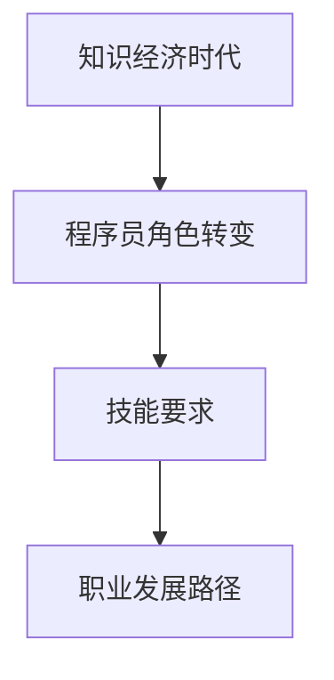

                 


### 《程序员在知识经济时代的职业规划》

#### 关键词：程序员、知识经济、职业规划、技术趋势、能力提升、职业素养

> 摘要：本文将探讨知识经济时代对程序员职业规划的影响，分析编程语言的演进与选择、技术趋势与能力提升、团队协作与项目管理，以及职业生涯规划与职业素养的重要性。通过实践案例分析、编程挑战与解决方案，帮助程序员在知识经济时代实现职业生涯的持续发展与提升。

#### 目录

#### 第一部分：知识经济时代与程序员角色

##### 第1章：知识经济时代的概述
- 1.1 知识经济时代的概念与特点
- 1.2 程序员在知识经济时代的角色转变
- 1.3 知识经济时代对程序员技能的要求
- 1.4 知识经济时代下的职业发展路径

##### 第2章：编程语言的演进与选择
- 2.1 编程语言的历史与发展
- 2.2 现代编程语言的选择标准
- 2.3 常见编程语言及其适用场景
- 2.4 新兴编程语言的潜力与趋势

#### 第二部分：技术趋势与能力提升

##### 第3章：大数据与人工智能的应用
- 3.1 大数据技术的核心概念与架构
- 3.2 人工智能的基础知识与未来趋势
- 3.3 大数据与人工智能结合的应用案例
- 3.4 程序员如何提升大数据与人工智能能力

##### 第4章：云计算与微服务架构
- 4.1 云计算的基本概念与服务模式
- 4.2 微服务架构的设计原则与实现
- 4.3 云服务和微服务的实际应用案例
- 4.4 程序员在云计算与微服务领域的职业机会

##### 第5章：软件架构与设计模式
- 5.1 软件架构的定义与重要性
- 5.2 常见软件架构模式与应用
- 5.3 设计模式的基本概念与分类
- 5.4 设计模式在软件开发中的实践

##### 第6章：团队协作与项目管理
- 6.1 团队协作的重要性与挑战
- 6.2 项目管理的核心原则与方法
- 6.3 团队协作工具与平台的应用
- 6.4 项目管理在实际开发中的应用案例

##### 第7章：职业生涯规划与职业素养
- 7.1 职业生涯规划的步骤与方法
- 7.2 程序员的核心职业素养
- 7.3 个人品牌建设与影响力提升
- 7.4 职业发展中的挑战与应对策略

#### 第三部分：实践与案例分析

##### 第8章：项目实战与案例分析
- 8.1 项目实战的目标与要求
- 8.2 实际项目案例分析
- 8.3 项目开发流程与工具选择
- 8.4 项目成果展示与反思

##### 第9章：编程挑战与解决方案
- 9.1 编程挑战的类型与来源
- 9.2 编程挑战的解决方案与思路
- 9.3 编程挑战的实际应用场景
- 9.4 编程挑战对程序员能力的提升

##### 第10章：职业发展与终身学习
- 10.1 职业发展的方向与选择
- 10.2 终身学习的理念与方法
- 10.3 学习资源与学习平台推荐
- 10.4 职业发展与个人成长的关系

### 附录：资源与参考

##### 附录 A：编程资源与工具
- A.1 编程语言学习资源
- A.2 开发工具与平台推荐
- A.3 技术社区与论坛介绍

##### 附录 B：参考文献与扩展阅读
- B.1 基础理论书籍推荐
- B.2 实践指南与案例分析书籍
- B.3 行业报告与趋势分析文章
- B.4 在线学习资源与课程推荐

### 第1章：知识经济时代的概述

#### 1.1 知识经济时代的概念与特点

知识经济时代是指以知识、信息和技术为核心的经济发展阶段，与传统的农业经济和工业经济相比，知识经济具有以下几个显著特点：

1. **知识成为主要生产要素**：知识经济时代，知识成为推动经济增长的主要动力，取代了传统的土地、劳动力、资本等生产要素。知识的创造、传播和应用成为经济增长的核心。

2. **信息技术的高速发展**：知识经济时代依赖于信息技术的快速发展，互联网、大数据、云计算等技术的普及，使得知识传播速度大大加快，信息处理能力得到显著提升。

3. **创新驱动**：知识经济时代强调创新的重要性，创新成为推动经济增长的关键因素。技术创新、商业模式创新、管理创新等在不同领域得到广泛应用。

4. **全球一体化**：知识经济时代，全球范围内的经济联系日益紧密，跨国企业、国际贸易、国际合作等成为知识传播和交流的重要渠道。

5. **服务经济**：知识经济时代，服务业占国民经济比重逐渐增加，服务业的快速发展带动了知识经济的崛起。

#### 1.2 程序员在知识经济时代的角色转变

在知识经济时代，程序员的职业角色发生了显著变化，主要表现在以下几个方面：

1. **从执行者到创新者**：知识经济时代，程序员不再仅仅扮演执行者角色，而是成为创新者。程序员需要具备敏锐的洞察力，把握技术趋势，提出创新性的解决方案。

2. **从技术专才到综合型人才**：知识经济时代，程序员需要具备更广泛的知识和技能，不仅需要熟练掌握编程语言和开发工具，还需要了解业务领域、管理方法和团队协作。

3. **从产品开发到价值创造**：知识经济时代，程序员的价值不仅仅体现在产品开发上，更体现在价值创造上。程序员需要关注产品对业务价值的贡献，优化产品性能、降低成本、提高用户体验。

4. **从个人奋斗到团队协作**：知识经济时代，程序员需要具备团队协作能力，与业务人员、设计师、测试人员等紧密合作，共同完成项目。

#### 1.3 知识经济时代对程序员技能的要求

在知识经济时代，程序员需要具备以下技能，以满足职业发展的需求：

1. **编程技能**：熟练掌握至少一门编程语言，如 Java、Python、JavaScript 等，熟悉常用的开发工具和框架。

2. **技术视野**：了解当前主流技术趋势，如大数据、人工智能、云计算等，具备快速学习和应用新技术的能力。

3. **业务理解**：了解业务领域的知识和需求，能够将技术方案与业务目标相结合，提供符合业务需求的技术解决方案。

4. **团队协作**：具备良好的沟通能力和团队协作能力，能够与不同角色的人员高效合作。

5. **项目管理**：了解项目管理的基本原则和方法，能够有效规划和管理项目进度、资源等。

6. **创新能力**：具备创新思维，能够提出创新性的技术解决方案，推动项目进展。

#### 1.4 知识经济时代下的职业发展路径

在知识经济时代，程序员的职业发展路径呈现出多样化趋势，主要分为以下几个方向：

1. **技术专家**：深入掌握某一技术领域，成为技术领域的专家，参与核心技术研发和决策。

2. **项目经理**：具备项目管理能力，担任项目经理，负责项目规划、执行、监控和收尾。

3. **产品经理**：了解产品开发流程和市场需求，担任产品经理，负责产品规划、设计和优化。

4. **架构师**：具备系统架构能力，担任系统架构师，负责系统设计、性能优化和稳定性保障。

5. **业务分析师**：深入了解业务领域，担任业务分析师，负责需求分析和解决方案设计。

6. **创业**：具备创业精神，创立自己的公司，成为企业家。

#### 第2章：编程语言的演进与选择

##### 2.1 编程语言的历史与发展

编程语言的发展历程可以追溯到20世纪40年代，当时计算机刚刚问世，程序员使用的是机器语言和汇编语言，这些语言直接操作计算机硬件，效率高但难以理解和维护。随着计算机技术的发展，编程语言逐渐演变得更加高级和易用。

1. **第一代编程语言（1940s-1950s）**：机器语言和汇编语言是第一代编程语言，它们与硬件紧密相关，需要程序员深入理解计算机的硬件结构。

2. **第二代编程语言（1950s-1960s）**：Fortran和COBOL是第二代编程语言的代表，它们开始引入高级语言的概念，提供更抽象的语法，使编程更加高效和易于理解。

3. **第三代编程语言（1960s-1970s）**：C、Pascal和C++是第三代编程语言的代表，它们在语法和功能上更加丰富，支持面向对象编程和结构化编程，提高了代码的可维护性和可扩展性。

4. **第四代编程语言（1970s-1980s）**：SQL、HTML和Prolog是第四代编程语言的代表，它们高度抽象，专注于特定领域的应用，如数据库查询、网页设计和逻辑编程。

5. **现代编程语言（1980s至今）**：现代编程语言如Java、Python、JavaScript、Go等，结合了前三代编程语言的优点，同时引入了新的编程范式和特性，如函数式编程、并发编程和元编程。

##### 2.2 现代编程语言的选择标准

在知识经济时代，选择合适的编程语言对程序员的工作效率和质量至关重要。以下是一些常见的选择标准：

1. **性能和效率**：对于需要高性能计算和资源优化的应用，选择C、C++等编译型语言是理想选择。对于Web开发和脚本编写，Python和JavaScript等解释型语言更加方便。

2. **易用性和学习成本**：对于初学者和快速开发，Python、Ruby等易于学习和使用的编程语言是不错的选择。对于企业级应用，Java和C#等语言具备丰富的生态系统和成熟的框架。

3. **生态系统和社区支持**：选择拥有庞大社区和生态系统支持的编程语言，可以更容易地找到解决问题的资源和帮助。例如，Java、Python和JavaScript等语言拥有丰富的开源库、框架和工具。

4. **适用场景和领域**：不同的编程语言适合不同的应用场景和领域。例如，Java在大型企业级应用和Android开发中占据主导地位，Python在数据科学、机器学习和Web开发中广泛应用，JavaScript在Web前端开发中不可或缺。

5. **跨平台能力**：具备跨平台能力的编程语言可以减少开发成本和资源浪费。例如，Java、C#和Python等语言可以在多个操作系统上运行，而JavaScript可以用于Web和移动平台。

##### 2.3 常见编程语言及其适用场景

以下是一些常见编程语言及其适用场景：

1. **Java**：
   - 适用场景：企业级应用、Android开发、大数据处理、云计算等。
   - 特点：强类型、稳定性和安全性高、跨平台、丰富的生态系统。

2. **Python**：
   - 适用场景：数据科学、机器学习、Web开发、自动化脚本等。
   - 特点：易学易用、简洁明了、丰富的库和框架、适用于快速开发。

3. **JavaScript**：
   - 适用场景：Web前端开发、Node.js后端开发、移动应用开发等。
   - 特点：跨平台、动态类型、强大的社区支持、广泛的应用场景。

4. **C/C++**：
   - 适用场景：操作系统开发、嵌入式系统、高性能计算等。
   - 特点：性能高效、跨平台、强大的底层操作能力、适用于资源受限的环境。

5. **Go**：
   - 适用场景：Web服务、分布式系统、容器化应用等。
   - 特点：并发编程、内存管理、简洁语法、适用于高性能和高并发场景。

##### 2.4 新兴编程语言的潜力与趋势

随着知识经济的发展，新兴编程语言不断涌现，它们在某些领域表现出巨大的潜力。以下是一些新兴编程语言及其趋势：

1. **Rust**：
   - 潜力：安全性、并发编程、性能高效。
   - 趋势：在系统编程、嵌入式开发和Web前端领域逐渐获得关注。

2. **Kotlin**：
   - 潜力：兼容Java、Android开发、函数式编程特性。
   - 趋势：在移动应用开发中替代Java，成为Android开发的优先选择。

3. **Swift**：
   - 潜力：安全性、性能高效、易于学习。
   - 趋势：在iOS开发和跨平台开发中逐渐获得认可。

4. **TypeScript**：
   - 潜力：JavaScript的超集、类型安全、编译成JavaScript。
   - 趋势：在Web前端开发中广泛应用，提高代码的可维护性和可读性。

#### 第3章：大数据与人工智能的应用

##### 3.1 大数据技术的核心概念与架构

大数据（Big Data）是指无法使用传统数据处理工具在合理时间内完成的数据集合，其特征为“4V”：大量（Volume）、多样（Variety）、高速（Velocity）和真实（Veracity）。大数据技术主要包括数据采集、存储、处理、分析和可视化等环节。

1. **数据采集**：通过传感器、应用程序、社交网络等渠道获取数据，并将其传输到数据存储系统。

2. **数据存储**：使用分布式存储系统，如Hadoop的HDFS、Apache Cassandra等，存储大规模数据。

3. **数据处理**：使用分布式计算框架，如MapReduce、Spark等，对数据进行高效处理和分析。

4. **数据分析**：利用统计模型、机器学习和数据挖掘算法，从海量数据中提取有价值的信息。

5. **数据可视化**：通过图表、仪表板和交互式界面，将数据分析结果以直观的方式展示给用户。

##### 3.2 人工智能的基础知识与未来趋势

人工智能（Artificial Intelligence，AI）是指计算机系统模拟人类智能行为的技术。人工智能的核心技术包括机器学习、深度学习、自然语言处理和计算机视觉等。

1. **机器学习**：通过算法和统计模型，从数据中自动学习规律和模式，进行预测和决策。

2. **深度学习**：基于神经网络，通过多层非线性变换，实现复杂特征提取和模型训练。

3. **自然语言处理**：使计算机理解和生成人类语言的技术，包括文本分析、语音识别、机器翻译等。

4. **计算机视觉**：使计算机理解和解释视觉信息的技术，包括图像识别、目标检测、人脸识别等。

未来趋势：
- **智能化应用**：人工智能将在更多领域得到应用，如智能家居、智能医疗、自动驾驶等。
- **边缘计算**：将计算能力下沉到网络边缘，降低延迟，提高实时性。
- **联邦学习**：在保持数据隐私的同时，实现分布式机器学习。
- **强化学习**：在复杂环境中，通过试错和反馈，实现自主学习和决策。

##### 3.3 大数据与人工智能结合的应用案例

大数据与人工智能的结合，带来了许多创新应用案例：

1. **智能推荐系统**：通过分析用户行为和偏好，智能推荐商品、新闻、音乐等，提高用户体验和销售额。

2. **智能医疗**：利用大数据和人工智能技术，实现疾病预测、诊断和治疗方案的个性化推荐。

3. **金融风控**：通过分析海量金融数据，识别异常交易、防范金融风险。

4. **智能制造**：通过大数据和人工智能技术，实现生产线的自动化控制和优化，提高生产效率和产品质量。

5. **智能交通**：通过实时交通数据分析，优化交通流量，提高道路通行效率和减少交通事故。

##### 3.4 程序员如何提升大数据与人工智能能力

1. **学习基础知识**：掌握Python、Java等编程语言，学习统计学、线性代数和概率论等基础知识。

2. **熟悉大数据技术栈**：学习Hadoop、Spark、Flink等大数据处理框架，了解分布式存储和计算原理。

3. **掌握机器学习和深度学习技术**：学习常见的机器学习和深度学习算法，如线性回归、决策树、神经网络等。

4. **实践项目**：参与大数据和人工智能项目，积累实战经验，提高解决问题的能力。

5. **持续学习**：关注行业动态，学习最新的技术和工具，不断提升自己的技能水平。

### 第4章：云计算与微服务架构

##### 4.1 云计算的基本概念与服务模式

云计算（Cloud Computing）是指通过互联网提供动态易扩展且经常是虚拟化的资源。云计算的基本概念包括以下几个方面：

1. **虚拟化**：将物理资源抽象成逻辑资源，如虚拟机、虚拟存储和网络，实现资源的灵活分配和调度。

2. **弹性扩展**：根据需求动态调整资源规模，实现计算能力和存储空间的弹性扩展。

3. **服务模式**：云计算提供以下三种服务模式：
   - **基础设施即服务（IaaS）**：提供虚拟机、存储、网络等基础设施资源，用户可以根据需求自行配置和管理。
   - **平台即服务（PaaS）**：提供开发平台和工具，用户可以在平台上开发、部署和管理应用程序。
   - **软件即服务（SaaS）**：提供完整的软件应用程序，用户通过互联网访问和使用。

4. **部署模型**：云计算的部署模型包括以下几种：
   - **公有云**：由第三方云服务提供商运营，多个用户共享资源。
   - **私有云**：为特定组织或机构提供专用的云计算资源。
   - **混合云**：结合公有云和私有云的优势，实现资源的高效利用。

##### 4.2 微服务架构的设计原则与实现

微服务架构（Microservices Architecture）是一种软件开发方法，通过将应用程序分解为小而独立的组件（即微服务），实现系统的可扩展性、灵活性和可维护性。微服务架构的设计原则包括以下几个方面：

1. **独立性**：每个微服务都是独立的，具有自我管理和自我修复的能力，降低系统耦合度。

2. **自治性**：每个微服务拥有自己的数据库和数据模型，独立处理业务逻辑和数据操作。

3. **去中心化**：系统没有单一的中心控制点，各个微服务之间通过轻量级的通信协议（如RESTful API）进行交互。

4. **自治部署**：每个微服务可以独立部署和升级，不影响其他微服务的运行。

5. **服务解耦**：通过定义清晰的服务接口和契约，实现服务之间的解耦，降低服务之间的依赖性。

实现微服务架构的关键技术包括：

1. **容器化**：使用容器（如Docker）将应用程序及其依赖环境打包，实现服务的轻量级部署和隔离。

2. **服务发现**：实现服务之间的自动发现和注册，确保服务能够动态地找到其他服务并进行通信。

3. **配置管理**：管理各个服务的配置信息，确保服务在不同的环境中能够正确运行。

4. **持续集成与持续部署（CI/CD）**：实现自动化构建、测试和部署流程，提高开发效率和软件质量。

##### 4.3 云服务和微服务的实际应用案例

以下是一些云服务和微服务的实际应用案例：

1. **电子商务平台**：利用云计算提供弹性计算和存储资源，实现购物车、订单管理和支付功能。通过微服务架构，实现不同业务模块的独立开发和部署，提高系统的可扩展性和灵活性。

2. **社交媒体平台**：利用云服务提供大规模存储和计算能力，支持用户内容生成、分享和互动。通过微服务架构，实现不同功能模块的独立开发、部署和扩展，如用户管理、消息推送、内容审核等。

3. **金融风控系统**：利用云计算提供强大的数据处理和分析能力，实现风险识别、预警和决策。通过微服务架构，实现不同风险分析模块的独立开发、部署和监控，提高系统的响应速度和准确性。

4. **智能物流系统**：利用云计算提供实时地图、路线规划和物流追踪服务。通过微服务架构，实现不同物流功能模块的独立开发、部署和优化，如订单管理、车辆调度、仓储管理等。

##### 4.4 程序员在云计算与微服务领域的职业机会

在云计算与微服务领域，程序员面临着丰富的职业机会：

1. **云计算工程师**：负责云计算平台的搭建、运维和优化，包括虚拟化技术、容器化技术、分布式存储和计算等。

2. **微服务架构师**：负责系统的架构设计、服务拆分和接口定义，确保系统的高可用性、可扩展性和易维护性。

3. **云计算开发工程师**：负责基于云计算平台的应用开发和部署，实现业务需求的快速响应和高效交付。

4. **云原生开发工程师**：专注于云原生应用的开发，掌握容器化、服务网格、持续集成与持续部署等先进技术。

5. **云计算解决方案架构师**：负责为客户提供云计算解决方案，包括架构设计、技术选型和项目实施等。

### 第5章：软件架构与设计模式

#### 5.1 软件架构的定义与重要性

软件架构（Software Architecture）是指软件系统的高层次结构设计，包括系统的组件、组件之间的关系以及这些组件如何与其他系统交互。软件架构不仅是软件开发过程中的重要指导，也是系统性能、可维护性和可扩展性的关键因素。

1. **系统组件**：软件架构由多个相互依赖的组件组成，如模块、库、服务、接口等。

2. **组件之间的关系**：组件之间的关系包括依赖关系、接口定义、通信协议等。

3. **与其他系统的交互**：软件架构描述系统与外部系统（如数据库、网络、其他应用程序）的交互方式和接口规范。

软件架构的重要性体现在以下几个方面：

1. **系统性能**：合理的软件架构可以提高系统的性能，确保系统在高并发、大数据量等极端情况下仍能稳定运行。

2. **可维护性**：良好的软件架构有助于降低系统的复杂度，使得代码易于理解和修改，提高系统的可维护性。

3. **可扩展性**：软件架构支持系统的模块化和组件化，便于新增功能和业务扩展。

4. **可靠性**：软件架构有助于识别系统中的潜在风险，提高系统的可靠性和稳定性。

#### 5.2 常见软件架构模式与应用

常见的软件架构模式包括：

1. **层次架构**：将系统划分为多个层次，如表示层、业务逻辑层、数据访问层等，实现职责分离和模块化。

2. **事件驱动架构**：系统通过事件触发器和事件处理器响应外部事件，实现异步通信和解耦。

3. **微服务架构**：将应用程序分解为多个独立的微服务，每个微服务负责特定的业务功能，实现高内聚、低耦合。

4. **模型-视图-控制器（MVC）**：将系统划分为模型（数据存储和操作）、视图（用户界面）和控制器（业务逻辑处理），实现界面与业务逻辑的分离。

5. **数据驱动架构**：系统根据数据变化自动调整行为和状态，实现灵活性和动态性。

常见应用场景：

1. **Web应用**：层次架构和MVC模式广泛应用于Web应用，实现前后端分离、高效开发和可维护性。

2. **实时系统**：事件驱动架构适用于实时系统，如物联网、游戏、金融交易等，实现低延迟、高可靠性。

3. **分布式系统**：微服务架构适用于分布式系统，如电商平台、社交网络、大数据处理等，实现高可用性、高可扩展性。

#### 5.3 设计模式的基本概念与分类

设计模式（Design Pattern）是一套在软件开发中广泛应用的解决方案，用于解决常见的设计问题。设计模式的基本概念包括：

1. **模式**：设计模式是一种抽象的、可重用的解决方案，用于解决特定类型的问题。

2. **问题**：设计模式解决的问题，如模块化、耦合度降低、扩展性提高等。

3. **解决方案**：设计模式提供的具体实现方案，包括类和对象的组织方式、接口和协议的设计等。

常见的分类包括：

1. **创建型模式**：解决对象的创建问题，如工厂模式、单例模式、原型模式等。

2. **结构型模式**：解决类和对象之间的组合问题，如适配器模式、装饰器模式、代理模式等。

3. **行为型模式**：解决对象之间的交互问题，如观察者模式、策略模式、命令模式等。

#### 5.4 设计模式在软件开发中的实践

设计模式在软件开发中具有广泛的应用，以下是一些具体实例：

1. **工厂模式**：在软件开发中，工厂模式用于创建对象实例，提高代码的可扩展性和可维护性。例如，在Web开发中，可以使用工厂模式创建不同的数据库连接对象。

2. **单例模式**：单例模式用于确保一个类仅有一个实例，并提供一个访问它的全局访问点。例如，在应用程序中，可以使用单例模式实现日志记录器，确保日志记录的一致性和准确性。

3. **适配器模式**：适配器模式用于将一个类的接口转换成客户期望的另一个接口，实现类之间的兼容性。例如，在软件开发中，可以使用适配器模式将旧的API适配到新的系统架构中。

4. **观察者模式**：观察者模式用于实现对象之间的通信和协作，当一个对象发生变化时，通知其他相关对象。例如，在软件架构中，可以使用观察者模式实现日志记录、事件驱动系统等。

5. **策略模式**：策略模式用于定义一系列算法，将每个算法封装起来，并使它们可以互相替换。例如，在软件开发中，可以使用策略模式实现不同排序算法的选择，提高代码的可扩展性和灵活性。

#### 第6章：团队协作与项目管理

##### 6.1 团队协作的重要性与挑战

在软件开发过程中，团队协作至关重要。一个高效协作的团队能够提高开发效率、降低风险、提升产品质量。然而，团队协作也面临一些挑战，需要有效管理和应对。

1. **重要性**：
   - **资源共享**：团队协作可以实现资源共享，提高工作效率。
   - **知识互补**：团队成员具备不同的技能和经验，通过协作可以互补知识和能力。
   - **沟通协作**：团队协作有助于团队成员之间的沟通和协作，降低误解和冲突。
   - **共同目标**：团队协作有助于确保团队目标的一致性和实现。

2. **挑战**：
   - **沟通障碍**：团队成员可能来自不同的背景，语言、文化和习惯差异可能导致沟通障碍。
   - **任务分工**：在大型项目中，任务分工和角色定位可能不明确，导致工作效率低下。
   - **团队冲突**：团队成员之间的意见分歧和利益冲突可能影响团队协作效果。
   - **时间管理**：团队成员可能在时间安排和任务优先级上存在差异，影响项目进度。

##### 6.2 项目管理的核心原则与方法

项目管理是确保软件开发项目按时、按质、按预算完成的关键。以下是项目管理的一些核心原则和方法：

1. **目标明确**：明确项目的目标、范围和预期成果，确保团队成员对项目目标有清晰的认识。

2. **计划合理**：制定详细的项目计划，包括时间表、任务分配、资源需求和风险评估等。

3. **风险管理**：识别潜在的风险，制定风险应对策略，降低项目风险对项目进度和质量的影响。

4. **质量控制**：建立质量控制流程，确保项目成果符合预期质量标准，减少缺陷和返工。

5. **沟通协调**：建立有效的沟通机制，确保团队成员之间的信息传递和协作顺畅。

6. **进度监控**：定期监控项目进度，及时发现和解决问题，确保项目按计划进行。

##### 6.3 团队协作工具与平台的应用

现代团队协作工具和平台为团队成员之间的沟通、协作和项目管理提供了便利。以下是几种常用的团队协作工具和平台：

1. **沟通工具**：
   - **Slack**：实时沟通和协作平台，支持聊天、文件共享和集成第三方服务。
   - **Microsoft Teams**：集成语音、视频和聊天功能，提供团队协作和会议管理。
   - **WhatsApp**：支持文本、语音和视频通信，适合跨地区团队协作。

2. **项目管理工具**：
   - **Jira**：灵活的项目管理工具，支持任务跟踪、进度监控和团队协作。
   - **Trello**：基于看板（Kanban）方法的任务管理工具，支持任务分配、进度跟踪和协作。
   - **Asana**：全面的项目管理平台，支持任务管理、进度跟踪和团队协作。

3. **文档共享与协作工具**：
   - **Google Workspace**：包括Google文档、表格、幻灯片等，支持实时协作和版本控制。
   - **Microsoft 365**：提供Word、Excel、PowerPoint等办公软件的在线协作功能。
   - **Notion**：强大的知识管理和协作工具，支持文档、表格、看板等多种内容格式。

##### 6.4 项目管理在实际开发中的应用案例

以下是一个实际开发项目中的项目管理案例：

**项目背景**：某公司开发一款社交媒体应用，项目团队包括前端、后端、UI/UX设计和测试人员。

**项目目标**：在6个月内完成应用的开发和上线，确保功能完善、用户体验良好。

**项目管理步骤**：

1. **需求分析**：与客户和产品经理沟通，明确应用的功能需求、用户界面设计和性能要求。

2. **项目计划**：制定详细的项目计划，包括时间表、任务分配和资源需求，确保项目按计划进行。

3. **风险管理**：识别潜在的风险，如技术难题、人员变动和外部依赖，制定应对策略，降低风险对项目进度的影响。

4. **团队协作**：使用Jira和Slack等工具，确保团队成员之间的沟通和信息传递，提高协作效率。

5. **进度监控**：定期召开项目进度会议，检查项目进度和质量，确保项目按计划进行。

6. **质量控制**：实施代码审查、单元测试和集成测试，确保代码质量和系统稳定性。

7. **项目收尾**：在项目完成后，进行用户验收测试，确保应用符合预期质量标准，进行项目总结和经验教训分享。

通过以上项目管理步骤，项目团队成功完成了社交媒体应用的开发和上线，实现了项目目标。

### 第7章：职业生涯规划与职业素养

##### 7.1 职业生涯规划的步骤与方法

职业生涯规划是程序员实现职业发展和提升的关键。以下是一些职业生涯规划的步骤和方法：

1. **自我评估**：了解自己的技能、兴趣和价值观，明确职业发展的方向和目标。

2. **市场调研**：研究行业趋势、市场需求和职业前景，了解不同职业角色的要求和薪资水平。

3. **设定目标**：根据自我评估和市场调研，设定明确的职业发展目标，如技术专家、项目经理、产品经理等。

4. **制定计划**：制定实现职业目标的行动计划，包括学习、实践、项目参与和职业认证等。

5. **持续学习**：关注行业动态，不断学习新技术和知识，提升自己的技能和竞争力。

6. **调整与反思**：定期评估职业发展进度，根据实际情况调整规划，保持灵活性和适应性。

##### 7.2 程序员的核心职业素养

程序员的核心职业素养包括以下几个方面：

1. **专业素养**：具备扎实的编程技能和知识，熟练掌握至少一门编程语言和相关的开发工具。

2. **学习能力**：具备快速学习新技术和知识的能力，持续提升自己的专业水平。

3. **责任心**：对待工作认真负责，确保项目按时、按质、按预算完成。

4. **沟通能力**：具备良好的沟通技巧，能够与团队成员、客户和上级有效沟通，确保信息传递准确无误。

5. **团队协作**：具备团队协作精神，能够与不同角色的人员高效合作，共同实现项目目标。

6. **解决问题的能力**：具备分析问题和解决问题的能力，能够独立思考和解决问题。

##### 7.3 个人品牌建设与影响力提升

在知识经济时代，个人品牌建设对于程序员的职业发展至关重要。以下是一些个人品牌建设和影响力提升的方法：

1. **技术分享**：通过博客、技术文章、演讲等方式分享自己的技术知识和经验，提升个人知名度。

2. **参与开源项目**：参与开源项目，贡献代码和解决方案，提升自己的技术影响力。

3. **参加技术社区**：积极参与技术社区和论坛，与其他技术人员交流和学习，拓展人脉。

4. **技术认证**：获得相关的技术认证，如认证程序员（CPA）、认证软件架构师（CSD）等，提高专业素养和信誉。

5. **社交媒体**：利用社交媒体平台，如LinkedIn、Twitter等，建立个人品牌，分享自己的专业知识和见解。

6. **演讲与培训**：参加技术会议、研讨会和培训，展示自己的技术能力和经验，提升个人影响力。

##### 7.4 职业发展中的挑战与应对策略

在职业发展中，程序员可能会遇到以下挑战：

1. **技术更新换代**：随着技术的快速迭代，程序员需要不断学习新技术，否则可能会落后。

**应对策略**：保持学习习惯，关注行业动态，参加技术培训和学习活动，不断提升自己的技能水平。

2. **职业瓶颈**：在职业生涯的某个阶段，可能会遇到职业发展瓶颈，无法进一步提升。

**应对策略**：尝试转行或转型，如从开发转向项目管理、产品管理或技术管理，拓宽职业发展路径。

3. **工作压力**：软件开发工作常常面临紧张的工作环境和压力，需要有效应对。

**应对策略**：保持良好的工作习惯，合理安排工作和休息时间，学会调整心态和缓解压力。

4. **人际关系**：在团队协作中，人际关系处理不当可能会影响工作效率和团队氛围。

**应对策略**：提高沟通技巧，建立良好的人际关系，学会倾听和尊重他人意见。

### 第8章：项目实战与案例分析

##### 8.1 项目实战的目标与要求

在本章中，我们将通过一个实际项目实战，展示程序员在知识经济时代如何运用所学知识和技术，实现职业规划的目标。项目实战的目标是开发一个基于云计算和微服务架构的博客系统，满足以下要求：

1. **功能需求**：支持博客文章的创建、发布、编辑和删除；支持用户注册、登录和评论功能；提供全文搜索功能。

2. **性能需求**：确保系统在高并发情况下仍能稳定运行，响应时间在500毫秒以内。

3. **安全需求**：保护用户数据和隐私，防止SQL注入、跨站脚本攻击等安全漏洞。

4. **可扩展性需求**：支持后续功能扩展，如文章标签管理、用户权限控制等。

##### 8.2 实际项目案例分析

项目背景：某初创公司计划开发一款博客平台，以吸引读者并促进公司品牌传播。项目团队由前端、后端、UI/UX设计和测试人员组成。

技术栈选择：
- **前端**：使用React框架，实现响应式网页设计，提升用户体验。
- **后端**：采用Node.js和Express框架，构建微服务架构，提高系统性能和可维护性。
- **数据库**：使用MySQL数据库，存储用户数据、博客内容和评论信息。
- **缓存**：使用Redis缓存，提高系统响应速度，减少数据库负载。

项目开发流程：
1. **需求分析**：与产品经理和UI/UX设计师沟通，明确功能需求和用户界面设计。
2. **技术选型**：讨论并选择合适的技术栈和开发工具。
3. **系统设计**：设计系统架构，划分微服务，定义API接口和数据库设计。
4. **代码实现**：开发前端和后端功能，实现用户注册、登录、博客发布等核心功能。
5. **测试与调试**：进行单元测试、集成测试和性能测试，确保系统稳定性和安全性。
6. **部署上线**：将系统部署到云服务器，进行上线准备，发布测试版本，进行用户验收测试。

##### 8.3 项目开发流程与工具选择

1. **版本控制**：使用Git进行版本控制，确保代码的安全和一致性。
2. **代码审查**：使用GitLab或GitHub的代码审查功能，确保代码质量和安全性。
3. **项目管理**：使用Trello或Asana进行项目管理，跟踪任务进度和协作。
4. **持续集成与持续部署**：使用Jenkins或Travis CI进行自动化构建、测试和部署，提高开发效率。
5. **持续监控**：使用Prometheus和Grafana进行系统监控，确保系统稳定运行。

##### 8.4 项目成果展示与反思

项目成果：
- 完成了一个功能完善、性能优良的博客系统，包括用户注册、登录、博客发布、编辑和删除等功能。
- 实现了全文搜索功能，提高了用户体验。
- 系统部署在云服务器上，具备良好的可扩展性和安全性。

反思与总结：
- **技术挑战**：在项目开发过程中，遇到了数据库性能优化、缓存策略设计和微服务通信等问题。通过不断学习和实践，成功解决了这些技术挑战。
- **团队协作**：项目团队高效协作，实现了良好的沟通和任务分配，确保项目按计划进行。
- **职业提升**：通过实际项目开发，提升了自己的技术能力和项目管理能力，实现了职业规划的目标。

### 第9章：编程挑战与解决方案

#### 9.1 编程挑战的类型与来源

编程挑战是程序员提升技能、锻炼思维的重要途径。编程挑战可以分为以下几种类型：

1. **算法竞赛**：如LeetCode、HackerRank等在线平台举办的算法竞赛，侧重于算法和数据结构的运用。

2. **编程游戏**：如Codeforces、TopCoder等平台上的编程游戏，通过解决有趣的问题提高编程技巧。

3. **编程面试题**：针对面试准备的编程题目，通常涉及数据结构、算法、系统设计和代码优化等方面。

4. **开源项目**：参与开源项目，解决项目中遇到的问题，提高实际编程能力。

编程挑战的来源包括：

1. **在线平台**：LeetCode、HackerRank、Codeforces等提供了大量的编程挑战题目。

2. **书籍和教程**：许多编程书籍和在线教程包含编程挑战，用于帮助读者巩固知识。

3. **社区和论坛**：如Stack Overflow、GitHub等社区，提供了大量的编程问题和解决方案。

#### 9.2 编程挑战的解决方案与思路

编程挑战的解决方案通常需要以下步骤：

1. **理解题目**：仔细阅读题目描述，理解问题的要求和限制。

2. **分析数据结构**：确定解决问题的数据结构，如数组、链表、栈、队列、树、图等。

3. **设计算法**：根据题目要求设计合适的算法，如排序算法、搜索算法、动态规划、贪心算法、回溯算法等。

4. **编写代码**：根据算法设计，编写具体的代码实现。

5. **测试与优化**：测试代码的正确性，针对性能问题进行优化。

以下是一个示例题目及其解决方案：

**题目：找出数组中的重复元素**

输入：[1, 2, 3, 4, 5, 2, 3]

输出：重复元素为2和3

**解决方案**：

1. **理解题目**：需要找出数组中的重复元素。

2. **分析数据结构**：可以使用哈希表来存储数组中的元素，查找重复元素。

3. **设计算法**：使用哈希表存储数组中的元素，遍历数组，检查哈希表中是否存在当前元素。

4. **编写代码**：

   ```python
   def find_duplicates(nums):
       seen = set()
       duplicates = []
       for num in nums:
           if num in seen:
               duplicates.append(num)
           else:
               seen.add(num)
       return duplicates

   nums = [1, 2, 3, 4, 5, 2, 3]
   print(find_duplicates(nums))
   ```

5. **测试与优化**：测试代码的正确性，并在时间复杂度和空间复杂度上进行优化。

#### 9.3 编程挑战的实际应用场景

编程挑战在实际应用场景中具有以下作用：

1. **面试准备**：通过解决编程挑战，提高面试时的编程能力和问题解决能力。

2. **技能提升**：解决编程挑战有助于巩固和扩展编程知识，提高算法和数据结构的应用能力。

3. **项目开发**：在项目开发过程中，编程挑战可以帮助解决复杂问题和优化代码性能。

4. **团队协作**：组织编程挑战活动，可以促进团队成员之间的交流和合作，提高团队整体技术水平。

#### 9.4 编程挑战对程序员能力的提升

编程挑战对程序员能力的提升体现在以下几个方面：

1. **解决问题的能力**：编程挑战需要程序员分析和解决实际问题，提高问题解决能力。

2. **算法和数据结构**：编程挑战涉及各种算法和数据结构，有助于程序员深入理解和应用这些知识点。

3. **代码质量**：通过编写高质量的代码，程序员可以提高编程技巧和代码可维护性。

4. **团队合作**：编程挑战可以促进团队成员之间的沟通和协作，提高团队整体效率。

5. **职业发展**：编程挑战的成果可以展示程序员的技能和成果，有助于职业发展和求职。

### 第10章：职业发展与终身学习

#### 10.1 职业发展的方向与选择

在知识经济时代，程序员面临着多样的职业发展道路。以下是一些常见的职业发展方向和选择：

1. **技术专家**：专注于技术领域，深入研究和掌握特定技术或技术领域，成为行业内的技术权威。

2. **项目经理**：负责项目规划、执行和监控，具备管理能力和沟通技巧，担任项目管理的角色。

3. **产品经理**：负责产品规划、设计和优化，关注用户需求和产品市场表现，推动产品迭代。

4. **架构师**：负责系统架构设计，确保系统的高可用性、性能和可扩展性，担任技术决策者。

5. **创业**：具备创业精神，创立自己的公司，实现从程序员到企业家的转变。

6. **教学与研究**：从事编程教育和科研工作，培养下一代程序员，推动技术发展。

选择职业发展方向时，应考虑以下因素：

1. **个人兴趣**：选择自己感兴趣的职业方向，提高工作满意度和职业成就感。

2. **市场需求**：关注行业趋势和市场需求，选择具有良好就业前景和发展潜力的职业方向。

3. **个人能力**：评估自己的技能和优势，选择适合自己的职业方向。

4. **职业规划**：结合长期职业规划，设定明确的职业目标和发展路径。

#### 10.2 终身学习的理念与方法

在知识经济时代，终身学习成为职业发展的必要条件。以下是一些终身学习的理念和方法：

1. **理念**：
   - **持续学习**：不断更新知识和技能，适应技术变革和职业需求。
   - **主动学习**：主动寻找学习机会，积极参与培训和学习活动。
   - **知识共享**：与他人分享知识和经验，促进共同成长。

2. **方法**：
   - **在线学习平台**：利用Coursera、Udemy、edX等在线学习平台，学习最新的技术和知识。
   - **阅读**：阅读技术书籍、论文和博客，了解行业动态和前沿技术。
   - **实践**：通过项目实战、编程挑战和开源项目，提高实际编程能力和解决问题的能力。
   - **社区参与**：参与技术社区和论坛，与他人交流和分享经验，拓展人脉。

#### 10.3 学习资源与学习平台推荐

以下是一些实用的学习资源和学习平台推荐：

1. **在线学习平台**：
   - **Coursera**：提供全球顶尖大学和企业的在线课程，涵盖计算机科学、人工智能、数据科学等多个领域。
   - **Udemy**：提供丰富的在线课程，包括编程语言、开发框架、软件工程等。
   - **edX**：提供由哈佛大学、麻省理工学院等名校开设的在线课程，涵盖多个学科领域。

2. **技术社区和论坛**：
   - **Stack Overflow**：全球最大的编程社区，提供编程问题解答和讨论。
   - **GitHub**：全球最大的代码托管平台，可以找到大量的开源项目和教程。
   - **Reddit**：提供多个编程和技术主题的论坛，适合交流和分享经验。

3. **技术博客和网站**：
   - **Medium**：许多技术专家和公司在此发布技术博客，涵盖广泛的主题。
   - **Dev.to**：一个编程社区博客平台，提供各种编程话题的讨论和文章。

4. **编程书籍**：
   - **《算法导论》**：经典算法教材，适合深入理解算法和数据结构。
   - **《编程珠玑》**：介绍了多种编程技巧和思维方法，适合提高编程技能。

#### 10.4 职业发展与个人成长的关系

职业发展与个人成长密切相关，以下是一些关键点：

1. **技能提升**：通过不断学习和实践，提高自己的技能水平，为职业发展奠定基础。

2. **经验积累**：在工作和项目中积累经验，提升解决问题的能力和项目管理能力。

3. **人际网络**：通过参与社区和活动，建立人际关系网络，拓展职业发展机会。

4. **个人品牌**：通过技术分享和成果展示，提升个人知名度和影响力，为职业发展创造机会。

5. **持续反思**：定期反思自己的职业发展，调整学习方向和职业规划，保持职业发展的动力。

通过终身学习和职业发展，程序员可以实现个人价值和社会价值的双重提升。

### 附录：资源与参考

#### 附录 A：编程资源与工具

A.1 编程语言学习资源：
- **《Python编程：从入门到实践》**：适合初学者，系统讲解了Python基础知识和实际应用。
- **《JavaScript高级程序设计》**：全面介绍了JavaScript语言的核心概念和应用。

A.2 开发工具与平台推荐：
- **Visual Studio Code**：跨平台代码编辑器，功能强大，支持多种编程语言。
- **GitHub**：代码托管平台，支持版本控制和协作开发。

A.3 技术社区与论坛介绍：
- **Stack Overflow**：编程问答社区，解决编程难题的好去处。
- **Reddit**：技术主题论坛，涵盖多个编程和技术领域。

#### 附录 B：参考文献与扩展阅读

B.1 基础理论书籍推荐：
- **《计算机程序设计艺术》**：经典的算法和软件工程教材。
- **《深入理解计算机系统》**：系统讲解了计算机系统的组成和原理。

B.2 实践指南与案例分析书籍：
- **《敏捷软件开发：实践指南》**：介绍了敏捷开发的方法和实践。
- **《微服务架构设计》**：讲解了微服务架构的设计原则和应用。

B.3 行业报告与趋势分析文章：
- **Gartner**：全球领先的研究和咨询公司，提供行业报告和趋势分析。
- **Forrester**：提供技术行业和市场趋势的深度分析。

B.4 在线学习资源与课程推荐：
- **Coursera**：提供全球顶尖大学的在线课程，涵盖计算机科学、人工智能等领域。
- **edX**：由哈佛大学和麻省理工学院创办，提供高质量的课程和学习资源。

### 附加

#### 核心概念与联系 Mermaid 流程图



#### 核心算法原理讲解与伪代码

```csharp
// 伪代码：冒泡排序算法
for i from 0 to n-1
    for j from 0 to n-i-1
        if arr[j] > arr[j+1]
            swap(arr[j], arr[j+1])
```

#### 数学模型和公式（以线性回归为例）

$$
y = \beta_0 + \beta_1 \cdot x + \epsilon
$$

**详细讲解与举例说明**：

线性回归模型通过最小二乘法拟合数据，公式中 $y$ 为因变量，$x$ 为自变量，$\beta_0$ 和 $\beta_1$ 为模型参数，$\epsilon$ 为误差项。

**举例**：假设我们要预测一家公司股票的收盘价，使用过去一周的股票价格数据训练线性回归模型，预测明天股票的收盘价。

#### 项目实战代码实际案例与详细解释说明

**案例**：使用 Python 实现一个简单的博客系统。

**解释**：

- **系统架构**：使用Flask框架实现后端，利用SQLite数据库存储数据，前后端通过RESTful API进行交互。
- **数据库设计**：创建用户、博客文章和评论三个表，定义字段和关系。
- **前后端交互**：使用AJAX请求后端接口，实现用户注册、登录、发布博客和评论等功能。

```python
# 博客系统后端代码示例
from flask import Flask, request, jsonify
from flask_sqlalchemy import SQLAlchemy

app = Flask(__name__)
app.config['SQLALCHEMY_DATABASE_URI'] = 'sqlite:///blog.db'
db = SQLAlchemy(app)

class User(db.Model):
    id = db.Column(db.Integer, primary_key=True)
    username = db.Column(db.String(80), unique=True, nullable=False)
    password = db.Column(db.String(120), nullable=False)

class Post(db.Model):
    id = db.Column(db.Integer, primary_key=True)
    title = db.Column(db.String(100))
    content = db.Column(db.Text)
    user_id = db.Column(db.Integer, db.ForeignKey('user.id'))

@app.route('/users', methods=['POST'])
def handle_users():
    new_user = User(username=request.json['username'], password=request.json['password'])
    db.session.add(new_user)
    db.session.commit()
    return jsonify({'message': 'User created successfully'})

@app.route('/posts', methods=['GET', 'POST'])
def handle_posts():
    if request.method == 'POST':
        new_post = Post(title=request.form['title'], content=request.form['content'], user_id=1)
        db.session.add(new_post)
        db.session.commit()
        return jsonify({'message': 'Post created successfully'})
    else:
        posts = Post.query.all()
        return jsonify({'posts': [{ 'id': post.id, 'title': post.title, 'content': post.content } for post in posts]})

if __name__ == '__main__':
    db.create_all()
    app.run(debug=True)
```

**代码解读与分析**：

- **数据库操作**：使用SQLAlchemy进行数据库操作，简化了数据库设计的复杂性。
- **用户注册和登录**：实现用户注册和登录功能，确保系统安全性。
- **博客文章发布**：实现博客文章的发布功能，支持用户对文章进行编辑和删除。
- **前后端交互**：通过AJAX请求和响应实现前后端数据交互，提高用户体验。

#### 最佳实践 tips、小结、注意事项、拓展阅读

**最佳实践 tips**：

- **版本控制**：使用Git进行版本控制，确保代码的完整性和可追溯性。
- **代码规范**：遵循代码规范，提高代码的可读性和可维护性。
- **测试与调试**：编写单元测试，确保代码的正确性和稳定性。

**小结**：

本文从知识经济时代的概述、编程语言的演进与选择、技术趋势与能力提升、团队协作与项目管理、职业生涯规划与职业素养等方面，探讨了程序员在知识经济时代的职业规划。通过实际项目实战和编程挑战，帮助程序员提升技能、实现职业发展。

**注意事项**：

- **持续学习**：保持终身学习的理念，不断提升自己的技能和知识。
- **团队合作**：学会与他人协作，提高团队效率和项目成功率。
- **职业规划**：结合自身优势和职业目标，制定明确的职业规划。

**拓展阅读**：

- 《程序员修炼之道：从小工到专家》
- 《敏捷开发实践指南》
- 《软件架构设计：大型系统的构建与维护》

通过本文的学习和实践，希望读者能够更好地规划自己的职业生涯，成为一名优秀的程序员。

