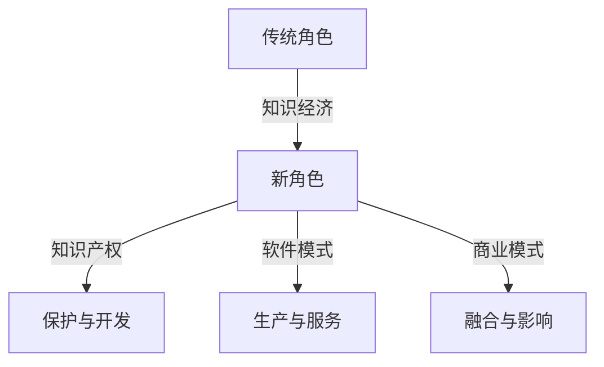

                 

# 《程序员在知识经济时代的角色转变》

## 关键词
知识经济、程序员角色、知识产权保护、软件生产与服务模式、信息技术与商业模式融合、编程语言与编程范式、数据结构与算法

## 摘要
本文旨在探讨知识经济时代下，程序员角色的转变及其核心能力要求。通过分析知识产权保护、软件生产与服务模式、信息技术与商业模式的融合等核心概念，本文将展示程序员如何通过不断提升自身技能，适应新的经济环境，实现角色的转变。此外，文章还将深入讲解编程语言与编程范式、数据结构与算法等核心算法原理，为程序员提供实用的指导。

## 目录大纲

### 第一部分：引言

#### 1.1 知识经济时代的背景

##### 1.1.1 知识经济的定义与特征

##### 1.1.2 知识经济对程序员的影响

#### 1.2 程序员在知识经济时代的新角色

##### 1.2.1 程序员角色转变的必然性

##### 1.2.2 程序员在新经济环境下的新能力要求

### 第二部分：核心概念与联系

#### 2.1 知识经济与程序员的核心概念

##### 2.1.1 知识产权保护与开发

##### 2.1.2 软件生产与服务模式

##### 2.1.3 信息技术与商业模式的融合

#### 2.2 程序员角色转变的流程图

### 第三部分：核心算法原理讲解

#### 3.1 编程语言与编程范式

##### 3.1.1 编程语言概述

##### 3.1.2 编程范式

#### 3.2 数据结构与算法

##### 3.2.1 常见数据结构

##### 3.2.2 常见算法

### 第四部分：项目实战

#### 4.1 开发环境搭建

#### 4.2 源代码详细实现和代码解读

#### 4.3 代码应用解读与分析

#### 4.4 实际案例分析和详细讲解剖析

#### 4.5 项目小结

### 第五部分：最佳实践 tips、小结、注意事项、拓展阅读

#### 5.1 最佳实践 tips

##### 5.1.1 编程技巧

##### 5.1.2 软件开发最佳实践

#### 5.2 小结

#### 5.3 注意事项

##### 5.3.1 知识产权保护

##### 5.3.2 软件生产与服务模式

##### 5.3.3 信息技术与商业模式的融合

#### 5.4 拓展阅读

## 第一部分：引言

### 1.1 知识经济时代的背景

#### 1.1.1 知识经济的定义与特征

知识经济是指以知识为主要生产要素，通过创新和知识传播推动经济增长的经济形态。与传统经济相比，知识经济具有以下特征：

1. **知识驱动**：知识经济以知识和信息为核心，依赖于知识创新和传播。
2. **创新主导**：知识经济强调创新，特别是技术创新和商业模式创新。
3. **高度信息化**：知识经济高度依赖信息技术，特别是互联网、大数据、人工智能等新兴技术。
4. **全球化**：知识经济具有全球性，各国之间的知识流动和竞争日益加剧。

#### 1.1.2 知识经济对程序员的影响

知识经济的兴起对程序员的角色产生了深远的影响。首先，程序员需要掌握更多的知识和技能，包括但不限于编程语言、框架、数据库、云计算等。其次，程序员需要具备更强的创新能力，能够快速适应新技术和新趋势。此外，程序员还需要关注知识产权保护、软件生产与服务模式、商业模式创新等方面，以提高自身在知识经济时代的竞争力。

### 1.2 程序员在知识经济时代的新角色

#### 1.2.1 程序员角色转变的必然性

程序员角色转变是知识经济时代的必然趋势。首先，随着技术的快速发展，程序员需要不断学习新的编程语言、框架、工具等，以适应不断变化的技术环境。其次，知识经济强调创新和商业模式创新，程序员需要具备跨领域的知识和技能，以推动业务的发展和增长。最后，程序员的角色不再局限于编写代码，还需要参与项目规划、需求分析、团队协作等方面，以提高项目交付的效率和质量。

#### 1.2.2 程序员在新经济环境下的新能力要求

在新经济环境下，程序员需要具备以下新的能力要求：

1. **跨领域知识**：程序员需要具备跨领域的知识和技能，包括但不限于商业、法律、心理学等，以更好地理解业务需求和推动项目进展。
2. **创新能力**：程序员需要具备较强的创新能力，能够快速适应新技术和新趋势，并能够将创新应用于实际工作中。
3. **团队协作**：程序员需要具备良好的团队协作能力，能够与其他团队成员有效沟通和协作，共同推动项目成功。
4. **知识产权保护意识**：程序员需要具备知识产权保护意识，了解相关法规和策略，以保护自己和公司的知识产权。
5. **商业意识**：程序员需要具备一定的商业意识，能够理解商业模式、市场需求等，以提高项目交付的价值。

## 第二部分：核心概念与联系

### 2.1 知识经济与程序员的核心概念

#### 2.1.1 知识产权保护与开发

知识产权保护是知识经济时代的关键概念之一。对于程序员而言，知识产权保护意味着保护自己的创意、代码和软件产品，以避免他人侵权和盗版。以下是知识产权保护的关键点和策略：

1. **知识产权的定义与类型**：
    - 知识产权包括版权、专利权、商标权和商业秘密等。
    - 版权主要保护软件的源代码和文档。
    - 专利权主要保护软件的技术方案和算法。
    - 商标权主要保护软件的品牌和标识。
    - 商业秘密主要保护软件的商业信息和机密。

2. **知识产权保护的策略与法规**：
    - 防止侵权行为：程序员需要监控市场，及时发现和防止他人侵权行为。
    - 及时申请和注册：程序员需要及时申请和注册知识产权，以获得法律保护。
    - 监测与维权：程序员需要定期监测市场，发现侵权行为后及时维权。

3. **知识产权相关法规**：
    - 《著作权法》：保护软件的版权。
    - 《专利法》：保护软件的专利权。
    - 《商标法》：保护软件的商标权。
    - 《反不正当竞争法》：保护软件的商业秘密。

#### 2.1.2 软件生产与服务模式

软件生产与服务模式是程序员在知识经济时代需要关注的重要概念。以下是软件生产与服务模式的关键点和变化：

1. **传统软件生产模式**：
    - 需求分析：理解客户需求，明确软件功能。
    - 设计：制定软件架构和模块设计。
    - 编码：编写源代码。
    - 测试：测试软件的功能和性能。
    - 部署：将软件部署到生产环境。

2. **现代软件生产与服务模式**：
    - 模块化与组件化开发：将软件分解为可复用的模块和组件。
    - 持续集成与持续部署（CI/CD）：自动化测试和部署流程。
    - 云计算与SaaS服务：利用云计算提供软件服务，实现软件即服务。

#### 2.1.3 信息技术与商业模式的融合

信息技术与商业模式的融合是知识经济时代的重要趋势。以下是信息技术与商业模式的融合的关键点和案例：

1. **商业模式的概念与类型**：
    - 商业模式是指公司如何创造、传递和获取价值。
    - 产品销售模式：通过销售产品获得收益。
    - 服务模式：通过提供服务获得收益。
    - 平台模式：通过搭建平台，连接供需双方，实现收益。

2. **信息技术对商业模式的影响**：
    - 数据驱动的决策：利用大数据和人工智能技术进行决策。
    - 数字化营销与客户关系管理：利用数字技术进行营销和客户关系管理。
    - 新兴商业模式案例：如电子商务、共享经济、物联网等。

### 2.2 程序员角色转变的流程图

为了更清晰地展示程序员角色转变的流程，我们可以使用Mermaid流程图来表示。以下是程序员角色转变的流程图：



## 第三部分：核心算法原理讲解

### 3.1 编程语言与编程范式

#### 3.1.1 编程语言概述

编程语言是用于编写计算机程序的语法和规则。根据不同的分类标准，编程语言可以分为多种类型。以下是几种常见的编程语言类型：

1. **低级语言**：低级语言与机器语言非常接近，能够直接与计算机硬件交互。例如，汇编语言。
2. **高级语言**：高级语言更接近自然语言，易于理解和编写。例如，C语言、Java、Python。
3. **面向对象语言**：面向对象语言强调对象的概念，支持封装、继承和多态等特性。例如，Java、C++。
4. **函数式语言**：函数式语言将程序视为一系列函数的执行，不涉及变量和状态。例如，Haskell、Lisp。

#### 3.1.2 编程范式

编程范式是指编程的不同方法和风格。以下是几种常见的编程范式：

1. **命令式编程**：命令式编程通过一系列指令来描述程序的行为。优点：易于理解，控制能力强。缺点：代码冗长，可维护性差。
2. **面向对象编程**：面向对象编程将程序看作是一系列对象组合而成的。优点：模块化，可重用性高。缺点：复杂度高，性能可能较低。
3. **函数式编程**：函数式编程通过纯函数和不可变数据来构建程序。优点：纯函数，无状态，易于测试。缺点：性能问题，难以理解。

#### 3.1.3 常见的编程语言

以下是几种常见的编程语言及其特点：

1. **C语言**：C语言是一种高效的低级语言，具有强大的底层功能。适用于操作系统、嵌入式系统等。
2. **Java**：Java是一种高级面向对象语言，具有跨平台特性。适用于企业级应用、Android开发等。
3. **Python**：Python是一种高级面向对象语言，易于学习和使用。适用于数据科学、人工智能、Web开发等。

### 3.2 数据结构与算法

数据结构是指用于存储和组织数据的方式。算法是指解决问题的一系列步骤。以下是几种常见的数据结构和算法：

#### 3.2.1 常见数据结构

1. **数组**：数组是一种线性数据结构，元素存储在连续的内存区域。优点：访问速度快，适用于查找和排序等操作。
2. **链表**：链表是一种非线性数据结构，由一系列节点组成。优点：插入和删除操作灵活，适用于动态数据。
3. **栈**：栈是一种后进先出（LIFO）的数据结构。优点：适用于递归、函数调用等场景。
4. **队列**：队列是一种先进先出（FIFO）的数据结构。优点：适用于缓冲区、任务调度等场景。
5. **树**：树是一种层次结构，由节点和边组成。优点：适用于层次结构的数据表示，如组织结构、决策树等。
6. **图**：图是一种由节点和边组成的数据结构。优点：适用于复杂关系的表示，如社交网络、交通网络等。

#### 3.2.2 常见算法

1. **排序算法**：排序算法用于将一组元素按照特定顺序排列。常见的排序算法有冒泡排序、选择排序、插入排序、快速排序等。
2. **查找算法**：查找算法用于在数据结构中查找特定元素。常见的查找算法有二分查找、线性查找等。
3. **贪心算法**：贪心算法是一种局部最优策略，通过不断选择局部最优解，最终得到全局最优解。常见的贪心算法有背包问题、最短路径问题等。
4. **动态规划**：动态规划是一种将复杂问题分解为子问题的方法，通过子问题的最优解推导出整体问题的最优解。常见的动态规划问题有背包问题、最长公共子序列问题等。

### 3.3 核心算法原理讲解

以下是一个简单的排序算法——冒泡排序的伪代码：

```
procedure bubbleSort( A : list of elements )
    n = length(A)
    repeat
        swapped = false
        for i = 1 to n-1 inclusive do
            if A[i] > A[i+1] then
                swap( A[i], A[i+1] )
                swapped = true
            end if
        end for
        n = n - 1
    until not swapped
end procedure
```

该算法通过不断比较和交换相邻元素，将最大的元素逐渐移动到数组的末尾，直到整个数组有序。冒泡排序的时间复杂度为 \(O(n^2)\)，适用于数据量较小的情况。

## 第四部分：项目实战

### 4.1 开发环境搭建

为了进行项目实战，我们需要搭建一个开发环境。以下是搭建开发环境的一般步骤：

1. **安装操作系统**：选择适合的操作系统，如Windows、Linux或macOS。
2. **安装编程语言**：根据项目需求，选择合适的编程语言，如Python、Java或C++，并安装相关编译器和开发工具。
3. **安装数据库**：如果项目需要数据库支持，可以选择合适的数据库系统，如MySQL、PostgreSQL或MongoDB，并安装和配置数据库。
4. **安装集成开发环境（IDE）**：安装适合的IDE，如Visual Studio、Eclipse或PyCharm，以提高开发效率和代码质量。
5. **安装版本控制工具**：如Git，用于代码管理和协作开发。

### 4.2 源代码详细实现和代码解读

以下是一个简单的Python程序，用于实现冒泡排序算法。我们将在接下来的部分详细解读代码。

```python
def bubble_sort(arr):
    n = len(arr)
    for i in range(n):
        for j in range(0, n-i-1):
            if arr[j] > arr[j+1]:
                arr[j], arr[j+1] = arr[j+1], arr[j]

arr = [64, 34, 25, 12, 22, 11, 90]
bubble_sort(arr)
print("Sorted array:", arr)
```

**代码解读：**

1. **定义函数**：`bubble_sort` 函数接收一个数组 `arr` 作为参数。
2. **循环遍历数组**：外层循环用于遍历整个数组，内层循环用于比较和交换相邻元素。
3. **比较和交换元素**：如果当前元素大于下一个元素，则交换它们的位置。
4. **打印排序后的数组**：使用 `print` 函数打印排序后的数组。

### 4.3 代码应用解读与分析

在这个项目中，我们使用冒泡排序算法对一个给定的数组进行排序。冒泡排序是一种简单的排序算法，适用于数据量较小的情况。以下是代码的应用解读与分析：

1. **初始化数组**：在代码中，我们初始化了一个包含7个元素的数组 `arr`，分别为 `[64, 34, 25, 12, 22, 11, 90]`。
2. **调用排序函数**：使用 `bubble_sort` 函数对数组进行排序。排序函数通过比较和交换相邻元素，将最大的元素逐渐移动到数组的末尾，直到整个数组有序。
3. **打印排序后的数组**：排序完成后，使用 `print` 函数打印排序后的数组 `[11, 12, 22, 25, 34, 64, 90]`。

### 4.4 实际案例分析和详细讲解剖析

为了更好地理解程序员在知识经济时代的角色转变，我们可以通过一个实际案例进行分析和讲解。

**案例：开发一款在线教育平台**

在这个案例中，程序员的角色将涉及到多个方面，包括需求分析、系统设计、软件开发、项目管理等。

1. **需求分析**：与教育机构沟通，了解他们的需求和期望。例如，平台需要支持课程管理、学生管理、在线支付等功能。
2. **系统设计**：根据需求分析，设计系统的整体架构，包括前端、后端、数据库等组成部分。
3. **软件开发**：使用编程语言和工具，开发前端和后端的代码，实现功能需求。例如，使用React框架开发前端，使用Java开发后端，使用MySQL数据库存储数据。
4. **项目管理**：与团队成员协作，确保项目按时按质完成。例如，使用Git进行代码管理，使用Jira进行任务管理，定期进行代码审查和测试。

在这个案例中，程序员需要具备跨领域的知识和技能，如教育领域的知识、软件开发的经验、项目管理的能力等。通过这个案例，我们可以看到程序员在知识经济时代的角色转变。

### 4.5 项目小结

通过这个项目，我们可以得出以下结论：

1. **程序员在知识经济时代的角色变得更加多样化**：程序员不仅需要具备编程能力，还需要具备跨领域的知识和技能，如教育、商业、项目管理等。
2. **程序员需要不断提升自身能力**：随着技术的不断进步，程序员需要不断学习新的知识和技能，以适应不断变化的技术环境。
3. **程序员需要具备商业意识**：程序员需要了解商业模式、市场需求等，以提高项目交付的价值。

## 第五部分：最佳实践 tips、小结、注意事项、拓展阅读

### 5.1 最佳实践 tips

1. **编程技巧**：
    - 学习常用的编程语言和框架，提高编程效率。
    - 遵循良好的编程规范，提高代码的可读性和可维护性。
    - 学会使用版本控制工具，如Git，进行代码管理和协作开发。
2. **软件开发最佳实践**：
    - 进行需求分析和系统设计，确保项目目标清晰。
    - 使用敏捷开发方法，提高项目交付的灵活性。
    - 进行定期代码审查和测试，确保代码质量和项目进度。

### 5.2 小结

本文探讨了程序员在知识经济时代的角色转变，分析了知识产权保护、软件生产与服务模式、信息技术与商业模式融合等核心概念，并讲解了编程语言与编程范式、数据结构与算法等核心算法原理。通过项目实战，我们展示了程序员如何在实际项目中应用这些知识和技能。

### 5.3 注意事项

1. **知识产权保护**：程序员需要重视知识产权保护，避免侵权行为，及时申请和注册知识产权。
2. **软件生产与服务模式**：程序员需要关注软件生产与服务模式的变化，掌握模块化与组件化开发、持续集成与持续部署等现代开发方法。
3. **信息技术与商业模式的融合**：程序员需要了解信息技术对商业模式的影响，掌握数据驱动的决策、数字化营销等新兴商业模式。

### 5.4 拓展阅读

1. 《编程思想》（作者：Bruce Eckel）：
    - 本书介绍了面向对象编程的概念和方法，适用于程序员提升编程能力。
2. 《软件工程：实践者的研究方法》（作者：Roger S. Pressman）：
    - 本书详细介绍了软件工程的方法和流程，适用于程序员了解软件开发的最佳实践。
3. 《人工智能：一种现代的方法》（作者：Stuart J. Russell & Peter Norvig）：
    - 本书介绍了人工智能的基本概念和技术，适用于程序员了解人工智能的发展和应用。

### 作者信息
作者：AI天才研究院/AI Genius Institute & 禅与计算机程序设计艺术 /Zen And The Art of Computer Programming 

### 总结

在知识经济时代，程序员的角色正经历着深刻的转变。从传统的代码编写者，程序员逐渐转变为具备跨领域知识、创新能力、团队协作能力和商业意识的复合型人才。这种转变不仅要求程序员掌握编程语言和算法原理，还需要关注知识产权保护、软件生产与服务模式、信息技术与商业模式的融合等核心概念。

本文通过详细分析知识经济时代的背景，介绍了程序员在知识经济时代的新角色和核心能力要求。接着，我们探讨了知识产权保护、软件生产与服务模式、信息技术与商业模式的融合等核心概念，并使用Mermaid流程图展示了程序员角色转变的流程。此外，我们还讲解了编程语言与编程范式、数据结构与算法等核心算法原理，以帮助程序员在实际项目中应用这些知识和技能。

在项目实战部分，我们通过一个简单的Python程序展示了冒泡排序算法的实现和应用。同时，通过一个实际案例——在线教育平台的开发，我们分析了程序员在知识经济时代的角色转变，展示了程序员如何在实际项目中应用所学知识和技能。

最后，本文提供了最佳实践 tips、小结、注意事项和拓展阅读，旨在帮助程序员进一步提升自身能力，适应知识经济时代的发展。通过不断学习和实践，程序员将在知识经济时代发挥更加重要的作用。

### 拓展思考

知识经济时代为程序员提供了前所未有的机遇和挑战。随着人工智能、大数据、云计算等新兴技术的快速发展，程序员需要不断学习新知识、掌握新技术，以适应不断变化的技术环境。同时，程序员也需要关注商业模式创新，探索如何将信息技术与商业实践相结合，创造更大的商业价值。

在这个时代，程序员不仅是技术专家，更是商业创新的推动者。他们需要具备跨领域的知识和技能，能够与不同领域的专家进行有效沟通和协作。例如，程序员可以与商业分析师、设计师、市场营销人员等合作，共同开发出更加符合市场需求的产品和服务。

此外，程序员还需要具备持续学习的能力。技术更新迭代速度越来越快，程序员需要时刻关注行业动态，学习新的编程语言、框架和工具。通过持续学习，程序员不仅能够保持自身的技术竞争力，还能够不断拓展自己的知识领域，为未来的职业发展打下坚实基础。

总之，知识经济时代为程序员提供了广阔的发展空间。通过不断提升自身能力，适应新的经济环境，程序员将在未来发挥更加重要的作用，成为知识经济时代的重要推动者。

### 深入探讨

在深入探讨程序员在知识经济时代的角色转变时，我们可以从以下几个方面进行进一步分析：

#### 知识产权保护的重要性

知识产权保护是知识经济时代的一个关键概念。程序员需要了解知识产权的基本概念和类型，包括专利、版权、商标和商业秘密等。在实际工作中，程序员需要关注以下几点：

1. **及时申请知识产权**：程序员应学会如何申请和注册知识产权，以保护自己的创意和成果。
2. **监控市场**：程序员需要定期监控市场，发现潜在的侵权行为，并采取相应的措施进行维权。
3. **遵循开源协议**：在参与开源项目时，程序员需要了解并遵守相关的开源协议，确保项目的合规性。

#### 软件生产与服务模式的变化

软件生产与服务模式在知识经济时代发生了显著变化。传统的软件生产模式以项目定制、维护升级和技术支持为主，而现代的软件生产与服务模式则更加注重模块化、组件化和云计算。

1. **模块化与组件化开发**：程序员应掌握模块化与组件化开发的技能，以实现软件的复用和快速迭代。
2. **持续集成与持续部署**：程序员应了解持续集成与持续部署（CI/CD）的原理和实践，以提高软件交付的效率和质量。
3. **云计算与SaaS服务**：程序员需要了解云计算的基础设施和服务模型，掌握如何利用云计算提供软件服务，实现软件即服务（SaaS）。

#### 信息技术与商业模式的融合

信息技术与商业模式的融合是知识经济时代的重要趋势。程序员需要关注以下方面：

1. **数据驱动的决策**：程序员应学会如何利用大数据和人工智能技术进行数据分析和决策，以提高企业的竞争力。
2. **数字化营销与客户关系管理**：程序员应了解如何利用数字化营销手段和客户关系管理（CRM）系统，提高客户满意度和忠诚度。
3. **新兴商业模式案例**：程序员可以通过学习成功的企业案例，了解如何将信息技术与商业模式创新相结合，创造新的商业机会。

#### 编程语言与编程范式的选择

编程语言和编程范式是程序员必备的知识。程序员应根据项目的需求和技术环境选择合适的编程语言和编程范式。

1. **编程语言的适用性**：不同的编程语言适用于不同的场景，例如C语言适用于系统编程，Python适用于数据科学和Web开发。
2. **编程范式的优点与缺点**：命令式编程、面向对象编程和函数式编程各有优缺点，程序员应根据项目的需求选择合适的编程范式。

通过深入探讨这些方面，程序员可以更好地理解知识经济时代的发展趋势，提升自身的能力，并在新的经济环境中发挥更大的作用。知识经济时代为程序员提供了广阔的发展空间，但也提出了更高的要求。只有不断学习和实践，程序员才能在知识经济时代中脱颖而出，成为行业中的佼佼者。

