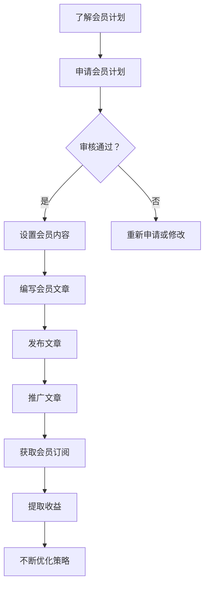

                 

### 文章标题

《程序员如何利用Medium会员计划进行写作变现》

关键词：Medium会员计划、写作变现、个人品牌、内容营销、社交媒体运营

摘要：本文将详细探讨程序员如何通过Medium会员计划实现写作变现。从会员计划的概述、写作变现的重要性，到构建个人品牌、利用Medium提升影响力，再到具体的变现原理、编写高质量文章和推广策略，本文将逐步解析程序员如何在这一平台上实现成功变现，并提供实战案例和数据解析，帮助读者更好地理解和应用这一策略。

### 第一部分：了解Medium会员计划与写作变现

#### 第1章：Medium会员计划概述

**1.1 Medium会员计划的定义与背景**

Medium是一个以高质量内容为主的平台，其会员计划为作者提供了一种直接与读者互动并获得收益的方式。会员计划的主要目的是让作者能够通过向读者收费的方式，来补贴其创作成本并获得额外的收入。

**会员计划的会员类型与权益**

- **个人会员**：个人会员可以订阅他们喜欢的作者，每月支付一定的费用，从而获得作者独家内容和优先互动的机会。
- **企业会员**：企业会员可以为员工订阅Medium，以便他们可以访问特定领域的专业内容。

**会员计划对作者的影响**

会员计划不仅为作者提供了稳定的收入来源，还增强了作者与读者之间的联系。通过会员计划，作者可以直接获取读者的反馈，从而更好地了解读者的需求，并调整自己的内容策略。

#### 第2章：写作变现的概论

**2.1 写作变现的重要性**

写作变现对于内容创作者来说至关重要。它不仅能够帮助作者实现财务自由，还能够提升内容的传播效果，进一步扩大作者的影响力。

**2.2 如何定位自己的写作风格和主题**

定位自己的写作风格和主题是写作变现的第一步。作者需要明确自己的兴趣所在，以及目标读者群体。通过深入了解自己的读者，作者可以更有针对性地创作内容。

**2.3 提升写作质量的方法**

提升写作质量是写作变现的关键。作者可以通过以下方法来提高写作质量：
- **深入研究主题**：确保对所写主题有充分的了解。
- **良好的结构**：确保文章结构清晰，逻辑严谨。
- **有效的表达**：使用简洁明了的语言，避免冗余和复杂的表达。
- **读者反馈**：定期收集读者反馈，并根据反馈进行调整。

#### 第3章：构建个人品牌

**3.1 个人品牌的价值**

个人品牌对于作者来说至关重要。它不仅能够帮助作者在众多创作者中脱颖而出，还能够提升作者的影响力和信誉度。

**3.2 如何创建个人品牌**

创建个人品牌的方法包括：
- **明确个人定位**：确定自己的独特卖点和目标读者群体。
- **持续输出高质量内容**：保持高频且高质量的输出，建立权威性。
- **社交媒体运营**：通过社交媒体与读者建立联系，提升知名度。
- **参与社区活动**：积极参与相关社区的活动，扩大影响力。

**3.3 个人品牌的维护与提升**

维护和提升个人品牌的方法包括：
- **定期更新内容**：保持活跃，不断提供新鲜内容。
- **互动与反馈**：积极与读者互动，及时回应读者反馈。
- **形象塑造**：通过言行一致，塑造良好的个人形象。
- **持续学习**：不断学习新知识，提升自身能力。

#### 第4章：利用Medium提升写作影响力

**4.1 Medium平台的运营规则**

了解Medium平台的运营规则是提升写作影响力的第一步。作者需要熟悉平台的推荐算法、文章格式要求、互动策略等。

**4.2 如何在Medium上获得更多的阅读量**

以下是一些策略可以帮助作者在Medium上获得更多的阅读量：
- **高质量内容**：确保内容有价值，能够解决读者的问题。
- **合适的时间发布**：根据读者的阅读习惯，选择最佳发布时间。
- **标题优化**：使用吸引人的标题，提高点击率。
- **社交媒体推广**：通过社交媒体分享文章，吸引更多读者。

**4.3 互动策略与读者沟通技巧**

互动策略和读者沟通技巧是提升写作影响力的重要一环。以下是一些建议：
- **积极回复评论**：及时回复读者的评论，建立良好的互动关系。
- **鼓励分享**：在文章中鼓励读者分享，扩大传播范围。
- **举办问答活动**：定期举办问答活动，与读者深入互动。

### 第二部分：利用Medium会员计划进行变现

#### 第5章：会员计划变现原理

**5.1 会员订阅模式详解**

会员订阅模式是Medium会员计划的核心。通过会员订阅，读者可以为喜欢的作者支付月费，从而获得独家内容和互动机会。

**5.2 中介平台与直接变现的差异**

中介平台和直接变现是两种不同的变现方式。中介平台如广告平台可以帮助作者将内容推广给更广泛的读者，但收益通常较低。直接变现则可以让作者直接从读者那里获得收益，但需要作者具备一定的营销能力。

**5.3 成功案例与数据解析**

通过分析成功案例，我们可以了解哪些策略和技巧能够帮助作者在Medium会员计划中取得成功。以下是一些成功案例的数据解析：
- **高频输出**：成功作者通常保持高频的内容输出。
- **个性化内容**：成功作者能够根据读者的需求提供个性化内容。
- **互动与反馈**：成功作者与读者保持积极的互动，及时回应读者反馈。

#### 第6章：编写高质量会员文章

**6.1 会员文章的选题策略**

选题策略是编写高质量会员文章的关键。以下是一些选题策略：
- **关注热点**：关注当前的热点话题，及时发布相关内容。
- **解决痛点**：针对读者的问题和痛点，提供实用的解决方案。
- **独特视角**：从独特的视角出发，提供独到的见解和分析。

**6.2 文章结构优化**

良好的文章结构能够提升读者的阅读体验。以下是一些文章结构优化的方法：
- **引言**：简明扼要地引出文章主题，激发读者的兴趣。
- **主体**：分章节阐述观点，逻辑清晰，条理分明。
- **结论**：总结文章观点，提出具体的建议或展望。

**6.3 内容营销技巧**

内容营销是会员文章成功的关键。以下是一些内容营销技巧：
- **故事化表达**：通过故事化的方式表达观点，使文章更具吸引力。
- **数据支持**：使用数据支持观点，增加文章的可信度。
- **互动引导**：在文章中引导读者参与互动，增加读者的参与度。

#### 第7章：会员文章发布与推广

**7.1 如何发布高质量的会员文章**

发布高质量的会员文章是成功变现的关键。以下是一些建议：
- **优化标题和摘要**：使用吸引人的标题和摘要，提高点击率。
- **图片和格式优化**：使用高质量的图片和适当的格式，提升文章的可读性。
- **合理的时间发布**：根据读者的阅读习惯，选择最佳发布时间。

**7.2 推广策略与渠道选择**

有效的推广策略和渠道选择能够帮助会员文章获得更多的曝光。以下是一些推广策略和渠道选择：
- **社交媒体推广**：通过社交媒体平台分享文章，吸引更多读者。
- **邮件营销**：通过邮件列表向订阅者推送文章，提高阅读量。
- **合作推广**：与其他作者或平台合作，互相推广，扩大影响力。

**7.3 社交媒体运营技巧**

社交媒体运营技巧对于会员文章的推广至关重要。以下是一些建议：
- **定期更新**：保持社交媒体账号的活跃度，定期发布内容。
- **互动与反馈**：积极与粉丝互动，及时回应粉丝的反馈。
- **多样化内容**：发布多种类型的内容，满足不同粉丝的需求。

### 第三部分：实战与优化

#### 第8章：利用会员计划扩大收益

**8.1 多平台运营策略**

通过多平台运营，作者可以扩大自己的影响力，并获得更多的收益。以下是一些多平台运营策略：
- **同步发布**：将文章同步发布到多个平台，提高曝光率。
- **差异化内容**：根据不同平台的特性，发布差异化内容，满足不同平台读者的需求。
- **平台互动**：积极参与各个平台的互动，提升自己在各平台的知名度。

**8.2 建立个人社群**

建立个人社群可以帮助作者更好地与读者互动，并提升品牌影响力。以下是一些建立个人社群的方法：
- **微信、QQ群**：创建微信群或QQ群，与读者建立直接联系。
- **线上论坛**：在知乎、豆瓣等线上论坛创建个人话题，与读者进行深度交流。
- **线下活动**：定期举办线下活动，与读者面对面交流。

**8.3 会员计划与其他变现方式的结合**

将会员计划与其他变现方式相结合，可以最大化作者的收益。以下是一些结合的方法：
- **广告收入**：在文章中插入广告，获取额外的广告收入。
- **课程销售**：开设在线课程，销售自己的知识和经验。
- **咨询服务**：提供专业的咨询服务，为读者提供解决方案。

#### 第9章：实战案例分析

**9.1 成功案例详解**

通过对成功案例的详细分析，我们可以了解成功的关键因素和可行的策略。以下是一些成功案例的详解：
- **案例1**：作者A通过高频输出和个性化内容，成功吸引了大量读者，实现了稳定的会员收入。
- **案例2**：作者B通过社交媒体推广和线下活动，成功扩大了自己的影响力，实现了多元化的收益。

**9.2 案例中的策略与技巧**

成功案例中，作者通常采用了以下策略和技巧：
- **内容为王**：始终以高质量的内容为核心，满足读者的需求。
- **互动为王**：与读者保持积极的互动，提升读者的参与度。
- **差异化运营**：根据不同平台和读者的特性，制定差异化的运营策略。

**9.3 案例中的不足与改进建议**

虽然成功案例有很多值得借鉴的地方，但仍然存在一些不足之处。以下是一些建议：
- **内容多样性**：部分作者内容过于单一，可以尝试多样化内容，满足更广泛的读者需求。
- **推广力度**：部分作者在推广方面投入不足，可以加大推广力度，提高文章的曝光率。
- **粉丝互动**：部分作者与粉丝互动不够频繁，可以增加互动频率，提升粉丝的忠诚度。

#### 第10章：数据驱动写作变现

**10.1 数据分析在写作变现中的应用**

数据分析在写作变现中起着重要作用。通过数据分析，作者可以了解读者的需求和行为，从而优化内容策略。以下是一些数据分析的应用：
- **读者分析**：分析读者的基本属性，如年龄、性别、地域等，了解目标读者群体。
- **内容分析**：分析文章的阅读量、点赞数、评论数等数据，了解哪些内容更受欢迎。
- **行为分析**：分析读者的阅读行为，如阅读时间、阅读时长等，了解读者的阅读习惯。

**10.2 如何收集与分析读者数据**

以下是一些收集和分析读者数据的方法：
- **Medium内置工具**：使用Medium内置的数据分析工具，了解文章的表现和读者的行为。
- **第三方工具**：使用第三方工具，如Google Analytics，进行更深入的数据分析。
- **问卷调查**：通过问卷调查收集读者的反馈，了解他们的需求和期望。

**10.3 数据驱动的写作策略调整**

基于数据分析，作者可以调整写作策略，提升变现效果。以下是一些建议：
- **内容调整**：根据读者的需求和偏好，调整文章的主题和内容。
- **发布时间**：根据读者的阅读习惯，选择最佳发布时间。
- **互动策略**：根据读者的反馈和行为，调整互动策略，提升读者的参与度。

#### 第11章：不断优化写作变现策略

**11.1 如何识别写作变现中的问题**

以下是一些识别写作变现中问题的方法：
- **数据异常**：通过数据分析，识别数据异常，如阅读量突然下降等。
- **读者反馈**：通过读者反馈，了解他们对文章的满意度和需求。
- **竞争对手分析**：分析竞争对手的表现，了解他们的优点和不足。

**11.2 优化策略的制定与实施**

以下是一些优化策略的制定与实施方法：
- **目标明确**：明确优化目标，如提高阅读量、提升会员收入等。
- **分阶段实施**：将优化策略分为短期、中期和长期，分阶段实施。
- **持续监控**：在实施过程中，持续监控效果，根据实际情况进行调整。

**11.3 保持持续改进的心态**

写作变现是一个不断优化的过程，以下是一些保持持续改进心态的方法：
- **保持好奇心**：对新的趋势和技巧保持好奇心，不断学习。
- **勇于尝试**：勇于尝试新的策略和技巧，不怕失败。
- **反思与总结**：定期反思自己的写作变现过程，总结经验教训。

### 附录

#### 附录A：常用写作工具与资源

**A.1 Markdown编辑器推荐**

- **MacDown**：一款功能强大且易用的Markdown编辑器，适用于Mac用户。
- **Typora**：一款简洁的Markdown编辑器，支持实时预览，适用于Windows、Mac和Linux。

**A.2 写作素材来源**

- **Medium**：Medium本身就是一个丰富的写作素材来源，作者可以从中获取灵感和素材。
- **新闻报道**：关注各大新闻网站的报道，了解时事热点，获取写作素材。
- **学术论文**：阅读学术论文，了解行业前沿动态，获取专业的观点和数据。

**A.3 数据分析工具介绍**

- **Google Analytics**：一款强大的网站分析工具，可以帮助作者了解网站的表现和读者的行为。
- **Tableau**：一款数据可视化工具，可以帮助作者将数据分析结果以图表的形式呈现。

#### 附录B：Medium会员计划常见问题解答

**B.1 会员计划申请流程**

- **注册账号**：首先需要在Medium上注册一个账号。
- **申请会员计划**：在个人主页中找到会员计划的申请入口，填写相关信息并提交申请。
- **审核通过**：Medium团队会在收到申请后进行审核，审核通过后即可开始设置会员内容。

**B.2 会员文章审核标准**

- **内容质量**：会员文章需要具有较高的内容质量和原创性。
- **文章格式**：文章格式需要符合Medium的要求，包括标题、摘要、正文等。
- **合法合规**：文章内容需要合法合规，不涉及违法和不当内容。

**B.3 会员收益分配规则**

- **会员收入**：会员收入的分配规则根据会员订阅的数量和频率进行计算。
- **收益提取**：作者可以在设置中提取会员收入，提取方式包括银行转账、支付宝等。

#### 附录C：会员计划成功案例汇编

**C.1 成功案例精选**

- **案例1**：作者A通过个性化内容和互动策略，成功吸引了大量会员，实现了稳定的收益。
- **案例2**：作者B通过定期举办问答活动，提升了会员的参与度，实现了会员收入的双倍增长。

**C.2 案例背后的故事**

每个成功案例背后都有不为人知的故事，以下是一些案例背后的故事：
- **案例1**：作者A在一次偶然的机会中发现了Medium会员计划，并决定尝试。经过一段时间的努力，他成功吸引了大量会员，实现了财务自由。
- **案例2**：作者B在开始写作之前，并没有太多的写作经验。但他通过不断学习和实践，最终在Medium上取得了成功。

**C.3 案例的启示与借鉴意义**

成功案例为我们提供了宝贵的经验和启示：
- **内容为王**：无论在任何平台上，高质量的内容都是成功的关键。
- **互动为王**：与读者保持良好的互动，提升读者的参与度和忠诚度。
- **持续学习**：不断学习新的知识和技能，不断提升自己的竞争力。

## Mermaid 流程图：Medium会员计划变现流程

### 总结与启示

Medium会员计划为程序员提供了一个新的写作变现渠道。通过构建个人品牌、编写高质量文章、有效推广和互动，程序员可以在Medium上实现稳定的收入。同时，数据驱动和持续优化策略也是实现成功的关键。希望本文能够为程序员在Medium会员计划中的写作变现提供有益的启示和指导。

### 作者信息

作者：AI天才研究院/AI Genius Institute & 禅与计算机程序设计艺术 /Zen And The Art of Computer Programming

### 文章结语

在这个数字时代，写作不仅是一种表达自我的方式，更是一个有价值的技能。希望本文能够帮助您更好地利用Medium会员计划进行写作变现，实现财务自由和个人品牌建设。不断学习、实践和优化，您一定能够在写作的道路上取得更大的成功。

### 附录D：最佳实践与注意事项

**最佳实践**

1. **内容质量**：始终将内容质量放在首位，确保文章有价值、有深度。
2. **互动与反馈**：积极与读者互动，及时回应读者反馈，提升读者参与度。
3. **差异化内容**：根据不同平台和读者的特性，提供差异化内容，满足多元化需求。
4. **数据驱动**：定期分析数据，了解读者的行为和需求，优化内容策略。

**注意事项**

1. **遵守规则**：了解并遵守Medium的会员计划规则，避免违规行为。
2. **合理规划**：合理安排写作和推广时间，保持稳定的内容输出。
3. **保护隐私**：在文章中保护读者的隐私，避免泄露敏感信息。
4. **持续学习**：关注行业动态，不断学习新知识和技能，提升自身竞争力。

### 拓展阅读

- **Medium官方文档**：[Medium会员计划官方文档](https://medium.com/me/write-to-your-members/91b7073466e5)
- **内容营销经典书籍**：《内容营销：如何创建吸引人的内容，赢得客户的忠诚与信任》
- **数据分析工具介绍**：《Google Analytics入门与实践》

通过阅读这些资源，您可以进一步了解Medium会员计划的细节，掌握内容营销和数据分析的技巧，为自己的写作变现之路提供更多支持和指导。祝您在Medium上取得成功！

