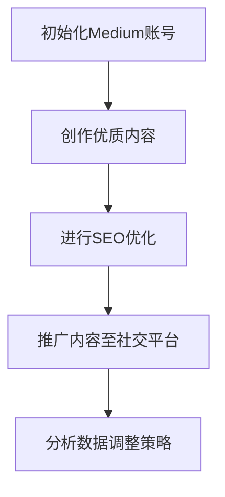

                 

### 《程序员如何利用Medium进行知识变现》

> 关键词：程序员、知识变现、Medium平台、内容创作、SEO优化、社交媒体推广

> 摘要：本文将探讨程序员如何利用Medium平台进行知识变现。从基础知识的介绍，到内容创作技巧、SEO优化与推广、广告与收益模式，再到个人品牌打造和实战案例分析，本文将逐步剖析程序员在Medium平台上实现知识变现的路径和策略。

### 第一部分：基础知识篇

#### 1. Medium平台介绍

##### 1.1 Medium平台概述

Medium是一个全球知名的在线出版和内容共享平台，成立于2012年。与传统的博客平台不同，Medium注重于高质量的内容创作和互动，吸引了众多专业人士和内容创作者入驻。平台上的文章以垂直领域为主，涵盖科技、商业、生活方式等多个方面。

##### 1.2 Medium的优势与特点

Medium具有以下几个显著优势：

1. **高质量内容**：平台致力于为用户提供优质、有深度的内容。
2. **易于使用**：平台界面简洁，用户可以轻松发布和编辑文章。
3. **互动性强**：读者可以通过评论、点赞和分享与作者互动。
4. **社区氛围**：Medium鼓励用户之间的交流和合作，形成了良好的社区氛围。

##### 1.3 Medium平台的发展历程

- **2012年**：Medium正式上线，迅速吸引了大量用户。
- **2013年**：推出会员订阅服务，为内容创作者提供了新的收入来源。
- **2017年**：发布“Evergreen”内容策略，鼓励创作者发布长期有价值的内容。
- **至今**：Medium已经成为一个内容创作者的聚集地，持续推动高质量内容的传播。

#### 2. 知识变现原理

##### 2.1 什么是知识变现

知识变现是指将个人的专业知识、经验和技能转化为经济收益的过程。在互联网时代，知识变现成为了一种重要的收入来源，尤其是在知识共享平台上。

##### 2.2 知识变现的路径

1. **内容创作**：创作者通过创作有价值的内容吸引读者。
2. **受众积累**：通过持续的优质内容创作，积累忠实读者群体。
3. **变现途径**：通过广告、赞助、会员订阅等多种途径实现知识变现。

##### 2.3 Medium平台上的知识变现模式

1. **广告收入**：Medium平台会根据读者的浏览量、点击量等指标为内容创作者分配广告收入。
2. **内容赞助**：品牌或企业通过赞助内容创作者的文章，实现品牌曝光和宣传。
3. **会员订阅**：Medium会员可以订阅创作者的内容，享受独家、深度内容。

#### 3. 内容创作技巧

##### 3.1 文章写作技巧

**3.1.1 选择合适的主题**

1. **关注热点**：紧跟行业动态，选择热门、有争议的话题。
2. **深入分析**：对主题进行深入挖掘，提供独到的见解和分析。
3. **用户需求**：了解目标读者的需求和兴趣，创作能满足他们需求的内容。

**3.1.2 结构化文章内容**

1. **明确结构**：文章应具有清晰的结构，分为引言、正文和结论。
2. **合理分段**：确保文章段落之间逻辑连贯，便于读者阅读。
3. **使用图表**：通过图表、图片等视觉元素，增强文章的直观性和可读性。

**3.1.3 优化文章语言风格**

1. **简洁明了**：避免使用过于复杂的词汇和句式，使文章易于理解。
2. **口语化表达**：适当使用口语化的表达，增加文章的亲和力。
3. **引人入胜**：使用引人入胜的开头和结尾，吸引读者的注意力。

##### 3.2 多媒体内容创作

**3.2.1 视频内容创作**

1. **内容类型**：视频可以包括教程、访谈、讲解等多种形式。
2. **制作质量**：确保视频画面清晰，音频质量良好。
3. **剪辑技巧**：通过合理的剪辑，提高视频的观看体验。

**3.2.2 图片和图表的使用**

1. **视觉吸引**：图片和图表可以吸引读者的注意力，提高文章的吸引力。
2. **内容补充**：通过图片和图表，直观地展示数据和分析结果。
3. **优化加载速度**：避免使用过大的图片和图表，确保文章加载速度快。

##### 3.3 交互与社区建设

**3.3.1 与读者互动**

1. **及时回复**：及时回复读者的评论，增加与读者的互动。
2. **鼓励讨论**：鼓励读者在文章下方留言，促进讨论。
3. **创建社群**：通过微信群、QQ群等工具，创建粉丝社群，增强用户黏性。

**3.3.2 建立粉丝社群**

1. **社群定位**：明确社群的目标和定位，吸引目标粉丝。
2. **定期活动**：组织线上或线下活动，增强社群凝聚力。
3. **内容输出**：定期发布高质量的内容，保持社群活跃度。

#### 4. SEO优化与推广

##### 4.1 SEO基础

**4.1.1 关键词研究**

1. **选择合适的关键词**：通过工具，分析关键词的搜索量和竞争程度，选择合适的关键词。
2. **关键词分布**：在文章的标题、摘要、正文和标签中合理分布关键词。

**4.1.2 标题优化**

1. **吸引人**：使用引人入胜的标题，吸引读者点击。
2. **简洁明了**：标题应简洁明了，避免使用模糊、冗长的标题。

**4.1.3 描述优化**

1. **突出亮点**：在描述中突出文章的亮点和核心内容。
2. **吸引点击**：描述应具备吸引力，促使读者点击阅读。

##### 4.2 社交媒体推广

**4.2.1 利用社交媒体平台**

1. **多平台运营**：在多个社交媒体平台上发布文章，扩大曝光度。
2. **合理规划发布时间**：根据不同平台的用户活跃时间，合理规划文章发布时间。

**4.2.2 社交媒体账号运营**

1. **保持活跃**：定期发布内容，保持账号的活跃度。
2. **互动互动**：积极与粉丝互动，提高粉丝黏性。

**4.2.3 社交媒体广告投放**

1. **精准定位**：根据目标受众的特点，进行精准广告投放。
2. **合理预算**：设置合理的广告预算，避免过度消费。

#### 5. 广告与收益模式

##### 5.1 Medium广告机制

**5.1.1 广告类型**

Medium平台上的广告主要包括以下类型：

1. **横幅广告**：在文章页面的顶部或底部显示的广告。
2. **推荐文章广告**：在文章页面的右侧或底部推荐相关文章的广告。
3. **搜索广告**：在搜索结果页面显示的广告。

**5.1.2 广告收益分配**

Medium平台将广告收入与内容创作者按照一定比例进行分配。具体分配比例取决于多个因素，如文章的阅读量、点击量等。

##### 5.2 内容赞助

**5.2.1 内容赞助的定义**

内容赞助是指品牌或企业为创作者提供资金或其他资源，以换取在创作者文章中展示品牌信息或宣传品牌产品的权利。

**5.2.2 内容赞助的合作模式**

1. **品牌冠名**：创作者为品牌创作一篇专稿，品牌支付一定的费用。
2. **广告植入**：创作者在文章中适当植入品牌广告，品牌支付费用。
3. **联合营销**：创作者和品牌共同策划活动或内容，品牌支付费用。

##### 5.3 会员订阅

**5.3.1 会员订阅的优势**

1. **稳定收入**：会员订阅为创作者提供了稳定的收入来源。
2. **深度内容**：会员可以享受创作者的独家、深度内容。
3. **用户黏性**：会员订阅有助于增强用户与创作者之间的互动和黏性。

**5.3.2 会员订阅模式**

1. **单篇订阅**：读者为单篇文章支付订阅费用。
2. **专题订阅**：读者为一系列专题内容支付订阅费用。
3. **年费订阅**：读者为一年内的所有内容支付订阅费用。

#### 6. 个人品牌打造

##### 6.1 个人品牌的重要性

个人品牌是指个人在某一领域的声誉、知名度和影响力。在知识变现的过程中，个人品牌具有以下几个重要作用：

1. **提升信任度**：建立良好的个人品牌，有助于提升读者对创作者的信任度。
2. **扩大影响力**：个人品牌有助于创作者扩大影响力，吸引更多读者和机会。
3. **增加收益**：良好的个人品牌为创作者带来了更多的商业合作机会，从而增加收益。

##### 6.2 个人品牌定位

1. **明确目标受众**：明确目标受众，了解他们的需求和兴趣。
2. **专业领域定位**：在某一专业领域内建立个人品牌，成为该领域的专家。
3. **独特性**：打造独特的个人品牌形象，与其他创作者区分开来。

##### 6.3 建立个人品牌策略

1. **内容输出**：持续输出高质量的内容，展示专业知识和独特见解。
2. **社交媒体运营**：积极运营社交媒体账号，提升个人知名度。
3. **互动互动**：与读者互动，建立良好的关系，增强用户黏性。
4. **拓展合作**：积极拓展合作机会，扩大个人品牌的影响力。

### 第二部分：实战篇

#### 7. Medium平台实战案例

##### 7.1 成功案例介绍

在Medium平台上，有许多成功的案例值得借鉴。以下是一些典型的成功案例：

1. **Tim Urban**：以其独特的写作风格和对复杂概念的解释而闻名，其文章深受读者喜爱。
2. **Morgan Housel**：以其深刻的见解和对商业领域的深入分析而受到广泛赞誉。
3. **Chris Guillebeau**：以其对旅行的热爱和创业经验而成为Medium上的知名作家。

##### 7.2 案例分析

通过分析这些成功案例，可以发现以下几个共同点：

1. **高质量内容**：这些作家的文章内容具有很高的质量，既有深度又有趣味。
2. **专业领域定位**：这些作家都在某一专业领域内建立了自己的品牌，成为该领域的专家。
3. **互动互动**：这些作家积极与读者互动，建立了良好的读者关系。

##### 7.3 案例启示

从这些成功案例中，我们可以得到以下启示：

1. **内容为王**：高质量的内容是成功的关键，创作者需要不断努力提升内容质量。
2. **专业定位**：在某一专业领域内建立个人品牌，有助于提高影响力。
3. **互动互动**：与读者互动，建立良好的读者关系，有助于增强用户黏性。

#### 8. 实战技巧与经验分享

##### 8.1 内容创作经验分享

1. **选题慎重**：选择具有热点和争议性的话题，能够吸引读者的注意力。
2. **内容结构**：确保文章结构清晰，逻辑连贯，便于读者阅读。
3. **视觉元素**：合理使用图片、图表等视觉元素，提高文章的可读性。

##### 8.2 SEO实战技巧

1. **关键词研究**：使用专业的SEO工具进行关键词研究，选择适合的关键词。
2. **标题优化**：标题应简洁明了，同时包含关键词，提高点击率。
3. **描述优化**：描述应突出文章的核心内容，吸引读者点击阅读。

##### 8.3 社交媒体运营技巧

1. **多平台运营**：在多个社交媒体平台上发布内容，扩大曝光度。
2. **定期发布**：保持定期发布内容，提高账号的活跃度。
3. **互动互动**：积极与粉丝互动，提高粉丝黏性。

#### 9. 实际操作指南

##### 9.1 注册与账号设置

1. **注册账号**：在Medium官网注册账号，填写基本信息。
2. **账号设置**：完善个人资料，包括头像、简介等。
3. **绑定社交媒体**：绑定其他社交媒体账号，方便推广内容。

##### 9.2 文章发布流程

1. **选题确定**：选择合适的话题，进行深入研究。
2. **内容创作**：按照文章写作技巧，创作高质量的内容。
3. **发布文章**：在Medium平台上发布文章，设置发布时间和标签。

##### 9.3 广告投放与收益跟踪

1. **广告投放**：根据平台指南，设置广告投放策略。
2. **收益跟踪**：定期查看广告收益和文章表现，进行策略调整。

#### 10. 中期策略与持续发展

##### 10.1 内容更新策略

1. **定期更新**：保持定期更新内容，保持账号活跃度。
2. **内容多元化**：尝试不同类型的内容，满足不同读者的需求。
3. **热点话题**：紧跟行业动态，及时发布热点话题内容。

##### 10.2 长期发展规划

1. **专业定位**：在某一专业领域内建立个人品牌，成为专家。
2. **内容质量**：持续提升内容质量，保持高质量内容输出。
3. **粉丝互动**：与粉丝互动，建立良好的读者关系。

##### 10.3 适应变化与持续创新

1. **关注平台动态**：关注Medium平台的更新和变化，及时调整策略。
2. **尝试新形式**：尝试新的内容形式，如视频、直播等，提升用户体验。
3. **持续学习**：保持对行业动态和新技术的研究，不断提升自己的知识和技能。

### 第三部分：高级技巧篇

#### 11. 高级写作技巧

##### 11.1 情感写作

1. **情感共鸣**：通过情感描写，引起读者的共鸣。
2. **情感渲染**：使用生动的语言和描写，增强文章的情感表达。
3. **情感引导**：通过情感引导，引导读者产生情感反应。

##### 11.2 故事化写作

1. **故事框架**：构建一个清晰的故事框架，包括起因、发展、高潮和结局。
2. **人物塑造**：通过塑造鲜明的人物形象，使故事更加生动有趣。
3. **情节发展**：合理安排情节，使故事充满悬念和紧张感。

##### 11.3 数据分析与可视化

1. **数据分析**：使用数据分析工具，对文章数据进行分析。
2. **可视化展示**：通过图表、图像等可视化手段，展示分析结果。
3. **数据解读**：对分析结果进行解读，为读者提供有价值的见解。

#### 12. 高级推广技巧

##### 12.1 利用电子邮件营销

1. **邮件内容**：撰写有吸引力的邮件内容，包括标题和正文。
2. **邮件发送**：选择合适的发送时间和频率，避免过度打扰。
3. **跟踪效果**：跟踪邮件的打开率和点击率，优化邮件内容。

##### 12.2 利用博客跨平台推广

1. **多平台发布**：在其他博客平台发布文章，增加曝光度。
2. **互链互推**：与其他创作者建立合作关系，进行互链互推。
3. **交叉推广**：利用其他平台的内容，进行交叉推广。

##### 12.3 利用论坛和问答社区推广

1. **参与讨论**：积极参与论坛和问答社区的讨论，增加曝光度。
2. **回答问题**：在社区中回答问题，展示专业知识和技能。
3. **分享经验**：分享自己的经验和见解，吸引更多读者关注。

#### 13. 高级变现技巧

##### 13.1 联合营销

1. **品牌合作**：与知名品牌进行合作，实现互利共赢。
2. **活动策划**：策划线上或线下活动，提高品牌曝光度。
3. **联合推广**：与合作伙伴共同推广，扩大影响力。

##### 13.2 推广产品

1. **产品介绍**：撰写详细的产品介绍，展示产品的特点和优势。
2. **案例分析**：通过实际案例，展示产品在实际应用中的效果。
3. **用户评价**：收集用户评价，展示产品的口碑和信誉。

##### 13.3 个人品牌扩展

1. **多平台运营**：在多个平台上运营个人品牌，扩大影响力。
2. **内容多样化**：尝试不同的内容形式，满足不同读者的需求。
3. **社群建设**：建立粉丝社群，增强用户黏性。

#### 14. 数据分析与市场调研

##### 14.1 数据分析工具介绍

1. **Google Analytics**：用于网站流量分析，提供详细的访问数据。
2. **SimilarWeb**：用于网站排名和流量分析，提供行业对比数据。
3. **Ahrefs**：用于关键词研究和竞争对手分析，提供详细的SEO数据。

##### 14.2 文章表现分析

1. **阅读量分析**：分析文章的阅读量、访问来源和访问时间。
2. **点击率分析**：分析文章的标题、摘要和图片对点击率的影响。
3. **评论分析**：分析读者的评论，了解读者的反馈和需求。

##### 14.3 市场调研方法

1. **问卷调查**：通过问卷调查，收集目标受众的需求和意见。
2. **访谈**：与行业专家和目标受众进行访谈，获取深入见解。
3. **数据分析**：通过数据分析，了解市场趋势和竞争状况。

#### 15. 知识变现案例分析

##### 15.1 不同领域案例

在不同的领域，知识变现的方式和策略有所不同。以下是一些不同领域的知识变现案例：

1. **科技领域**：通过撰写技术博客，分享技术见解和经验，实现广告收入和赞助合作。
2. **商业领域**：通过撰写商业分析文章，提供商业见解和策略，实现广告收入和会员订阅。
3. **生活方式领域**：通过撰写生活技巧和经验分享，提供生活方式建议，实现广告收入和赞助合作。

##### 15.2 案例对比分析

通过对不同领域的案例进行对比分析，可以发现以下几点：

1. **内容质量**：高质量的内容是知识变现的基础，不同领域对内容质量的要求有所不同。
2. **受众需求**：了解目标受众的需求和兴趣，是进行知识变现的关键。
3. **变现方式**：不同领域有不同的变现方式，需要根据实际情况进行选择。

##### 15.3 案例启示与应用

从不同领域的案例中，我们可以得到以下启示：

1. **内容创新**：不断尝试新的内容形式和表达方式，提升内容质量。
2. **受众分析**：深入了解目标受众的需求和兴趣，提供有价值的内容。
3. **多渠道变现**：结合多种变现方式，实现知识变现的多元化。

### 附录

#### 附录A：Medium平台资源与工具

**A.1 Medium平台资源**

1. **Medium帮助中心**：提供平台使用指南、常见问题解答等。
2. **Medium博客**：分享平台动态、创作者经验等。
3. **Medium社区**：创作者和读者的交流平台。

**A.2 相关工具介绍**

1. **Google Analytics**：用于网站流量分析。
2. **SimilarWeb**：用于网站排名和流量分析。
3. **Ahrefs**：用于关键词研究和竞争对手分析。

#### 附录B：实用资源与参考书籍

**B.1 实用资源列表**

1. **SEO工具**：如Google Analytics、Ahrefs等。
2. **内容创作工具**：如Markdown编辑器、Canva等。
3. **社交媒体管理工具**：如Hootsuite、Buffer等。

**B.2 推荐参考书籍**

1. **《内容营销实战手册》**：张辉鸿 著
2. **《新媒体营销》**：凯文·凯利 著
3. **《SEO实战密码》**：龚文祥 著

### Mermaid流程图示例



### 核心算法原理讲解示例

```plaintext
算法原理：梯度下降（Gradient Descent）

伪代码：

function gradient_descent(weights, learning_rate, epochs):
    for epoch in 1 to epochs:
        for each training example (x, y) in the dataset:
            loss = compute_loss(weights, x, y)
            gradient = compute_gradient(weights, x, y)
            weights = weights - learning_rate * gradient
```

### 总结

本文详细介绍了程序员如何利用Medium平台进行知识变现。从基础知识、内容创作、SEO优化、广告与收益模式，到个人品牌打造和实战案例分析，本文为程序员提供了一条清晰的实现知识变现的路径。通过本文的探讨，希望读者能够掌握在Medium平台上实现知识变现的技巧，实现个人价值的最大化。

