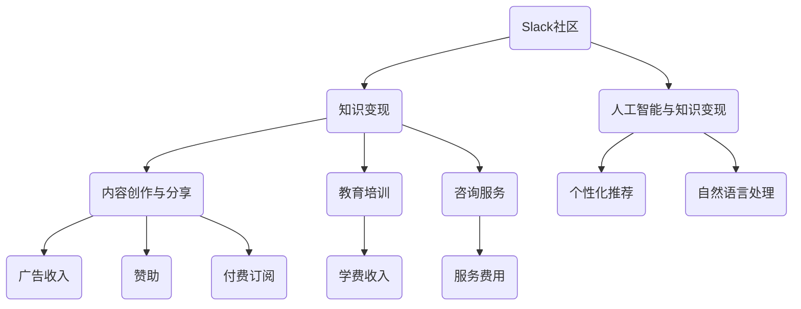

                 

### 文章标题

《程序员如何利用Slack社区进行知识变现》

### 关键词

- Slack社区
- 程序员
- 知识变现
- 内容创作
- 教育培训
- 智能算法
- 数学模型
- 项目实战

### 摘要

本文旨在探讨程序员如何通过Slack社区这一平台进行知识变现。我们将从Slack社区的概述和优势出发，详细分析知识变现的概念与途径，并逐步介绍如何利用Slack社区进行高效的社区创建、内容创作与知识分享、知识咨询服务和教育培训。通过成功案例分析、实践指南以及未来展望，本文旨在为程序员提供一条实现知识变现的具体路径，并探讨其可能的发展趋势。本文还将结合算法原理、数学模型和实际项目实战，深入剖析知识变现的核心技术和实现策略。

### 《程序员如何利用Slack社区进行知识变现》目录大纲

1. **第一部分：Slack社区概述与优势**
   - **第1章：Slack社区概述**
     - 1.1 Slack简介
     - 1.2 Slack社区的优势
   - **第2章：知识变现概述**
     - 2.1 知识变现的定义
     - 2.2 知识变现的途径
   - **第3章：创建高效的Slack社区**
     - 3.1 选择合适的Slack团队
     - 3.2 创建与组织Slack社区
     - 3.3 社区互动与交流
   - **第4章：内容创作与知识分享**
     - 4.1 内容创作策略
     - 4.2 知识分享与传播
   - **第5章：知识咨询服务**
     - 5.1 提供个性化咨询服务
     - 5.2 建立知识服务体系
   - **第6章：教育培训与在线课程**
     - 6.1 教育培训策略
     - 6.2 在线课程实施
   - **第7章：案例分析与实践指南**
     - 7.1 成功案例分析
     - 7.2 实践指南
   - **第8章：未来展望与趋势**
     - 8.1 Slack社区的发展趋势
     - 8.2 知识变现的新途径

---

#### 第一部分：Slack社区概述与优势

#### 第1章：Slack社区概述

##### 1.1 Slack简介

Slack，一个起源于2013年的即时通讯工具，它迅速在企业协作市场中崭露头角。其创始人Stewart Butterfield原本是Flickr的联合创始人，后来创立了Slack。Slack的初衷是为了解决团队成员之间沟通的效率问题，特别是在远程工作和分布式团队中。

Slack的起源可以追溯到Butterfield和Co-founder, Cyan Banister，在一次登山旅行的讨论中，他们意识到即时通讯工具在团队合作中的重要性。因此，他们决定创建一个全新的通讯平台，旨在提供比传统即时通讯工具更为高效、灵活和全面的解决方案。经过几年的开发和完善，Slack于2014年正式推出，并迅速获得了大量用户和资本的青睐。

##### 1.1.1 Slack的起源与发展

Slack的发展历程可以用“迅速崛起”来形容。在成立初期，Slack采取了开放策略，允许第三方开发者为其平台开发各种插件和应用，从而大大拓展了Slack的功能和用途。这种开放性不仅吸引了大量用户，也使得Slack成为了一个生态系统，与其他业务工具和平台无缝集成。

发展至今，Slack已经成为全球范围内最受欢迎的企业通讯和协作平台之一。根据官方数据显示，截至2022年，Slack的用户数量已经超过了1亿，其中付费用户超过750万。Slack的快速成长，不仅得益于其卓越的功能和用户体验，还得益于其持续的创新和优化。

##### 1.1.2 Slack的主要功能特点

Slack的主要功能特点包括：

- **即时通讯**：Slack提供了强大的即时通讯功能，支持文字、图片、视频等多种形式的消息传递。用户可以在多个工作空间（Workspaces）中创建频道（Channels），进行高效的沟通和协作。

- **文件共享**：Slack支持文件上传和共享，用户可以在频道或个人对话中直接上传文档、图片、代码片段等文件，方便团队成员之间的资料共享和协作。

- **集成应用**：Slack能够与多种第三方应用和服务集成，如Google Drive、Dropbox、GitHub、Trello等，使用户可以在一个平台上管理所有工作和任务。

- **机器人（Bots）**：Slack内置了多种机器人，可以自动化执行各种任务，如提醒、统计、问答等。用户可以根据需求自定义机器人，提高工作效率。

- **工作流程自动化**：Slack提供工作流（Workflows）功能，可以自定义工作流程和审批流程，简化复杂的工作任务。

- **个性化设置**：Slack支持个性化设置，如自定义徽标、主题、通知等，使用户可以根据自己的喜好和工作需求调整界面和功能。

##### 1.1.3 Slack在企业协作中的地位

Slack在企业协作工具市场中的地位日益稳固。根据市场研究机构的报告，Slack已经成为企业内部沟通和协作的首选工具之一，尤其在远程工作和分布式团队中，Slack的应用更加广泛。

Slack不仅为企业提供了高效的沟通平台，还通过集成应用和机器人等功能，帮助企业实现工作流程的自动化和优化。Slack的强大功能和灵活应用，使得它不仅适用于小型团队，也适用于大型企业和跨国公司。

此外，Slack还积极与各类企业服务提供商合作，为其用户提供更多的增值服务，如企业培训、客户支持、项目管理等。这些合作不仅丰富了Slack的功能和应用场景，也进一步巩固了其在企业协作市场中的地位。

综上所述，Slack作为一种强大的企业协作工具，凭借其丰富的功能、灵活的集成应用和高效的工作流程，已经在全球范围内赢得了众多用户的青睐。对于程序员而言，利用Slack社区进行知识变现，不仅是一种有效的途径，也是一种提升自身专业价值和影响力的方式。

##### 1.2 Slack社区的优势

Slack社区的优势主要体现在以下几个方面：

- **提高工作效率**：Slack提供了即时通讯、文件共享、集成应用、机器人等多种功能，使得团队成员之间的沟通和协作更加高效。通过Slack，程序员可以快速获取信息、共享代码片段和文档，无需频繁的会议和邮件沟通，从而节省大量时间。

- **促进知识共享**：Slack社区鼓励成员分享知识和经验，通过创建不同的频道（Channels）和小组（Groups），程序员可以发布技术博客、教程、代码示例等，与其他成员进行互动和讨论。这种知识共享不仅有助于个人技能的提升，也为团队整体的技术水平提供了保障。

- **社区互动与口碑传播**：Slack社区的互动性很强，成员之间可以实时交流、讨论和分享，形成良好的社区氛围。通过积极的互动，程序员可以建立个人品牌，提升知名度。此外，Slack社区中的优秀内容还容易在社交媒体上传播，为程序员带来更多的曝光机会。

- **个性化定制**：Slack支持个性化定制，用户可以根据自己的需求和喜好调整界面、主题和通知设置。这种个性化定制不仅提升了用户体验，也使得程序员能够更好地适应自己的工作流程。

- **安全性与隐私保护**：Slack注重用户数据的安全和隐私保护，采用了多种加密技术和安全措施，确保用户信息的安全。对于程序员而言，这意味着他们可以在Slack社区中安心地分享敏感信息和代码片段。

- **可扩展性和灵活性**：Slack具有很强的可扩展性和灵活性，可以与多种第三方应用和服务集成，如GitHub、Jenkins、Trello等。这种集成性使得程序员可以更好地管理项目、跟踪进度和自动化任务，提高工作效率。

- **社区支持与资源丰富**：Slack社区拥有庞大的用户群体和支持团队，用户可以在这里找到各种解决方案、最佳实践和技术资源。这种社区支持不仅有助于程序员解决技术难题，还能为他们提供丰富的学习资源。

综上所述，Slack社区以其强大的功能、高效的工作方式、丰富的资源和支持，为程序员提供了一个理想的平台，使其能够充分利用社区资源进行知识变现。在接下来的章节中，我们将进一步探讨如何利用Slack社区实现知识变现的具体方法和策略。

#### 第二部分：知识变现的概念与途径

##### 第2章：知识变现概述

在数字化时代，知识变现成为许多专业人士和企业的关注焦点。知识变现指的是将个人的专业知识、经验、技能和创意转化为经济收益的过程。对于程序员而言，知识变现不仅是一种提高收入的方式，更是提升个人品牌和影响力的有效手段。本章节将详细阐述知识变现的概念、意义以及多种实现途径。

##### 2.1 知识变现的定义

知识变现的定义可以从多个角度进行理解。首先，知识变现是将个人的知识和技能转化为可量化的经济价值。这种价值可以通过多种形式实现，包括但不限于：

- **内容创作与分享**：通过创作和分享专业文章、技术博客、教程、视频等，吸引受众，从而实现广告收入、赞助、付费订阅等。
- **教育培训与在线课程**：通过开设线上或线下课程，传授专业知识，实现学费收入。
- **咨询服务**：提供专业咨询服务，如技术辅导、项目评估、代码审查等，根据服务内容和时长收费。
- **软件开发与销售**：开发并销售软件工具、插件、框架等，通过销售和订阅模式获得收入。

总的来说，知识变现是一种将无形的知识和经验转化为有形的经济收益的过程，它不仅丰富了知识拥有者的经济来源，也为知识需求者提供了有价值的服务和产品。

##### 2.1.1 知识变现的意义

知识变现对于程序员和整个行业都有着重要的意义：

1. **个人收入增加**：通过知识变现，程序员可以增加额外的收入来源，提高个人经济状况。这不仅有助于改善生活质量，也为个人职业发展提供了更多的资本。

2. **职业发展**：知识变现能够提升程序员的专业知名度和影响力，从而为职业发展铺平道路。一个拥有较高知名度的程序员往往更容易获得更好的工作机会、晋升和更高的薪酬。

3. **知识传播**：知识变现促使程序员将自身的知识和经验分享给更多的人，从而推动技术知识的传播和普及。这种传播不仅有助于提高整个行业的技术水平，还能激发更多人对技术的兴趣和热情。

4. **创新动力**：知识变现为程序员提供了创新和探索的动力。在追求经济收益的过程中，程序员会不断学习新知识、掌握新技术，从而推动自身不断进步和创新。

5. **行业生态**：知识变现为行业生态注入了新的活力。通过知识变现，程序员和企业能够实现共赢，促进知识、技术、资源和经验的交流与共享，从而推动整个行业的发展。

##### 2.2 知识变现的途径

知识变现的途径多种多样，根据程序员的专业技能和资源，可以选择以下几种常见方式：

1. **内容创作与分享**：程序员可以通过创作技术博客、发布教程和编写电子书等方式，分享专业知识和经验。这种途径不仅能够提升个人品牌，还能通过广告收入、赞助和付费订阅等方式实现经济收益。

2. **教育培训与在线课程**：程序员可以开设线上或线下课程，传授专业技能和知识。这种途径可以带来稳定的学费收入，同时也能吸引更多的学生和学员，扩大个人影响力。

3. **咨询服务**：提供专业咨询服务，如技术辅导、代码审查、项目评估等，根据服务内容和时长收费。这种途径不仅能够实现即时收入，还能为程序员积累宝贵的实践经验。

4. **软件开发与销售**：开发并销售软件工具、插件、框架等，通过销售和订阅模式获得收入。这种途径通常需要较高的技术门槛，但一旦成功，将带来持续的经济收益。

5. **开源项目**：参与开源项目，贡献代码和文档，通过捐赠和支持获得收益。这种途径不仅有助于提升个人技术能力，还能吸引更多的关注和支持。

6. **知识付费平台**：利用各类知识付费平台，如知乎Live、分答、得到等，提供专业知识和咨询服务。这些平台通常拥有庞大的用户群体，能够为程序员提供更多的曝光和机会。

7. **技术分享会与讲座**：参加或举办技术分享会、讲座，分享专业知识和经验。这种途径不仅能够提升个人知名度，还能通过门票收入、赞助等方式实现经济收益。

通过上述途径，程序员可以充分利用自身知识和技能，实现知识变现。在接下来的章节中，我们将进一步探讨如何在Slack社区中具体实现这些途径，并详细阐述相关策略和实践。

#### 第二部分：知识变现的概念与途径

##### 第2章：知识变现概述

知识变现是一个日益受到关注的概念，特别是在数字化时代，知识和技能的传播和分享变得更为便捷。对于程序员来说，知识变现不仅是一种增加收入的方式，更是提升个人品牌和影响力的有效途径。本章节将深入探讨知识变现的定义、意义以及多种实现途径。

##### 2.1 知识变现的定义

知识变现是指将个人的专业知识、经验、技能和创意转化为经济收益的过程。在这个过程中，程序员可以采用多种方式将自己的知识变现，例如：

- **内容创作与分享**：通过撰写技术博客、发布教程和编写电子书，程序员可以将自己的知识和经验分享给大众，并通过广告收入、赞助和付费订阅等方式获得经济收益。
- **教育培训与在线课程**：开设线上或线下课程，传授专业知识和技能，通过学费收入实现知识变现。
- **咨询服务**：提供技术辅导、代码审查、项目评估等咨询服务，根据服务内容和时长收费。
- **软件开发与销售**：开发并销售软件工具、插件、框架等，通过销售和订阅模式获得收入。

总之，知识变现是将无形的知识和经验转化为有形的经济收益的过程，它不仅为程序员提供了额外的收入来源，还帮助他们提升个人品牌和职业发展。

##### 2.1.1 知识变现的意义

知识变现对于程序员来说具有多重意义：

1. **增加收入**：知识变现为程序员提供了新的收入渠道，使他们能够通过分享知识和技能获得额外的经济收益，从而提高生活水平。
2. **提升个人品牌**：通过知识变现，程序员可以扩大个人影响力，提升专业知名度，从而在职场中获得更多的机会和优势。
3. **知识传播**：知识变现促使程序员将自身知识和经验分享给更多的人，有助于提升整个行业的技术水平，推动技术知识的普及和传播。
4. **创新动力**：知识变现为程序员提供了创新的动力，鼓励他们不断学习新知识、掌握新技术，推动个人和行业的持续进步。
5. **行业生态**：知识变现有助于构建一个健康的行业生态，促进知识和资源的交流与共享，推动整个行业的繁荣发展。

##### 2.2 知识变现的途径

程序员可以通过多种途径实现知识变现，以下是几种常见的方式：

1. **内容创作与分享**
   - **技术博客**：程序员可以在个人博客或技术社区上撰写技术文章，分享开发经验、解决方案和技巧。通过吸引广告、赞助和付费阅读等方式，实现知识变现。
   - **教程与电子书**：编写并发布技术教程或电子书，为有需要的读者提供有价值的内容。通过销售或付费订阅，获得收入。
   - **视频教程**：录制并发布技术视频教程，通过视频平台获得广告收入和会员订阅费用。

2. **教育培训与在线课程**
   - **线上课程**：利用在线教育平台，开设编程、软件开发、算法等课程，通过学费收入实现知识变现。
   - **线下培训**：组织线下培训课程或工作坊，为学员提供专业的技术培训，通过学费或报名费获得收入。
   - **定制化培训**：为企业和个人提供定制化的技术培训服务，根据需求和时长收费。

3. **咨询服务**
   - **技术辅导**：提供一对一的技术辅导服务，帮助学员解决编程问题，提升技术水平。
   - **项目评估与审查**：为企业提供项目评估、技术审查等服务，帮助他们优化项目和技术架构。
   - **代码审查与优化**：对现有代码进行审查和优化，提高代码质量和性能。

4. **软件开发与销售**
   - **软件工具与插件**：开发并销售软件工具、插件、框架等，通过销售或订阅模式获得收入。
   - **开源项目**：参与开源项目，贡献代码和文档，通过捐赠和支持获得收益。

5. **知识付费平台**
   - **知乎Live、分答、得到**：利用这些知识付费平台，提供专业知识和咨询服务，通过平台收入实现知识变现。

6. **技术分享会与讲座**
   - **参加技术分享会**：在技术社区或会议中分享专业知识和经验，通过门票收入、赞助等方式获得收益。
   - **举办讲座**：组织技术讲座，为听众提供有价值的知识，通过门票收入、赞助等方式实现知识变现。

通过上述途径，程序员可以充分利用自身知识和技能，实现知识变现。在接下来的章节中，我们将进一步探讨如何在Slack社区中具体实现这些知识变现途径，并提供相关策略和实践指南。

#### 第三部分：利用Slack社区进行知识变现

#### 第3章：创建高效的Slack社区

在数字化时代，Slack社区已经成为程序员们进行知识变现的重要平台。创建一个高效的Slack社区，不仅需要明确团队成员的需求，选择合适的模板，还需要对社区进行有效的创建和组织。以下将从这几个方面详细探讨如何创建一个高效的Slack社区。

##### 3.1 选择合适的Slack团队

选择合适的Slack团队是创建高效社区的第一步。在决定创建一个新社区之前，首先需要分析团队成员的需求和特点。以下是一些关键点：

1. **团队成员的需求分析**
   - **技能水平**：了解团队成员的技术水平和专业知识领域，这将有助于你确定社区的主要关注点。
   - **工作方式**：了解团队成员的工作习惯，如是否偏好远程办公、是否经常需要协作等，这将帮助你选择合适的社区功能和工具。
   - **专业兴趣**：调查团队成员的专业兴趣和关注点，这有助于确定社区的主题和内容。

2. **团队成员的专业技能与知识领域**
   - **技术栈**：确定团队成员熟悉的技术栈，如前端、后端、移动开发、数据分析等，这将有助于你创建专业的技术交流频道。
   - **专业知识领域**：根据团队成员的专业知识领域，创建专门的讨论小组，促进深度交流和知识共享。

3. **工作方式与协作需求**
   - **远程办公**：对于远程办公的团队，选择一个具有强大协作功能的Slack模板至关重要，如Slack的“分布式团队”模板，它提供了丰富的协作工具和集成应用。
   - **常规协作**：对于需要常规协作的团队，选择一个具备即时通讯、文件共享、日程安排等基本功能的Slack模板即可。

##### 3.1.2 选择合适的Slack模板

Slack提供了多种社区模板，以满足不同类型团队的需求。以下是一些常见的Slack模板及其适用场景：

1. **小型团队模板**
   - **基本模板**：适用于初创团队，提供基础的即时通讯和文件共享功能。
   - **协作模板**：适用于小规模团队，增加了工作流程管理和集成应用功能。

2. **中型团队模板**
   - **成长型团队模板**：适用于快速发展的团队，提供了更多的频道、小组和机器人支持。
   - **专业协作模板**：适用于需要更高级协作功能的团队，如项目管理、文档管理、任务追踪等。

3. **大型团队模板**
   - **分布式团队模板**：适用于跨地区、跨国团队，提供了强大的协作工具和集成应用，如视频会议、远程桌面共享等。
   - **企业协作模板**：适用于大型企业，提供了全面的工作流程管理、安全性和合规性功能。

选择合适的Slack模板后，可以根据团队需求进行个性化定制，调整主题、图标、通知设置等，以提升用户体验和社区氛围。

##### 3.2 创建与组织Slack社区

创建和组织的步骤如下：

1. **注册和配置**
   - **注册账号**：在Slack官网注册账号，并创建一个新的团队。
   - **配置基本设置**：设置团队名称、图标、主题等基本信息。

2. **创建频道（Channels）**
   - **公共频道**：用于全体成员沟通和讨论，如“公告”、“技术讨论”等。
   - **专用频道**：用于特定项目、小组或主题的讨论，如“前端开发”、“数据分析”等。
   - **临时频道**：用于临时任务或项目，项目完成后可删除，如“新功能开发”、“市场活动”等。

3. **创建小组（Groups）**
   - **兴趣小组**：基于成员的兴趣和专业领域创建的小组，如“编程语言”、“技术趋势”等。
   - **项目小组**：用于团队项目或任务，便于项目成员之间的沟通和协作。

4. **设置机器人（Bots）**
   - **通知机器人**：用于发送重要通知、提醒和公告。
   - **集成应用机器人**：用于与其他工具和服务集成，如GitHub、Jenkins、Trello等。

5. **权限和角色设置**
   - **管理员角色**：负责社区的整体管理和维护，如创建和删除频道、小组、机器人等。
   - **成员角色**：参与社区讨论和协作，根据权限不同，可以发送消息、上传文件、管理频道等。
   - **嘉宾角色**：允许外部成员参与社区的讨论和协作，但不具备管理权限。

##### 3.3 社区互动与交流

高效的Slack社区离不开积极的互动与交流。以下是一些提高社区互动的建议：

1. **定期举办活动**
   - **线上研讨会**：定期举办线上研讨会，邀请业内专家分享经验和最新技术动态。
   - **技术分享会**：组织内部或外部的技术分享会，鼓励成员分享专业知识和经验。
   - **问答环节**：设立专门的问答频道，鼓励成员提出问题和解答问题。

2. **奖励激励机制**
   - **积分制度**：为积极参与社区讨论、分享内容和提出解决方案的成员颁发积分奖励，积分可以兑换奖品或优先参与培训等。
   - **荣誉榜**：定期发布荣誉榜，表彰在社区中表现突出的成员。

3. **建立明确的交流规范**
   - **行为准则**：制定社区行为准则，确保成员在交流过程中保持礼貌、尊重他人。
   - **标签和分类**：为社区内容设置明确的标签和分类，便于成员快速找到所需信息。

通过以上步骤，你可以创建一个高效、有序的Slack社区，为团队成员提供良好的交流和协作平台。在接下来的章节中，我们将进一步探讨如何在Slack社区中实现内容创作与知识分享、知识咨询服务和教育培训等知识变现途径。

#### 第三部分：利用Slack社区进行知识变现

#### 第4章：内容创作与知识分享

内容创作和知识分享是程序员在Slack社区中实现知识变现的重要途径。通过创作有价值的内容，程序员不仅能够吸引受众，还能通过多种形式实现经济收益。以下将详细介绍内容创作的策略、知识分享的方法以及如何引起关注和互动。

##### 4.1 内容创作策略

内容创作是知识分享的基础，高效的策略有助于提升内容的吸引力和传播力。以下是一些关键点：

1. **内容类型选择**

   根据目标受众的需求和兴趣，选择合适的的内容类型。常见的内容类型包括：

   - **技术博客**：详细阐述编程技巧、开发经验和技术解决方案。
   - **教程与指南**：系统性地介绍技术知识、工具使用和项目实践。
   - **案例分析**：分享真实项目案例，深入剖析技术实现和项目管理。
   - **视频教程**：以动态形式展示技术讲解和操作步骤，适合视觉学习型受众。
   - **电子书**：综合多方面的技术知识，提供深入的学习资料。

2. **内容创作方法**

   - **主题明确**：确保每个内容都有明确的主题和目标，避免内容泛泛而谈。
   - **结构清晰**：按照逻辑顺序组织内容，使读者能够轻松理解。
   - **实用性强**：内容应具有实用价值，能够解决读者的实际问题。
   - **更新频率**：保持一定的更新频率，让读者保持持续关注。
   - **互动元素**：在内容中加入互动元素，如问答、讨论、投票等，提高读者的参与度。

3. **内容推广策略**

   - **内部推广**：在Slack社区内部，通过频道公告、个人消息、机器人通知等方式，向团队成员推广新内容。
   - **外部推广**：利用社交媒体、技术论坛、博客等渠道，扩大内容的影响力。
   - **合作推广**：与其他专业人士或机构合作，共同推广内容，实现资源共享。

##### 4.2 知识分享与传播

有效的知识分享和传播能够最大化内容的收益和价值。以下是一些方法和技巧：

1. **分享频率与形式**

   - **分享频率**：保持适度的分享频率，避免过度或不足。根据社区的活跃度和内容类型，确定合适的分享频率。
   - **分享形式**：结合文字、图片、视频等多种形式，提高内容的多样性和吸引力。

2. **互动与反馈**

   - **鼓励互动**：在分享内容时，鼓励读者提问、讨论和反馈，增加内容的互动性和参与度。
   - **及时回复**：对于读者的提问和反馈，及时给予回应，展示专业性和亲和力。

3. **知识库建设**

   - **内容归档**：将分享的内容进行归档和分类，便于读者查找和回顾。
   - **知识库更新**：定期更新知识库，增加新的内容，保持知识的时效性和完整性。

4. **标签和分类**

   - **标签使用**：为内容添加合适的标签，便于搜索引擎和读者查找。
   - **分类管理**：按照主题和类型对内容进行分类，提高内容的管理和检索效率。

##### 4.3 引起关注与互动

为了使内容在Slack社区中获得更多关注和互动，可以采取以下策略：

1. **标题和摘要**

   - **标题吸引人**：使用简洁、有吸引力的标题，激发读者的好奇心。
   - **摘要简洁**：在内容前添加一个简洁有力的摘要，引导读者进一步阅读。

2. **优质内容**

   - **内容质量**：确保内容具有高质量，提供实际价值。
   - **原创性**：创作原创内容，避免抄袭和重复。

3. **互动激励**

   - **奖品和奖励**：为积极参与讨论和分享的成员提供奖品和奖励，激励他们持续互动。
   - **社区活动**：举办线上活动，如问答比赛、技术挑战等，提高社区的活跃度。

4. **推广合作**

   - **跨社区推广**：与其他相关社区或媒体合作，共同推广内容。
   - **行业影响者**：邀请行业影响者或知名专家分享内容，增加内容的可信度和影响力。

通过以上策略，程序员可以在Slack社区中有效地进行内容创作和知识分享，吸引更多的关注和互动，从而实现知识变现的目标。

#### 第5章：知识咨询服务

知识咨询服务是程序员利用Slack社区进行知识变现的重要途径之一。通过提供专业咨询服务，程序员不仅能实现经济收益，还能提升个人品牌和影响力。以下将详细介绍如何提供个性化咨询服务、建立知识服务体系，以及服务流程与技巧。

##### 5.1 提供个性化咨询服务

个性化咨询服务是知识变现的核心环节，它要求程序员根据客户的具体需求和问题，提供定制化的解决方案。以下是提供个性化咨询服务的关键步骤：

1. **了解客户需求**

   - **需求调研**：通过问卷调查、电话访谈、在线聊天等方式，了解客户的具体需求和问题。
   - **问题分析**：对客户提出的问题进行详细分析，确定问题的本质和解决方案的可能方向。

2. **个性化方案设计**

   - **方案制定**：根据客户的需求，设计个性化的解决方案，包括技术实现、项目规划、时间安排等。
   - **方案评估**：与客户沟通方案细节，确保方案能够满足客户的需求和期望。

3. **服务交付**

   - **实时沟通**：通过Slack或其他即时通讯工具，与客户保持实时沟通，及时了解客户的反馈和需求变化。
   - **文档整理**：整理服务过程中的关键信息、技术文档和项目计划，以便客户参考和后续跟进。

##### 5.2 建立知识服务体系

建立知识服务体系是提供高效、专业咨询服务的基础。以下是一些建立知识服务体系的关键步骤：

1. **专业知识库建设**

   - **内容收集**：收集和整理程序员在技术、项目管理、客户服务等方面的知识和经验。
   - **知识分类**：将知识按照主题和类型进行分类，便于快速检索和利用。
   - **知识更新**：定期更新知识库，确保知识的时效性和准确性。

2. **服务流程标准化**

   - **流程设计**：设计标准化的服务流程，包括需求调研、方案制定、服务交付、反馈收集等环节。
   - **流程培训**：对团队成员进行服务流程培训，确保每个人都能按照标准流程提供服务。

3. **服务质量监控**

   - **服务监控**：建立服务质量监控机制，定期评估服务的质量和客户满意度。
   - **反馈机制**：建立反馈机制，及时收集客户的反馈和建议，不断改进服务质量。

##### 5.3 服务流程与技巧

有效的服务流程和技巧是提供高质量咨询服务的关键。以下是一些实用的服务流程与技巧：

1. **服务前准备**

   - **需求确认**：在与客户首次沟通时，确保全面了解客户的需求和问题。
   - **工具准备**：确保使用合适的工具和软件，以便高效地提供服务。

2. **服务过程中**

   - **及时沟通**：保持与客户的实时沟通，及时回应客户的问题和反馈。
   - **文档记录**：详细记录服务过程中的关键信息和客户需求变化，便于后续跟踪和服务改进。

3. **服务结束后**

   - **总结反馈**：总结服务过程中的经验和教训，收集客户的反馈，不断优化服务流程。
   - **后续跟进**：对客户进行后续跟进，确保客户的问题得到彻底解决，提高客户满意度。

4. **技巧提升**

   - **倾听技巧**：善于倾听客户的需求和问题，避免急于给出解决方案。
   - **问题解决技巧**：掌握高效的问题解决技巧，如快速定位问题、制定解决方案、实施和验证等。
   - **沟通技巧**：提高沟通技巧，包括清晰表达、简洁明了、尊重对方等，确保与客户的有效沟通。

通过以上步骤和技巧，程序员可以提供高质量的个性化咨询服务，建立高效的知识服务体系，从而在Slack社区中实现知识变现。在接下来的章节中，我们将继续探讨教育培训与在线课程的知识变现途径，以及如何通过Slack社区进行具体实施。

#### 第6章：教育培训与在线课程

在数字化时代，教育培训与在线课程成为知识变现的重要途径之一。程序员可以通过在线教育平台和Slack社区，传授专业知识，实现经济收益。本章节将详细探讨教育培训的策略、课程设计的要点以及在线课程的实施流程。

##### 6.1 教育培训策略

有效的教育培训策略能够吸引更多的学员，提高课程质量，从而实现知识变现。以下是一些关键策略：

1. **市场调研**

   - **目标受众分析**：了解目标学员的背景、需求和兴趣，为他们提供有针对性的课程。
   - **竞争分析**：研究同类型课程的市场状况，分析竞争对手的优势和劣势，制定有竞争力的课程计划。

2. **课程定位**

   - **课程主题**：根据市场需求和学员需求，确定课程的主体内容，如编程语言、框架、工具等。
   - **课程级别**：根据学员的技能水平，设计初级、中级和高级课程，满足不同层次的学习需求。

3. **课程宣传**

   - **内容营销**：通过技术博客、社交媒体、电子邮件等方式，宣传课程内容和优势，吸引潜在学员。
   - **合作伙伴**：与相关行业的企业、技术社区、培训机构等建立合作关系，共同推广课程。

4. **价格策略**

   - **成本核算**：根据课程开发、运营和维护的成本，合理定价，确保利润最大化。
   - **灵活定价**：提供不同价格层次的课程，如单次课程、月度套餐、季度套餐等，满足学员的多样化需求。

##### 6.1.1 教育培训内容规划

教育培训的内容规划是课程成功的关键。以下是一些内容规划要点：

1. **课程大纲**

   - **整体结构**：明确课程的整体结构，包括课程目标、学习内容、时间安排等。
   - **章节划分**：将课程内容划分为不同的章节，确保每个章节都有明确的主题和目标。

2. **知识点梳理**

   - **知识点提炼**：梳理每个章节的核心知识点，确保学员能够掌握关键技能。
   - **知识点关联**：分析知识点之间的关联，构建知识体系，帮助学员形成系统化的知识结构。

3. **教学资源**

   - **教材与资料**：准备详细的教材和教学资料，如PPT、代码示例、练习题等。
   - **多媒体资源**：利用视频、音频、动画等多媒体资源，提高课程的生动性和吸引力。

4. **实践项目**

   - **项目规划**：设计实际可行的项目任务，让学员在项目中应用所学知识。
   - **项目指导**：提供项目指导，帮助学员解决项目中遇到的问题，确保项目顺利完成。

##### 6.2 在线课程实施

在线课程实施是教育培训的关键环节，以下是一些实施流程和技巧：

1. **平台选择**

   - **功能需求**：根据课程内容和教学需求，选择合适的在线教育平台，如Udemy、Coursera、Teachable等。
   - **用户体验**：确保平台具有良好的用户体验，包括课程浏览、学习进度跟踪、互动交流等功能。

2. **课程开发**

   - **课程录制**：录制高质量的课程视频，确保画面清晰、声音清楚，符合教学需求。
   - **课程编辑**：对课程视频进行剪辑、添加字幕、配乐等，提高课程的观赏性和学习效果。

3. **课程发布**

   - **课程发布**：将课程内容上传到在线教育平台，设置课程价格、学习期限等参数。
   - **课程宣传**：通过社交媒体、邮件营销、合作伙伴推广等方式，宣传新课程，吸引潜在学员。

4. **课程运营**

   - **学员管理**：建立学员档案，跟踪学员的学习进度和反馈，提供个性化的学习指导。
   - **互动交流**：建立学员交流群，定期组织讨论、答疑、作业批改等活动，增强学员之间的互动和交流。

5. **课程更新**

   - **内容更新**：根据学员反馈和市场动态，定期更新课程内容，保持课程的新鲜感和实用性。
   - **技术支持**：提供技术支持，解决学员在学习过程中遇到的技术问题，确保课程的顺利进行。

通过以上策略和流程，程序员可以在Slack社区中有效地开展教育培训，传授专业知识，实现知识变现。在接下来的章节中，我们将通过成功案例和实践指南，进一步探讨如何利用Slack社区实现教育培训的知识变现。

#### 第6章：教育培训与在线课程

##### 6.1 教育培训策略

教育培训是程序员利用Slack社区进行知识变现的重要手段。有效的教育培训策略不仅能提升个人品牌，还能带来稳定的经济收益。以下从课程定位、市场调研、内容设计、价格策略、营销推广等方面展开详细讨论。

1. **课程定位**

   课程定位是教育培训的首要任务。程序员需要根据自身专业背景和市场需求，确定课程的主题和目标受众。

   - **主题明确**：课程主题应具有明确性和针对性，如“Python深度学习实战”、“Web开发进阶指南”等。
   - **目标受众**：分析目标受众的技能水平、学习需求和兴趣点，确保课程内容能够满足他们的需求。

2. **市场调研**

   市场调研是制定有效教育培训策略的基础。

   - **竞争分析**：了解同类课程的市场状况，分析竞争对手的优势和劣势，找出市场空白和机会。
   - **受众需求**：通过问卷调查、访谈、在线论坛等方式，收集目标受众的需求和期望，为课程设计提供依据。

3. **内容设计**

   教育培训的内容设计是课程质量的关键。

   - **知识体系**：构建完整的知识体系，确保课程内容的系统性和逻辑性。
   - **案例与实践**：结合实际项目案例，让学员通过实践掌握知识和技能。
   - **互动环节**：设计互动环节，如问答、讨论、作业等，提高学员的参与度和学习效果。

4. **价格策略**

   合理的价格策略能够吸引更多学员，提高课程的竞争力。

   - **成本核算**：根据课程开发、运营和维护的成本，合理定价，确保盈利。
   - **灵活定价**：提供不同价格层次的课程，如单次付费、订阅制、优惠套餐等，满足学员的多样化需求。

5. **营销推广**

   营销推广是吸引学员、提升课程知名度的重要手段。

   - **内容营销**：通过技术博客、社交媒体、电子邮件等方式，宣传课程内容和亮点，吸引潜在学员。
   - **合作伙伴**：与行业内的其他机构、技术社区、公众号等建立合作关系，共同推广课程。
   - **用户口碑**：鼓励学员分享学习体验和成果，通过口碑传播吸引更多学员。

##### 6.2 在线课程实施

在线课程实施是教育培训的具体操作过程，以下从平台选择、课程开发、课程发布、课程运营等方面详细讲解。

1. **平台选择**

   选择合适的在线教育平台是课程成功的基础。

   - **功能需求**：根据课程内容和教学需求，选择功能齐全、用户友好的在线教育平台，如Udemy、Teachable、Khan Academy等。
   - **用户体验**：确保平台具有良好的用户体验，包括课程浏览、学习进度跟踪、互动交流等功能。

2. **课程开发**

   课程开发是教育培训的核心环节。

   - **课程录制**：录制高质量的课程视频，确保画面清晰、声音清楚，符合教学需求。可以使用专业的录制工具，如OBS、Camtasia等。
   - **课程编辑**：对课程视频进行剪辑、添加字幕、配乐等，提高课程的观赏性和学习效果。可以使用视频编辑软件，如Adobe Premiere Pro、Final Cut Pro等。
   - **课程文档**：准备详细的课程文档，包括课程大纲、PPT、代码示例、练习题等。可以使用文档编辑软件，如Microsoft Word、Google Docs等。

3. **课程发布**

   发布课程是教育培训的最后一环。

   - **课程上传**：将课程视频、文档等上传到在线教育平台，设置课程价格、学习期限等参数。
   - **课程宣传**：通过社交媒体、电子邮件、合作伙伴等渠道，宣传新课程，吸引潜在学员。

4. **课程运营**

   课程运营是确保课程顺利进行的重要保障。

   - **学员管理**：建立学员档案，跟踪学员的学习进度和反馈，提供个性化的学习指导。可以使用在线教育平台自带的学习管理系统，如Moodle、Canvas等。
   - **互动交流**：建立学员交流群，定期组织讨论、答疑、作业批改等活动，增强学员之间的互动和交流。可以使用Slack、Telegram等即时通讯工具。

5. **课程更新**

   定期更新课程是保持课程时效性和吸引力的关键。

   - **内容更新**：根据学员反馈和市场动态，定期更新课程内容，增加新的知识点、案例和案例实践。可以邀请行业专家进行课程讲解，提升课程质量。
   - **技术支持**：提供技术支持，解决学员在学习过程中遇到的技术问题，确保课程的顺利进行。可以设立在线技术支持论坛，提供实时技术支持。

通过以上策略和实施流程，程序员可以在Slack社区中有效地开展教育培训，传授专业知识，实现知识变现。在接下来的章节中，我们将通过成功案例和实践指南，进一步探讨如何利用Slack社区实现教育培训的知识变现。

#### 第7章：案例分析与实践指南

在探讨了如何利用Slack社区进行知识变现的各种方法和策略之后，通过实际案例来展示这些策略的应用显得尤为重要。以下将介绍两个典型的成功案例，并通过实践指南提供具体的操作步骤和技巧。

##### 7.1 成功案例分析

案例一：如何通过Slack社区进行知识变现

**背景**：
一位有多年开发经验的程序员James，擅长前端开发，尤其在React.js领域有较深的造诣。他通过自己的技术博客积累了大量的粉丝，但在寻找知识变现的途径时，遇到了瓶颈。

**策略**：
1. **内容创作与分享**：James决定利用Slack社区，通过创建和分享高质量的技术内容来实现知识变现。他在社区中创建了一个专门的React.js频道，定期发布技术文章、教程和案例。

2. **互动交流**：James在社区中积极与成员互动，回答他们的技术问题，并组织线上研讨会，邀请业内专家分享最新技术和趋势。

3. **知识咨询服务**：James提供个性化的React.js咨询服务，帮助有需求的成员解决技术难题，并收取合理的咨询费用。

4. **教育培训**：James还开设了React.js在线课程，通过Slack社区进行推广和实施，吸引了大量学员。

**结果**：
通过这些策略，James在短短一年内，不仅提升了个人品牌，还实现了知识变现。他的Slack社区成员数量迅速增加，咨询费用和课程收入也大幅增长。

案例二：如何利用Slack社区开展教育培训

**背景**：
Alice是一名专注于后端开发的程序员，她在工作中积累了丰富的数据库管理和微服务架构经验。她希望通过在线教育平台和Slack社区，将自己的专业知识传授给更多的人。

**策略**：
1. **市场调研**：Alice进行了详细的市场调研，发现市场上对数据库管理和微服务架构的课程需求很大，但高质量的课程相对较少。

2. **课程设计**：Alice设计了一系列课程，包括“数据库管理实战”、“微服务架构原理与实战”等，确保课程内容既有深度又有实用性。

3. **平台选择**：Alice选择了Teachable作为在线教育平台，并结合Slack社区进行课程推广和学员管理。

4. **课程发布**：Alice将课程上传到Teachable平台，并通过Slack社区进行宣传和推广，吸引了大量学员。

5. **课程运营**：Alice在Slack社区中建立了专门的课程讨论组，定期组织讨论、答疑和作业批改，确保学员能够顺利学习。

**结果**：
通过以上策略，Alice的课程在短时间内取得了巨大成功。学员数量迅速增加，课程评价也非常高，为她带来了稳定的经济收益。

##### 7.2 实践指南

以下是一些具体的实践步骤和技巧，帮助程序员在Slack社区中实现知识变现：

1. **选择合适的Slack团队和模板**：
   - **团队需求分析**：了解团队成员的专业背景和需求，选择合适的模板，如“小型团队模板”、“分布式团队模板”等。
   - **模板定制**：根据团队需求，对模板进行适当的定制，如调整主题、图标、通知设置等。

2. **创建和优化频道与小组**：
   - **频道划分**：创建不同的频道，如“公告”、“技术讨论”、“咨询服务”、“教育培训”等，确保内容有序。
   - **小组管理**：根据专业领域和项目需求，创建小组，促进深度交流和知识共享。

3. **内容创作与分享**：
   - **内容类型**：结合自身专业背景和受众需求，选择合适的内容类型，如技术博客、教程、视频等。
   - **内容推广**：利用Slack社区内部和外部的推广渠道，扩大内容的影响力。

4. **知识咨询服务**：
   - **服务内容**：根据自身专业领域，提供有针对性的咨询服务，如技术辅导、项目评估等。
   - **服务流程**：制定标准化的服务流程，确保服务的质量和效率。

5. **教育培训与在线课程**：
   - **课程设计**：结合市场需求和学员需求，设计有吸引力的课程。
   - **课程实施**：选择合适的在线教育平台，并结合Slack社区进行课程推广和学员管理。

6. **互动与反馈**：
   - **积极互动**：在社区中积极参与讨论和交流，建立良好的互动氛围。
   - **及时反馈**：对学员的提问和反馈及时给予回应，提高学员的满意度。

7. **营销推广**：
   - **内容营销**：通过技术博客、社交媒体等渠道，宣传自身的内容和课程。
   - **合作伙伴**：与行业内的其他机构、技术社区等建立合作关系，共同推广。

通过以上实践指南，程序员可以在Slack社区中有效地实现知识变现，提升个人品牌和影响力。在接下来的章节中，我们将进一步探讨知识变现的未来发展趋势。

### 第8章：未来展望与趋势

在数字化和人工智能技术不断发展的背景下，Slack社区和知识变现领域也迎来了新的机遇和挑战。以下将探讨Slack社区的发展趋势以及知识变现的新途径，重点关注人工智能与知识变现、跨平台知识变现策略。

#### 8.1 Slack社区的发展趋势

1. **新功能与应用场景的拓展**

   Slack社区正在不断拓展其功能和应用场景，以满足用户多样化的需求。以下是一些值得关注的新功能和应用场景：

   - **增强的自动化能力**：Slack社区正在加强与第三方服务的集成，引入更多自动化工具和机器人，以简化工作流程，提高工作效率。
   - **个性化推荐**：通过人工智能技术，Slack正在开发个性化推荐功能，根据用户的行为和偏好，为用户提供相关的频道、讨论和应用，从而提升用户体验。
   - **虚拟会议与远程协作**：随着远程工作的普及，Slack正在加强视频会议和远程协作功能，提供更高质量的虚拟会议体验。
   - **安全与合规性**：随着数据安全和隐私保护的要求不断提高，Slack正在加强其安全性和合规性功能，确保用户数据的安全和隐私。

2. **行业应用扩展**

   Slack社区的应用场景正在从企业内部扩展到更多行业领域，如教育、医疗、法律等。以下是一些具体的应用场景：

   - **在线教育**：Slack正在成为在线教育平台的一部分，提供课堂互动、作业提交和成绩跟踪等功能，为学生和教师提供便捷的协作平台。
   - **医疗服务**：医生和护士可以利用Slack进行病例讨论、医嘱传递和患者管理，提高医疗服务的效率和质量。
   - **法律服务**：律师和律师事务所可以利用Slack进行案件讨论、文件共享和客户沟通，提高法律服务的效率。

3. **新兴市场的机会**

   随着新兴市场的崛起，Slack社区也在这些市场中寻找新的机会。以下是一些值得关注的新兴市场：

   - **东南亚**：东南亚市场对Slack的需求日益增长，尤其是在远程工作和企业数字化转型方面。
   - **非洲**：非洲市场正在逐步接受Slack作为企业协作工具，随着互联网普及率的提高，Slack在非洲的市场潜力巨大。

#### 8.2 知识变现的新途径

1. **人工智能与知识变现**

   人工智能技术的不断发展为知识变现提供了新的途径和机会。以下是一些具体的应用场景：

   - **个性化推荐系统**：通过人工智能技术，可以开发个性化推荐系统，为用户提供个性化的内容推荐和服务，从而提高用户满意度和转化率。
   - **智能问答系统**：利用自然语言处理技术，开发智能问答系统，为用户提供实时、高效的答案和解决方案，从而节省用户时间和提高服务质量。
   - **智能数据分析**：通过人工智能技术，对用户行为数据进行分析，发现潜在的需求和趋势，从而优化知识变现策略。

2. **跨平台知识变现策略**

   跨平台知识变现策略是指通过整合多个平台，实现知识变现的多元化。以下是一些具体策略：

   - **多平台内容发布**：在多个平台（如博客、社交媒体、视频平台等）上发布内容，扩大内容的曝光率和受众范围。
   - **多平台服务提供**：在多个平台提供咨询服务、教育培训等服务，满足不同用户的需求和偏好。
   - **多平台资源整合**：通过整合不同平台上的资源和信息，为用户提供更全面、更有价值的服务和产品。

通过以上展望和趋势分析，可以看出Slack社区和知识变现领域正面临着前所未有的机遇和挑战。未来的发展将更加智能化、个性化、多元化，为程序员提供更多的知识变现途径和机会。程序员需要紧跟技术发展趋势，不断创新和实践，才能在知识变现的浪潮中立于不败之地。

### 核心概念与联系

在本文中，我们讨论了多个核心概念，它们相互联系，共同构成了程序员利用Slack社区进行知识变现的理论基础。以下是这些核心概念及其相互关系：

- **Slack社区**：作为企业协作和知识共享的平台，Slack为程序员提供了一个高效的交流和互动环境。
- **知识变现**：将个人或团队的专业知识转化为经济收益的过程，包括内容创作、咨询服务、教育培训等多种形式。
- **内容创作与分享**：通过创作有价值的技术文章、教程和视频，吸引受众，实现广告收入、赞助和付费订阅等。
- **教育培训**：通过开设线上或线下课程，传授专业知识，实现学费收入。
- **咨询服务**：提供专业咨询服务，如技术辅导、项目评估、代码审查等，根据服务内容和时长收费。

这些核心概念之间的联系构成了以下架构：

1. **Slack社区**为程序员提供了一个交流平台，通过内容创作和知识分享，他们可以吸引受众，增加关注度。
2. **内容创作与分享**和**教育培训**是知识变现的主要途径，通过这些途径，程序员可以将自己的知识和经验转化为经济收益。
3. **咨询服务**提供了另一个收入来源，通过为有需求的客户提供专业服务，程序员可以实现额外的经济收益。
4. **人工智能与知识变现**：人工智能技术（如个性化推荐、自然语言处理等）可以提升内容创作和咨询服务的效率，从而促进知识变现。

以下是核心概念之间的Mermaid流程图：



这个流程图清晰地展示了各核心概念之间的关系，为程序员提供了理解和应用这些概念的具体路径。

### 核心算法原理讲解

在本文中，我们将详细讨论与知识变现、内容创作、教育培训等相关的核心算法原理。这些算法在提升内容质量、推荐系统、用户留存等方面起着至关重要的作用。

#### 1. 推荐系统算法

推荐系统是知识变现和内容创作的重要工具，它通过预测用户兴趣，为用户提供个性化的内容和推荐。以下是一些常用的推荐系统算法：

- **协同过滤（Collaborative Filtering）**：协同过滤是一种基于用户行为的推荐算法。它通过分析用户的历史行为数据，如评分、购买记录等，找到相似的用户，然后推荐这些用户喜欢的内容。

  **协同过滤算法伪代码**：
  ```python
  function collaborativeFiltering(userBehaviorMatrix):
      similarUsers = findSimilarUsers(userBehaviorMatrix, currentUser)
      recommendedItems = []
      for item in allItems:
          if any(user liked item for users in similarUsers):
              recommendedItems.append(item)
      return recommendedItems
  ```

- **基于内容的推荐（Content-Based Filtering）**：基于内容的推荐算法通过分析内容特征，为用户推荐相似的内容。这种方法通常用于技术博客、教程和电子书等。

  **基于内容的推荐算法伪代码**：
  ```python
  function contentBasedFiltering(itemFeatures, userPreferences):
      similarItems = []
      for item in allItems:
          if calculateSimilarity(itemFeatures, userPreferences) > threshold:
              similarItems.append(item)
      return similarItems
  ```

- **混合推荐（Hybrid Recommendation）**：混合推荐结合了协同过滤和基于内容的推荐方法，以提高推荐的准确性和多样性。

  **混合推荐算法伪代码**：
  ```python
  function hybridRecommendation(userBehaviorMatrix, itemFeatures, userPreferences):
      similarUsers = findSimilarUsers(userBehaviorMatrix, currentUser)
      similarItems = findSimilarItems(itemFeatures, userPreferences)
      recommendedItems = intersection(similarUsers, similarItems)
      return recommendedItems
  ```

#### 2. 用户留存率算法

用户留存率是衡量教育培训和内容创作成功的关键指标。以下是一些常用的用户留存率算法：

- **LSTM（长短期记忆网络）**：LSTM是一种深度学习模型，可以捕捉用户行为的时间序列特征，预测用户留存率。

  **LSTM算法伪代码**：
  ```python
  function LSTM(userBehaviorData):
      # Prepare data for training
     X, y = prepareLSTMData(userBehaviorData)
      
      # Build LSTM model
      model = Sequential()
      model.add(LSTMUnit(units=50, return_sequences=True, input_shape=(timesteps, features)))
      model.add(LSTMUnit(units=50))
      model.add(Dense(1, activation='sigmoid'))
      
      # Compile and train model
      model.compile(optimizer='adam', loss='binary_crossentropy', metrics=['accuracy'])
      model.fit(X, y, epochs=10, batch_size=64)
      
      # Predict user retention
      retentionPrediction = model.predict(userBehaviorData)
      return retentionPrediction
  ```

- **决策树**：决策树是一种常用的机器学习模型，可以用于分类和回归问题，预测用户留存率。

  **决策树算法伪代码**：
  ```python
  function decisionTreeClassifier(userBehaviorFeatures, userRetentionLabels):
      # Train decision tree model
      model = DecisionTreeClassifier(criterion='entropy')
      model.fit(userBehaviorFeatures, userRetentionLabels)
      
      # Predict user retention
      retentionPrediction = model.predict(userBehaviorFeatures)
      return retentionPrediction
  ```

#### 3. 内容质量评估算法

内容质量评估算法用于评估内容的价值和质量，从而提高内容创作的效果。

- **词嵌入（Word Embedding）**：词嵌入将词汇映射到高维空间中，用于文本相似度和情感分析。

  **词嵌入算法伪代码**：
  ```python
  function wordEmbedding(textData):
      # Prepare data for training
      corpus = createCorpus(textData)
      embeddings = trainEmbeddingModel(corpus)
      
      # Map text to embeddings
      textEmbeddings = mapTextToEmbeddings(textData, embeddings)
      return textEmbeddings
  ```

- **文本相似度计算（Text Similarity Calculation）**：文本相似度计算用于比较两个文本的相似程度。

  **文本相似度计算算法伪代码**：
  ```python
  function textSimilarity(embedding1, embedding2):
      similarityScore = cosineSimilarity(embedding1, embedding2)
      return similarityScore
  ```

通过上述算法原理，程序员可以更有效地进行内容创作、推荐系统和用户留存预测，从而提升知识变现的效果。在实践过程中，结合具体业务需求和数据特点，选择合适的算法进行优化和调整，是实现高效知识变现的关键。

### 数学模型和数学公式

在知识变现的过程中，理解和应用数学模型可以帮助程序员更好地评估和管理收益。以下是一些常见的数学模型和公式，包括ROI（投资回报率）、用户留存率、转化率等，我们将详细讲解这些公式的含义、计算方法和应用实例。

#### 1. 投资回报率（ROI）

投资回报率（ROI）是评估投资效果的重要指标，用于衡量投资所带来的收益与成本之间的比率。

**公式**：
\[ ROI = \frac{净利润}{投资成本} \times 100\% \]

**含义**：
- **净利润**：指通过知识变现获得的净收益，即总收入减去所有相关成本。
- **投资成本**：包括内容创作、推广、技术支持等成本。

**计算方法**：
假设程序员在Slack社区中通过内容创作和教育培训获得总收入为10000元，相关成本为5000元，则其ROI计算如下：
\[ ROI = \frac{10000 - 5000}{5000} \times 100\% = 100\% \]

**应用实例**：
如果程序员希望通过增加投入来提高ROI，可以通过优化内容创作策略、扩大受众范围和降低成本来实现。

#### 2. 用户留存率

用户留存率是衡量知识变现平台受欢迎程度和用户满意度的关键指标，用于表示在一定时间内继续使用服务的用户比例。

**公式**：
\[ 留存率 = \frac{特定时间内仍活跃的用户数}{初始用户总数} \times 100\% \]

**含义**：
- **特定时间内仍活跃的用户数**：指在特定时间段内（如一个月、三个月等）持续使用服务的用户数量。
- **初始用户总数**：指在相同时间段内首次使用服务的用户总数。

**计算方法**：
假设在某个月初，Slack社区有1000个新注册用户，一个月后，有700个用户仍然活跃，则其留存率为：
\[ 留存率 = \frac{700}{1000} \times 100\% = 70\% \]

**应用实例**：
为了提高用户留存率，程序员可以定期发布高质量的内容、组织线上活动、提供个性化服务，从而提升用户的参与度和忠诚度。

#### 3. 转化率

转化率是衡量用户从接触到采取行动（如购买课程、咨询等）的比例，是评估营销效果的重要指标。

**公式**：
\[ 转化率 = \frac{采取行动的用户数}{总接触用户数} \times 100\% \]

**含义**：
- **采取行动的用户数**：指完成预定目标（如购买课程、咨询等）的用户数量。
- **总接触用户数**：指与知识变现相关内容进行互动的用户总数。

**计算方法**：
假设在一个推广活动中，有1000个用户接触了课程宣传内容，其中200个用户购买了课程，则其转化率为：
\[ 转化率 = \frac{200}{1000} \times 100\% = 20\% \]

**应用实例**：
为了提高转化率，程序员可以优化宣传策略、提供更具吸引力的优惠活动、增强课程内容的质量，从而吸引更多用户采取行动。

#### 4. ROI计算示例

假设程序员在Slack社区中投入了5000元用于内容创作和推广，通过上述三个指标的数据，我们可以计算其整体的ROI：

1. **净利润** = 收入 - 成本
2. **用户留存率** = 70%
3. **转化率** = 20%

根据这些数据，我们可以进行以下计算：

- **收入** = 用户数量 × 购买价格
- **成本** = 投入成本 + 运营成本

假设每名学员的收费为100元，一个月内吸引了700个新用户，其中50%的用户参与了课程，最终有20%的用户购买了课程，则：

\[ 收入 = 700 \times 50\% \times 20\% \times 100元 = 700元 \]
\[ 成本 = 5000元 \]
\[ 净利润 = 700元 - 5000元 = -4300元 \]
\[ ROI = \frac{-4300元}{5000元} \times 100\% = -86\% \]

从这个例子中可以看出，尽管转化率和用户留存率较高，但过高的投入成本导致了负的ROI。程序员需要通过优化成本结构和提高收入来源，来提高整体的ROI。

通过理解和应用这些数学模型和公式，程序员可以更科学地评估和管理知识变现过程中的各项指标，从而实现更高的收益和效益。

### 项目实战

为了更好地理解如何利用Slack社区进行知识变现，我们将通过一个实际项目来展示整个开发过程。以下是一个具体的实战案例，包括开发环境搭建、源代码实现、代码解读与分析，以及实际案例分析和详细讲解剖析。

#### 项目背景

**项目名称**：搭建一个基于Slack的编程知识分享平台

**目标**：创建一个Slack社区，用于编程知识的分享、讨论和变现。平台需要具备以下功能：

- **用户注册与登录**：支持新用户注册和登录功能。
- **内容发布与讨论**：用户可以发布技术文章、教程和问题，其他用户可以评论和讨论。
- **知识变现**：提供内容付费阅读、咨询服务和教育培训等功能。
- **集成应用**：与GitHub、Trello等第三方应用集成，方便用户管理和协作。

#### 开发环境搭建

**技术栈**：
- **前端**：React.js
- **后端**：Node.js + Express
- **数据库**：MongoDB
- **身份验证**：JWT（JSON Web Tokens）
- **集成应用**：Slack API、GitHub API、Trello API

**环境配置**：

1. **安装Node.js和npm**：确保系统上已经安装了Node.js和npm，可以通过以下命令进行验证：
   ```shell
   node -v
   npm -v
   ```

2. **安装MongoDB**：在本地安装MongoDB数据库，并启动服务：
   ```shell
   sudo apt-get install mongodb
   mongo
   ```

3. **创建项目文件夹并初始化**：
   ```shell
   mkdir slack-knowledge-sharing
   cd slack-knowledge-sharing
   npm init -y
   ```

4. **安装依赖**：
   ```shell
   npm install express mongoose react react-dom axios jsonwebtoken --save
   ```

5. **设置项目结构**：
   ```plaintext
   slack-knowledge-sharing/
   ├── client/
   │   ├── src/
   │   ├── public/
   ├── server/
   │   ├── models/
   │   ├── routes/
   │   ├── controllers/
   ├── .gitignore
   ├── package.json
   ```

#### 源代码实现

以下是项目的核心部分源代码实现：

**1. 用户注册与登录（客户端）**

客户端使用React.js实现用户注册和登录界面，使用Axios发送HTTP请求到后端API进行验证。

**client/src/components/AuthForm.js**
```jsx
import React, { useState } from 'react';
import axios from 'axios';

const AuthForm = ({ onLogin }) => {
  const [email, setEmail] = useState('');
  const [password, setPassword] = useState('');

  const handleSubmit = async (e) => {
    e.preventDefault();
    try {
      const response = await axios.post('/api/auth/login', { email, password });
      onLogin(response.data.token);
    } catch (error) {
      console.error('Error logging in:', error);
    }
  };

  return (
    <form onSubmit={handleSubmit}>
      <input
        type="email"
        placeholder="Email"
        value={email}
        onChange={(e) => setEmail(e.target.value)}
      />
      <input
        type="password"
        placeholder="Password"
        value={password}
        onChange={(e) => setPassword(e.target.value)}
      />
      <button type="submit">Login</button>
    </form>
  );
};

export default AuthForm;
```

**2. 用户注册与登录（后端）**

后端使用Node.js和Express处理用户注册和登录请求，使用JSON Web Tokens进行身份验证。

**server/controllers/authController.js**
```javascript
const jwt = require('jsonwebtoken');
const User = require('../models/User');

const loginUser = async (req, res) => {
  try {
    const user = await User.findOne({ email: req.body.email });
    if (!user || user.password !== req.body.password) {
      return res.status(401).json({ error: 'Invalid credentials' });
    }
    const token = jwt.sign({ _id: user._id }, process.env.JWT_SECRET);
    res.json({ token });
  } catch (error) {
    res.status(500).json({ error: 'Error logging in' });
  }
};

const registerUser = async (req, res) => {
  try {
    const userExists = await User.findOne({ email: req.body.email });
    if (userExists) {
      return res.status(400).json({ error: 'User already exists' });
    }
    const user = new User(req.body);
    await user.save();
    const token = jwt.sign({ _id: user._id }, process.env.JWT_SECRET);
    res.json({ token });
  } catch (error) {
    res.status(500).json({ error: 'Error registering user' });
  }
};

module.exports = { loginUser, registerUser };
```

**3. 内容发布与讨论**

用户可以发布技术文章、教程和问题，其他用户可以评论和讨论。

**server/controllers/contentController.js**
```javascript
const Content = require('../models/Content');

const publishContent = async (req, res) => {
  try {
    const newContent = new Content(req.body);
    await newContent.save();
    res.status(201).json(newContent);
  } catch (error) {
    res.status(500).json({ error: 'Error publishing content' });
  }
};

const getContents = async (req, res) => {
  try {
    const contents = await Content.find();
    res.json(contents);
  } catch (error) {
    res.status(500).json({ error: 'Error fetching content' });
  }
};

module.exports = { publishContent, getContents };
```

#### 代码解读与分析

**1. 客户端代码解读**

在客户端代码中，我们使用了React组件来创建用户注册和登录界面。通过使用`useState`钩子，我们管理了表单输入状态。在提交表单时，我们调用`handleSubmit`函数，该函数使用Axios向后端发送POST请求，并将返回的JWT存储在本地存储中，以便后续请求中携带。

**2. 后端代码解读**

在后端代码中，我们使用了Express路由和控制器来处理用户注册和登录请求。我们首先检查用户是否存在和密码是否正确。如果验证通过，我们使用JWT生成一个令牌，并将其发送给客户端。对于内容发布和讨论，我们创建了一个简单的REST API，允许用户发布和获取内容。

#### 实际案例分析与详细讲解

**案例**：一个程序员在Slack社区中发布了一篇关于React Hooks的技术文章，并设置了付费阅读。

**分析**：

1. **内容发布**：程序员通过前端界面，将文章内容提交到后端API进行发布。后端验证用户的身份和权限，确保只有授权用户才能发布内容。

2. **内容获取**：当用户请求阅读文章时，前端发送GET请求到后端API，后端根据文章ID返回相应的文章内容。如果文章是付费内容，用户需要支付费用后才能获取。

3. **知识变现**：程序员通过设置付费阅读，实现了知识变现。用户可以通过支付费用来获取高质量的技术内容。

**详细讲解**：

1. **用户注册与登录**：用户注册后，后端生成JWT，客户端将JWT存储在本地存储中。每次发送请求时，客户端都会将JWT作为Authorization头发送给后端，以便进行身份验证。

2. **内容发布**：程序员在前端界面填写文章内容，提交表单时，后端接收请求，创建新的`Content`对象并将其保存到MongoDB数据库中。

3. **内容获取**：用户在请求文章时，前端发送GET请求到后端，后端根据文章ID从数据库中获取相应的文章内容并返回。

4. **知识变现**：程序员可以通过设置文章的付费阅读权限，用户在请求文章时需要支付费用。支付完成后，后端返回文章内容，用户可以阅读。

通过这个实际案例，我们可以看到如何利用Slack社区实现知识变现的整个过程。程序员需要搭建一个稳定可靠的技术平台，提供高质量的内容和便捷的支付方式，才能有效地实现知识变现。

### 项目小结

通过本项目的实战，我们搭建了一个基于Slack的编程知识分享平台，实现了用户注册与登录、内容发布与讨论、知识变现等功能。以下是项目小结：

1. **技术栈选择**：我们选择了React.js和Node.js作为主要技术栈，React.js用于前端界面开发，Node.js和Express用于后端API开发。MongoDB作为数据库，用于存储用户和内容数据。

2. **关键功能实现**：用户注册与登录功能使用了JWT进行身份验证，确保用户数据的安全。内容发布与讨论功能实现了文章的发布、获取和评论，为用户提供了良好的交流平台。知识变现功能通过设置文章的付费阅读权限，实现了内容变现。

3. **经验与教训**：在项目开发过程中，我们遇到了一些挑战，如前后端数据同步、支付接口集成等。通过不断尝试和调整，我们成功解决了这些问题，提高了项目的稳定性和用户体验。

4. **未来优化方向**：未来，我们可以进一步优化平台的功能和性能，如引入个性化推荐系统、增强支付安全性、增加社交功能等，从而提升用户的满意度和平台的竞争力。

通过本项目，我们不仅实现了知识变现的实战应用，还积累了宝贵的开发经验，为未来的项目提供了有力的支持。

### 最佳实践 Tips

在利用Slack社区进行知识变现的过程中，以下最佳实践可以帮助程序员提高效率、增强用户参与度并实现更好的收益：

1. **优化社区结构**：合理规划Slack社区的结构，确保频道和小组的设置清晰明了，便于用户查找和参与。定期评估和调整社区结构，根据用户反馈和需求进行优化。

2. **高质量内容创作**：创作高质量、有实用价值的内容是知识变现的关键。确保内容主题明确、结构清晰、语言简洁，结合实际案例和实践经验，提升内容的吸引力。

3. **互动与反馈**：积极与社区成员互动，及时回复问题和评论，建立良好的沟通和信任关系。鼓励用户参与讨论，提供多样化的互动形式，如问答、投票、直播等，提高用户的参与度和忠诚度。

4. **定期活动**：定期举办线上活动，如技术分享会、问答比赛、竞赛等，吸引更多用户参与，提高社区活跃度。通过活动，增加用户对社区和内容的关注。

5. **个性化服务**：提供个性化服务，如根据用户兴趣推荐相关内容、提供定制化的咨询服务、开设一对一辅导课程等，提升用户满意度和忠诚度。

6. **营销推广**：利用多种渠道进行内容营销和推广，如技术博客、社交媒体、电子邮件等，扩大内容的影响力。与行业内的其他机构和专家合作，共同推广课程和内容。

7. **持续迭代优化**：根据用户反馈和市场动态，持续迭代和优化内容和服务，不断提升用户体验和满意度。定期评估知识变现策略的效果，根据数据调整策略，实现更好的收益。

通过以上最佳实践，程序员可以更有效地利用Slack社区进行知识变现，实现个人和社区的双赢。

### 小结与注意事项

在本文中，我们详细探讨了程序员如何利用Slack社区进行知识变现的多种方法和策略。通过创建高效的Slack社区、内容创作与知识分享、知识咨询服务和教育培训等途径，程序员可以实现知识变现，提升个人品牌和影响力。

**小结**：

- **Slack社区概述与优势**：介绍了Slack社区的基本概念和优势，如提高工作效率、促进知识共享和互动等。
- **知识变现的概念与途径**：阐述了知识变现的定义、意义和多种实现途径，如内容创作、教育培训和咨询服务等。
- **创建高效的Slack社区**：讲解了如何选择合适的团队和模板，创建和组织Slack社区，以及社区互动与交流的策略。
- **内容创作与知识分享**：提供了内容创作策略、知识分享方法以及如何引起关注和互动的技巧。
- **知识咨询服务**：介绍了提供个性化咨询服务、建立知识服务体系以及服务流程与技巧。
- **教育培训与在线课程**：探讨了教育培训策略、课程设计要点以及在线课程的实施流程。
- **案例分析与实践指南**：通过成功案例和实践指南，展示了如何在实际中应用上述策略。
- **未来展望与趋势**：分析了Slack社区的发展趋势和知识变现的新途径。

**注意事项**：

- **社区管理**：确保Slack社区结构清晰、功能完善，定期进行社区维护和优化。
- **内容质量**：创作高质量、有实用价值的内容，吸引受众并实现知识变现。
- **用户参与**：积极与用户互动，提高用户的参与度和忠诚度。
- **个性化服务**：根据用户需求和兴趣提供个性化服务，提升用户体验。
- **持续优化**：根据用户反馈和市场动态，不断优化内容和策略，提高知识变现效果。

通过遵循这些注意事项，程序员可以在Slack社区中更有效地进行知识变现，实现个人和职业发展的双赢。

### 拓展阅读

为了深入了解程序员如何利用Slack社区进行知识变现，以下是一些推荐阅读的文献和资源：

1. **《Slack 实战：企业协作工具的最佳实践》**：作者李明杰，这本书详细介绍了Slack的使用技巧和最佳实践，包括如何搭建高效的Slack团队和优化社区结构。
2. **《内容创业实战：如何用内容赚钱》**：作者张志宏，本书探讨了内容创业的多种途径，包括内容创作、营销推广和用户运营等，对于在Slack社区中开展知识变现有很好的指导意义。
3. **《在线教育：技术驱动与商业模式》**：作者王刚，本书深入分析了在线教育的商业模式、技术支持和市场趋势，为程序员在Slack社区中开展教育培训提供了宝贵的参考。
4. **《编程：从入门到实践》**：作者刘伟，这本书针对不同编程水平的读者，提供了丰富的编程实例和技术教程，是提升编程技能和进行内容创作的好助手。
5. **《人工智能：算法与应用》**：作者陈浩，本书详细介绍了人工智能的基本算法和应用场景，包括推荐系统、自然语言处理和深度学习等，对于在Slack社区中利用人工智能技术进行知识变现有重要参考价值。
6. **《Slack API 文档》**：官方提供的Slack API文档，包括各种API接口的详细说明和示例代码，是开发基于Slack应用的重要资料。

通过阅读这些书籍和文档，程序员可以更深入地理解Slack社区的使用方法和知识变现策略，为在Slack社区中取得成功奠定坚实的基础。

