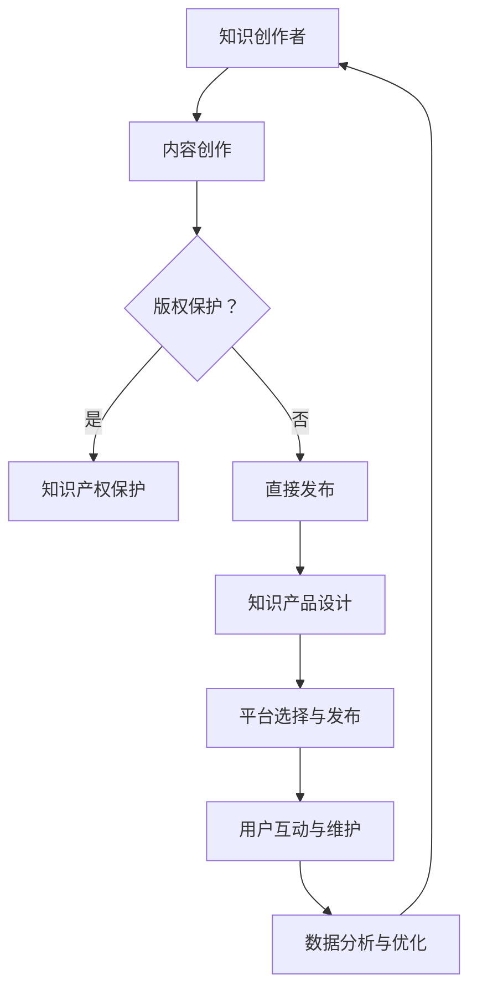

                 

## 文章标题

### 《程序员如何利用知识付费实现被动收入的策略与方法》

> 关键词：知识付费、被动收入、程序员、策略、方法

> 摘要：
本文将深入探讨程序员如何利用知识付费实现被动收入。通过分析知识付费的市场现状与趋势，探讨构建被动收入的知识产品、实现知识付费的渠道与平台选择，以及成功与失败的案例分析，为程序员提供一套切实可行的策略与方法，帮助他们在知识经济时代获得持续收入。

## 第一部分：知识付费概述与市场分析

### 1.1 知识付费概念与模式

**1.1.1 知识付费的起源与发展**

知识付费是指知识创造者通过提供有价值的信息、知识和技能，换取经济回报的一种商业模式。它的起源可以追溯到互联网的兴起，特别是在互联网普及后，人们更加倾向于在线获取信息和知识。

随着移动互联网的发展，知识付费逐渐成为市场主流。早期的知识付费主要以在线课程、电子书、专业咨询等形式存在，如今，知识付费模式已扩展到音频、视频、直播等多种形式。

**1.1.2 知识付费的主要模式**

1. **在线课程**：这是最常见的一种知识付费模式。在线课程可以是录播、直播或二者结合的形式，内容涵盖技术、教育、艺术等多个领域。

2. **电子书与音频书**：电子书和音频书是一种便于携带、随时随地进行学习的内容形式，读者可以按照自己的节奏学习。

3. **专业咨询**：专家或行业人士为有特定需求的客户提供的专业咨询服务，包括一对一咨询、线下讲座、研讨会等。

4. **知识社区**：通过社区互动、问答、论坛等形式，知识创造者与用户进行深度交流，提高用户粘性。

5. **内容订阅**：用户通过订阅方式，定期获得知识创造者提供的内容更新。

### 1.2 知识付费的市场现状与趋势

**1.2.1 行业规模与增长速度**

近年来，知识付费市场呈现出快速增长的趋势。根据市场调研数据，全球知识付费市场规模已达到数十亿美元，并持续扩大。特别是在疫情期间，在线教育和远程工作需求激增，进一步推动了知识付费的发展。

**1.2.2 市场参与者与竞争格局**

知识付费市场的参与者包括个人创作者、教育机构、内容平台等多个主体。个人创作者通过个人品牌吸引粉丝，教育机构通过课程内容和师资力量吸引学员，内容平台则通过流量和运营能力整合和分发内容。

在竞争格局上，知识付费市场呈现出头部平台垄断、中小平台分庭抗礼的局面。头部平台如Coursera、Udemy等通过海量内容和强大运营能力占据市场份额，而中小平台则通过特色课程和优质服务争夺用户。

### 1.3 知识付费的优缺点分析

**1.3.1 对知识创作者的影响**

知识付费为知识创作者提供了新的收入来源，有助于提升其经济地位和社会影响力。然而，知识付费也带来了一定的压力，如内容创作质量要求提高、竞争加剧等。

**1.3.2 对知识消费者的影响**

知识付费为知识消费者提供了更丰富的学习资源，提高了学习效率。但同时，消费者也需要对内容质量进行甄别，避免陷入低质量内容陷阱。

## 第二部分：构建被动收入的知识产品

### 2.1 内容创作与知识产权保护

**2.1.1 内容创作的策略与方法**

内容创作是构建被动收入知识产品的核心环节。以下是一些内容创作的策略与方法：

1. **挖掘市场需求**：通过市场调研，了解用户需求，确定内容主题和方向。

2. **创新内容形式**：结合多种媒体形式，如文字、图片、音频、视频等，提高内容吸引力。

3. **持续更新与迭代**：保持内容的持续更新，紧跟行业动态，提高用户粘性。

4. **个性化定制**：根据用户特点和需求，提供个性化定制的内容服务。

**2.1.2 内容类型与形式**

1. **在线课程**：这是最常见的内容类型，包括技术课程、管理课程、艺术课程等。

2. **电子书与音频书**：适合需要深度阅读和学习的用户。

3. **专业咨询**：为有特定需求的用户提供个性化服务。

4. **知识社区**：通过互动和交流，提高用户粘性和满意度。

**2.2 知识产权保护的重要性与措施**

知识产权保护是知识产品构建的重要组成部分。以下是一些知识产权保护的重要性和措施：

1. **重要性**：知识产权保护有助于保障知识创作者的权益，防止侵权行为，提高内容质量。

2. **措施**：
   - **版权登记**：对作品进行版权登记，提高法律效力。
   - **合同约束**：与用户签订版权保护合同，明确双方权益。
   - **技术保护**：采用加密、水印等技术手段，防止内容被非法复制和使用。

### 2.3 知识产品的设计与实践

**2.3.1 知识产品的定位与目标受众**

知识产品的定位和目标受众是成功的关键。以下是一些建议：

1. **定位**：明确知识产品的主题和方向，如技术、管理、艺术等。

2. **目标受众**：根据市场需求和用户特点，确定目标受众，如职场新人、中高层管理者、艺术爱好者等。

**2.3.2 知识产品的内容规划**

1. **内容结构设计**：设计合理的内容结构，确保内容连贯性和逻辑性。

2. **内容质量保障**：确保内容质量，如准确、实用、易懂等。

**2.3.3 知识产品的营销与推广**

1. **营销策略**：结合多种营销手段，如社交媒体推广、内容合作、广告投放等。

2. **渠道选择**：选择适合的知识付费平台，如慕课网、得到、网易云课堂等。

### 2.4 知识产品的运营与维护

**2.4.1 用户互动与社区建设**

1. **用户互动**：通过问答、论坛、直播等形式，与用户进行互动。

2. **社区建设**：建立知识社区，促进用户交流和学习。

**2.4.2 数据分析与优化**

1. **用户行为分析**：通过数据分析，了解用户需求和偏好。

2. **产品性能优化**：根据用户反馈，不断优化产品功能和体验。

## 第三部分：实现知识付费的渠道与平台

### 3.1 知识付费平台介绍与选择

**3.1.1 平台类型与特点**

1. **电商平台**：如淘宝、京东等，适合销售实物产品。

2. **社交媒体平台**：如微博、抖音等，适合内容推广和互动。

3. **专业知识付费平台**：如得到、知乎等，专注于知识付费领域。

**3.1.2 平台选择的考虑因素**

1. **交易手续费与分成比例**：选择手续费较低、分成比例合理的平台。

2. **平台用户量与活跃度**：选择用户量较大、活跃度较高的平台，有利于知识产品的推广。

3. **平台服务与支持**：考虑平台提供的用户服务、技术支持、营销工具等。

### 3.2 个人品牌建设与影响力提升

**3.2.1 个人品牌的定义与价值**

1. **定义**：个人品牌是个人在公众心目中的形象和认知。

2. **价值**：个人品牌有助于提高影响力、吸引粉丝和客户，从而实现知识付费。

**3.2.2 影响力提升方法**

1. **优质内容创作**：提供高质量、有价值的知识产品。

2. **社交媒体运营**：通过社交媒体平台，扩大影响力。

3. **互动与交流**：与用户进行互动，提升用户粘性。

## 第四部分：案例分析与实战指南

### 4.1 知识付费案例分析

**4.1.1 成功案例分析**

1. **案例简介与背景**：介绍成功案例的基本情况和市场背景。

2. **成功要素分析**：分析成功案例的成功原因，如内容质量、市场定位、推广策略等。

**4.1.2 失败案例分析**

1. **案例简介与问题**：介绍失败案例的基本情况和存在的问题。

2. **失败原因分析**：分析失败案例的失败原因，如内容质量不高、市场定位不准确、推广策略不当等。

### 4.2 实战指南与策略建议

**4.2.1 策略制定与执行**

1. **制定策略的步骤**：介绍制定策略的步骤和方法。

2. **执行策略的注意事项**：强调执行策略时需要注意的事项，如市场调研、内容创作、营销推广等。

**4.2.2 财务规划与风险管理**

1. **财务规划方法**：介绍财务规划的方法和工具。

2. **风险管理策略**：介绍风险管理的方法和策略。

## 附录

### 9.1 常用知识付费平台介绍

- Coursera
- Udemy
- 知乎
- 得到
- 慕课网

### 9.2 知识创作与内容管理工具

- Markdown编辑器
- 图床服务
- 视频剪辑软件
- 音频制作软件

### 9.3 数据分析与用户反馈工具

- Google Analytics
- 表格工具（如Excel）
- 数据可视化工具（如Tableau）

#### 知识付费流程图



#### 内容推荐算法原理

### 1. 协同过滤（Collaborative Filtering）

**伪代码：**

```python
function collaborativeFiltering(users, items, ratings):
    similarUsers = findSimilarUsers(users, item)
    recommendations = []
    for user in users:
        for item in items:
            if user has rated item:
                continue
            userSimilarity = calculateSimilarity(user, similarUsers)
            recommendationScore = calculateScore(userSimilarity, ratings)
            recommendations.append((item, recommendationScore))
    return sort(recommendations, byScoreDescending)
```

### 2. 基于内容的推荐（Content-Based Filtering）

**伪代码：**

```python
function contentBasedFiltering(user, items, features):
    userFeatures = getUserFeatures(user)
    similarItems = findSimilarItems(userFeatures, items, features)
    recommendations = []
    for item in similarItems:
        if user has rated item:
            continue
        similarityScore = calculateSimilarity(userFeatures, itemFeatures)
        recommendations.append((item, similarityScore))
    return sort(recommendations, byScoreDescending)
```

#### 用户行为分析模型

$$
\text{User Behavior Model} = f(\text{User Features}, \text{Item Features}, \text{Context})
$$

#### 评分预测模型

$$
\text{Rating Prediction} = \text{User Feature Vector} \cdot \text{Item Feature Vector} + \text{Bias}
$$

## 知识付费平台的用户管理系统

### 1. 系统设计

**目标：** 设计一个用户管理系统，用于管理用户信息、权限、行为数据等。

**功能模块：**
- 用户注册与登录
- 用户信息管理
- 用户行为追踪
- 用户权限管理

### 2. 实现步骤

**步骤1：用户注册与登录**
- 使用表单收集用户信息，如用户名、密码、邮箱等。
- 使用加密算法（如SHA-256）对用户密码进行加密存储。
- 使用JWT（JSON Web Tokens）进行用户身份验证。

**步骤2：用户信息管理**
- 提供用户查看和编辑个人信息的界面。
- 使用数据库存储用户信息，如用户ID、用户名、邮箱、头像等。

**步骤3：用户行为追踪**
- 记录用户的浏览、购买、评价等行为。
- 存储行为数据到数据库中。

**步骤4：用户权限管理**
- 根据用户角色分配不同的权限。
- 使用角色-权限矩阵进行权限控制。

### 3. 代码解读

**用户注册：**

```python
def register_user(username, password, email):
    hashed_password = hash_password(password)
    user = User(username=username, password=hashed_password, email=email)
    database.add_user(user)
```

**用户登录：**

```python
def login_user(username, password):
    user = database.get_user_by_username(username)
    if verify_password(password, user.password):
        generate_jwt_token(user)
```

**用户信息管理：**

```python
def update_user_info(user_id, username=None, email=None, password=None):
    user = database.get_user_by_id(user_id)
    if username:
        user.username = username
    if email:
        user.email = email
    if password:
        user.password = hash_password(password)
    database.update_user(user)
```

**用户行为追踪：**

```python
def track_user_action(user_id, action, item_id=None):
    action_data = Action(user_id=user_id, action=action, item_id=item_id)
    database.add_action(action_data)
```

**用户权限管理：**

```python
def assign_role_to_user(user_id, role):
    user = database.get_user_by_id(user_id)
    user.role = role
    database.update_user(user)
```

#### 代码解读与分析

- **用户注册与登录**：用户注册时，系统会收集用户名、密码和邮箱，并对密码进行加密存储。用户登录时，系统会验证用户名和密码是否匹配。

- **用户信息管理**：用户可以查看和编辑自己的个人信息，如用户名、邮箱和密码。系统使用数据库存储用户信息。

- **用户行为追踪**：系统记录用户的浏览、购买和评价行为，以便进行用户行为分析和个性化推荐。

- **用户权限管理**：根据用户角色分配不同的权限，如管理员可以管理用户和内容，普通用户只能浏览和购买内容。系统使用角色-权限矩阵进行权限控制。

### 最佳实践 tips、小结、注意事项、拓展阅读

#### 最佳实践 tips

1. **持续学习与提升**：作为程序员，不断学习新技术和知识，提升自己的专业能力，是构建知识产品的基石。

2. **打造个人品牌**：通过社交媒体、博客等渠道，打造个人品牌，提高知名度和影响力。

3. **注重内容质量**：内容是知识付费的核心，确保内容的质量和实用性，是吸引和留住用户的关键。

4. **灵活选择平台**：根据知识产品的特点和目标用户，灵活选择适合的付费平台。

#### 小结

本文从知识付费的概述与市场分析、构建被动收入的知识产品、实现知识付费的渠道与平台选择、案例分析与实战指南等方面，深入探讨了程序员如何利用知识付费实现被动收入的策略与方法。

#### 注意事项

1. **保护知识产权**：在进行内容创作时，务必重视知识产权保护，避免侵权行为。

2. **合理定价**：根据市场情况和用户需求，合理定价知识产品，确保具有竞争力。

3. **持续优化**：通过用户反馈和数据分析，不断优化知识产品和服务，提高用户体验。

#### 拓展阅读

1. **《知识付费：模式、策略与案例》**：详细探讨知识付费的多种模式、策略和案例分析。

2. **《个人品牌：如何打造个人影响力》**：介绍个人品牌建设的方法和技巧。

3. **《用户行为分析：原理、方法与应用》**：介绍用户行为分析的基本原理、方法和应用场景。

