                 

## 《程序员如何利用知识付费打造个人影响力》

### 关键词：知识付费，个人影响力，程序员，课程内容，品牌建设，销售技巧

### 摘要

在信息技术飞速发展的今天，程序员不仅是技术的践行者，更是知识的传播者。知识付费作为新兴的商业模式，为程序员提供了一个展示才能、分享知识和建立个人品牌的平台。本文将深入探讨程序员如何通过知识付费打造个人影响力，包括课程内容创作、个人品牌建设以及提升销售技巧等方面的策略和实践。

### 《程序员如何利用知识付费打造个人影响力》目录大纲

#### 第一部分：背景与概念理解
1. **知识付费概述**
    1.1. **知识付费的定义与市场趋势**
    1.2. **知识付费对程序员的意义**
    1.3. **知识付费平台的概述**
2. **个人影响力的重要性**
    2.1. **个人影响力的定义**
    2.2. **在编程领域的个人影响力**
    2.3. **个人影响力与职业发展**

#### 第二部分：知识付费与个人影响力建设
3. **创建有价值的课程内容**
    3.1. **如何选择适合的编程主题**
    3.2. **课程内容的结构与设计**
    3.3. **课程内容的呈现与传播**
4. **建立个人品牌**
    4.1. **个人品牌定位**
    4.2. **社交媒体的影响力打造**
    4.3. **内容营销与社区参与**
5. **提升课程销售技巧**
    5.1. **了解目标受众**
    5.2. **课程定价策略**
    5.3. **营销推广与销售转化**

#### 第三部分：实战案例分析
6. **成功案例分享**
    6.1. **案例分析一：程序员A的成功之路**
    6.2. **案例分析二：程序员B的崛起**
    6.3. **案例分析三：程序员C的品牌建设**
7. **课程开发与推广技巧**
    7.1. **课程开发的步骤与工具**
    7.2. **课程推广的渠道与方法**
    7.3. **处理用户反馈与改进课程**

#### 第四部分：未来展望
8. **知识付费与编程教育的融合**
    8.1. **在线教育的发展趋势**
    8.2. **编程教育中的知识付费模式**
    8.3. **未来编程教育的发展方向**
9. **个人影响力持续提升策略**
    9.1. **不断更新知识体系**
    9.2. **参与开源项目**
    9.3. **跨界合作与资源整合**

#### 附录
10. **知识付费平台推荐**
    10.1. **主流知识付费平台介绍**
    10.2. **平台使用指南**
11. **实用工具与资源**
    11.1. **课程设计与制作工具**
    11.2. **社交媒体管理工具**
    11.3. **其他推荐资源**

### 第一部分：背景与概念理解

#### 1.1 知识付费概述

知识付费是指通过付费的方式获取知识服务，这种模式在近年来随着互联网的发展逐渐兴起。知识付费平台如分答、得到、知乎Live等，为用户提供了各类知识内容，包括专业领域的深度讲解、技能培训、书籍解读等。对于程序员来说，知识付费不仅是一种获取知识的方式，更是一种展示自己专业能力、建立个人品牌的有效途径。

**知识付费的定义与市场趋势**

知识付费的定义可以简单概括为：通过支付一定费用来获取有价值的信息或知识服务。这种模式的核心在于价值交换，即用户通过付费获得高质量的、针对性的知识内容，而知识提供者则通过分享专业知识和经验获得收益。

市场趋势方面，随着信息技术的发展，人们对知识的渴求不断增长，特别是在专业领域。知识付费市场的规模逐年扩大，用户对高质量知识内容的付费意愿也在提高。根据数据显示，2019年中国知识付费市场规模已达到322亿元，预计未来还将持续增长。

**知识付费对程序员的意义**

对于程序员而言，知识付费具有以下几个方面的意义：

1. **提升个人技能**：通过付费课程，程序员可以学习到最新的技术知识和行业动态，提升自身的技术水平。
2. **建立个人品牌**：通过在知识付费平台上分享自己的专业知识和经验，程序员可以建立个人品牌，增加行业影响力。
3. **拓展职业机会**：拥有强大知识储备的程序员在求职和职业发展中更具竞争力，知识付费有助于他们拓展职业机会。

**知识付费平台的概述**

目前市场上存在多种知识付费平台，各具特色，如下：

- **分答**：以问答形式为主，用户可以付费向专家提问。
- **得到**：以音频课程为主，涵盖财经、科技、人文等多个领域。
- **知乎Live**：以直播和录播课程为主，内容涵盖广泛，包括专业知识和技能培训。
- **网易云课堂**：以在线课程为主，提供包括编程语言、框架、云计算等多个领域的学习资源。

#### 1.2 个人影响力的重要性

**个人影响力的定义**

个人影响力是指一个人在特定领域或社交网络中，通过言行和表现对他人产生的影响力和号召力。在编程领域，个人影响力通常体现在技术见解、项目贡献、社区活动等方面。

**在编程领域的个人影响力**

在编程领域，个人影响力体现在以下几个方面：

1. **技术见解**：有影响力的程序员能够提出独到的技术见解，引领行业趋势。
2. **项目贡献**：参与开源项目，并为项目做出重要贡献，能够提升个人在社区中的地位。
3. **社区活动**：积极参与技术社区活动，组织或参与技术讲座、研讨会等，扩大个人知名度。

**个人影响力与职业发展**

个人影响力对程序员职业发展有着重要影响：

1. **提升职业竞争力**：具备个人影响力的程序员在求职和职业晋升中更具优势。
2. **拓展职业机会**：个人影响力有助于程序员获取更多的职业机会，包括高薪职位和创业机会。
3. **提高职业满意度**：个人影响力的提升能够带来更高的职业满足感和成就感。

### 第二部分：知识付费与个人影响力建设

#### 2.1 创建有价值的课程内容

**如何选择适合的编程主题**

选择合适的编程主题是知识付费课程成功的关键。以下是一些选择编程主题的考虑因素：

1. **市场需求**：选择当前热门的技术领域，如人工智能、区块链、云计算等。
2. **个人专长**：选择自己熟悉和擅长的领域，能够更好地传授知识和经验。
3. **受众需求**：了解目标受众的需求，选择他们感兴趣和需要的内容。
4. **内容独特性**：选择具有独特性和创新性的主题，以区别于其他课程。

**课程内容的结构与设计**

课程内容的设计需要考虑以下几个方面：

1. **课程目标**：明确课程的目标和受众，确保课程内容与目标相符。
2. **内容组织**：按照逻辑顺序组织课程内容，确保知识点之间的连贯性。
3. **教学方法**：采用合适的教学方法，如讲解、演示、案例分析等，提高课程吸引力。
4. **互动设计**：设计互动环节，如提问、讨论、作业等，提高学员的参与度。

**课程内容的呈现与传播**

课程内容的呈现和传播是影响课程效果的关键因素。以下是一些策略：

1. **多媒体呈现**：结合文字、图片、视频等多媒体形式，提高课程的趣味性和可理解性。
2. **定期更新**：保持课程内容的时效性和更新，以适应技术发展的变化。
3. **社交媒体推广**：利用社交媒体平台，如微博、微信公众号等，进行课程推广和宣传。
4. **社区互动**：建立学习社区，鼓励学员之间的交流和讨论，提高课程的传播效果。

#### 2.2 建立个人品牌

**个人品牌定位**

建立个人品牌的第一步是进行品牌定位。以下是一些品牌定位的考虑因素：

1. **专业领域**：确定自己在编程领域的专业方向，如前端开发、后端开发、数据分析等。
2. **个人特质**：挖掘自己的独特特质，如技术深度、创新思维、实战经验等。
3. **目标受众**：明确自己的目标受众，如初学者、中级开发者、高级工程师等。

**社交媒体的影响力打造**

社交媒体是建立个人品牌的重要渠道。以下是一些策略：

1. **内容输出**：定期在社交媒体上分享技术文章、博客、视频等，展示自己的专业能力。
2. **互动交流**：积极参与社区讨论，回答问题，建立良好的互动关系。
3. **品牌宣传**：利用社交媒体的广告功能，进行品牌宣传和推广。
4. **KOL合作**：与其他知名博主或行业专家合作，提高个人品牌的曝光度。

**内容营销与社区参与**

内容营销和社区参与是提升个人影响力的重要手段。以下是一些策略：

1. **内容营销**：通过撰写高质量的技术文章、博客，分享自己的经验和见解，吸引更多关注。
2. **社区参与**：积极参与技术社区的活动，如组织或参与技术讲座、研讨会等。
3. **开源项目**：参与开源项目，贡献代码，提升自己的技术声誉。
4. **用户反馈**：重视用户反馈，及时回复和解决问题，提高用户满意度。

#### 2.3 提升课程销售技巧

**了解目标受众**

了解目标受众是销售课程的前提。以下是一些了解目标受众的方法：

1. **市场调研**：通过调查问卷、用户访谈等方式，收集目标受众的需求和偏好。
2. **用户画像**：根据收集的数据，绘制目标受众的画像，明确他们的特征和需求。
3. **反馈收集**：定期收集用户反馈，了解他们对课程的满意度和改进建议。

**课程定价策略**

合理的课程定价策略是课程销售成功的关键。以下是一些定价策略：

1. **成本定价法**：根据课程开发成本和运营成本，制定合理的课程价格。
2. **市场定价法**：参考同类课程的定价，结合市场需求和竞争情况，制定合适的价格。
3. **价值定价法**：根据课程内容的独特性和价值，制定较高的价格。

**营销推广与销售转化**

有效的营销推广和销售转化策略能够提高课程的销量。以下是一些策略：

1. **社交媒体推广**：利用社交媒体平台，进行课程宣传和推广。
2. **内容营销**：通过撰写高质量的技术文章、博客，吸引潜在客户。
3. **优惠促销**：提供限时优惠、团购优惠等，刺激用户购买。
4. **销售转化**：通过用户体验、售后服务等手段，提高销售转化率。

### 第三部分：实战案例分析

#### 3.1 案例分析一：程序员A的成功之路

程序员A通过知识付费平台发布了一系列关于前端开发的课程，内容涵盖HTML、CSS、JavaScript等多个方面。他的课程以深入浅出的讲解、丰富的实例和互动式教学而受到学员的喜爱。

**成功原因分析**：

1. **专业领域选择**：程序员A选择了热门的前端开发领域，市场需求大。
2. **课程内容质量**：课程内容深入浅出，实用性高，符合学员需求。
3. **互动教学**：通过互动式教学，提高了学员的参与度和学习效果。
4. **品牌建设**：程序员A在社交媒体上积极输出内容，建立了良好的个人品牌。

**经验总结**：

1. **选择热门领域**：选择市场需求大的领域，有利于课程的推广和销售。
2. **注重课程质量**：课程内容要深入浅出，实用性高，才能获得学员的认可。
3. **互动教学**：互动式教学能够提高学员的参与度和学习效果。
4. **品牌建设**：在社交媒体上积极输出内容，建立个人品牌，提高影响力。

#### 3.2 案例分析二：程序员B的崛起

程序员B通过参与开源项目，逐渐在技术社区中积累了影响力。他随后在知识付费平台上发布了一系列关于Python编程的课程，内容涵盖基础语法、高级应用、数据分析等多个方面。

**成功原因分析**：

1. **开源项目贡献**：程序员B通过在开源项目中贡献代码，提升了技术声誉。
2. **课程内容全面**：课程内容全面，涵盖了Python编程的各个方面，满足学员的不同需求。
3. **教学风格**：程序员B的教学风格生动有趣，能够吸引学员的兴趣。
4. **品牌建设**：程序员B在开源项目和技术社区中的积极参与，提高了个人品牌的知名度。

**经验总结**：

1. **开源项目贡献**：积极参与开源项目，提升技术声誉，为个人品牌建设打下基础。
2. **课程内容全面**：课程内容要全面，满足学员的不同需求。
3. **教学风格**：生动有趣的教学风格能够吸引学员的兴趣。
4. **品牌建设**：在开源项目和技术社区中积极参与，提高个人品牌的知名度。

#### 3.3 案例分析三：程序员C的品牌建设

程序员C通过在知识付费平台发布课程，同时在社交媒体上积极输出内容，成功建立了个人品牌。他的课程内容涵盖Java编程、大数据技术等多个领域。

**成功原因分析**：

1. **专业领域选择**：程序员C选择了技术深度较高的领域，如大数据技术，符合他的专业背景。
2. **课程内容质量**：课程内容质量高，深入浅出，实用性高。
3. **内容输出**：程序员C在社交媒体上定期输出高质量内容，建立了良好的个人品牌。
4. **社区参与**：程序员C积极参与技术社区活动，提高了个人知名度。

**经验总结**：

1. **专业领域选择**：选择符合自己专业背景的领域，能够更好地传授知识和经验。
2. **课程内容质量**：课程内容要质量高，深入浅出，实用性高。
3. **内容输出**：定期在社交媒体上输出高质量内容，建立个人品牌。
4. **社区参与**：积极参与技术社区活动，提高个人知名度。

### 第四部分：课程开发与推广技巧

#### 4.1 课程开发的步骤与工具

**课程开发的基本步骤**：

1. **需求分析**：确定课程目标、受众和市场需求。
2. **内容规划**：规划课程内容，制定教学大纲。
3. **内容创作**：撰写课程讲义、录制视频、制作PPT等。
4. **内容审核**：对课程内容进行审核，确保质量。
5. **课程发布**：在知识付费平台上发布课程。

**常用的课程开发工具**：

- **内容创作工具**：如Microsoft Word、Google Docs、Markdown编辑器等。
- **视频制作工具**：如Adobe Premiere、Final Cut Pro、Camtasia等。
- **PPT制作工具**：如Microsoft PowerPoint、Keynote、Google Slides等。

#### 4.2 课程推广的渠道与方法

**推广渠道**：

1. **社交媒体**：如微博、微信公众号、知乎、抖音等。
2. **知识付费平台**：如网易云课堂、慕课网、分答等。
3. **技术社区**：如GitHub、Stack Overflow、CSDN等。
4. **线下活动**：如技术讲座、研讨会、培训等。

**推广方法**：

1. **内容营销**：通过撰写高质量的技术文章、博客，吸引潜在客户。
2. **互动推广**：在社交媒体上发布互动内容，提高用户参与度。
3. **合作推广**：与其他博主、KOL或机构合作，扩大推广范围。
4. **广告投放**：在目标受众聚集的平台进行广告投放，提高曝光度。

#### 4.3 处理用户反馈与改进课程

**用户反馈的重要性**：

用户反馈是课程改进的重要依据。通过用户反馈，可以了解课程的质量、受众的需求以及改进的方向。

**处理用户反馈的方法**：

1. **及时回复**：对用户的反馈及时回复，表达感谢，并认真对待意见。
2. **分类整理**：将用户反馈按类型整理，如内容质量、教学方式、互动环节等。
3. **分析改进**：根据用户反馈进行分析，找出问题所在，制定改进措施。
4. **持续优化**：不断优化课程内容，提高课程质量。

**改进课程的建议**：

1. **加强互动**：增加课程的互动环节，提高学员的参与度。
2. **丰富内容**：根据用户反馈，丰富课程内容，满足不同层次学员的需求。
3. **更新教材**：定期更新教材，确保课程内容的时效性。
4. **提高教学质量**：优化教学方式，提高教学质量，增强学员的学习效果。

### 第五部分：未来展望

#### 5.1 知识付费与编程教育的融合

**在线教育的发展趋势**

随着互联网技术的不断发展，在线教育已成为教育领域的重要趋势。根据数据显示，2020年中国在线教育市场规模已达到4858亿元，预计未来还将持续增长。

**编程教育中的知识付费模式**

知识付费模式在编程教育中的应用越来越广泛。编程教育中的知识付费模式主要包括以下几种：

1. **课程付费**：用户通过付费购买课程，学习编程知识和技能。
2. **会员付费**：用户通过付费成为会员，享受平台的多种服务，如课程、社区互动等。
3. **项目付费**：用户通过付费参与实际项目，提升编程能力和实战经验。

**未来编程教育的发展方向**

未来编程教育的发展方向主要包括以下几个方面：

1. **个性化学习**：根据学员的学习需求和进度，提供个性化的学习服务。
2. **场景化教学**：将编程知识融入实际场景，提高学习的实用性和趣味性。
3. **多元化内容**：提供涵盖不同编程语言、框架、技术的多元化内容，满足不同层次学员的需求。
4. **跨界融合**：将编程教育与其他领域（如人工智能、大数据等）相结合，推动编程教育的创新与发展。

#### 5.2 个人影响力持续提升策略

**不断更新知识体系**

技术领域发展迅速，程序员需要不断更新自己的知识体系，保持竞争力。以下是一些建议：

1. **定期学习**：定期阅读技术书籍、博客，关注行业动态。
2. **在线课程**：参加在线课程，学习新的技术和知识。
3. **实践应用**：通过实际项目，将所学知识应用于实践，加深理解。

**参与开源项目**

参与开源项目是提升个人影响力的重要途径。以下是一些建议：

1. **选择适合自己的项目**：根据个人兴趣和技能，选择合适的开源项目。
2. **积极参与**：积极参与项目讨论，贡献代码，提升技术声誉。
3. **维护项目**：持续关注项目，及时修复bug，更新文档，提高项目的质量。

**跨界合作与资源整合**

跨界合作和资源整合有助于程序员拓展视野，提升个人影响力。以下是一些建议：

1. **参加行业活动**：参加技术讲座、研讨会、培训等活动，结识业内同行。
2. **合作开发**：与其他程序员或团队合作，共同开发项目，提升技能。
3. **资源共享**：与其他程序员或团队分享资源和经验，共同进步。

### 附录

#### 10. 知识付费平台推荐

**主流知识付费平台介绍**：

- **网易云课堂**：提供包括编程语言、框架、云计算等多个领域的在线课程。
- **慕课网**：涵盖前端开发、后端开发、人工智能等多个领域的在线课程。
- **分答**：以问答形式为主的知识付费平台。
- **得到**：以音频课程为主的知识付费平台。

**平台使用指南**：

- **注册与登录**：在知识付费平台注册账号，进行登录。
- **课程选择**：根据个人需求和兴趣，选择合适的课程。
- **购买与支付**：选择购买课程，进行支付。
- **学习与互动**：观看课程视频，参与课程讨论，完成作业。

#### 11. 实用工具与资源

**课程设计与制作工具**：

- **Microsoft PowerPoint**：用于制作演示文稿。
- **Adobe Premiere**：用于视频编辑。
- **Markdown编辑器**：用于撰写技术文章和博客。

**社交媒体管理工具**：

- **Hootsuite**：用于社交媒体管理和内容发布。
- **Buffer**：用于社交媒体管理和内容发布。
- **Zapier**：用于自动化任务和数据分析。

**其他推荐资源**：

- **GitHub**：用于开源项目贡献和技术交流。
- **Stack Overflow**：用于技术问答和讨论。
- **CSDN**：提供编程学习资源和社区交流。

### 总结

通过本文的探讨，我们可以看到，知识付费为程序员提供了一个展示自己才能、分享知识和建立个人品牌的平台。通过创建有价值的课程内容、建立个人品牌以及提升销售技巧，程序员可以在知识付费领域取得成功，实现个人影响力的提升。未来，随着在线教育的不断发展，知识付费将为程序员带来更多机会和挑战。程序员应不断更新知识体系，积极参与开源项目，拓展视野，持续提升个人影响力。

### 作者信息

**作者：AI天才研究院/AI Genius Institute & 禅与计算机程序设计艺术 /Zen And The Art of Computer Programming**

### 附录：Mermaid流程图

```mermaid
graph TB
    A[知识付费] --> B[个人影响力]
    B --> C[课程内容]
    B --> D[品牌建设]
    B --> E[销售技巧]
    A --> F[编程教育]
    C --> G[课程设计]
    C --> H[内容传播]
    D --> I[定位]
    D --> J[社交媒体]
    E --> K[受众分析]
    E --> L[定价策略]
    E --> M[推广转化]
    F --> N[在线教育趋势]
    F --> O[知识付费模式]
    F --> P[编程教育方向]
    G --> Q[设计步骤]
    G --> R[工具使用]
    H --> S[传播渠道]
    H --> T[内容营销]
    I --> U[个人定位]
    I --> V[社区参与]
    K --> W[市场研究]
    K --> X[用户画像]
    L --> Y[定价策略]
    L --> Z[成本分析]
    M --> AA[营销渠道]
    M --> BB[转化策略]
    N --> CC[教育发展趋势]
    N --> DD[知识付费融合]
    N --> EE[未来方向]
    O --> FF[付费模式]
    O --> GG[课程质量]
    O --> HH[用户反馈]
    P --> II[课程内容]
    P --> JJ[教学方法]
    P --> KK[学习效果]
    Q --> LL[需求分析]
    Q --> MM[内容组织]
    Q --> NN[用户体验]
    R --> OO[软件工具]
    R --> PP[硬件设备]
    S --> QQ[社交媒体]
    S --> RR[内容发布]
    T --> SS[内容创意]
    T --> TT[受众互动]
    U --> WW[市场定位]
    U --> XX[品牌定位]
    K --> YY[用户反馈]
    L --> ZZ[成本分析]
    M --> AAA[营销渠道]
    M --> BBB[推广策略]
    N --> CCC[教育趋势]
    N --> DDD[知识付费模式]
    N --> EEE[未来展望]
    O --> GGG[课程内容]
    O --> HHH[教学方法]
    O --> IIII[学习效果]
    P --> JJ[教学步骤]
    P --> KK[课程评估]
    P --> LL[教学工具]
    Q --> MM[需求分析]
    Q --> NN[课程内容]
    Q --> OO[用户体验]
    R --> PP[工具选择]
    R --> QQ[工具使用]
    S --> RR[内容发布]
    S --> SS[内容推广]
    T --> TT[受众互动]
    U --> WW[品牌定位]
    U --> XX[内容策略]
    V --> YY[用户反馈]
    V --> ZZ[用户参与]
    W --> AAA[市场调研]
    W --> BBB[用户画像]
    W --> CCC[市场定位]
    X --> YY[用户需求]
    X --> ZZ[用户行为]
    Y --> AAA[定价策略]
    Y --> BBB[成本分析]
    Y --> CCC[市场研究]
    Z --> AAA[销售渠道]
    Z --> BBB[销售策略]
    Z --> CCC[销售转化]
    AA --> DDD[用户反馈]
    AA --> EEE[课程改进]
    BB --> CCC[营销效果]
    BB --> DDD[用户参与]
    BB --> EEE[销售转化]
    CC --> DDD[教育趋势]
    CC --> EEE[知识付费模式]
    CC --> FFF[未来展望]
    DD --> EEE[知识付费融合]
    DD --> FFF[在线教育发展]
    EE --> FFF[编程教育创新]
    FF --> GGG[课程内容]
    FF --> HHH[教学方法]
    FF --> IIII[学习效果]
    GG --> HHH[教学方法]
    GG --> IIII[学习效果]
    GG --> JJJ[用户反馈]
    HH --> IIII[学习效果]
    HH --> JJJ[用户参与]
    II --> GGG[课程内容]
    II --> HHH[教学方法]
    II --> IIII[学习效果]
    JJ --> GGG[课程内容]
    JJ --> HHH[教学方法]
    JJ --> IIII[学习效果]
    KK --> GGG[课程内容]
    KK --> HHH[教学方法]
    KK --> IIII[学习效果]
    KK --> JJJ[用户反馈]
    LL --> GGG[课程内容]
    LL --> HHH[教学方法]
    LL --> IIII[学习效果]
    MM --> GGG[课程内容]
    MM --> HHH[教学方法]
    MM --> IIII[学习效果]
    NN --> GGG[课程内容]
    NN --> HHH[教学方法]
    NN --> IIII[学习效果]
    OO --> GGG[课程内容]
    OO --> HHH[教学方法]
    OO --> IIII[学习效果]
    PP --> GGG[课程内容]
    PP --> HHH[教学方法]
    PP --> IIII[学习效果]
    QQ --> GGG[课程内容]
    QQ --> HHH[教学方法]
    QQ --> IIII[学习效果]
    RR --> GGG[课程内容]
    RR --> HHH[教学方法]
    RR --> IIII[学习效果]
    SS --> GGG[课程内容]
    SS --> HHH[教学方法]
    SS --> IIII[学习效果]
    TT --> GGG[课程内容]
    TT --> HHH[教学方法]
    TT --> IIII[学习效果]
    UU --> GGG[课程内容]
    UU --> HHH[教学方法]
    UU --> IIII[学习效果]
    VV --> GGG[课程内容]
    VV --> HHH[教学方法]
    VV --> IIII[学习效果]
    WW --> GGG[课程内容]
    WW --> HHH[教学方法]
    WW --> IIII[学习效果]
    XX --> GGG[课程内容]
    XX --> HHH[教学方法]
    XX --> IIII[学习效果]
    YY --> GGG[课程内容]
    YY --> HHH[教学方法]
    YY --> IIII[学习效果]
    ZZ --> GGG[课程内容]
    ZZ --> HHH[教学方法]
    ZZ --> IIII[学习效果]
```

以上就是关于《程序员如何利用知识付费打造个人影响力》的技术博客文章，希望能够帮助到广大程序员朋友。在知识付费的时代，通过不断提升自己的专业能力和个人影响力，程序员可以在职业发展中取得更大的成功。让我们共同努力，打造属于我们的编程时代！

