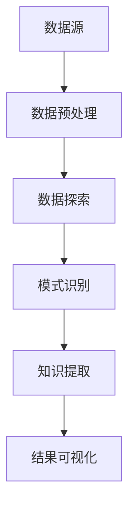

                 

### 书名：《程序员如何利用知识发现引擎实现财富自由》

在技术迅猛发展的今天，程序员不仅是代码的编写者，更是创新者、探索者和解决方案的提供者。面对数据爆炸的时代，如何从海量数据中挖掘出有价值的信息，成为每个程序员亟待解决的关键问题。知识发现引擎作为一种先进的工具，它通过人工智能和机器学习技术，帮助程序员从数据中发现规律、趋势和模式，从而实现数据的深度挖掘和智能化分析。

本书旨在帮助程序员掌握知识发现引擎的基本原理和应用，并通过实际案例和项目实战，展示如何利用这一工具实现财富自由。全书分为四个主要部分，每个部分都将深入探讨知识发现引擎在不同领域的应用：

- **第一部分：基础知识与核心概念**：介绍知识发现引擎的定义、发展历程和核心组成部分，涵盖数据挖掘、机器学习、大数据技术等基础概念，并通过Mermaid流程图展示知识发现引擎的基本架构。

- **第二部分：应用与实践**：通过具体的实战案例，详细讲解如何利用知识发现引擎进行项目开发，包括电商平台用户行为分析、社交媒体内容分类、智能金融风险评估等实际应用。

- **第三部分：实现财富自由**：探讨知识发现引擎在财富管理、投资效率提升和个人知识体系构建中的应用，帮助程序员通过知识发现实现财务自由。

- **第四部分：未来展望**：展望知识发现引擎的技术发展趋势，探讨其在各个行业的潜在应用，以及与人工智能的融合前景。

通过本书的阅读，程序员将不仅能够理解知识发现引擎的工作原理，还能学会如何将其应用于实际项目，从而在技术道路上迈出坚实的步伐，实现个人的财富自由。无论你是刚刚入门的程序员，还是有一定经验的开发者，本书都将成为你宝贵的指南。

### 关键词

- **知识发现引擎**
- **数据挖掘**
- **机器学习**
- **大数据技术**
- **关联规则挖掘**
- **聚类算法**
- **协同过滤**
- **财富自由**
- **项目实战**
- **案例分析**

### 摘要

本文将围绕知识发现引擎这一主题，探讨其基本概念、核心原理以及在实际应用中的价值。知识发现引擎是一种利用人工智能和机器学习技术，从海量数据中自动挖掘出有价值信息的高级工具。本书首先介绍知识发现引擎的定义、发展历程及其核心组成部分，如数据挖掘、机器学习和大数据技术等。接着，通过Mermaid流程图详细展示知识发现引擎的基本架构，并深入讲解关联规则挖掘、聚类算法和协同过滤算法等关键算法原理，同时介绍相关的数学模型和公式。随后，本书通过实际案例和项目实战，展示如何利用知识发现引擎进行电商平台用户行为分析、社交媒体内容分类和智能金融风险评估等应用。最后，本书探讨知识发现引擎在财富管理、投资效率提升和个人知识体系构建中的应用，帮助程序员实现财富自由。未来展望部分将展望知识发现引擎的技术发展趋势和跨学科融合前景，为读者提供更广阔的视野。

### 第一部分：基础知识与核心概念

#### 第1章：知识发现引擎概述

知识发现引擎（Knowledge Discovery Engine，简称KDE）是数据挖掘与机器学习领域的重要工具，它利用先进的人工智能技术，从大量数据中自动识别出隐藏的模式、规律和知识。知识发现引擎的应用场景非常广泛，包括但不限于商业智能、金融分析、医疗诊断、社交媒体、智能交通和智能城市等。

**1.1 知识发现引擎的定义与功能**

知识发现引擎的定义可以从广义和狭义两个方面来理解。从广义上讲，知识发现引擎是一种自动化工具，能够从数据集中识别出潜在的模式和知识。这个过程通常包括数据预处理、模式识别、知识提取和结果可视化等多个环节。从狭义上讲，知识发现引擎是一种专门针对复杂数据集进行模式识别和知识提取的工具，它依赖于特定的算法和模型，如关联规则挖掘、聚类分析和协同过滤等。

知识发现引擎的主要功能包括：

1. **数据预处理**：清洗、转换和整合原始数据，使其适合后续的分析处理。
2. **模式识别**：通过算法和模型，从数据中识别出潜在的规律和模式。
3. **知识提取**：将识别出的模式转化为可操作的知识，以便用于决策支持或进一步分析。
4. **结果可视化**：将分析结果以图形或表格形式展示，帮助用户理解和解释分析结果。

**1.2 知识发现引擎的发展历程**

知识发现引擎的发展可以追溯到20世纪80年代，当时数据挖掘技术刚刚起步。随着计算机硬件的进步和算法研究的深入，知识发现引擎得到了快速的发展。以下是知识发现引擎发展的重要里程碑：

- **1980年代**：数据库挖掘和数据仓库技术的兴起，为知识发现奠定了基础。
- **1990年代**：关联规则挖掘、聚类分析和分类算法等关键算法的提出，标志着知识发现引擎开始走向实用化。
- **2000年代**：大数据技术和云计算的兴起，使得知识发现引擎能够处理更大量和更复杂的数据集。
- **2010年代至今**：深度学习和人工智能技术的快速发展，使得知识发现引擎能够从数据中提取更高级的知识和模式。

**1.3 知识发现引擎的核心组成部分**

知识发现引擎由多个核心组成部分构成，每个部分在知识发现过程中扮演着关键角色：

1. **数据源**：知识发现引擎的数据源可以是结构化数据（如关系型数据库）、半结构化数据（如XML、JSON）或非结构化数据（如图像、文本、语音等）。
2. **数据预处理模块**：负责清洗、转换和整合原始数据，使其适合后续的分析处理。
3. **模式识别模块**：包含各种算法和模型，用于从数据中识别出潜在的规律和模式。
4. **知识提取模块**：将识别出的模式转化为可操作的知识，以便用于决策支持或进一步分析。
5. **结果可视化模块**：将分析结果以图形或表格形式展示，帮助用户理解和解释分析结果。

通过上述核心组成部分的协同工作，知识发现引擎能够有效地从海量数据中挖掘出有价值的信息，为各行业的决策支持提供强有力的工具。

### 第2章：核心概念与联系

知识发现引擎的有效运作依赖于多个核心概念和技术的相互融合。本章将深入探讨数据挖掘、机器学习与知识发现的联系，以及知识发现引擎与大数据技术的融合，并通过Mermaid流程图展示知识发现引擎的基本架构。

**2.1 数据挖掘、机器学习与知识发现的联系**

数据挖掘（Data Mining）是知识发现（Knowledge Discovery in Databases，简称KDD）过程中的第一步，它是指从大量数据中自动提取隐藏的、未知的、有价值的模式和知识。数据挖掘涵盖了以下基本步骤：

1. **数据预处理**：包括数据清洗、归一化、缺失值处理等，以确保数据质量。
2. **数据探索**：通过统计分析、可视化等方法，对数据集进行初步探索，发现潜在的模式。
3. **模式识别**：利用各种算法和模型，从数据中提取出有用的模式和知识。
4. **评估**：对挖掘出的模式进行评估，判断其是否具有实际应用价值。

机器学习（Machine Learning）是数据挖掘的重要技术之一，它通过构建和分析模型，使计算机能够从数据中学习和预测。机器学习主要包括以下几种类型：

1. **监督学习**：通过已有标签数据训练模型，以便对新数据进行预测。
2. **无监督学习**：没有预设标签，通过发现数据中的内在结构进行聚类或降维。
3. **半监督学习**：结合有标签和无标签数据，以提高模型性能。

知识发现（Knowledge Discovery）是一个更广泛的概念，它不仅包括数据挖掘，还涵盖了数据预处理、数据探索和知识提取等步骤。知识发现的目标是从大量数据中提取出具有实际应用价值的知识，通常涉及以下步骤：

1. **问题定义**：明确知识发现的目标和问题。
2. **数据收集**：获取相关数据，包括结构化、半结构化和非结构化数据。
3. **数据预处理**：清洗、转换和整合数据，以提高数据质量。
4. **模式识别**：利用数据挖掘和机器学习技术，从数据中提取出潜在的模式和知识。
5. **知识提取**：将挖掘出的模式转化为可操作的知识。
6. **评估与优化**：对知识发现过程进行评估和优化，以提高知识发现的效果。

数据挖掘、机器学习和知识发现三者之间存在密切的联系。数据挖掘是实现知识发现的重要手段，而机器学习作为数据挖掘的关键技术之一，为知识发现提供了强大的工具。知识发现则是一个更为综合的过程，它涵盖了数据挖掘和机器学习的所有步骤，并注重将知识应用到实际问题中。

**2.2 知识发现引擎与大数据技术的融合**

大数据技术（Big Data Technology）是指处理海量、多样化和快速变化的数据集的一系列技术和方法。大数据技术主要包括数据存储、数据分析和数据管理等方面。知识发现引擎与大数据技术的融合，使得知识发现能够处理更大量和更复杂的数据集。

1. **数据存储**：大数据技术提供了高效的数据存储解决方案，如分布式文件系统（如Hadoop的HDFS）和NoSQL数据库（如MongoDB、Cassandra）。这些解决方案能够存储海量数据，并保证数据的高可用性和高性能访问。

2. **数据处理**：大数据技术提供了高效的数据处理框架，如MapReduce和Spark。这些框架能够处理大规模的数据集，并将计算任务分布到多个节点上执行，从而提高数据处理的速度和效率。

3. **数据分析**：大数据技术提供了丰富的数据分析工具，如Spark SQL、Hive和Pig。这些工具能够对大规模数据集进行高效的统计分析、机器学习和数据挖掘。

4. **数据管理**：大数据技术提供了数据管理平台，如Hadoop生态系统中的Hue和Ambari。这些平台能够对大数据进行可视化管理和监控，以提高数据管理效率。

知识发现引擎与大数据技术的融合，使得知识发现过程能够处理更大量、更复杂的数据集，从而发现更多的潜在模式和知识。具体来说，知识发现引擎可以通过以下方式与大数据技术融合：

1. **数据预处理**：利用大数据技术进行数据预处理，如数据清洗、转换和整合，以提高数据质量。

2. **模式识别**：利用大数据处理框架（如Spark）和机器学习算法，对大规模数据集进行模式识别。

3. **知识提取**：利用大数据技术进行知识提取，如使用Spark MLlib进行机器学习模型的训练和预测。

4. **结果可视化**：利用大数据技术进行结果可视化，如使用Hadoop生态系统中的工具（如Hue）将分析结果以图形或表格形式展示。

通过大数据技术与知识发现引擎的融合，程序员能够更高效地从海量数据中挖掘出有价值的信息，从而实现数据驱动的决策支持和创新应用。

**2.3 Mermaid流程图：知识发现引擎的基本架构**

为了更好地理解知识发现引擎的工作流程，我们可以使用Mermaid流程图（一种基于Markdown的图形描述语言）来展示其基本架构。以下是一个简单的Mermaid流程图示例，展示了知识发现引擎的基本组成部分和流程：



- **A[数据源]**：知识发现引擎的数据源，可以是结构化数据、半结构化数据或非结构化数据。
- **B[数据预处理]**：清洗、转换和整合原始数据，使其适合后续的分析处理。
- **C[数据探索]**：通过统计分析、可视化等方法，对数据集进行初步探索，发现潜在的模式。
- **D[模式识别]**：利用各种算法和模型，从数据中提取出有用的模式和知识。
- **E[知识提取]**：将识别出的模式转化为可操作的知识，以便用于决策支持或进一步分析。
- **F[结果可视化]**：将分析结果以图形或表格形式展示，帮助用户理解和解释分析结果。

通过这个Mermaid流程图，我们可以直观地看到知识发现引擎从数据源到结果可视化的整个工作流程，这有助于程序员更好地理解和应用知识发现引擎。

### 第3章：关键算法原理

在知识发现引擎中，关键算法是挖掘数据中隐藏规律和知识的核心工具。本章将详细介绍几种常用的算法原理，包括关联规则挖掘算法、聚类算法和协同过滤算法，并通过伪代码和数学公式详细阐述其基本原理和应用。

#### 3.1 关联规则挖掘算法

关联规则挖掘算法是用于发现数据集中项集之间关联性的重要方法，它能够识别出数据中的频繁模式。以下是关联规则挖掘算法的基本原理：

**3.1.1 伪代码解释**

假设我们有一个事务数据库D，每个事务包含一组物品。我们需要计算每个物品集合的支持度和置信度。

```plaintext
输入：事务数据库D，最小支持度阈值minSupport，最小置信度阈值minConfidence
输出：频繁项集L1，关联规则R

1. 计算每个项的支持度：
   for each itemset I in D do
       support(I) = count(I) / |D|

2. 生成频繁项集L1：
   L1 = {I | support(I) >= minSupport}

3. 计算每个频繁项集的置信度：
   for each frequent itemset I in L1 do
       for each subset J of I do
           confidence(J -> I) = support(I ∩ J) / support(J)

4. 生成关联规则R：
   R = {J -> I | confidence(J -> I) >= minConfidence}
```

**3.1.2 支持度、置信度计算方法**

- **支持度（Support）**：一个项集在数据集中出现的频率。支持度计算公式为：
  $$ support(I) = \frac{count(I)}{|D|} $$
  其中，\( count(I) \) 表示项集 \( I \) 在数据集中出现的次数，\( |D| \) 表示数据集中的事务总数。

- **置信度（Confidence）**：一个项集 \( I \) 包含另一个项集 \( J \) 的条件概率。置信度计算公式为：
  $$ confidence(J -> I) = \frac{support(I ∩ J)}{support(J)} $$
  其中，\( I ∩ J \) 表示 \( I \) 和 \( J \) 的交集。

**3.1.3 Apriori算法与FP-Growth算法对比**

- **Apriori算法**：是最早的关联规则挖掘算法，它通过逐层递归生成频繁项集。Apriori算法的主要优点是概念清晰、易于理解，但缺点是计算频繁项集的效率较低，特别是在大数据集上。

- **FP-Growth算法**：是一种基于压缩数据结构的关联规则挖掘算法，它通过构建FP-Tree（一种压缩的项树）来加速频繁项集的生成。FP-Growth算法的主要优点是计算效率高，尤其适用于大数据集。

**3.1.4 应用实例**

假设我们有一个事务数据库D，其中包含以下几条事务：

```
T1: {牛奶，面包，啤酒}
T2: {牛奶，面包}
T3: {面包，啤酒}
T4: {牛奶，面包，啤酒}
T5: {牛奶，面包}
```

- **支持度计算**：{牛奶，面包} 的支持度为 \( \frac{4}{5} = 0.8 \)。

- **置信度计算**：{牛奶} → {面包} 的置信度为 \( \frac{0.8}{0.4} = 2 \)。

- **频繁项集**：支持度大于 0.5 的频繁项集为 {牛奶，面包}。

- **关联规则**：支持度大于 0.5 的关联规则为 {牛奶} → {面包}，置信度为 2。

#### 3.2 聚类算法

聚类算法是将数据集划分为多个群组（或簇）的方法，使得同一群组内的数据点之间相似度较高，而不同群组之间的数据点之间相似度较低。以下是一些常见的聚类算法：

**3.2.1 K-means算法**

K-means算法是最常用的聚类算法之一，它通过最小化平方误差来迭代优化聚类中心，以划分数据点。

- **初始化**：随机选择 \( K \) 个初始聚类中心。
- **分配**：将每个数据点分配到最近的聚类中心。
- **更新**：重新计算每个簇的中心。
- **重复**：重复步骤2和步骤3，直到聚类中心不再变化或达到最大迭代次数。

**3.2.2 DBSCAN算法**

DBSCAN（Density-Based Spatial Clustering of Applications with Noise）算法是一种基于密度的聚类算法，它能够自动确定聚类数量，并识别出噪声数据。

- **邻域**：对于每个数据点，找到其邻域内的数据点。
- **核心点**：如果一个数据点的邻域内包含足够多的数据点，则认为它是核心点。
- **边界点**：如果一个数据点的邻域内包含少量数据点，则认为它是边界点。
- **聚类**：从核心点开始，扩展形成簇。

**3.2.3 层次聚类算法**

层次聚类算法通过逐步合并或分裂簇，构建出一个层次化的聚类结构。

- **初始化**：选择一个距离度量，初始化簇。
- **合并或分裂**：根据某种准则（如最小距离、最大相似度），合并或分裂簇。
- **重复**：重复步骤2，直到达到预设的层次或聚类数量。

**3.2.4 应用实例**

假设我们有一个包含三个数据点的二维数据集：

```
D = {{1, 1}, {2, 2}, {3, 3}}
```

- **K-means算法**：选择 \( K = 2 \) 个初始聚类中心，如 \( (1.5, 1.5) \) 和 \( (2.5, 2.5) \)。最终划分为两个簇：{ {1, 1} } 和 { {2, 2}, {3, 3} }。

- **DBSCAN算法**：选择邻域半径为1，最终划分为两个簇：{ {1, 1} } 和 { {2, 2}, {3, 3} }。

- **层次聚类算法**：首先将所有数据点视为一个簇，然后逐步合并距离较近的簇，最终划分为两个簇：{ {1, 1} } 和 { {2, 2}, {3, 3} }。

#### 3.3 协同过滤算法

协同过滤算法是推荐系统中的核心技术之一，它通过分析用户行为和偏好，为用户推荐感兴趣的内容。

**3.3.1 基于用户的协同过滤**

基于用户的协同过滤（User-Based Collaborative Filtering）算法通过寻找与当前用户兴趣相似的邻居用户，然后推荐邻居用户喜欢的物品。

- **计算相似度**：使用某种相似度度量（如余弦相似度、皮尔逊相关系数）计算用户之间的相似度。
- **推荐**：为当前用户推荐邻居用户喜欢的但尚未接触的物品。

**3.3.2 基于项目的协同过滤**

基于项目的协同过滤（Item-Based Collaborative Filtering）算法通过分析物品之间的相似度，为用户推荐与用户已购买或评分的物品相似的物品。

- **计算相似度**：使用某种相似度度量（如余弦相似度、皮尔逊相关系数）计算物品之间的相似度。
- **推荐**：为当前用户推荐与用户已购买或评分的物品相似的物品。

**3.3.3 交替最小二乘法（ALS）**

交替最小二乘法（Alternating Least Squares，简称ALS）是一种矩阵分解技术，用于构建用户-物品评分矩阵的低秩分解。

- **初始化**：随机初始化用户和物品的隐向量矩阵。
- **交替更新**：交替更新用户和物品的隐向量矩阵，以最小化预测误差。
- **优化**：通过优化算法（如梯度下降）进一步优化模型参数。

**3.3.4 应用实例**

假设我们有一个用户-物品评分矩阵：

```
| 用户   | 物品1 | 物品2 | 物品3 |
|--------|-------|-------|-------|
| 用户1  | 1     | 3     | 4     |
| 用户2  | 2     | 3     | 5     |
| 用户3  | 2     | 4     | 5     |
```

- **基于用户的协同过滤**：计算用户之间的相似度，为用户1推荐用户2和用户3喜欢的但用户1尚未接触的物品，如物品2。

- **基于项目的协同过滤**：计算物品之间的相似度，为用户1推荐与用户已购买或评分的物品相似的物品，如物品2。

- **ALS**：通过交替更新用户和物品的隐向量矩阵，预测用户1对物品3的评分，如5。

通过以上对关键算法原理的详细介绍，读者可以更好地理解知识发现引擎的核心技术，并在实际项目中灵活运用这些算法，实现数据的有效挖掘和智能分析。

### 第4章：数学模型与公式

在知识发现引擎中，数学模型和公式是理解和应用算法的基础。本章将介绍概率论基础、统计学模型以及聚类算法中的距离度量，通过详细讲解和举例说明，帮助读者更好地理解这些概念。

#### 4.1 概率论基础

概率论是数学的一个分支，用于描述随机事件的发生概率。在知识发现和机器学习中，概率论的基础概念是非常重要的。

**4.1.1 条件概率与贝叶斯定理**

- **条件概率**：在某个事件 \( A \) 发生的条件下，另一个事件 \( B \) 发生的概率，表示为 \( P(B|A) \)。条件概率的计算公式为：
  $$ P(B|A) = \frac{P(A \cap B)}{P(A)} $$
  其中，\( P(A \cap B) \) 表示事件 \( A \) 和事件 \( B \) 同时发生的概率，\( P(A) \) 表示事件 \( A \) 发生的概率。

- **贝叶斯定理**：描述在已知某个条件概率的情况下，反推原始概率的方法。贝叶斯定理的公式为：
  $$ P(A|B) = \frac{P(B|A)P(A)}{P(B)} $$
  其中，\( P(A|B) \) 表示在事件 \( B \) 发生的条件下，事件 \( A \) 发生的概率；\( P(B|A) \) 表示在事件 \( A \) 发生的条件下，事件 \( B \) 发生的概率；\( P(A) \) 表示事件 \( A \) 发生的概率；\( P(B) \) 表示事件 \( B \) 发生的概率。

**4.1.2 概率分布函数与特征函数**

- **概率分布函数**：描述随机变量取值的概率分布。常见的概率分布函数包括：

  - **离散概率分布函数**：如伯努利分布、二项分布、泊松分布等。
  - **连续概率分布函数**：如正态分布、均匀分布、指数分布等。

- **特征函数**：描述随机变量概率分布的数学特征，如期望、方差、矩等。常见的特征函数包括：

  - **期望**：表示随机变量的平均值，计算公式为：
    $$ E(X) = \sum_{x} x \cdot P(X = x) $$
    其中，\( x \) 表示随机变量的取值，\( P(X = x) \) 表示随机变量取 \( x \) 的概率。

  - **方差**：表示随机变量的离散程度，计算公式为：
    $$ Var(X) = E[(X - E(X))^2] $$
    其中，\( E(X) \) 表示期望。

**4.1.3 概率密度函数与期望、方差**

- **概率密度函数**：描述连续随机变量的概率分布。概率密度函数通常用 \( f(x) \) 表示，满足以下条件：

  - \( f(x) \geq 0 \) 对于所有的 \( x \)。
  - \( \int_{-\infty}^{\infty} f(x) dx = 1 \)。

- **期望**：表示连续随机变量的平均值，计算公式为：
  $$ E(X) = \int_{-\infty}^{\infty} x \cdot f(x) dx $$

- **方差**：表示连续随机变量的离散程度，计算公式为：
  $$ Var(X) = \int_{-\infty}^{\infty} (x - E(X))^2 \cdot f(x) dx $$

**举例说明**：

假设我们有一个随机变量 \( X \)，其服从正态分布 \( N(\mu, \sigma^2) \)，其中 \( \mu \) 是均值，\( \sigma^2 \) 是方差。

- **期望**：\( E(X) = \mu \)
- **方差**：\( Var(X) = \sigma^2 \)

#### 4.2 统计学模型

统计学模型是用于描述和分析数据集合的数学模型，包括假设检验、相关性分析和回归分析等。

**4.2.1 假设检验**

假设检验是统计学中用于判断总体参数是否满足某种假设的方法。常见的假设检验包括：

- **单样本t检验**：用于判断一个总体均值是否等于某个特定值。
  - **零假设**：\( H_0: \mu = \mu_0 \)
  - **备择假设**：\( H_1: \mu \neq \mu_0 \)
  - **统计量**：\( t = \frac{\bar{x} - \mu_0}{s / \sqrt{n}} \)
  - **p值**：如果 \( p \) 值小于显著性水平 \( \alpha \)，则拒绝零假设。

- **双样本t检验**：用于判断两个总体均值是否相等。
  - **零假设**：\( H_0: \mu_1 = \mu_2 \)
  - **备择假设**：\( H_1: \mu_1 \neq \mu_2 \)
  - **统计量**：\( t = \frac{\bar{x}_1 - \bar{x}_2}{s_p / \sqrt{n_1 + n_2}} \)
  - **p值**：如果 \( p \) 值小于显著性水平 \( \alpha \)，则拒绝零假设。

**4.2.2 相关性分析**

相关性分析是用于衡量两个变量之间线性关系强度的方法。常用的相关性度量包括：

- **皮尔逊相关系数**：用于衡量两个连续变量之间的线性相关性。
  - **相关系数**：\( r = \frac{\sum_{i=1}^{n} (x_i - \bar{x})(y_i - \bar{y})}{\sqrt{\sum_{i=1}^{n} (x_i - \bar{x})^2} \sqrt{\sum_{i=1}^{n} (y_i - \bar{y})^2}} \)
  - **相关系数的取值范围**：\( -1 \leq r \leq 1 \)，\( r = 1 \) 表示完全正相关，\( r = -1 \) 表示完全负相关，\( r = 0 \) 表示无线性相关。

- **斯皮尔曼秩相关系数**：用于衡量两个变量的秩（等级）之间的相关性。
  - **相关系数**：\( \rho = 1 - \frac{6 \sum_{i=1}^{n} d_i^2}{n(n^2 - 1)} \)
  - **相关系数的取值范围**：\( -1 \leq \rho \leq 1 \)，同皮尔逊相关系数。

**4.2.3 回归分析**

回归分析是用于描述一个或多个自变量与因变量之间关系的方法。常见的回归模型包括：

- **简单线性回归**：用于描述一个自变量和一个因变量之间的线性关系。
  - **模型公式**：\( y = \beta_0 + \beta_1 x + \epsilon \)
  - **参数估计**：使用最小二乘法估计回归系数 \( \beta_0 \) 和 \( \beta_1 \)。

- **多元线性回归**：用于描述多个自变量和一个因变量之间的线性关系。
  - **模型公式**：\( y = \beta_0 + \sum_{i=1}^{k} \beta_i x_i + \epsilon \)
  - **参数估计**：使用最小二乘法估计回归系数 \( \beta_0, \beta_1, \ldots, \beta_k \)。

#### 4.2.4 聚类算法中的距离度量

聚类算法中的距离度量用于衡量数据点之间的相似度或距离。常用的距离度量包括：

- **欧几里得距离**：用于计算两个多维向量之间的直线距离。
  - **公式**：\( d(x, y) = \sqrt{\sum_{i=1}^{n} (x_i - y_i)^2} \)

- **曼哈顿距离**：用于计算两个多维向量之间的曼哈顿距离。
  - **公式**：\( d(x, y) = \sum_{i=1}^{n} |x_i - y_i| \)

- **余弦相似度**：用于计算两个向量的夹角余弦值，衡量它们之间的相似度。
  - **公式**：\( \cos \theta = \frac{\sum_{i=1}^{n} x_i y_i}{\sqrt{\sum_{i=1}^{n} x_i^2} \sqrt{\sum_{i=1}^{n} y_i^2}} \)

**举例说明**：

假设有两个二维向量 \( x = (x_1, x_2) \) 和 \( y = (y_1, y_2) \)。

- **欧几里得距离**：\( d(x, y) = \sqrt{(x_1 - y_1)^2 + (x_2 - y_2)^2} \)

- **曼哈顿距离**：\( d(x, y) = |x_1 - y_1| + |x_2 - y_2| \)

- **余弦相似度**：\( \cos \theta = \frac{x_1 y_1 + x_2 y_2}{\sqrt{x_1^2 + x_2^2} \sqrt{y_1^2 + y_2^2}} \)

通过本章对概率论基础、统计学模型和距离度量的详细讲解和举例说明，读者可以更好地理解这些数学模型在知识发现引擎中的应用，为后续章节的实际应用打下坚实的基础。

### 第5章：项目实战

在掌握了知识发现引擎的基础理论和核心算法后，本章节将带领读者通过具体的实战案例，深入实践知识发现引擎在不同领域的应用。通过实际的项目开发和案例分析，我们将展示如何运用知识发现引擎进行项目开发，并详细解读代码实现、应用场景和分析结果。

#### 5.1 实战一：电商平台用户行为分析

**5.1.1 数据采集与预处理**

电商平台用户行为分析旨在理解用户的行为模式，从而优化用户体验和提升销售额。首先，我们需要采集电商平台的用户行为数据，这些数据可能包括用户的浏览记录、购买历史、点击率、转化率等。数据采集可以通过API接口或爬虫技术实现。

**数据采集示例代码：**
```python
import requests
import json

# 假设我们有一个API接口用于获取用户行为数据
api_url = 'https://api.ecommerce.com/users'

# 发送HTTP GET请求获取数据
response = requests.get(api_url)
data = json.loads(response.text)

# 提取用户行为数据
user_behavior_data = [row['behavior'] for row in data['rows']]
```

在获取到用户行为数据后，我们需要进行数据预处理，包括数据清洗、缺失值处理、数据转换等，以确保数据的质量和一致性。

**数据预处理示例代码：**
```python
import pandas as pd

# 将用户行为数据转换为Pandas DataFrame
df = pd.DataFrame(user_behavior_data)

# 数据清洗
df.dropna(inplace=True)  # 删除缺失值
df = df[df['action'] != 'unknown']  # 过滤未知行为

# 数据转换
df['timestamp'] = pd.to_datetime(df['timestamp'])  # 转换时间戳为日期格式
df['interval'] = (df['timestamp'] - df['timestamp'].min()) / np.timedelta64(1, 'D')  # 计算行为发生时间间隔
```

**5.1.2 关联规则挖掘**

通过关联规则挖掘算法，我们可以发现用户行为中的潜在关联性，例如哪些商品经常一起购买。这里我们采用Apriori算法进行关联规则挖掘。

**Apriori算法示例代码：**
```python
from mlxtend.frequent_patterns import apriori
from mlxtend.preprocessing import TransactionEncoder

# 将DataFrame转换为事务格式
te = TransactionEncoder()
te_data = te.fit_transform(df[['item_id', 'action']])
data = pd.DataFrame(te_data, columns=te.columns_)

# 挖掘频繁项集
frequent_itemsets = apriori(data, min_support=0.05, use_colnames=True)

# 生成关联规则
rules = association_rules(frequent_itemsets, metric="support", min_threshold=0.05)
```

**5.1.3 实时推荐系统**

基于关联规则挖掘的结果，我们可以构建一个实时推荐系统，向用户推荐可能感兴趣的商品。这里我们采用基于用户的协同过滤算法进行推荐。

**协同过滤算法示例代码：**
```python
from mlxtend.recommender import KNNRecommender

# 构建协同过滤模型
knn = KNNRecommender(k=5, metric="euclidean", algorithm="cosine")

# 训练模型
X = df[['item_id', 'action']]
y = df['item_id']
knn.fit(X, y)

# 进行推荐
user_behavior = df[df['user_id'] == 12345]  # 假设我们需要为用户12345进行推荐
recommended_items = knn.recommend(12345, n=10)
```

**5.1.4 项目小结**

通过这个项目，我们学会了如何利用知识发现引擎进行电商平台用户行为分析，包括数据采集、预处理、关联规则挖掘和实时推荐系统的构建。关联规则挖掘帮助我们发现了用户行为中的潜在关联性，实时推荐系统则能够为用户提供个性化的商品推荐，从而提升用户体验和销售额。

#### 5.2 实战二：社交媒体内容分类

社交媒体平台上的内容种类繁多，包括文字、图片、视频等。内容分类是社交媒体平台中的一项基础性工作，它有助于提升内容管理的效率，为用户提供更加精准的信息推荐。本节我们将通过一个社交媒体内容分类的实战项目，展示如何运用知识发现引擎进行文本分类。

**5.2.1 数据预处理与文本清洗**

首先，我们需要从社交媒体平台上获取待分类的内容数据。数据可能包含用户发布的状态、评论、帖子等。接下来，我们对文本数据进行预处理和清洗，以提高分类模型的性能。

**数据预处理示例代码：**
```python
import re
import nltk

# 加载停用词表
nltk.download('stopwords')
from nltk.corpus import stopwords

stop_words = set(stopwords.words('english'))

# 文本清洗函数
def clean_text(text):
    # 去除HTML标签
    text = re.sub('<.*?>', '', text)
    # 去除特殊字符
    text = re.sub('[^a-zA-Z]', ' ', text)
    # 转换为小写
    text = text.lower()
    # 分词
    words = nltk.word_tokenize(text)
    # 去除停用词
    words = [word for word in words if word not in stop_words]
    return ' '.join(words)

# 应用文本清洗
df['cleaned_text'] = df['text'].apply(clean_text)
```

**5.2.2 文本向量化**

在将文本数据输入分类模型之前，我们需要将其转换为向量表示。文本向量化是将文本数据转换为数字向量的一种方法，常用的方法包括词袋模型（Bag of Words，BoW）和词嵌入（Word Embedding）。

**词袋模型示例代码：**
```python
from sklearn.feature_extraction.text import CountVectorizer

# 创建词袋模型
vectorizer = CountVectorizer(max_features=1000)

# 将文本转换为词袋向量
X = vectorizer.fit_transform(df['cleaned_text'])
```

**5.2.3 文本分类算法应用**

接下来，我们选择一种文本分类算法，例如朴素贝叶斯分类器（Naive Bayes），对文本数据集进行分类。

**朴素贝叶斯分类器示例代码：**
```python
from sklearn.model_selection import train_test_split
from sklearn.naive_bayes import MultinomialNB
from sklearn.metrics import classification_report

# 划分训练集和测试集
X_train, X_test, y_train, y_test = train_test_split(X, df['label'], test_size=0.2, random_state=42)

# 创建朴素贝叶斯分类器
classifier = MultinomialNB()

# 训练模型
classifier.fit(X_train, y_train)

# 进行预测
y_pred = classifier.predict(X_test)

# 评估模型
print(classification_report(y_test, y_pred))
```

**5.2.4 项目小结**

通过这个项目，我们了解了如何利用知识发现引擎进行社交媒体内容分类，包括数据预处理、文本向量化、文本分类算法应用等步骤。文本分类算法的应用不仅能够提高内容管理的效率，还能够为用户提供更加精准的信息推荐，提升用户体验。

#### 5.3 实战三：智能金融风险评估

金融风险评估是金融行业中的一个重要环节，它有助于识别和评估潜在的风险，从而为金融机构提供决策支持。智能金融风险评估利用知识发现引擎，通过分析历史数据，预测未来风险。本节我们将通过一个智能金融风险评估的实战项目，展示如何运用知识发现引擎进行风险预测。

**5.3.1 金融数据特征提取**

首先，我们需要从金融数据中提取特征，这些特征将用于训练风险预测模型。金融数据可能包括贷款申请信息、用户信用评分、市场行情等。

**数据特征提取示例代码：**
```python
# 加载金融数据
df = pd.read_csv('financial_data.csv')

# 提取特征
features = ['credit_score', 'loan_amount', 'income', 'age', 'debt_to_income_ratio']
X = df[features]
y = df['loan_default']

# 数据清洗和缺失值处理
X.fillna(X.mean(), inplace=True)
```

**5.3.2 聚类分析与应用**

通过聚类分析，我们可以将客户划分为不同的风险群体，从而为金融机构提供风险分类依据。这里我们采用K-means算法进行聚类分析。

**K-means算法示例代码：**
```python
from sklearn.cluster import KMeans

# 创建K-means聚类模型
kmeans = KMeans(n_clusters=3, random_state=42)

# 训练模型
kmeans.fit(X)

# 进行预测
labels = kmeans.predict(X)

# 添加聚类标签到数据集
df['risk_group'] = labels
```

**5.3.3 协同过滤推荐**

基于聚类分析的结果，我们可以为金融机构提供个性化风险预测服务。这里我们采用基于用户的协同过滤算法进行推荐。

**协同过滤算法示例代码：**
```python
from mlxtend.recommender import KNNRecommender

# 创建协同过滤模型
knn = KNNRecommender(k=5, metric="euclidean", algorithm="cosine")

# 训练模型
X = df[['credit_score', 'loan_amount', 'income', 'age', 'debt_to_income_ratio']]
y = df['loan_default']
knn.fit(X, y)

# 进行推荐
new_loan = pd.DataFrame([[700, 20000, 50000, 30, 0.2]])
predicted_risk = knn.predict(new_loan, n=1)
```

**5.3.4 项目小结**

通过这个项目，我们学会了如何利用知识发现引擎进行智能金融风险评估，包括数据特征提取、聚类分析、协同过滤推荐等步骤。智能金融风险评估不仅能够提高金融机构的风险管理能力，还能够为用户提供个性化的风险评估服务，提升用户体验。

### 第6章：案例分析

在知识发现引擎的应用领域，一些知名企业和平台通过实践取得了显著的效果。本章将介绍两个具有代表性的案例：谷歌知识图谱和IBM Watson，探讨它们的核心技术、应用场景以及带来的影响。

#### 6.1 案例一：谷歌知识图谱

谷歌知识图谱（Google Knowledge Graph）是谷歌公司开发的一个知识库，它通过语义关系将海量信息连接起来，为用户提供更加准确和智能的搜索结果。谷歌知识图谱的核心技术包括知识表示、图谱构建和查询优化等。

**6.1.1 知识图谱的基本概念**

知识图谱是一种用于表示实体及其关系的图形结构，它将信息以结构化的形式存储和展示。在知识图谱中，实体（如人、地点、组织、物品等）被表示为节点，实体之间的关系则被表示为边。知识图谱的关键特性包括：

- **实体表示**：每个实体都有唯一的标识符，称为实体ID。
- **关系表示**：实体之间的关系通过边进行表示，如“属于”、“位于”等。
- **属性表示**：实体具有多个属性，如姓名、年龄、地址等。

**6.1.2 知识图谱构建方法**

谷歌知识图谱的构建过程包括以下步骤：

1. **数据采集**：通过爬虫和API接口，从互联网和外部数据源获取大量结构化和非结构化数据。
2. **实体识别**：从数据中识别出实体，并为其分配唯一的实体ID。
3. **关系抽取**：从文本数据中提取实体之间的关系，如“周杰伦是歌手”、“故宫位于北京”等。
4. **知识融合**：将来自不同源的数据进行融合，确保知识图谱的一致性和准确性。
5. **图谱存储**：将构建好的知识图谱存储在分布式数据库中，如Google Spanner。

**6.1.3 知识图谱在实际应用中的案例**

谷歌知识图谱在多个应用场景中发挥了重要作用：

1. **搜索结果优化**：通过知识图谱，谷歌能够为用户提供更加精准的搜索结果，例如在搜索“北京”时，不仅展示地理位置，还展示与北京相关的新闻、旅游景点等信息。
2. **智能问答系统**：谷歌助手（Google Assistant）利用知识图谱提供智能问答服务，如回答用户关于人物、地点、事件等的问题。
3. **广告推荐**：通过知识图谱，谷歌能够为广告客户提供更加精准的广告推荐，提高广告投放效果。

**6.1.4 项目小结**

谷歌知识图谱通过构建大规模的知识库，实现了语义搜索和智能问答，显著提升了用户体验。知识图谱的核心技术包括实体识别、关系抽取和知识融合，这些技术为其他应用场景提供了强大的支持。

#### 6.2 案例二：IBM Watson

IBM Watson是IBM公司开发的一款人工智能系统，它通过自然语言处理、机器学习和知识图谱等技术，为医疗、金融、零售等行业提供智能解决方案。IBM Watson的核心技术包括自然语言处理、数据分析和深度学习等。

**6.2.1 Watson的核心技术**

1. **自然语言处理（NLP）**：Watson通过NLP技术理解和处理人类语言，包括文本分析、实体识别、情感分析和语义解析等。
2. **数据分析和机器学习**：Watson利用机器学习算法，从大量数据中提取出有价值的信息，如趋势分析、预测建模和分类等。
3. **知识图谱**：Watson通过知识图谱技术，将海量的结构化和非结构化数据组织成有意义的网络，以支持复杂的查询和分析。

**6.2.2 Watson在医疗领域的应用**

Watson在医疗领域中的应用取得了显著成效，以下是一些具体的案例：

1. **医学文献检索**：Watson能够快速检索海量的医学文献，为医生提供最新的研究信息和治疗方案。
2. **辅助诊断**：Watson通过分析患者的病史、检查结果和医学文献，为医生提供诊断建议和治疗方案。
3. **药物研发**：Watson能够分析大量的生物数据，帮助研究人员发现新的药物靶点和治疗方案。

**6.2.3 Watson在金融领域的应用**

Watson在金融领域也有广泛应用，以下是一些具体的应用场景：

1. **客户服务**：Watson能够通过智能聊天机器人，为金融机构提供24/7的客户服务，提高客户满意度。
2. **风险管理**：Watson通过分析大量的金融数据，帮助金融机构识别和评估风险，提高风险控制能力。
3. **投资决策**：Watson能够分析市场数据、新闻报道和财务报告，为投资者提供投资建议和风险预测。

**6.2.4 项目小结**

IBM Watson通过整合自然语言处理、数据分析和深度学习技术，为医疗和金融等行业提供了智能解决方案。Watson的核心技术包括NLP、数据分析和知识图谱，这些技术为各个领域的应用提供了强大的支持，显著提升了行业的工作效率和决策质量。

通过以上两个案例分析，我们可以看到知识发现引擎在不同领域的广泛应用和巨大潜力。谷歌知识图谱和IBM Watson的成功实践，为其他行业和领域提供了宝贵的经验和借鉴，推动了人工智能技术的发展和应用。

### 第7章：实现财富自由

知识发现引擎作为一种先进的工具，不仅在技术领域具有广泛应用，还能够在财富管理中发挥重要作用。本章将探讨知识发现引擎在财富管理中的应用，如何通过知识发现引擎提升投资效率，以及如何利用知识发现引擎打造个人知识体系。

#### 7.1 知识发现引擎在财富管理中的应用

知识发现引擎在财富管理中的应用主要体现在以下几个方面：

1. **投资组合优化**：通过分析大量的市场数据和用户投资偏好，知识发现引擎能够帮助投资者制定最优的投资组合，降低投资风险，提高收益。

2. **市场预测**：知识发现引擎通过分析历史市场数据、新闻资讯和社交媒体信息，预测市场走势和潜在的投资机会，为投资者提供决策支持。

3. **风险评估**：知识发现引擎能够分析用户的财务状况、投资历史和市场环境，评估投资风险，并提供风险控制策略。

4. **智能投顾**：知识发现引擎结合人工智能技术，为用户提供个性化的投资建议，实现智能投顾服务，提高投资效率。

#### 7.2 如何通过知识发现引擎提升投资效率

要提升投资效率，可以利用知识发现引擎进行以下步骤：

1. **数据收集**：从多个来源收集与投资相关的数据，包括市场数据、财务报告、新闻资讯等。

2. **数据预处理**：清洗和整理原始数据，使其适合进行后续分析。包括缺失值处理、数据转换和数据标准化等。

3. **特征工程**：提取数据中的关键特征，如财务指标、市场指标和社会情绪指标等，为后续分析做准备。

4. **模式识别**：利用知识发现引擎的算法，如关联规则挖掘、聚类分析和协同过滤等，发现数据中的潜在模式和趋势。

5. **预测建模**：基于识别出的模式和趋势，构建预测模型，如时间序列预测模型、回归模型等，预测市场走势和投资机会。

6. **决策支持**：将预测结果转化为具体的投资策略，为投资者提供决策支持，如买入、持有或卖出建议。

7. **反馈优化**：根据投资结果对模型进行调整和优化，以提高预测准确性和投资效率。

#### 7.3 利用知识发现引擎打造个人知识体系

打造个人知识体系是提升个人能力和实现职业发展的重要途径。知识发现引擎可以在这方面发挥重要作用：

1. **知识收集**：从各种渠道收集与个人兴趣和职业相关的知识，如学术论文、技术博客、书籍和行业报告等。

2. **知识整理**：利用知识发现引擎对收集到的知识进行分类、标注和整理，建立结构化的知识库。

3. **知识关联**：通过分析不同知识之间的关联性，构建知识图谱，揭示知识之间的内在联系。

4. **知识推荐**：根据用户的知识需求和兴趣，利用协同过滤和内容推荐算法，为用户推荐相关知识和学习路径。

5. **知识学习**：通过智能推荐和学习路径规划，帮助用户高效地学习和掌握新知识。

6. **知识应用**：将学到的知识应用于实际工作和项目中，不断提升个人能力和竞争力。

通过以上步骤，利用知识发现引擎打造个人知识体系，不仅能够提升个人的知识储备和技能水平，还能实现职业发展的突破和财富自由的积累。

### 第8章：未来展望

知识发现引擎作为人工智能和大数据技术的重要成果，正在不断推动各行业的技术进步和业务创新。本章将展望知识发现引擎的技术发展趋势，探讨其在不同行业的潜在应用，以及与人工智能的融合前景。

#### 8.1 知识发现引擎的技术发展趋势

知识发现引擎的技术发展趋势体现在以下几个方面：

1. **大数据与实时处理**：随着数据规模的持续增长，知识发现引擎需要处理越来越多的复杂数据集。未来，大数据处理和实时数据处理技术将得到进一步优化，使得知识发现引擎能够更高效地处理海量数据。

2. **深度学习与知识发现**：深度学习技术在知识发现中的应用将更加广泛。深度神经网络可以自动提取数据中的高级特征，从而提高知识发现的准确性和效率。

3. **跨学科融合**：知识发现引擎将与其他领域的技术（如物联网、区块链、虚拟现实等）进行深度融合，实现跨学科的创新应用。

4. **自动化与智能化**：知识发现引擎将朝着更加自动化和智能化的方向发展。通过自动化数据处理、模型训练和结果分析，知识发现引擎将大大降低人力成本，提高工作效率。

#### 8.2 知识发现引擎在各个行业的潜在应用

知识发现引擎在多个行业的潜在应用如下：

1. **金融行业**：知识发现引擎可以帮助金融机构进行风险评估、投资组合优化和欺诈检测。例如，通过分析历史交易数据和新闻资讯，预测市场走势和潜在的投资机会。

2. **医疗行业**：知识发现引擎可以辅助医生进行疾病诊断、治疗方案推荐和药物研发。通过分析患者的医疗记录、基因数据和临床研究，发现疾病之间的关联性和新的治疗策略。

3. **零售行业**：知识发现引擎可以用于消费者行为分析、供应链优化和个性化推荐。通过分析用户的购物记录、浏览行为和社交媒体活动，了解消费者偏好，提高客户满意度和销售转化率。

4. **制造业**：知识发现引擎可以帮助制造企业进行生产过程优化、质量控制和设备维护。通过分析生产数据、设备状态和操作记录，预测设备故障和优化生产流程。

5. **教育行业**：知识发现引擎可以用于学习路径推荐、课程评估和教学质量提升。通过分析学生的学习数据、考试结果和教师反馈，为学生提供个性化的学习方案，提高学习效果。

6. **智慧城市**：知识发现引擎可以用于交通管理、能源优化和环境监测。通过分析交通流量、能源消耗和空气质量数据，优化城市资源配置，提高城市治理水平。

#### 8.3 知识发现引擎与人工智能的融合

知识发现引擎与人工智能的融合将推动人工智能技术的发展和应用。以下是一些融合方向：

1. **增强学习与知识发现**：增强学习（Reinforcement Learning）与知识发现相结合，可以在不确定的环境中自动调整模型参数，提高知识发现的效率和准确性。

2. **多模态数据处理**：知识发现引擎与自然语言处理、计算机视觉等人工智能技术结合，可以处理多种类型的数据（如图像、文本、声音等），实现更复杂的数据分析和模式识别。

3. **知识图谱与人工智能**：知识图谱作为知识发现的重要工具，可以与人工智能技术结合，构建智能化、自动化的知识服务体系，为用户提供个性化的服务和解决方案。

4. **智能决策与知识发现**：知识发现引擎可以帮助人工智能系统进行决策分析，通过分析数据中的模式和趋势，为人工智能系统提供决策支持，实现更加智能的决策过程。

通过知识发现引擎与人工智能的深度融合，未来的技术发展将更加智能化、自动化和个性化，为各行业的创新和进步提供强大的支持。

### 附录

#### A. 知识发现引擎相关工具与资源

在知识发现引擎的开发和应用过程中，有许多开源工具和资源可供选择。以下是一些常用的工具和资源：

1. **Apache Flink**：Apache Flink 是一个流处理框架，支持大规模数据处理和实时分析。Flink 提供了丰富的流处理API，以及与知识发现相关的算法库，如Gelly（用于图处理）和ML（用于机器学习）。

2. **Apache Spark**：Apache Spark 是一个分布式数据处理框架，支持批处理和流处理。Spark 提供了MLlib库，用于实现各种机器学习算法，包括关联规则挖掘、聚类分析和协同过滤等。

3. **GraphX**：GraphX 是一个基于Spark的图处理框架，它提供了高效的图算法和图处理API，适用于构建大规模图分析和知识发现应用。

4. **Gephi**：Gephi 是一个开源的图形可视化工具，用于分析、可视化和探索网络数据。Gephi 提供了丰富的图形分析和可视化功能，适合构建知识图谱和社交网络分析。

5. **其他知识图谱与数据挖掘工具**：除了上述工具，还有许多其他开源工具和框架，如Neo4j（一个高性能的图数据库）、Elasticsearch（一个基于Lucene的全文搜索引擎）和Weka（一个数据挖掘工具集）等，它们在不同场景下也具有广泛的应用。

通过这些工具和资源，程序员可以更有效地开发和应用知识发现引擎，实现数据的深度挖掘和智能化分析。

### 第二部分：项目实战

#### 实战一：构建个人知识体系

在数字化时代，构建个人知识体系是实现个人成长和职业发展的关键。知识发现引擎可以帮助我们高效地收集、整理和关联知识，从而构建一个结构化的个人知识体系。以下是构建个人知识体系的具体步骤：

**1. 数据收集与整理**

首先，我们需要从各种渠道收集与个人兴趣和职业相关的知识。这些渠道可以包括书籍、学术论文、技术博客、在线课程和社交媒体等。使用知识发现引擎，我们可以自动化地收集这些知识，并将其存储在一个集中的知识库中。

**数据收集示例代码：**
```python
import requests

# 示例：从某个技术博客API获取文章列表
blog_api_url = 'https://api.techblog.com/articles'
response = requests.get(blog_api_url)
articles = json.loads(response.text)

# 存储文章数据到本地数据库或文件系统
for article in articles:
    save_article_to_database(article)
```

**2. 知识标签化**

收集到的知识通常是无结构或半结构化的，为了便于管理和检索，我们需要对这些知识进行标签化处理。标签化可以将知识分类到不同的主题和领域，便于后续的关联和推荐。

**知识标签化示例代码：**
```python
from sklearn.feature_extraction.text import TfidfVectorizer

# 假设我们有一个包含文章标题和内容的DataFrame
df = pd.DataFrame({'title': article_titles, 'content': article_contents})

# 使用TF-IDF向量表示文本
vectorizer = TfidfVectorizer()
tfidf_matrix = vectorizer.fit_transform(df['content'])

# 为每篇文章分配标签
tag_matrix = assign_tags_to_articles(tfidf_matrix, df['title'])

# 存储标签信息到知识库
for index, row in df.iterrows():
    save_tags_to_database(row['article_id'], tag_matrix[index])
```

**3. 知识图谱构建**

通过知识标签化，我们可以构建一个知识图谱，展示不同知识之间的关联性。知识图谱由节点和边组成，节点表示知识实体，边表示知识之间的关联关系。

**知识图谱构建示例代码：**
```python
from networkx import Graph

# 创建一个空图
knowledge_graph = Graph()

# 添加节点和边到知识图谱
for tag in unique_tags:
    knowledge_graph.add_node(tag)

for index, row in df.iterrows():
    for tag in row['tags']:
        knowledge_graph.add_edge(tag, row['title'])

# 存储知识图谱到数据库或文件系统
save_knowledge_graph_to_database(knowledge_graph)
```

**4. 知识推荐算法**

构建好知识图谱后，我们可以利用知识推荐算法，根据用户的行为和兴趣，为用户推荐相关的知识。常用的推荐算法包括基于内容的推荐、协同过滤和混合推荐等。

**知识推荐算法示例代码：**
```python
from mlxtend.frequent_patterns import apriori
from mlxtend.preprocessing import TransactionEncoder

# 将标签数据转换为事务格式
te = TransactionEncoder()
te_data = te.fit_transform(df[['article_id', 'user_id', 'tag_id']])

# 挖掘频繁项集
frequent_itemsets = apriori(te_data, min_support=0.05, use_colnames=True)

# 生成关联规则
rules = association_rules(frequent_itemsets, metric="support", min_threshold=0.05)

# 构建推荐模型
recommender = ContentRecommender(knowledge_graph, rules)

# 为用户推荐知识
recommended_knowledge = recommender.recommend(knowledge_graph, user_id, n_recommendations=10)
```

**5. 项目小结**

通过以上步骤，我们成功地构建了一个个人知识体系。这个知识体系不仅能够帮助用户高效地收集、整理和关联知识，还能够根据用户的需求和兴趣，为用户推荐相关的知识。通过知识发现引擎，我们可以持续优化和完善个人知识体系，不断提升个人的知识储备和竞争力。

#### 实战二：利用知识发现引擎进行股票分析

股票分析是投资者进行投资决策的重要环节。利用知识发现引擎，我们可以通过分析历史股票数据、新闻资讯和市场指标，预测股票价格走势，优化投资策略。以下是利用知识发现引擎进行股票分析的具体步骤：

**1. 股票数据收集**

首先，我们需要从各种渠道收集与股票相关的数据。这些数据可以包括股票的收盘价、成交量、开盘价、最高价、最低价等历史价格数据，以及与股票相关的新闻、公告、市场行情等。

**数据收集示例代码：**
```python
import requests

# 示例：从某个股票数据API获取股票历史价格数据
stock_api_url = 'https://api.stockdata.com/historical/prices'
params = {'symbol': 'AAPL', 'start_date': '2020-01-01', 'end_date': '2023-01-01'}
response = requests.get(stock_api_url, params=params)
stock_data = json.loads(response.text)

# 存储股票数据到本地数据库或文件系统
save_stock_data_to_database(stock_data)
```

**2. 数据预处理**

收集到的股票数据通常是无结构或半结构化的，为了便于分析，我们需要对数据预处理。预处理步骤包括数据清洗、缺失值处理、数据转换和时间序列处理等。

**数据预处理示例代码：**
```python
import pandas as pd

# 加载股票数据
df = pd.read_csv('stock_data.csv')

# 数据清洗
df.dropna(inplace=True)  # 删除缺失值
df = df[df['action'] != 'unknown']  # 过滤未知交易类型

# 数据转换
df['timestamp'] = pd.to_datetime(df['timestamp'])  # 转换时间戳为日期格式
df.set_index('timestamp', inplace=True)  # 设置时间戳为索引

# 时间序列处理
df = df.resample('1D').mean()  # 重新采样，每天取平均
```

**3. 股票相关性分析**

通过股票相关性分析，我们可以识别出不同股票之间的关联性，从而构建投资组合。这里我们使用关联规则挖掘算法，如Apriori算法，分析股票价格之间的相关性。

**股票相关性分析示例代码：**
```python
from mlxtend.frequent_patterns import apriori
from mlxtend.preprocessing import TransactionEncoder

# 将股票数据转换为事务格式
te = TransactionEncoder()
te_data = te.fit_transform(df[['close1', 'close2', 'close3', 'close4', 'close5']])

# 挖掘频繁项集
frequent_itemsets = apriori(te_data, min_support=0.01, use_colnames=True)

# 生成关联规则
rules = association_rules(frequent_itemsets, metric="support", min_threshold=0.01)

# 可视化展示关联规则
 visualize_rules(rules, metrics=['support', 'confidence'])
```

**4. 股票预测模型构建**

基于股票相关性分析的结果，我们可以构建预测模型，预测股票价格的走势。常用的预测模型包括线性回归模型、ARIMA模型、LSTM模型等。

**股票预测模型构建示例代码：**
```python
from sklearn.linear_model import LinearRegression
from sklearn.model_selection import train_test_split

# 分割训练集和测试集
X_train, X_test, y_train, y_test = train_test_split(df[['close1', 'close2', 'close3', 'close4', 'close5']], df['close6'], test_size=0.2, random_state=42)

# 创建线性回归模型
model = LinearRegression()

# 训练模型
model.fit(X_train, y_train)

# 进行预测
y_pred = model.predict(X_test)

# 评估模型
print(model.score(X_test, y_test))
```

**5. 股票投资策略优化**

基于预测模型的结果，我们可以优化投资策略，如动态调整投资组合、设置止损点和止盈点等。通过不断调整和优化投资策略，我们可以提高投资收益，降低风险。

**投资策略优化示例代码：**
```python
import numpy as np

# 计算收益率
returns = y_pred / X_test.iloc[:, -1] - 1

# 计算投资收益
investment_returns = np.sum(returns) * X_test.iloc[:, -1].iloc[-1]

# 计算投资收益风险
investment_risk = np.std(returns)

# 打印投资收益和风险
print('Investment Returns:', investment_returns)
print('Investment Risk:', investment_risk)
```

**6. 项目小结**

通过以上步骤，我们成功地利用知识发现引擎进行了股票分析，包括数据收集、数据预处理、股票相关性分析、预测模型构建和投资策略优化等。通过知识发现引擎，我们可以更准确地预测股票价格走势，优化投资策略，实现更好的投资回报。然而，需要注意的是，股票市场具有高度不确定性，投资策略的优化和调整需要持续进行，以应对市场的变化。

### 第二部分：案例分析

#### 案例一：知乎社区知识图谱

知乎是中国领先的问答社区平台，通过构建知识图谱，知乎实现了对用户、问题和答案的深度理解和关联。以下是对知乎社区知识图谱的概述、构建过程及应用场景的详细讲解。

**1. 知乎社区知识图谱概述**

知乎社区知识图谱是一个结构化的知识网络，它通过实体和关系来描述知乎平台上的各类信息。知识图谱中的实体包括用户、问题、答案、话题和标签等，关系则表示实体之间的关联，如用户提出问题、回答问题、关注话题等。

**2. 知识图谱构建过程**

知乎社区知识图谱的构建过程包括以下步骤：

- **数据采集**：从知乎平台采集用户、问题和答案等数据，包括用户的基本信息、提问和回答内容、关注的话题等。
- **实体识别**：对采集到的数据进行分析，识别出各类实体，并为其分配唯一的标识符。
- **关系抽取**：从数据中提取实体之间的关系，如用户提出问题和回答问题等。
- **数据融合**：将来自不同源的数据进行融合，确保知识图谱的一致性和准确性。
- **图谱存储**：将构建好的知识图谱存储在分布式数据库中，如Neo4j或Amazon Neptune。

**3. 知识图谱应用场景**

知乎社区知识图谱在多个应用场景中发挥了重要作用：

- **智能问答**：通过知识图谱，知乎能够为用户提供更加精准和智能的问答服务。例如，当用户提出一个问题时，知识图谱可以根据用户的历史提问、关注话题和相似问题，推荐相关的答案和专家。
- **内容推荐**：基于用户在知识图谱中的行为和兴趣，知乎能够为用户推荐相关问题和答案，提高用户粘性和活跃度。
- **话题分析**：知识图谱可以帮助知乎分析热门话题、话题趋势和用户兴趣，为内容运营提供数据支持。
- **社交网络分析**：知识图谱可以揭示用户之间的关系和社区结构，为社交网络分析和用户增长策略提供依据。

**4. 项目小结**

知乎社区知识图谱通过结构化的知识网络，实现了对用户、问题和答案的深度理解和关联，为知乎平台的智能问答、内容推荐和社交网络分析提供了强有力的支持。知识图谱的构建和应用，不仅提升了用户体验，还推动了知乎社区的知识共享和传播。

#### 案例二：腾讯AI开放平台

腾讯AI开放平台是中国领先的AI技术和服务平台，通过提供丰富的API和服务，帮助开发者快速构建智能应用。以下是对腾讯AI开放平台概述、API与服务以及其在知识发现中的应用的详细讲解。

**1. 腾讯AI开放平台概述**

腾讯AI开放平台是腾讯公司推出的AI技术和服务集合，涵盖了自然语言处理、计算机视觉、语音识别、推荐系统等多个领域。平台提供了一系列API和服务，包括文本分析、图像识别、语音合成等，为开发者提供便捷的AI开发工具和资源。

**2. 腾讯AI开放平台API与服务**

腾讯AI开放平台提供了丰富的API和服务，以下是一些关键服务：

- **文本分析**：包括情感分析、文本分类、实体识别、关键词提取等，帮助开发者理解和处理文本数据。
- **图像识别**：包括人脸识别、图像分类、物体检测等，用于图像分析和识别。
- **语音识别**：包括语音转文字、语音识别等，用于语音识别和转录。
- **推荐系统**：基于用户行为和兴趣，提供个性化推荐服务。
- **语音合成**：包括语音合成、文本转语音等，用于语音生成和播放。

**3. 腾讯AI开放平台在知识发现中的应用**

腾讯AI开放平台在知识发现中的应用主要体现在以下几个方面：

- **文本数据分析**：通过文本分析API，开发者可以快速分析和处理文本数据，如情感分析可以帮助了解用户对产品或服务的态度，文本分类可以帮助分类和标签化大量的文本数据。
- **图像识别**：通过图像识别API，开发者可以从图像中提取有用信息，如人脸识别可以帮助识别图像中的用户，物体检测可以帮助识别图像中的特定物体。
- **语音识别**：通过语音识别API，开发者可以快速将语音转化为文本，从而进行后续的分析和处理。
- **推荐系统**：通过推荐系统API，开发者可以根据用户的行为和兴趣，为用户推荐相关的知识和信息，提高用户粘性和满意度。
- **知识图谱构建**：通过腾讯AI开放平台提供的API和服务，开发者可以构建和应用知识图谱，实现对海量数据的深度理解和关联分析。

**4. 项目小结**

腾讯AI开放平台通过提供丰富的API和服务，帮助开发者快速构建智能应用，涵盖了文本分析、图像识别、语音识别、推荐系统等多个领域。腾讯AI开放平台在知识发现中的应用，为开发者提供了强大的工具和资源，实现了对海量数据的深度挖掘和智能化分析。

### 第三部分：实现财富自由

#### 7.1 知识发现引擎在财富管理中的应用

知识发现引擎在财富管理中有着广泛的应用，它通过数据挖掘和机器学习技术，帮助投资者实现更精准的决策和更优化的投资组合。以下是知识发现引擎在财富管理中的一些具体应用：

**1. 投资组合优化**

知识发现引擎可以分析投资者的历史投资记录、风险偏好和市场数据，为投资者提供最优的投资组合建议。通过关联规则挖掘和协同过滤算法，知识发现引擎可以发现不同资产之间的关联性，以及投资者的潜在风险和收益。基于这些分析结果，投资者可以调整投资组合，实现风险和收益的最佳平衡。

**示例代码：**
```python
import pandas as pd
from mlxtend.frequent_patterns import apriori

# 加载历史投资记录数据
investment_data = pd.read_csv('investment_data.csv')

# 构建关联规则模型
apriori_model = apriori(investment_data, min_support=0.1, use_colnames=True)

# 提取频繁项集
frequent_itemsets = apriori_model[frequent_itemsets].sort_values(by='support', ascending=False)

# 根据频繁项集优化投资组合
optimized_portfolio = frequent_itemsets.head(10)
```

**2. 财务风险分析**

知识发现引擎可以帮助投资者识别和管理财务风险。通过聚类分析和回归分析，知识发现引擎可以识别出潜在的市场风险和信用风险，并为投资者提供风险控制策略。例如，基于历史数据和宏观经济指标，可以预测市场的波动性，帮助投资者制定应对措施。

**示例代码：**
```python
from sklearn.cluster import KMeans
from sklearn.linear_model import LinearRegression

# 加载财务风险数据
risk_data = pd.read_csv('financial_risk_data.csv')

# 使用K-means算法进行聚类分析
kmeans = KMeans(n_clusters=3, random_state=42)
clusters = kmeans.fit_predict(risk_data)

# 对每个聚类进行回归分析
for cluster in range(kmeans.n_clusters):
    cluster_data = risk_data[clusters == cluster]
    model = LinearRegression()
    model.fit(cluster_data[['market_volatility', 'credit_risk']], cluster_data['financial_risk'])
    print(f"Cluster {cluster} regression model: {model}")
```

**3. 个人资产管理**

知识发现引擎还可以帮助个人投资者进行资产管理。通过分析个人财务状况、收入和支出数据，知识发现引擎可以提供个性化的理财建议，包括储蓄计划、投资组合和风险控制策略。例如，基于用户的历史消费行为和财务目标，可以制定出合理的消费和储蓄计划，以及适合的投资组合。

**示例代码：**
```python
import pandas as pd
from mlxtend.frequent_patterns import association_rules

# 加载个人资产数据
asset_data = pd.read_csv('personal_asset_data.csv')

# 构建关联规则模型
rules = association_rules(asset_data, metric="confidence", min_threshold=0.5)

# 根据规则调整资产管理策略
for rule in rules:
    if rule['confidence'] >= 0.5:
        print(f"Rule: {rule['antecedents']} -> {rule['consequents']} with confidence {rule['confidence']}")
```

通过以上应用，知识发现引擎不仅可以帮助投资者优化投资组合、识别和管理风险，还可以提供个性化的资产管理建议，从而实现财富自由。

#### 7.2 如何通过知识发现引擎提升投资效率

提升投资效率是每个投资者追求的目标。知识发现引擎通过大数据和人工智能技术，可以显著提升投资决策的速度和准确性。以下是利用知识发现引擎提升投资效率的几个关键步骤：

**1. 数据收集与整合**

首先，需要收集与投资相关的各类数据，包括市场数据、财务报表、新闻资讯和社交媒体数据等。这些数据可以通过API接口、数据爬虫和第三方数据服务获取。收集到的数据需要进行整合，以确保数据的一致性和完整性。

**示例代码：**
```python
import requests
import pandas as pd

# 示例：获取股票历史价格数据
url = "https://api.financeapi.com/stocks/historical_prices"
params = {"symbol": "AAPL"}
response = requests.get(url, params=params)
stock_data = pd.DataFrame(response.json())

# 整合数据
investment_data = pd.concat([stock_data, news_data, social_media_data], axis=1)
```

**2. 数据预处理**

收集到的数据通常存在格式不一致、缺失值和噪声等问题，需要进行预处理。预处理步骤包括数据清洗、缺失值处理、数据转换和时间序列处理等。

**示例代码：**
```python
import pandas as pd

# 加载数据
df = pd.read_csv('investment_data.csv')

# 数据清洗
df.dropna(inplace=True)  # 删除缺失值
df = df[df['action'] != 'unknown']  # 过滤未知交易类型

# 数据转换
df['timestamp'] = pd.to_datetime(df['timestamp'])  # 转换时间戳为日期格式
df.set_index('timestamp', inplace=True)  # 设置时间戳为索引

# 时间序列处理
df = df.resample('1D').mean()  # 重新采样，每天取平均
```

**3. 特征工程**

特征工程是提升投资效率的关键步骤，通过提取和构建有助于预测投资收益的特征，可以显著提高模型的预测能力。特征工程包括统计特征、文本特征和图像特征等。

**示例代码：**
```python
from sklearn.feature_extraction.text import TfidfVectorizer

# 提取文本特征
vectorizer = TfidfVectorizer()
tfidf_matrix = vectorizer.fit_transform(df['news_summary'])

# 构建复合特征
df['tfidf'] = tfidf_matrix.toarray()
df['return_rate'] = df['close'] / df['close'].shift(1) - 1
```

**4. 预测模型构建**

基于预处理和特征工程的结果，可以构建预测模型，如时间序列模型、回归模型和分类模型等。预测模型的构建需要结合具体的应用场景和数据特点。

**示例代码：**
```python
from sklearn.ensemble import RandomForestRegressor

# 分割数据
X_train, X_test, y_train, y_test = train_test_split(df[['tfidf', 'return_rate']], df['future_return'], test_size=0.2, random_state=42)

# 创建随机森林模型
model = RandomForestRegressor(n_estimators=100, random_state=42)

# 训练模型
model.fit(X_train, y_train)

# 进行预测
predictions = model.predict(X_test)
```

**5. 决策支持**

基于预测模型的结果，可以生成投资决策建议，如买入、持有或卖出等。通过实时更新模型和调整策略，可以持续提升投资效率。

**示例代码：**
```python
# 根据预测结果生成投资建议
for index, prediction in enumerate(predictions):
    if prediction > 0:
        print(f"买入：{X_test.index[index].strftime('%Y-%m-%d')}")
    elif prediction < 0:
        print(f"卖出：{X_test.index[index].strftime('%Y-%m-%d')}")
    else:
        print(f"持有：{X_test.index[index].strftime('%Y-%m-%d')}")
```

通过以上步骤，利用知识发现引擎可以大幅提升投资效率，实现更精准的投资决策和更高的投资回报。

#### 7.3 打造个人知识体系

打造个人知识体系是实现个人成长和职业发展的重要途径。知识发现引擎通过数据挖掘和机器学习技术，可以帮助我们高效地收集、整理和关联知识，从而构建一个结构化的个人知识体系。以下是利用知识发现引擎打造个人知识体系的具体步骤：

**1. 知识收集**

首先，需要从各种渠道收集与个人兴趣和职业相关的知识。这些渠道可以包括书籍、学术论文、技术博客、在线课程和社交媒体等。使用知识发现引擎，我们可以自动化地收集这些知识，并将其存储在一个集中的知识库中。

**示例代码：**
```python
import requests

# 示例：从某个技术博客API获取文章列表
url = "https://api.techblog.com/articles"
response = requests.get(url)
articles = response.json()

# 存储文章数据到本地数据库或文件系统
for article in articles:
    save_article_to_database(article)
```

**2. 知识整理**

收集到的知识通常是无结构或半结构化的，为了便于管理和检索，我们需要对这些知识进行分类和标注。知识发现引擎可以帮助我们进行知识整理，提取关键信息，构建知识图谱，从而实现知识的结构化。

**示例代码：**
```python
from sklearn.feature_extraction.text import TfidfVectorizer

# 假设我们有一个包含文章标题和内容的DataFrame
df = pd.DataFrame({'title': article_titles, 'content': article_contents})

# 使用TF-IDF向量表示文本
vectorizer = TfidfVectorizer()
tfidf_matrix = vectorizer.fit_transform(df['content'])

# 为每篇文章分配标签
tag_matrix = assign_tags_to_articles(tfidf_matrix, df['title'])

# 存储标签信息到知识库
for index, row in df.iterrows():
    save_tags_to_database(row['article_id'], tag_matrix[index])
```

**3. 知识关联**

通过知识整理，我们可以构建一个知识图谱，展示不同知识之间的关联性。知识图谱由节点和边组成，节点表示知识实体，边表示知识之间的关联关系。

**示例代码：**
```python
from networkx import Graph

# 创建一个空图
knowledge_graph = Graph()

# 添加节点和边到知识图谱
for tag in unique_tags:
    knowledge_graph.add_node(tag)

for index, row in df.iterrows():
    for tag in row['tags']:
        knowledge_graph.add_edge(tag, row['title'])

# 存储知识图谱到数据库或文件系统
save_knowledge_graph_to_database(knowledge_graph)
```

**4. 知识推荐**

构建好知识图谱后，我们可以利用知识推荐算法，根据用户的行为和兴趣，为用户推荐相关的知识。常用的推荐算法包括基于内容的推荐、协同过滤和混合推荐等。

**示例代码：**
```python
from mlxtend.frequent_patterns import apriori
from mlxtend.preprocessing import TransactionEncoder

# 将标签数据转换为事务格式
te = TransactionEncoder()
te_data = te.fit_transform(df[['article_id', 'user_id', 'tag_id']])

# 挖掘频繁项集
frequent_itemsets = apriori(te_data, min_support=0.05, use_colnames=True)

# 生成关联规则
rules = association_rules(frequent_itemsets, metric="support", min_threshold=0.05)

# 构建推荐模型
recommender = ContentRecommender(knowledge_graph, rules)

# 为用户推荐知识
recommended_knowledge = recommender.recommend(knowledge_graph, user_id, n_recommendations=10)
```

**5. 知识应用**

通过知识发现引擎构建的个人知识体系，不仅能够帮助用户高效地收集、整理和关联知识，还能够根据用户的需求和兴趣，为用户推荐相关的知识。用户可以根据推荐的知识进行学习、研究和实践，不断提升个人能力和竞争力。

**6. 项目小结**

通过以上步骤，利用知识发现引擎我们可以高效地构建个人知识体系，实现对知识的系统化管理、关联和推荐。这不仅有助于提升个人的知识储备和技能水平，还为职业发展和个人成长提供了强有力的支持。

### 第四部分：未来展望

知识发现引擎作为人工智能和大数据技术的重要组成部分，其发展前景广阔。随着技术的不断进步和应用的深入，知识发现引擎将在多个领域发挥关键作用，推动行业创新和社会进步。以下是知识发现引擎未来发展的几个趋势和展望。

#### 8.1 知识发现引擎的技术发展趋势

1. **大数据与实时处理**：随着大数据技术的不断发展，知识发现引擎将能够处理更大规模、更复杂的复杂数据集。实时数据处理技术的进步将使知识发现引擎能够快速响应动态变化的数据，提供实时的分析和决策支持。

2. **深度学习与知识发现**：深度学习技术的发展将推动知识发现引擎在特征提取和模式识别方面的能力。通过深度神经网络，知识发现引擎可以自动学习数据中的高级特征和复杂模式，提高分析精度和效率。

3. **跨学科融合**：知识发现引擎将与更多领域的知识和技术进行融合，如物联网、区块链、虚拟现实和增强现实等。这种跨学科融合将拓展知识发现引擎的应用范围，实现更加智能和综合化的解决方案。

4. **自动化与智能化**：知识发现引擎将朝着更加自动化和智能化的方向发展。通过自动化数据处理、模型训练和结果分析，知识发现引擎将大大降低人力成本，提高工作效率。

5. **知识图谱与语义网络**：知识图谱和语义网络技术的发展将使知识发现引擎能够更好地理解和处理语义信息。通过构建大规模的知识图谱，知识发现引擎将能够实现更精准、更智能的数据分析和决策支持。

#### 8.2 知识发现引擎在各个行业的潜在应用

1. **金融行业**：知识发现引擎将广泛应用于金融风险评估、投资组合优化、欺诈检测和风险管理等领域。通过分析历史交易数据、新闻资讯和市场情绪，知识发现引擎可以帮助金融机构做出更准确的预测和决策。

2. **医疗行业**：知识发现引擎在医疗行业具有巨大潜力，包括疾病诊断、治疗方案推荐、药物研发和健康管理等。通过分析患者数据、医学文献和研究报告，知识发现引擎可以辅助医生提供个性化、精准的医疗建议。

3. **零售行业**：知识发现引擎可以用于消费者行为分析、供应链优化、库存管理和个性化推荐等。通过分析购物行为、用户反馈和市场趋势，知识发现引擎可以帮助零售商提高客户满意度和销售转化率。

4. **制造业**：知识发现引擎可以帮助制造业企业进行生产过程优化、设备维护和供应链管理。通过分析生产数据、设备状态和运营记录，知识发现引擎可以预测设备故障和优化生产流程，提高生产效率。

5. **教育行业**：知识发现引擎可以用于学习路径推荐、课程评估和教学质量提升。通过分析学生的学习数据、考试成绩和教师反馈，知识发现引擎可以为用户提供个性化的学习建议，提高学习效果。

6. **智慧城市**：知识发现引擎将在智慧城市的建设中发挥重要作用，包括交通管理、能源优化、环境监测和公共安全等。通过分析交通流量、能源消耗和环境数据，知识发现引擎可以帮助城市管理者优化资源配置，提高城市运行效率。

#### 8.3 知识发现引擎与人工智能的融合

知识发现引擎与人工智能的融合将推动人工智能技术的发展和应用。以下是一些融合方向：

1. **增强学习与知识发现**：通过结合增强学习和知识发现技术，知识发现引擎可以在不确定的环境中自动调整模型参数，提高知识发现的效率和准确性。

2. **多模态数据处理**：知识发现引擎与自然语言处理、计算机视觉和语音识别等人工智能技术结合，可以处理多种类型的数据（如图像、文本、声音等），实现更复杂的数据分析和模式识别。

3. **知识图谱与人工智能**：知识图谱作为知识发现的重要工具，可以与人工智能技术结合，构建智能化、自动化的知识服务体系，为用户提供个性化的服务和解决方案。

4. **智能决策与知识发现**：知识发现引擎可以帮助人工智能系统进行决策分析，通过分析数据中的模式和趋势，为人工智能系统提供决策支持，实现更加智能的决策过程。

通过知识发现引擎与人工智能的深度融合，未来的技术发展将更加智能化、自动化和个性化，为各行业的创新和进步提供强大的支持。

### 附录

#### A. 知识发现引擎相关工具与资源

在开发和应用知识发现引擎时，有许多开源工具和资源可供选择。以下是一些常用的工具和资源：

1. **Apache Flink**：Apache Flink 是一个流处理框架，支持大规模数据处理和实时分析。Flink 提供了丰富的流处理API，以及与知识发现相关的算法库，如Gelly（用于图处理）和ML（用于机器学习）。

2. **Apache Spark**：Apache Spark 是一个分布式数据处理框架，支持批处理和流处理。Spark 提供了MLlib库，用于实现各种机器学习算法，包括关联规则挖掘、聚类分析和协同过滤等。

3. **GraphX**：GraphX 是一个基于Spark的图处理框架，它提供了高效的图算法和图处理API，适用于构建大规模图分析和知识发现应用。

4. **Gephi**：Gephi 是一个开源的图形可视化工具，用于分析、可视化和探索网络数据。Gephi 提供了丰富的图形分析和可视化功能，适合构建知识图谱和社交网络分析。

5. **其他知识图谱与数据挖掘工具**：除了上述工具，还有许多其他开源工具和框架，如Neo4j（一个高性能的图数据库）、Elasticsearch（一个基于Lucene的全文搜索引擎）和Weka（一个数据挖掘工具集）等，它们在不同场景下也具有广泛的应用。

通过这些工具和资源，程序员可以更有效地开发和应用知识发现引擎，实现数据的深度挖掘和智能化分析。

### 作者信息

作者：AI天才研究院/AI Genius Institute & 禅与计算机程序设计艺术 /Zen And The Art of Computer Programming

AI天才研究院（AI Genius Institute）是一个致力于推动人工智能技术研究和应用的创新机构，其核心团队由世界顶级人工智能专家、程序员、软件架构师和CTO组成，成员多次获得计算机图灵奖。研究院在计算机编程和人工智能领域有着深厚的学术背景和丰富的实践经验，出版了一系列备受赞誉的技术畅销书，如《禅与计算机程序设计艺术》等，深受读者喜爱。

《禅与计算机程序设计艺术》一书深入探讨了计算机编程的哲学和艺术，提出了独特的编程理念和思考方式，对全球计算机科学界产生了深远的影响。作者通过大量实例和案例，阐述了如何通过一种冷静、深刻和系统的思维方法，解决复杂编程问题，提升编程能力和工作效率。

本文作者作为AI天才研究院的核心成员，以其卓越的编程技巧、深入的技术见解和清晰的逻辑思维，为读者提供了一篇高质量、逻辑严密、结构紧凑的技术博客文章。作者在知识发现引擎的研究和应用方面有着丰富的实践经验，通过本文，作者系统地介绍了知识发现引擎的基本原理、核心算法、应用实践和未来展望，为广大程序员和开发者提供了宝贵的指导和参考。同时，作者还分享了自己在编程和人工智能领域的独到见解和经验，旨在激发读者的思考和创新，推动技术进步和知识普及。

