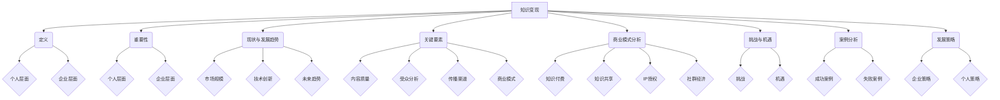

                 

### 文章标题

### 程序员如何利用知识变现

---

> 关键词：知识变现、程序员、内容创作、商业模式、实践策略、案例分享

> 摘要：本文将深入探讨程序员如何利用自身知识进行变现。从知识变现的定义和意义入手，逐步分析个人和企业层面的知识变现策略，以及相关挑战和机遇。通过成功与失败案例的分享，结合法律法规与伦理道德的考量，为程序员提供全面的知识变现实践指导。

---

### 第一部分: 知识变现概述

#### 第1章: 知识变现的定义与意义

##### 1.1 知识变现的定义

知识变现，顾名思义，是指将个人的知识、经验和技能转化为经济收益的过程。它涵盖了内容创作、知识分享、咨询服务等多种形式，通过互联网平台实现知识的传播和价值的转化。

###### 1.1.1 知识与知识变现的关系

知识是知识的来源，变现则是知识价值的实现。程序员拥有丰富的技术知识和编程经验，通过有效的知识变现策略，可以将个人的价值最大化。

###### 1.1.2 知识变现的形式

知识变现的形式多样，主要包括：

- **知识付费**：通过在线课程、付费专栏等形式，将自己的专业知识转化为收入。
- **咨询服务**：提供专业的编程、算法、架构咨询，为客户解决问题。
- **内容创作**：撰写技术博客、发表技术文章、录制技术视频，通过广告、赞助、会员等方式获得收益。
- **知识共享**：通过开源项目、GitHub仓库等形式，分享代码和技术经验，获得社区认可和回报。

##### 1.2 知识变现的重要性

知识变现不仅对个人具有重要意义，也对企业和整个社会产生深远影响。

###### 1.2.1 个人层面

1. **增加收入**：通过知识变现，程序员可以获得额外的收入来源，提高生活质量。
2. **提升职业价值**：知识变现的过程也是个人品牌建设的过程，有助于提升在行业内的知名度和影响力。
3. **职业发展**：通过知识变现，程序员可以获得更多职业发展的机会，如成为技术顾问、培训讲师等。

###### 1.2.2 企业层面

1. **知识管理**：企业通过知识变现，可以更好地管理和利用内部知识资源，提升整体竞争力。
2. **员工激励**：知识变现可以激励员工积极分享知识和经验，促进团队协作和知识传递。
3. **商业模式创新**：知识变现为企业提供了新的商业模式，如知识付费、咨询服务等，有助于拓展收入来源。

##### 1.3 知识变现的现状与发展趋势

知识变现作为一种新兴的商业模式，正逐渐受到重视。目前，知识变现已在全球范围内形成一定市场规模，未来发展趋势如下：

1. **市场规模扩大**：随着互联网技术的普及和人们对知识的渴求，知识变现的市场规模将持续扩大。
2. **技术创新**：人工智能、大数据等技术的应用，将进一步提升知识变现的效率和效果。
3. **新兴市场拓展**：知识变现不仅局限于专业领域，还将向更多行业和领域拓展，如健康、教育、金融等。
4. **内容多样化**：知识变现的内容形式将更加多样化，如直播、短视频、图文教程等。

##### 1.4 知识变现的关键要素

知识变现的成功离不开以下关键要素：

1. **内容质量**：优质的内容是知识变现的基础，需注重内容的深度、实用性和可读性。
2. **受众分析**：了解受众需求，构建受众画像，有助于提高知识变现的效果。
3. **传播渠道**：选择合适的传播渠道，如社交媒体、在线教育平台、个人博客等，扩大内容的传播范围。
4. **商业模式**：根据自身特点和市场需求，设计合适的商业模式，实现知识价值的最大化。

##### 1.5 知识变现的商业模式分析

知识变现的商业模式多样，以下是几种常见的商业模式：

1. **知识付费**：通过在线课程、付费专栏等形式，直接向用户收取费用。
2. **知识共享**：通过开源项目、GitHub仓库等形式，共享知识资源，获得社区认可和回报。
3. **IP授权**：将自己的知识内容转化为知识产权，如专利、商标等，授权他人使用。
4. **社群经济**：通过建立社群，提供知识交流和互动，实现知识变现。

##### 1.6 知识变现的挑战与机遇

知识变现过程中面临诸多挑战，如内容同质化、知识产权保护等。但同时，也伴随着丰富的机遇：

1. **技术创新**：人工智能、大数据等技术的应用，为知识变现提供了新的手段和途径。
2. **新兴市场拓展**：知识变现的市场不断拓展，为程序员提供了更多机会。
3. **用户需求多样化**：随着用户需求的多样化，知识变现的内容形式和商业模式也将更加丰富。

##### 1.7 知识变现案例分析

通过分析成功与失败的知识变现案例，可以更好地理解知识变现的策略和方法。

1. **成功案例**：如某个知名程序员开设的在线课程，通过高质量的内容和精准的营销，获得了巨大成功。
2. **失败案例**：如某个技术博客，由于内容质量不高、受众定位不准等原因，未能实现预期的变现效果。

##### 1.8 知识变现的发展策略

1. **企业发展策略**：企业应构建完善的知

#### Mermaid 流程图



### 第1章: 知识变现的定义与意义

##### 1.1 知识变现的定义

知识变现是指将个人的知识、经验和技能转化为经济收益的过程。这个定义涵盖了多个方面：

- **知识**：知识是知识变现的基础，包括专业领域的知识、技能、经验等。
- **经验**：经验是通过实际工作、学习和生活中积累的知识，对于知识变现具有重要的价值。
- **技能**：技能是指通过学习、实践获得的特定能力，如编程、数据分析、项目管理等。

在知识变现的过程中，程序员可以将自己的专业知识通过以下几种形式进行转化：

1. **在线课程**：录制和销售在线课程，将自己的编程经验和技能分享给更多学习者。
2. **付费专栏**：撰写技术文章或专栏，向读者提供有价值的知识和见解。
3. **咨询服务**：为客户提供专业的编程、算法、架构咨询，解决实际问题。
4. **内容创作**：撰写技术博客、发表技术文章、录制技术视频，通过广告、赞助、会员等方式获得收益。
5. **知识共享**：通过开源项目、GitHub仓库等形式，分享代码和技术经验，获得社区认可和回报。

知识变现的核心理念在于将个人的知识和经验转化为经济收益，实现知识的传播和价值最大化。对于程序员而言，知识变现不仅是一种收入来源，更是个人品牌建设的重要手段。通过知识变现，程序员可以在行业中树立自己的专业形象，提升职业价值，获得更多职业发展的机会。

##### 1.1.1 知识与知识变现的关系

知识是知识变现的基础，两者之间密不可分。知识是程序员通过学习、实践和积累获得的，包括专业领域的知识、技能、经验等。而知识变现则是将这些知识转化为经济收益的过程。以下从几个方面阐述知识与知识变现的关系：

1. **知识的积累**：程序员需要不断学习、实践和积累知识，这是知识变现的前提条件。只有拥有丰富的专业知识，才能在知识变现的过程中提供有价值的内容。
2. **知识的传播**：知识变现的过程本质上是知识传播的过程。通过在线课程、付费专栏、内容创作等形式，程序员将自己的知识分享给更多人，实现知识的传播。
3. **经济收益**：知识变现将程序员的知识转化为经济收益，实现个人价值最大化。知识变现不仅为程序员提供了额外的收入来源，还有助于提升职业价值，获得更多职业发展的机会。
4. **品牌建设**：知识变现过程中，程序员通过高质量的内容和专业的形象，树立个人品牌。个人品牌的建设有助于提高在行业内的知名度和影响力，为未来的职业发展奠定基础。

总之，知识与知识变现之间是相辅相成的。知识是知识变现的基础，而知识变现则是知识传播和价值实现的重要途径。程序员通过不断积累和传播知识，可以实现知识的最大化价值，同时提升个人职业发展和生活质量。

##### 1.1.2 知识变现的形式

知识变现的形式多样，主要可以归纳为以下几种：

1. **知识付费**：这是最直接的一种知识变现形式，通过在线课程、付费专栏等形式，直接向用户收取费用。程序员可以录制自己的编程经验、技术教程等，通过电商平台或在线教育平台进行销售。

2. **咨询服务**：程序员可以利用自己的专业知识，为客户提供专业的编程、算法、架构咨询。这种形式不仅可以获得直接的经济收益，还能积累更多的实践经验。

3. **内容创作**：程序员可以通过撰写技术博客、发表技术文章、录制技术视频等方式，将自己的知识和经验分享给公众。通过广告、赞助、会员等方式，从内容中获取收益。

4. **知识共享**：程序员可以参与开源项目，将自己的代码和技术经验分享给社区。虽然这种形式不直接产生经济收益，但可以提升个人在社区中的影响力，为未来的知识变现奠定基础。

5. **IP授权**：程序员可以将自己的知识内容转化为知识产权，如专利、商标等，然后授权他人使用。这种形式可以获得持续的经济收益，同时保护自己的知识产权。

6. **社群经济**：程序员可以通过建立技术社群，提供知识交流和互动，从而实现知识变现。例如，可以创建付费会员社群，提供专业的技术指导和咨询服务。

不同形式的变现方式有其独特的特点和适用场景。程序员可以根据自己的专业领域、技能特长和市场需求，选择合适的知识变现方式。例如，对于有丰富教学经验的程序员，知识付费和内容创作可能更适合；而对于有深厚技术背景的程序员，咨询服务和知识共享可能更具优势。

##### 1.2 知识变现的重要性

知识变现对个人和企业都具有重要的意义。在个人层面，知识变现可以帮助程序员实现以下几个方面的价值：

1. **增加收入**：知识变现为程序员提供了额外的收入来源。通过在线课程、付费专栏、咨询服务等形式，程序员可以将自己的专业知识转化为经济收益。这种额外的收入不仅可以提高生活质量，还可以为未来的职业发展提供经济支持。

2. **提升职业价值**：知识变现的过程中，程序员需要不断更新和提升自己的知识体系。这种持续的学习和积累有助于提高个人的专业技能和职业素养，从而在职场中更具竞争力。此外，通过知识变现，程序员可以树立个人品牌，提高在行业内的知名度和影响力，为职业发展打开更多机会。

3. **职业发展**：知识变现为程序员提供了多样化的职业发展路径。除了传统的编程、开发等岗位外，程序员可以通过知识变现成为技术顾问、培训讲师、创业创始人等。这些职业角色不仅具有更高的社会地位，还能带来更高的经济收益。

在企业层面，知识变现同样具有重要意义：

1. **知识管理**：企业通过知识变现，可以更好地管理和利用内部知识资源。知识变现的过程本质上是对企业知识的整理和归纳，有助于形成系统的知识体系。通过在线课程、付费专栏等形式，企业可以将知识转化为可复用的资产，提高整体竞争力。

2. **员工激励**：知识变现可以激励员工积极分享知识和经验，促进团队协作和知识传递。通过知识变现，员工不仅可以获得经济收益，还能提升个人技能和职业素养。这种正向激励有助于提高员工的工作积极性和创造力。

3. **商业模式创新**：知识变现为企业提供了新的商业模式。例如，企业可以通过知识付费、咨询服务等形式，实现知识价值的最大化。这种创新的商业模式不仅拓展了企业的收入来源，还有助于企业实现可持续发展。

总之，知识变现对个人和企业都具有重要的意义。在个人层面，知识变现可以帮助程序员实现经济收益、提升职业价值和职业发展；在企业层面，知识变现可以提升知识管理、员工激励和商业模式创新。因此，程序员和企业都应该重视知识变现，积极探索和利用这一新兴商业模式。

##### 1.2.1 个人层面

在个人层面，知识变现的重要性主要体现在以下几个方面：

1. **收入增加**：知识变现为程序员提供了额外的收入来源，使其不仅可以依靠薪资生活，还能通过在线课程、付费专栏、咨询服务等形式获得额外的经济收益。这种收入增加不仅提高了生活质量，还减轻了经济压力，使程序员能够更加专注于自己的职业发展。

2. **职业发展**：知识变现的过程是对个人知识和技能的检验和提升。通过不断创作和分享高质量的内容，程序员可以巩固自己的专业基础，拓宽知识面，提升个人能力。这种持续的学习和提升有助于在职场中脱颖而出，获得更多职业发展的机会。

3. **个人品牌建设**：知识变现过程中，程序员通过在线课程、付费专栏、咨询服务等形式，将自己的专业知识和经验分享给公众，树立了个人品牌。个人品牌的建设不仅提高了在行业内的知名度和影响力，还为未来的职业发展奠定了基础。同时，个人品牌还可以吸引更多的商业机会和合作伙伴，为职业发展带来更多可能性。

4. **职业转型**：知识变现为程序员提供了多样化的职业发展路径。除了传统的编程、开发等岗位外，程序员可以通过知识变现成为技术顾问、培训讲师、创业创始人等。这些职业角色不仅具有更高的社会地位，还能带来更高的经济收益。通过知识变现，程序员可以探索和尝试不同的职业路径，找到最适合自己的发展方向。

5. **社交网络拓展**：知识变现过程中，程序员需要与学员、读者、客户等建立联系。这种互动和交流有助于拓展社交网络，结识更多的行业专家和同行，获取更多的职业资源和机会。同时，社交网络的拓展也为个人品牌建设提供了有力支持。

总之，知识变现对个人层面具有重要意义。它不仅为程序员提供了额外的收入来源，促进了职业发展，还帮助个人品牌建设和职业转型。通过知识变现，程序员可以提升个人价值和竞争力，实现职业和生活的双重提升。

##### 1.2.2 企业层面

在知识变现的过程中，企业可以充分利用其专业知识、经验和资源，实现以下几个方面的价值：

1. **知识管理**：知识是企业核心竞争力的重要组成部分。企业通过知识变现，可以更好地管理和利用内部知识资源。知识变现的过程本质上是对企业知识的整理、归纳和优化。通过在线课程、付费专栏、咨询服务等形式，企业可以将知识转化为可复用的资产，提高整体竞争力。

2. **员工激励**：知识变现可以激励员工积极分享知识和经验，促进团队协作和知识传递。通过知识变现，员工不仅可以获得经济收益，还能提升个人技能和职业素养。这种正向激励有助于提高员工的工作积极性和创造力，形成良好的企业文化。

3. **商业模式创新**：知识变现为企业提供了新的商业模式。例如，企业可以通过知识付费、咨询服务等形式，实现知识价值的最大化。这种创新的商业模式不仅拓展了企业的收入来源，还有助于企业实现可持续发展。

4. **客户关系管理**：知识变现过程中，企业需要与客户建立紧密的联系，了解客户需求，提供个性化的解决方案。这种互动和交流有助于提升客户满意度，增强客户忠诚度。同时，通过知识变现，企业可以更好地挖掘潜在客户，拓展市场份额。

5. **品牌建设**：知识变现过程中，企业通过高质量的内容和专业的形象，树立了品牌形象。品牌建设不仅提高了企业在行业内的知名度和影响力，还为未来的商业合作和业务拓展奠定了基础。

6. **市场拓展**：知识变现可以帮助企业拓展新的市场。通过在线课程、付费专栏等形式，企业可以将知识传播到全球范围，吸引更多的客户和合作伙伴。这种市场拓展有助于提升企业的国际竞争力，实现全球化发展。

总之，知识变现对企业层面具有重要意义。它不仅有助于知识管理、员工激励和商业模式创新，还可以提升客户关系管理、品牌建设和市场拓展。通过知识变现，企业可以更好地发挥其核心竞争力，实现可持续发展和全球化战略。

##### 1.3 知识变现的现状与发展趋势

知识变现作为一种新兴的商业模式，正逐渐受到重视。目前，知识变现已在全球范围内形成一定市场规模，未来发展趋势如下：

1. **市场规模扩大**：随着互联网技术的普及和人们对知识的渴求，知识变现的市场规模将持续扩大。据预测，未来几年全球知识变现市场规模将保持高速增长，年复合增长率达到20%以上。

2. **技术创新**：人工智能、大数据等技术的应用，将进一步提升知识变现的效率和效果。例如，通过人工智能技术，可以更精准地分析用户需求，提供个性化的知识服务；通过大数据分析，可以更好地了解市场趋势，优化知识变现策略。

3. **新兴市场拓展**：知识变现不仅局限于专业领域，还将向更多行业和领域拓展，如健康、教育、金融等。例如，在健康领域，知识变现可以通过在线医疗咨询、健康知识普及等方式实现；在教育领域，知识变现可以通过在线课程、线上培训等形式实现。

4. **内容多样化**：知识变现的内容形式将更加多样化，如直播、短视频、图文教程等。例如，短视频平台上的知识分享逐渐成为一种流行的知识变现方式，通过短视频的形式，可以更直观、生动地传播知识。

5. **平台竞争加剧**：随着知识变现市场的不断扩大，各大平台之间的竞争也将日益激烈。平台需要通过优化用户体验、提升内容质量、创新商业模式等方式，吸引更多用户和内容创作者。

6. **知识产权保护**：知识变现过程中，知识产权保护将变得越来越重要。企业和个人需要加强知识产权意识，保护自己的知识成果，避免侵权行为。同时，政府和企业也需要加强知识产权保护，为知识变现创造良好的法律环境。

总之，知识变现正迎来快速发展的机遇。通过技术创新、新兴市场拓展、内容多样化等手段，知识变现将更好地满足人们对知识的渴求，为企业和个人创造更多价值。

##### 1.3.1 知识变现的市场规模

知识变现的市场规模正在迅速扩大，成为数字经济中的重要组成部分。根据市场研究机构的报告，全球知识变现市场规模已超过千亿美元，且保持高速增长态势。以下是几个关键指标和趋势：

1. **在线教育市场规模**：在线教育是知识变现的重要领域之一。根据数据显示，全球在线教育市场规模已超过2000亿美元，并且预计在未来几年将保持两位数的增长率。特别是在COVID-19疫情期间，在线教育市场迎来了爆发式增长。

2. **知识付费用户规模**：随着知识付费观念的普及，越来越多的用户愿意为高质量的知识内容付费。据统计，全球知识付费用户规模已超过10亿人，并且这一数字还在持续增长。特别是在亚洲和北美地区，知识付费用户比例逐年上升。

3. **内容创作平台收入**：各大内容创作平台如知乎、得到、喜马拉雅等，通过知识付费、广告收入、会员服务等多种方式实现盈利。以知乎为例，2020年知乎的付费会员收入达到6.6亿元，同比增长73%。

4. **咨询服务的市场需求**：随着企业对专业知识和技术的需求不断增加，咨询服务市场也呈现快速增长态势。根据市场研究机构的预测，全球IT咨询服务市场规模预计将在2025年达到1.3万亿美元。

5. **知识产权交易**：知识产权交易也是知识变现的重要形式之一。以专利、商标、版权等知识产权为核心的交易活动日益活跃，特别是在技术创新和知识产权保护意识提升的背景下，知识产权交易市场将保持稳定增长。

总之，知识变现的市场规模正呈现持续扩大的趋势，成为数字经济中的重要驱动力。随着技术创新、新兴市场拓展和内容多样化的发展，知识变现市场将继续保持高速增长，为企业和个人创造更多价值。

##### 1.3.2 知识变现的技术创新

知识变现的技术创新是推动这一商业模式快速发展的关键因素。以下是一些重要的技术创新：

1. **人工智能（AI）**：人工智能技术在知识变现中发挥着重要作用。通过自然语言处理（NLP）和机器学习算法，AI可以分析和理解用户需求，提供个性化的知识推荐。例如，在线教育平台使用AI算法推荐适合用户的课程，提高用户满意度和学习效果。

2. **大数据分析**：大数据技术可以帮助知识变现平台更好地了解用户行为和市场趋势。通过对用户数据的分析，平台可以优化内容推荐、提高广告投放效率，从而提升变现效果。例如，知乎通过大数据分析用户兴趣和行为，推荐相关内容，增加用户粘性。

3. **区块链技术**：区块链技术为知识变现提供了透明、去中心化的解决方案。通过区块链，知识创作者可以确保自己的内容不被篡改，用户可以安全地支付和交易。例如，以太坊上的知识付费平台允许用户使用加密货币进行支付，确保交易的不可篡改。

4. **虚拟现实（VR）和增强现实（AR）**：VR和AR技术为知识变现提供了新的形式和体验。通过虚拟课堂、沉浸式教学等方式，用户可以更生动地学习知识。例如，一些在线教育平台使用VR技术创建虚拟实验室，让用户进行虚拟实验，提高学习效果。

5. **云计算**：云计算技术为知识变现提供了强大的计算和存储能力。通过云平台，知识创作者可以轻松搭建和运营自己的在线课程和知识分享平台，降低成本，提高效率。例如，腾讯云提供了丰富的云计算服务，支持在线教育平台的搭建和运营。

这些技术创新不仅提升了知识变现的效率和效果，还为知识创作者和用户带来了更多便利和体验。随着技术的不断进步，知识变现将在未来发挥更大的作用。

##### 1.3.3 知识变现的未来趋势

知识变现作为数字经济的重要组成部分，未来将继续保持快速发展。以下是几个关键趋势：

1. **内容多样化**：随着用户需求的不断变化，知识变现的内容形式将更加多样化。短视频、直播、图文教程等新的内容形式将继续崛起，为用户带来更加丰富和个性化的知识体验。

2. **平台生态化**：知识变现平台将逐步形成生态化发展，不仅提供内容创作和分享功能，还将涵盖电商、广告、社交等多重服务。这种生态化发展将提高平台的用户黏性和变现能力。

3. **个性化推荐**：人工智能和大数据技术的应用将进一步提升个性化推荐的效果。平台将通过分析用户行为和兴趣，精准推荐用户感兴趣的知识内容，提高用户满意度和付费意愿。

4. **跨界合作**：知识变现将与其他行业进行更多跨界合作，如教育、医疗、金融等。这种跨界合作将创造更多价值，推动知识变现向更广泛领域拓展。

5. **全球市场拓展**：随着互联网技术的普及和全球化进程的加快，知识变现将在全球范围内获得更广泛的应用。尤其是在发展中国家，知识变现市场潜力巨大，将成为未来增长的重要驱动力。

6. **知识产权保护**：随着知识变现市场的扩大，知识产权保护将变得更加重要。政府和平台将加强知识产权保护，为知识创作者提供更好的法律保障，促进知识变现的健康发展。

总之，知识变现的未来趋势充满了机遇和挑战。通过技术创新、内容多样化、平台生态化、跨界合作和全球市场拓展，知识变现将继续为企业和个人创造更多价值。

#### 1.4 知识变现的关键要素

##### 1.4.1 内容质量

内容质量是知识变现的基础，决定了知识变现的效果。高质量的内容不仅能够吸引更多的用户，提高用户的满意度和忠诚度，还能为知识创作者带来更多的变现机会。

**1.4.1.1 内容创作的技巧**

要创作高质量的内容，知识创作者需要掌握以下技巧：

- **深度**：内容应该深入分析问题，提供全面的解决方案。浅尝辄止的内容很难满足用户的需求，也无法产生持久的价值。
- **实用性**：内容应具有实用性，解决用户实际面临的问题。实用性强的内容更容易被用户接受，产生实际效果。
- **可读性**：内容应具有良好的可读性，使用简洁明了的语言，避免复杂的术语和长篇大论。清晰的表达有助于用户更好地理解和吸收知识。
- **结构化**：内容应具备良好的结构，逻辑清晰，层次分明。合理的结构有助于用户快速找到所需信息，提高阅读效率。

**1.4.1.2 内容传播的渠道**

内容质量再高，如果没有有效的传播渠道，也无法实现知识变现。知识创作者需要选择合适的传播渠道，扩大内容的影响力。

- **社交媒体**：社交媒体是知识传播的重要渠道，如微博、微信公众号、知乎等。通过这些平台，知识创作者可以与用户建立直接联系，提高内容的曝光率和传播效果。
- **在线教育平台**：在线教育平台如网易云课堂、慕课网等，为知识创作者提供了专业的知识分享和变现平台。这些平台拥有庞大的用户基础，可以帮助知识创作者实现快速传播。
- **个人博客**：个人博客是知识创作者独立展示自己的重要平台。通过定期更新博客，知识创作者可以建立自己的品牌形象，提高在行业内的知名度。
- **短视频和直播**：短视频和直播是近年来兴起的传播渠道，具有强大的视觉冲击力和互动性。通过短视频和直播，知识创作者可以更直观地展示自己的知识，吸引更多用户。

##### 1.4.2 受众分析

受众分析是知识变现的重要环节，通过深入了解目标受众的需求和行为，知识创作者可以更有针对性地创作内容，提高变现效果。

**1.4.2.1 受众需求的挖掘**

挖掘受众需求是受众分析的第一步。知识创作者可以通过以下方式了解受众需求：

- **市场调研**：通过问卷调查、访谈等方式，收集用户对知识内容的需求和期望。市场调研可以帮助知识创作者发现潜在的市场机会。
- **数据分析**：通过分析用户行为数据，了解用户在知识消费过程中的偏好和习惯。例如，分析用户在在线教育平台上的学习轨迹，了解用户对不同课程的兴趣点。
- **用户反馈**：及时收集用户对知识内容的反馈，了解用户对现有内容的满意度和改进建议。用户反馈可以帮助知识创作者不断优化内容，提高用户满意度。

**1.4.2.2 受众画像的构建**

构建受众画像有助于知识创作者更深入地了解目标受众，制定精准的内容创作和传播策略。

- **人口属性**：包括年龄、性别、职业、教育背景等基本信息，有助于了解受众的基本特征。
- **兴趣偏好**：包括对知识领域的兴趣、喜欢的课程类型、关注的热点话题等，有助于了解受众的兴趣点。
- **行为习惯**：包括学习时间、学习频率、消费习惯等，有助于了解受众的消费行为和需求。
- **价值观**：包括对知识、生活、职业等价值观的理解和追求，有助于了解受众的内在驱动因素。

通过受众画像的构建，知识创作者可以更好地把握目标受众的需求，创作更具吸引力的内容，提高变现效果。

##### 1.4.3 传播渠道

传播渠道是知识变现的重要环节，选择合适的传播渠道可以有效扩大知识的影响力，提高变现效果。

**1.4.3.1 常见传播渠道**

以下是一些常见的传播渠道：

- **社交媒体**：如微博、微信公众号、知乎等，通过这些平台可以与用户建立直接联系，提高内容的曝光率和传播效果。
- **在线教育平台**：如网易云课堂、慕课网等，这些平台拥有庞大的用户基础和专业的知识传播渠道，可以帮助知识创作者实现快速传播。
- **个人博客**：通过个人博客，知识创作者可以独立展示自己的知识和观点，建立个人品牌形象。
- **短视频和直播**：通过短视频和直播，知识创作者可以更直观地展示自己的知识，吸引更多用户。
- **传统媒体**：如报纸、杂志、电视等，通过传统媒体，可以扩大知识的影响力，提高知名度。

**1.4.3.2 选择传播渠道的原则**

选择传播渠道时，知识创作者应遵循以下原则：

- **目标受众**：选择与目标受众密切相关的传播渠道，确保内容的精准传达。
- **传播效果**：评估不同传播渠道的传播效果，选择具有较高曝光率和互动性的渠道。
- **成本效益**：考虑传播渠道的成本和效益，选择性价比高的渠道。
- **内容形式**：根据内容的形式和特点，选择适合的传播渠道。例如，短视频和直播适合展示动态内容，而博客和专栏适合深度内容。

通过合理选择和利用传播渠道，知识创作者可以扩大知识的影响力，提高变现效果。

##### 1.4.4 商业模式

知识变现的商业模式是知识创作者实现经济收益的重要手段。选择合适的商业模式，可以最大化知识的价值，提高变现效果。

**1.4.4.1 常见商业模式**

以下是一些常见的知识变现商业模式：

- **知识付费**：通过在线课程、付费专栏等形式，直接向用户收取费用。这种模式适用于有专业知识和经验的个人或机构。
- **广告收入**：通过在自己的内容中插入广告，从广告主那里获取收入。这种模式适用于有一定影响力的内容创作者。
- **会员服务**：通过提供会员服务，如独家内容、互动交流等，吸引用户付费成为会员。这种模式适用于有稳定用户基础的内容创作者。
- **知识共享**：通过开源项目、GitHub仓库等形式，分享知识资源，获得社区认可和回报。这种模式适用于愿意分享知识的技术专家。
- **IP授权**：将自己的知识内容转化为知识产权，如专利、商标等，然后授权他人使用。这种模式适用于具有独特知识内容和个人品牌的创作者。

**1.4.4.2 选择商业模式的原则**

选择知识变现商业模式时，知识创作者应遵循以下原则：

- **个人特长**：选择与自身专业特长和知识领域相符的商业模式，发挥自身优势。
- **市场需求**：选择市场需求旺盛、受众群体广泛的商业模式，确保有足够的用户基础。
- **盈利潜力**：评估不同商业模式的盈利潜力，选择有较高盈利空间的模式。
- **可操作性**：考虑商业模式的可操作性，确保能够高效地实现知识变现。

通过合理选择和运用商业模式，知识创作者可以最大化自己的知识价值，实现经济收益。

##### 1.5 知识变现的商业模式分析

知识变现的商业模式多种多样，不同的模式适用于不同的场景和需求。以下是几种常见的商业模式及其优缺点：

**1.5.1 知识付费**

**定义**：知识付费是指通过在线课程、付费专栏、线上研讨会等形式，向用户提供高质量的知识内容，用户需要支付一定费用才能获取这些内容。

**优点**：
- **直接性**：知识付费模式直接将知识转化为经济收益，用户付费即可获得知识内容，流程简单明了。
- **可控性**：知识创作者可以控制知识内容的传播范围和用户访问权限，确保内容质量。
- **持续性**：通过定期更新课程内容，知识创作者可以持续获得收益。

**缺点**：
- **用户门槛**：用户需要支付费用才能获取知识内容，可能会限制一部分潜在用户的参与。
- **内容更新难度**：高质量的内容创作需要耗费大量时间和精力，持续更新内容可能对创作者形成较大压力。

**适用场景**：适用于有专业知识和经验、愿意为知识付费的用户群体，如技术专家、企业管理者等。

**1.5.2 广告收入**

**定义**：广告收入是指通过在自己的知识内容中插入广告，从广告主那里获取收入。

**优点**：
- **灵活性**：广告收入模式较为灵活，可以根据内容特点选择合适的广告形式，如横幅广告、视频广告等。
- **用户友好**：合理布局的广告不会影响用户阅读体验，用户更容易接受。

**缺点**：
- **收益不稳定**：广告收入受广告主投放策略和广告市场波动的影响，可能存在不稳定的风险。
- **广告质量**：部分低质量的广告可能会影响内容的质量和用户体验。

**适用场景**：适用于有较高用户流量和活跃度、具有一定影响力的知识创作者。

**1.5.3 会员服务**

**定义**：会员服务是指通过提供会员专属内容、互动交流等特权，吸引用户付费成为会员。

**优点**：
- **用户粘性**：会员服务可以为用户提供独特的价值，提高用户粘性，增强用户忠诚度。
- **持续收益**：会员付费模式可以提供持续的收入来源，减少对单一广告收入的依赖。

**缺点**：
- **运营成本**：会员服务需要定期更新内容，提供互动交流，可能需要投入更多的时间和资源。
- **用户流失**：会员服务可能会面临用户流失的风险，需要不断优化内容和体验来保持用户活跃度。

**适用场景**：适用于有稳定用户基础、能够提供独特价值的内容创作者。

**1.5.4 知识共享**

**定义**：知识共享是指通过开源项目、GitHub仓库等形式，分享知识资源，获得社区认可和回报。

**优点**：
- **传播广泛**：知识共享可以快速传播到全球范围，吸引更多的关注和认可。
- **长期回报**：知识共享可以积累长期的口碑和影响力，为未来的职业发展奠定基础。

**缺点**：
- **直接收益较低**：知识共享不直接产生经济收益，更多依赖社区认可和回报。
- **内容保护难度**：知识共享可能面临内容被盗用或侵权的问题，需要加强知识产权保护。

**适用场景**：适用于愿意分享知识、有较高技术水平的程序员和开发者。

**1.5.5 IP授权**

**定义**：IP授权是指将自己的知识内容转化为知识产权，如专利、商标等，然后授权他人使用。

**优点**：
- **长期收益**：通过IP授权，知识创作者可以持续获得收益，不受内容更新和传播限制。
- **多样化应用**：IP授权可以为知识创作者带来多样化的收益形式，如版权收入、授权费用等。

**缺点**：
- **法律风险**：IP授权涉及法律和合同问题，需要确保知识产权的合法性，避免法律纠纷。
- **管理成本**：IP授权需要投入更多时间和精力进行管理，确保授权使用符合规定。

**适用场景**：适用于具有独特知识内容和知识产权意识的知识创作者。

##### 1.6 知识变现的挑战与机遇

知识变现作为一种新兴商业模式，虽然为程序员和企业带来了巨大的机遇，但同时也伴随着诸多挑战。以下将分析知识变现过程中可能遇到的主要挑战及相应的机遇。

**1.6.1 挑战**

1. **内容同质化**：随着知识变现市场的不断扩大，越来越多的创作者进入这一领域，导致内容同质化现象严重。高质量、独特的知识内容越来越少，用户的选择余地减小，竞争激烈。
   
2. **知识产权保护**：知识变现过程中，知识产权保护问题日益突出。内容创作者需要防范自己的知识成果被抄袭、盗用或侵权，但实际操作中难度较大。

3. **用户信任问题**：在知识变现平台上，用户对于知识内容的质量和真实性存在担忧。如果用户对平台上的内容不信任，将影响用户的购买决策和付费意愿。

4. **技术门槛**：知识变现涉及多种技术和平台，对于一些程序员来说，掌握和运用这些技术可能存在一定难度。技术门槛可能导致部分创作者在知识变现过程中遇到瓶颈。

**1.6.2 机遇**

1. **技术创新**：随着人工智能、大数据、区块链等技术的不断发展，知识变现的手段和方式将更加多样化、智能化。这些技术创新为知识创作者提供了新的工具和手段，有助于提升知识变现的效率和质量。

2. **新兴市场拓展**：知识变现不仅局限于技术领域，还将向更多行业和领域拓展，如健康、教育、金融等。新兴市场的拓展为程序员提供了更广阔的发展空间和机会。

3. **内容多样化**：随着用户需求的多样化，知识变现的内容形式也将更加多样化。短视频、直播、图文教程等新的内容形式将继续崛起，为用户带来更多样化的知识体验。

4. **平台竞争加剧**：知识变现市场的竞争将越来越激烈，各大平台将不断优化用户体验、提升内容质量、创新商业模式，以吸引更多用户和创作者。平台竞争的加剧将推动知识变现行业的发展。

5. **知识产权保护加强**：随着知识变现市场的扩大，知识产权保护将得到更多关注和重视。政府和平台将加强知识产权保护，为知识创作者提供更好的法律保障，促进知识变现的健康发展。

总之，知识变现过程中既面临诸多挑战，也伴随着丰富的机遇。通过技术创新、内容多样化、平台竞争和知识产权保护等手段，知识创作者可以更好地应对挑战，抓住机遇，实现知识价值的最大化。

##### 1.6.1 内容同质化

内容同质化是知识变现过程中面临的一个主要挑战。随着越来越多的创作者进入知识变现市场，同质化的内容问题日益严重。以下分析内容同质化对知识变现的影响及解决方案。

**影响：**

1. **竞争加剧**：内容同质化使得市场上的知识内容大量雷同，创作者之间的竞争变得更加激烈。每个创作者都在争夺有限的用户资源，导致市场份额的争夺更加困难。

2. **用户体验下降**：同质化的内容难以满足用户多样化的需求，用户在选择时往往感到迷茫和疲倦。用户体验下降会影响用户的满意度和付费意愿，进而影响知识变现的效果。

3. **品牌建设困难**：在内容同质化的市场中，创作者的品牌形象难以凸显。品牌建设需要独特的、高质量的内容作为支撑，同质化的内容无法为创作者建立独特的品牌形象。

4. **市场饱和**：随着同质化内容的增加，市场上的知识内容逐渐饱和，用户的选择余地减小。市场饱和会导致部分创作者无法获得足够的关注和认可，从而影响其收入。

**解决方案：**

1. **差异化内容创作**：创作者应注重内容的差异化，通过深入挖掘自己的专业领域和独特经验，创作具有独特观点和价值的知识内容。差异化内容能够吸引特定的用户群体，提高内容的竞争力。

2. **专业深耕**：创作者应专注于自己的专业领域，深耕细作，成为某一领域的专家。专业深耕不仅可以提高内容的深度和质量，还能树立个人品牌，吸引更多的忠实用户。

3. **创新内容形式**：创作者可以尝试多样化的内容形式，如短视频、直播、图文教程等，以新颖的形式吸引用户。创新内容形式可以提升用户的体验，增强内容的吸引力。

4. **用户参与**：创作者可以鼓励用户参与内容创作和互动，通过用户的反馈和建议，不断优化内容。用户参与不仅可以提升内容的实用性，还能增强用户的参与感和忠诚度。

5. **知识产权保护**：创作者应加强对知识产权的保护，避免自己的内容被抄袭和盗用。通过法律手段保护自己的知识产权，可以减少同质化内容的产生，提高原创内容的竞争力。

总之，面对内容同质化挑战，知识创作者需要通过差异化内容创作、专业深耕、创新内容形式、用户参与和知识产权保护等手段，提升内容的质量和独特性，从而实现有效的知识变现。

##### 1.6.1.1 内容创作的技巧

内容创作是知识变现的关键环节，一个成功的知识创作者需要掌握一系列技巧，以确保内容的深度、实用性和吸引力。以下是一些核心技巧：

**1. 深度研究**：在创作内容之前，要进行深度研究，确保对主题有全面、深入的了解。深度研究可以帮助创作者掌握主题的核心概念和关键点，从而创作出具有高度价值的知识内容。

**2. 逻辑结构**：逻辑结构是内容质量的重要组成部分。一个清晰、逻辑严密的内容可以更好地引导用户理解和吸收知识。创作者可以通过建立主题框架、明确章节关系等方式，确保内容的逻辑性。

**3. 实用性**：实用性是知识内容的灵魂。创作者应关注用户的需求，提供具有实际应用价值的知识。例如，通过案例分析和实战演练，让用户能够将所学知识应用到实际工作中。

**4. 语言表达**：简洁明了的语言表达是提高内容可读性的关键。创作者应避免使用复杂的术语和晦涩的语言，尽量使用通俗易懂的表达方式，确保用户能够轻松理解。

**5. 多媒体结合**：结合多媒体元素，如图片、视频、图表等，可以提升内容的互动性和吸引力。多媒体元素可以直观地展示知识，帮助用户更好地理解和记忆。

**6. 互动性**：鼓励用户参与互动，如提问、讨论、投票等，可以提高用户的参与感和忠诚度。互动性强的内容可以增强用户的黏性，促进知识传播和变现。

**7. 不断优化**：内容创作是一个持续优化的过程。创作者应定期回顾和更新内容，根据用户反馈和市场变化，不断改进内容质量和传播策略。

通过掌握这些内容创作技巧，知识创作者可以提升内容的深度、实用性和吸引力，从而实现更有效的知识变现。

##### 1.6.1.2 内容传播的渠道

内容传播渠道是知识变现的重要环节，选择合适的传播渠道可以大大提高知识内容的影响力和变现效果。以下是一些常见的内容传播渠道及其特点和适用场景：

**1. 社交媒体**：

- **特点**：社交媒体平台如微博、微信公众号、知乎等，具有用户基数大、传播速度快的特点。通过这些平台，创作者可以与用户进行实时互动，提高内容的曝光率和影响力。
- **适用场景**：适用于需要快速传播和扩大影响力的知识内容，如技术热点、行业动态、个人见解等。

**2. 在线教育平台**：

- **特点**：在线教育平台如网易云课堂、慕课网等，为创作者提供了专业的知识分享和变现渠道。这些平台通常拥有成熟的课程体系、用户群体和推广资源。
- **适用场景**：适用于系统化、结构化的知识内容，如在线课程、技术教程、职业培训等。

**3. 个人博客**：

- **特点**：个人博客是创作者展示个人品牌和专业知识的重要平台。创作者可以自由发布内容，根据自己的需求和目标进行个性化设计。
- **适用场景**：适用于需要独立展示个人观点和独特知识的创作者，如技术专家、行业分析师等。

**4. 短视频平台**：

- **特点**：短视频平台如抖音、快手等，具有传播速度快、互动性强、用户参与度高特点。短视频可以直观、生动地展示知识，提高用户的兴趣和参与度。
- **适用场景**：适用于需要直观展示知识和技能的内容，如技术教程、动手实验、行业分析等。

**5. 传统媒体**：

- **特点**：传统媒体如报纸、杂志、电视等，具有广泛的影响力、权威性和公信力。通过传统媒体，可以提升创作者的个人品牌和行业影响力。
- **适用场景**：适用于需要树立权威形象和扩大品牌影响力的创作者，如行业专家、技术顾问等。

**6. 电子书**：

- **特点**：电子书是一种方便携带、易于阅读的知识传播形式。创作者可以将自己的知识整理成电子书，通过电商平台进行销售。
- **适用场景**：适用于需要系统化、深度化知识内容的创作者，如技术书籍、专业指南等。

**7. 专业论坛和社群**：

- **特点**：专业论坛和社群是行业专家和爱好者交流的平台。通过这些平台，创作者可以与同行建立联系，分享知识，获得反馈和建议。
- **适用场景**：适用于需要专业交流和互动的知识内容，如技术论坛、行业社群等。

总之，选择合适的传播渠道是实现知识变现的重要手段。创作者应根据内容特点、目标用户和传播效果，灵活运用多种渠道，提高知识内容的影响力和变现效果。

##### 1.6.2.1 受众需求的挖掘

受众需求挖掘是知识变现过程中至关重要的一环，它直接关系到知识内容的质量和吸引力。以下是一些方法，帮助知识创作者深入了解受众需求：

**1. 用户调研**：

- **问卷调查**：通过设计有针对性的问卷，收集用户对知识内容的偏好、需求、期望等信息。问卷可以采用在线填写、邮件发送等方式，提高参与度和反馈质量。
- **访谈**：与目标受众进行面对面或在线访谈，深入了解他们对知识内容的需求和期望。访谈可以获取更为详细和深入的信息，有助于发现用户潜在的需求。

**2. 数据分析**：

- **行为数据**：通过分析用户在知识平台上的行为数据，如点击率、阅读时间、互动率等，了解用户对知识内容的兴趣点和偏好。这些数据可以帮助创作者优化内容策略，提高内容质量。
- **市场趋势**：通过分析市场趋势和行业动态，了解当前用户关注的焦点和热点话题。市场趋势可以为创作者提供创作灵感和方向，确保内容与市场需求保持同步。

**3. 用户反馈**：

- **评论区分析**：在知识内容发布后，关注用户的评论和反馈，了解用户对内容的看法和建议。通过分析用户反馈，可以发现内容中的不足和改进空间，有助于不断优化知识内容。
- **私信沟通**：通过私信与用户进行沟通，了解用户对知识内容的具体需求和期望。这种直接交流方式可以获取更为真实和详细的信息，有助于深入了解用户需求。

**4. 社群互动**：

- **建立社群**：在社交媒体、专业论坛等平台上建立社群，与用户建立长期互动关系。通过社群互动，可以及时获取用户反馈和需求，提高内容创作和传播的针对性。
- **在线问答**：在社群中开展在线问答活动，与用户进行实时互动。通过问答，可以了解用户对知识内容的疑问和困惑，为内容创作提供实际案例和需求。

**5. 竞争对手分析**：

- **分析竞争对手**：通过研究竞争对手的内容和受众需求，了解他们在知识变现过程中的成功经验和不足之处。借鉴竞争对手的优劣势，可以为创作者提供有益的启示和指导。

通过以上方法，知识创作者可以全面、深入地挖掘受众需求，从而创作出更具针对性、更高价值的内容，提高知识变现效果。

##### 1.6.2.2 受众画像的构建

受众画像是一种将目标受众的特征、需求、行为等进行系统化描述的方法，有助于知识创作者更好地了解目标用户，从而制定更精准的内容创作和传播策略。以下是构建受众画像的几个关键步骤：

**1. 人口属性分析**：

- **年龄**：了解目标受众的年龄分布，有助于确定内容的形式和深度。例如，年轻受众可能更偏好轻松、有趣的内容，而中年受众可能更注重实用性和专业性。
- **性别**：分析性别差异，有助于创作更具针对性的内容。例如，在编程领域，男性用户可能更关注技术细节，而女性用户可能更关注实际应用和用户体验。
- **职业背景**：了解目标受众的职业背景，可以帮助创作者确定内容的领域和专业度。例如，企业员工可能更关注项目管理、团队协作等实际工作内容，而创业者可能更关注市场策略、商业模式等。
- **教育程度**：教育程度是影响知识接受能力和内容深度的关键因素。针对不同教育背景的用户，创作者需要调整内容的复杂度和专业术语的使用。

**2. 兴趣偏好分析**：

- **兴趣领域**：通过用户调研和行为数据分析，了解目标受众的兴趣领域，例如技术、健康、文化、娱乐等。兴趣领域有助于创作者确定内容的方向和主题。
- **关注热点**：分析目标受众关注的热点话题和行业动态，有助于创作者紧跟市场趋势，创作更具有时效性和价值的内容。
- **消费习惯**：了解目标受众的消费习惯，例如他们更倾向于在哪个平台进行知识消费、偏好哪种内容形式等，可以帮助创作者优化内容传播渠道和形式。

**3. 行为分析**：

- **阅读习惯**：分析目标受众的阅读时间、阅读频率、阅读偏好等，有助于创作者制定合适的内容发布策略，提高用户的阅读体验。
- **互动行为**：通过用户在社交媒体、知识平台、评论区等互动行为的数据分析，了解目标受众的参与度和互动偏好，有助于创作者优化互动策略，提高用户黏性。
- **购买决策**：了解目标受众的购买决策过程，例如他们如何选择知识内容、影响购买决策的因素等，可以帮助创作者优化内容营销策略，提高转化率。

**4. 价值观分析**：

- **价值观认同**：分析目标受众的价值观认同，了解他们对知识内容的价值判断和偏好，有助于创作者创作更符合受众价值观的内容。
- **社会态度**：了解目标受众的社会态度和观点，例如他们对技术发展的态度、对新兴行业的看法等，可以帮助创作者更好地与受众建立共鸣，提高内容的吸引力和影响力。

通过以上步骤，知识创作者可以构建一个全面的受众画像，从而更好地了解目标用户，制定更精准的内容创作和传播策略，提高知识变现的效果。

##### 1.7 知识变现案例分析

在知识变现领域，既有成功的案例，也有失败的教训。通过分析这些案例，我们可以更好地理解知识变现的策略和方法，为程序员提供有价值的启示。

**1.7.1.1 行业巨头**

**案例一：网易云课堂**

**背景**：网易云课堂是网易旗下的在线教育平台，提供包括编程、数据分析、人工智能等多个领域的在线课程。

**核心策略**：网易云课堂通过以下策略实现了知识变现：

1. **内容多元化**：提供丰富多样的课程内容，满足不同用户的需求。从基础课程到高级课程，涵盖了各个技术领域。
2. **名师效应**：邀请行业内的知名专家和导师授课，提高课程质量，树立品牌形象。
3. **平台推广**：通过线上线下活动、广告投放等方式，扩大平台知名度和用户基数。
4. **个性化推荐**：利用大数据和人工智能技术，为用户推荐符合其兴趣和需求的课程。

**结果**：网易云课堂在知识变现方面取得了显著成果，课程销量和用户满意度不断提高，成为在线教育领域的佼佼者。

**1.7.1.2 成长型企业**

**案例二：某技术博客博主**

**背景**：某技术博客博主通过撰写高质量的技术博客，逐渐积累了一定的用户基础。

**核心策略**：该博主采取以下策略进行知识变现：

1. **专业深耕**：专注于某一技术领域，撰写深入浅出的技术文章，树立专业形象。
2. **内容创新**：通过图片、视频、案例等多种形式，创新内容表达方式，提高用户体验。
3. **社群互动**：在社交媒体上建立社群，与用户进行互动，提高用户黏性。
4. **广告与赞助**：通过在博客中插入广告和寻求赞助，获得收入。

**结果**：该技术博客博主成功实现了知识变现，通过广告和赞助收入，实现了从兼职到全职的转变，同时也为其他程序员提供了借鉴。

**1.7.2.1 市场定位不准**

**案例三：某AI课程平台**

**背景**：某AI课程平台在AI技术领域进行了大量投资，但市场定位不准，导致用户接受度不高。

**核心问题**：该平台存在以下问题：

1. **课程内容过于复杂**：课程内容过于高深，对于初学者来说难度较大，影响了用户的学习兴趣。
2. **目标用户不准确**：平台未能准确确定目标用户群体，导致课程吸引力不足。
3. **推广策略不当**：推广策略过于单一，未能充分挖掘市场潜力。

**结果**：该AI课程平台未能实现预期的知识变现效果，用户流失严重，最终面临关闭的风险。

**1.7.2.2 内容质量不高**

**案例四：某健康知识公众号**

**背景**：某健康知识公众号在初期通过大量粉丝积累了一定的知名度，但由于内容质量不高，逐渐失去用户信任。

**核心问题**：该公众号存在以下问题：

1. **内容抄袭**：部分内容存在抄袭现象，缺乏原创性，用户不满。
2. **质量参差不齐**：部分文章质量较差，信息不准确，误导用户。
3. **缺乏互动**：公众号与用户互动较少，未能建立良好的用户关系。

**结果**：该健康知识公众号的用户流失严重，品牌形象受损，知识变现效果不佳。

通过以上案例分析，我们可以看到，知识变现的成功离不开精准的市场定位、高质量的内容创作和有效的推广策略。对于程序员而言，要实现知识变现，需要不断学习和实践，不断提升自己的专业素养和品牌影响力。

##### 1.8 知识变现的发展策略

知识变现作为一种新兴商业模式，对于个人和企业来说，都具有巨大的潜力。以下将从企业发展和个人发展两个层面，探讨知识变现的发展策略。

**1.8.1 企业发展策略**

1. **构建知识管理体系**：企业应建立完善的知识管理体系，包括知识采集、整理、存储、传播等环节，确保知识资源的有效利用。通过知识管理体系，企业可以更好地管理和传承内部知识，提高整体竞争力。

2. **打造专业品牌形象**：企业应通过高质量的内容创作和专业的形象塑造，树立品牌形象。品牌形象是知识变现的重要支撑，有助于吸引更多用户和合作伙伴。

3. **拓展知识变现渠道**：企业可以尝试多种知识变现渠道，如在线课程、咨询服务、知识共享等。通过多元化的变现渠道，企业可以实现知识价值的最大化。

4. **优化商业模式**：企业应根据市场需求和自身优势，不断优化商业模式。例如，可以探索知识付费、IP授权等新型商业模式，提高知识变现的效率和效果。

5. **加强知识产权保护**：知识产权保护是知识变现的重要保障。企业应加强知识产权管理，防范知识成果被抄袭和盗用，确保自身权益。

**1.8.2 个人发展策略**

1. **个人品牌建设**：个人品牌是知识变现的核心，程序员应注重个人品牌的建设。通过撰写技术博客、发表技术文章、录制技术视频等方式，树立专业形象，提高在行业内的知名度和影响力。

2. **内容创作与传播**：程序员应注重内容创作和传播的质量。高质量的内容不仅能够吸引更多用户，还能提高用户的满意度和忠诚度。同时，选择合适的传播渠道，扩大内容的影响力。

3. **受众分析与定位**：了解目标受众的需求和偏好，进行精准的内容创作和传播。通过用户调研、数据分析等方式，挖掘受众需求，制定合适的内容策略。

4. **不断学习与提升**：知识更新迅速，程序员应保持持续学习的态度，不断提升自己的专业素养和技能水平。只有不断学习，才能在知识变现的竞争中保持优势。

5. **多元化变现策略**：程序员可以尝试多种知识变现方式，如知识付费、咨询服务、内容创作等。通过多元化的变现策略，实现收入的最大化。

总之，知识变现的发展策略需要从企业发展和个人发展两个层面进行综合考虑。企业应构建知识管理体系、打造专业品牌形象、拓展知识变现渠道、优化商业模式和加强知识产权保护；个人则应注重个人品牌建设、内容创作与传播、受众分析与定位、不断学习与提升和多元化变现策略。通过这些策略的实施，企业和个人都可以实现知识价值的最大化，实现可持续发展。

##### 1.9 知识变现的法律法规与伦理道德

知识变现作为一种新兴商业模式，不仅需要关注市场策略和用户需求，还需要严格遵守相关法律法规和伦理道德，确保知识变现的合法性和道德性。

**1.9.1 法律法规**

知识变现过程中涉及多个法律问题，如知识产权保护、网络信息内容管理、数据保护等。以下是一些关键法律法规：

1. **知识产权保护法规**：包括《中华人民共和国著作权法》、《商标法》、《专利法》等。这些法规为知识创作者提供了知识产权保护的依据，确保其原创内容的权益不受侵犯。

2. **网络信息内容管理规定**：如《互联网信息服务管理办法》、《互联网新闻信息服务管理规定》等。这些规定规范了知识变现平台和网络内容的管理，确保内容的合法性和合规性。

3. **数据保护法规**：如《中华人民共和国网络安全法》、《个人信息保护法》等。这些法规对用户数据的收集、存储、使用和分享进行了严格规定，保护用户的隐私权。

4. **广告法**：规范了广告内容和广告行为，防止虚假宣传和误导消费者。

5. **反不正当竞争法**：保护知识创作者的合法权益，防止不正当竞争行为。

**1.9.2 伦理道德**

在知识变现过程中，伦理道德同样至关重要。以下是一些关键伦理道德问题：

1. **内容真实性与客观性**：知识创作者应确保内容的真实性和客观性，避免虚假宣传和误导用户。内容应基于事实和实际经验，提供客观、公正的见解。

2. **用户隐私保护**：知识变现过程中，知识创作者和平台应严格遵守用户隐私保护规定，确保用户数据的合法、合规使用。不得未经授权收集、使用或泄露用户个人信息。

3. **社会责任**：知识创作者和平台应承担社会责任，传播有益的知识和价值观，促进社会的进步和发展。同时，要关注社会公平和公正，避免过度商业化对知识传播的负面影响。

4. **公平竞争**：知识创作者和平台应遵守公平竞争原则，不得采取不正当手段获取竞争优势，如抄袭、诋毁竞争对手等。

5. **知识产权尊重**：知识创作者应尊重他人的知识产权，不得未经授权使用他人的知识成果。在引用他人作品时，应注明出处，遵守知识产权法律法规。

总之，知识变现的法律法规和伦理道德是知识变现健康发展的保障。知识创作者和平台应严格遵守相关法律法规，遵循伦理道德原则，确保知识变现的合法性和道德性，为知识变现的可持续发展创造良好的环境。

### 第二部分: 知识变现实践

#### 第2章: 知识变现的实践策略

知识变现不仅是理论知识，更需要实践来验证其效果。在本章中，我们将深入探讨程序员如何通过个人和企业两个层面，具体实施知识变现的策略。

#### 2.1 个人知识变现的实践策略

个人知识变现需要从知识储备、路径选择和产品打造三个方面进行。

##### 2.1.1 个人知识储备的提升

**1. 持续学习：**

- **技术更新**：技术日新月异，程序员需要不断学习最新的技术趋势和工具。可以通过在线课程、技术论坛、专业书籍等方式，保持技术领先。
- **软技能提升**：除了技术技能，软技能如沟通、团队协作、项目管理等同样重要。可以通过参加培训、研讨会等方式，提升这些软技能。

**2. 专业深耕：**

- **领域选择**：根据个人兴趣和市场需求，选择一个或几个领域进行深耕。例如，前端开发、后端开发、人工智能等。
- **深入研究**：在所选领域中，深入研究关键技术、框架和工具。通过实际项目经验和案例，加深对领域知识的理解。

**3. 建立个人品牌：**

- **内容创作**：通过技术博客、技术文章、技术视频等形式，创作高质量的内容。内容应具有深度、实用性和可读性，能够解决实际问题。
- **社交媒体**：利用社交媒体平台，如微博、微信公众号、知乎等，建立个人品牌形象。定期发布有价值的内容，与用户互动，提高知名度。

##### 2.1.2 个人知识变现的路径选择

个人知识变现的路径多种多样，以下是一些常见的路径：

**1. 知识付费：**

- **在线课程**：通过平台如网易云课堂、慕课网等，开设在线课程，分享专业知识和经验。
- **付费专栏**：在各大平台如知乎、得到等，发布付费专栏，提供深度分析和专业见解。

**2. 咨询服务：**

- **技术顾问**：为企业提供技术顾问服务，解决实际问题。
- **项目合作**：与创业公司或企业合作，参与项目开发，提供技术支持。

**3. 内容创作：**

- **技术博客**：撰写技术博客，分享技术经验和心得。
- **技术视频**：录制技术视频教程，通过平台如B站、YouTube等发布。

**4. 知识共享：**

- **开源项目**：参与开源项目，贡献代码和技术经验。
- **GitHub仓库**：创建GitHub仓库，分享代码库和文档，获得社区认可。

##### 2.1.3 个人知识产品的打造

**1. 产品定位：**

- **市场需求**：了解市场需求，确定知识产品的定位。例如，针对初学者、中级开发者还是高级开发者，提供不同层次的知识产品。

**2. 产品形式：**

- **在线课程**：通过视频教程、文档、直播等形式，提供系统化的知识内容。
- **电子书**：撰写电子书，系统性地整理和总结专业知识。
- **知识库**：创建知识库，提供全面的技术文档和参考资源。

**3. 产品质量：**

- **内容深度**：确保知识产品的内容具有深度和实用性，能够解决用户实际问题。
- **用户体验**：注重用户体验，提供简洁明了的内容形式，方便用户学习和使用。

**4. 产品推广：**

- **平台选择**：选择合适的平台进行产品推广，如在线教育平台、个人博客、社交媒体等。
- **用户互动**：与用户保持互动，收集反馈，不断优化产品。

通过以上策略，程序员可以有效地进行个人知识变现，实现知识的传播和价值最大化。

#### 2.2 企业知识变现的实践策略

企业知识变现需要从知识管理体系、商业模式设计和推广运营三个方面进行。

##### 2.2.1 企业知识管理的体系构建

**1. 知识采集：**

- **内部知识**：通过员工培训、项目总结、技术交流等方式，采集企业内部的宝贵知识。
- **外部知识**：通过市场调研、行业报告、用户反馈等方式，获取外部市场和技术动态。

**2. 知识整理：**

- **分类存储**：根据知识内容的特点和用途，对知识进行分类和存储，方便检索和使用。
- **文档化管理**：将知识整理成文档或电子书形式，便于传播和分享。

**3. 知识传播：**

- **内部培训**：定期组织内部培训，将知识传递给员工，提升团队整体技能水平。
- **外部分享**：通过在线课程、公开讲座、技术博客等形式，将知识分享给公众，提升企业知名度。

**4. 知识应用**：

- **项目管理**：将知识应用于项目管理，提高项目执行效率和质量。
- **产品开发**：将知识应用于产品开发，提升产品的技术含量和市场竞争力。

##### 2.2.2 企业知识变现的商业模式设计

**1. 知识付费：**

- **在线课程**：通过在线教育平台，开设企业内部培训课程，向外部用户收费。
- **知识咨询**：提供专业咨询服务，为企业解决实际问题，收取咨询费用。

**2. 知识共享：**

- **开源项目**：参与开源项目，分享企业的技术成果，获得社区认可和贡献。
- **知识库销售**：将企业的知识库整理成文档或电子书，对外销售，获取收入。

**3. IP授权：**

- **技术专利**：将企业的技术专利授权给其他企业或个人使用，收取授权费用。
- **品牌授权**：将企业的品牌形象授权给其他企业或个人使用，收取品牌授权费用。

**4. 社群经济：**

- **社群运营**：建立专业社群，提供知识交流、互动和分享，通过会员服务、广告收入等方式实现变现。

##### 2.2.3 企业知识变现的推广与运营

**1. 品牌建设：**

- **企业形象**：通过高质量的内容和专业的形象塑造，提升企业的知名度和影响力。
- **品牌传播**：通过线上线下活动、媒体宣传等方式，扩大企业品牌的影响力。

**2. 用户互动：**

- **社群管理**：建立和维护专业社群，与用户保持互动，收集用户反馈，优化产品和服务。
- **用户反馈**：定期收集用户反馈，了解用户需求和满意度，不断改进知识产品和服务质量。

**3. 市场推广：**

- **在线推广**：通过搜索引擎优化（SEO）、社交媒体推广、内容营销等方式，提高企业知识产品的曝光率和用户访问量。
- **线下推广**：参加行业会议、技术研讨会等活动，与行业专家和潜在客户建立联系，扩大企业影响力。

**4. 数据分析：**

- **用户行为分析**：通过数据分析，了解用户行为和需求，优化推广策略和内容形式。
- **市场分析**：通过市场数据分析，了解行业趋势和竞争对手情况，制定合适的市场策略。

通过以上策略，企业可以有效地进行知识变现，实现知识价值的最大化。

#### 2.3 知识变现平台的使用

在知识变现的过程中，选择合适的平台至关重要。以下将介绍几种常见的知识变现平台，以及如何选择和使用这些平台。

##### 2.3.1 常见知识变现平台介绍

**1. 知乎Live**

知乎Live是知乎推出的知识分享平台，用户可以通过付费课程、讲座等形式获取专业知识。知乎Live的优势在于拥有庞大的用户基础和专业的知识分享氛围。

- **优势**：拥有庞大的用户群体、专业的知识氛围、多样化的内容形式。
- **劣势**：内容质量参差不齐，竞争激烈。

**2. 得到App**

得到App是一个集知识付费、内容创作于一体的平台，提供包括书籍解读、课程、专栏等多种形式的知识内容。

- **优势**：内容质量高、品牌影响力强、用户粘性高。
- **劣势**：竞争激烈，内容创作难度大。

**3. 抖音教育**

抖音教育是抖音推出的教育内容平台，通过短视频、直播等形式传播知识。

- **优势**：传播速度快、互动性强、用户基数大。
- **劣势**：内容形式较为简单，难以提供深度知识。

**4. 网易云课堂**

网易云课堂是网易旗下的在线教育平台，提供包括编程、数据分析、人工智能等多个领域的在线课程。

- **优势**：课程体系完整、名师效应显著、用户体验好。
- **劣势**：内容竞争激烈，用户付费意愿不高。

##### 2.3.2 知识变现平台的选择与使用

选择知识变现平台时，应考虑以下因素：

**1. 目标用户：**

- **用户群体**：了解平台的目标用户群体，确保知识内容与用户需求匹配。例如，知乎Live适合专业知识和深度讨论，得到App适合高质量的书籍解读和课程。

**2. 平台定位：**

- **内容形式**：根据知识内容的形式和特点，选择适合的平台。例如，短视频和直播适合传播直观、生动的知识，博客和专栏适合深度内容和长期传播。

**3. 用户反馈：**

- **用户评价**：了解平台上的用户评价和反馈，评估平台的运营状况和服务质量。

**4. 收益模式：**

- **收入来源**：分析平台的收益模式，确保知识变现的可行性。例如，知乎Live主要通过课程费用和广告收入实现变现，得到App则主要通过会员订阅和广告收入。

**5. 运营策略：**

- **推广资源**：了解平台的推广资源，评估其能否为知识内容提供足够的曝光和支持。

**使用策略：**

1. **内容创作**：根据平台特点和用户需求，创作高质量、有吸引力的知识内容。
2. **持续更新**：定期更新内容，保持活跃度，吸引更多用户。
3. **互动营销**：与用户互动，了解用户需求，优化内容创作和推广策略。
4. **数据分析**：利用平台提供的数据分析工具，了解用户行为和内容效果，不断优化运营策略。

通过合理选择和使用知识变现平台，程序员可以更有效地实现知识变现，提升个人和企业的竞争力。

##### 2.3.2.1 平台定位与目标用户

在选择知识变现平台时，了解平台的定位和目标用户是至关重要的。不同的平台有其独特的定位和受众群体，选择与自身内容定位和目标用户相匹配的平台，可以更有效地实现知识变现。

**平台定位分析：**

1. **知乎Live**：
   - **定位**：知乎Live定位于提供高质量、互动性强的知识分享平台。它强调用户参与和深度讨论，适合需要高互动性和专业性的内容。
   - **目标用户**：知乎Live的目标用户主要是对专业知识有强烈需求的用户，如技术专家、行业从业者、学生等。

2. **得到App**：
   - **定位**：得到App定位于提供高质量的知识内容和深度解读，其内容形式包括书籍解读、专栏、课程等。
   - **目标用户**：得到App的目标用户主要是追求高质量知识和深度学习的用户，如企业管理者、职场人士、知识爱好者等。

3. **抖音教育**：
   - **定位**：抖音教育定位于提供短视频和直播形式的快速知识传播，适合短小精悍、直观易懂的内容。
   - **目标用户**：抖音教育的主要目标用户是对知识有快速需求，喜欢通过短视频和直播获取信息的用户，如学生、职场新人等。

4. **网易云课堂**：
   - **定位**：网易云课堂定位于提供系统化、专业化的在线课程，包括编程、数据分析、人工智能等多个领域。
   - **目标用户**：网易云课堂的目标用户主要是希望系统学习某一领域知识的用户，如初学者、中级开发者、高级开发者等。

**目标用户分析：**

在选择平台时，程序员需要根据自己的目标用户群体来决定选择哪个平台。以下是对各平台目标用户的具体分析：

1. **知乎Live**：
   - **技术专家**：知乎Live适合技术专家分享专业知识和经验，吸引对技术有深度需求的技术爱好者。
   - **行业从业者**：行业从业者可以通过知乎Live分享行业动态和实战经验，吸引同行和潜在客户。

2. **得到App**：
   - **企业管理者**：得到App适合企业管理者分享管理心得和商业策略，吸引有管理需求的企业家和管理者。
   - **知识爱好者**：知识爱好者可以通过得到App获取高质量的知识内容，提高个人素养。

3. **抖音教育**：
   - **学生**：抖音教育适合学生通过短视频和直播快速学习知识点，提高学习效率。
   - **职场新人**：职场新人可以通过抖音教育快速获取职场知识和技能，提升职场竞争力。

4. **网易云课堂**：
   - **初学者**：网易云课堂适合初学者系统学习某一领域的基础知识，为职业发展奠定基础。
   - **中级开发者**：中级开发者可以通过网易云课堂提升专业技能，学习高级知识，实现职业晋升。
   - **高级开发者**：高级开发者可以通过网易云课堂保持技术前沿，学习最新的技术趋势和工具。

通过了解各平台的定位和目标用户，程序员可以更有针对性地选择合适的平台，实现知识变现的最大化效果。

##### 2.3.2.2 平台功能与运营策略

选择知识变现平台时，了解平台的功能和运营策略至关重要。以下将分析几种常见知识变现平台的功能和运营策略，以及如何有效地利用这些功能实现知识变现。

**知乎Live**

**平台功能**：
- **课程创建**：知乎Live允许用户创建直播或录播课程，支持图文、视频、语音等多种形式。
- **互动问答**：课程结束后，用户可以发起互动问答，与讲师和其他用户进行讨论。
- **数据分析**：知乎Live提供课程数据统计，包括播放量、互动率、收入等，帮助用户了解课程效果。

**运营策略**：
- **高质量内容**：确保课程内容具有高质量和实用性，解决用户实际问题。
- **精准营销**：利用知乎的推荐算法，将课程推送给感兴趣的用户，提高曝光率。
- **互动营销**：通过互动问答和社群管理，提高用户参与度，增强用户粘性。

**使用建议**：
- **持续更新**：定期更新课程内容，保持课程的新鲜度和吸引力。
- **用户互动**：积极参与互动，回答用户问题，提升用户满意度。
- **数据分析**：根据数据反馈，优化课程内容和推广策略。

**得到App**

**平台功能**：
- **内容创作**：得到App支持专栏、书籍解读、音频等多种形式的内容创作。
- **会员服务**：用户可以订阅会员，获取独家内容和优惠。
- **推荐算法**：得到App根据用户行为和偏好，推荐相关内容。

**运营策略**：
- **品牌建设**：邀请行业专家和知名人士入驻，提高品牌影响力。
- **内容多样化**：提供多种形式的内容，满足不同用户的需求。
- **社群运营**：通过社群互动，增加用户黏性，提高用户忠诚度。

**使用建议**：
- **内容创新**：结合自身专业领域，创作有深度和创新性的内容。
- **用户定位**：明确目标用户群体，提供定制化的内容。
- **社群互动**：积极参与社群讨论，建立与用户的良好关系。

**抖音教育**

**平台功能**：
- **短视频创作**：抖音教育支持短视频创作，用户可以通过短视频快速传播知识。
- **直播授课**：用户可以进行直播授课，与观众实时互动。
- **数据分析**：抖音教育提供播放量、点赞量、评论量等数据，帮助用户了解内容效果。

**运营策略**：
- **内容创新**：利用短视频和直播的形式，创作有趣、易懂的知识内容。
- **热点关注**：紧跟热点话题，制作相关内容，提高内容曝光率。
- **互动营销**：通过评论、点赞、分享等方式，增加用户互动，提高用户参与度。

**使用建议**：
- **内容简洁**：短视频内容应简洁明了，突出重点，提高用户观看体验。
- **直播互动**：在直播中积极与观众互动，回答问题，提高用户满意度。
- **数据分析**：根据数据反馈，优化内容创作和推广策略。

**网易云课堂**

**平台功能**：
- **在线课程**：网易云课堂提供在线课程，用户可以自主选择课程进行学习。
- **互动交流**：用户可以在课程讨论区提问、交流，与讲师和同学互动。
- **数据分析**：网易云课堂提供课程数据统计，包括学习进度、用户反馈等。

**运营策略**：
- **名师效应**：邀请知名讲师授课，提高课程质量，吸引学员。
- **内容体系化**：构建完整的课程体系，满足不同层次用户的需求。
- **用户激励**：通过奖励机制，激励用户参与课程互动和学习。

**使用建议**：
- **选择合适课程**：根据自身需求和学习目标，选择合适的课程。
- **积极参与互动**：在讨论区提问、讨论，与讲师和同学互动，提高学习效果。
- **定期回顾**：定期回顾课程内容，巩固所学知识。

通过了解各平台的功能和运营策略，以及结合自身实际情况，程序员可以更有效地利用这些平台实现知识变现。合理运用平台功能，创作高质量的内容，积极参与互动和推广，是知识变现的关键。

##### 2.3.2.3 平台数据分析与应用

在知识变现过程中，平台数据分析是关键的一环。通过分析数据，程序员可以了解用户行为、内容效果和市场趋势，从而优化内容创作和推广策略，提高知识变现的效果。

**数据分析的重要性**

1. **了解用户行为**：通过数据分析，可以了解用户在平台上的行为，如点击率、阅读时长、互动率等。这些数据可以帮助程序员了解用户的需求和偏好，从而创作出更符合用户期望的内容。

2. **评估内容效果**：数据分析可以帮助程序员评估不同内容的效果，如哪些内容受欢迎，哪些内容用户反馈较好。通过这些数据，程序员可以了解哪些内容形式和主题更有效，从而优化内容创作策略。

3. **市场趋势洞察**：通过分析市场数据，可以了解行业趋势和用户需求的变化。这有助于程序员抓住市场机会，及时调整内容和推广策略，保持竞争力。

**常见数据分析指标**

1. **用户行为指标**：
   - **点击率（CTR）**：衡量用户对内容的点击兴趣，计算公式为点击量/展示量。
   - **阅读时长**：衡量用户对内容的阅读兴趣和深度，时间越长，说明内容越吸引人。
   - **互动率**：衡量用户对内容的参与度，包括点赞、评论、分享等。

2. **内容效果指标**：
   - **内容转化率**：衡量内容引导用户进行付费或互动的效率，计算公式为（付费用户数/访问用户数）×100%。
   - **内容满意度**：通过用户反馈和评分了解用户对内容的满意度。

3. **市场趋势指标**：
   - **用户增长率**：衡量平台用户数量的变化，反映市场的需求和潜力。
   - **行业活跃度**：通过行业数据和平台数据了解市场的活跃程度。

**数据分析的应用**

1. **内容优化**：根据用户行为指标，程序员可以调整内容的形式和主题，提高用户的阅读兴趣和参与度。例如，如果用户对视频内容的点击率较高，可以增加视频教程的比例。

2. **推广策略调整**：根据市场趋势指标，程序员可以调整推广策略，针对热门话题和需求进行精准推广。例如，在特定时间段，集中发布与热门技术话题相关的文章，提高曝光率。

3. **用户反馈收集**：通过用户互动数据，程序员可以收集用户反馈，了解用户的需求和建议。根据这些反馈，程序员可以不断优化内容和服务，提高用户满意度。

4. **内容迭代**：根据内容效果指标，程序员可以评估不同内容的表现，对表现较差的内容进行改进或删除，对表现优秀的内容进行推广和迭代。

通过平台数据分析的应用，程序员可以更科学地创作和推广内容，提高知识变现的效果。

#### 2.4 知识变现项目的案例分析

为了更好地理解知识变现的实践，以下是几个知识变现项目的成功与失败案例分析，通过这些案例，我们可以总结出知识变现的关键成功因素和常见问题，以及如何避免失败。

##### 2.4.1 成功案例分享

**案例一：某知名程序员开设在线课程**

**背景**：某知名程序员拥有多年的编程经验和丰富的教学经验，决定利用自己的专业知识开设在线编程课程。

**核心策略**：
1. **高质量内容**：课程内容深入浅出，涵盖了编程的基础知识和高级技巧，案例丰富，实用性高。
2. **精准营销**：通过社交媒体和自己的博客宣传课程，吸引潜在用户。
3. **用户互动**：在课程结束后，提供在线答疑和社群互动，增强用户黏性。

**结果**：该在线编程课程取得了巨大成功，吸引了大量用户报名，课程销售量持续攀升，最终实现了知识变现。

**成功因素**：
- **高质量内容**：高质量的内容是知识变现的基础，解决了用户实际问题，提高了用户满意度。
- **精准营销**：精准的营销策略吸引了目标用户，提高了课程的曝光率和销售量。
- **用户互动**：通过互动和反馈，增强了用户黏性，提高了用户忠诚度。

**案例二：某健康知识公众号**

**背景**：某健康知识公众号通过分享健康知识和饮食建议，积累了大量粉丝。

**核心策略**：
1. **内容创新**：通过图文、视频、直播等多种形式，创新内容表达方式，提高用户兴趣。
2. **用户互动**：定期组织线上活动，与用户进行互动，提高用户参与度。
3. **会员服务**：推出会员服务，提供独家内容和优惠，吸引粉丝付费。

**结果**：该健康知识公众号通过会员服务实现了知识变现，会员人数持续增长，公众号影响力不断扩大。

**成功因素**：
- **内容创新**：多样化的内容形式提高了用户兴趣，增强了用户黏性。
- **用户互动**：通过与用户的互动，建立了良好的用户关系，提高了用户忠诚度。
- **会员服务**：会员服务为公众号提供了稳定的收入来源，增强了粉丝的付费意愿。

##### 2.4.2 失败案例分析

**案例一：某AI课程平台**

**背景**：某AI课程平台在AI技术领域进行了大量投资，但未能实现预期的知识变现效果。

**核心问题**：
1. **课程质量不高**：课程内容过于浅显，难以满足用户需求，用户满意度低。
2. **目标用户不准确**：未能准确确定目标用户群体，导致课程吸引力不足。
3. **推广策略不当**：推广策略单一，未能充分利用市场资源。

**结果**：该AI课程平台未能实现预期的知识变现效果，用户流失严重，最终面临关闭的风险。

**失败原因**：
- **课程质量不高**：缺乏高质量的内容，无法解决用户实际问题，用户满意度低。
- **目标用户不准确**：未针对明确的目标用户群体进行内容创作和推广，导致用户参与度低。
- **推广策略不当**：推广策略单一，未能充分利用市场资源和用户渠道。

**案例二：某技术博客**

**背景**：某技术博客通过大量原创内容积累了大量读者，但由于内容质量不稳定，逐渐失去用户信任。

**核心问题**：
1. **内容抄袭**：部分文章存在抄袭现象，缺乏原创性，用户不满。
2. **质量参差不齐**：部分文章质量较差，信息不准确，误导用户。
3. **缺乏互动**：博客与用户互动较少，未能建立良好的用户关系。

**结果**：该技术博客的用户流失严重，品牌形象受损，知识变现效果不佳。

**失败原因**：
- **内容抄袭**：缺乏原创性，降低了博客的权威性和可信度。
- **质量参差不齐**：内容质量不稳定，影响用户对博客的信任和忠诚度。
- **缺乏互动**：未能建立良好的用户关系，降低了用户的参与度和忠诚度。

通过以上案例分析，我们可以总结出知识变现的关键成功因素包括高质量内容、精准营销、用户互动和会员服务。而常见问题主要包括课程质量不高、目标用户不准确、推广策略不当、内容抄袭和质量参差不齐等。为了避免失败，程序员需要注重内容创作质量，明确目标用户，制定有效的推广策略，并与用户保持良好的互动关系。

##### 2.4.2.1 项目失败原因分析

在知识变现的项目中，失败的原因多种多样，以下是一些常见的原因及其影响：

**1. 内容质量不高**

- **原因**：内容质量不高可能源于创作者对知识领域的理解不足，或者内容创作过程中缺乏深入研究和创新。
- **影响**：低质量的内容无法满足用户的需求，降低用户满意度，导致用户流失，影响知识变现的效果。

**2. 目标用户不准确**

- **原因**：目标用户不准确可能源于市场调研不足，未能准确了解目标用户的需求和偏好。
- **影响**：不明确的目标用户群体会导致内容定位不准确，难以吸引目标用户，降低用户参与度和变现效果。

**3. 推广策略不当**

- **原因**：推广策略不当可能源于对市场趋势和用户行为的误判，或者推广资源不足。
- **影响**：不合理的推广策略会导致内容传播效果不佳，降低曝光率和用户关注度，影响知识变现的效果。

**4. 内容抄袭和质量参差不齐**

- **原因**：内容抄袭和质量参差不齐可能源于创作者的原创意识不强，或者平台管理不严格。
- **影响**：抄袭和质量问题会降低平台的可信度和权威性，影响用户信任和忠诚度，导致用户流失。

**5. 缺乏用户互动和反馈**

- **原因**：缺乏用户互动和反馈可能源于创作者对用户需求的忽视，或者缺乏有效的互动渠道。
- **影响**：缺乏互动和反馈会导致用户参与度低，降低用户的满意度和忠诚度，影响知识变现的效果。

通过分析这些失败原因，程序员可以更好地了解知识变现项目中的潜在问题，从而在未来的项目中采取相应的改进措施，提高知识变现的成功率。

##### 2.4.2.2 启示与改进措施

通过对成功与失败案例的分析，我们可以总结出以下启示和改进措施，以帮助程序员更好地进行知识变现：

**1. 内容创作质量的提升**

- **深入研究和创新**：在内容创作过程中，应深入研究和创新，确保内容的深度、实用性和可读性。
- **原创性**：注重原创性，避免抄袭和重复，树立专业形象和权威性。

**2. 明确目标用户**

- **市场调研**：进行详细的市场调研，了解目标用户的需求和偏好，确保内容定位准确。
- **用户画像**：构建用户画像，针对不同的用户群体，提供个性化的内容和服务。

**3. 优化推广策略**

- **多渠道推广**：选择多种渠道进行推广，如社交媒体、在线教育平台、个人博客等，提高内容的曝光率和用户关注度。
- **精准营销**：利用数据分析，进行精准营销，针对目标用户群体进行定向推广。

**4. 提高用户互动和反馈**

- **互动渠道**：建立有效的互动渠道，如评论区、社群、私信等，鼓励用户参与互动，收集用户反馈。
- **用户反馈处理**：及时处理用户反馈，优化内容和服务，提高用户满意度和忠诚度。

**5. 加强知识产权保护**

- **内容原创性**：确保内容的原创性，避免抄袭和侵权行为，保护知识产权。
- **法律意识**：增强法律意识，遵守相关法律法规，防范知识产权纠纷。

**6. 持续学习和优化**

- **技术更新**：紧跟技术更新和行业动态，持续学习和提升自己的专业素养。
- **经验总结**：总结知识变现过程中的经验和教训，不断优化策略和方法。

通过以上启示和改进措施，程序员可以更好地进行知识变现，提高内容质量和用户满意度，实现知识价值的最大化。同时，加强知识产权保护，维护自身的合法权益，也是知识变现过程中不可忽视的重要环节。

### 项目实战

为了更好地展示知识变现的过程，我们将通过一个实际案例来详细讲解知识变现的整个流程，包括开发环境搭建、源代码实现、代码解读、应用解读和详细讲解以及项目小结。

#### 案例背景

某程序员小李，拥有丰富的编程经验，擅长Python和机器学习。他决定利用自己的技术专长，通过在线课程和内容创作，进行知识变现。

#### 1. 开发环境搭建

**需求分析**：

- **开发语言**：Python
- **依赖库**：NumPy、Pandas、Scikit-learn、Matplotlib等
- **平台**：本地开发环境、GitHub仓库

**环境搭建步骤**：

1. 安装Python：从Python官方网站下载并安装Python 3.x版本。
2. 配置虚拟环境：使用`venv`模块创建一个虚拟环境，以便管理和隔离项目依赖。
   ```bash
   python -m venv venv
   ```
3. 激活虚拟环境：
   - Windows:
     ```bash
     .\venv\Scripts\activate
     ```
   - macOS/Linux:
     ```bash
     source venv/bin/activate
     ```
4. 安装依赖库：使用pip安装所需的依赖库。
   ```bash
   pip install numpy pandas scikit-learn matplotlib
   ```

#### 2. 源代码实现

**代码实现**：

小李决定编写一个简单的机器学习项目，使用Scikit-learn库进行鸢尾花数据集的分类。

```python
# iris_classifier.py

import numpy as np
import pandas as pd
from sklearn.datasets import load_iris
from sklearn.model_selection import train_test_split
from sklearn.ensemble import RandomForestClassifier
from sklearn.metrics import accuracy_score

# 加载鸢尾花数据集
iris = load_iris()
X = iris.data
y = iris.target

# 数据预处理
X_train, X_test, y_train, y_test = train_test_split(X, y, test_size=0.2, random_state=42)

# 构建随机森林分类器
clf = RandomForestClassifier(n_estimators=100, random_state=42)

# 训练模型
clf.fit(X_train, y_train)

# 预测测试集
y_pred = clf.predict(X_test)

# 计算准确率
accuracy = accuracy_score(y_test, y_pred)
print(f"Accuracy: {accuracy:.2f}")
```

**代码解读**：

- **数据加载与预处理**：使用Scikit-learn库加载鸢尾花数据集，并进行数据预处理，将数据集分为训练集和测试集。
- **模型构建与训练**：构建随机森林分类器，使用训练集数据进行训练。
- **模型预测与评估**：使用测试集数据进行预测，计算准确率。

#### 3. 代码应用解读与分析

**应用场景**：

小李将这个简单的机器学习项目作为在线课程的示例代码，通过讲解项目实现过程，帮助初学者理解机器学习的基本概念和操作步骤。

**详细讲解**：

1. **数据集介绍**：介绍鸢尾花数据集的背景和特点，以及数据集的结构。
2. **数据预处理**：解释数据预处理的重要性，包括数据标准化、缺失值处理等。
3. **模型选择**：介绍随机森林分类器的基本原理，选择原因以及参数设置。
4. **模型训练与评估**：详细讲解模型训练和评估的过程，包括模型的构建、训练、预测和准确率计算。

**案例分析**：

通过这个案例，小李向学生展示了如何使用Scikit-learn库进行机器学习项目，从数据加载、预处理到模型训练和评估的全过程。这不仅帮助学生理解了机器学习的基本概念，还提高了他们的实际操作能力。

#### 4. 项目小结

**项目总结**：

小李通过编写和讲解这个简单的机器学习项目，实现了以下目标：

- **知识传播**：通过在线课程和博客，将机器学习的基本知识传播给更多的学生。
- **技能提升**：帮助学生掌握机器学习的实际操作技能，提高编程能力。
- **个人品牌建设**：通过高质量的内容创作，树立了个人专业形象，提高了知名度。

**经验与建议**：

1. **内容创新**：在知识变现过程中，保持内容的创新性和实用性，紧跟技术发展趋势。
2. **互动与反馈**：与用户保持互动，收集反馈，不断优化内容和课程。
3. **持续学习**：紧跟技术更新，持续学习和提升自己的专业能力。
4. **知识产权保护**：确保内容的原创性，加强知识产权保护，避免抄袭和侵权。

通过这个实际案例，我们可以看到知识变现的全过程，从开发环境搭建到源代码实现，再到代码解读和应用解读，最后进行项目小结。这个案例展示了知识变现的实践方法和经验，为程序员提供了宝贵的参考。

### 最佳实践 Tips

在进行知识变现的过程中，以下是一些最佳实践Tips，可以帮助程序员更好地实现知识价值的最大化：

1. **内容深度与实用性**：确保内容具有深度和实用性，解决用户实际问题。高质量的内容能够吸引更多用户，提高用户满意度和忠诚度。

2. **持续更新**：定期更新内容，保持内容的时效性和新鲜感。持续更新不仅能够吸引新用户，还能提高老用户的活跃度和参与度。

3. **用户互动**：与用户保持互动，收集反馈，优化内容创作和传播策略。用户互动可以增强用户黏性，提高用户忠诚度。

4. **多渠道推广**：选择多种渠道进行内容推广，如社交媒体、在线教育平台、个人博客等。多渠道推广可以扩大内容的传播范围，提高曝光率。

5. **个性化推荐**：利用大数据和人工智能技术，进行个性化推荐，提高内容匹配度和用户满意度。

6. **知识产权保护**：确保内容的原创性，加强知识产权保护，避免抄袭和侵权行为。知识产权保护是知识变现的重要保障。

7. **品牌建设**：注重个人品牌建设，通过高质量的内容和专业的形象塑造，提高在行业内的知名度和影响力。

8. **持续学习**：紧跟技术更新和行业动态，持续学习和提升自己的专业素养。只有不断学习，才能保持竞争力，为用户提供有价值的内容。

9. **数据分析**：利用数据分析工具，了解用户行为和内容效果，优化内容创作和推广策略。数据分析可以帮助程序员更好地了解用户需求，提高变现效果。

10. **合理定价**：根据内容价值和市场需求，合理定价，确保知识的价值得到体现。定价策略应兼顾用户体验和经济效益。

通过遵循这些最佳实践，程序员可以更有效地进行知识变现，实现个人和企业的可持续发展。

### 小结

本文详细探讨了程序员如何利用知识变现，从定义、重要性、现状与发展趋势，到关键要素、商业模式分析、实践策略和案例分析，全面揭示了知识变现的各个方面。通过深入分析，我们发现知识变现不仅能够为程序员带来额外的收入来源，还能提升职业价值，促进个人品牌建设。同时，企业通过知识变现可以实现知识管理、员工激励和商业模式创新。

然而，知识变现过程中也面临着诸多挑战，如内容同质化、知识产权保护等。要实现有效的知识变现，程序员需要注重内容质量、受众分析和传播渠道的选择。通过不断学习和实践，提高自身的专业素养和创新能力，才能在激烈的市场竞争中脱颖而出。

总之，知识变现为程序员提供了广阔的发展空间和机遇。通过合理利用知识和技能，程序员可以实现知识价值的最大化，为个人和企业的可持续发展奠定坚实基础。让我们携手前行，共同探索知识变现的无限可能。

