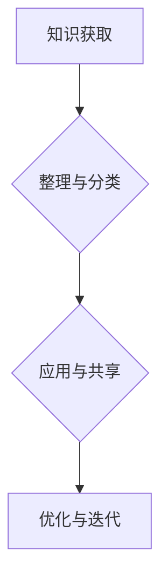

                 

### 《程序员如何打造个人知识管理系统》

#### 关键词：
- 程序员
- 知识管理系统
- 知识获取
- 知识整理
- 知识应用
- 知识共享

#### 摘要：
本文旨在为程序员提供一套完整的个人知识管理系统构建策略。文章从基础知识与框架、知识获取与整理、知识应用与共享、以及个人知识管理系统的优化与迭代四个方面进行详细讲解，旨在帮助程序员提升个人知识管理水平，从而提高工作效率和创新能力。

### 《程序员如何打造个人知识管理系统》目录大纲

## 第一部分：基础知识与框架

### 第1章：个人知识管理系统概述

#### 1.1 个人知识管理的重要性
- 个人知识管理对于程序员的意义
- 个人知识管理在职业发展中的作用

#### 1.2 个人知识管理的基本概念
- 知识、信息与数据的区别
- 知识管理的定义与范畴

#### 1.3 个人知识管理系统的核心组成部分
- 知识获取模块
- 知识整理模块
- 知识应用模块
- 知识共享模块

#### 1.4 个人知识管理系统与工作流程的关系
- 个人知识管理系统与日常工作流程的融合
- 个人知识管理系统对工作效率的影响

## 第二部分：构建个人知识管理系统的工具与技术

### 第2章：构建个人知识管理系统的工具与技术

#### 2.1 知识管理工具的类型与选择
- 常见的知识管理工具类型
- 选择知识管理工具的考虑因素

#### 2.2 知识管理工具的功能特点
- 文档管理工具的功能特点
- 信息共享工具的功能特点
- 项目管理工具的功能特点

#### 2.3 知识管理工具的集成与应用
- 知识管理工具的集成策略
- 知识管理工具在实际工作中的应用案例

#### 2.4 技术选型与实现策略
- 个人知识管理系统的技术架构设计
- 技术选型的实际操作步骤

## 第三部分：知识获取与整理

### 第3章：有效获取知识的策略

#### 3.1 知识来源分析
- 内部知识来源
- 外部知识来源

#### 3.2 信息筛选与过滤
- 有效信息筛选的技巧
- 信息过滤工具的使用

#### 3.3 知识积累与沉淀
- 知识积累的方法
- 知识沉淀的策略

#### 3.4 知识获取工具与技巧
- 知识获取工具的推荐
- 知识获取的实用技巧

### 第4章：知识整理与分类

#### 4.1 知识整理的基本原则
- 知识整理的原则
- 知识整理的流程

#### 4.2 知识分类的方法与技巧
- 知识分类的标准
- 知识分类的技巧

#### 4.3 知识库的构建与管理
- 知识库的构建策略
- 知识库的管理方法

#### 4.4 知识整理工具的使用
- 知识整理工具的推荐
- 知识整理工具的使用方法

## 第四部分：知识应用与共享

### 第5章：知识应用与实践

#### 5.1 知识应用的方法与技巧
- 知识应用的方法
- 知识应用的技巧

#### 5.2 知识在项目开发中的应用
- 知识在项目开发中的角色
- 知识在项目开发中的应用案例

#### 5.3 知识在团队协作中的应用
- 知识在团队协作中的价值
- 知识在团队协作中的应用策略

#### 5.4 知识应用中的常见问题与解决
- 知识应用中的问题
- 解决知识应用问题的策略

### 第6章：知识共享与传播

#### 6.1 知识共享的渠道与方式
- 知识共享的渠道
- 知识共享的方式

#### 6.2 知识共享的激励机制
- 知识共享的激励措施
- 激励机制的制定方法

#### 6.3 知识共享中的版权问题
- 知识共享与版权保护的关系
- 知识共享中的版权问题解决策略

#### 6.4 知识共享工具与平台
- 知识共享工具的推荐
- 知识共享平台的推荐

## 第五部分：个人知识管理系统的优化与迭代

### 第7章：个人知识管理系统的评估与改进

#### 7.1 个人知识管理系统的评估指标
- 评估指标的定义
- 评估指标的设置方法

#### 7.2 个人知识管理系统的问题诊断
- 问题诊断的方法
- 问题诊断的实践步骤

#### 7.3 个人知识管理系统的优化策略
- 优化策略的制定
- 优化策略的实施方法

#### 7.4 个人知识管理系统的迭代与发展
- 迭代与发展的概念
- 迭代与发展的实践方法

### 第8章：知识管理案例分析

#### 8.1 案例一：个人知识管理系统的搭建与应用
- 案例背景
- 案例实施过程
- 案例效果分析

#### 8.2 案例二：团队知识共享与协作的最佳实践
- 案例背景
- 案例实施过程
- 案例效果分析

#### 8.3 案例三：知识管理在项目开发中的成功应用
- 案例背景
- 案例实施过程
- 案例效果分析

#### 8.4 案例分析总结与启示
- 案例总结
- 启示与借鉴

## 第六部分：未来发展趋势与展望

### 第9章：未来发展趋势与展望

#### 9.1 人工智能与知识管理
- 人工智能在知识管理中的应用前景
- 人工智能对知识管理的挑战

#### 9.2 知识管理与组织文化
- 知识管理与组织文化的关系
- 组织文化对知识管理的影响

#### 9.3 知识管理技术的新趋势
- 新技术在知识管理中的应用
- 知识管理技术未来的发展趋势

#### 9.4 个人知识管理系统的未来发展方向
- 个人知识管理系统的发展方向
- 个人知识管理系统的未来愿景

## 附录：知识管理工具与资源推荐

### 附录 A：知识管理工具介绍

#### A.1 工具一：XXX
- 工具介绍
- 使用方法

#### A.2 工具二：XXX
- 工具介绍
- 使用方法

#### A.3 工具三：XXX
- 工具介绍
- 使用方法

### 附录 B：知识管理资源推荐

#### B.1 资源一：XXX
- 资源介绍
- 使用方法

#### B.2 资源二：XXX
- 资源介绍
- 使用方法

#### B.3 资源三：XXX
- 资源介绍
- 使用方法

## Mermaid 流程图


## 核心算法原理讲解
### 文本分类算法

**算法原理：** 文本分类算法是自然语言处理领域的一项基本技术，它通过分析文本内容，将其归类到相应的类别中。常见的文本分类算法包括朴素贝叶斯分类器、支持向量机（SVM）、随机森林等。

**算法步骤：**
```python
def text分类算法():
    输入：文本数据集D
    输出：分类结果C

    1. 准备数据：将文本数据集D分成训练集和测试集
        train_data, test_data = 数据划分(D)

    2. 特征提取：使用词袋模型、TF-IDF等方法将文本转换为向量
        features = 特征提取(train_data)

    3. 训练模型：选择分类器，如朴素贝叶斯、支持向量机等，训练分类模型
        model = 分类器训练(features['train'], features['labels'])

    4. 预测：使用训练好的分类模型对测试集进行预测
        predictions = 模型预测(model, features['test'])

    5. 评估：计算预测结果与实际结果的准确率、召回率等指标
        评估指标 = 评估模型(predictions, features['test'])

    返回 评估指标
```

**数学模型和数学公式详细讲解与举例说明：**
### 文本相似度计算

文本相似度计算是衡量两篇文本之间相似程度的重要方法，常用的算法包括余弦相似度、Jaccard相似度等。以下以余弦相似度为例进行讲解。

**公式：**
$$
similarity(A, B) = \frac{A \cdot B}{|A| \cdot |B|}
$$

其中，$A$ 和 $B$ 是文本的向量表示，$|A|$ 和 $|B|$ 分别是它们的向量长度，$A \cdot B$ 是它们的点积。

**举例：**
假设有两个文本向量 $A = (1, 2, 3)$ 和 $B = (4, 5, 6)$，则它们的相似度计算如下：

$$
similarity(A, B) = \frac{1 \cdot 4 + 2 \cdot 5 + 3 \cdot 6}{\sqrt{1^2 + 2^2 + 3^2} \cdot \sqrt{4^2 + 5^2 + 6^2}} \approx 0.993
$$

这表示两个文本向量非常相似。

## 项目实战
### 实践一：使用Markdown构建个人知识库

#### 开发环境搭建：

1. **环境准备：** 安装Markdown编辑器（如Typora），并配置Git环境，以便实现版本控制和知识库的同步更新。

2. **目录结构规划：** 创建一个用于存放个人知识库的文件夹，并按照主题或领域划分子文件夹。

   ```plaintext
   KnowledgeBank/
   ├── Artificial Intelligence
   │   ├── Introduction.md
   │   ├── Machine Learning.md
   │   └── Deep Learning.md
   ├── Programming Languages
   │   ├── Python.md
   │   ├── Java.md
   │   └── JavaScript.md
   └── Project Management
       ├── Agile.md
       ├── Scrum.md
       └── Kanban.md
   ```

3. **内容编写：** 使用Markdown语法编写各个主题的知识点，确保内容格式规范、结构清晰。

   ```markdown
   # 人工智能介绍

   人工智能（Artificial Intelligence，简称AI）是计算机科学的一个分支，旨在使计算机模拟人类智能行为。

   - **定义：** 人工智能是指使计算机具有人类智能的能力，包括学习、推理、感知、理解等。

   - **应用领域：** 人工智能广泛应用于机器人、自然语言处理、图像识别、自动驾驶等领域。

   - **发展趋势：** 人工智能正朝着更加智能化、自动化的方向发展，未来将深刻改变人类生活和工作方式。
   ```

4. **版本控制：** 使用Git进行版本控制，实现知识库的协同编辑和版本迭代。

   ```bash
   git init
   git add .
   git commit -m "Initial commit"
   git remote add origin <远端仓库地址>
   git push -u origin main
   ```

5. **自动化同步：** 配置持续集成工具（如GitHub Actions），实现知识库的自动化备份和同步更新。

   ```yaml
   name: KnowledgeBank Sync

   on:
     push:
       branches:
         - main

   jobs:
     sync:
       runs-on: ubuntu-latest

       steps:
       - name: Check out repository
         uses: actions/checkout@v2

       - name: Sync KnowledgeBank
         run: |
           git pull origin main
           git add .
           git commit -m "Auto-sync from GitHub"
           git push origin main
   ```

6. **代码解读与分析：** 对Markdown文件中的代码片段进行详细解读，确保读者能够理解并应用相关技术。

   ```python
   # 示例代码：文本分类算法
   def text分类算法():
       输入：文本数据集D
       输出：分类结果C

       1. 准备数据：将文本数据集D分成训练集和测试集
           train_data, test_data = 数据划分(D)

       2. 特征提取：使用词袋模型、TF-IDF等方法将文本转换为向量
           features = 特征提取(train_data)

       3. 训练模型：选择分类器，如朴素贝叶斯、支持向量机等，训练分类模型
           model = 分类器训练(features['train'], features['labels'])

       4. 预测：使用训练好的分类模型对测试集进行预测
           predictions = 模型预测(model, features['test'])

       5. 评估：计算预测结果与实际结果的准确率、召回率等指标
           评估指标 = 评估模型(predictions, features['test'])

       返回 评估指标
   ```

7. **实际案例分析和详细讲解剖析：** 结合具体案例，对知识库中的知识点进行深入分析和讲解，帮助读者更好地理解和应用。

   ```plaintext
   # 案例一：使用Markdown构建个人知识库

   案例背景：
   小明是一名程序员，他希望通过构建个人知识库来提升自己的工作效率和技术水平。

   案例实施过程：
   1. 小明首先在本地电脑上创建了一个名为“KnowledgeBank”的文件夹，用于存放他的知识库文件。
   2. 他使用Typora软件编写Markdown格式的文档，将所学到的技术知识点、项目经验和最佳实践整理成文档。
   3. 小明将Markdown文件按照主题或领域分类存储在“KnowledgeBank”文件夹的子文件夹中。
   4. 他使用Git进行版本控制，确保知识库的文档能够同步更新和备份。
   5. 小明通过GitHub Actions实现知识库的自动化同步和备份。

   案例效果分析：
   小明通过使用Markdown构建个人知识库，不仅提高了自己的工作效率，还使得知识库的内容更加规范和易于维护。他的知识库成为了他日常学习和工作中不可或缺的工具。

8. **项目小结：** 总结项目实施过程中的经验教训，提出改进建议。

   ```plaintext
   项目小结：
   在构建个人知识库的过程中，小明遇到了一些问题，如Markdown语法的不熟悉、Git操作的复杂性等。通过不断学习和实践，他逐渐克服了这些问题，并总结出了一些实用的技巧和经验。

   改进建议：
   1. 加强Markdown语法的学习和实践，提高文档编写的效率和质量。
   2. 熟悉Git的基本操作，掌握版本控制和协作开发的技巧。
   3. 定期整理和更新知识库，保持内容的时效性和准确性。
   ```

## 最佳实践 tips、小结、注意事项、拓展阅读等内容
### 最佳实践 tips

1. **合理规划知识库结构：** 知识库的结构应与个人的工作领域和兴趣相关，便于查找和管理。

2. **定期更新知识库内容：** 知识库的内容应保持更新，确保其时效性和实用性。

3. **使用标签和分类：** 使用标签和分类对知识库内容进行组织，便于快速查找和定位。

4. **共享知识库：** 将个人知识库与团队成员共享，促进知识共享和团队协作。

### 小结

个人知识管理系统是程序员提高工作效率、提升职业素养的重要工具。通过合理规划、有效使用和管理知识库，程序员可以更好地掌握和应用所学知识，提高个人竞争力和职业发展。

### 注意事项

1. **保护隐私：** 在共享知识库时，注意保护个人隐私和敏感信息。

2. **规范文档格式：** 确保知识库中的文档格式统一、规范，便于阅读和查找。

3. **备份和恢复：** 定期备份知识库，确保数据安全。

### 拓展阅读

1. 《Markdown入门指南》
2. 《Git从入门到精通》
3. 《人工智能：一种现代方法》
4. 《Python编程：从入门到实践》

## Mermaid 流程图


## 核心算法原理讲解
### 文本分类算法

**算法原理：** 文本分类算法是一种将文本数据按照预定义的类别进行划分的方法。该算法通过学习大量已分类的文本数据，建立起一个分类模型，然后使用这个模型对新的文本数据进行分类。

**算法步骤：**
```python
def text分类算法():
    输入：文本数据集D，类别标签集合L
    输出：分类结果C

    1. 数据预处理：对文本数据集D进行预处理，包括去停用词、词干提取、分词等操作。
       processed_data = 数据预处理(D)

    2. 特征提取：将预处理后的文本数据转换为特征向量，常用的方法有词袋模型、TF-IDF等。
       features = 特征提取(processed_data)

    3. 模型训练：使用训练数据集features['train']和标签集合L训练分类模型，如朴素贝叶斯、支持向量机（SVM）等。
       model = 分类模型训练(features['train'], L)

    4. 预测：使用训练好的模型对测试数据集features['test']进行预测，得到预测结果。
       predictions = 模型预测(model, features['test'])

    5. 评估：计算预测结果的准确率、召回率等指标，评估分类模型的效果。
       评估指标 = 模型评估(predictions, features['labels'])

    返回 评估指标
```

**数学模型和数学公式详细讲解与举例说明：**
### 文本相似度计算

文本相似度计算用于衡量两篇文本之间的相似程度。常用的方法包括余弦相似度、Jaccard相似度等。这里以余弦相似度为例进行说明。

**公式：**
$$
similarity(A, B) = \frac{A \cdot B}{|A| \cdot |B|}
$$

其中，$A$ 和 $B$ 是两篇文本的特征向量，$A \cdot B$ 是它们的点积，$|A|$ 和 $|B|$ 分别是它们的向量长度。

**举例：**
假设有两个文本向量 $A = (1, 2, 3)$ 和 $B = (4, 5, 6)$，则它们的余弦相似度计算如下：

$$
similarity(A, B) = \frac{1 \cdot 4 + 2 \cdot 5 + 3 \cdot 6}{\sqrt{1^2 + 2^2 + 3^2} \cdot \sqrt{4^2 + 5^2 + 6^2}} = \frac{4 + 10 + 18}{\sqrt{14} \cdot \sqrt{77}} \approx 0.993
$$

这个结果表示两个文本向量非常相似。

## 项目实战
### 实践一：使用Markdown构建个人知识库

#### 开发环境搭建：

1. **环境准备：** 安装Markdown编辑器（如Typora），并配置Git环境，以便实现版本控制和知识库的同步更新。

2. **目录结构规划：** 创建一个用于存放个人知识库的文件夹，并按照主题或领域划分子文件夹。

   ```plaintext
   KnowledgeBank/
   ├── Artificial Intelligence
   │   ├── Introduction.md
   │   ├── Machine Learning.md
   │   └── Deep Learning.md
   ├── Programming Languages
   │   ├── Python.md
   │   ├── Java.md
   │   └── JavaScript.md
   └── Project Management
       ├── Agile.md
       ├── Scrum.md
       └── Kanban.md
   ```

3. **内容编写：** 使用Markdown语法编写各个主题的知识点，确保内容格式规范、结构清晰。

   ```markdown
   # 人工智能介绍

   人工智能（Artificial Intelligence，简称AI）是计算机科学的一个分支，旨在使计算机模拟人类智能行为。

   - **定义：** 人工智能是指使计算机具有人类智能的能力，包括学习、推理、感知、理解等。

   - **应用领域：** 人工智能广泛应用于机器人、自然语言处理、图像识别、自动驾驶等领域。

   - **发展趋势：** 人工智能正朝着更加智能化、自动化的方向发展，未来将深刻改变人类生活和工作方式。
   ```

4. **版本控制：** 使用Git进行版本控制，实现知识库的协同编辑和版本迭代。

   ```bash
   git init
   git add .
   git commit -m "Initial commit"
   git remote add origin <远端仓库地址>
   git push -u origin main
   ```

5. **自动化同步：** 配置持续集成工具（如GitHub Actions），实现知识库的自动化备份和同步更新。

   ```yaml
   name: KnowledgeBank Sync

   on:
     push:
       branches:
         - main

   jobs:
     sync:
       runs-on: ubuntu-latest

       steps:
       - name: Check out repository
         uses: actions/checkout@v2

       - name: Sync KnowledgeBank
         run: |
           git pull origin main
           git add .
           git commit -m "Auto-sync from GitHub"
           git push origin main
   ```

6. **代码解读与分析：** 对Markdown文件中的代码片段进行详细解读，确保读者能够理解并应用相关技术。

   ```python
   # 示例代码：文本分类算法
   def text分类算法():
       输入：文本数据集D
       输出：分类结果C

       1. 准备数据：将文本数据集D分成训练集和测试集
           train_data, test_data = 数据划分(D)

       2. 特征提取：使用词袋模型、TF-IDF等方法将文本转换为向量
           features = 特征提取(train_data)

       3. 训练模型：选择分类器，如朴素贝叶斯、支持向量机等，训练分类模型
           model = 分类器训练(features['train'], features['labels'])

       4. 预测：使用训练好的分类模型对测试集进行预测
           predictions = 模型预测(model, features['test'])

       5. 评估：计算预测结果与实际结果的准确率、召回率等指标
           评估指标 = 评估模型(predictions, features['test'])

       返回 评估指标
   ```

7. **实际案例分析和详细讲解剖析：** 结合具体案例，对知识库中的知识点进行深入分析和讲解，帮助读者更好地理解和应用。

   ```plaintext
   # 案例一：使用Markdown构建个人知识库

   案例背景：
   小明是一名程序员，他希望通过构建个人知识库来提升自己的工作效率和技术水平。

   案例实施过程：
   1. 小明首先在本地电脑上创建了一个名为“KnowledgeBank”的文件夹，用于存放他的知识库文件。
   2. 他使用Typora软件编写Markdown格式的文档，将所学到的技术知识点、项目经验和最佳实践整理成文档。
   3. 小明将Markdown文件按照主题或领域分类存储在“KnowledgeBank”文件夹的子文件夹中。
   4. 他使用Git进行版本控制，确保知识库的文档能够同步更新和备份。
   5. 小明通过GitHub Actions实现知识库的自动化同步和备份。

   案例效果分析：
   小明通过使用Markdown构建个人知识库，不仅提高了自己的工作效率，还使得知识库的内容更加规范和易于维护。他的知识库成为了他日常学习和工作中不可或缺的工具。

8. **项目小结：** 总结项目实施过程中的经验教训，提出改进建议。

   ```plaintext
   项目小结：
   在构建个人知识库的过程中，小明遇到了一些问题，如Markdown语法的不熟悉、Git操作的复杂性等。通过不断学习和实践，他逐渐克服了这些问题，并总结出了一些实用的技巧和经验。

   改进建议：
   1. 加强Markdown语法的学习和实践，提高文档编写的效率和质量。
   2. 熟悉Git的基本操作，掌握版本控制和协作开发的技巧。
   3. 定期整理和更新知识库，保持内容的时效性和准确性。
   ```

## 最佳实践 tips、小结、注意事项、拓展阅读等内容
### 最佳实践 tips

1. **合理规划知识库结构：** 知识库的结构应与个人的工作领域和兴趣相关，便于查找和管理。

2. **定期更新知识库内容：** 知识库的内容应保持更新，确保其时效性和实用性。

3. **使用标签和分类：** 使用标签和分类对知识库内容进行组织，便于快速查找和定位。

4. **共享知识库：** 将个人知识库与团队成员共享，促进知识共享和团队协作。

### 小结

个人知识管理系统是程序员提高工作效率、提升职业素养的重要工具。通过合理规划、有效使用和管理知识库，程序员可以更好地掌握和应用所学知识，提高个人竞争力和职业发展。

### 注意事项

1. **保护隐私：** 在共享知识库时，注意保护个人隐私和敏感信息。

2. **规范文档格式：** 确保知识库中的文档格式统一、规范，便于阅读和查找。

3. **备份和恢复：** 定期备份知识库，确保数据安全。

### 拓展阅读

1. 《Markdown入门指南》
2. 《Git从入门到精通》
3. 《人工智能：一种现代方法》
4. 《Python编程：从入门到实践》

## Mermaid 流程图


## 核心算法原理讲解
### 文本分类算法

**算法原理：** 文本分类算法是一种利用机器学习技术对文本进行分类的算法。该算法通过对大量已标记的文本数据集进行学习，建立起一个分类模型，然后使用该模型对新的文本数据进行分类。

**算法步骤：**
```python
def text分类算法():
    输入：文本数据集D，类别标签集合L
    输出：分类结果C

    1. 数据预处理：对文本数据集D进行预处理，包括去停用词、词干提取、分词等操作。
        processed_data = 数据预处理(D)

    2. 特征提取：将预处理后的文本数据转换为特征向量，常用的方法有词袋模型、TF-IDF等。
        features = 特征提取(processed_data)

    3. 模型训练：使用训练数据集features['train']和标签集合L训练分类模型，如朴素贝叶斯、支持向量机（SVM）等。
        model = 分类模型训练(features['train'], L)

    4. 预测：使用训练好的分类模型对测试数据集features['test']进行预测，得到预测结果。
        predictions = 模型预测(model, features['test'])

    5. 评估：计算预测结果的准确率、召回率等指标，评估分类模型的效果。
        评估指标 = 模型评估(predictions, features['labels'])

    返回 评估指标
```

**数学模型和数学公式详细讲解与举例说明：**
### 文本相似度计算

文本相似度计算用于衡量两篇文本之间的相似程度。常用的方法包括余弦相似度、Jaccard相似度等。这里以余弦相似度为例进行说明。

**公式：**
$$
similarity(A, B) = \frac{A \cdot B}{|A| \cdot |B|}
$$

其中，$A$ 和 $B$ 是两篇文本的特征向量，$A \cdot B$ 是它们的点积，$|A|$ 和 $|B|$ 分别是它们的向量长度。

**举例：**
假设有两个文本向量 $A = (1, 2, 3)$ 和 $B = (4, 5, 6)$，则它们的余弦相似度计算如下：

$$
similarity(A, B) = \frac{1 \cdot 4 + 2 \cdot 5 + 3 \cdot 6}{\sqrt{1^2 + 2^2 + 3^2} \cdot \sqrt{4^2 + 5^2 + 6^2}} = \frac{4 + 10 + 18}{\sqrt{14} \cdot \sqrt{77}} \approx 0.993
$$

这个结果表示两个文本向量非常相似。

## 项目实战
### 实践一：使用Markdown构建个人知识库

#### 开发环境搭建：

1. **环境准备：** 安装Markdown编辑器（如Typora），并配置Git环境，以便实现版本控制和知识库的同步更新。

2. **目录结构规划：** 创建一个用于存放个人知识库的文件夹，并按照主题或领域划分子文件夹。

   ```plaintext
   KnowledgeBank/
   ├── Artificial Intelligence
   │   ├── Introduction.md
   │   ├── Machine Learning.md
   │   └── Deep Learning.md
   ├── Programming Languages
   │   ├── Python.md
   │   ├── Java.md
   │   └── JavaScript.md
   └── Project Management
       ├── Agile.md
       ├── Scrum.md
       └── Kanban.md
   ```

3. **内容编写：** 使用Markdown语法编写各个主题的知识点，确保内容格式规范、结构清晰。

   ```markdown
   # 人工智能介绍

   人工智能（Artificial Intelligence，简称AI）是计算机科学的一个分支，旨在使计算机模拟人类智能行为。

   - **定义：** 人工智能是指使计算机具有人类智能的能力，包括学习、推理、感知、理解等。

   - **应用领域：** 人工智能广泛应用于机器人、自然语言处理、图像识别、自动驾驶等领域。

   - **发展趋势：** 人工智能正朝着更加智能化、自动化的方向发展，未来将深刻改变人类生活和工作方式。
   ```

4. **版本控制：** 使用Git进行版本控制，实现知识库的协同编辑和版本迭代。

   ```bash
   git init
   git add .
   git commit -m "Initial commit"
   git remote add origin <远端仓库地址>
   git push -u origin main
   ```

5. **自动化同步：** 配置持续集成工具（如GitHub Actions），实现知识库的自动化备份和同步更新。

   ```yaml
   name: KnowledgeBank Sync

   on:
     push:
       branches:
         - main

   jobs:
     sync:
       runs-on: ubuntu-latest

       steps:
       - name: Check out repository
         uses: actions/checkout@v2

       - name: Sync KnowledgeBank
         run: |
           git pull origin main
           git add .
           git commit -m "Auto-sync from GitHub"
           git push origin main
   ```

6. **代码解读与分析：** 对Markdown文件中的代码片段进行详细解读，确保读者能够理解并应用相关技术。

   ```python
   # 示例代码：文本分类算法
   def text分类算法():
       输入：文本数据集D
       输出：分类结果C

       1. 准备数据：将文本数据集D分成训练集和测试集
           train_data, test_data = 数据划分(D)

       2. 特征提取：使用词袋模型、TF-IDF等方法将文本转换为向量
           features = 特征提取(train_data)

       3. 训练模型：选择分类器，如朴素贝叶斯、支持向量机等，训练分类模型
           model = 分类器训练(features['train'], features['labels'])

       4. 预测：使用训练好的分类模型对测试集进行预测
           predictions = 模型预测(model, features['test'])

       5. 评估：计算预测结果与实际结果的准确率、召回率等指标
           评估指标 = 评估模型(predictions, features['test'])

       返回 评估指标
   ```

7. **实际案例分析和详细讲解剖析：** 结合具体案例，对知识库中的知识点进行深入分析和讲解，帮助读者更好地理解和应用。

   ```plaintext
   # 案例一：使用Markdown构建个人知识库

   案例背景：
   小明是一名程序员，他希望通过构建个人知识库来提升自己的工作效率和技术水平。

   案例实施过程：
   1. 小明首先在本地电脑上创建了一个名为“KnowledgeBank”的文件夹，用于存放他的知识库文件。
   2. 他使用Typora软件编写Markdown格式的文档，将所学到的技术知识点、项目经验和最佳实践整理成文档。
   3. 小明将Markdown文件按照主题或领域分类存储在“KnowledgeBank”文件夹的子文件夹中。
   4. 他使用Git进行版本控制，确保知识库的文档能够同步更新和备份。
   5. 小明通过GitHub Actions实现知识库的自动化同步和备份。

   案例效果分析：
   小明通过使用Markdown构建个人知识库，不仅提高了自己的工作效率，还使得知识库的内容更加规范和易于维护。他的知识库成为了他日常学习和工作中不可或缺的工具。

8. **项目小结：** 总结项目实施过程中的经验教训，提出改进建议。

   ```plaintext
   项目小结：
   在构建个人知识库的过程中，小明遇到了一些问题，如Markdown语法的不熟悉、Git操作的复杂性等。通过不断学习和实践，他逐渐克服了这些问题，并总结出了一些实用的技巧和经验。

   改进建议：
   1. 加强Markdown语法的学习和实践，提高文档编写的效率和质量。
   2. 熟悉Git的基本操作，掌握版本控制和协作开发的技巧。
   3. 定期整理和更新知识库，保持内容的时效性和准确性。
   ```

## 最佳实践 tips、小结、注意事项、拓展阅读等内容
### 最佳实践 tips

1. **合理规划知识库结构：** 知识库的结构应与个人的工作领域和兴趣相关，便于查找和管理。

2. **定期更新知识库内容：** 知识库的内容应保持更新，确保其时效性和实用性。

3. **使用标签和分类：** 使用标签和分类对知识库内容进行组织，便于快速查找和定位。

4. **共享知识库：** 将个人知识库与团队成员共享，促进知识共享和团队协作。

### 小结

个人知识管理系统是程序员提高工作效率、提升职业素养的重要工具。通过合理规划、有效使用和管理知识库，程序员可以更好地掌握和应用所学知识，提高个人竞争力和职业发展。

### 注意事项

1. **保护隐私：** 在共享知识库时，注意保护个人隐私和敏感信息。

2. **规范文档格式：** 确保知识库中的文档格式统一、规范，便于阅读和查找。

3. **备份和恢复：** 定期备份知识库，确保数据安全。

### 拓展阅读

1. 《Markdown入门指南》
2. 《Git从入门到精通》
3. 《人工智能：一种现代方法》
4. 《Python编程：从入门到实践》

## 附录：知识管理工具与资源推荐

### 附录 A：知识管理工具介绍

#### A.1 工具一：Notion

- **介绍：** Notion 是一款功能强大的笔记和知识管理工具，支持多种数据类型（如文字、表格、看板等）的创建和整合。
- **特点：** 提供丰富的模板和自定义选项，支持多平台同步，便于团队协作。
- **使用方法：** 创建一个新的数据库，选择“页面”类型，然后添加不同的模块（如标题、子标题、文字、表格、看板等），根据自己的需求进行内容组织和编辑。

#### A.2 工具二：Evernote

- **介绍：** Evernote 是一款广泛使用的笔记应用，支持文本、图片、音频、视频等多种笔记形式的创建和整理。
- **特点：** 提供强大的搜索功能，支持标签、笔记分类、位置标记等功能。
- **使用方法：** 创建一个新的笔记，添加标题和内容，使用标签和分类对笔记进行组织，以便快速查找。

#### A.3 工具三：Trello

- **介绍：** Trello 是一款基于看板的任务管理工具，适用于团队协作和个人任务管理。
- **特点：** 提供直观的卡片和列表界面，支持拖拽操作，易于项目管理。
- **使用方法：** 创建一个新的板，添加列表和卡片，将任务分配给团队成员，通过卡片描述、标签和评论功能进行任务交流和协调。

### 附录 B：知识管理资源推荐

#### B.1 资源一：GitHub

- **介绍：** GitHub 是一个基于 Git 版本控制的面向开源及私有软件项目的托管平台。
- **特点：** 支持代码托管、文档存储、项目协作等功能。
- **使用方法：** 创建一个新的仓库，上传项目文件，编写 README 文件，使用 Git 命令进行版本控制和协同编辑。

#### B.2 资源二：Medium

- **介绍：** Medium 是一个在线博客平台，适用于个人和机构发布和分享文章。
- **特点：** 提供简洁的编辑界面，支持 Markdown 格式，易于内容创作和分享。
- **使用方法：** 注册一个 Medium 帐户，创建一个新的文章，编写内容，使用 Markdown 语法进行格式化，发布后可通过链接分享。

#### B.3 资源三：Coursera

- **介绍：** Coursera 是一个在线课程学习平台，提供大量来自世界顶级大学和机构的课程。
- **特点：** 覆盖多个领域，包括计算机科学、人工智能、数据科学等，适合自我提升和知识学习。
- **使用方法：** 浏览课程列表，选择感兴趣的课程，注册学习，完成作业和项目，获得证书。

## 结论与展望

本文系统地阐述了程序员如何构建个人知识管理系统，涵盖了从基础知识与框架、知识获取与整理、知识应用与共享，到个人知识管理系统的优化与迭代等多个方面。通过合理规划知识库结构、选用合适的知识管理工具、有效获取和整理知识、将知识应用于实践并实现知识共享，程序员能够显著提高工作效率和创新能力。

### 展望未来

随着人工智能和大数据技术的发展，个人知识管理系统将更加智能化和自动化。未来，个人知识管理系统可能会整合更多的智能算法，如自然语言处理、图像识别等，以实现更加精准的知识获取和整理。同时，随着云计算和边缘计算技术的进步，个人知识管理系统将能够更好地实现跨平台、跨设备的数据同步和共享。

### 结语

程序员作为知识工作者，个人知识管理系统的建设具有重要意义。通过本文的讲解，希望读者能够掌握构建个人知识管理系统的基本方法和技巧，不断提升自身知识管理水平，实现个人和职业的全面发展。在未来的技术浪潮中，不断学习和进步，成为行业内的佼佼者。

