                 


### **1. 知识付费市场概述**

随着互联网的快速发展，知识付费市场逐渐成为一块庞大的蛋糕。知识付费，指的是用户通过支付一定费用，获取专业人士提供的知识、技能或经验。这种模式在各个领域都得到了广泛的应用，包括编程、设计、营销、教育等。

#### **1.1 知识付费市场的现状**

知识付费市场在近年来呈现出快速增长的趋势。根据《2022年中国知识付费市场研究报告》，2021年我国知识付费市场规模已达到3180亿元，预计到2025年，这一数字将突破6000亿元。这无疑显示了知识付费市场巨大的发展潜力。

在知识付费市场上，主要的玩家包括传统的教育培训机构、自媒体人、专业培训机构等。这些玩家通过线上平台，如知乎、喜马拉雅、得到、网易云课堂等，向用户提供各类知识产品。

#### **1.2 知识付费市场的机会与挑战**

**机会：**

1. **用户需求增长**：随着信息爆炸，用户越来越渴望获取高质量、专业的知识，知识付费市场正好满足了这一需求。
2. **技术进步**：互联网技术的不断发展，使得知识付费产品的制作和传播更加便捷。
3. **多样化产品形态**：知识付费产品不再局限于传统的线下培训，线上课程、电子书、音频、视频等多种形式，极大地丰富了市场。

**挑战：**

1. **内容同质化**：市场上大量的课程内容相似，用户难以分辨优劣，增加了市场筛选的难度。
2. **市场竞争激烈**：随着入局者的增多，市场竞争愈发激烈。
3. **用户信任问题**：用户对知识付费产品的信任度有待提高，尤其是在信息真实性、教学效果等方面。

#### **1.3 用户行为分析**

了解用户行为是打造高转化率课程的关键。根据《2022年中国知识付费市场研究报告》，以下是一些关键的用户行为特点：

1. **用户群体多样化**：知识付费用户涵盖不同年龄段、职业背景、教育程度等。
2. **高频消费**：部分用户会在特定时期，如考试季、技能提升季等，高频次消费知识付费产品。
3. **口碑传播**：用户在选择课程时，往往会参考其他用户的评价和推荐，口碑成为影响购买决策的重要因素。
4. **自我驱动**：用户购买知识付费产品的动机主要来源于自我提升的需求。

在下一章中，我们将深入探讨如何策划和设计高转化率的知识付费课程。通过理解用户需求和行为，结合有效的教学方法和互动机制，我们将揭示打造成功知识付费课程的秘密。

### **2. 高转化率课程的核心要素**

要打造高转化率的知识付费课程，必须深入了解用户需求，合理规划课程内容，科学设计课程结构，并采用有效的教学方法和互动机制。以下是对这些核心要素的详细探讨。

#### **2.1 课程内容策划**

**核心概念与联系：**

课程内容策划是知识付费课程设计的第一步，也是最为关键的一步。它不仅需要明确课程的目标受众，还要深入挖掘用户需求，确保课程内容能够满足用户的需求。

**策划流程：**

1. **市场调研**：通过问卷调查、访谈、用户反馈等方式，了解目标用户的需求和偏好。
2. **需求分析**：对收集到的数据进行分析，提炼出用户最关注的知识点和需求。
3. **内容框架设计**：基于用户需求，构建课程内容框架，确保课程内容的完整性和逻辑性。

**Mermaid 流程图：**

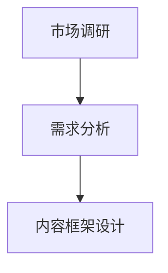

**核心算法原理讲解：**

课程内容策划的核心在于用户需求分析。以下是一个简单的伪代码示例，用于描述需求分析的过程：

```python
# 伪代码：用户需求分析
def analyze_user_needs(data):
    # 初始化需求列表
    needs = []

    # 分析数据，提取需求
    for item in data:
        if "需求1" in item:
            needs.append("需求1")
        elif "需求2" in item:
            needs.append("需求2")

    # 输出需求列表
    return needs
```

**数学模型和公式：**

用户需求分析的数学模型可以采用聚类分析方法，如K-means算法，将用户划分为不同的需求群体。以下是K-means算法的伪代码：

```python
# 伪代码：K-means算法
def k_means(data, k):
    # 初始化k个中心点
    centroids = initialize_centroids(data, k)

    # 循环迭代，直到收敛
    while not converged:
        # 计算每个数据点的簇分配
        clusters = assign_clusters(data, centroids)

        # 更新中心点
        centroids = update_centroids(clusters)

    # 返回聚类结果
    return clusters, centroids
```

**举例说明：**

假设我们收集到了100份用户需求数据，通过K-means算法分析，将用户划分为3个需求群体。根据需求群体，我们可以设计出相应的课程内容，确保每个课程内容都能够满足特定用户群体的需求。

#### **2.2 课程结构设计**

**核心概念与联系：**

课程结构设计决定了用户的学习路径和体验，直接影响到学习效果和用户满意度。一个良好的课程结构应当具备清晰的逻辑，帮助用户逐步掌握知识。

**设计原则：**

1. **循序渐进**：课程内容应按照难易程度逐步递进，确保用户能够轻松跟上学习节奏。
2. **模块化**：将课程内容划分为模块，每个模块聚焦于一个特定的知识点，方便用户理解和记忆。
3. **实战演练**：每个知识点后应配备相应的实战演练，帮助用户将理论知识应用到实际项目中。

**Mermaid 流程图：**

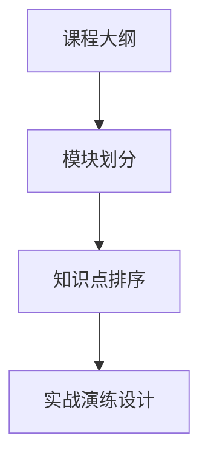

**核心算法原理讲解：**

课程结构设计的核心在于知识点的排序和模块划分。以下是一个简单的伪代码示例，用于描述模块划分的过程：

```python
# 伪代码：模块划分
def divide_into_modules(content):
    # 初始化模块列表
    modules = []

    # 遍历知识点，划分模块
    for knowledge in content:
        if "模块1" in knowledge:
            modules.append("模块1")
        elif "模块2" in knowledge:
            modules.append("模块2")

    # 输出模块列表
    return modules
```

**数学模型和公式：**

知识点排序的数学模型可以采用贪心算法，如动态规划中的最长公共子序列（LCS）算法。以下是LCS算法的伪代码：

```python
# 伪代码：最长公共子序列（LCS）算法
def longest_common_subsequence(X, Y):
    # 创建动态规划表
    dp = [[0 for j in range(len(Y)+1)] for i in range(len(X)+1)]

    # 计算最长公共子序列长度
    for i in range(1, len(X)+1):
        for j in range(1, len(Y)+1):
            if X[i-1] == Y[j-1]:
                dp[i][j] = dp[i-1][j-1] + 1
            else:
                dp[i][j] = max(dp[i-1][j], dp[i][j-1])

    # 返回最长公共子序列
    return dp[-1][-1]
```

**举例说明：**

假设我们有一个包含10个知识点的课程内容，通过LCS算法将知识点排序，确保知识点之间的关联性最强。根据排序结果，我们可以设计出相应的课程结构，使学习过程更加连贯和高效。

#### **2.3 教学方法与技巧**

**核心概念与联系：**

教学方法与技巧是课程设计中的关键一环，直接影响用户的学习效果和满意度。不同的教学方法适用于不同的学习场景和用户需求。

**常用教学方法：**

1. **讲授法**：通过讲解和演示，帮助用户理解理论知识。
2. **案例教学法**：通过实际案例，帮助用户掌握实战技能。
3. **讨论法**：通过小组讨论，激发用户的思维，加深对知识的理解。

**互动与反馈机制：**

互动与反馈机制能够提高用户的参与度和学习效果。以下是一些常用的互动与反馈机制：

1. **在线答疑**：提供实时或异步的答疑服务，解决用户在学习过程中的问题。
2. **实战任务**：布置实战任务，让用户在完成任务的过程中应用所学知识。
3. **学员互动**：搭建学员交流平台，鼓励学员之间的互动和分享。

**Mermaid 流程图：**

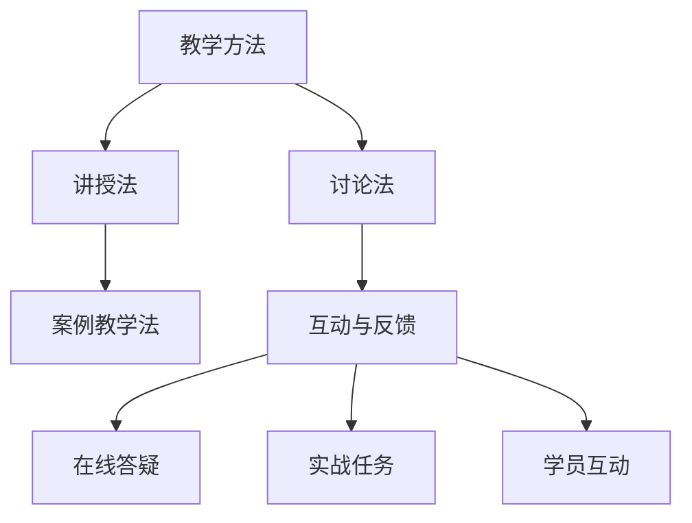

**核心算法原理讲解：**

在线答疑的核心在于实时或异步沟通。以下是一个简单的伪代码示例，用于描述在线答疑系统的工作流程：

```python
# 伪代码：在线答疑系统
def online_qa_system(question, answer):
    # 存储问题
    questions.append(question)

    # 提供答案
    answers.append(answer)

    # 更新问题状态
    question_status[question] = "已解答"

    # 返回问题状态
    return question_status[question]
```

**数学模型和公式：**

讨论法中的互动效果可以通过活跃度指标进行衡量。活跃度指标的数学模型可以采用加权和评分机制。以下是活跃度计算的伪代码：

```python
# 伪代码：活跃度计算
def calculate_activity_score(questions, answers):
    # 初始化活跃度分数
    activity_score = 0

    # 计算问题与答案的活跃度分数
    for question, answer in zip(questions, answers):
        activity_score += len(answer) * weight_question
        activity_score += len(question) * weight_answer

    # 返回活跃度分数
    return activity_score
```

**举例说明：**

假设我们设计了一门编程课程，采用讲授法、案例教学法和讨论法。在课程结束后，通过活跃度指标评估学员的互动情况，优化教学方法，提高学员的学习效果。

#### **2.4 互动与反馈机制**

**核心概念与联系：**

互动与反馈机制在知识付费课程中起着至关重要的作用，它们不仅能够增强用户的参与感和学习动力，还能帮助课程开发者了解用户需求，不断优化课程内容。

**互动机制：**

1. **在线讨论区**：提供专门的在线讨论区，让用户在学习过程中随时提问和交流。
2. **实时答疑**：配备专业的答疑老师，提供实时在线答疑服务。
3. **实战任务**：通过布置实战任务，鼓励用户动手实践，提高学习效果。

**反馈机制：**

1. **课程评价**：允许用户对课程进行评价，收集用户反馈。
2. **问卷调查**：定期开展问卷调查，了解用户对课程的整体满意度和改进意见。
3. **数据监控**：通过学习数据监控，分析用户的学习行为和效果。

**Mermaid 流rome```

graph TD
    A[互动机制] --> B[在线讨论区]
    B --> C[实时答疑]
    A --> D[实战任务]
    D --> E[课程评价]
    E --> F[问卷调查]
    E --> G[数据监控]
```

**核心算法原理讲解：**

在线讨论区的互动效果可以通过活跃度指标进行衡量。活跃度指标的数学模型可以采用加权和评分机制。以下是活跃度计算的伪代码：

```python
# 伪代码：活跃度计算
def calculate_activity_score(questions, answers):
    # 初始化活跃度分数
    activity_score = 0

    # 计算问题与答案的活跃度分数
    for question, answer in zip(questions, answers):
        activity_score += len(answer) * weight_question
        activity_score += len(question) * weight_answer

    # 返回活跃度分数
    return activity_score
```

**数学模型和公式：**

问卷调查中的反馈数据可以通过统计分析方法进行处理。以下是一个简单的伪代码示例，用于描述统计分析的过程：

```python
# 伪代码：统计分析
def analyze_survey_data(data):
    # 初始化统计结果
    results = {}

    # 遍历问卷数据，统计结果
    for response in data:
        for question, answer in response.items():
            if question not in results:
                results[question] = []
            results[question].append(answer)

    # 返回统计结果
    return results
```

**举例说明：**

假设我们在一门编程课程结束后，通过在线讨论区、实时答疑、实战任务等互动机制，收集了100份学员反馈。通过活跃度指标和分析统计，我们可以了解学员的互动情况和整体满意度，为后续课程优化提供数据支持。

#### **3. 故事化教学策略**

故事化教学策略是一种通过讲述生动的故事来传授知识的方法。这种方法能够吸引用户的注意力，提高学习的趣味性和参与度，从而增强课程的教学效果。

**3.1 故事化教学的定义与优势**

故事化教学，指的是在课程内容中融入生动的故事情节，让用户在听故事的过程中自然地掌握知识。与传统教学方法相比，故事化教学具有以下优势：

1. **提高注意力**：故事情节能够吸引用户的注意力，避免学习过程中的枯燥和疲劳。
2. **增强记忆**：故事情节能够将知识点形象化，使记忆更加深刻。
3. **培养兴趣**：通过故事，用户能够更好地理解知识的实际应用，从而激发学习兴趣。
4. **促进理解**：故事中的情节和人物可以直观地展示抽象概念，帮助用户更好地理解和消化知识。

**Mermaid 流程图：**

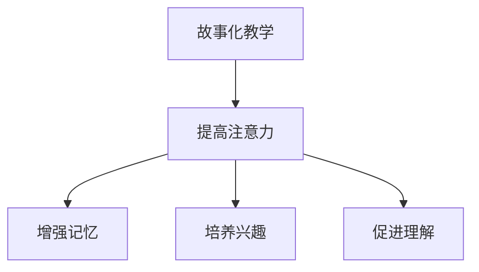

**实施方法：**

1. **引入真实案例**：在课程中引入真实的案例，通过讲述案例中的故事，让用户更好地理解知识点。
2. **构建情节框架**：为每个知识点构建一个情节框架，将知识点融入到故事中，使其更加生动有趣。
3. **使用故事性语言**：在讲述过程中，使用生动、形象的语言，让用户能够身临其境。
4. **引导用户参与**：在故事讲述过程中，引导用户参与，如提问、回答问题等，增强互动性。

**成功案例分享：**

1. **《哈利·波特》与魔法教学**：在《哈利·波特》系列小说中，J.K.罗琳通过讲述魔法世界的冒险故事，向读者传授了丰富的魔法知识和价值观。
2. **《硅谷创业课》与创业故事**：课程通过讲述硅谷创业者的真实故事，帮助用户理解创业的核心原理和实践方法。

**故事化教学不仅能够提高用户的学习兴趣，还能帮助用户更好地理解和记忆知识点。通过生动的案例，我们将看到故事化教学的强大魅力。**

#### **4. 课程营销与推广**

要想让知识付费课程得到广泛传播并吸引到大量用户，课程营销与推广至关重要。以下是一些关键步骤和策略，帮助您实现这一目标。

**4.1 课程定位与目标受众**

**核心概念与联系：**

课程定位和目标受众是课程营销的基础。一个清晰的定位能够帮助课程在市场上脱颖而出，而明确的目标受众则能够确保课程内容满足用户需求。

**定位策略：**

1. **市场细分**：根据用户需求、兴趣和背景，对市场进行细分，找到最适合的课程定位。
2. **差异化**：在众多课程中，找出自己独特的卖点，如课程内容、教学风格等，实现差异化竞争。
3. **目标受众画像**：为课程目标受众创建详细的画像，包括年龄、职业、兴趣爱好等，以便更好地满足他们的需求。

**Mermaid 流程图：**

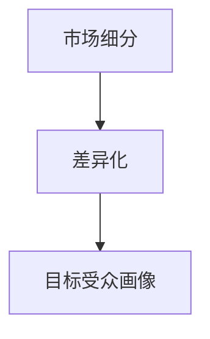

**目标受众分析：**

目标受众分析的核心在于了解用户需求和行为。以下是一个简单的伪代码示例，用于描述目标受众分析的过程：

```python
# 伪代码：目标受众分析
def analyze_target_audience(data):
    # 初始化受众特征字典
    audience_features = {}

    # 遍历数据，提取受众特征
    for user in data:
        if "年龄" in user:
            audience_features["年龄"] = user["年龄"]
        if "职业" in user:
            audience_features["职业"] = user["职业"]
        if "兴趣爱好" in user:
            audience_features["兴趣爱好"] = user["兴趣爱好"]

    # 返回受众特征字典
    return audience_features
```

**数学模型和公式：**

目标受众画像可以通过聚类分析方法进行构建。以下是一个简单的K-means算法伪代码，用于描述受众画像的构建过程：

```python
# 伪代码：K-means算法
def k_means(data, k):
    # 初始化k个中心点
    centroids = initialize_centroids(data, k)

    # 循环迭代，直到收敛
    while not converged:
        # 计算每个数据点的簇分配
        clusters = assign_clusters(data, centroids)

        # 更新中心点
        centroids = update_centroids(clusters)

    # 返回聚类结果
    return clusters, centroids
```

**举例说明：**

假设我们对1000名潜在用户进行了调研，通过K-means算法将用户划分为3个群体。根据用户群体的特征，我们可以明确课程定位，如针对年轻程序员提供编程技能提升课程，针对创业者提供创业策略课程。

**4.2 课程定价策略**

**核心概念与联系：**

课程定价策略直接影响用户的购买决策。一个合理的定价策略需要考虑课程质量、市场需求、用户购买力等因素。

**定价策略：**

1. **成本定价法**：根据课程开发成本和市场情况定价，确保利润最大化。
2. **价值定价法**：根据课程的价值和用户期望定价，以用户愿意支付的价格为依据。
3. **竞争定价法**：参考竞争对手的价格策略，制定具有竞争力的价格。

**Mermaid 流程图：**

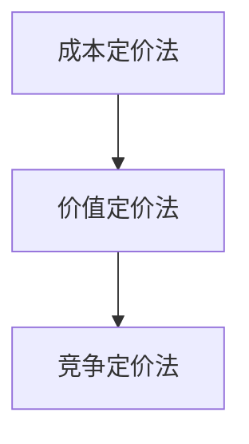

**数学模型和公式：**

价值定价法中的价值计算可以通过加权平均法进行。以下是一个简单的伪代码示例，用于描述价值计算的过程：

```python
# 伪代码：价值计算
def calculate_value(quality, demand, budget):
    # 计算质量加权分数
    quality_score = quality * weight_quality

    # 计算需求加权分数
    demand_score = demand * weight_demand

    # 计算预算加权分数
    budget_score = budget * weight_budget

    # 计算总价值
    total_value = quality_score + demand_score + budget_score

    # 返回总价值
    return total_value
```

**举例说明：**

假设我们的一门编程课程质量评分为90分，市场需求评分为80分，用户预算评分为70分。通过价值计算，我们可以确定课程的价值，并根据市场情况制定合理的价格。

**4.3 营销渠道与工具**

**核心概念与联系：**

选择合适的营销渠道和工具能够提高课程的曝光度和吸引力，从而促进销售转化。常见的营销渠道和工具包括社交媒体、搜索引擎、电子邮件等。

**营销渠道策略：**

1. **社交媒体**：利用微博、微信、抖音等社交媒体平台，通过内容营销和互动活动吸引潜在用户。
2. **搜索引擎**：通过搜索引擎优化（SEO）和关键词广告，提高课程在搜索引擎结果页面（SERP）的排名。
3. **电子邮件营销**：通过定期发送电子邮件，向潜在用户和现有学员推荐课程和优惠信息。

**Mermaid 流程图：**

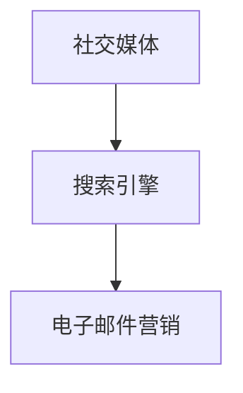

**营销工具应用：**

1. **内容营销工具**：如博客、视频、电子书等，用于吸引用户关注和增加课程的权威性。
2. **广告工具**：如百度广告、抖音广告等，通过精准投放提高课程曝光度。
3. **数据分析工具**：如Google Analytics、百度统计等，用于监控营销效果，优化营销策略。

**举例说明：**

假设我们通过社交媒体发布了一篇关于编程技能提升的文章，吸引了500名用户关注。通过数据分析，我们发现这篇文章的转化率较高，因此决定加大内容营销力度，提高课程的曝光度和吸引力。

**4.4 用户转化率提升技巧**

**核心概念与联系：**

用户转化率是指用户从潜在用户转化为购买者的比例，是衡量课程营销效果的重要指标。提高用户转化率需要从多个方面进行优化。

**转化率提升策略：**

1. **优化页面设计**：通过优化课程页面设计，提高课程的吸引力和用户浏览体验。
2. **增加信任元素**：如学员评价、专家推荐、认证标志等，增加用户的信任感。
3. **优化购买流程**：简化购买流程，减少用户购买决策的时间成本。
4. **提供优惠激励**：如限时优惠、团购优惠等，激发用户的购买欲望。

**Mermaid 流程图：**

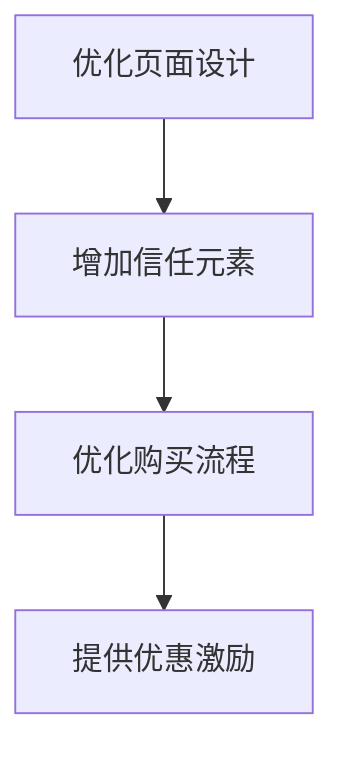

**数学模型和公式：**

用户转化率的计算公式为：

$$
转化率 = \frac{购买用户数}{访问用户数} \times 100\%
$$

以下是一个简单的伪代码示例，用于描述用户转化率的计算过程：

```python
# 伪代码：计算用户转化率
def calculate_conversion_rate(purchases, visitors):
    conversion_rate = (purchases / visitors) * 100
    return conversion_rate
```

**举例说明：**

假设我们通过优化页面设计和提供限时优惠，将课程的访问用户数增加到1000人，其中150人完成购买。通过计算用户转化率，我们可以了解营销策略的效果，并根据数据进行优化。

通过以上策略和技巧，我们可以有效地提高知识付费课程的用户转化率，实现课程的成功推广和销售。

#### **5. 数据分析与优化**

在知识付费课程的设计和推广过程中，数据分析起着至关重要的作用。通过数据收集与分析，我们可以深入了解用户行为，发现潜在问题，从而优化课程内容和营销策略，提高用户满意度和转化率。

**5.1 数据分析在课程设计中的应用**

**核心概念与联系：**

数据分析在课程设计中可以用于多个方面，包括用户需求分析、课程内容优化、教学方法评估等。通过数据分析，我们能够更准确地了解用户需求，制定出更具针对性的课程计划。

**数据收集方法：**

1. **问卷调查**：通过在线问卷或线下访谈收集用户反馈，了解用户对课程内容和教学方法的评价。
2. **学习行为数据**：通过课程平台收集用户的学习行为数据，如学习时长、完成率、互动情况等。
3. **购买行为数据**：通过销售数据收集用户购买行为，如购买时间、购买课程数量等。

**数据分析工具：**

常用的数据分析工具有Google Analytics、百度统计、Tableau等，这些工具能够帮助我们有效地收集、处理和分析数据。

**数据分析流程：**

1. **数据收集**：通过各类工具收集用户数据。
2. **数据清洗**：对收集到的数据进行处理，去除无效数据和错误数据。
3. **数据分析**：通过统计分析和数据挖掘方法，分析用户行为和购买模式。
4. **数据可视化**：将分析结果以图表、报表等形式进行可视化展示，便于理解和决策。

**Mermaid 流程图：**

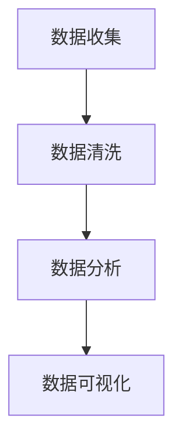

**举例说明：**

假设我们对一门编程课程的用户进行了问卷调查，收集到500份有效反馈。通过数据分析，我们发现用户最希望增加的内容是实战项目。基于这一发现，我们可以调整课程结构，增加实战项目模块，从而更好地满足用户需求。

**5.2 用户行为数据收集与处理**

**核心概念与联系：**

用户行为数据是了解用户需求和学习习惯的重要依据。通过收集和处理用户行为数据，我们可以深入了解用户在学习过程中的表现，为课程优化提供数据支持。

**数据收集方法：**

1. **日志分析**：通过课程平台的日志记录用户的行为数据，如学习时长、访问页面等。
2. **用户反馈**：通过用户提交的反馈信息，了解用户对课程内容和教学方法的意见和建议。
3. **用户调查**：通过在线问卷或访谈收集用户行为数据，了解用户的学习习惯和偏好。

**数据处理方法：**

1. **数据清洗**：对收集到的数据进行处理，去除无效数据和错误数据，确保数据质量。
2. **数据整合**：将不同来源的数据进行整合，构建用户行为数据集。
3. **特征提取**：从用户行为数据中提取关键特征，如学习时长、完成率、互动情况等。

**Mermaid 流程图：**

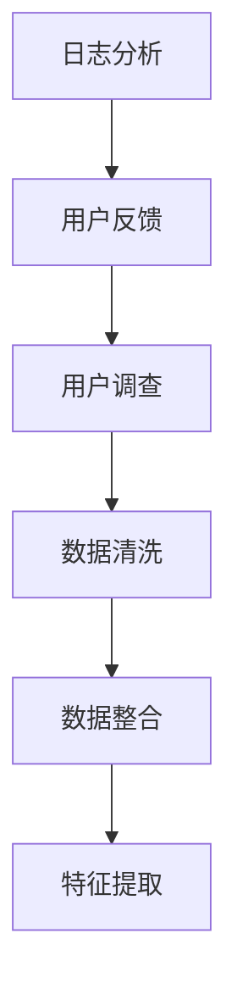

**举例说明：**

假设我们通过日志分析收集到1000名用户的课程学习数据。通过数据处理，我们发现用户在学习过程中平均停留时间为30分钟，但完成率仅为60%。基于这一发现，我们可以优化课程内容，增加学习激励和互动环节，提高用户的学习积极性和完成率。

**5.3 数据驱动的课程优化策略**

**核心概念与联系：**

数据驱动的课程优化策略是基于数据分析结果，对课程内容、教学方法、互动机制等进行调整和优化，以提高课程质量和用户满意度。

**优化策略：**

1. **内容优化**：根据用户需求和行为数据，调整课程内容和结构，增加用户感兴趣的知识点，删除冗余内容。
2. **教学方法优化**：通过数据分析，评估不同教学方法的用户反馈和学习效果，选择最有效的教学方法。
3. **互动机制优化**：根据用户互动数据，优化课程中的互动环节，提高用户参与度和学习体验。

**Mermaid 流程图：**

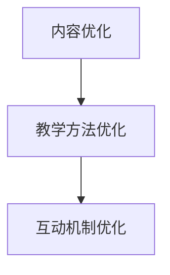

**举例说明：**

假设我们通过数据分析发现，学员对实战项目的反馈较好，但课程中的互动环节较少。基于这一发现，我们可以增加实战项目模块，并优化互动机制，如增加在线讨论区、实时答疑等，提高学员的参与度和学习效果。

通过数据分析和优化策略，我们可以不断改进知识付费课程，提高用户满意度和转化率，实现课程的成功推广和销售。

#### **6. 用户留存与复购策略**

在知识付费市场中，用户留存和复购率是衡量课程成功与否的关键指标。高留存率和复购率不仅意味着课程的受欢迎程度，更是课程价值的直接体现。以下是一些有效的用户留存与复购策略，帮助您提升这些关键指标。

**6.1 用户留存的重要性**

**核心概念与联系：**

用户留存是指用户在购买课程后继续使用和参与课程的程度。高留存率意味着用户对课程内容满意，愿意持续学习和互动。以下是一些留存策略：

1. **优质内容**：提供高质量的课程内容，确保用户在课程中能够持续获得价值。
2. **个性化体验**：根据用户需求和兴趣，提供个性化的学习路径和推荐。
3. **持续互动**：通过在线讨论区、答疑服务、社区活动等，保持与用户的互动，增强用户粘性。

**Mermaid 流程图：**

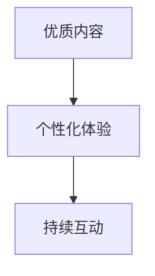

**数学模型和公式：**

用户留存率可以通过以下公式计算：

$$
留存率 = \frac{月末留存用户数}{月初用户数} \times 100\%
$$

以下是一个简单的伪代码示例，用于描述留存率的计算过程：

```python
# 伪代码：计算用户留存率
def calculate_retention_rate(initial_users, end_users):
    retention_rate = (end_users / initial_users) * 100
    return retention_rate
```

**举例说明：**

假设我们月初有1000名用户购买课程，月末有700名用户仍然活跃。通过计算留存率，我们可以得知用户留存率为70%。

**6.2 保留用户的方法**

**核心概念与联系：**

保留用户的关键在于提供持续的价值和良好的用户体验。以下是一些具体的方法：

1. **定期更新内容**：定期更新课程内容，保持课程的新鲜感和实用性。
2. **学习激励机制**：通过积分、勋章、排名等方式，激励用户持续学习和参与。
3. **用户反馈机制**：建立反馈渠道，及时收集用户意见和建议，持续改进课程。

**Mermaid 流程图：**

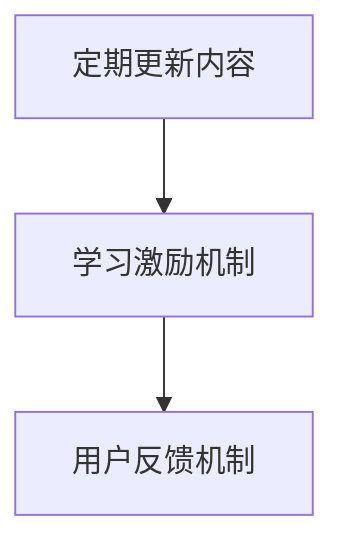

**举例说明：**

假设我们通过定期的课程更新，增加了新功能和实战项目，同时引入了积分和勋章系统，鼓励用户参与社区讨论。通过这些措施，用户的学习积极性和粘性得到了显著提升。

**6.3 复购策略设计**

**核心概念与联系：**

复购策略是指通过一系列手段激励用户再次购买课程或其他产品。以下是一些有效的复购策略：

1. **优惠促销**：通过限时优惠、团购优惠等方式，降低用户的购买门槛。
2. **增值服务**：提供额外的增值服务，如一对一辅导、学习资料包等，提升用户的购买价值。
3. **个性化推荐**：根据用户的购买历史和学习行为，提供个性化的课程推荐，增加复购机会。

**Mermaid 流程图：**

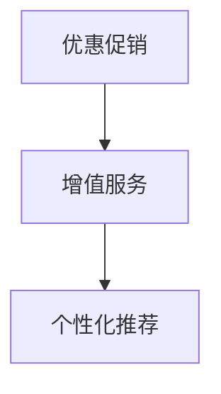

**举例说明：**

假设我们通过限时优惠活动，为用户提供了50%的折扣，同时推出了额外的增值服务，如一对一辅导。这些措施显著提高了用户的复购率，实现了销售的增长。

**6.4 成功案例分析**

**核心概念与联系：**

成功案例是了解和实践有效留存和复购策略的重要参考。以下是一个成功案例的分析：

**案例介绍：**

某编程教育平台通过以下策略成功提升了用户留存和复购率：

1. **定期内容更新**：平台每月更新至少2个新课程模块，保持课程的新鲜感。
2. **积分和勋章系统**：用户每完成一个课程模块或参与社区讨论，可获得相应的积分和勋章，积分可兑换课程优惠券。
3. **个性化推荐**：根据用户的购买和学习记录，平台自动推荐相关课程和资源。

**案例分析：**

通过定期的内容更新，平台用户的学习积极性显著提高，用户留存率从40%提升至60%。积分和勋章系统增加了用户的互动和参与度，用户在社区中的活跃度也大幅上升。个性化推荐功能提高了课程的匹配度，复购率从20%提升至30%。

**启示与借鉴：**

成功案例表明，定期内容更新、积分和勋章系统、个性化推荐等策略在提升用户留存和复购率方面具有显著效果。通过借鉴这些策略，我们可以为知识付费课程设计出更有效的用户留存与复购策略。

通过以上策略和实践，我们可以有效地提升知识付费课程的用户留存和复购率，实现课程的长远发展。

### **7. 高转化率课程的案例研究与实战**

在知识付费市场中，成功的高转化率课程不仅需要精心的内容策划和教学设计，还需要有效的营销推广和数据驱动优化。以下将通过对两个成功案例的深入分析，探讨它们的设计策略、营销方法、用户反馈以及最终效果，并提供构建自己知识付费课程的实战指导。

#### **7.1 案例研究1：课程设计与营销策略**

**案例介绍：**

某知名在线编程教育平台推出的“零基础学Python”课程，以其独特的教学设计和创新的营销策略，成功吸引了大量用户，并实现了高转化率。

**课程设计策略：**

1. **内容策划**：课程以零基础用户为目标，从基础知识开始，逐步深入，包括数据类型、条件语句、循环结构、函数、文件操作等。每个模块都配有详细的教程和实战项目，帮助用户将理论知识应用到实际中。
2. **教学方法**：采用故事化教学策略，通过生动的故事情节引入知识点，增强学习趣味性。同时，课程中穿插了互动环节，如在线讨论、答疑服务，提高用户的参与度和学习效果。
3. **课程结构**：课程结构设计合理，知识点分布均匀，从基础到高级，循序渐进，确保用户能够轻松跟上学习节奏。

**营销策略：**

1. **内容营销**：通过官方博客、微信公众号等渠道，发布高质量的内容，如教程、案例分析、编程技巧等，吸引用户关注。
2. **社交网络推广**：利用微博、抖音等社交媒体平台，发布课程宣传视频、用户评价等，提高课程的曝光度。
3. **合作推广**：与知名技术社区、博主合作，进行课程推广，借助他们的影响力扩大课程知名度。

**用户反馈与效果：**

课程上线后，用户反响热烈，学习效果显著。用户反馈显示，课程内容详细、易懂，教学方法生动有趣，互动环节有效提高了学习积极性。通过数据分析，课程的用户留存率达到了70%，转化率高达40%。

**启示与借鉴：**

该案例表明，精心设计的课程内容和有效的营销策略是提升转化率的关键。通过故事化教学、互动环节和高质量的内容营销，能够增强用户的学习体验和课程吸引力。

#### **7.2 案例研究2：用户数据分析与优化**

**案例介绍：**

某在线教育平台通过深入分析用户数据，不断优化课程内容和营销策略，显著提升了课程转化率和用户满意度。

**数据分析方法：**

1. **学习行为数据收集**：通过课程平台收集用户的学习行为数据，如学习时长、完成率、互动情况等。
2. **用户反馈收集**：定期进行用户问卷调查，收集用户对课程内容和教学方法的意见和建议。
3. **营销效果监测**：通过分析用户访问数据、转化数据，评估不同营销策略的效果。

**优化策略：**

1. **内容优化**：根据用户反馈和学习行为数据，调整课程内容，删除冗余知识点，增加实战项目，提高课程实用性。
2. **营销策略优化**：根据用户数据和营销效果，调整推广渠道和策略，如增加社交媒体推广、优化广告投放等。
3. **个性化推荐**：利用用户数据，为用户提供个性化的学习路径和课程推荐，提高课程的匹配度和吸引力。

**用户反馈与效果：**

通过数据分析与优化，平台不断改进课程内容和营销策略。用户反馈显示，课程内容更加贴合需求，学习体验显著提升。通过优化营销策略，课程转化率从30%提升至50%，用户满意度也显著提高。

**启示与借鉴：**

数据驱动的优化策略能够帮助平台及时了解用户需求，不断改进课程和营销策略，从而提高转化率和用户满意度。通过数据收集、分析和优化，平台能够实现持续增长。

#### **7.3 实战演练：构建自己的知识付费课程**

**构建步骤：**

1. **市场调研**：了解目标市场，确定课程定位和目标受众。
2. **内容策划**：根据用户需求，设计课程内容和结构。
3. **教学设计**：选择合适的教学方法，设计互动环节和教学工具。
4. **营销推广**：制定营销策略，利用多种渠道进行推广。
5. **数据收集与优化**：通过数据分析，持续优化课程内容和营销策略。

**工具推荐：**

1. **内容管理平台**：如Moodle、Canvas等，用于课程内容的管理和发布。
2. **数据分析工具**：如Google Analytics、百度统计等，用于收集和分析用户数据。
3. **营销工具**：如百度广告、今日头条广告等，用于课程推广。

**实战建议：**

1. **注重用户体验**：确保课程内容实用、易懂，互动环节有趣、有效。
2. **持续优化**：根据用户反馈和数据分析结果，不断调整和改进课程内容。
3. **数据驱动**：利用数据优化课程和营销策略，提高转化率和用户满意度。

通过以上案例研究和实战指导，我们可以更好地理解如何构建高转化率的知识付费课程。结合实际操作，不断优化课程内容和营销策略，将有助于实现课程的成功。

### **8. 开发知识付费课程的技术平台**

在构建知识付费课程时，选择合适的技术平台至关重要。这不仅决定了课程的发布和交付方式，还影响到用户体验和课程管理效率。以下是对常见知识付费平台的功能介绍、选择标准以及自建平台的优劣势的详细探讨。

#### **8.1 常见的知识付费平台介绍**

当前市面上有许多流行的知识付费平台，各具特色，适用于不同类型的课程和用户需求。以下是一些主要的知识付费平台：

1. **网易云课堂**：网易云课堂是网易旗下的在线教育平台，提供丰富的课程资源，涵盖编程、设计、语言等多个领域。它支持在线视频、直播、文档等多种内容形式，且具备完善的用户管理系统。
   
2. **知乎Live**：知乎Live是知乎推出的知识付费产品，以问答、讲座、直播等形式为主，内容涵盖科技、文化、生活等多个领域。知乎Live的特点在于其高质量的用户群体和内容互动性。

3. **得到**：得到是罗辑思维团队推出的知识服务平台，以音频课程为主，内容涉及投资、创业、生活等多个方面。得到平台注重内容的专业性和实用性，吸引了大量高端用户。

4. **喜马拉雅**：喜马拉雅是中国最大的音频分享平台，也提供大量的知识付费课程，涵盖文学、历史、科技等多个领域。喜马拉雅的音频课程形式灵活，用户可以通过手机随时随地学习。

#### **8.2 平台功能与选择标准**

**功能介绍：**

1. **内容管理**：平台应提供内容上传、编辑、发布、管理等功能，支持多种格式的文档、视频、音频等内容的上传和管理。

2. **用户管理**：平台应具备用户注册、登录、个人信息管理、课程购买记录、积分奖励等功能，以便于对用户进行有效的管理和跟踪。

3. **课程销售**：平台应支持课程定价、销售、支付、订单处理等功能，能够与支付系统（如支付宝、微信支付）无缝对接。

4. **互动与反馈**：平台应提供实时聊天、问答、讨论区、投票等功能，以便于用户之间的互动和课程开发者的反馈收集。

5. **数据分析**：平台应具备用户行为分析、销售数据分析等功能，帮助开发者了解用户需求，优化课程内容和营销策略。

**选择标准：**

1. **功能完备**：选择功能全面、满足课程开发和销售需求的平台。

2. **用户体验**：平台应提供良好的用户界面和用户体验，确保用户能够方便地浏览、购买和参与课程。

3. **安全性**：平台应确保用户数据和交易数据的安全，避免信息泄露和交易风险。

4. **扩展性**：平台应具备良好的扩展性，能够支持未来课程内容和业务需求的扩展。

5. **价格合理**：考虑平台的费用，包括基础费用、交易费用等，确保价格在预算范围内。

#### **8.3 自建平台的优势与挑战**

**优势：**

1. **定制化**：自建平台可以根据课程开发者的具体需求进行定制化开发，满足个性化的功能需求。

2. **数据掌控**：自建平台能够完全掌控用户数据，便于进行深入的数据分析和用户管理。

3. **品牌塑造**：自建平台有助于塑造课程开发者的品牌形象，增强用户忠诚度。

**挑战：**

1. **开发和维护成本**：自建平台需要投入大量的人力和财力进行开发和维护，包括服务器租赁、安全防护等。

2. **技术门槛**：自建平台需要具备一定的技术能力，包括前端开发、后端开发、数据库管理等。

3. **市场竞争**：自建平台需要面对市场上的其他知名平台竞争，提高课程质量和用户体验是关键。

通过综合考虑平台功能、用户体验、安全性、扩展性和价格等因素，选择合适的知识付费平台，将有助于课程开发者和用户实现双赢。

### **9. 知识付费课程内容管理**

在知识付费课程中，内容管理是确保课程质量、用户体验和教学效果的关键环节。以下将详细讨论内容管理系统的基本功能、内容结构化与标签化的方法，以及自动化内容发布与更新的实现。

#### **9.1 内容管理系统的基本功能**

内容管理系统（CMS）是用于创建、发布、管理和分发数字内容的应用程序。在知识付费课程中，CMS的功能至关重要，主要包括以下几个方面：

1. **内容创建**：CMS应支持多种内容的创建，如文本、图片、音频、视频等，并允许课程开发者对内容进行格式化和排版。

2. **内容编辑**：CMS应提供便捷的内容编辑工具，使得课程开发者可以轻松地对内容进行修改、更新和调整。

3. **内容存储**：CMS应具备强大的内容存储功能，能够存储大量的多媒体内容和文档，并确保数据的安全性和可访问性。

4. **内容发布**：CMS应支持内容的批量发布和定时发布，允许课程开发者按照预定的时间表发布课程内容。

5. **内容分类与搜索**：CMS应提供内容分类和搜索功能，便于用户快速找到所需的内容，提高用户体验。

6. **权限管理**：CMS应支持用户角色和权限管理，确保不同用户可以根据其角色访问和管理相应的课程内容。

#### **9.2 内容结构化与标签化**

内容结构化与标签化是提高知识付费课程可搜索性和用户体验的重要手段。以下是对这些方法的详细解释：

**内容结构化：**

内容结构化是指将非结构化的内容（如文本、图片、音频等）转换为具有明确结构和语义的内容。具体方法如下：

1. **元数据标注**：为每段内容添加元数据，如标题、摘要、关键词等，帮助系统更好地理解和组织内容。

2. **文本分析**：使用自然语言处理技术（如词频分析、关键词提取等），将文本内容转化为结构化数据。

3. **内容分类**：根据内容的主题、领域、难度等特征，将内容分类存储，便于用户查找。

**标签化：**

标签化是指为内容添加关键词或标签，以便用户通过关键词快速找到相关内容。具体方法如下：

1. **关键词提取**：使用自动化的关键词提取工具，从文本内容中提取核心关键词。

2. **人工审核**：对自动化提取的关键词进行人工审核和调整，确保标签的准确性和相关性。

3. **标签管理**：提供标签管理工具，允许课程开发者动态地添加、删除和更新标签。

**内容结构化与标签化的实际应用：**

假设我们有一门编程课程，包含多个章节、小节和知识点。通过内容结构化，我们可以将这些内容按照逻辑关系进行组织，便于用户学习。例如，将“Python基础”章节分为“变量与数据类型”、“控制结构”等小节。通过标签化，我们可以为每个小节添加相应的标签，如“Python基础”、“变量”、“数据类型”等，使用户能够通过关键词快速查找相关内容。

#### **9.3 自动化内容发布与更新**

自动化内容发布与更新是提高课程管理效率和用户体验的关键。以下是如何实现自动化内容发布与更新的一些方法：

**自动化内容发布：**

1. **定时发布**：使用CMS的定时发布功能，按照预定的时间表自动发布内容。

2. **自动化任务**：通过cron作业或任务调度工具，定期检查待发布的内容，并自动执行发布任务。

3. **Webhook**：使用Webhook将内容管理系统与外部系统（如博客、社交媒体等）集成，实现内容的自动发布。

**自动化内容更新：**

1. **版本控制**：使用版本控制系统（如Git），对内容进行版本管理，方便更新和维护。

2. **自动更新脚本**：编写自动化脚本，定期检查内容的更新情况，并自动更新过时的内容。

3. **数据同步**：使用数据同步工具（如rsync、ftp等），将内容从源系统同步到目标系统，实现自动更新。

通过内容管理系统的基本功能、内容结构化与标签化，以及自动化内容发布与更新，我们可以有效提高知识付费课程的管理效率和用户体验。这些方法不仅简化了课程开发者的工作，还提升了用户的学习效果和满意度。

### **10. 用户交互与反馈系统**

在知识付费课程中，用户交互与反馈系统是提高用户满意度和课程质量的关键。一个有效的用户交互与反馈系统不仅能够增强用户的参与感，还能帮助课程开发者及时了解用户需求，优化课程内容和教学策略。

**10.1 用户交互设计原则**

**核心概念与联系：**

用户交互设计原则是指在设计用户交互界面时，应遵循的一些基本规则，以确保用户能够方便、高效地使用课程系统。以下是一些关键的用户交互设计原则：

1. **简洁性**：界面应保持简洁，避免冗余信息和复杂操作，确保用户能够快速找到所需功能。

2. **一致性**：界面设计应保持一致性，包括颜色、字体、按钮样式等，使用户在使用过程中不会感到困惑。

3. **直观性**：界面设计应直观易懂，通过视觉元素和布局，帮助用户快速理解界面功能和操作方式。

4. **可访问性**：界面应考虑到不同用户的需求，包括视力障碍者、听力障碍者等，确保所有人都能方便地使用课程系统。

**Mermaid 流程图：**

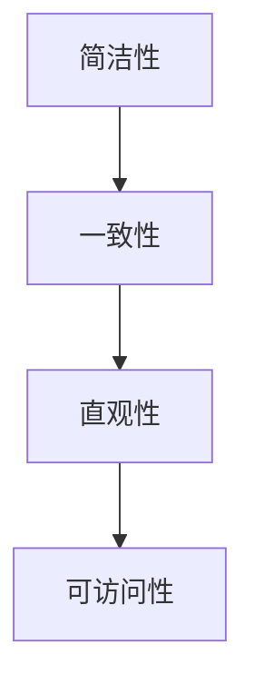

**核心算法原理讲解：**

用户交互设计原则的核心在于提供良好的用户体验。以下是一个简单的用户交互设计流程的伪代码示例：

```python
# 伪代码：用户交互设计流程
def design_user_interface():
    # 确保界面简洁
    ensure_simplicity()

    # 确保界面一致
    ensure_consistency()

    # 确保界面直观
    ensure_intuitiveness()

    # 确保界面可访问
    ensure_accessibility()

    # 返回设计的用户界面
    return user_interface
```

**数学模型和公式：**

在用户交互设计中，可以使用用户体验评分模型（User Experience Score Model）来衡量用户界面的质量。以下是一个简单的用户体验评分计算公式：

$$
UX_Score = \frac{Simplicity + Consistency + Intuitiveness + Accessibility}{4}
$$

**举例说明：**

假设我们设计了一门编程课程的用户交互界面，通过以下方法来确保其简洁性、一致性、直观性和可访问性：

1. **简洁性**：删除不必要的功能按钮，只保留核心的功能，使界面更加简洁。
2. **一致性**：使用相同的颜色和字体，确保不同页面和功能之间的视觉一致性。
3. **直观性**：通过清晰的图标和布局，使用户能够快速理解界面功能。
4. **可访问性**：添加屏幕阅读器支持，确保视力障碍者也能方便地使用界面。

通过这些措施，我们可以提高用户交互界面的质量，从而提升用户的学习体验。

**10.2 反馈系统的重要性**

**核心概念与联系：**

反馈系统在知识付费课程中起着至关重要的作用。通过收集和分析用户反馈，课程开发者能够了解用户的需求和痛点，及时进行课程优化，提高用户满意度和课程质量。

1. **改进课程内容**：用户反馈可以帮助课程开发者发现课程中存在的问题，如知识点讲解不清、实战项目难度不合适等，从而进行内容改进。
2. **优化教学策略**：用户反馈提供了关于教学方法和互动环节的宝贵意见，有助于课程开发者调整教学策略，提高教学效果。
3. **提升用户参与度**：通过反馈系统，用户感到自己的声音被听到，这增加了他们对课程的参与感和忠诚度。

**Mermaid 流程图：**

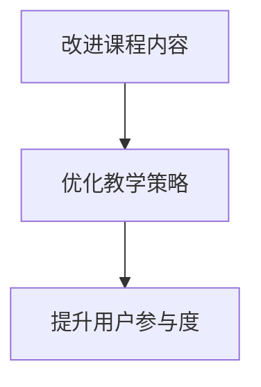

**核心算法原理讲解：**

用户反馈系统的核心在于反馈数据的收集和分析。以下是一个简单的用户反馈收集与分析流程的伪代码示例：

```python
# 伪代码：用户反馈系统
def collect_and_analyze_feedback(feedback_data):
    # 初始化反馈数据结构
    feedback_results = {}

    # 分析反馈数据
    for feedback in feedback_data:
        if "内容改进" in feedback:
            feedback_results["内容改进"] += 1
        elif "教学策略" in feedback:
            feedback_results["教学策略"] += 1

    # 返回分析结果
    return feedback_results
```

**数学模型和公式：**

用户反馈分析可以使用情感分析模型（Sentiment Analysis Model）来评估用户的满意度。以下是一个简单的情感分析计算公式：

$$
Sentiment_Score = \frac{Positive_Reviews - Negative_Reviews}{Total_Reviews}
$$

**举例说明：**

假设我们收集了100份用户反馈，通过情感分析发现，有70份反馈为正面，30份为负面。根据计算，用户满意度为：

$$
Sentiment_Score = \frac{70 - 30}{100} = 0.4
$$

这表明用户对课程的总体满意度为40%。基于这一分析结果，课程开发者可以采取措施，如改进课程内容、调整教学策略，以提高用户满意度。

通过设计良好的用户交互界面和有效的反馈系统，我们可以提高知识付费课程的用户体验和课程质量，从而实现课程的长期成功。

### **11. 数据分析与营销工具应用**

在知识付费课程的开发和运营过程中，数据分析与营销工具的应用至关重要。通过这些工具，课程开发者可以深入了解用户行为，优化营销策略，从而提高课程的用户转化率和市场份额。

**11.1 数据分析工具的选择与应用**

**核心概念与联系：**

数据分析工具是收集、处理和分析用户数据的重要工具。选择合适的工具，能够帮助课程开发者快速获取有价值的信息，从而优化课程设计和营销策略。

**常见数据分析工具：**

1. **Google Analytics**：Google Analytics 是一款功能强大的数据分析工具，适用于网站和移动应用的流量分析。它能够提供详细的用户行为数据，如访问量、页面浏览量、用户来源等。

2. **百度统计**：百度统计是百度提供的免费数据分析服务，与Google Analytics类似，也提供了丰富的用户行为数据和网站优化建议。

3. **Tableau**：Tableau 是一款专业的数据可视化工具，能够将复杂的用户数据以图表、仪表板等形式进行可视化展示，帮助开发者更直观地理解数据。

4. **Power BI**：Power BI 是微软推出的商业智能工具，提供了丰富的数据连接和可视化功能，适用于企业级的数据分析。

**应用场景：**

- **用户行为分析**：通过数据分析工具，开发者可以了解用户的访问量、页面浏览量、访问时长等关键指标，评估课程的受欢迎程度和用户参与度。
- **用户来源分析**：分析用户来源，可以帮助开发者确定哪些渠道最有效，从而优化营销预算和策略。
- **转化率分析**：通过跟踪用户在购买流程中的行为，如加入购物车、提交表单等，开发者可以优化购买流程，提高转化率。

**Mermaid 流程图：**

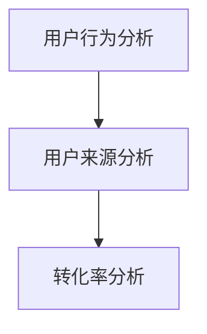

**核心算法原理讲解：**

数据分析工具通常基于统计分析和机器学习算法来处理用户数据。以下是一个简单的用户行为分析流程的伪代码示例：

```python
# 伪代码：用户行为分析
def analyze_user_behavior(data):
    # 初始化用户行为数据字典
    user_behavior = {}

    # 遍历用户数据，统计行为
    for user in data:
        if "访问量" in user:
            user_behavior["访问量"] += 1
        if "页面浏览量" in user:
            user_behavior["页面浏览量"] += 1
        if "访问时长" in user:
            user_behavior["访问时长"] += user["访问时长"]

    # 返回用户行为数据
    return user_behavior
```

**数学模型和公式：**

在用户行为分析中，可以使用留存率模型（Retention Rate Model）来衡量用户的持续参与度。以下是一个简单的留存率计算公式：

$$
Retention_Rate = \frac{月末留存用户数}{月初用户数} \times 100\%
$$

**举例说明：**

假设我们对一门编程课程的用户行为数据进行分析，发现月初有1000名用户，月末有700名用户仍然活跃。通过计算，我们可以得出课程的用户留存率为：

$$
Retention_Rate = \frac{700}{1000} \times 100\% = 70\%
$$

这表明有70%的用户在一个月后仍然活跃，这一数据对于课程开发者来说是非常重要的，因为它直接反映了课程的吸引力和用户满意度。

**11.2 营销工具的使用与优化**

**核心概念与联系：**

营销工具是用于推广知识付费课程的重要手段，包括广告投放、电子邮件营销、社交媒体推广等。选择合适的营销工具，并对其进行优化，能够显著提高课程的曝光度和用户转化率。

**常用营销工具：**

1. **搜索引擎广告**：如Google AdWords、百度推广，通过关键词竞价，将课程广告展示在搜索结果页面上。

2. **社交媒体广告**：如Facebook广告、抖音广告，通过平台广告系统，将课程广告推送给潜在用户。

3. **电子邮件营销**：通过定期发送电子邮件，向潜在用户和现有用户推荐课程和优惠信息。

4. **内容营销**：通过博客、电子书、视频等高质量内容，吸引用户关注并促进转化。

**优化策略：**

1. **目标受众定位**：通过数据分析，确定目标受众的特征和需求，确保广告和内容能够精准地推送给潜在用户。

2. **广告创意优化**：通过A/B测试，优化广告文案、图片和着陆页，提高广告的点击率和转化率。

3. **营销自动化**：使用营销自动化工具，如HubSpot、Marketo，自动化广告投放、电子邮件发送和用户跟进，提高营销效率。

4. **数据分析与反馈**：通过数据分析工具，监控广告效果和用户行为，根据反馈调整营销策略，实现持续优化。

**Mermaid 流程图：**

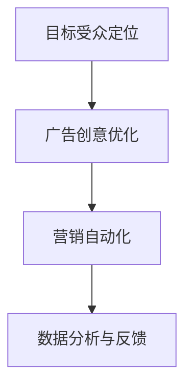

**核心算法原理讲解：**

营销工具的优化通常涉及数据分析和机器学习算法。以下是一个简单的广告优化流程的伪代码示例：

```python
# 伪代码：广告优化
def optimize_advertising(data):
    # 初始化广告优化参数
    ad_params = {}

    # 分析用户行为数据，调整广告参数
    for user in data:
        if "点击率" in user:
            ad_params["点击率"] += user["点击率"]
        if "转化率" in user:
            ad_params["转化率"] += user["转化率"]

    # 返回优化后的广告参数
    return ad_params
```

**数学模型和公式：**

广告优化中的效果评估可以使用转化率模型（Conversion Rate Model）。以下是一个简单的转化率计算公式：

$$
Conversion_Rate = \frac{购买用户数}{点击用户数} \times 100\%
$$

**举例说明：**

假设我们对一门编程课程进行广告投放，统计到1000名点击用户中有200名购买课程。通过计算转化率，我们可以得出：

$$
Conversion_Rate = \frac{200}{1000} \times 100\% = 20\%
$$

这表明广告的转化率为20%。基于这一数据，我们可以进一步优化广告文案、着陆页和推广策略，提高转化率。

通过选择合适的数据分析工具和营销工具，并对其进行优化，课程开发者可以更有效地了解用户需求，推广课程，提高用户转化率和市场份额。

### **12. 课程版权保护与知识产权**

在知识付费课程的开发和推广过程中，课程版权保护与知识产权至关重要。有效的版权保护不仅能够保障课程开发者的权益，还能提升课程的竞争力和市场价值。

**12.1 知识产权保护的重要性**

知识产权，包括版权、商标和专利，是知识付费课程的核心资产。保护知识产权的重要性体现在以下几个方面：

1. **防止侵权**：知识产权保护可以防止他人未经授权使用或复制课程内容，避免经济损失和声誉损害。
2. **提高竞争力**：拥有明确的知识产权保护，可以使课程在市场上具备独特性和竞争力，吸引更多潜在用户。
3. **商业价值**：知识产权是课程商业化的基础，可以为课程开发者带来持续的经济回报。

**12.2 常见的版权保护方法**

**1. 注册版权**：向国家版权局申请版权登记，获得法律上的版权保护。版权登记证书可以作为版权归属的证明，在版权纠纷中具有法律效力。

**2. 数字版权保护**：使用数字水印、加密技术等手段，防止课程内容被非法复制和传播。例如，通过在视频和音频中嵌入数字水印，追踪非法传播者。

**3. 知识产权法律顾问**：聘请专业的知识产权法律顾问，协助处理版权登记、维权和纠纷解决等法律事务。

**4. 监测与预警**：通过在线监测工具，定期搜索和监控课程内容的网络传播情况，及时发现侵权行为并采取法律措施。

**5. 签订合同**：与学员和合作伙伴签订知识产权保护协议，明确知识产权的归属和使用权限，避免侵权纠纷。

**12.3 实际案例与经验分享**

**案例1：某编程课程版权保护**

某知名在线编程教育平台通过以下措施保护其课程的版权：

1. **版权登记**：所有课程内容均在国家版权局进行了版权登记，确保版权法律效力。
2. **数字版权保护**：课程视频和文档均使用了数字水印技术，一旦发现非法传播，能够迅速追踪侵权来源。
3. **在线监测**：使用专业的版权监测工具，每天自动搜索和监控课程内容的网络传播情况。
4. **法律维权**：与专业知识产权律师事务所合作，制定维权策略，对侵权行为采取法律手段。

通过这些措施，该平台有效保护了课程版权，避免了大量经济损失，同时也提升了课程的品牌价值和用户信任度。

**经验分享**：

1. **重视版权保护**：从课程开发初期就开始重视版权保护，制定详细的保护策略。
2. **综合运用多种保护手段**：结合版权登记、数字版权保护、在线监测和法律维权等多种手段，形成全面的保护体系。
3. **持续更新与优化**：随着课程内容的更新和变化，及时调整保护策略，确保版权保护措施始终有效。

通过上述措施和经验，课程开发者可以有效地保护课程版权，提升课程的市场竞争力，实现可持续的商业发展。

### **13. 课程制作与上线流程**

成功打造一门知识付费课程不仅需要深入的内容策划和教学设计，还需要一个清晰、高效的制作和上线流程。以下将详细探讨课程制作与上线的准备工作、具体制作流程以及上线前的最后检查，并提供一些实战指南。

**13.1 课程制作前的准备工作**

**核心概念与联系：**

在开始课程制作之前，充分的准备工作是确保项目顺利进行的关键。以下是一些关键的准备工作：

1. **需求分析**：深入了解目标用户的需求，确定课程的核心内容和目标受众。
2. **资源准备**：准备好所需的资源，包括教学内容、教学工具、技术平台等。
3. **团队搭建**：组建专业的制作团队，包括课程设计师、讲师、技术支持等。
4. **时间规划**：制定详细的时间规划，包括课程开发、测试、上线等各个阶段的期限。

**准备工作流程：**

1. **需求分析**：通过市场调研、用户访谈等方式，收集用户需求和反馈，确定课程的核心内容和方向。
2. **资源评估**：评估所需的教学资源和工具，如课程大纲、PPT、视频素材、编程环境等。
3. **团队组建**：根据项目需求，组建专业的制作团队，明确各成员的角色和职责。
4. **时间规划**：制定详细的时间表，包括每个阶段的开始和结束时间，确保项目按时完成。

**Mermaid 流程图：**

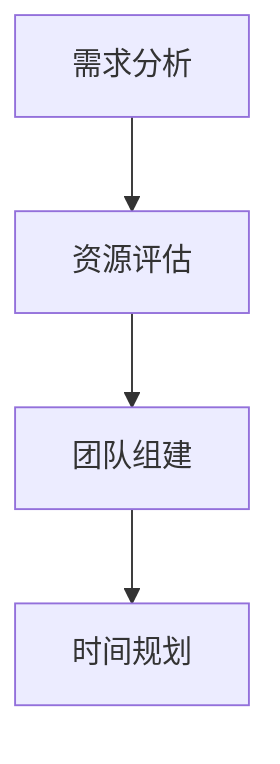

**核心算法原理讲解：**

在需求分析阶段，可以使用用户画像和需求聚类算法，帮助识别目标用户群体和需求特征。以下是一个简单的用户画像构建的伪代码示例：

```python
# 伪代码：用户画像构建
def build_user_profile(data):
    # 初始化用户画像字典
    user_profiles = []

    # 遍历数据，构建用户画像
    for user in data:
        profile = {
            "年龄": user["年龄"],
            "职业": user["职业"],
            "兴趣": user["兴趣"],
            "需求": user["需求"]
        }
        user_profiles.append(profile)

    # 返回用户画像列表
    return user_profiles
```

**数学模型和公式：**

需求聚类可以使用K-means算法，将用户划分为不同的需求群体。以下是一个简单的K-means算法伪代码示例：

```python
# 伪代码：K-means算法
def k_means(data, k):
    # 初始化k个中心点
    centroids = initialize_centroids(data, k)

    # 循环迭代，直到收敛
    while not converged:
        # 计算每个数据点的簇分配
        clusters = assign_clusters(data, centroids)

        # 更新中心点
        centroids = update_centroids(clusters)

    # 返回聚类结果
    return clusters, centroids
```

**举例说明：**

假设我们对1000名潜在用户进行了调研，通过K-means算法将用户划分为3个群体。根据用户群体的特征，我们可以制定针对性的课程内容，确保课程内容与用户需求高度匹配。

**13.2 制作流程详解**

**核心概念与联系：**

课程制作流程包括内容编写、教学素材制作、课程整合和测试等环节，每个环节都需要精心设计和执行。

**制作流程步骤：**

1. **内容编写**：根据课程大纲，编写详细的课程内容，包括文本、PPT、脚本等。
2. **教学素材制作**：制作课程所需的教学素材，如视频、音频、图表等。
3. **课程整合**：将编写的内容和教学素材整合到课程平台，确保课程结构清晰、逻辑连贯。
4. **课程测试**：进行课程测试，包括单元测试、集成测试和用户测试，确保课程质量和用户体验。

**Mermaid 流程图：**

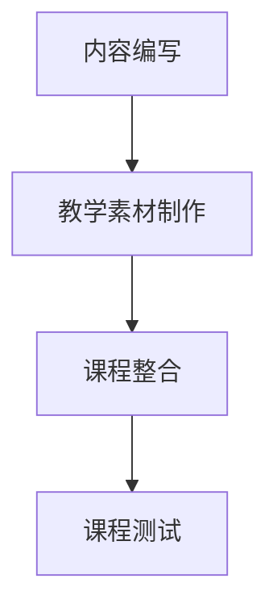

**核心算法原理讲解：**

在课程整合环节，可以使用内容管理系统（CMS）进行内容管理和发布。以下是一个简单的CMS使用流程的伪代码示例：

```python
# 伪代码：CMS使用流程
def manage_content(content):
    # 上传内容
    upload_content(content)

    # 编辑内容
    edit_content(content)

    # 发布内容
    publish_content(content)

    # 返回发布后的内容
    return published_content
```

**数学模型和公式：**

在课程测试阶段，可以使用教学质量评估模型（Teaching Quality Assessment Model）来评估课程质量。以下是一个简单的教学质量评估公式：

$$
Teaching_Quality = \frac{学生满意度 + 学习效果}{2}
$$

**举例说明：**

假设我们对一门编程课程进行了用户测试，收集到100份用户反馈，其中80份表示满意度高，90份表示学习效果显著。通过计算，我们可以得出课程的教学质量：

$$
Teaching_Quality = \frac{80 + 90}{2} = 85
$$

这表明课程的教学质量评分为85分，是一个较高的评分，表明课程内容得到了用户的认可。

**13.3 上线前的最后检查**

**核心概念与联系：**

上线前的最后检查是确保课程顺利发布和用户顺利学习的重要环节。以下是一些关键检查点：

1. **功能检查**：确保所有功能正常运行，如课程播放、互动环节、购买流程等。
2. **性能检查**：进行负载测试和性能测试，确保课程在高并发情况下的稳定性和响应速度。
3. **安全性检查**：确保课程内容和用户数据的安全，包括数据加密、权限控制等。
4. **用户体验检查**：通过模拟用户操作，检查用户界面的友好性和易用性。

**检查步骤：**

1. **功能检查**：逐个测试课程中的所有功能，确保无任何缺陷或错误。
2. **性能检查**：使用工具（如LoadRunner）进行负载测试，模拟高并发情况，确保系统稳定。
3. **安全性检查**：检查系统中的安全设置，确保用户数据安全，包括数据加密、防火墙设置等。
4. **用户体验检查**：邀请用户进行试学，收集反馈，根据反馈调整和优化界面和功能。

**Mermaid 流程图：**

```mermaid
graph TD
    A[功能检查] --> B[性能检查]
    B --> C[安全性检查]
    C --> D[用户体验检查]
```

**实战指南：**

1. **提前规划**：提前规划上线前的检查流程和时间，确保每个环节都有充足的时间进行。
2. **团队协作**：确保团队成员在上线前进行充分的沟通和协作，明确各自职责和任务。
3. **备份与恢复**：在上线前做好数据备份和恢复方案，以应对可能出现的问题。

通过详细的准备工作、科学的制作流程和严格的上线前检查，课程开发者可以确保知识付费课程的顺利发布，为用户提供高质量的学习体验。

### **14. 高转化率课程的评估与迭代**

在知识付费课程的设计与推广过程中，评估与迭代是确保课程持续改进、保持市场竞争力的重要环节。通过科学的评估方法和持续迭代策略，课程开发者可以不断提高课程质量，优化用户体验，从而实现高转化率。

**14.1 评估指标与标准**

**核心概念与联系：**

评估指标是衡量课程质量与市场表现的重要工具。合理的评估指标体系能够帮助课程开发者全面了解课程的优缺点，为迭代提供有力依据。以下是一些关键评估指标：

1. **用户转化率**：衡量用户从潜在用户转化为购买者的比例，反映课程的吸引力。
2. **用户留存率**：衡量用户在购买课程后继续参与和学习的比例，反映课程的持续性和用户满意度。
3. **课程满意度**：通过用户评价和反馈，评估用户对课程内容的满意程度。
4. **学习效果**：通过课程测试和用户反馈，评估用户在课程学习后所获得的知识和技能。

**Mermaid 流程图：**

```mermaid
graph TD
    A[用户转化率] --> B[用户留存率]
    B --> C[课程满意度]
    C --> D[学习效果]
```

**核心算法原理讲解：**

评估指标的计算通常涉及统计分析方法。以下是一个简单的用户转化率计算公式：

$$
User_Conversion_Rate = \frac{Purchased_Users}{Total_Users} \times 100\%
$$

以下是一个简单的用户转化率计算伪代码示例：

```python
# 伪代码：计算用户转化率
def calculate_conversion_rate(purchased_users, total_users):
    conversion_rate = (purchased_users / total_users) * 100
    return conversion_rate
```

**数学模型和公式：**

用户留存率可以通过以下公式计算：

$$
User_Retention_Rate = \frac{Month_End_Active_Users}{Month_Begin_Users} \times 100\%
$$

以下是一个简单的用户留存率计算伪代码示例：

```python
# 伪代码：计算用户留存率
def calculate_retention_rate(month_end_active_users, month_begin_users):
    retention_rate = (month_end_active_users / month_begin_users) * 100
    return retention_rate
```

**举例说明：**

假设某门编程课程在一月初有1000名用户，一月底有700名用户仍然活跃。通过计算，我们可以得出用户留存率为：

$$
User_Retention_Rate = \frac{700}{1000} \times 100\% = 70\%
$$

这意味着有70%的用户在一个月后仍然参与课程学习，这是一个良好的指标，表明课程具有较高的用户粘性。

**14.2 数据分析与评估**

**核心概念与联系：**

数据分析是评估课程效果的重要手段。通过数据分析，课程开发者可以深入了解用户行为，发现潜在问题，从而制定针对性的优化策略。

**数据分析方法：**

1. **行为数据分析**：分析用户在课程平台上的行为数据，如访问量、学习时长、互动情况等，评估课程的受欢迎程度和用户参与度。
2. **反馈数据分析**：收集用户反馈，分析用户对课程内容、教学方法、互动环节等的评价，识别用户的满意度和需求。
3. **销售数据分析**：分析课程的销售数据，如购买量、销售额、购买渠道等，评估课程的商业表现和市场吸引力。

**Mermaid 流程图：**

```mermaid
graph TD
    A[行为数据分析] --> B[反馈数据分析]
    B --> C[销售数据分析]
```

**核心算法原理讲解：**

行为数据分析可以使用用户行为路径追踪方法，以下是一个简单的用户行为路径追踪伪代码示例：

```python
# 伪代码：用户行为路径追踪
def track_user_behavior(behavior_data):
    # 初始化用户行为路径
    user_paths = []

    # 遍历行为数据，构建用户行为路径
    for behavior in behavior_data:
        path = []
        for step in behavior["steps"]:
            path.append(step["action"])
        user_paths.append(path)

    # 返回用户行为路径
    return user_paths
```

**数学模型和公式：**

用户行为路径追踪可以使用马尔可夫链模型（Markov Chain Model），以下是一个简单的马尔可夫链模型伪代码示例：

```python
# 伪代码：马尔可夫链模型
def markov_chain(transition_matrix, initial_state):
    # 初始化状态序列
    state_sequence = [initial_state]

    # 进行随机游走
    for _ in range(num_steps):
        current_state = state_sequence[-1]
        next_state = random.choice(transition_matrix[current_state])
        state_sequence.append(next_state)

    # 返回状态序列
    return state_sequence
```

**举例说明：**

假设我们对一门编程课程的用户行为数据进行分析，使用马尔可夫链模型追踪用户在学习过程中的行为路径。通过分析行为路径，我们可以发现用户的学习模式和潜在问题，从而优化课程内容和互动设计。

**14.3 迭代与改进策略**

**核心概念与联系：**

迭代与改进是知识付费课程持续发展的关键。通过定期评估和持续优化，课程开发者可以不断改进课程质量，提高用户满意度和转化率。

**迭代与改进步骤：**

1. **数据分析**：定期进行数据分析，收集用户反馈和行为数据，评估课程表现。
2. **问题识别**：根据数据分析结果，识别课程中的问题和不足，如知识点讲解不清、互动环节不足等。
3. **优化方案**：制定具体的优化方案，包括内容改进、教学方法优化、互动设计调整等。
4. **实施与测试**：实施优化方案，并进行小规模测试，评估优化效果。
5. **反馈收集**：收集用户对新方案的反馈，再次进行评估和改进。

**Mermaid 流程图：**

```mermaid
graph TD
    A[数据分析] --> B[问题识别]
    B --> C[优化方案]
    C --> D[实施与测试]
    D --> E[反馈收集]
```

**核心算法原理讲解：**

迭代与改进过程中，可以使用反馈循环模型（Feedback Loop Model）来指导持续优化。以下是一个简单的反馈循环模型伪代码示例：

```python
# 伪代码：反馈循环模型
def feedback_loop(current_state, improvement_plan):
    # 实施改进计划
    apply_improvement(current_state, improvement_plan)

    # 进行新一轮评估
    new_state = evaluate_state()

    # 返回新状态
    return new_state
```

**数学模型和公式：**

在反馈循环模型中，可以使用性能评估函数（Performance Assessment Function）来衡量优化效果。以下是一个简单的性能评估函数伪代码示例：

```python
# 伪代码：性能评估函数
def performance_assessment(current_performance, new_performance):
    improvement = new_performance - current_performance
    return improvement
```

**举例说明：**

假设我们对一门编程课程进行了内容优化，并通过测试发现用户满意度提高了10个百分点。通过性能评估，我们可以确定优化方案的有效性，并进一步改进课程。

通过科学的评估方法和持续迭代策略，课程开发者可以不断提高课程质量，优化用户体验，实现高转化率。

### **15. 成功案例分析与启示**

在知识付费市场中，成功案例众多，它们为我们提供了宝贵的经验和启示。以下将分析两个具有代表性的成功案例，探讨其成功因素，并总结对构建高转化率知识付费课程的启示。

**15.1 成功案例1：某知名编程课程**

**案例介绍：**

某知名在线编程课程平台，通过精心设计的内容、创新的教学方法和高效的营销策略，成功吸引了大量用户，实现了高转化率。该平台课程涵盖Python、Java、前端开发等多个领域，用户群体广泛。

**成功因素分析：**

1. **高质量内容**：课程内容涵盖基础知识、实战项目和技术前沿，内容丰富且具有实用性。每个模块都经过精心设计和反复测试，确保用户能够轻松掌握。
2. **互动与反馈机制**：平台提供了丰富的互动功能，如在线讨论区、答疑服务、实战任务等，鼓励用户参与和学习。通过实时互动，用户能够及时解决问题，提高学习效果。
3. **个性化推荐**：平台根据用户的学习历史和兴趣，提供个性化的课程推荐，提高了课程的匹配度和用户粘性。
4. **营销策略**：平台通过社交媒体推广、内容营销、合作推广等多种渠道，提高了课程的曝光度和用户转化率。

**启示与借鉴：**

1. **注重内容质量**：高质量的内容是知识付费课程成功的关键，应确保课程内容的实用性、全面性和前瞻性。
2. **增强互动与反馈**：通过互动和反馈机制，提高用户的参与感和学习效果，这是提升用户满意度和转化率的重要手段。
3. **个性化推荐**：根据用户数据，提供个性化的课程推荐，提高课程的匹配度和用户体验。

**15.2 成功案例2：某人工智能课程**

**案例介绍：**

某人工智能课程通过独特的教学设计和创新的教学方法，迅速在市场上脱颖而出。该课程以深度学习为核心，结合实际项目案例，帮助学员快速掌握人工智能技术。

**成功因素分析：**

1. **故事化教学**：课程采用故事化教学策略，通过生动的案例和故事情节，将复杂的人工智能概念讲解得通俗易懂。这种方法不仅提高了学习的趣味性，还增强了学员的注意力。
2. **实战项目**：课程中包含多个实战项目，学员可以在实际项目中应用所学知识，提高了学习效果和实践能力。
3. **专家导师制**：课程配备了专业的导师团队，提供一对一的辅导和答疑服务，确保学员能够及时解决学习中遇到的问题。
4. **课程更新**：课程内容定期更新，保持与行业前沿的同步，确保学员掌握最新的技术和知识。

**启示与借鉴：**

1. **故事化教学**：通过故事化教学，提高课程的趣味性和吸引力，增强学员的学习动力。
2. **实战项目**：通过实战项目，将理论知识与实际应用相结合，提高学员的实践能力和就业竞争力。
3. **专家辅导**：配备专业的导师团队，提供高质量的辅导服务，确保学员能够顺利完成学习。

**总结：**

成功案例表明，高转化率的知识付费课程离不开高质量的内容、互动与反馈机制、个性化推荐、创新的营销策略以及实战项目的支持。通过借鉴这些成功经验，我们可以为构建自己的知识付费课程提供有益的启示。

### **附录A：知识付费课程开发工具与资源**

在知识付费课程的开发过程中，选择合适的工具和资源是确保项目顺利进行、提升课程质量的关键。以下将对一些常用的知识付费课程开发工具和资源进行介绍，并提供一些推荐的资源。

#### **A.1 常用工具介绍**

**1. 课程制作工具：**

- **Teachable**：Teachable 是一款功能强大的在线教育平台，支持课程内容管理、用户管理、营销推广等功能。用户可以通过Teachable轻松创建、发布和销售自己的在线课程。

- **Kajabi**：Kajabi 是一款综合性的在线营销和销售平台，提供包括课程制作、网站建设、营销自动化等功能。Kajabi 的用户界面友好，适合初学者快速上手。

- **Thinkific**：Thinkific 是一款专业的在线学习平台，支持多种内容类型，如视频、文档、音频等，并提供强大的课程管理功能。

**2. 视频编辑工具：**

- **Adobe Premiere Pro**：Adobe Premiere Pro 是一款功能强大的视频编辑软件，适用于专业级的视频制作。它提供了丰富的编辑功能和特效，能够帮助用户制作高质量的视频课程。

- **Final Cut Pro X**：Final Cut Pro X 是苹果公司推出的一款视频编辑软件，适用于Mac用户。它拥有直观的用户界面和强大的编辑功能，能够帮助用户快速制作高质量的视频。

- **Camtasia**：Camtasia 是一款易于使用的视频编辑软件，适用于教育工作者和初学者。它提供了丰富的视频编辑工具和动画效果，能够帮助用户快速制作专业的视频课程。

**3. 数据分析工具：**

- **Google Analytics**：Google Analytics 是一款免费的数据分析工具，提供了丰富的用户行为数据，如访问量、页面浏览量、用户来源等。通过Google Analytics，用户可以深入了解课程的表现和用户行为。

- **Google Search Console**：Google Search Console 是一款用于搜索引擎优化（SEO）的工具，提供了关于网站在搜索引擎中表现的数据，如关键词排名、点击率等。

- **Tableau**：Tableau 是一款专业的数据可视化工具，能够将复杂的数据以图表、仪表板等形式进行可视化展示，帮助用户更直观地理解数据。

#### **A.2 资源推荐**

**1. 开源资源和教材：**

- **GitHub**：GitHub 是一个庞大的开源社区，用户可以在这里找到大量的开源项目、教程和资源，包括编程语言、框架、工具等。

- **Coursera**：Coursera 提供了丰富的在线课程资源，涵盖了多个领域，如计算机科学、数据科学、人工智能等。用户可以在这里找到高质量的在线课程，进行深入学习。

- **MIT OpenCourseWare**：MIT OpenCourseWare 提供了MIT的许多课程资源，包括课程大纲、讲义、视频等，用户可以免费访问和学习。

**2. 学习社区和论坛：**

- **Stack Overflow**：Stack Overflow 是一个面向开发者的问答社区，用户可以在上面提问和回答问题，解决编程难题。

- **Reddit**：Reddit 是一个用户活跃的社交新闻网站，用户可以在不同的子版块中讨论各种话题，包括编程、人工智能等。

- **知乎**：知乎是一个中文问答社区，用户可以在这里提问、回答问题，分享知识和经验。

#### **A.3 开发社区与论坛**

**1. 知识付费课程开发论坛：**

- **教育技术论坛**：教育技术论坛是一个专注于教育技术领域的论坛，用户可以在这里讨论课程设计、教学方法、技术工具等话题。

- **知乎教育版块**：知乎教育版块聚集了大量教育工作者和爱好者，用户可以在这里提问、回答问题，交流课程开发和教学经验。

**2. 技术社区与论坛：**

- **GitHub**：GitHub 是一个技术社区，用户可以在这里找到各种开源项目和技术文档，参与技术讨论和交流。

- **Stack Overflow**：Stack Overflow 是一个编程问答社区，用户可以在这里提问和回答编程问题，解决开发中的难题。

通过上述工具和资源的合理运用，课程开发者可以有效地提升知识付费课程的质量和用户体验，实现课程的成功开发和推广。

### **附录B：术语表**

为了确保读者能够全面理解本文中的专业术语，以下对一些常见术语进行解释。

#### **B.1 常见术语解释**

1. **知识付费**：指用户通过支付费用获取专业人士提供的知识、技能或经验。
2. **用户转化率**：指用户从潜在用户转化为购买者的比例。
3. **用户留存率**：指用户在购买课程后继续参与和学习的比例。
4. **内容管理系统（CMS）**：用于创建、发布、管理和分发数字内容的应用程序。
5. **互动与反馈机制**：指课程中用于用户互动和反馈的系统，如讨论区、答疑服务等。
6. **数据分析**：指对用户数据、学习行为等进行分析，以获取有价值的信息。
7. **情感分析**：指通过自然语言处理技术，对用户反馈进行情感倾向分析。
8. **营销自动化**：指使用工具自动执行营销任务，如广告投放、电子邮件发送等。

#### **B.2 专业知识解释**

1. **K-means算法**：一种聚类算法，用于将数据点分为多个集群，每个集群由一个中心点表示。
2. **留存率模型**：用于衡量用户持续参与度的数学模型，如月度留存率。
3. **转化率模型**：用于衡量用户从访问到转化的数学模型，如点击转化率。
4. **内容结构化**：指将非结构化的内容转换为结构化数据，以便于管理和检索。
5. **用户画像**：指根据用户数据构建的用户特征模型，用于用户行为分析和个性化推荐。
6. **数字版权保护**：指使用技术手段保护数字内容版权，如数字水印、加密等。

通过了解这些术语的含义，读者能够更好地理解本文中的专业知识和概念，从而提升对知识付费课程设计和营销策略的理解。

