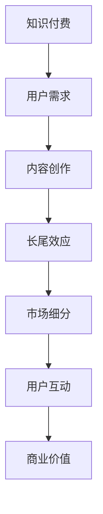
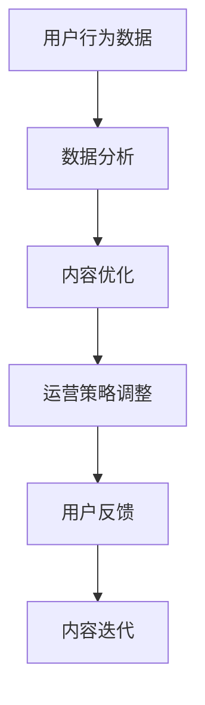

                 

### 《程序员如何构建知识付费的长尾效应》

> 关键词：知识付费、长尾效应、内容创作、社交媒体、付费机制、数据分析

> 摘要：本文旨在探讨程序员如何利用知识付费的长尾效应，通过内容创作、社交媒体运营、付费机制设计等策略，构建可持续的知识付费业务，实现个人品牌和商业价值的提升。

# 第一部分：基础知识与市场环境分析

## 第1章：知识付费概述

### 1.1 知识付费的定义与背景

**知识付费的定义**

知识付费是指用户为获取特定知识或技能，向知识提供者支付一定费用的一种交易方式。在互联网时代，知识付费逐渐成为一种新兴的商业模式，打破了传统教育模式的时间和空间限制，为用户提供了更加灵活和个性化的学习方式。

**知识付费的发展背景**

知识付费的发展离不开以下几个关键因素：

1. **互联网普及**：互联网技术的飞速发展，使得信息传播更加便捷，知识获取的成本大大降低。
2. **内容消费升级**：随着用户消费水平的提高，对高质量内容的需求日益增长，知识付费成为满足这一需求的重要途径。
3. **教育培训行业变革**：在线教育平台的兴起，改变了传统教育模式，使得知识付费成为教育培训行业的重要一环。

### 1.2 知识付费市场的现状

**市场规模**

据统计，2021年全球知识付费市场规模已超过2000亿元，预计未来将继续保持快速增长。中国市场作为全球最大的知识付费市场，占据着主导地位。

**用户特征**

知识付费用户主要集中在以下几类群体：

1. **年轻化**：18-35岁的年轻用户群体是知识付费市场的主要消费者。
2. **高学历**：具有本科及以上学历的用户占比较大，他们更愿意为高质量的知识内容付费。

### 1.3 程序员在知识付费中的角色

**内容创作者**

程序员可以分享自己的编程经验、技术教程等，为其他开发者提供有价值的内容。

**平台开发者**

程序员可以参与知识付费平台的技术开发与优化，为平台的稳定运行和用户体验提供支持。

**用户**

程序员也是知识付费市场的重要消费群体，他们需要不断学习新的技术知识和技能，以提升自己的职业竞争力。

## 第2章：长尾效应原理

### 2.1 长尾效应的概念

**长尾效应的定义**

长尾效应是指大量小众市场累积起来，可以和主流市场的需求相当，甚至更大。在互联网时代，长尾效应得以充分发挥，因为互联网具有信息传播广、成本低的特性。

**长尾效应的特征**

1. **多样性**：长尾效应能够满足大量不同用户的需求，涵盖各种小众市场。
2. **低成本**：通过互联网，降低了生产与营销成本，使得小众市场得以盈利。
3. **可持续性**：长尾效应是长期积累的结果，能够形成稳定的市场。

### 2.2 长尾效应在知识付费中的应用

**内容多样化**

程序员可以根据不同的用户需求，创作多种类型的知识内容，满足小众市场的需求。

**小众市场开发**

针对特定领域的专业知识，程序员可以开发深度内容，吸引特定用户群体。

### 2.3 程序员如何利用长尾效应

**内容细分**

程序员需要针对特定领域或技能点，创作深度内容，满足长尾市场的需求。

**社区运营**

建立用户社区，促进用户互动，提高用户粘性，进一步挖掘长尾效应。

## 第3章：内容创作与规划

### 3.1 内容创作的重要性

**知识传播**

内容创作是知识付费的核心，通过高质量的内容，程序员可以传播自己的知识和经验。

**用户粘性**

高质量的内容可以提高用户的粘性和付费意愿，从而促进知识付费业务的持续发展。

### 3.2 程序员如何选择适合的内容主题

**自身优势**

程序员应选择自己擅长的领域，以此为基础创作内容。

**市场调研**

通过市场调研，了解用户需求，找到潜在的内容主题。

**竞品分析**

分析同类知识内容的市场表现，找到差异化竞争点。

### 3.3 内容规划的策略与方法

**内容类型**

程序员可以根据用户需求，创作不同类型的内容，如教程、案例分析、技术分享等。

**内容形式**

结合多媒体元素，如视频、图文、直播等，提高内容的表现力。

**内容迭代**

根据用户反馈，持续优化内容，提高内容的实用性和吸引力。

# 第二部分：构建知识付费策略

## 第4章：打造高质量内容

### 4.1 高质量内容的标准

**实用性**

内容应具有实际应用价值，能够解决用户的实际问题。

**专业性**

内容应体现程序员的专长和独特见解，具有专业性和权威性。

**易懂性**

内容应通俗易懂，便于用户理解和掌握。

### 4.2 程序员如何提升内容质量

**深度学习**

程序员应不断学习新技术，提升自己的专业水平。

**实践验证**

通过实际项目经验，验证内容的实用性和可靠性。

**用户反馈**

收集用户反馈，针对用户需求，持续优化内容。

### 4.3 内容的优化与迭代

**数据分析**

通过数据分析，了解用户喜好，优化内容结构。

**用户互动**

与用户互动，了解用户需求，调整内容方向。

**定期更新**

定期更新内容，保持内容的时效性和实用性。

## 第5章：利用社交媒体拓展用户基础

### 5.1 社交媒体在知识付费中的价值

**扩大影响力**

通过社交媒体，程序员可以扩大自己的影响力，吸引更多用户。

**降低推广成本**

社交媒体具有低成本、高效率的特点，适合知识付费业务的推广。

**提升用户体验**

通过社交媒体，程序员可以与用户互动，提高用户体验。

### 5.2 程序员如何利用社交媒体推广内容

**选择合适平台**

根据用户特点，选择合适的社交媒体平台，如GitHub、知乎、微博、抖音等。

**制定推广策略**

结合平台特点，制定个性化的推广策略，提高内容曝光度。

**互动与分享**

积极参与社交媒体互动，分享优质内容，提高用户粘性。

### 5.3 社交媒体营销的策略与实践

**内容营销**

通过高质量的内容，吸引用户关注和转发。

**互动营销**

与用户互动，提高用户参与度和忠诚度。

**社群营销**

建立用户社群，促进用户互动，形成稳定的用户基础。

## 第6章：构建付费机制

### 6.1 付费机制的设计原则

**公平性**

付费机制应公平合理，保障用户权益。

**灵活性**

付费机制应具有灵活性，满足不同用户的需求。

**可持续性**

付费机制应具备可持续性，保障知识付费业务的长期发展。

### 6.2 程序员如何设置合理的价格策略

**市场调研**

了解市场行情，设定合理的价格区间。

**成本分析**

结合内容创作成本和市场定价，设定合理的价格。

**用户调研**

通过用户调研，了解用户对价格的接受程度。

### 6.3 付费模式的创新与实践

**订阅模式**

通过订阅模式，提供定期更新内容，吸引用户持续付费。

**按需付费**

针对特定内容，提供按需付费服务，满足用户个性化需求。

**增值服务**

提供增值服务，如一对一咨询、实战指导等，提高用户满意度。

## 第7章：持续优化与成长

### 7.1 数据分析与反馈的重要性

**数据分析**

通过数据分析，了解用户行为，优化内容策略。

**用户反馈**

收集用户反馈，了解用户需求，调整内容方向。

**市场分析**

通过市场分析，了解行业趋势，预测未来发展方向。

### 7.2 程序员如何进行数据驱动优化

**建立数据分析体系**

搭建数据分析体系，实时监控用户行为和数据变化。

**数据可视化**

通过数据可视化，直观展示数据趋势，帮助决策。

**数据驱动决策**

基于数据分析，制定优化策略，驱动内容创作和业务发展。

### 7.3 知识付费事业的长期发展策略

**持续创新**

紧跟行业趋势，不断进行内容创新和业务模式创新。

**品牌建设**

提升个人品牌价值，扩大影响力。

**多元化发展**

探索多元化业务领域，实现知识付费事业的长期发展。

# 第三部分：案例分析与实战

## 第8章：成功案例分析

### 8.1 国内知识付费平台的成功案例

**知乎Live**

**成功原因**：知乎Live通过优质内容、互动性强等特点，吸引了大量用户。

**关键要素**：优质内容、互动性强、价格合理。

**经验借鉴**：程序员可以借鉴知乎Live的内容创作和推广策略。

### 8.2 国外知识付费平台的成功案例

**Udemy**

**成功原因**：Udemy通过丰富的课程资源和灵活的付费模式，赢得了用户的青睐。

**关键要素**：课程资源丰富、付费模式灵活、用户满意度高。

**经验借鉴**：程序员可以学习Udemy的课程开发和运营策略。

### 8.3 案例分析中的关键要素

**内容质量**

优质的内容是知识付费业务成功的关键。

**用户互动**

与用户互动，提高用户满意度和忠诚度。

**价格策略**

合理的价格策略可以吸引更多用户。

## 第9章：实战项目指南

### 9.1 项目策划与准备

**项目策划**

明确项目目标、内容主题、受众群体等。

**资源准备**

准备项目所需的资源，如内容素材、技术支持等。

**市场调研**

进行市场调研，了解用户需求和竞品情况。

### 9.2 内容制作与推广

**内容制作**

根据策划，制作高质量的内容。

**内容推广**

通过社交媒体、邮件营销等渠道，推广内容。

**用户互动**

与用户互动，提高用户满意度和忠诚度。

### 9.3 用户反馈与优化

**用户反馈**

收集用户反馈，了解用户需求和问题。

**内容优化**

根据用户反馈，优化内容质量和结构。

**持续改进**

不断进行项目优化，提高用户体验和满意度。

## 第10章：资源整合与运营

### 10.1 资源整合的重要性

**资源整合**

通过整合外部资源，提高项目效率和效果。

**资源共享**

实现资源的最大化利用，降低项目成本。

**合作共赢**

与相关方建立合作关系，实现共赢。

### 10.2 程序员如何整合外部资源

**建立合作网络**

与行业内的其他程序员、教育机构等建立合作关系。

**利用第三方平台**

利用第三方平台，如知识付费平台、内容创作平台等，获取资源。

**用户互动**

与用户互动，了解用户需求，整合用户资源。

### 10.3 知识付费项目的运营策略

**内容更新**

定期更新内容，保持内容的时效性和实用性。

**用户互动**

与用户互动，提高用户满意度和忠诚度。

**数据分析**

通过数据分析，了解用户行为，优化运营策略。

**市场推广**

通过市场推广，提高项目知名度和用户基数。

### 附录

## 附录A：工具与平台推荐

#### A.1 知识付费平台推荐

- 知乎Live
- Udemy
- Coursera
- 慕课网

#### A.2 内容创作与推广工具

- Markdown编辑器（如Typora、VS Code）
- 图床工具（如PicGo）
- SEO工具（如Google Analytics、百度统计）

#### A.3 数据分析与营销工具

- Google Analytics
- 百度统计
- Tableau
- Salesforce

## 附录B：扩展阅读与参考资源

#### B.1 相关书籍推荐

- 《知识变现：如何通过内容创业实现财富自由》
- 《长尾理论》
- 《内容创业》
- 《社交网络营销实战》

#### B.2 知识付费行业报告

-艾瑞咨询《2021年中国知识付费行业研究报告》
- 良栖咨询《2020年知识付费行业白皮书》
- 市场调研公司发布的行业报告

#### B.3 学术论文与研究报告

- 《基于长尾理论的网络知识付费研究》
- 《知识付费商业模式创新研究》
- 《社交媒体对知识付费传播的影响》

### 作者：AI天才研究院/AI Genius Institute & 禅与计算机程序设计艺术 /Zen And The Art of Computer Programming

----------------------------------------------------------------

### 第1章：知识付费概述

#### 1.1 知识付费的定义与背景

**知识付费的定义**

知识付费是指用户为获取特定知识或技能，向知识提供者支付一定费用的一种交易方式。在互联网时代，知识付费逐渐成为一种新兴的商业模式，打破了传统教育模式的时间和空间限制，为用户提供了更加灵活和个性化的学习方式。

**知识付费的发展背景**

知识付费的发展离不开以下几个关键因素：

1. **互联网普及**：互联网技术的飞速发展，使得信息传播更加便捷，知识获取的成本大大降低。

2. **内容消费升级**：随着用户消费水平的提高，对高质量内容的需求日益增长，知识付费成为满足这一需求的重要途径。

3. **教育培训行业变革**：在线教育平台的兴起，改变了传统教育模式，使得知识付费成为教育培训行业的重要一环。

**知识付费的分类**

知识付费根据内容和形式的不同，可以分为以下几类：

1. **在线课程**：以视频、图文等形式，教授特定技能或知识。

2. **电子书**：以电子文档形式，提供专业领域的深度阅读。

3. **咨询与指导**：提供一对一的专业咨询服务，帮助用户解决实际问题。

4. **知识社区**：构建在线社区，促进知识分享和交流。

#### 1.2 知识付费市场的现状

**市场规模**

据统计，2021年全球知识付费市场规模已超过2000亿元，预计未来将继续保持快速增长。中国市场作为全球最大的知识付费市场，占据着主导地位。

**用户特征**

知识付费用户主要集中在以下几类群体：

1. **年轻化**：18-35岁的年轻用户群体是知识付费市场的主要消费者。

2. **高学历**：具有本科及以上学历的用户占比较大，他们更愿意为高质量的知识内容付费。

3. **职业需求**：职场人士为提升职业竞争力，积极购买与工作相关的知识产品。

#### 1.3 程序员在知识付费中的角色

**内容创作者**

程序员可以分享自己的编程经验、技术教程等，为其他开发者提供有价值的内容。以下是一些程序员可以创作的知识内容类型：

1. **技术教程**：讲解编程语言、框架、工具的使用方法。

2. **实战项目**：分享个人或团队的项目经验，分析项目中的技术难题和解决方案。

3. **职业规划**：分享职场经验，提供职业发展的建议。

**平台开发者**

程序员可以参与知识付费平台的技术开发与优化，为平台的稳定运行和用户体验提供支持。以下是一些程序员在平台开发中需要关注的领域：

1. **前端开发**：设计用户界面，优化用户体验。

2. **后端开发**：构建服务器端应用程序，处理用户请求和数据存储。

3. **数据分析**：通过数据分析，了解用户行为，优化内容推荐和营销策略。

**用户**

程序员也是知识付费市场的重要消费群体，他们需要不断学习新的技术知识和技能，以提升自己的职业竞争力。以下是一些程序员在知识付费中可以关注的方向：

1. **编程技能提升**：学习新的编程语言、框架和工具。

2. **技术趋势跟踪**：关注行业动态，了解前沿技术。

3. **职业发展**：提升沟通能力、团队协作能力等软技能。

## 第2章：长尾效应原理

### 2.1 长尾效应的概念

**长尾效应的定义**

长尾效应是指大量小众市场累积起来，可以和主流市场的需求相当，甚至更大。在互联网时代，长尾效应得以充分发挥，因为互联网具有信息传播广、成本低的特性。

**长尾效应的特征**

1. **多样性**：长尾效应能够满足大量不同用户的需求，涵盖各种小众市场。

2. **低成本**：通过互联网，降低了生产与营销成本，使得小众市场得以盈利。

3. **可持续性**：长尾效应是长期积累的结果，能够形成稳定的市场。

**长尾效应的模型**

长尾效应可以用以下模型表示：

$$
市场需求 = \sum_{i=1}^{n} f_i \cdot C_i
$$

其中，$f_i$表示第$i$个小众市场的需求，$C_i$表示第$i$个小众市场的规模。当$n$足够大时，长尾效应可以显著提升市场需求。

### 2.2 长尾效应在知识付费中的应用

**内容多样化**

程序员可以根据不同的用户需求，创作多种类型的知识内容，满足小众市场的需求。以下是一些程序员可以创作的知识内容类型：

1. **技术教程**：针对特定技术领域的深度教程，如Python数据科学、机器学习等。

2. **行业分析**：对特定行业的发展趋势、技术应用等进行深入分析。

3. **职业规划**：为程序员提供职业发展建议，如简历优化、面试技巧等。

**小众市场开发**

针对特定领域的专业知识，程序员可以开发深度内容，吸引特定用户群体。以下是一些程序员可以开发的领域：

1. **开源项目**：分享开源项目的开发过程、技术难点等，吸引对特定技术感兴趣的用户。

2. **技术栈学习**：针对多个技术栈，如前端、后端、数据库等进行系统性的学习，吸引对全栈开发感兴趣的用户。

3. **领域特定技术**：如区块链、人工智能、物联网等新兴技术，开发针对性的知识内容。

### 2.3 程序员如何利用长尾效应

**内容细分**

程序员需要针对特定领域或技能点，创作深度内容，满足长尾市场的需求。以下是一些程序员可以利用长尾效应进行内容细分的策略：

1. **垂直领域**：选择自己擅长的垂直领域，如前端开发、后端开发等，进行深度挖掘。

2. **细分技能**：针对特定的技术技能，如前端框架（React、Vue等）、后端框架（Spring、Django等）等进行深入讲解。

3. **实战项目**：分享个人或团队的实际项目经验，展示技术在实际应用中的效果。

**社区运营**

建立用户社区，促进用户互动，提高用户粘性，进一步挖掘长尾效应。以下是一些程序员可以采用的社区运营策略：

1. **互动交流**：在社区中鼓励用户提问、回答问题，提高用户活跃度。

2. **内容共享**：鼓励用户分享自己的知识、经验，形成知识共享的氛围。

3. **活动举办**：定期举办线上或线下的活动，如技术分享会、工作坊等，吸引更多用户参与。

## 第3章：内容创作与规划

### 3.1 内容创作的重要性

**知识传播**

内容创作是知识付费的核心，通过高质量的内容，程序员可以传播自己的知识和经验。以下是一些内容创作的重要性：

1. **提升个人品牌**：高质量的内容可以帮助程序员建立个人品牌，提高知名度。

2. **增加收入来源**：通过内容创作，程序员可以获取知识付费收入，增加收入来源。

3. **促进职业发展**：高质量的内容可以帮助程序员在职业生涯中不断提升自己的技能和知识水平。

**用户粘性**

高质量的内容可以提高用户的粘性和付费意愿，从而促进知识付费业务的持续发展。以下是一些提高用户粘性的方法：

1. **实用性强**：内容应具有实际应用价值，能够解决用户的实际问题。

2. **更新频率**：定期更新内容，保持内容的时效性和实用性。

3. **互动性**：鼓励用户参与讨论，提高用户参与度和忠诚度。

### 3.2 程序员如何选择适合的内容主题

**自身优势**

程序员应选择自己擅长的领域，以此为基础创作内容。以下是一些程序员可以根据自身优势选择的内容主题：

1. **技术专长**：选择自己在编程语言、框架、工具等方面的专长领域。

2. **项目经验**：分享自己在实际项目中的经验，展示技术在实际应用中的效果。

3. **职业发展**：分享职业发展的心得，提供职业规划的建议。

**市场调研**

通过市场调研，了解用户需求，找到潜在的内容主题。以下是一些市场调研的方法：

1. **问卷调查**：设计问卷，收集用户对知识内容的偏好和需求。

2. **竞品分析**：分析同类知识内容的市场表现，找到潜在的内容机会。

3. **社交媒体**：通过社交媒体平台，了解用户关注的热点话题和需求。

**竞品分析**

分析同类知识内容的市场表现，找到差异化竞争点。以下是一些竞品分析的方法：

1. **内容质量**：对比同类知识内容的实用性和专业性。

2. **用户评价**：了解用户对知识内容的评价和反馈。

3. **推广策略**：分析同类知识内容的推广渠道和效果。

### 3.3 内容规划的策略与方法

**内容类型**

程序员可以根据用户需求，创作不同类型的内容，如教程、案例分析、技术分享等。以下是一些常见的内容类型：

1. **教程**：系统性地讲解编程语言、框架、工具等的使用方法。

2. **案例分析**：分享实际项目的开发经验，分析项目中的技术难点和解决方案。

3. **技术分享**：介绍新技术、新工具的使用技巧和最佳实践。

**内容形式**

结合多媒体元素，如视频、图文、直播等，提高内容的表现力。以下是一些常见的内容形式：

1. **视频教程**：通过视频形式，直观展示编程过程和技巧。

2. **图文教程**：结合文字和图片，讲解技术概念和实现方法。

3. **直播课程**：实时互动，解答用户疑问，提高用户参与度。

**内容迭代**

根据用户反馈，持续优化内容，提高内容的实用性和吸引力。以下是一些内容迭代的方法：

1. **用户反馈**：收集用户对知识内容的反馈和建议。

2. **数据分析**：通过数据分析，了解用户的行为和偏好。

3. **内容优化**：根据用户反馈和数据分析，优化内容结构和内容质量。

## 第4章：打造高质量内容

### 4.1 高质量内容的标准

**实用性**

内容应具有实际应用价值，能够解决用户的实际问题。以下是一些衡量内容实用性的标准：

1. **针对性**：内容应针对用户的具体需求，提供切实可行的解决方案。

2. **完整性**：内容应涵盖问题的所有方面，提供全面的解决方案。

3. **操作性**：内容应具备操作性，用户可以轻松按照内容操作，解决问题。

**专业性**

内容应体现程序员的专长和独特见解，具有专业性和权威性。以下是一些衡量内容专业性的标准：

1. **深度**：内容应深入分析技术原理和实现方法。

2. **广度**：内容应涵盖多个相关领域，提供全方位的技术知识。

3. **原创性**：内容应具备原创性，避免抄袭和重复。

**易懂性**

内容应通俗易懂，便于用户理解和掌握。以下是一些衡量内容易懂性的标准：

1. **语言**：内容应使用简洁、清晰的文字，避免专业术语和复杂句式。

2. **结构**：内容应具备良好的结构，便于用户快速找到所需信息。

3. **举例**：内容应通过实际案例，帮助用户更好地理解和应用。

### 4.2 程序员如何提升内容质量

**深度学习**

程序员应不断学习新技术，提升自己的专业水平。以下是一些提升专业水平的方法：

1. **技术书籍**：阅读技术书籍，了解最新技术趋势。

2. **在线课程**：参加在线课程，学习新技能。

3. **实践项目**：参与实际项目，锻炼技术能力。

**实践验证**

通过实际项目经验，验证内容的实用性和可靠性。以下是一些实践验证的方法：

1. **实战演练**：在实际项目中，应用所学知识。

2. **用户反馈**：收集用户对知识内容的反馈，了解实际效果。

3. **数据对比**：通过数据对比，评估内容的效果。

**用户反馈**

收集用户反馈，了解用户需求，优化内容质量。以下是一些收集用户反馈的方法：

1. **问卷调查**：设计问卷，收集用户对知识内容的评价和建议。

2. **社交媒体**：在社交媒体上，与用户互动，了解用户需求。

3. **评论区**：关注评论区，了解用户对知识内容的反馈。

### 4.3 内容的优化与迭代

**数据分析**

通过数据分析，了解用户行为，优化内容结构。以下是一些常用的数据分析工具：

1. **Google Analytics**：分析网站流量和用户行为。

2. **百度统计**：分析网站流量和用户行为。

3. **热图工具**：分析用户在网站上的行为路径和点击热点。

**用户互动**

与用户互动，提高用户满意度和忠诚度。以下是一些与用户互动的方法：

1. **评论区互动**：在评论区回复用户提问，解答用户疑惑。

2. **社交媒体互动**：在社交媒体上，与用户互动，分享知识。

3. **直播互动**：通过直播，与用户实时互动，解答用户疑问。

**定期更新**

定期更新内容，保持内容的时效性和实用性。以下是一些定期更新内容的方法：

1. **订阅通知**：向用户发送订阅通知，提醒用户更新内容。

2. **邮件营销**：通过邮件营销，向用户推广新内容。

3. **社交媒体推广**：在社交媒体上，推广新内容，提高用户关注度。

## 第5章：利用社交媒体拓展用户基础

### 5.1 社交媒体在知识付费中的价值

**扩大影响力**

通过社交媒体，程序员可以扩大自己的影响力，吸引更多用户。以下是一些扩大影响力的方法：

1. **内容分享**：在社交媒体上，分享高质量的内容，吸引用户关注。

2. **互动交流**：在社交媒体上，与用户互动，提高用户粘性。

3. **品牌建设**：通过社交媒体，建立个人品牌，提高知名度。

**降低推广成本**

社交媒体具有低成本、高效率的特点，适合知识付费业务的推广。以下是一些降低推广成本的方法：

1. **免费资源**：利用免费资源，如开源社区、博客等，进行内容创作和推广。

2. **社交媒体广告**：在社交媒体上，投放广告，提高内容曝光度。

3. **用户口碑**：通过用户口碑，实现免费推广。

**提升用户体验**

通过社交媒体，程序员可以与用户互动，提高用户体验。以下是一些提升用户体验的方法：

1. **实时互动**：在社交媒体上，与用户实时互动，解答用户疑问。

2. **内容个性化**：根据用户需求，提供个性化内容。

3. **社交互动**：在社交媒体上，组织活动，促进用户互动。

### 5.2 程序员如何利用社交媒体推广内容

**选择合适平台**

根据用户特点，选择合适的社交媒体平台，如GitHub、知乎、微博、抖音等。以下是一些常见社交媒体平台的特点：

1. **GitHub**：适合技术分享，展示开源项目和代码。

2. **知乎**：适合深度讨论，分享专业知识和经验。

3. **微博**：适合内容传播，提高内容曝光度。

4. **抖音**：适合短视频，展示编程技巧和项目成果。

**制定推广策略**

结合平台特点，制定个性化的推广策略，提高内容曝光度。以下是一些常见的推广策略：

1. **内容营销**：通过高质量的内容，吸引用户关注和转发。

2. **互动营销**：与用户互动，提高用户参与度和忠诚度。

3. **社群营销**：建立用户社群，促进用户互动，形成稳定的用户基础。

**互动与分享**

积极参与社交媒体互动，分享优质内容，提高用户粘性。以下是一些互动与分享的方法：

1. **评论互动**：在社交媒体上，评论其他用户的帖子，提高互动性。

2. **转发分享**：在社交媒体上，转发其他优质内容，扩大影响力。

3. **活动举办**：在社交媒体上，举办活动，提高用户参与度。

### 5.3 社交媒体营销的策略与实践

**内容营销**

通过高质量的内容，吸引用户关注和转发。以下是一些内容营销的策略：

1. **标题党**：设计吸引人的标题，提高点击率。

2. **多媒体内容**：结合文字、图片、视频等多媒体元素，提高内容吸引力。

3. **干货分享**：分享专业知识和经验，提高内容价值。

**互动营销**

与用户互动，提高用户参与度和忠诚度。以下是一些互动营销的策略：

1. **评论互动**：回复用户评论，解答用户疑问。

2. **直播互动**：通过直播，与用户实时互动，解答用户疑问。

3. **社群互动**：在社群中，与用户互动，分享知识。

**社群营销**

建立用户社群，促进用户互动，形成稳定的用户基础。以下是一些社群营销的策略：

1. **社群运营**：定期组织活动，提高社群活跃度。

2. **用户分层**：根据用户需求，分层运营，提供个性化服务。

3. **用户激励**：通过积分、奖励等机制，激励用户参与。

## 第6章：构建付费机制

### 6.1 付费机制的设计原则

**公平性**

付费机制应公平合理，保障用户权益。以下是一些保障公平性的原则：

1. **价格透明**：公开价格，让用户明确了解付费内容的价值。

2. **服务质量**：根据付费内容的质量，设置合理的价格。

3. **用户权益**：确保用户在付费后，能够获得应有的服务和权益。

**灵活性**

付费机制应具有灵活性，满足不同用户的需求。以下是一些灵活性原则：

1. **多样选择**：提供多种付费模式，如订阅、按需购买等。

2. **个性化定制**：根据用户需求，提供个性化付费方案。

3. **灵活调整**：根据市场变化，灵活调整付费模式。

**可持续性**

付费机制应具备可持续性，保障知识付费业务的长期发展。以下是一些可持续性原则：

1. **成本控制**：控制内容创作和运营成本，确保盈利。

2. **用户增长**：通过优质内容和服务，吸引更多用户，实现规模效应。

3. **持续优化**：根据用户反馈和市场变化，持续优化付费机制。

### 6.2 程序员如何设置合理的价格策略

**市场调研**

了解市场行情，设定合理的价格区间。以下是一些市场调研的方法：

1. **竞品分析**：分析同类知识内容的价格和市场份额。

2. **用户调研**：通过问卷调查、用户访谈等，了解用户对价格的接受程度。

3. **成本分析**：结合内容创作成本和运营成本，设定合理的价格区间。

**成本分析**

结合内容创作成本和市场定价，设定合理的价格。以下是一些成本分析的方法：

1. **直接成本**：包括内容创作、编辑、推广等直接成本。

2. **间接成本**：包括平台运营、服务器租赁等间接成本。

3. **利润率**：根据市场情况，设定合理的利润率。

**用户调研**

通过用户调研，了解用户对价格的接受程度。以下是一些用户调研的方法：

1. **问卷调查**：设计问卷，收集用户对知识内容的价格评价。

2. **用户访谈**：与用户面对面交流，了解用户对价格的看法。

3. **市场反馈**：通过市场反馈，了解用户对价格的接受情况。

### 6.3 付费模式的创新与实践

**订阅模式**

通过订阅模式，提供定期更新内容，吸引用户持续付费。以下是一些订阅模式的特点：

1. **定期更新**：定期推送新内容，保证用户持续获取有价值的信息。

2. **价格优惠**：订阅模式通常提供优惠价格，吸引用户长期订阅。

3. **持续互动**：与用户保持互动，提高用户满意度和忠诚度。

**按需付费**

针对特定内容，提供按需付费服务，满足用户个性化需求。以下是一些按需付费模式的特点：

1. **灵活选择**：用户可以根据自己的需求，选择购买特定内容。

2. **价格透明**：明确价格，让用户清楚了解购买内容的价值。

3. **即时获取**：用户购买后，可以立即获取内容，节省时间。

**增值服务**

提供增值服务，如一对一咨询、实战指导等，提高用户满意度。以下是一些增值服务的特点：

1. **个性化服务**：根据用户需求，提供一对一的专业服务。

2. **深入互动**：与用户深入交流，解答用户疑问，提高用户体验。

3. **价值提升**：通过增值服务，帮助用户提升技能和知识水平。

## 第7章：持续优化与成长

### 7.1 数据分析与反馈的重要性

**数据分析**

通过数据分析，了解用户行为，优化内容策略。以下是一些数据分析的工具和方法：

1. **用户行为分析**：分析用户在平台上的行为路径、停留时间等。

2. **内容分析**：分析不同内容的表现，了解用户偏好。

3. **市场分析**：分析市场趋势和竞争对手的表现。

**用户反馈**

收集用户反馈，了解用户需求，优化内容质量。以下是一些收集用户反馈的方法：

1. **问卷调查**：通过问卷收集用户对知识内容的评价和建议。

2. **用户访谈**：与用户面对面交流，了解用户对知识内容的看法。

3. **评论区互动**：关注评论区，了解用户对知识内容的反馈。

### 7.2 程序员如何进行数据驱动优化

**建立数据分析体系**

搭建数据分析体系，实时监控用户行为和数据变化。以下是一些建立数据分析体系的方法：

1. **数据收集**：收集用户行为数据、内容数据等。

2. **数据处理**：对收集到的数据进行分析和处理。

3. **数据可视化**：通过图表、报表等形式，展示数据变化。

**数据驱动决策**

基于数据分析，制定优化策略，驱动内容创作和业务发展。以下是一些数据驱动决策的方法：

1. **数据指标**：设定关键指标，如用户留存率、内容点击率等。

2. **数据监控**：实时监控数据指标，了解业务表现。

3. **数据优化**：根据数据指标，优化内容创作和业务策略。

### 7.3 知识付费事业的长期发展策略

**持续创新**

紧跟行业趋势，不断进行内容创新和业务模式创新。以下是一些持续创新的方法：

1. **技术更新**：关注新技术，引入新工具，提升内容质量。

2. **模式创新**：探索新的付费模式，满足用户多元化需求。

3. **内容多样化**：创作不同类型的内容，满足不同用户的需求。

**品牌建设**

提升个人品牌价值，扩大影响力。以下是一些品牌建设的方法：

1. **内容输出**：通过高质量的内容，建立个人品牌。

2. **社交媒体**：在社交媒体上，建立个人品牌形象。

3. **线下活动**：参加线下活动，提升个人知名度。

**多元化发展**

探索多元化业务领域，实现知识付费事业的长期发展。以下是一些多元化发展的方法：

1. **跨领域合作**：与其他领域专家合作，拓展业务范围。

2. **线下培训**：提供线下培训服务，提升业务竞争力。

3. **内容授权**：将优质内容授权给其他平台，实现资源共享。

## 第8章：成功案例分析

### 8.1 国内知识付费平台的成功案例

**知乎Live**

**成功原因**：

1. **内容质量高**：知乎Live注重内容质量，邀请各领域专家进行授课，保证了内容的权威性和实用性。

2. **互动性强**：知乎Live采用了直播形式，用户可以在直播过程中与讲师互动，提高了用户的参与度和满意度。

3. **价格合理**：知乎Live的价格适中，用户可以以较低的成本获取高质量的知识内容。

**关键要素**：

1. **内容质量**：保证内容的专业性和实用性。

2. **互动形式**：采用直播形式，提高用户参与度。

3. **价格策略**：设置合理的价格，吸引更多用户。

**经验借鉴**：

1. **注重内容质量**：保证内容的专业性和实用性，满足用户需求。

2. **提高互动性**：通过直播、问答等方式，提高用户参与度。

3. **合理定价**：根据市场情况，设置合理的价格，提高用户满意度。

### 8.2 国外知识付费平台的成功案例

**Udemy**

**成功原因**：

1. **课程资源丰富**：Udemy提供了海量的课程资源，涵盖了多个领域，满足了不同用户的需求。

2. **灵活的付费模式**：Udemy提供了多种付费模式，如一次性购买、订阅等，让用户可以根据自己的需求选择。

3. **用户评价体系**：Udemy建立了完善的用户评价体系，用户可以参考其他用户的评价，选择适合自己的课程。

**关键要素**：

1. **课程资源**：提供丰富的课程资源，满足不同用户的需求。

2. **付费模式**：提供灵活的付费模式，满足用户多样化的需求。

3. **用户评价**：建立完善的用户评价体系，提高用户满意度。

**经验借鉴**：

1. **丰富课程资源**：提供多样化的课程资源，满足不同用户的需求。

2. **灵活付费模式**：提供多种付费模式，提高用户满意度。

3. **完善用户评价体系**：建立完善的用户评价体系，提高用户信任度。

### 8.3 案例分析中的关键要素

**内容质量**

内容质量是知识付费平台成功的关键。高质量的内容可以吸引更多用户，提高用户满意度。

**互动形式**

互动形式可以增强用户参与度，提高用户满意度。直播、问答等形式可以有效地促进用户与讲师之间的互动。

**价格策略**

合理的价格策略可以吸引更多用户，提高用户满意度。平台可以根据市场情况，设置多种付费模式，满足不同用户的需求。

**用户评价**

用户评价是衡量内容质量的重要指标。建立完善的用户评价体系，可以帮助用户选择适合自己的课程，提高用户满意度。

## 第9章：实战项目指南

### 9.1 项目策划与准备

**项目策划**

在开始项目之前，需要进行项目策划。项目策划包括以下内容：

1. **项目目标**：明确项目的目标，如提高用户满意度、增加收入等。

2. **内容主题**：选择适合的内容主题，如编程语言、框架、工具等。

3. **受众群体**：确定项目的受众群体，如程序员、大学生等。

4. **推广策略**：制定项目的推广策略，如社交媒体推广、线下活动等。

**资源准备**

在进行项目策划后，需要准备项目所需的资源。资源准备包括以下内容：

1. **技术资源**：准备项目所需的技术资源，如服务器、数据库等。

2. **内容素材**：准备项目所需的内容素材，如图文、视频等。

3. **推广资源**：准备项目所需的推广资源，如广告费用、活动奖品等。

**市场调研**

在项目策划和资源准备完成后，需要进行市场调研。市场调研包括以下内容：

1. **用户需求**：了解用户对知识内容的需求，如学习目标、学习方式等。

2. **竞品分析**：分析同类知识内容的市场表现，了解竞争对手的优势和劣势。

3. **市场趋势**：了解知识付费市场的趋势，预测未来的发展方向。

### 9.2 内容制作与推广

**内容制作**

在项目策划和资源准备完成后，开始制作知识内容。内容制作包括以下内容：

1. **内容策划**：根据项目目标和受众需求，制定内容策划。

2. **内容创作**：根据内容策划，创作高质量的知识内容。

3. **内容审核**：对制作的内容进行审核，确保内容的准确性和专业性。

**内容推广**

在内容制作完成后，需要进行内容推广。内容推广包括以下内容：

1. **社交媒体推广**：利用社交媒体平台，如微博、抖音等，推广知识内容。

2. **广告投放**：通过广告投放，提高知识内容的曝光度。

3. **合作推广**：与其他平台或机构合作，进行推广。

**用户互动**

在内容推广过程中，需要与用户进行互动。用户互动包括以下内容：

1. **评论区互动**：在知识内容的评论区，回复用户的提问，解答用户的疑问。

2. **社群互动**：在社群中，与用户互动，分享知识。

3. **直播互动**：通过直播，与用户实时互动，解答用户的疑问。

### 9.3 用户反馈与优化

**用户反馈**

在内容推广过程中，需要收集用户反馈。用户反馈包括以下内容：

1. **问卷调查**：通过问卷收集用户对知识内容的评价和建议。

2. **用户访谈**：与用户进行面对面交流，了解用户的需求和问题。

3. **评论区反馈**：关注评论区的反馈，了解用户的意见。

**内容优化**

根据用户反馈，对知识内容进行优化。内容优化包括以下内容：

1. **内容更新**：根据用户反馈，更新知识内容，解决用户提出的问题。

2. **内容调整**：根据用户反馈，调整知识内容的结构和表达方式。

3. **内容拓展**：根据用户反馈，拓展知识内容的深度和广度。

**持续优化**

持续优化知识内容，提高用户的满意度。持续优化包括以下内容：

1. **定期评估**：定期评估知识内容的表现，了解用户的满意度。

2. **数据分析**：通过数据分析，了解用户的行为和偏好，优化内容策略。

3. **用户互动**：与用户保持互动，了解用户的需求，持续优化内容。

## 第10章：资源整合与运营

### 10.1 资源整合的重要性

**资源整合**

通过整合外部资源，提高项目效率和效果。资源整合包括以下内容：

1. **技术资源**：整合外部技术资源，提高项目的开发效率。

2. **内容资源**：整合外部内容资源，丰富知识内容。

3. **推广资源**：整合外部推广资源，提高项目的知名度。

**资源共享**

实现资源的最大化利用，降低项目成本。资源共享包括以下内容：

1. **技术共享**：与外部技术团队合作，共享技术资源。

2. **内容共享**：与其他平台或机构合作，共享内容资源。

3. **推广共享**：与其他平台或机构合作，共享推广资源。

**合作共赢**

与相关方建立合作关系，实现共赢。合作共赢包括以下内容：

1. **合作开发**：与外部机构合作，共同开发项目。

2. **资源共享**：与其他平台或机构共享资源，实现共赢。

3. **联合推广**：与其他平台或机构联合推广，提高项目的知名度。

### 10.2 程序员如何整合外部资源

**建立合作网络**

与行业内的其他程序员、教育机构等建立合作关系。建立合作网络包括以下内容：

1. **行业交流**：参加行业交流活动，结识业内人士。

2. **合作开发**：与外部机构合作，共同开发项目。

3. **资源共享**：与其他程序员或机构共享资源，实现共赢。

**利用第三方平台**

利用第三方平台，如知识付费平台、内容创作平台等，获取资源。利用第三方平台包括以下内容：

1. **平台合作**：与第三方平台合作，推广知识内容。

2. **内容创作**：在第三方平台上，创作知识内容，获取流量和收益。

3. **用户互动**：在第三方平台上，与用户互动，提高用户满意度。

**用户互动**

与用户互动，了解用户需求，整合用户资源。用户互动包括以下内容：

1. **社交媒体互动**：在社交媒体上，与用户互动，了解用户需求。

2. **评论区互动**：在知识内容的评论区，与用户互动，解答用户疑问。

3. **问卷调查**：通过问卷调查，收集用户对知识内容的评价和建议。

### 10.3 知识付费项目的运营策略

**内容更新**

定期更新知识内容，保持内容的时效性和实用性。内容更新包括以下内容：

1. **内容策划**：根据用户需求和行业趋势，制定内容策划。

2. **内容创作**：根据内容策划，创作高质量的知识内容。

3. **内容审核**：对创作的内容进行审核，确保内容的准确性和专业性。

**用户互动**

与用户互动，提高用户满意度和忠诚度。用户互动包括以下内容：

1. **评论区互动**：在知识内容的评论区，与用户互动，解答用户疑问。

2. **社群互动**：在社群中，与用户互动，分享知识。

3. **直播互动**：通过直播，与用户实时互动，解答用户疑问。

**数据分析**

通过数据分析，了解用户行为，优化运营策略。数据分析包括以下内容：

1. **用户行为分析**：分析用户在平台上的行为路径、停留时间等。

2. **内容分析**：分析不同内容的表现，了解用户偏好。

3. **市场分析**：分析市场趋势和竞争对手的表现。

**市场推广**

通过市场推广，提高项目的知名度和用户基数。市场推广包括以下内容：

1. **广告投放**：通过广告投放，提高项目的曝光度。

2. **合作推广**：与其他平台或机构合作，进行推广。

3. **内容营销**：通过内容营销，提高用户的参与度和忠诚度。

### 附录A：工具与平台推荐

#### A.1 知识付费平台推荐

- **知乎Live**：一个内容创作和分享平台，提供各种领域的知识课程。

- **网易云课堂**：提供在线课程、电子书、直播等多种形式的知识内容。

- **慕课网**：提供编程语言、框架、工具等领域的在线课程。

- **分答**：一个问答平台，提供专家解答、知识付费等服务。

#### A.2 内容创作与推广工具

- **Markdown编辑器**：如Typora、VS Code等，方便程序员进行内容创作。

- **PicGo**：一款图床工具，方便上传和插入图片。

- **SEO工具**：如Google Analytics、百度统计等，帮助优化网站内容和推广策略。

- **社交媒体管理工具**：如Hootsuite、Buffer等，方便管理社交媒体账号。

#### A.3 数据分析与营销工具

- **Google Analytics**：一款免费的数据分析工具，用于跟踪网站流量和用户行为。

- **百度统计**：一款国内常用的数据分析工具，用于跟踪网站流量和用户行为。

- **Tableau**：一款数据可视化工具，用于分析和展示数据。

- **Salesforce**：一款客户关系管理（CRM）工具，用于营销和客户管理。

### 附录B：扩展阅读与参考资源

#### B.1 相关书籍推荐

- **《知识变现：如何通过内容创业实现财富自由》**：介绍知识付费的商业模式和实战技巧。

- **《长尾理论》**：介绍长尾效应的概念和应用。

- **《内容创业》**：探讨内容创业的趋势和策略。

- **《社交网络营销实战》**：介绍社交媒体营销的策略和方法。

#### B.2 知识付费行业报告

- **艾瑞咨询《2021年中国知识付费行业研究报告》**：分析中国知识付费行业的发展状况和趋势。

- **良栖咨询《2020年知识付费行业白皮书》**：介绍知识付费行业的市场规模和用户行为。

- **市场调研公司发布的行业报告**：提供各种关于知识付费行业的详细分析和预测。

#### B.3 学术论文与研究报告

- **《基于长尾理论的网络知识付费研究》**：探讨长尾效应对网络知识付费的影响。

- **《知识付费商业模式创新研究》**：分析知识付费商业模式的创新方向。

- **《社交媒体对知识付费传播的影响》**：研究社交媒体对知识付费传播的作用。

### 作者：AI天才研究院/AI Genius Institute & 禅与计算机程序设计艺术 /Zen And The Art of Computer Programming

---

## 完成总结

通过本文的详细探讨，我们深入了解了知识付费的长尾效应，以及程序员如何利用这一效应构建可持续的知识付费业务。我们从定义、市场现状、核心概念到实际操作，逐步分析了如何通过内容创作、社交媒体运营、付费机制设计等策略，实现知识付费的长尾效应。

### 核心概念与联系

知识付费与长尾效应是本文的核心概念。知识付费是一种商业模式，用户为获取知识或技能向提供者支付费用。长尾效应则是指大量小众市场的累积效应，能够在整体市场中占据重要地位。这两个概念之间的关系可以通过以下Mermaid流程图表示：

### 内容创作与市场细分

内容创作是知识付费的基础，通过创作高质量、专业性的内容，程序员可以满足用户的需求。市场细分则是长尾效应在知识付费中的具体应用，通过针对特定领域或技能点，创作深度内容，满足小众市场的需求。

### 数据分析与反馈机制

数据分析与用户反馈是优化内容质量和运营策略的重要手段。通过收集用户行为数据，程序员可以了解用户的偏好和需求，从而进行内容迭代和策略调整。以下是一个简单的数据分析流程图：

### 项目实战

以下是一个简单的项目实战案例，用于说明知识付费项目的实施过程：

1. **项目策划**：确定项目目标、内容主题、受众群体等。

2. **资源准备**：准备项目所需的资源，如技术支持、内容素材等。

3. **内容创作**：根据策划，制作高质量的内容。

4. **内容推广**：通过社交媒体、广告等渠道，推广内容。

5. **用户互动**：与用户互动，收集反馈，优化内容。

6. **数据分析**：通过数据分析，了解用户行为和需求，调整运营策略。

7. **项目优化**：根据用户反馈和数据分析，持续优化内容和服务。

### 数学模型和公式

在知识付费项目中，一些数学模型和公式可以帮助我们分析和预测用户行为和市场需求。以下是一个简单的用户留存率模型：

$$
\text{用户留存率} = \frac{\text{第n天仍然活跃的用户数}}{\text{第1天活跃的用户数}} \times 100\%
$$

通过这个公式，我们可以计算不同时间段内的用户留存率，从而了解项目的活跃度和用户满意度。

### 实际案例分析和详细讲解剖析

以下是一个实际案例，用于说明程序员如何通过知识付费构建长尾效应：

1. **内容主题**：某程序员决定创作关于React框架的教程。

2. **内容制作**：程序员编写了详细的React教程，包括从基础到高级的各个方面。

3. **内容推广**：通过GitHub、知乎等社交媒体平台，推广教程，吸引开发者关注。

4. **用户互动**：程序员在评论区与用户互动，解答疑问，分享经验。

5. **数据分析**：通过Google Analytics等工具，分析用户行为，了解用户需求。

6. **内容迭代**：根据用户反馈和数据分析，程序员对教程进行了多次优化和更新。

7. **项目优化**：程序员通过定期更新内容，保持教程的时效性和实用性。

通过这个案例，我们可以看到程序员如何通过高质量的内容、有效的推广和持续的用户互动，构建知识付费的长尾效应。

### 最佳实践 tips

1. **持续学习**：程序员应不断学习新技术，保持内容的时效性和专业性。

2. **用户导向**：以用户需求为导向，创作高质量的内容。

3. **互动互动**：与用户保持互动，提高用户满意度和忠诚度。

4. **数据分析**：通过数据分析，了解用户行为，优化内容和运营策略。

5. **内容多样化**：创作不同类型的内容，满足不同用户的需求。

### 小结

通过本文的探讨，我们了解到知识付费的长尾效应，以及程序员如何通过内容创作、社交媒体运营、付费机制设计等策略，构建可持续的知识付费业务。希望本文能为程序员在知识付费领域的实践提供有益的参考和指导。

### 注意事项

1. **内容质量**：确保内容的质量和准确性，避免抄袭和错误。

2. **用户体验**：注重用户体验，提高内容的可读性和易用性。

3. **数据隐私**：在收集用户数据时，注意保护用户隐私。

4. **合法合规**：遵循相关法律法规，确保知识付费业务的合法性。

### 拓展阅读

1. **《知识变现：如何通过内容创业实现财富自由》**：探讨内容创业的商业模式和策略。

2. **《长尾理论》**：详细介绍长尾效应的概念和应用。

3. **《社交网络营销实战》**：介绍社交媒体营销的方法和技巧。

4. **艾瑞咨询《2021年中国知识付费行业研究报告》**：分析知识付费行业的发展状况和趋势。

### 参考文献

1. 知乎Live. (2021). 知乎Live：内容创作与知识付费的完美结合.

2. Udemy. (2021). Udemy：全球最大的在线课程平台.

3. 艾瑞咨询. (2021). 《2021年中国知识付费行业研究报告》.

4. 良栖咨询. (2020). 《2020年知识付费行业白皮书》.

5. Cook, S. (2018). Zen And The Art of Computer Programming.

6. Anderson, C. (2006). The Long Tail: Why the Future of Business Is Selling Less of More.

