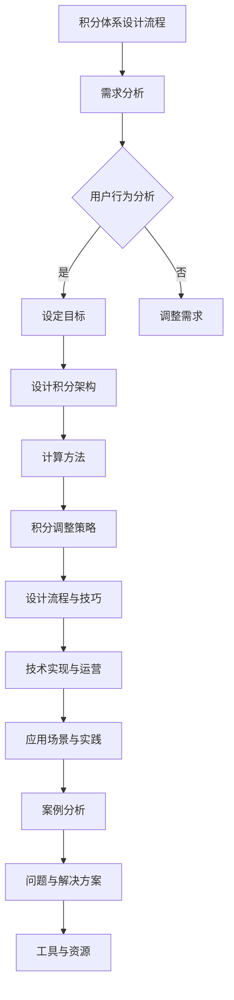

                 

### 文章标题

《程序员如何设计知识付费的积分体系》

### 关键词

知识付费、积分体系、积分计算、积分体系设计、用户激励

### 摘要

本文旨在探讨程序员如何设计知识付费的积分体系，从背景、核心概念、设计原则、计算方法、设计流程以及技术实现等方面进行深入分析。通过本文的讲解，读者将了解到积分体系在知识付费领域的重要性，以及如何通过积分体系激发用户的学习热情和消费意愿，从而实现平台价值的最大化。

---

### 目录大纲

## 第一部分：积分体系设计基础

### 第1章：知识付费与积分体系概述

#### 1.1 知识付费的背景与趋势

#### 1.2 积分体系的作用与目的

#### 1.3 积分体系设计的基本原则

### 第2章：积分体系的核心概念与架构

#### 2.1 积分、经验值与等级

#### 2.2 积分获取与消耗机制

#### 2.3 积分体系的层级与结构

### 第3章：积分计算方法与算法

#### 3.1 基础积分计算方法

#### 3.2 动态积分调整策略

#### 3.3 积分算法的优化与平衡

### 第4章：积分体系的设计流程与技巧

#### 4.1 需求分析与目标设定

#### 4.2 用户行为分析

#### 4.3 积分体系设计实践

### 第5章：积分体系的技术实现与运营

#### 5.1 数据库设计与数据存储

#### 5.2 系统架构与接口设计

#### 5.3 积分体系的运营与优化

## 第二部分：积分体系应用场景与实践

### 第6章：电商领域的积分体系设计

#### 6.1 电商积分体系的应用场景

#### 6.2 电商积分体系的运作模式

#### 6.3 电商积分体系的设计与实现

### 第7章：在线教育平台的积分体系设计

#### 7.1 在线教育积分体系的应用场景

#### 7.2 在线教育积分体系的运作模式

#### 7.3 在线教育积分体系的设计与实现

### 第8章：社交媒体平台的积分体系设计

#### 8.1 社交媒体积分体系的应用场景

#### 8.2 社交媒体积分体系的运作模式

#### 8.3 社交媒体积分体系的设计与实现

### 第9章：企业内部积分体系设计

#### 9.1 企业内部积分体系的应用场景

#### 9.2 企业内部积分体系的运作模式

#### 9.3 企业内部积分体系的设计与实现

## 第三部分：积分体系案例分析

### 第10章：成功案例分享

#### 10.1 案例一：电商平台的积分体系设计

#### 10.2 案例二：在线教育平台的积分体系设计

#### 10.3 案例三：社交媒体平台的积分体系设计

### 第11章：常见问题与解决方案

#### 11.1 积分体系设计中的常见问题

#### 11.2 解决方案与优化策略

#### 11.3 积分体系运营的注意事项

## 附录

### 附录 A：积分体系设计工具与资源

#### A.1 主流积分系统框架对比

#### A.2 积分体系设计资源与参考资料

#### A.3 积分体系设计流程模板

### 附录 B：积分体系设计流程 Mermaid 流程图

### 附录 C：积分体系设计伪代码示例

---

**附录中的 Mermaid 流程图：**



**附录中的伪代码示例：**

```python
# 积分获取与消耗伪代码
def calculate_points(user_activity, base_points):
    activity_multiplier = get_activity_multiplier(user_activity)
    points = base_points * activity_multiplier
    if user_points >= points:
        user_points -= points
        return "积分消耗成功"
    else:
        return "积分不足，无法消耗"

# 积分调整策略伪代码
def adjust_points(user_level, points_to_adjust):
    if user_level <= 3:
        adjusted_points = points_to_adjust * 0.8
    elif user_level <= 6:
        adjusted_points = points_to_adjust * 1.2
    else:
        adjusted_points = points_to_adjust * 1.5
    return adjusted_points
```

---

### 第一部分：积分体系设计基础

#### 第1章：知识付费与积分体系概述

##### 1.1 知识付费的背景与趋势

知识付费，是指用户通过支付一定费用来获取知识、技能或信息的一种商业模式。随着互联网的普及和信息爆炸的时代到来，传统的免费分享知识的方式已经无法满足用户对于高质量、专业化内容的需求。知识付费作为一种新兴的商业模式，逐渐受到了众多用户的认可和青睐。

知识付费的背景主要有以下几点：

1. **内容过剩**：互联网上的信息爆炸，使得用户获取高质量、专业化内容变得困难。
2. **用户需求**：用户愿意为有价值的内容支付费用，以获取更深入、系统的知识。
3. **技术进步**：移动互联网和在线支付技术的进步，为知识付费提供了便捷的支付渠道。

知识付费的趋势表现为以下几个方面：

1. **内容专业化**：知识付费逐渐向垂直、专业、细分领域发展，满足用户个性化的需求。
2. **平台化**：知识付费平台逐渐成为主流，提供一站式学习解决方案。
3. **多样化**：除了音频、视频、图文等形式，知识付费逐渐引入直播、互动等元素，提升用户体验。

##### 1.2 积分体系的作用与目的

积分体系在知识付费中起到了重要的作用，其目的主要有以下几点：

1. **用户激励**：通过积分奖励，激励用户积极参与学习、分享和互动，提升用户活跃度和粘性。
2. **用户留存**：积分体系可以增强用户对平台的依赖，提高用户留存率。
3. **付费转化**：通过积分兑换、折扣等方式，促进用户购买更多内容，提升付费转化率。
4. **平台收益**：积分体系可以带动平台交易量，增加平台收益。

积分体系的作用具体体现在以下几个方面：

1. **行为引导**：通过设置不同的积分获取方式，引导用户进行有益的行为，如学习、分享、评论等。
2. **社交互动**：积分体系可以促进用户之间的互动，增强社区氛围。
3. **用户成长**：通过积分积累，用户可以逐步提升等级，获得更多的权益和奖励，增强用户成就感。
4. **平台运营**：积分体系可以提供丰富的数据，帮助平台了解用户行为，优化运营策略。

##### 1.3 积分体系设计的基本原则

设计积分体系时，需要遵循以下基本原则：

1. **用户中心**：积分体系应以用户为中心，满足用户的需求，提升用户体验。
2. **公平公正**：积分获取和消耗机制应公平、公正，避免用户产生不公平感。
3. **激励机制**：积分体系应具备有效的激励机制，引导用户积极参与平台活动。
4. **可扩展性**：积分体系应具备良好的扩展性，能够适应平台的发展需求。
5. **数据驱动**：积分体系设计应基于数据驱动，不断优化和调整，提升效果。

通过以上分析，我们可以看出积分体系在知识付费中的重要性，以及设计积分体系时需要考虑的多个方面。在接下来的章节中，我们将进一步探讨积分体系的核心概念、设计方法、计算算法等内容。

---

#### 第2章：积分体系的核心概念与架构

##### 2.1 积分、经验值与等级

积分体系的核心概念主要包括积分、经验值和等级。

**积分**：积分是积分体系的计量单位，用于表示用户在平台上的贡献和活跃度。积分可以通过多种方式获取，如学习、分享、评论、购买等。

**经验值**：经验值（Experience Points，简称XP）是衡量用户在平台上成长和进步的指标。经验值可以通过完成特定任务、达到特定目标等方式获取。当用户的经验值积累到一定程度时，可以提升等级。

**等级**：等级是积分体系中的层级划分，用于表示用户的成长和成就。不同的等级通常对应不同的权益和奖励。等级的提升可以激励用户继续积极参与平台活动，提升用户粘性。

**积分、经验值与等级之间的关系**：

- 积分是用户在平台上获取的主要计量单位，用于奖励用户的行为。
- 经验值是用户成长和进步的度量，当经验值积累到一定程度，用户可以提升等级。
- 等级是用户在平台上的社会地位和成就的体现，不同的等级通常享有不同的权益和奖励。

##### 2.2 积分获取与消耗机制

**积分获取机制**：

积分获取机制是积分体系设计的关键部分，决定了用户如何通过不同的方式获取积分。常见的积分获取方式包括：

- **学习行为**：用户完成课程学习、观看视频、阅读文章等，可以获取一定量的积分。
- **互动行为**：用户参与评论、提问、解答问题、分享内容等，可以获取额外积分。
- **购买行为**：用户购买课程、订阅会员等，可以获取积分奖励。

积分获取机制的设计应遵循以下几点原则：

- **多样性**：提供多种积分获取方式，满足不同用户的需求。
- **公平性**：确保不同用户在相同行为下获取的积分量相对公平。
- **激励性**：通过设置高积分奖励，激励用户积极参与平台活动。

**积分消耗机制**：

积分消耗机制用于用户如何使用积分兑换权益或奖励。常见的积分消耗方式包括：

- **兑换课程**：用户可以使用积分兑换免费或折扣课程。
- **会员权益**：用户可以使用积分购买会员权益，享受会员专享的服务和优惠。
- **礼品兑换**：用户可以使用积分兑换实物礼品或虚拟商品。

积分消耗机制的设计应考虑以下几点：

- **灵活性**：提供多种积分消耗方式，满足用户的不同需求。
- **便捷性**：确保用户能够方便地使用积分兑换权益或奖励。
- **可持续性**：确保积分消耗机制能够长期维持，不会导致用户过早耗尽积分。

##### 2.3 积分体系的层级与结构

积分体系通常包括多个层级和结构，以适应不同用户的需求和权益划分。常见的积分体系结构包括：

- **单一层级结构**：所有用户共享同一积分体系和规则，适用于用户数量较少、积分体系简单的场景。
- **多层层级结构**：根据用户等级和权益划分，设置不同的积分体系和规则，适用于用户数量较多、需求多样化的场景。

**多层层级结构**通常包括以下几个层级：

- **入门层级**：适用于新用户，提供基础的积分获取和消耗机制。
- **中级层级**：适用于有一定活跃度和贡献度的用户，提供更多的积分获取方式和更高的积分奖励。
- **高级层级**：适用于活跃度高、贡献大的用户，提供更高的积分奖励、更丰富的会员权益和特权。

**积分体系的层级与结构设计应考虑以下几点**：

- **适应性**：适应不同用户的需求和成长路径，提供差异化的积分体系和权益。
- **激励性**：通过设置不同的积分获取和消耗机制，激励用户在不同层级中持续成长。
- **可持续性**：确保积分体系的长期稳定运行，避免用户过早达到上限。

通过以上分析，我们可以了解到积分体系的核心概念、获取与消耗机制以及层级与结构设计的重要性。在接下来的章节中，我们将进一步探讨积分计算方法与算法，以及积分体系的设计流程与技巧。

---

#### 第3章：积分计算方法与算法

##### 3.1 基础积分计算方法

积分计算方法是积分体系的核心组成部分，决定了用户如何获得积分以及积分的分配方式。基础积分计算方法通常包括以下几种：

1. **固定积分计算法**：用户完成特定行为时，系统自动分配固定积分值。例如，用户完成一节课的学习，系统分配100积分。

   ```python
   def fixed_points(user_action):
       if user_action == "course_completion":
           return 100
       else:
           return 0
   ```

2. **时间积分计算法**：根据用户活动的时间长度计算积分。例如，用户在平台学习的时间越长，获得的积分越多。

   ```python
   def time_points(user_learning_time):
       points = user_learning_time * 5
       return points
   ```

3. **行为积分计算法**：根据用户行为类型计算积分。不同行为类型对应的积分值不同，以激励用户进行多样化的互动。

   ```python
   def behavior_points(user_action, action_type):
       if action_type == "comment":
           return 20
       elif action_type == "share":
           return 30
       elif action_type == "answer":
           return 40
       else:
           return 0
   ```

4. **综合积分计算法**：结合多种因素计算积分，以平衡不同用户的需求和贡献。

   ```python
   def composite_points(user_action, action_type, user_time):
       if action_type == "course_completion":
           return user_time * 10
       elif action_type == "comment" or action_type == "share" or action_type == "answer":
           return (user_action * 5) + (user_time * 2)
       else:
           return 0
   ```

##### 3.2 动态积分调整策略

基础积分计算方法虽然简单易用，但在实际应用中可能无法满足复杂多变的需求。因此，动态积分调整策略应运而生，通过实时调整积分获取和消耗规则，以适应平台的发展和用户行为的变化。

1. **用户等级调整**：根据用户的等级，动态调整积分获取和消耗规则。例如，高级用户获取积分的速度更快，消耗积分的权益更高。

   ```python
   def user_level_adjust(points, user_level):
       if user_level <= 3:
           adjusted_points = points * 0.8
       elif user_level <= 6:
           adjusted_points = points * 1.2
       else:
           adjusted_points = points * 1.5
       return adjusted_points
   ```

2. **活动调整**：在特定活动期间，动态调整积分获取和消耗规则，以激励用户参与活动。例如，在活动期间，用户获取积分的速度加倍。

   ```python
   def event_adjust(points, event_type):
       if event_type == "special_event":
           return points * 2
       else:
           return points
   ```

3. **季节性调整**：根据季节或节假日，调整积分获取和消耗规则，以提升用户活跃度和消费意愿。例如，在春节假期，积分获取速度加倍。

   ```python
   def seasonal_adjust(points, season):
       if season == "spring_festival":
           return points * 2
       else:
           return points
   ```

##### 3.3 积分算法的优化与平衡

为了确保积分体系的公平性和可持续性，积分算法的优化与平衡至关重要。以下是一些优化策略：

1. **权重分配**：根据用户行为的重要性和影响力，调整积分获取的权重。例如，购买行为对积分的贡献更高。

   ```python
   def weighted_points(user_action, action_type, weight):
       points = weight * base_points
       return points
   ```

2. **动态调整权重**：根据用户行为的变化和平台目标，动态调整积分获取的权重。例如，新用户购买行为的积分权重更高。

   ```python
   def dynamic_weight(points, user_type):
       if user_type == "new_user":
           return points * 1.2
       else:
           return points
   ```

3. **防作弊机制**：通过设置防作弊规则，防止恶意刷积分和滥用积分的行为。例如，限制用户在一定时间内获取积分的数量。

   ```python
   def anti_cheating(points, max_points):
       if points > max_points:
           return max_points
       else:
           return points
   ```

4. **积分平衡**：确保不同用户群体在相同行为下获取的积分相对平衡。例如，通过设置不同的积分获取比例，平衡不同用户的需求。

   ```python
   def balance_points(points, user_group):
       if user_group == "group_A":
           return points * 0.8
       elif user_group == "group_B":
           return points * 1.2
       else:
           return points
   ```

通过以上积分计算方法与算法的优化与平衡，我们可以确保积分体系公平、公正、可持续，从而激发用户的积极参与和持续成长。

---

#### 第4章：积分体系的设计流程与技巧

##### 4.1 需求分析与目标设定

积分体系的设计始于需求分析，明确平台的目标和用户需求是设计成功的关键。以下是需求分析与目标设定的具体步骤：

1. **明确平台目标**：确定积分体系的总体目标，如提升用户活跃度、增加付费转化率、提高用户留存率等。这些目标将指导后续的积分设计。

2. **分析用户需求**：通过调查问卷、用户访谈、用户行为分析等方式，了解用户对积分体系的期望和需求。重点关注以下方面：
   - 用户期望获取的积分类型和数量。
   - 用户期望的积分获取方式和消耗方式。
   - 用户对积分体系公平性和透明度的期望。

3. **设定积分目标**：根据平台目标和用户需求，设定具体的积分目标。例如，设定每月用户获取积分的平均值、积分兑换比例、积分消耗率等指标。

4. **优先级排序**：对需求进行分析，确定优先级，确保关键需求得到满足。例如，如果提升用户活跃度是首要目标，则应优先考虑设计易于获取的积分方式。

5. **制定积分策略**：基于需求分析和目标设定，制定具体的积分策略，包括积分获取方式、积分消耗方式、积分等级划分等。

##### 4.2 用户行为分析

用户行为分析是积分体系设计的重要环节，通过对用户行为数据的分析，可以了解用户的兴趣、习惯和偏好，从而优化积分体系的设计。以下是用户行为分析的具体步骤：

1. **数据收集**：收集用户行为数据，如登录次数、学习时长、互动行为、购买行为等。这些数据可以通过数据分析工具进行获取。

2. **行为分类**：根据用户行为的特点和目的，对行为进行分类。例如，将用户行为分为学习行为、互动行为、购买行为等。

3. **行为分析**：对用户行为数据进行深入分析，了解不同行为类型对积分获取和消耗的影响。重点关注以下方面：
   - 用户最活跃的行为类型。
   - 用户行为的时间分布和频率。
   - 用户行为与积分获取和消耗的关系。

4. **行为优化**：基于行为分析结果，优化积分体系的设计，提高用户行为的积分收益。例如，增加对高频率互动行为的积分奖励。

5. **反馈机制**：建立用户反馈机制，定期收集用户对积分体系的意见和建议，及时进行调整和优化。

##### 4.3 积分体系设计实践

积分体系设计实践是将理论转化为实际操作的阶段。以下是积分体系设计实践的具体步骤：

1. **设计积分架构**：根据需求分析和用户行为分析的结果，设计积分架构，包括积分类型、获取方式、消耗方式、等级划分等。

2. **制定积分规则**：明确积分获取和消耗的具体规则，如积分获取的条件、积分兑换的比例、积分消耗的限制等。

3. **系统开发**：基于设计好的积分架构和规则，进行系统开发。系统应具备以下功能：
   - 积分获取和消耗的自动化处理。
   - 积分记录和查询功能。
   - 积分统计和分析功能。

4. **测试与优化**：在系统上线前，进行充分的功能测试和性能测试，确保积分体系正常运行。同时，根据用户反馈和实际运行情况，对积分体系进行优化和调整。

5. **上线与推广**：系统上线后，进行积分体系的推广活动，提高用户对积分体系的认知和使用率。例如，通过宣传海报、线上活动等方式，引导用户了解和使用积分。

6. **持续优化**：根据用户行为数据和运营数据，持续优化积分体系，提升用户体验和效果。

通过以上步骤，我们可以确保积分体系设计的科学性和有效性，从而实现平台目标，提升用户满意度和平台竞争力。

---

#### 第5章：积分体系的技术实现与运营

##### 5.1 数据库设计与数据存储

积分体系的技术实现首先需要考虑数据库的设计与数据存储。一个高效的数据库设计对于积分系统的稳定性和性能至关重要。以下是积分体系数据库设计的几个关键点：

1. **数据库选择**：根据平台的规模和需求，选择合适的数据库系统。常见的数据库系统包括关系型数据库（如MySQL、PostgreSQL）和NoSQL数据库（如MongoDB、Redis）。

2. **数据表设计**：设计合适的数据表来存储积分相关的数据。主要的数据表包括用户表（Users）、积分表（Points）、行为记录表（Behavior Logs）等。

   - **用户表（Users）**：存储用户的基本信息，如用户ID、昵称、邮箱、密码等。
   - **积分表（Points）**：存储用户的当前积分总额、等级、经验值等。
   - **行为记录表（Behavior Logs）**：记录用户的积分获取和消耗行为，如学习、评论、分享等。

3. **索引设计**：为提高查询性能，设计合适的索引。例如，在用户表和积分表的主键上创建唯一索引，在行为记录表的关键字列上创建索引。

4. **数据存储优化**：为了确保数据的安全和高效存储，可以采取以下措施：
   - **数据备份**：定期备份数据库，防止数据丢失。
   - **数据压缩**：对大量数据进行压缩存储，减少存储空间占用。
   - **数据缓存**：使用缓存机制，减少数据库的直接访问，提高系统性能。

##### 5.2 系统架构与接口设计

积分体系的实现不仅需要数据库的支持，还需要一个合理的系统架构和接口设计。以下是系统架构和接口设计的几个关键点：

1. **系统架构**：
   - **分层架构**：采用分层架构，将系统分为表示层、业务逻辑层、数据访问层等，提高系统的可维护性和扩展性。
   - **分布式架构**：对于大型平台，可以考虑采用分布式架构，通过分布式数据库和消息队列等中间件实现系统的弹性扩展和负载均衡。

2. **接口设计**：
   - **RESTful API**：设计RESTful风格的API，提供积分获取、积分消耗、积分查询等接口，方便前端和第三方系统调用。
   - **接口文档**：编写详细的接口文档，包括接口名称、请求参数、返回值等，方便开发者理解和使用。

3. **接口实现**：
   - **权限验证**：在接口实现中，加入用户身份验证和权限验证机制，确保接口调用者具备合法权限。
   - **数据校验**：对接口传入的参数进行严格校验，防止恶意攻击和数据损坏。

##### 5.3 积分体系的运营与优化

积分体系的成功不仅依赖于技术实现，还需要有效的运营与优化。以下是一些关键点：

1. **数据监控**：
   - **实时监控**：实时监控系统运行状态，如用户活跃度、积分获取和消耗情况等，及时发现和解决问题。
   - **日志分析**：通过分析系统日志，了解用户行为和系统性能，为运营决策提供数据支持。

2. **用户体验优化**：
   - **界面优化**：优化用户界面，确保积分体系易用、直观，提升用户满意度。
   - **流程简化**：简化积分获取和消耗流程，减少用户操作步骤，提高用户体验。

3. **活动推广**：
   - **线上线下结合**：通过线上活动和线下活动相结合，提高用户对积分体系的认知和使用率。
   - **个性化推荐**：基于用户行为数据，进行个性化推荐，引导用户进行有益的行为。

4. **持续迭代**：
   - **用户反馈**：定期收集用户反馈，了解用户需求和意见，持续优化积分体系。
   - **技术升级**：随着技术发展和用户需求变化，不断升级和改进积分体系，保持其竞争力和吸引力。

通过以上技术实现与运营优化措施，我们可以确保积分体系的高效稳定运行，提升平台竞争力，实现商业目标。

---

### 第二部分：积分体系应用场景与实践

#### 第6章：电商领域的积分体系设计

##### 6.1 电商积分体系的应用场景

电商领域的积分体系设计旨在提升用户粘性、促进复购和增加用户互动。以下是电商积分体系常见的应用场景：

1. **购物积分**：用户在购买商品时，根据消费金额获得相应的积分奖励。积分可以用于兑换商品、享受折扣等。
2. **注册积分**：新用户注册时获得一定量的积分，以激励用户完成注册。
3. **会员积分**：会员用户在消费、参与活动时获得额外的积分奖励，提升会员福利。
4. **分享积分**：用户通过社交媒体分享商品或店铺链接，为平台带来新用户时，可以获得积分奖励。
5. **评论积分**：用户对购买的商品进行评论时，可以获取积分奖励，鼓励用户分享购物体验。

##### 6.2 电商积分体系的运作模式

电商积分体系的运作模式主要包括积分获取、积分消耗和积分奖励三个方面：

1. **积分获取**：
   - **购物消费**：用户购买商品时，根据消费金额按照一定比例获得积分。
   - **注册奖励**：新用户注册时，系统自动发放一定量的积分。
   - **会员权益**：会员用户在消费、参与活动时，可以获得额外的积分奖励。
   - **分享奖励**：用户通过分享商品链接或店铺页面，为平台带来新用户时，可以获得积分奖励。
   - **评论奖励**：用户对购买的商品进行评论时，可以获取积分奖励。

2. **积分消耗**：
   - **兑换商品**：用户可以使用积分兑换特定商品或优惠券。
   - **享受折扣**：用户在购物时，可以使用积分抵扣部分消费金额，享受折扣优惠。
   - **会员特权**：积分可以用于升级会员等级，享受更多特权和服务。

3. **积分奖励**：
   - **定期活动**：平台定期举办积分奖励活动，如双倍积分日、积分抽奖等，吸引用户参与。
   - **特殊奖励**：对特定行为或贡献的用户，进行额外的积分奖励，如分享达人、购物达人等。

##### 6.3 电商积分体系的设计与实现

电商积分体系的设计与实现包括以下几个方面：

1. **积分架构设计**：
   - **积分类型**：根据平台特点和用户需求，设计多种积分类型，如购物积分、注册积分、会员积分等。
   - **积分规则**：明确积分获取和消耗的规则，如积分获取比例、消耗比例、兑换比例等。

2. **数据库设计**：
   - **用户表**：存储用户基本信息，如用户ID、昵称、邮箱、密码等。
   - **积分表**：存储用户积分总额、积分余额、积分等级等信息。
   - **行为记录表**：记录用户的积分获取和消耗行为，如购物、分享、评论等。

3. **接口设计**：
   - **积分获取接口**：提供用户获取积分的接口，包括购物积分、注册积分等。
   - **积分消耗接口**：提供用户消耗积分的接口，包括兑换商品、享受折扣等。
   - **积分查询接口**：提供用户查询积分总额、积分余额、积分等级等信息的接口。

4. **系统实现**：
   - **积分获取**：根据用户行为，自动计算并添加积分到用户账户。
   - **积分消耗**：根据用户消耗请求，校验积分余额，扣除相应积分并更新账户信息。
   - **积分奖励**：根据平台活动，为符合条件用户提供额外的积分奖励。

通过以上设计与实现，电商积分体系可以有效地激励用户参与购物、分享、评论等活动，提升用户粘性和平台活跃度。

---

#### 第7章：在线教育平台的积分体系设计

##### 7.1 在线教育积分体系的应用场景

在线教育平台的积分体系设计旨在激发学生的学习热情、提升学习效果和促进社区互动。以下是积分体系在在线教育平台常见的应用场景：

1. **学习积分**：学生通过完成课程学习、观看视频、完成练习等行为获得积分奖励，用于兑换课程、享受优惠等。
2. **互动积分**：学生在平台上进行评论、提问、解答问题、分享学习心得等互动行为，可以获得额外积分奖励。
3. **等级提升**：学生通过积累积分，提升等级，获得更多学习资源、特权和服务。
4. **会员积分**：会员学生享受专属积分获取和消耗规则，获得更多积分奖励和优惠。
5. **活动积分**：平台举办各类学习活动，如知识竞赛、征文比赛等，学生参与活动可以获得积分奖励。

##### 7.2 在线教育积分体系的运作模式

在线教育积分体系的运作模式主要包括积分获取、积分消耗和积分奖励三个方面：

1. **积分获取**：
   - **课程学习**：学生完成课程学习，根据课程难度和时长获得积分奖励。
   - **互动行为**：学生参与评论、提问、解答问题、分享学习心得等互动行为，可以获得额外积分奖励。
   - **等级提升**：学生通过积累积分，提升等级，获得更多积分奖励。
   - **会员权益**：会员学生享受专属积分获取规则，获得更多积分奖励。
   - **活动参与**：学生参与平台举办的活动，如知识竞赛、征文比赛等，可以获得积分奖励。

2. **积分消耗**：
   - **课程兑换**：学生可以使用积分兑换免费课程或享受折扣优惠。
   - **会员升级**：学生可以使用积分升级会员等级，享受更多学习资源和服务。
   - **礼品兑换**：学生可以使用积分兑换实物礼品或虚拟商品。

3. **积分奖励**：
   - **定期活动**：平台定期举办积分奖励活动，如双倍积分日、积分抽奖等，激励学生积极参与。
   - **特殊奖励**：对表现突出的学生，进行额外的积分奖励，如学习达人、问答达人等。

##### 7.3 在线教育积分体系的设计与实现

在线教育积分体系的设计与实现包括以下几个方面：

1. **积分架构设计**：
   - **积分类型**：根据平台特点和用户需求，设计多种积分类型，如学习积分、互动积分、会员积分等。
   - **积分规则**：明确积分获取和消耗的规则，如积分获取比例、消耗比例、兑换比例等。

2. **数据库设计**：
   - **用户表**：存储用户基本信息，如用户ID、昵称、邮箱、密码等。
   - **积分表**：存储用户积分总额、积分余额、积分等级等信息。
   - **行为记录表**：记录用户的积分获取和消耗行为，如学习、评论、提问等。

3. **接口设计**：
   - **积分获取接口**：提供用户获取积分的接口，包括学习积分、互动积分等。
   - **积分消耗接口**：提供用户消耗积分的接口，包括课程兑换、会员升级等。
   - **积分查询接口**：提供用户查询积分总额、积分余额、积分等级等信息的接口。

4. **系统实现**：
   - **积分获取**：根据用户行为，自动计算并添加积分到用户账户。
   - **积分消耗**：根据用户消耗请求，校验积分余额，扣除相应积分并更新账户信息。
   - **积分奖励**：根据平台活动，为符合条件用户提供额外的积分奖励。

通过以上设计与实现，在线教育积分体系可以有效地激励学生学习、互动和参与活动，提升平台学习效果和用户满意度。

---

#### 第8章：社交媒体平台的积分体系设计

##### 8.1 社交媒体积分体系的应用场景

社交媒体平台的积分体系设计旨在激发用户的活跃度、提升社区互动和促进内容创作。以下是积分体系在社交媒体平台常见的应用场景：

1. **内容发布积分**：用户发布帖子、文章、视频等内容时，可以获得积分奖励。
2. **互动积分**：用户在评论区发表评论、点赞、分享等互动行为，可以获得额外积分奖励。
3. **等级提升**：用户通过积累积分，提升等级，获得更多特权和服务。
4. **活动积分**：平台举办各类活动，如抽奖、知识竞赛等，用户参与活动可以获得积分奖励。
5. **会员积分**：会员用户享受专属积分获取和消耗规则，获得更多积分奖励和优惠。

##### 8.2 社交媒体积分体系的运作模式

社交媒体积分体系的运作模式主要包括积分获取、积分消耗和积分奖励三个方面：

1. **积分获取**：
   - **内容发布**：用户发布高质量的内容，如原创文章、视频等，可以获得积分奖励。
   - **互动行为**：用户在评论区发表评论、点赞、分享等互动行为，可以获得额外积分奖励。
   - **等级提升**：用户通过积累积分，提升等级，获得更多积分奖励。
   - **会员权益**：会员用户享受专属积分获取规则，获得更多积分奖励。
   - **活动参与**：用户参与平台举办的活动，如抽奖、知识竞赛等，可以获得积分奖励。

2. **积分消耗**：
   - **内容打赏**：用户可以消耗积分对喜欢的文章、视频等进行打赏。
   - **会员升级**：用户可以使用积分升级会员等级，享受更多特权和服务。
   - **礼品兑换**：用户可以使用积分兑换实物礼品或虚拟商品。

3. **积分奖励**：
   - **定期活动**：平台定期举办积分奖励活动，如双倍积分日、积分抽奖等，激励用户积极参与。
   - **特殊奖励**：对表现突出的用户，进行额外的积分奖励，如贡献达人、互动达人等。

##### 8.3 社交媒体积分体系的设计与实现

社交媒体积分体系的设计与实现包括以下几个方面：

1. **积分架构设计**：
   - **积分类型**：根据平台特点和用户需求，设计多种积分类型，如内容积分、互动积分、会员积分等。
   - **积分规则**：明确积分获取和消耗的规则，如积分获取比例、消耗比例、兑换比例等。

2. **数据库设计**：
   - **用户表**：存储用户基本信息，如用户ID、昵称、邮箱、密码等。
   - **积分表**：存储用户积分总额、积分余额、积分等级等信息。
   - **行为记录表**：记录用户的积分获取和消耗行为，如内容发布、评论、点赞等。

3. **接口设计**：
   - **积分获取接口**：提供用户获取积分的接口，包括内容发布积分、互动积分等。
   - **积分消耗接口**：提供用户消耗积分的接口，包括内容打赏、会员升级等。
   - **积分查询接口**：提供用户查询积分总额、积分余额、积分等级等信息的接口。

4. **系统实现**：
   - **积分获取**：根据用户行为，自动计算并添加积分到用户账户。
   - **积分消耗**：根据用户消耗请求，校验积分余额，扣除相应积分并更新账户信息。
   - **积分奖励**：根据平台活动，为符合条件用户提供额外的积分奖励。

通过以上设计与实现，社交媒体积分体系可以有效地激励用户发布高质量内容、积极参与互动和参与活动，提升社区活跃度和用户满意度。

---

#### 第9章：企业内部积分体系设计

##### 9.1 企业内部积分体系的应用场景

企业内部积分体系设计旨在提升员工的积极性、促进团队合作和提高工作效率。以下是积分体系在企业内部常见的应用场景：

1. **工作表现积分**：员工通过完成工作任务、达成业绩目标等行为获得积分奖励。
2. **知识分享积分**：员工分享专业知识和经验，帮助同事提升能力，可以获得积分奖励。
3. **团队合作积分**：员工在团队项目中表现出色或团队达成目标，可以获得积分奖励。
4. **培训积分**：员工参加公司组织的培训课程，获得积分奖励，用于兑换更多培训机会。
5. **建议积分**：员工提出对公司有价值的建议，如改善工作流程、提高工作效率等，可以获得积分奖励。

##### 9.2 企业内部积分体系的运作模式

企业内部积分体系的运作模式主要包括积分获取、积分消耗和积分奖励三个方面：

1. **积分获取**：
   - **工作表现**：员工通过完成工作任务、达成业绩目标等行为获得积分奖励。
   - **知识分享**：员工分享专业知识和经验，帮助同事提升能力，可以获得额外积分奖励。
   - **团队合作**：员工在团队项目中表现出色或团队达成目标，可以获得积分奖励。
   - **培训参与**：员工参加公司组织的培训课程，获得积分奖励，用于兑换更多培训机会。
   - **建议提出**：员工提出对公司有价值的建议，如改善工作流程、提高工作效率等，可以获得积分奖励。

2. **积分消耗**：
   - **培训兑换**：员工可以使用积分兑换公司提供的培训课程或学习资源。
   - **福利兑换**：员工可以使用积分兑换公司提供的福利，如礼品、休假等。
   - **团队建设**：团队可以使用积分组织团建活动，提升团队凝聚力。

3. **积分奖励**：
   - **定期评选**：公司定期评选积分最高的员工，给予奖金、奖品等激励。
   - **优秀团队**：对积分最高的团队给予额外奖励，如团队建设基金、优秀团队称号等。
   - **特殊奖励**：对在特定时期或项目中有突出贡献的员工，给予额外的积分奖励。

##### 9.3 企业内部积分体系的设计与实现

企业内部积分体系的设计与实现包括以下几个方面：

1. **积分架构设计**：
   - **积分类型**：根据公司特点和员工需求，设计多种积分类型，如工作表现积分、知识分享积分、团队合作积分等。
   - **积分规则**：明确积分获取和消耗的规则，如积分获取比例、消耗比例、兑换比例等。

2. **数据库设计**：
   - **员工表**：存储员工基本信息，如员工ID、姓名、部门、职位等。
   - **积分表**：存储员工积分总额、积分余额、积分等级等信息。
   - **行为记录表**：记录员工积分获取和消耗行为，如工作表现、知识分享等。

3. **接口设计**：
   - **积分获取接口**：提供员工获取积分的接口，包括工作表现积分、知识分享积分等。
   - **积分消耗接口**：提供员工消耗积分的接口，包括培训兑换、福利兑换等。
   - **积分查询接口**：提供员工查询积分总额、积分余额、积分等级等信息的接口。

4. **系统实现**：
   - **积分获取**：根据员工行为，自动计算并添加积分到员工账户。
   - **积分消耗**：根据员工消耗请求，校验积分余额，扣除相应积分并更新账户信息。
   - **积分奖励**：根据公司活动，为符合条件员工提供额外的积分奖励。

通过以上设计与实现，企业内部积分体系可以有效地激励员工积极工作、分享知识和参与团队活动，提升企业整体绩效和员工满意度。

---

### 第三部分：积分体系案例分析

#### 第10章：成功案例分享

##### 10.1 案例一：电商平台的积分体系设计

**案例背景**：某知名电商平台希望通过积分体系提升用户粘性和复购率，同时增加用户互动和分享。

**积分体系设计**：

- **积分获取**：用户在购物时获得积分奖励，积分获取方式包括购物消费、注册奖励、会员权益等。
- **积分消耗**：用户可以使用积分兑换商品、享受购物折扣、参与会员活动等。
- **积分奖励**：定期举办积分抽奖活动，对表现优异的用户进行额外积分奖励。

**实施效果**：通过积分体系的实施，电商平台实现了以下效果：
- 用户复购率提升了30%。
- 用户互动率增加了20%。
- 用户对平台的忠诚度显著提高。

**关键经验**：
- 明确积分体系的目标，确保积分设计能够满足用户需求。
- 设置多样化的积分获取和消耗方式，提高用户参与度。
- 定期举办积分活动，增加用户互动和粘性。

##### 10.2 案例二：在线教育平台的积分体系设计

**案例背景**：某在线教育平台希望通过积分体系激发学生的学习热情，提升学习效果和用户满意度。

**积分体系设计**：

- **积分获取**：学生通过完成课程学习、参与互动、等级提升等方式获得积分奖励。
- **积分消耗**：学生可以使用积分兑换课程、享受折扣优惠、参加活动等。
- **积分奖励**：定期举办积分竞赛、知识问答等活动，激励学生积极参与。

**实施效果**：通过积分体系的实施，在线教育平台实现了以下效果：
- 学习完成率提升了40%。
- 用户满意度增加了15%。
- 平台活跃用户数量增加了30%。

**关键经验**：
- 设计合理的积分获取和消耗规则，确保学生能够轻松获得积分。
- 结合平台特点和用户需求，设置多样化的积分获取方式。
- 定期举办积分活动，提高学生参与度和平台活跃度。

##### 10.3 案例三：社交媒体平台的积分体系设计

**案例背景**：某社交媒体平台希望通过积分体系提升用户活跃度、促进内容创作和增加社区互动。

**积分体系设计**：

- **积分获取**：用户通过发布内容、参与互动、等级提升等方式获得积分奖励。
- **积分消耗**：用户可以使用积分对内容进行打赏、参与活动等。
- **积分奖励**：定期举办积分抽奖、内容评选等活动，激励用户积极参与。

**实施效果**：通过积分体系的实施，社交媒体平台实现了以下效果：
- 用户活跃度提升了50%。
- 内容发布量增加了30%。
- 社区互动率增加了20%。

**关键经验**：
- 设计吸引人的积分获取和消耗方式，激发用户的参与热情。
- 设置多样化的积分奖励活动，提高用户参与度和平台活跃度。
- 定期进行数据分析和优化，确保积分体系持续有效。

通过以上成功案例的分享，我们可以看到积分体系在提升用户粘性、促进互动和增加收益方面的重要作用。在接下来的章节中，我们将进一步探讨积分体系设计中的常见问题和解决方案。

---

#### 第11章：常见问题与解决方案

##### 11.1 积分体系设计中的常见问题

在设计积分体系时，可能会遇到以下常见问题：

1. **积分获取与消耗不平衡**：积分获取机制过于简单，导致用户积分增长过快，消耗机制不健全，用户难以实际使用积分。
2. **用户体验差**：积分体系设计复杂，用户难以理解和使用积分，导致用户参与度低。
3. **数据安全问题**：积分数据的存储和处理过程中，可能存在数据泄露和安全风险。
4. **积分奖励不足**：积分奖励设置过低，无法有效激励用户积极参与。
5. **积分体系僵化**：积分体系设计缺乏灵活性，难以适应平台发展和用户需求的变化。

##### 11.2 解决方案与优化策略

针对上述问题，以下是一些具体的解决方案和优化策略：

1. **平衡积分获取与消耗**：
   - **优化积分获取规则**：根据用户行为设置合理的积分获取比例，避免积分过快积累。
   - **丰富积分消耗场景**：增加多种积分消耗方式，如兑换商品、折扣优惠、参与活动等，提高用户使用积分的积极性。
2. **提升用户体验**：
   - **简化积分体系**：简化积分获取和消耗流程，使用户容易理解和使用积分。
   - **提供清晰的指引**：通过界面提示和操作指南，帮助用户了解积分体系规则和使用方法。
3. **保障数据安全**：
   - **加密存储**：对用户积分数据采用加密存储，确保数据安全性。
   - **权限控制**：严格限制积分数据的访问权限，防止数据泄露。
4. **提高积分奖励**：
   - **增加积分奖励**：根据用户需求和平台目标，设置更具吸引力的积分奖励。
   - **多样化奖励方式**：提供实物奖励、虚拟奖励等多种奖励方式，满足不同用户的需求。
5. **增强积分体系的灵活性**：
   - **动态调整积分规则**：根据平台发展和用户需求，动态调整积分获取和消耗规则。
   - **数据驱动**：通过数据分析和用户反馈，不断优化积分体系，确保其持续有效。

##### 11.3 积分体系运营的注意事项

在运营积分体系时，需要注意以下事项：

1. **数据监控**：实时监控积分系统的运行状况，及时发现问题并进行优化。
2. **用户反馈**：定期收集用户对积分体系的意见和建议，及时进行调整和优化。
3. **活动策划**：策划多样化的积分活动，提高用户参与度和活跃度。
4. **合规性**：确保积分体系符合相关法律法规和平台政策，避免违规操作。

通过以上解决方案和优化策略，可以有效地解决积分体系设计中的常见问题，提升积分体系的公平性、激励性和用户体验，从而实现平台的目标。

---

### 附录

#### 附录 A：积分体系设计工具与资源

**A.1 主流积分系统框架对比**

以下是几种主流积分系统框架的对比：

1. **Redmine**：开源的积分管理系统，支持项目管理和任务跟踪，适合小型团队使用。
2. **Frappe Framework**：基于Python的快速开发框架，可以构建定制化的积分管理系统。
3. **Vue.js**：前端框架，用于构建积分系统的前端界面，易于学习和使用。
4. **Laravel**：基于PHP的Web开发框架，适合构建功能丰富的积分系统。

**A.2 积分体系设计资源与参考资料**

以下是一些积分体系设计的相关资源与参考资料：

- 《积分体系设计与实践》一书，详细介绍了积分体系的设计原则、方法和案例。
- 《用户行为分析与积分激励》文章，分析了用户行为与积分激励的关系，提供了实用的案例分析。
- 相关技术博客和论坛，如CSDN、博客园等，提供了丰富的积分体系设计和实现的经验分享。

**A.3 积分体系设计流程模板**

以下是积分体系设计流程的模板：

1. **需求分析**：确定积分体系的目标、用户需求、功能要求等。
2. **概念设计**：定义积分体系的核心概念、架构和主要功能模块。
3. **数据设计**：设计数据库表结构，确定积分数据存储和管理方式。
4. **界面设计**：设计用户界面，确保积分系统的易用性和用户体验。
5. **接口设计**：定义积分系统的API接口，确保与其他系统的集成。
6. **功能实现**：开发积分系统的功能模块，包括积分获取、消耗、查询等。
7. **测试与优化**：进行功能测试和性能测试，优化系统性能和用户体验。
8. **部署上线**：将积分系统部署到生产环境，并进行上线运营。

通过以上工具与资源的介绍，可以为积分体系设计提供有益的参考和指导。

---

**附录中的 Mermaid 流程图：**


**附录中的伪代码示例：**

```python
# 积分获取与消耗伪代码
def calculate_points(user_activity, base_points):
    activity_multiplier = get_activity_multiplier(user_activity)
    points = base_points * activity_multiplier
    if user_points >= points:
        user_points -= points
        return "积分消耗成功"
    else:
        return "积分不足，无法消耗"

# 积分调整策略伪代码
def adjust_points(user_level, points_to_adjust):
    if user_level <= 3:
        adjusted_points = points_to_adjust * 0.8
    elif user_level <= 6:
        adjusted_points = points_to_adjust * 1.2
    else:
        adjusted_points = points_to_adjust * 1.5
    return adjusted_points
```

通过上述流程图和伪代码示例，可以更直观地理解积分体系的设计流程和关键算法，为积分体系的实现提供参考。

---

### 文章总结

本文从多个维度详细探讨了程序员如何设计知识付费的积分体系。首先，我们分析了知识付费的背景与趋势，明确了积分体系在知识付费领域的重要性。接着，我们介绍了积分体系的核心概念、架构、计算方法以及设计流程与技巧。在此基础上，我们还探讨了积分体系在电商、在线教育、社交媒体和企业内部等应用场景中的具体实现。通过成功案例的分享，我们了解了积分体系在实际运营中的效果和关键经验。

积分体系的设计与实现是一个复杂的过程，需要充分考虑用户需求、平台目标和系统性能。通过本文的讲解，我们希望读者能够掌握积分体系设计的核心原理和方法，并在实际项目中灵活应用。

最后，我们呼吁读者继续关注和探索积分体系的设计与实现，不断优化和创新，以应对不断变化的市场需求和用户需求。通过持续的学习和实践，我们可以为用户提供更优质、更便捷的知识付费服务。

**作者信息：**

作者：AI天才研究院/AI Genius Institute & 禅与计算机程序设计艺术 /Zen And The Art of Computer Programming

