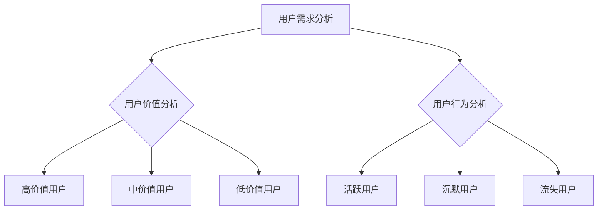

                 

### 《程序员如何进行知识付费的用户分层》

> 关键词：知识付费、用户分层、程序员、需求分析、个性化推荐、营销策略

> 摘要：本文旨在探讨程序员如何通过知识付费进行用户分层。首先，我们回顾了知识付费市场的兴起与现状，然后分析了程序员的知识需求。接着，我们介绍了用户分层的核心概念和策略实施，并通过实际案例展示了用户分层在知识付费中的应用。最后，我们讨论了用户分层对知识付费平台的影响和可持续发展策略。

-------------------------------------------------------------------

## 第一部分：知识付费市场概述

### 第1章：知识付费的兴起与现状

#### 1.1 知识付费的定义与特点

知识付费是指用户为获取有价值的信息或知识而付费的行为。其特点包括：

- **付费主体明确**：用户明确知道自己为获取何种知识而付费。
- **内容专业性**：知识付费内容通常具有较高的专业性，满足用户特定需求。
- **交易便捷性**：知识付费通过互联网平台实现，支付和获取内容过程便捷。
- **个性化推荐**：知识付费平台通常具备个性化推荐系统，提升用户体验。

#### 1.2 知识付费市场的规模与趋势

根据最新数据，知识付费市场呈现以下趋势：

- **市场规模不断扩大**：知识付费市场规模逐年增长，预计未来几年仍将保持高速增长。
- **用户群体多样化**：知识付费用户不仅包括专业技术人员，还涵盖了职场人士、学生等。
- **内容形式多样化**：知识付费内容形式从传统课程拓展到直播、短视频、电子书等多种形式。
- **技术驱动**：人工智能、大数据等技术在知识付费领域得到广泛应用，提升用户体验和内容质量。

#### 1.3 知识付费行业的主要玩家

知识付费行业的核心玩家包括以下几类：

- **综合型平台**：如得到、喜马拉雅等，提供多种类型的知识内容。
- **垂直领域平台**：如极客时间、编程喵等，专注于某一特定领域。
- **企业培训平台**：如华宇智学、智学网等，为企业员工提供定制化培训服务。
- **个人讲师**：通过知乎Live、分答等平台，个人讲师分享专业知识和经验。

### 第2章：程序员知识需求分析

#### 2.1 程序员知识需求的分类

程序员的知**识需求可以分为以下三类**：

- **基础知识需求**：包括编程语言基础、数据结构与算法等。
- **进阶知识需求**：包括框架、中间件、微服务架构等。
- **技术前沿知识需求**：包括人工智能、区块链、云计算等前沿技术。

#### 2.2 程序员学习习惯与偏好

程序员的学**习习惯和偏好有以下几个方面**：

- **在线学习**：程序员更倾向于通过在线平台学习，方便灵活。
- **实战项目**：通过实际项目练习来巩固所学知识。
- **技术社区**：积极参与技术社区，与他人交流、分享经验。
- **阅读技术书籍**：偏好阅读权威、系统的技术书籍。

#### 2.3 程序员知识付费的动机与障碍

程序员进行知识付费的动机主要有以下几点：

- **提升技能**：获取专业、系统化的知识，提升个人竞争力。
- **解决实际问题**：通过付费课程解决工作中遇到的技术难题。
- **保持更新**：紧跟技术前沿，不断学习新知识。

程序员在知识付费过程中可能会遇到的障碍包括：

- **成本问题**：知识付费成本较高，部分程序员可能承担不起。
- **时间安排**：工作繁忙，难以抽出时间学习。
- **信任问题**：担心付费内容质量不高，无法满足预期。

-------------------------------------------------------------------

## 第二部分：用户分层策略

### 第3章：用户分层核心概念

#### 3.1 用户分层的定义与意义

用户分层是指根据用户的某些特征，如需求、价值、行为等，将用户划分为不同的层次。用户分层有助于知识付费平台：

- **精准营销**：根据不同层次的用户制定个性化营销策略。
- **优化用户体验**：针对不同层次的用户提供定制化内容和服务。
- **提升运营效率**：集中资源服务于高价值用户，降低运营成本。

#### 3.2 用户分层的分类方法

用户分层可以采用以下几种分类方法：

- **按照用户需求分层**：根据用户所需知识的不同，将其划分为基础知识用户、进阶知识用户和技术前沿知识用户。
- **按照用户价值分层**：根据用户对平台的贡献度，将其划分为高价值用户、中价值用户和低价值用户。
- **按照用户行为分层**：根据用户在平台上的行为，将其划分为活跃用户、沉默用户和流失用户。

#### 3.3 用户分层的关键指标

用户分层的关键指标包括：

- **用户活跃度**：用户在平台上参与互动的频率和深度。
- **用户满意度**：用户对平台内容和服务质量的评价。
- **用户转化率**：用户从免费用户转化为付费用户的比例。

-------------------------------------------------------------------

### 第4章：用户分层策略实施

#### 4.1 用户数据收集与处理

用户数据的收集和处理是用户分层策略实施的基础。用户数据可以从以下渠道获取：

- **平台内部数据**：如用户浏览、购买、评价等行为数据。
- **第三方数据**：如用户职业、年龄、地域等人口统计信息。
- **用户调研**：通过问卷调查、访谈等方式获取用户需求和偏好。

数据处理包括以下步骤：

- **数据清洗**：去除重复、无效数据，确保数据质量。
- **数据整合**：将不同来源的数据进行整合，形成完整的用户画像。
- **数据分析**：利用数据挖掘技术，提取有价值的信息。

#### 4.2 用户分层策略设计

用户分层策略设计包括以下步骤：

- **确定目标**：明确用户分层的目的和预期效果。
- **选择指标**：根据目标，选择合适的用户分层指标。
- **分层标准**：制定分层标准，明确不同层次的用户特征。
- **分层结果**：根据分层标准和用户数据，划分用户层次。

#### 4.3 用户分层策略优化

用户分层策略优化包括以下步骤：

- **评估效果**：分析分层策略对业务指标的影响，如用户留存率、转化率等。
- **反馈调整**：根据评估结果，调整分层策略，优化用户分层结果。
- **持续优化**：定期评估和调整分层策略，确保其与业务需求保持一致。

-------------------------------------------------------------------

### 第5章：用户分层在知识付费中的应用

#### 5.1 定制化内容策略

定制化内容策略是指根据不同层次的用户需求，提供个性化内容。具体措施包括：

- **内容分类**：根据用户需求，将内容分为基础知识、进阶知识和技术前沿三个类别。
- **内容推荐**：利用个性化推荐系统，向不同层次的用户推荐符合其需求的内容。
- **内容更新**：定期更新内容，确保内容的时效性和实用性。

#### 5.2 个性化推荐系统

个性化推荐系统是知识付费平台的重要功能。其原理和案例分析如下：

- **原理**：基于用户行为数据，利用协同过滤、基于内容的推荐等技术，为用户推荐感兴趣的内容。
- **案例分析**：以极客时间为例，分析其个性化推荐系统的设计思路和实现方法。

#### 5.3 用户分层营销策略

用户分层营销策略是指根据不同层次的用户特征，制定有针对性的营销策略。具体措施包括：

- **营销渠道**：根据用户特征，选择合适的营销渠道，如社交媒体、邮件营销等。
- **营销内容**：根据用户需求，设计有吸引力的营销内容，如课程优惠、学习技巧分享等。
- **营销活动**：定期举办线上线下活动，提升用户参与度和忠诚度。

-------------------------------------------------------------------

### 第6章：用户分层案例分析

#### 6.1 案例一：在线编程学习平台

**案例背景**：某在线编程学习平台，用户量达到数十万。

**用户分层策略**：

- **基础知识用户**：提供基础编程语言、数据结构等课程，帮助用户入门。
- **进阶知识用户**：提供框架、中间件、微服务架构等课程，满足用户进阶需求。
- **技术前沿用户**：提供人工智能、区块链、云计算等前沿技术课程，引领用户走向前沿。

**案例效果分析**：通过用户分层，平台实现了以下效果：

- **用户留存率提升**：不同层次的用户都能在平台上找到符合其需求的内容，提升了用户留存率。
- **用户满意度提高**：用户感受到平台对他们的需求关注，满意度提高。
- **转化率提高**：通过个性化推荐和定制化内容，提高了付费用户的转化率。

#### 6.2 案例二：技术博客网站

**案例背景**：某知名技术博客网站，日均访问量达到数百万。

**用户分层策略**：

- **活跃用户**：根据用户访问频率和评论互动，将其划分为活跃用户，提供高质量原创文章。
- **沉默用户**：根据用户访问量和阅读时长，将其划分为沉默用户，推送热门文章和精选内容。
- **流失用户**：根据用户行为和反馈，分析流失原因，制定针对性措施，如推送个性化推荐、举办线上线下活动等。

**案例效果分析**：通过用户分层，网站实现了以下效果：

- **用户活跃度提升**：通过个性化推荐和精选内容，提升了用户活跃度。
- **用户满意度提高**：用户感受到网站对他们的关注，满意度提高。
- **流失用户挽回**：通过针对性措施，成功挽回了部分流失用户。

-------------------------------------------------------------------

### 第7章：用户分层与可持续发展

#### 7.1 用户分层对知识付费平台的影响

用户分层对知识付费平台的影响主要体现在以下几个方面：

- **用户留存率**：通过提供个性化内容和营销策略，提升用户留存率。
- **用户活跃度**：通过定制化内容和营销活动，提升用户活跃度。
- **用户满意度**：通过关注用户需求，提升用户满意度。

#### 7.2 用户分层策略的可持续发展

用户分层策略的可持续发展需要考虑以下几个方面：

- **数据驱动**：持续关注用户数据，优化分层策略。
- **持续优化**：定期评估分层策略效果，进行优化和调整。
- **技术创新**：利用人工智能、大数据等新技术，提升分层策略的准确性和实效性。

#### 7.3 用户分层与社会责任

用户分层策略在实施过程中，需要关注以下社会责任问题：

- **用户隐私保护**：确保用户数据安全，保护用户隐私。
- **公平性考量**：确保分层策略不会导致用户歧视，公平对待所有用户。
- **社会责任承担**：关注社会热点问题，通过知识付费平台传递正能量，承担社会责任。

-------------------------------------------------------------------

## 附录

### 附录A：用户分层工具与资源

**A.1 用户分层工具介绍**

- **数据分析工具**：如Python的Pandas库、R语言等。
- **用户画像工具**：如阿里巴巴的DataX、腾讯的UserView等。
- **用户行为分析工具**：如Google Analytics、百度统计等。

**A.2 用户分层相关资源推荐**

- **知识付费行业报告**：如《中国知识付费行业报告》等。
- **用户行为研究论文**：如《用户行为分析：从数据到洞察》等。
- **用户分层策略案例研究**：如《在线教育平台用户分层策略研究》等。

### 附录B：用户分层实践指南

**B.1 用户分层策略制定步骤**

1. **制定目标**：明确用户分层策略的预期效果和目标。
2. **数据收集**：收集用户数据，包括行为数据、人口统计信息等。
3. **用户画像**：利用数据分析工具，构建用户画像。
4. **分层策略设计**：根据用户画像和目标，设计用户分层策略。
5. **实施与优化**：根据分层策略，实施运营活动，并持续优化策略。

### 附录C：Mermaid 流程图示例



### 附录D：伪代码示例

```plaintext
// 算法：用户分层
// 输入：用户数据集
// 输出：用户分层结果

function userStratification(userData) {
    // 数据预处理
    processData(userData)

    // 用户需求分析
    demandAnalysis(userData)

    // 用户价值分析
    valueAnalysis(userData)

    // 用户行为分析
    behaviorAnalysis(userData)

    // 用户分层
    layers = []

    for (user in userData) {
        layer = determineLayer(user)
        layers.add(layer)
    }

    return layers
}
```

### 附录E：作者信息

作者：AI天才研究院/AI Genius Institute & 禅与计算机程序设计艺术 /Zen And The Art of Computer Programming

本文内容仅供参考，实际应用时请根据具体情况进行调整。如有疑问，请随时与我联系。感谢您的阅读！

