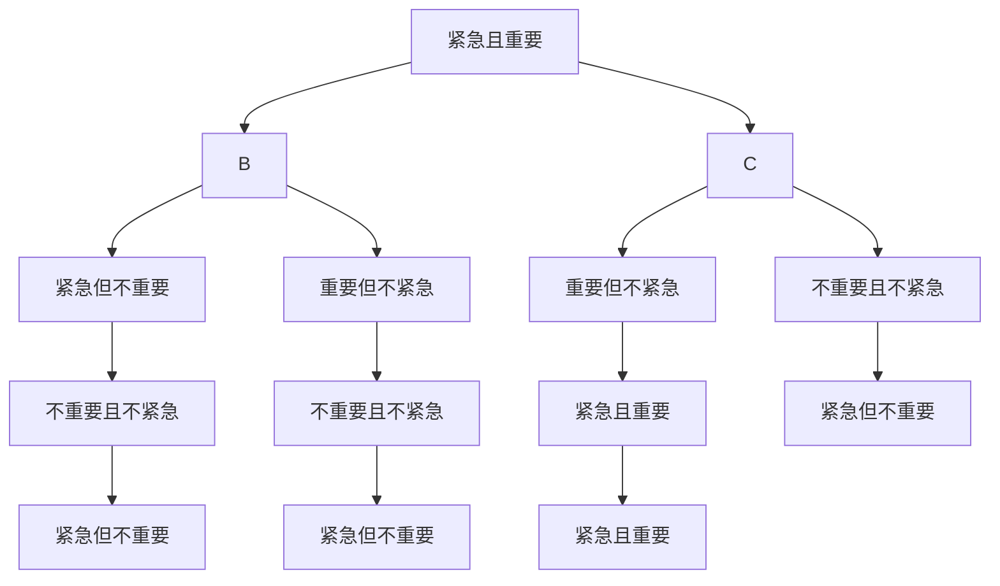
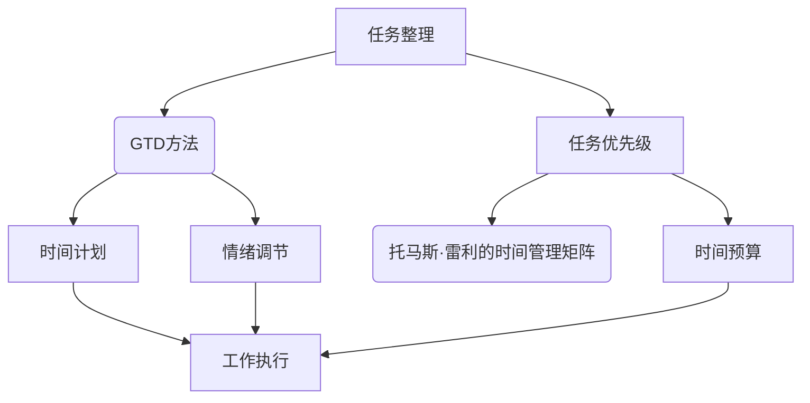
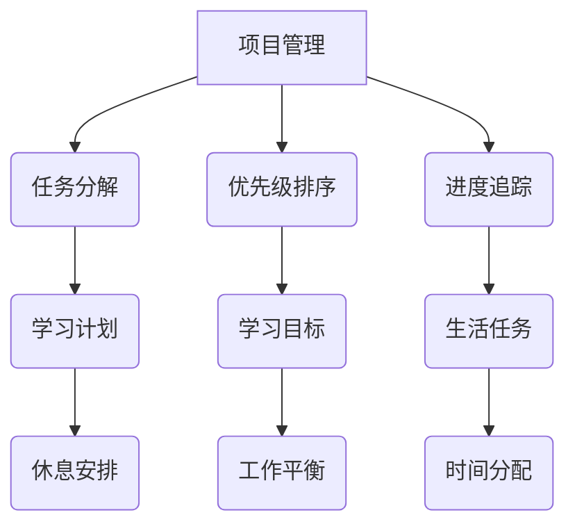

                 

### 文章标题：程序员的时间管理：平衡工作与知识创业

在当今高速发展的信息技术时代，程序员的角色日益重要。他们不仅需要高效完成日常编程任务，还要不断学习新技术，提升个人技能，甚至可能涉足知识创业领域。然而，面对繁忙的工作和不断涌现的新知识，如何有效地管理时间成为程序员面临的重大挑战。本文将深入探讨程序员的时间管理技巧，帮助大家平衡工作与知识创业，实现个人职业发展与生活质量的提升。

关键词：程序员、时间管理、工作平衡、知识创业、效率提升

摘要：本文将从时间管理理论基础、工作与时间管理、知识创业与时间管理以及案例分析等方面，详细探讨程序员如何通过有效的工具和方法，实现时间管理，平衡工作与知识创业。通过本文的阅读，读者将了解时间管理的重要概念与理论，掌握实际操作技巧，并为个人职业发展提供有力支持。

### 第一部分：时间管理理论基础

时间管理是提高工作效率、实现目标的关键。在这一部分，我们将首先介绍时间管理的核心概念与理论，包括时间价值评估、时间预算、托马斯·雷利的时间管理矩阵、埃克托尔·贝当古的时间管理定律以及比尔·里昂的4D时间管理法。接下来，我们将探讨时间管理中的工具与技术，如笔记本、日程表、时间跟踪工具，以及GTD（Getting Things Done）方法、番茄工作法、时间块策略与优先级排序。最后，我们将分析时间管理中的心理学因素，如焦虑、自律、情绪管理，并讨论这些因素对时间效能的影响。

#### 1.1 时间管理的核心概念与理论

##### 1.1.1 时间价值评估与时间预算

时间价值评估是时间管理的基石，它帮助我们理解时间的相对价值和重要性。经济学家亚当·斯密指出，时间是有价值的，每个个体都应当根据自身的时间和精力投入，评估不同活动的价值。时间预算则是将时间分配给不同任务的过程，通过合理的时间预算，我们可以确保每一项任务都得到充分的关注。

**示例：** 假设一名程序员每天有8小时的工作时间，他需要完成编程任务、参加会议、学习新技术等。通过时间价值评估，他可以确定哪些任务是最重要的，并分配相应的时间预算。

**伪代码：**
```python
def time_value_estimation(tasks, hours_per_day):
    time_value = {}
    for task in tasks:
        time_value[task] = hours_per_day / len(tasks)
    return time_value
```

##### 1.1.2 托马斯·雷利的时间管理矩阵

托马斯·雷利提出了一个经典的时间管理矩阵，将任务分为四个象限：紧急且重要、紧急但不重要、重要但不紧急、不重要且不紧急。这一矩阵帮助程序员识别并优先处理最重要的任务。

**示例：** 一名程序员发现他的任务包括紧急的bug修复、不紧急的代码优化、紧急的会议、不紧急的个人学习。根据时间管理矩阵，他应该优先处理紧急且重要的bug修复和会议，然后是重要但不紧急的代码优化，最后是个人学习。

**Mermaid流程图：**


##### 1.1.3 埃克托尔·贝当古的时间管理定律

埃克托尔·贝当古提出了“时间管理定律”，即“时间管理的有效性取决于个体对时间的感知和利用”。这意味着，除了工具和方法，个人对时间的感知和态度同样重要。

**示例：** 一名程序员如果对自己的工作时间有清晰的认识和计划，他能够更高效地完成任务。相反，如果他对时间缺乏感知，即使使用了最好的工具和方法，效果也可能大打折扣。

**数学公式：**
$$
E = f(T_i, T_e)
$$
其中，\( E \) 表示时间管理有效性，\( T_i \) 表示个体对时间的感知，\( T_e \) 表示时间利用效率。

##### 1.1.4 比尔·里昂的4D时间管理法

比尔·里昂提出了4D时间管理法，即确定（Define）、决定（Decide）、行动（Do）和审查（Delegate）。这一方法帮助程序员明确任务，做出决策，采取行动，并定期审查进度。

**示例：** 一名程序员在开始一天的工作前，可以使用4D时间管理法。首先，他确定当天的任务（Define），然后决定哪些任务是最重要的（Decide），接着采取行动（Do），最后在一天结束时审查自己的进度（Delegate）。

**伪代码：**
```python
def four_d_time_management(tasks):
    # 定义任务
    defined_tasks = define_tasks(tasks)
    # 决定任务优先级
    priority_tasks = decide_priority(defined_tasks)
    # 执行任务
    execute_tasks(priority_tasks)
    # 审查进度
    review_progress()
```

#### 1.2 时间管理工具与技术

有效的时间管理离不开工具的支持。在这一部分，我们将介绍几种常见的时间管理工具与技术，包括笔记本、日程表、时间跟踪工具，以及GTD（Getting Things Done）方法、番茄工作法、时间块策略与优先级排序。

##### 1.2.1 笔记本、日程表、时间跟踪工具

笔记本、日程表和时间跟踪工具是程序员日常时间管理的基础。笔记本用于记录想法、任务和笔记，日程表帮助我们规划每天的活动和时间，时间跟踪工具则帮助我们了解时间的实际使用情况。

**示例：** 一名程序员可以使用笔记本电脑记录工作计划和任务，使用日程表规划会议和个人学习时间，使用时间跟踪工具记录每天的工作时间分布。

**伪代码：**
```python
def time_management_tools(notes, calendar, time_tracker):
    # 记录任务
    record_tasks(notes)
    # 规划日程
    plan_daily_activities(calendar)
    # 跟踪时间
    track_time_spent(time_tracker)
```

##### 1.2.2 GTD（Getting Things Done）方法

GTD（Getting Things Done）方法是一种系统化的时间管理方法，它帮助程序员将所有任务和想法整理出来，并安排在合适的时

### 第一部分：时间管理理论基础

时间管理是提高工作效率、实现目标的关键。在这一部分，我们将首先介绍时间管理的核心概念与理论，包括时间价值评估、时间预算、托马斯·雷利的时间管理矩阵、埃克托尔·贝当古的时间管理定律以及比尔·里昂的4D时间管理法。接下来，我们将探讨时间管理中的工具与技术，如笔记本、日程表、时间跟踪工具，以及GTD（Getting Things Done）方法、番茄工作法、时间块策略与优先级排序。最后，我们将分析时间管理中的心理学因素，如焦虑、自律、情绪管理，并讨论这些因素对时间效能的影响。

#### 1.3 时间管理中的心理学因素

心理学因素在时间管理中扮演着至关重要的角色。焦虑、自律和情绪管理不仅影响程序员的工作效率，还直接影响他们的生活质量。在这一部分，我们将探讨这些因素如何影响时间管理，并提出相应的应对策略。

##### 1.3.1 焦虑与时间管理

焦虑是一种常见的情绪体验，但过度的焦虑会对时间管理产生负面影响。程序员在面临截止日期、项目压力或技术难题时，可能会感到焦虑。这种焦虑会导致注意力分散、效率降低，甚至可能影响到任务的完成质量。

**示例：** 一名程序员在即将到来的项目截止日期前感到焦虑，他可能会熬夜加班，试图在短时间内完成任务。然而，这种焦虑反而使他无法集中精力，导致任务质量下降。

**心理学原理：** 焦虑与注意力分散之间存在直接关系。当个体感到焦虑时，大脑会释放出应激激素，如肾上腺素和皮质醇，这些激素会干扰注意力，使个体难以集中精力。

**解决方法：** 面对焦虑，程序员可以采用以下策略：
- **深呼吸练习：** 深呼吸可以帮助放松身体，减少焦虑感。
- **分解任务：** 将大任务分解为小任务，逐步完成，以减少压力。
- **时间规划：** 制定合理的时间计划，为每个任务预留足够的时间，以减少紧迫感。

##### 1.3.2 自律与时间管理

自律是时间管理的关键因素。自律的程序员能够更好地控制自己的时间和行为，从而更有效地完成任务。然而，自律并非与生俱来，它需要通过不断的练习和自我监控来培养。

**示例：** 一名程序员发现自己经常在社交媒体上浪费时间，导致工作进度滞后。通过自律，他可以减少社交媒体的使用时间，专注于工作。

**心理学原理：** 自律与意志力密切相关。意志力是心理资源，它在决策和控制行为方面发挥着重要作用。然而，意志力是有限的，过度使用会导致意志力耗尽。

**解决方法：**
- **设定明确目标：** 明确的目标有助于提高自律，因为它们为个体提供了方向和动力。
- **分阶段实施：** 将目标分解为小阶段，逐步实现，以避免意志力耗尽。
- **自我监控：** 定期检查自己的行为，以确保遵守计划。

##### 1.3.3 情绪管理与时间效能

情绪管理对时间效能有着重要影响。情绪稳定的程序员能够更好地应对压力，保持专注，从而提高工作效率。相反，情绪波动会影响注意力和执行力，降低时间效能。

**示例：** 一名程序员在情绪低落时，可能会感到疲倦和无动力，导致工作进度缓慢。通过情绪管理，他可以恢复积极状态，提高工作效率。

**心理学原理：** 情绪管理与情绪调节技巧密切相关。情绪调节技巧包括自我放松、积极心态培养、情绪识别等，这些技巧有助于个体更好地管理自己的情绪。

**解决方法：**
- **认知重构：** 通过改变对事件的看法，减少负面情绪的影响。
- **积极心态：** 保持积极的心态，关注解决问题的方法，而不是问题本身。
- **休息与放松：** 定期休息和放松，以缓解压力，恢复精力。

#### 1.4 时间管理理论的联系与综合应用

时间管理的不同理论和方法之间存在紧密的联系，它们共同构成了一个完整的时间管理体系。在实际应用中，程序员可以根据自身情况，综合运用这些理论和方法，以实现高效的时间管理。

**核心概念联系：**
- **时间价值评估** 与 **时间预算**：时间价值评估为时间预算提供了基础，通过评估不同任务的价值，程序员可以更合理地分配时间。
- **托马斯·雷利的时间管理矩阵** 与 **4D时间管理法**：时间管理矩阵帮助程序员识别任务的紧急程度和重要性，4D时间管理法则提供了一个系统化的方法，帮助程序员明确任务、做出决策、采取行动和审查进度。
- **GTD方法** 与 **情绪管理**：GTD方法通过系统化的任务管理，帮助程序员整理思绪，减少焦虑；情绪管理则帮助程序员保持积极心态，提高工作效率。

**综合应用示例：**
- **任务管理：** 程序员可以使用GTD方法整理任务清单，并根据托马斯·雷利的时间管理矩阵确定任务优先级。
- **时间分配：** 结合时间价值评估和时间预算，程序员可以制定合理的时间计划，确保每项任务都得到足够的时间和资源。
- **情绪调节：** 通过情绪管理技巧，如认知重构和积极心态培养，程序员可以在面对压力和挑战时保持冷静，提高时间效能。

**Mermaid流程图：**


通过上述综合应用，程序员可以在日常工作中实现高效的时间管理，提高工作效率，实现个人职业发展的同时，保持良好的生活质量。

### 第二部分：工作与时间管理

在工作与时间管理中，程序员面临的主要挑战是如何在有限的工时内高效完成任务，同时保持个人发展的平衡。这一部分将重点探讨如何进行工作任务管理、工作时间规划与效率提升，以及项目管理中的时间管理技巧。

#### 2.1 工作任务管理

工作任务管理是时间管理的核心环节，合理的任务管理能够帮助程序员提高工作效率，确保任务按时完成。以下是一些关键任务管理策略：

##### 2.1.1 任务优先级与分类

在任务管理中，确定任务优先级是至关重要的。程序员可以通过以下方法来分类和优先化任务：

**示例：** 假设一名程序员有以下任务：
- 修复三个紧急的bug
- 参加一个重要的团队会议
- 完成一份技术文档
- 学习一项新技术

根据任务的紧急程度和重要性，他可以将这些任务分为以下类别：
- 紧急且重要：修复bug
- 重要但不紧急：学习新技术
- 紧急但不重要：参加团队会议
- 不紧急且不重要：完成技术文档

**伪代码：**
```python
def prioritize_tasks(tasks):
    urgent_important = []
    important_not_urgent = []
    urgent_not_important = []
    not_urgent_not_important = []
    for task in tasks:
        if is_urgent(task) and is_important(task):
            urgent_important.append(task)
        elif is_important(task):
            important_not_urgent.append(task)
        elif is_urgent(task):
            urgent_not_important.append(task)
        else:
            not_urgent_not_important.append(task)
    return urgent_important, important_not_urgent, urgent_not_important, not_urgent_not_important
```

##### 2.1.2 任务分解与进度追踪

大任务往往难以一次完成，因此任务分解是任务管理的重要策略。通过将大任务分解为小任务，程序员可以更清晰地了解任务进度，并逐步完成。

**示例：** 将“开发一个新功能”分解为以下子任务：
- 设计数据库模型
- 编写接口代码
- 实现功能逻辑
- 进行单元测试

**伪代码：**
```python
def decompose_task(task):
    sub_tasks = []
    if is_complex(task):
        sub_tasks.append("设计数据库模型")
        sub_tasks.append("编写接口代码")
        sub_tasks.append("实现功能逻辑")
        sub_tasks.append("进行单元测试")
    return sub_tasks
```

进度追踪则是确保任务按时完成的关键。程序员可以使用项目管理系统（如Jira、Trello等）来监控任务进度。

**示例：** 在Jira中创建任务，并设置进度追踪：
- 为每个子任务创建一个Jira任务
- 设置任务的开始和截止日期
- 更新任务的状态（如“进行中”、“已完成”）

##### 2.1.3 拓扑排序与任务调度

在任务之间存在依赖关系时，拓扑排序可以帮助程序员确定任务的执行顺序，确保依赖任务先完成。

**示例：** 假设任务之间存在以下依赖关系：
- 编写接口代码（依赖数据库模型）
- 实现功能逻辑（依赖接口代码）
- 进行单元测试（依赖功能逻辑）

使用拓扑排序，可以确定以下执行顺序：
1. 设计数据库模型
2. 编写接口代码
3. 实现功能逻辑
4. 进行单元测试

**伪代码：**
```python
def topological_sort(tasks):
    in_degree = {task: 0 for task in tasks}
    for task in tasks:
        for dependent in get_dependents(task):
            in_degree[dependent] += 1

    queue = [task for task, degree in in_degree.items() if degree == 0]
    sorted_tasks = []

    while queue:
        current_task = queue.pop(0)
        sorted_tasks.append(current_task)

        for dependent in get_dependents(current_task):
            in_degree[dependent] -= 1
            if in_degree[dependent] == 0:
                queue.append(dependent)

    return sorted_tasks
```

##### 2.1.4 任务协作与沟通技巧

在团队环境中，任务协作和沟通技巧对时间管理至关重要。以下是一些实用的技巧：

- **定期会议：** 定期召开团队会议，讨论任务进度、问题解决方案和下一步计划。
- **明确分工：** 确保每个团队成员都清楚自己的任务和责任，避免重复工作和责任不清。
- **及时反馈：** 及时提供任务反馈，确保任务按时完成，并在遇到问题时迅速找到解决方案。

**示例：** 在团队中使用Scrum框架，通过每日站会、周会和迭代回顾会议，确保任务的高效协作和沟通。

**伪代码：**
```python
def team_meetings(tasks, team_members):
    # 每日站会
    daily_scrum(tasks)
    # 周会
    weekly_meeting(tasks, team_members)
    # 迭代回顾会议
    retrospective Meeting(tasks, team_members)
```

#### 2.2 工作时间规划与效率提升

工作时间规划是提高工作效率的关键。以下是一些时间规划策略和效率提升技巧：

##### 2.2.1 工作时间分配策略

合理的工作时间分配能够帮助程序员更有效地完成任务。以下是一种常见的时间分配策略：

- **工作日安排：** 每个工作日设定明确的工作目标，确保工作内容有条不紊。
- **休息与放松：** 每小时工作后休息5-10分钟，每工作4小时后休息15-30分钟，以保持精力充沛。

**示例：**
- **工作日时间表：**
  - 9:00 - 9:30 晨会
  - 9:30 - 12:00 编码
  - 12:00 - 13:00 午餐与休息
  - 13:00 - 15:00 编码
  - 15:00 - 15:15 休息
  - 15:15 - 17:30 编码
  - 17:30 - 18:00 检查任务清单

**伪代码：**
```python
def work_day_schedule():
    schedule = {
        "9:00 - 9:30": "晨会",
        "9:30 - 12:00": "编码",
        "12:00 - 13:00": "午餐与休息",
        "13:00 - 15:00": "编码",
        "15:00 - 15:15": "休息",
        "15:15 - 17:30": "编码",
        "17:30 - 18:00": "检查任务清单"
    }
    return schedule
```

##### 2.2.2 工作场所的时间管理

工作场所的环境和时间管理对工作效率有重要影响。以下是一些建议：

- **减少干扰：** 保持工作区的整洁，减少不必要的物品，避免分散注意力。
- **专注时间段：** 利用专注时间段（如番茄工作法），提高工作集中度。
- **弹性工作时间：** 如果可能，实行弹性工作时间，以适应个人工作和生活节奏。

**示例：** 程序员可以在专注时间段内关闭社交媒体，专注于编码任务。

**伪代码：**
```python
def focus_session(duration):
    start_time = current_time()
    end_time = start_time + duration
    while current_time() < end_time:
        work_on_coding()
    return end_time - start_time
```

##### 2.2.3 时间管理中的误区与解决方法

在实际工作中，程序员可能会遇到一些时间管理误区，以下是一些常见的误区及其解决方法：

- **过度多任务处理：** 试图同时处理多个任务会导致注意力分散，降低工作效率。解决方法是专注于单个任务，直到完成。
- **忽视休息：** 忽视休息会导致疲劳，降低工作效率。解决方法是定期休息，确保精力充沛。
- **缺乏计划：** 缺乏计划会导致时间浪费，任务无法按时完成。解决方法是制定详细的时间计划，并严格执行。

**示例：** 程序员可以每天晚上回顾当天的工作，找出时间管理中的不足，并制定第二天的改进计划。

**伪代码：**
```python
def review_day():
    tasks_completed = get_completed_tasks()
    time_spent = get_time_spent()
    inefficiencies = find_inefficiencies(tasks_completed, time_spent)
    improvements = plan_improvements(inefficiencies)
    return improvements
```

##### 2.2.4 工作效率评估与优化

评估工作效率是时间管理的重要环节。以下是一种工作效率评估方法：

- **时间记录：** 详细记录每天的工作时间，包括任务开始和结束时间，以及中间休息时间。
- **任务完成率：** 计算任务完成率，即完成的任务数与总任务数的比例。
- **工作质量：** 对完成的工作进行质量评估，确保达到预期标准。

**示例：** 程序员可以使用时间跟踪工具（如Toggl）记录每天的工作时间，并定期评估任务完成率和工作质量。

**伪代码：**
```python
def efficiency_evaluation(time_records, task_completion_rate, work_quality):
    total_time = sum(time_records.values())
    total_tasks = len(time_records)
    completed_tasks = sum(task_completion_rate.values())
    average_quality = sum(work_quality.values()) / len(work_quality)
    efficiency = (completed_tasks / total_tasks) * average_quality
    return efficiency
```

通过上述策略和方法，程序员可以更有效地管理工作时间，提高工作效率，实现工作与个人发展的平衡。

### 2.3 项目管理中的时间管理

在项目管理中，时间管理是确保项目按时、按质量完成的关键环节。时间管理的有效实施可以极大地提升项目成功率，同时减轻团队成员的工作压力。以下将详细探讨项目管理中的时间管理技巧，包括项目进度监控与调整、项目风险管理与时间缓冲、项目团队时间协作，以及项目时间管理的工具与实践。

#### 2.3.1 项目进度监控与调整

项目进度监控是确保项目按计划进行的关键。通过定期监控项目进度，项目经理可以及时发现并解决潜在问题，确保项目按计划完成。

**示例：** 假设一个软件开发项目，计划在6个月内完成。项目经理可以采用以下步骤监控项目进度：

1. **制定项目计划：** 确定项目的关键里程碑和交付物，制定详细的项目计划。
2. **设置监控指标：** 制定关键绩效指标（KPIs），如进度百分比、任务完成率等。
3. **定期进度汇报：** 每周或每月召开项目进度会议，收集团队成员的工作进展，并记录在项目管理系统（如Jira、Trello等）中。
4. **分析进度偏差：** 比较实际进度与计划进度，分析偏差原因，并制定调整措施。

**伪代码：**
```python
def project_progress_monitoring(plan, metrics, progress_reports):
    current_progress = get_current_progress(progress_reports)
    for metric in metrics:
        if current_progress[metric] < plan[metric]:
            adjust_plan()
        else:
            confirm_progress()
```

在发现进度偏差时，项目经理可以采取以下调整措施：

- **重新分配资源：** 根据实际进度，调整团队成员的工作任务，确保关键任务得到足够的资源支持。
- **调整计划：** 如果计划无法按原定时间完成，可以调整计划，增加额外的时间缓冲，或重新安排任务优先级。
- **加强沟通：** 通过团队会议、邮件等方式，确保团队成员了解项目进展和调整措施，减少误解和沟通成本。

#### 2.3.2 项目风险管理与时间缓冲

项目风险管理是项目管理中的重要环节，通过识别、评估和应对风险，可以降低项目失败的可能性。时间缓冲（时间缓冲是指为项目预留的额外时间，以应对不确定因素）是项目风险管理的重要手段。

**示例：** 假设一个软件开发项目的计划时间为6个月，项目经理可以采取以下步骤进行风险管理：

1. **识别风险：** 通过团队讨论、专家评估等方式，识别项目可能面临的风险，如技术难题、资源不足、外部依赖等。
2. **评估风险：** 评估每个风险的严重程度和概率，确定风险优先级。
3. **制定应对措施：** 为每个风险制定应对措施，包括规避、转移、减轻和接受等策略。
4. **设置时间缓冲：** 根据风险评估结果，为项目设置适当的时间缓冲，确保项目在遇到风险时仍有足够的时间进行调整。

**伪代码：**
```python
def project_risk_management(risks, risk_priority, risk.mitigation_measures):
    for risk in risks:
        if risk['priority'] == 'High':
            add_time_buffer(risk['probability'], project_duration)
        elif risk['priority'] == 'Medium':
            add_time_buffer(risk['probability'], project_duration * 0.5)
        elif risk['priority'] == 'Low':
            add_time_buffer(risk['probability'], project_duration * 0.2)
    return project_duration
```

通过上述风险管理措施，项目经理可以降低项目失败的风险，确保项目按时完成。

#### 2.3.3 项目团队时间协作

项目团队的时间协作是项目成功的关键因素。以下是一些提高团队时间协作效率的策略：

1. **明确角色与责任：** 确保每个团队成员都清楚自己的角色和责任，避免工作重叠和责任不清。
2. **定期沟通与协调：** 通过团队会议、邮件、即时通讯工具等方式，定期沟通项目进展，协调团队成员的工作。
3. **共享资源与信息：** 建立共享资源平台，确保团队成员可以方便地获取项目资料、工具和文档。
4. **协同工作：** 利用协同工具（如Git、Trello、Slack等），实现团队成员的协同工作，提高工作效率。

**示例：** 项目经理可以使用Trello进行任务分配和进度跟踪，团队成员通过Slack进行实时沟通和协作。

**伪代码：**
```python
def team_collaboration(team_members, tasks, communication_tools):
    assign_tasks_to_members(tasks, team_members)
    schedule_team_meetings(communication_tools)
    share_resources(team_members)
    start_collaborative_work()
```

#### 2.3.4 项目时间管理的工具与实践

在项目管理中，时间管理的工具和实践对于提高效率、减少错误具有重要意义。以下是一些常用的项目时间管理工具和实践：

1. **甘特图：** 甘特图是一种常用的项目管理工具，用于展示项目进度和任务安排。通过甘特图，项目经理可以直观地了解项目的整体进展。
2. **里程碑管理：** 里程碑是项目中的重要节点，标志着项目的阶段性完成。通过设置和跟踪里程碑，项目经理可以确保项目按计划进行。
3. **敏捷开发：** 敏捷开发是一种以迭代和增量开发为特征的项目管理方法，通过短周期迭代，快速响应变化，提高项目成功率。
4. **看板管理：** 看板管理是一种基于可视化管理的项目进度监控方法，通过看板（如Kanban板），团队成员可以实时了解任务状态和进度。

**示例：** 项目经理可以使用Jira进行甘特图绘制、里程碑管理和看板管理，结合敏捷开发方法，提高项目时间管理效率。

**伪代码：**
```python
def project_time_management工具（gantt_chart, milestones, agile_development, kanban_board):
    create_gantt_chart()
    set_milestones()
    adopt_agile_development()
    implement_kanban_board()
```

通过上述工具和实践，项目经理可以更有效地管理项目时间，确保项目按时、按质量完成。

### 第三部分：知识创业与时间管理

在信息时代，知识创业成为越来越多程序员的选择。然而，创业过程中，时间管理变得尤为重要。本部分将探讨知识创业概述，包括定义与特征、优势与挑战，以及知识创业中的价值与意义。接着，我们将深入讨论知识创业中的时间管理，涵盖创业项目的时间规划、时间分配、时间压力管理以及创业团队的时间协作。

#### 3.1 知识创业概述

知识创业是一种以知识创新和技术创新为核心的创业模式，它结合了创意、技术和市场，旨在创造新的商业机会。知识创业通常涉及软件开发、技术咨询服务、教育培训、内容创作等领域。

##### 3.1.1 知识创业的定义与特征

知识创业是指创业者利用自身专业知识、技术积累和市场洞察，创建新的企业或产品，通过知识变现实现商业价值。与传统的劳动密集型创业不同，知识创业更依赖于智力资源和创新能力。

**定义：**
知识创业是指以知识创新为核心，依托个人或团队的专业知识和技能，通过技术创新和商业模式创新，创造新的商业机会并实现商业价值的过程。

**特征：**
- **知识驱动：** 知识创业依赖于创业者的专业知识和创新能力，技术创新是驱动创业成功的关键。
- **高技术含量：** 知识创业往往涉及高技术含量的产品或服务，如软件开发、人工智能应用等。
- **灵活性：** 知识创业通常具有较强的灵活性，创业者可以根据市场需求和技术趋势快速调整业务方向。
- **高风险高收益：** 知识创业面临较大的市场和技术风险，但一旦成功，回报往往非常可观。

##### 3.1.2 知识创业的优势与挑战

知识创业具有以下优势：

1. **资源利用效率高：** 知识创业通常不需要大量的物质资源，主要依赖于创业者的智力资源和创新能力，这使得创业成本相对较低。
2. **市场潜力大：** 随着信息技术的快速发展，知识创业的市场需求日益旺盛，为创业者提供了广阔的发展空间。
3. **创新能力强：** 知识创业以知识创新和技术创新为核心，创业者具备较强的创新能力，能够快速响应市场变化。

然而，知识创业也面临诸多挑战：

1. **技术风险：** 知识创业通常涉及高技术含量的产品或服务，技术风险是创业者需要面对的重要挑战。
2. **市场风险：** 新产品或服务在市场上的接受度难以预测，市场风险较大。
3. **竞争压力：** 知识创业领域竞争激烈，创业者需要不断创新，以保持竞争优势。

##### 3.1.3 知识创业的价值与意义

知识创业不仅对创业者个人具有重要意义，也对社会和经济发展产生深远影响。

1. **个人价值：** 知识创业帮助程序员实现自我价值，通过创业实现职业发展和财富积累，提升个人生活质量。
2. **社会价值：** 知识创业推动技术创新和产业升级，促进经济增长和社会进步。
3. **经济价值：** 知识创业创造了大量的就业机会，带动相关产业链的发展，对区域经济具有显著的促进作用。

#### 3.2 知识创业中的时间管理

知识创业过程中，时间管理至关重要。创业者需要合理安排时间，确保创业项目顺利推进，同时保持身心健康。以下将详细探讨知识创业中的时间管理。

##### 3.2.1 创业项目的时间规划

创业项目的时间规划是确保项目按计划进行的基础。创业者需要制定详细的项目计划，明确项目的目标、任务和时间节点。

**示例：** 假设一个软件开发项目的计划时间为6个月，创业者可以采取以下步骤进行时间规划：

1. **确定项目目标：** 明确项目的最终目标，如开发一个软件产品、提供一项技术服务等。
2. **分解任务：** 将项目目标分解为具体的子任务，如需求分析、设计、编码、测试等。
3. **设定时间节点：** 为每个子任务设定具体的开始和结束时间，形成时间节点计划。
4. **制定里程碑：** 根据时间节点计划，制定项目的关键里程碑，如产品原型完成、内部测试完成等。

**伪代码：**
```python
def project_time_planning(project_goals, sub_tasks, milestones):
    plan = {}
    for task in sub_tasks:
        plan[task] = {'start': start_date, 'end': end_date}
    milestones = set_milestones(plan)
    return plan, milestones
```

##### 3.2.2 创业过程中的时间分配

合理的时间分配是确保创业项目顺利进行的关键。创业者需要根据项目需求和自身能力，合理分配时间和资源。

**示例：** 假设一个创业者每天有8小时的时间可以用于创业项目，他可以采取以下步骤进行时间分配：

1. **确定优先级：** 根据项目需求和任务优先级，确定每个任务的时间投入。
2. **均衡分配：** 尽量确保每天的时间分配均衡，避免过度集中或分散。
3. **灵活调整：** 根据实际情况，灵活调整时间分配，确保关键任务得到足够的时间。

**伪代码：**
```python
def time_allocation(tasks, daily_time):
    allocation_plan = {}
    total_time = daily_time
    for task in tasks:
        if task['priority'] == 'High':
            allocation_plan[task['name']] = max(2, (total_time * 0.3) // len(tasks))
        elif task['priority'] == 'Medium':
            allocation_plan[task['name']] = max(1, (total_time * 0.5) // len(tasks))
        else:
            allocation_plan[task['name']] = max(0.5, (total_time * 0.2) // len(tasks))
        total_time -= allocation_plan[task['name']]
    return allocation_plan
```

##### 3.2.3 知识创业中的时间压力管理

时间压力是知识创业中常见的问题。创业者需要学会应对时间压力，确保身心健康和创业项目的顺利进行。

**示例：** 假设一个创业者在创业过程中感到时间压力，他可以采取以下策略：

1. **分解任务：** 将大任务分解为小任务，逐步完成，减少心理压力。
2. **优先级排序：** 识别和优先处理最重要的任务，确保关键任务按时完成。
3. **时间管理技巧：** 使用时间管理技巧，如番茄工作法、时间块策略等，提高工作效率。

**伪代码：**
```python
def manage_time_pressure(tasks, time_management_skills):
    sorted_tasks = prioritize_tasks(tasks)
    for task in sorted_tasks:
        if time_management_skills['pomodoro'] and task['duration'] > 25:
            execute_task_with_pomodoro(task)
        elif time_management_skills['time_blocks'] and task['duration'] > 10:
            execute_task_with_time_blocks(task)
        else:
            execute_task(task)
```

##### 3.2.4 创业团队的时间协作

在知识创业过程中，团队的时间协作至关重要。创业者需要建立有效的团队时间协作机制，确保团队成员之间的高效合作。

**示例：** 假设一个创业团队有以下任务和时间协作需求：

1. **任务分配：** 确定每个成员的任务和职责。
2. **沟通协调：** 通过即时通讯工具、邮件、会议等方式，保持团队成员之间的沟通和协调。
3. **进度追踪：** 使用项目管理系统（如Trello、Jira等），实时追踪任务进度和团队协作情况。

**伪代码：**
```python
def team_time_collaboration(team_members, tasks, communication_tools, project_management_tools):
    assign_tasks_to_members(tasks, team_members)
    establish_communication_channel(communication_tools)
    track_team_progress(project_management_tools)
    schedule_meetings(communication_tools)
```

通过上述时间管理策略，创业者可以更有效地管理创业过程中的时间，确保项目顺利进行，实现创业目标。

### 第四部分：案例分析

为了更好地理解程序员如何在实际工作中应用时间管理技巧，本部分将介绍三个具体的案例分析。第一个案例是某大型互联网公司的员工时间管理实践，第二个案例是某创业者的时间管理经验，第三个案例则是时间管理工具在知识创业中的应用。

#### 4.1 案例分析一：某大型互联网公司的员工时间管理实践

**公司背景与时间管理现状**

某大型互联网公司，拥有超过1000名员工，业务涵盖软件开发、产品设计、数据分析等多个领域。然而，随着公司规模的扩大和业务范围的拓展，员工们普遍反映时间管理压力较大，工作效率不高。为了改善这一现状，公司决定推行一套系统化的时间管理策略。

**时间管理策略与方法**

1. **时间管理培训：** 公司为所有员工提供时间管理培训，介绍时间管理的核心概念和技巧，如GTD方法、番茄工作法等。
2. **工具使用：** 推广使用时间管理工具，如Google Calendar、Trello、Jira等，帮助员工规划和跟踪任务进度。
3. **任务优先级管理：** 员工每周进行任务优先级排序，确保紧急且重要的任务得到优先处理。
4. **定期回顾：** 公司每月组织时间管理回顾会议，员工分享时间管理心得，讨论遇到的问题和解决方案。

**实施效果与评价**

通过上述措施，公司员工的时间管理能力得到了显著提升。具体表现在：

- **工作效率提高：** 员工能够更高效地完成任务，项目交付时间明显缩短。
- **工作压力减轻：** 员工对时间的掌控感增强，工作压力得到缓解。
- **团队合作提升：** 通过工具的使用和定期的沟通协调，团队协作效率提高。

**总结与建议**

该案例表明，通过系统化的培训、工具使用和定期回顾，可以有效提升员工的时间管理能力。对于其他企业，可以借鉴以下建议：

- **提供培训：** 定期为员工提供时间管理培训，提高他们的时间管理意识。
- **推广工具：** 选择适合企业需求的时间管理工具，并确保员工熟练使用。
- **建立回顾机制：** 定期组织时间管理回顾会议，帮助员工总结经验，改进方法。

#### 4.2 案例分析二：某创业者的时间管理经验

**创业者背景与时间管理需求**

小李是一位年轻的创业者，创办了一家专注于人工智能应用的公司。公司初期，小李不仅需要负责技术研发，还要处理市场推广、客户沟通等事务。由于事务繁多，小李发现自己很难平衡工作与个人生活，时间管理成为一大难题。

**时间管理策略与实践**

1. **明确目标：** 小李制定了明确的工作和个人目标，确保每项任务都有清晰的优先级。
2. **使用工具：** 小李使用了Trello进行任务管理，利用Google Calendar进行日程安排，使用Focus@Will提升工作效率。
3. **时间块策略：** 小李采用了时间块策略，将每天的工作时间分为多个时间段，每个时间段专注于一项任务。
4. **定期反思：** 每周，小李会花时间反思自己的时间管理，找出不足并制定改进措施。

**创业成功与时间管理的关系**

通过有效的时间管理，小李的公司在短短一年内取得了显著进展。具体表现在：

- **任务完成率提高：** 小李能够更高效地完成各项任务，确保公司运营顺利进行。
- **团队协作增强：** 通过时间块策略和工具使用，团队成员之间的协作更加顺畅。
- **生活质量提升：** 小李通过合理的时间管理，减少了工作对个人生活的干扰，生活质量得到改善。

**总结与建议**

小李的案例表明，有效的时间管理对于创业者至关重要。以下是给创业者的建议：

- **明确目标：** 制定清晰的短期和长期目标，确保每项任务都有明确的方向。
- **合理利用工具：** 选择适合的时间管理工具，提高工作效率和任务跟踪能力。
- **定期反思：** 定期回顾时间管理情况，不断优化策略。

#### 4.3 案例分析三：时间管理工具在知识创业中的应用

**时间管理工具的选择与应用**

小明是一位知识创业者，专注于人工智能领域的咨询和培训。为了更好地管理时间和提高工作效率，小明选择了一系列时间管理工具：

1. **Notion：** 用于任务管理和笔记整理，小明将所有的任务和笔记都记录在Notion中，方便随时查看和调整。
2. **Asana：** 用于团队协作和任务分配，小明和他的团队成员通过Asana协同工作，确保任务按时完成。
3. **Google Calendar：** 用于日程安排，小明将自己的日程安排在Google Calendar中，确保不会错过重要会议和活动。

**工具对知识创业的促进作用**

时间管理工具的应用极大地提升了小明的创业效率。具体表现在：

- **任务管理：** 通过Notion和Asana，小明能够清晰地看到任务的进展，确保每项任务都在按计划进行。
- **团队协作：** 通过Asana，团队成员之间的协作更加高效，任务分配和进度跟踪更加透明。
- **日程管理：** 通过Google Calendar，小明能够合理安排自己的时间，确保工作与个人生活的平衡。

**使用中的挑战与解决方案**

尽管时间管理工具带来了诸多便利，但在使用过程中，小明也遇到了一些挑战：

1. **工具过多：** 小明开始使用多个工具，但发现有时会忘记在哪个工具上记录任务，导致任务丢失。解决方案是整合工具，只使用一个核心工具进行任务管理。
2. **时间压力：** 尽管时间管理工具提高了工作效率，但有时小明仍会感到时间压力。解决方案是合理分配时间，确保每个任务都有足够的时间完成，避免紧急任务堆积。

**总结与建议**

通过上述案例分析，我们可以看到，时间管理工具在知识创业中发挥着重要作用。以下是给知识创业者的建议：

- **选择合适的工具：** 根据个人需求和团队规模，选择最合适的时间管理工具，避免工具过多导致混乱。
- **合理使用工具：** 熟练使用工具，确保每个任务都有明确的记录和进度跟踪。
- **保持灵活性：** 在使用时间管理工具的同时，保持灵活性，根据实际情况调整任务和时间安排。

通过有效的案例分析，程序员和创业者可以借鉴成功经验，优化自己的时间管理策略，实现更好的工作与生活平衡。

### 第五部分：时间管理技巧提升

在实现高效时间管理的过程中，技巧的提升至关重要。本部分将深入探讨如何通过时间管理技巧提升、时间管理心理学提升以及时间管理方法论提升，进一步优化程序员的工作和生活。

#### 5.1 时间管理技巧提升

时间管理技巧的提升能够显著提高工作效率和生活质量。以下是一些实用的高效时间管理技巧：

##### 5.1.1 高效时间管理技巧

1. **设定明确的目标：** 明确的目标有助于提高时间管理的方向性和动力。程序员可以定期设定短期和长期目标，确保每项任务都有明确的方向。
2. **优先级排序：** 根据任务的紧急程度和重要性，对任务进行优先级排序。紧急且重要的任务应优先处理，重要但不紧急的任务则安排在空闲时间。
3. **任务分解：** 将大任务分解为小任务，逐步完成。这样可以降低任务的难度，提高完成率。
4. **定期回顾：** 每周或每月定期回顾自己的时间管理情况，总结经验，发现问题，并制定改进措施。

**示例：** 一名程序员可以每周设定一次回顾时间，分析一周的工作进展，总结成功经验和不足之处，并调整下周的计划。

##### 5.1.2 时间管理技巧的自我提升

自我提升是时间管理技巧提升的关键。以下是一些自我提升的方法：

1. **学习和实践：** 通过阅读相关书籍、参加培训课程，了解最新的时间管理方法和技巧。同时，通过实际操作，将这些技巧应用到日常生活中。
2. **时间日志记录：** 通过记录时间日志，了解自己的时间使用情况，找出时间浪费的地方，并制定改进计划。
3. **反思与调整：** 定期反思时间管理效果，根据实际情况进行调整。如果发现某种技巧不适用，可以尝试其他方法。

**伪代码：**
```python
def time_management_self_improvement():
    learn_new_skills()
    record_time_log()
    reflect_and_adjust()
```

##### 5.1.3 时间管理技巧的应用场景分析

不同场景下，时间管理技巧的应用有所不同。以下是一些常见应用场景及其对应的时间管理技巧：

1. **项目管理：** 在项目管理中，时间管理技巧包括任务分解、优先级排序、进度追踪等。通过这些技巧，项目经理可以确保项目按计划进行。
2. **个人学习：** 在个人学习过程中，时间管理技巧包括设定学习目标、制定学习计划、合理安排学习时间等。这样可以提高学习效率，确保学习目标的实现。
3. **日常生活：** 在日常生活中，时间管理技巧包括设定日常任务清单、合理安排休息时间、避免过度消费等。这样可以提高生活质量，实现工作与生活的平衡。

**Mermaid流程图：**


通过上述技巧和应用场景分析，程序员可以更好地掌握时间管理方法，提高工作效率和生活质量。

#### 5.2 时间管理心理学提升

心理学因素在时间管理中起着关键作用。以下将探讨情绪管理、自律和时间效能提升等内容，帮助程序员在时间管理中保持心理健康。

##### 5.2.1 情绪管理与时间管理

情绪管理是时间管理的重要一环。情绪不稳定会导致时间效能下降，影响工作效率。以下是一些情绪管理技巧：

1. **认知重构：** 通过改变对事物的看法，减少负面情绪的影响。例如，将“任务太多”重构为“有更多的机会提升自己”。
2. **积极心态培养：** 保持积极的心态，关注解决问题的方法，而不是问题本身。这样可以减少压力，提高时间效能。
3. **深呼吸练习：** 在感到焦虑或紧张时，通过深呼吸练习来放松身心，减轻情绪波动。

**示例：** 一名程序员在遇到紧急任务时，通过深呼吸练习和积极心态培养，能够更好地应对压力，提高工作效率。

**伪代码：**
```python
def emotional_management():
    cognitive_restructuring()
    cultivate_positive_mindset()
    practice_deep_breathing()
```

##### 5.2.2 自律与时间管理

自律是时间管理的关键因素。缺乏自律会导致时间浪费，任务无法按时完成。以下是一些自律提升方法：

1. **设定明确目标：** 明确的目标有助于提高自律，因为它们为个体提供了方向和动力。
2. **分阶段实施：** 将目标分解为小阶段，逐步实现，以避免自律耗尽。
3. **自我监控：** 定期检查自己的行为，以确保遵守计划。

**示例：** 一名程序员通过设定明确的学习目标、分阶段实施学习和定期自我检查，能够有效提升自律。

**伪代码：**
```python
def self_discipline():
    set_clear_goals()
    implement_step_by_step()
    conduct_self_inspection()
```

##### 5.2.3 情绪调节技巧与时间效能

情绪调节技巧有助于提升时间效能。以下是一些实用的情绪调节技巧：

1. **时间规划：** 合理规划时间，确保每项任务都有足够的时间完成，避免时间浪费和紧迫感。
2. **情绪记录：** 记录自己的情绪变化，了解情绪波动的原因，并采取相应措施。
3. **放松技巧：** 学习和运用放松技巧，如瑜伽、冥想等，以缓解压力，提高情绪调节能力。

**示例：** 一名程序员通过情绪记录和放松技巧，能够更好地管理自己的情绪，提高时间效能。

**伪代码：**
```python
def emotional Regulation():
    plan_time разумно()
    record_emotions()
    practice_relaxation_skills()
```

通过情绪管理、自律提升和情绪调节技巧，程序员可以在时间管理中保持心理健康，提高工作效率和生活质量。

#### 5.3 时间管理方法论提升

时间管理方法论的提升有助于程序员更好地应对复杂的工作环境，实现高效时间管理。以下将介绍GTD（Getting Things Done）实践、项目管理中的时间管理方法论以及创业中的时间管理方法论。

##### 5.3.1 GTD（Getting Things Done）实践

GTD是一种系统化的时间管理方法，它帮助程序员将所有任务和想法整理出来，并安排在合适的时

### 附录

#### 附录 A：时间管理资源与工具推荐

在时间管理的过程中，选择合适的资源与工具至关重要。以下是一些推荐的时间管理书籍、应用程序和网站资源，供读者参考。

##### A.1 时间管理书籍推荐

1. **《时间管理的艺术》（The Time Management Artist）** - 凯文·达顿（Kevin D. Day）著。本书详细介绍了时间管理的核心概念和实践方法，适用于各个领域的读者。
2. **《掌控你的人生》（Essentialism: The Disciplined Pursuit of Less）** - 格雷格·麦克戈文（Greg McKeown）著。本书介绍了如何通过聚焦于最重要的事情来提高效率和生活质量。
3. **《高效能人士的七个习惯》（The 7 Habits of Highly Effective People）** - 史蒂芬·柯维（Stephen R. Covey）著。本书提供了关于个人效能的全面指南，包括时间管理和人际关系等方面。

##### A.2 时间管理应用程序推荐

1. **Trello** - 一款简单直观的任务管理工具，适合团队协作和个人任务管理。
2. **Asana** - 一款功能强大的项目管理工具，适用于复杂的项目和时间跟踪。
3. **Google Calendar** - Google提供的日历应用，支持事件提醒、日程共享等，便于个人和团队时间管理。
4. ** RescueTime** - 一款时间跟踪工具，可以帮助用户了解自己的时间使用情况，优化时间分配。

##### A.3 时间管理网站资源推荐

1. **Lifehacker** - 一个提供生活技巧和生产力工具的网站，包括时间管理策略和工具推荐。
2. **Productivityist** - 一家专注于时间管理和个人效能的博客，提供实用的技巧和案例分析。
3. **Harvard Business Review** - 一个包含大量关于商业和职业发展的文章，包括时间管理和领导力等方面的内容。

#### 附录 B：时间管理案例研究

在时间管理的实践中，成功和失败案例都能为我们提供宝贵的经验和教训。以下将介绍几个时间管理成功案例和失败案例，并进行分析总结。

##### B.1 时间管理成功案例

**案例一：成功管理大型项目的项目经理**

**背景：** 一名项目经理负责管理一个为期一年的大型软件开发项目，项目涉及多个团队和复杂的任务。

**策略：**
1. **明确目标与任务：** 项目经理首先明确了项目的目标，并将任务分解为多个可管理的子任务。
2. **优先级排序：** 根据任务的紧急程度和重要性，项目经理对任务进行了优先级排序，确保关键任务得到优先处理。
3. **定期回顾与调整：** 项目经理每月召开项目进度会议，回顾任务进展，并根据实际情况进行调整。

**结果：** 项目在预定时间内顺利完成，团队成员的工作效率显著提高，客户满意度上升。

**经验总结：** 
- **明确目标与任务：** 只有明确的目标和任务，才能确保项目按计划进行。
- **优先级排序：** 合理的优先级排序有助于提高工作效率，确保关键任务得到优先处理。
- **定期回顾与调整：** 定期回顾和调整项目进度，有助于及时发现和解决问题，确保项目顺利进行。

##### B.2 时间管理失败案例

**案例二：创业者时间管理不当**

**背景：** 一名创业者试图同时处理多个项目，但由于时间管理不当，导致项目进展缓慢，个人生活受到影响。

**问题：**
1. **任务过多：** 创业者尝试同时处理多个项目，导致时间和精力分散。
2. **缺乏计划：** 缺乏明确的时间管理计划，任务顺序混乱，导致工作效率低下。
3. **忽视休息：** 长时间工作，忽视休息，导致身心疲惫。

**结果：** 项目进展缓慢，创业者身心健康受到严重影响，最终不得不减少项目数量。

**经验总结：**
- **避免任务过多：** 同时处理多个任务会导致时间和精力分散，降低工作效率。创业者应集中精力处理一个或几个关键项目。
- **制定时间管理计划：** 明确的任务顺序和合理的时间分配有助于提高工作效率。创业者应制定详细的时间管理计划，并严格执行。
- **重视休息与放松：** 忽视休息会导致身心疲惫，影响工作效率。创业者应确保有足够的休息时间，以保持身心健康。

通过以上成功和失败案例的分析，我们可以看到，时间管理的有效性对于项目和个人发展至关重要。合理的计划和优先级排序、定期回顾与调整以及避免任务过多是确保时间管理成功的关键。同时，重视休息与放松也是保持高效工作的重要保障。

### 结论

本文通过深入探讨程序员的时间管理，从理论基础、工作与时间管理、知识创业与时间管理以及案例分析等方面，提出了系统化的时间管理方法和技巧。我们强调了时间价值评估、任务优先级排序、情绪管理、自律提升等核心概念，并通过具体案例展示了这些方法在实际应用中的效果。

在程序员的时间管理中，平衡工作与个人发展至关重要。通过合理的时间管理，程序员可以更高效地完成任务，提升工作效率，同时保持良好的生活质量。此外，知识创业领域的时间管理也需要特别关注，通过科学的规划和情绪调节，创业者可以更好地应对挑战，实现创业目标。

总之，时间管理不仅是程序员职业发展的关键，也是提升个人生活质量的重要手段。希望本文能为程序员提供有益的启示，帮助他们在繁忙的工作中实现工作与生活的平衡。通过不断学习和实践，程序员可以掌握更高效的时间管理技巧，实现个人和职业的双赢。

