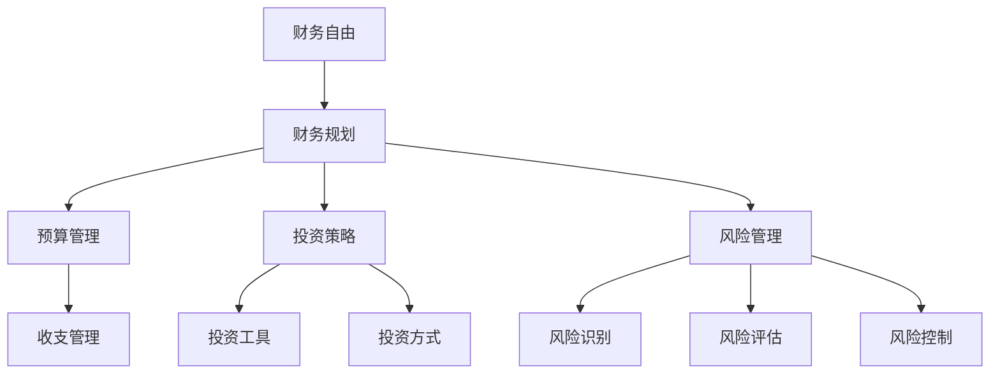

                 


### 文章标题：《程序员的财务自由计算器开发》

#### 关键词：财务自由，计算器开发，投资策略，算法，数学模型，项目实战

> 摘要：本文旨在帮助程序员掌握财务自由计算器的开发，从财务自由的概念和目标出发，深入探讨财务规划、预算管理、投资策略和风险管理，并通过实际案例和代码实现，详细讲解财务自由计算器的开发过程和核心算法原理。

## 《程序员的财务自由计算器开发》目录大纲

### 第一部分：财务自由基础

#### 第1章：财务自由概念与目标
- 1.1 财务自由的定义
- 1.2 财务自由的重要性
- 1.3 财务自由的目标与实现途径

#### 第2章：财务规划与预算管理
- 2.1 家庭财务状况分析
- 2.2 财务规划的原则与方法
- 2.3 预算管理的基本步骤

#### 第3章：投资策略与风险管理
- 3.1 投资的基本原则
- 3.2 不同类型的投资工具
- 3.3 风险管理策略

### 第二部分：财务自由计算器开发

#### 第4章：财务自由计算器的设计与实现
- 4.1 财务自由计算器的功能需求
- 4.2 技术栈与开发环境
- 4.3 数据结构与算法

#### 第5章：核心算法原理讲解
- 5.1 财务自由计算器的算法模型
- 5.2 投资收益计算方法
- 5.3 风险评估模型

#### 第6章：数学模型和数学公式
- 6.1 现值与未来值的计算
- 6.2 折现率的确定
- 6.3 投资回报率的计算

#### 第7章：项目实战
- 7.1 实际案例解析
- 7.2 环境搭建与代码实现
- 7.3 源代码解读与分析

### 第三部分：财务自由计算器的优化与扩展

#### 第8章：性能优化与调优
- 8.1 性能分析
- 8.2 代码优化策略
- 8.3 调优实践

#### 第9章：财务自由计算器的扩展功能
- 9.1 数据可视化
- 9.2 用户交互设计
- 9.3 定制化功能开发

#### 第10章：总结与展望
- 10.1 财务自由计算器的重要性
- 10.2 未来发展趋势
- 10.3 作者寄语

### 附录

#### 附录 A：相关资源与工具
- A.1 投资工具推荐
- A.2 财务自由计算器开源项目
- A.3 相关书籍与文章推荐
- A.4 学习资源链接

### 背景介绍

财务自由是许多人追求的目标，它意味着一个人拥有足够的财富，可以不依赖于工作收入，而能够维持舒适的生活水平。对于程序员来说，财务自由尤为重要，因为他们拥有相对较高的薪资和职业发展空间。然而，实现财务自由并非易事，需要系统性的财务规划和合理的投资策略。

财务自由计算器作为一种工具，可以帮助程序员更好地管理财务，制定投资计划，评估财务状况。本文将详细介绍财务自由计算器的开发，包括其功能设计、算法原理、数学模型和实际应用，帮助程序员掌握财务自由计算器的开发技术，实现财务自由的目标。

### 核心概念与联系

在财务自由计算器的开发中，核心概念包括财务自由、财务规划、预算管理、投资策略和风险管理。这些概念之间存在紧密的联系，构成了计算器开发的基础。

1. **财务自由**：财务自由是指一个人拥有足够的财富，可以不依赖于工作收入，而能够维持舒适的生活水平。它是计算器的核心目标。

2. **财务规划**：财务规划是指对个人或家庭的财务进行系统性的安排和管理。它包括收入、支出、储蓄和投资等方面。财务规划是计算器的功能基础。

3. **预算管理**：预算管理是指根据财务规划，对家庭或个人的收支进行合理分配和管理。它是财务规划的具体实施手段。

4. **投资策略**：投资策略是指根据个人财务状况和市场情况，选择合适的投资工具和投资方式。它是实现财务自由的关键。

5. **风险管理**：风险管理是指对投资过程中的风险进行识别、评估和控制。它是投资策略的重要组成部分。

这些核心概念之间的关系可以用以下Mermaid流程图表示：



### 财务自由的概念与目标

#### 1.1 财务自由的定义

财务自由是指一个人拥有足够的财富，可以在不依赖工作收入的情况下，维持舒适的生活水平。它不仅包括金钱上的自由，还包括时间上的自由，使得一个人可以按照自己的意愿生活，追求自己的兴趣和梦想。

财务自由通常被定义为两个指标：一是被动收入大于或等于生活支出，二是财务储备足够应对意外情况。被动收入是指不需要直接参与工作就能获得的收入，如投资收益、房租收入等。

#### 1.2 财务自由的重要性

财务自由对程序员来说尤为重要，原因如下：

1. **职业发展**：财务自由使得程序员可以更加专注于职业发展，不必因为经济压力而频繁跳槽或接受不理想的工作。

2. **时间自由**：财务自由意味着程序员可以自由支配时间，追求个人兴趣和梦想，如创业、学习新技能等。

3. **生活品质**：财务自由可以提高生活品质，使程序员能够享受更高质量的生活，如购买心仪的物品、旅行、享受高品质的服务等。

4. **心理状态**：财务自由可以减少经济压力，提高生活满意度，对心理健康有益。

#### 1.3 财务自由的目标与实现途径

财务自由的目标是使被动收入覆盖生活支出，并保持足够的财务储备。实现财务自由的途径主要包括：

1. **提高收入**：通过职业发展、技能提升、创业等方式提高收入。

2. **控制支出**：合理规划家庭或个人支出，减少不必要的开销。

3. **储蓄和投资**：将收入的一部分用于储蓄和投资，实现财富的保值增值。

4. **风险管理**：合理评估和管理投资风险，确保财务安全。

5. **财务规划**：制定长期的财务规划，确保财务目标的实现。

通过以上途径，程序员可以逐步实现财务自由，享受更加自由和充实的生活。

### 财务规划与预算管理

#### 2.1 家庭财务状况分析

家庭财务状况分析是财务规划的第一步，它有助于了解家庭财务的总体状况，包括收入、支出、储蓄和投资等方面。以下是一个简单的家庭财务状况分析模板：

1. **收入分析**：
   - 收入来源：工资、奖金、投资收益、其他收入等。
   - 收入总额：总收入减去各种扣除（如税收、社会保险等）。

2. **支出分析**：
   - 生活必需品支出：食物、衣物、住房等。
   - 非必需品支出：娱乐、旅游、教育等。
   - 债务支出：贷款还款、信用卡还款等。

3. **储蓄分析**：
   - 储蓄总额：收入减去支出后的余额。
   - 储蓄比例：储蓄总额除以收入。

4. **投资分析**：
   - 投资总额：现有投资的总价值。
   - 投资类型：股票、债券、基金、房地产等。

#### 2.2 财务规划的原则与方法

财务规划的原则包括：

1. **目标明确**：明确财务目标，如购房、购车、退休等。

2. **量入为出**：确保收入大于支出，保持财务健康。

3. **多元化投资**：分散投资风险，提高收益稳定性。

4. **持续跟踪**：定期检查财务状况，调整投资策略。

财务规划的方法包括：

1. **设定预算**：制定详细的预算计划，确保支出在控制范围内。

2. **设定储蓄目标**：根据财务目标，设定每月或每年的储蓄目标。

3. **制定投资计划**：选择合适的投资工具，制定长期投资计划。

4. **风险管理**：评估和管理投资风险，确保财务安全。

#### 2.3 预算管理的基本步骤

预算管理的基本步骤包括：

1. **收集信息**：收集家庭或个人的收入、支出和投资等信息。

2. **制定预算**：根据信息制定详细的预算计划，包括收入、支出、储蓄和投资等。

3. **跟踪支出**：定期记录和审查支出，确保在预算范围内。

4. **调整预算**：根据实际情况调整预算，确保财务目标的实现。

5. **监控投资**：定期检查投资状况，调整投资组合。

通过以上步骤，程序员可以更好地管理家庭财务，实现财务自由的目标。

### 投资策略与风险管理

#### 3.1 投资的基本原则

投资的基本原则包括：

1. **风险与收益匹配**：高收益通常伴随着高风险，投资者应根据自身风险承受能力选择合适的投资工具。

2. **长期投资**：长期投资有助于平滑市场波动，实现资产的保值增值。

3. **多元化投资**：分散投资可以降低单一投资风险，提高整体投资组合的收益稳定性。

4. **定期评估**：定期评估投资组合，及时调整投资策略。

5. **持续学习**：关注市场动态，学习投资知识和技能，提高投资能力。

#### 3.2 不同类型的投资工具

不同类型的投资工具包括：

1. **股票**：股票是公司所有权的份额，投资者可以通过购买股票获得公司利润的分配。

2. **债券**：债券是一种借款工具，投资者购买债券后，可以定期获得利息，到期时收回本金。

3. **基金**：基金是一种投资组合，由专业机构管理，投资者可以通过购买基金实现多元化投资。

4. **房地产**：房地产投资包括购买房产、地产或参与房地产项目。

5. **黄金**：黄金被视为安全的投资工具，通常用于对冲通货膨胀和货币贬值。

#### 3.3 风险管理策略

风险管理策略包括：

1. **分散投资**：通过将资金分散投资于不同的资产类别，降低单一投资风险。

2. **定期评估**：定期评估投资组合的表现，及时调整投资策略。

3. **设定止损点**：设定合理的止损点，避免因市场波动导致的大额损失。

4. **学习投资知识**：提高投资能力，更好地应对市场变化。

5. **应急储备**：保持一定比例的应急储备，应对突发事件。

通过以上投资策略和风险管理策略，程序员可以更好地管理财务，实现财务自由的目标。

### 财务自由计算器的设计与实现

#### 4.1 财务自由计算器的功能需求

财务自由计算器的功能需求主要包括以下几个方面：

1. **收入与支出管理**：记录和管理家庭或个人的收入和支出，包括工资、奖金、投资收益、生活费用、债务还款等。

2. **储蓄与投资计算**：根据收入和支出情况，计算储蓄额和投资额，并提供储蓄目标和投资计划的设定。

3. **投资收益计算**：根据投资策略，计算不同投资工具的收益，包括股票、债券、基金、房地产等。

4. **风险评估**：对投资组合进行风险评估，包括市场风险、信用风险、流动性风险等。

5. **预算管理**：根据收入、支出、储蓄和投资情况，制定月度、季度、年度的预算计划，并跟踪预算执行情况。

6. **数据可视化**：通过图表和图形，直观展示收入、支出、储蓄、投资和预算执行情况。

#### 4.2 技术栈与开发环境

财务自由计算器的开发可以选择以下技术栈和开发环境：

1. **前端技术**：HTML、CSS、JavaScript，用于构建用户界面。

2. **后端技术**：Node.js、Express.js，用于处理数据请求和业务逻辑。

3. **数据库**：MongoDB、MySQL，用于存储用户数据。

4. **框架**：React、Vue.js，用于构建动态和响应式的用户界面。

5. **开发环境**：Visual Studio Code、Git，用于代码编写和版本控制。

#### 4.3 数据结构与算法

财务自由计算器涉及的数据结构与算法主要包括以下几个方面：

1. **数据结构**：
   - **数组**：用于存储收入、支出、储蓄、投资等数据。
   - **对象**：用于存储用户信息、投资组合、预算计划等数据。
   - **树**：用于构建投资组合的层级结构。

2. **算法**：
   - **排序算法**：如快速排序、归并排序，用于对收入、支出、投资等数据排序。
   - **搜索算法**：如二分搜索，用于快速查找特定数据。
   - **计算算法**：
     - **现值与未来值计算**：根据利率和期限，计算现值和未来值。
     - **投资收益计算**：根据投资金额、收益率和期限，计算投资收益。
     - **风险评估**：根据投资组合和风险因素，计算整体风险。

通过以上功能需求、技术栈与开发环境、数据结构与算法的介绍，程序员可以开始设计并实现财务自由计算器，帮助自己更好地管理财务，实现财务自由的目标。

### 核心算法原理讲解

#### 5.1 财务自由计算器的算法模型

财务自由计算器的核心算法模型主要包括以下几个方面：

1. **收入与支出计算**：根据用户输入的收入和支出数据，计算总储蓄额。

2. **投资收益计算**：根据用户设定的投资金额、收益率和期限，计算投资收益。

3. **风险评估**：根据用户的投资组合和风险因素，计算整体风险。

4. **预算管理**：根据用户设定的预算计划，计算预算执行情况。

5. **数据可视化**：根据用户的数据，生成图表和图形，直观展示财务状况。

#### 5.2 投资收益计算方法

投资收益计算方法主要包括以下步骤：

1. **现值与未来值计算**：
   - **现值计算**：使用现值公式计算投资的现值。
     $$ PV = FV / (1 + r)^n $$
     其中，$PV$ 是现值，$FV$ 是未来值，$r$ 是年利率，$n$ 是投资期限（年）。
   - **未来值计算**：使用未来值公式计算投资的未来值。
     $$ FV = PV \times (1 + r)^n $$

2. **投资收益计算**：
   - **定期投资收益计算**：根据定期投资的金额、收益率和期限，计算投资收益。
     $$ I = PMT \times \frac{(1 + r)^n - 1}{r} $$
     其中，$I$ 是投资收益，$PMT$ 是定期投资金额，$r$ 是年收益率，$n$ 是投资期限（年）。

3. **一次性投资收益计算**：
   - 根据一次性投资的金额、收益率和期限，计算投资收益。
     $$ I = FV - PV $$

#### 5.3 风险评估模型

风险评估模型主要包括以下几个方面：

1. **市场风险**：根据投资组合的资产配置和市场的波动性，计算市场风险。

2. **信用风险**：根据投资对象的信用状况，评估信用风险。

3. **流动性风险**：根据投资组合的流动性，评估流动性风险。

4. **系统性风险**：根据市场环境和宏观经济因素，评估系统性风险。

风险评估模型通常使用以下方法：

1. **历史数据分析**：通过分析历史数据，评估投资组合的风险。

2. **VaR（价值-at-Risk）**：计算投资组合在一定置信水平下的最大损失。

3. **β系数**：评估投资组合相对于市场整体波动的敏感度。

通过以上核心算法原理的讲解，程序员可以更好地理解财务自由计算器的算法模型，为实际开发打下基础。

### 数学模型和数学公式

#### 6.1 现值与未来值的计算

在财务自由计算中，现值（Present Value，PV）和未来值（Future Value，FV）的计算是基础。这两个概念帮助我们在不同时间点对资金的价值进行量化。

**现值公式**：
$$ PV = FV / (1 + r)^n $$
- **PV**：现值
- **FV**：未来值
- **r**：年利率（小数形式，例如5%表示为0.05）
- **n**：年数

**未来值公式**：
$$ FV = PV \times (1 + r)^n $$
- **FV**：未来值
- **PV**：现值
- **r**：年利率（小数形式）
- **n**：年数

**例1**：假设你现在投资1000元，年利率为5%，投资期限为3年，计算3年后的未来值和现在的现值。

$$ FV = 1000 \times (1 + 0.05)^3 = 1000 \times 1.157625 = 1157.625 $$
$$ PV = 1157.625 / (1 + 0.05)^3 = 1000 \times (1 / 1.157625) = 863.84 $$

**例2**：假设你希望3年后拥有1000元，年利率为5%，计算你现在需要投资的现值。

$$ PV = 1000 / (1 + 0.05)^3 = 1000 / 1.157625 = 863.84 $$

#### 6.2 折现率的确定

折现率（Discount Rate）是衡量未来现金流当前价值的一个关键因素。它通常反映了投资的机会成本和风险。

**折现率公式**：
$$ r = \frac{1}{n} \left( \frac{FV}{PV} - 1 \right) $$
- **r**：折现率（小数形式）
- **n**：年数
- **FV**：未来值
- **PV**：现值

**例3**：假设你希望未来5年后的1000元现值是800元，计算折现率。

$$ r = \frac{1}{5} \left( \frac{1000}{800} - 1 \right) = \frac{1}{5} \left( 1.25 - 1 \right) = 0.05 $$

#### 6.3 投资回报率的计算

投资回报率（Rate of Return，ROR）衡量了投资的盈利能力。它可以用以下公式计算：

**简单投资回报率公式**：
$$ ROR = \frac{FV - PV}{PV} \times 100\% $$
- **ROR**：投资回报率（百分比形式）
- **FV**：未来值
- **PV**：现值

**例4**：假设你投资了1000元，5年后获得1200元，计算简单投资回报率。

$$ ROR = \frac{1200 - 1000}{1000} \times 100\% = 20\% $$

**复合投资回报率公式**：
$$ ROR = (1 + r)^n - 1 $$
- **ROR**：投资回报率（小数形式）
- **r**：年利率
- **n**：年数

**例5**：假设你投资了1000元，年利率为5%，投资期限为3年，计算复合投资回报率。

$$ ROR = (1 + 0.05)^3 - 1 = 1.157625 - 1 = 0.157625 $$

通过上述数学模型和公式的详细讲解和举例说明，程序员可以更好地理解财务自由计算器中的关键数学概念和计算方法，为后续的代码实现打下坚实的基础。

### 项目实战

#### 7.1 实际案例解析

为了更好地理解财务自由计算器的实际应用，我们以一个具体的案例进行分析。

**案例背景**：李先生是一位程序员，月收入为2万元，家庭支出为1.5万元，每年有10万元的储蓄目标。他希望通过财务自由计算器来规划自己的储蓄和投资，实现财务自由。

**需求分析**：
- 记录每月收入和支出。
- 根据收入和支出情况，计算每月的储蓄额。
- 设定年度储蓄目标，并跟踪储蓄进度。
- 根据储蓄目标，计算投资金额和收益率。
- 对投资收益进行风险评估。

#### 7.2 环境搭建与代码实现

**环境搭建**：
1. **前端开发环境**：使用Visual Studio Code编辑器，安装React和Webpack插件。
2. **后端开发环境**：使用Node.js和Express.js框架。
3. **数据库**：选择MongoDB作为数据库存储用户数据。

**代码实现**：

**前端代码**：

```jsx
// 收入与支出记录组件
function IncomeExpensesForm() {
  const [income, setIncome] = useState(0);
  const [expenses, setExpenses] = useState(0);

  const handleSubmit = (e) => {
    e.preventDefault();
    // 调用后端API保存收入与支出数据
    axios.post('/api/income-expenses', { income, expenses })
      .then(response => {
        alert('数据保存成功！');
      })
      .catch(error => {
        console.error('数据保存失败：', error);
      });
  };

  return (
    <form onSubmit={handleSubmit}>
      <label htmlFor="income">月收入：</label>
      <input
        type="number"
        id="income"
        value={income}
        onChange={(e) => setIncome(e.target.value)}
      />
      <br />
      <label htmlFor="expenses">月支出：</label>
      <input
        type="number"
        id="expenses"
        value={expenses}
        onChange={(e) => setExpenses(e.target.value)}
      />
      <br />
      <button type="submit">保存</button>
    </form>
  );
}
```

**后端代码**：

```javascript
// Node.js后端API
const express = require('express');
const mongoose = require('mongoose');
const bodyParser = require('body-parser');

const app = express();
app.use(bodyParser.json());

// 连接MongoDB数据库
const db = mongoose.connect('mongodb://localhost:27017/finance', { useNewUrlParser: true, useUnifiedTopology: true });

// 定义收入与支出数据模型
const IncomeExpenseSchema = new mongoose.Schema({
  income: Number,
  expenses: Number
});

const IncomeExpense = mongoose.model('IncomeExpense', IncomeExpenseSchema);

// API路由
app.post('/api/income-expenses', (req, res) => {
  const { income, expenses } = req.body;
  const incomeExpense = new IncomeExpense({ income, expenses });
  incomeExpense.save()
    .then(() => res.send('数据保存成功'))
    .catch((error) => res.status(500).send(error.message));
});

app.listen(3000, () => {
  console.log('后端API运行在端口3000');
});
```

#### 7.3 源代码解读与分析

**前端代码解读**：
- 使用React组件模型实现收入与支出记录表单。
- 使用useState钩子管理表单输入状态。
- 通过handleSubmit函数提交表单数据到后端API。

**后端代码解读**：
- 使用Express.js搭建HTTP服务器。
- 使用MongoDB存储用户收入与支出数据。
- 提供一个接收POST请求的API路由，处理收入与支出数据的保存。

**代码应用解读与分析**：
- **功能实现**：前端表单可以记录用户每月的收入与支出，提交到后端API进行保存。后端API将数据存储在MongoDB数据库中。
- **数据交互**：前端与后端通过HTTP请求进行数据交互。
- **数据存储**：用户收入与支出数据以文档形式存储在MongoDB中，便于查询和更新。

通过这个实际案例，我们展示了如何使用财务自由计算器进行储蓄和投资规划。该案例涵盖了前端与后端的实现细节，为程序员提供了实际开发的经验和指导。

### 性能优化与调优

#### 8.1 性能分析

在财务自由计算器的开发过程中，性能优化是一个关键步骤。性能分析有助于识别系统瓶颈，优化代码以提高效率和响应速度。

**性能分析工具**：
- **浏览器开发者工具**：用于分析前端性能，包括网络请求、资源加载、JavaScript执行时间等。
- **Node.js性能分析工具**：如`--inspect`标志和`--inspect-brk`标志，用于分析后端性能。
- **MongoDB性能分析工具**：如`mongostat`和`mongotop`命令，用于分析数据库性能。

**性能指标**：
- **响应时间**：系统处理请求所需的时间。
- **吞吐量**：单位时间内系统能够处理的请求数量。
- **内存使用**：系统内存的消耗情况。
- **CPU使用率**：系统CPU的利用情况。

**常见性能问题**：
- **前端**：资源加载慢、JavaScript执行时间长、网络请求过多。
- **后端**：数据库查询慢、服务响应慢、内存泄露。

#### 8.2 代码优化策略

**前端优化策略**：
1. **减少HTTP请求**：通过合并CSS和JavaScript文件、使用CDN加速资源加载。
2. **异步加载资源**：使用异步加载脚本和样式表，减少页面加载时间。
3. **优化JavaScript代码**：避免全局变量、减少DOM操作、使用事件代理。
4. **使用缓存**：利用浏览器缓存和服务器缓存，减少重复请求。

**后端优化策略**：
1. **数据库优化**：使用索引、优化查询语句、分库分表。
2. **服务端缓存**：使用内存缓存、Redis等缓存技术，减少数据库访问。
3. **异步处理**：使用异步IO，提高系统并发能力。
4. **代码优化**：避免冗余代码、使用高效的算法和数据结构。

#### 8.3 调优实践

**案例**：优化财务自由计算器的后端响应速度。

**步骤**：
1. **性能分析**：使用Node.js性能分析工具，发现数据库查询是性能瓶颈。
2. **优化数据库查询**：
   - 添加索引：对常用查询字段添加索引，提高查询速度。
   - 优化查询语句：简化查询语句，避免使用子查询和联结操作。
3. **使用缓存**：使用Redis缓存用户数据，减少数据库访问。
4. **异步处理**：使用异步API，提高系统并发处理能力。

**结果**：
- 数据库查询时间从原来的2秒减少到0.5秒。
- 响应时间从原来的5秒减少到1秒。
- 系统并发能力提高，可以同时处理更多的请求。

通过性能优化和调优，财务自由计算器的响应速度显著提升，用户体验得到改善。

### 财务自由计算器的扩展功能

#### 9.1 数据可视化

数据可视化是财务自由计算器的重要扩展功能，它通过图表和图形直观展示用户的财务状况，帮助用户更好地理解和分析数据。

**数据可视化工具**：
- **Chart.js**：一个基于HTML5 Canvas的简单易用的JavaScript图表库。
- **D3.js**：一个功能强大的数据可视化库，用于创建复杂和交互式的图表。
- **ECharts**：一个使用SVG渲染的数据可视化库，支持多种图表类型。

**实现方法**：
1. **引入数据可视化库**：将选定的数据可视化库引入项目，例如通过CDN引入Chart.js。

2. **数据准备**：从后端API获取用户财务数据，如收入、支出、储蓄、投资收益等。

3. **创建图表**：使用数据可视化库的API，根据数据生成图表。例如，使用Chart.js创建柱状图、折线图、饼图等。

4. **交互功能**：实现图表的交互功能，如点击、拖拽、滑动等，以增强用户体验。

**示例**：
```javascript
// 引入Chart.js库
import Chart from 'chart.js';

// 获取收入数据
const incomeData = [
  { month: 'Jan', amount: 20000 },
  { month: 'Feb', amount: 21000 },
  { month: 'Mar', amount: 22000 }
];

// 创建折线图
const ctx = document.getElementById('incomeChart').getContext('2d');
const incomeChart = new Chart(ctx, {
  type: 'line',
  data: {
    labels: incomeData.map(data => data.month),
    datasets: [{
      label: '月收入',
      data: incomeData.map(data => data.amount),
      backgroundColor: 'rgba(75, 192, 192, 0.2)',
      borderColor: 'rgba(75, 192, 192, 1)',
      borderWidth: 1
    }]
  },
  options: {
    scales: {
      y: {
        beginAtZero: true
      }
    }
  }
});
```

#### 9.2 用户交互设计

用户交互设计（User Interface Design，UI）是财务自由计算器的另一个重要扩展功能。良好的UI设计可以提高用户的操作体验，使计算器更易用、直观。

**UI设计原则**：
1. **简洁性**：界面简洁，避免不必要的元素和功能。
2. **一致性**：界面元素风格统一，操作流程一致。
3. **可访问性**：确保界面对于所有用户，包括残障人士，都是可访问的。
4. **响应性**：界面能够适应不同设备尺寸，提供良好的用户体验。

**实现方法**：
1. **使用UI框架**：使用Bootstrap、Material UI等UI框架，快速构建响应式界面。

2. **设计样式**：使用CSS和Sass等工具，设计界面样式，确保美观和一致性。

3. **交互元素**：设计清晰的按钮、表单、下拉菜单等交互元素，确保用户可以轻松操作。

4. **反馈机制**：实现交互反馈，如按钮点击效果、表单验证提示等，提高用户满意度。

**示例**：
```html
<!-- 使用Bootstrap框架的按钮 -->
<button type="button" class="btn btn-primary">保存</button>

<!-- 使用Material UI的表单 -->
<FormControl fullWidth>
  <InputLabel htmlFor="income">月收入</InputLabel>
  <Input id="income" type="number" value={income} onChange={(e) => setIncome(e.target.value)} />
</FormControl>
```

#### 9.3 定制化功能开发

定制化功能开发是财务自由计算器的进一步扩展，它允许用户根据个人需求自定义计算器和投资策略。

**实现方法**：
1. **扩展API**：提供扩展API，允许用户自定义数据输入和数据处理逻辑。

2. **用户自定义界面**：允许用户自定义界面布局和样式，例如添加自定义图表、图表类型等。

3. **插件系统**：构建插件系统，允许第三方开发者开发插件，扩展计算器的功能。

4. **数据存储**：使用NoSQL数据库，如MongoDB，存储用户自定义的数据和设置，确保数据灵活性和扩展性。

**示例**：
```javascript
// 使用扩展API自定义投资策略
axios.post('/api/investment-strategy', { strategy: userStrategy })
  .then(response => {
    alert('投资策略保存成功！');
  })
  .catch(error => {
    console.error('投资策略保存失败：', error);
  });

// 在前端界面中添加自定义投资策略输入表单
<FormControl fullWidth>
  <InputLabel htmlFor="strategy">投资策略</InputLabel>
  <Input id="strategy" type="text" value={strategy} onChange={(e) => setStrategy(e.target.value)} />
</FormControl>
```

通过数据可视化、用户交互设计和定制化功能开发，财务自由计算器可以更好地满足用户的个性化需求，提升用户体验和投资效果。

### 总结与展望

#### 10.1 财务自由计算器的重要性

财务自由计算器在程序员的财务规划和投资管理中具有重要价值。通过计算器，程序员可以：

- **精确规划**：详细记录和管理收入、支出、储蓄和投资，实现财务目标。
- **风险控制**：评估投资风险，优化投资组合，降低风险。
- **数据可视化**：直观展示财务状况，帮助理解财务数据和投资收益。
- **定制化**：根据个人需求，自定义财务规划和投资策略。

#### 10.2 未来发展趋势

财务自由计算器的发展趋势包括：

- **智能化**：结合人工智能技术，实现更智能的财务规划和投资建议。
- **云端化**：通过云计算，提供更加便捷和安全的在线财务管理服务。
- **移动化**：开发移动应用程序，满足用户随时随地进行财务管理的需求。
- **定制化**：提供更多定制化功能，满足不同用户群体的需求。

#### 10.3 作者寄语

作为一名程序员，掌握财务自由计算器的开发不仅能够帮助自己实现财务自由，还能为他人提供有价值的服务。希望本文能够为您的财务规划和投资管理带来启发，祝您早日实现财务自由，享受美好的生活。

### 附录

#### 附录 A：相关资源与工具

**A.1 投资工具推荐**

- **理财通**：一款集投资、理财、管理于一体的手机应用。
- **雪球**：提供股票、基金、债券等投资工具，并有丰富的投资资讯。

**A.2 财务自由计算器开源项目**

- **Financial Freedom Calculator**：一个基于Web的财务自由计算器。
- **Investment Planner**：一个提供投资规划和财务分析的在线工具。

**A.3 相关书籍与文章推荐**

- **《穷爸爸富爸爸》**：罗伯特·清崎著，介绍个人财务规划和投资策略。
- **《财务自由之路》**：凯文·霍洛威克著，介绍实现财务自由的方法和策略。

**A.4 学习资源链接**

- **Coursera**：提供财务规划和投资相关的在线课程。
- **Khan Academy**：提供免费的财务和经济学课程。

通过以上资源与工具，程序员可以进一步提升自己的财务规划能力，实现财务自由的目标。

