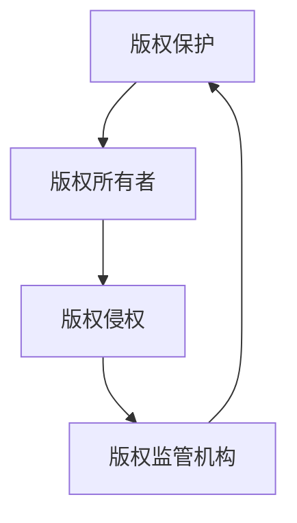
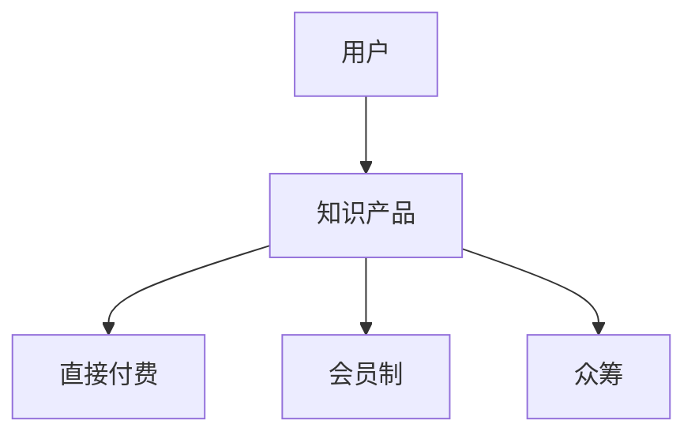
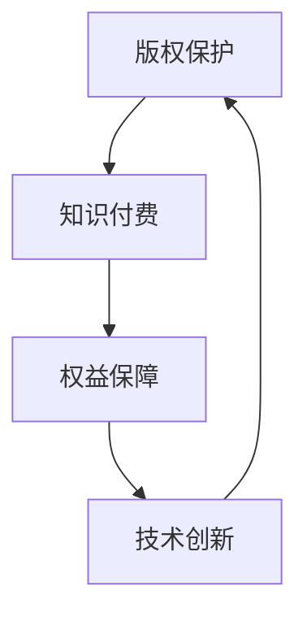

                 

### 文章标题：程序员知识付费的内容版权保护策略

#### 关键词：知识付费、内容版权保护、数字版权管理、区块链技术、算法原理

##### 摘要：
本文旨在探讨程序员知识付费领域的内容版权保护策略，分析核心概念、商业模式及其互动关系，深入讲解数字版权管理和区块链技术在版权保护中的应用原理，并通过实际案例进行剖析，提供最佳实践和未来展望。文章结构清晰，旨在为程序员和知识创作者提供有益的参考。

---

### 第一部分：核心概念与联系

#### 1.1.1 内容版权保护的基本概念

**定义**：内容版权保护是指为保护版权所有者的合法权益，采取一系列技术手段和管理措施，防止他人未经授权使用其作品。

**相关概念**：
- **版权**：指作者对其作品享有的法律权利，包括复制权、发行权、展示权等。
- **版权所有者**：拥有版权的自然人或法人。
- **侵权**：未经版权所有者授权，擅自使用其作品的行为。

**Mermaid 流程图**：



**举例说明**：
- **版权保护**：通过技术手段防止盗版，如加密、数字签名等。
- **版权所有者**：如图书作者、软件开发者等，他们拥有对其作品的法律控制权。
- **版权侵权**：未经授权的复制、传播、使用他人作品的行为。

#### 1.1.2 知识付费的商业模式

**定义**：知识付费是指用户为获取特定知识或服务而支付的费用。

**商业模式**：
- **直接付费**：用户直接购买课程、专栏、书籍等知识产品。
- **会员制**：用户通过付费成为会员，享受持续更新的知识内容。
- **众筹**：通过众筹平台，用户为知识创作者的项目提供资金支持。

**Mermaid 流程图**：



**举例说明**：
- **直接付费**：用户购买某在线编程课程，支付一定费用后即可学习。
- **会员制**：用户付费成为某编程社区会员，享有社区内所有课程和资源。
- **众筹**：用户为某新编程工具的开发提供资金支持，工具开发完成后用户可以免费使用。

#### 1.1.3 版权保护与知识付费的互动关系

**关系说明**：
- **版权保护是知识付费的基石**：有效的版权保护可以确保知识创作者的权益，提高用户的付费意愿。
- **知识付费是版权保护的重要驱动力**：知识付费模式的兴起为版权保护提供了新的动力，促进了版权保护技术的发展。

**Mermaid 流程图**：



$$
\text{版权保护} + \text{知识付费} = \text{权益保障} + \text{技术创新}
$$

**举例说明**：
- **权益保障**：通过数字版权管理（DRM）技术，确保知识产品在付费后仅供授权用户使用，防止非法传播。
- **技术创新**：利用区块链技术实现知识付费的去中心化和透明化，提高版权保护的效果。

### 第二部分：核心算法原理讲解

#### 2.1.1 数字版权管理（DRM）技术

**定义**：数字版权管理是一种技术手段，用于控制数字内容的访问和使用。

**原理**：
- **加密**：将内容加密，使得未经授权的用户无法访问或使用。
- **认证**：验证用户的身份，确保只有授权用户才能访问加密内容。

**伪代码**：

```python
def encrypt_content(content, key):
    # 使用AES加密算法
    encrypted_content = AES_encrypt(content, key)
    return encrypted_content

def decrypt_content(encrypted_content, key):
    # 使用AES解密算法
    decrypted_content = AES_decrypt(encrypted_content, key)
    return decrypted_content

# 用户购买知识产品并获取授权
key = purchase_key()
encrypted_content = encrypt_content(content, key)

# 用户解密内容
decrypted_content = decrypt_content(encrypted_content, key)
```

#### 2.1.2 区块链技术在版权保护中的应用

**定义**：区块链是一种分布式数据库技术，用于记录交易和数据。

**原理**：
- **去中心化**：无需中心化机构，每个节点都可以参与数据记录，提高数据的透明度和安全性。
- **不可篡改**：一旦数据被记录在区块链上，无法被篡改，确保版权信息真实可靠。

**伪代码**：

```python
def record_copyright_info(information, blockchain):
    # 在区块链上记录版权信息
    blockchain.add_block(information)

def verify_copyright_info(information, blockchain):
    # 验证版权信息
    is_valid = blockchain.verify_block(information)
    return is_valid
```

### 第三部分：项目实战与代码实现

#### 3.1.1 开发环境搭建

**工具选择**：
- **编程语言**：Python
- **数字版权管理（DRM）库**：PyCryptoDome
- **区块链框架**：Hyperledger Fabric

**环境配置**：

```bash
# 安装Python
curl -O https://www.python.org/ftp/python/3.8.5/python-3.8.5.tgz
tar -xzvf python-3.8.5.tgz
cd python-3.8.5
./configure
make
make install

# 安装PyCryptoDome
pip install pycryptodome

# 安装Hyperledger Fabric
git clone https://github.com/hyperledger/fabric.git
cd fabric
make release
```

#### 3.1.2 源代码详细实现与代码解读

**代码实现**：

```python
from Crypto.Cipher import AES
from Crypto.PublicKey import RSA
from Crypto.Random import get_random_bytes
from Crypto.Util.Padding import pad, unpad
from hyperledger.fabric import Client, Blockchain

# 初始化区块链客户端
client = Client('example.yaml')
blockchain = client.get_blockchain()

# 生成RSA密钥对
private_key = RSA.generate(2048)
public_key = private_key.publickey()

# 加密内容
def encrypt_content(content, public_key):
    cipher = AES.new(get_random_bytes(16), AES.MODE_CBC)
    ct = cipher.encrypt(pad(content, AES.block_size))
    iv = cipher.iv
    encrypted_content = {
        'iv': iv.hex(),
        'content': ct.hex()
    }
    encrypted_public_key = public_key.encrypt(ct, RSA.pkcs1_oaep_padding)
    return encrypted_content, encrypted_public_key

# 解密内容
def decrypt_content(encrypted_content, private_key):
    encrypted_public_key = encrypted_content['encrypted_public_key']
    ct = bytes.fromhex(encrypted_content['content'])
    iv = bytes.fromhex(encrypted_content['iv'])
    decrypted_public_key = private_key.decrypt(encrypted_public_key, RSA.pkcs1_oaep_padding)
    cipher = AES.new(decrypted_public_key, AES.MODE_CBC, iv)
    pt = unpad(cipher.decrypt(ct), AES.block_size)
    return pt

# 记录版权信息到区块链
def record_copyright_info(information, blockchain):
    blockchain.add_block(information)

# 验证版权信息
def verify_copyright_info(information, blockchain):
    is_valid = blockchain.verify_block(information)
    return is_valid
```

**代码解读**：
- **RSA加密与解密**：使用RSA算法生成密钥对，实现对内容的加密和解密。
- **AES加密与解密**：使用AES算法对内容进行加密和解密，提高加密强度。
- **区块链操作**：将版权信息记录到区块链，实现去中心化和不可篡改。

#### 3.1.3 代码应用解读与分析

**应用解读**：
- **内容版权保护**：使用RSA和AES算法，实现对知识内容的加密保护，确保未经授权的用户无法访问。
- **版权信息验证**：通过区块链技术，记录版权信息，实现去中心化和不可篡改的版权信息验证。

**分析**：
- **安全性**：结合RSA和AES算法，实现高强度内容加密。
- **透明性**：区块链记录版权信息，提高版权保护过程的透明度和可信度。

#### 3.1.4 实际案例分析与详细讲解剖析

**案例**：某在线编程课程平台使用数字版权管理和区块链技术保护课程内容。

**分析**：
- **版权保护**：平台使用RSA和AES算法，确保课程内容加密存储，防止非法访问。
- **版权信息验证**：通过区块链技术，记录课程版权信息，确保版权信息的真实性和不可篡改性。

**剖析**：
- **加密算法**：结合RSA和AES算法，提高加密强度和安全性。
- **区块链技术**：实现去中心化和透明化的版权信息验证。

#### 3.1.5 项目小结

**小结**：
- **内容版权保护**：使用数字版权管理技术和区块链技术，实现知识付费领域的内容版权保护。
- **未来展望**：随着知识付费模式的不断发展，版权保护技术将不断优化和创新，提高版权保护的效果。

### 第四部分：最佳实践、小结与注意事项

#### 4.1 最佳实践 Tips

**数字版权管理（DRM）**：
- 选择合适的加密算法，如RSA和AES，提高加密强度。
- 结合用户认证机制，确保只有授权用户才能访问加密内容。

**区块链技术**：
- 选择合适的区块链框架，如Hyperledger Fabric，实现去中心化和透明化的版权信息验证。
- 设计合理的版权信息记录和验证机制，提高版权保护的效率和可靠性。

#### 4.2 小结

本文介绍了程序员知识付费的内容版权保护策略，分析了核心概念、商业模式及其互动关系，深入讲解了数字版权管理和区块链技术在版权保护中的应用原理，并通过实际案例进行了剖析。文章总结了最佳实践，提出了注意事项，为程序员和知识创作者提供了有益的参考。

#### 4.3 注意事项

**版权保护**：
- 确保加密算法和用户认证机制的有效性，防止未经授权的访问。
- 定期更新加密算法和用户认证机制，提高安全性。

**区块链技术**：
- 选择合适的区块链框架，确保去中心化和透明化的实现。
- 设计合理的版权信息记录和验证机制，提高版权保护的效率和可靠性。

#### 4.4 拓展阅读

- 《数字版权管理技术与应用》
- 《区块链技术指南》
- 《程序员知识付费的商业模式与战略》

### 作者信息

作者：AI天才研究院/AI Genius Institute & 禅与计算机程序设计艺术 /Zen And The Art of Computer Programming

---

本文旨在为程序员和知识创作者提供关于内容版权保护策略的深入分析和实用建议。文章结构清晰，内容丰富，既有理论讲解，也有实际案例分析，希望对读者有所启发和帮助。感谢您的阅读！

