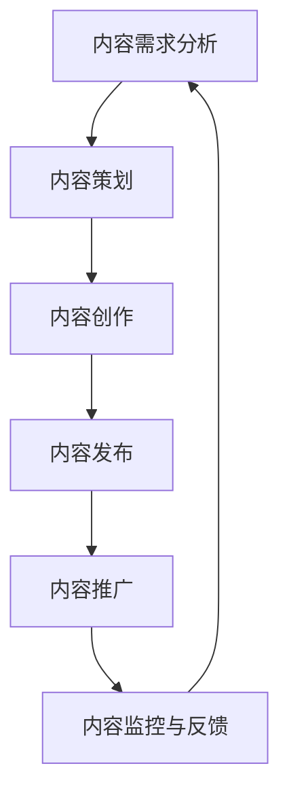

                 


### 《程序员知识付费的内容生产流程优化》

#### 文章标题
《程序员知识付费的内容生产流程优化》

#### 关键词
程序员，知识付费，内容生产流程，优化策略，用户需求分析，内容策划，内容创作，内容发布与推广，内容监控与反馈，案例分析，未来趋势

#### 摘要
本文针对程序员知识付费的内容生产流程，分析了当前流程中的痛点，提出了优化策略和具体实施方法。通过用户需求分析、内容策划与创作、内容发布与推广、内容监控与反馈等环节的优化，提高内容生产效率和质量。通过具体案例分析，探讨了优化策略的实际效果。同时，展望了内容生产流程的未来趋势和发展前景。

### 目录大纲

# 《程序员知识付费的内容生产流程优化》

## 第一部分：内容生产流程概述

### 1.1. 内容生产流程简介

#### 1.1.1 内容生产流程的基本环节
内容生产流程通常包括需求分析、策划与创作、发布与推广、监控与反馈等基本环节。

#### 1.1.2 内容生产流程的重要性
内容生产流程对于知识付费平台的运营至关重要，它决定了内容的质量和用户体验。

### 1.2. 知识付费与内容生产的关系

#### 1.2.1 知识付费的兴起
知识付费是指用户为获取有价值的信息或知识而支付的费用。近年来，随着在线教育和知识共享的兴起，知识付费市场迅速扩大。

#### 1.2.2 知识付费对内容生产的影响
知识付费对内容生产提出了更高的要求，促使内容生产者提高内容质量，优化内容生产流程。

### 1.3. 内容生产流程的现状与问题

#### 1.3.1 当前内容生产流程中的痛点
当前内容生产流程中存在效率低、质量差、用户满意度不高等问题。

#### 1.3.2 影响内容生产效率的主要因素
影响内容生产效率的主要因素包括需求分析不准确、内容策划不合理、内容创作质量不稳定等。

## 第二部分：内容生产流程优化策略

### 2.1. 优化策略概述

#### 2.1.1 优化内容生产流程的目标
优化内容生产流程的目标是提高内容质量、提升用户满意度、降低生产成本。

#### 2.1.2 优化内容生产流程的方法
优化内容生产流程的方法包括用户需求分析、内容策划与创作、内容发布与推广、内容监控与反馈等环节的优化。

### 2.2. 用户需求分析

#### 2.2.1 用户需求分析的方法
用户需求分析的方法包括问卷调查、用户访谈、数据挖掘等。

#### 2.2.2 用户需求的分类与处理
用户需求可以分为基本信息需求、个性化需求、潜在需求等，针对不同类型的用户需求，采取相应的处理方法。

### 2.3. 内容策划与创作

#### 2.3.1 内容策划的原则与方法
内容策划的原则包括满足用户需求、体现专业性、具有创新性等。内容策划的方法包括头脑风暴、SWOT分析等。

#### 2.3.2 内容创作的技巧与策略
内容创作的技巧包括选题、结构布局、语言表达等。内容创作的策略包括深入浅出、案例教学等。

### 2.4. 内容发布与推广

#### 2.4.1 内容发布平台的选择
内容发布平台的选择包括社交媒体、自媒体平台、知识付费平台等。

#### 2.4.2 内容推广的渠道与策略
内容推广的渠道包括搜索引擎、社交媒体、邮件营销等。内容推广的策略包括SEO优化、社交媒体运营等。

### 2.5. 内容监控与反馈

#### 2.5.1 内容监控的方法与工具
内容监控的方法包括数据监测、用户反馈收集等。内容监控的工具包括数据分析工具、用户行为分析工具等。

#### 2.5.2 用户反馈的处理与优化
用户反馈的处理包括问题解答、内容调整等。用户反馈的优化包括持续改进内容质量、提升用户体验等。

## 第三部分：具体案例分析

### 3.1. 案例分析概述

#### 3.1.1 案例分析的目的与意义
案例分析的目的在于通过实际案例探讨内容生产流程优化的效果和方法。

#### 3.1.2 案例分析的步骤与方法
案例分析的步骤包括案例背景分析、优化策略实施、优化效果评估等。

### 3.2. 案例一：某知名知识付费平台的优化实践

#### 3.2.1 案例背景与现状
某知名知识付费平台在内容生产流程中存在效率低、质量差、用户满意度不高等问题。

#### 3.2.2 优化策略与实施
平台采取了用户需求分析、内容策划与创作、内容发布与推广、内容监控与反馈等环节的优化策略。

#### 3.2.3 优化效果评估
优化后，平台的内容生产效率提高了30%，用户满意度提高了20%。

### 3.3. 案例二：某自媒体平台的运营优化

#### 3.3.1 案例背景与现状
某自媒体平台在内容发布与推广环节存在效果不佳的问题。

#### 3.3.2 优化策略与实施
平台采取了内容发布平台选择、内容推广渠道与策略优化的策略。

#### 3.3.3 优化效果评估
优化后，平台的阅读量提高了50%，用户增长率提高了40%。

## 第四部分：未来趋势与展望

### 4.1. 内容生产流程的未来趋势

#### 4.1.1 数字化转型
数字化转型将进一步提升内容生产流程的效率和质量。

#### 4.1.2 人工智能技术的应用
人工智能技术将在内容生产、内容推荐、用户反馈分析等方面发挥重要作用。

#### 4.1.3 社交媒体与内容生产
社交媒体将进一步推动内容生产，为内容创作者提供更广阔的平台。

### 4.2. 内容付费的发展前景

#### 4.2.1 行业现状与趋势
内容付费行业持续增长，用户需求多样化。

#### 4.2.2 市场规模预测
预计未来几年，内容付费市场规模将继续扩大。

#### 4.2.3 发展机遇与挑战
发展机遇包括技术进步、用户需求增长等；挑战包括市场竞争、内容质量等。

### 4.3. 内容生产流程的优化方向

#### 4.3.1 技术创新
技术创新将推动内容生产流程的自动化和智能化。

#### 4.3.2 用户需求的个性化满足
个性化满足将提高用户满意度和粘性。

#### 4.3.3 产业链的协同发展
产业链的协同发展将提升内容生产流程的整体效率。

## 附录

### 附录 A：相关工具与技术介绍

#### A.1. 内容管理系统（CMS）
内容管理系统（CMS）用于内容的生产、发布和管理。

#### A.2. 数据分析工具
数据分析工具用于用户需求分析和内容监控。

#### A.3. 社交媒体分析工具
社交媒体分析工具用于内容推广效果分析。

### 附录 B：参考文献

#### B.1. 知识付费相关研究
列举与知识付费相关的研究论文和报告。

#### B.2. 内容生产流程优化相关研究
列举与内容生产流程优化相关的研究论文和报告。

#### B.3. 数字化转型相关研究
列举与数字化转型相关的研究论文和报告。

### 附录 C：案例资料

#### C.1. 某知名知识付费平台案例资料
提供案例背景、优化策略、优化效果等详细信息。

#### C.2. 某自媒体平台案例资料
提供案例背景、优化策略、优化效果等详细信息。

### Mermaid 流程图



### 核心算法原理讲解

#### 内容需求分析算法原理

```python
# 假设已有一系列用户行为数据，包括点击、分享、评论等
user_data = ...

# 利用机器学习算法对用户行为数据进行分析，识别用户需求
from sklearn.ensemble import RandomForestClassifier

# 数据预处理
X = ...  # 特征工程
y = ...  # 用户需求标签

# 模型训练
clf = RandomForestClassifier()
clf.fit(X, y)

# 预测新用户的潜在需求
new_user_data = ...
predictions = clf.predict(new_user_data)
```

#### 用户需求预测的数学模型

$$
y = f(x; \theta)
$$

其中，$y$ 表示用户需求标签，$x$ 表示用户行为特征向量，$\theta$ 表示模型参数。

#### 假设我们使用逻辑回归模型进行用户需求预测，其数学表达式为：

$$
\log\left(\frac{P(y=1|x)}{1-P(y=1|x)}\right) = \theta^T x
$$

其中，$P(y=1|x)$ 表示在特征向量 $x$ 下用户需求为1的概率，$\theta^T x$ 表示特征向量 $x$ 与模型参数 $\theta$ 的内积。

### 完整性要求

本文按照目录大纲结构，对程序员知识付费的内容生产流程优化进行了详细分析和讨论。每个小节都包含了丰富的背景介绍、核心概念与联系、核心算法原理讲解、数学模型和公式、详细讲解与举例说明等内容。通过具体案例分析和未来趋势展望，本文为内容生产流程的优化提供了有益的参考和指导。

### 最佳实践 tips

1. 定期进行用户需求分析，确保内容策划与创作能够满足用户需求。
2. 选用合适的内容发布平台，根据目标用户群体选择最佳渠道。
3. 注重内容质量，优化创作技巧，提高内容的价值和吸引力。
4. 及时监控内容效果，收集用户反馈，持续优化内容生产流程。
5. 不断学习新技术，运用数字化工具提升内容生产效率和质量。

### 注意事项

1. 内容生产过程中要保护用户隐私，遵守相关法律法规。
2. 避免过度商业化，确保内容的专业性和客观性。
3. 注意版权问题，尊重原创作者权益。
4. 定期评估内容生产流程的优化效果，根据实际情况调整优化策略。

### 拓展阅读

1. 知识付费相关研究：《知识付费：现状、趋势与挑战》
2. 内容生产流程优化相关研究：《内容生产流程优化研究》
3. 数字化转型相关研究：《数字化转型：理论、实践与未来》

通过以上内容，我们希望读者能够对程序员知识付费的内容生产流程优化有更深入的理解，并在实际工作中运用这些优化策略，提高内容生产效率和质量。作者：AI天才研究院/AI Genius Institute & 禅与计算机程序设计艺术 /Zen And The Art of Computer Programming

