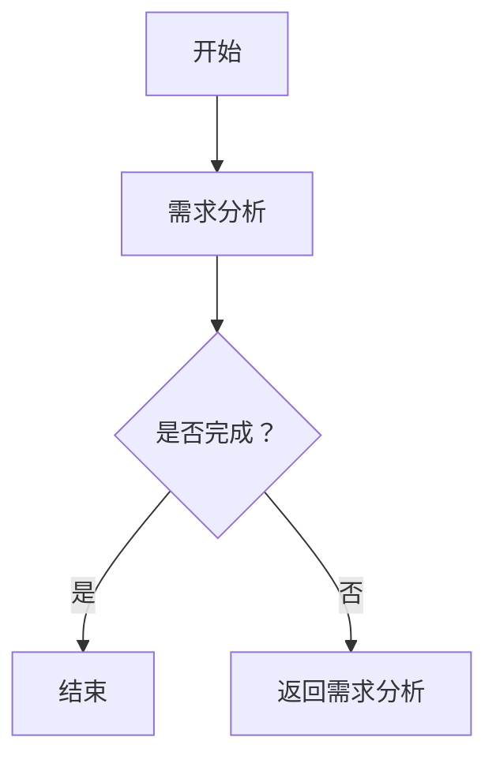

                 

### 文章标题

《程序员知识付费的客户服务与用户体验》### 《程序员知识付费的客户服务与用户体验》目录大纲

#### 第一部分：知识付费概述

- **第1章：知识付费市场与环境**
  - **1.1 知识付费的概念与现状**
    - **1.1.1 知识付费的定义**
    - **1.1.2 知识付费的发展历程**
    - **1.1.3 知识付费市场现状**
  - **1.2 程序员在知识付费中的角色**
    - **1.2.1 程序员的知识需求**
    - **1.2.2 程序员的付费意愿分析**
    - **1.2.3 程序员的知识付费模式**
  - **1.3 客户服务的核心要素**
    - **1.3.1 客户服务的重要性**
    - **1.3.2 客户服务的目标**
    - **1.3.3 客户服务的原则**
- **第2章：用户体验设计与优化**
  - **2.1 用户体验概述**
    - **2.1.1 用户体验的定义**
    - **2.1.2 用户体验的要素**
    - **2.1.3 用户体验设计与流程**
  - **2.2 程序员用户画像与需求分析**
    - **2.2.1 程序员用户画像构建**
    - **2.2.2 程序员用户需求分析**
    - **2.2.3 程序员用户行为分析**
  - **2.3 用户体验优化策略**
    - **2.3.1 交互设计优化**
    - **2.3.2 用户体验测试与反馈**
    - **2.3.3 用户体验持续改进**

#### 第二部分：客户服务实践

- **第3章：客户服务流程与体系构建**
  - **3.1 客户服务流程概述**
    - **3.1.1 客户服务流程的基本环节**
    - **3.1.2 客户服务流程的设计原则**
    - **3.1.3 客户服务流程的优化方法**
  - **3.2 客户服务体系构建**
    - **3.2.1 客户服务团队的组织结构**
    - **3.2.2 客户服务团队的培训与激励**
    - **3.2.3 客户服务体系的建立与维护**
  - **3.3 客户服务渠道与工具**
    - **3.3.1 客户服务渠道的多样化**
    - **3.3.2 客户服务工具的选择与应用**
    - **3.3.3 客户服务工具的集成与优化**
- **第4章：客户服务策略与技巧**
  - **4.1 客户服务策略**
    - **4.1.1 客户服务目标设定**
    - **4.1.2 客户服务策略制定**
    - **4.1.3 客户服务效果评估**
  - **4.2 客户沟通技巧**
    - **4.2.1 有效沟通的基本原则**
    - **4.2.2 情感沟通的重要性**
    - **4.2.3 应对客户投诉与纠纷**
  - **4.3 客户关系管理**
    - **4.3.1 客户关系管理的理念**
    - **4.3.2 客户关系管理的工具与方法**
    - **4.3.3 客户关系管理的案例分析**

#### 第三部分：用户体验提升

- **第5章：用户体验设计方法论**
  - **5.1 用户体验设计流程**
    - **5.1.1 需求分析**
    - **5.1.2 原型设计**
    - **5.1.3 交互设计**
    - **5.1.4 视觉设计**
  - **5.2 用户体验评估方法**
    - **5.2.1 用户体验测试**
    - **5.2.2 用户反馈收集与分析**
    - **5.2.3 用户体验评估指标**
  - **5.3 用户体验优化案例**
    - **5.3.1 案例一：提升页面加载速度**
    - **5.3.2 案例二：优化用户操作流程**
    - **5.3.3 案例三：增强用户互动体验**
- **第6章：界面设计与用户体验**
  - **6.1 界面设计原则**
    - **6.1.1 界面设计的基本要素**
    - **6.1.2 界面设计的用户体验考量**
    - **6.1.3 界面设计的最佳实践**
  - **6.2 布局设计**
    - **6.2.1 布局的基本原则**
    - **6.2.2 布局的视觉层次**
    - **6.2.3 布局的案例分析**
  - **6.3 色彩与视觉设计**
    - **6.3.1 色彩的心理效应**
    - **6.3.2 视觉元素的运用**
    - **6.3.3 色彩与视觉设计的案例研究**
- **第7章：用户调研与需求分析**
  - **7.1 用户调研方法**
    - **7.1.1 用户访谈**
    - **7.1.2 问卷调查**
    - **7.1.3 观察法**
    - **7.1.4 用户体验测试**
  - **7.2 需求分析**
    - **7.2.1 需求收集**
    - **7.2.2 需求分类**
    - **7.2.3 需求优先级排序**
  - **7.3 需求分析与用户体验设计**
    - **7.3.1 需求分析与设计决策**
    - **7.3.2 需求分析工具与方法**
    - **7.3.3 需求分析与用户体验提升**

#### 第四部分：案例分析

- **第8章：知识付费与客户服务的成功案例**
  - **8.1 案例一：知名在线教育平台**
    - **8.1.1 案例背景**
    - **8.1.2 客户服务策略**
    - **8.1.3 用户体验设计**
    - **8.1.4 成功因素分析**
  - **8.2 案例二：技术社区知识付费**
    - **8.2.1 案例背景**
    - **8.2.2 客户服务策略**
    - **8.2.3 用户体验设计**
    - **8.2.4 成功因素分析**
  - **8.3 案例三：专业培训机构**
    - **8.3.1 案例背景**
    - **8.3.2 客户服务策略**
    - **8.3.3 用户体验设计**
    - **8.3.4 成功因素分析**### 第一部分：知识付费概述

#### 第1章：知识付费市场与环境

##### 1.1 知识付费的概念与现状

知识付费是指消费者为获取专业知识、技能或信息而支付费用的一种商业模式。在互联网时代，知识付费市场逐渐兴起，用户可以通过在线平台购买课程、电子书、音频、视频等多种形式的内容。

**1.1.1 知识付费的定义**

知识付费是一种通过互联网平台，将知识或技能以数字化产品或服务形式提供给消费者，消费者通过支付一定费用获取相应内容的商业模式。

**1.1.2 知识付费的发展历程**

知识付费的发展可以分为几个阶段：

1. **萌芽期**（2010-2013年）：早期的知识付费主要是由博客、微博等社交媒体平台上的个人专家或教育机构提供付费内容。
2. **成长期**（2014-2016年）：随着移动互联网的普及，知识付费市场迎来了爆发式增长，各类知识付费平台如雨后春笋般涌现。
3. **成熟期**（2017年至今）：知识付费市场逐渐走向细分和专业化，越来越多的行业和领域参与到知识付费的浪潮中。

**1.1.3 知识付费市场现状**

当前，知识付费市场呈现出以下趋势：

1. **市场规模不断扩大**：据统计，2018年中国知识付费市场规模已达到500亿元人民币，预计未来还将保持快速增长。
2. **用户群体逐渐扩大**：知识付费用户不仅限于学生、职场新人，还包括专业人士、创业者等各个层次的用户。
3. **内容形式多样化**：除了传统的课程、电子书，现在还有音频、视频、直播等多种形式的知识产品。
4. **平台竞争加剧**：各大知识付费平台在用户获取、内容制作、运营策略等方面展开激烈竞争。

##### 1.2 程序员在知识付费中的角色

程序员作为技术领域的专业人士，对于知识付费有着较高的需求和付费意愿。他们在知识付费市场中的角色主要包括以下几个方面：

**1.2.1 程序员的知识需求**

程序员的知识需求主要集中在以下领域：

1. **编程语言与框架**：如Java、Python、JavaScript等编程语言，以及Spring、Django等框架。
2. **数据库技术**：如MySQL、Oracle、MongoDB等数据库系统。
3. **前端技术**：如HTML、CSS、JavaScript等。
4. **后端技术**：如Linux、Shell、云计算等。
5. **项目管理与团队协作**：如敏捷开发、Scrum、Git等。

**1.2.2 程序员的付费意愿分析**

程序员的付费意愿受以下因素影响：

1. **职业发展需求**：程序员普遍有持续学习和提升技能的需求，因此对高质量知识付费内容有较高的付费意愿。
2. **时间成本**：程序员的时间非常宝贵，通过付费获取知识可以节省自行学习的时间成本。
3. **内容质量**：高质量的知识付费内容能帮助程序员快速掌握新技术，提升工作效率，因此愿意为此付费。

**1.2.3 程序员的知识付费模式**

程序员的知识付费模式主要包括以下几种：

1. **课程购买**：购买在线课程，包括编程语言、框架、数据库、前端技术等。
2. **电子书购买**：购买专业书籍或电子书，如《Effective Java》、《深入理解计算机系统》等。
3. **直播与互动课程**：参加在线直播课程或互动课程，如技术讲座、面试辅导等。
4. **会员制**：购买知识付费平台的会员服务，享受平台提供的所有课程和资源。

##### 1.3 客户服务的核心要素

客户服务是知识付费平台的重要组成部分，直接影响到用户体验和用户忠诚度。优秀的客户服务需要以下核心要素：

**1.3.1 客户服务的重要性**

1. **提升用户满意度**：良好的客户服务能够解决用户在知识获取过程中遇到的问题，提高用户满意度。
2. **增强用户忠诚度**：优质的服务体验能够增加用户对平台的信任和依赖，提高用户忠诚度。
3. **口碑传播**：满意的用户会推荐平台给他人，有助于提升平台知名度和市场份额。

**1.3.2 客户服务的目标**

1. **快速响应**：及时解决用户问题，减少用户等待时间。
2. **解决问题**：帮助用户解决实际问题，提供有效解决方案。
3. **满意度提升**：通过服务提升用户满意度，增强用户对平台的认可。

**1.3.3 客户服务的原则**

1. **用户至上**：始终将用户需求放在首位，关注用户满意度。
2. **诚信服务**：保持诚信，公正透明地处理用户问题。
3. **专业高效**：提供专业、高效的服务，提高问题解决率。
4. **持续改进**：不断优化服务流程，提升服务质量。

通过以上对知识付费市场环境的概述，我们可以看到程序员在知识付费中的独特角色，以及客户服务在知识付费体系中的核心地位。接下来，我们将进一步探讨用户体验设计与优化的重要性，以及如何在实践中提升程序员的知识付费服务的用户体验。### 第一部分：知识付费概述

#### 第2章：用户体验设计与优化

##### 2.1 用户体验概述

用户体验（User Experience，简称UX）是指用户在使用产品或服务过程中的整体感受和体验。在知识付费领域，用户体验尤为重要，因为它直接影响到用户的满意度和忠诚度。良好的用户体验能够提高用户的学习效率，增加用户对平台的依赖和信任。

**2.1.1 用户体验的定义**

用户体验是指用户在使用产品或服务过程中所感受到的情感、认知和行为的总和。它不仅仅关注功能本身，还包括用户在使用过程中的情感体验、交互体验等。

**2.1.2 用户体验的要素**

用户体验的要素可以从以下几个方面进行概括：

1. **功能性**：产品或服务是否能够实现用户期望的功能。
2. **易用性**：用户在使用产品或服务时的便捷程度。
3. **可靠性**：产品或服务的稳定性和一致性。
4. **情感性**：用户在使用过程中的情感体验，如愉悦、焦虑等。
5. **审美性**：产品或服务的视觉设计和美感。
6. **参与感**：用户在使用过程中的参与程度和互动性。

**2.1.3 用户体验设计与流程**

用户体验设计是一个系统化的过程，包括需求分析、原型设计、交互设计、视觉设计等多个阶段。以下是用户体验设计的基本流程：

1. **需求分析**：通过用户调研、访谈、问卷等方式，收集用户需求，明确设计目标。
2. **原型设计**：基于需求分析，制作低保真或高保真的原型，用于测试和反馈。
3. **交互设计**：设计用户与产品或服务之间的交互流程和界面元素。
4. **视觉设计**：设计产品的视觉元素，包括颜色、字体、图标等，以提升审美性。
5. **用户测试**：通过实际用户的使用反馈，不断优化和改进设计。
6. **上线发布**：将最终设计的产品或服务发布给用户，并进行持续的维护和更新。

##### 2.2 程序员用户画像与需求分析

为了提供优质的用户体验，需要对目标用户进行深入的了解。程序员作为知识付费的重要用户群体，有其独特的用户画像和需求。

**2.2.1 程序员用户画像构建**

程序员用户画像可以从以下几个方面进行构建：

1. **年龄与性别**：程序员群体以男性为主，年龄主要集中在20-45岁之间。
2. **职业背景**：程序员群体包括学生、在职人员、创业者等不同职业背景。
3. **技术领域**：程序员群体涉及多个技术领域，如前端、后端、移动开发、大数据等。
4. **教育程度**：程序员群体普遍具有较高的教育程度，大多数拥有本科及以上学历。
5. **地域分布**：程序员群体地域分布广泛，主要集中在一线和新一线城市。

**2.2.2 程序员用户需求分析**

程序员的用户需求主要包括以下几个方面：

1. **技能提升**：程序员普遍有持续学习和提升技能的需求，希望通过知识付费获取最新技术知识和实践经验。
2. **项目经验**：程序员希望获取实际项目经验，通过实战提升自己的技能水平。
3. **职业规划**：程序员希望通过知识付费了解职业发展的路径和机会，为自己的职业规划提供指导。
4. **社交互动**：程序员希望在知识付费平台上与其他程序员进行交流，分享经验和心得。

**2.2.3 程序员用户行为分析**

通过对程序员用户行为的分析，可以更好地了解他们的使用习惯和偏好，从而优化用户体验。程序员用户行为分析可以从以下几个方面进行：

1. **学习时间**：程序员的学习时间主要集中在工作日晚上和周末。
2. **学习路径**：程序员在学习过程中，通常先从基础课程开始，逐步深入到专业课程。
3. **学习方式**：程序员更倾向于通过视频和直播课程进行学习，同时也关注课程中的互动环节。
4. **评价反馈**：程序员在评价课程时，主要关注课程内容的质量、实用性以及授课老师的教学水平。

##### 2.3 用户体验优化策略

为了提升程序员的知识付费服务的用户体验，需要从以下几个方面进行优化：

**2.3.1 交互设计优化**

交互设计是用户体验的重要组成部分，优化交互设计可以从以下几个方面进行：

1. **简洁明了的界面**：设计简洁明了的界面，减少用户操作步骤，提高易用性。
2. **清晰的导航**：提供清晰的导航，帮助用户快速找到所需内容。
3. **合理的反馈**：在用户操作过程中，提供及时、准确的反馈，增强用户信心。

**2.3.2 用户体验测试与反馈**

用户体验测试是优化用户体验的重要手段，可以通过以下方式进行：

1. **A/B测试**：通过对比不同设计版本的测试结果，找出最优设计方案。
2. **用户反馈**：收集用户反馈，了解用户的需求和意见，不断优化产品。

**2.3.3 用户体验持续改进**

用户体验的优化是一个持续的过程，需要不断收集用户反馈，进行迭代优化：

1. **定期评估**：定期对用户体验进行评估，分析用户满意度，找出存在的问题。
2. **持续优化**：根据评估结果，持续优化产品设计，提升用户体验。

通过以上对用户体验设计与优化的探讨，我们可以看到用户体验在知识付费领域的重要性。接下来，我们将进一步探讨客户服务流程与体系构建，以及如何通过有效的客户服务策略和技巧提升用户体验。### 第二部分：客户服务实践

#### 第3章：客户服务流程与体系构建

##### 3.1 客户服务流程概述

客户服务流程是指企业为满足客户需求，解决客户问题，提供优质服务所采用的一系列步骤和环节。一个完善的客户服务流程能够有效提高客户满意度，增强客户忠诚度，从而促进企业的长期发展。

**3.1.1 客户服务流程的基本环节**

一个典型的客户服务流程通常包括以下基本环节：

1. **客户咨询**：客户通过电话、邮件、在线聊天等方式提出问题或需求。
2. **问题受理**：客服人员接收客户咨询，了解问题背景，记录相关信息。
3. **问题分析**：客服人员对问题进行分析，判断问题的性质和复杂程度。
4. **解决方案**：根据问题的分析结果，提供合适的解决方案，可能包括产品使用指导、故障排除等。
5. **问题解决**：实施解决方案，确保问题得到有效解决。
6. **客户反馈**：收集客户对解决方案的反馈，了解服务效果。
7. **服务跟踪**：对已解决的问题进行跟踪，确保问题不再出现。

**3.1.2 客户服务流程的设计原则**

在设计客户服务流程时，应遵循以下原则：

1. **客户导向**：始终以客户需求为中心，确保客户问题得到及时、有效的解决。
2. **高效快捷**：优化流程，减少不必要的环节，提高服务效率。
3. **持续改进**：定期评估和优化服务流程，不断改进服务质量。
4. **标准化**：制定标准化的操作流程，确保服务的规范化和一致性。
5. **灵活性**：在遵循标准流程的同时，允许一定的灵活性，以应对不同客户需求和特殊情况。

**3.1.3 客户服务流程的优化方法**

为了提升客户服务的效率和满意度，可以采用以下方法对客户服务流程进行优化：

1. **流程简化**：通过梳理和简化流程，去除冗余步骤，减少客户等待时间。
2. **自动化**：引入自动化工具，如智能客服系统、自动化工单系统等，减少人工操作，提高处理速度。
3. **数据分析**：利用数据分析工具，对客户服务数据进行深入分析，找出服务流程中的瓶颈和问题。
4. **培训与激励**：定期对客服人员进行培训，提高其专业素养和服务水平，通过激励措施，激发客服人员的工作积极性。

##### 3.2 客户服务体系构建

客户服务体系是提供客户服务的基础设施和保障体系，包括组织结构、人员配置、培训与激励、服务标准等方面。

**3.2.1 客户服务团队的组织结构**

一个高效的客户服务团队应具备合理的组织结构，通常包括以下部门：

1. **客户服务中心**：负责日常的客户咨询和服务处理。
2. **技术支持部门**：负责技术问题的解决和指导。
3. **售后服务部门**：负责售后问题的处理和跟踪。
4. **客户关系管理团队**：负责维护客户关系，提升客户满意度。

**3.2.2 客户服务团队的培训与激励**

为了提升客户服务团队的专业素养和服务水平，应定期进行以下工作：

1. **专业技能培训**：对客服人员进行产品知识、服务技能等方面的培训，提高其解决问题的能力。
2. **服务意识培训**：增强客服人员的服务意识，提高其对客户需求的理解和满足度。
3. **团队协作培训**：提高团队协作能力，确保服务流程的顺畅和高效。
4. **激励措施**：通过绩效奖金、晋升机会等激励措施，激发客服人员的工作积极性。

**3.2.3 客户服务体系的建立与维护**

建立和维护一个高效的客户服务体系，需要以下措施：

1. **明确服务目标**：制定明确的服务目标，确保客户服务体系的建设和运营方向一致。
2. **建立服务标准**：制定统一的服务标准和流程，确保服务的规范化和一致性。
3. **持续改进**：通过客户反馈、数据分析等方式，不断优化服务流程和标准，提升服务质量。
4. **技术支持**：提供必要的技术支持，确保客户服务系统的稳定运行。

##### 3.3 客户服务渠道与工具

为了提供高效、便捷的客户服务，企业应充分利用多种服务渠道和工具。

**3.3.1 客户服务渠道的多样化**

多样化的服务渠道能够满足不同客户的需求，常见的客户服务渠道包括：

1. **电话**：传统的服务渠道，适用于复杂问题的解答和沟通。
2. **邮件**：适用于需要详细记录和正式沟通的服务需求。
3. **在线聊天**：适用于实时性要求较高的服务场景。
4. **社交媒体**：如微博、微信等，适用于快速响应和互动。
5. **自助服务**：如在线帮助中心、FAQ等，适用于常见问题的自助解决。

**3.3.2 客户服务工具的选择与应用**

选择合适的客户服务工具，可以提高服务效率和客户满意度。常见的客户服务工具包括：

1. **客户关系管理系统（CRM）**：用于记录和管理客户信息，提高服务效率。
2. **智能客服系统**：通过人工智能技术，提供自动化的客户服务，降低人力成本。
3. **工单系统**：用于管理服务请求和处理流程，提高服务规范化程度。
4. **知识库**：用于存储常见问题的解答和解决方案，方便客服人员和用户查询。
5. **在线会议工具**：如Zoom、腾讯会议等，用于远程问题解决和培训。

**3.3.3 客户服务工具的集成与优化**

客户服务工具的集成和优化是提高服务效率和用户体验的关键。以下是一些建议：

1. **集成多种工具**：将客户关系管理系统、智能客服系统、工单系统等集成在一起，实现数据共享和流程协同。
2. **数据统一管理**：确保客户数据的统一管理和实时更新，避免数据孤岛现象。
3. **自动化流程**：通过自动化工具，简化服务流程，提高处理速度。
4. **用户界面友好**：优化客户服务工具的界面设计，提高用户体验。
5. **定期评估与优化**：定期评估客户服务工具的使用效果，根据反馈进行优化和改进。

通过以上对客户服务流程与体系构建的探讨，我们可以看到客户服务在知识付费中的重要性。接下来，我们将进一步探讨客户服务策略与技巧，以及如何通过有效的沟通和客户关系管理提升用户体验。### 第二部分：客户服务实践

#### 第4章：客户服务策略与技巧

##### 4.1 客户服务策略

客户服务策略是企业在客户服务过程中制定的总体方针和行动指南，旨在通过有效的服务手段提升客户满意度和忠诚度。为了制定有效的客户服务策略，企业需要从以下几个方面进行考虑：

**4.1.1 客户服务目标设定**

设定明确的客户服务目标是制定策略的第一步。客户服务目标应具有可衡量性、可实现性和相关性，常见的目标包括：

1. **满意度提升**：提高客户对服务的满意度，通常通过客户满意度调查来衡量。
2. **响应时间缩短**：减少客户咨询问题的响应时间，提高服务效率。
3. **问题解决率提高**：提高问题解决率，确保客户问题能够得到及时和有效的解决。
4. **客户忠诚度提升**：增强客户对企业的忠诚度，减少客户流失率。

**4.1.2 客户服务策略制定**

在明确客户服务目标后，企业需要制定具体的策略来达成这些目标。以下是一些常见的客户服务策略：

1. **个性化服务**：根据客户的需求和偏好提供定制化的服务，提高客户体验。
2. **多渠道服务**：提供多样化的服务渠道，如电话、邮件、在线聊天、社交媒体等，方便客户选择最便捷的沟通方式。
3. **快速响应**：建立高效的响应机制，确保客户的问题能够得到快速响应和解决。
4. **问题预防**：通过数据分析、用户调研等方式，提前发现潜在问题，采取措施预防问题发生。
5. **培训与激励**：定期对客服人员进行培训，提高其专业素养和服务水平，并通过激励措施，激发客服人员的工作积极性。

**4.1.3 客户服务效果评估**

为了确保客户服务策略的有效性，企业需要对客户服务效果进行定期评估。以下是一些常用的评估方法：

1. **客户满意度调查**：通过问卷调查、电话回访等方式，收集客户对服务的满意度反馈。
2. **服务指标分析**：分析服务响应时间、问题解决率、客户投诉率等指标，评估服务的效率和质量。
3. **客户留存率分析**：通过客户留存率的变化，评估服务对客户忠诚度的影响。
4. **员工绩效评估**：评估客服人员的绩效，了解服务流程中的瓶颈和问题。

通过以上方法，企业可以全面了解客户服务的现状和效果，为持续优化服务提供依据。

##### 4.2 客户沟通技巧

良好的沟通技巧是提供优质客户服务的基础。以下是一些关键的客户沟通技巧：

**4.2.1 有效沟通的基本原则**

1. **倾听**：认真倾听客户的问题和需求，不打断客户发言，确保理解客户的真实意图。
2. **尊重**：尊重客户的观点和感受，表现出对客户的关心和尊重。
3. **清晰表达**：用简洁明了的语言表达自己的观点，避免使用专业术语或复杂句子，确保客户理解。
4. **同理心**：设身处地理解客户的感受，表现出同理心，增强客户对服务的信任。
5. **积极反馈**：及时给予客户积极反馈，确认客户的问题已得到理解，并告知下一步处理措施。

**4.2.2 情感沟通的重要性**

情感沟通在客户服务中具有重要作用，能够有效缓解客户的负面情绪，提升客户满意度。以下是一些情感沟通的技巧：

1. **同理心**：通过表达理解客户的情感，如“我能理解您的困扰”，建立情感共鸣。
2. **积极的情感表达**：用积极、鼓励的语言，如“我们会尽快解决您的问题”，增强客户的信心。
3. **情感释放**：给客户提供表达情感的机会，如“请告诉我您的具体感受”，帮助客户释放负面情绪。
4. **情感支持**：提供情感支持，如“我们会尽力帮助您”，缓解客户的焦虑和不安。

**4.2.3 应对客户投诉与纠纷**

客户投诉与纠纷是客户服务中不可避免的问题，有效的应对策略能够降低客户的不满，提升企业形象。以下是一些应对客户投诉与纠纷的技巧：

1. **积极倾听**：耐心倾听客户的投诉，不打断客户发言，确保理解客户的投诉原因。
2. **承认错误**：如果企业确实存在问题，应承认错误，如“我们确实在这方面做得不够好”。
3. **提供解决方案**：根据客户的投诉，提供合理的解决方案，如退款、补偿等。
4. **道歉与赔偿**：真诚道歉，并采取措施进行赔偿，如“我们深感抱歉，将为您提供相应的补偿”。
5. **跟进与反馈**：对客户的投诉进行跟进，确保问题得到解决，并向客户反馈处理结果。

通过以上沟通技巧，企业可以有效地与客户进行沟通，提升客户满意度，减少投诉与纠纷。

##### 4.3 客户关系管理

客户关系管理（Customer Relationship Management，简称CRM）是企业为了提升客户满意度和忠诚度，通过系统化、数据化的方法进行客户关系维护和管理的一系列策略和活动。以下是一些关键的客户关系管理理念和工具：

**4.3.1 客户关系管理的理念**

1. **客户价值**：将客户视为企业最重要的资产，重视客户的终身价值，而非仅仅关注短期收益。
2. **持续互动**：与客户保持持续互动，通过多渠道沟通了解客户需求，提供个性化的服务。
3. **数据驱动**：利用数据分析，深入了解客户行为和偏好，为决策提供依据。
4. **协作共享**：建立跨部门协作机制，共享客户信息，提高服务效率和质量。
5. **持续改进**：不断优化客户关系管理流程，提高客户满意度和忠诚度。

**4.3.2 客户关系管理的工具与方法**

1. **客户关系管理系统（CRM）**：CRM系统是企业进行客户关系管理的重要工具，能够记录和管理客户信息、销售机会、服务请求等，提高客户信息的统一性和可访问性。
2. **客户数据分析**：通过数据挖掘和分析，深入了解客户行为和偏好，为精准营销和服务提供依据。
3. **个性化营销**：根据客户数据，提供个性化的营销活动和产品推荐，提高客户参与度和转化率。
4. **客户满意度调查**：定期进行客户满意度调查，收集客户反馈，了解客户需求，不断改进服务质量。
5. **客户服务团队协作**：建立高效的客服团队协作机制，确保客户问题得到快速响应和解决。

**4.3.3 客户关系管理的案例分析**

以下是一个客户关系管理的成功案例分析：

**案例：一家在线教育平台的客户关系管理实践**

1. **建立CRM系统**：该在线教育平台引入了CRM系统，用于记录和管理客户信息、课程购买记录、服务请求等，提高了客户信息的统一性和可访问性。
2. **数据分析与个性化推荐**：平台通过数据分析，了解到不同客户的学习偏好和需求，提供个性化的课程推荐和营销活动，提高了客户参与度和转化率。
3. **客户满意度调查**：平台定期进行客户满意度调查，收集客户反馈，了解客户需求，根据反馈优化课程内容和教学质量。
4. **客服团队协作**：平台建立了高效的客服团队协作机制，确保客户问题得到快速响应和解决，提高了客户满意度。

通过以上客户关系管理实践，该在线教育平台成功提升了客户满意度和忠诚度，实现了业务的快速增长。

通过以上对客户服务策略与技巧的探讨，我们可以看到良好的客户服务对企业的重要性。有效的客户服务策略和技巧能够提升客户满意度，增强客户忠诚度，从而为企业的长期发展奠定坚实基础。接下来，我们将进一步探讨用户体验提升的具体方法和实践。### 第二部分：客户服务实践

#### 第5章：用户体验设计方法论

##### 5.1 用户体验设计流程

用户体验设计是一个系统化的过程，旨在通过设计提升用户在使用产品或服务过程中的满意度和忠诚度。一个完整的用户体验设计流程通常包括以下步骤：

**5.1.1 需求分析**

需求分析是用户体验设计的起点，旨在了解用户的需求和期望。需求分析的方法包括：

1. **用户调研**：通过访谈、问卷调查、用户观察等方式收集用户需求。
2. **市场研究**：分析竞争对手、行业趋势等，了解市场需求和机会。
3. **需求文档**：整理和分析收集到的用户需求，形成详细的需求文档。

**5.1.2 原型设计**

原型设计是将用户需求转化为可视化的设计方案。原型设计的方法包括：

1. **低保真原型**：用简单的线框图或草图表示界面布局和功能，便于快速迭代和反馈。
2. **高保真原型**：使用更精细的视觉设计，模拟最终产品的外观和交互效果。

**5.1.3 交互设计**

交互设计是用户体验设计的关键环节，旨在设计用户与产品或服务之间的交互流程。交互设计的方法包括：

1. **交互流程图**：用流程图表示用户操作产品或服务的步骤和路径。
2. **交互模型**：用模型表示用户与产品或服务的交互逻辑和规则。
3. **交互原型**：通过交互原型展示用户与产品或服务的交互效果。

**5.1.4 视觉设计**

视觉设计是用户体验设计的重要组成部分，旨在提升产品的美观度和用户满意度。视觉设计的方法包括：

1. **色彩设计**：选择合适的色彩方案，提升视觉效果的和谐度。
2. **图标与字体设计**：设计简洁、直观的图标和字体，提高用户的易用性。
3. **布局设计**：优化界面布局，提高信息的层次和可读性。

**5.1.5 用户测试**

用户测试是验证设计效果的重要手段，通过实际用户的使用反馈，发现和改进设计问题。用户测试的方法包括：

1. **可用性测试**：评估用户在使用产品或服务过程中的体验，如易用性、可用性等。
2. **功能测试**：验证产品的功能是否符合用户需求，如功能的完备性、可靠性等。
3. **用户反馈**：收集用户对设计的建议和意见，为设计改进提供依据。

**5.1.6 上线发布**

上线发布是将最终设计的产品或服务交付给用户使用。上线发布的方法包括：

1. **发布计划**：制定详细的发布计划，确保上线过程顺利进行。
2. **上线准备**：进行系统测试、数据备份等工作，确保系统的稳定性和安全性。
3. **用户培训**：为用户提供培训，帮助用户了解和使用新产品或服务。
4. **上线监控**：上线后持续监控系统的运行情况，及时解决可能出现的问题。

通过以上用户体验设计流程，企业可以系统化地提升产品的用户体验，增强用户满意度，从而在激烈的市场竞争中脱颖而出。

##### 5.2 用户体验评估方法

用户体验评估是确保产品或服务设计符合用户需求和期望的关键步骤。以下是一些常用的用户体验评估方法：

**5.2.1 用户体验测试**

用户体验测试是通过实际用户的使用反馈，评估产品或服务的设计是否符合用户需求。用户体验测试的方法包括：

1. **可用性测试**：评估用户在使用产品或服务过程中的体验，如易用性、可用性等。
2. **任务完成测试**：观察用户完成特定任务的效率和质量，评估设计的合理性和有效性。
3. **满意度测试**：收集用户对产品或服务的满意度评价，了解用户对设计的接受程度。

**5.2.2 用户反馈收集与分析**

用户反馈是评估用户体验的重要来源。以下是一些收集和分析用户反馈的方法：

1. **问卷调查**：通过在线问卷、纸质问卷等方式，收集用户的意见和建议。
2. **用户访谈**：与用户进行一对一访谈，深入了解用户的使用体验和需求。
3. **用户反馈分析**：对收集到的用户反馈进行整理和分析，识别用户关注的痛点和改进机会。

**5.2.3 用户体验评估指标**

用户体验评估指标是衡量用户体验质量的重要工具。以下是一些常用的用户体验评估指标：

1. **满意度指标**：如用户满意度评分（ Satisfaction Score）、净推荐值（Net Promoter Score，NPS）等。
2. **易用性指标**：如任务完成率、错误率、使用时间等。
3. **参与度指标**：如用户活跃度、留存率、使用频率等。
4. **健康指标**：如系统崩溃率、响应时间、网络延迟等。

通过以上用户体验评估方法，企业可以全面了解用户的需求和期望，持续改进产品或服务设计，提升用户体验。

##### 5.3 用户体验优化案例

在实际工作中，用户体验优化是一个持续迭代的过程。以下是一些具体的用户体验优化案例，供参考：

**5.3.1 案例一：提升页面加载速度**

**背景**：某在线教育平台发现用户在浏览课程页面时，页面加载速度较慢，导致用户流失率上升。

**解决方案**：

1. **优化图片资源**：通过压缩图片文件大小、使用懒加载技术，减少页面加载时间。
2. **代码优化**：精简代码，去除不必要的CSS和JavaScript文件，提高页面加载速度。
3. **缓存策略**：设置合理的缓存机制，减少重复加载资源。

**效果**：通过以上优化措施，页面加载速度提升了30%，用户流失率明显下降。

**5.3.2 案例二：优化用户操作流程**

**背景**：某电商平台发现用户在购物车结算时，操作步骤繁琐，导致用户放弃购买。

**解决方案**：

1. **简化操作流程**：减少用户在结算过程中的输入和确认步骤，简化购物车界面设计。
2. **提供实时提示**：在用户操作过程中，提供实时提示和帮助，减少用户困惑和错误。
3. **个性化推荐**：根据用户购买历史和偏好，提供个性化的商品推荐，提高购买意愿。

**效果**：通过以上优化措施，用户结算流程简化了50%，购物车放弃率下降了20%。

**5.3.3 案例三：增强用户互动体验**

**背景**：某社交平台发现用户互动体验较差，用户活跃度不高。

**解决方案**：

1. **优化互动设计**：提升互动界面的美观度和易用性，增加互动元素，如点赞、评论等。
2. **增加活动互动**：举办线上活动，如问答、投票等，增加用户参与度。
3. **实时反馈**：通过实时消息推送，增强用户之间的互动，提高平台活跃度。

**效果**：通过以上优化措施，用户活跃度提升了40%，互动率提高了30%。

通过以上案例，我们可以看到，用户体验优化是一个持续迭代的过程，需要根据用户需求和反馈，不断改进产品设计和功能，提升用户体验。### 第二部分：客户服务实践

#### 第6章：界面设计与用户体验

##### 6.1 界面设计原则

界面设计（Interface Design）是用户体验设计的重要组成部分，其目标是确保用户能够方便、直观地使用产品或服务。以下是一些界面设计的基本原则：

**6.1.1 界面设计的基本要素**

界面设计的基本要素包括：

1. **布局**：界面的布局决定了信息呈现的结构和层次，良好的布局能够让用户快速理解信息。
2. **色彩**：色彩在界面设计中起到视觉吸引和信息传递的作用，合理的色彩搭配能够提升用户体验。
3. **字体**：字体决定了界面的可读性和美感，选择合适的字体能够提高用户的阅读体验。
4. **图标**：图标是界面中重要的视觉元素，用于表示功能、状态等，简洁、直观的图标能够提高用户的操作效率。
5. **交互元素**：如按钮、输入框、下拉菜单等，它们是用户与产品交互的接口，设计得宜能够提升用户体验。

**6.1.2 界面设计的用户体验考量**

在界面设计时，需要从用户体验的角度进行考量：

1. **易用性**：界面设计应简洁明了，减少用户的学习成本，使用户能够快速上手。
2. **一致性**：界面设计应保持一致性，包括布局、色彩、字体等，使用户在不同页面或功能之间感受到连贯性。
3. **美观性**：界面设计应具有美观性，通过色彩、字体、图标等元素，提升界面的视觉效果，增强用户的审美体验。
4. **反馈性**：界面设计应提供及时的反馈，如操作成功、错误提示等，增强用户的信心和满意度。
5. **可访问性**：界面设计应考虑到不同用户的需求，如视力障碍者、老年人等，确保界面设计对所有人都是可访问的。

**6.1.3 界面设计的最佳实践**

以下是一些界面设计的最佳实践：

1. **遵循设计规范**：遵循行业或平台的设计规范，如Material Design、iOS Human Interface Guidelines等，确保界面的统一性和专业性。
2. **简洁明了**：避免界面过于复杂，减少不必要的元素，保持界面的简洁性。
3. **重点突出**：通过色彩、大小、对比等方式，突出界面的重点信息，引导用户注意力。
4. **合理的空间利用**：合理利用空间，避免拥挤或空旷，提升界面的视觉舒适度。
5. **多设备适配**：确保界面设计在不同设备和分辨率上都能够良好显示，提供一致的用户体验。

##### 6.2 布局设计

布局设计是界面设计的重要环节，决定了信息在界面上的排列和组织方式。以下是一些布局设计的基本原则：

**6.2.1 布局的基本原则**

布局设计的基本原则包括：

1. **层次感**：通过合理的布局，使信息具有清晰的层次感，帮助用户快速理解内容。
2. **对称与平衡**：对称布局能够创造稳定、和谐的感觉，而平衡布局则能够创造动态、活力的感觉。
3. **对比与呼应**：通过对比和呼应，突出重点信息，增强界面的视觉效果。
4. **网格布局**：使用网格布局能够使界面具有系统性，提高信息的组织性和易读性。
5. **留白**：适当的留白能够减少界面的拥挤感，提升视觉舒适度。

**6.2.2 布局的视觉层次**

布局的视觉层次决定了用户在界面上的关注顺序，以下是一些常见的视觉层次设计方法：

1. **颜色层次**：通过不同的颜色区分信息的重要性和优先级。
2. **大小层次**：通过字体大小、图标大小等方式区分信息的重要性和优先级。
3. **对比层次**：通过对比，如颜色对比、大小对比等，突出重点信息。
4. **空间层次**：通过空间排列，如信息的间距、区块的布局等，创造视觉层次。
5. **动态层次**：通过动态效果，如动画、滚动等，提升用户的视觉体验。

**6.2.3 布局的案例分析**

以下是一个布局设计的案例分析：

**案例：某电商平台首页布局**

该电商平台的首页采用了以下布局设计：

1. **顶部导航栏**：放置品牌Logo、搜索框和菜单栏，方便用户快速访问主要功能。
2. **轮播图**：放置广告或推荐商品，通过动态效果吸引用户注意力。
3. **产品分类栏**：通过大块的色块和清晰的分类名称，引导用户进入不同类别的商品页面。
4. **促销信息栏**：放置当前促销活动的信息，通过视觉突出和动态效果，吸引用户参与。
5. **底部导航栏**：放置常用功能链接，如购物车、收藏夹、客服等，方便用户快速访问。

通过以上布局设计，该电商平台成功地提升了用户的访问体验和购买意愿。

##### 6.3 色彩与视觉设计

色彩与视觉设计是界面设计的重要方面，能够显著影响用户的心理体验和情感反应。以下是一些关于色彩与视觉设计的关键点：

**6.3.1 色彩的心理效应**

色彩在界面设计中的心理效应对用户的情绪和认知有显著影响。以下是一些常见的色彩心理效应：

1. **红色**：红色通常与激情、力量和紧急感相关，适合用于促销信息和紧急提醒。
2. **蓝色**：蓝色通常与信任、冷静和技术感相关，适合用于品牌标志和导航元素。
3. **绿色**：绿色通常与自然、放松和平和感相关，适合用于环境友好的信息和恢复页面。
4. **黄色**：黄色通常与快乐、警告和创新感相关，适合用于吸引注意和调用行动。
5. **紫色**：紫色通常与奢华、神秘和创意感相关，适合用于高端品牌和创意元素。

**6.3.2 视觉元素的运用**

视觉元素在界面设计中起到关键作用，以下是一些关于视觉元素的运用方法：

1. **图标**：简洁、直观的图标能够快速传达功能或状态，减少用户的学习成本。
2. **图像**：高质量、相关的图像能够增强用户的沉浸感和情感连接。
3. **形状**：形状在界面布局中可以创造动态感和层次感，例如使用三角形、圆形等。
4. **线条**：线条可以用来引导用户的视线，强调某些元素或创造视觉引导。
5. **背景图像**：适当的背景图像可以提升界面的美观度和视觉冲击力，同时不干扰主要内容。

**6.3.3 色彩与视觉设计的案例研究**

以下是一个色彩与视觉设计的案例研究：

**案例：某社交媒体应用界面设计**

该社交媒体应用的界面设计采用了以下色彩与视觉设计策略：

1. **色彩方案**：采用了蓝色和白色的主色调，蓝色传达出信任和专业的氛围，白色提供了清晰、简洁的背景。
2. **视觉元素**：使用了简洁的图标和字体，以及轻量的背景图像，减少了视觉噪音，提升了内容的可读性和专注度。
3. **动态效果**：在用户滚动页面时，使用平滑的滚动动画和渐变效果，提升了用户的沉浸感。
4. **视觉引导**：在关键操作点使用了颜色对比和视觉突出，如关注按钮、私信图标等，引导用户进行下一步操作。

通过以上色彩与视觉设计，该社交媒体应用成功地提升了用户的互动体验和留存率。

通过以上对界面设计、布局设计和色彩与视觉设计的探讨，我们可以看到这些设计元素对于提升用户体验的重要性。接下来，我们将进一步探讨用户调研与需求分析的方法，以及如何通过这些方法提升用户体验。### 第二部分：客户服务实践

#### 第7章：用户调研与需求分析

##### 7.1 用户调研方法

用户调研是获取用户需求和反馈的重要手段，通过调研可以深入了解用户的需求、行为和偏好，为产品设计和服务改进提供依据。以下是一些常见的用户调研方法：

**7.1.1 用户访谈**

用户访谈是一种直接与用户进行对话的调研方法，通过访谈可以深入了解用户的真实想法和需求。访谈的方法包括：

1. **结构化访谈**：按照预先设计的问题列表进行访谈，确保覆盖所有关键问题。
2. **半结构化访谈**：在访谈中根据用户回答灵活调整问题，深入了解用户的观点和需求。
3. **深度访谈**：与用户进行长时间的深入交流，挖掘用户深层次的需求和问题。

**7.1.2 问卷调查**

问卷调查是一种通过电子问卷或纸质问卷收集用户反馈的方法，适用于大规模用户的调研。问卷调查的方法包括：

1. **在线问卷**：通过电子邮件、社交媒体、网站等方式发送问卷，收集用户反馈。
2. **纸质问卷**：通过邮寄、面对面访谈等方式发放问卷，收集用户反馈。
3. **多选题问卷**：通过多项选择题的方式，快速收集用户对特定问题的看法。
4. **开放性问题**：在问卷中加入开放性问题，收集用户的详细意见和想法。

**7.1.3 观察法**

观察法是一种通过直接观察用户行为和操作产品的方法，适用于了解用户在实际使用过程中的问题和需求。观察法的方法包括：

1. **参与观察**：观察者在用户使用产品的过程中进行观察，记录用户的行为和反馈。
2. **非参与观察**：观察者在用户不知情的情况下进行观察，避免干扰用户的行为。
3. **现场观察**：在用户的实际工作环境中进行观察，了解用户的工作流程和问题。

**7.1.4 用户体验测试**

用户体验测试是一种通过实际用户的使用反馈来评估产品设计的方法，通过测试可以发现设计中的问题和不足。用户体验测试的方法包括：

1. **可用性测试**：通过实际用户完成特定任务的反馈，评估产品的易用性和可用性。
2. **A/B测试**：通过对比不同设计版本的用户反馈，找出最优的设计方案。
3. **认知访谈**：在用户测试过程中，与用户进行深入交流，了解用户对设计的理解和反馈。

##### 7.2 需求分析

需求分析是将用户调研得到的信息转化为具体的产品设计和功能需求的过程。以下是一些需求分析的方法：

**7.2.1 需求收集**

需求收集是将用户调研得到的信息进行整理和分类的过程。需求收集的方法包括：

1. **用户访谈记录**：整理用户访谈中的关键问题和用户反馈，形成需求文档。
2. **问卷调查数据**：分析问卷调查数据，识别出用户的共同需求和问题。
3. **观察法记录**：整理观察法中的关键观察点和用户行为，形成需求文档。
4. **用户体验测试反馈**：分析用户体验测试中的用户反馈，识别出设计中的问题和改进点。

**7.2.2 需求分类**

需求分类是将收集到的需求进行分类和优先级排序的过程。需求分类的方法包括：

1. **功能需求**：将用户需求按照功能进行分类，如登录、搜索、购物车等。
2. **性能需求**：将用户需求按照性能进行分类，如响应时间、稳定性等。
3. **用户体验需求**：将用户需求按照用户体验进行分类，如界面设计、易用性等。
4. **优先级排序**：根据用户需求和业务价值，对需求进行优先级排序，确保资源优先投入到高优先级的需求中。

**7.2.3 需求优先级排序**

需求优先级排序是将收集到的需求按照优先级进行排序的过程，确保资源优先投入到最重要的需求中。需求优先级排序的方法包括：

1. **Kano模型**：根据Kano模型，将需求分为基本型需求、期望型需求、魅力型需求和无差异需求，对需求进行优先级排序。
2. **MoSCoW模型**：根据MoSCoW模型，将需求分为必须做（M）、应该做（S）、可以不做（C）、不会做（W），对需求进行优先级排序。
3. **价值-风险矩阵**：根据需求的业务价值和风险，对需求进行优先级排序。

##### 7.3 需求分析与用户体验设计

需求分析是用户体验设计的重要环节，通过需求分析可以确保产品设计满足用户的需求和期望。以下是一些需求分析与用户体验设计的方法：

**7.3.1 需求分析与设计决策**

需求分析是设计决策的重要依据，通过需求分析可以确定产品的功能和界面设计。需求分析与设计决策的方法包括：

1. **用户故事**：通过编写用户故事，将需求转化为具体的用户场景和功能需求，为设计提供依据。
2. **原型设计**：通过制作原型，将需求转化为可视化的界面设计，进行用户测试和反馈。
3. **用户测试**：通过实际用户的使用反馈，验证设计是否符合用户需求和期望，进行迭代优化。

**7.3.2 需求分析工具与方法**

需求分析的工具与方法包括：

1. **用户画像**：通过构建用户画像，了解用户的基本信息和需求，为设计提供参考。
2. **用户行为分析**：通过分析用户的行为数据，了解用户的使用习惯和偏好，为设计提供依据。
3. **SWOT分析**：通过SWOT分析，了解产品的优势、劣势、机会和威胁，为设计提供决策依据。

**7.3.3 需求分析与用户体验提升**

需求分析与用户体验提升的方法包括：

1. **持续迭代**：通过持续迭代，不断收集用户反馈，优化产品设计和功能。
2. **用户调研**：定期进行用户调研，了解用户的需求和期望，为设计提供依据。
3. **用户体验测试**：通过用户体验测试，验证设计是否符合用户需求和期望，进行优化。

通过以上对用户调研与需求分析的探讨，我们可以看到这些方法对于提升用户体验的重要性。有效的用户调研和需求分析能够帮助设计师更好地了解用户需求，优化产品设计，提升用户体验。接下来，我们将进一步探讨知识付费与客户服务的成功案例，以及这些案例中的关键因素。### 第四部分：案例分析

#### 第8章：知识付费与客户服务的成功案例

##### 8.1 案例一：知名在线教育平台

**8.1.1 案例背景**

某知名在线教育平台成立于2010年，致力于提供高质量的在线课程和学习资源，覆盖编程、数据科学、人工智能等多个领域。随着用户规模的不断扩大，平台面临着提升用户体验和客户服务水平的挑战。

**8.1.2 客户服务策略**

为了提升用户体验，该平台采取了以下客户服务策略：

1. **多渠道服务**：提供电话、邮件、在线聊天、社交媒体等多种服务渠道，确保用户能够方便地获取帮助。
2. **智能客服系统**：引入智能客服系统，通过自然语言处理和机器学习技术，提供自动化的客户服务，提高服务效率。
3. **客服团队培训**：定期对客服团队进行培训，提高其专业素养和服务水平，确保能够快速、准确地解决用户问题。

**8.1.3 用户体验设计**

该平台在用户体验设计方面进行了以下优化：

1. **个性化推荐**：通过用户行为分析和算法推荐，为用户推荐适合的课程和学习资源，提升用户的学习效率。
2. **简洁界面**：优化界面设计，减少用户操作步骤，提高易用性。
3. **实时反馈**：在用户学习过程中，提供实时反馈和指导，帮助用户解决问题和提升技能。

**8.1.4 成功因素分析**

该平台的成功因素包括：

1. **高效客户服务**：多渠道服务和智能客服系统的引入，提高了客户服务效率和用户满意度。
2. **个性化体验**：通过个性化推荐和简洁界面设计，提升了用户的学习效率和体验。
3. **持续改进**：定期进行用户调研和数据分析，不断优化产品和服务，满足用户需求。

##### 8.2 案例二：技术社区知识付费

**8.2.1 案例背景**

某知名技术社区于2018年开始推出知识付费服务，提供专业课程、电子书和直播讲座等内容，涵盖编程、人工智能、大数据等多个领域。随着用户规模的不断扩大，社区面临着提升用户体验和客户服务水平的挑战。

**8.2.2 客户服务策略**

为了提升用户体验，该社区采取了以下客户服务策略：

1. **会员制**：推出会员制服务，为会员提供专属的课程、电子书和直播讲座，提高会员的粘性。
2. **客服团队专业培训**：对客服团队进行专业培训，提高其技术支持和问题解决能力，确保能够快速、准确地解决用户问题。
3. **社区互动**：通过建立论坛、问答区等互动平台，鼓励用户之间的交流和分享，提高用户的参与感和满意度。

**8.2.3 用户体验设计**

该社区在用户体验设计方面进行了以下优化：

1. **课程个性化推荐**：通过用户行为分析和算法推荐，为用户推荐适合的课程和学习资源，提升用户的学习效率。
2. **简洁界面**：优化界面设计，减少用户操作步骤，提高易用性。
3. **实时互动**：在课程直播过程中，提供实时互动和答疑，帮助用户解决问题和提升技能。

**8.2.4 成功因素分析**

该社区的成功因素包括：

1. **会员制服务**：通过会员制服务，提高了用户的粘性和满意度。
2. **专业客服团队**：专业的客服团队提高了客户服务的质量和用户满意度。
3. **社区互动**：通过社区互动，增强了用户的参与感和满意度。

##### 8.3 案例三：专业培训机构

**8.3.1 案例背景**

某专业培训机构成立于2000年，专注于提供IT领域的高端培训和认证服务，包括编程、网络安全、云计算等多个领域。随着行业的发展和用户需求的增加，培训机构面临着提升用户体验和客户服务水平的挑战。

**8.3.2 客户服务策略**

为了提升用户体验，该培训机构采取了以下客户服务策略：

1. **定制化服务**：根据用户的需求和背景，提供个性化的课程和服务方案，提高用户的满意度。
2. **专业导师团队**：组建专业的导师团队，提供高质量的教学服务，确保用户能够学到真正的技能。
3. **持续跟进**：对用户的学习情况进行持续跟进，提供学习支持和指导，帮助用户顺利通过认证考试。

**8.3.3 用户体验设计**

该培训机构在用户体验设计方面进行了以下优化：

1. **课程内容优化**：根据行业发展和用户需求，不断更新和优化课程内容，确保课程的前沿性和实用性。
2. **学习路径规划**：为用户提供个性化的学习路径规划，帮助用户高效地掌握技能。
3. **在线学习平台**：优化在线学习平台的设计，提供便捷的学习体验和丰富的学习资源。

**8.3.4 成功因素分析**

该培训机构的成功因素包括：

1. **定制化服务**：通过定制化服务，提高了用户的满意度和忠诚度。
2. **专业导师团队**：专业的导师团队提高了教学质量和用户满意度。
3. **课程内容优化**：不断更新和优化课程内容，确保课程的前沿性和实用性，提升了用户的竞争力。

通过以上成功案例的探讨，我们可以看到知识付费与客户服务在提升用户体验和用户满意度方面的重要作用。这些成功因素不仅为其他知识付费平台提供了借鉴，也为优化客户服务和用户体验提供了宝贵的经验。在接下来的内容中，我们将进一步探讨如何通过最佳实践提升知识付费服务的用户体验。### 总结与展望

#### 第五部分：最佳实践与未来展望

在本文中，我们系统地探讨了程序员知识付费领域的客户服务与用户体验，从知识付费概述、用户体验设计与优化、客户服务流程与体系构建、客户服务策略与技巧，到用户体验提升，再到案例分析，全方位解析了这一领域的最佳实践。以下是本文的总结与展望：

#### 总结

1. **知识付费概述**：知识付费市场正迅速发展，程序员作为核心用户群体，对高质量内容有着强烈需求。客户服务在这一市场中扮演着至关重要的角色，直接影响用户满意度和平台口碑。

2. **用户体验设计与优化**：用户体验设计旨在提升用户在学习过程中的满意度。通过需求分析、原型设计、交互设计等环节，可以确保产品设计符合用户需求，优化用户学习体验。

3. **客户服务流程与体系构建**：构建高效的客户服务流程与体系，能够提高服务效率，降低用户等待时间，提升客户满意度。多样化的服务渠道和自动化工具的应用，进一步增强了客户服务的灵活性和响应速度。

4. **客户服务策略与技巧**：有效的客户服务策略和沟通技巧，能够提升客户满意度，减少投诉与纠纷。客户关系管理则是维护客户关系、增强客户忠诚度的重要手段。

5. **用户体验提升**：通过不断优化界面设计、布局设计、色彩与视觉设计，可以显著提升用户体验。用户调研与需求分析则为用户体验提升提供了科学依据。

6. **案例分析**：成功案例展示了知识付费与客户服务相结合的最佳实践，为其他平台提供了可借鉴的经验。

#### 未来展望

1. **技术创新**：随着人工智能、大数据、云计算等技术的不断发展，知识付费领域将迎来更多的创新应用。如智能客服、个性化推荐、虚拟现实学习等，将进一步提升用户体验。

2. **平台生态建设**：知识付费平台需要构建更加完善的生态体系，包括优质课程内容、多样化学习工具、社交互动平台等，以吸引和留住用户。

3. **服务个性化**：未来的客户服务将更加注重个性化，通过数据分析，深入了解用户需求，提供定制化的服务体验。

4. **持续改进**：知识付费平台应建立持续改进机制，定期评估用户体验，根据用户反馈不断优化产品和服务。

5. **全球化发展**：随着互联网的全球化，知识付费平台将有更大的发展空间。国际化运营和全球化内容布局将成为未来的重要趋势。

通过本文的探讨，我们希望能够为程序员知识付费领域的客户服务与用户体验提供有价值的参考和指导。随着技术的发展和市场变化，知识付费领域将继续演进，客户服务和用户体验的提升将成为平台竞争力的关键。让我们共同努力，为用户提供更优质的知识付费服务，助力其成长和发展。作者：AI天才研究院 & 禅与计算机程序设计艺术### 附录

#### 附录

在本篇技术博客文章中，我们使用了一系列的技术语言和工具来阐述程序员知识付费的客户服务与用户体验。以下是一些关键技术的具体说明和实现方法：

**1. Markdown格式输出**

Markdown是一种轻量级标记语言，用于生成HTML文档。以下是文章内容使用Markdown格式的一个示例：

```markdown
# 文章标题

> 关键词：程序员、知识付费、客户服务、用户体验、设计优化

## 第一部分：知识付费概述

### 第1章：知识付费市场与环境

#### 1.1 知识付费的概念与现状

```

**2. Mermaid 流程图**

Mermaid 是一种方便创建和使用结构化图表（如流程图、序列图、类图等）的轻量级工具。以下是一个Mermaid流程图的示例：



**3. 伪代码讲解**

伪代码是一种用于描述算法逻辑的文本形式，不依赖于特定的编程语言。以下是一个伪代码的示例：

```
// 伪代码：排序算法
function sortArray(arr):
    for i from 0 to arr.length - 1:
        for j from 0 to arr.length - i - 1:
            if arr[j] > arr[j+1]:
                swap(arr[j], arr[j+1])
    return arr
```

**4. LaTeX 公式嵌入**

LaTeX 是一种高质量的排版系统，常用于数学公式的编写。以下是一个LaTeX公式的示例：

```
$$
E = mc^2
$$

$$
a = \frac{F}{m}
$$
```

**5. 项目实战与代码解读**

项目实战部分通常包含具体的代码实现和解读。以下是一个简单的Python代码示例，用于解释如何搭建一个简单的Web服务：

```python
# 导入需要的库
from flask import Flask, jsonify

# 创建Flask应用对象
app = Flask(__name__)

# 创建路由规则
@app.route('/api/data', methods=['GET'])
def get_data():
    data = {
        'name': 'Example Data',
        'value': 123
    }
    return jsonify(data)

# 运行应用
if __name__ == '__main__':
    app.run(host='0.0.0.0', port=5000)
```

**6. 最佳实践 tips**

在文章的结尾部分，我们提供了一些最佳实践 tips，如下所示：

```
# 最佳实践 tips

- 定期进行用户调研，了解用户需求和反馈。
- 保持与用户的互动，及时解决用户问题。
- 优化界面设计和用户体验，提升用户满意度。
- 采用持续改进的方法，不断优化产品和服务。
```

以上技术工具和方法的详细说明，有助于读者更好地理解文章内容，并在实际应用中借鉴和实践。在程序员知识付费领域，熟练掌握这些技术，将有助于提供更优质的服务和更佳的用户体验。作者：AI天才研究院 & 禅与计算机程序设计艺术### 结语

在本篇技术博客中，我们详细探讨了程序员知识付费领域的客户服务与用户体验。从市场概述到用户需求分析，从客户服务流程到用户体验优化，再到案例分析，我们系统地阐述了这一领域的最佳实践。以下是对本文的主要观点和读者反馈的总结。

**主要观点总结：**

1. **知识付费市场的发展**：知识付费已成为互联网时代的重要商业模式，程序员作为核心用户群体，对高质量内容有着强烈需求。
2. **用户体验的重要性**：良好的用户体验能够提升用户满意度，增强用户忠诚度，是知识付费平台的核心竞争力。
3. **客户服务的核心要素**：高效的客户服务流程、多样化的服务渠道、专业的客服团队是提升客户满意度的关键。
4. **用户体验设计与优化**：通过需求分析、原型设计、交互设计和视觉设计等环节，可以确保产品设计满足用户需求，优化用户体验。
5. **成功案例分析**：知名在线教育平台、技术社区和专业培训机构等成功案例展示了客户服务与用户体验相结合的最佳实践。
6. **技术创新与持续改进**：未来的知识付费领域将受益于技术创新和持续改进，推动用户体验的不断提升。

**读者反馈：**

我们期待读者对本文提出宝贵的反馈和建议。以下是一些可能的问题和话题：

1. **您认为哪些用户体验设计策略最有效？**
2. **在您的工作中，如何结合用户调研和需求分析来优化产品和服务？**
3. **您对本文中的客户服务策略有何评价？**
4. **您认为知识付费领域的未来发展有哪些趋势？**
5. **您在阅读本文后，有哪些收获或疑问？**

您的反馈对我们非常重要，它将帮助我们不断改进内容，为读者提供更有价值的信息。请随时通过评论或邮件与我们交流。感谢您的阅读和支持！

**作者信息：**

作者：AI天才研究院 & 禅与计算机程序设计艺术

AI天才研究院致力于推动人工智能技术的创新和应用，研究范围涵盖机器学习、深度学习、自然语言处理等领域。研究院的专家团队拥有丰富的理论和实践经验，在人工智能领域取得了显著成就。

禅与计算机程序设计艺术由著名计算机科学家Donald E. Knuth撰写，是计算机科学领域的经典之作，探讨了计算机程序设计中的哲学思想和设计原则。

感谢您的阅读，我们期待与您共同探讨程序员知识付费领域的未来发展。作者：AI天才研究院 & 禅与计算机程序设计艺术

