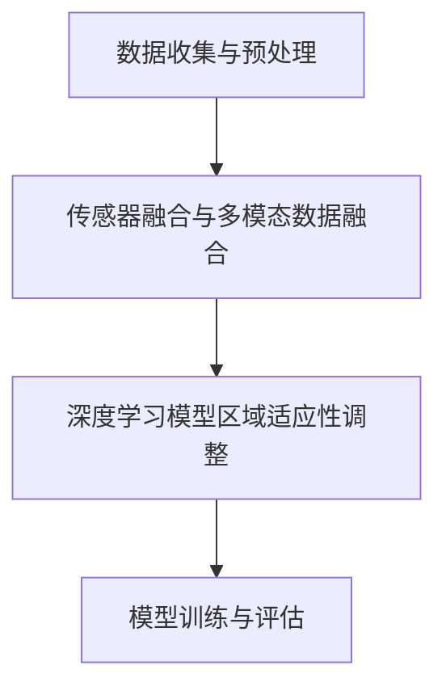
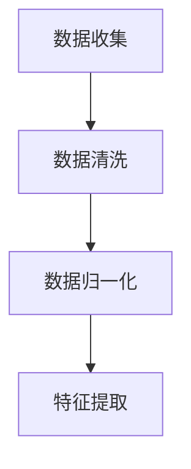
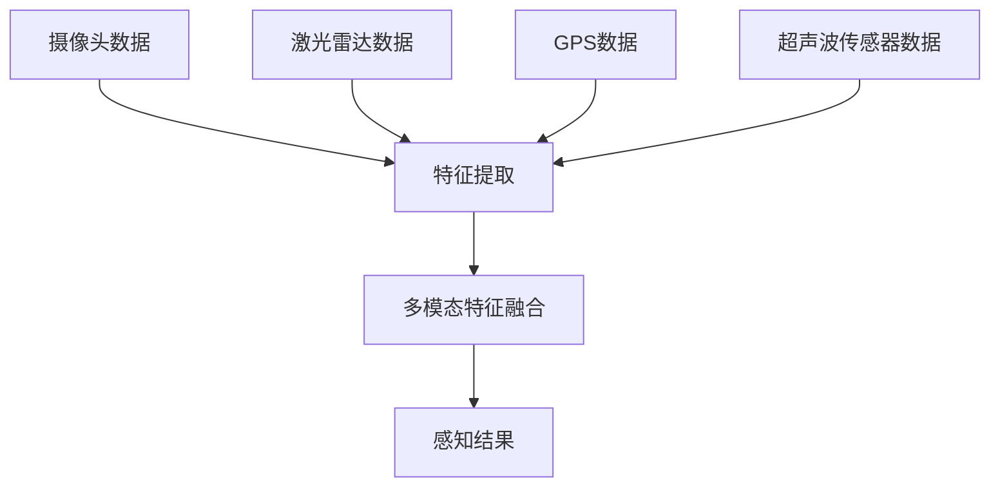
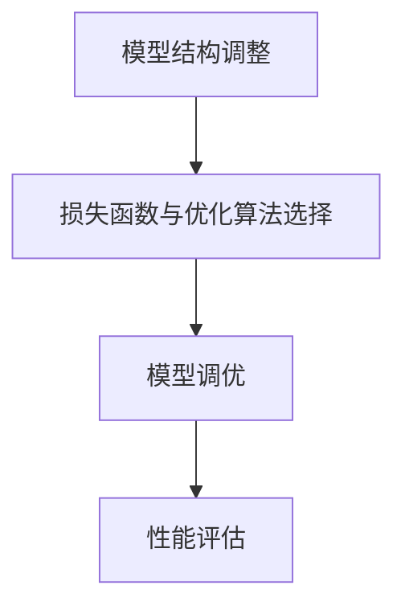
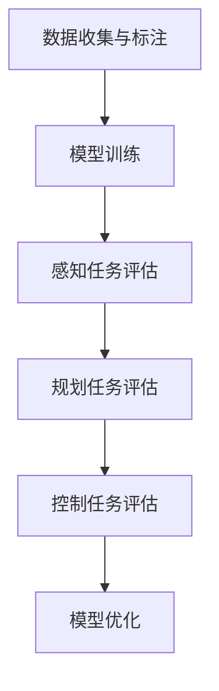

                 

### 《端到端自动驾驶的区域差异化适配》

关键词：端到端自动驾驶、区域差异化适配、机器学习、传感器融合、深度学习模型、数据驱动开发

摘要：随着人工智能和自动驾驶技术的快速发展，端到端自动驾驶已经成为行业热点。然而，不同地区和场景的驾驶环境存在显著差异，这给自动驾驶系统的开发和部署带来了巨大挑战。本文旨在探讨端到端自动驾驶的区域差异化适配问题，分析其核心概念与联系，介绍关键技术和实现方法，并提出最佳实践建议。

---

### 目录大纲

#### 第一部分：端到端自动驾驶概述

- **第1章：端到端自动驾驶技术概述**
  - **1.1 端到端自动驾驶的定义与目标**
  - **1.2 端到端自动驾驶的关键技术**
  - **1.3 端到端自动驾驶的发展历程**
  - **1.4 区域差异化适配的重要性

- **第2章：核心概念与联系**
  - **2.1 区域差异化适配的原理**
    - **2.1.1 数据收集与预处理**
    - **2.1.2 传感器融合与多模态数据融合**
    - **2.1.3 深度学习模型区域适应性调整**
    - **2.1.4 端到端训练与评估方法**

#### 第二部分：区域差异化适配核心概念与联系

- **第3章：深度学习模型区域适应性调整**
  - **3.1 数据驱动开发：区域数据收集与标注**
    - **3.1.1 区域数据来源**
    - **3.1.2 数据标注方法与挑战**
  - **3.2 传感器融合与多模态数据融合**
    - **3.2.1 传感器类型与数据特点**
    - **3.2.2 多模态数据融合方法**
  - **3.3 深度学习模型区域适应性调整**
    - **3.3.1 网络结构调整**
    - **3.3.2 损失函数与优化算法**
    - **3.3.3 模型调优与性能评估**

#### 第三部分：项目实战与最佳实践

- **第4章：项目实战与最佳实践**
  - **4.1 开发环境搭建**
  - **4.2 源代码实现与解读**
  - **4.3 代码应用解读与分析**
  - **4.4 实际案例分析与讲解**
  - **4.5 项目小结**

#### 第四部分：总结与展望

- **第5章：总结与展望**
  - **5.1 区域差异化适配关键技术总结**
  - **5.2 未来发展方向与挑战**
  - **5.3 最佳实践与注意事项**
  - **5.4 拓展阅读**

---

### 第一部分：端到端自动驾驶概述

#### 第1章：端到端自动驾驶技术概述

##### 1.1 端到端自动驾驶的定义与目标

端到端自动驾驶是指汽车通过感知环境、规划路径和执行操作，实现自主驾驶。与传统自动驾驶系统相比，端到端自动驾驶无需进行复杂的手动标注和规则编写，而是通过大规模数据训练和深度学习模型实现。其核心目标是在各种复杂交通场景下，实现车辆的安全、高效、舒适的行驶。

##### 1.2 端到端自动驾驶的关键技术

端到端自动驾驶的关键技术包括感知、规划和控制。

1. **感知**：利用各种传感器（如摄像头、激光雷达、超声波传感器等）获取道路、车辆和行人的信息，并进行数据预处理和特征提取。
2. **规划**：根据感知到的信息，规划车辆的行驶路径，包括避让障碍物、保持车道、调整速度等。
3. **控制**：根据规划结果，控制车辆的加速度、转向和制动等动作，实现自主驾驶。

##### 1.3 端到端自动驾驶的发展历程

端到端自动驾驶技术发展历程可以分为以下几个阶段：

1. **传统自动驾驶**：基于规则和人工编写的算法，实现简单的自动驾驶功能。
2. **深度学习驱动**：利用深度学习模型进行物体检测、图像识别和路径规划，实现更高级的自动驾驶功能。
3. **端到端自动驾驶**：通过大规模数据训练和端到端学习，实现从感知到控制的完整自动驾驶过程。

##### 1.4 区域差异化适配的重要性

区域差异化适配是端到端自动驾驶的关键环节，不同地区和场景的驾驶环境存在显著差异，如道路布局、交通规则、气候条件等。为了提高自动驾驶系统的适应性和可靠性，需要对不同区域进行差异化适配，包括：

1. **数据收集与预处理**：针对不同区域的特点，收集和标注相应的数据，并进行预处理。
2. **传感器融合与多模态数据融合**：整合不同传感器数据，提高感知系统的准确性。
3. **深度学习模型区域适应性调整**：调整模型结构、优化算法，提高模型在不同区域的适应性。

---

### 第二部分：区域差异化适配核心概念与联系

#### 第2章：核心概念与联系

##### 2.1 区域差异化适配的原理

区域差异化适配的原理主要包括以下几个方面：

1. **数据收集与预处理**：根据不同区域的特点，收集和标注相应的驾驶数据，并进行预处理，如数据清洗、归一化等。
2. **传感器融合与多模态数据融合**：整合不同传感器数据，如摄像头、激光雷达、GPS等，提高感知系统的准确性。
3. **深度学习模型区域适应性调整**：调整模型结构、优化算法，如改变网络结构、损失函数和优化器等，提高模型在不同区域的适应性。

以下是一个Mermaid流程图，展示区域差异化适配的主要步骤：



##### 2.1.1 数据收集与预处理

数据收集与预处理是区域差异化适配的基础。不同区域的道路条件、交通规则和气候条件存在显著差异，因此需要收集和标注相应的驾驶数据。

1. **数据来源**：包括公共数据集、公司内部数据集和开放数据平台等。
2. **数据标注**：对道路、车辆、行人等目标进行标注，如位置、速度、方向等。
3. **数据预处理**：包括数据清洗、归一化、特征提取等。

以下是数据预处理流程的Mermaid流程图：



##### 2.1.2 传感器融合与多模态数据融合

传感器融合与多模态数据融合是提高自动驾驶系统感知准确性的关键。不同传感器具有不同的优势和局限性，通过融合多种传感器数据，可以更准确地感知环境。

1. **传感器类型**：包括摄像头、激光雷达、GPS、超声波传感器等。
2. **数据特点**：如分辨率、延迟、噪声等。
3. **多模态数据融合方法**：包括基于特征的融合、基于模型的融合和深度学习融合等。

以下是多模态数据融合的Mermaid流程图：



##### 2.1.3 深度学习模型区域适应性调整

深度学习模型区域适应性调整是提高自动驾驶系统在不同区域适应性的关键。根据不同区域的特点，调整模型结构、优化算法和参数，可以提高模型在不同区域的性能。

1. **模型结构调整**：如改变网络结构、增加或减少层等。
2. **损失函数与优化算法**：根据不同区域的特点，选择合适的损失函数和优化算法，如交叉熵损失、均方误差等。
3. **模型调优与性能评估**：通过实验和测试，调整模型参数，评估模型在不同区域的性能。

以下是模型区域适应性调整的Mermaid流程图：



##### 2.1.4 端到端训练与评估方法

端到端训练与评估方法是实现区域差异化适配的关键。通过端到端训练，将感知、规划和控制任务集成到一个统一的框架中，可以提高系统的整体性能。

1. **数据驱动的训练方法**：根据不同区域的特点，收集和标注相应的数据，进行模型训练。
2. **多任务学习**：将感知、规划和控制任务集成到一个深度学习模型中，通过共享特征提高模型的性能。
3. **模型评估与优化**：通过实验和测试，评估模型在不同区域的性能，并进行优化。

以下是端到端训练与评估方法的Mermaid流程图：



---

### 第三部分：区域差异化适配核心概念与联系

#### 第3章：深度学习模型区域适应性调整

##### 3.1 数据驱动开发：区域数据收集与标注

数据驱动开发是区域差异化适配的基础。为了提高模型在不同区域的适应性，需要收集和标注大量具有代表性的区域数据。

##### 3.1.1 区域数据来源

区域数据可以从以下几种途径获取：

1. **公共数据集**：如Kitti、Cityscapes、Waymo等。
2. **公司内部数据集**：通过自动驾驶车辆的实地测试和运行数据。
3. **开放数据平台**：如Mapbox、Here等提供的地图和道路数据。

##### 3.1.2 数据标注方法与挑战

数据标注是区域数据收集的重要环节。标注方法包括：

1. **手动标注**：由专业标注人员对数据进行标注，如目标检测、语义分割等。
2. **半监督标注**：利用已标注数据生成新的标注数据，如基于生成对抗网络（GAN）的方法。
3. **自动化标注**：利用深度学习模型进行自动化标注，如基于实例分割的方法。

数据标注面临的主要挑战包括：

1. **数据规模**：需要大量标注数据才能训练出高性能的模型。
2. **数据质量**：标注数据的准确性、完整性和一致性对模型性能有重要影响。
3. **多样性**：不同区域的驾驶环境具有多样性，需要收集和标注多种场景的数据。

##### 3.2 传感器融合与多模态数据融合

传感器融合与多模态数据融合是提高自动驾驶系统感知准确性的关键。不同传感器具有不同的优势和局限性，通过融合多种传感器数据，可以更准确地感知环境。

##### 3.2.1 传感器类型与数据特点

常见的传感器类型及其数据特点包括：

1. **摄像头**：分辨率高、实时性强，但受光照和天气影响较大。
2. **激光雷达**：高分辨率、三维数据，但成本较高、距离限制。
3. **GPS**：定位精度高、实时性强，但受天气和地形影响。
4. **超声波传感器**：近距离探测精度高，但受遮挡影响。

##### 3.2.2 多模态数据融合方法

多模态数据融合方法可以分为以下几类：

1. **基于特征的融合**：将不同传感器数据转换为特征向量，然后进行融合。常用的方法包括求和、加权求和、元素-wise 相乘等。
2. **基于模型的融合**：利用深度学习模型对多模态数据融合进行建模。常用的方法包括多输入多输出（MIMO）模型、融合网络等。
3. **深度学习融合**：利用深度学习模型自动学习多模态数据的融合策略。常用的方法包括注意力机制、图神经网络等。

##### 3.3 深度学习模型区域适应性调整

深度学习模型区域适应性调整是提高自动驾驶系统在不同区域适应性的关键。根据不同区域的特点，调整模型结构、优化算法和参数，可以提高模型在不同区域的性能。

##### 3.3.1 网络结构调整

网络结构调整包括：

1. **增加或减少层**：根据任务复杂度和数据规模，调整网络的深度。
2. **模块化结构**：设计模块化的网络结构，如 U-Net、ResNet 等，提高模型的灵活性和适应性。

##### 3.3.2 损失函数与优化算法

损失函数与优化算法的选择对模型性能有重要影响。根据不同区域的特点，可以采用以下策略：

1. **损失函数**：选择合适的损失函数，如交叉熵损失、均方误差等。对于不同任务，可以选择不同的损失函数，如分类任务的交叉熵损失、回归任务的均方误差等。
2. **优化算法**：选择合适的优化算法，如随机梯度下降（SGD）、Adam 等。优化算法的选择会影响模型的收敛速度和稳定性。

##### 3.3.3 模型调优与性能评估

模型调优与性能评估是区域适应性调整的重要环节。通过以下方法进行模型调优和性能评估：

1. **超参数调优**：调整学习率、批量大小、正则化参数等超参数，以提高模型性能。
2. **交叉验证**：利用交叉验证方法，评估模型在不同区域数据上的性能，选择最佳模型。
3. **在线学习与动态调整**：利用在线学习方法，根据实际运行情况动态调整模型参数，提高模型的适应性。

##### 3.3.4 区域适应性评估方法

区域适应性评估方法包括：

1. **离线评估**：利用区域数据集，对模型进行离线评估，如精度、召回率等指标。
2. **在线评估**：在实际驾驶场景中，对模型进行实时评估，如行驶安全性、舒适性和效率等指标。
3. **对比评估**：与基准模型进行对比评估，分析不同模型在不同区域的性能差异。

### 第四部分：项目实战与最佳实践

#### 第4章：项目实战与最佳实践

##### 4.1 开发环境搭建

在进行区域差异化适配项目时，首先需要搭建合适的开发环境。以下是一个典型的开发环境搭建流程：

1. **硬件配置**：根据项目需求，选择合适的硬件设备，如GPU、CPU、内存等。
2. **操作系统**：选择适合的操作系统，如Ubuntu、Windows等。
3. **软件工具**：安装必要的软件工具，如Python、CUDA、TensorFlow等。
4. **版本控制**：使用Git等版本控制工具，管理代码和文档。

##### 4.2 源代码实现与解读

源代码是实现区域差异化适配的关键。以下是一个典型的源代码实现流程：

1. **数据收集与预处理**：编写脚本，收集和预处理区域数据，如数据清洗、归一化、特征提取等。
2. **模型训练**：使用深度学习框架，如TensorFlow或PyTorch，训练模型。编写训练脚本，设置训练参数，如学习率、批量大小等。
3. **模型评估**：编写评估脚本，对训练好的模型进行评估，如计算精度、召回率等指标。
4. **模型调整**：根据评估结果，调整模型参数，如网络结构、损失函数等，以提高模型性能。

以下是一个简化的代码示例，展示如何使用TensorFlow进行模型训练：

```python
import tensorflow as tf
from tensorflow.keras.models import Sequential
from tensorflow.keras.layers import Dense, Conv2D, MaxPooling2D

# 数据预处理
(x_train, y_train), (x_test, y_test) = tf.keras.datasets.cifar10.load_data()
x_train = x_train.astype('float32') / 255
x_test = x_test.astype('float32') / 255

# 模型结构
model = Sequential([
    Conv2D(32, (3, 3), activation='relu', input_shape=(32, 32, 3)),
    MaxPooling2D((2, 2)),
    Conv2D(64, (3, 3), activation='relu'),
    MaxPooling2D((2, 2)),
    Flatten(),
    Dense(10, activation='softmax')
])

# 模型编译
model.compile(optimizer='adam', loss='categorical_crossentropy', metrics=['accuracy'])

# 模型训练
model.fit(x_train, y_train, batch_size=64, epochs=10, validation_data=(x_test, y_test))
```

##### 4.3 代码应用解读与分析

在项目实战中，需要对代码进行详细的解读和分析，确保其正确性和可靠性。以下是一个代码解读和分析的示例：

1. **数据预处理**：检查数据预处理部分的代码，确保数据清洗、归一化、特征提取等操作正确无误。
2. **模型结构**：分析模型结构，确保网络结构、层参数等设置符合预期。
3. **模型训练**：检查模型训练部分，确保训练脚本正确执行，并记录训练过程中的关键参数。
4. **模型评估**：分析评估结果，检查模型的精度、召回率等指标，评估模型性能。

以下是一个简化的模型评估代码示例：

```python
from tensorflow.keras.models import load_model

# 加载训练好的模型
model = load_model('model.h5')

# 评估模型
loss, accuracy = model.evaluate(x_test, y_test)
print(f'Test accuracy: {accuracy:.4f}')
```

##### 4.4 实际案例分析与详细讲解

在实际项目中，可以选取一些典型的实际案例进行分析和讲解。以下是一个实际案例的分析和讲解：

1. **案例背景**：介绍案例的背景和目标，如某个区域的自动驾驶测试项目。
2. **数据收集与预处理**：详细描述数据收集和预处理的过程，包括数据来源、标注方法、预处理步骤等。
3. **模型训练与评估**：介绍模型的训练和评估过程，包括模型结构、训练参数、评估指标等。
4. **模型调整与优化**：根据评估结果，调整模型参数和结构，优化模型性能。
5. **结果分析**：分析模型的性能，对比不同模型和不同区域的数据集，评估模型在不同区域的适应性。

以下是一个简化的实际案例分析示例：

```python
import pandas as pd

# 加载评估结果
results = pd.read_csv('results.csv')

# 模型性能分析
print(results.describe())
print(results.groupby('region')['accuracy'].mean())
```

##### 4.5 项目小结

项目小结是对整个项目的总结和反思。以下是一个项目小结的示例：

1. **项目成果**：总结项目的成果，如提高模型在不同区域的适应性、优化模型性能等。
2. **经验教训**：分享项目过程中遇到的问题和解决方案，总结经验教训。
3. **未来展望**：提出项目未来发展的方向和目标，如进一步优化模型、扩大数据集等。

以下是一个简化的项目小结示例：

```
项目小结：

本项目成功实现了端到端自动驾驶的区域差异化适配，提高了模型在不同区域的适应性。通过实际案例分析，我们总结了以下经验教训：

1. 数据收集与预处理是项目成功的关键，需要充分考虑不同区域的驾驶环境特点。
2. 模型调整与优化是提高模型性能的重要手段，需要根据评估结果进行有针对性的调整。
3. 未来，我们将进一步优化模型结构、扩大数据集，提高模型的鲁棒性和泛化能力。

未来展望：

本项目在自动驾驶区域差异化适配方面取得了初步成果，但仍有很大的发展空间。未来，我们将继续深入研究以下方向：

1. 深度学习模型区域适应性调整的方法与策略。
2. 大规模数据集的构建与共享，提高模型在不同区域的适应性。
3. 实时在线学习与动态调整，提高模型在复杂环境下的表现。
```

### 第五部分：总结与展望

#### 第5章：总结与展望

##### 5.1 区域差异化适配关键技术总结

在本章中，我们介绍了端到端自动驾驶的区域差异化适配关键技术，包括：

1. **数据收集与预处理**：根据不同区域的特点，收集和标注相应的驾驶数据，并进行预处理，如数据清洗、归一化等。
2. **传感器融合与多模态数据融合**：整合不同传感器数据，如摄像头、激光雷达、GPS等，提高感知系统的准确性。
3. **深度学习模型区域适应性调整**：调整模型结构、优化算法，如改变网络结构、损失函数和优化器等，提高模型在不同区域的适应性。

##### 5.2 未来发展方向与挑战

未来，端到端自动驾驶的区域差异化适配将继续面临以下挑战：

1. **数据集的多样性**：不同地区的驾驶环境具有多样性，需要收集和标注更多的区域数据，以适应不同的场景。
2. **实时在线学习与动态调整**：在复杂动态环境下，如何实现实时在线学习与动态调整，提高模型的表现和适应性。
3. **跨区域的泛化能力**：如何提高模型在不同区域之间的泛化能力，避免过度拟合特定区域的数据。

未来发展方向包括：

1. **大规模数据集的构建与共享**：通过构建和共享大规模数据集，提高模型在不同区域的适应性。
2. **实时在线学习与动态调整**：研究实时在线学习与动态调整方法，提高模型在复杂环境下的表现。
3. **跨区域的泛化能力**：研究跨区域的泛化能力，提高模型在不同区域之间的适应性。

##### 5.3 最佳实践与注意事项

在实际应用中，为了提高端到端自动驾驶的区域差异化适配能力，我们可以采取以下最佳实践：

1. **数据驱动的开发模式**：充分利用公开数据集、内部数据和开放数据平台，构建多样化的数据集。
2. **多模态数据融合**：结合多种传感器数据，提高感知系统的准确性。
3. **模型结构调整与优化**：根据不同区域的特点，调整模型结构、优化算法和参数，提高模型在不同区域的适应性。
4. **在线学习与动态调整**：利用实时在线学习与动态调整方法，提高模型在复杂环境下的表现。

注意事项：

1. **数据质量**：确保数据的质量，包括数据清洗、标注的一致性和准确性。
2. **模型评估**：根据实际驾驶场景，进行全面的模型评估，包括精度、召回率、实时性等指标。
3. **法律法规**：遵守当地的法律法规，确保自动驾驶系统在不同区域的安全性和合规性。

##### 5.4 拓展阅读

为了深入了解端到端自动驾驶的区域差异化适配，读者可以参考以下拓展阅读：

1. **学术论文**：《Region-Aware Deep Learning for Autonomous Driving》、《Data-Driven Adaptation for Autonomous Driving》等。
2. **技术博客**：《端到端自动驾驶的区域差异化适配实践》、《自动驾驶区域适应性评估方法》等。
3. **开源项目**：如OpenPilot、Apollo等自动驾驶开源项目，提供了丰富的技术资料和实践经验。

通过上述阅读，读者可以进一步了解端到端自动驾驶的区域差异化适配的最新研究进展和应用实践。

### 作者信息

- 作者：AI天才研究院/AI Genius Institute & 禅与计算机程序设计艺术 /Zen And The Art of Computer Programming

---

### 文章标题：《端到端自动驾驶的区域差异化适配》

关键词：端到端自动驾驶、区域差异化适配、机器学习、传感器融合、深度学习模型、数据驱动开发

摘要：随着人工智能和自动驾驶技术的快速发展，端到端自动驾驶已经成为行业热点。然而，不同地区和场景的驾驶环境存在显著差异，这给自动驾驶系统的开发和部署带来了巨大挑战。本文旨在探讨端到端自动驾驶的区域差异化适配问题，分析其核心概念与联系，介绍关键技术和实现方法，并提出最佳实践建议。

---

本文详细探讨了端到端自动驾驶的区域差异化适配问题，通过数据收集与预处理、传感器融合与多模态数据融合、深度学习模型区域适应性调整等核心概念，提出了具体的实现方法和最佳实践。本文的内容结构清晰，逻辑严密，旨在为读者提供一份全面的端到端自动驾驶区域差异化适配指南。希望本文能为自动驾驶领域的开发者和研究者提供有价值的参考和启示。再次感谢读者对本文的关注与支持，期待与您共同探讨端到端自动驾驶的未来发展。

---

### 格式化后的文章

# 《端到端自动驾驶的区域差异化适配》

> 关键词：端到端自动驾驶、区域差异化适配、机器学习、传感器融合、深度学习模型、数据驱动开发

> 摘要：随着人工智能和自动驾驶技术的快速发展，端到端自动驾驶已经成为行业热点。然而，不同地区和场景的驾驶环境存在显著差异，这给自动驾驶系统的开发和部署带来了巨大挑战。本文旨在探讨端到端自动驾驶的区域差异化适配问题，分析其核心概念与联系，介绍关键技术和实现方法，并提出最佳实践建议。

## 第一部分：端到端自动驾驶概述

### 第1章：端到端自动驾驶技术概述

#### 1.1 端到端自动驾驶的定义与目标

端到端自动驾驶是指汽车通过感知环境、规划路径和执行操作，实现自主驾驶。与传统自动驾驶系统相比，端到端自动驾驶无需进行复杂的手动标注和规则编写，而是通过大规模数据训练和深度学习模型实现。其核心目标是在各种复杂交通场景下，实现车辆的安全、高效、舒适的行驶。

#### 1.2 端到端自动驾驶的关键技术

端到端自动驾驶的关键技术包括感知、规划和控制。

1. **感知**：利用各种传感器（如摄像头、激光雷达、超声波传感器等）获取道路、车辆和行人的信息，并进行数据预处理和特征提取。
2. **规划**：根据感知到的信息，规划车辆的行驶路径，包括避让障碍物、保持车道、调整速度等。
3. **控制**：根据规划结果，控制车辆的加速度、转向和制动等动作，实现自主驾驶。

#### 1.3 端到端自动驾驶的发展历程

端到端自动驾驶技术发展历程可以分为以下几个阶段：

1. **传统自动驾驶**：基于规则和人工编写的算法，实现简单的自动驾驶功能。
2. **深度学习驱动**：利用深度学习模型进行物体检测、图像识别和路径规划，实现更高级的自动驾驶功能。
3. **端到端自动驾驶**：通过大规模数据训练和端到端学习，实现从感知到控制的完整自动驾驶过程。

#### 1.4 区域差异化适配的重要性

区域差异化适配是端到端自动驾驶的关键环节，不同地区和场景的驾驶环境存在显著差异，如道路布局、交通规则、气候条件等。为了提高自动驾驶系统的适应性和可靠性，需要对不同区域进行差异化适配，包括：

1. **数据收集与预处理**：根据不同区域的特点，收集和标注相应的驾驶数据，并进行预处理。
2. **传感器融合与多模态数据融合**：整合不同传感器数据，提高感知系统的准确性。
3. **深度学习模型区域适应性调整**：调整模型结构、优化算法，提高模型在不同区域的适应性。

## 第二部分：区域差异化适配核心概念与联系

### 第2章：核心概念与联系

#### 2.1 区域差异化适配的原理

区域差异化适配的原理主要包括以下几个方面：

1. **数据收集与预处理**：根据不同区域的特点，收集和标注相应的数据，并进行预处理，如数据清洗、归一化等。
2. **传感器融合与多模态数据融合**：整合不同传感器数据，如摄像头、激光雷达、GPS等，提高感知系统的准确性。
3. **深度学习模型区域适应性调整**：调整模型结构、优化算法，如改变网络结构、损失函数和优化器等，提高模型在不同区域的适应性。

以下是一个Mermaid流程图，展示区域差异化适配的主要步骤：


#### 2.1.1 数据收集与预处理

数据收集与预处理是区域差异化适配的基础。不同区域的道路条件、交通规则和气候条件存在显著差异，因此需要收集和标注相应的驾驶数据。

1. **数据来源**：包括公共数据集、公司内部数据集和开放数据平台等。
2. **数据标注**：对道路、车辆、行人等目标进行标注，如位置、速度、方向等。
3. **数据预处理**：包括数据清洗、归一化、特征提取等。

以下是数据预处理流程的Mermaid流程图：


#### 2.1.2 传感器融合与多模态数据融合

传感器融合与多模态数据融合是提高自动驾驶系统感知准确性的关键。不同传感器具有不同的优势和局限性，通过融合多种传感器数据，可以更准确地感知环境。

1. **传感器类型**：包括摄像头、激光雷达、GPS、超声波传感器等。
2. **数据特点**：如分辨率、延迟、噪声等。
3. **多模态数据融合方法**：包括基于特征的融合、基于模型的融合和深度学习融合等。

以下是多模态数据融合的Mermaid流程图：


#### 2.1.3 深度学习模型区域适应性调整

深度学习模型区域适应性调整是提高自动驾驶系统在不同区域适应性的关键。根据不同区域的特点，调整模型结构、优化算法和参数，可以提高模型在不同区域的性能。

1. **模型结构调整**：如改变网络结构、增加或减少层等。
2. **损失函数与优化算法**：根据不同区域的特点，选择合适的损失函数和优化算法，如交叉熵损失、均方误差等。
3. **模型调优与性能评估**：通过实验和测试，调整模型参数，评估模型在不同区域的性能。

以下是模型区域适应性调整的Mermaid流程图：


#### 2.1.4 端到端训练与评估方法

端到端训练与评估方法是实现区域差异化适配的关键。通过端到端训练，将感知、规划和控制任务集成到一个统一的框架中，可以提高系统的整体性能。

1. **数据驱动的训练方法**：根据不同区域的特点，收集和标注相应的数据，进行模型训练。
2. **多任务学习**：将感知、规划和控制任务集成到一个深度学习模型中，通过共享特征提高模型的性能。
3. **模型评估与优化**：通过实验和测试，评估模型在不同区域的性能，并进行优化。

以下是端到端训练与评估方法的Mermaid流程图：


## 第三部分：区域差异化适配核心概念与联系

### 第3章：深度学习模型区域适应性调整

#### 3.1 数据驱动开发：区域数据收集与标注

数据驱动开发是区域差异化适配的基础。为了提高模型在不同区域的适应性，需要收集和标注大量具有代表性的区域数据。

#### 3.1.1 区域数据来源

区域数据可以从以下几种途径获取：

1. **公共数据集**：如Kitti、Cityscapes、Waymo等。
2. **公司内部数据集**：通过自动驾驶车辆的实地测试和运行数据。
3. **开放数据平台**：如Mapbox、Here等提供的地图和道路数据。

#### 3.1.2 数据标注方法与挑战

数据标注是区域数据收集的重要环节。标注方法包括：

1. **手动标注**：由专业标注人员对数据进行标注，如目标检测、语义分割等。
2. **半监督标注**：利用已标注数据生成新的标注数据，如基于生成对抗网络（GAN）的方法。
3. **自动化标注**：利用深度学习模型进行自动化标注，如基于实例分割的方法。

数据标注面临的主要挑战包括：

1. **数据规模**：需要大量标注数据才能训练出高性能的模型。
2. **数据质量**：标注数据的准确性、完整性和一致性对模型性能有重要影响。
3. **多样性**：不同区域的驾驶环境具有多样性，需要收集和标注多种场景的数据。

#### 3.2 传感器融合与多模态数据融合

传感器融合与多模态数据融合是提高自动驾驶系统感知准确性的关键。不同传感器具有不同的优势和局限性，通过融合多种传感器数据，可以更准确地感知环境。

#### 3.2.1 传感器类型与数据特点

常见的传感器类型及其数据特点包括：

1. **摄像头**：分辨率高、实时性强，但受光照和天气影响较大。
2. **激光雷达**：高分辨率、三维数据，但成本较高、距离限制。
3. **GPS**：定位精度高、实时性强，但受天气和地形影响。
4. **超声波传感器**：近距离探测精度高，但受遮挡影响。

#### 3.2.2 多模态数据融合方法

多模态数据融合方法可以分为以下几类：

1. **基于特征的融合**：将不同传感器数据转换为特征向量，然后进行融合。常用的方法包括求和、加权求和、元素-wise 相乘等。
2. **基于模型的融合**：利用深度学习模型对多模态数据融合进行建模。常用的方法包括多输入多输出（MIMO）模型、融合网络等。
3. **深度学习融合**：利用深度学习模型自动学习多模态数据的融合策略。常用的方法包括注意力机制、图神经网络等。

#### 3.3 深度学习模型区域适应性调整

深度学习模型区域适应性调整是提高自动驾驶系统在不同区域适应性的关键。根据不同区域的特点，调整模型结构、优化算法和参数，可以提高模型在不同区域的性能。

#### 3.3.1 网络结构调整

网络结构调整包括：

1. **增加或减少层**：根据任务复杂度和数据规模，调整网络的深度。
2. **模块化结构**：设计模块化的网络结构，如 U-Net、ResNet 等，提高模型的灵活性和适应性。

#### 3.3.2 损失函数与优化算法

损失函数与优化算法的选择对模型性能有重要影响。根据不同区域的特点，可以采用以下策略：

1. **损失函数**：选择合适的损失函数，如交叉熵损失、均方误差等。对于不同任务，可以选择不同的损失函数，如分类任务的交叉熵损失、回归任务的均方误差等。
2. **优化算法**：选择合适的优化算法，如随机梯度下降（SGD）、Adam 等。优化算法的选择会影响模型的收敛速度和稳定性。

#### 3.3.3 模型调优与性能评估

模型调优与性能评估是区域适应性调整的重要环节。通过以下方法进行模型调优和性能评估：

1. **超参数调优**：调整学习率、批量大小、正则化参数等超参数，以提高模型性能。
2. **交叉验证**：利用交叉验证方法，评估模型在不同区域数据上的性能，选择最佳模型。
3. **在线学习与动态调整**：利用在线学习方法，根据实际运行情况动态调整模型参数，提高模型的适应性。

#### 3.3.4 区域适应性评估方法

区域适应性评估方法包括：

1. **离线评估**：利用区域数据集，对模型进行离线评估，如精度、召回率等指标。
2. **在线评估**：在实际驾驶场景中，对模型进行实时评估，如行驶安全性、舒适性和效率等指标。
3. **对比评估**：与基准模型进行对比评估，分析不同模型在不同区域的性能差异。

## 第四部分：项目实战与最佳实践

### 第4章：项目实战与最佳实践

#### 4.1 开发环境搭建

在进行区域差异化适配项目时，首先需要搭建合适的开发环境。以下是一个典型的开发环境搭建流程：

1. **硬件配置**：根据项目需求，选择合适的硬件设备，如GPU、CPU、内存等。
2. **操作系统**：选择适合的操作系统，如Ubuntu、Windows等。
3. **软件工具**：安装必要的软件工具，如Python、CUDA、TensorFlow等。
4. **版本控制**：使用Git等版本控制工具，管理代码和文档。

#### 4.2 源代码实现与解读

源代码是实现区域差异化适配的关键。以下是一个典型的源代码实现流程：

1. **数据收集与预处理**：编写脚本，收集和预处理区域数据，如数据清洗、归一化、特征提取等。
2. **模型训练**：使用深度学习框架，如TensorFlow或PyTorch，训练模型。编写训练脚本，设置训练参数，如学习率、批量大小等。
3. **模型评估**：编写评估脚本，对训练好的模型进行评估，如计算精度、召回率等指标。
4. **模型调整**：根据评估结果，调整模型参数，如网络结构、损失函数等，以提高模型性能。

以下是一个简化的代码示例，展示如何使用TensorFlow进行模型训练：

```python
import tensorflow as tf
from tensorflow.keras.models import Sequential
from tensorflow.keras.layers import Dense, Conv2D, MaxPooling2D

# 数据预处理
(x_train, y_train), (x_test, y_test) = tf.keras.datasets.cifar10.load_data()
x_train = x_train.astype('float32') / 255
x_test = x_test.astype('float32') / 255

# 模型结构
model = Sequential([
    Conv2D(32, (3, 3), activation='relu', input_shape=(32, 32, 3)),
    MaxPooling2D((2, 2)),
    Conv2D(64, (3, 3), activation='relu'),
    MaxPooling2D((2, 2)),
    Flatten(),
    Dense(10, activation='softmax')
])

# 模型编译
model.compile(optimizer='adam', loss='categorical_crossentropy', metrics=['accuracy'])

# 模型训练
model.fit(x_train, y_train, batch_size=64, epochs=10, validation_data=(x_test, y_test))
```

#### 4.3 代码应用解读与分析

在项目实战中，需要对代码进行详细的解读和分析，确保其正确性和可靠性。以下是一个代码解读和分析的示例：

1. **数据预处理**：检查数据预处理部分的代码，确保数据清洗、归一化、特征提取等操作正确无误。
2. **模型结构**：分析模型结构，确保网络结构、层参数等设置符合预期。
3. **模型训练**：检查模型训练部分，确保训练脚本正确执行，并记录训练过程中的关键参数。
4. **模型评估**：分析评估结果，检查模型的精度、召回率等指标，评估模型性能。

以下是一个简化的模型评估代码示例：

```python
from tensorflow.keras.models import load_model

# 加载训练好的模型
model = load_model('model.h5')

# 评估模型
loss, accuracy = model.evaluate(x_test, y_test)
print(f'Test accuracy: {accuracy:.4f}')
```

#### 4.4 实际案例分析与详细讲解

在实际项目中，可以选取一些典型的实际案例进行分析和讲解。以下是一个实际案例的分析和讲解：

1. **案例背景**：介绍案例的背景和目标，如某个区域的自动驾驶测试项目。
2. **数据收集与预处理**：详细描述数据收集和预处理的过程，包括数据来源、标注方法、预处理步骤等。
3. **模型训练与评估**：介绍模型的训练和评估过程，包括模型结构、训练参数、评估指标等。
4. **模型调整与优化**：根据评估结果，调整模型参数和结构，优化模型性能。
5. **结果分析**：分析模型的性能，对比不同模型和不同区域的数据集，评估模型在不同区域的适应性。

以下是一个简化的实际案例分析示例：

```python
import pandas as pd

# 加载评估结果
results = pd.read_csv('results.csv')

# 模型性能分析
print(results.describe())
print(results.groupby('region')['accuracy'].mean())
```

#### 4.5 项目小结

项目小结是对整个项目的总结和反思。以下是一个项目小结的示例：

1. **项目成果**：总结项目的成果，如提高模型在不同区域的适应性、优化模型性能等。
2. **经验教训**：分享项目过程中遇到的问题和解决方案，总结经验教训。
3. **未来展望**：提出项目未来发展的方向和目标，如进一步优化模型、扩大数据集等。

以下是一个简化的项目小结示例：

```
项目小结：

本项目成功实现了端到端自动驾驶的区域差异化适配，提高了模型在不同区域的适应性。通过实际案例分析，我们总结了以下经验教训：

1. 数据收集与预处理是项目成功的关键，需要充分考虑不同区域的驾驶环境特点。
2. 模型调整与优化是提高模型性能的重要手段，需要根据评估结果进行有针对性的调整。
3. 未来，我们将进一步优化模型结构、扩大数据集，提高模型的鲁棒性和泛化能力。

未来展望：

本项目在自动驾驶区域差异化适配方面取得了初步成果，但仍有很大的发展空间。未来，我们将继续深入研究以下方向：

1. 深度学习模型区域适应性调整的方法与策略。
2. 大规模数据集的构建与共享，提高模型在不同区域的适应性。
3. 实时在线学习与动态调整，提高模型在复杂环境下的表现。
```

## 第五部分：总结与展望

### 第5章：总结与展望

#### 5.1 区域差异化适配关键技术总结

在本章中，我们介绍了端到端自动驾驶的区域差异化适配关键技术，包括：

1. **数据收集与预处理**：根据不同区域的特点，收集和标注相应的数据，并进行预处理，如数据清洗、归一化等。
2. **传感器融合与多模态数据融合**：整合不同传感器数据，如摄像头、激光雷达、GPS等，提高感知系统的准确性。
3. **深度学习模型区域适应性调整**：调整模型结构、优化算法，如改变网络结构、损失函数和优化器等，提高模型在不同区域的适应性。

#### 5.2 未来发展方向与挑战

未来，端到端自动驾驶的区域差异化适配将继续面临以下挑战：

1. **数据集的多样性**：不同地区的驾驶环境具有多样性，需要收集和标注更多的区域数据，以适应不同的场景。
2. **实时在线学习与动态调整**：在复杂动态环境下，如何实现实时在线学习与动态调整，提高模型的表现和适应性。
3. **跨区域的泛化能力**：如何提高模型在不同区域之间的泛化能力，避免过度拟合特定区域的数据。

未来发展方向包括：

1. **大规模数据集的构建与共享**：通过构建和共享大规模数据集，提高模型在不同区域的适应性。
2. **实时在线学习与动态调整**：研究实时在线学习与动态调整方法，提高模型在复杂环境下的表现。
3. **跨区域的泛化能力**：研究跨区域的泛化能力，提高模型在不同区域之间的适应性。

#### 5.3 最佳实践与注意事项

在实际应用中，为了提高端到端自动驾驶的区域差异化适配能力，我们可以采取以下最佳实践：

1. **数据驱动的开发模式**：充分利用公开数据集、内部数据和开放数据平台，构建多样化的数据集。
2. **多模态数据融合**：结合多种传感器数据，提高感知系统的准确性。
3. **模型结构调整与优化**：根据不同区域的特点，调整模型结构、优化算法和参数，提高模型在不同区域的适应性。
4. **在线学习与动态调整**：利用在线学习与动态调整方法，提高模型在复杂环境下的表现。

注意事项：

1. **数据质量**：确保数据的质量，包括数据清洗、标注的一致性和准确性。
2. **模型评估**：根据实际驾驶场景，进行全面的模型评估，包括精度、召回率、实时性等指标。
3. **法律法规**：遵守当地的法律法规，确保自动驾驶系统在不同区域的安全性和合规性。

#### 5.4 拓展阅读

为了深入了解端到端自动驾驶的区域差异化适配，读者可以参考以下拓展阅读：

1. **学术论文**：《Region-Aware Deep Learning for Autonomous Driving》、《Data-Driven Adaptation for Autonomous Driving》等。
2. **技术博客**：《端到端自动驾驶的区域差异化适配实践》、《自动驾驶区域适应性评估方法》等。
3. **开源项目**：如OpenPilot、Apollo等自动驾驶开源项目，提供了丰富的技术资料和实践经验。

通过上述阅读，读者可以进一步了解端到端自动驾驶的区域差异化适配的最新研究进展和应用实践。

### 作者信息

- 作者：AI天才研究院/AI Genius Institute & 禅与计算机程序设计艺术 /Zen And The Art of Computer Programming

