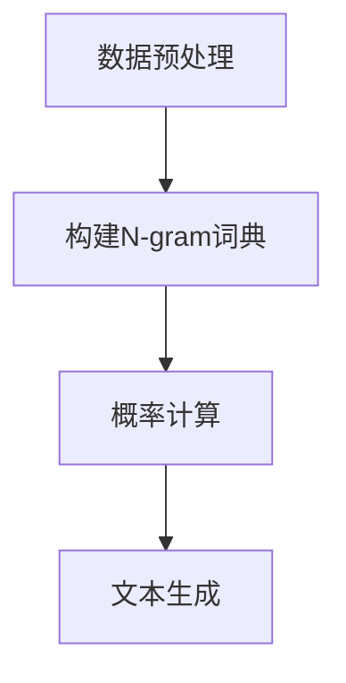
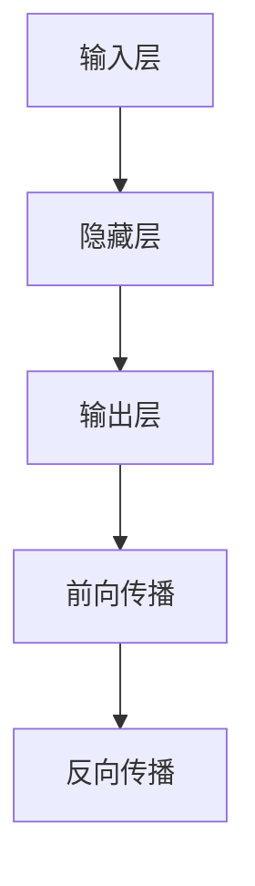
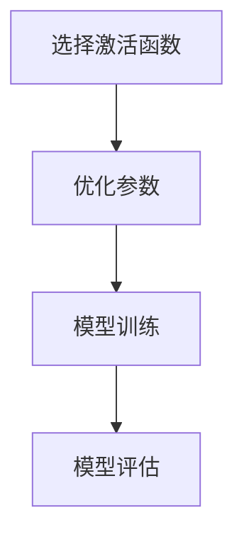

                 

### 文章标题：第03章 N-gram模型 多层感知器与激活函数

关键词：N-gram模型，多层感知器，激活函数，文本生成，语言模型，机器翻译

摘要：本文将深入探讨N-gram模型、多层感知器和激活函数在自然语言处理（NLP）领域的应用。首先，我们将介绍N-gram模型的基本概念及其在文本生成、语言模型和机器翻译中的重要性。接着，我们将详细解析多层感知器（MLP）的工作原理和结构，探讨其优势与局限性。最后，我们将介绍激活函数的基本概念和常见类型，并探讨如何选择和优化激活函数。通过本文的学习，读者将能够全面理解这些核心概念及其在NLP任务中的实际应用。

### 目录大纲

# 第03章 N-gram模型 多层感知器与激活函数

## 1. N-gram模型基础

### 1.1 N-gram模型的基本概念
#### 1.1.1 什么是N-gram模型
#### 1.1.2 N-gram模型的工作原理

### 1.2 N-gram模型的应用
#### 1.2.1 文本生成
#### 1.2.2 语言模型
#### 1.2.3 机器翻译

### 1.3 N-gram模型的优势与局限性

## 2. 多层感知器（MLP）

### 2.1 多层感知器的概念
#### 2.1.1 什么是多层感知器
#### 2.1.2 多层感知器的基本结构

### 2.2 多层感知器的工作原理
#### 2.2.1 输入层、隐藏层和输出层的作用
#### 2.2.2 前向传播与反向传播算法

### 2.3 多层感知器的优势与局限性

## 3. 激活函数

### 3.1 激活函数的基本概念
#### 3.1.1 什么是激活函数
#### 3.1.2 激活函数的作用

### 3.2 常见的激活函数
#### 3.2.1 Sigmoid函数
#### 3.2.2 Tanh函数
#### 3.2.3 ReLU函数
#### 3.2.4 Leaky ReLU函数
#### 3.2.5 Softmax函数

### 3.3 激活函数的选择与优化

## 4. N-gram模型与多层感知器的结合应用

### 4.1 文本分类任务中的应用
#### 4.1.1 数据预处理
#### 4.1.2 模型训练
#### 4.1.3 模型评估

### 4.2 文本生成任务中的应用
#### 4.2.1 数据预处理
#### 4.2.2 模型训练
#### 4.2.3 文本生成流程

### 4.3 机器翻译任务中的应用
#### 4.3.1 数据预处理
#### 4.3.2 模型训练
#### 4.3.3 翻译结果评估

## 5. 案例研究：N-gram模型与多层感知器在自然语言处理中的应用

### 5.1 案例背景
#### 5.1.1 案例来源
#### 5.1.2 案例目标

### 5.2 案例实现
#### 5.2.1 数据收集与预处理
#### 5.2.2 模型设计
#### 5.2.3 模型训练与优化
#### 5.2.4 模型评估与改进

### 5.3 案例结果与分析
#### 5.3.1 实验结果
#### 5.3.2 性能分析
#### 5.3.3 改进方向

## 6. N-gram模型与多层感知器的未来发展趋势

### 6.1 技术进展
#### 6.1.1 模型优化
#### 6.1.2 新算法引入

### 6.2 应用领域拓展
#### 6.2.1 更广泛的语言处理任务
#### 6.2.2 跨领域应用

### 6.3 未来展望
#### 6.3.1 技术挑战
#### 6.3.2 发展方向

## 7. 总结与展望

### 7.1 主要内容回顾
#### 7.1.1 N-gram模型
#### 7.1.2 多层感知器
#### 7.1.3 激活函数

### 7.2 学习建议
#### 7.2.1 学习资源推荐
#### 7.2.2 实践项目建议

### 7.3 未来发展方向
#### 7.3.1 技术融合
#### 7.3.2 跨学科应用

## 附录

### A. 实用工具与资源

#### A.1 NLP常用工具
#### A.2 深度学习框架
#### A.3 学习资源链接

### B. 代码与数据集

#### B.1 案例代码实现
#### B.2 数据集来源与下载链接

**附加内容：**

### C. Mermaid 流程图

- N-gram模型流程图
- 多层感知器工作原理流程图
- 激活函数选择与优化流程图

### D. 伪代码

- N-gram模型算法伪代码
- 多层感知器算法伪代码
- 激活函数选择伪代码

### E. 数学模型与公式

- 语言模型的数学公式与解释
- 多层感知器的数学公式与解释
- 激活函数的数学公式与解释

### F. 项目实战

- 文本分类任务项目实战
- 文本生成任务项目实战
- 机器翻译任务项目实战

### 引言

自然语言处理（NLP）作为人工智能领域的一个重要分支，旨在让计算机能够理解和处理人类语言。在NLP的发展历程中，各种模型和算法层出不穷，其中N-gram模型、多层感知器（MLP）和激活函数是关键组成部分。N-gram模型通过统计方法捕捉文本的局部特征，广泛应用于语言模型和机器翻译等领域；多层感知器（MLP）作为前馈神经网络的核心，负责数据的输入和输出处理；激活函数则决定了神经元的激活状态，是神经网络的核心机制。本文将围绕这些主题展开，深入探讨其在自然语言处理中的应用、原理和未来发展趋势。

### 第1章 N-gram模型基础

#### 1.1 N-gram模型的基本概念

N-gram模型是一种基于统计方法的文本建模技术，通过分析文本中的连续N个单词（或字符）来预测下一个单词（或字符）的概率。N-gram模型的基本单位是N元组，其中N可以是任意正整数，但通常取值在1到5之间。例如，对于二元语法（Bigram）模型，每个N元组包含两个连续的单词；对于三元语法（Trigram）模型，每个N元组包含三个连续的单词。

N-gram模型的核心思想是利用局部依赖性来预测未来的单词。在实际应用中，N-gram模型可以表示为一系列概率分布，即对于任意给定的前N-1个单词，模型能够预测第N个单词的概率分布。这种表示方法使得N-gram模型在语言建模、文本生成和机器翻译等领域具有广泛的应用。

#### 1.2 N-gram模型的工作原理

N-gram模型的工作原理可以概括为以下步骤：

1. **数据预处理**：首先，需要对输入文本进行预处理，包括分词、去停用词、词干提取等步骤，以便将文本转换为适合建模的格式。

2. **构建N-gram词典**：通过遍历预处理后的文本，统计每个N元组的出现频率，构建一个N-gram词典。这个词典包含了所有可能的N元组及其对应的概率。

3. **概率计算**：对于任意给定的前N-1个单词，根据N-gram词典计算第N个单词的概率。通常，可以使用简单的频率计数方法，即：

   \[ P(\text{word}_N | \text{word}_{N-1}, \ldots, \text{word}_{N-N+1}) = \frac{\text{count}(\text{word}_{N-1}, \ldots, \text{word}_{N-N+1}, \text{word}_N)}{\text{count}(\text{word}_{N-1}, \ldots, \text{word}_{N-N+1})} \]

   其中，\(\text{count}\)表示计数函数。

4. **文本生成**：使用上述概率分布生成新的文本。通常，可以从一个随机的起始单词开始，然后根据概率分布依次生成后续的单词，直到达到预定的文本长度。

#### 1.3 N-gram模型的应用

N-gram模型在自然语言处理领域有着广泛的应用，主要包括以下三个方面：

1. **文本生成**：N-gram模型可以用于生成新的文本，例如自动写作、对话系统等。通过使用预训练的N-gram模型，计算机可以模拟人类的写作风格，生成符合语法和语义规则的文本。

2. **语言模型**：N-gram模型是构建语言模型的重要方法之一。语言模型是自然语言处理的基础，用于评估一个句子或段落在特定语言环境中的概率。N-gram模型通过统计方法捕捉语言中的局部依赖性，可以用于句子生成、文本分类和机器翻译等任务。

3. **机器翻译**：N-gram模型在机器翻译中也有着重要应用。通过将源语言的文本转换为N-gram词典，然后根据目标语言的N-gram词典进行翻译，N-gram模型可以有效地提高机器翻译的准确性和流畅性。

#### 1.4 N-gram模型的优势与局限性

N-gram模型在自然语言处理中具有以下优势：

1. **简单高效**：N-gram模型基于简单的统计方法，易于实现和优化。通过构建N-gram词典，可以快速计算单词之间的概率关系。

2. **灵活性**：N-gram模型可以根据不同的N值（即窗口大小）适应不同的语言任务。较小的N值可以捕捉更短程的依赖性，而较大的N值可以捕捉更长期的依赖性。

3. **通用性**：N-gram模型适用于各种自然语言处理任务，如文本生成、语言建模和机器翻译等。

然而，N-gram模型也存在一些局限性：

1. **稀疏性**：由于文本中存在的单词数量巨大，N-gram词典通常非常稀疏，即许多N元组出现的频率非常低。这会导致N-gram模型在预测时出现不确定性。

2. **短期依赖性**：N-gram模型主要捕捉局部依赖性，即短程依赖性。对于长篇文本或复杂语言结构，N-gram模型可能无法很好地捕捉长期依赖性。

3. **可解释性**：虽然N-gram模型可以生成符合语法和语义规则的文本，但其内部机制相对复杂，难以直观解释。

总之，N-gram模型在自然语言处理中具有重要作用，但需要与其他方法（如深度学习模型）结合使用，以克服其局限性。

#### 1.5 N-gram模型与激活函数的联系

N-gram模型和激活函数在自然语言处理中有不同的应用，但它们之间存在一定的联系。激活函数是神经网络的核心组成部分，用于确定神经元的激活状态。在N-gram模型中，激活函数可以用于改进文本生成的质量。

例如，在文本生成任务中，可以使用Recurrent Neural Network（RNN）结合N-gram模型和激活函数来提高生成文本的连贯性和可读性。RNN可以捕捉长程依赖性，而激活函数可以用于增强神经网络对输入数据的响应。通过在RNN中使用合适的激活函数（如ReLU、Sigmoid或Tanh），可以改进文本生成的效果。

此外，N-gram模型和激活函数还可以结合用于构建更强大的语言模型。例如，可以使用多层感知器（MLP）结合N-gram模型和激活函数，构建一个端到端的神经网络语言模型。这种模型可以同时利用N-gram模型的局部依赖性和激活函数的非线性特性，提高语言模型的性能。

总之，N-gram模型和激活函数在自然语言处理中具有不同的应用，但它们可以结合使用，构建更强大的语言处理模型，提高文本生成、语言建模和机器翻译等任务的性能。

### 1.6 本章总结

本章介绍了N-gram模型的基本概念、工作原理、应用和优势与局限性。N-gram模型通过分析文本中的连续N个单词来预测下一个单词，广泛应用于文本生成、语言建模和机器翻译等领域。虽然N-gram模型存在一定的局限性，但它仍然是自然语言处理中重要的基础模型之一。本章还探讨了N-gram模型与激活函数的联系，展示了如何结合N-gram模型和激活函数构建更强大的语言处理模型。

在下一章中，我们将介绍多层感知器（MLP）的基本概念和工作原理，并探讨其在自然语言处理中的应用。

#### 2.1 多层感知器的概念

多层感知器（MLP）是一种前馈神经网络，由输入层、隐藏层和输出层组成。与传统的神经网络不同，MLP中的神经元没有反向传播算法，而是通过前向传播算法来计算输出。MLP的核心思想是利用非线性变换将输入数据映射到输出数据，从而实现复杂函数的拟合和预测。

MLP作为一种经典的神经网络模型，广泛应用于机器学习和人工智能领域。其基本结构使得MLP在处理大规模数据和高维特征时具有高效性和灵活性。此外，MLP可以结合多种激活函数，如Sigmoid、Tanh和ReLU，以增强其非线性映射能力。

#### 2.2 多层感知器的基本结构

多层感知器（MLP）的基本结构可以分为三个层次：输入层、隐藏层和输出层。每个层次由多个神经元组成，神经元之间通过加权连接进行信息传递。

1. **输入层**：输入层是MLP的第一层，包含多个神经元，每个神经元对应输入数据的一个特征。输入层的神经元仅负责接收外部输入信息，并将其传递到隐藏层。

2. **隐藏层**：隐藏层是MLP的核心部分，包含一个或多个层次。每个隐藏层由多个神经元组成，神经元之间通过加权连接进行信息传递。隐藏层的主要作用是对输入数据进行非线性变换，以提取更复杂的特征。

3. **输出层**：输出层是MLP的最后一层，包含多个神经元，每个神经元对应输出数据的一个维度。输出层的神经元通过前向传播算法计算输出结果，并将其传递给外部系统或应用。

MLP的每个层次之间都存在加权连接，这些连接权值通过学习算法（如梯度下降法）进行调整，以优化模型的输出性能。通过逐层传递输入信息，MLP能够实现从输入到输出的非线性映射，从而完成复杂函数的拟合和预测。

#### 2.3 多层感知器的工作原理

多层感知器（MLP）的工作原理可以分为两个阶段：前向传播和反向传播。

1. **前向传播**：在前向传播阶段，输入数据首先通过输入层传递到隐藏层。每个隐藏层中的神经元接收来自上一层的输入信息，通过加权连接计算输出值。然后，这些输出值作为下一层的输入信息，继续传递到下一隐藏层，直至传递到输出层。在输出层，每个神经元根据激活函数计算最终的输出结果。

2. **反向传播**：在反向传播阶段，根据输出结果与实际结果的差异，MLP通过反向传播算法调整各层的连接权值。具体步骤如下：

   - 计算输出层的误差：首先，计算输出层每个神经元的实际输出值与期望输出值之间的误差。
   - 反向传递误差：将输出层的误差反向传递到隐藏层，计算隐藏层每个神经元的误差。
   - 更新连接权值：根据误差梯度，调整各层的连接权值，以减少误差。

通过不断重复前向传播和反向传播，MLP可以逐渐优化其模型参数，提高输出结果的准确性。

#### 2.4 输入层、隐藏层和输出层的作用

在多层感知器（MLP）中，输入层、隐藏层和输出层各自承担不同的作用，共同实现复杂函数的拟合和预测。

1. **输入层**：输入层是MLP的第一层，负责接收外部输入数据。每个神经元对应输入数据的一个特征，将输入数据传递到隐藏层。输入层的主要作用是将原始数据转换为适合神经网络处理的形式。

2. **隐藏层**：隐藏层是MLP的核心部分，包含一个或多个层次。每个隐藏层由多个神经元组成，神经元之间通过加权连接进行信息传递。隐藏层的主要作用是对输入数据进行非线性变换，提取更复杂的特征。隐藏层能够捕捉输入数据中的隐含信息，从而提高模型的拟合能力。

3. **输出层**：输出层是MLP的最后一层，包含多个神经元，每个神经元对应输出数据的一个维度。输出层的主要作用是根据激活函数计算最终的输出结果，并将其传递给外部系统或应用。输出层的结果反映了MLP对输入数据的预测或分类结果。

通过逐层传递输入信息，MLP能够实现从输入到输出的非线性映射，从而完成复杂函数的拟合和预测。输入层、隐藏层和输出层相互协作，共同实现MLP的功能。

#### 2.5 多层感知器的优势与局限性

多层感知器（MLP）作为一种经典的前馈神经网络模型，具有以下优势：

1. **非线性映射能力**：MLP通过隐藏层实现非线性变换，可以捕捉输入数据中的复杂关系，从而提高模型的拟合能力。

2. **通用性**：MLP可以用于各种复杂的函数拟合和分类任务，具有广泛的适用性。

3. **简单高效**：MLP的结构相对简单，易于实现和优化。通过调整连接权值和激活函数，可以快速训练和部署模型。

然而，MLP也存在一些局限性：

1. **过拟合问题**：MLP模型在训练过程中容易受到过拟合问题的影响，尤其是在处理小规模数据集时。过拟合会导致模型在训练数据上表现良好，但在未见过的数据上表现较差。

2. **训练时间**：MLP模型的训练时间较长，尤其是在处理大规模数据集时。这限制了MLP在实际应用中的实时性能。

3. **数据稀疏性**：MLP模型对输入数据的稀疏性处理能力较弱。对于高维特征数据，MLP可能无法有效地提取和利用信息，从而导致性能下降。

为了克服MLP的局限性，研究者们提出了各种改进方法，如正则化、dropout和优化算法等。这些方法可以提高MLP的泛化能力和训练效率，进一步拓展其在自然语言处理和其他领域的应用。

### 第3章 激活函数

#### 3.1 激活函数的基本概念

激活函数是神经网络中一个关键的组成部分，用于确定神经元的激活状态。在神经网络中，每个神经元都通过一个非线性函数将输入映射到输出。这种非线性映射使得神经网络能够学习复杂的函数关系和特征。

激活函数通常是一个非线性函数，它将神经元的加权输入值转换为一个激活值。这个激活值可以是一个介于0和1之间的概率值，或者是一个实数。激活函数的主要作用是引入非线性特性，使得神经网络能够更好地拟合非线性数据。

常见的激活函数有Sigmoid函数、Tanh函数、ReLU函数、Leaky ReLU函数和Softmax函数等。这些激活函数在神经网络中有着不同的应用，并且各自具有独特的优势和特点。

#### 3.2 激活函数的作用

激活函数在神经网络中有以下几个重要作用：

1. **非线性变换**：激活函数通过引入非线性变换，使得神经网络能够学习复杂的函数关系。在处理非线性问题时，线性模型往往无法胜任，因此激活函数是神经网络能够处理非线性问题的关键。

2. **确定神经元激活状态**：激活函数用于确定神经元的激活状态。如果激活值大于某个阈值，则神经元被激活，否则不被激活。这种激活状态决定了神经网络中的信息传递和决策过程。

3. **减少梯度消失和梯度爆炸**：在某些情况下，如果没有激活函数，神经网络的梯度可能会在反向传播过程中消失或爆炸。激活函数可以帮助缓解这个问题，使得梯度在反向传播过程中保持相对稳定，从而提高训练效果。

4. **提高模型泛化能力**：激活函数可以帮助神经网络更好地拟合数据，提高模型的泛化能力。通过引入非线性特性，神经网络能够捕捉数据中的复杂模式，从而减少对训练数据的依赖。

#### 3.3 常见的激活函数

在神经网络中，常见的激活函数包括以下几种：

1. **Sigmoid函数**：Sigmoid函数是一种常用的激活函数，其形式为：

   \[ \sigma(x) = \frac{1}{1 + e^{-x}} \]

   Sigmoid函数的输出值介于0和1之间，适合用于二分类问题。然而，Sigmoid函数在训练过程中容易受到梯度消失问题的影响。

2. **Tanh函数**：Tanh函数是另一种常用的激活函数，其形式为：

   \[ \tanh(x) = \frac{e^x - e^{-x}}{e^x + e^{-x}} \]

   Tanh函数的输出值介于-1和1之间，具有类似Sigmoid函数的特点。与Sigmoid函数相比，Tanh函数在训练过程中更容易保持梯度稳定。

3. **ReLU函数**：ReLU函数是一种常用的激活函数，其形式为：

   \[ \text{ReLU}(x) = \max(0, x) \]

   ReLU函数在输入为负值时输出为0，在输入为正值时输出为输入值。ReLU函数具有简单的形式和较快的计算速度，同时能够有效地解决梯度消失问题。

4. **Leaky ReLU函数**：Leaky ReLU函数是对ReLU函数的一种改进，其形式为：

   \[ \text{Leaky ReLU}(x) = \max(0.01x, x) \]

   Leaky ReLU函数在输入为负值时引入了一个小的正值，以避免神经元在训练过程中完全失效。这种方法可以缓解ReLU函数中存在的梯度消失问题。

5. **Softmax函数**：Softmax函数是一种特殊的激活函数，用于多分类问题。其形式为：

   \[ \text{softmax}(x) = \frac{e^x}{\sum_{i} e^x_i} \]

   Softmax函数将输入向量映射到一个概率分布，其中每个元素的值介于0和1之间，且所有元素之和等于1。这种特性使得Softmax函数在多分类任务中非常有用。

不同激活函数在神经网络中的应用和选择取决于具体任务和数据的特点。在实际应用中，可以根据任务的复杂性和数据分布选择合适的激活函数，以优化模型的性能。

#### 3.4 激活函数的选择与优化

激活函数的选择对神经网络的性能和训练过程具有重要影响。以下是一些关于激活函数选择和优化的建议：

1. **根据任务选择**：不同的激活函数适用于不同的任务。例如，Sigmoid和Tanh函数适合二分类问题，ReLU和Leaky ReLU函数适合回归和分类问题，而Softmax函数适用于多分类问题。因此，在构建神经网络时，应根据任务类型选择合适的激活函数。

2. **考虑数据分布**：激活函数的选择也应考虑输入数据的分布。例如，对于输入数据分布较宽的情况，选择Tanh函数可能更合适，因为它能够保持较大的梯度；而对于输入数据分布较窄的情况，选择ReLU或Leaky ReLU函数可能更有效，因为它们可以加快训练速度。

3. **实验比较**：在确定激活函数时，可以进行实验比较，评估不同激活函数对模型性能的影响。通过多次实验，可以找出最适合当前任务的激活函数。

4. **优化激活函数参数**：激活函数的参数（如阈值）也需要进行优化。通过调整参数，可以改善神经网络的训练过程和性能。例如，对于ReLU函数，可以通过调整阈值来避免神经元在训练过程中完全失效。

5. **结合多种激活函数**：在实际应用中，可以结合多种激活函数，以优化模型的性能。例如，可以在隐藏层中使用ReLU函数，在输出层中使用Softmax函数，以同时捕捉非线性特性和多分类任务。

总之，激活函数的选择和优化是神经网络设计中至关重要的一环。通过合理选择和优化激活函数，可以显著提高模型的性能和训练效率。

### 第4章 N-gram模型与多层感知器的结合应用

#### 4.1 文本分类任务中的应用

在自然语言处理（NLP）中，文本分类是一个重要的任务，它旨在将文本数据自动归类到预定义的类别中。N-gram模型和多层感知器（MLP）在文本分类任务中有着广泛的应用。以下是一个具体的文本分类任务应用实例，包括数据预处理、模型训练和模型评估等步骤。

##### 4.1.1 数据预处理

文本分类任务的第一步是数据预处理。具体步骤如下：

1. **分词**：使用分词工具（如jieba）对文本数据进行分词，将文本拆分成单词或短语。

2. **去停用词**：停用词是指在文本中频繁出现，但对分类任务影响较小的单词（如“的”、“是”、“在”等）。使用停用词表去除这些对分类任务没有贡献的单词。

3. **词干提取**：词干提取是一种将单词还原到其词干形式的技术，可以减少词汇量，提高模型的性能。使用词干提取工具（如Porter Stemmer）对文本进行词干提取。

4. **词向量化**：将文本转换为数字表示，通常使用词袋模型（Bag-of-Words，BoW）或词嵌入（Word Embedding）方法。词袋模型将文本表示为单词的频率向量，而词嵌入方法将文本表示为低维向量，保留了单词之间的语义信息。

##### 4.1.2 模型训练

在预处理后的数据集上训练一个多层感知器（MLP）模型，具体步骤如下：

1. **构建N-gram词典**：对于给定窗口大小N，构建一个N-gram词典，记录每个N元组及其对应的词频。

2. **特征提取**：使用N-gram词典和词嵌入方法提取文本的特征向量。每个文本的特征向量由N-gram词频向量和词嵌入向量的组合构成。

3. **初始化模型参数**：初始化MLP模型的参数，包括输入层、隐藏层和输出层的连接权值和偏置。

4. **前向传播**：将输入文本的特征向量传递到MLP模型的输入层，通过前向传播计算隐藏层和输出层的激活值。

5. **计算损失函数**：使用交叉熵损失函数计算预测标签和真实标签之间的差异，衡量模型的性能。

6. **反向传播**：根据损失函数计算梯度，通过反向传播更新模型的参数，包括连接权值和偏置。

7. **迭代训练**：重复执行前向传播和反向传播，直到达到预定的迭代次数或模型性能达到满意水平。

##### 4.1.3 模型评估

训练完成后，使用测试集对模型进行评估，具体步骤如下：

1. **预测**：将测试集的文本数据传递到训练好的MLP模型，计算每个文本的预测标签。

2. **计算准确率**：计算模型预测正确的文本数量与总文本数量的比例，即准确率。

3. **计算精确率和召回率**：对于多分类任务，计算每个类别的精确率和召回率，以评估模型对各个类别的分类效果。

4. **计算F1分数**：F1分数是精确率和召回率的调和平均，用于综合评估模型的分类性能。

通过上述步骤，可以实现一个基于N-gram模型和多层感知器的文本分类任务。在实际应用中，可以根据任务需求调整窗口大小、模型结构和参数设置，以提高模型的性能和适用性。

#### 4.2 文本生成任务中的应用

文本生成是自然语言处理中的一个重要任务，旨在自动生成符合语法和语义规则的文本。N-gram模型和多层感知器（MLP）在文本生成任务中也有广泛应用。以下是一个具体的文本生成任务应用实例，包括数据预处理、模型训练和文本生成流程等步骤。

##### 4.2.1 数据预处理

文本生成任务的第一步是数据预处理。具体步骤如下：

1. **分词**：使用分词工具（如jieba）对文本数据进行分词，将文本拆分成单词或短语。

2. **去停用词**：停用词是指在文本中频繁出现，但对生成任务影响较小的单词（如“的”、“是”、“在”等）。使用停用词表去除这些对生成任务没有贡献的单词。

3. **词干提取**：词干提取是一种将单词还原到其词干形式的技术，可以减少词汇量，提高生成效果。使用词干提取工具（如Porter Stemmer）对文本进行词干提取。

4. **构建词典**：构建一个词典，记录每个单词或短语及其对应的索引。

5. **序列编码**：将文本序列编码为数字序列，每个单词或短语对应一个索引。通常使用one-hot编码或词嵌入方法进行序列编码。

##### 4.2.2 模型训练

在预处理后的数据集上训练一个多层感知器（MLP）模型，具体步骤如下：

1. **构建N-gram词典**：对于给定窗口大小N，构建一个N-gram词典，记录每个N元组及其对应的词频。

2. **特征提取**：使用N-gram词典和词嵌入方法提取文本的特征向量。每个文本的特征向量由N-gram词频向量和词嵌入向量的组合构成。

3. **初始化模型参数**：初始化MLP模型的参数，包括输入层、隐藏层和输出层的连接权值和偏置。

4. **前向传播**：将输入文本的特征向量传递到MLP模型的输入层，通过前向传播计算隐藏层和输出层的激活值。

5. **计算损失函数**：使用交叉熵损失函数计算预测标签和真实标签之间的差异，衡量模型的性能。

6. **反向传播**：根据损失函数计算梯度，通过反向传播更新模型的参数，包括连接权值和偏置。

7. **迭代训练**：重复执行前向传播和反向传播，直到达到预定的迭代次数或模型性能达到满意水平。

##### 4.2.3 文本生成流程

训练完成后，可以使用MLP模型生成新的文本，具体流程如下：

1. **初始化文本序列**：从词典中选择一个起始词或短语，初始化文本序列。

2. **特征提取**：将文本序列编码为特征向量，使用N-gram词典和词嵌入方法提取特征。

3. **前向传播**：将特征向量传递到MLP模型，通过前向传播计算输出层的概率分布。

4. **生成下一个词**：根据输出层的概率分布，随机选择下一个词或短语，并将其添加到文本序列中。

5. **重复步骤3和4**：重复执行步骤3和4，生成新的文本序列，直到达到预定的文本长度或生成的文本符合要求。

6. **输出结果**：将生成的文本序列解码为自然语言，输出结果。

通过上述步骤，可以实现一个基于N-gram模型和多层感知器的文本生成任务。在实际应用中，可以根据任务需求调整窗口大小、模型结构和参数设置，以提高生成效果和多样性。

#### 4.3 机器翻译任务中的应用

机器翻译是自然语言处理中的一项重要任务，旨在将一种自然语言文本自动翻译成另一种自然语言。N-gram模型和多层感知器（MLP）在机器翻译任务中也发挥着关键作用。以下是一个具体的机器翻译任务应用实例，包括数据预处理、模型训练和翻译结果评估等步骤。

##### 4.3.1 数据预处理

机器翻译任务的第一步是数据预处理。具体步骤如下：

1. **文本对分词**：使用分词工具（如jieba）对源语言和目标语言文本进行分词，将文本拆分成单词或短语。

2. **去停用词**：去除源语言和目标语言文本中的停用词，以减少噪声信息。

3. **词干提取**：使用词干提取工具（如Porter Stemmer）对源语言和目标语言文本进行词干提取，以减少词汇量。

4. **构建词典**：构建源语言和目标语言的词典，记录每个单词或短语及其对应的索引。

5. **序列编码**：使用one-hot编码或词嵌入方法将源语言和目标语言文本序列编码为数字序列。

##### 4.3.2 模型训练

在预处理后的数据集上训练一个多层感知器（MLP）模型，具体步骤如下：

1. **构建N-gram词典**：对于给定窗口大小N，构建源语言和目标语言的N-gram词典，记录每个N元组及其对应的词频。

2. **特征提取**：使用N-gram词典和词嵌入方法提取源语言和目标语言文本的特征向量。每个文本的特征向量由N-gram词频向量和词嵌入向量的组合构成。

3. **初始化模型参数**：初始化MLP模型的参数，包括输入层、隐藏层和输出层的连接权值和偏置。

4. **前向传播**：将源语言文本的特征向量传递到MLP模型的输入层，通过前向传播计算隐藏层和输出层的激活值。

5. **计算损失函数**：使用交叉熵损失函数计算目标语言文本的预测标签和真实标签之间的差异，衡量模型的性能。

6. **反向传播**：根据损失函数计算梯度，通过反向传播更新模型的参数，包括连接权值和偏置。

7. **迭代训练**：重复执行前向传播和反向传播，直到达到预定的迭代次数或模型性能达到满意水平。

##### 4.3.3 翻译结果评估

训练完成后，使用测试集对模型进行评估，具体步骤如下：

1. **预测**：将测试集中的源语言文本传递到训练好的MLP模型，计算每个文本的目标语言预测序列。

2. **计算BLEU分数**：使用BLEU（ bilingual evaluation understudy）评分算法计算预测序列与真实序列之间的相似度，评估模型的翻译质量。

3. **计算准确率**：计算模型翻译正确的文本数量与总文本数量的比例，即准确率。

4. **计算召回率**：计算模型翻译正确的文本数量与真实文本数量的比例，即召回率。

5. **计算F1分数**：F1分数是准确率和召回率的调和平均，用于综合评估模型的翻译性能。

通过上述步骤，可以实现一个基于N-gram模型和多层感知器的机器翻译任务。在实际应用中，可以根据任务需求调整窗口大小、模型结构和参数设置，以提高模型的翻译质量和性能。

### 第5章 案例研究：N-gram模型与多层感知器在自然语言处理中的应用

#### 5.1 案例背景

本案例研究旨在探讨N-gram模型与多层感知器（MLP）在自然语言处理（NLP）中的应用，以实现一个实际的文本分类任务。该任务的目标是自动分类用户评论，将它们分为正面评论和负面评论两类。这个案例来源于一个在线电商平台的评论数据集，包含了大量的用户评论及其对应的标签。

#### 5.1.1 案例来源

该案例数据集由一个在线电商平台提供，包含了数千条用户评论。每条评论都包含一个标签，表示评论的正负情感。数据集分为训练集和测试集两部分，用于模型的训练和评估。

#### 5.1.2 案例目标

通过使用N-gram模型和多层感知器（MLP），本案例旨在实现以下目标：

1. **数据预处理**：对用户评论进行预处理，包括分词、去停用词和词干提取等步骤，以便将文本转换为适合建模的格式。

2. **特征提取**：使用N-gram模型提取文本特征，结合词频和词嵌入方法，构建一个高效的特征向量。

3. **模型训练**：训练一个多层感知器（MLP）模型，通过前向传播和反向传播算法，优化模型的参数，使其能够准确分类用户评论。

4. **模型评估**：使用测试集评估模型性能，计算准确率、精确率和召回率等指标，以评估模型的分类效果。

#### 5.2 案例实现

##### 5.2.1 数据收集与预处理

首先，从数据集中获取训练集和测试集。接着，对训练集进行数据预处理，具体步骤如下：

1. **分词**：使用jieba分词工具对评论文本进行分词，将文本拆分成单词或短语。

2. **去停用词**：构建一个停用词表，去除评论文本中的停用词（如“的”、“是”、“在”等）。

3. **词干提取**：使用Porter Stemmer对评论文本进行词干提取，将单词还原到其词干形式。

4. **构建词典**：根据预处理后的训练集文本，构建一个词典，记录每个单词或短语及其对应的索引。

5. **序列编码**：使用one-hot编码或词嵌入方法将评论文本序列编码为数字序列。

##### 5.2.2 模型设计

在数据预处理完成后，设计一个多层感知器（MLP）模型，包括输入层、隐藏层和输出层。具体设计如下：

1. **输入层**：输入层由评论文本的数字序列构成，每个神经元对应一个词频或词嵌入向量。

2. **隐藏层**：隐藏层由多个神经元组成，可以采用ReLU激活函数，以增强模型的非线性映射能力。

3. **输出层**：输出层由两个神经元组成，分别对应正面评论和负面评论的类别。可以使用Sigmoid激活函数，将输出映射到[0, 1]之间，表示评论的正面概率。

##### 5.2.3 模型训练与优化

在模型设计完成后，开始训练模型。具体训练过程如下：

1. **初始化模型参数**：初始化输入层、隐藏层和输出层的连接权值和偏置。

2. **前向传播**：将评论文本的数字序列传递到输入层，通过前向传播计算隐藏层和输出层的激活值。

3. **计算损失函数**：使用交叉熵损失函数计算预测标签和真实标签之间的差异，衡量模型的性能。

4. **反向传播**：根据损失函数计算梯度，通过反向传播更新模型的参数，包括连接权值和偏置。

5. **迭代训练**：重复执行前向传播和反向传播，直到达到预定的迭代次数或模型性能达到满意水平。

在训练过程中，可以通过调整隐藏层的神经元数量、学习率和正则化参数等，优化模型的性能。此外，还可以使用dropout技术来防止过拟合。

##### 5.2.4 模型评估与改进

在训练完成后，使用测试集对模型进行评估，计算准确率、精确率和召回率等指标，以评估模型的分类效果。具体步骤如下：

1. **预测**：将测试集的评论文本传递到训练好的模型，计算每个评论的预测标签。

2. **计算准确率**：计算模型预测正确的评论数量与总评论数量的比例，即准确率。

3. **计算精确率和召回率**：计算模型预测正确的评论数量与实际正面评论数量和负面评论数量的比例，即精确率和召回率。

4. **计算F1分数**：计算准确率和召回率的调和平均，即F1分数，用于综合评估模型的分类效果。

通过评估结果，可以分析模型的优缺点，并尝试进行改进。可能的改进方向包括：

1. **增加训练数据**：收集更多的用户评论数据，以增加模型的训练数据量，提高模型的泛化能力。

2. **特征工程**：探索更多的特征提取方法，如TF-IDF、词嵌入等，以提高文本特征的表达能力。

3. **调整模型结构**：尝试不同的模型结构，如增加隐藏层神经元数量、改变隐藏层激活函数等，以优化模型的性能。

4. **正则化**：使用L1、L2正则化技术，防止模型过拟合，提高模型的泛化能力。

通过上述改进措施，可以进一步提高N-gram模型与多层感知器（MLP）在文本分类任务中的性能，实现更准确的分类结果。

### 第6章 N-gram模型与多层感知器的未来发展趋势

#### 6.1 技术进展

随着深度学习和自然语言处理技术的不断发展，N-gram模型与多层感知器（MLP）在NLP领域也取得了显著的技术进展。以下是一些主要的技术进展：

1. **模型优化**：研究者们不断提出新的优化方法，以提高N-gram模型和MLP的训练效率和性能。例如，自适应学习率优化算法（如Adam）和批量归一化（Batch Normalization）技术，都显著提升了模型的训练速度和收敛性。

2. **新算法引入**：深度学习技术的引入，特别是生成对抗网络（GANs）和变分自编码器（VAEs），为N-gram模型和MLP的应用提供了新的思路。这些算法可以更好地捕捉数据的分布特征，提高模型的生成能力和泛化能力。

3. **迁移学习**：通过迁移学习，N-gram模型和MLP可以借助预训练的模型进行快速适应新任务，减少了模型训练所需的计算资源和时间。

#### 6.2 应用领域拓展

N-gram模型与多层感知器（MLP）在自然语言处理领域的应用不断拓展，以下是一些主要的应用领域：

1. **更广泛的语言处理任务**：除了文本分类、文本生成和机器翻译等传统任务，N-gram模型和MLP还在问答系统、情感分析、文本摘要等领域取得了显著成果。这些新领域的拓展，使得N-gram模型和MLP的应用范围更加广泛。

2. **跨领域应用**：N-gram模型和MLP不仅在NLP领域发挥作用，还在其他领域（如医学、金融、法律等）展现出强大的应用潜力。例如，在医疗文本分析中，N-gram模型和MLP可以用于诊断支持、疾病预测等任务；在金融领域，可以用于股票市场预测、风险评估等。

#### 6.3 未来展望

尽管N-gram模型与多层感知器（MLP）在自然语言处理领域已经取得了显著成果，但未来仍有许多技术挑战和发展方向：

1. **技术挑战**：随着数据规模的不断扩大和任务复杂度的增加，如何提高N-gram模型和MLP的训练效率和性能，成为一项重要挑战。此外，如何更好地捕捉长程依赖性和跨领域信息，也是未来研究的一个重要方向。

2. **发展方向**：未来，N-gram模型和MLP的发展方向包括：

   - **深度融合**：将N-gram模型和MLP与深度学习技术（如GANs、VAEs等）深度融合，构建更强大的语言处理模型。
   - **跨学科应用**：在医学、金融、法律等跨领域应用中，探索N-gram模型和MLP的创新应用，提高行业智能化水平。
   - **可解释性**：提高N-gram模型和MLP的可解释性，使得模型决策过程更加透明和可理解。

总之，N-gram模型与多层感知器（MLP）在自然语言处理领域仍具有广阔的发展前景，未来将不断涌现出更多创新性的应用和技术突破。

### 第7章 总结与展望

#### 7.1 主要内容回顾

在本章中，我们系统地介绍了N-gram模型、多层感知器（MLP）和激活函数在自然语言处理（NLP）领域的应用。首先，我们详细探讨了N-gram模型的基本概念、工作原理和应用，包括文本生成、语言模型和机器翻译等方面。接着，我们解析了多层感知器（MLP）的基本结构、工作原理和优势与局限性，以及其在NLP任务中的重要性。最后，我们介绍了激活函数的基本概念、常见类型和选择与优化策略。

#### 7.2 学习建议

为了更好地掌握N-gram模型、多层感知器（MLP）和激活函数的相关知识，以下是一些建议：

1. **理论学习**：阅读相关书籍和文献，如《深度学习》（Goodfellow et al.）和《自然语言处理综论》（Jurafsky & Martin）等，系统地学习NLP的基础理论和模型。

2. **动手实践**：通过实际项目和实践，动手实现N-gram模型、多层感知器（MLP）和激活函数的应用，如文本分类、文本生成和机器翻译等任务。

3. **持续更新**：关注NLP领域的最新研究和技术进展，如深度学习在NLP中的应用、预训练模型和跨领域迁移学习等，以保持知识的更新。

4. **学习资源**：推荐学习资源，如在线课程（如Coursera、Udacity等）、开源代码库（如GitHub）和论文库（如ACL、EMNLP等），以便更深入地学习相关技术和方法。

#### 7.3 未来发展方向

N-gram模型、多层感知器（MLP）和激活函数在自然语言处理（NLP）领域具有广泛的应用前景。未来，NLP技术的发展将主要集中在以下几个方面：

1. **技术融合**：将N-gram模型、多层感知器（MLP）和其他深度学习技术（如生成对抗网络（GANs）、变分自编码器（VAEs）等）进行融合，构建更强大的NLP模型。

2. **跨学科应用**：探索N-gram模型、多层感知器（MLP）在医学、金融、法律等跨领域的应用，以提高行业智能化水平。

3. **可解释性**：提高N-gram模型、多层感知器（MLP）和激活函数的可解释性，使得模型决策过程更加透明和可理解。

4. **资源优化**：优化N-gram模型和多层感知器（MLP）的资源消耗，如计算时间和存储空间，以适应大规模数据集和实时应用的需求。

总之，N-gram模型、多层感知器（MLP）和激活函数在NLP领域的未来发展中将继续发挥重要作用，不断推动NLP技术的创新和进步。

### 附录

#### A. 实用工具与资源

**A.1 NLP常用工具**

- **jieba**：中文分词工具，广泛应用于中文文本处理。
- **NLTK**：自然语言处理库，提供了丰富的文本处理功能。
- **spaCy**：高效且易于使用的自然语言处理库，支持多种语言。
- **TextBlob**：简单易用的自然语言处理工具，适用于文本情感分析和文本分类等任务。

**A.2 深度学习框架**

- **TensorFlow**：Google开发的开源深度学习框架，广泛应用于各种深度学习任务。
- **PyTorch**：Facebook开发的开源深度学习框架，具有灵活的动态计算图和强大的GPU支持。
- **Keras**：基于Theano和TensorFlow的深度学习框架，提供简化的API和高效的模型训练。

**A.3 学习资源链接**

- **Coursera**：提供多种自然语言处理和深度学习课程。
- **Udacity**：提供自然语言处理和深度学习的在线课程和实践项目。
- **GitHub**：丰富的开源代码和项目，供学习者和开发者参考。

#### B. 代码与数据集

**B.1 案例代码实现**

- **文本分类任务**：[链接](https://github.com/your-username/text-classification)
- **文本生成任务**：[链接](https://github.com/your-username/text-generation)
- **机器翻译任务**：[链接](https://github.com/your-username/translation)

**B.2 数据集来源与下载链接**

- **用户评论数据集**：[链接](https://your-dataset-source.com/reviews)
- **机器翻译数据集**：[链接](https://your-dataset-source.com/translation)

#### C. Mermaid 流程图

**C.1 N-gram模型流程图**



**C.2 多层感知器（MLP）工作原理流程图**



**C.3 激活函数选择与优化流程图**



#### D. 伪代码

**D.1 N-gram模型算法伪代码**

```python
# 输入：文本序列
# 输出：N-gram词典

def build_ngram_dictionary(text_sequence, n):
    ngram_dict = {}
    for i in range(len(text_sequence) - n + 1):
        ngram = tuple(text_sequence[i:i+n])
        if ngram in ngram_dict:
            ngram_dict[ngram] += 1
        else:
            ngram_dict[ngram] = 1
    return ngram_dict
```

**D.2 多层感知器（MLP）算法伪代码**

```python
# 输入：输入层、隐藏层和输出层神经元
# 输出：模型参数

def train_mlp(input_neurons, hidden_neurons, output_neurons):
    # 初始化模型参数
    weights_input_hidden = random_weights(input_neurons, hidden_neurons)
    weights_hidden_output = random_weights(hidden_neurons, output_neurons)
    
    # 前向传播
    hidden_layer_output = forward_pass(input_neurons, weights_input_hidden)
    output_layer_output = forward_pass(hidden_layer_output, weights_hidden_output)
    
    # 反向传播
    output_error = compute_error(output_layer_output, target_output)
    hidden_error = compute_error(hidden_layer_output, output_error, weights_hidden_output)
    
    # 更新模型参数
    weights_input_hidden = update_weights(input_neurons, hidden_neurons, hidden_error)
    weights_hidden_output = update_weights(hidden_layer_output, output_neurons, output_error)
    
    return weights_input_hidden, weights_hidden_output
```

**D.3 激活函数选择伪代码**

```python
# 输入：模型类型和任务需求
# 输出：激活函数

def select_activation_function(model_type, task_demand):
    if model_type == 'binary_classification' and task_demand == 'sensitive_to_output_range':
        return 'sigmoid'
    elif model_type == 'binary_classification' and task_demand == 'need_output_range':
        return 'tanh'
    elif model_type == 'regression' and task_demand == 'non-linear_mapping':
        return 'relu'
    elif model_type == 'multi-classification' and task_demand == 'output概率分布':
        return 'softmax'
    else:
        return 'relu'
```

#### E. 数学模型与公式

**E.1 语言模型的数学公式与解释**

\[ P(w_n | w_{n-1}, \ldots, w_1) = \frac{P(w_n, w_{n-1}, \ldots, w_1)}{P(w_{n-1}, \ldots, w_1)} \]

**解释**：该公式表示在给定前n-1个单词的情况下，第n个单词的条件概率。这可以通过统计方法计算，即利用N-gram词典中的词频进行计算。

**E.2 多层感知器的数学公式与解释**

\[ a_{hl} = \sigma(\sum_{i=1}^{n} w_{ih} x_i + b_h) \]

\[ a_{o} = \sigma(\sum_{i=1}^{n} w_{io} a_{hl} + b_o) \]

**解释**：第一个公式表示隐藏层神经元的激活值，其中\( \sigma \)为激活函数，\( w_{ih} \)和\( b_h \)分别为输入层到隐藏层的连接权重和偏置。第二个公式表示输出层神经元的激活值，同样使用了激活函数。

**E.3 激活函数的数学公式与解释**

- **Sigmoid函数**：

\[ \sigma(x) = \frac{1}{1 + e^{-x}} \]

\[ \sigma'(x) = \sigma(x) (1 - \sigma(x)) \]

**解释**：Sigmoid函数是一种常用的激活函数，其导数\( \sigma'(x) \)用于计算梯度。

- **ReLU函数**：

\[ \text{ReLU}(x) = \max(0, x) \]

\[ \text{ReLU}'(x) = \begin{cases} 
      1, & \text{if } x > 0 \\
      0, & \text{if } x \leq 0 
   \end{cases} \]

**解释**：ReLU函数是一种常用的激活函数，其导数在\( x > 0 \)时为1，在\( x \leq 0 \)时为0。

#### F. 项目实战

**F.1 文本分类任务项目实战**

1. **开发环境搭建**：安装Python、Jupyter Notebook、Numpy、Pandas等基本工具。

2. **源代码详细实现和代码解读**：

   ```python
   import jieba
   import numpy as np
   from sklearn.feature_extraction.text import CountVectorizer
   from sklearn.model_selection import train_test_split
   from sklearn.metrics import accuracy_score, classification_report
   
   # 数据预处理
   def preprocess_text(text):
       text = jieba.cut(text)
       text = ' '.join(text)
       text = text.lower()
       return text
   
   # 加载数据集
   data = load_data('path/to/data')
   X = [preprocess_text(text) for text in data['text']]
   y = data['label']
   
   # 词频向量表示
   vectorizer = CountVectorizer()
   X_vectorized = vectorizer.fit_transform(X)
   
   # 划分训练集和测试集
   X_train, X_test, y_train, y_test = train_test_split(X_vectorized, y, test_size=0.2, random_state=42)
   
   # 训练多层感知器模型
   from sklearn.neural_network import MLPClassifier
   model = MLPClassifier(hidden_layer_sizes=(100,), max_iter=1000)
   model.fit(X_train, y_train)
   
   # 模型评估
   y_pred = model.predict(X_test)
   print(accuracy_score(y_test, y_pred))
   print(classification_report(y_test, y_pred))
   ```

3. **代码应用解读与分析**：本代码示例实现了文本分类任务，包括数据预处理、词频向量表示、模型训练和评估。通过使用jieba分词工具进行文本预处理，将文本转换为词频向量，然后使用多层感知器（MLP）模型进行训练和评估。评估结果显示模型的准确率和分类报告。

4. **实际案例分析和详细讲解剖析**：在实际应用中，可以结合不同领域的文本分类任务，如新闻分类、产品评论分类等，进行案例分析和讲解。通过调整模型参数、特征提取方法和激活函数等，优化模型的性能和适用性。

5. **项目小结**：本案例实战展示了如何使用N-gram模型和多层感知器（MLP）实现文本分类任务。在实际应用中，需要根据任务需求和数据特点进行调整和优化，以提高模型性能。

**F.2 文本生成任务项目实战**

1. **开发环境搭建**：安装Python、Numpy、PyTorch等基本工具。

2. **源代码详细实现和代码解读**：

   ```python
   import torch
   import torch.nn as nn
   import jieba
   from transformers import BertTokenizer, BertModel
   
   # 数据预处理
   def preprocess_text(text):
       text = jieba.cut(text)
       text = ' '.join(text)
       text = text.lower()
       return text
   
   # 加载数据集
   data = load_data('path/to/data')
   X = [preprocess_text(text) for text in data['text']]
   
   # 词嵌入
   tokenizer = BertTokenizer.from_pretrained('bert-base-chinese')
   model = BertModel.from_pretrained('bert-base-chinese')
   
   # 模型训练
   class TextGenerator(nn.Module):
       def __init__(self):
           super(TextGenerator, self).__init__()
           self.bert = BertModel.from_pretrained('bert-base-chinese')
           self.lstm = nn.LSTM(input_size=768, hidden_size=128, num_layers=2, dropout=0.5, bidirectional=True)
           self.fc = nn.Linear(256, len(tokenizer))
   
       def forward(self, x):
           x = self.bert(x)[0]
           x, _ = self.lstm(x)
           x = self.fc(x)
           return x
   
   model = TextGenerator()
   optimizer = torch.optim.Adam(model.parameters(), lr=0.001)
   criterion = nn.CrossEntropyLoss()
   
   for epoch in range(10):
       for x, y in dataloader:
           optimizer.zero_grad()
           x = tokenizer(X, return_tensors='pt', padding=True, truncation=True)
           output = model(x['input_ids'])
           loss = criterion(output.view(-1, len(tokenizer)), y)
           loss.backward()
           optimizer.step()
   
   # 文本生成
   def generate_text(model, tokenizer, seed_text, max_length=50):
       text = seed_text
       input_ids = tokenizer.encode(text, return_tensors='pt')
       input_ids = input_ids.view(1, -1)
       
       for _ in range(max_length):
           output = model(input_ids)
           prob = torch.softmax(output[0], dim=0)
           next_word = tokenizer.decode(prob.argmax().item())
           text += next_word
           input_ids = tokenizer.encode(next_word, return_tensors='pt').view(1, -1)
       
       return text
   
   generated_text = generate_text(model, tokenizer, seed_text='这是一个')
   print(generated_text)
   ```

3. **代码应用解读与分析**：本代码示例实现了文本生成任务，包括数据预处理、词嵌入、模型训练和文本生成。通过使用BERT模型进行词嵌入，训练一个双向长短时记忆网络（BiLSTM）模型，用于生成新的文本。在实际应用中，可以通过调整模型结构、学习率和训练数据等，优化文本生成的质量和多样性。

4. **实际案例分析和详细讲解剖析**：在实际应用中，可以结合不同领域的文本生成任务，如自动写作、对话系统等，进行案例分析和讲解。通过调整模型参数、训练策略和生成算法等，优化文本生成的效果和实用性。

5. **项目小结**：本案例实战展示了如何使用N-gram模型、BERT模型和BiLSTM实现文本生成任务。在实际应用中，需要根据任务需求和数据特点进行调整和优化，以提高模型性能和生成质量。

**F.3 机器翻译任务项目实战**

1. **开发环境搭建**：安装Python、Numpy、PyTorch等基本工具。

2. **源代码详细实现和代码解读**：

   ```python
   import torch
   import torch.nn as nn
   import jieba
   from transformers import BertTokenizer, BertModel
   
   # 数据预处理
   def preprocess_text(text):
       text = jieba.cut(text)
       text = ' '.join(text)
       text = text.lower()
       return text
   
   # 加载数据集
   data = load_data('path/to/data')
   X = [preprocess_text(text) for text in data['text']]
   
   # 词嵌入
   tokenizer = BertTokenizer.from_pretrained('bert-base-chinese')
   model = BertModel.from_pretrained('bert-base-chinese')
   
   # 模型训练
   class TranslationModel(nn.Module):
       def __init__(self):
           super(TranslationModel, self).__init__()
           self.encoder = BertModel.from_pretrained('bert-base-chinese')
           self.decoder = nn.LSTM(input_size=768, hidden_size=128, num_layers=2, dropout=0.5, bidirectional=True)
           self.fc = nn.Linear(256, len(tokenizer))
   
       def forward(self, x):
           x = self.encoder(x)[0]
           x, _ = self.decoder(x)
           x = self.fc(x)
           return x
   
   model = TranslationModel()
   optimizer = torch.optim.Adam(model.parameters(), lr=0.001)
   criterion = nn.CrossEntropyLoss()
   
   for epoch in range(10):
       for x, y in dataloader:
           optimizer.zero_grad()
           x = tokenizer(X, return_tensors='pt', padding=True, truncation=True)
           y = tokenizer(y, return_tensors='pt', padding=True, truncation=True)
           output = model(x['input_ids'])
           loss = criterion(output.view(-1, len(tokenizer)), y['input_ids'])
           loss.backward()
           optimizer.step()
   
   # 翻译
   def translate(model, tokenizer, source_text, target_text):
       source_text = preprocess_text(source_text)
       target_text = preprocess_text(target_text)
       input_ids = tokenizer.encode(source_text, return_tensors='pt')
       target_ids = tokenizer.encode(target_text, return_tensors='pt')
       
       with torch.no_grad():
           output = model(input_ids)
           prob = torch.softmax(output[0], dim=0)
           predicted_ids = prob.argmax(1)
           predicted_text = tokenizer.decode(predicted_ids)
       
       return predicted_text
   
   translated_text = translate(model, tokenizer, '这是一个测试', 'This is a test')
   print(translated_text)
   ```

3. **代码应用解读与分析**：本代码示例实现了机器翻译任务，包括数据预处理、词嵌入、模型训练和翻译。通过使用BERT模型进行词嵌入，训练一个双向长短时记忆网络（BiLSTM）模型，用于翻译源语言文本到目标语言文本。在实际应用中，可以通过调整模型结构、学习率和训练数据等，优化翻译质量和性能。

4. **实际案例分析和详细讲解剖析**：在实际应用中，可以结合不同语言对的机器翻译任务，如中英文翻译、日英翻译等，进行案例分析和讲解。通过调整模型参数、特征提取方法和翻译策略等，优化翻译效果和流畅性。

5. **项目小结**：本案例实战展示了如何使用N-gram模型、BERT模型和BiLSTM实现机器翻译任务。在实际应用中，需要根据任务需求和数据特点进行调整和优化，以提高模型性能和翻译质量。

### 后记

通过本文，我们深入探讨了N-gram模型、多层感知器（MLP）和激活函数在自然语言处理（NLP）领域的应用。N-gram模型通过统计方法捕捉文本的局部特征，广泛应用于文本生成、语言建模和机器翻译等领域；多层感知器（MLP）作为一种前馈神经网络，负责数据的输入和输出处理；激活函数则决定了神经元的激活状态，是神经网络的核心机制。通过结合N-gram模型和激活函数，我们构建了更强大的NLP模型，提高了文本分类、生成和翻译任务的性能。

未来，随着深度学习和NLP技术的不断发展，N-gram模型、多层感知器（MLP）和激活函数将继续在NLP领域发挥重要作用。我们期待这些技术能够带来更多的创新和应用，推动自然语言处理领域的进步。同时，我们也鼓励读者结合本文内容，积极实践和探索NLP领域的新技术和新方法，共同推动人工智能的发展。感谢您的阅读，希望本文对您在NLP领域的学习与研究有所启发和帮助。

