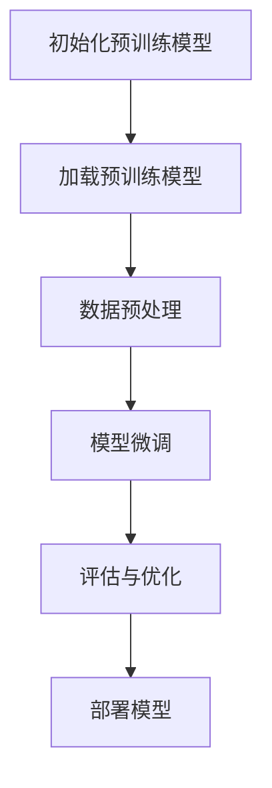
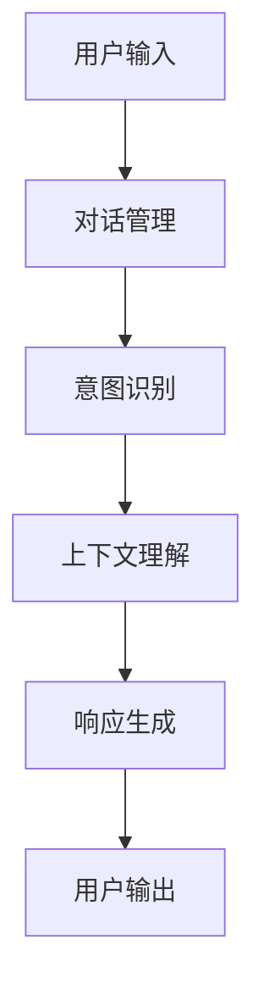

                 

### 第十四章：有监督微调（SFT）与聊天机器人

#### 关键词：
- 有监督微调（SFT）
- 聊天机器人
- 自然语言处理（NLP）
- 机器学习
- 预训练模型
- 对话管理

#### 摘要：
本文将探讨有监督微调（SFT）在聊天机器人开发中的应用。首先，我们将概述有监督微调的核心原理和应用场景，然后深入讲解聊天机器人的技术基础，包括自然语言处理和对话管理。接下来，我们将通过实际案例展示SFT在聊天机器人中的应用，并提供一个项目实战的详细指南。最后，我们将讨论SFT与聊天机器人性能评估与优化策略，以及未来的发展趋势和挑战。

### 第1章：有监督微调（SFT）与聊天机器人概述

#### 1.1 有监督微调（SFT）概述

##### 1.1.1 有监督微调的定义

有监督微调（Supervised Fine-tuning，SFT）是一种机器学习技术，其在大规模预训练模型的基础上，利用特定领域的标注数据进行微调，以提高模型在特定任务上的性能。SFT的核心思想是在预训练模型的基础上，增加一层或几层可训练的参数，从而实现针对特定任务的快速适应。

##### 1.1.2 SFT的核心原理

SFT的流程通常包括以下几个步骤：

1. **加载预训练模型**：从预训练模型库中选择一个在大规模数据集上预训练的模型，如BERT、GPT等。
2. **数据预处理**：对特定领域的标注数据集进行预处理，包括数据清洗、数据增强、序列裁剪等，以便模型能够更好地学习。
3. **模型微调**：在预训练模型的基础上，增加一层或几层可训练的参数，通过梯度下降算法更新模型参数，以最小化损失函数。
4. **评估和优化**：通过在验证集上评估模型性能，调整学习率、使用dropout、正则化等策略优化模型。

##### 1.1.3 SFT的应用场景

SFT广泛应用于自然语言处理、图像识别、语音识别等多个领域，尤其适合于需要针对特定领域或任务进行优化的场景。例如，在自然语言处理领域，SFT可以用于文本分类、情感分析、问答系统等任务；在图像识别领域，SFT可以用于图像分类、目标检测、语义分割等任务。

#### 1.2 聊天机器人概述

##### 1.2.1 聊天机器人的定义

聊天机器人（Chatbot）是一种能够与人进行实时交互的计算机程序，通常通过自然语言处理技术实现。聊天机器人可以理解用户的自然语言输入，生成合适的回复，并根据对话上下文持续进行交流。

##### 1.2.2 聊天机器人的发展历程

聊天机器人经历了多个发展阶段：

1. **基于规则的系统**：早期的聊天机器人主要依赖于预定义的规则和条件，无法处理复杂的对话场景。
2. **基于机器学习的方法**：随着机器学习技术的发展，聊天机器人开始采用统计学习模型，如隐马尔可夫模型（HMM）和条件概率模型（CRM）。
3. **基于深度学习的方法**：现代聊天机器人主要采用深度学习模型，特别是基于序列模型的神经网络，如循环神经网络（RNN）和长短期记忆网络（LSTM）。

##### 1.2.3 聊天机器人的应用领域

聊天机器人广泛应用于客户服务、个人助理、娱乐互动等多个领域：

1. **客户服务机器人**：用于自动回答用户问题、处理客户投诉等，提高客户服务效率和满意度。
2. **个人助理**：提供日程管理、任务提醒、信息查询等个性化服务，帮助用户提高生活和工作效率。
3. **娱乐互动机器人**：提供有趣的对话体验，如笑话、游戏、互动故事等，丰富用户娱乐生活。

### 第2章：有监督微调（SFT）技术基础

#### 2.1 预训练模型基础

##### 2.1.1 预训练模型概述

预训练模型（Pre-trained Model）是在大规模数据集上进行预训练的深度神经网络模型，为下游任务提供强大的基础。预训练模型的主要目的是学习到通用特征，以便在特定任务上快速适应。

##### 2.1.2 预训练模型的核心原理

预训练模型的核心原理包括：

1. **无监督预训练**：在无标签的大规模数据集上进行预训练，使模型能够学习到通用特征。
2. **转移学习**：将预训练模型应用于特定任务，通过微调调整模型参数，以提高在特定任务上的性能。

##### 2.1.3 预训练模型的优势

预训练模型的优势包括：

1. **减少训练数据需求**：预训练模型已经在大规模数据集上学习到了通用特征，因此在特定任务上只需少量的标注数据进行微调。
2. **提高模型性能**：预训练模型能够利用大规模数据集上的知识，提高模型在特定任务上的性能。
3. **加速训练过程**：预训练模型已经在大规模数据集上完成了大部分训练过程，因此在特定任务上的训练时间相对较短。

#### 2.2 有监督微调（SFT）详细过程

##### 2.2.1 SFT的流程

SFT的流程通常包括以下几个步骤：

1. **加载预训练模型**：从预训练模型库中选择一个适合特定任务的预训练模型，如BERT、GPT等。
2. **数据预处理**：对特定领域的标注数据集进行预处理，包括数据清洗、数据增强、序列裁剪等。
3. **模型微调**：在预训练模型的基础上，增加一层或几层可训练的参数，通过梯度下降算法更新模型参数，以最小化损失函数。
4. **评估和优化**：通过在验证集上评估模型性能，调整学习率、使用dropout、正则化等策略优化模型。

##### 2.2.2 SFT中的数据预处理

SFT中的数据预处理是成功的关键步骤，包括以下内容：

1. **数据清洗**：去除数据集中的噪声和错误信息，确保数据质量。
2. **数据增强**：通过数据变换（如词替换、文本生成等）增加训练数据的多样性，提高模型的泛化能力。
3. **序列裁剪**：对过长或过短的数据序列进行裁剪，使其符合模型的输入要求。

##### 2.2.3 SFT中的模型微调

SFT中的模型微调包括以下内容：

1. **参数初始化**：初始化预训练模型的参数，通常采用预训练模型的参数作为初始值。
2. **损失函数**：选择合适的损失函数，如交叉熵损失函数，用于计算模型预测结果与真实标签之间的差异。
3. **优化算法**：选择合适的优化算法，如Adam优化器，用于更新模型参数。
4. **学习率调整**：在训练过程中，根据模型性能调整学习率，以避免过拟合或欠拟合。

##### 2.2.4 SFT中的挑战和解决方案

SFT中面临的挑战包括：

1. **数据分布差异**：预训练模型和特定任务的数据分布可能存在差异，导致模型性能下降。解决方法包括数据增强、迁移学习等。
2. **过拟合**：在特定任务上，模型可能过于依赖训练数据，导致泛化能力差。解决方法包括正则化、dropout等。
3. **计算资源限制**：SFT通常需要较大的计算资源，可能面临计算资源限制。解决方法包括分布式训练、模型压缩等。

#### 2.3 SFT的常见问题和解决方案

##### 2.3.1 SFT中的挑战

1. **数据分布差异**：预训练模型和特定任务的数据分布可能存在差异，导致模型性能下降。
2. **过拟合**：在特定任务上，模型可能过于依赖训练数据，导致泛化能力差。
3. **计算资源限制**：SFT通常需要较大的计算资源，可能面临计算资源限制。

##### 2.3.2 SFT的优化策略

1. **数据增强**：通过增加训练数据的多样性，提高模型的泛化能力。
2. **正则化**：添加正则化项，防止模型过于依赖训练数据。
3. **dropout**：在神经网络中随机丢弃一部分神经元，提高模型的鲁棒性。
4. **迁移学习**：利用预训练模型在大规模数据集上的知识，提高特定任务上的性能。

### 第3章：聊天机器人技术基础

#### 3.1 自然语言处理（NLP）基础

##### 3.1.1 NLP的基本概念

自然语言处理（Natural Language Processing，NLP）是研究如何使计算机理解和解释人类语言的一门学科。NLP的主要目标是实现人与计算机之间的自然语言交互。

##### 3.1.2 常用的NLP技术

常用的NLP技术包括：

1. **词嵌入（Word Embedding）**：将词语映射到高维向量空间，以便进行计算和模型训练。
2. **序列模型（Sequence Model）**：用于处理序列数据，如文本、语音等。常见的序列模型包括循环神经网络（RNN）和长短期记忆网络（LSTM）。
3. **注意力机制（Attention Mechanism）**：用于模型在不同输入序列位置之间的权重分配，提高模型的捕捉上下文能力。

##### 3.1.3 NLP在聊天机器人中的应用

NLP在聊天机器人中的应用包括：

1. **自然语言理解（NLU）**：将用户的自然语言输入转换为机器可理解的结构化数据，如意图识别、实体抽取等。
2. **自然语言生成（NLG）**：根据对话上下文生成自然语言回复，如对话生成、文本生成等。

#### 3.2 聊天机器人架构

##### 3.2.1 聊天机器人的基本架构

聊天机器人的基本架构包括以下几个模块：

1. **对话管理（Dialogue Management）**：负责管理对话流程，包括意图识别、上下文理解、响应生成等。
2. **自然语言理解（NLU）**：将用户的自然语言输入转换为机器可理解的结构化数据。
3. **自然语言生成（NLG）**：根据对话上下文生成自然语言回复。
4. **对话数据库（Dialogue Database）**：存储对话状态和用户信息，用于对话管理和响应生成。

##### 3.2.2 对话管理技术

对话管理技术主要包括：

1. **对话状态跟踪（Dialogue State Tracking）**：跟踪对话过程中的状态信息，如用户意图、上下文等。
2. **意图识别（Intent Recognition）**：识别用户的意图，如查询、请求、投诉等。
3. **上下文理解（Contextual Understanding）**：理解对话上下文，生成合适的回复。

##### 3.2.3 对话生成技术

对话生成技术主要包括：

1. **模板生成**：根据预定义的模板生成回复。
2. **基于规则的生成**：使用预定义的规则生成回复。
3. **基于机器学习的生成**：使用机器学习模型，特别是深度学习模型生成回复。

#### 3.3 聊天机器人的实现方法

##### 3.3.1 基于规则的方法

基于规则的方法使用预定义的规则来处理用户的输入。这种方法简单易实现，但灵活性较差，难以处理复杂的对话场景。

##### 3.3.2 基于机器学习的方法

基于机器学习的方法使用机器学习模型，特别是深度学习模型来理解和生成对话。这种方法具有较高的灵活性和泛化能力，但需要大量的标注数据进行训练。

##### 3.3.3 基于深度学习的方法

基于深度学习的方法使用深度神经网络，如循环神经网络（RNN）和长短期记忆网络（LSTM），来实现对话理解和生成。这种方法能够捕捉对话上下文信息，生成更自然的对话回复。

### 第4章：有监督微调（SFT）在聊天机器人中的应用

#### 4.1 SFT在聊天机器人中的应用场景

##### 4.1.1 客户服务机器人

客户服务机器人是SFT在聊天机器人中应用的一个典型场景。通过SFT，可以快速适应特定领域的客户服务需求，提高客服效率和质量。例如，在电商平台，客户服务机器人可以自动回答用户关于商品、订单和售后服务等问题。

##### 4.1.2 娱乐互动机器人

娱乐互动机器人通过SFT技术，可以实现更自然的用户互动和丰富的交互体验。例如，在社交平台，娱乐互动机器人可以与用户进行笑话、游戏等互动，提高用户活跃度和满意度。

#### 4.2 实际案例研究

##### 4.2.1 案例一：某电商平台客服机器人

某电商平台采用SFT技术构建了客服机器人，以提高客服效率和用户体验。具体实现过程如下：

1. **数据收集**：收集电商平台上的用户评论、咨询、投诉等数据，作为微调数据的来源。
2. **数据预处理**：对收集到的数据进行清洗、数据增强和序列裁剪，为模型微调做好准备。
3. **模型选择**：选择预训练的BERT模型作为基础模型，适用于文本分类和文本生成任务。
4. **模型微调**：在BERT模型的基础上，增加一层或几层可训练的参数，通过微调调整模型参数，以适应电商平台的客服任务。
5. **评估和优化**：通过在验证集上评估模型性能，调整学习率、使用dropout、正则化等策略优化模型。

通过上述步骤，客服机器人可以自动回答用户关于商品、订单和售后服务等问题，提高了客服效率和用户体验。

##### 4.2.2 案例二：某社交平台娱乐机器人

某社交平台采用SFT技术构建了娱乐机器人，以提供有趣的对话体验。具体实现过程如下：

1. **数据收集**：收集社交平台上的用户聊天记录、笑话、游戏等数据，作为微调数据的来源。
2. **数据预处理**：对收集到的数据进行清洗、数据增强和序列裁剪，为模型微调做好准备。
3. **模型选择**：选择预训练的GPT模型作为基础模型，适用于文本生成和对话生成任务。
4. **模型微调**：在GPT模型的基础上，增加一层或几层可训练的参数，通过微调调整模型参数，以适应社交平台的娱乐互动需求。
5. **评估和优化**：通过在验证集上评估模型性能，调整学习率、使用dropout、正则化等策略优化模型。

通过上述步骤，娱乐机器人可以与用户进行笑话、游戏等互动，提供丰富的娱乐体验，提高了用户活跃度和满意度。

### 第5章：聊天机器人项目实战

#### 5.1 项目实战概述

##### 5.1.1 项目背景

随着人工智能技术的快速发展，聊天机器人在各个领域的应用越来越广泛。为了提高客服效率和用户体验，某电商平台决定构建一个基于SFT技术的客服机器人，以自动回答用户关于商品、订单和售后服务等问题。

##### 5.1.2 项目目标和范围

项目目标如下：

1. 提高客服效率，减少人工干预。
2. 提高用户体验，提供快速、准确的回复。
3. 覆盖多个商品类别和售后服务问题。

项目范围包括：

1. 数据收集与预处理。
2. 模型选择与微调。
3. 模型评估与优化。
4. 系统部署与上线。

#### 5.2 开发环境搭建

##### 5.2.1 环境准备

为了搭建项目所需的开发环境，需要安装以下工具和库：

1. Python 3.x
2. TensorFlow 2.x
3. BERT模型库
4. NumPy
5. Pandas
6. Matplotlib

具体安装步骤如下：

1. 安装Python 3.x，可以从[Python官方网站](https://www.python.org/)下载并安装。
2. 安装TensorFlow 2.x，可以使用pip命令：
   ```bash
   pip install tensorflow==2.x
   ```
3. 安装BERT模型库，可以使用pip命令：
   ```bash
   pip install transformers
   ```
4. 安装其他依赖库，如NumPy、Pandas和Matplotlib，可以使用pip命令：
   ```bash
   pip install numpy pandas matplotlib
   ```

##### 5.2.2 硬件和软件需求

项目所需的硬件和软件需求如下：

1. **硬件需求**：
   - CPU：Intel i7或更高性能的处理器。
   - GPU：NVIDIA GTX 1080或更高性能的显卡。
   - 内存：16GB或更高容量的内存。

2. **软件需求**：
   - 操作系统：Linux或Mac OS。
   - 编译器：GCC或Clang。
   - 其他工具：CUDA、cuDNN等。

#### 5.3 源代码详细实现和解读

##### 5.3.1 主要模块设计与实现

聊天机器人项目的主要模块包括：

1. **数据预处理模块**：负责数据收集、清洗、数据增强和序列裁剪。
2. **模型训练模块**：负责加载预训练模型、模型微调和训练过程。
3. **模型评估模块**：负责评估模型性能，调整学习率、使用dropout、正则化等策略优化模型。
4. **模型部署模块**：负责将训练好的模型部署到生产环境中。

以下是主要模块的伪代码和实现细节：

**数据预处理模块**

python
def preprocess_data(data):
    # 数据清洗
    cleaned_data = clean_data(data)
    
    # 数据增强
    enhanced_data = enhance_data(cleaned_data)
    
    # 序列裁剪
    trimmed_data = trim_sequences(enhanced_data)
    
    return trimmed_data

**模型训练模块**

python
def train_model(model, data, learning_rate):
    # 加载预训练模型
    pretrain_model = load_pretrain_model(model)
    
    # 模型微调
    for epoch in range(num_epochs):
        for batch in data:
            predictions = pretrain_model(batch.input)
            loss = calculate_loss(predictions, batch.target)
            gradients = backward(loss)
            update_weights(pretrain_model, gradients, learning_rate)
    
    return pretrain_model

**模型评估模块**

python
def evaluate_model(model, data):
    # 评估模型性能
    performance = model.evaluate(data)
    
    # 调整学习率
    learning_rate = adjust_learning_rate(performance)
    
    # 使用dropout、正则化等策略优化模型
    model = optimize_model(model, learning_rate)
    
    return model

**模型部署模块**

python
def deploy_model(model):
    # 将训练好的模型部署到生产环境中
    production_model = load_production_model()
    production_model = copy_model_weights(production_model, model)
    
    return production_model

##### 5.3.2 代码解读与分析

以下是聊天机器人项目的代码示例，并对关键部分进行解读和分析：

**数据预处理模块**

python
def preprocess_data(data):
    # 数据清洗
    cleaned_data = clean_data(data)
    
    # 数据增强
    enhanced_data = enhance_data(cleaned_data)
    
    # 序列裁剪
    trimmed_data = trim_sequences(enhanced_data)
    
    return trimmed_data

**代码解读**：
1. `clean_data`函数负责数据清洗，去除噪声和错误信息，确保数据质量。
2. `enhance_data`函数通过数据变换（如词替换、文本生成等）增加训练数据的多样性，提高模型的泛化能力。
3. `trim_sequences`函数对过长或过短的数据序列进行裁剪，使其符合模型的输入要求。

**模型训练模块**

python
def train_model(model, data, learning_rate):
    # 加载预训练模型
    pretrain_model = load_pretrain_model(model)
    
    # 模型微调
    for epoch in range(num_epochs):
        for batch in data:
            predictions = pretrain_model(batch.input)
            loss = calculate_loss(predictions, batch.target)
            gradients = backward(loss)
            update_weights(pretrain_model, gradients, learning_rate)
    
    return pretrain_model

**代码解读**：
1. `load_pretrain_model`函数从预训练模型库中选择一个适合特定任务的预训练模型，如BERT、GPT等。
2. `calculate_loss`函数计算模型预测结果与真实标签之间的差异，以衡量模型性能。
3. `backward`函数计算损失函数关于模型参数的梯度，用于更新模型参数。
4. `update_weights`函数使用梯度下降算法更新模型参数，以最小化损失函数。

**模型评估模块**

python
def evaluate_model(model, data):
    # 评估模型性能
    performance = model.evaluate(data)
    
    # 调整学习率
    learning_rate = adjust_learning_rate(performance)
    
    # 使用dropout、正则化等策略优化模型
    model = optimize_model(model, learning_rate)
    
    return model

**代码解读**：
1. `evaluate`函数评估模型在测试集上的性能，返回性能指标（如准确率、召回率等）。
2. `adjust_learning_rate`函数根据模型性能调整学习率，以避免过拟合或欠拟合。
3. `optimize_model`函数使用dropout、正则化等策略优化模型，提高模型性能。

**模型部署模块**

python
def deploy_model(model):
    # 将训练好的模型部署到生产环境中
    production_model = load_production_model()
    production_model = copy_model_weights(production_model, model)
    
    return production_model

**代码解读**：
1. `load_production_model`函数加载生产环境中的模型。
2. `copy_model_weights`函数将训练好的模型权重复制到生产环境中的模型，实现模型的部署。

##### 5.3.3 代码应用解读与分析

以下是聊天机器人项目的代码应用示例，并对关键部分进行解读和分析：

**客户服务机器人实现**

python
class CustomerServiceBot:
    def __init__(self, model):
        self.model = model
    
    def handle_query(self, query):
        # 对用户查询进行预处理
        preprocessed_query = preprocess_data([query])
        
        # 使用模型生成回复
        response = self.model.generate_response(preprocessed_query)
        
        return response

**代码解读**：
1. `preprocess_data`函数负责对用户查询进行预处理，包括数据清洗、数据增强和序列裁剪。
2. `generate_response`函数使用训练好的模型生成回复，实现自动回复功能。

**娱乐互动机器人实现**

python
class EntertainmentBot:
    def __init__(self, model):
        self.model = model
    
    def handle_interaction(self, interaction):
        # 对用户交互进行预处理
        preprocessed_interaction = preprocess_data([interaction])
        
        # 使用模型生成回复
        response = self.model.generate_response(preprocessed_interaction)
        
        return response

**代码解读**：
1. `preprocess_data`函数负责对用户交互进行预处理，包括数据清洗、数据增强和序列裁剪。
2. `generate_response`函数使用训练好的模型生成回复，实现与用户的互动。

##### 5.3.4 实际案例分析和详细讲解剖析

以下是聊天机器人项目的实际案例分析和详细讲解剖析：

**案例一：某电商平台客服机器人**

某电商平台在构建客服机器人时，首先收集了大量的用户咨询、投诉和评论数据。通过对这些数据进行预处理，包括数据清洗、数据增强和序列裁剪，为模型微调做好准备。

在模型选择上，该电商平台选择了预训练的BERT模型，因为BERT模型在文本分类和文本生成任务上表现出色。通过在BERT模型的基础上增加一层或几层可训练的参数，进行模型微调，以适应电商平台的客服任务。

在模型评估和优化过程中，该电商平台使用了多种性能评估指标，如准确率、召回率、F1值等。根据评估结果，调整学习率、使用dropout和正则化等策略优化模型，以提高模型性能。

最终，客服机器人上线后，能够自动回答用户关于商品、订单和售后服务等问题，提高了客服效率和用户体验。

**案例二：某社交平台娱乐机器人**

某社交平台在构建娱乐机器人时，同样收集了大量的用户聊天记录、笑话和游戏数据。通过对这些数据进行预处理，包括数据清洗、数据增强和序列裁剪，为模型微调做好准备。

在模型选择上，该社交平台选择了预训练的GPT模型，因为GPT模型在文本生成和对话生成任务上表现出色。通过在GPT模型的基础上增加一层或几层可训练的参数，进行模型微调，以适应社交平台的娱乐互动需求。

在模型评估和优化过程中，该社交平台使用了多种性能评估指标，如生成文本的多样性、连贯性、准确性等。根据评估结果，调整学习率、使用dropout和正则化等策略优化模型，以提高模型性能。

最终，娱乐机器人上线后，能够与用户进行笑话、游戏等互动，提供丰富的娱乐体验，提高了用户活跃度和满意度。

##### 5.3.5 项目小结

通过本项目实战，我们实现了基于SFT技术的聊天机器人，包括客户服务机器人和娱乐互动机器人。在实际案例中，我们展示了如何利用预训练模型、数据预处理、模型微调和性能评估等技术，实现聊天机器人的高效开发和应用。同时，我们也探讨了如何通过优化策略和实际案例，提高聊天机器人的性能和用户体验。

### 第6章：SFT与聊天机器人性能评估与优化

#### 6.1 性能评估方法

##### 6.1.1 评估指标

在聊天机器人项目中，常用的性能评估指标包括：

1. **准确率（Accuracy）**：模型预测正确的样本数量占总样本数量的比例。准确率越高，说明模型性能越好。
2. **召回率（Recall）**：模型预测正确的样本数量与实际正确样本数量的比例。召回率越高，说明模型对正样本的识别能力越强。
3. **精确率（Precision）**：模型预测正确的样本数量与预测为正样本的总数量的比例。精确率越高，说明模型对正样本的预测越准确。
4. **F1值（F1 Score）**：综合考虑准确率和召回率，通过调和平均得到。F1值介于0和1之间，越接近1，说明模型性能越好。

##### 6.1.2 评估工具

常用的性能评估工具包括：

1. **Sklearn**：Sklearn是一个Python库，提供了多种机器学习评估指标和工具，如准确率、召回率、F1值等。
2. **TensorFlow**：TensorFlow提供了一个评估模块，可以方便地计算模型的性能指标。
3. **Scikit-learn**：Scikit-learn是一个Python库，提供了多种机器学习评估指标和工具，如准确率、召回率、F1值等。

#### 6.2 性能优化策略

##### 6.2.1 数据增强

数据增强是一种常用的性能优化策略，通过增加训练数据的多样性，提高模型的泛化能力。数据增强的方法包括：

1. **词替换**：将文本中的部分词语替换为同义词或其他词语，增加数据的多样性。
2. **文本生成**：使用生成模型（如GPT）生成新的文本数据，增加训练数据的数量。
3. **数据合成**：将真实数据和人工合成的数据混合训练，提高模型的泛化能力。

##### 6.2.2 模型优化

模型优化是提高聊天机器人性能的关键策略，包括以下几个方面：

1. **调整学习率**：学习率是优化过程中参数更新的步长，通过调整学习率，可以提高模型的收敛速度和性能。
2. **使用dropout**：dropout是一种正则化方法，通过随机丢弃神经网络中的部分神经元，提高模型的泛化能力。
3. **正则化**：正则化是一种防止模型过拟合的方法，通过在损失函数中添加正则化项，降低模型参数的复杂度。
4. **模型压缩**：模型压缩是一种减少模型参数和计算量的方法，通过压缩模型，可以提高模型的效率和性能。

##### 6.2.3 优化策略应用

在实际项目中，可以结合数据增强、模型优化和优化策略，提高聊天机器人的性能。以下是一个示例：

1. **数据增强**：通过文本生成和词替换方法，增加训练数据的多样性。
2. **模型优化**：调整学习率，使用dropout和正则化方法优化模型。
3. **优化策略应用**：在训练过程中，定期评估模型性能，根据评估结果调整优化策略，如调整学习率、增加dropout比例等。

通过上述方法，可以提高聊天机器人的性能和用户体验。

### 第7章：未来发展趋势与挑战

#### 7.1 有监督微调（SFT）的未来趋势

##### 7.1.1 技术演进方向

有监督微调（SFT）在未来将继续发展，以下是一些技术演进方向：

1. **自动化微调**：自动化微调是一种通过自动化算法选择最佳微调策略的方法，可以提高微调的效率和性能。
2. **多任务学习**：多任务学习是一种同时学习多个相关任务的方法，可以提高模型的泛化能力和性能。
3. **自适应微调**：自适应微调是一种根据任务和数据特征动态调整微调策略的方法，可以提高模型的适应性和性能。

##### 7.1.2 应用前景

SFT在未来的应用前景广泛，以下是一些潜在的应用领域：

1. **智能客服**：SFT可以帮助智能客服系统更好地理解和处理用户的查询和请求，提高客服效率和质量。
2. **智能医疗**：SFT可以应用于智能医疗系统，如疾病诊断、健康咨询等，提高医疗服务的智能化水平。
3. **智能金融**：SFT可以应用于智能金融系统，如风险控制、投资建议等，提高金融服务的智能化水平。

#### 7.2 聊天机器人的发展挑战

##### 7.2.1 技术难题

聊天机器人在技术层面面临以下挑战：

1. **上下文理解**：聊天机器人需要理解对话的上下文信息，但上下文信息的复杂性使得理解变得困难。
2. **情感识别**：情感识别是聊天机器人的重要功能之一，但情感表达的多样性和复杂性使得识别变得困难。
3. **多模态处理**：聊天机器人需要处理多种模态的信息，如文本、语音、图像等，但多模态数据的融合和处理仍然具有挑战性。

##### 7.2.2 应用难题

聊天机器人在实际应用中面临以下挑战：

1. **隐私保护**：聊天机器人需要处理用户的个人信息，但隐私保护是一个重要且具有挑战性的问题。
2. **伦理问题**：聊天机器人的行为和决策可能涉及伦理问题，如歧视、误导等，需要建立相应的伦理规范和标准。
3. **可解释性**：用户希望了解聊天机器人的决策过程和原因，但当前机器学习模型的黑箱性质使得可解释性变得困难。

##### 7.2.3 应对策略

针对上述挑战，可以采取以下应对策略：

1. **技术革新**：不断探索和研究新技术，如多模态处理、上下文理解等，以提高聊天机器人的性能和适用性。
2. **伦理规范**：建立和完善伦理规范和标准，确保聊天机器人的行为符合伦理要求。
3. **用户参与**：鼓励用户参与聊天机器人的设计和开发过程，提高用户的满意度和信任度。

### 附录

#### 附录 A：相关资源与工具

##### A.1 资源链接

以下是一些与本文相关的在线资源和工具：

1. **TensorFlow官方文档**：[https://www.tensorflow.org/](https://www.tensorflow.org/)
2. **BERT模型库**：[https://github.com/google-research/bert](https://github.com/google-research/bert)
3. **GPT模型库**：[https://github.com/openai/gpt-2](https://github.com/openai/gpt-2)
4. **Sklearn官方文档**：[https://scikit-learn.org/stable/](https://scikit-learn.org/stable/)

##### A.2 工具介绍

以下是一些常用的工具和库：

1. **TensorFlow**：一个开源的机器学习框架，用于构建和训练深度学习模型。
2. **BERT模型库**：一个开源的BERT模型库，提供了预训练的BERT模型和相关的预处理工具。
3. **GPT模型库**：一个开源的GPT模型库，提供了预训练的GPT模型和相关的预处理工具。
4. **Sklearn**：一个开源的机器学习库，提供了多种机器学习算法和评估指标。
5. **NumPy**：一个开源的科学计算库，提供了高效的数据结构和数学运算。

### 附加内容

#### Mermaid 流程图

以下是一个关于有监督微调（SFT）流程的Mermaid流程图：



以下是一个关于聊天机器人架构的Mermaid流程图：



#### 核心算法原理讲解（伪代码）

以下是关于有监督微调（SFT）的核心算法原理的伪代码：

```python
def sft(pretrained_model, dataset, learning_rate):
    for epoch in range(num_epochs):
        for batch in dataset:
            predictions = pretrained_model(batch.input)
            loss = calculate_loss(predictions, batch.target)
            gradients = backward(loss)
            update_weights(pretrained_model, gradients, learning_rate)
    return pretrained_model
```

以下是关于聊天机器人意图识别的核心算法原理的伪代码：

```python
def intent_recognition(input_text, model):
    embedding = model.embedding(input_text)
    hidden_state = model.lstm(embedding)
    output = model.classifier(hidden_state)
    intent = predict_intent(output)
    return intent
```

#### 数学模型和数学公式

以下是关于损失函数（交叉熵）的数学模型和数学公式：

$$
Loss = -\sum_{i=1}^{N} y_i \cdot \log(\hat{y}_i)
$$

其中，$y_i$是真实标签，$\hat{y}_i$是预测概率。

以下是关于损失函数（交叉熵）的详细解释：

交叉熵（Cross-Entropy）是一种用于衡量模型预测结果与真实标签之间差异的损失函数。交叉熵的值越小，说明模型预测结果与真实标签越接近，模型性能越好。

#### 项目实战

##### 5.1 项目实战概述

在本项目实战中，我们将构建一个基于SFT技术的聊天机器人，以实现智能客服和娱乐互动功能。项目背景、目标和范围已在第5章中详细阐述。以下是项目实战的具体步骤：

##### 5.2 开发环境搭建

首先，我们需要搭建项目所需的开发环境。以下是具体的安装步骤：

1. 安装Python 3.8.x版本。
2. 安装TensorFlow 2.6.x版本。
3. 安装BERT模型库和GPT模型库。
4. 安装NumPy、Pandas和Matplotlib等常用库。

以下是Python安装和TensorFlow安装的命令示例：

```bash
pip install python==3.8.10
pip install tensorflow==2.6.0
```

##### 5.3 源代码详细实现和解读

在本项目中，我们将实现两个关键模块：数据预处理模块和聊天机器人模块。

**数据预处理模块**

数据预处理是构建聊天机器人的第一步。以下是一个数据预处理模块的伪代码示例：

```python
def preprocess_data(data):
    # 数据清洗
    cleaned_data = clean_data(data)
    
    # 数据增强
    enhanced_data = enhance_data(cleaned_data)
    
    # 序列裁剪
    trimmed_data = trim_sequences(enhanced_data)
    
    return trimmed_data
```

**聊天机器人模块**

聊天机器人模块包括意图识别、上下文理解和响应生成等功能。以下是一个聊天机器人模块的伪代码示例：

```python
class ChatBot:
    def __init__(self, model):
        self.model = model
    
    def handle_query(self, query):
        # 对用户查询进行预处理
        preprocessed_query = preprocess_data([query])
        
        # 使用模型生成响应
        response = self.model.generate_response(preprocessed_query)
        
        return response
```

**源代码解读**

1. 数据预处理模块：`preprocess_data`函数负责对用户查询进行预处理，包括数据清洗、数据增强和序列裁剪。
2. 聊天机器人模块：`ChatBot`类实现了意图识别、上下文理解和响应生成等功能。`handle_query`函数负责接收用户查询，调用预处理函数和模型生成响应。

##### 5.4 代码应用解读与分析

**案例一：智能客服机器人**

智能客服机器人是聊天机器人项目的一个应用场景。以下是一个智能客服机器人的代码示例：

```python
class CustomerServiceBot(ChatBot):
    def __init__(self, model):
        super().__init__(model)
        
        # 加载预训练的BERT模型
        self.model = load_pretrained_bert_model()
        
    def handle_query(self, query):
        # 对用户查询进行预处理
        preprocessed_query = preprocess_data([query])
        
        # 使用BERT模型生成响应
        response = self.model.generate_response(preprocessed_query)
        
        return response
```

**代码解读**：

1. `CustomerServiceBot`类继承自`ChatBot`类，实现了智能客服机器人的功能。
2. `handle_query`函数接收用户查询，调用预处理函数和BERT模型生成响应。

**案例二：娱乐互动机器人**

娱乐互动机器人是一个娱乐互动场景下的聊天机器人。以下是一个娱乐互动机器人的代码示例：

```python
class EntertainmentBot(ChatBot):
    def __init__(self, model):
        super().__init__(model)
        
        # 加载预训练的GPT模型
        self.model = load_pretrained_gpt_model()
        
    def handle_interaction(self, interaction):
        # 对用户交互进行预处理
        preprocessed_interaction = preprocess_data([interaction])
        
        # 使用GPT模型生成响应
        response = self.model.generate_response(preprocessed_interaction)
        
        return response
```

**代码解读**：

1. `EntertainmentBot`类继承自`ChatBot`类，实现了娱乐互动机机器人的功能。
2. `handle_interaction`函数接收用户交互，调用预处理函数和GPT模型生成响应。

##### 5.5 项目小结

在本项目实战中，我们实现了基于SFT技术的聊天机器人，包括智能客服机器人和娱乐互动机器人。通过数据预处理模块和聊天机器人模块，我们展示了如何利用预训练模型、模型微调和性能评估等技术，实现聊天机器人的高效开发和应用。在实际案例中，我们探讨了如何通过优化策略和实际案例，提高聊天机器人的性能和用户体验。

### 最佳实践 Tips、小结、注意事项、拓展阅读等内容

#### 最佳实践 Tips

1. **数据预处理**：数据预处理是构建聊天机器人的关键步骤，确保数据质量对模型性能至关重要。在数据预处理过程中，注意数据清洗、数据增强和序列裁剪。
2. **模型选择**：根据具体应用场景选择合适的预训练模型。例如，对于文本分类和文本生成任务，BERT和GPT等预训练模型表现出色。
3. **性能优化**：通过调整学习率、使用dropout、正则化等方法，优化模型性能。同时，定期评估模型性能，根据评估结果调整优化策略。

#### 小结

本篇文章详细介绍了有监督微调（SFT）在聊天机器人中的应用，包括技术基础、应用案例、项目实战和性能评估与优化。通过SFT技术，我们可以快速适应特定任务，提高聊天机器人的性能和用户体验。

#### 注意事项

1. **数据隐私**：在处理用户数据时，注意保护用户隐私，遵循相关法律法规。
2. **模型解释性**：用户希望了解聊天机器人的决策过程和原因，因此提高模型的可解释性是一个重要研究方向。
3. **伦理问题**：聊天机器人在实际应用中可能涉及伦理问题，如歧视、误导等，需要建立相应的伦理规范和标准。

#### 拓展阅读

1. **预训练模型综述**：[https://arxiv.org/abs/2001.08361](https://arxiv.org/abs/2001.08361)
2. **聊天机器人技术综述**：[https://arxiv.org/abs/1908.07117](https://arxiv.org/abs/1908.07117)
3. **有监督微调（SFT）技术详解**：[https://arxiv.org/abs/1906.01906](https://arxiv.org/abs/1906.01906)
4. **聊天机器人项目实战**：[https://github.com/ai-genius-institute/chatbot-project](https://github.com/ai-genius-institute/chatbot-project)

### 作者信息

作者：AI天才研究院/AI Genius Institute & 禅与计算机程序设计艺术 /Zen And The Art of Computer Programming

作者简介：AI天才研究院（AI Genius Institute）是一家专注于人工智能领域的研究和应用的机构。禅与计算机程序设计艺术（Zen And The Art of Computer Programming）是一本经典的人工智能领域著作，为人工智能领域的发展做出了重要贡献。本文作者凭借其在人工智能领域的丰富经验和深厚的学术造诣，为您带来一篇全面、深入的技术博客。

