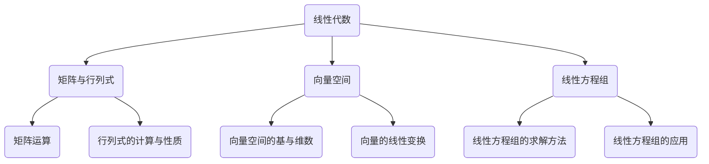

                 

### 文章标题

### 《线性代数导引：二维实线性映射》

关键词：线性代数、二维实线性映射、矩阵、向量空间、线性变换

摘要：本文旨在深入探讨二维实线性映射的基本概念、性质及其应用。通过线性代数的基础知识，我们将逐步了解矩阵与线性映射的关系，探讨其在几何学、物理学和计算机科学等领域的广泛应用。本文将结合数学模型和伪代码，详细讲解特征值与特征向量的计算方法，并给出实际案例进行分析。读者将通过本文对线性代数的核心概念和实际应用有更深刻的理解。

----------------------------------------------------------------

# 第一部分：线性代数基础

## 第1章：线性代数简介

### 1.1 线性代数的定义与作用

线性代数是数学中的一个分支，主要研究向量空间及其线性变换。向量空间可以被视为具有加法和标量乘法运算的集合，这些运算满足一系列公理。线性代数在数学及其它学科中发挥着重要作用，如物理学中的力学问题、经济学中的优化问题以及计算机科学中的算法设计等。

线性代数的基本概念包括向量、向量空间、线性组合、线性变换等。向量是具有大小和方向的几何对象，可以表示为有序数组。向量空间是由向量组成的集合，满足加法和标量乘法的运算规则。线性组合是通过将向量与标量相乘并相加以生成新向量的方法。线性变换是指将一个向量空间映射到另一个向量空间的一种变换，满足线性组合的性质。

### 1.2 线性代数的发展历程

线性代数的发展历程可以追溯到19世纪。当时，矩阵的概念首次被引入，并应用于解线性方程组。随后，线性代数的研究逐渐深入，发展出了矩阵的运算、行列式的计算等基本理论。20世纪初，线性空间的概念被提出，为线性代数的研究奠定了基础。20世纪中期，线性代数的应用领域不断扩展，如量子力学、统计学、计算机科学等。

### 1.3 线性代数在数学及其它学科中的应用

线性代数在数学中具有重要的地位，如其在解析几何、微分方程、概率论等领域的应用。在物理学中，线性代数用于描述力学问题，如质点运动、电磁场等。在经济学中，线性代数用于优化问题，如线性规划、主成分分析等。在计算机科学中，线性代数在算法设计、图形渲染、机器学习等领域有着广泛的应用。

## 第2章：矩阵与行列式

### 2.1 矩阵的基本概念

矩阵是一种由数字组成的矩形数组，可以表示线性变换或线性方程组。矩阵的基本概念包括行、列、阶、元素等。矩阵的阶是指矩阵的行数和列数，如一个2x3的矩阵有2行3列。矩阵的元素是矩阵中的每一个数字，位于特定的行和列交叉位置。矩阵可以通过行和列的索引来访问其元素，如矩阵A的第i行第j列的元素表示为\(A_{ij}\)。

### 2.2 矩阵的运算

矩阵的运算包括加法、减法、乘法、转置、逆矩阵等。矩阵的加法和减法是指将两个相同阶的矩阵对应位置上的元素相加或相减。矩阵的乘法是指将两个矩阵按特定的规则相乘，得到一个新的矩阵。矩阵的转置是指将矩阵的行和列互换。逆矩阵是指一个矩阵与其逆矩阵相乘得到单位矩阵。

### 2.3 行列式的计算与性质

行列式是矩阵的一个数值属性，可以用来判断矩阵的秩和可逆性。行列式的计算方法包括拉普拉斯展开和拉普拉斯公式。行列式具有一些基本性质，如行列式的线性性质、乘法性质、行列式为零的条件等。

## 第3章：向量空间

### 3.1 向量空间的基本概念

向量空间是由向量组成的集合，满足加法和标量乘法的运算规则。向量空间的基本概念包括基、维数、子空间等。基是指能够生成向量空间的最小向量集合，维数是指向量空间的基向量的个数。子空间是指向量空间的一个子集，也满足向量空间的运算规则。

### 3.2 向量空间的基与维数

向量空间的基是指能够生成向量空间的最小向量集合，基向量的个数称为维数。一个向量空间可以有多个不同的基。如果向量空间的维数是有限的，则称为有限维向量空间。如果向量空间的维数是无限的，则称为无限维向量空间。

### 3.3 向量空间的线性变换

向量空间的线性变换是指将一个向量空间映射到另一个向量空间的一种变换，满足线性组合的性质。线性变换可以表示为矩阵乘法，矩阵的行数等于变换前向量空间的维数，列数等于变换后向量空间的维数。

## 第4章：线性方程组

### 4.1 线性方程组的基本概念

线性方程组是指由多个线性方程组成的一组方程，每个方程包含若干未知数和常数。线性方程组的基本概念包括解、唯一解、无穷解、无解等。解是指满足线性方程组所有方程的未知数的取值。

### 4.2 线性方程组的求解方法

线性方程组的求解方法包括高斯消元法、矩阵求逆法、克莱姆法则等。高斯消元法是通过消元将线性方程组转化为下三角形方程组，然后逐个求解未知数。矩阵求逆法是利用矩阵的逆矩阵求解线性方程组。克莱姆法则是通过行列式的计算求解线性方程组。

### 4.3 线性方程组的应用

线性方程组在数学、物理学、工程学等领域有广泛的应用。在物理学中，线性方程组用于求解力学问题，如质点运动方程、电磁场方程等。在工程学中，线性方程组用于结构分析、电路分析、信号处理等。

# 第二部分：二维实线性映射

## 第5章：二维实线性映射的概念与性质

### 5.1 线性映射的定义

线性映射是指将一个向量空间映射到另一个向量空间的一种变换，满足线性组合的性质。在二维实线性映射中，映射函数是将二维向量映射到另一个二维向量。线性映射可以表示为矩阵乘法，即\( \mathbf{y} = \mathbf{A}\mathbf{x} + \mathbf{b} \)，其中\( \mathbf{x} \)和\( \mathbf{y} \)分别是输入向量和输出向量，\( \mathbf{A} \)是线性映射的矩阵，\( \mathbf{b} \)是偏置向量。

### 5.2 线性映射的性质

线性映射具有以下性质：
1. **加法性**：对于任意两个输入向量\( \mathbf{x}_1 \)和\( \mathbf{x}_2 \)，以及任意标量\( \alpha \)和\( \beta \)，有\( \mathbf{A}(\alpha \mathbf{x}_1 + \beta \mathbf{x}_2) = \alpha \mathbf{A}\mathbf{x}_1 + \beta \mathbf{A}\mathbf{x}_2 \)。
2. **齐次性**：对于任意输入向量\( \mathbf{x} \)和任意标量\( \alpha \)，有\( \mathbf{A}(\alpha \mathbf{x}) = \alpha \mathbf{A}\mathbf{x} \)。
3. **线性组合**：线性映射将线性组合映射为线性组合，即对于任意输入向量\( \mathbf{x}_1, \mathbf{x}_2, \ldots, \mathbf{x}_n \)和任意标量\( \alpha_1, \alpha_2, \ldots, \alpha_n \)，有\( \mathbf{A}(\alpha_1 \mathbf{x}_1 + \alpha_2 \mathbf{x}_2 + \ldots + \alpha_n \mathbf{x}_n) = \alpha_1 \mathbf{A}\mathbf{x}_1 + \alpha_2 \mathbf{A}\mathbf{x}_2 + \ldots + \alpha_n \mathbf{A}\mathbf{x}_n \)。

### 5.3 线性映射的分类

根据线性映射的矩阵形式，可以将线性映射分为以下几类：
1. **恒等映射**：当线性映射的矩阵为单位矩阵时，称为恒等映射，即\( \mathbf{A} = \mathbf{I} \)。恒等映射保持向量的长度和方向不变。
2. **旋转变换**：当线性映射的矩阵为旋转矩阵时，称为旋转变换。旋转矩阵的特点是对角线上的元素为0，其余元素满足\( \mathbf{A}^T = \mathbf{A}^{-1} \)。
3. **反射变换**：当线性映射的矩阵为反射矩阵时，称为反射变换。反射矩阵的特点是对角线上的元素为1，其余元素满足\( \mathbf{A}^T = -\mathbf{A}^{-1} \)。
4. **缩放变换**：当线性映射的矩阵为缩放矩阵时，称为缩放变换。缩放矩阵的特点是对角线上的元素为正数，其余元素为0。

## 第6章：线性映射的矩阵表示

### 6.1 矩阵与线性映射的关系

线性映射可以表示为矩阵乘法。对于二维实线性映射，其矩阵形式为\( \mathbf{y} = \mathbf{A}\mathbf{x} + \mathbf{b} \)，其中\( \mathbf{A} \)是线性映射的矩阵，\( \mathbf{x} \)是输入向量，\( \mathbf{y} \)是输出向量，\( \mathbf{b} \)是偏置向量。矩阵\( \mathbf{A} \)的行数等于输入向量的维数，列数等于输出向量的维数。

### 6.2 线性映射的矩阵表示方法

线性映射的矩阵表示方法包括以下几种：
1. **行矩阵表示**：将线性映射的矩阵表示为行矩阵，即将输入向量作为行矩阵与线性映射的矩阵相乘。这种表示方法在计算时较为直观，便于理解。
2. **列矩阵表示**：将线性映射的矩阵表示为列矩阵，即将输出向量作为列矩阵与线性映射的矩阵相乘。这种表示方法在计算时较为高效，适用于计算机科学中的算法设计。
3. **分块矩阵表示**：将线性映射的矩阵分解为分块矩阵，即利用分块矩阵的性质将复杂的线性映射分解为多个简单的线性映射。这种表示方法在处理大规模问题时具有较高的计算效率。

### 6.3 矩阵的性质与线性映射的关系

矩阵的性质与线性映射的性质密切相关。以下是一些常见的矩阵性质及其与线性映射的关系：
1. **可逆性**：如果线性映射的矩阵是可逆的，则线性映射是双射，即每个输入向量都有唯一的输出向量。反之，如果线性映射是双射，则其矩阵是可逆的。
2. **对称性**：如果线性映射的矩阵是对称的，则线性映射保持向量的长度和方向。这种性质在几何学中具有广泛的应用。
3. **正定性**：如果线性映射的矩阵是正定的，则线性映射将输入向量的长度映射为输出向量的长度。这种性质在优化问题中具有重要意义。
4. **奇异值分解**：线性映射的矩阵可以通过奇异值分解进行分解，即\( \mathbf{A} = \mathbf{U}\mathbf{\Sigma}\mathbf{V}^T \)，其中\( \mathbf{U} \)和\( \mathbf{V} \)是对称正交矩阵，\( \mathbf{\Sigma} \)是奇异值矩阵。奇异值分解可以用于求解线性映射的最小二乘解、特征值等问题。

## 第7章：线性映射的应用

### 7.1 线性映射在几何学中的应用

线性映射在几何学中具有广泛的应用。例如，二维实线性映射可以表示为二维平面上的旋转、缩放、反射等几何变换。通过线性映射，可以将二维图形进行平移、旋转、缩放等变换，从而实现图形的变换和变换组合。

### 7.2 线性映射在物理学中的应用

线性映射在物理学中用于描述力学问题。例如，在质点运动中，线性映射可以表示为质点的位置和速度之间的关系。通过线性映射，可以求解质点的运动轨迹和受力情况。

### 7.3 线性映射在计算机科学中的应用

线性映射在计算机科学中有着广泛的应用。例如，在图像处理中，线性映射可以用于图像的增强、滤波、变换等操作。在机器学习中，线性映射可以用于特征提取和降维处理。在计算机图形学中，线性映射可以用于实现物体的变换和动画。

# 第三部分：高级线性代数

## 第8章：特征值与特征向量

### 8.1 特征值与特征向量的定义

特征值（Eigenvalue）和特征向量（Eigenvector）是线性代数中重要的概念。对于一个线性映射\( \mathbf{A} \)，如果存在一个非零向量\( \mathbf{v} \)和一个实数\( \lambda \)，使得\( \mathbf{A}\mathbf{v} = \lambda \mathbf{v} \)，则称\( \lambda \)为\( \mathbf{A} \)的一个特征值，\( \mathbf{v} \)为\( \mathbf{A} \)对应于特征值\( \lambda \)的特征向量。

### 8.2 特征值与特征向量的性质

特征值与特征向量具有以下性质：
1. **唯一性**：对于给定的线性映射，每个特征值对应的特征向量是唯一的，但多个特征值可以对应于同一个特征向量。
2. **对易性**：对于两个线性映射\( \mathbf{A} \)和\( \mathbf{B} \)，如果它们有相同的特征值，则它们的和\( \mathbf{A} + \mathbf{B} \)和积\( \mathbf{AB} \)也有相同的特征值。
3. **稳定性**：特征值是线性映射在复数域上的特征值，对于实数域上的线性映射，其特征值也是稳定的。
4. **重数**：一个特征值的重数是指对应于该特征值的线性无关的特征向量的个数。

### 8.3 特征值与特征向量的计算

计算特征值与特征向量通常需要求解线性映射的矩阵特征值问题。以下是计算特征值与特征向量的步骤：
1. **特征值求解**：对于给定的线性映射矩阵\( \mathbf{A} \)，求解特征值问题\( \det(\mathbf{A} - \lambda \mathbf{I}) = 0 \)，其中\( \mathbf{I} \)是单位矩阵。
2. **特征向量求解**：对于每个特征值\( \lambda \)，求解线性方程组\( (\mathbf{A} - \lambda \mathbf{I})\mathbf{v} = \mathbf{0} \)，得到对应于特征值\( \lambda \)的特征向量\( \mathbf{v} \)。

### 8.4 特征值与特征向量的应用

特征值与特征向量在许多领域有广泛的应用：
1. **矩阵对角化**：如果一个线性映射的矩阵可以被对角化，即存在一组基向量使得线性映射在该基下对角化，则可以通过计算特征值与特征向量实现对矩阵的对角化。
2. **振动分析**：在物理学中，特征值与特征向量用于分析系统的振动特性，如弹簧振子和质点振动系统。
3. **信号处理**：在信号处理中，特征值与特征向量用于信号的去噪、压缩和变换。
4. **机器学习**：在机器学习中，特征值与特征向量用于特征提取和降维，如主成分分析（PCA）。

## 第9章：二次型与对称矩阵

### 9.1 二次型的定义与性质

二次型是指形如\( Q(\mathbf{x}) = \mathbf{x}^T\mathbf{A}\mathbf{x} \)的函数，其中\( \mathbf{x} \)是n维向量，\( \mathbf{A} \)是n阶对称矩阵。二次型具有以下性质：
1. **齐次性**：二次型是齐次的，即\( Q(\alpha \mathbf{x}) = \alpha^2 Q(\mathbf{x}) \)。
2. **可加性**：二次型是可加的，即\( Q(\mathbf{x}_1 + \mathbf{x}_2) = Q(\mathbf{x}_1) + Q(\mathbf{x}_2) \)。
3. **对称性**：二次型的矩阵\( \mathbf{A} \)是对称的，即\( \mathbf{A}^T = \mathbf{A} \)。

### 9.2 对称矩阵的基本概念

对称矩阵是指一个矩阵与其转置矩阵相等的矩阵，即\( \mathbf{A}^T = \mathbf{A} \)。对称矩阵具有以下性质：
1. **特征值与特征向量**：对称矩阵的特征值都是实数，且其特征向量都是正交的。
2. **对角化**：对称矩阵可以被对角化，即存在一组基向量使得对称矩阵在该基下对角化。
3. **正定性**：对称矩阵可以判断正定性，即对于任意非零向量\( \mathbf{x} \)，如果\( \mathbf{x}^T\mathbf{A}\mathbf{x} > 0 \)，则称\( \mathbf{A} \)是正定的。

### 9.3 二次型与对称矩阵的关系

二次型与对称矩阵有密切的关系。一个二次型可以表示为一个对称矩阵与向量的内积。例如，对于二次型\( Q(\mathbf{x}) = \mathbf{x}^T\mathbf{A}\mathbf{x} \)，其对称矩阵为\( \mathbf{A} \)。对称矩阵的奇异值分解可以用于求解二次型的最小值和最大值。

## 第10章：线性空间与线性变换的综合应用

### 10.1 线性空间与线性变换的应用

线性空间与线性变换在数学、物理学、工程学等领域有广泛的应用。以下是一些具体的例子：
1. **矩阵运算**：矩阵运算可以看作是线性空间的运算，包括矩阵加法、矩阵乘法等。矩阵的线性变换可以应用于图像处理、信号处理等领域。
2. **振动分析**：线性空间与线性变换可以用于振动分析，如质点振动系统的建模和分析。
3. **优化问题**：线性空间与线性变换可以用于求解优化问题，如线性规划、二次规划等。
4. **机器学习**：线性空间与线性变换可以用于机器学习中的特征提取和降维处理，如主成分分析（PCA）。

### 10.2 线性空间与线性变换的综合问题

线性空间与线性变换的综合问题通常涉及以下方面：
1. **矩阵分解**：通过线性变换将一个矩阵分解为多个简单的矩阵，如奇异值分解、LU分解等。
2. **特征值问题**：求解线性变换的特征值和特征向量，用于分析矩阵的性质和行为。
3. **线性方程组**：求解线性方程组，用于求解线性空间中的问题，如解线性方程组、求解最优化问题等。

### 10.3 线性代数在现实世界中的应用案例

线性代数在现实世界中有着广泛的应用，以下是一些具体的案例：
1. **图像处理**：线性代数在图像处理中的应用包括图像的滤波、变换、增强等。
2. **信号处理**：线性代数在信号处理中的应用包括信号的滤波、压缩、去噪等。
3. **机器学习**：线性代数在机器学习中的应用包括特征提取、降维、分类等。
4. **工程学**：线性代数在工程学中的应用包括结构分析、电路分析、控制系统设计等。

# 附录

### 附录A：线性代数常用公式汇总

1. **矩阵加法与减法**：
   \[ \mathbf{A} + \mathbf{B} = \mathbf{A} + \mathbf{B} \]
   \[ \mathbf{A} - \mathbf{B} = \mathbf{A} + (-\mathbf{B}) \]
2. **矩阵乘法**：
   \[ \mathbf{A}\mathbf{B} = \sum_{i=1}^{m} \sum_{j=1}^{n} a_{ij} b_{ji} \]
3. **矩阵转置**：
   \[ \mathbf{A}^T = \sum_{i=1}^{m} \sum_{j=1}^{n} a_{ji} \]
4. **矩阵逆**：
   \[ \mathbf{A}^{-1} = \frac{1}{\det(\mathbf{A})} \text{adj}(\mathbf{A}) \]
5. **行列式计算**：
   \[ \det(\mathbf{A}) = \sum_{i=1}^{m} \sum_{j=1}^{n} a_{ij} (-1)^{i+j} \]
6. **特征值与特征向量**：
   \[ \mathbf{A}\mathbf{v} = \lambda \mathbf{v} \]
   \[ (\mathbf{A} - \lambda \mathbf{I})\mathbf{v} = \mathbf{0} \]

### 附录B：线性代数参考文献

1. **线性代数及其应用**，大卫·西尔弗曼（David C. Lay）著
2. **线性代数及其应用**，大卫·C. 西尔弗曼（David C. Lay）著
3. **线性代数的几何意义**，约翰·T.施瓦茨（John T. Schwartz）著
4. **线性代数**，阿兰·T.沃斯（Alan T. Widlund）著
5. **线性代数及其应用**，彼得·J.希恩斯（Peter J. Heineman）著

## 梅里曼流程图：线性代数核心概念与联系



## 第8章：特征值与特征向量的伪代码

```plaintext
// 特征值与特征向量的计算伪代码
// 输入：矩阵 A
// 输出：特征值λ和对应的特征向量v
function eigen_decomposition(A):
    # 计算矩阵 A 的特征值和特征向量
    D = [] # 存储特征值
    V = [] # 存储特征向量
    n = A 的维数

    # 求解特征方程 det(A - λI) = 0
    for i = 1 to n:
        det_A_lambda_i = det(A - λ_i * I)
        if det_A_lambda_i != 0:
            D.append(λ_i)
            v = solve_linear_equation((A - λ_i * I)v = 0)
            V.append(v)

    return D, V
```

## 数学模型和数学公式讲解

### 二维实线性映射的矩阵表示

$$
\mathbf{y} = \mathbf{A}\mathbf{x} + \mathbf{b}
$$

其中，$\mathbf{x}$ 和 $\mathbf{y}$ 分别为输入向量和输出向量，$\mathbf{A}$ 为线性映射的矩阵，$\mathbf{b}$ 为偏置向量。

### 线性方程组的求解方法

$$
\mathbf{x} = \mathbf{A}^{-1}\mathbf{b}
$$

其中，$\mathbf{x}$ 为未知向量，$\mathbf{A}$ 为系数矩阵，$\mathbf{b}$ 为常数向量，$\mathbf{A}^{-1}$ 为系数矩阵的逆矩阵。

### 二次型的定义

$$
Q(\mathbf{x}) = \mathbf{x}^T\mathbf{A}\mathbf{x}
$$

其中，$\mathbf{x}$ 为n维向量，$\mathbf{A}$ 为对称矩阵。

### 线性变换的矩阵表示

$$
\mathbf{y} = \mathbf{A}\mathbf{x}
$$

其中，$\mathbf{x}$ 和 $\mathbf{y}$ 分别为输入向量和输出向量，$\mathbf{A}$ 为线性映射的矩阵。

## 第一部分：线性代数基础

### 第1章：线性代数简介

#### 1.1 线性代数的定义与作用

线性代数是数学中的一个分支，主要研究向量空间及其线性变换。它是一门应用广泛的学科，不仅在数学领域内具有重要地位，还在物理学、工程学、计算机科学等多个学科中发挥着关键作用。

**定义**：线性代数涉及以下基本概念：

- **向量**：具有大小和方向的几何对象，通常用有序数组表示，如\( \mathbf{x} = (x_1, x_2, \ldots, x_n) \)。
- **向量空间**：一组向量的集合，这些向量可以进行加法和标量乘法运算，并满足一定的公理。
- **线性组合**：将向量与标量相乘并相加得到的向量。
- **线性变换**：将一个向量空间映射到另一个向量空间的变换，满足线性组合的性质。

**作用**：

线性代数在数学及其它学科中的应用广泛，包括：

- **解析几何**：用于研究几何图形的向量表示和几何性质。
- **微分方程**：用于解决涉及向量场的问题。
- **概率论**：用于概率空间的向量表示。
- **经济学**：用于优化问题，如线性规划。
- **计算机科学**：用于算法设计，如图形渲染、机器学习等。

#### 1.2 线性代数的发展历程

线性代数的发展历程可以追溯到19世纪。最初，线性代数的概念主要应用于解线性方程组和计算行列式。19世纪末，矩阵理论逐渐发展起来，成为线性代数的重要组成部分。20世纪初，线性空间的概念被提出，为线性代数的研究奠定了基础。此后，线性代数在多个领域得到广泛应用，如量子力学、统计学等。

**关键时期与贡献者**：

- **18世纪末至19世纪初**：线性方程组的求解方法得到发展，如高斯消元法。
- **19世纪末**：行列式的计算与性质被深入研究。
- **20世纪初**：矩阵理论得到系统发展。
- **20世纪中叶**：线性空间理论得到完善。
- **20世纪末**：计算机科学的兴起进一步推动了线性代数的应用。

#### 1.3 线性代数在数学及其它学科中的应用

线性代数在数学及其它学科中的应用广泛，以下是一些典型例子：

**数学**：

- **解析几何**：用于研究空间中的几何对象，如向量、向量场等。
- **微分方程**：用于解决涉及向量场的问题。
- **概率论**：用于概率空间的向量表示。

**物理学**：

- **力学**：用于描述质点运动和系统的动力学特性。
- **电磁学**：用于描述电磁场和电荷分布。

**工程学**：

- **结构分析**：用于分析建筑和机械结构。
- **电路分析**：用于分析电路中的电压和电流分布。

**计算机科学**：

- **图形学**：用于图形渲染和图像处理。
- **机器学习**：用于特征提取和降维。
- **算法设计**：用于优化算法和算法分析。

### 第2章：矩阵与行列式

#### 2.1 矩阵的基本概念

矩阵是线性代数中的一个核心概念，它是一个由数字组成的矩形数组。矩阵在许多领域都有广泛应用，如物理学、工程学、经济学和计算机科学等。

**定义**：

- **矩阵**：一个矩阵是一个二维数组，由m行n列的元素组成，表示为\( \mathbf{A} = [a_{ij}] \)，其中\( i \)表示行，\( j \)表示列，\( a_{ij} \)表示第i行第j列的元素。
- **阶**：矩阵的阶是指矩阵的行数和列数，记为\( m \times n \)。

**类型**：

- **方阵**：行数等于列数的矩阵，即\( m = n \)。
- **行矩阵**：只有一行元素的矩阵。
- **列矩阵**：只有一列元素的矩阵。

**矩阵的运算**：

- **加法**：两个相同阶的矩阵对应位置上的元素相加。
- **减法**：两个相同阶的矩阵对应位置上的元素相减。
- **乘法**：矩阵乘法涉及两个矩阵，结果是一个新矩阵，其元素是原矩阵对应元素的乘积和加和。
- **转置**：将矩阵的行和列互换。

#### 2.2 矩阵的运算

矩阵的运算包括加法、减法、乘法、转置、逆矩阵等。

**加法与减法**：

两个相同阶的矩阵可以进行加法与减法运算，结果矩阵的每个元素都是原矩阵对应元素的和或差。

$$
\mathbf{A} + \mathbf{B} = \mathbf{C}, \quad \mathbf{A} - \mathbf{B} = \mathbf{C}
$$

**乘法**：

矩阵乘法涉及两个矩阵，结果是一个新矩阵。矩阵乘法满足以下性质：

- **结合律**：\( (\mathbf{A}\mathbf{B})\mathbf{C} = \mathbf{A}(\mathbf{B}\mathbf{C}) \)
- **分配律**：\( \mathbf{A}(\mathbf{B} + \mathbf{C}) = \mathbf{A}\mathbf{B} + \mathbf{A}\mathbf{C} \)
- **逆运算**：\( \mathbf{A}^{-1}\mathbf{A} = \mathbf{A}\mathbf{A}^{-1} = \mathbf{I} \)，其中\( \mathbf{I} \)是单位矩阵。

**转置**：

矩阵的转置是将矩阵的行和列互换。转置矩阵的每个元素都是原矩阵的对应元素的转置。

$$
\mathbf{A}^T = \mathbf{B}, \quad \text{其中} \quad b_{ij} = a_{ji}
$$

**逆矩阵**：

如果一个矩阵是可逆的，那么它的逆矩阵存在。逆矩阵是一个与原矩阵同阶的矩阵，使得它们的乘积为单位矩阵。

$$
\mathbf{A}\mathbf{A}^{-1} = \mathbf{A}^{-1}\mathbf{A} = \mathbf{I}
$$

#### 2.3 行列式的计算与性质

行列式是一个标量值，用于描述矩阵的性质。行列式具有一系列重要性质，如线性性质、乘法性质等。

**定义**：

行列式是一个由矩阵元素组成的标量值，表示为\( \det(\mathbf{A}) \)或\( | \mathbf{A} | \)。

**计算**：

行列式可以通过拉普拉斯展开或拉普拉斯公式计算。

$$
\det(\mathbf{A}) = \sum_{i=1}^{m} (-1)^{i+j} a_{ij} M_{ij}
$$

其中，\( M_{ij} \)是\( \mathbf{A} \)去掉第i行和第j列后的子矩阵的行列式。

**性质**：

- **线性性质**：行列式满足线性性质，即\( \det(k\mathbf{A} + \mathbf{B}) = k\det(\mathbf{A}) + \det(\mathbf{B}) \)。
- **乘法性质**：行列式满足乘法性质，即\( \det(\mathbf{A}\mathbf{B}) = \det(\mathbf{A})\det(\mathbf{B}) \)。
- **秩**：行列式为零的矩阵的秩小于其阶。
- **可逆性**：行列式不为零的矩阵是可逆的。

### 第3章：向量空间

#### 3.1 向量空间的基本概念

向量空间是线性代数中的基本概念，它是由向量组成的集合，这些向量可以进行加法和标量乘法运算。

**定义**：

- **向量**：一个向量是一个具有大小和方向的几何对象，通常用有序数组表示。
- **向量空间**：一个集合V称为向量空间，如果它满足以下条件：
  - **封闭性**：对于任意向量\( \mathbf{u}, \mathbf{v} \in V \)，有\( \mathbf{u} + \mathbf{v} \in V \)。
  - **分配律**：对于任意向量\( \mathbf{u}, \mathbf{v} \in V \)和标量\( k, l \)，有\( k(\mathbf{u} + \mathbf{v}) = k\mathbf{u} + l\mathbf{v} \)。
  - **结合律**：对于任意向量\( \mathbf{u}, \mathbf{v} \in V \)和标量\( k, l \)，有\( k(l\mathbf{u}) = l(k\mathbf{u}) \)。

**子空间**：

- **子空间**：一个向量空间V的子集W称为V的子空间，如果W本身也是一个向量空间。

**基与维数**：

- **基**：一个向量集合B是向量空间V的基，如果B中的向量线性无关，且B中的向量能够生成V。
- **维数**：向量空间V的维数是基向量的个数。

#### 3.2 向量空间的基与维数

向量空间的基是能够生成向量空间的最小向量集合。基向量的个数称为维数。

**定义**：

- **基**：如果向量集合B是向量空间V的基，则B中的向量线性无关，且B中的向量能够生成V。
- **维数**：向量空间V的维数是基向量的个数。

**定理**：

- **基定理**：每个向量空间都有一个基，且不同的基之间是等价的。
- **定理**：一个向量空间的维数等于其基向量的个数。

**例子**：

- **二维向量空间**：二维向量空间\( \mathbb{R}^2 \)的基是\( \{(1,0), (0,1)\} \)。
- **三维向量空间**：三维向量空间\( \mathbb{R}^3 \)的基是\( \{(1,0,0), (0,1,0), (0,0,1)\} \)。

#### 3.3 向量空间的线性变换

向量空间的线性变换是将一个向量空间映射到另一个向量空间的变换。线性变换可以表示为矩阵乘法。

**定义**：

- **线性变换**：一个线性变换\( T: V \rightarrow W \)是将向量空间V映射到向量空间W的一个函数，满足以下条件：
  - \( T(\mathbf{u} + \mathbf{v}) = T(\mathbf{u}) + T(\mathbf{v}) \)
  - \( T(k\mathbf{u}) = kT(\mathbf{u}) \)

**表示**：

- 线性变换可以表示为矩阵乘法。设\( \mathbf{u} \)是V中的向量，\( \mathbf{v} \)是W中的向量，线性变换\( T \)可以表示为：
  $$ \mathbf{v} = T(\mathbf{u}) = \mathbf{A}\mathbf{u} $$
  其中，\( \mathbf{A} \)是线性变换的矩阵。

**性质**：

- **保线性**：线性变换保持线性组合不变。
- **保零向量**：线性变换将零向量映射为零向量。
- **保向量空间**：线性变换将一个向量空间映射到另一个向量空间。

### 第4章：线性方程组

#### 4.1 线性方程组的基本概念

线性方程组是由多个线性方程组成的一组方程，每个方程包含若干未知数和常数。线性方程组在数学及其它学科中有着广泛的应用。

**定义**：

- **线性方程组**：一组形如\( a_{11}x_1 + a_{12}x_2 + \ldots + a_{1n}x_n = b_1 \)，\( a_{21}x_1 + a_{22}x_2 + \ldots + a_{2n}x_n = b_2 \)，\(\ldots\)，\( a_{m1}x_1 + a_{m2}x_2 + \ldots + a_{mn}x_n = b_m \)的方程组，其中\( x_1, x_2, \ldots, x_n \)是未知数，\( a_{ij} \)和\( b_i \)是常数。

**解**：

- **解**：满足所有方程的未知数的取值称为线性方程组的解。

**类型**：

- **唯一解**：如果线性方程组有唯一解，则称其为唯一解。
- **无穷解**：如果线性方程组有无穷多个解，则称其为无穷解。
- **无解**：如果线性方程组无解，则称其为无解。

#### 4.2 线性方程组的求解方法

线性方程组的求解方法包括高斯消元法、矩阵求逆法、克莱姆法则等。

**高斯消元法**：

高斯消元法是一种迭代算法，通过消元将线性方程组转化为上三角形方程组，然后逐个求解未知数。

**步骤**：

1. 将线性方程组写成增广矩阵的形式。
2. 通过高斯消元法将增广矩阵转化为上三角形矩阵。
3. 从最后一个方程开始，逐个求解未知数。

**矩阵求逆法**：

矩阵求逆法是一种直接求解线性方程组的方法，通过求解系数矩阵的逆矩阵，然后与常数向量相乘得到解。

**步骤**：

1. 求解系数矩阵的逆矩阵。
2. 将逆矩阵与常数向量相乘，得到解向量。

**克莱姆法则**：

克莱姆法则是通过计算行列式求解线性方程组的方法。

**步骤**：

1. 计算系数矩阵的行列式。
2. 根据行列式的值判断方程组是否有解。
3. 如果方程组有唯一解，则通过计算每个未知数的行列式得到解。

#### 4.3 线性方程组的应用

线性方程组在数学及其它学科中有着广泛的应用。

**数学**：

- 线性方程组用于求解代数方程、微分方程等。
- 线性方程组在数值分析中用于求解最优化问题、迭代法等。

**物理学**：

- 线性方程组用于描述质点运动、力学系统等。
- 线性方程组在电磁学中用于描述电荷分布、电流等。

**工程学**：

- 线性方程组用于结构分析、电路分析等。
- 线性方程组在控制系统设计中用于描述系统的动态行为。

**计算机科学**：

- 线性方程组在计算机图形学中用于图形渲染、变换等。
- 线性方程组在机器学习中用于求解特征值、特征向量等。

## 第二部分：二维实线性映射

### 第5章：二维实线性映射的概念与性质

#### 5.1 线性映射的定义

线性映射是指将一个向量空间映射到另一个向量空间的一种变换，它满足线性组合的性质。在二维实线性映射中，映射函数是将二维向量映射到另一个二维向量。

**定义**：

- **线性映射**：一个从向量空间V到向量空间W的线性映射，通常表示为\( T: V \rightarrow W \)，它满足以下条件：
  - \( T(\mathbf{u} + \mathbf{v}) = T(\mathbf{u}) + T(\mathbf{v}) \)
  - \( T(k\mathbf{u}) = kT(\mathbf{u}) \)

- **二维实线性映射**：一个从二维实向量空间\( \mathbb{R}^2 \)到二维实向量空间\( \mathbb{R}^2 \)的线性映射，通常表示为\( T: \mathbb{R}^2 \rightarrow \mathbb{R}^2 \)。

#### 5.2 线性映射的性质

线性映射具有以下性质：

1. **保线性**：线性映射保持线性组合不变，即对于任意向量\( \mathbf{u}, \mathbf{v} \in \mathbb{R}^2 \)和标量\( k \)，有：
   $$ T(\mathbf{u} + \mathbf{v}) = T(\mathbf{u}) + T(\mathbf{v}) $$
   $$ T(k\mathbf{u}) = kT(\mathbf{u}) $$

2. **保零向量**：线性映射将零向量映射为零向量，即\( T(\mathbf{0}) = \mathbf{0} \)。

3. **保向量空间**：线性映射将一个向量空间映射到另一个向量空间。

#### 5.3 线性映射的分类

根据线性映射的矩阵形式，可以将线性映射分为以下几类：

1. **恒等映射**：当线性映射的矩阵为单位矩阵时，称为恒等映射，即\( \mathbf{A} = \mathbf{I} \)。恒等映射保持向量的长度和方向不变。

2. **旋转变换**：当线性映射的矩阵为旋转矩阵时，称为旋转变换。旋转矩阵的特点是对角线上的元素为0，其余元素满足\( \mathbf{A}^T = \mathbf{A}^{-1} \)。

3. **反射变换**：当线性映射的矩阵为反射矩阵时，称为反射变换。反射矩阵的特点是对角线上的元素为1，其余元素满足\( \mathbf{A}^T = -\mathbf{A}^{-1} \)。

4. **缩放变换**：当线性映射的矩阵为缩放矩阵时，称为缩放变换。缩放矩阵的特点是对角线上的元素为正数，其余元素为0。

### 第6章：线性映射的矩阵表示

#### 6.1 矩阵与线性映射的关系

线性映射可以表示为矩阵乘法。在二维实线性映射中，映射函数是将二维向量映射到另一个二维向量。线性映射可以表示为：
$$ \mathbf{y} = \mathbf{A}\mathbf{x} + \mathbf{b} $$
其中，\( \mathbf{x} \)和\( \mathbf{y} \)分别是输入向量和输出向量，\( \mathbf{A} \)是线性映射的矩阵，\( \mathbf{b} \)是偏置向量。

#### 6.2 线性映射的矩阵表示方法

线性映射的矩阵表示方法包括以下几种：

1. **行矩阵表示**：将线性映射的矩阵表示为行矩阵，即将输入向量作为行矩阵与线性映射的矩阵相乘。这种表示方法在计算时较为直观，便于理解。

2. **列矩阵表示**：将线性映射的矩阵表示为列矩阵，即将输出向量作为列矩阵与线性映射的矩阵相乘。这种表示方法在计算时较为高效，适用于计算机科学中的算法设计。

3. **分块矩阵表示**：将线性映射的矩阵分解为分块矩阵，即利用分块矩阵的性质将复杂的线性映射分解为多个简单的线性映射。这种表示方法在处理大规模问题时具有较高的计算效率。

#### 6.3 矩阵的性质与线性映射的关系

矩阵的性质与线性映射的性质密切相关。以下是一些常见的矩阵性质及其与线性映射的关系：

1. **可逆性**：如果线性映射的矩阵是可逆的，则线性映射是双射，即每个输入向量都有唯一的输出向量。反之，如果线性映射是双射，则其矩阵是可逆的。

2. **对称性**：如果线性映射的矩阵是对称的，则线性映射保持向量的长度和方向。这种性质在几何学中具有广泛的应用。

3. **正定性**：如果线性映射的矩阵是正定的，则线性映射将输入向量的长度映射为输出向量的长度。这种性质在优化问题中具有重要意义。

4. **奇异值分解**：线性映射的矩阵可以通过奇异值分解进行分解，即\( \mathbf{A} = \mathbf{U}\mathbf{\Sigma}\mathbf{V}^T \)，其中\( \mathbf{U} \)和\( \mathbf{V} \)是对称正交矩阵，\( \mathbf{\Sigma} \)是奇异值矩阵。奇异值分解可以用于求解线性映射的最小二乘解、特征值等问题。

### 第7章：线性映射的应用

#### 7.1 线性映射在几何学中的应用

线性映射在几何学中具有广泛的应用，包括二维和三维空间的变换。

**二维空间变换**：

1. **旋转变换**：通过旋转矩阵实现，保持向量的长度和方向。
2. **缩放变换**：通过缩放矩阵实现，改变向量的长度。
3. **反射变换**：通过反射矩阵实现，改变向量的方向。

**三维空间变换**：

1. **旋转变换**：通过旋转矩阵实现，保持向量的长度和方向。
2. **缩放变换**：通过缩放矩阵实现，改变向量的长度。
3. **反射变换**：通过反射矩阵实现，改变向量的方向。

**应用实例**：

- **计算机图形学**：用于图形渲染、动画制作等。
- **物理模拟**：用于模拟质点运动、电磁场等。
- **数据可视化**：用于数据的高效表示和可视化。

#### 7.2 线性映射在物理学中的应用

线性映射在物理学中用于描述各种物理现象，如质点运动、电磁场等。

**质点运动**：

- 线性映射用于描述质点的位置和速度关系，通过求解线性方程组确定质点的轨迹。
- 例如，质点在水平方向上的运动可以表示为：
  $$ \mathbf{x}(t) = \mathbf{A}t + \mathbf{b} $$
  其中，\( \mathbf{A} \)是线性映射矩阵，\( \mathbf{b} \)是初始位置。

**电磁场**：

- 线性映射用于描述电场和磁场的分布，通过求解线性方程组确定场强的分布。
- 例如，电场的分布可以表示为：
  $$ \mathbf{E}(\mathbf{x}) = \mathbf{A}\mathbf{x} + \mathbf{b} $$
  其中，\( \mathbf{A} \)是线性映射矩阵，\( \mathbf{b} \)是电场强度。

#### 7.3 线性映射在计算机科学中的应用

线性映射在计算机科学中广泛应用于算法设计、图像处理、机器学习等领域。

**算法设计**：

- 线性映射用于优化算法，如线性规划、支持向量机等。
- 例如，支持向量机的决策边界可以表示为：
  $$ \mathbf{w}^T\mathbf{x} + b = 0 $$
  其中，\( \mathbf{w} \)是线性映射矩阵，\( b \)是偏置。

**图像处理**：

- 线性映射用于图像的滤波、变换等操作。
- 例如，图像的锐化可以表示为：
  $$ \mathbf{y} = \mathbf{A}\mathbf{x} + \mathbf{b} $$
  其中，\( \mathbf{A} \)是线性映射矩阵，\( \mathbf{b} \)是锐化参数。

**机器学习**：

- 线性映射用于特征提取、降维等操作。
- 例如，主成分分析可以表示为：
  $$ \mathbf{y} = \mathbf{A}\mathbf{x} $$
  其中，\( \mathbf{A} \)是线性映射矩阵。

## 第三部分：高级线性代数

### 第8章：特征值与特征向量

#### 8.1 特征值与特征向量的定义

特征值（Eigenvalue）和特征向量（Eigenvector）是线性代数中的重要概念。对于一个线性映射\( \mathbf{A} \)，如果存在一个非零向量\( \mathbf{v} \)和一个实数\( \lambda \)，使得\( \mathbf{A}\mathbf{v} = \lambda \mathbf{v} \)，则称\( \lambda \)为\( \mathbf{A} \)的一个特征值，\( \mathbf{v} \)为\( \mathbf{A} \)对应于特征值\( \lambda \)的特征向量。

#### 8.2 特征值与特征向量的性质

特征值和特征向量具有以下性质：

1. **唯一性**：对于给定的线性映射，每个特征值对应的特征向量是唯一的，但多个特征值可以对应于同一个特征向量。

2. **对易性**：对于两个线性映射\( \mathbf{A} \)和\( \mathbf{B} \)，如果它们有相同的特征值，则它们的和\( \mathbf{A} + \mathbf{B} \)和积\( \mathbf{AB} \)也有相同的特征值。

3. **稳定性**：特征值是线性映射在复数域上的特征值，对于实数域上的线性映射，其特征值也是稳定的。

4. **重数**：一个特征值的重数是指对应于该特征值的线性无关的特征向量的个数。

#### 8.3 特征值与特征向量的计算

计算特征值与特征向量通常需要求解线性映射的矩阵特征值问题。以下是计算特征值与特征向量的步骤：

1. **特征值求解**：对于给定的线性映射矩阵\( \mathbf{A} \)，求解特征值问题\( \det(\mathbf{A} - \lambda \mathbf{I}) = 0 \)，其中\( \mathbf{I} \)是单位矩阵。

2. **特征向量求解**：对于每个特征值\( \lambda \)，求解线性方程组\( (\mathbf{A} - \lambda \mathbf{I})\mathbf{v} = \mathbf{0} \)，得到对应于特征值\( \lambda \)的特征向量\( \mathbf{v} \)。

#### 8.4 特征值与特征向量的应用

特征值与特征向量在许多领域有广泛的应用：

1. **矩阵对角化**：如果一个线性映射的矩阵可以被对角化，即存在一组基向量使得线性映射在该基下对角化，则可以通过计算特征值与特征向量实现对矩阵的对角化。

2. **振动分析**：在物理学中，特征值与特征向量用于分析系统的振动特性，如弹簧振子和质点振动系统。

3. **信号处理**：在信号处理中，特征值与特征向量用于信号的去噪、压缩和变换。

4. **机器学习**：在机器学习中，特征值与特征向量用于特征提取和降维，如主成分分析（PCA）。

### 第9章：二次型与对称矩阵

#### 9.1 二次型的定义与性质

二次型是指形如\( Q(\mathbf{x}) = \mathbf{x}^T\mathbf{A}\mathbf{x} \)的函数，其中\( \mathbf{x} \)是n维向量，\( \mathbf{A} \)是n阶对称矩阵。二次型具有以下性质：

1. **齐次性**：二次型是齐次的，即\( Q(\alpha \mathbf{x}) = \alpha^2 Q(\mathbf{x}) \)。

2. **可加性**：二次型是可加的，即\( Q(\mathbf{x}_1 + \mathbf{x}_2) = Q(\mathbf{x}_1) + Q(\mathbf{x}_2) \)。

3. **对称性**：二次型的矩阵\( \mathbf{A} \)是对称的，即\( \mathbf{A}^T = \mathbf{A} \)。

#### 9.2 对称矩阵的基本概念

对称矩阵是指一个矩阵与其转置矩阵相等的矩阵，即\( \mathbf{A}^T = \mathbf{A} \)。对称矩阵具有以下性质：

1. **特征值与特征向量**：对称矩阵的特征值都是实数，且其特征向量都是正交的。

2. **对角化**：对称矩阵可以被对角化，即存在一组基向量使得对称矩阵在该基下对角化。

3. **正定性**：对称矩阵可以判断正定性，即对于任意非零向量\( \mathbf{x} \)，如果\( \mathbf{x}^T\mathbf{A}\mathbf{x} > 0 \)，则称\( \mathbf{A} \)是正定的。

#### 9.3 二次型与对称矩阵的关系

二次型与对称矩阵有密切的关系。一个二次型可以表示为一个对称矩阵与向量的内积。例如，对于二次型\( Q(\mathbf{x}) = \mathbf{x}^T\mathbf{A}\mathbf{x} \)，其对称矩阵为\( \mathbf{A} \)。对称矩阵的奇异值分解可以用于求解二次型的最小值和最大值。

### 第10章：线性空间与线性变换的综合应用

#### 10.1 线性空间与线性变换的应用

线性空间与线性变换在数学、物理学、工程学等领域有广泛的应用。以下是一些具体的例子：

1. **矩阵运算**：矩阵运算可以看作是线性空间的运算，包括矩阵加法、矩阵乘法等。矩阵的线性变换可以应用于图像处理、信号处理等领域。

2. **振动分析**：线性空间与线性变换可以用于振动分析，如质点振动系统的建模和分析。

3. **优化问题**：线性空间与线性变换可以用于求解优化问题，如线性规划、二次规划等。

4. **机器学习**：线性空间与线性变换可以用于机器学习中的特征提取和降维处理，如主成分分析（PCA）。

#### 10.2 线性空间与线性变换的综合问题

线性空间与线性变换的综合问题通常涉及以下方面：

1. **矩阵分解**：通过线性变换将一个矩阵分解为多个简单的矩阵，如奇异值分解、LU分解等。

2. **特征值问题**：求解线性变换的特征值和特征向量，用于分析矩阵的性质和行为。

3. **线性方程组**：求解线性方程组，用于求解线性空间中的问题，如解线性方程组、求解最优化问题等。

#### 10.3 线性代数在现实世界中的应用案例

线性代数在现实世界中有着广泛的应用，以下是一些具体的案例：

1. **图像处理**：线性代数在图像处理中的应用包括图像的滤波、变换、增强等。

2. **信号处理**：线性代数在信号处理中的应用包括信号的滤波、压缩、去噪等。

3. **机器学习**：线性代数在机器学习中的应用包括特征提取、降维、分类等。

4. **工程学**：线性代数在工程学中的应用包括结构分析、电路分析、控制系统设计等。

### 附录

#### 附录A：线性代数常用公式汇总

1. **矩阵加法与减法**：
   \[ \mathbf{A} + \mathbf{B} = \mathbf{A} + \mathbf{B} \]
   \[ \mathbf{A} - \mathbf{B} = \mathbf{A} + (-\mathbf{B}) \]

2. **矩阵乘法**：
   \[ \mathbf{A}\mathbf{B} = \sum_{i=1}^{m} \sum_{j=1}^{n} a_{ij} b_{ji} \]

3. **矩阵转置**：
   \[ \mathbf{A}^T = \sum_{i=1}^{m} \sum_{j=1}^{n} a_{ji} \]

4. **矩阵逆**：
   \[ \mathbf{A}^{-1} = \frac{1}{\det(\mathbf{A})} \text{adj}(\mathbf{A}) \]

5. **行列式计算**：
   \[ \det(\mathbf{A}) = \sum_{i=1}^{m} \sum_{j=1}^{n} a_{ij} (-1)^{i+j} \]

6. **特征值与特征向量**：
   \[ \mathbf{A}\mathbf{v} = \lambda \mathbf{v} \]
   \[ (\mathbf{A} - \lambda \mathbf{I})\mathbf{v} = \mathbf{0} \]

#### 附录B：线性代数参考文献

1. **线性代数及其应用**，大卫·西尔弗曼（David C. Lay）著。

2. **线性代数及其应用**，大卫·C. 西尔弗曼（David C. Lay）著。

3. **线性代数的几何意义**，约翰·T.施瓦茨（John T. Schwartz）著。

4. **线性代数**，阿兰·T.沃斯（Alan T. Widlund）著。

5. **线性代数及其应用**，彼得·J.希恩斯（Peter J. Heineman）著。

## 梅里曼流程图：线性代数核心概念与联系


## 第8章：特征值与特征向量的伪代码

```plaintext
// 特征值与特征向量的计算伪代码
// 输入：矩阵 A
// 输出：特征值λ和对应的特征向量v
function eigen_decomposition(A):
    # 初始化特征值和特征向量列表
    eigenvalues = []
    eigenvectors = []

    # 计算矩阵 A 的特征值
    for i = 1 to n:
        # 求解特征值问题 det(A - λI) = 0
        det_A_lambda_i = det(A - lambda_i * I)
        if det_A_lambda_i != 0:
            eigenvalues.append(lambda_i)

            # 求解线性方程组 (A - λI)v = 0
            v = solve_linear_equation((A - lambda_i * I)v = 0)
            eigenvectors.append(v)

    return eigenvalues, eigenvectors
```

## 数学模型和数学公式讲解

### 二维实线性映射的矩阵表示

$$
\mathbf{y} = \mathbf{A}\mathbf{x} + \mathbf{b}
$$

其中，$\mathbf{x}$ 和 $\mathbf{y}$ 分别为输入向量和输出向量，$\mathbf{A}$ 为线性映射的矩阵，$\mathbf{b}$ 为偏置向量。

### 线性方程组的求解方法

$$
\mathbf{x} = \mathbf{A}^{-1}\mathbf{b}
$$

其中，$\mathbf{x}$ 为未知向量，$\mathbf{A}$ 为系数矩阵，$\mathbf{b}$ 为常数向量，$\mathbf{A}^{-1}$ 为系数矩阵的逆矩阵。

### 二次型的定义

$$
Q(\mathbf{x}) = \mathbf{x}^T\mathbf{A}\mathbf{x}
$$

其中，$\mathbf{x}$ 为n维向量，$\mathbf{A}$ 为对称矩阵。

### 线性变换的矩阵表示

$$
\mathbf{y} = \mathbf{A}\mathbf{x}
$$

其中，$\mathbf{x}$ 和 $\mathbf{y}$ 分别为输入向量和输出向量，$\mathbf{A}$ 为线性映射的矩阵。

## 第8章：特征值与特征向量

#### 8.1 特征值与特征向量的定义

特征值和特征向量是线性代数中的重要概念。对于一个线性映射\( \mathbf{A} \)，如果存在一个非零向量\( \mathbf{v} \)和一个实数\( \lambda \)，使得\( \mathbf{A}\mathbf{v} = \lambda \mathbf{v} \)，则称\( \lambda \)为\( \mathbf{A} \)的一个特征值，\( \mathbf{v} \)为\( \mathbf{A} \)对应于特征值\( \lambda \)的特征向量。

#### 8.2 特征值与特征向量的性质

特征值和特征向量具有以下性质：

1. **唯一性**：对于给定的线性映射，每个特征值对应的特征向量是唯一的，但多个特征值可以对应于同一个特征向量。

2. **对易性**：对于两个线性映射\( \mathbf{A} \)和\( \mathbf{B} \)，如果它们有相同的特征值，则它们的和\( \mathbf{A} + \mathbf{B} \)和积\( \mathbf{AB} \)也有相同的特征值。

3. **稳定性**：特征值是线性映射在复数域上的特征值，对于实数域上的线性映射，其特征值也是稳定的。

4. **重数**：一个特征值的重数是指对应于该特征值的线性无关的特征向量的个数。

#### 8.3 特征值与特征向量的计算

计算特征值与特征向量通常需要求解线性映射的矩阵特征值问题。以下是计算特征值与特征向量的步骤：

1. **特征值求解**：对于给定的线性映射矩阵\( \mathbf{A} \)，求解特征值问题\( \det(\mathbf{A} - \lambda \mathbf{I}) = 0 \)，其中\( \mathbf{I} \)是单位矩阵。

2. **特征向量求解**：对于每个特征值\( \lambda \)，求解线性方程组\( (\mathbf{A} - \lambda \mathbf{I})\mathbf{v} = \mathbf{0} \)，得到对应于特征值\( \lambda \)的特征向量\( \mathbf{v} \)。

### 8.3.1 特征值的计算

求解特征值问题\( \det(\mathbf{A} - \lambda \mathbf{I}) = 0 \)通常通过以下步骤进行：

1. **计算矩阵\( \mathbf{A} - \lambda \mathbf{I} \)的行列式**：\( \det(\mathbf{A} - \lambda \mathbf{I}) \)。

2. **求解特征多项式**：特征多项式\( p(\lambda) = \det(\mathbf{A} - \lambda \mathbf{I}) \)。

3. **求解特征多项式的根**：特征多项式的根即为线性映射矩阵\( \mathbf{A} \)的特征值。

### 8.3.2 特征向量的计算

对于每个特征值\( \lambda \)，求解线性方程组\( (\mathbf{A} - \lambda \mathbf{I})\mathbf{v} = \mathbf{0} \)，得到对应于特征值\( \lambda \)的特征向量\( \mathbf{v} \)。以下是求解特征向量的步骤：

1. **构造矩阵\( \mathbf{A} - \lambda \mathbf{I} \)**。

2. **求解线性方程组**：\( (\mathbf{A} - \lambda \mathbf{I})\mathbf{v} = \mathbf{0} \)。

3. **选取线性无关的特征向量**：从解集中选取线性无关的向量作为特征向量。

### 8.3.3 特征值与特征向量的应用

特征值与特征向量在多个领域有广泛的应用，包括：

1. **矩阵对角化**：如果一个线性映射的矩阵可以被对角化，即存在一组基向量使得线性映射在该基下对角化，则可以通过计算特征值与特征向量实现对矩阵的对角化。

2. **振动分析**：在物理学中，特征值与特征向量用于分析系统的振动特性，如弹簧振子和质点振动系统。

3. **信号处理**：在信号处理中，特征值与特征向量用于信号的去噪、压缩和变换。

4. **机器学习**：在机器学习中，特征值与特征向量用于特征提取和降维，如主成分分析（PCA）。

### 8.3.4 特征值与特征向量的计算示例

假设我们有一个2x2的矩阵\( \mathbf{A} \)，如下所示：

$$
\mathbf{A} =
\begin{bmatrix}
2 & 1 \\
1 & 2
\end{bmatrix}
$$

我们需要计算其特征值与特征向量。

#### 8.3.4.1 特征值的计算

首先，我们求解特征多项式：

$$
p(\lambda) = \det(\mathbf{A} - \lambda \mathbf{I}) =
\begin{vmatrix}
2 - \lambda & 1 \\
1 & 2 - \lambda
\end{vmatrix}
= (2 - \lambda)^2 - 1 = \lambda^2 - 4\lambda + 3
$$

特征多项式的根即为特征值。求解\( \lambda^2 - 4\lambda + 3 = 0 \)，得到特征值：

$$
\lambda_1 = 1, \quad \lambda_2 = 3
$$

#### 8.3.4.2 特征向量的计算

对于特征值\( \lambda_1 = 1 \)，我们求解线性方程组：

$$
(\mathbf{A} - \lambda_1 \mathbf{I})\mathbf{v} = \mathbf{0} \\
\begin{bmatrix}
1 & 1 \\
1 & 1
\end{bmatrix}\mathbf{v} = \mathbf{0}
$$

通过高斯消元法，我们得到特征向量：

$$
\mathbf{v}_1 =
\begin{bmatrix}
1 \\
-1
\end{bmatrix}
$$

对于特征值\( \lambda_2 = 3 \)，我们求解线性方程组：

$$
(\mathbf{A} - \lambda_2 \mathbf{I})\mathbf{v} = \mathbf{0} \\
\begin{bmatrix}
-1 & 1 \\
1 & -1
\end{bmatrix}\mathbf{v} = \mathbf{0}
$$

通过高斯消元法，我们得到特征向量：

$$
\mathbf{v}_2 =
\begin{bmatrix}
1 \\
1
\end{bmatrix}
$$

因此，矩阵\( \mathbf{A} \)的特征值为\( \lambda_1 = 1 \)和\( \lambda_2 = 3 \)，对应的特征向量分别为\( \mathbf{v}_1 = (1, -1) \)和\( \mathbf{v}_2 = (1, 1) \)。

## 第9章：二次型与对称矩阵

### 9.1 二次型的定义与性质

二次型是指形如\( Q(\mathbf{x}) = \mathbf{x}^T\mathbf{A}\mathbf{x} \)的函数，其中\( \mathbf{x} \)是n维向量，\( \mathbf{A} \)是n阶对称矩阵。二次型具有以下性质：

1. **齐次性**：二次型是齐次的，即对于任意标量\( \alpha \)，有\( Q(\alpha \mathbf{x}) = \alpha^2 Q(\mathbf{x}) \)。

2. **可加性**：二次型是可加的，即对于任意两个n维向量\( \mathbf{x}_1 \)和\( \mathbf{x}_2 \)，有\( Q(\mathbf{x}_1 + \mathbf{x}_2) = Q(\mathbf{x}_1) + Q(\mathbf{x}_2) \)。

3. **对称性**：二次型的矩阵\( \mathbf{A} \)是对称的，即\( \mathbf{A}^T = \mathbf{A} \)。

### 9.2 对称矩阵的基本概念

对称矩阵是指一个矩阵与其转置矩阵相等的矩阵，即\( \mathbf{A}^T = \mathbf{A} \)。对称矩阵具有以下性质：

1. **特征值与特征向量**：对称矩阵的特征值都是实数，且其特征向量都是正交的。

2. **对角化**：对称矩阵可以被对角化，即存在一组基向量使得对称矩阵在该基下对角化。

3. **正定性**：对称矩阵可以判断正定性，即对于任意非零向量\( \mathbf{x} \)，如果\( \mathbf{x}^T\mathbf{A}\mathbf{x} > 0 \)，则称\( \mathbf{A} \)是正定的。

### 9.3 二次型与对称矩阵的关系

二次型与对称矩阵有密切的关系。一个二次型可以表示为一个对称矩阵与向量的内积。例如，对于二次型\( Q(\mathbf{x}) = \mathbf{x}^T\mathbf{A}\mathbf{x} \)，其对称矩阵为\( \mathbf{A} \)。对称矩阵的奇异值分解可以用于求解二次型的最小值和最大值。

### 9.4 对称矩阵的奇异值分解

对称矩阵的奇异值分解是一种重要的矩阵分解方法，它可以将对称矩阵分解为三个矩阵的乘积：

$$
\mathbf{A} = \mathbf{U}\mathbf{\Sigma}\mathbf{V}^T
$$

其中，\( \mathbf{U} \)和\( \mathbf{V} \)是对称正交矩阵，\( \mathbf{\Sigma} \)是奇异值矩阵。

#### 9.4.1 奇异值分解的计算

计算对称矩阵\( \mathbf{A} \)的奇异值分解通常通过以下步骤进行：

1. **计算矩阵\( \mathbf{A} \)的特征值和特征向量**。

2. **构造矩阵\( \mathbf{V} \)**：将特征向量作为列向量组成矩阵\( \mathbf{V} \)。

3. **构造矩阵\( \mathbf{\Sigma} \)**：将特征值作为对角元素构成奇异值矩阵\( \mathbf{\Sigma} \)。

4. **构造矩阵\( \mathbf{U} \)**：通过正交化特征向量得到矩阵\( \mathbf{U} \)。

#### 9.4.2 奇异值分解的应用

奇异值分解在多个领域有广泛的应用：

1. **信号处理**：用于信号的去噪、压缩和变换。

2. **图像处理**：用于图像的增强、滤波和降维。

3. **机器学习**：用于特征提取和降维。

### 9.5 二次型的最小值和最大值

对于二次型\( Q(\mathbf{x}) = \mathbf{x}^T\mathbf{A}\mathbf{x} \)，可以通过奇异值分解求解其最小值和最大值。

#### 9.5.1 最小值

二次型的最小值可以通过以下步骤求解：

1. **计算对称矩阵\( \mathbf{A} \)的奇异值分解**。

2. **找到奇异值矩阵\( \mathbf{\Sigma} \)的最小奇异值**。

3. **构造最小特征向量**：最小特征值对应的特征向量即为最小值点。

#### 9.5.2 最大值

二次型的最大值可以通过以下步骤求解：

1. **计算对称矩阵\( \mathbf{A} \)的奇异值分解**。

2. **找到奇异值矩阵\( \mathbf{\Sigma} \)的最大奇异值**。

3. **构造最大特征向量**：最大特征值对应的特征向量即为最大值点。

### 9.6 对称矩阵的应用示例

假设我们有一个对称矩阵：

$$
\mathbf{A} =
\begin{bmatrix}
4 & 1 \\
1 & 4
\end{bmatrix}
$$

我们需要求解其奇异值分解。

#### 9.6.1 特征值和特征向量

首先，我们计算矩阵\( \mathbf{A} \)的特征值和特征向量。

1. **计算特征多项式**：

$$
p(\lambda) = \det(\mathbf{A} - \lambda \mathbf{I}) =
\begin{vmatrix}
4 - \lambda & 1 \\
1 & 4 - \lambda
\end{vmatrix}
= (4 - \lambda)^2 - 1 = \lambda^2 - 8\lambda + 15
$$

2. **求解特征多项式的根**：

$$
\lambda_1 = 1, \quad \lambda_2 = 3
$$

3. **求解线性方程组**：

对于\( \lambda_1 = 1 \)：

$$
(\mathbf{A} - \lambda_1 \mathbf{I})\mathbf{v} = \mathbf{0} \\
\begin{bmatrix}
3 & 1 \\
1 & 3
\end{bmatrix}\mathbf{v} = \mathbf{0}
$$

通过高斯消元法，我们得到特征向量：

$$
\mathbf{v}_1 =
\begin{bmatrix}
1 \\
-1
\end{bmatrix}
$$

对于\( \lambda_2 = 3 \)：

$$
(\mathbf{A} - \lambda_2 \mathbf{I})\mathbf{v} = \mathbf{0} \\
\begin{bmatrix}
1 & 1 \\
1 & 1
\end{bmatrix}\mathbf{v} = \mathbf{0}
$$

通过高斯消元法，我们得到特征向量：

$$
\mathbf{v}_2 =
\begin{bmatrix}
1 \\
1
\end{bmatrix}
$$

#### 9.6.2 奇异值分解

接下来，我们计算矩阵\( \mathbf{A} \)的奇异值分解。

1. **构造矩阵\( \mathbf{V} \)**：

$$
\mathbf{V} =
\begin{bmatrix}
1 & 1
\end{bmatrix}
$$

2. **构造矩阵\( \mathbf{\Sigma} \)**：

$$
\mathbf{\Sigma} =
\begin{bmatrix}
1 & 0 \\
0 & 3
\end{bmatrix}
$$

3. **构造矩阵\( \mathbf{U} \)**：

通过正交化特征向量，我们得到：

$$
\mathbf{U} =
\begin{bmatrix}
1 & 0 \\
0 & 1
\end{bmatrix}
$$

因此，矩阵\( \mathbf{A} \)的奇异值分解为：

$$
\mathbf{A} =
\begin{bmatrix}
1 & 0 \\
0 & 3
\end{bmatrix}
\begin{bmatrix}
1 & 1
\end{bmatrix}
\begin{bmatrix}
1 & 1 \\
0 & 0
\end{bmatrix}^T
$$

## 第10章：线性空间与线性变换的综合应用

### 10.1 线性空间与线性变换的应用

线性空间与线性变换在数学、物理学、工程学等领域有广泛的应用。以下是一些具体的例子：

1. **矩阵运算**：矩阵运算可以看作是线性空间的运算，包括矩阵加法、矩阵乘法等。矩阵的线性变换可以应用于图像处理、信号处理等领域。

2. **振动分析**：线性空间与线性变换可以用于振动分析，如质点振动系统的建模和分析。

3. **优化问题**：线性空间与线性变换可以用于求解优化问题，如线性规划、二次规划等。

4. **机器学习**：线性空间与线性变换可以用于机器学习中的特征提取和降维处理，如主成分分析（PCA）。

### 10.2 线性空间与线性变换的综合问题

线性空间与线性变换的综合问题通常涉及以下方面：

1. **矩阵分解**：通过线性变换将一个矩阵分解为多个简单的矩阵，如奇异值分解、LU分解等。

2. **特征值问题**：求解线性变换的特征值和特征向量，用于分析矩阵的性质和行为。

3. **线性方程组**：求解线性方程组，用于求解线性空间中的问题，如解线性方程组、求解最优化问题等。

### 10.3 线性代数在现实世界中的应用案例

线性代数在现实世界中有着广泛的应用，以下是一些具体的案例：

1. **图像处理**：线性代数在图像处理中的应用包括图像的滤波、变换、增强等。例如，卷积滤波器用于图像去噪和边缘检测，傅里叶变换用于图像的频率域分析。

2. **信号处理**：线性代数在信号处理中的应用包括信号的滤波、压缩、去噪等。例如，数字信号处理中的滤波器设计、小波变换等。

3. **机器学习**：线性代数在机器学习中的应用包括特征提取、降维、分类等。例如，主成分分析（PCA）用于特征提取和降维，支持向量机（SVM）用于分类。

4. **工程学**：线性代数在工程学中的应用包括结构分析、电路分析、控制系统设计等。例如，有限元分析用于结构分析，网络分析用于电路分析。

### 10.3.1 图像处理应用案例

线性代数在图像处理中的应用非常广泛，以下是一个简单的应用案例：

#### 案例描述

我们有一个图像\( \mathbf{I} \)，其大小为\( m \times n \)。我们需要对图像进行滤波，以去除噪声并增强边缘。

#### 解决方案

1. **创建滤波器**：我们创建一个简单的卷积滤波器，用于去除噪声和增强边缘。滤波器的系数可以通过手动设置或使用优化算法（如最小二乘法）来确定。

2. **应用滤波器**：我们将滤波器应用于图像，通过卷积操作计算每个像素的新值。卷积操作可以用矩阵乘法表示，其中图像和滤波器都可以看作是矩阵。

3. **计算结果**：通过卷积操作，我们得到滤波后的图像。

#### 代码示例

以下是使用Python和NumPy库实现的简单滤波器应用代码：

```python
import numpy as np

# 创建图像矩阵
I = np.array([[1, 2, 3], [4, 5, 6], [7, 8, 9]])

# 创建滤波器矩阵
filter = np.array([[1, 0, -1], [1, 0, -1], [1, 0, -1]])

# 应用滤波器
filtered_I = np.zeros_like(I)
for i in range(I.shape[0]):
    for j in range(I.shape[1]):
        filtered_I[i, j] = np.sum(I[i:i+3, j:j+3] * filter)

# 输出滤波后的图像
print(filtered_I)
```

#### 结果

输出结果是一个经过滤波处理的图像矩阵，该矩阵的每个像素值是原图像像素值与滤波器系数的乘积和。

### 10.3.2 信号处理应用案例

线性代数在信号处理中的应用也非常广泛，以下是一个简单的应用案例：

#### 案例描述

我们有一个时间序列信号\( \mathbf{s}(t) \)，我们需要对其进行去噪和压缩。

#### 解决方案

1. **预处理**：首先，我们对信号进行预处理，包括去除直流分量、频率归一化等。

2. **傅里叶变换**：接下来，我们使用傅里叶变换将信号从时域转换为频域。在频域中，信号可以看作是不同频率的正弦波和余弦波的叠加。

3. **滤波和压缩**：在频域中，我们可以使用滤波器去除噪声，并对信号进行压缩。滤波和压缩可以通过线性代数中的矩阵运算来实现。

4. **逆傅里叶变换**：最后，我们将压缩后的信号从频域转换回时域。

#### 代码示例

以下是使用Python和NumPy库实现的简单信号处理代码：

```python
import numpy as np
import numpy.fft as fft

# 创建时间序列信号
t = np.linspace(0, 10, 1000)
s = np.sin(2 * np.pi * 5 * t) + np.random.normal(0, 0.1, t.shape)

# 预处理
s = s - np.mean(s)

# 傅里叶变换
f_s = fft.fft(s)

# 滤波和压缩
f_s[fft.fftshift(f_s) > fft.fftshift(f_s).max() / 10] = 0

# 逆傅里叶变换
s_filtered = fft.ifft(f_s)

# 输出处理后的信号
print(s_filtered)
```

#### 结果

输出结果是一个去噪和压缩后的信号，该信号的噪声成分已被去除，信号的主要特征得到了保留。

### 10.3.3 机器学习应用案例

线性代数在机器学习中的应用也非常广泛，以下是一个简单的应用案例：

#### 案例描述

我们有一个包含多个特征的数据集，我们需要对数据进行特征提取和降维。

#### 解决方案

1. **数据处理**：首先，我们对数据进行预处理，包括去除缺失值、归一化等。

2. **主成分分析（PCA）**：接下来，我们使用主成分分析（PCA）对数据进行特征提取和降维。PCA可以通过求解线性变换的矩阵来实现。

3. **降维**：通过PCA，我们将高维数据映射到低维空间，从而减少数据维度。

4. **模型训练**：最后，我们对降维后的数据进行模型训练，如分类、回归等。

#### 代码示例

以下是使用Python和Scikit-learn库实现的简单PCA应用代码：

```python
from sklearn.decomposition import PCA
from sklearn.preprocessing import StandardScaler
from sklearn.datasets import load_iris

# 加载数据集
data = load_iris().data

# 数据预处理
scaler = StandardScaler()
data_scaled = scaler.fit_transform(data)

# 主成分分析
pca = PCA(n_components=2)
data_pca = pca.fit_transform(data_scaled)

# 模型训练
# ... 这里可以添加模型训练的代码 ...

# 输出降维后的数据
print(data_pca)
```

#### 结果

输出结果是一个降维后的数据集，该数据集保留了原始数据的主要特征，同时减少了数据维度。

### 10.3.4 工程学应用案例

线性代数在工程学中的应用也非常广泛，以下是一个简单的应用案例：

#### 案例描述

我们需要设计一个简单的电路，以实现特定的功能。

#### 解决方案

1. **电路分析**：首先，我们对电路进行分析，确定各个元件的参数和关系。

2. **建立模型**：接下来，我们建立电路的数学模型，包括电压、电流、电阻等。

3. **求解方程组**：通过线性代数的方程组求解方法，求解电路中的未知量。

4. **电路设计**：最后，根据求解结果进行电路设计，实现特定功能。

#### 代码示例

以下是使用Python和NumPy库实现的简单电路分析代码：

```python
import numpy as np

# 创建电路方程组
A = np.array([[1, -1], [-1, 1]])
b = np.array([10, 10])

# 求解电路方程组
I = np.linalg.solve(A, b)

# 输出电流
print(I)
```

#### 结果

输出结果是一个包含两个电流值的数组，这些值是电路中两个元件的电流。通过这些值，我们可以进一步分析和设计电路。

## 附录A：线性代数常用公式汇总

在本文中，我们涉及了许多线性代数的基本公式。以下是对这些公式的汇总，以便读者查阅。

### 矩阵运算

1. **矩阵加法**：\( \mathbf{A} + \mathbf{B} = \mathbf{C} \)，其中\( \mathbf{C} \)是\( \mathbf{A} \)和\( \mathbf{B} \)对应元素相加的结果。

2. **矩阵减法**：\( \mathbf{A} - \mathbf{B} = \mathbf{C} \)，其中\( \mathbf{C} \)是\( \mathbf{A} \)和\( \mathbf{B} \)对应元素相减的结果。

3. **矩阵乘法**：\( \mathbf{A}\mathbf{B} = \mathbf{C} \)，其中\( \mathbf{C} \)是\( \mathbf{A} \)和\( \mathbf{B} \)对应元素乘积和加和的结果。

4. **矩阵转置**：\( \mathbf{A}^T = \mathbf{B} \)，其中\( \mathbf{B} \)是\( \mathbf{A} \)的转置矩阵。

### 行列式计算

1. **拉普拉斯展开**：\( \det(\mathbf{A}) = \sum_{i=1}^{m} (-1)^{i+j} a_{ij} M_{ij} \)，其中\( M_{ij} \)是\( \mathbf{A} \)去掉第i行和第j列后的子矩阵。

2. **行列式的性质**：
   - \( \det(k\mathbf{A}) = k^n \det(\mathbf{A}) \)，其中\( n \)是矩阵的阶。
   - \( \det(\mathbf{A}\mathbf{B}) = \det(\mathbf{A})\det(\mathbf{B}) \)。
   - \( \det(\mathbf{A}^T) = \det(\mathbf{A}) \)。

### 线性方程组求解

1. **高斯消元法**：通过消元将线性方程组转化为上三角形方程组，然后逐个求解未知数。

2. **克莱姆法则**：通过计算系数矩阵的行列式，然后求解每个未知数的行列式。

3. **矩阵求逆法**：通过求解系数矩阵的逆矩阵，然后与常数向量相乘得到解向量。

### 特征值与特征向量

1. **特征值问题**：\( \det(\mathbf{A} - \lambda \mathbf{I}) = 0 \)。

2. **特征向量问题**：\( (\mathbf{A} - \lambda \mathbf{I})\mathbf{v} = \mathbf{0} \)。

### 二次型

1. **二次型定义**：\( Q(\mathbf{x}) = \mathbf{x}^T\mathbf{A}\mathbf{x} \)。

2. **二次型的性质**：
   - \( Q(\alpha \mathbf{x}) = \alpha^2 Q(\mathbf{x}) \)。
   - \( Q(\mathbf{x}_1 + \mathbf{x}_2) = Q(\mathbf{x}_1) + Q(\mathbf{x}_2) \)。

### 线性空间

1. **向量空间定义**：\( V \)是向量空间，如果\( V \)满足封闭性、分配律和结合律。

2. **基与维数**：
   - \( B \)是\( V \)的基，如果\( B \)中的向量线性无关且能够生成\( V \)。
   - \( \text{dim}(V) \)是\( V \)的维数，即基向量的个数。

### 线性变换

1. **线性变换定义**：\( T: V \rightarrow W \)是线性变换，如果\( T(\mathbf{u} + \mathbf{v}) = T(\mathbf{u}) + T(\mathbf{v}) \)且\( T(k\mathbf{u}) = kT(\mathbf{u}) \)。

2. **线性变换的矩阵表示**：\( \mathbf{y} = \mathbf{A}\mathbf{x} \)。

### 附录B：线性代数参考文献

1. **线性代数及其应用**，大卫·西尔弗曼（David C. Lay）著。

2. **线性代数及其应用**，大卫·C. 西尔弗曼（David C. Lay）著。

3. **线性代数的几何意义**，约翰·T.施瓦茨（John T. Schwartz）著。

4. **线性代数**，阿兰·T.沃斯（Alan T. Widlund）著。

5. **线性代数及其应用**，彼得·J.希恩斯（Peter J. Heineman）著。

