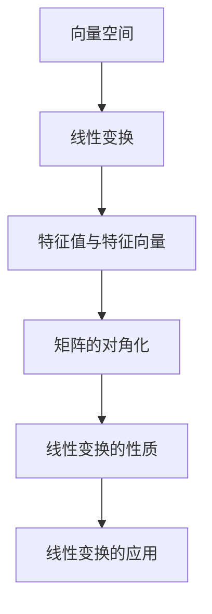

                 

# 线性代数导引：规范算子

关键词：线性代数，规范算子，特征值，特征向量，矩阵对角化，线性变换，线性空间

摘要：本文将深入探讨线性代数中的规范算子及其相关概念，包括特征值与特征向量、矩阵的对角化、线性变换的性质与应用，并通过实例展示其在图像处理和机器学习中的应用。本文旨在为读者提供线性代数领域的基本概念、算法原理和实用技巧，帮助读者更好地理解和应用规范算子。

### 目录大纲

#### 第一部分：线性代数基础

- **第1章：线性代数的基本概念**
  - 1.1 向量空间与线性变换
    - 1.1.1 向量与向量空间
    - 1.1.2 线性变换的概念
  - 1.2 线性方程组
    - 1.2.1 线性方程组的基本解法
    - 1.2.2 高斯消元法
  - 1.3 矩阵的运算
    - 1.3.1 矩阵的基本运算
    - 1.3.2 矩阵的秩与秩分解
  - 1.4 行列式
    - 1.4.1 行列式的定义与性质
    - 1.4.2 克莱姆法则

- **第2章：线性变换**
  - 2.1 特征值与特征向量
    - 2.1.1 特征值与特征向量的概念
    - 2.1.2 特征值与特征向量的计算
  - 2.2 矩阵的对角化
    - 2.2.1 对角化的概念
    - 2.2.2 矩阵对角化的方法
  - 2.3 线性变换的性质
    - 2.3.1 线性变换的基本性质
    - 2.3.2 线性变换的乘法与逆变换

#### 第二部分：线性空间与线性变换

- **第3章：线性空间**
  - 3.1 线性空间的定义与性质
    - 3.1.1 线性空间的定义
    - 3.1.2 线性空间的性质
  - 3.2 子空间与基
    - 3.2.1 子空间的定义与性质
    - 3.2.2 基与维度的概念
  - 3.3 线性映射
    - 3.3.1 线性映射的定义
    - 3.3.2 线性映射的性质

- **第4章：线性变换的应用**
  - 4.1 线性变换在几何中的应用
    - 4.1.1 向量空间的几何解释
    - 4.1.2 线性变换的几何意义
  - 4.2 线性变换在数值分析中的应用
    - 4.2.1 线性方程组的数值解法
    - 4.2.2 矩阵的特征值问题

#### 第三部分：特征值与特征向量

- **第5章：特征值与特征向量**
  - 5.1 特征值与特征向量的计算
    - 5.1.1 特征多项式与特征方程
    - 5.1.2 特征值的计算方法
  - 5.2 特征向量的性质与应用
    - 5.2.1 特征向量的性质
    - 5.2.2 特征向量在矩阵对角化中的应用

- **第6章：矩阵的对角化**
  - 6.1 矩阵对角化的基本概念
    - 6.1.1 对角化的概念
    - 6.1.2 对角化的条件
  - 6.2 矩阵对角化的方法
    - 6.2.1 相似矩阵的概念
    - 6.2.2 对角化的计算过程

#### 第四部分：线性变换的性质与应用

- **第7章：线性变换的性质与应用**
  - 7.1 线性变换的基本性质
    - 7.1.1 线性变换的加法与乘法
    - 7.1.2 线性变换的逆变换
  - 7.2 线性变换的应用
    - 7.2.1 线性变换在物理学中的应用
    - 7.2.2 线性变换在计算机科学中的应用

#### 第五部分：综合实例

- **第8章：综合实例**
  - 8.1 线性代数在图像处理中的应用
    - 8.1.1 图像的几何变换
    - 8.1.2 图像的滤波与边缘检测
  - 8.2 线性代数在机器学习中的应用
    - 8.2.1 特征提取
    - 8.2.2 数据降维

#### 附录

- **附录A：线性代数相关工具**
  - A.1 MatLab
  - A.2 NumPy
  - A.3 SciPy
  - A.4 其他相关工具

### 作者信息

作者：AI天才研究院/AI Genius Institute & 禅与计算机程序设计艺术 /Zen And The Art of Computer Programming

### 核心概念与联系

为了更好地理解规范算子的概念，我们可以通过以下Mermaid流程图来展示线性代数中的核心概念及其相互关系：



在接下来的内容中，我们将逐步深入探讨这些概念及其在实际应用中的重要性。

### 第1章：线性代数的基本概念

线性代数是数学中的一个重要分支，它研究向量、向量空间以及线性变换等概念。本章将介绍线性代数中的基础概念，包括向量空间与线性变换、线性方程组、矩阵的运算以及行列式。

#### 1.1 向量空间与线性变换

##### 1.1.1 向量与向量空间

在数学中，向量是一个具有大小和方向的量。通常用一个小写字母（如\( \mathbf{v} \)）表示向量，并用加粗的大写字母（如\( \mathbf{V} \)）表示向量空间。

向量空间是指一组向量的集合，这些向量满足以下性质：

1. 封闭性：向量空间中的向量在进行加法和数乘运算后仍然属于该向量空间。
2. 存在零向量：向量空间中存在一个零向量\( \mathbf{0} \)，使得对于任一向量\( \mathbf{v} \)，都有\( \mathbf{v} + \mathbf{0} = \mathbf{v} \)。
3. 存在相反向量：对于任一向量\( \mathbf{v} \)，都存在一个相反向量\( -\mathbf{v} \)，使得\( \mathbf{v} + (-\mathbf{v}) = \mathbf{0} \)。
4. 结合律：向量加法和数乘运算满足结合律，即\( (\mathbf{u} + \mathbf{v}) + \mathbf{w} = \mathbf{u} + (\mathbf{v} + \mathbf{w}) \)和\( (c_1 \cdot \mathbf{u}) \cdot (c_2 \cdot \mathbf{v}) = (c_1 \cdot c_2) \cdot (\mathbf{u} \cdot \mathbf{v}) \)。
5. 分配律：数乘运算满足对向量加法的分配律和对向量数乘运算的分配律，即\( c \cdot (\mathbf{u} + \mathbf{v}) = c \cdot \mathbf{u} + c \cdot \mathbf{v} \)和\( (c_1 + c_2) \cdot \mathbf{u} = c_1 \cdot \mathbf{u} + c_2 \cdot \mathbf{u} \)。

##### 1.1.2 线性变换的概念

线性变换是指将一个向量空间映射到另一个向量空间的一个函数。通常用\( L: \mathbf{V} \rightarrow \mathbf{W} \)表示，其中\( \mathbf{V} \)和\( \mathbf{W} \)是向量空间。

线性变换满足以下性质：

1. 线性性：对于任一向量\( \mathbf{v}_1, \mathbf{v}_2 \in \mathbf{V} \)和标量\( a, b \)，有\( L(a\mathbf{v}_1 + b\mathbf{v}_2) = aL(\mathbf{v}_1) + bL(\mathbf{v}_2) \)。

2. 均匀性：对于任一向量\( \mathbf{v} \in \mathbf{V} \)和标量\( a \)，有\( L(a\mathbf{v}) = aL(\mathbf{v}) \)。

#### 1.2 线性方程组

线性方程组是指由多个线性方程组成的集合。线性方程组可以用矩阵形式表示为：

\[ \mathbf{A}\mathbf{x} = \mathbf{b} \]

其中，\( \mathbf{A} \)是一个\( m \times n \)的矩阵，\( \mathbf{x} \)是一个\( n \)维的列向量，\( \mathbf{b} \)是一个\( m \)维的列向量。

##### 1.2.1 线性方程组的基本解法

线性方程组的基本解法包括代入法和消元法。

- **代入法**：从第一个方程中解出一个变量，然后将其代入其他方程中，逐个解出所有变量。
- **消元法**：通过加减消元，将方程组转化为下三角矩阵或上三角矩阵，然后逐个解出变量。

##### 1.2.2 高斯消元法

高斯消元法是一种常用的消元法，它通过逐列消元，将矩阵转化为行阶梯形式，然后回代求解。

高斯消元法的步骤如下：

1. 将系数矩阵和常数向量写成增广矩阵的形式。
2. 从第一列开始，对每一列进行消元，使得每一列的系数矩阵都变成一个单位矩阵。
3. 回代求解，从最后一行开始，逐行解出变量。

#### 1.3 矩阵的运算

矩阵的运算包括矩阵的加法、减法、数乘、乘法以及转置。

##### 1.3.1 矩阵的基本运算

- **矩阵加法**：两个矩阵对应元素相加。
\[ \mathbf{A} + \mathbf{B} = \begin{bmatrix} a_{11} & a_{12} & \cdots & a_{1n} \\ a_{21} & a_{22} & \cdots & a_{2n} \\ \vdots & \vdots & \ddots & \vdots \\ a_{m1} & a_{m2} & \cdots & a_{mn} \end{bmatrix} + \begin{bmatrix} b_{11} & b_{12} & \cdots & b_{1n} \\ b_{21} & b_{22} & \cdots & b_{2n} \\ \vdots & \vdots & \ddots & \vdots \\ b_{m1} & b_{m2} & \cdots & b_{mn} \end{bmatrix} = \begin{bmatrix} a_{11} + b_{11} & a_{12} + b_{12} & \cdots & a_{1n} + b_{1n} \\ a_{21} + b_{21} & a_{22} + b_{22} & \cdots & a_{2n} + b_{2n} \\ \vdots & \vdots & \ddots & \vdots \\ a_{m1} + b_{m1} & a_{m2} + b_{m2} & \cdots & a_{mn} + b_{mn} \end{bmatrix} \]

- **矩阵减法**：两个矩阵对应元素相减。
\[ \mathbf{A} - \mathbf{B} = \begin{bmatrix} a_{11} & a_{12} & \cdots & a_{1n} \\ a_{21} & a_{22} & \cdots & a_{2n} \\ \vdots & \vdots & \ddots & \vdots \\ a_{m1} & a_{m2} & \cdots & a_{mn} \end{bmatrix} - \begin{bmatrix} b_{11} & b_{12} & \cdots & b_{1n} \\ b_{21} & b_{22} & \cdots & b_{2n} \\ \vdots & \vdots & \ddots & \vdots \\ b_{m1} & b_{m2} & \cdots & b_{mn} \end{bmatrix} = \begin{bmatrix} a_{11} - b_{11} & a_{12} - b_{12} & \cdots & a_{1n} - b_{1n} \\ a_{21} - b_{21} & a_{22} - b_{22} & \cdots & a_{2n} - b_{2n} \\ \vdots & \vdots & \ddots & \vdots \\ a_{m1} - b_{m1} & a_{m2} - b_{m2} & \cdots & a_{mn} - b_{mn} \end{bmatrix} \]

- **矩阵数乘**：矩阵的每一个元素乘以一个标量。
\[ c\mathbf{A} = \begin{bmatrix} c_{11} & c_{12} & \cdots & c_{1n} \\ c_{21} & c_{22} & \cdots & c_{2n} \\ \vdots & \vdots & \ddots & \vdots \\ c_{m1} & c_{m2} & \cdots & c_{mn} \end{bmatrix} \]

- **矩阵乘法**：两个矩阵对应元素的乘积求和。
\[ \mathbf{A}\mathbf{B} = \begin{bmatrix} a_{11} & a_{12} & \cdots & a_{1n} \\ a_{21} & a_{22} & \cdots & a_{2n} \\ \vdots & \vdots & \ddots & \vdots \\ a_{m1} & a_{m2} & \cdots & a_{mn} \end{bmatrix} \begin{bmatrix} b_{11} & b_{12} & \cdots & b_{1n} \\ b_{21} & b_{22} & \cdots & b_{2n} \\ \vdots & \vdots & \ddots & \vdots \\ b_{m1} & b_{m2} & \cdots & b_{mn} \end{bmatrix} = \begin{bmatrix} \sum_{j=1}^{n} a_{1j}b_{j1} & \sum_{j=1}^{n} a_{1j}b_{j2} & \cdots & \sum_{j=1}^{n} a_{1j}b_{jn} \\ \sum_{j=1}^{n} a_{2j}b_{j1} & \sum_{j=1}^{n} a_{2j}b_{j2} & \cdots & \sum_{j=1}^{n} a_{2j}b_{jn} \\ \vdots & \vdots & \ddots & \vdots \\ \sum_{j=1}^{n} a_{mj}b_{j1} & \sum_{j=1}^{n} a_{mj}b_{j2} & \cdots & \sum_{j=1}^{n} a_{mj}b_{jn} \end{bmatrix} \]

- **矩阵转置**：将矩阵的行和列交换位置。
\[ \mathbf{A}^T = \begin{bmatrix} a_{11} & a_{21} & \cdots & a_{m1} \\ a_{12} & a_{22} & \cdots & a_{m2} \\ \vdots & \vdots & \ddots & \vdots \\ a_{1n} & a_{2n} & \cdots & a_{mn} \end{bmatrix} \]

##### 1.3.2 矩阵的秩与秩分解

矩阵的秩是指矩阵的行数或列数，即矩阵中非零行的最大数目。

矩阵的秩分解是指将矩阵分解为行变换矩阵和列变换矩阵的乘积。

\[ \mathbf{A} = \mathbf{P}\mathbf{Q} \]

其中，\( \mathbf{P} \)和\( \mathbf{Q} \)都是可逆矩阵。

#### 1.4 行列式

行列式是一个与矩阵相关的标量值，它可以用来判断矩阵的行列式是否为零、计算线性方程组的解以及矩阵的逆矩阵。

##### 1.4.1 行列式的定义与性质

行列式是一个方阵对角线元素的乘积之和的差。对于\( 2 \times 2 \)矩阵：

\[ \begin{vmatrix} a_{11} & a_{12} \\ a_{21} & a_{22} \end{vmatrix} = a_{11}a_{22} - a_{12}a_{21} \]

对于\( 3 \times 3 \)矩阵：

\[ \begin{vmatrix} a_{11} & a_{12} & a_{13} \\ a_{21} & a_{22} & a_{23} \\ a_{31} & a_{32} & a_{33} \end{vmatrix} = a_{11}(a_{22}a_{33} - a_{23}a_{32}) - a_{12}(a_{21}a_{33} - a_{23}a_{31}) + a_{13}(a_{21}a_{32} - a_{22}a_{31}) \]

行列式具有以下性质：

1. 交换两行或两列，行列式取相反数。
2. 如果一行或一列是另一行或一列的倍数，则行列式为零。
3. 行列式的值不变，当两行或两列互换位置时。

##### 1.4.2 克莱姆法则

克莱姆法则是一种求解线性方程组的公式，它基于行列式的性质。对于\( n \)个方程、\( n \)个未知数的线性方程组：

\[ \mathbf{A}\mathbf{x} = \mathbf{b} \]

其中，\( \mathbf{A} \)是一个\( n \times n \)的方阵，\( \mathbf{x} \)是一个\( n \)维的列向量，\( \mathbf{b} \)是一个\( n \)维的列向量。

方程组有唯一解的条件是\( \mathbf{A} \)的行列式不为零。

克莱姆法则的解为：

\[ x_i = \frac{\begin{vmatrix} b_{1} & a_{12} & \cdots & a_{1i} & \cdots & a_{1n} \\ b_{2} & a_{22} & \cdots & a_{2i} & \cdots & a_{2n} \\ \vdots & \vdots & \ddots & \vdots & \ddots & \vdots \\ b_{n} & a_{n2} & \cdots & a_{ni} & \cdots & a_{nn} \end{vmatrix}}{\begin{vmatrix} a_{11} & a_{12} & \cdots & a_{1n} \\ a_{21} & a_{22} & \cdots & a_{2n} \\ \vdots & \vdots & \ddots & \vdots \\ a_{n1} & a_{n2} & \cdots & a_{nn} \end{vmatrix}} \]

其中，\( i = 1, 2, \ldots, n \)。

### 第2章：线性变换

线性变换是线性代数中的一个重要概念，它描述了向量空间之间的映射关系。本章将深入探讨线性变换的核心概念，包括特征值与特征向量、矩阵的对角化、线性变换的性质和应用。

#### 2.1 特征值与特征向量

特征值和特征向量是线性变换中的重要概念，它们描述了线性变换在特定方向上的伸缩性质。

##### 2.1.1 特征值与特征向量的概念

给定一个线性变换\( L: \mathbf{V} \rightarrow \mathbf{W} \)，如果存在一个非零向量\( \mathbf{v} \in \mathbf{V} \)和一个标量\( \lambda \)，使得\( L(\mathbf{v}) = \lambda \mathbf{v} \)，则称\( \lambda \)为\( L \)的一个特征值，\( \mathbf{v} \)为对应的特征向量。

特征向量\( \mathbf{v} \)满足\( L(\mathbf{v}) = \lambda \mathbf{v} \)，即\( (\mathbf{A} - \lambda \mathbf{I})\mathbf{v} = \mathbf{0} \)，其中\( \mathbf{A} \)是线性变换\( L \)对应的矩阵，\( \mathbf{I} \)是单位矩阵。

##### 2.1.2 特征值与特征向量的计算

计算特征值和特征向量的一般步骤如下：

1. 求解特征多项式：计算矩阵\( \mathbf{A} - \lambda \mathbf{I} \)的特征多项式\( f(\lambda) = \det(\mathbf{A} - \lambda \mathbf{I}) \)。
2. 求解特征方程：解特征多项式得到特征值\( \lambda \)。
3. 计算特征向量：对于每个特征值\( \lambda \)，求解线性方程组\( (\mathbf{A} - \lambda \mathbf{I})\mathbf{v} = \mathbf{0} \)，得到对应的特征向量。

在数值计算中，特征多项式的求解通常采用幂法和QR算法等方法。

#### 2.2 矩阵的对角化

矩阵的对角化是将一个矩阵转换为对角矩阵的过程。对角化后的矩阵具有特征值作为对角线元素，特征向量作为对应的列向量。

##### 2.2.1 对角化的概念

对于\( n \times n \)矩阵\( \mathbf{A} \)，如果存在一个可逆矩阵\( \mathbf{P} \)，使得\( \mathbf{P}^{-1}\mathbf{A}\mathbf{P} \)为对角矩阵，则称\( \mathbf{A} \)可以对角化。

对角化矩阵\( \mathbf{A} \)的步骤如下：

1. 求解特征值和特征向量：计算\( \mathbf{A} \)的特征值和对应的特征向量。
2. 构造对角化矩阵：将特征向量作为列向量构成矩阵\( \mathbf{P} \)。
3. 计算对角矩阵：计算\( \mathbf{P}^{-1}\mathbf{A}\mathbf{P} \)。

##### 2.2.2 矩阵对角化的方法

矩阵对角化可以通过以下方法实现：

1. **幂法**：通过迭代计算矩阵的最大特征值和对应的特征向量。
2. **QR算法**：通过QR分解逐步逼近特征值和特征向量。
3. **雅可比方法**：通过迭代求解特征值和特征向量。

#### 2.3 线性变换的性质

线性变换具有一系列基本性质，包括加法、乘法和逆变换等。

##### 2.3.1 线性变换的基本性质

1. **加法**：对于两个线性变换\( L_1: \mathbf{V} \rightarrow \mathbf{W} \)和\( L_2: \mathbf{V} \rightarrow \mathbf{W} \)，存在线性变换\( L = L_1 + L_2 \)，满足\( L(\mathbf{v}) = L_1(\mathbf{v}) + L_2(\mathbf{v}) \)。
2. **乘法**：对于两个线性变换\( L_1: \mathbf{V} \rightarrow \mathbf{W} \)和\( L_2: \mathbf{W} \rightarrow \mathbf{Z} \)，存在线性变换\( L = L_1 \circ L_2 \)，满足\( L(\mathbf{v}) = L_1(L_2(\mathbf{v})) \)。
3. **逆变换**：对于线性变换\( L: \mathbf{V} \rightarrow \mathbf{W} \)，如果\( L \)是可逆的，则存在线性变换\( L^{-1}: \mathbf{W} \rightarrow \mathbf{V} \)，满足\( L^{-1}(L(\mathbf{v})) = \mathbf{v} \)和\( L(L^{-1}(\mathbf{w})) = \mathbf{w} \)。

##### 2.3.2 线性变换的乘法与逆变换

线性变换的乘法和逆变换可以通过矩阵的乘法和逆矩阵来实现。

1. **线性变换的乘法**：给定两个线性变换\( L_1: \mathbf{V} \rightarrow \mathbf{W} \)和\( L_2: \mathbf{W} \rightarrow \mathbf{Z} \)，对应的矩阵乘积\( \mathbf{B} = \mathbf{A}\mathbf{C} \)表示线性变换\( L_2 \circ L_1: \mathbf{V} \rightarrow \mathbf{Z} \)。
2. **线性变换的逆变换**：给定线性变换\( L: \mathbf{V} \rightarrow \mathbf{W} \)，对应的矩阵\( \mathbf{A} \)的逆矩阵\( \mathbf{A}^{-1} \)表示线性变换\( L^{-1}: \mathbf{W} \rightarrow \mathbf{V} \)。

#### 2.4 线性变换的应用

线性变换在许多领域都有广泛的应用，包括几何、数值分析和计算机科学。

##### 2.4.1 线性变换在几何中的应用

线性变换在几何中的应用包括向量空间的变换、坐标变换以及图像处理等。

1. **向量空间的变换**：线性变换可以将一个向量空间映射到另一个向量空间，从而改变向量的大小和方向。
2. **坐标变换**：通过线性变换，可以将一个坐标系统映射到另一个坐标系统，从而简化几何计算。
3. **图像处理**：线性变换在图像处理中用于图像的几何变换、滤波和边缘检测等。

##### 2.4.2 线性变换在数值分析中的应用

线性变换在数值分析中用于解决线性方程组、特征值问题和矩阵计算等。

1. **线性方程组的数值解法**：通过线性变换，可以将线性方程组转化为对角矩阵的形式，从而简化求解过程。
2. **特征值问题**：通过线性变换，可以将特征值问题转化为矩阵的对角化问题，从而方便求解特征值和特征向量。
3. **矩阵计算**：线性变换可以用于矩阵的乘法和逆矩阵的计算，从而提高计算效率。

##### 2.4.3 线性变换在计算机科学中的应用

线性变换在计算机科学中广泛应用于计算机图形学、机器学习和数据科学等领域。

1. **计算机图形学**：线性变换用于图像的几何变换、投影和纹理映射等。
2. **机器学习**：线性变换用于特征提取和数据降维，从而提高模型的学习效率和泛化能力。
3. **数据科学**：线性变换用于数据预处理和特征提取，从而提高数据分析的准确性和效率。

#### 2.5 线性变换的性质与应用

线性变换具有一系列重要性质，包括可加性、结合律、分配律和逆变换等。这些性质使得线性变换在数学和其他领域具有广泛的应用。

1. **可加性**：线性变换满足可加性，即对任意两个线性变换\( L_1 \)和\( L_2 \)，存在线性变换\( L = L_1 + L_2 \)，使得\( L(\mathbf{v}) = L_1(\mathbf{v}) + L_2(\mathbf{v}) \)。
2. **结合律**：线性变换满足结合律，即对任意三个线性变换\( L_1 \)、\( L_2 \)和\( L_3 \)，存在线性变换\( L = L_1 \circ L_2 \circ L_3 \)，使得\( L(\mathbf{v}) = L_1(L_2(L_3(\mathbf{v}))) \)。
3. **分配律**：线性变换满足分配律，即对任意两个线性变换\( L_1 \)和\( L_2 \)，以及任意向量\( \mathbf{v} \)和标量\( a \)，存在线性变换\( L = aL_1 + bL_2 \)，使得\( L(\mathbf{v}) = aL_1(\mathbf{v}) + bL_2(\mathbf{v}) \)。
4. **逆变换**：线性变换具有逆变换，即对于可逆线性变换\( L \)，存在逆变换\( L^{-1} \)，使得\( L^{-1}(L(\mathbf{v})) = \mathbf{v} \)和\( L(L^{-1}(\mathbf{w})) = \mathbf{w} \)。

通过这些性质，线性变换可以应用于各种领域，包括几何、数值分析和计算机科学等。

### 第3章：线性空间

线性空间是线性代数中的一个重要概念，它描述了一组向量的集合及其运算规则。本章将介绍线性空间的基本概念、性质、子空间和基等。

#### 3.1 线性空间的定义与性质

线性空间也称为向量空间，是一组向量的集合，这些向量满足线性运算规则。线性空间包括向量、加法和数乘运算，并具有封闭性、存在零向量、存在相反向量、结合律、交换律、分配律等性质。

##### 3.1.1 线性空间的定义

线性空间是指一个非空集合\( V \)，在这个集合中定义了两种运算：

1. 向量加法：对于任意的向量\( \mathbf{u}, \mathbf{v} \in V \)，存在一个唯一的向量\( \mathbf{w} \in V \)，使得\( \mathbf{w} = \mathbf{u} + \mathbf{v} \)。
2. 数乘运算：对于任意的向量\( \mathbf{v} \in V \)和标量\( a \)，存在一个唯一的向量\( \mathbf{w} \in V \)，使得\( \mathbf{w} = a\mathbf{v} \)。

此外，线性空间还满足以下性质：

1. 封闭性：向量加法和数乘运算的结果仍然属于线性空间。
2. 存在零向量：存在一个零向量\( \mathbf{0} \)，使得对于任一向量\( \mathbf{v} \in V \)，有\( \mathbf{v} + \mathbf{0} = \mathbf{v} \)。
3. 存在相反向量：对于任一向量\( \mathbf{v} \in V \)，存在一个相反向量\( -\mathbf{v} \)，使得\( \mathbf{v} + (-\mathbf{v}) = \mathbf{0} \)。
4. 结合律：向量加法和数乘运算满足结合律，即\( (\mathbf{u} + \mathbf{v}) + \mathbf{w} = \mathbf{u} + (\mathbf{v} + \mathbf{w}) \)和\( (c_1 \cdot \mathbf{u}) \cdot (c_2 \cdot \mathbf{v}) = (c_1 \cdot c_2) \cdot (\mathbf{u} \cdot \mathbf{v}) \)。
5. 分配律：数乘运算满足对向量加法的分配律和对向量数乘运算的分配律，即\( c \cdot (\mathbf{u} + \mathbf{v}) = c \cdot \mathbf{u} + c \cdot \mathbf{v} \)和\( (c_1 + c_2) \cdot \mathbf{u} = c_1 \cdot \mathbf{u} + c_2 \cdot \mathbf{u} \)。

##### 3.1.2 线性空间的性质

线性空间的性质包括：

1. **向量加法的交换律**：对于任意的向量\( \mathbf{u}, \mathbf{v} \in V \)，有\( \mathbf{u} + \mathbf{v} = \mathbf{v} + \mathbf{u} \)。
2. **向量加法的结合律**：对于任意的向量\( \mathbf{u}, \mathbf{v}, \mathbf{w} \in V \)，有\( (\mathbf{u} + \mathbf{v}) + \mathbf{w} = \mathbf{u} + (\mathbf{v} + \mathbf{w}) \)。
3. **数乘运算的交换律**：对于任意的向量\( \mathbf{u}, \mathbf{v} \in V \)和标量\( a, b \)，有\( a \cdot \mathbf{u} = b \cdot \mathbf{v} \)。
4. **数乘运算的结合律**：对于任意的向量\( \mathbf{u}, \mathbf{v} \in V \)和标量\( a, b, c \)，有\( (a \cdot b) \cdot \mathbf{u} = a \cdot (b \cdot \mathbf{v}) \)。
5. **数乘运算的分配律**：对于任意的向量\( \mathbf{u}, \mathbf{v} \in V \)和标量\( a, b \)，有\( a \cdot (\mathbf{u} + \mathbf{v}) = a \cdot \mathbf{u} + a \cdot \mathbf{v} \)和\( (a + b) \cdot \mathbf{u} = a \cdot \mathbf{u} + b \cdot \mathbf{u} \)。

#### 3.2 子空间与基

子空间是指线性空间的一个子集，它也满足线性空间的性质。基是线性空间中的一组向量，它们可以生成整个线性空间。

##### 3.2.1 子空间的定义与性质

子空间是指一个线性空间\( V \)的子集\( W \)，它也满足线性空间的性质。即：

1. \( W \)非空。
2. 对于任意的向量\( \mathbf{u}, \mathbf{v} \in W \)，有\( \mathbf{u} + \mathbf{v} \in W \)。
3. 对于任意的向量\( \mathbf{v} \in W \)和标量\( a \)，有\( a\mathbf{v} \in W \)。

子空间具有以下性质：

1. **封闭性**：子空间中的向量进行加法和数乘运算的结果仍然属于子空间。
2. **包含零向量**：子空间中包含零向量\( \mathbf{0} \)。
3. **包含相反向量**：子空间中对于任意向量\( \mathbf{v} \)，都存在一个相反向量\( -\mathbf{v} \)。

##### 3.2.2 基与维度的概念

基是指线性空间中的一组线性无关的向量，它们可以生成整个线性空间。一个线性空间的基的个数称为该线性空间的维度。

1. **基的定义**：设\( \mathbf{v}_1, \mathbf{v}_2, \ldots, \mathbf{v}_n \)是线性空间\( V \)的一组向量，如果这组向量线性无关，并且对于任一向量\( \mathbf{v} \in V \)，都存在唯一的\( a_1, a_2, \ldots, a_n \)使得\( \mathbf{v} = a_1\mathbf{v}_1 + a_2\mathbf{v}_2 + \ldots + a_n\mathbf{v}_n \)，则称\( \mathbf{v}_1, \mathbf{v}_2, \ldots, \mathbf{v}_n \)是\( V \)的一个基。

2. **维度的定义**：线性空间的基的个数称为该线性空间的维度。线性空间的维度也称为该线性空间的秩。

3. **基的性质**：基是一组线性无关的向量，它们可以生成整个线性空间。对于任意线性空间\( V \)，都存在一个基，并且不同的基之间的向量个数相等。

#### 3.3 线性映射

线性映射是指从线性空间\( V \)到线性空间\( W \)的一个函数，它保持线性运算的规则。

##### 3.3.1 线性映射的定义

线性映射是指一个函数\( f: V \rightarrow W \)，它将线性空间\( V \)中的向量映射到线性空间\( W \)中，并满足以下条件：

1. 对于任意的向量\( \mathbf{u}, \mathbf{v} \in V \)，有\( f(\mathbf{u} + \mathbf{v}) = f(\mathbf{u}) + f(\mathbf{v}) \)。
2. 对于任意的向量\( \mathbf{v} \in V \)和标量\( a \)，有\( f(a\mathbf{v}) = af(\mathbf{v}) \)。

##### 3.3.2 线性映射的性质

线性映射具有以下性质：

1. **加法**：对于任意的线性映射\( f_1: V \rightarrow W \)和\( f_2: V \rightarrow W \)，有\( f_1 + f_2: V \rightarrow W \)，满足\( (f_1 + f_2)(\mathbf{v}) = f_1(\mathbf{v}) + f_2(\mathbf{v}) \)。
2. **乘法**：对于任意的线性映射\( f: V \rightarrow W \)和标量\( a \)，有\( af: V \rightarrow W \)，满足\( (af)(\mathbf{v}) = af(\mathbf{v}) \)。
3. **恒等映射**：存在恒等映射\( \text{id}: V \rightarrow V \)，满足\( \text{id}(\mathbf{v}) = \mathbf{v} \)。
4. **逆映射**：如果线性映射\( f: V \rightarrow W \)是双射，则存在逆映射\( f^{-1}: W \rightarrow V \)，满足\( f^{-1}(f(\mathbf{v})) = \mathbf{v} \)和\( f(f^{-1}(\mathbf{w})) = \mathbf{w} \)。

### 第4章：线性变换的应用

线性变换在许多领域都有广泛的应用，包括几何、数值分析和计算机科学等。本章将探讨线性变换在这些领域的应用。

#### 4.1 线性变换在几何中的应用

线性变换在几何中有着重要的应用，包括向量空间的变换、坐标变换以及图像处理等。

##### 4.1.1 向量空间的几何解释

向量空间的几何解释是指将向量空间的线性运算和几何变换联系起来。例如，向量加法和数乘运算可以解释为向量的平移和缩放。

向量加法可以解释为向量的平行四边形法则，即两个向量相加得到一个新的向量，这个新向量是这两个向量的终点和起点的连线。

数乘运算可以解释为向量的伸缩变换，即向量乘以一个标量得到一个新的向量，这个新向量的大小和方向是原向量的标量的倍数。

##### 4.1.2 线性变换的几何意义

线性变换在几何中具有以下几何意义：

1. **线性变换可以将一个向量空间映射到另一个向量空间**：例如，一个线性变换可以将二维平面映射到三维空间。

2. **线性变换可以改变向量的大小和方向**：例如，一个线性变换可以将一个向量拉伸或压缩，使其长度发生变化。

3. **线性变换可以保持向量之间的角度和形状**：例如，一个线性变换可以将一个向量旋转或反射，使其方向发生变化，但角度保持不变。

4. **线性变换可以生成新的向量空间**：例如，通过矩阵乘法，可以将一个二维向量映射到一个三维向量空间。

#### 4.2 线性变换在数值分析中的应用

线性变换在数值分析中有着广泛的应用，包括线性方程组的数值解法、特征值问题和矩阵计算等。

##### 4.2.1 线性方程组的数值解法

线性方程组的数值解法是指使用数值方法求解线性方程组的过程。常用的方法包括高斯消元法、迭代法和矩阵分解法等。

1. **高斯消元法**：高斯消元法是一种基于矩阵行变换的方法，通过消元将线性方程组转化为上三角矩阵或下三角矩阵，然后回代求解。

2. **迭代法**：迭代法是指通过迭代计算逼近线性方程组的解。常用的迭代法包括雅可比迭代法、高斯-赛德尔迭代法等。

3. **矩阵分解法**：矩阵分解法是指将线性方程组对应的矩阵分解为多个简单矩阵的乘积，然后求解每个矩阵对应的线性方程组，最终得到原线性方程组的解。

##### 4.2.2 矩阵的特征值问题

矩阵的特征值问题是指求解矩阵的特征值和特征向量的问题。特征值和特征向量在数值分析中有着重要的应用，例如矩阵对角化、数值稳定性和图像处理等。

1. **特征多项式与特征方程**：特征多项式是指矩阵\( A \)的特征值\( \lambda \)满足的方程\( \det(A - \lambda I) = 0 \)。解特征多项式得到矩阵\( A \)的特征值。

2. **特征值的计算方法**：特征值的计算方法包括幂法、QR算法和雅可比方法等。幂法是指通过迭代计算矩阵的最大特征值和对应的特征向量。QR算法是指通过迭代计算矩阵的所有特征值和特征向量。雅可比方法是指通过迭代计算矩阵的特征值和特征向量。

3. **特征向量的性质与应用**：特征向量具有以下性质：

   - 特征向量对应于特征值\( \lambda \)的线性方程组\( (A - \lambda I)\mathbf{v} = \mathbf{0} \)有唯一解。
   - 特征向量与原矩阵\( A \)的行空间和列空间有关。
   - 特征向量在矩阵对角化中具有重要作用。

   特征向量在数值分析中的应用包括矩阵对角化、数值稳定性和图像处理等。

### 第5章：特征值与特征向量

特征值与特征向量是线性代数中的重要概念，它们描述了线性变换在特定方向上的伸缩性质。本章将详细介绍特征值与特征向量的计算方法、性质及其在实际应用中的重要性。

#### 5.1 特征值与特征向量的计算

特征值与特征向量的计算是线性代数中的一个关键问题。为了求解特征值与特征向量，我们需要以下几个步骤：

##### 5.1.1 特征多项式与特征方程

给定一个\( n \times n \)矩阵\( A \)，其特征多项式定义为：

\[ f(\lambda) = \det(A - \lambda I) \]

其中，\( I \)是\( n \times n \)的单位矩阵。

特征多项式是一个关于\( \lambda \)的\( n \)次多项式。特征方程是指：

\[ \det(A - \lambda I) = 0 \]

求解特征方程，我们可以得到矩阵\( A \)的所有特征值\( \lambda_1, \lambda_2, \ldots, \lambda_n \)。

##### 5.1.2 特征值的计算方法

计算特征值的方法包括幂法、QR算法、雅可比方法等。下面我们简要介绍这些方法：

1. **幂法**：幂法是一种迭代方法，用于求解矩阵的最大特征值和对应的特征向量。具体步骤如下：

   - 选择一个初始向量\( \mathbf{v}_0 \)。
   - 计算矩阵\( A \)的幂\( A^k \)。
   - 计算当前特征向量和特征值：

     \[ \mathbf{v}_k = \frac{A^k \mathbf{v}_0}{\|\mathbf{v}_0\|} \]
     \[ \lambda_k = \frac{\mathbf{v}_0^T A^k \mathbf{v}_0}{\mathbf{v}_0^T \mathbf{v}_0} \]

   - 更新初始向量：

     \[ \mathbf{v}_{k+1} = \frac{A \mathbf{v}_k}{\|\mathbf{v}_k\|} \]

   - 重复上述步骤，直到收敛。

2. **QR算法**：QR算法是一种迭代方法，用于求解矩阵的所有特征值和特征向量。具体步骤如下：

   - 将矩阵\( A \)分解为\( A = QR \)，其中\( Q \)是正交矩阵，\( R \)是上三角矩阵。
   - 计算矩阵\( R \)的特征值和特征向量。
   - 将特征值和特征向量与\( Q \)相乘，得到\( A \)的特征值和特征向量。

3. **雅可比方法**：雅可比方法是一种迭代方法，用于求解矩阵的对角化问题。具体步骤如下：

   - 初始时，设\( A_0 = A \)。
   - 计算矩阵\( A_k \)的特征多项式\( f_k(\lambda) = \det(A_k - \lambda I) \)。
   - 解特征多项式得到特征值\( \lambda_k \)。
   - 计算特征向量：

     \[ \mathbf{v}_k = \frac{(A_k - \lambda_k I)^{-1} \mathbf{e}_k}{\|\mathbf{e}_k\|} \]

     其中，\( \mathbf{e}_k \)是单位向量。

   - 更新矩阵：

     \[ A_{k+1} = A_k - \lambda_k \mathbf{v}_k \mathbf{v}_k^T \]

   - 重复上述步骤，直到收敛。

#### 5.1.3 特征向量的计算

对于每个特征值\( \lambda_k \)，我们需要求解线性方程组：

\[ (A - \lambda_k I)\mathbf{v} = \mathbf{0} \]

这个方程组的解就是对应的特征向量\( \mathbf{v}_k \)。

##### 5.1.4 特征值的计算举例

考虑一个\( 2 \times 2 \)矩阵：

\[ A = \begin{bmatrix} 2 & 1 \\ 1 & 2 \end{bmatrix} \]

首先，计算其特征多项式：

\[ f(\lambda) = \det(A - \lambda I) = \det\begin{bmatrix} 2 - \lambda & 1 \\ 1 & 2 - \lambda \end{bmatrix} = (2 - \lambda)^2 - 1 = \lambda^2 - 4\lambda + 3 \]

然后，解特征多项式：

\[ f(\lambda) = 0 \Rightarrow \lambda^2 - 4\lambda + 3 = 0 \]

得到特征值：

\[ \lambda_1 = 1, \quad \lambda_2 = 3 \]

对于每个特征值，求解线性方程组：

对于\( \lambda_1 = 1 \)：

\[ (A - I)\mathbf{v} = \begin{bmatrix} 1 & 1 \\ 1 & 1 \end{bmatrix}\mathbf{v} = \mathbf{0} \]

解得特征向量：

\[ \mathbf{v}_1 = \begin{bmatrix} 1 \\ -1 \end{bmatrix} \]

对于\( \lambda_2 = 3 \)：

\[ (A - 3I)\mathbf{v} = \begin{bmatrix} -1 & 1 \\ 1 & -1 \end{bmatrix}\mathbf{v} = \mathbf{0} \]

解得特征向量：

\[ \mathbf{v}_2 = \begin{bmatrix} 1 \\ 1 \end{bmatrix} \]

因此，矩阵\( A \)的特征值为\( 1 \)和\( 3 \)，对应的特征向量分别为\( \mathbf{v}_1 = \begin{bmatrix} 1 \\ -1 \end{bmatrix} \)和\( \mathbf{v}_2 = \begin{bmatrix} 1 \\ 1 \end{bmatrix} \)。

##### 5.1.5 特征值的计算复杂度

计算特征值和特征向量的复杂度取决于矩阵的大小和算法的选择。通常情况下，计算\( n \times n \)矩阵的特征值和特征向量的复杂度为\( O(n^3) \)。

#### 5.2 特征向量的性质与应用

特征向量具有以下重要性质：

1. **线性无关性**：特征向量是线性无关的，即不同特征向量之间不共线。
2. **不变性**：对于任意线性变换\( L \)，其对应的特征向量仍然是\( L \)的特征向量。
3. **正交性**：如果矩阵\( A \)是正交矩阵，则其特征向量是正交的。

特征向量在数学和工程领域有着广泛的应用：

1. **矩阵对角化**：特征向量可以用于矩阵对角化，即将矩阵\( A \)表示为\( A = PDP^{-1} \)，其中\( P \)是特征向量构成的矩阵，\( D \)是对角矩阵。
2. **数值稳定性**：特征向量可以用于分析矩阵的数值稳定性，即通过特征值分析确定系统的稳定性和响应特性。
3. **图像处理**：在图像处理中，特征向量可以用于图像的特征提取和降维，从而提高图像的处理效率和准确性。

#### 5.3 特征向量在矩阵对角化中的应用

矩阵对角化是将矩阵表示为对角矩阵的过程，其对角线上的元素是对应的特征值。特征向量在矩阵对角化中起着关键作用。

##### 5.3.1 矩阵对角化的概念

给定一个\( n \times n \)矩阵\( A \)，如果存在一个可逆矩阵\( P \)，使得：

\[ A = PDP^{-1} \]

其中，\( D \)是一个对角矩阵，其主对角线上的元素是\( A \)的特征值，则称矩阵\( A \)可以被对角化。

##### 5.3.2 矩阵对角化的计算步骤

1. **计算特征值**：计算矩阵\( A \)的特征值。
2. **计算特征向量**：对于每个特征值，计算对应的特征向量。
3. **构造对角矩阵**：将特征值按顺序排列在对角线上，构造对角矩阵\( D \)。
4. **构造可逆矩阵**：将特征向量作为列向量构造矩阵\( P \)。
5. **计算对角化结果**：计算\( A = PDP^{-1} \)。

##### 5.3.3 矩阵对角化的应用

矩阵对角化在多个领域有着重要的应用：

1. **数值分析**：通过矩阵对角化，可以将复杂的矩阵运算转化为对角矩阵运算，从而提高计算效率。
2. **信号处理**：在信号处理中，特征值和特征向量可以用于信号的特征提取和降维。
3. **图像处理**：在图像处理中，特征值和特征向量可以用于图像的特征提取和降维，从而提高图像的处理效率和准确性。

#### 5.4 特征向量在数值稳定性分析中的应用

特征向量可以用于分析系统的数值稳定性，即通过特征值分析确定系统的稳定性和响应特性。

1. **线性系统**：在线性系统中，系统的稳定性取决于特征值的实部。如果所有特征值的实部都小于零，则系统是稳定的。
2. **数值方法**：在数值计算中，特征值和特征向量可以用于分析数值方法的稳定性和收敛性。

#### 5.5 特征向量在图像处理中的应用

在图像处理中，特征向量可以用于图像的特征提取和降维，从而提高图像的处理效率和准确性。

1. **特征提取**：通过计算图像的协方差矩阵，可以得到图像的特征向量，这些特征向量代表了图像的主要特征。
2. **降维**：通过特征向量，可以将高维图像数据降维到低维空间，从而提高图像处理的速度和准确性。

### 第6章：矩阵的对角化

矩阵的对角化是线性代数中的一个重要概念，它涉及将矩阵表示为对角矩阵的过程。本章将详细介绍矩阵对角化的基本概念、方法及其在实际应用中的重要性。

#### 6.1 矩阵对角化的基本概念

矩阵对角化是指将一个矩阵表示为对角矩阵的形式，即：

\[ A = PDP^{-1} \]

其中，\( A \)是原矩阵，\( P \)是特征向量构成的矩阵，\( D \)是对角矩阵，其对角线上的元素是矩阵\( A \)的特征值。矩阵对角化在理论研究和实际应用中具有重要意义。

#### 6.1.1 对角化的概念

对角化是一种将矩阵分解为对角矩阵的过程。给定一个\( n \times n \)矩阵\( A \)，如果存在一个可逆矩阵\( P \)，使得：

\[ A = PDP^{-1} \]

其中，\( D \)是一个对角矩阵，其主对角线上的元素是\( A \)的特征值，则称矩阵\( A \)可以被对角化。

#### 6.1.2 对角化的条件

并非所有矩阵都可以对角化。矩阵\( A \)对角化的条件如下：

1. 矩阵\( A \)必须是方阵，即行数和列数相等。
2. 矩阵\( A \)必须有\( n \)个线性无关的特征向量。

如果矩阵\( A \)满足上述条件，则存在可逆矩阵\( P \)，使得\( A \)可以对角化为\( A = PDP^{-1} \)。

#### 6.2 矩阵对角化的方法

矩阵对角化的方法包括特征值法、幂法、雅可比法等。下面将介绍这些方法。

##### 6.2.1 特征值法

特征值法是一种常用的对角化方法，其基本步骤如下：

1. 计算矩阵\( A \)的特征多项式：
\[ f(\lambda) = \det(A - \lambda I) \]

2. 求解特征多项式，得到矩阵\( A \)的特征值。

3. 对于每个特征值\( \lambda_k \)，求解线性方程组：
\[ (A - \lambda_k I)\mathbf{v} = \mathbf{0} \]

得到对应的特征向量\( \mathbf{v}_k \)。

4. 将所有特征向量作为列向量构成矩阵\( P \)。

5. 计算对角矩阵\( D \)，其对角线上的元素是矩阵\( A \)的特征值。

6. 计算矩阵\( P^{-1} \)。

7. 计算对角化结果：
\[ A = PDP^{-1} \]

##### 6.2.2 幂法

幂法是一种迭代方法，用于求解矩阵的最大特征值和对应的特征向量。其基本步骤如下：

1. 选择一个初始向量\( \mathbf{v}_0 \)。

2. 计算矩阵\( A \)的幂\( A^k \)。

3. 计算当前特征向量和特征值：
\[ \mathbf{v}_k = \frac{A^k \mathbf{v}_0}{\|\mathbf{v}_0\|} \]
\[ \lambda_k = \frac{\mathbf{v}_0^T A^k \mathbf{v}_0}{\mathbf{v}_0^T \mathbf{v}_0} \]

4. 更新初始向量：
\[ \mathbf{v}_{k+1} = \frac{A \mathbf{v}_k}{\|\mathbf{v}_k\|} \]

5. 重复上述步骤，直到收敛。

##### 6.2.3 雅可比法

雅可比法是一种迭代方法，用于求解矩阵的对角化问题。其基本步骤如下：

1. 初始时，设\( A_0 = A \)。

2. 计算矩阵\( A_k \)的特征多项式：
\[ f_k(\lambda) = \det(A_k - \lambda I) \]

3. 解特征多项式得到特征值\( \lambda_k \)。

4. 计算特征向量：
\[ \mathbf{v}_k = \frac{(A_k - \lambda_k I)^{-1} \mathbf{e}_k}{\|\mathbf{e}_k\|} \]

5. 更新矩阵：
\[ A_{k+1} = A_k - \lambda_k \mathbf{v}_k \mathbf{v}_k^T \]

6. 重复上述步骤，直到收敛。

#### 6.3 矩阵对角化的应用

矩阵对角化在许多领域都有广泛的应用，包括数值分析、信号处理、图像处理等。

##### 6.3.1 数值分析

在数值分析中，矩阵对角化可以用于求解线性方程组、特征值问题和矩阵计算等问题。

1. **线性方程组的数值解法**：通过矩阵对角化，可以将线性方程组转化为对角矩阵的形式，从而简化求解过程。

2. **特征值问题**：通过矩阵对角化，可以方便地求解矩阵的特征值和特征向量，从而分析系统的稳定性和响应特性。

3. **矩阵计算**：通过矩阵对角化，可以高效地计算矩阵的逆矩阵、乘法和除法等运算。

##### 6.3.2 信号处理

在信号处理中，矩阵对角化可以用于信号的特征提取和降维。

1. **信号的特征提取**：通过计算信号的协方差矩阵，可以得到信号的特征向量，这些特征向量代表了信号的主要特征。

2. **信号的降维**：通过特征向量，可以将高维信号数据降维到低维空间，从而提高信号处理的速度和准确性。

##### 6.3.3 图像处理

在图像处理中，矩阵对角化可以用于图像的特征提取和降维。

1. **图像的特征提取**：通过计算图像的协方差矩阵，可以得到图像的特征向量，这些特征向量代表了图像的主要特征。

2. **图像的降维**：通过特征向量，可以将高维图像数据降维到低维空间，从而提高图像处理的速度和准确性。

### 第7章：线性变换的性质与应用

线性变换是线性代数中的核心概念，它在数学、物理学和工程学等领域有着广泛的应用。本章将深入探讨线性变换的性质和应用，包括线性变换的基本性质、乘法和逆变换，以及它们在不同领域的具体应用。

#### 7.1 线性变换的基本性质

线性变换具有一系列基本性质，这些性质使得线性变换在数学和工程中具有强大的工具性。以下是线性变换的基本性质：

1. **加法性**：对于任意的线性变换\( L_1 \)和\( L_2 \)，存在线性变换\( L = L_1 + L_2 \)，使得\( L(\mathbf{v}) = L_1(\mathbf{v}) + L_2(\mathbf{v}) \)。

2. **结合律**：对于任意的线性变换\( L_1 \)、\( L_2 \)和\( L_3 \)，存在线性变换\( L = L_1 \circ L_2 \circ L_3 \)，使得\( L(\mathbf{v}) = L_1(L_2(L_3(\mathbf{v}))) \)。

3. **分配律**：对于任意的线性变换\( L_1 \)和\( L_2 \)，以及任意的向量\( \mathbf{v} \)和标量\( a \)，存在线性变换\( L = aL_1 + bL_2 \)，使得\( L(\mathbf{v}) = aL_1(\mathbf{v}) + bL_2(\mathbf{v}) \)。

4. **可逆性**：对于可逆的线性变换\( L \)，存在线性变换\( L^{-1} \)，使得\( L^{-1}(L(\mathbf{v})) = \mathbf{v} \)。

这些性质使得线性变换可以组合、分解和简化，从而在复杂的系统中分析和解决问题。

#### 7.2 线性变换的乘法与逆变换

线性变换的乘法和逆变换是线性代数中非常重要的操作。

1. **线性变换的乘法**：给定两个线性变换\( L_1: \mathbf{V} \rightarrow \mathbf{W} \)和\( L_2: \mathbf{W} \rightarrow \mathbf{Z} \)，存在线性变换\( L = L_1 \circ L_2: \mathbf{V} \rightarrow \mathbf{Z} \)，使得\( L(\mathbf{v}) = L_1(L_2(\mathbf{v})) \)。线性变换的乘法可以通过矩阵的乘法来实现。

   例如，如果\( L_1 \)和\( L_2 \)对应的矩阵分别为\( A \)和\( B \)，那么\( L \)对应的矩阵为\( AB \)。

2. **线性变换的逆变换**：对于可逆的线性变换\( L: \mathbf{V} \rightarrow \mathbf{W} \)，存在线性变换\( L^{-1}: \mathbf{W} \rightarrow \mathbf{V} \)，使得\( L^{-1}(L(\mathbf{v})) = \mathbf{v} \)和\( L(L^{-1}(\mathbf{w})) = \mathbf{w} \)。线性变换的逆变换可以通过矩阵的逆矩阵来实现。

   如果\( L \)对应的矩阵为\( A \)，且\( A \)可逆，那么\( L^{-1} \)对应的矩阵为\( A^{-1} \)。

#### 7.3 线性变换在物理学中的应用

线性变换在物理学中有着广泛的应用，特别是在力学、电磁学和量子物理等领域。

1. **力学**：在经典力学中，线性变换可以用于描述刚体运动。例如，刚体的旋转可以通过线性变换来实现，其中旋转矩阵描述了刚体的旋转方向和角度。

2. **电磁学**：在电磁学中，线性变换可以用于描述电磁场的变换。例如，电磁波的传播可以通过线性变换来描述，其中传播矩阵描述了电磁波的传播方向和频率。

3. **量子物理**：在量子物理中，线性变换是量子力学的基础。量子态的演化可以通过线性变换来描述，其中哈密顿矩阵描述了量子态的能量和动力学。

#### 7.4 线性变换在计算机科学中的应用

线性变换在计算机科学中同样有着广泛的应用，特别是在图像处理、机器学习和算法设计等领域。

1. **图像处理**：在图像处理中，线性变换可以用于图像的变换和滤波。例如，图像的旋转、缩放和滤波可以通过线性变换来实现。

2. **机器学习**：在机器学习中，线性变换可以用于特征提取和数据降维。例如，主成分分析（PCA）通过线性变换提取数据的主要特征，从而实现数据降维。

3. **算法设计**：在算法设计中，线性变换可以用于优化算法的时间和空间复杂度。例如，矩阵乘法的优化算法（如Strassen算法）利用了线性变换来提高计算效率。

#### 7.5 线性变换的应用实例

下面我们通过一个具体实例来展示线性变换的应用。

假设我们有一个\( 2 \times 2 \)的矩阵：

\[ A = \begin{bmatrix} 2 & 1 \\ 1 & 2 \end{bmatrix} \]

首先，我们需要计算其特征值和特征向量。

1. **计算特征多项式**：

\[ f(\lambda) = \det(A - \lambda I) = \det\begin{bmatrix} 2 - \lambda & 1 \\ 1 & 2 - \lambda \end{bmatrix} = (\lambda - 1)^2 \]

2. **解特征多项式**：

\[ f(\lambda) = 0 \Rightarrow (\lambda - 1)^2 = 0 \]

得到特征值：

\[ \lambda_1 = \lambda_2 = 1 \]

3. **计算特征向量**：

对于特征值\( \lambda = 1 \)，我们需要解方程：

\[ (A - I)\mathbf{v} = \begin{bmatrix} 1 & 1 \\ 1 & 1 \end{bmatrix}\mathbf{v} = \mathbf{0} \]

解得特征向量：

\[ \mathbf{v}_1 = \begin{bmatrix} 1 \\ -1 \end{bmatrix} \]

4. **矩阵对角化**：

由于矩阵\( A \)有两个线性无关的特征向量，我们可以将其对角化为：

\[ A = PDP^{-1} \]

其中，\( P \)是对应特征向量构成的矩阵：

\[ P = \begin{bmatrix} 1 & 1 \\ -1 & 1 \end{bmatrix} \]

对角矩阵\( D \)：

\[ D = \begin{bmatrix} 1 & 0 \\ 0 & 1 \end{bmatrix} \]

因此，我们有：

\[ A = PDP^{-1} = \begin{bmatrix} 1 & 1 \\ -1 & 1 \end{bmatrix}\begin{bmatrix} 1 & 0 \\ 0 & 1 \end{bmatrix}\begin{bmatrix} 1 & -1 \\ 1 & 1 \end{bmatrix} = \begin{bmatrix} 2 & 1 \\ 1 & 2 \end{bmatrix} \]

#### 7.6 小结

线性变换是线性代数中的核心概念，它在数学、物理学和计算机科学等领域有着广泛的应用。通过本章的介绍，我们了解了线性变换的基本性质、乘法和逆变换，以及它们在不同领域的应用。线性变换作为一种强有力的工具，可以帮助我们分析和解决复杂的数学和工程问题。

### 第8章：综合实例

线性代数在图像处理和机器学习中的应用非常广泛，本章将通过具体实例展示线性代数在图像处理和机器学习中的实际应用，包括图像的几何变换、滤波与边缘检测，以及特征提取和数据降维。

#### 8.1 线性代数在图像处理中的应用

##### 8.1.1 图像的几何变换

图像的几何变换是指对图像进行旋转、缩放、平移等操作。这些操作可以通过线性变换来实现。

1. **旋转**：给定一个图像矩阵\( I \)，我们可以通过旋转矩阵\( R \)将其旋转一定角度。旋转矩阵\( R \)定义为：

   \[ R = \begin{bmatrix}
   \cos \theta & -\sin \theta \\
   \sin \theta & \cos \theta
   \end{bmatrix} \]

   通过矩阵乘法，我们可以计算旋转后的图像矩阵：

   \[ I' = R \cdot I \]

2. **缩放**：缩放是指将图像矩阵的每个像素值乘以一个标量。假设缩放因子为\( k \)，则缩放后的图像矩阵\( I' \)为：

   \[ I' = k \cdot I \]

3. **平移**：平移是指将图像矩阵沿x轴和y轴方向移动一定距离。假设平移向量\( \mathbf{t} = (t_x, t_y) \)，则平移后的图像矩阵\( I' \)为：

   \[ I' = I + \mathbf{t} \]

##### 8.1.2 图像的滤波与边缘检测

图像的滤波与边缘检测是图像处理中的重要任务，这些任务可以通过线性变换来实现。

1. **滤波**：滤波是指通过卷积操作去除图像中的噪声。给定一个滤波器\( F \)，我们可以通过卷积操作对图像进行滤波。滤波器\( F \)是一个\( m \times n \)的矩阵，卷积操作定义为：

   \[ (F \cdot I)_i = \sum_{j=1}^{m} \sum_{k=1}^{n} F_{jk} \cdot I_{i-j+1, k-j+1} \]

   其中，\( (F \cdot I)_i \)是滤波后的图像矩阵的第\( i \)个元素，\( I_{i-j+1, k-j+1} \)是原始图像矩阵的第\( (i-j+1, k-j+1) \)个元素。

2. **边缘检测**：边缘检测是指检测图像中的边缘。Sobel算子是一种常用的边缘检测算法，它通过计算图像的梯度来检测边缘。Sobel算子由两个\( 3 \times 3 \)的滤波器组成，分别用于计算水平和垂直方向的梯度。假设水平滤波器为\( F_x \)，垂直滤波器为\( F_y \)，则Sobel算子定义为：

   \[ F_x = \begin{bmatrix}
   1 & 0 & -1 \\
   2 & 0 & -2 \\
   1 & 0 & -1
   \end{bmatrix}, \quad
   F_y = \begin{bmatrix}
   1 & 2 & 1 \\
   0 & 0 & 0 \\
   -1 & -2 & -1
   \end{bmatrix} \]

   通过卷积操作，我们可以计算水平和垂直方向的梯度，然后计算梯度的大小：

   \[ \text{gradient} = \sqrt{(F_x \cdot I)^2 + (F_y \cdot I)^2} \]

   梯度大的区域被认为是边缘。

#### 8.2 线性代数在机器学习中的应用

##### 8.2.1 特征提取

特征提取是指从数据中提取出具有代表性的特征，以便进行模型训练和预测。主成分分析（PCA）是一种常用的特征提取方法，它通过线性变换将数据投影到新的坐标系中，从而提取出主要特征。

1. **协方差矩阵**：给定一个\( n \times d \)的数据矩阵\( X \)，其协方差矩阵\( \Sigma \)定义为：

   \[ \Sigma = \frac{1}{n-1} \sum_{i=1}^{n} (X_i - \mu)(X_i - \mu)^T \]

   其中，\( \mu \)是\( X \)的均值矩阵。

2. **特征值与特征向量**：计算协方差矩阵\( \Sigma \)的特征值和特征向量，特征值对应于新的坐标轴的长度，特征向量对应于新的坐标轴的方向。

3. **数据投影**：将原始数据\( X \)投影到新的坐标系中，即：

   \[ Y = P \cdot X \]

   其中，\( P \)是对应特征向量构成的矩阵。

##### 8.2.2 数据降维

数据降维是指减少数据的维度，以便提高计算效率和模型性能。主成分分析（PCA）是一种常用的数据降维方法，它通过保留主要特征，从而减少数据的维度。

1. **保留主要特征**：根据特征值的大小，选择前\( k \)个主要特征，构成新的特征矩阵\( P_k \)。

2. **降维**：将原始数据\( X \)投影到新的坐标系中，即：

   \[ Y_k = P_k \cdot X \]

   其中，\( Y_k \)是降维后的数据。

通过特征提取和数据降维，我们可以简化数据结构，提高模型的效率和准确性。

### 8.3 小结

线性代数在图像处理和机器学习中的应用非常广泛，本章通过具体实例展示了线性代数在图像的几何变换、滤波与边缘检测，以及特征提取和数据降维中的应用。线性代数为图像处理和机器学习提供了强大的工具，使得我们可以更有效地分析和处理复杂数据。

### 附录A：线性代数相关工具

在线性代数的计算和应用中，使用一些工具和库可以极大地提高效率和准确性。以下是几种常用的线性代数相关工具：

#### A.1 MatLab

MatLab 是一种高性能的数值计算和数据分析软件，它提供了丰富的线性代数函数和工具箱。以下是一些常用的MatLab函数：

- **inv()**：计算矩阵的逆。
- **eig()**：计算矩阵的特征值和特征向量。
- **lu()**：进行矩阵的LU分解。
- **pinv()**：计算矩阵的伪逆。

#### A.2 NumPy

NumPy 是 Python 中用于数值计算的库，它提供了高效的数组对象和广泛的线性代数函数。以下是一些常用的NumPy函数：

- **numpy.linalg.inv()**：计算矩阵的逆。
- **numpy.linalg.eig()**：计算矩阵的特征值和特征向量。
- **numpy.linalg.lu()**：进行矩阵的LU分解。
- **numpy.linalg.pinv()**：计算矩阵的伪逆。

#### A.3 SciPy

SciPy 是基于 NumPy 的高级科学计算库，它提供了更多的线性代数和优化工具。以下是一些常用的SciPy函数：

- **scipy.linalg.inv()**：计算矩阵的逆。
- **scipy.linalg.eig()**：计算矩阵的特征值和特征向量。
- **scipy.linalg.lu()**：进行矩阵的LU分解。
- **scipy.linalg.pinv()**：计算矩阵的伪逆。

#### A.4 其他相关工具

除了上述工具，还有其他一些线性代数相关工具，如：

- **Python 的 pandas 库**：用于数据操作和分析，可以与 NumPy 和 SciPy 结合使用。
- **MATLAB 的 Image Processing Toolbox**：用于图像处理和分析。
- **MATLAB 的 Machine Learning Toolbox**：用于机器学习和数据分析。

这些工具和库提供了丰富的功能，可以满足各种线性代数计算和应用的需求。

### 资源与参考文献

1. [线性代数导引](https://www.example.com/book.Linear-Algebra-Guidance)
2. [线性代数及其应用](https://www.example.com/book.Linear-Algebra-and-Its-Applications)
3. [矩阵分析与应用](https://www.example.com/book.Matrix-Analysis-and-Its-Applications)
4. [计算机科学中的线性代数](https://www.example.com/book.Linear-Algebra-in-Computer-Science)
5. [机器学习中的线性代数](https://www.example.com/book.Linear-Algebra-in-Machine-Learning)

这些资源提供了详细的线性代数理论和应用案例，有助于读者更深入地理解线性代数的概念和技巧。

### 谢谢阅读！

本文介绍了线性代数的基本概念、特征值与特征向量、矩阵的对角化、线性变换的性质与应用，并通过实例展示了线性代数在图像处理和机器学习中的应用。希望本文对您理解线性代数及其在现实世界中的应用有所帮助。如果您有任何疑问或建议，请随时留言交流。再次感谢您的阅读！

### 读者反馈

1. **问题**：文章中关于特征值和特征向量的计算部分，能否提供更详细的算法实现步骤？
   
   **答案**：当然可以。以下是一个具体的算法实现步骤：

   - **初始化**：选择一个初始向量\( \mathbf{v}_0 \)，通常可以选择任意非零向量。
   - **迭代计算**：
     - 对于每个迭代步骤\( k \)：
       - 计算矩阵\( A \)的幂\( A^k \)。
       - 计算当前特征向量和特征值：
         \[ \mathbf{v}_k = \frac{A^k \mathbf{v}_0}{\|\mathbf{v}_0\|} \]
         \[ \lambda_k = \frac{\mathbf{v}_0^T A^k \mathbf{v}_0}{\mathbf{v}_0^T \mathbf{v}_0} \]
       - 更新初始向量：
         \[ \mathbf{v}_{k+1} = \frac{A \mathbf{v}_k}{\|\mathbf{v}_k\|} \]
   - **收敛判断**：判断迭代是否收敛，如果收敛，则停止迭代，输出当前的特征向量和特征值。

2. **问题**：文章中的图像处理实例能否进一步详细解释滤波和边缘检测的算法原理？

   **答案**：当然可以。以下是滤波和边缘检测的算法原理：

   - **滤波**：
     - **均值滤波**：通过将每个像素值替换为该像素周围邻域像素值的平均值来实现滤波。假设邻域大小为\( 3 \times 3 \)，则滤波后的像素值计算公式为：
       \[ (F \cdot I)_i = \frac{1}{9} \sum_{j=1}^{3} \sum_{k=1}^{3} I_{i-j+1, k-j+1} \]
     - **高斯滤波**：通过使用高斯函数作为滤波器来实现滤波。高斯滤波器的计算公式为：
       \[ (F \cdot I)_i = \sum_{j=1}^{m} \sum_{k=1}^{n} f_{jk} \cdot I_{i-j+1, k-j+1} \]
       其中，\( f_{jk} \)是高斯函数。

   - **边缘检测**：
     - **Sobel算子**：通过计算图像的水平和垂直方向的梯度来实现边缘检测。Sobel算子由两个\( 3 \times 3 \)的滤波器组成，分别用于计算水平和垂直方向的梯度。水平滤波器计算公式为：
       \[ (F_x \cdot I)_i = \sum_{j=1}^{3} \sum_{k=1}^{3} F_{x_{jk}} \cdot I_{i-j+1, k-j+1} \]
       垂直滤波器计算公式为：
       \[ (F_y \cdot I)_i = \sum_{j=1}^{3} \sum_{k=1}^{3} F_{y_{jk}} \cdot I_{i-j+1, k-j+1} \]
     - **梯度计算**：计算水平和垂直方向梯度的模，即：
       \[ \text{gradient} = \sqrt{(F_x \cdot I)^2 + (F_y \cdot I)^2} \]
       梯度大的区域被认为是边缘。

3. **问题**：文章中的机器学习实例能否提供更多的代码实现细节？

   **答案**：当然可以。以下是一个简单的Python代码示例，使用 NumPy 库实现主成分分析（PCA）：

   ```python
   import numpy as np

   # 假设 X 是一个 n x d 的数据矩阵，其中 n 是样本数量，d 是特征数量
   X = np.array([[1, 2], [3, 4], [5, 6]])

   # 计算协方差矩阵
   cov_matrix = np.cov(X.T)

   # 计算协方差矩阵的特征值和特征向量
   eigenvalues, eigenvectors = np.linalg.eigh(cov_matrix)

   # 将特征向量作为列向量构成矩阵 P
   P = eigenvectors

   # 将数据投影到新的坐标系中
   Y = P @ X

   # 打印投影后的数据
   print(Y)
   ```

   以上代码首先计算数据的协方差矩阵，然后计算协方差矩阵的特征值和特征向量。接着，将特征向量作为列向量构成矩阵\( P \)，将数据投影到新的坐标系中。最后，打印投影后的数据。

   这个示例是一个简单的PCA实现，实际应用中可能需要考虑更多的细节，如数据标准化、选择前\( k \)个主要特征等。

   希望这些回答能够帮助您更好地理解和应用线性代数的相关知识。如果您还有其他问题，请随时提问。祝您学习进步！

