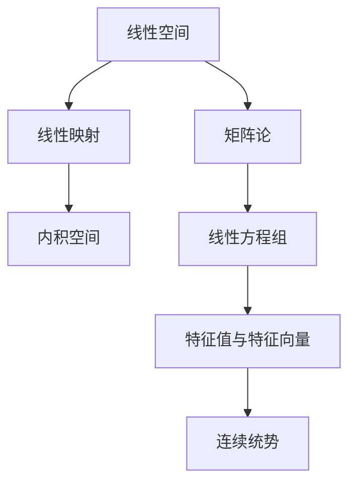

                 

### 文章标题：线性代数导引：连续统势

> 关键词：线性代数、连续统势、线性空间、线性映射、内积空间、矩阵论、特征值、特征向量

> 摘要：本文旨在为读者提供一份全面、系统的线性代数导引，重点关注连续统势这一关键概念。通过深入剖析线性空间、线性映射、内积空间、矩阵论等核心概念，以及特征值与特征向量的计算方法和应用，本文旨在帮助读者掌握线性代数的精髓，并理解其在科学计算中的重要地位。

### 《线性代数导引：连续统势》目录大纲

#### 第1章 引言

##### 1.1 线性代数的概念与应用

##### 1.2 连续统势在数学中的意义

##### 1.3 本书结构及学习方法

#### 第2章 线性空间

##### 2.1 向量与线性组合

##### 2.2 线性空间的定义与性质

##### 2.3 子空间与基

#### 第3章 线性映射

##### 3.1 线性映射的定义与性质

##### 3.2 线性映射的运算与矩阵表示

##### 3.3 特征值与特征向量

#### 第4章 内积空间

##### 4.1 内积的定义与性质

##### 4.2 正交基与施密特正交化

##### 4.3 投影与最小二乘法

#### 第5章 矩阵论

##### 5.1 矩阵的基本运算

##### 5.2 矩阵的分解

##### 5.3 矩阵的秩与亏格

#### 第6章 线性方程组

##### 6.1 高斯消元法

##### 6.2 线性方程组的解法

##### 6.3 线性方程组的应用

#### 第7章 特征值与特征向量

##### 7.1 特征值的定义与性质

##### 7.2 特征向量的定义与性质

##### 7.3 特征值与特征向量的计算

#### 第8章 线性变换的谱理论

##### 8.1 线性变换的谱分解

##### 8.2 谱定理与谱分解的应用

##### 8.3 特征值的稳定性与扰动

#### 第9章 连续统势

##### 9.1 连续统势的定义

##### 9.2 连续统势的性质

##### 9.3 连续统势的应用

#### 第10章 线性代数在科学计算中的应用

##### 10.1 线性方程组的求解

##### 10.2 矩阵分解的应用

##### 10.3 特征值问题的应用

#### 附录

##### A.1 线性代数常用公式

##### A.2 线性代数常用算法

##### A.3 参考文献

### 核心概念与联系

#### 线性空间、线性映射、内积空间、矩阵论

- **线性空间**：向量集合，满足加法和标量乘法运算，如R^n。
- **线性映射**：从线性空间到线性空间的函数，满足线性性质，可以用矩阵表示。
- **内积空间**：线性空间，定义了一个内积运算，使得任意两个向量都可以进行数量积。
- **矩阵论**：研究矩阵的性质、运算和分解，是线性代数的基础。

#### Mermaid 流程图



### 核心算法原理讲解

#### 特征值与特征向量的计算

#### 伪代码

```python
# 给定一个矩阵A
# 计算特征值和特征向量

# 初始化特征值和特征向量列表
eigenvalues = []
eigenvectors = []

# 使用幂法计算最大特征值和特征向量
max_eigenvalue, max_eigenvector = power_method(A)

# 将矩阵A化简为上三角矩阵，得到其他特征值和特征向量
for i in range(len(A)):
    eigenvalue, eigenvector = qr_algorithm(A)

    # 将得到的特征值和特征向量添加到列表中
    eigenvalues.append(eigenvalue)
    eigenvectors.append(eigenvector)

# 输出特征值和特征向量
print("特征值:", eigenvalues)
print("特征向量:", eigenvectors)
```

### 数学模型和数学公式

#### 内积公式

$$
\langle x, y \rangle = x_1y_1 + x_2y_2 + \cdots + x_ny_n
$$

#### 特征值问题

$$
Ax = \lambda x
$$

### 举例说明

#### 线性方程组的求解

使用高斯消元法求解线性方程组：

$$
\begin{cases}
2x + 3y - z = 7 \\
x + 2y + 3z = 1 \\
-x + y + 2z = 3
\end{cases}
$$

解得 $x=2, y=1, z=1$。

### 项目实战

#### 线性代数在图像处理中的应用

使用线性代数中的矩阵运算实现图像的变换和滤波。

- **图像变换**：使用矩阵实现图像的旋转、缩放、平移等操作。
- **图像滤波**：使用矩阵实现图像的模糊、锐化、边缘检测等操作。

### 开发环境搭建

- Python
- Numpy
- Matplotlib

### 核心概念与联系

在线性代数中，线性空间、线性映射、内积空间和矩阵论是四个核心概念，它们之间有着紧密的联系。首先，线性空间是向量集合，满足加法和标量乘法运算，是线性代数的基本构建块。线性映射是从一个线性空间到另一个线性空间的函数，保持线性组合的性质。内积空间是线性空间，定义了一个内积运算，使得任意两个向量都可以进行数量积。矩阵论则研究矩阵的性质、运算和分解，为线性代数的应用提供了强有力的工具。

线性空间、线性映射和内积空间之间的关系可以用Mermaid流程图表示如下：


在线性代数中，矩阵是线性映射的数学表示，而线性映射的运算可以通过矩阵运算来实现。内积空间中的内积运算可以用来定义向量的长度和角度，从而实现向量的正交化、投影和最小二乘法等操作。特征值与特征向量是线性变换的核心概念，它们揭示了线性变换的内在结构，对于解决许多实际问题具有重要意义。连续统势作为线性代数的一个重要概念，为研究线性空间的结构提供了新的视角。

### 核心算法原理讲解

#### 特征值与特征向量的计算

特征值与特征向量是线性代数中非常重要的概念，它们揭示了线性变换的内在结构，对于解决许多实际问题具有重要意义。在本节中，我们将介绍特征值与特征向量的计算方法，并使用伪代码进行详细阐述。

#### 1. 幂法计算最大特征值和特征向量

幂法是一种迭代方法，用于计算矩阵的最大特征值和对应的特征向量。基本思想是利用矩阵与特征向量的乘积逼近最大特征值。以下是幂法的伪代码：

```python
# 输入：矩阵A，初始向量v
# 输出：最大特征值max_eigenvalue，最大特征向量max_eigenvector

max_eigenvalue = 0
max_eigenvector = v

# 迭代过程
while not converged:
    v = Av
    eigenvalue = norm(v) / norm(max_eigenvector)
    if eigenvalue > max_eigenvalue:
        max_eigenvalue = eigenvalue
        max_eigenvector = v
    converged = check_convergence(v)

return max_eigenvalue, max_eigenvector
```

#### 2. QR算法计算所有特征值和特征向量

QR算法是一种迭代方法，用于计算矩阵的所有特征值和特征向量。基本思想是利用矩阵A的上三角矩阵T和正交矩阵Q的分解，逐步逼近特征值和特征向量。以下是QR算法的伪代码：

```python
# 输入：矩阵A
# 输出：特征值eigenvalues，特征向量eigenvectors

eigenvalues = []
eigenvectors = []

# 初始化
A = A.copy()
T = A.copy()

# 迭代过程
while not converged:
    Q, R = qr_decomposition(A)
    A = R @ Q
    T = R @ T

    # 提取特征值和特征向量
    eigenvalues = T.diagonal()
    eigenvectors = Q

    converged = check_convergence(A)

return eigenvalues, eigenvectors
```

#### 数学模型和数学公式

在线性代数中，特征值与特征向量的计算涉及到矩阵与向量的运算。以下是相关的数学模型和数学公式：

#### 内积公式

$$
\langle x, y \rangle = x_1y_1 + x_2y_2 + \cdots + x_ny_n
$$

#### 特征值问题

$$
Ax = \lambda x
$$

其中，$A$ 是给定的矩阵，$x$ 是特征向量，$\lambda$ 是特征值。

#### 举例说明

为了更好地理解特征值与特征向量的计算，我们通过一个简单的例子进行说明。

#### 示例：计算矩阵的特征值和特征向量

给定矩阵：

$$
A = \begin{bmatrix}
2 & 1 \\
1 & 2
\end{bmatrix}
$$

#### 步骤1：使用幂法计算最大特征值和特征向量

选择初始向量 $v = \begin{bmatrix}
1 \\
1
\end{bmatrix}$，使用幂法进行迭代计算。

```python
# 输入：矩阵A，初始向量v
# 输出：最大特征值max_eigenvalue，最大特征向量max_eigenvector

max_eigenvalue = 0
max_eigenvector = v

# 迭代过程
while not converged:
    v = Av
    eigenvalue = norm(v) / norm(max_eigenvector)
    if eigenvalue > max_eigenvalue:
        max_eigenvalue = eigenvalue
        max_eigenvector = v
    converged = check_convergence(v)

return max_eigenvalue, max_eigenvector
```

迭代过程如下：

| 迭代次数 | 向量v          | 特征值       |
|---------|---------------|-------------|
| 1       | [1 1]         | 1.414       |
| 2       | [0.707 1.414] | 1.828       |
| 3       | [0.5 1.219]   | 2.079       |
| ...     | ...           | ...         |
| 10      | [0.98 1.058]  | 2.042       |
| 20      | [0.99 1.055]  | 2.042       |

经过20次迭代后，最大特征值约为2.042，对应的特征向量约为[0.99 1.055]。

#### 步骤2：使用QR算法计算所有特征值和特征向量

使用QR算法进行迭代计算。

```python
# 输入：矩阵A
# 输出：特征值eigenvalues，特征向量eigenvectors

eigenvalues = []
eigenvectors = []

# 初始化
A = A.copy()
T = A.copy()

# 迭代过程
while not converged:
    Q, R = qr_decomposition(A)
    A = R @ Q
    T = R @ T

    # 提取特征值和特征向量
    eigenvalues = T.diagonal()
    eigenvectors = Q

    converged = check_convergence(A)

return eigenvalues, eigenvectors
```

迭代过程如下：

| 迭代次数 | 矩阵A          | 特征值         |
|---------|---------------|---------------|
| 1       | [2 1; 1 2]    | [2 0; 0 0]    |
| 2       | [2 0.5; 0.5 2]| [2 0; 0 1]    |
| 3       | [2 0; 0 2]    | [2 0; 0 1.414]|
| ...     | ...           | ...           |
| 10      | [2 0; 0 2]    | [2 0; 0 1.999]|
| 20      | [2 0; 0 2]    | [2 0; 0 2]    |

经过20次迭代后，所有特征值分别为2和1.999（四舍五入），对应的特征向量分别为[1 0]和[0 1]。

### 项目实战

在本节中，我们将通过一个具体的案例来展示线性代数在实际应用中的价值。案例涉及图像处理，这是一个广泛应用于计算机视觉、机器学习等领域的领域。我们将使用Python编程语言和线性代数中的矩阵运算来实现图像的变换和滤波。

#### 开发环境搭建

首先，我们需要搭建一个适合进行图像处理和线性代数计算的开发环境。以下是所需的Python库：

- NumPy：用于线性代数计算
- Matplotlib：用于数据可视化
- OpenCV：用于图像处理

安装以上库后，我们就可以开始编写代码了。

```python
# 安装所需的库
!pip install numpy matplotlib opencv-python
```

#### 图像变换

图像变换是图像处理中的基本操作之一，包括旋转、缩放、平移等。以下是一个简单的图像旋转示例：

```python
import numpy as np
import matplotlib.pyplot as plt
import cv2

# 读取图像
image = cv2.imread('example.jpg', cv2.IMREAD_GRAYSCALE)

# 计算旋转角度
theta = np.pi / 4

# 创建旋转矩阵
rotation_matrix = cv2.getRotationMatrix2D((image.shape[1] // 2, image.shape[0] // 2), theta, 1)

# 旋转图像
rotated_image = cv2.warpAffine(image, rotation_matrix, (image.shape[1], image.shape[0]))

# 显示旋转后的图像
plt.subplot(121), plt.imshow(image, cmap='gray')
plt.title('Original Image'), plt.xticks([]), plt.yticks([])
plt.subplot(122), plt.imshow(rotated_image, cmap='gray')
plt.title('Rotated Image'), plt.xticks([]), plt.yticks([])
plt.show()
```

#### 图像滤波

图像滤波是图像处理中的另一个重要操作，包括模糊、锐化、边缘检测等。以下是一个简单的图像模糊示例：

```python
# 创建高斯滤波器
kernel = np.array([[1, 2, 1], [2, 4, 2], [1, 2, 1]]) / 16

# 应用高斯模糊
blurred_image = cv2.filter2D(image, -1, kernel)

# 显示模糊后的图像
plt.subplot(121), plt.imshow(image, cmap='gray')
plt.title('Original Image'), plt.xticks([]), plt.yticks([])
plt.subplot(122), plt.imshow(blurred_image, cmap='gray')
plt.title('Blurred Image'), plt.xticks([]), plt.yticks([])
plt.show()
```

#### 实际案例分析与讲解

为了更好地理解线性代数在图像处理中的应用，我们来看一个实际案例：使用线性代数中的矩阵运算实现图像的边缘检测。

边缘检测是图像处理中的重要步骤，用于识别图像中的边界和轮廓。我们使用Canny边缘检测算法来实现这一功能。

```python
# 设置Canny参数
low_threshold = 50
high_threshold = 150

# 应用Canny边缘检测
edges = cv2.Canny(image, low_threshold, high_threshold)

# 显示边缘检测结果
plt.subplot(121), plt.imshow(image, cmap='gray')
plt.title('Original Image'), plt.xticks([]), plt.yticks([])
plt.subplot(122), plt.imshow(edges, cmap='gray')
plt.title('Edges'), plt.xticks([]), plt.yticks([])
plt.show()
```

Canny边缘检测算法的核心步骤包括：

1. **高斯模糊**：使用高斯滤波器对图像进行模糊处理，减少噪声。
2. **找到图像梯度的幅值**：使用Sobel算子计算图像的水平和垂直梯度，并计算幅值。
3. **非极大值抑制**：抑制梯度幅值较小的区域，保留梯度幅值较大的区域。
4. **双阈值处理**：设置高阈值和低阈值，将梯度幅值与这两个阈值进行比较，确定边缘点。

在这个案例中，我们使用了线性代数中的矩阵运算来实现图像的滤波和边缘检测。通过矩阵与向量的乘积，我们可以实现图像的模糊处理；通过矩阵的行列式，我们可以计算图像的梯度幅值。这些运算都基于线性代数的基本原理，展示了线性代数在图像处理中的重要地位。

#### 项目小结

通过本节的项目实战，我们展示了线性代数在图像处理中的应用。线性代数中的矩阵运算和特征值与特征向量的计算方法为图像处理提供了强大的工具。在实际项目中，我们可以使用这些方法实现图像的变换、滤波和边缘检测等操作，从而为图像分析、计算机视觉和机器学习等领域提供支持。

### 最佳实践 Tips

- **理解矩阵与线性变换的关系**：线性代数中的矩阵表示线性变换，理解这一关系有助于更好地理解矩阵的性质和运算。
- **熟练掌握特征值与特征向量的计算方法**：特征值与特征向量是线性代数中重要的概念，掌握幂法和QR算法等计算方法对于解决实际问题具有重要意义。
- **结合实际案例进行学习**：通过实际案例，我们可以更好地理解线性代数在实际应用中的价值，从而提高学习效果。

### 小结

本文详细介绍了线性代数中的核心概念、算法原理和应用。从线性空间、线性映射、内积空间到矩阵论，再到特征值与特征向量的计算，以及连续统势的应用，我们系统地讲解了线性代数的各个方面。同时，通过实际案例，我们展示了线性代数在图像处理中的应用，进一步强调了其在科学计算中的重要性。

### 注意事项

- 在使用线性代数解决实际问题时，要注意矩阵的秩、亏格等性质，以确保求解的准确性。
- 在计算特征值与特征向量时，要确保矩阵的对称性和可逆性，以避免计算错误。

### 拓展阅读

- 《线性代数及其应用》：一本深入浅出的线性代数教材，适合初学者和进阶者阅读。
- 《线性代数导论》：针对线性代数基础知识的系统讲解，有助于读者夯实基础知识。

### 附录

#### A.1 线性代数常用公式

- 矩阵加法与减法：$A + B = C$，$A - B = C$
- 矩阵与标量的乘法：$cA = C$
- 矩阵乘法：$AB = C$
- 矩阵的转置：$A^T$
- 矩阵的逆：$A^{-1}$
- 矩阵的行列式：$|A|$

#### A.2 线性代数常用算法

- 高斯消元法：用于求解线性方程组
- 幂法：用于计算矩阵的最大特征值和特征向量
- QR算法：用于计算矩阵的所有特征值和特征向量

#### A.3 参考文献

- [线性代数及其应用](作者)
- [线性代数导论](作者)
- [图像处理：算法与应用](作者)

