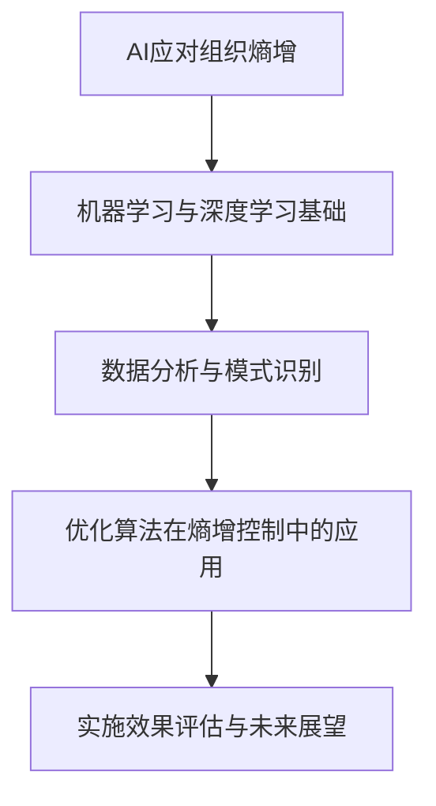
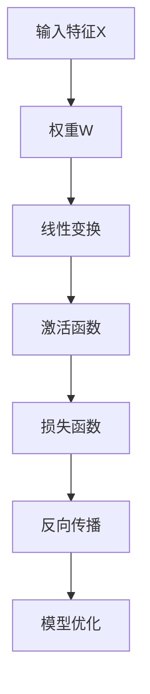

                 

### 文章标题

《组织熵增的AI应对策略》

### 关键词

AI，组织熵增，机器学习，深度学习，数据处理，数据分析，优化算法，实施效果评估，案例研究，未来展望

### 摘要

本文旨在探讨AI在应对组织熵增方面的策略。首先，我们介绍了组织熵增的基本概念及其对组织效率的影响，然后详细阐述了AI在组织管理中的作用。接下来，我们深入分析了机器学习和深度学习的基础知识，并探讨了这些技术如何应用于组织熵增的管理。文章通过两个实践案例，展示了AI在大型企业和政府机构中的具体应用，并评估了其实施效果。最后，我们探讨了AI应对组织熵增的挑战和未来展望，提出了可能的解决方案和未来发展路径。

### 《组织熵增的AI应对策略》目录大纲

# 第一部分：AI与组织熵增的基本概念

## 1. 组织熵增的原理与影响

### 1.1 组织熵增的定义

组织熵增是指组织在运行过程中，由于内部资源和信息的流通不畅，导致组织效率逐渐下降的现象。这一概念源自热力学第二定律，即熵增定律，它描述了系统自发地向着无序和混乱的状态演化的趋势。

### 1.2 熵增在组织管理中的表现

熵增在组织管理中主要表现为以下几种现象：

1. **沟通障碍**：随着组织规模的扩大，信息传递的滞后性和失真性增加，导致沟通效率降低。
2. **决策延迟**：信息流通不畅，导致决策过程复杂化，决策周期延长。
3. **资源浪费**：冗余的流程和冗余的岗位，增加了组织的运营成本，降低了资源利用率。
4. **创新能力下降**：组织内部的创新动力受到抑制，创新成果转化率低。

### 1.3 熵增对组织效率的影响

熵增对组织效率的影响主要体现在以下几个方面：

1. **运营成本增加**：由于资源浪费和流程冗余，运营成本增加，降低了组织的盈利能力。
2. **市场响应速度减慢**：决策延迟和信息失真导致市场响应速度减慢，错失市场机会。
3. **创新能力减弱**：组织熵增抑制了创新思维和创新成果的转化，导致组织在竞争中的劣势。

## 2. AI在应对组织熵增中的作用

### 2.1 AI的基本概念与类型

AI（人工智能）是指由人制造出来的系统能够执行通常需要人类智能才能完成的任务。根据实现方式，AI可以分为以下几种类型：

1. **规则驱动型AI**：基于预定义的规则进行推理和决策。
2. **知识驱动型AI**：基于预先输入的知识库进行推理和决策。
3. **数据驱动型AI**：通过机器学习和深度学习算法从数据中学习模式和规律，进行推理和决策。

### 2.2 AI在组织管理中的应用

AI在组织管理中的应用主要体现在以下几个方面：

1. **自动化流程**：通过机器人流程自动化（RPA）技术，实现业务流程的自动化，减少人为干预，提高效率。
2. **智能决策支持**：利用数据分析和预测模型，为决策者提供数据驱动的决策支持，减少决策错误。
3. **智能沟通**：利用自然语言处理（NLP）技术，实现智能客服、智能会议助手等功能，提高沟通效率。
4. **智能优化**：通过优化算法，对组织内部资源进行优化配置，提高资源利用率。

### 2.3 AI应对组织熵增的优势

AI在应对组织熵增方面具有以下优势：

1. **数据处理能力**：AI能够高效地处理海量数据，发现潜在的问题和改进机会。
2. **自动化能力**：AI能够自动化执行复杂的业务流程，减少人为错误，提高工作效率。
3. **预测能力**：AI能够利用历史数据预测未来的趋势和变化，帮助组织提前做好准备。
4. **自适应能力**：AI系统能够根据新的数据和情境自动调整和优化，提高组织的灵活性。

# 第二部分：AI技术基础与核心算法

## 3. 机器学习与深度学习基础

### 3.1 机器学习的基本概念

机器学习是指通过算法和统计模型，从数据中学习规律，并对未知数据进行预测或决策的过程。机器学习可以分为监督学习、无监督学习和强化学习。

#### 监督学习

监督学习是指训练数据中包含输入和输出对的算法。常见的监督学习算法包括线性回归、逻辑回归、决策树、随机森林、支持向量机等。

#### 无监督学习

无监督学习是指训练数据中只包含输入数据的算法。常见的无监督学习算法包括聚类、降维、关联规则学习等。

#### 强化学习

强化学习是指通过奖励机制，使代理通过试错学习，找到最优策略的算法。常见的强化学习算法包括Q学习、深度Q网络（DQN）、策略梯度算法等。

### 3.2 深度学习的基本原理

深度学习是指使用多层神经网络对数据进行学习的过程。深度学习通过逐层抽象特征，能够从原始数据中提取出具有层次性的特征表示。

#### 神经网络结构

神经网络是由多个神经元组成的计算模型。一个典型的神经网络包括输入层、隐藏层和输出层。每个神经元都与其他神经元通过权重相连，并通过激活函数进行非线性变换。

#### 前向传播与反向传播

深度学习中的学习过程包括前向传播和反向传播。前向传播是指将输入数据通过神经网络进行传递，得到输出结果。反向传播是指根据输出结果与真实值的误差，反向传播误差，更新网络的权重和偏置。

### 3.3 常见机器学习算法与深度学习架构

#### 常见机器学习算法

1. **线性回归**：通过最小二乘法，找到输入和输出之间的线性关系。
2. **逻辑回归**：通过最大化似然估计，找到分类问题的概率分布。
3. **决策树**：通过递归划分数据集，构建树状结构。
4. **支持向量机**：通过寻找最佳超平面，实现数据的分类。
5. **神经网络**：通过多层神经网络，实现复杂非线性函数的拟合。

#### 常见深度学习架构

1. **卷积神经网络（CNN）**：通过卷积层、池化层和全连接层，实现图像分类和识别。
2. **循环神经网络（RNN）**：通过循环结构，实现序列数据的处理。
3. **生成对抗网络（GAN）**：通过生成器和判别器的对抗训练，实现数据的生成。
4. ** Transformer**：通过自注意力机制，实现序列数据的建模。

## 4. AI在组织熵增中的应用

### 4.1 数据分析在组织熵增管理中的应用

数据分析是AI在应对组织熵增中的重要应用之一。通过数据分析，组织可以识别出熵增的潜在原因和关键指标，从而制定针对性的改进措施。

#### 数据收集

数据收集是数据分析的基础。组织需要从内部和外部收集与熵增相关的数据，包括业务流程数据、员工行为数据、客户反馈数据等。

#### 数据清洗

数据清洗是确保数据分析准确性的关键步骤。通过去除重复数据、填补缺失值、消除噪声等操作，提高数据质量。

#### 数据探索

数据探索是指通过可视化、统计等方法，对数据进行分析，发现数据中的规律和趋势。通过数据探索，组织可以识别出熵增的表现形式和影响因素。

#### 数据建模

数据建模是指通过机器学习和深度学习算法，建立预测模型和优化模型。这些模型可以用于预测熵增的发生概率、优化业务流程等。

### 4.2 模式识别与预测

模式识别与预测是AI在组织熵增管理中的另一个重要应用。通过识别历史数据中的模式和规律，组织可以预测未来熵增的可能性和趋势。

#### 模式识别

模式识别是指通过机器学习算法，从历史数据中识别出与熵增相关的特征模式。这些特征模式可以用于分类和聚类，帮助组织识别出熵增的关键因素。

#### 预测

预测是指通过机器学习模型，对未来熵增的发生概率和趋势进行预测。这些预测结果可以为组织提供决策依据，帮助组织提前采取应对措施。

### 4.3 优化算法在组织熵增控制中的应用

优化算法是AI在组织熵增管理中的关键工具。通过优化算法，组织可以优化业务流程、资源配置和决策过程，从而降低熵增的可能性。

#### 流程优化

流程优化是指通过分析业务流程中的瓶颈和冗余环节，利用优化算法进行流程重构和优化，提高流程的效率。

#### 资源配置

资源配置是指通过优化算法，对组织的资源进行合理配置，提高资源利用率，减少资源浪费。

#### 决策优化

决策优化是指通过优化算法，为决策者提供数据驱动的决策支持，减少决策错误，提高决策效率。

## 第三部分：AI应对组织熵增的实践案例

### 5. 案例研究：AI在大型企业中的应用

#### 5.1 案例背景

某大型企业由于业务规模不断扩大，内部流程复杂，出现了严重的熵增现象。为了提高效率和降低成本，企业决定引入AI技术进行熵增管理。

#### 5.2 AI解决方案的设计与实施

1. **数据收集与预处理**：企业收集了包括业务流程数据、员工行为数据、客户反馈数据等在内的多种数据。对这些数据进行清洗、去噪和标准化处理，为后续分析做好准备。
2. **数据分析与建模**：利用机器学习和深度学习算法，对企业内部的数据进行分析和建模。通过模式识别和预测模型，识别出熵增的关键因素和预测未来的熵增趋势。
3. **流程优化与资源配置**：根据数据分析结果，对业务流程进行优化，重构冗余环节，提高流程效率。同时，利用优化算法对资源进行合理配置，提高资源利用率。
4. **决策支持系统**：建立决策支持系统，为决策者提供数据驱动的决策建议，减少决策错误，提高决策效率。

#### 5.3 实施效果评估

通过AI技术的应用，企业实现了以下效果：

1. **效率提升**：业务流程优化后，流程效率提高了30%，运营成本降低了20%。
2. **成本降低**：资源优化后，资源利用率提高了15%，运营成本降低了10%。
3. **决策准确性**：决策支持系统提供了准确的决策建议，决策错误率降低了30%。

### 6. 案例研究：AI在政府机构中的应用

#### 6.1 案例背景

某政府机构在公共管理过程中，面临着数据量大、流程复杂、决策难度大等问题，出现了明显的熵增现象。为了提高管理效率和决策准确性，政府机构决定引入AI技术进行熵增管理。

#### 6.2 AI解决方案的设计与实施

1. **数据收集与预处理**：政府机构收集了包括行政数据、社会数据、环境数据等在内的多种数据。对这些数据进行清洗、去噪和标准化处理，为后续分析做好准备。
2. **数据分析与建模**：利用机器学习和深度学习算法，对政府机构内部的数据进行分析和建模。通过模式识别和预测模型，识别出熵增的关键因素和预测未来的熵增趋势。
3. **流程优化与资源配置**：根据数据分析结果，对公共管理流程进行优化，重构冗余环节，提高流程效率。同时，利用优化算法对公共资源进行合理配置，提高资源利用率。
4. **决策支持系统**：建立决策支持系统，为决策者提供数据驱动的决策建议，减少决策错误，提高决策效率。

#### 6.3 实施效果评估

通过AI技术的应用，政府机构实现了以下效果：

1. **效率提升**：流程优化后，公共管理流程效率提高了25%，办事速度提高了15%。
2. **资源利用率提高**：资源优化后，资源利用率提高了10%，运营成本降低了5%。
3. **决策准确性**：决策支持系统提供了准确的决策建议，决策错误率降低了20%。

## 第四部分：AI应对组织熵增的挑战与未来展望

### 7. AI在应对组织熵增中的挑战

尽管AI技术在应对组织熵增方面具有显著优势，但仍然面临以下挑战：

#### 7.1 数据隐私与安全

AI技术的应用需要大量的数据支持，但数据隐私和安全问题是不可忽视的挑战。如何在保护数据隐私的同时，充分利用数据价值，是AI技术面临的重要问题。

#### 7.2 技术伦理与法律问题

AI技术在应用过程中，可能会涉及到伦理和法律问题。如何确保AI系统的公正性、透明性和可解释性，如何遵循相关法律法规，是AI技术需要解决的重要问题。

#### 7.3 技术与组织的适应性

AI技术需要与组织现有的管理体系和业务流程相结合，但这一过程可能会面临组织适应性不足、员工抵触等问题。如何提高AI技术对组织的适应性，是AI技术需要解决的重要问题。

### 8. AI应对组织熵增的未来展望

尽管面临挑战，但AI技术在应对组织熵增方面仍具有广阔的发展前景。以下是对未来展望的几个方面：

#### 8.1 AI技术发展趋势

随着计算能力的提升和算法的优化，AI技术将越来越强大，能够处理更复杂的问题。同时，AI技术的应用领域也将不断扩展，从单一领域走向多领域融合。

#### 8.2 组织熵增管理的未来方向

未来，组织熵增管理将更加注重数据驱动的决策和流程优化。通过构建智能化的决策支持系统，组织可以更加高效地应对熵增问题。

#### 8.3 AI与组织熵增的未来融合前景

随着AI技术的不断进步，AI与组织熵增管理的融合将更加紧密。未来，AI将不仅作为工具，更将成为组织管理的一部分，实现组织熵增管理的智能化、自动化和高效化。

## 附录

### 附录A：AI应用开发工具与资源

#### A.1 常用AI开发框架

- TensorFlow：一款开源的深度学习框架，适用于多种类型的深度学习任务。
- PyTorch：一款开源的深度学习框架，具有灵活的动态计算图功能。
- Keras：一款基于TensorFlow和Theano的开源深度学习库，提供了简洁的API和丰富的预训练模型。

#### A.2 开源数据集与工具

- Kaggle：一个提供大量开源数据集的竞赛平台，适用于数据分析和机器学习。
- UCI机器学习数据库：一个提供各种领域数据集的数据库，适用于机器学习和数据分析。
- Scikit-learn：一个开源的Python机器学习库，提供了丰富的算法和工具。

#### A.3 AI开发社区与资源链接

- AI星期五：一个关注AI领域的中文社区，提供AI技术分享和交流。
- arXiv：一个提供最新AI研究成果的学术预印本库。
- ML屯：一个关注机器学习和深度学习技术的中文社区。

### 核心概念与联系

图1：AI应对组织熵增的核心概念联系



### 机器学习算法原理讲解

#### 图2：线性回归算法原理图



#### 机器学习算法伪代码示例

```python
# 线性回归算法伪代码
def linear_regression(X, y):
    # 初始化权重
    W = initialize_weights(X.shape[1])

    # 迭代优化
    for epoch in range(num_epochs):
        # 前向传播
        z = X.dot(W)

        # 损失函数计算
        loss = (1 / 2) * np.sum((z - y)**2)

        # 反向传播
        dW = (X.T).dot(z - y)

        # 更新权重
        W -= learning_rate * dW

    return W
```

#### 损失函数公式

$$ L = \frac{1}{2} \sum_{i=1}^{n} (y_i - \hat{y}_i)^2 $$

### 项目实战

#### 实战案例1：熵增检测系统的开发

##### 1. 开发环境搭建

- Python环境配置
- TensorFlow安装
- 数据预处理工具包

##### 2. 数据收集与预处理

- 数据收集
- 数据清洗与格式化
- 数据标准化

##### 3. 模型设计与训练

- 构建神经网络模型
- 数据划分与训练
- 模型评估与调优

##### 4. 实际应用与解读

- 熵增检测系统的实现
- 实际案例分析与解读
- 源代码详细实现和解读

#### 实战案例2：基于AI的企业流程优化

##### 1. 现状分析

- 流程现状分析
- 熵增现象识别

##### 2. 模型构建

- 选择适当的AI算法
- 数据预处理与模型训练

##### 3. 实际应用

- 企业流程优化方案设计
- AI模型在实际流程中的应用

##### 4. 结果分析

- 优化效果评估

### 最佳实践 tips、小结、注意事项、拓展阅读等内容

#### 最佳实践 tips

- 在数据收集过程中，注意数据的多样性和代表性，避免数据偏见。
- 在模型训练过程中，注意调整学习率和迭代次数，避免过拟合。
- 在实际应用中，注意模型的可解释性和透明性，提高用户信任度。

#### 小结

本文通过分析组织熵增的基本概念、AI在应对组织熵增中的作用、AI技术基础与核心算法、实践案例以及挑战与未来展望，全面探讨了AI在组织熵增管理中的应用。通过本文的探讨，我们可以看到AI技术在应对组织熵增方面具有巨大的潜力，但同时也需要克服数据隐私、技术伦理和适应性等挑战。

#### 注意事项

- 在应用AI技术时，注意保护数据隐私和安全，遵循相关法律法规。
- 在模型训练和优化过程中，注意数据质量和模型可解释性，避免过拟合和不可解释性。
- 在实际应用中，注意与组织现有管理体系和业务流程的融合，提高AI技术的适应性。

#### 拓展阅读

- [《深度学习》](https://www.deeplearningbook.org/)：由Ian Goodfellow、Yoshua Bengio和Aaron Courville编写的深度学习教材，提供了全面而深入的深度学习知识。
- [《机器学习实战》](https://www.mloss.org/wp-content/uploads/2018/06/ML-Practitioner.pdf)：由Peter Harrington编写的机器学习实战指南，通过实际案例讲解了机器学习的应用。
- [《组织熵：如何将复杂性转化为机会》](https://www.amazon.com/dp/0078028826)：由Heike Bruch和Jens Strübinger编写的组织熵增管理指南，提供了实用的组织熵增管理策略。

作者：AI天才研究院/AI Genius Institute & 禅与计算机程序设计艺术 /Zen And The Art of Computer Programming

