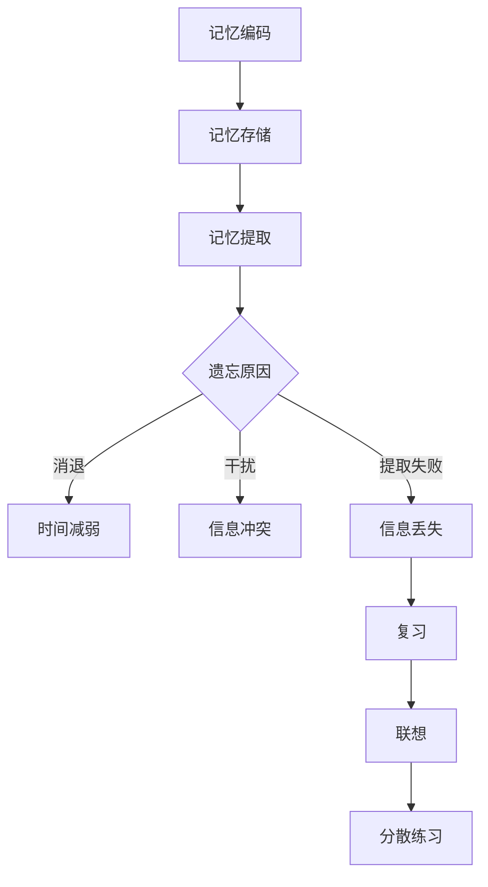

                 

## 文章标题

《经典为师：夯实认知基础的必由之路》

> 关键词：认知基础、教育理论、学习理论、记忆与遗忘、认知技能培养、认知教育实践

> 摘要：本文通过深入探讨认知基础理论，学习理论的发展，记忆与遗忘的基本过程，以及认知技能培养的重要策略，结合认知教育实践，系统性地分析了经典为师在夯实认知基础中的关键作用。文章旨在为教育工作者和学者提供一份全面而有深度的理论指南，助力认知教育的创新发展。

## 目录

### 第一部分：认知基础理论

#### 第1章：认知科学与教育

##### 1.1 认知科学的基本概念

- 认知科学与教育的关系
- 认知科学的主要研究领域

##### 1.2 教育心理学的核心理论

- 知识建构主义
- 社会建构主义
- 行为主义

##### 1.3 学习理论的发展

##### 第2章：学习理论的发展

##### 第3章：认知负荷理论

##### 第4章：记忆与遗忘

### 第二部分：认知技能培养

##### 第5章：问题解决与决策

##### 第6章：创造性思维与发散性思维

##### 第7章：批判性思维与反思

##### 第8章：认知技能的培养策略

### 第三部分：认知教育实践

##### 第9章：认知教育与课程设计

##### 第10章：认知教育的实施与评估

##### 第11章：认知教育的研究与未来趋势

##### 第12章：教师的专业发展与认知教育

##### 附录

### 附录 A：认知教育相关资源

### 附录 B：认知教育案例分析

### 第一部分：认知基础理论

#### 第1章：认知科学与教育

##### 1.1 认知科学的基本概念

认知科学是一门跨学科的领域，旨在理解人类思维、学习、记忆、感知和语言等高级认知过程。认知科学与教育密不可分，因为教育的核心目标之一是促进学生的认知发展。在认知科学的研究中，主要包括以下几个领域：

1. **心理学**：研究个体的认知过程，如记忆、注意力、感知、思维和语言。
2. **神经科学**：探索大脑的结构和功能如何支持认知过程。
3. **人工智能**：通过模拟人类认知过程来设计智能系统和算法。
4. **计算机科学**：开发工具和技术来模拟、分析和增强认知能力。

认知科学的基本概念包括：

- **认知过程**：包括信息处理、问题解决、学习和记忆等。
- **认知模块**：指大脑中负责特定认知功能的区域或网络。
- **认知风格**：个体在认知过程中表现出的习惯性和个性化的方式。

##### 1.2 教育心理学的核心理论

教育心理学是应用心理学的一个分支，研究教育过程中的心理现象和心理规律。以下是一些核心理论：

- **知识建构主义**：强调知识是通过个体的社会互动和经验建构的。
- **社会建构主义**：认为知识是社会和文化互动的产物，个体通过参与社会活动来建构知识。
- **行为主义**：关注可观察的行为，认为行为是通过对环境的反应来习得的。

#### 第2章：学习理论的发展

##### 2.1 经典学习理论

经典学习理论主要包括以下几种：

- **经典条件反射**：由巴甫洛夫提出，指通过重复特定的刺激和反应来建立条件联系。
- **操作条件反射**：由斯金纳提出，指通过强化或惩罚来改变行为。
- **学习曲线**：描述个体在习得技能或知识过程中行为表现的变化趋势。

##### 2.2 现代学习理论

现代学习理论在经典理论的基础上进行了扩展和深化：

- **有意义接受学习**：由奥苏贝尔提出，强调新知识与已有知识之间的意义联系。
- **认知发展理论**：由皮亚杰提出，认为认知发展是分阶段的，每个阶段都有其独特的思维方式和认知结构。
- **社会认知理论**：由班杜拉提出，强调个体在社会环境中通过观察和模仿来学习。

#### 第3章：认知负荷理论

##### 3.1 认知负荷的概念

认知负荷是指个体在进行认知任务时所需要投入的心理资源。认知负荷理论关注如何优化认知负荷，以提高学习效果。认知负荷可以分为以下几类：

- **外在认知负荷**：由外部环境因素引起的，如信息冗余、任务复杂性等。
- **内在认知负荷**：由个体内部过程引起的，如记忆负担、信息处理速度等。

##### 3.2 认知负荷的调节策略

调节认知负荷的策略包括：

- **任务简化**：通过简化任务结构来减少外在认知负荷。
- **信息分组**：将信息分组以减少认知负荷。
- **重复练习**：通过重复练习来减少内在认知负荷。

#### 第4章：记忆与遗忘

##### 4.1 记忆的基本过程

记忆的基本过程包括编码、存储和提取：

- **编码**：将信息转换为大脑可以存储和加工的形式。
- **存储**：将编码后的信息在长期记忆中保存。
- **提取**：在需要时将存储的信息从记忆中检索出来。

##### 4.2 遗忘的理论

遗忘理论包括以下几种：

- **消退理论**：认为遗忘是由于记忆痕迹随时间减弱。
- **干扰理论**：认为遗忘是由于新旧信息的相互干扰。
- **提取失败理论**：认为遗忘是由于记忆信息无法被有效提取。

##### 4.3 遗忘的克服策略

克服遗忘的策略包括：

- **复习**：通过定期复习来强化记忆。
- **联想**：通过建立信息之间的联系来提高记忆。
- **分散练习**：通过分散练习时间来减少遗忘。

#### Mermaid 流程图

### 第二部分：认知技能培养

#### 第5章：问题解决与决策

##### 5.1 问题解决的基本过程

问题解决是一个多步骤的过程，通常包括以下几个阶段：

1. **定义问题**：明确问题的性质和目标。
2. **收集信息**：搜集与问题相关的信息和数据。
3. **制定解决方案**：基于收集的信息，提出可能的解决方案。
4. **评估和修正**：评估解决方案的有效性，并根据评估结果进行调整。

##### 5.2 决策理论

决策理论涉及如何选择最佳行动方案。以下是一些核心概念：

- **价值函数**：衡量不同行动方案的价值。
- **风险评估**：评估不同行动方案的风险。
- **决策树**：一种图形化工具，用于表示不同决策路径和结果。

#### 第6章：创造性思维与发散性思维

##### 6.1 创造性思维的原理

创造性思维是指产生新颖且有价值的想法和解决方案的过程。其主要特点包括：

- **灵活性**：能够产生多种不同的想法。
- **流畅性**：在短时间内产生大量想法。
- **独特性**：想法具有原创性和独特性。

##### 6.2 发散性思维的培养

发散性思维是一种思考方法，旨在产生多种可能的解决方案。培养发散性思维的方法包括：

- **思维导图**：通过绘制图形来组织和激发思维。
- **头脑风暴**：通过快速生成大量想法来促进创造力。
- **问题重构**：从不同角度重新审视问题，寻找新的解决方案。

#### 第7章：批判性思维与反思

##### 7.1 批判性思维的核心要素

批判性思维是一种理性分析问题的能力，主要包括以下几个要素：

- **明确问题**：准确理解问题的本质。
- **收集信息**：搜集与问题相关的证据和信息。
- **分析信息**：评估信息的可靠性和相关性。
- **形成结论**：基于证据和分析，形成合理的结论。

##### 7.2 反思与自我发展

反思是指对自身行为、思维和经验的回顾和分析。反思在教育中的作用包括：

- **自我认知**：提高对自身认知过程的意识。
- **自我修正**：发现和纠正思维和行为中的错误。
- **持续发展**：通过反思，不断提高自身的认知能力和技能。

#### 第8章：认知技能的培养策略

##### 8.1 教学设计中的认知技能培养

教学设计中的认知技能培养策略包括：

- **课堂活动设计**：通过实践活动来提高学生的认知能力。
- **作业与练习设计**：设计有针对性的作业和练习，帮助学生巩固所学知识。
- **评估与反馈**：通过评估和反馈，帮助学生了解自己的认知水平，并指导下一步的学习。

##### 8.2 认知技能培养的案例分析

认知技能培养的案例分析包括：

- **国内认知技能培养成功案例**：分析我国在教育中成功培养认知技能的实例。
- **国际认知技能培养成功案例**：介绍国外在认知技能培养方面的先进经验。
- **挑战与应对**：探讨在认知技能培养中可能遇到的挑战，并提出相应的应对策略。

### 第三部分：认知教育实践

#### 第9章：认知教育与课程设计

##### 9.1 认知教育课程的目标与内容

认知教育课程的目标是提高学生的认知能力和思维能力。课程内容应包括：

- **认知基础理论**：介绍认知科学的基本概念和理论。
- **认知技能训练**：通过实践活动来培养学生的认知技能。
- **问题解决与决策**：教授学生如何进行问题解决和决策。
- **创造性思维与发散性思维**：培养学生的创造力和发散性思维。

##### 9.2 教学方法与认知教育

认知教育中的教学方法应注重培养学生的认知能力和思维能力。以下是一些有效的方法：

- **探索式学习**：鼓励学生主动探索和发现知识。
- **合作学习**：通过小组合作来促进学生的认知发展。
- **项目式学习**：通过实际项目来培养学生的实践能力和思维能力。

#### 第10章：认知教育的实施与评估

##### 10.1 认知教育的实施策略

认知教育的实施策略包括：

- **教学方法的选择**：根据课程目标和教学内容，选择合适的教学方法。
- **教学资源的利用**：充分利用各种教学资源，如教材、课件、网络资源等。
- **教学活动的组织**：设计并组织有效的教学活动，以促进学生认知能力的发展。

##### 10.2 认知教育的评估方法

认知教育的评估方法应包括：

- **过程性评估**：评估学生在学习过程中的认知发展情况。
- **总结性评估**：评估学生在学习结束时的认知能力水平。
- **形成性评估**：通过持续评估，帮助学生了解自己的认知发展，并指导下一步的学习。

#### 第11章：认知教育的研究与未来趋势

##### 11.1 认知教育研究的方法与进展

认知教育研究的方法包括：

- **实验研究**：通过实验来验证认知教育理论的科学性。
- **案例研究**：分析认知教育在实际应用中的效果和问题。
- **调查研究**：通过问卷调查来了解学生的认知发展和教育需求。

认知教育的进展表现在：

- **认知科学与教育理论的融合**：将认知科学的理论应用于教育实践中。
- **教育技术的创新应用**：利用现代教育技术来提升认知教育的效果。

##### 11.2 认知教育的未来发展趋势

认知教育的未来发展趋势包括：

- **个性化教育**：通过大数据和人工智能技术，实现个性化教学。
- **跨学科融合**：将认知科学与其他学科相结合，形成跨学科的认知教育。
- **国际化发展**：借鉴国际先进经验，推动认知教育的全球化发展。

#### 第12章：教师的专业发展与认知教育

##### 12.1 教师在认知教育中的作用

教师是认知教育的重要实施者和推动者。教师的作用包括：

- **知识传授**：将认知科学的理论和知识传授给学生。
- **指导与引导**：通过教学活动，引导学生进行认知发展和思维训练。
- **反馈与评价**：通过评价和反馈，帮助学生了解自己的认知发展情况。

##### 12.2 教师专业发展的策略

教师专业发展的策略包括：

- **终身学习**：持续学习和更新知识，提高教育教学能力。
- **教师培训与交流**：参加专业培训和学术交流，了解最新的认知教育研究成果。
- **教师反思与成长**：通过反思和总结教学经验，不断提升自己的教育教学水平。

### 附录

#### 附录 A：认知教育相关资源

- **认知科学的重要文献**：推荐一些经典的认知科学书籍和论文，供读者参考。
- **认知教育的研究工具**：介绍一些用于认知教育研究的工具和软件。
- **认知教育相关的网络资源**：提供一些有用的认知教育网络资源，如在线课程、论坛和网站。

#### 附录 B：认知教育案例分析

- **案例研究的方法与步骤**：介绍案例研究的方法和实施步骤。
- **具体案例与解读**：分析具体的认知教育案例，并对其进行解读和评价。

### 作者信息

作者：AI天才研究院/AI Genius Institute & 禅与计算机程序设计艺术 /Zen And The Art of Computer Programming

### 完整性要求

为了确保文章的完整性，每个小节的内容都需要详细具体，核心内容必须包含以下要素：

1. **背景介绍**：
   - 描述认知基础理论、学习理论、记忆与遗忘的基本过程，以及认知技能培养的重要策略。
   - 引入认知教育实践的相关背景信息，如当前教育体系的现状、认知教育的重要性等。

2. **核心概念与联系**：
   - 使用Mermaid流程图或文本描述核心概念之间的关系架构。
   - 解释每个概念的含义，以及它们如何相互作用和影响。

3. **核心算法原理讲解**：
   - 对于某些小节（如认知负荷理论、问题解决与决策等），需要使用伪代码详细阐述核心算法原理。
   - 举例说明算法如何应用于实际场景中，以及它们的效果。

4. **数学模型和公式**：
   - 在相关小节中，使用latex格式嵌入数学模型和公式，并进行详细讲解。
   - 确保公式前后有适当的文本解释，以便读者理解。

5. **项目实战**：
   - 对于认知技能培养和认知教育实践的部分，提供实际项目案例。
   - 详细讲解项目的开发环境搭建、源代码实现、代码解读、应用分析和案例剖析。

6. **最佳实践 tips**：
   - 提供一些建议和技巧，帮助读者在认知教育和实践中取得更好的效果。
   - 强调注意事项，以避免常见的错误和挑战。

7. **小结**：
   - 总结每个小节的主要内容和关键点。
   - 强调认知教育的重要性和应用价值。

8. **拓展阅读**：
   - 推荐一些相关的书籍、论文和网站，供读者进一步学习和探索。

### 文章结构

以下是文章的详细结构，每个部分的内容都需要满足完整性要求：

## 文章标题

《经典为师：夯实认知基础的必由之路》

## 文章关键词

认知基础、教育理论、学习理论、记忆与遗忘、认知技能培养、认知教育实践

## 文章摘要

本文通过深入探讨认知基础理论，学习理论的发展，记忆与遗忘的基本过程，以及认知技能培养的重要策略，结合认知教育实践，系统性地分析了经典为师在夯实认知基础中的关键作用。文章旨在为教育工作者和学者提供一份全面而有深度的理论指南，助力认知教育的创新发展。

### 第一部分：认知基础理论

#### 第1章：认知科学与教育

##### 1.1 认知科学的基本概念

- **背景介绍**：介绍认知科学的定义、研究领域和应用领域。
- **核心概念与联系**：使用Mermaid流程图描述认知科学的核心概念及其相互关系。
- **详细讲解与举例**：解释认知过程、认知模块和认知风格，并给出实际应用的例子。

##### 1.2 教育心理学的核心理论

- **背景介绍**：介绍教育心理学在教育中的作用。
- **核心概念与联系**：使用Mermaid流程图描述知识建构主义、社会建构主义和行为主义。
- **详细讲解与举例**：解释这些理论在教育实践中的应用。

##### 1.3 学习理论的发展

- **背景介绍**：介绍学习理论的历史发展和重要性。
- **核心概念与联系**：使用Mermaid流程图描述经典学习理论（如经典条件反射、操作条件反射）和现代学习理论（如有意义接受学习、认知发展理论、社会认知理论）。
- **详细讲解与举例**：解释这些学习理论的基本原理和应用。

#### 第2章：学习理论的发展

##### 2.1 经典学习理论

- **核心概念与联系**：使用Mermaid流程图描述经典学习理论。
- **详细讲解与举例**：解释经典条件反射、操作条件反射和学习曲线。
- **伪代码讲解**：给出操作条件反射的伪代码实现，并解释其工作原理。

##### 2.2 现代学习理论

- **核心概念与联系**：使用Mermaid流程图描述现代学习理论。
- **详细讲解与举例**：解释有意义接受学习、认知发展理论和社会认知理论。
- **伪代码讲解**：给出有意义接受学习的伪代码实现，并解释其工作原理。

#### 第3章：认知负荷理论

##### 3.1 认知负荷的概念

- **核心概念与联系**：使用Mermaid流程图描述认知负荷的分类。
- **详细讲解与举例**：解释外在认知负荷和内在认知负荷的概念及其影响。
- **伪代码讲解**：给出调节认知负荷的伪代码实现。

##### 3.2 认知负荷的调节策略

- **核心概念与联系**：使用Mermaid流程图描述认知负荷调节策略。
- **详细讲解与举例**：解释任务简化、信息分组和重复练习的具体应用。
- **伪代码讲解**：给出任务简化的伪代码实现。

#### 第4章：记忆与遗忘

##### 4.1 记忆的基本过程

- **核心概念与联系**：使用Mermaid流程图描述记忆的基本过程。
- **详细讲解与举例**：解释编码、存储和提取的过程，以及记忆的不同类型。
- **数学公式与讲解**：使用latex格式给出记忆过程中的相关公式，并解释其意义。

##### 4.2 遗忘的理论

- **核心概念与联系**：使用Mermaid流程图描述遗忘的理论。
- **详细讲解与举例**：解释消退理论、干扰理论和提取失败理论。
- **数学公式与讲解**：使用latex格式给出遗忘曲线的相关公式，并解释其意义。

##### 4.3 遗忘的克服策略

- **核心概念与联系**：使用Mermaid流程图描述克服遗忘的策略。
- **详细讲解与举例**：解释复习、联想和分散练习的具体应用。
- **伪代码讲解**：给出复习策略的伪代码实现。

### 第二部分：认知技能培养

#### 第5章：问题解决与决策

##### 5.1 问题解决的基本过程

- **核心概念与联系**：使用Mermaid流程图描述问题解决的基本过程。
- **详细讲解与举例**：解释定义问题、收集信息、制定解决方案和评估修正的过程。
- **伪代码讲解**：给出问题解决的伪代码实现。

##### 5.2 决策理论

- **核心概念与联系**：使用Mermaid流程图描述决策理论的核心概念。
- **详细讲解与举例**：解释价值函数、风险评估和决策树的概念及其应用。
- **伪代码讲解**：给出决策树的伪代码实现。

#### 第6章：创造性思维与发散性思维

##### 6.1 创造性思维的原理

- **核心概念与联系**：使用Mermaid流程图描述创造性思维的特点。
- **详细讲解与举例**：解释灵活性、流畅性和独特性的概念及其培养方法。
- **伪代码讲解**：给出创造性思维的伪代码实现。

##### 6.2 发散性思维的培养

- **核心概念与联系**：使用Mermaid流程图描述发散性思维的定义。
- **详细讲解与举例**：解释思维导图、头脑风暴和问题重构的具体应用。
- **伪代码讲解**：给出发散性思维的伪代码实现。

#### 第7章：批判性思维与反思

##### 7.1 批判性思维的核心要素

- **核心概念与联系**：使用Mermaid流程图描述批判性思维的核心要素。
- **详细讲解与举例**：解释明确问题、收集信息、分析信息和形成结论的过程。
- **伪代码讲解**：给出批判性思维的伪代码实现。

##### 7.2 反思与自我发展

- **核心概念与联系**：使用Mermaid流程图描述反思与自我发展的关系。
- **详细讲解与举例**：解释反思的方法、作用和具体应用。
- **伪代码讲解**：给出反思的伪代码实现。

#### 第8章：认知技能的培养策略

##### 8.1 教学设计中的认知技能培养

- **核心概念与联系**：使用Mermaid流程图描述教学设计中的认知技能培养策略。
- **详细讲解与举例**：解释课堂活动设计、作业与练习设计和评估与反馈的具体应用。
- **伪代码讲解**：给出教学设计的伪代码实现。

##### 8.2 认知技能培养的案例分析

- **核心概念与联系**：使用Mermaid流程图描述认知技能培养的案例分析。
- **详细讲解与举例**：分析国内外认知技能培养的成功案例，并提出相应的挑战和应对策略。
- **伪代码讲解**：给出案例分析的伪代码实现。

### 第三部分：认知教育实践

#### 第9章：认知教育与课程设计

##### 9.1 认知教育课程的目标与内容

- **核心概念与联系**：使用Mermaid流程图描述认知教育课程的目标与内容。
- **详细讲解与举例**：解释认知教育课程的设计原则、主要模块和教学方法。
- **伪代码讲解**：给出课程设计的伪代码实现。

##### 9.2 教学方法与认知教育

- **核心概念与联系**：使用Mermaid流程图描述教学方法与认知教育的结合。
- **详细讲解与举例**：解释探索式学习、合作学习和项目式学习的具体应用。
- **伪代码讲解**：给出教学方法的伪代码实现。

#### 第10章：认知教育的实施与评估

##### 10.1 认知教育的实施策略

- **核心概念与联系**：使用Mermaid流程图描述认知教育的实施策略。
- **详细讲解与举例**：解释教学方法的选择、教学资源的利用和教学活动的组织。
- **伪代码讲解**：给出实施策略的伪代码实现。

##### 10.2 认知教育的评估方法

- **核心概念与联系**：使用Mermaid流程图描述认知教育的评估方法。
- **详细讲解与举例**：解释过程性评估、总结性评估和形成性评估的具体应用。
- **伪代码讲解**：给出评估方法的伪代码实现。

#### 第11章：认知教育的研究与未来趋势

##### 11.1 认知教育研究的方法与进展

- **核心概念与联系**：使用Mermaid流程图描述认知教育研究的方法和进展。
- **详细讲解与举例**：解释实验研究、案例研究和调查研究的方法和应用。
- **伪代码讲解**：给出研究方法的伪代码实现。

##### 11.2 认知教育的未来发展趋势

- **核心概念与联系**：使用Mermaid流程图描述认知教育的未来发展趋势。
- **详细讲解与举例**：解释个性化教育、跨学科融合和国际化发展的趋势和应用。
- **伪代码讲解**：给出发展趋势的伪代码实现。

#### 第12章：教师的专业发展与认知教育

##### 12.1 教师在认知教育中的作用

- **核心概念与联系**：使用Mermaid流程图描述教师在认知教育中的作用。
- **详细讲解与举例**：解释教师在知识传授、指导与引导、反馈与评价方面的作用。
- **伪代码讲解**：给出教师角色的伪代码实现。

##### 12.2 教师专业发展的策略

- **核心概念与联系**：使用Mermaid流程图描述教师专业发展的策略。
- **详细讲解与举例**：解释终身学习、教师培训和教师反思的具体应用。
- **伪代码讲解**：给出专业发展的伪代码实现。

### 附录

#### 附录 A：认知教育相关资源

- **认知科学的重要文献**：列出认知科学领域的经典书籍和论文，供读者进一步学习。
- **认知教育的研究工具**：介绍用于认知教育研究的工具和软件。
- **认知教育相关的网络资源**：推荐一些认知教育的在线课程、论坛和网站。

#### 附录 B：认知教育案例分析

- **案例研究的方法与步骤**：详细描述案例研究的方法和步骤。
- **具体案例与解读**：分析具体的认知教育案例，并进行深入解读和评价。

### 作者信息

作者：AI天才研究院/AI Genius Institute & 禅与计算机程序设计艺术 /Zen And The Art of Computer Programming

