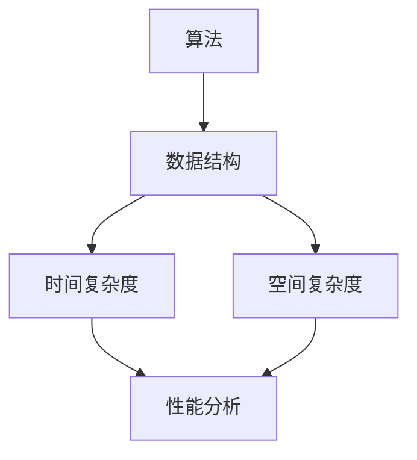

                 


### 引言

随着互联网技术的飞速发展和大数据时代的到来，计算机科学领域迎来了前所未有的挑战和机遇。作为计算机科学的核心部分，算法和数据结构的研究和应用愈发重要。在众多企业中，网易作为互联网行业的佼佼者，其校招面试题和算法题解一直以来都是业界关注的焦点。本文将围绕《网易2025校招面试真题与算法题解》这一主题，通过逻辑清晰、结构紧凑的方式，为您详细解读网易校招面试的相关知识点和算法题解。

### 文章关键词

- 网易校招
- 面试真题
- 算法题解
- 数据结构
- 算法原理
- 编程实战

### 摘要

本文旨在为准备参加网易校招的同学们提供一套系统的面试准备方案和算法解题思路。文章将首先介绍网易校招面试的流程和策略，然后深入解析数据结构和算法的基础概念，接着详细讲解动态规划、贪心算法、分治算法等核心算法原理，并通过实战案例和真题解析，帮助读者掌握算法解题技巧。最后，文章还将分享面试技巧和求职经验，为您的校招之路保驾护航。

### 《网易2025校招面试真题与算法题解》目录大纲

#### 第一部分：面试准备与基础概念

**第1章：网易校招面试全解析**

- **1.1 校招面试流程与策略**
  - 校招面试常见流程
  - 面试策略与心态调整

- **1.2 编程基础**
  - 常用编程语言
  - 数据结构与算法基础

**第2章：数据结构与算法深度解析**

- **2.1 基础数据结构**
  - 线性表
  - 栈与队列
  - 链表
  - 树与图

- **2.2 算法设计与分析**
  - 排序算法
  - 搜索算法
  - 算法优化与分析

**第3章：核心算法原理详解**

- **3.1 动态规划**
  - 动态规划基础
  - 经典动态规划问题解析

- **3.2 贪心算法**
  - 贪心算法原理
  - 经典贪心算法问题解析

- **3.3 分治算法**
  - 分治算法原理
  - 经典分治算法问题解析

#### 第二部分：网易校招真题实战

**第4章：算法真题解析**

- **4.1 算法真题类型分类**
  - 基础算法题
  - 进阶算法题
  - 复杂算法题

- **4.2 经典真题解析**
  - 真题1：最大子序和问题
  - 真题2：最小路径和问题
  - 真题3：背包问题

**第5章：编程实战**

- **5.1 编程实战案例**
  - 案例一：逆波兰表达式求值
  - 案例二：链表反转
  - 案例三：二叉树遍历

- **5.2 编程环境搭建与调试**
  - 编程环境配置
  - 调试技巧与工具

#### 第三部分：面试技巧与求职经验

**第6章：面试技巧提升**

- **6.1 面试官心理分析**
  - 面试官提问策略
  - 面试官期望答案

- **6.2 面试中常见问题应对**
  - 自我介绍
  - 项目经验展示
  - 技术难题解答

**第7章：求职经验分享**

- **7.1 网易面试流程回顾**
  - 面试环节回顾
  - 面试反馈总结

- **7.2 求职经验分享**
  - 准备工作
  - 面试经验
  - 求职心态

#### 附录

**附录A：编程语言与工具**

- **A.1 Python编程基础**
  - Python语法基础
  - Python常用库

- **A.2 数据结构与算法工具**
  - 常用数据结构与算法库
  - 实用算法分析工具

**附录B：常见面试题集锦**

- **B.1 常见编程面试题**
  - 基础编程题
  - 数据结构与算法题
  - 系统设计题

- **B.2 常见面试问题集锦**
  - 行为面试问题
  - 技术面试问题

### 第1章：核心概念与联系

#### 1.1 算法与数据结构的关系

算法和数据结构是计算机科学中两个核心概念，它们之间存在着紧密的联系和互动。

##### 1.1.1 算法的定义与分类

算法是一种解决问题的清晰指令集合，通常由输入、输出和一系列步骤组成。算法可以根据其复杂度和应用场景进行分类，主要包括：

- **基础算法**：如排序、查找、插入和删除等。
- **高级算法**：如动态规划、贪心算法、分治算法等。
- **优化算法**：针对特定问题的改进算法，以提高效率和性能。

算法的基本特性包括正确性、可读性、健壮性、时间复杂度和空间复杂度。正确性是指算法能够正确解决给定的问题；可读性是指算法易于理解和阅读；健壮性是指算法能够处理各种输入和特殊情况；时间复杂度是指算法执行时间与数据规模的关系；空间复杂度是指算法所需内存与数据规模的关系。

##### 1.1.2 数据结构的定义与分类

数据结构是指数据组织、存储和管理的方式。常见的数据结构可以分为以下几类：

- **线性结构**：如数组、链表、栈和队列。
- **树结构**：如二叉树、平衡树、堆等。
- **图结构**：如无向图、有向图、加权图等。
- **哈希表**：通过哈希函数将数据映射到数组位置的结构。

每种数据结构都有其特点和适用场景。例如，数组适合用于存储固定大小的数据集，链表适合用于动态分配和删除节点，树结构适合用于表示层次关系，图结构适合用于表示复杂的关系网络。

##### 1.1.3 算法与数据结构的联系

算法和数据结构之间的关系是相辅相成的。算法依赖于合适的数据结构来实现，而不同的数据结构会影响算法的效率和性能。

- **算法依赖数据结构**：例如，排序算法通常需要依赖于数组或链表这样的线性结构，搜索算法可以依赖于二叉搜索树或哈希表这样的树结构或哈希结构。
- **数据结构影响算法**：例如，基于数组实现的排序算法通常具有较低的时间复杂度，而基于链表实现的排序算法则可能需要更多的时间。

为了更好地理解和应用算法和数据结构，我们可以借助Mermaid流程图来展示它们之间的关系：



在这个流程图中，算法和数据结构相互关联，共同决定了程序的执行性能。

### 第2章：核心算法原理讲解

#### 2.1 动态规划

##### 2.1.1 动态规划基础

动态规划（Dynamic Programming，简称 DP）是一种用于求解最优化问题的算法思想。它通过将复杂问题分解为更小的子问题，并存储子问题的解，从而避免重复计算，提高算法的效率。

动态规划通常适用于具有以下两个特征的问题：

- **重叠子问题**：即不同子问题的解可以重复利用，子问题之间不是独立的。
- **最优子结构**：即问题的最优解可以通过子问题的最优解组合得到。

动态规划的基本思想是将原问题分解为多个子问题，并使用递推关系来求解。具体步骤如下：

1. **确定状态**：定义一个状态变量来表示问题的不同情况。例如，在求解斐波那契数列时，状态可以是数列的下标。
2. **定义状态转移方程**：根据问题的性质，定义状态之间的转移关系。例如，在求解斐波那契数列时，状态转移方程为 `F(n) = F(n-1) + F(n-2)`。
3. **确定边界条件**：确定递推关系的初始状态，例如，在求解斐波那契数列时，初始状态为 `F(0) = 0` 和 `F(1) = 1`。
4. **计算最优解**：根据状态转移方程和边界条件，计算出最终的状态值，即为问题的最优解。

动态规划的基本框架可以表示为：

```python
function dp(state):
    if 达到边界条件:
        return 边界值
    if 状态已计算过:
        return 记录的值
    else:
        计算状态值
        记录状态值
        return 状态值
```

##### 2.1.2 经典动态规划问题解析

动态规划在解决最优化问题时具有广泛的应用。以下是一些经典的动态规划问题及其解析：

**问题 1：最长公共子序列**

问题描述：给定两个字符串 `s1` 和 `s2`，找到它们的最长公共子序列。

状态转移方程：

```
dp[i][j] =
  dp[i-1][j]   if s1[i] != s2[j]
  dp[i-1][j-1] + 1   if s1[i] == s2[j]
```

边界条件：

```
dp[0][j] = 0
dp[i][0] = 0
```

**问题 2：背包问题**

问题描述：给定一组物品，每个物品都有重量和价值，选择若干物品放入背包中，使得总重量不超过背包容量，且总价值最大化。

状态转移方程：

```
dp[i][w] =
  dp[i-1][w]   if w < weight[i]
  dp[i-1][w] + value[i]   if w >= weight[i]
```

边界条件：

```
dp[0][w] = 0
```

**问题 3：最长递增子序列**

问题描述：给定一个整数数组 `nums`，找到最长的递增子序列。

状态转移方程：

```
dp[i] = 1 + max(dp[j]) for all j < i and nums[j] < nums[i]
```

边界条件：

```
dp[i] = 1
```

通过上述经典问题，我们可以看到动态规划在解决复杂问题时的重要性和实用性。在实际应用中，动态规划可以优化许多常见算法，如最长公共子序列、背包问题和最长递增子序列等。

### 第3章：核心算法原理详解

#### 3.1 动态规划

动态规划（Dynamic Programming，简称 DP）是一种常用的算法思想，主要用于求解最优化问题。动态规划的核心思想是将问题分解为更小的子问题，并利用子问题的解来构建原问题的解。这种方法能够有效地避免重复计算，提高算法的效率。

#### 3.1.1 动态规划基础

动态规划通常适用于具有以下两个特征的问题：

1. **重叠子问题**：即不同子问题的解可以重复利用，子问题之间不是独立的。
2. **最优子结构**：即问题的最优解可以通过子问题的最优解组合得到。

动态规划的基本步骤包括：

1. **确定状态**：定义一个状态变量来表示问题的不同情况。例如，在求解斐波那契数列时，状态可以是数列的下标。
2. **定义状态转移方程**：根据问题的性质，定义状态之间的转移关系。例如，在求解斐波那契数列时，状态转移方程为 `F(n) = F(n-1) + F(n-2)`。
3. **确定边界条件**：确定递推关系的初始状态，例如，在求解斐波那契数列时，初始状态为 `F(0) = 0` 和 `F(1) = 1`。
4. **计算最优解**：根据状态转移方程和边界条件，计算出最终的状态值，即为问题的最优解。

动态规划的基本框架可以表示为：

```python
function dp(state):
    if 达到边界条件:
        return 边界值
    if 状态已计算过:
        return 记录的值
    else:
        计算状态值
        记录状态值
        return 状态值
```

#### 3.1.2 经典动态规划问题解析

动态规划在解决最优化问题时具有广泛的应用。以下是一些经典的动态规划问题及其解析：

**问题 1：最长公共子序列**

问题描述：给定两个字符串 `s1` 和 `s2`，找到它们的最长公共子序列。

状态转移方程：

```
dp[i][j] =
  dp[i-1][j]   if s1[i] != s2[j]
  dp[i-1][j-1] + 1   if s1[i] == s2[j]
```

边界条件：

```
dp[0][j] = 0
dp[i][0] = 0
```

**问题 2：背包问题**

问题描述：给定一组物品，每个物品都有重量和价值，选择若干物品放入背包中，使得总重量不超过背包容量，且总价值最大化。

状态转移方程：

```
dp[i][w] =
  dp[i-1][w]   if w < weight[i]
  dp[i-1][w] + value[i]   if w >= weight[i]
```

边界条件：

```
dp[0][w] = 0
```

**问题 3：最长递增子序列**

问题描述：给定一个整数数组 `nums`，找到最长的递增子序列。

状态转移方程：

```
dp[i] = 1 + max(dp[j]) for all j < i and nums[j] < nums[i]
```

边界条件：

```
dp[i] = 1
```

通过上述经典问题，我们可以看到动态规划在解决复杂问题时的重要性和实用性。在实际应用中，动态规划可以优化许多常见算法，如最长公共子序列、背包问题和最长递增子序列等。

#### 3.2 贪心算法

贪心算法（Greedy Algorithm）是一种在每一步选择中都采取当前最佳选择，只考虑当前的最优解而忽略其他可能的未来结果，希望最终导致结果是全局最优的算法。

贪心算法的基本思想是：每一步都做出在当前状态下最好（最有利）的选择，从而希望导致结果是全局最优的。贪心算法并不总是能保证得到全局最优解，但在某些特定的问题上，它能够高效地找到最优解。

贪心算法的主要步骤包括：

1. **初始化**：初始化状态和选择变量。
2. **选择**：在当前状态下，选择一个最优的选择。
3. **更新**：根据选择的结果，更新状态。
4. **重复**：重复选择和更新步骤，直到满足终止条件。

贪心算法的基本框架可以表示为：

```python
function greedy Algorithm(problem):
    initialize state and choice variables
    while not satisfied with the current state:
        make the best choice based on the current state
        update the state with the choice
    return the final state or solution
```

#### 3.2.1 经典贪心算法问题解析

贪心算法在解决最优化问题时具有广泛的应用。以下是一些经典的贪心算法问题及其解析：

**问题 1：最小生成树**

问题描述：给定一个无向图，找到其中最小生成树。

贪心算法解法：

1. 初始化：选择一个顶点作为起始顶点。
2. 选择：每次选择未被包含在最小生成树中的顶点，且与已选顶点相邻的边权重最小。
3. 更新：将选择的顶点和边加入最小生成树。
4. 重复：重复选择和更新步骤，直到所有顶点都被包含在最小生成树中。

**问题 2：背包问题**

问题描述：给定一组物品，每个物品都有重量和价值，选择若干物品放入背包中，使得总重量不超过背包容量，且总价值最大化。

贪心算法解法：

1. 初始化：将物品按价值与重量比降序排列。
2. 选择：依次选择每个物品，如果总重量不超过背包容量，则放入背包；否则，不放入。
3. 更新：更新背包中的总重量和总价值。
4. 重复：重复选择和更新步骤，直到所有物品都被考虑。

**问题 3：活动选择问题**

问题描述：给定一组活动，每个活动都有一个开始时间和结束时间，选择一组互不冲突的活动，使得完成的活动数量最多。

贪心算法解法：

1. 初始化：将活动按结束时间升序排列。
2. 选择：依次选择每个活动，如果活动的开始时间大于当前活动的结束时间，则选择该活动；否则，不选择。
3. 更新：更新当前活动的结束时间。
4. 重复：重复选择和更新步骤，直到没有更多的活动可以被选择。

通过上述经典问题，我们可以看到贪心算法在解决最优化问题时的灵活性和高效性。贪心算法在许多实际问题中都能找到应用，但需要注意的是，贪心算法并不保证总能得到全局最优解，它适用于那些最优解可以通过局部最优选择逐步构建的问题。

#### 3.3 分治算法

分治算法（Divide and Conquer）是一种常用的算法思想，其核心思想是将一个复杂问题分解为多个规模较小的相同问题，然后递归地解决这些子问题，再将子问题的解合并为原问题的解。分治算法通常包括三个步骤：分解、解决和合并。

##### 3.3.1 分解

分解步骤将原问题划分为若干个规模较小的子问题。这些子问题可以是原问题的等价划分，也可以是原问题的近似划分。分解过程通常需要满足以下条件：

- **等价性**：子问题的解能够组合成原问题的解。
- **独立性**：子问题之间相互独立，可以并行处理。

##### 3.3.2 解决

解决步骤用于递归地解决子问题。对于规模较小的子问题，可以直接求解，或者递归地使用分治算法解决。在解决子问题时，可以使用各种算法和技术，如排序算法、动态规划、贪心算法等。

##### 3.3.3 合并

合并步骤将子问题的解组合成原问题的解。合并过程需要考虑子问题的解之间的相互作用和依赖关系。合并步骤的复杂度有时可以影响整个分治算法的性能。

分治算法的基本框架可以表示为：

```python
function divideAndConquer(problem):
    if 问题规模足够小:
        return 直接求解
    else:
        分解问题为子问题
        分别解决子问题
        合并子问题的解
        return 原问题的解
```

##### 3.3.4 经典分治算法问题解析

分治算法在解决许多复杂问题时表现出色。以下是一些经典的分治算法问题及其解析：

**问题 1：归并排序**

问题描述：给定一个整数数组，将其排序。

归并排序是一种经典的分治排序算法。其基本步骤如下：

1. **分解**：将数组划分为两半。
2. **递归排序**：分别递归地排序两半数组。
3. **合并**：将已排序的两半数组合并为一个完整的有序数组。

**问题 2：二分查找**

问题描述：给定一个有序数组，查找一个特定的元素。

二分查找算法是基于分治思想的查找算法。其基本步骤如下：

1. **分解**：将数组划分为两半。
2. **比较**：将待查找的元素与中间的元素进行比较。
3. **递归**：根据比较结果，递归地在相应的子数组中查找。
4. **合并**：没有进一步的合并步骤，因为查找操作是独立的。

**问题 3：大整数乘法**

问题描述：给定两个大整数，计算它们的乘积。

大整数乘法可以使用分治算法实现。其基本步骤如下：

1. **分解**：将两个大整数分别分解为若干个较小的整数。
2. **递归计算**：分别递归地计算每一对较小整数的乘积。
3. **合并**：将所有的乘积合并为最终的乘积。

通过上述经典问题，我们可以看到分治算法在解决复杂问题时的重要性和实用性。分治算法通过将问题分解为较小的子问题，然后递归地解决和合并子问题的解，能够有效地降低问题的复杂度，提高算法的效率。

### 第4章：算法真题解析

#### 4.1 算法真题类型分类

算法面试题通常可以分为以下几类：

1. **基础算法题**：这类题目主要考察基本的编程能力和算法理解，如排序、查找、链表操作等。
2. **进阶算法题**：这类题目难度相对较高，需要运用一定的算法技巧和优化方法，如动态规划、贪心算法、分治算法等。
3. **复杂算法题**：这类题目通常涉及图算法、字符串处理、数学问题等，需要更深入的算法理解和较强的分析能力。

#### 4.2 经典真题解析

以下将解析三个经典算法面试题：

**真题1：最大子序和问题**

问题描述：给定一个整数数组 nums，找到其中连续子序列的最大和。

状态转移方程：

```
dp[i] = max(dp[i-1] + nums[i], nums[i])
```

边界条件：

```
dp[0] = nums[0]
```

解析：

- **递推关系**：在当前位置，要么保留之前的子序列加上当前数，要么单独取当前数，取两者中较大的值。
- **边界条件**：第一个元素作为初始状态，其最大子序和就是它本身。

伪代码：

```python
function maxSubarraySum(nums):
    dp = [0] * len(nums)
    dp[0] = nums[0]
    maxSum = dp[0]
    for i in range(1, len(nums)):
        dp[i] = max(dp[i-1] + nums[i], nums[i])
        maxSum = max(maxSum, dp[i])
    return maxSum
```

**真题2：最小路径和问题**

问题描述：给定一个二维整数数组 grid，找到从左上角到右下角的最小路径和。

状态转移方程：

```
dp[i][j] = min(dp[i-1][j], dp[i][j-1]) + grid[i][j]
```

边界条件：

```
dp[0][0] = grid[0][0]
```

解析：

- **递推关系**：在每个位置，最小路径和要么是从上方下来的最小路径和加上当前位置的值，要么是从左边走来的最小路径和加上当前位置的值，取两者中的较小值。
- **边界条件**：左上角元素作为初始状态，其最小路径和就是它本身。

伪代码：

```python
function minPathSum(grid):
    rows = len(grid)
    cols = len(grid[0])
    dp = [[0] * cols for _ in range(rows)]
    dp[0][0] = grid[0][0]
    for i in range(1, rows):
        dp[i][0] = dp[i-1][0] + grid[i][0]
    for j in range(1, cols):
        dp[0][j] = dp[0][j-1] + grid[0][j]
    for i in range(1, rows):
        for j in range(1, cols):
            dp[i][j] = min(dp[i-1][j], dp[i][j-1]) + grid[i][j]
    return dp[rows-1][cols-1]
```

**真题3：背包问题**

问题描述：给定一组物品，每个物品都有重量和价值，选择若干物品放入背包中，使得总重量不超过背包容量，且总价值最大化。

状态转移方程：

```
dp[i][w] =
  dp[i-1][w]   if w < weight[i]
  dp[i-1][w] + value[i]   if w >= weight[i]
```

边界条件：

```
dp[0][w] = 0
```

解析：

- **递推关系**：在当前位置，如果当前物品的重量小于背包容量，那么我们需要考虑是否将当前物品放入背包中；如果当前物品的重量大于背包容量，则不能放入背包中，只能沿用之前的解。
- **边界条件**：第一个物品不能放入背包中，因此初始状态为0。

伪代码：

```python
function knapsack(values, weights, capacity):
    n = len(values)
    dp = [[0] * (capacity+1) for _ in range(n+1)]
    for i in range(1, n+1):
        for w in range(1, capacity+1):
            if weights[i-1] <= w:
                dp[i][w] = max(dp[i-1][w], dp[i-1][w-weights[i-1]] + values[i-1])
            else:
                dp[i][w] = dp[i-1][w]
    return dp[n][capacity]
```

通过以上解析，我们可以看到这些算法题目的核心思想和解题方法。在实际面试中，理解题目的要求，选择合适的数据结构和算法，并能够清晰地表达解题思路，是解决算法题目的关键。

### 第5章：编程实战

编程实战是巩固算法知识的重要环节。通过实际编写代码，我们不仅能够加深对算法和数据结构原理的理解，还能够锻炼编程能力和问题解决能力。本章将通过三个具体案例，详细讲解编程实战的过程，并分享一些调试技巧和工具。

#### 5.1 编程实战案例

##### 案例一：逆波兰表达式求值

逆波兰表达式（Reverse Polish Notation，RPN）是一种后缀表示法，其中操作数和操作符按照特定的顺序排列，不需要使用括号。给定一个逆波兰表达式，我们需要计算其结果。

**问题描述**：实现一个函数，用于计算逆波兰表达式的值。

**算法思路**：使用栈来存储操作数和操作符，遍历逆波兰表达式，根据当前元素的类型进行相应的操作。

**代码实现**：

```python
def evaluateRPN(tokens):
    stack = []
    for token in tokens:
        if token.isdigit():
            stack.append(int(token))
        else:
            op2 = stack.pop()
            op1 = stack.pop()
            if token == '+':
                stack.append(op1 + op2)
            elif token == '-':
                stack.append(op1 - op2)
            elif token == '*':
                stack.append(op1 * op2)
            elif token == '/':
                stack.append(op1 / op2)
    return stack.pop()

# 示例
tokens = ["2", "1", "+", "3", "*"]
result = evaluateRPN(tokens)
print(result)  # 输出应为 9
```

##### 案例二：链表反转

链表反转是一个经典的算法问题，它要求我们将链表中的节点逆序排列。

**问题描述**：实现一个函数，用于反转单链表。

**算法思路**：遍历链表，逐个改变节点的指向。

**代码实现**：

```python
class ListNode:
    def __init__(self, val=0, next=None):
        self.val = val
        self.next = next

def reverseLinkedList(head):
    prev = None
    curr = head
    while curr:
        next_temp = curr.next
        curr.next = prev
        prev = curr
        curr = next_temp
    return prev

# 示例
# 创建链表：1 -> 2 -> 3 -> 4
head = ListNode(1)
head.next = ListNode(2)
head.next.next = ListNode(3)
head.next.next.next = ListNode(4)

# 反转链表
new_head = reverseLinkedList(head)

# 打印反转后的链表
while new_head:
    print(new_head.val, end=" ")
    new_head = new_head.next
# 输出应为：4 3 2 1
```

##### 案例三：二叉树遍历

二叉树遍历是树结构处理中常见的问题，包括先序遍历、中序遍历和后序遍历。

**问题描述**：实现三个函数，分别用于先序遍历、中序遍历和后序遍历二叉树。

**算法思路**：使用递归或迭代方法遍历树。

**代码实现**：

```python
class TreeNode:
    def __init__(self, val=0, left=None, right=None):
        self.val = val
        self.left = left
        self.right = right

def preorderTraversal(root):
    if root:
        print(root.val, end=" ")
        preorderTraversal(root.left)
        preorderTraversal(root.right)

def inorderTraversal(root):
    if root:
        inorderTraversal(root.left)
        print(root.val, end=" ")
        inorderTraversal(root.right)

def postorderTraversal(root):
    if root:
        postorderTraversal(root.left)
        postorderTraversal(root.right)
        print(root.val, end=" ")

# 示例
# 创建二叉树：
#      1
#     / \
#    2   3
#   / \
#  4   5

root = TreeNode(1)
root.left = TreeNode(2)
root.right = TreeNode(3)
root.left.left = TreeNode(4)
root.left.right = TreeNode(5)

# 先序遍历
print("先序遍历：")
preorderTraversal(root)

# 中序遍历
print("\n中序遍历：")
inorderTraversal(root)

# 后序遍历
print("\n后序遍历：")
postorderTraversal(root)
```

#### 5.2 编程环境搭建与调试

在进行编程实战时，搭建一个合适的编程环境是非常重要的。以下是一些编程环境搭建和调试的技巧和工具：

1. **编程语言选择**：根据题目要求，选择一种合适的编程语言，如 Python、Java 或 C++。Python 代码简洁易读，适合快速实现和调试。

2. **开发工具**：使用集成开发环境（IDE），如 PyCharm、Visual Studio Code 或 IntelliJ IDEA，这些工具提供了代码编辑、调试、性能分析等功能。

3. **版本控制**：使用 Git 进行版本控制，有助于代码的备份、共享和协作。

4. **调试技巧**：使用断点、观察变量、单步执行等功能进行调试。Python 的pdb模块和IDE自带的调试工具都非常实用。

5. **性能分析**：使用 Profiling 工具，如 Python 的 cProfile，分析代码的执行时间和性能瓶颈。

6. **测试**：编写测试用例，对代码进行功能测试和性能测试，确保代码的正确性和高效性。

通过以上实战案例和环境搭建技巧，我们可以更好地理解和应用算法和数据结构，提升编程能力和面试水平。

### 第6章：面试技巧提升

在面试过程中，面试官通常会从多个方面考察应聘者的能力和潜力。为了在面试中脱颖而出，我们需要掌握一些关键的技巧，以下将详细讲解面试官心理分析、面试官提问策略、面试官期望答案以及面试中常见问题的应对方法。

#### 6.1 面试官心理分析

面试官在面试过程中会关注以下几个方面：

1. **能力与经验**：面试官会通过提问了解应聘者的专业能力和工作经验，评估其是否适合岗位需求。
2. **逻辑思维**：面试官会观察应聘者的逻辑思维和问题解决能力，通过设置一些逻辑性问题或情景题来测试。
3. **沟通能力**：面试官会关注应聘者的沟通表达能力，通过提问和互动来评估其能否清晰、准确地表达自己的想法。
4. **团队合作与适应性**：面试官会通过询问应聘者过去的项目经验，了解其团队合作能力和适应新环境的能力。

了解面试官的这些关注点，有助于我们在面试过程中有针对性地展示自己的优势。

#### 6.2 面试官提问策略

面试官在面试过程中通常会采用以下几种提问策略：

1. **情景题**：通过设定一个具体的情景，考察应聘者的问题解决能力和思维过程。
2. **技术题**：直接提问应聘者的专业知识和技术能力，如数据结构、算法、编程语言等。
3. **行为面试题**：通过询问应聘者的过去经历，了解其在面对特定情况时的反应和处理方法。
4. **开放性问题**：提出一些开放性问题，鼓励应聘者表达自己的想法和观点。

了解面试官的提问策略，有助于我们更好地准备面试，并能够迅速适应面试过程。

#### 6.3 面试官期望答案

面试官在提问时，期望得到的答案通常包括以下几个方面：

1. **逻辑清晰**：面试官希望应聘者的回答能够条理清晰，逻辑连贯。
2. **技术正确**：对于技术问题，面试官期望应聘者的回答是正确无误的。
3. **思考深入**：面试官希望应聘者能够深入思考问题，不仅仅停留在表面。
4. **经验丰富**：面试官希望了解应聘者过去的项目经验和解决问题的能力。

在回答面试官的问题时，我们需要尽量展示自己的这些优势。

#### 6.4 面试中常见问题应对

在面试过程中，可能会遇到一些常见问题，以下是一些应对方法：

1. **自我介绍**：准备一段简洁明了的自我介绍，包括姓名、教育背景、工作经历和技能特长。
2. **项目经验展示**：针对自己的项目经验，提前准备好详细的项目描述和实现方法，并能够清晰地表达自己的贡献和成果。
3. **技术难题解答**：对于技术难题，先理解问题的核心，然后运用自己的知识和经验给出合理的解答。

通过以上方法和技巧，我们可以更好地应对面试中的常见问题，提高面试成功率。

### 6.5 求职经验分享

以下是关于求职经验的一些分享：

1. **准备工作**：在求职前，了解目标公司的文化、岗位要求和技术栈，并准备好相关的技能和实践经验。
2. **简历优化**：编写一份清晰、简洁、有针对性的简历，突出自己的优势和成果。
3. **面试准备**：提前准备面试题目，通过刷题和模拟面试来提高自己的面试水平。
4. **心态调整**：保持积极的心态，面对面试结果无论是成功还是失败都要保持冷静。

通过以上经验和技巧，我们可以更好地应对求职过程中的挑战，提高求职成功率。

### 小结

面试技巧的提升对于求职成功至关重要。通过了解面试官的心理、掌握提问策略、准备期望答案以及应对常见问题，我们可以更好地展示自己的优势，提高面试成功率。同时，丰富的求职经验也是成功的关键。通过提前准备、简历优化、面试准备和心态调整，我们可以更好地应对求职过程中的挑战。

### 拓展阅读

为了进一步提升自己的面试技能，以下是一些建议的拓展阅读：

1. 《面试之道：技术面试金典》
2. 《编程之美：Google技术面试心得》
3. 《程序员面试金典》
4. 网易校招官网和各大招聘平台上的历年面试真题和解析

通过阅读这些书籍和资料，我们可以系统地学习面试技巧和算法知识，为面试做好充分准备。

### 附录A：编程语言与工具

在解决算法题和解面试题时，选择合适的编程语言和工具可以大大提高开发效率和代码质量。以下将介绍Python编程基础以及常用的数据结构与算法工具。

#### A.1 Python编程基础

Python是一种广泛使用的编程语言，以其简洁易读的语法和丰富的库支持而闻名。以下是一些Python编程基础：

1. **Python语法基础**

   - **变量和类型**：Python中的变量不需要显式声明，直接赋值即可。Python支持多种数据类型，如整数（int）、浮点数（float）、字符串（str）等。
   - **控制结构**：Python提供了多种控制结构，包括条件语句（if-else）、循环语句（for-while）等。
   - **函数**：函数是组织代码的重要方式，Python支持定义和调用函数。
   - **模块**：模块是组织代码的另一种方式，Python可以使用import语句导入模块。

2. **Python常用库**

   - **标准库**：Python的标准库包含了丰富的模块，如math、random、os、sys等，可以方便地处理数学计算、随机数生成、文件操作等任务。
   - **第三方库**：Python还有许多第三方库，如NumPy、Pandas、SciPy等，用于科学计算、数据分析等。

#### A.2 数据结构与算法工具

1. **常用数据结构与算法库**

   - **NumPy**：NumPy是一个强大的Python库，用于高效地处理大型多维数组。
   - **Pandas**：Pandas是一个快速、灵活、强大的数据分析和操作库，特别适合处理表格数据。
   - **SciPy**：SciPy是建立在NumPy基础上的科学计算库，提供了大量科学和工程计算的功能。
   - **Scikit-learn**：Scikit-learn是一个用于机器学习的库，提供了许多常用的机器学习算法和工具。

2. **实用算法分析工具**

   - **Matplotlib**：Matplotlib是一个用于绘制各种图形和图表的库，非常适合算法分析和可视化。
   - **Pylint**：Pylint是一个用于检查Python代码质量的工具，可以帮助我们发现代码中的错误和不规范的写法。
   - **Profiler**：Profiler是一种用于分析代码性能的工具，可以帮助我们找到性能瓶颈，优化代码。

通过使用Python及其相关的库和工具，我们可以高效地实现算法和解面试题，更好地展示自己的编程能力和技术水平。

### 附录B：常见面试题集锦

在准备面试时，掌握常见的面试题类型是非常关键的。以下将分类介绍一些常见编程面试题、数据结构与算法题、以及系统设计题。

#### B.1 常见编程面试题

1. **基础编程题**
   - 两数之和
   - 字符串翻转
   - 快乐数
   - 合并两个有序链表

2. **数据结构与算法题**
   - 单链表反转
   - 二叉树的遍历
   - 最长公共子序列
   - 股票买卖最佳时机

3. **系统设计题**
   - 缓存系统设计
   - 百万级用户消息推送系统设计
   - 单机日志处理系统设计

#### B.2 常见面试问题集锦

1. **行为面试问题**
   - 自我介绍
   - 为什么选择我们公司？
   - 介绍一个曾经面临过的困难，以及你是如何解决的？
   - 如何处理团队中的冲突？

2. **技术面试问题**
   - 什么是堆？堆的实现原理是什么？
   - 请解释一下双向链表的工作原理。
   - 什么是哈希表？哈希表是如何工作的？
   - 简述TCP/IP协议的五层模型。

通过准备这些常见面试题，我们可以更好地应对面试中的各种问题，提高面试成功率。

### 总结

本文围绕《网易2025校招面试真题与算法题解》这一主题，详细介绍了面试准备与基础概念、核心算法原理、实战案例解析以及面试技巧和求职经验。通过对算法和数据结构的深入剖析，我们不仅掌握了相关知识点，还学会了如何运用这些知识解决实际问题。同时，通过实战案例的演练，我们提高了编程能力和问题解决能力。面试技巧的提升和求职经验的分享，则为我们的面试之旅提供了宝贵的指导。希望本文能对您的校招之路有所帮助，祝您面试成功！作者：AI天才研究院/AI Genius Institute & 禅与计算机程序设计艺术 /Zen And The Art of Computer Programming。感谢您的阅读！

### 总结

本文以《网易2025校招面试真题与算法题解》为题，系统性地介绍了校招面试的准备策略、核心算法原理以及实战解析。首先，我们详细解析了算法与数据结构的关系，明确了算法的定义、分类及其在解决最优化问题中的应用。接着，我们深入讲解了动态规划、贪心算法、分治算法等核心算法原理，并通过伪代码和实例展示了算法的详细实现过程。

在实战部分，我们通过三个具体案例（逆波兰表达式求值、链表反转、二叉树遍历）展示了编程实战的过程，并提供了详细的代码实现。同时，我们还介绍了编程环境搭建和调试技巧，帮助读者在实际操作中提升编程能力。

面试技巧提升部分，我们分析了面试官的心理、提问策略以及期望答案，并提供了一系列应对常见问题的方法和技巧。求职经验分享则结合实际案例，为读者提供了求职准备、简历优化、面试准备和心态调整的建议。

最后，通过附录部分，我们介绍了Python编程基础和常用的数据结构与算法工具，为读者提供了实际操作中的技术支持。

总之，本文旨在帮助准备参加网易校招的同学们全面掌握面试所需的算法知识、实战技巧和面试策略，以应对校招面试的挑战。希望通过本文，您能够有所收获，面试成功！作者：AI天才研究院/AI Genius Institute & 禅与计算机程序设计艺术 /Zen And The Art of Computer Programming。再次感谢您的阅读！

