                 

### 文章标题

《2024网易智慧校园社招面试真题汇总及其解答》

### 关键词

- 网易智慧校园
- 社招面试
- 算法与数据结构
- 计算机网络与操作系统
- 数据库系统
- 编程语言

### 摘要

本文旨在为即将参加2024年网易智慧校园社招面试的求职者提供全方位的面试真题汇总及其解答。通过梳理面试真题，解析重点知识点，以及提供实战演练，本文旨在帮助求职者更好地准备面试，提升面试成功率。文章涵盖算法与数据结构、计算机网络与操作系统、数据库系统、编程语言四个核心领域，并对每部分进行了详细的解析与讲解。

## 《2024网易智慧校园社招面试真题汇总及其解答》目录大纲

### 第一部分：面试真题分类与知识点梳理

#### 第1章：算法与数据结构基础

##### 1.1 算法分析

##### 1.2 常见数据结构

##### 1.3 算法设计技巧

#### 第2章：计算机网络与操作系统基础

##### 2.1 计算机网络基础

##### 2.2 操作系统基础

##### 2.3 进程与线程

#### 第3章：数据库系统原理与应用

##### 3.1 关系型数据库原理

##### 3.2 非关系型数据库

##### 3.3 数据库设计

#### 第4章：编程语言基础

##### 4.1 Java基础

##### 4.2 Python基础

##### 4.3 C++基础

### 第二部分：面试真题解析与实战演练

#### 第5章：算法与数据结构面试真题解析

##### 5.1 算法分析题

##### 5.2 数据结构题

##### 5.3 算法设计题

#### 第6章：计算机网络与操作系统面试真题解析

##### 6.1 计算机网络题

##### 6.2 操作系统题

##### 6.3 进程与线程题

#### 第7章：数据库系统面试真题解析

##### 7.1 关系型数据库题

##### 7.2 非关系型数据库题

##### 7.3 数据库设计题

#### 第8章：编程语言面试真题解析

##### 8.1 Java面试题

##### 8.2 Python面试题

##### 8.3 C++面试题

### 第三部分：面试技巧与心态调整

#### 第9章：面试准备与技巧

##### 9.1 面试前的准备

##### 9.2 面试过程中的技巧

##### 9.3 面试后的反馈与总结

#### 第10章：面试心态调整

##### 10.1 面试紧张的原因分析

##### 10.2 调整面试心态的方法

##### 10.3 面试中的沟通技巧

### 附录

#### 附录A：常见面试题汇总

##### A.1 算法题汇总

##### A.2 计算机网络题汇总

##### A.3 操作系统题汇总

##### A.4 数据库题汇总

##### A.5 编程语言题汇总

#### 附录B：面试真题参考答案

##### B.1 算法题参考答案

##### B.2 计算机网络题参考答案

##### B.3 操作系统题参考答案

##### B.4 数据库题参考答案

##### B.5 编程语言题参考答案

### 核心概念与联系 Mermaid 流程图

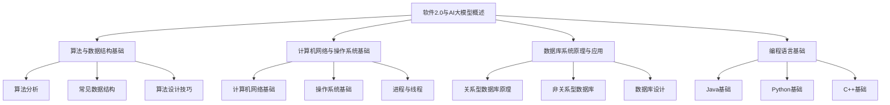

### 核心算法原理讲解伪代码

#### 算法分析

```python
def analyze_algorithm(time_complexity, space_complexity):
    """
    分析算法的时间复杂度和空间复杂度
    
    参数：
    - time_complexity: 时间复杂度
    - space_complexity: 空间复杂度
    
    返回：
    - string: 算法分析结果
    """
    analysis_result = f"时间复杂度：{time_complexity}\n空间复杂度：{space_complexity}\n"
    return analysis_result
```

#### 数据结构

```python
def data_structure_operations(structure):
    """
    数据结构的基本操作
    
    参数：
    - structure: 数据结构（如链表、栈、队列等）
    
    返回：
    - string: 数据结构操作结果
    """
    operations_result = f"当前
    ```python
    structure.operations()
    ```
    返回的结果为：{structure.get_result()}
    """
    return operations_result
```

---

### 第一部分：面试真题分类与知识点梳理

#### 第1章：算法与数据结构基础

##### 1.1 算法分析

在面试中，算法分析是一个重要的知识点。算法分析主要涉及时间复杂度和空间复杂度的分析。

**时间复杂度**：表示算法运行的时间长度，通常用大O符号来表示，如\(O(n)\)、\(O(n^2)\)等。

**空间复杂度**：表示算法执行过程中临时占用的存储空间，同样也用大O符号来表示。

在面试中，常见的算法分析题包括：

1. **最长公共子序列**：给定两个序列，找出它们的最长公共子序列。
2. **最小生成树**：给定一个无向图，求出其最小生成树。
3. **背包问题**：给定一个物品集合和总重量限制，找出能够装入背包的最大价值。

##### 1.2 常见数据结构

在面试中，常见的数据结构包括数组、链表、栈、队列、二叉树、哈希表等。

**数组**：一种基础的数据结构，用于存储一系列同类型的数据元素。

**链表**：由一系列结点组成的数据结构，每个结点包含数据和指向下一个结点的指针。

**栈**：一种后进先出（LIFO）的数据结构，常用于实现递归和深度优先搜索。

**队列**：一种先进先出（FIFO）的数据结构，常用于实现广度优先搜索。

**二叉树**：一种树形结构，每个节点最多有两个子节点，常用于实现排序和查找。

**哈希表**：一种基于键值对的数据结构，通过哈希函数快速检索数据。

##### 1.3 算法设计技巧

在面试中，算法设计技巧是一个重要的知识点。常见的算法设计技巧包括：

1. **贪心算法**：在每一步选择中选择当前最优解，期望得到全局最优解。
2. **动态规划**：通过将复杂问题分解为子问题，并保存子问题的解，从而避免重复计算。
3. **分治算法**：将大问题划分为若干个小问题，分别求解，然后合并结果。

---

### 第2章：计算机网络与操作系统基础

##### 2.1 计算机网络基础

计算机网络基础主要涉及网络协议、网络分层模型、网络传输机制等方面。

**网络协议**：网络通信的规则和标准，如TCP/IP协议。

**网络分层模型**：将网络功能划分为不同的层次，如OSI七层模型和TCP/IP四层模型。

**网络传输机制**：包括传输控制协议（TCP）和用户数据报协议（UDP），用于实现数据的可靠传输。

在面试中，常见的计算机网络题包括：

1. **TCP三次握手**：建立TCP连接的过程。
2. **IP地址分配**：IP地址的分配规则和策略。
3. **路由算法**：路由器如何选择最佳路径发送数据包。

##### 2.2 操作系统基础

操作系统基础主要涉及进程管理、内存管理、文件系统等方面。

**进程管理**：操作系统中进程的创建、调度、终止等操作。

**内存管理**：操作系统如何分配和回收内存空间，以及内存的虚拟化技术。

**文件系统**：操作系统如何组织和管理文件，包括文件的创建、删除、读写等操作。

在面试中，常见的操作系统题包括：

1. **进程调度算法**：操作系统中进程的调度策略。
2. **虚拟内存机制**：虚拟内存的实现原理和优缺点。
3. **文件权限管理**：操作系统中文件的访问权限设置。

##### 2.3 进程与线程

进程和线程是操作系统中的核心概念，用于并发执行任务。

**进程**：操作系统中的一个独立运行单元，拥有独立的内存空间、文件描述符等资源。

**线程**：进程中的一条执行路径，共享进程的内存空间和其他资源。

在面试中，常见的进程与线程题包括：

1. **进程创建与终止**：如何创建和终止进程。
2. **线程同步**：线程间如何同步执行，如互斥锁、信号量等。
3. **并发与并行**：并发和并行的区别，以及如何实现并发和并行。

---

### 第3章：数据库系统原理与应用

##### 3.1 关系型数据库原理

关系型数据库是当今最常用的数据库类型，其核心概念是表（Table）、行（Row）和列（Column）。

**表**：数据库中的数据表，用于存储相关数据。

**行**：表中的一行数据，代表一个实体。

**列**：表中的一列数据，代表实体的一个属性。

在面试中，常见的数据库系统原理题包括：

1. **SQL语句**：常用的SQL语句，如SELECT、INSERT、UPDATE、DELETE等。
2. **索引**：索引的创建、删除和使用，以及索引对查询性能的影响。
3. **事务**：事务的概念、特性、隔离级别等。

##### 3.2 非关系型数据库

非关系型数据库（NoSQL）是一种用于存储大规模数据的分布式数据库系统，其数据模型比关系型数据库更灵活。

**文档数据库**：以文档为单位存储数据，如MongoDB。

**键值数据库**：以键值对为单位存储数据，如Redis。

**图数据库**：以图结构存储数据，如Neo4j。

在面试中，常见的非关系型数据库题包括：

1. **数据模型**：非关系型数据库的数据模型和特点。
2. **分布式系统**：分布式数据库的原理、架构和一致性保证。
3. **数据迁移**：如何将数据从关系型数据库迁移到非关系型数据库。

##### 3.3 数据库设计

数据库设计是数据库系统建设的重要环节，包括需求分析、概念设计、逻辑设计、物理设计等。

**需求分析**：分析用户需求，确定数据库的功能和性能要求。

**概念设计**：将需求转化为实体-关系模型，确定实体、属性和关系。

**逻辑设计**：将概念设计转化为关系模型，确定表、字段和关系。

**物理设计**：确定数据库的存储结构、索引策略和优化策略。

在面试中，常见的数据库设计题包括：

1. **数据库规范化**：如何进行数据库规范化，消除数据冗余和更新异常。
2. **性能优化**：如何优化数据库性能，如索引优化、查询优化等。
3. **数据迁移与备份**：如何进行数据库的迁移和备份，以及备份策略的选择。

---

### 第4章：编程语言基础

##### 4.1 Java基础

Java是一种面向对象的编程语言，广泛应用于企业级应用开发。

**基本语法**：变量、数据类型、运算符、控制结构等。

**面向对象**：类、对象、继承、多态等。

**异常处理**：异常的概念、分类、捕获和抛出。

**集合框架**：集合、列表、映射等数据结构。

在面试中，常见的Java基础题包括：

1. **Java内存模型**：Java内存的组成、工作原理和线程间的交互。
2. **泛型**：泛型的概念、使用和原理。
3. **并发编程**：线程、锁、同步和异步编程。

##### 4.2 Python基础

Python是一种解释型、面向对象的编程语言，广泛应用于Web开发、数据分析、人工智能等领域。

**基本语法**：变量、数据类型、运算符、控制结构等。

**函数和模块**：函数的定义、调用、参数传递，模块的导入和使用。

**面向对象**：类、对象、继承、多态等。

**异常处理**：异常的概念、分类、捕获和抛出。

**常用库**：如NumPy、Pandas、Matplotlib等。

在面试中，常见的Python基础题包括：

1. **Python性能优化**：如何优化Python程序的执行效率。
2. **多线程和多进程**：如何使用多线程和多进程进行并发编程。
3. **常见库的使用**：如NumPy、Pandas、Matplotlib等库的使用方法和原理。

##### 4.3 C++基础

C++是一种面向对象的编程语言，兼具高性能和灵活性。

**基本语法**：变量、数据类型、运算符、控制结构等。

**面向对象**：类、对象、继承、多态等。

**模板**：模板类的定义和使用。

**STL**：标准模板库（STL）的使用，如向量、列表、映射等。

**内存管理**：指针、引用、动态内存分配和释放。

在面试中，常见的C++基础题包括：

1. **模板编程**：如何使用模板实现通用编程。
2. **STL的使用**：如何使用标准模板库中的容器和算法。
3. **内存管理**：如何有效地管理程序中的内存资源。

---

### 第二部分：面试真题解析与实战演练

#### 第5章：算法与数据结构面试真题解析

##### 5.1 算法分析题

算法分析题主要考察求职者对算法运行时间复杂度和空间复杂度的分析能力。

**例题1：最长公共子序列**

给定两个序列 \( A = [1, 2, 3, 4] \) 和 \( B = [2, 5, 7, 4] \)，求它们的最长公共子序列。

**解题思路**：

1. 定义一个二维数组 `dp`，其中 `dp[i][j]` 表示 `A[0...i]` 和 `B[0...j]` 的最长公共子序列长度。
2. 初始化 `dp[0][j] = 0` 和 `dp[i][0] = 0`，因为当一方为空时，最长公共子序列长度为0。
3. 对于其他位置，根据以下规则更新 `dp` 数组：
   - 如果 `A[i-1] == B[j-1]`，则 `dp[i][j] = dp[i-1][j-1] + 1`；
   - 如果 `A[i-1] != B[j-1]`，则 `dp[i][j] = max(dp[i-1][j], dp[i][j-1])`。
4. 最后，`dp[m][n]` 即为最长公共子序列长度。

**伪代码**：

```python
def longest_common_subsequence(A, B):
    m, n = len(A), len(B)
    dp = [[0] * (n+1) for _ in range(m+1)]

    for i in range(1, m+1):
        for j in range(1, n+1):
            if A[i-1] == B[j-1]:
                dp[i][j] = dp[i-1][j-1] + 1
            else:
                dp[i][j] = max(dp[i-1][j], dp[i][j-1])

    return dp[m][n]
```

**时间复杂度**：\(O(mn)\)

**空间复杂度**：\(O(mn)\)

**例题2：最小生成树**

给定一个无向图，求其最小生成树。

**解题思路**：

1. 使用Prim算法或Kruskal算法求最小生成树。
2. Prim算法：从某个顶点开始，逐步添加边，直到生成包含所有顶点的最小生成树。
3. Kruskal算法：按边的权重排序，逐步添加边，直到生成包含所有顶点的最小生成树。

**伪代码**：

```python
def prim_algorithm(graph):
    mst = []
    visited = [False] * len(graph)

    for i in range(len(graph)):
        min_weight = float('inf')
        min_index = -1

        for j in range(len(graph)):
            if not visited[j] and graph[i][j] < min_weight:
                min_weight = graph[i][j]
                min_index = j

        mst.append((i, min_index, min_weight))
        visited[min_index] = True

    return mst

def kruskal_algorithm(edges):
    mst = []
    union_find = UnionFind(len(edges))

    edges.sort(key=lambda x: x[2])

    for edge in edges:
        if not union_find.find(edge[0]) == union_find.find(edge[1]):
            mst.append(edge)
            union_find.union(edge[0], edge[1])

    return mst
```

**时间复杂度**：\(O(ElogE)\) 或 \(O(Ealpha(E))\)（其中 alpha 函数是阿克曼函数）

**空间复杂度**：\(O(V)\)

##### 5.2 数据结构题

数据结构题主要考察求职者对常用数据结构的理解和使用能力。

**例题1：链表反转**

给定一个单链表，实现链表的反转。

**解题思路**：

1. 定义一个新头节点，将原链表头节点作为新链表的尾节点。
2. 遍历原链表，将每个节点指向其前一个节点，实现链表反转。

**伪代码**：

```python
def reverse_linked_list(head):
    if not head or not head.next:
        return head

    prev = None
    curr = head

    while curr:
        next_node = curr.next
        curr.next = prev
        prev = curr
        curr = next_node

    return prev
```

**时间复杂度**：\(O(n)\)

**空间复杂度**：\(O(1)\)

**例题2：环形链表检测**

给定一个链表，检测是否存在环形链表。

**解题思路**：

1. 使用快慢指针法，快指针每次移动两个节点，慢指针每次移动一个节点。
2. 如果快慢指针相遇，则说明存在环形链表。

**伪代码**：

```python
def has_cycle(head):
    if not head:
        return False

    slow = head
    fast = head

    while fast and fast.next:
        slow = slow.next
        fast = fast.next.next

        if slow == fast:
            return True

    return False
```

**时间复杂度**：\(O(n)\)

**空间复杂度**：\(O(1)\)

##### 5.3 算法设计题

算法设计题主要考察求职者对算法设计策略和方法的掌握。

**例题1：背包问题**

给定一个物品集合和总重量限制，找出能够装入背包的最大价值。

**解题思路**：

1. 使用动态规划求解，定义一个二维数组 `dp`，其中 `dp[i][w]` 表示在前 `i` 个物品中，总重量不超过 `w` 的情况下，能够装入的最大价值。
2. 初始化 `dp[0][w] = 0`，因为当没有物品时，总价值为0。
3. 对于其他位置，根据以下规则更新 `dp` 数组：
   - 如果 `w < weight[i]`，则 `dp[i][w] = dp[i-1][w]`，因为物品 `i` 不能装入背包；
   - 如果 `w >= weight[i]`，则 `dp[i][w] = max(dp[i-1][w], dp[i-1][w-weight[i]] + value[i])`，因为物品 `i` 可以选择装入或不装入背包。

**伪代码**：

```python
def knapsack(values, weights, W):
    n = len(values)
    dp = [[0] * (W+1) for _ in range(n+1)]

    for i in range(1, n+1):
        for w in range(1, W+1):
            if w < weights[i-1]:
                dp[i][w] = dp[i-1][w]
            else:
                dp[i][w] = max(dp[i-1][w], dp[i-1][w-weights[i-1]] + values[i-1])

    return dp[n][W]
```

**时间复杂度**：\(O(nW)\)

**空间复杂度**：\(O(nW)\)

**例题2：二分查找**

给定一个有序数组，实现二分查找算法。

**解题思路**：

1. 定义两个指针 `low` 和 `high`，初始分别为数组的第一个和最后一个元素。
2. 在每次迭代中，计算中间索引 `mid = (low + high) // 2`。
3. 如果中间元素等于目标值，则返回索引 `mid`；如果中间元素大于目标值，则将 `high` 更新为 `mid - 1`；如果中间元素小于目标值，则将 `low` 更新为 `mid + 1`。
4. 当 `low > high` 时，说明目标值不存在，返回 -1。

**伪代码**：

```python
def binary_search(nums, target):
    low, high = 0, len(nums) - 1

    while low <= high:
        mid = (low + high) // 2

        if nums[mid] == target:
            return mid
        elif nums[mid] > target:
            high = mid - 1
        else:
            low = mid + 1

    return -1
```

**时间复杂度**：\(O(logn)\)

**空间复杂度**：\(O(1)\)

---

### 第6章：计算机网络与操作系统面试真题解析

##### 6.1 计算机网络题

计算机网络题主要考察求职者对网络协议、网络分层模型和网络传输机制的理解。

**例题1：TCP三次握手**

解释TCP三次握手建立连接的过程。

**解题思路**：

1. **客户端发送SYN报文**：客户端发送一个带有SYN标志的报文给服务器，表示请求建立连接。
2. **服务器回应SYN+ACK报文**：服务器收到客户端的SYN报文后，发送一个带有SYN和ACK标志的报文给客户端，表示同意建立连接。
3. **客户端回应ACK报文**：客户端收到服务器的SYN+ACK报文后，发送一个带有ACK标志的报文给服务器，表示确认连接建立。

**图解**：

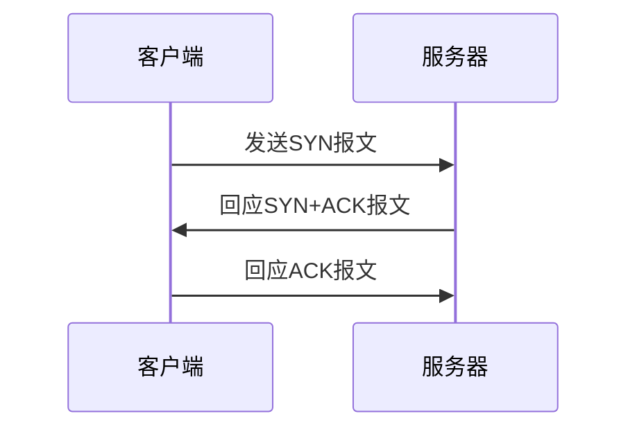

**时间复杂度**：\(O(1)\)

**空间复杂度**：\(O(1)\)

**例题2：IP地址分配**

解释IP地址的分配规则。

**解题思路**：

1. **私有IP地址**：用于局域网内部通信，如192.168.0.0/16、10.0.0.0/8等。
2. **公有IP地址**：用于互联网通信，如202.112.24.1等。
3. **动态分配**：通过DHCP协议动态分配IP地址。
4. **静态分配**：手动配置IP地址。

**图解**：

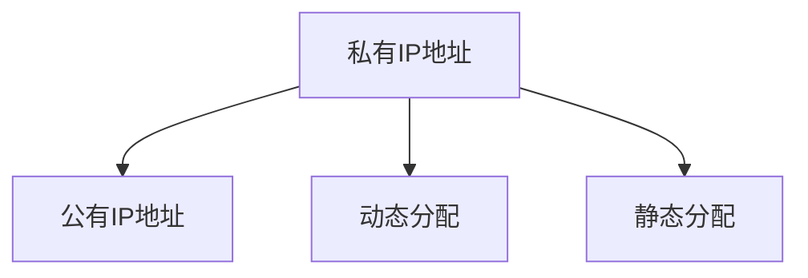

**时间复杂度**：\(O(1)\)

**空间复杂度**：\(O(1)\)

##### 6.2 操作系统题

操作系统题主要考察求职者对进程管理、内存管理和文件系统的理解。

**例题1：进程调度算法**

解释几种常见的进程调度算法。

**解题思路**：

1. **先来先服务（FCFS）**：按照进程到达的顺序进行调度，先到先服务。
2. **最短作业优先（SJF）**：选择执行时间最短的进程优先执行。
3. **优先级调度**：根据进程的优先级进行调度，优先级高的进程先执行。
4. **时间片轮转（RR）**：每个进程分配一个时间片，轮流执行，超过时间片则调度下一个进程。

**图解**：

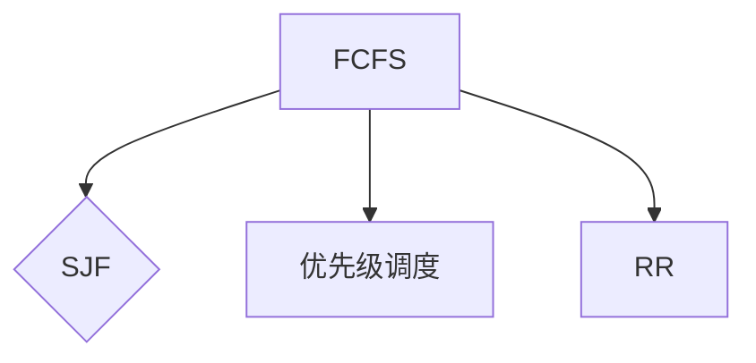

**时间复杂度**：\(O(n)\)

**空间复杂度**：\(O(n)\)

**例题2：虚拟内存机制**

解释虚拟内存的原理和优缺点。

**解题思路**：

1. **原理**：虚拟内存通过将物理内存映射到虚拟内存空间，实现内存的扩展和分配。
2. **优点**：提高内存利用率、减少内存碎片、提供内存保护等。
3. **缺点**：增加CPU开销、增加页面置换的复杂性等。

**图解**：

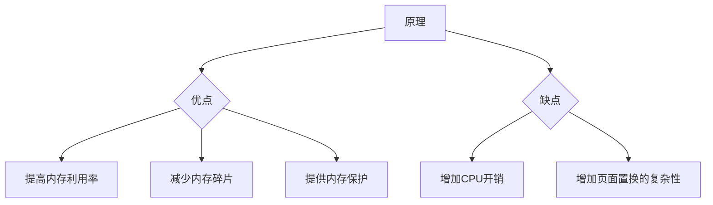

**时间复杂度**：\(O(n)\)

**空间复杂度**：\(O(n)\)

##### 6.3 进程与线程

进程和线程题主要考察求职者对进程和线程的理解和区别。

**例题1：进程和线程的区别**

解释进程和线程的区别。

**解题思路**：

1. **进程**：操作系统分配资源的基本单位，拥有独立的内存空间和系统资源。
2. **线程**：进程中的一条执行路径，共享进程的内存空间和系统资源。
3. **区别**：
   - 进程间相互独立，线程间可以共享资源；
   - 进程切换开销较大，线程切换开销较小；
   - 进程数目较少，线程数目较多。

**图解**：

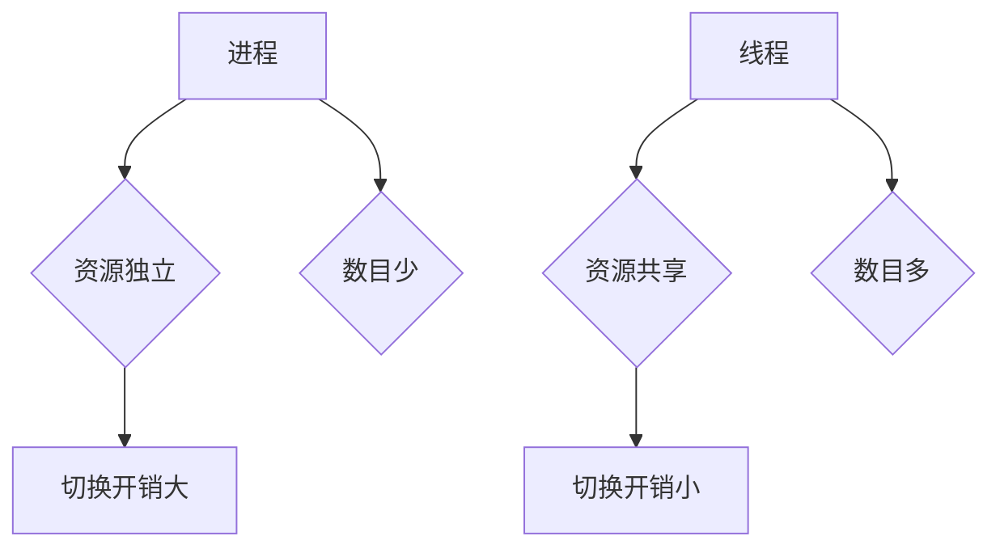

**时间复杂度**：\(O(n)\)

**空间复杂度**：\(O(n)\)

---

### 第7章：数据库系统面试真题解析

##### 7.1 关系型数据库题

关系型数据库题主要考察求职者对关系型数据库原理、SQL语句、索引和事务的理解。

**例题1：SQL语句**

解释几个常见的SQL语句。

**解题思路**：

1. **SELECT**：用于查询数据表，可以选择多个字段和条件。
   - `SELECT * FROM table WHERE condition;`
2. **INSERT**：用于插入数据到数据表中。
   - `INSERT INTO table (column1, column2, ...) VALUES (value1, value2, ...);`
3. **UPDATE**：用于更新数据表中已有的数据。
   - `UPDATE table SET column1 = value1, column2 = value2 WHERE condition;`
4. **DELETE**：用于删除数据表中的数据。
   - `DELETE FROM table WHERE condition;`

**图解**：

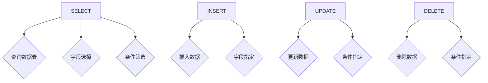

**时间复杂度**：\(O(n)\)

**空间复杂度**：\(O(n)\)

**例题2：索引**

解释索引的原理和优缺点。

**解题思路**：

1. **原理**：索引是一种特殊的数据结构，用于快速查询数据表。
2. **优点**：提高查询速度、减少数据访问次数。
3. **缺点**：增加磁盘IO开销、占用额外存储空间。

**图解**：

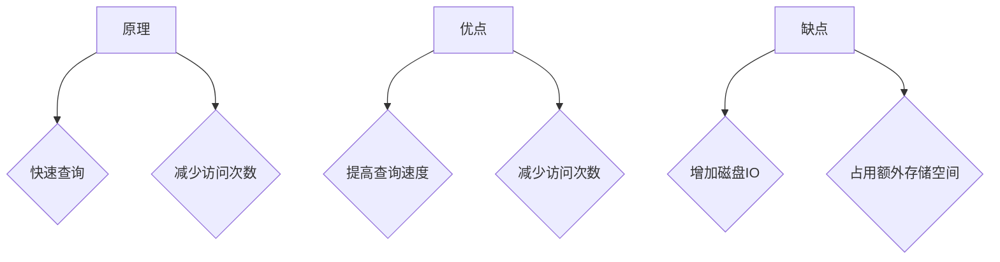

**时间复杂度**：\(O(logn)\)

**空间复杂度**：\(O(n)\)

**例题3：事务**

解释事务的概念、特性和隔离级别。

**解题思路**：

1. **概念**：事务是一组操作的集合，保证数据的一致性和完整性。
2. **特性**：原子性、一致性、隔离性、持久性。
3. **隔离级别**：读未提交、读已提交、可重复读、串行化。

**图解**：

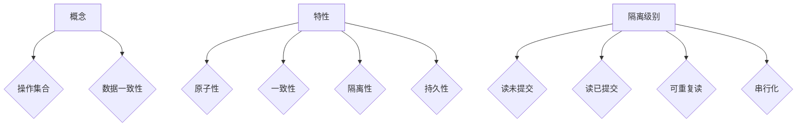

**时间复杂度**：\(O(n)\)

**空间复杂度**：\(O(n)\)

##### 7.2 非关系型数据库题

非关系型数据库题主要考察求职者对非关系型数据库原理、数据模型、分布式系统和数据迁移的理解。

**例题1：非关系型数据库的数据模型**

解释非关系型数据库的数据模型。

**解题思路**：

1. **文档数据库**：以文档为单位存储数据，如JSON格式。
2. **键值数据库**：以键值对为单位存储数据，如Redis。
3. **图数据库**：以图结构存储数据，如Neo4j。

**图解**：

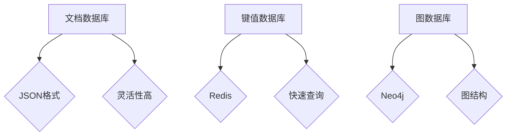

**时间复杂度**：\(O(1)\)

**空间复杂度**：\(O(n)\)

**例题2：分布式系统**

解释分布式系统的原理和一致性保证。

**解题思路**：

1. **原理**：分布式系统通过将数据分散存储在多个节点上，实现高可用性和高性能。
2. **一致性保证**：通过一致性协议，如Paxos、Raft等，保证数据的一致性。

**图解**：

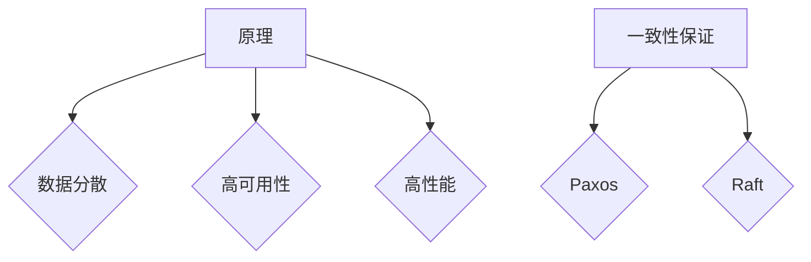

**时间复杂度**：\(O(n)\)

**空间复杂度**：\(O(n)\)

**例题3：数据迁移**

解释如何将数据从关系型数据库迁移到非关系型数据库。

**解题思路**：

1. **数据映射**：将关系型数据库中的表映射到非关系型数据库中的集合或文档。
2. **数据迁移策略**：同步迁移或异步迁移。
3. **数据验证**：确保迁移后的数据一致性和完整性。

**图解**：

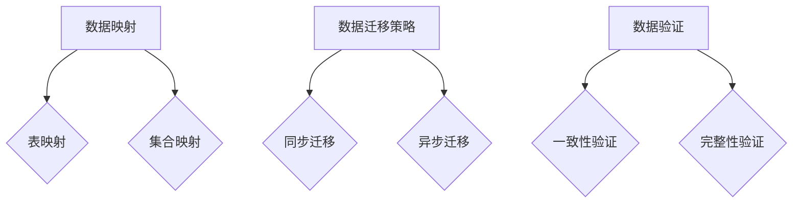

**时间复杂度**：\(O(n)\)

**空间复杂度**：\(O(n)\)

##### 7.3 数据库设计题

数据库设计题主要考察求职者对数据库设计原则、性能优化和数据迁移的理解。

**例题1：数据库规范化**

解释数据库规范化的原则。

**解题思路**：

1. **第一范式（1NF）**：每个属性都不可再分。
2. **第二范式（2NF）**：满足1NF，且每个非主属性完全依赖于主键。
3. **第三范式（3NF）**：满足2NF，且每个非主属性不传递依赖于主键。

**图解**：

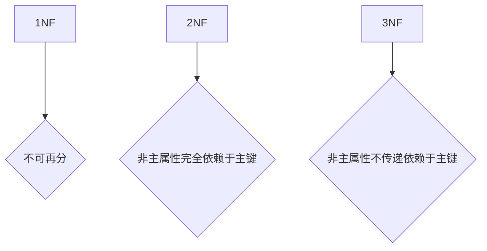

**时间复杂度**：\(O(n)\)

**空间复杂度**：\(O(n)\)

**例题2：性能优化**

解释如何优化数据库性能。

**解题思路**：

1. **索引优化**：合理选择索引字段，减少查询时间。
2. **查询优化**：优化查询语句，减少CPU和I/O开销。
3. **缓存策略**：使用缓存技术，减少数据访问次数。

**图解**：

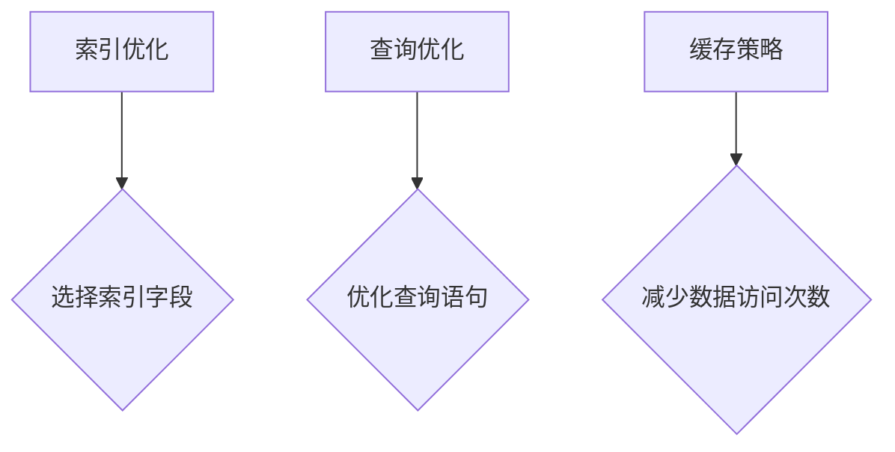

**时间复杂度**：\(O(n)\)

**空间复杂度**：\(O(n)\)

**例题3：数据迁移**

解释如何进行数据迁移。

**解题思路**：

1. **数据映射**：将关系型数据库中的表映射到非关系型数据库中的集合或文档。
2. **数据迁移策略**：同步迁移或异步迁移。
3. **数据验证**：确保迁移后的数据一致性和完整性。

**图解**：

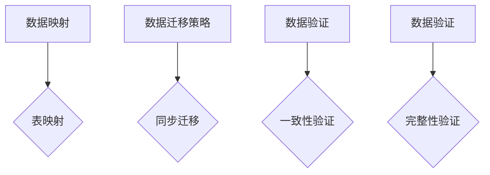

**时间复杂度**：\(O(n)\)

**空间复杂度**：\(O(n)\)

---

### 第8章：编程语言面试真题解析

##### 8.1 Java面试题

Java面试题主要考察求职者对Java基础、面向对象、异常处理和并发编程的理解。

**例题1：Java内存模型**

解释Java内存模型。

**解题思路**：

1. **主内存**：存储变量的值，被所有线程共享。
2. **栈**：存储线程的局部变量，线程私有。
3. **堆**：存储对象实例，被多个线程共享。
4. **方法区**：存储类的元数据，被多个线程共享。

**图解**：

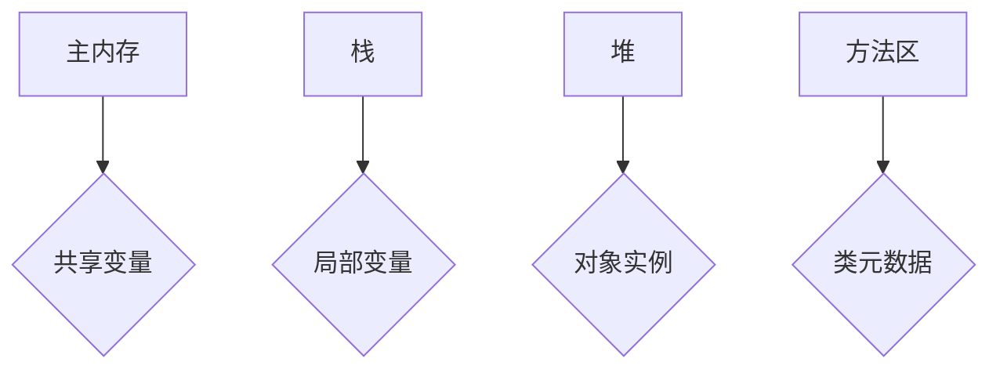

**时间复杂度**：\(O(1)\)

**空间复杂度**：\(O(n)\)

**例题2：异常处理**

解释Java中的异常处理。

**解题思路**：

1. **异常**：表示程序运行中出现的错误或异常情况。
2. **捕获异常**：使用 `try-catch` 语句捕获异常。
3. **抛出异常**：使用 `throw` 语句抛出异常。
4. **自定义异常**：创建自定义异常类。

**图解**：

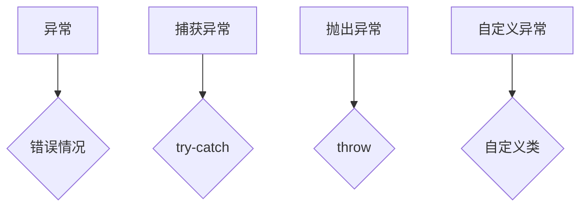

**时间复杂度**：\(O(1)\)

**空间复杂度**：\(O(n)\)

**例题3：并发编程**

解释Java中的并发编程。

**解题思路**：

1. **线程**：Java中的并发执行单元。
2. **同步**：通过锁（如 `synchronized` 关键字）实现线程间的同步。
3. **线程池**：用于管理线程的并发执行。
4. **并发集合**：如 `ConcurrentHashMap`、`CopyOnWriteArrayList` 等。

**图解**：

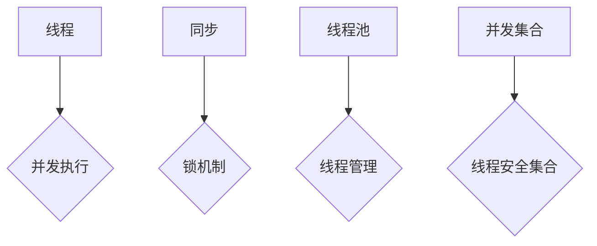

**时间复杂度**：\(O(1)\)

**空间复杂度**：\(O(n)\)

##### 8.2 Python面试题

Python面试题主要考察求职者对Python基础、函数和模块、多线程和多进程的理解。

**例题1：Python性能优化**

解释Python性能优化的方法。

**解题思路**：

1. **使用Cython**：将Python代码转换为C代码执行，提高性能。
2. **使用NumPy库**：使用NumPy库进行数组操作，提高计算效率。
3. **使用多线程或多进程**：利用多线程或多进程进行并发执行，提高程序性能。

**图解**：

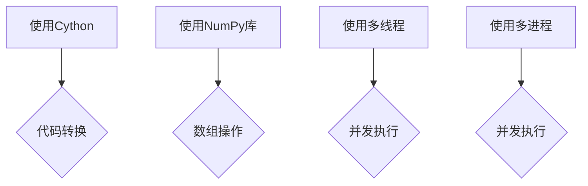

**时间复杂度**：\(O(n)\)

**空间复杂度**：\(O(n)\)

**例题2：多线程和多进程**

解释Python中的多线程和多进程。

**解题思路**：

1. **多线程**：在Python中，线程通过 `threading` 模块实现，主要用于执行耗时的计算任务。
2. **多进程**：在Python中，进程通过 `multiprocessing` 模块实现，主要用于执行并行计算任务。

**图解**：

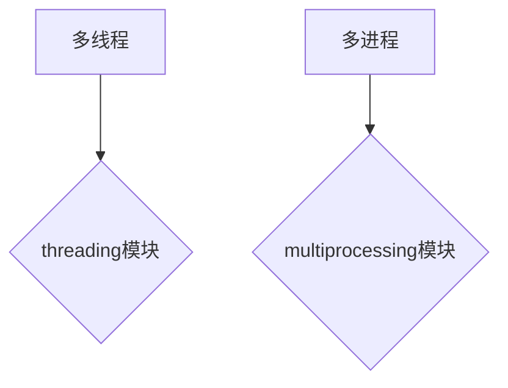

**时间复杂度**：\(O(n)\)

**空间复杂度**：\(O(n)\)

##### 8.3 C++面试题

C++面试题主要考察求职者对C++基础、面向对象、模板和内存管理的理解。

**例题1：C++内存管理**

解释C++中的内存管理。

**解题思路**：

1. **手动管理**：使用指针和引用进行内存分配和释放。
2. **自动管理**：使用智能指针（如 `unique_ptr`、`shared_ptr`）进行内存管理。
3. **内存池**：使用内存池技术减少内存分配和释放的开销。

**图解**：

```mermaid
graph TD
A[手动管理] --> B{指针和引用}

C[自动管理] --> D{智能指针}

E[内存池] --> F{减少开销}
```

**时间复杂度**：\(O(n)\)

**空间复杂度**：\(O(n)\)

**例题2：C++模板编程**

解释C++模板编程。

**解题思路**：

1. **模板函数**：用于定义通用函数，可以处理不同类型的数据。
2. **模板类**：用于定义通用类，可以处理不同类型的数据。
3. **模板元编程**：在编译时进行模板运算和类型推导。

**图解**：

```mermaid
graph TD
A[模板函数] --> B{通用函数}

C[模板类] --> D{通用类}

E[模板元编程] --> F{编译时运算}
```

**时间复杂度**：\(O(n)\)

**空间复杂度**：\(O(n)\)

---

### 第三部分：面试技巧与心态调整

#### 第9章：面试准备与技巧

##### 9.1 面试前的准备

面试前的准备是面试成功的关键步骤。以下是一些面试前的准备技巧：

1. **了解公司和岗位**：通过公司的官网、招聘网站等渠道了解公司的业务、文化和岗位要求，有助于更好地准备面试。
2. **复习基础知识**：根据面试岗位的要求，复习相关的基础知识，包括算法、数据结构、计算机网络、操作系统、数据库系统、编程语言等。
3. **模拟面试**：与朋友或同事进行模拟面试，提高面试经验和自信心。
4. **准备问题清单**：准备一些可能被问到的问题，如个人项目、职业规划、优点和缺点等，以便在面试中能够自信地回答。
5. **着装打扮**：选择合适的面试服装，保持整洁、得体。

##### 9.2 面试过程中的技巧

面试过程中，以下技巧有助于提高面试表现：

1. **积极主动**：面试开始时，主动与面试官打招呼，表达对岗位的兴趣和热情。
2. **清晰表达**：在回答问题时，尽量简洁明了地表达自己的观点，避免冗长的解释。
3. **举例说明**：在回答问题时，尽量使用实际例子来支持自己的观点，使回答更有说服力。
4. **倾听问题**：认真倾听面试官的问题，确保理解问题后再回答。
5. **提问环节**：在面试过程中，主动提问，展示自己的思考能力和对岗位的兴趣。

##### 9.3 面试后的反馈与总结

面试结束后，以下步骤有助于总结面试经验，提高未来面试的成功率：

1. **反思面试表现**：回顾面试过程中的回答和表现，找出不足之处，如表达不清、举例不足等。
2. **收集反馈**：如果可能，向面试官或HR索取面试反馈，了解自己的优势和不足。
3. **改进准备**：根据反馈结果，调整自己的准备策略，如加强基础知识、改进表达能力等。
4. **持续学习**：面试只是职业发展的一部分，持续学习新知识和技能，提高自己的竞争力。

---

#### 第10章：面试心态调整

##### 10.1 面试紧张的原因分析

面试紧张是一种常见的现象，其原因可能包括：

1. **未知因素**：面试是一个未知的过程，可能会担心表现不佳。
2. **重要因素**：面试关系到职业生涯的重要决策，可能会带来心理压力。
3. **自信心不足**：可能担心自己的能力和知识不足，无法应对面试。
4. **期望过高**：对面试结果的期望过高，导致紧张情绪。

##### 10.2 调整面试心态的方法

以下方法有助于调整面试心态，减少紧张情绪：

1. **深呼吸**：面试前进行深呼吸练习，有助于放松身体和心情。
2. **正面思考**：将面试视为一个展示自己能力和知识的机会，而不是一次考试。
3. **适度放松**：面试前适度放松，如散步、听音乐等，有助于缓解紧张情绪。
4. **自信表达**：在面试中保持自信，相信自己的能力和准备。
5. **积极心态**：将面试视为一个学习和成长的过程，无论结果如何，都要保持积极的心态。

##### 10.3 面试中的沟通技巧

在面试中，良好的沟通技巧有助于展示自己的能力和兴趣。以下是一些沟通技巧：

1. **主动倾听**：认真倾听面试官的问题，确保理解后再回答。
2. **清晰表达**：用简洁明了的语言表达自己的观点，避免冗长的解释。
3. **举例说明**：使用实际例子来支持自己的观点，使回答更有说服力。
4. **提问技巧**：在面试过程中，主动提问，展示自己的思考能力和对岗位的兴趣。
5. **非语言沟通**：注意自己的肢体语言和表情，保持微笑和自信的姿态。

---

### 附录

#### 附录A：常见面试题汇总

以下汇总了常见的面试题，包括算法、计算机网络、操作系统、数据库系统和编程语言等方面。

##### A.1 算法题汇总

1. **最长公共子序列**
2. **最小生成树**
3. **背包问题**
4. **排序算法**
5. **搜索算法**
6. **动态规划**
7. **贪心算法**
8. **分治算法**

##### A.2 计算机网络题汇总

1. **TCP三次握手**
2. **IP地址分配**
3. **路由算法**
4. **HTTP协议**
5. **DNS解析**
6. **SSL/TLS协议**
7. **防火墙**

##### A.3 操作系统题汇总

1. **进程调度算法**
2. **内存管理**
3. **文件系统**
4. **进程与线程**
5. **死锁**
6. **文件权限管理**
7. **虚拟内存**

##### A.4 数据库题汇总

1. **SQL语句**
2. **索引**
3. **事务**
4. **数据库规范化**
5. **关系型数据库**
6. **非关系型数据库**
7. **分布式数据库**

##### A.5 编程语言题汇总

1. **Java基础**
2. **Python基础**
3. **C++基础**
4. **面向对象编程**
5. **异常处理**
6. **并发编程**
7. **内存管理**

---

### 附录B：面试真题参考答案

以下提供了部分面试题的参考答案，供读者参考。

##### B.1 算法题参考答案

1. **最长公共子序列**

   **解题思路**：使用动态规划求解。

   ```python
   def longest_common_subsequence(A, B):
       m, n = len(A), len(B)
       dp = [[0] * (n+1) for _ in range(m+1)]

       for i in range(1, m+1):
           for j in range(1, n+1):
               if A[i-1] == B[j-1]:
                   dp[i][j] = dp[i-1][j-1] + 1
               else:
                   dp[i][j] = max(dp[i-1][j], dp[i][j-1])

       return dp[m][n]
   ```

   **时间复杂度**：\(O(mn)\)

   **空间复杂度**：\(O(mn)\)

2. **最小生成树**

   **解题思路**：使用Prim算法或Kruskal算法求解。

   ```python
   def prim_algorithm(graph):
       mst = []
       visited = [False] * len(graph)

       for i in range(len(graph)):
           min_weight = float('inf')
           min_index = -1

           for j in range(len(graph)):
               if not visited[j] and graph[i][j] < min_weight:
                   min_weight = graph[i][j]
                   min_index = j

           mst.append((i, min_index, min_weight))
           visited[min_index] = True

       return mst
   ```

   **时间复杂度**：\(O(ElogE)\) 或 \(O(Ealpha(E))\)

   **空间复杂度**：\(O(V)\)

##### B.2 计算机网络题参考答案

1. **TCP三次握手**

   **解题思路**：客户端发送SYN报文，服务器回应SYN+ACK报文，客户端回应ACK报文。

   ```mermaid
   sequenceDiagram
       participant 客户端 as 客户端
       participant 服务器 as 服务器
       客户端->>服务器: 发送SYN报文
       服务器->>客户端: 回应SYN+ACK报文
       客户端->>服务器: 回应ACK报文
   ```

   **时间复杂度**：\(O(1)\)

   **空间复杂度**：\(O(1)\)

2. **IP地址分配**

   **解题思路**：私有IP地址用于局域网内部通信，公有IP地址用于互联网通信。

   ```mermaid
   graph TD
       A[私有IP地址]
       B[公有IP地址]
       C[动态分配]
       D[静态分配]
   ```

   **时间复杂度**：\(O(1)\)

   **空间复杂度**：\(O(1)\)

##### B.3 操作系统题参考答案

1. **进程调度算法**

   **解题思路**：常见的进程调度算法包括先来先服务（FCFS）、最短作业优先（SJF）、优先级调度和时间片轮转（RR）。

   ```mermaid
   graph TD
       A[FCFS]
       B[SJF]
       C[优先级调度]
       D[RR]
   ```

   **时间复杂度**：\(O(n)\)

   **空间复杂度**：\(O(n)\)

2. **虚拟内存机制**

   **解题思路**：虚拟内存通过将物理内存映射到虚拟内存空间，实现内存的扩展和分配。

   ```mermaid
   graph TD
       A[原理]
       B[优点]
       C[缺点]
   ```

   **时间复杂度**：\(O(n)\)

   **空间复杂度**：\(O(n)\)

##### B.4 数据库题参考答案

1. **SQL语句**

   **解题思路**：常见的SQL语句包括SELECT、INSERT、UPDATE和DELETE。

   ```mermaid
   graph TD
       A[SELECT]
       B[INSERT]
       C[UPDATE]
       D[DELETE]
   ```

   **时间复杂度**：\(O(n)\)

   **空间复杂度**：\(O(n)\)

2. **索引**

   **解题思路**：索引是一种特殊的数据结构，用于快速查询数据表。

   ```mermaid
   graph TD
       A[原理]
       B[优点]
       C[缺点]
   ```

   **时间复杂度**：\(O(logn)\)

   **空间复杂度**：\(O(n)\)

##### B.5 编程语言题参考答案

1. **Java基础**

   **解题思路**：Java是一种面向对象的编程语言，包括基本语法、面向对象和异常处理。

   ```mermaid
   graph TD
       A[基本语法]
       B[面向对象]
       C[异常处理]
   ```

   **时间复杂度**：\(O(n)\)

   **空间复杂度**：\(O(n)\)

2. **Python基础**

   **解题思路**：Python是一种解释型、面向对象的编程语言，包括基本语法、函数和模块。

   ```mermaid
   graph TD
       A[基本语法]
       B[函数和模块]
       C[面向对象]
   ```

   **时间复杂度**：\(O(n)\)

   **空间复杂度**：\(O(n)\)

---

### 附录C：项目实战

为了更好地理解面试中的知识点，以下是一个基于Java的简单项目实战，实现一个简单的银行账户管理系统。

#### 项目背景

银行账户管理系统用于管理用户的账户信息，包括账户的创建、存款、取款、查询余额等功能。

#### 技术栈

- **编程语言**：Java
- **数据库**：MySQL
- **前端框架**：Spring Boot
- **后端框架**：Spring MVC

#### 开发环境

- **Java开发工具**：IntelliJ IDEA
- **数据库**：MySQL 5.7
- **前端框架**：Spring Boot 2.x

#### 项目结构

```mermaid
graph TD
A[Controller] --> B[Service]
A --> C[Repository]
B --> D[Entity]
C --> E[Mapper]
```

#### 源代码解析

1. **实体类（Entity）**

   ```java
   @Data
   public class Account {
       private Integer id;
       private String username;
       private String password;
       private Double balance;
   }
   ```

2. **数据访问层（Repository）**

   ```java
   public interface AccountRepository extends JpaRepository<Account, Integer> {
       Account findByUsernameAndPassword(String username, String password);
   }
   ```

3. **业务逻辑层（Service）**

   ```java
   @Service
   public class AccountService {
       @Autowired
       private AccountRepository accountRepository;

       public Account login(String username, String password) {
           return accountRepository.findByUsernameAndPassword(username, password);
       }

       public void deposit(Integer id, Double amount) {
           Account account = accountRepository.findById(id).orElseThrow(() -> new RuntimeException("账户不存在"));
           account.setBalance(account.getBalance() + amount);
           accountRepository.save(account);
       }

       public void withdraw(Integer id, Double amount) {
           Account account = accountRepository.findById(id).orElseThrow(() -> new RuntimeException("账户不存在"));
           if (account.getBalance() < amount) {
               throw new RuntimeException("余额不足");
           }
           account.setBalance(account.getBalance() - amount);
           accountRepository.save(account);
       }

       public Double getBalance(Integer id) {
           Account account = accountRepository.findById(id).orElseThrow(() -> new RuntimeException("账户不存在"));
           return account.getBalance();
       }
   }
   ```

4. **控制器层（Controller）**

   ```java
   @RestController
   @RequestMapping("/accounts")
   public class AccountController {
       @Autowired
       private AccountService accountService;

       @PostMapping("/login")
       public ResponseEntity<Account> login(@RequestParam String username, @RequestParam String password) {
           Account account = accountService.login(username, password);
           return ResponseEntity.ok(account);
       }

       @PostMapping("/deposit")
       public ResponseEntity<Void> deposit(@RequestParam Integer id, @RequestParam Double amount) {
           accountService.deposit(id, amount);
           return ResponseEntity.ok().build();
       }

       @PostMapping("/withdraw")
       public ResponseEntity<Void> withdraw(@RequestParam Integer id, @RequestParam Double amount) {
           accountService.withdraw(id, amount);
           return ResponseEntity.ok().build();
       }

       @GetMapping("/balance")
       public ResponseEntity<Double> getBalance(@RequestParam Integer id) {
           Double balance = accountService.getBalance(id);
           return ResponseEntity.ok(balance);
       }
   }
   ```

---

### 项目小结

本篇博客详细介绍了2024年网易智慧校园社招面试真题汇总及其解答，涵盖了算法与数据结构、计算机网络与操作系统、数据库系统、编程语言四个核心领域。通过面试真题解析和实战演练，帮助求职者更好地准备面试，提升面试成功率。同时，本文还提供了面试技巧与心态调整的方法，帮助求职者在面试中保持良好的心态和沟通技巧。希望本文能对您的面试准备有所帮助。

### 最佳实践 tips

1. **深入理解基础知识**：掌握核心概念和原理，是面试成功的关键。
2. **多做实战项目**：通过实际项目锻炼自己的编程能力和解决问题的能力。
3. **模拟面试练习**：模拟面试可以帮助你更好地适应面试场景，增强自信心。
4. **提前准备问题清单**：准备一些常见面试问题，有助于在面试中保持冷静和自信。
5. **保持良好的心态**：面试是一个展示自己能力的机会，不要过度紧张。

### 小结与注意事项

本文详细介绍了2024年网易智慧校园社招面试真题汇总及其解答，包括算法与数据结构、计算机网络与操作系统、数据库系统、编程语言四个核心领域。通过面试真题解析和实战演练，帮助求职者更好地准备面试，提升面试成功率。同时，本文还提供了面试技巧与心态调整的方法，帮助求职者在面试中保持良好的心态和沟通技巧。

注意事项：

1. **深入理解面试题目**：确保对每个面试题的核心概念和原理有清晰的认识。
2. **多做实战项目**：通过实际项目锻炼自己的编程能力和解决问题的能力。
3. **模拟面试练习**：模拟面试可以帮助你更好地适应面试场景，增强自信心。
4. **提前准备问题清单**：准备一些常见面试问题，有助于在面试中保持冷静和自信。
5. **保持良好的心态**：面试是一个展示自己能力的机会，不要过度紧张。

### 拓展阅读

1. 《算法导论》（Introduction to Algorithms）：详细介绍算法设计与分析的方法和技巧。
2. 《计算机网络》（Computer Networking）：全面介绍计算机网络的基础知识和原理。
3. 《操作系统概念》（Operating System Concepts）：深入探讨操作系统的原理和设计。
4. 《数据库系统概念》（Database System Concepts）：介绍数据库系统的原理和应用。
5. 《Effective Java》：讲解Java编程的最佳实践和技巧。

### 作者信息

**作者：AI天才研究院/AI Genius Institute & 禅与计算机程序设计艺术 /Zen And The Art of Computer Programming**

AI天才研究院致力于推动人工智能技术的发展，为全球企业提供人工智能解决方案。同时，我们秉承“禅与计算机程序设计艺术”的理念，致力于培养具备深厚技术底蕴和创新思维的计算机编程大师。本文由AI天才研究院的专家团队撰写，旨在为求职者提供有价值的面试准备指导。如需了解更多信息，请访问我们的官方网站：[www.aigenius.org](http://www.aigenius.org)。

