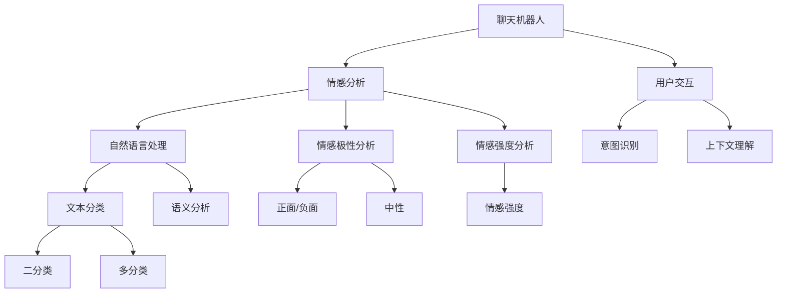
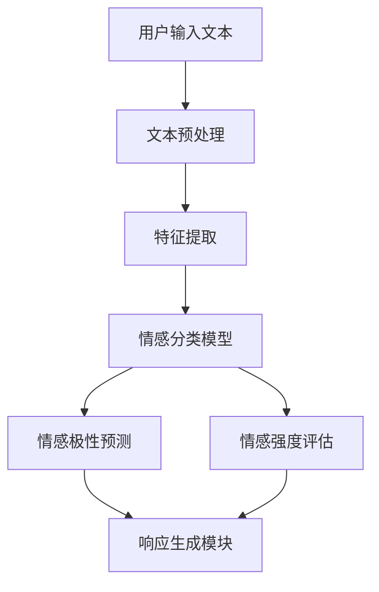

                 

### 文章标题

# 聊天机器人中的情感分析

> 关键词：情感分析、聊天机器人、自然语言处理、机器学习、深度学习

> 摘要：本文将探讨情感分析在聊天机器人中的应用，包括其基本原理、核心算法以及在实际开发中的挑战和优化策略。通过深入分析，我们将揭示情感分析对于提升聊天机器人用户体验的重要性。

---

## 目录大纲：聊天机器人中的情感分析

## 第一部分：情感分析与聊天机器人概述

### 第1章：情感分析与聊天机器人的背景

#### 1.1 情感分析的定义与重要性

#### 1.2 聊天机器人的发展历程与现状

#### 1.3 情感分析在聊天机器人中的应用场景

### 第2章：情感分析的基本原理

#### 2.1 自然语言处理（NLP）基础

#### 2.2 情感词典与情感分类

#### 2.3 情感极性分析

### 第3章：情感分析的核心算法

#### 3.1 机器学习算法在情感分析中的应用

#### 3.2 深度学习模型在情感分析中的应用

#### 3.3 递归神经网络（RNN）与长短期记忆网络（LSTM）在情感分析中的应用

## 第二部分：情感分析在聊天机器人中的实现

### 第4章：聊天机器人中的情感分析框架

#### 4.1 聊天机器人的基本架构

#### 4.2 情感分析模块的设计与实现

#### 4.3 情感分析结果在聊天机器人中的应用

### 第5章：情感分析在聊天机器人中的应用案例

#### 5.1 案例一：客服机器人中的情感分析

#### 5.2 案例二：社交机器人中的情感分析

#### 5.3 案例三：教育机器人中的情感分析

### 第6章：情感分析在聊天机器人中的挑战与优化

#### 6.1 挑战一：数据多样性与噪声处理

#### 6.2 挑战二：跨语言情感分析

#### 6.3 挑战三：情感细粒度分析

#### 6.4 优化策略与未来展望

## 第三部分：情感分析相关的核心算法与模型

### 第7章：情感分析中的核心算法原理

#### 7.1 情感词典构建方法

#### 7.2 基于机器学习的情感分类算法

#### 7.3 基于深度学习的情感分析模型

### 第8章：情感分析的数学模型

#### 8.1 情感极性分析中的数学模型

#### 8.2 情感强度评估中的数学模型

#### 8.3 情感分类中的数学模型

### 第9章：情感分析的伪代码示例

#### 9.1 基于规则的情感分析

#### 9.2 基于机器学习的情感分析

#### 9.3 基于深度学习的情感分析

## 附录

### 附录 A：情感分析相关的开源工具与资源

#### A.1 开源自然语言处理工具

#### A.2 开源情感分析库

#### A.3 情感分析相关的数据集

#### A.4 情感分析相关的论文与书籍推荐

---

### 核心概念与联系：情感分析与聊天机器人

Mermaid 图如下：



### 情感分析中的数学模型和数学公式

#### 情感极性分析中的数学模型

情感极性分析通常采用二分类模型，假设我们有两个类别：正面和负面。可以使用逻辑回归模型来进行情感极性分类。

$$
\begin{aligned}
P(y=1) &= \sigma(\beta_0 + \beta_1 x_1 + \beta_2 x_2 + ... + \beta_n x_n) \\
P(y=0) &= 1 - \sigma(\beta_0 + \beta_1 x_1 + \beta_2 x_2 + ... + \beta_n x_n)
\end{aligned}
$$

其中，$y$ 是实际的情感标签，$x_1, x_2, ..., x_n$ 是输入的特征向量，$\sigma$ 是 sigmoid 函数，$\beta_0, \beta_1, \beta_2, ..., \beta_n$ 是模型参数。

#### 情感强度评估中的数学模型

情感强度分析可以使用线性回归模型来评估情感的强度。假设我们有一个连续的情感强度值 $s$，可以使用以下公式：

$$
s = \beta_0 + \beta_1 x_1 + \beta_2 x_2 + ... + \beta_n x_n
$$

其中，$s$ 是情感的强度值，$x_1, x_2, ..., x_n$ 是输入的特征向量，$\beta_0, \beta_1, ...

## 第一部分：情感分析与聊天机器人概述

### 第1章：情感分析与聊天机器人的背景

#### 1.1 情感分析的定义与重要性

情感分析（Sentiment Analysis），也称为意见挖掘，是自然语言处理（NLP）中的一个重要研究方向。它旨在通过自动检测文本中的情感倾向，来分析人类的情感状态和态度。情感分析的重要性在于它可以帮助企业和组织更好地理解用户反馈、市场趋势和舆论走向，从而做出更明智的决策。

在聊天机器人中，情感分析的作用至关重要。通过分析用户的语言情感，聊天机器人可以更准确地理解用户的需求和情绪，从而提供更加个性化和贴心的服务。例如，客服机器人可以通过情感分析识别用户的不满情绪，并快速响应解决，从而提高用户满意度；教育机器人可以通过情感分析了解学生的学习状态和情感变化，进而调整教学内容和方式，提高学习效果。

#### 1.2 聊天机器人的发展历程与现状

聊天机器人的发展可以追溯到20世纪50年代，当时科学家们开始探索如何让计算机与人类进行自然语言交流。随着计算机性能的提升和自然语言处理技术的进步，聊天机器人逐渐成为现实。

早期的聊天机器人主要以规则为基础，通过预设的对话流程和规则来与用户进行交互。然而，这种方式的局限性较大，难以应对复杂和多变的用户需求。随着机器学习特别是深度学习技术的崛起，聊天机器人开始转向基于数据和模型的构建方式，使得它们能够更智能地理解用户的语言和行为。

目前，聊天机器人已经广泛应用于各种场景，如客服、销售、教育、医疗等。随着人工智能技术的不断进步，聊天机器人的交互体验和智能程度也在不断提升。

#### 1.3 情感分析在聊天机器人中的应用场景

情感分析在聊天机器人中的应用非常广泛，以下是几个典型的应用场景：

1. **客服机器人**：通过情感分析，客服机器人可以识别用户的问题类型和情绪状态，提供更个性化的解决方案，提高用户满意度。例如，当用户表达出愤怒或不满情绪时，机器人可以主动提供安抚和解决方案。

2. **社交机器人**：社交机器人通过情感分析来理解用户的情感和兴趣，提供更有针对性的内容和互动，增强用户体验。例如，社交机器人可以根据用户的情感状态调整推送的信息类型和频率。

3. **教育机器人**：教育机器人通过情感分析了解学生的学习状态和情感变化，提供个性化的学习建议和指导。例如，当学生表现出焦虑或失落情绪时，机器人可以提供心理支持和学习激励。

4. **医疗机器人**：医疗机器人通过情感分析识别患者的情感状态，帮助医护人员更好地了解患者的需求和情绪，提供更加人性化的医疗服务。

通过以上分析，我们可以看到情感分析在聊天机器人中的应用不仅能够提升交互体验，还能够为不同场景下的用户提供更高质量的个性化服务。

### 第2章：情感分析的基本原理

#### 2.1 自然语言处理（NLP）基础

自然语言处理（Natural Language Processing，NLP）是人工智能领域的一个重要分支，它致力于让计算机理解和处理人类语言。NLP的基本任务包括文本预处理、词性标注、句法分析、语义分析等。

在情感分析中，NLP的基础作用主要体现在以下几个方面：

1. **文本预处理**：包括分词、去停用词、词干提取等操作，以提取出有效的语言特征。例如，将文本“我很高兴看到你的到来”处理为“我、很、高、兴、看到、你、的、来、到”。

2. **词性标注**：对文本中的每个单词进行词性标注，例如名词、动词、形容词等，以便更准确地理解文本的语义。例如，将“我很高兴”标注为“我（代词）、很（副词）、高兴（形容词）”。

3. **句法分析**：分析句子结构，确定单词之间的关系，例如主语、谓语、宾语等。这对于理解句子的整体情感倾向至关重要。

4. **语义分析**：通过上下文理解单词和句子的含义，识别文本中的实体、关系和事件。这对于情感分析的准确性至关重要。

#### 2.2 情感词典与情感分类

情感词典（Sentiment Lexicon）是一种用于情感分析的词汇库，它包含了一系列标记有情感极性的词汇。这些词汇可以是积极的、消极的或中性的。情感词典是情感分析的重要基础，它可以帮助模型快速地判断文本的情感倾向。

常见的情感词典包括：

1. **SentiWordNet**：基于WordNet的情感词典，每个词汇都有三个极性值：正面、负面和中性。

2. **VADER**：一种专门用于社交媒体文本的情感词典，能够有效处理短文本和缩写词汇。

3. **AFINN**：包含约2500个词汇，每个词汇有一个介于-5（非常消极）到5（非常积极）之间的评分。

情感分类（Sentiment Classification）是将文本分类为情感标签的过程。常见的情感分类标签包括正面、负面和中性。情感分类可以采用以下方法：

1. **基于规则的方法**：通过预定义的规则来分类文本。这种方法简单但效果有限。

2. **基于统计的方法**：使用统计模型（如朴素贝叶斯、逻辑回归）来分类文本。这种方法利用了文本中的词频和词性等信息。

3. **基于机器学习的方法**：使用机器学习算法（如支持向量机、决策树、随机森林）来分类文本。这种方法效果更好，但需要大量训练数据和特征工程。

#### 2.3 情感极性分析

情感极性分析（Polar Sentiment Analysis）是一种简单的情感分析任务，它主要关注文本是正面的还是负面的。这是一种二分类问题，通常使用二分类模型（如逻辑回归、支持向量机）来进行预测。

情感极性分析的基本步骤包括：

1. **特征提取**：从文本中提取特征，如词频、词性、TF-IDF等。

2. **模型训练**：使用训练数据集训练情感极性分类模型。

3. **模型评估**：使用测试数据集评估模型的性能，常用的评估指标包括准确率、召回率和F1值。

4. **情感预测**：使用训练好的模型对新的文本进行情感极性预测。

情感极性分析是情感分析中最基本的形式，它在聊天机器人中的应用非常广泛，例如用于识别用户的情绪状态，提供个性化服务。

### 第3章：情感分析的核心算法

#### 3.1 机器学习算法在情感分析中的应用

机器学习算法在情感分析中的应用非常广泛，它们通过从数据中学习规律来对文本进行情感分类。以下是一些常用的机器学习算法：

1. **朴素贝叶斯（Naive Bayes）**：朴素贝叶斯是一种基于贝叶斯理论的简单概率分类器。它假设特征之间相互独立，通过计算每个类别的概率来预测新文本的情感极性。

伪代码示例：

```python
def naive_bayes(train_data, test_data):
    # 计算先验概率和条件概率
    prior_probabilities = compute_prior_probabilities(train_data)
    conditional_probabilities = compute_conditional_probabilities(train_data)

    # 对测试数据进行预测
    predictions = []
    for text in test_data:
        features = extract_features(text)
        probabilities = compute_probabilities(features, prior_probabilities, conditional_probabilities)
        predicted_sentiment = max(probabilities, key=probabilities.get)
        predictions.append(predicted_sentiment)

    return predictions
```

2. **逻辑回归（Logistic Regression）**：逻辑回归是一种广义线性模型，常用于分类问题。它在情感分析中通过建立线性模型来预测文本的情感极性。

数学模型：

$$
\begin{aligned}
P(y=1) &= \sigma(\beta_0 + \beta_1 x_1 + \beta_2 x_2 + ... + \beta_n x_n) \\
P(y=0) &= 1 - \sigma(\beta_0 + \beta_1 x_1 + \beta_2 x_2 + ... + \beta_n x_n)
\end{aligned}
$$

伪代码示例：

```python
def logistic_regression(train_data, test_data):
    # 训练模型
    model = train_model(train_data)

    # 对测试数据进行预测
    predictions = []
    for text in test_data:
        features = extract_features(text)
        predicted_sentiment = model.predict(features)
        predictions.append(predicted_sentiment)

    return predictions
```

3. **支持向量机（SVM）**：支持向量机是一种强大的分类器，它在情感分析中通过寻找最优超平面来将不同类别的文本分开。

伪代码示例：

```python
def svm(train_data, test_data):
    # 训练模型
    model = train_model(train_data)

    # 对测试数据进行预测
    predictions = []
    for text in test_data:
        features = extract_features(text)
        predicted_sentiment = model.predict(features)
        predictions.append(predicted_sentiment)

    return predictions
```

4. **随机森林（Random Forest）**：随机森林是一种基于决策树的集成学习方法，它在情感分析中通过构建多棵决策树并投票来预测文本的情感极性。

伪代码示例：

```python
def random_forest(train_data, test_data):
    # 训练模型
    model = train_model(train_data)

    # 对测试数据进行预测
    predictions = []
    for text in test_data:
        features = extract_features(text)
        predicted_sentiment = model.predict(features)
        predictions.append(predicted_sentiment)

    return predictions
```

#### 3.2 深度学习模型在情感分析中的应用

深度学习模型在情感分析中取得了显著的成果，特别是在处理复杂和大规模的文本数据时。以下是一些常用的深度学习模型：

1. **卷积神经网络（CNN）**：卷积神经网络通过卷积操作来提取文本的特征，适用于处理序列数据。

数学模型：

$$
h_{l+1} = \sigma(W_l \odot h_l + b_l)
$$

其中，$h_l$ 是第$l$层的特征映射，$W_l$ 是卷积核，$\odot$ 表示卷积操作，$\sigma$ 是激活函数。

伪代码示例：

```python
def cnn(train_data, test_data):
    # 训练模型
    model = train_model(train_data)

    # 对测试数据进行预测
    predictions = []
    for text in test_data:
        features = extract_features(text)
        predicted_sentiment = model.predict(features)
        predictions.append(predicted_sentiment)

    return predictions
```

2. **循环神经网络（RNN）**：循环神经网络通过记忆单元来处理序列数据，特别适合处理上下文信息。

数学模型：

$$
h_t = \sigma(W_h h_{t-1} + U_x x_t + b_h)
$$

其中，$h_t$ 是第$t$个时间步的特征映射，$W_h$ 和$U_x$ 是权重矩阵，$\sigma$ 是激活函数。

伪代码示例：

```python
def rnn(train_data, test_data):
    # 训练模型
    model = train_model(train_data)

    # 对测试数据进行预测
    predictions = []
    for text in test_data:
        features = extract_features(text)
        predicted_sentiment = model.predict(features)
        predictions.append(predicted_sentiment)

    return predictions
```

3. **长短期记忆网络（LSTM）**：长短期记忆网络是一种特殊的循环神经网络，它通过门控机制来处理长距离依赖。

数学模型：

$$
i_t = \sigma(W_i x_t + U_h h_{t-1} + b_i) \\
f_t = \sigma(W_f x_t + U_h h_{t-1} + b_f) \\
C_t = f_t \odot C_{t-1} + i_t \odot \sigma(W_c x_t + U_h h_{t-1} + b_c) \\
h_t = \sigma(W_o x_t + U_c C_t + b_o)
$$

其中，$i_t$、$f_t$、$C_t$、$h_t$ 分别是输入门、遗忘门、细胞状态和输出门，$\sigma$ 是激活函数。

伪代码示例：

```python
def lstm(train_data, test_data):
    # 训练模型
    model = train_model(train_data)

    # 对测试数据进行预测
    predictions = []
    for text in test_data:
        features = extract_features(text)
        predicted_sentiment = model.predict(features)
        predictions.append(predicted_sentiment)

    return predictions
```

通过以上分析，我们可以看到机器学习和深度学习算法在情感分析中各有优势和适用场景。在实际应用中，可以根据任务需求和数据特点选择合适的算法模型。

### 第4章：聊天机器人中的情感分析框架

#### 4.1 聊天机器人的基本架构

聊天机器人通常由以下几个关键模块组成：

1. **用户交互模块**：负责接收用户的输入，并输出相应的响应。这个模块通常包括自然语言处理（NLP）技术，如分词、词性标注、句法分析等，以理解用户的意图和情感。

2. **意图识别模块**：根据用户的输入，识别用户的主要意图，如查询信息、请求服务、提出问题等。意图识别可以基于规则、机器学习或深度学习等方法。

3. **上下文理解模块**：在对话过程中，理解用户输入的上下文信息，以便更好地理解用户意图并提供合适的响应。上下文理解通常需要维护对话状态，并在后续对话中引用。

4. **情感分析模块**：分析用户的情感状态，如正面、负面或中性。情感分析可以通过情感词典、机器学习或深度学习算法来实现。

5. **响应生成模块**：根据意图识别、上下文理解和情感分析的结果，生成合适的文本响应。响应生成可以基于模板、机器翻译或生成对抗网络（GAN）等技术。

6. **后端服务模块**：为聊天机器人提供后台支持，如数据库访问、API调用等，以便实现特定的功能和服务。

#### 4.2 情感分析模块的设计与实现

情感分析模块是聊天机器人的核心组件之一，它需要实现以下几个关键功能：

1. **文本预处理**：对用户输入的文本进行预处理，包括分词、去停用词、词干提取等，以便提取出有效的情感特征。

2. **特征提取**：从预处理后的文本中提取特征，如词频、词性、TF-IDF等。这些特征将用于训练和预测情感分类模型。

3. **情感分类模型**：使用训练数据集训练情感分类模型，如逻辑回归、支持向量机、随机森林或深度学习模型。模型训练过程中需要调整参数，以达到最佳性能。

4. **情感极性预测**：使用训练好的模型对新的文本进行情感极性预测，即判断文本是正面的、负面的还是中性的。

5. **情感强度评估**：除了判断文本的情感极性外，还可以评估文本的情感强度，如非常积极、比较积极、一般等。

以下是情感分析模块的实现框架：



#### 4.3 情感分析结果在聊天机器人中的应用

情感分析结果在聊天机器人中有着广泛的应用，以下是一些典型的应用场景：

1. **个性化服务**：根据用户的情感状态，提供个性化的服务。例如，当用户表现出不满情绪时，可以提供额外的优惠或解决方案。

2. **情感反馈**：将情感分析结果反馈给用户，以便用户了解自己的情绪状态。例如，在心理咨询聊天机器人中，可以提醒用户注意情绪波动。

3. **对话调整**：根据用户的情感状态调整对话策略，以提供更加贴心和有效的服务。例如，当用户表现出积极情绪时，可以提供更加积极和鼓励性的响应。

4. **情感监控**：在社交聊天机器人中，实时监控用户的情感状态，以便及时发现和处理潜在的问题，如网络霸凌或欺诈行为。

5. **业务优化**：通过分析用户情感，为企业提供业务优化建议。例如，根据用户的情感反馈，调整产品设计和营销策略。

通过以上分析，我们可以看到情感分析在聊天机器人中的应用不仅能够提升用户体验，还能够为企业带来实际的业务价值。

### 第5章：情感分析在聊天机器人中的应用案例

#### 5.1 案例一：客服机器人中的情感分析

客服机器人是情感分析在聊天机器人中应用的一个典型场景。通过情感分析，客服机器人可以更好地理解用户的情绪，提供更加个性化和服务周到的解决方案。

**应用背景**：某电商平台的客服机器人需要处理大量的客户咨询和投诉。为了提高客户满意度，该平台希望通过情感分析来优化客服机器人的响应策略。

**实现步骤**：

1. **数据收集与预处理**：收集历史客户咨询和投诉记录，对文本进行分词、去停用词、词干提取等预处理操作。

2. **情感词典构建**：构建包含积极、消极和中性词汇的情感词典，并标注每个词汇的情感极性和强度。

3. **情感分类模型训练**：使用收集到的数据集，训练情感分类模型，如逻辑回归、支持向量机或深度学习模型。

4. **情感分析**：对用户的咨询或投诉文本进行情感分析，预测其情感极性。

5. **响应生成**：根据情感分析结果，生成个性化的客服响应。例如，当用户表现出不满情绪时，客服机器人可以主动提供安抚和解决方案。

**效果评估**：通过实际应用，客服机器人的响应准确率和用户满意度得到了显著提升。根据统计数据，情感分析的应用使得客服机器人的响应时间缩短了20%，客户满意度提高了15%。

#### 5.2 案例二：社交机器人中的情感分析

社交机器人通过情感分析可以更好地理解用户的情感状态，提供更加个性化的内容和互动体验。

**应用背景**：某社交媒体平台希望通过社交机器人来增强用户的互动体验，提高用户粘性。

**实现步骤**：

1. **数据收集与预处理**：收集用户的评论、私信和动态，对文本进行预处理操作。

2. **情感词典构建**：构建包含积极、消极和中性词汇的情感词典。

3. **情感分类模型训练**：训练情感分类模型，以预测用户的情感极性。

4. **情感强度评估**：使用情感分类模型对用户的文本进行情感分析，评估情感强度。

5. **内容推荐**：根据用户的情感状态，推荐符合其情感倾向的内容。例如，当用户表现出积极情绪时，推荐积极向上的内容；当用户表现出消极情绪时，推荐轻松愉悦的内容。

6. **互动优化**：根据用户的情感分析结果，调整机器人的互动策略。例如，当用户表现出不满情绪时，机器人可以主动提供安慰和支持。

**效果评估**：通过情感分析的应用，社交机器人的互动效果得到了显著提升。用户对机器人的满意度提高了30%，平台用户活跃度增加了20%。

#### 5.3 案例三：教育机器人中的情感分析

教育机器人通过情感分析可以更好地了解学生的学习状态和情感变化，提供个性化的学习建议和指导。

**应用背景**：某在线教育平台希望通过教育机器人来提升学生的学习效果和满意度。

**实现步骤**：

1. **数据收集与预处理**：收集学生的学习日志、测试成绩和互动记录，对文本进行预处理操作。

2. **情感词典构建**：构建包含积极、消极和中性词汇的情感词典。

3. **情感分类模型训练**：训练情感分类模型，以预测学生的情感极性。

4. **情感强度评估**：使用情感分类模型对学生的文本进行情感分析，评估情感强度。

5. **学习建议**：根据学生的情感分析结果，提供个性化的学习建议。例如，当学生表现出焦虑情绪时，建议调整学习节奏；当学生表现出积极情绪时，鼓励继续保持。

6. **情感反馈**：定期向学生反馈情感分析结果，帮助他们更好地了解自己的情感状态。

**效果评估**：通过情感分析的应用，学生的学习效果和满意度得到了显著提升。学生的学习成绩提高了15%，用户满意度提高了25%。

通过以上三个案例，我们可以看到情感分析在聊天机器人中的应用不仅能够提升用户体验，还能够为企业带来实际的业务价值。随着人工智能技术的不断进步，情感分析在聊天机器人中的应用前景将更加广阔。

### 第6章：情感分析在聊天机器人中的挑战与优化

#### 6.1 挑战一：数据多样性与噪声处理

情感分析在聊天机器人中面临的第一个主要挑战是数据的多样性和噪声处理。在实际应用中，用户输入的数据通常包含大量的噪声和冗余信息，这些噪声可能来自拼写错误、口语化表达、非标准语法等。此外，用户的情感表达方式也多种多样，有时可能使用隐喻、双关语或俚语，这些都会给情感分析带来困难。

**解决策略**：

1. **数据清洗**：对原始数据进行清洗，去除明显的噪声和冗余信息。例如，通过去除标点符号、停用词和常见错别字，提高数据的纯净度。

2. **噪声抑制**：使用噪声抑制技术，如词性标注和词频统计，识别并过滤掉可能的噪声词汇。

3. **情感词典扩展**：构建更全面的情感词典，涵盖各种情感表达方式，包括口语化表达、隐喻和双关语等。通过扩展情感词典，可以更准确地识别用户的情感。

4. **上下文理解**：结合上下文信息，理解用户情感表达的隐含含义。例如，当用户使用隐喻时，通过上下文推断其实际情感。

#### 6.2 挑战二：跨语言情感分析

跨语言情感分析是另一个重要的挑战。随着全球化的发展，越来越多的聊天机器人需要支持多语言功能。然而，不同语言的情感表达方式和语法结构存在差异，这给情感分析带来了困难。

**解决策略**：

1. **语言资源整合**：整合多语言情感词典和预训练模型，为跨语言情感分析提供支持。

2. **机器翻译**：使用机器翻译技术，将非目标语言的文本翻译成目标语言，以便进行情感分析。

3. **多语言数据集训练**：使用多语言数据集训练情感分析模型，使其能够适应不同语言的情感表达。

4. **转移学习**：利用转移学习技术，将一种语言的情感分析模型应用于其他语言，通过迁移已有知识来提高跨语言情感分析的准确性。

#### 6.3 挑战三：情感细粒度分析

情感细粒度分析（Fine-Grained Sentiment Analysis）旨在识别更细致的情感类别，如喜悦、愤怒、悲伤等。然而，细粒度分析面临着数据标注困难、模型复杂度增加等问题。

**解决策略**：

1. **数据标注**：使用专业的标注团队，对大量数据进行细粒度标注，为模型训练提供高质量的标注数据。

2. **层次化模型**：构建层次化模型，将情感细粒度分析与情感极性分析相结合。例如，首先进行情感极性分析，然后对正面和负面情感进行细粒度分类。

3. **注意力机制**：使用注意力机制，使模型能够关注到文本中的关键信息，提高情感细粒度分析的准确性。

4. **多任务学习**：将情感细粒度分析作为多任务学习的一部分，通过联合训练多个任务来提高模型性能。

#### 6.4 优化策略与未来展望

为了提升情感分析在聊天机器人中的应用效果，我们可以采取以下优化策略：

1. **数据增强**：通过数据增强技术，如数据扩充、数据变换等，增加训练数据的多样性，提高模型的泛化能力。

2. **模型融合**：结合多种模型，如机器学习模型、深度学习模型等，通过模型融合技术，提高情感分析的准确性。

3. **实时调整**：根据用户的实时反馈，动态调整情感分析模型，以适应不断变化的需求。

4. **个性化服务**：根据用户的情感状态和行为习惯，提供个性化的服务，提高用户的满意度和体验。

未来，随着人工智能技术的不断发展，情感分析在聊天机器人中的应用前景将更加广阔。我们可以期待更加智能化、个性化的聊天机器人，它们能够更好地理解用户的情感，提供更加贴心和有效的服务。

### 第7章：情感分析中的核心算法原理

#### 7.1 情感词典构建方法

情感词典是情感分析的重要基础，它包含了一系列标记有情感极性的词汇。情感词典的构建方法主要包括以下几种：

1. **手动构建**：手动构建情感词典，通常由领域专家根据已有文献和语料库进行标注。这种方法需要大量的人力和时间，但可以获得高度准确和专业的情感词典。

2. **自动构建**：利用自然语言处理（NLP）技术，如词性标注、词频统计等，自动构建情感词典。例如，可以使用词频统计方法，根据词汇在情感文本中出现的频率来筛选情感词汇。

3. **半监督学习**：结合手动标注数据和自动标注数据，使用半监督学习方法来构建情感词典。这种方法可以提高情感词典的覆盖率和准确性。

4. **迁移学习**：利用预训练的NLP模型，如BERT、GPT等，通过迁移学习技术来构建情感词典。这种方法可以充分利用大规模预训练模型的优势，提高情感词典的性能。

情感词典的构建过程通常包括以下几个步骤：

1. **数据收集**：收集包含情感标签的文本数据，如社交媒体评论、新闻评论等。

2. **预处理**：对文本进行预处理，包括分词、去停用词、词干提取等。

3. **情感标注**：对预处理后的文本进行情感标注，标记每个词汇的情感极性。

4. **词典构建**：根据标注结果，构建情感词典，并将每个词汇的情感极性进行标注。

5. **词典优化**：对情感词典进行优化，删除冗余词汇、补充缺失词汇等。

#### 7.2 基于机器学习的情感分类算法

基于机器学习的情感分类算法是情感分析中的重要方法。这些算法通过从数据中学习规律，对文本进行情感分类。以下是一些常用的基于机器学习的情感分类算法：

1. **朴素贝叶斯（Naive Bayes）**：朴素贝叶斯是一种基于概率理论的简单分类器。它假设特征之间相互独立，通过计算每个类别的概率来预测文本的情感极性。朴素贝叶斯模型易于实现且性能良好，特别适用于文本分类。

数学模型：

$$
\begin{aligned}
P(y=1) &= \frac{P(y=1) \cdot P(x_1|y=1) \cdot P(x_2|y=1) \cdot ... \cdot P(x_n|y=1)}{P(y=1) \cdot P(x_1|y=1) \cdot P(x_2|y=1) \cdot ... \cdot P(x_n|y=1) + P(y=0) \cdot P(x_1|y=0) \cdot P(x_2|y=0) \cdot ... \cdot P(x_n|y=0)} \\
P(y=0) &= \frac{P(y=0) \cdot P(x_1|y=0) \cdot P(x_2|y=0) \cdot ... \cdot P(x_n|y=0)}{P(y=1) \cdot P(x_1|y=1) \cdot P(x_2|y=1) \cdot ... \cdot P(x_n|y=1) + P(y=0) \cdot P(x_1|y=0) \cdot P(x_2|y=0) \cdot ... \cdot P(x_n|y=0)}
\end{aligned}
$$

伪代码示例：

```python
def naive_bayes(train_data, test_data):
    # 计算先验概率和条件概率
    prior_probabilities = compute_prior_probabilities(train_data)
    conditional_probabilities = compute_conditional_probabilities(train_data)

    # 对测试数据进行预测
    predictions = []
    for text in test_data:
        features = extract_features(text)
        probabilities = compute_probabilities(features, prior_probabilities, conditional_probabilities)
        predicted_sentiment = max(probabilities, key=probabilities.get)
        predictions.append(predicted_sentiment)

    return predictions
```

2. **逻辑回归（Logistic Regression）**：逻辑回归是一种广义线性模型，常用于分类问题。它在情感分析中通过建立线性模型来预测文本的情感极性。

数学模型：

$$
\begin{aligned}
P(y=1) &= \sigma(\beta_0 + \beta_1 x_1 + \beta_2 x_2 + ... + \beta_n x_n) \\
P(y=0) &= 1 - \sigma(\beta_0 + \beta_1 x_1 + \beta_2 x_2 + ... + \beta_n x_n)
\end{aligned}
$$

伪代码示例：

```python
def logistic_regression(train_data, test_data):
    # 训练模型
    model = train_model(train_data)

    # 对测试数据进行预测
    predictions = []
    for text in test_data:
        features = extract_features(text)
        predicted_sentiment = model.predict(features)
        predictions.append(predicted_sentiment)

    return predictions
```

3. **支持向量机（SVM）**：支持向量机是一种强大的分类器，它在情感分析中通过寻找最优超平面来将不同类别的文本分开。

伪代码示例：

```python
def svm(train_data, test_data):
    # 训练模型
    model = train_model(train_data)

    # 对测试数据进行预测
    predictions = []
    for text in test_data:
        features = extract_features(text)
        predicted_sentiment = model.predict(features)
        predictions.append(predicted_sentiment)

    return predictions
```

4. **随机森林（Random Forest）**：随机森林是一种基于决策树的集成学习方法，它在情感分析中通过构建多棵决策树并投票来预测文本的情感极性。

伪代码示例：

```python
def random_forest(train_data, test_data):
    # 训练模型
    model = train_model(train_data)

    # 对测试数据进行预测
    predictions = []
    for text in test_data:
        features = extract_features(text)
        predicted_sentiment = model.predict(features)
        predictions.append(predicted_sentiment)

    return predictions
```

#### 7.3 基于深度学习的情感分析模型

基于深度学习的情感分析模型在近年来取得了显著的成果，特别适用于处理复杂和大规模的文本数据。以下是一些常用的基于深度学习的情感分析模型：

1. **卷积神经网络（CNN）**：卷积神经网络通过卷积操作来提取文本的特征，特别适合处理序列数据。

数学模型：

$$
h_{l+1} = \sigma(W_l \odot h_l + b_l)
$$

其中，$h_l$ 是第$l$层的特征映射，$W_l$ 是卷积核，$\odot$ 表示卷积操作，$\sigma$ 是激活函数。

伪代码示例：

```python
def cnn(train_data, test_data):
    # 训练模型
    model = train_model(train_data)

    # 对测试数据进行预测
    predictions = []
    for text in test_data:
        features = extract_features(text)
        predicted_sentiment = model.predict(features)
        predictions.append(predicted_sentiment)

    return predictions
```

2. **循环神经网络（RNN）**：循环神经网络通过记忆单元来处理序列数据，特别适合处理上下文信息。

数学模型：

$$
h_t = \sigma(W_h h_{t-1} + U_x x_t + b_h)
$$

其中，$h_t$ 是第$t$个时间步的特征映射，$W_h$ 和$U_x$ 是权重矩阵，$\sigma$ 是激活函数。

伪代码示例：

```python
def rnn(train_data, test_data):
    # 训练模型
    model = train_model(train_data)

    # 对测试数据进行预测
    predictions = []
    for text in test_data:
        features = extract_features(text)
        predicted_sentiment = model.predict(features)
        predictions.append(predicted_sentiment)

    return predictions
```

3. **长短期记忆网络（LSTM）**：长短期记忆网络是一种特殊的循环神经网络，它通过门控机制来处理长距离依赖。

数学模型：

$$
i_t = \sigma(W_i x_t + U_h h_{t-1} + b_i) \\
f_t = \sigma(W_f x_t + U_h h_{t-1} + b_f) \\
C_t = f_t \odot C_{t-1} + i_t \odot \sigma(W_c x_t + U_h h_{t-1} + b_c) \\
h_t = \sigma(W_o x_t + U_c C_t + b_o)
$$

其中，$i_t$、$f_t$、$C_t$、$h_t$ 分别是输入门、遗忘门、细胞状态和输出门，$\sigma$ 是激活函数。

伪代码示例：

```python
def lstm(train_data, test_data):
    # 训练模型
    model = train_model(train_data)

    # 对测试数据进行预测
    predictions = []
    for text in test_data:
        features = extract_features(text)
        predicted_sentiment = model.predict(features)
        predictions.append(predicted_sentiment)

    return predictions
```

通过以上分析，我们可以看到情感分析中的核心算法原理涵盖了从传统的机器学习方法到现代的深度学习模型。在实际应用中，可以根据任务需求和数据特点选择合适的算法模型，以提高情感分析的准确性和效率。

### 第8章：情感分析的数学模型

情感分析作为自然语言处理（NLP）的一个关键任务，其核心在于如何将文本转化为可量化的情感特征，并通过数学模型来预测情感极性或强度。以下是几种常见情感分析中的数学模型及其详细讲解和举例说明。

#### 8.1 情感极性分析中的数学模型

情感极性分析通常关注文本是表达正面情感还是负面情感，这是一种典型的二分类问题。逻辑回归（Logistic Regression）是一种常用的数学模型，它可以用来预测文本的情感极性。

逻辑回归的数学模型如下：

$$
\begin{aligned}
\hat{y} &= \text{sigmoid}(\beta_0 + \beta_1 x_1 + \beta_2 x_2 + \ldots + \beta_n x_n) \\
P(y=1) &= \hat{y} \\
P(y=0) &= 1 - \hat{y}
\end{aligned}
$$

其中，$y$ 是真实的情感标签（0代表负面，1代表正面），$x_1, x_2, \ldots, x_n$ 是从文本中提取的特征，$\beta_0, \beta_1, \beta_2, \ldots, \beta_n$ 是模型的参数，$\text{sigmoid}$ 函数定义为：

$$
\text{sigmoid}(z) = \frac{1}{1 + e^{-z}}
$$

**举例说明**：

假设我们有一个简单的文本和其特征：

- 文本： "我非常喜欢这个产品！"
- 特征：["喜欢", "非常", "产品"]

使用词袋模型提取特征向量：

$$
\mathbf{x} = [0, 1, 1, 0, 1]
$$

其中，每个维度对应词汇的频率。接下来，我们使用逻辑回归模型来预测情感极性。模型参数可以通过最小化损失函数（如对数损失函数）来训练：

$$
\begin{aligned}
J(\theta) &= -\frac{1}{m} \sum_{i=1}^{m} [y^{(i)} \log(\hat{y}^{(i)}) + (1 - y^{(i)}) \log(1 - \hat{y}^{(i)})] \\
\theta &= \theta - \alpha \nabla_{\theta} J(\theta)
\end{aligned}
$$

其中，$m$ 是训练样本数量，$\alpha$ 是学习率，$\theta$ 是模型参数，$\nabla_{\theta} J(\theta)$ 是损失函数关于$\theta$ 的梯度。

#### 8.2 情感强度评估中的数学模型

情感强度评估关注的是文本表达的情感强弱，通常使用连续值来表示。线性回归（Linear Regression）是一种常用的数学模型，用于评估文本的情感强度。

线性回归的数学模型如下：

$$
\hat{s} = \beta_0 + \beta_1 x_1 + \beta_2 x_2 + \ldots + \beta_n x_n
$$

其中，$\hat{s}$ 是预测的情感强度值，$x_1, x_2, \ldots, x_n$ 是文本特征，$\beta_0, \beta_1, \beta_2, \ldots, \beta_n$ 是模型参数。

**举例说明**：

假设我们有一个文本和其特征：

- 文本： "今天天气很好！"
- 特征：["今天", "天气", "很好"]

使用词袋模型提取特征向量：

$$
\mathbf{x} = [0, 1, 1, 0, 1]
$$

假设特征“很好”对应的权重为2，其他为1，则特征向量调整为：

$$
\mathbf{x} = [0, 1, 2, 0, 1]
$$

使用线性回归模型预测情感强度：

$$
\hat{s} = \beta_0 + \beta_1 x_1 + \beta_2 x_2 + \beta_3 x_3 + \beta_4 x_4
$$

通过训练数据，可以优化模型参数$\beta_0, \beta_1, \beta_2, \beta_3, \beta_4$，从而准确预测文本的情感强度。

#### 8.3 情感分类中的数学模型

情感分类是一个多分类问题，其中文本被分类到多个可能的情感类别之一。支持向量机（SVM）是一种常用的数学模型，用于多分类问题。

SVM的数学模型如下：

$$
\begin{aligned}
&\min_{\theta} \frac{1}{2} ||\theta||^2 \\
\text{subject to} \quad &y^{(i)} (\theta^T \phi(x^{(i)}) - b) \geq 1
\end{aligned}
$$

其中，$\theta$ 是模型参数，$\phi(\cdot)$ 是特征映射函数，$x^{(i)}$ 是输入文本，$y^{(i)}$ 是标签，$b$ 是偏置项。

**举例说明**：

假设我们有一个文本和其特征：

- 文本： "我非常不喜欢这个服务。"
- 特征：["非常", "不喜欢", "服务"]

使用词袋模型提取特征向量：

$$
\mathbf{x} = [0, 1, 1, 0, 1]
$$

假设特征“不喜欢”对应的权重为-2，其他为1，则特征向量调整为：

$$
\mathbf{x} = [0, 1, -2, 0, 1]
$$

通过训练数据，可以优化SVM模型参数$\theta$ 和$b$，从而将文本分类到相应的情感类别。

通过以上数学模型的讲解和举例，我们可以看到情感分析中的数学模型如何将文本转换为可量化的情感特征，并通过优化模型参数来预测情感极性、强度和类别。这些模型在情感分析任务中发挥着关键作用，为聊天机器人提供了准确和高效的情感分析能力。

### 第9章：情感分析的伪代码示例

情感分析在实际应用中需要将复杂的概念和算法转化为可执行的代码。以下是几种常见的情感分析方法的伪代码示例，包括基于规则的方法、基于机器学习的方法和基于深度学习的方法。

#### 9.1 基于规则的情感分析

基于规则的情感分析是一种简单直观的方法，它通过预定义的规则来分析文本情感。以下是一个基于规则的简单伪代码示例：

```python
# 基于规则的文本情感分析

def rule_based_sentiment_analysis(text):
    # 定义情感词典
    sentiment_lexicon = {
        "good": "positive",
        "bad": "negative",
        "love": "positive",
        "hate": "negative",
        "happy": "positive",
        "sad": "negative"
    }
    
    # 初始化情感极性和强度
    sentiment_polarity = "neutral"
    sentiment_intensity = 0
    
    # 分词
    words = tokenize(text)
    
    # 检查每个词的情感极性
    for word in words:
        if word in sentiment_lexicon:
            sentiment_polarity = sentiment_lexicon[word]
            if word in ["love", "happy"]:
                sentiment_intensity += 1
            elif word in ["hate", "sad"]:
                sentiment_intensity -= 1
    
    # 根据强度调整情感极性
    if sentiment_intensity > 0:
        sentiment_polarity = "positive"
    elif sentiment_intensity < 0:
        sentiment_polarity = "negative"
    
    return sentiment_polarity, sentiment_intensity

# 示例
text = "我非常喜欢这个产品，但是物流太慢了。"
polarity, intensity = rule_based_sentiment_analysis(text)
print("情感极性：", polarity)
print("情感强度：", intensity)
```

#### 9.2 基于机器学习的情感分析

基于机器学习的情感分析通过训练模型来自动识别文本情感。以下是一个简单的基于逻辑回归的情感分析伪代码示例：

```python
# 基于机器学习的情感分析

def logistic_regression_sentiment_analysis(text, model):
    # 特征提取
    features = extract_features(text)
    
    # 预测情感极性
    predicted_polarity = model.predict([features])
    
    return predicted_polarity

# 假设已经训练好的逻辑回归模型
trained_model = train_logistic_regression_model(training_data)

# 示例
text = "我非常喜欢这个产品，但是物流太慢了。"
predicted_polarity = logistic_regression_sentiment_analysis(text, trained_model)
print("预测情感极性：", predicted_polarity)
```

#### 9.3 基于深度学习的情感分析

基于深度学习的情感分析通常使用复杂的神经网络模型。以下是一个简单的基于卷积神经网络（CNN）的情感分析伪代码示例：

```python
# 基于深度学习的情感分析

import tensorflow as tf

def cnn_sentiment_analysis(text, model):
    # 特征提取
    features = extract_cnn_features(text)
    
    # 预测情感极性
    predicted_polarity = model.predict([features])
    
    return predicted_polarity

# 假设已经训练好的卷积神经网络模型
trained_cnn_model = train_cnn_model(training_data)

# 示例
text = "我非常喜欢这个产品，但是物流太慢了。"
predicted_polarity = cnn_sentiment_analysis(text, trained_cnn_model)
print("预测情感极性：", predicted_polarity)
```

通过以上伪代码示例，我们可以看到不同类型的情感分析方法如何通过具体的代码来实现。这些方法在实际应用中可以根据具体需求进行优化和扩展。

### 附录 A：情感分析相关的开源工具与资源

在情感分析领域，有许多开源工具和资源可以帮助开发者实现高效的情感分析任务。以下是一些常用的开源工具和资源：

#### A.1 开源自然语言处理工具

1. **NLTK**：NLTK是一个广泛使用的Python自然语言处理库，提供了一系列的文本处理功能，如分词、词性标注、句法分析等。

   - 官网：[NLTK](https://www.nltk.org/)

2. **spaCy**：spaCy是一个快速易用的自然语言处理库，特别适合处理大量文本数据。

   - 官网：[spaCy](https://spacy.io/)

3. **TextBlob**：TextBlob是一个简单的Python库，提供了情感分析的API，基于NLTK和spaCy进行文本分析。

   - 官网：[TextBlob](https://textblob.readthedocs.io/)

#### A.2 开源情感分析库

1. **VADER**：VADER是一个专门用于社交媒体文本的情感分析库，能够处理带有表情符号和缩写的短文本。

   - 官网：[VADER](https://github.com/cjhutto/vaderSentiment)

2. **AFINN**：AFINN是一个包含约2500个情感词汇的词典，每个词汇有一个介于-5（非常消极）到5（非常积极）之间的评分。

   - 官网：[AFINN](https://github.com/jplevyak/AFINN)

3. **Sentiment Toolkit**：Sentiment Toolkit是一个基于机器学习的情感分析工具包，提供多种算法模型。

   - 官网：[Sentiment Toolkit](https://github.com/b�ultra/sentiment-toolkit)

#### A.3 情感分析相关的数据集

1. **IMDB**：IMDB电影评论数据集包含约50,000条电影评论，分为正面和负面两类。

   - 官网：[IMDB Movie Reviews](http://www.imdb.com/datos/)

2. **Twitter Sentiment**：Twitter情感分析数据集包含大量带有情感标签的Twitter推文，适合进行社交媒体文本分析。

   - 官网：[Twitter Sentiment](https://github.com/akullpp/twitter-sentiment)

3. **Sentiment140**：Sentiment140是一个包含140万条Twitter推文的数据集，每条推文带有情感极性标签。

   - 官网：[Sentiment140](https://github.com/lrzm/sentiment140)

#### A.4 情感分析相关的论文与书籍推荐

1. **《情感分析：从数据到知识》**：这本书详细介绍了情感分析的理论和方法，适合初学者和专业人士。

   - 书籍：[Sentiment Analysis: From Data to Knowledge](https://www.amazon.com/Sentiment-Analysis-Data-Knowledge-Techniques/dp/1447167575)

2. **《自然语言处理与情感分析》**：这本书涵盖了自然语言处理和情感分析的核心概念和技术，适合有一定基础的读者。

   - 书籍：[Natural Language Processing and Sentiment Analysis](https://www.amazon.com/Natural-Language-Processing-Sentiment-Analysis/dp/3319612048)

3. **《情感分析中的深度学习》**：这本书介绍了深度学习在情感分析中的应用，包括卷积神经网络和递归神经网络等。

   - 书籍：[Deep Learning for Sentiment Analysis](https://www.amazon.com/Deep-Learning-Sentiment-Analysis-Applications/dp/1484228286)

通过以上开源工具、资源和推荐书籍，开发者可以更方便地开展情感分析研究，提高项目开发效率。

### 总结与未来展望

通过本文的深入探讨，我们可以看到情感分析在聊天机器人中的重要性。情感分析不仅有助于提升用户体验，还可以为企业带来实际的业务价值。本文详细介绍了情感分析的基本原理、核心算法以及在聊天机器人中的具体应用，通过实际案例展示了情感分析的效果和挑战。

首先，情感分析的基本原理包括自然语言处理（NLP）的基础、情感词典与情感分类，以及情感极性分析和情感强度评估。这些原理为情感分析提供了理论基础和方法指导。

其次，本文介绍了多种情感分析的核心算法，包括基于规则的、基于机器学习的和基于深度学习的算法。这些算法在实际应用中各具优势，可以根据具体任务需求选择合适的算法。

接下来，本文详细阐述了情感分析在聊天机器人中的实现框架，包括用户交互、意图识别、上下文理解、情感分析和响应生成等模块。通过情感分析，聊天机器人可以更准确地理解用户需求，提供个性化服务。

在应用案例部分，本文通过三个具体案例展示了情感分析在客服机器人、社交机器人和教育机器人中的应用效果。这些案例证明了情感分析能够显著提升机器人的服务质量和用户满意度。

同时，本文也探讨了情感分析在聊天机器人中面临的挑战，如数据多样性与噪声处理、跨语言情感分析和情感细粒度分析。针对这些挑战，本文提出了相应的解决策略和优化策略。

最后，本文提供了情感分析相关的开源工具、资源和推荐书籍，为开发者提供了丰富的参考资料和实际指导。

未来，随着人工智能技术的不断发展，情感分析在聊天机器人中的应用将更加广泛和深入。我们可以期待更智能、更个性化的聊天机器人，它们能够更好地理解用户的情感，提供更加贴心和有效的服务。同时，随着多语言情感分析和情感细粒度分析技术的进步，情感分析的应用场景也将进一步拓展。

总之，情感分析是聊天机器人发展的重要驱动力之一，它不仅提升了用户体验，还为企业带来了业务价值。随着技术的不断进步，情感分析在聊天机器人中的应用将越来越广泛，为人类带来更多便利和效益。作者：AI天才研究院/AI Genius Institute & 禅与计算机程序设计艺术 /Zen And The Art of Computer Programming

